# Inside PlumePilot

## Anatomia di una browser extension reale

**JavaScript, WebExtensions, DOM, API, asincronia e software engineering attraverso un progetto reale.**

Edizione completa in un singolo file Markdown. Per una lettura capitolo per capitolo visita la [sezione Inside PlumePilot](docs/inside-plumepilot/).

### Snapshot di riferimento

- Capitoli 00–10: PlumePilot 2.35.1 — `a8007425f81792e7570516dbdf1e7fb2cbda4d53`
- Capitoli 11–12: candidato UI/UX 2.35.2 — `4d32a8c2a6cd291e4fe389bdf10fdbaf1856a8c2`
- Capitoli 13–17: candidato release 2.35.2 — `f6fcb4c29c83ba9150df0be31da04fc91dffb634`

---

# 00 — Introduzione: dal problema al prodotto

## Perché studiare proprio PlumePilot?

Molti corsi di programmazione insegnano un concetto attraverso esempi costruiti apposta per essere semplici:

```js
fetch('/api/users')
  .then(response => response.json())
  .then(users => console.log(users));
```

L'esempio è utile per imparare `fetch`, ma elimina quasi tutti i problemi che rendono interessante il software reale:

- chi decide quando eseguire la richiesta?
- cosa succede se la pagina cambia nel frattempo?
- dove conserviamo il risultato?
- quanto possiamo fidarci del dato ricevuto?
- cosa accade se due parti dell'applicazione avviano la stessa operazione?
- come comunichiamo il risultato a una UI che vive in un altro contesto?
- cosa succede in Firefox se l'API usata in Chrome non è disponibile allo stesso modo?

PlumePilot contiene tutte queste domande perché non è nato come esercizio didattico. È nato da problemi concreti: avanzare tra attività di un corso, organizzare materiali, creare quiz consultabili offline, generare PDF ed EPUB, osservare cambiamenti nello stato degli esami e offrire tutto questo in tre browser diversi.

Per questo il progetto è un buon laboratorio: i concetti non vengono aggiunti artificialmente alla spiegazione. Sono già lì perché il problema li ha resi necessari.

---

## Da script utile a piccolo sistema software

All'inizio è naturale immaginare una browser extension come “JavaScript che gira sopra una pagina”.

Questa descrizione smette presto di essere sufficiente.

L'attuale PlumePilot contiene, tra le altre cose:

- un popup dell'estensione;
- un background/service worker;
- più gruppi di content script caricati in momenti e contesti differenti;
- un bridge tra il runtime dell'estensione e il runtime della pagina;
- storage persistente;
- coordinamento di operazioni lunghe;
- generatori separati per PDF, EPUB e quiz;
- un menu fluttuante inserito nelle pagine supportate;
- compatibilità con Chrome, Edge e Firefox;
- un processo di build e validazione delle release.

Quindi una prima idea fondamentale è questa:

> **Una browser extension non è necessariamente un singolo programma. Può essere un insieme di piccoli programmi che vivono in contesti differenti e devono coordinarsi.**

Il `manifest.json` è il documento che dice al browser quali pezzi esistono e quando devono essere caricati.

Sarà il punto di partenza del Capitolo 1.

---

## Il tema ricorrente: dove vive la verità?

Durante tutto il libro torneremo spesso a una domanda:

> Qual è la nostra *source of truth*?

Supponiamo che nella UI del corso un capitolo mostri `80%`.

Quel numero potrebbe essere utile per capire che probabilmente c'è qualcosa da completare. Ma è sufficiente per decidere esattamente quale attività aprire?

Non necessariamente.

Potremmo avere contemporaneamente:

```text
DOM visibile
    ↓
percentuale del capitolo

risposta API
    ↓
stato delle lezioni

cache PlumePilot
    ↓
informazioni già osservate
```

Tre fonti diverse, con costi e livelli di affidabilità diversi.

Uno dei passaggi più interessanti nello sviluppo della ricerca della prima attività incompleta è stato proprio smettere di trattare una singola fonte come risposta universale e usare invece alcune informazioni come **indice** per decidere dove verificare.

Questa distinzione è generalizzabile ben oltre PlumePilot:

> Un'informazione può non essere abbastanza affidabile da essere la verità finale, ma essere abbastanza affidabile da ridurre enormemente lo spazio di ricerca.

È il tipo di scelta che incontriamo nei sistemi distribuiti, nelle cache, nei motori di ricerca e nei database indicizzati.

---

## Il secondo tema: il tempo

Nel software sincrono da manuale, una cosa succede dopo l'altra.

Nel browser, invece:

- una pagina carica;
- un content script parte;
- una risposta API arriva;
- l'utente apre o chiude un capitolo;
- il video termina;
- il popup viene chiuso e riaperto;
- un timer scade;
- una scheda viene ricaricata;
- il background può essere sospeso e riattivato.

La correttezza non dipende soltanto da **cosa** fa il codice, ma anche da **quando** accadono gli eventi.

Per questo parleremo molto di:

- Promise;
- eventi;
- timeout;
- polling;
- lease;
- serializzazione;
- race condition;
- cancellazione;
- idempotenza.

Il monitor della commissione è un ottimo esempio. Nel codice reale, `bridge.js` non si limita a dire “controlla la commissione”: prima chiede al background il diritto temporaneo di eseguire il controllo, riceve un `leaseId`, effettua l'operazione e infine rilascia il lease.

Non è burocrazia. È coordinamento concorrente.

---

## Il terzo tema: i confini

PlumePilot vive contemporaneamente vicino a tre sistemi:

```text
┌────────────────────┐
│ Browser / Extension│
│ API                │
└─────────┬──────────┘
          │
          │
┌─────────▼──────────┐
│ PlumePilot         │
└─────────┬──────────┘
          │
          │
┌─────────▼──────────┐
│ Multiversity       │
│ pagina + servizi   │
└────────────────────┘
```

Ogni confine introduce regole diverse.

Il codice della pagina può accedere agli oggetti JavaScript della pagina, ma non automaticamente alle API privilegiate dell'estensione. Un content script isolato può usare API dell'estensione, ma non condivide lo stesso scope JavaScript della pagina. Il background può coordinare l'estensione, ma non può manipolare direttamente il DOM di una scheda.

Molte scelte architetturali di PlumePilot sono conseguenze di questi confini.

---

## Da backend developer: un'analogia utile

Senza prenderla troppo alla lettera, puoi iniziare a pensare ad alcuni componenti così:

```text
Popup / Floating UI
        ↓
   presentation
        ↓
Bridge / messaging
        ↓
 application boundary
        ↓
Background coordinator
        ↓
 state / orchestration
```

E la pagina Multiversity può essere vista contemporaneamente come:

- una UI esterna da osservare e modificare;
- un client di API che possiamo comprendere osservandone il comportamento;
- una fonte di eventi;
- un ambiente JavaScript separato.

L'analogia con un backend a servizi non è perfetta, ma è utile: invece di function call dirette tra tutti i componenti, spesso abbiamo messaggi e contratti.

---

## Cosa significa “finished” per questo libro

Il software non è mai definitivamente immobile. Browser, piattaforme e requisiti cambiano.

Per noi “PlumePilot finito” significa qualcosa di più pratico:

- il prodotto ha un perimetro funzionale maturo;
- le principali decisioni architetturali sono osservabili;
- esiste una storia sufficiente di bug, regressioni e miglioramenti;
- possiamo studiare il sistema senza inseguire continuamente una nuova feature fondamentale.

Questo rende possibile passare da **costruire** il progetto a **comprenderlo sistematicamente**.

---

## Come useremo il codice

Non commenteremo migliaia di righe in ordine.

Partiremo invece da domande.

Per esempio:

> Cosa succede quando clicco l'icona di PlumePilot?

oppure:

> Come fa PlumePilot a comunicare con una funzione che esiste nel contesto JavaScript della pagina?

oppure:

> Perché una percentuale di progresso può accelerare una ricerca pur non essendo affidabile al 100%?

Solo dopo andremo nel codice necessario a rispondere.

Questa è una modalità di lettura molto più vicina a quella usata quando si entra in un codebase reale.

---

## Concetti da portarsi dietro

**Source of truth**  
La fonte che consideriamo autorevole per uno stato o una decisione.

**Boundary**  
Il confine tra due componenti o runtime che non possono condividere tutto direttamente.

**Message passing**  
Comunicazione tramite messaggi invece di chiamate di funzione nello stesso contesto.

**Race condition**  
Un errore o comportamento imprevisto che dipende dall'ordine temporale di operazioni concorrenti.

**Idempotenza**  
Proprietà per cui ripetere un'operazione non produce effetti ulteriori indesiderati.

**Graceful degradation**  
Capacità di continuare a funzionare, magari con meno funzionalità, quando una capacità non è disponibile.

Li incontreremo di nuovo nel codice, non soltanto nel glossario.

---

## Prima di proseguire

Apri mentalmente una nuova domanda:

> Se `popup.js`, `background.js`, `bridge.js` e `content.js` sono tutti JavaScript, perché PlumePilot non potrebbe semplicemente mettere tutto in un solo file?

Il Capitolo 1 nasce dalla risposta.

---

# 01 — Anatomia di PlumePilot

## Cosa succede quando l'estensione prende vita?

Una browser extension non parte da `main()`.

Non esiste necessariamente un unico punto di ingresso. Il browser legge invece un file speciale, `manifest.json`, e da lì scopre **quali componenti deve creare, dove devono vivere e quando devono essere eseguiti**.

Nel nostro snapshot di riferimento, il manifest inizia così:

```json
{
  "manifest_version": 3,
  "name": "PlumePilot – Assistente per Multiversity",
  "version": "2.35.1"
}
```

`manifest_version: 3` ci dice che stiamo usando il modello moderno delle extension Chromium e delle WebExtensions compatibili.

Ma le righe realmente interessanti arrivano poco dopo.

---

## 1. Il manifest come mappa del sistema

Nel `manifest.json` di PlumePilot troviamo quattro famiglie importanti:

```text
manifest.json
├── action
│   └── popup.html
│
├── background
│   └── background.js (+ script di supporto)
│
├── content_scripts
│   ├── MAIN world
│   └── ISOLATED world
│
└── web_accessible_resources
    └── asset utilizzabili dalle pagine supportate
```

Questa è già una prima lezione architetturale:

> Il browser crea confini prima ancora che il nostro codice inizi a girare.

Non possiamo comprendere PlumePilot guardando soltanto le funzioni. Dobbiamo capire **in quale runtime** gira ogni funzione.

---

## 2. Il popup: una pagina dell'estensione

Il manifest dichiara:

```json
"action": {
  "default_title": "PlumePilot – Assistente per Multiversity",
  "default_popup": "popup.html"
}
```

Quando premiamo l'icona di PlumePilot, il browser apre `popup.html`, che carica la logica del popup.

È importante capire cosa *non* è il popup.

Non è un elemento HTML inserito nella pagina Multiversity.

È una pagina appartenente all'estensione, con un proprio documento, un proprio ciclo di vita e accesso alle API permesse all'estensione.

Quando il popup viene aperto, `popup.js` ricostruisce buona parte dello stato visibile leggendo `chrome.storage.local`:

```js
chrome.storage.local.get(
  {
    enabled: true,
    stopAtTests: false,
    autoplaySkipCompletedVideos: false,
    themePreference: "system",
    menuSize: "medium",
    floatingMenuEnabled: true,
    commissionCheckEnabled: false,
    // ...
  },
  (result) => {
    // aggiorna la UI
  },
);
```

File reale: `popup.js`, circa righe 1308–1375 nello snapshot di riferimento.

### Perché ricostruire lo stato?

Perché il popup è **effimero**.

L'utente può aprirlo, chiuderlo e riaprirlo. Non è una buona idea trattare le variabili JavaScript del popup come memoria persistente dell'estensione.

Da backend developer puoi pensare al popup più come a una view che viene ricostruita partendo dallo stato persistente che come a un processo centrale sempre vivo.

Questa scelta anticipa un concetto che approfondiremo nel capitolo sullo storage:

> La lifetime di una UI non coincide necessariamente con la lifetime dello stato dell'applicazione.

---

## 3. Il background: il coordinatore che non vede il DOM

Nel manifest troviamo:

```json
"background": {
  "scripts": [
    "achievements.js",
    "commission-state.js",
    "sound-settings.js",
    "whats-new.js",
    "background.js"
  ],
  "service_worker": "background.js"
}
```

Questa configurazione serve alla base multipiattaforma.

Nel modello Manifest V3 di Chrome, `background.js` viene usato come **extension service worker**. Firefox supporta la forma `scripts` per il background. La stessa base sorgente può quindi essere trasformata dal processo di build nel pacchetto più adatto al browser.

Il ruolo concettuale del background è più importante del dettaglio di packaging:

> Il background coordina attività che appartengono all'estensione nel suo insieme, non a una singola pagina visualizzata.

Per esempio, alla fine di `background.js` troviamo un vero dispatcher di messaggi:

```js
chrome.runtime.onMessage.addListener((message, sender, sendResponse) => {
  let action = null;

  if (message?.type === "PEGASO_GET_OPERATION")
    action = reconcileOperationOwner();
  else if (message?.type === "PEGASO_START_EXPORT")
    action = startExport({ ...message, sourceTabId });
  else if (message?.type === "PEGASO_CANCEL_EXPORT")
    action = cancelExport(message);
  else if (message?.type === "PEGASO_COMMISSION_CHECK_CLAIM")
    action = claimCommissionCheck(sourceTabId, message.platformId);

  // ...

  action.then(sendResponse).catch(/* ... */);
  return true;
});
```

File reale: `background.js`, circa righe 918–945.

Questa forma assomiglia molto a un router o controller backend:

```text
message.type
    ↓
dispatcher
    ↓
handler
    ↓
risposta asincrona
```

Non è HTTP, ma il modello mentale è sorprendentemente simile.

### Ma allora perché il background non fa tutto?

Perché non vive nel DOM della pagina.

Se deve sapere quali lezioni sono renderizzate, leggere un bottone della pagina o osservare uno stato JavaScript del sito, ha bisogno di codice che viva nella scheda.

Ed entrano in scena i content script.

---

## 4. Content script: JavaScript dentro una pagina, ma non necessariamente *della* pagina

Il manifest di PlumePilot registra diversi gruppi di `content_scripts`.

Uno di essi carica:

```json
{
  "js": ["commission-interceptor.js"],
  "run_at": "document_start",
  "all_frames": false,
  "world": "MAIN"
}
```

Un altro carica:

```json
{
  "js": [
    "commission-state.js",
    "sound-settings.js",
    "bridge.js"
  ],
  "run_at": "document_start",
  "all_frames": false
}
```

Qui `world` non è specificato, quindi il content script usa normalmente il mondo **ISOLATED**.

Questa differenza è fondamentale.

---

## 5. MAIN world e ISOLATED world

Immagina la pagina Multiversity come una stanza con lo stesso tavolo — il DOM — ma due serie separate di variabili JavaScript.

```text
                 stesso DOM
                    │
        ┌───────────┴───────────┐
        │                       │
   MAIN world              ISOLATED world
        │                       │
 codice pagina            content script
 + content.js             bridge.js
 + interceptor            floating-menu.js
        │                       │
        └──── window.postMessage ────┘
```

### MAIN world

Il codice gira nello stesso ambiente JavaScript della pagina.

Questo è utile quando PlumePilot deve osservare o interagire con comportamenti che appartengono direttamente all'applicazione web.

Ma c'è un prezzo: quel codice non gode automaticamente dell'isolamento e delle API privilegiate tipiche del content script.

### ISOLATED world

Il codice condivide il documento e quindi può lavorare sul DOM, ma il proprio scope JavaScript è separato da quello della pagina.

In compenso è il posto adatto per usare API dell'estensione come `chrome.storage` e `chrome.runtime`.

Questa riga di commento dentro `content.js` racconta l'architettura quasi meglio del manifest:

```js
// Receives the enabled/paused state from bridge.js, which runs in the
// extension's isolated world and therefore has access to chrome.storage.
```

File reale: `content.js`, circa righe 248–249.

Subito dopo `content.js` ascolta messaggi provenienti dallo stesso `window`:

```js
window.addEventListener("message", (event) => {
  if (event.source !== window) return;
  if (!event.data) return;

  // interpreta i messaggi del bridge
});
```

Abbiamo quindi un pattern deliberato:

```text
ISOLATED world
bridge.js
    │
    │ window.postMessage(...)
    ▼
MAIN world
content.js / interceptor
```

E viceversa.

---

## 6. Perché serve `bridge.js`?

Il nome non è metaforico. È davvero un ponte.

Prendiamo il controllo della commissione.

`bridge.js` può parlare con il background:

```js
chrome.runtime.sendMessage({
  type: "PEGASO_COMMISSION_CHECK_CLAIM",
  platformId: PLATFORM_ID,
}, (response) => {
  // ...
});
```

Ma quando deve chiedere al codice che vive nel `MAIN` world di effettuare un'operazione legata alla pagina, usa:

```js
window.postMessage({
  type: COMMISSION_REQUEST,
  requestId: leaseId,
  expiresAt,
}, "*");
```

Possiamo rappresentare il flusso così:

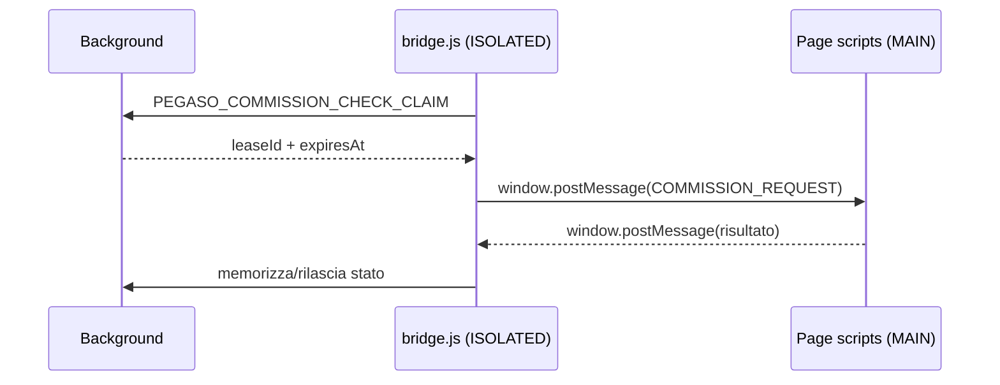
```mermaid
sequenceDiagram
    participant B as Background
    participant Br as bridge.js (ISOLATED)
    participant P as Page scripts (MAIN)

    Br->>B: PEGASO_COMMISSION_CHECK_CLAIM
    B-->>Br: leaseId + expiresAt
    Br->>P: window.postMessage(COMMISSION_REQUEST)
    P-->>Br: window.postMessage(risultato)
    Br->>B: memorizza/rilascia stato
```

Questo è **message passing tra boundary**.

Se tutti i componenti vivessero nello stesso scope, potremmo chiamare una funzione direttamente:

```js
requestCommissionData();
```

Ma qui i runtime sono separati. Il messaggio diventa il contratto.

---

## 7. Popup → scheda: un altro tipo di messaggio

Il popup deve anche interrogare direttamente la scheda attiva.

In `popup.js` troviamo:

```js
chrome.tabs.sendMessage(
  tabId,
  { type: "PEGASO_COURSE_PROGRESS_STATUS_REQUEST" },
  { frameId: 0 },
  (response) => {
    if (chrome.runtime.lastError || !response?.status) return;
    renderCourseProgress(response.status);
  },
);
```

Qui non stiamo usando `window.postMessage`.

Perché?

Perché mittente e destinatario non sono due world JavaScript della stessa pagina: il mittente è una **extension page** (`popup`) e il destinatario è un content script nella tab.

Quindi abbiamo già almeno due bus di comunicazione differenti:

```text
chrome.runtime / chrome.tabs messaging
    → tra componenti dell'estensione

window.postMessage
    → tra world JavaScript nella stessa pagina
```

Questa distinzione sarà il cuore del Capitolo 2.

---

## 8. Un diagramma più completo

A questo punto possiamo costruire una prima mappa utile dell'architettura.

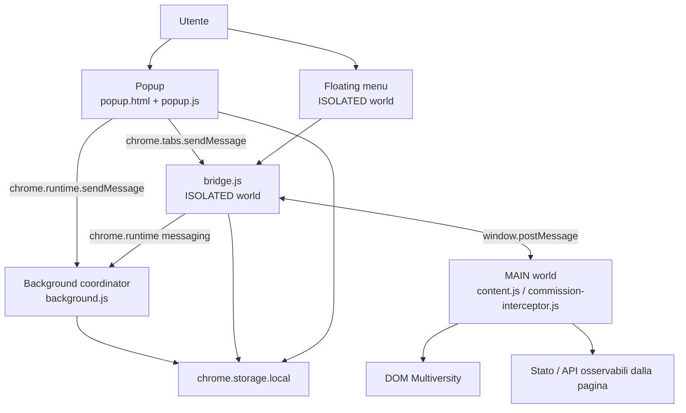
```mermaid
flowchart TD
    U[Utente] --> P[Popup<br/>popup.html + popup.js]
    U --> F[Floating menu<br/>ISOLATED world]

    P -->|chrome.runtime.sendMessage| B[Background coordinator<br/>background.js]
    P -->|chrome.tabs.sendMessage| Br[bridge.js<br/>ISOLATED world]

    F --> Br
    Br -->|chrome.runtime messaging| B

    Br <-->|window.postMessage| M[MAIN world<br/>content.js / commission-interceptor.js]

    M --> D[DOM Multiversity]
    M --> A[Stato / API osservabili dalla pagina]

    B --> S[chrome.storage.local]
    Br --> S
    P --> S
```

Non è ancora la mappa completa di tutte le feature, ma è sufficiente per rispondere alla domanda iniziale:

> Perché non possiamo mettere tutto in un singolo file?

Perché le responsabilità richiedono **privilegi, lifetime e ambienti di esecuzione differenti**.

---

## 9. `run_at`: anche *quando* conta

I content script non sono caricati tutti nello stesso momento.

PlumePilot usa sia:

```json
"run_at": "document_start"
```

sia:

```json
"run_at": "document_idle"
```

`document_start` è utile quando dobbiamo essere presenti molto presto nel ciclo di vita della pagina. `document_idle` è adatto quando possiamo aspettare che il documento sia sostanzialmente pronto.

Per esempio, `commission-interceptor.js` viene caricato nel `MAIN` world a `document_start`.

Questo suggerisce una regola generale:

> Se devi osservare un comportamento della pagina che potrebbe avvenire molto presto, arrivare dopo significa potenzialmente perdere l'evento.

Al contrario, una UI che dipende da elementi già presenti nella pagina può spesso aspettare `document_idle`.

Quindi il manifest non specifica soltanto **dove** eseguire il codice. Specifica anche **quando** inserirlo nella vita del documento.

---

## 10. `all_frames`: una pagina non è sempre un solo documento

Alcuni gruppi di script usano:

```json
"all_frames": true
```

Questo ricorda che una tab può contenere iframe e quindi più documenti.

È facile dire “lo script gira nella pagina”, ma tecnicamente la domanda più corretta è:

> In quale frame del tab gira?

Nel popup, quando PlumePilot invia alcune richieste alla tab, specifica esplicitamente:

```js
{ frameId: 0 }
```

cioè il frame principale.

È un dettaglio apparentemente piccolo, ma previene ambiguità quando la stessa estensione può essere caricata in più frame.

---

## 11. `web_accessible_resources`: asset dell'estensione visibili alla pagina

Il manifest espone anche alcune risorse, per esempio immagini della modalità Gaming, font e audio.

Non tutto ciò che è contenuto nel pacchetto di un'estensione deve essere automaticamente raggiungibile da una pagina web.

`web_accessible_resources` dichiara esplicitamente quali file possono essere richiesti dai contesti corrispondenti ai pattern indicati.

Questo è un altro esempio del principio del **least privilege**:

> esponi ciò che serve, non l'intero pacchetto.

Lo stesso principio tornerà quando parleremo di `permissions` e `host_permissions`.

---

## 12. Permessi: ciò che PlumePilot può fare non è implicito

Nello snapshot corrente il manifest dichiara:

```json
"permissions": ["storage"]
```

oltre a `host_permissions` per host necessari alla gestione di materiali e risorse.

Le extension API sono capability esplicite. Questo è diverso da una normale pagina web, dove il codice parte già all'interno del modello di sicurezza dell'origine del sito.

Quando progetteremo mentalmente una feature, una buona domanda sarà sempre:

> In quale contesto dovrebbe vivere questa funzione e qual è il minimo privilegio necessario?

Questa domanda spesso determina l'architettura prima ancora del codice.

---

## 13. Un caso concreto: il popup vuole mostrare il progresso

Seguiamo finalmente un piccolo percorso end-to-end.

### Passo 1 — l'utente apre il popup

Il browser crea `popup.html` e viene eseguito `popup.js`.

### Passo 2 — il popup ricostruisce preferenze persistenti

```text
popup.js
    ↓
chrome.storage.local.get(...)
    ↓
render della UI
```

### Passo 3 — individua la tab attiva

Nel codice troviamo:

```js
chrome.tabs.query({ active: true, currentWindow: true }, ...)
```

### Passo 4 — chiede lo stato del corso

```text
popup
  │
  │ PEGASO_COURSE_PROGRESS_STATUS_REQUEST
  ▼
content script della tab
```

tramite `chrome.tabs.sendMessage`.

### Passo 5 — riceve lo stato e renderizza

```js
renderCourseProgress(response.status);
```

### Passo 6 — resta in ascolto

Il popup registra anche:

```js
chrome.runtime.onMessage.addListener(...)
```

per aggiornarsi quando riceve nuovi stati mentre è aperto.

Quindi il popup non “possiede” il progresso. Lo **visualizza**.

Questo è un ottimo esempio di separazione tra stato e presentazione.

---

## 14. Da backend developer: tre analogie

### `chrome.runtime.onMessage` come router interno

Puoi pensare ai `message.type` come a endpoint logici:

```text
PEGASO_START_EXPORT
PEGASO_CANCEL_EXPORT
PEGASO_GET_OPERATION
...
```

Non sono URL, ma identificano comandi e richieste.

### Il background come application service

Coordina operazioni, storage e ownership senza conoscere il dettaglio visuale del DOM.

### Il bridge come adapter

Converte comunicazione e capacità tra due ambienti incompatibili:

```text
Extension APIs ⇄ bridge ⇄ Page runtime
```

In architettura software chiameremmo spesso un componente simile **adapter** o **gateway**.

---

## 15. Una nota architetturale importante: file grande ≠ automaticamente cattiva architettura

Lo snapshot corrente contiene file molto grandi, tra cui `content.js`, `floating-menu.js` e `popup.js`.

È facile guardare soltanto la dimensione e concludere che il sistema sia monolitico.

Ma esistono due livelli diversi:

1. **modularità fisica** — come dividiamo il codice in file;
2. **modularità runtime** — quali responsabilità vivono in processi/contesti distinti.

PlumePilot ha margine per una maggiore modularità fisica, tema che affronteremo nell'ultimo capitolo. Ma possiede già confini runtime reali imposti e sfruttati dall'architettura WebExtensions.

È importante non confondere le due cose.

---

## 16. Cosa abbiamo imparato dal solo `manifest.json`

Senza ancora studiare autoplay, API o EPUB, sappiamo già che PlumePilot:

- usa Manifest V3;
- ha una UI popup separata dalla pagina;
- possiede un background coordinator;
- esegue codice sia nel `MAIN` sia nell'`ISOLATED` world;
- usa timing diversi (`document_start` / `document_idle`);
- considera esplicitamente frame diversi;
- espone soltanto determinate risorse alla pagina;
- richiede capability attraverso permessi dichiarati;
- deve usare messaging per attraversare i boundary.

Il manifest è quindi molto più di “metadata per lo store”.

È una **mappa dichiarativa dell'architettura runtime**.

---

## Concetti da portarsi dietro

### Execution context

L'ambiente in cui gira un pezzo di codice: quali globali vede, quali API può usare e quale lifetime possiede.

### MAIN world

Il contesto JavaScript condiviso con la pagina web.

### ISOLATED world

Contesto separato usato dai content script, che condivide il DOM ma non lo stesso scope JavaScript della pagina.

### Extension page

Una pagina HTML appartenente all'estensione, come il popup.

### Background / service worker

Componente dedicato alla gestione di eventi e operazioni che non appartengono a una singola pagina.

### Message passing

Comunicazione tra componenti separati attraverso messaggi serializzabili.

### Adapter / bridge

Componente che traduce tra interfacce o ambienti differenti.

### Least privilege

Concedere ed esporre soltanto le capacità necessarie.

---

## Piccolo esercizio mentale

Prima di leggere il prossimo capitolo, prova a classificare queste operazioni:

1. salvare la preferenza `themePreference`;
2. leggere un valore JavaScript appartenente alla pagina Multiversity;
3. mostrare il valore nel popup;
4. coordinare un export che deve sopravvivere alla chiusura del popup;
5. aggiornare un elemento del DOM del corso.

Per ciascuna chiediti:

```text
Dove dovrebbe vivere?
Popup?
Background?
MAIN world?
ISOLATED world?
```

Non tutte hanno una sola risposta possibile. Il punto è iniziare a ragionare in termini di **confini e responsabilità**.

---

## Approfondimenti

Fonti primarie consigliate:

- MDN — Anatomy of an extension: https://developer.mozilla.org/en-US/docs/Mozilla/Add-ons/WebExtensions/Anatomy_of_a_WebExtension
- MDN — Content scripts: https://developer.mozilla.org/en-US/docs/Mozilla/Add-ons/WebExtensions/Content_scripts
- MDN — `content_scripts` manifest key: https://developer.mozilla.org/en-US/docs/Mozilla/Add-ons/WebExtensions/manifest.json/content_scripts
- MDN — `background` manifest key: https://developer.mozilla.org/en-US/docs/Mozilla/Add-ons/WebExtensions/manifest.json/background
- Chrome for Developers — `chrome.scripting` e execution worlds: https://developer.chrome.com/docs/extensions/reference/api/scripting
- Chrome for Developers — Manifest V3 overview: https://developer.chrome.com/docs/extensions/develop/migrate/what-is-mv3

Quando leggi documentazione sulle extension, fai attenzione a due assi distinti:

```text
Manifest V2 vs Manifest V3
Chrome vs Firefox/WebExtensions
```

Un esempio trovato online può essere corretto in un browser e non rappresentare esattamente il runtime dell'altro.

---

## Nel prossimo capitolo

Ora sappiamo **chi** sono i componenti.

La domanda successiva è:

> Come fanno a parlarsi senza trasformare l'estensione in una rete di messaggi impossibile da seguire?

Seguiremo un messaggio reale dalla UI al background, dalla tab al bridge e dal bridge al `MAIN` world. Vedremo callback, Promise, `sendResponse`, lifetime asincrona dei listener, `window.postMessage` e i primi veri problemi di concorrenza.

---

# 02 — Contesti e messaging

## Far parlare mondi separati

Nel capitolo precedente abbiamo visto che PlumePilot non vive in un unico ambiente JavaScript.

Il popup, il background, i content script nel mondo isolato, gli script nel `MAIN` world e le pagine builder sono componenti distinti. Possono appartenere alla stessa estensione, ma **non condividono automaticamente memoria, scope globale o ciclo di vita**.

Questo cambia radicalmente il modo in cui dobbiamo ragionare sul programma.

In una normale funzione possiamo fare questo:

```js
const result = calculateSomething(input);
```

Il chiamante conosce direttamente la funzione, le passa un valore e riceve il risultato.

Tra due contesti dell'estensione, invece, spesso la situazione assomiglia di più a questa:

```text
componente A
    │
    │  { type: "DO_SOMETHING", ... }
    ▼
confine
    │
    ▼
componente B
    │
    │  { accepted: true, ... }
    ▼
componente A
```

Il componente A non chiama direttamente una funzione privata di B. Invia invece **un messaggio che descrive ciò che vuole ottenere**.

Questa è la base del *message passing*.

Ed è uno dei concetti più importanti per comprendere PlumePilot.

---

## 1. Da chiamate di funzione a contratti

Quando due pezzi di codice vivono nello stesso scope, il contratto può essere semplicemente la firma di una funzione:

```js
startExport(format, tabId);
```

Quando attraversiamo un boundary, il contratto diventa invece un oggetto serializzabile:

```js
{
  type: "PEGASO_START_EXPORT",
  format: "materials",
  sourceTabId: tabId,
  requestSource: "toolbar-popup"
}
```

Questo oggetto non contiene comportamento. Contiene **dati che descrivono una richiesta**.

Il campo più importante è spesso `type`.

Puoi pensarlo come a una route:

```text
POST /exports/start
```

nel backend, oppure come a un nome di evento:

```text
PEGASO_START_EXPORT
```

nel sistema di messaging.

Il destinatario guarda quel valore e decide quale handler eseguire.

In `background.js` accade esattamente questo:

```js
chrome.runtime.onMessage.addListener((message, sender, sendResponse) => {
  let action = null;

  if (message?.type === "PEGASO_GET_OPERATION")
    action = reconcileOperationOwner();
  else if (message?.type === "PEGASO_START_EXPORT")
    action = startExport({ ...message, sourceTabId });
  else if (message?.type === "PEGASO_CANCEL_EXPORT")
    action = cancelExport(message);

  // ...
});
```

Riferimento reale: [`background.js`, dispatcher dei messaggi](https://github.com/PlumePilot/plumepilot/blob/a8007425f81792e7570516dbdf1e7fb2cbda4d53/background.js#L918-L945).

Il background si comporta quindi come un piccolo **dispatcher**:

```text
message.type
     │
     ├── PEGASO_START_EXPORT ─────► startExport()
     ├── PEGASO_CANCEL_EXPORT ────► cancelExport()
     ├── PEGASO_GET_OPERATION ────► reconcileOperationOwner()
     └── ...
```

### Concetto da portarsi dietro

Quando attraversiamo un boundary non stiamo soltanto "chiamando una funzione in un altro posto".

Stiamo definendo un **protocollo**.

Anche se il protocollo è interno all'applicazione.

---

## 2. I tre canali principali di PlumePilot

PlumePilot usa soprattutto tre meccanismi di comunicazione:

```text
1. chrome.runtime.sendMessage()
2. chrome.tabs.sendMessage()
3. window.postMessage()
```

Sembrano simili, ma risolvono problemi differenti.

### `chrome.runtime.sendMessage()`

Invia un messaggio ad altri contesti dell'estensione, tipicamente al background.

Esempio dal popup:

```js
chrome.runtime.sendMessage(message, (response) => {
  // usa la risposta
});
```

È appropriato quando la destinazione appartiene al **runtime dell'estensione**, non quando vogliamo indirizzare direttamente un content script in una specifica scheda.

### `chrome.tabs.sendMessage()`

Invia un messaggio ai content script presenti in una scheda precisa.

PlumePilot lo usa, per esempio, per comunicare con il corso aperto dall'utente:

```js
chrome.tabs.sendMessage(
  tabId,
  { type: "PEGASO_COURSE_PROGRESS_STATUS_REQUEST" },
  { frameId: 0 },
  callback,
);
```

Qui compare già una seconda informazione importante: **la destinazione non è soltanto l'estensione, ma una specifica tab e persino uno specifico frame**.

### `window.postMessage()`

È invece una API Web standard, non specifica delle estensioni.

In PlumePilot viene usata soprattutto per attraversare il confine tra:

```text
ISOLATED world  ◄────►  MAIN world
```

perché entrambi i mondi osservano lo stesso `window`, pur non condividendo lo stesso scope JavaScript.

Per esempio `bridge.js` può fare:

```js
window.postMessage(
  { type: "PEGASO_COURSE_PROGRESS_STATUS_REQUEST" },
  "*",
);
```

mentre `content.js` ascolta:

```js
window.addEventListener("message", (event) => {
  if (event.source !== window) return;
  if (!event.data) return;

  if (event.data.type === "PEGASO_COURSE_PROGRESS_STATUS_REQUEST") {
    // ...
  }
});
```

La stessa pagina diventa quindi una specie di **bus locale di messaggi**.

---

## 3. Una mappa mentale dei canali

Prima di seguire un caso reale, fissiamo una regola pratica.

```text
                         ESTENSIONE

 popup / builder                       background
      │                                    ▲
      │ chrome.runtime.sendMessage         │
      └────────────────────────────────────┘

 background / popup
      │
      │ chrome.tabs.sendMessage(tabId)
      ▼
 bridge.js / content script isolato
      │
      │ window.postMessage
      ▼
 content.js / MAIN world
      │
      ▼
 pagina Multiversity
```

Naturalmente la comunicazione può anche risalire nella direzione opposta.

Il punto fondamentale è questo:

> **Il tipo di messaggio dipende dal boundary che dobbiamo attraversare.**

Questa è una domanda utile ogni volta che leggi PlumePilot:

> "Da quale contesto sto partendo, e quale contesto devo raggiungere?"

Spesso è sufficiente per capire perché sia stata usata una API invece di un'altra.

---

# Parte I — Un flusso semplice

## 4. Caso reale: il popup chiede il progresso del corso

Cominciamo da una richiesta relativamente semplice.

Quando il popup viene aperto, vuole mostrare il progresso del corso corrente.

In `popup.js` troviamo:

```js
chrome.tabs.sendMessage(
  tabId,
  { type: "PEGASO_COURSE_PROGRESS_STATUS_REQUEST" },
  { frameId: 0 },
  (response) => {
    if (chrome.runtime.lastError || !response?.status) return;
    renderCourseProgress(response.status);
  },
);
```

Riferimento: [`popup.js` L1392–L1399](https://github.com/PlumePilot/plumepilot/blob/a8007425f81792e7570516dbdf1e7fb2cbda4d53/popup.js#L1392-L1399).

Il popup conosce l'ID della tab attiva e manda quindi un messaggio al content script della pagina.

### Primo passaggio

```text
popup.js
   │
   │ chrome.tabs.sendMessage(tabId, ...)
   ▼
bridge.js
```

Perché arriva a `bridge.js`?

Perché `bridge.js` è registrato come content script nel mondo isolato e ascolta `chrome.runtime.onMessage`.

Il suo handler contiene:

```js
if (message?.type === "PEGASO_COURSE_PROGRESS_STATUS_REQUEST") {
  window.postMessage(
    { type: "PEGASO_COURSE_PROGRESS_STATUS_REQUEST" },
    "*",
  );

  sendResponse({
    accepted: true,
    status: courseProgressStatus,
  });

  return;
}
```

Riferimento: [`bridge.js` L368–L371](https://github.com/PlumePilot/plumepilot/blob/a8007425f81792e7570516dbdf1e7fb2cbda4d53/bridge.js#L368-L371).

Qui accadono **due cose diverse**.

Il bridge:

1. restituisce immediatamente al popup l'ultimo stato che conosce;
2. chiede contemporaneamente al `MAIN` world di aggiornare lo stato.

Questa distinzione è molto interessante.

---

## 5. Risposta immediata e aggiornamento successivo

Potremmo immaginare una soluzione ingenua:

```text
popup
  ↓
calcola da zero il progresso
  ↓
attendi
  ↓
rispondi
```

PlumePilot adotta invece un modello più reattivo:

```text
popup
  │
  ├──► riceve subito l'ultimo snapshot noto
  │
  └──► provoca un refresh nel MAIN world
                    │
                    ▼
             nuovo stato calcolato
                    │
                    ▼
             aggiornamento push
```

Il `courseProgressStatus` custodito dal bridge è quindi una **snapshot cache**.

Può essere abbastanza recente da mostrare subito qualcosa, mentre il sistema aggiorna lo stato reale in parallelo.

Il popup non deve rimanere bloccato aspettando che ogni calcolo sia terminato.

### Questo introduce un concetto: eventual consistency

Per un breve intervallo due componenti possono non possedere esattamente la stessa informazione.

Poi gli eventi li riallineano.

Non significa necessariamente che il sistema sia "sbagliato".

Significa che la consistenza non è ottenuta tramite memoria condivisa e sincrona, ma tramite **propagazione dello stato**.

Questo modello è comunissimo nei sistemi distribuiti, nelle UI reattive e nelle applicazioni event-driven.

PlumePilot ce ne offre una versione molto piccola e osservabile.

---

## 6. Attraversiamo il confine ISOLATED → MAIN

Il bridge ha fatto:

```js
window.postMessage(
  { type: "PEGASO_COURSE_PROGRESS_STATUS_REQUEST" },
  "*",
);
```

`content.js`, che gira nel `MAIN` world, riceve il messaggio:

```js
if (event.data.type === "PEGASO_COURSE_PROGRESS_STATUS_REQUEST") {
  scheduleCourseProgressInitialization(0);
  publishCourseProgressStatus();
  return;
}
```

Riferimento: [`content.js` L423–L426](https://github.com/PlumePilot/plumepilot/blob/a8007425f81792e7570516dbdf1e7fb2cbda4d53/content.js#L423-L426).

A questo punto siamo passati da:

```text
WebExtension API world
```

al codice che vive insieme alla pagina.

Il `MAIN` world calcola il proprio stato e lo pubblica nuovamente:

```js
window.postMessage({
  type: "PEGASO_COURSE_PROGRESS_STATUS",
  status: {
    courseCode: state.courseCode,
    available: percent !== null && state.chapterCount > 0,
    percent,
    chapterCount: state.chapterCount,
    knownChapters: courseProgressChapters.size,
    exact: exactAvailable,
    // ...
  },
}, "*");
```

Riferimento: [`content.js` L4478–L4500](https://github.com/PlumePilot/plumepilot/blob/a8007425f81792e7570516dbdf1e7fb2cbda4d53/content.js#L4478-L4500).

Questa volta la direzione è opposta:

```text
MAIN world
   │
   │ window.postMessage
   ▼
bridge.js
```

---

## 7. Il bridge come adapter

Il bridge riceve il nuovo stato e non lo inoltra ciecamente.

Prima lo normalizza:

```js
courseProgressStatus = courseCode ? {
  platformId: PLATFORM_ID,
  courseCode,
  available: source.available === true && Number.isFinite(percent),
  percent: Number.isFinite(percent)
    ? Math.max(0, Math.min(100, Math.floor(percent)))
    : null,
  chapterCount: Math.max(0, Math.floor(Number(source.chapterCount) || 0)),
  knownChapters: Math.max(0, Math.floor(Number(source.knownChapters) || 0)),
  exact: source.exact === true,
  updatedByStudyWing: source.updatedByStudyWing === true,
  message: safeText(source.message, 160) || "",
} : null;
```

Poi lo rimanda nel runtime dell'estensione:

```js
chrome.runtime.sendMessage({
  type: "PEGASO_COURSE_PROGRESS_STATUS",
  status: courseProgressStatus,
});
```

Riferimento: [`bridge.js` L513–L534](https://github.com/PlumePilot/plumepilot/blob/a8007425f81792e7570516dbdf1e7fb2cbda4d53/bridge.js#L513-L534).

Questo ci mostra perché il nome **bridge** è appropriato.

Non è soltanto un cavo.

È anche un **adapter**.

```text
MAIN world payload
       │
       ▼
validazione / normalizzazione
       │
       ▼
extension runtime payload
```

Notiamo alcune difese:

```js
Number.isFinite(percent)
Math.max(...)
Math.min(...)
safeText(...)
```

Il bridge decide quale forma dei dati è accettabile prima di portarli nell'altro contesto.

### Concetto generale

Ogni boundary è un buon posto in cui:

- validare;
- normalizzare;
- ridurre i dati;
- rifiutare input non valido;
- tradurre da un modello a un altro.

È lo stesso motivo per cui in un backend potresti avere DTO, serializer o adapter tra layer.

---

## 8. Il popup riceve l'aggiornamento push

`popup.js` non si limita alla risposta iniziale.

Ascolta anche aggiornamenti successivi:

```js
chrome.runtime.onMessage.addListener((message, sender) => {
  if (
    message?.type === "PEGASO_COURSE_PROGRESS_STATUS" &&
    sender?.tab?.id === activeCourseTabId
  ) {
    renderCourseProgress(message.status || null);
  }
});
```

Riferimento: [`popup.js` L1402–L1409](https://github.com/PlumePilot/plumepilot/blob/a8007425f81792e7570516dbdf1e7fb2cbda4d53/popup.js#L1402-L1409).

Qui compare un'altra difesa importante:

```js
sender?.tab?.id === activeCourseTabId
```

Il popup potrebbe ricevere eventi provenienti da più tab.

Non vuole mostrare nel corso A il progresso ricevuto dalla tab B.

Quindi non basta chiedersi:

> "Che tipo di messaggio è?"

Bisogna anche chiedersi:

> "Chi lo ha inviato?"

---

## 9. Il flusso completo del progresso

Possiamo finalmente rappresentarlo per intero:

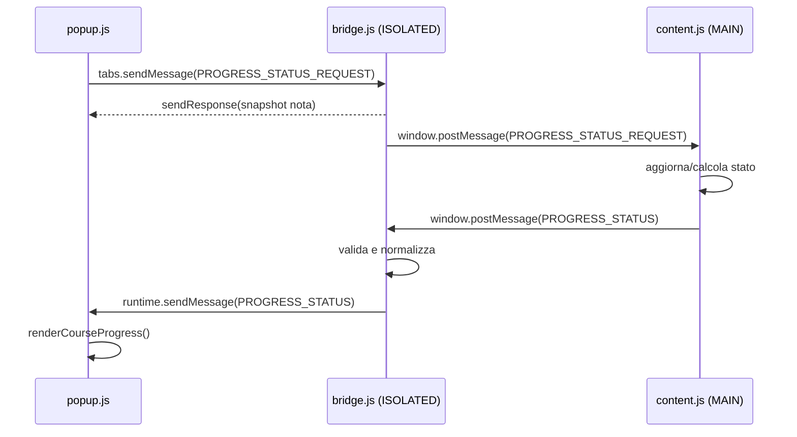
```mermaid
sequenceDiagram
    participant P as popup.js
    participant B as bridge.js (ISOLATED)
    participant C as content.js (MAIN)

    P->>B: tabs.sendMessage(PROGRESS_STATUS_REQUEST)
    B-->>P: sendResponse(snapshot nota)
    B->>C: window.postMessage(PROGRESS_STATUS_REQUEST)
    C->>C: aggiorna/calcola stato
    C->>B: window.postMessage(PROGRESS_STATUS)
    B->>B: valida e normalizza
    B->>P: runtime.sendMessage(PROGRESS_STATUS)
    P->>P: renderCourseProgress()
```

Questo è un pattern molto più ricco di una semplice richiesta sincrona.

Contiene:

- richiesta;
- risposta immediata;
- refresh asincrono;
- evento di aggiornamento;
- cache locale;
- controllo del mittente.

Ed è ancora uno dei flussi relativamente semplici di PlumePilot.

---

# Parte II — Request/response asincrona

## 10. `sendResponse()` e il problema del tempo

Consideriamo ora il listener nel background:

```js
chrome.runtime.onMessage.addListener((message, sender, sendResponse) => {
  let action = null;

  // ... selezione dell'azione ...

  action
    .then(sendResponse)
    .catch((error) => {
      sendResponse({ accepted: false, reason: error.message });
    });

  return true;
});
```

Perché quel `return true`?

Per capirlo dobbiamo distinguere due casi.

### Risposta sincrona

```js
chrome.runtime.onMessage.addListener((message, sender, sendResponse) => {
  sendResponse({ accepted: true });
});
```

La risposta viene inviata prima che il listener termini.

### Risposta asincrona

```js
chrome.runtime.onMessage.addListener((message, sender, sendResponse) => {
  doSomethingAsync().then((result) => {
    sendResponse(result);
  });

  return true;
});
```

Il listener termina **prima** che la Promise completi.

`return true` segnala al runtime che il canale di risposta deve restare disponibile perché `sendResponse()` verrà chiamato successivamente.

Questo dettaglio è facile da ignorare e può generare bug apparentemente inspiegabili:

```text
messaggio inviato
    ↓
handler avviato
    ↓
operazione async partita
    ↓
handler termina
    ↓
canale chiuso      ← se non viene mantenuto
    ↓
Promise completa
    ↓
sendResponse(...)  ← troppo tardi
```

Con `return true`:

```text
handler termina
    ↓
canale mantenuto
    ↓
Promise completa
    ↓
sendResponse(...)
```

La documentazione WebExtensions descrive esplicitamente questo pattern.

### Collegamento con il backend

È vagamente simile alla differenza tra:

```text
return response;
```

e un handler che deve aspettare una query o un servizio asincrono prima di poter completare la risposta.

La differenza è che qui il meccanismo di risposta è gestito dal runtime dell'estensione.

---

## 11. Perché PlumePilot trasforma i callback in Promise

Nel popup troviamo:

```js
function runtimeMessage(message) {
  return new Promise((resolve) =>
    chrome.runtime.sendMessage(message, (response) =>
      resolve(
        chrome.runtime.lastError
          ? { accepted: false, reason: chrome.runtime.lastError.message }
          : response,
      ),
    ),
  );
}
```

Riferimento: [`popup.js` L1296–L1306](https://github.com/PlumePilot/plumepilot/blob/a8007425f81792e7570516dbdf1e7fb2cbda4d53/popup.js#L1296-L1306).

Il chiamante può quindi scrivere:

```js
const response = await runtimeMessage({
  type: "PEGASO_START_EXPORT",
  // ...
});
```

invece di annidare callback.

Questa funzione svolge due lavori:

1. converte un'API callback-style in una Promise;
2. converte `chrome.runtime.lastError` in un normale valore applicativo.

Il secondo punto è importante.

Invece di obbligare ogni chiamante a ricordare:

```js
if (chrome.runtime.lastError) {
  // ...
}
```

l'errore viene trasformato in una risposta coerente:

```js
{
  accepted: false,
  reason: "..."
}
```

### Un piccolo adapter asincrono

Possiamo pensare a `runtimeMessage()` come a:

```text
API del browser
(callback + runtime.lastError)
          │
          ▼
runtimeMessage()
          │
          ▼
API interna PlumePilot
(Promise + accepted/reason)
```

Ancora una volta compare lo stesso principio:

> I boundary sono posti naturali in cui tradurre un'interfaccia in un'altra.

---

# Parte III — Un workflow lungo

## 12. Caso reale: esportare le dispense

Il flusso del progresso era corto.

L'export delle dispense è molto più interessante perché l'operazione:

- parte dal popup;
- viene coordinata dal background;
- viene eseguita sulla pagina del corso;
- attraversa i due execution world;
- invia aggiornamenti intermedi;
- termina aprendo una nuova pagina builder;
- continua a vivere anche se il popup viene chiuso.

Questa ultima proprietà è essenziale.

Se l'operazione appartenesse al popup, chiudere il popup potrebbe distruggere lo stato del processo.

Invece il popup è soltanto **uno dei client del workflow**.

---

## 13. Step 1 — Il popup invia un comando

Quando l'utente avvia la raccolta delle dispense:

```js
const response = await runtimeMessage({
  type: "PEGASO_START_EXPORT",
  format: "materials",
  sourceTabId: tabId,
  requestSource: "toolbar-popup",
});
```

Riferimento: [`popup.js` L2112–L2133](https://github.com/PlumePilot/plumepilot/blob/a8007425f81792e7570516dbdf1e7fb2cbda4d53/popup.js#L2112-L2133).

Questo messaggio è semanticamente un **command**.

Sta dicendo:

> "Per favore, prova ad avviare questa operazione."

Non sta semplicemente annunciando che qualcosa è successo.

Questa distinzione sarà utile per leggere meglio i nomi dei messaggi.

### Command

Esprime un'intenzione:

```text
START_EXPORT
CANCEL_EXPORT
FIND_FIRST_INCOMPLETE
```

### Event

Descrive qualcosa che è già avvenuto:

```text
COURSE_PROGRESS_STATUS
COURSE_MATERIALS_COLLECTED
EXPORT_COLLECTION_FAILED
```

Il codice non applica formalmente una convenzione CQRS o event sourcing, ma la distinzione concettuale è già presente.

---

## 14. Step 2 — Il background acquisisce l'operazione

Il dispatcher del background instrada il comando verso:

```js
startExport(...)
```

All'interno troviamo:

```js
const result = await acquire(format, message.sourceTabId);
if (!result.accepted) return result;
```

Riferimento: [`background.js` L700–L719](https://github.com/PlumePilot/plumepilot/blob/a8007425f81792e7570516dbdf1e7fb2cbda4d53/background.js#L700-L719).

Il background non ordina immediatamente alla pagina di raccogliere materiale.

Prima **acquisisce il diritto di eseguire l'operazione**.

Questo impedisce che workflow incompatibili partano contemporaneamente.

Ne parleremo molto meglio nei capitoli su stato, concorrenza e race condition; per ora basta notare che il background è il punto centrale adatto a decidere:

```text
"C'è già qualcosa in esecuzione?"
```

Una singola tab non avrebbe necessariamente una visione globale sufficiente.

---

## 15. Step 3 — Nasce un `operationId`

Dopo l'acquisizione, l'operazione possiede un identificatore:

```js
result.operation.id
```

Il background lo invia alla tab:

```js
const response = await sendTabMessage(message.sourceTabId, {
  type: "PEGASO_COLLECT_COURSE_MATERIALS",
  format,
  operationId: result.operation.id,
});
```

L'`operationId` è uno dei concetti architetturali più utili dell'intero flusso.

Senza di esso avremmo messaggi del tipo:

```text
"raccolta iniziata"
"25%"
"raccolta completata"
```

Ma a quale raccolta appartengono?

Con l'identificatore possiamo invece avere:

```text
operationId = 9f2...

START      9f2...
STATUS     9f2...
STATUS     9f2...
COMPLETE   9f2...
```

Questo è un **correlation ID**.

Serve a collegare messaggi diversi allo stesso workflow logico.

È un pattern molto comune nei sistemi a messaggi, nelle code, nelle pipeline asincrone e nel tracing distribuito.

---

## 16. Step 4 — Il background indirizza una tab precisa

La funzione helper è:

```js
function sendTabMessage(tabId, message) {
  return new Promise((resolve, reject) =>
    chrome.tabs.sendMessage(
      tabId,
      message,
      { frameId: 0 },
      (response) =>
        chrome.runtime.lastError
          ? reject(new Error(chrome.runtime.lastError.message))
          : resolve(response),
    ),
  );
}
```

Riferimento: [`background.js` L677–L683](https://github.com/PlumePilot/plumepilot/blob/a8007425f81792e7570516dbdf1e7fb2cbda4d53/background.js#L677-L683).

Qui compaiono due coordinate:

```text
tabId
frameId: 0
```

Il messaggio non è un broadcast generico al browser.

È indirizzato al **top frame di una scheda precisa**.

Questa è un'altra somiglianza con i sistemi distribuiti: oltre al contenuto del messaggio serve spesso una forma di addressing.

---

## 17. Step 5 — Il bridge deduplica prima di inoltrare

Il messaggio arriva a `bridge.js`:

```js
if (message?.type === "PEGASO_COLLECT_COURSE_MATERIALS") {
  const operationId = exportOperationId(message.operationId);

  if (!operationId) {
    sendResponse({
      accepted: false,
      reason: "Identificativo operazione mancante.",
    });
    return;
  }

  if (requestedExportOperationIds.has(operationId)) {
    sendResponse({ accepted: true, duplicate: true });
    return;
  }

  rememberExportOperation(requestedExportOperationIds, operationId);

  window.postMessage({
    type: "PEGASO_COLLECT_COURSE_MATERIALS_REQUEST",
    format: message.format,
    operationId,
  }, "*");

  sendResponse({ accepted: true, duplicate: false });
}
```

Riferimento: [`bridge.js` L373–L390](https://github.com/PlumePilot/plumepilot/blob/a8007425f81792e7570516dbdf1e7fb2cbda4d53/bridge.js#L373-L390).

Qui vediamo una misura di robustezza molto concreta:

```js
requestedExportOperationIds.has(operationId)
```

Se per qualche motivo lo stesso comando viene recapitato nuovamente, il bridge evita di avviare una seconda raccolta identica.

Questa tecnica si chiama **deduplicazione**.

È strettamente collegata all'idempotenza.

### Idempotenza perfetta vs deduplicazione

Un'operazione idempotente produce naturalmente lo stesso effetto anche se ripetuta.

Per esempio:

```text
SET theme = dark
SET theme = dark
SET theme = dark```

ha lo stesso risultato di una sola chiamata.

Una raccolta di dispense, invece, è un'operazione costosa e non vogliamo necessariamente eseguirla tre volte.

Quindi PlumePilot usa un'altra strategia:

```text
"Ho già visto questo operationId?"
       │
   sì ─┴─► ignora duplicato
```

Non rende magicamente ogni effetto idempotente, ma avvicina il workflow a un comportamento **at-most-once per quell'identificatore**, entro la memoria e la lifetime del componente che conserva il set.

Questa precisazione è importante: non dobbiamo attribuire al codice garanzie più forti di quelle che possiede realmente.

---

## 18. Step 6 — MAIN world: la raccolta comincia davvero

Il bridge inoltra la richiesta tramite `window.postMessage()`.

`content.js` la riceve:

```js
if (event.data.type === "PEGASO_COLLECT_COURSE_MATERIALS_REQUEST") {
  const operationId = /* normalizzazione */;

  if (!operationId) return;

  if (handledExportOperationIds.has(operationId)) {
    return;
  }

  rememberHandledExportOperation(operationId);

  void collectCourseMaterials(format, operationId).finally(() => {
    // log conclusivo
  });

  return;
}
```

Riferimento: [`content.js` L287–L311](https://github.com/PlumePilot/plumepilot/blob/a8007425f81792e7570516dbdf1e7fb2cbda4d53/content.js#L287-L311).

Notiamo che la deduplicazione compare **anche qui**.

Perché duplicarla in due layer?

Perché i due boundary hanno responsabilità differenti.

Il bridge protegge il passaggio:

```text
extension runtime → MAIN world
```

`content.js` protegge invece il vero side effect:

```text
messaggio MAIN → collectCourseMaterials()
```

È un esempio di **defence in depth** applicata all'affidabilità, non soltanto alla sicurezza.

---

## 19. `void collectCourseMaterials(...)`: perché non viene fatto `await`?

Questa riga è interessante:

```js
void collectCourseMaterials(format, operationId).finally(...);
```

L'handler del messaggio non aspetta che l'intera raccolta termini.

La raccolta può durare molto.

Il messaggio iniziale ha già svolto il suo compito:

> far partire il workflow.

Da quel momento gli aggiornamenti viaggeranno come **eventi separati**.

Questa è una distinzione fondamentale:

```text
request/response breve
        ≠
workflow asincrono lungo
```

Tentare di tenere aperta una singola risposta per tutta la durata della raccolta renderebbe il sistema più fragile e accoppiato.

PlumePilot usa invece:

```text
COMMAND: avvia
EVENT: stato aggiornato
EVENT: stato aggiornato
EVENT: completato
```

Il modello assomiglia a quello che in un backend potresti usare per un job asincrono:

```text
POST /exports
→ 202 Accepted + jobId

GET /jobs/:id
oppure eventi push
```

---

## 20. Step 7 — Gli aggiornamenti risalgono la catena

Durante la raccolta `content.js` pubblica aggiornamenti:

```js
window.postMessage(
  {
    type: "PEGASO_EXPORT_COLLECTION_STATUS",
    operationId,
    message,
  },
  "*",
);
```

Riferimento: [`content.js` L2388–L2401](https://github.com/PlumePilot/plumepilot/blob/a8007425f81792e7570516dbdf1e7fb2cbda4d53/content.js#L2388-L2401).

Il bridge li riceve e li converte in messaggi per il background:

```js
chrome.runtime.sendMessage({
  type: "PEGASO_UPDATE_OPERATION",
  operationId,
  patch: { message: event.data.message },
});
```

Riferimento: [`bridge.js` L584–L588](https://github.com/PlumePilot/plumepilot/blob/a8007425f81792e7570516dbdf1e7fb2cbda4d53/bridge.js#L584-L588).

Il background aggiorna quindi lo stato centrale dell'operazione.

Possiamo leggere il flusso come:

```text
content.js
   │
   │ EVENT status
   ▼
bridge.js
   │
   │ command/update
   ▼
background
   │
   ▼
stato operazione
```

Il popup può essere chiuso.

La raccolta continua comunque.

Quando il popup verrà riaperto, potrà ricostruire la UI a partire dallo stato dell'operazione.

Questo è un risultato architetturale importante:

> **La UI non possiede il job. Osserva il job.**

---

## 21. Step 8 — La raccolta termina con un evento

Quando i dati sono pronti, il `MAIN` world pubblica un evento del tipo:

```text
PEGASO_COURSE_MATERIALS_COLLECTED
```

Il bridge controlla nuovamente l'`operationId` e utilizza un secondo set di deduplicazione:

```js
if (terminalExportOperationIds.has(operationId)) {
  return;
}

rememberExportOperation(
  terminalExportOperationIds,
  operationId,
);
```

Poi invia al background:

```js
chrome.runtime.sendMessage({
  type: "PEGASO_OPEN_EXPORT_BUILDER",
  format: event.data.format,
  operationId,
  payload: event.data.payload,
});
```

Riferimento: [`bridge.js` L550–L570](https://github.com/PlumePilot/plumepilot/blob/a8007425f81792e7570516dbdf1e7fb2cbda4d53/bridge.js#L550-L570).

Perché un secondo concetto di "già visto"?

Perché un evento terminale è diverso dal comando iniziale.

Vogliamo evitare, ad esempio, che due notifiche di completamento aprano due builder.

Quindi il workflow possiede almeno due momenti da proteggere:

```text
START      → non partire due volte
COMPLETE   → non finalizzare due volte
```

---

## 22. Step 9 — Il background apre il builder una volta sola

Anche il background effettua una propria verifica:

```js
if (
  operation.phase === "building" ||
  operation.jobKey ||
  Number.isInteger(operation.builderTabId)
) {
  return {
    accepted: true,
    duplicate: true,
    operation,
  };
}
```

Riferimento: [`background.js` L784–L850](https://github.com/PlumePilot/plumepilot/blob/a8007425f81792e7570516dbdf1e7fb2cbda4d53/background.js#L784-L850).

Poi genera un nuovo identificatore:

```js
const jobId = crypto.randomUUID();
```

salva il payload nello storage:

```js
const storageKey = `pegasoExportJob:${jobId}`;

await storageSet({
  [storageKey]: {
    ...message.payload,
    format,
    operationId: operation.id,
    courseTabId: operation.sourceTabId,
  },
});
```

ed apre una nuova pagina dell'estensione:

```js
chrome.tabs.create({
  url: chrome.runtime.getURL(`${builderPage}?job=${jobId}`),
});
```

Questa parte è molto elegante dal punto di vista dei boundary.

Il payload potenzialmente grande non viene infilato nell'URL.

L'URL contiene soltanto un riferimento:

```text
?job=<jobId>
```

La pagina builder recupererà il contenuto dallo storage.

Questo assomiglia al pattern:

```text
identificatore piccolo → lookup di stato grande
```

che incontriamo continuamente lato backend.

---

## 23. Il workflow completo dell'export

Mettiamo tutto insieme.

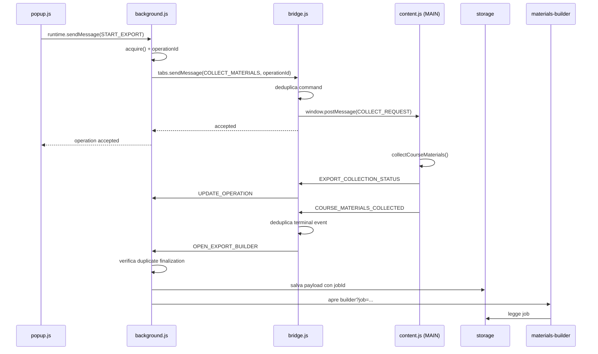
```mermaid
sequenceDiagram
    participant P as popup.js
    participant BG as background.js
    participant BR as bridge.js
    participant C as content.js (MAIN)
    participant S as storage
    participant BU as materials-builder

    P->>BG: runtime.sendMessage(START_EXPORT)
    BG->>BG: acquire() + operationId
    BG->>BR: tabs.sendMessage(COLLECT_MATERIALS, operationId)
    BR->>BR: deduplica command
    BR->>C: window.postMessage(COLLECT_REQUEST)
    BR-->>BG: accepted
    BG-->>P: operation accepted

    C->>C: collectCourseMaterials()
    C->>BR: EXPORT_COLLECTION_STATUS
    BR->>BG: UPDATE_OPERATION

    C->>BR: COURSE_MATERIALS_COLLECTED
    BR->>BR: deduplica terminal event
    BR->>BG: OPEN_EXPORT_BUILDER
    BG->>BG: verifica duplicate finalization
    BG->>S: salva payload con jobId
    BG->>BU: apre builder?job=...
    BU->>S: legge job
```

Guardandolo così, è evidente che non stiamo più parlando di "uno script che clicca dei bottoni".

Stiamo osservando un piccolo sistema event-driven.

---

# Parte IV — Affidabilità del protocollo

## 24. `accepted` non significa `completed`

Molte risposte di PlumePilot hanno questa forma:

```js
{
  accepted: true
}
```

È importante interpretarla correttamente.

Per esempio, quando il bridge risponde:

```js
sendResponse({ accepted: true, duplicate: false });
```

non sta dicendo:

> "Le dispense sono pronte."

Sta dicendo:

> "Ho accettato la richiesta e il workflow può proseguire."

Questa distinzione è cruciale nei sistemi asincroni.

```text
accepted ≠ completed
```

Un backend potrebbe esprimerla tramite HTTP `202 Accepted`.

PlumePilot la esprime tramite il proprio protocollo applicativo.

---

## 25. Tre classi di messaggi

Per studiare il progetto può essere utile classificare mentalmente i messaggi in tre gruppi.

### A. Query

Chiedono informazioni.

```text
PEGASO_GET_OPERATION
PEGASO_COURSE_PROGRESS_STATUS_REQUEST
PEGASO_CHAPTER_LIMIT_STATUS_REQUEST
```

### B. Command

Chiedono di fare qualcosa.

```text
PEGASO_START_EXPORT
PEGASO_CANCEL_EXPORT
PEGASO_FIND_FIRST_INCOMPLETE_COMMAND
```

### C. Event

Comunicano qualcosa che è successo.

```text
PEGASO_COURSE_PROGRESS_STATUS
PEGASO_COURSE_MATERIALS_COLLECTED
PEGASO_EXPORT_COLLECTION_FAILED
```

Il codice non impone formalmente questa tassonomia, ma usarla durante la lettura aiuta moltissimo.

Quando incontri un nuovo `message.type`, chiediti:

```text
È una query?
È un command?
È un event?
```

Quasi sempre capirai subito chi dovrebbe produrlo e chi dovrebbe consumarlo.

---

## 26. Fire-and-forget e request/response

Non tutti i messaggi richiedono una risposta.

### Request/response

```js
chrome.runtime.sendMessage(message, (response) => {
  // la risposta è importante
});
```

### Fire-and-forget

```js
chrome.runtime.sendMessage({
  type: "PEGASO_UPDATE_OPERATION",
  operationId,
  patch: { message },
});
```

Qui il mittente comunica un aggiornamento ma non ha necessariamente bisogno di bloccare il proprio flusso in attesa di una risposta.

Questo riduce l'accoppiamento, ma cambia il modo in cui dobbiamo gestire gli errori.

Se nessuno attende una conferma, il sistema deve essere progettato in modo che un fallimento non lasci uno stato ambiguo o invisibile.

Non esiste una scelta universalmente migliore.

La domanda corretta è:

> Il mittente ha bisogno di sapere che il destinatario ha completato il lavoro, oppure gli basta aver pubblicato l'informazione?

---

## 27. Errori di trasporto ed errori applicativi

PlumePilot distingue implicitamente due famiglie di errore.

### Errore del canale

Per esempio:

```js
chrome.runtime.lastError
```

Può significare che il destinatario non esiste più, la tab è stata chiusa, il content script non è disponibile, ecc.

### Errore applicativo

Il messaggio è arrivato correttamente, ma l'azione viene rifiutata:

```js
{
  accepted: false,
  reason: "Scheda del corso non disponibile."
}
```

Questa distinzione è molto simile a:

```text
network / transport error
        ≠
HTTP 4xx / domain error
```

in un sistema web.

Entrambi possono impedire l'operazione, ma hanno cause e strategie di recupero differenti.

---

## 28. Perché `runtime.lastError` viene controllato spesso

Considera questo pattern:

```js
chrome.tabs.sendMessage(tabId, message, (response) => {
  if (chrome.runtime.lastError) {
    // gestione errore
    return;
  }

  // usa response
});
```

Le API callback-style di Chrome comunicano diversi errori asincroni tramite `chrome.runtime.lastError`.

Se ignorassimo questo valore potremmo interpretare:

```js
response === undefined
```

come una risposta applicativa valida, quando in realtà il messaggio non è mai arrivato al destinatario.

La wrapper `runtimeMessage()` che abbiamo visto prima serve proprio a trasformare questa peculiarità dell'API browser in un modello più facile da usare nel resto dell'applicazione.

---

## 29. Messaggi serializzabili

Quando passiamo un oggetto attraverso il sistema di messaging non stiamo condividendo lo stesso riferimento JavaScript.

Concettualmente dobbiamo trattare il messaggio come **dati serializzabili**.

Questo significa che è una cattiva idea immaginare di poter inviare direttamente:

```js
{
  callback: () => doSomething(),
  domNode: document.querySelector("video")
}
```

come se il destinatario condividesse lo stesso heap.

Un messaggio dovrebbe contenere dati come:

```js
{
  type: "PEGASO_UPDATE_OPERATION",
  operationId: "...",
  patch: {
    phase: "building",
    message: "Preparazione in corso…"
  }
}
```

Questa limitazione, apparentemente scomoda, ha anche un vantaggio:

> Ci costringe a rendere espliciti i contratti tra componenti.

---

# Parte V — `window.postMessage()` e il trust boundary

## 30. Condividere `window` non significa condividere fiducia

`content.js` e `bridge.js` comunicano con:

```js
window.postMessage(...)
```

Gli handler spesso iniziano con:

```js
if (event.source !== window || !event.data) return;
```

Questo controllo assicura che il messaggio osservato provenga dallo stesso oggetto `window`, non per esempio da un'altra finestra che possiede un riferimento.

Ma è importante non interpretarlo come autenticazione crittografica.

Il codice JavaScript della stessa pagina può usare anch'esso `window.postMessage()`.

Per questo il boundary MAIN/ISOLATED va trattato come un posto in cui:

- non fidarsi ciecamente dei payload;
- limitare i tipi accettati;
- controllare identificatori e tipi;
- evitare di spostare segreti inutilmente;
- normalizzare le informazioni prima di passarle al runtime privilegiato.

PlumePilot lo fa in diversi punti attraverso funzioni come:

```js
safeText(...)
exportOperationId(...)
Number.isFinite(...)
Array.isArray(...)
```

### Lezione generale

Un bridge dovrebbe essere **stretto**.

Meglio:

```text
5 messaggi espliciti e validati
```

che:

```text
"esegui arbitrariamente quello che mi manda l'altro lato"
```

Questo principio vale per browser extension, iframe, worker, plugin system e API backend.

---

## 31. Perché usare `"*"` come `targetOrigin` qui non equivale a "mandare il dato su Internet"

Una riga come:

```js
window.postMessage(message, "*");
```

può sembrare allarmante se la leggiamo senza contesto.

`"*"` significa che il mittente non limita il *target origin* del destinatario del messaggio.

Non significa però che il browser trasmetta automaticamente quel payload a qualunque sito su Internet.

Nel nostro caso il target è lo stesso `window` della pagina.

Resta comunque buona pratica progettare i payload come se il canale fosse osservabile dal codice che vive nella pagina e quindi **non usarlo come contenitore di segreti**.

Quando una applicazione usa `postMessage` tra finestre di origini differenti, la verifica di `origin` diventa ancora più importante.

---

# Parte VI — Concorrenza nascosta nei messaggi

## 32. Due messaggi possono essere corretti e produrre comunque un bug

Supponiamo di avere:

```text
A: START_EXPORT
B: CANCEL_EXPORT
```

Entrambi sono validi.

Ma cosa succede se arrivano quasi contemporaneamente?

Oppure:

```text
A: STATUS 40%
B: COMPLETE
C: STATUS 50%  ← arrivato in ritardo
```

Il problema non è il contenuto di un singolo messaggio.

È **l'ordine temporale**.

Qui nasce la concorrenza.

Ed è uno dei motivi per cui PlumePilot possiede:

- `operationId`;
- fasi dell'operazione;
- set di deduplicazione;
- funzioni serializzate nel background;
- controlli sugli eventi terminali.

Nel capitolo dedicato all'asincronia studieremo meglio le race condition.

Per ora basta una regola:

> In un sistema a messaggi, il tempo e l'ordine diventano parte del problema.

---

## 33. Lo stato terminale è speciale

Guarda questo controllo nel bridge:

```js
if (terminalExportOperationIds.has(operationId)) {
  return;
}
```

Perché separare gli eventi terminali?

Perché una volta che un workflow è terminato, eventi duplicati o tardivi non dovrebbero normalmente riaprirlo.

Possiamo pensare al ciclo di vita così:

```text
idle
  ↓
collecting
  ↓
building
  ↓
completed / released
```

Un messaggio ricevuto fuori fase potrebbe essere valido dal punto di vista sintattico ma **non valido dal punto di vista temporale**.

Questa è già una piccola anticipazione delle state machine.

---

# Parte VII — Startup e sincronizzazione

## 34. Un listener può nascere troppo tardi

C'è una riga in `content.js` particolarmente istruttiva:

```js
// bridge.js may have sent its startup state before this document-idle
// listener existed. Request an explicit synchronization after subscribing.
window.postMessage({ type: "PEGASO_AUTONEXT_STATE_REQUEST" }, "*");
```

Riferimento: [`content.js` L557–L559](https://github.com/PlumePilot/plumepilot/blob/a8007425f81792e7570516dbdf1e7fb2cbda4d53/content.js#L557-L559).

Questa piccola soluzione racconta una classe intera di bug asincroni.

Ricordiamo dal manifest:

```text
bridge.js  → document_start
content.js → document_idle
```

Quindi può verificarsi:

```text
bridge caricato
    ↓
invia stato
    ↓
content.js non ha ancora registrato il listener
    ↓
messaggio perso
```

Un `postMessage` non è automaticamente una coda persistente.

Se nessun listener utile è presente in quel momento, il messaggio non verrà recuperato magicamente più tardi.

La soluzione è semplice e robusta:

```text
1. content.js registra il listener
2. content.js chiede esplicitamente lo stato corrente
3. bridge.js lo ripubblica
```

Questo pattern si chiama spesso **handshake** o **explicit synchronization**.

### Concetto importante

Gli eventi sono ottimi per dire:

> "qualcosa è cambiato"

ma un nuovo subscriber ha spesso bisogno anche di poter chiedere:

> "qual è lo stato adesso?"

Per questo molti sistemi reali combinano:

```text
snapshot + events
```

invece di affidarsi esclusivamente a uno dei due.

È esattamente ciò che abbiamo visto anche nel progresso del corso.

---

## 35. Snapshot + eventi: un pattern ricorrente

Il modello compare più volte:

```text
QUERY
  ↓
stato corrente

EVENT
  ↓
aggiornamenti futuri
```

È una combinazione potente perché risolve due esigenze diverse.

### Snapshot

Serve quando un componente nasce o viene riaperto.

```text
"Dimmi dove siamo adesso."
```

### Eventi

Servono dopo la sincronizzazione iniziale.

```text
"Avvisami quando cambia qualcosa."
```

Da backend developer puoi confrontarlo con:

```text
GET /resource
+
WebSocket / SSE per gli update
```

oppure con:

```text
query iniziale
+
subscription
```

Il meccanismo tecnico è diverso, ma il problema architetturale è lo stesso.

---

# Parte VIII — Come leggere il messaging di PlumePilot

## 36. Metodo pratico di reverse engineering

Quando incontri un `message.type` nel repository, puoi ricostruirne il percorso in quattro passi.

### 1. Trova chi lo produce

Cerca:

```js
{ type: "NOME_MESSAGGIO" }
```

Domanda:

```text
chi lo invia?
```

### 2. Trova chi lo consuma

Cerca:

```js
message?.type === "NOME_MESSAGGIO"
```

o:

```js
event.data.type === "NOME_MESSAGGIO"
```

Domanda:

```text
chi lo riceve?
```

### 3. Identifica il canale

Guarda se il produttore usa:

```text
runtime.sendMessage
 tabs.sendMessage
window.postMessage
```

Questo ti dice **quale boundary viene attraversato**.

### 4. Cerca la risposta o l'evento successivo

Per esempio:

```text
REQUEST → STATUS
START   → UPDATE → COMPLETE
```

A questo punto hai ricostruito il protocollo.

Questo metodo è utile non soltanto per PlumePilot.

È un modo generale per comprendere sistemi event-driven che non conosci.

---

## 37. Una tabella dei boundary principali

| Da | A | Meccanismo tipico | Esempio |
|---|---|---|---|
| Popup | Background | `runtime.sendMessage` | avvio export |
| Builder | Background | `runtime.sendMessage` | update/release operazione |
| Background | Content script | `tabs.sendMessage` | raccogli dispense |
| Popup | Content script | `tabs.sendMessage` | richiedi progresso |
| ISOLATED | MAIN | `window.postMessage` | comando di raccolta |
| MAIN | ISOLATED | `window.postMessage` | stato/completamento |
| Bridge | Popup/extension runtime | `runtime.sendMessage` | progresso aggiornato |

Questa tabella è quasi una **mappa delle dipendenze runtime** di PlumePilot.

---

# Parte IX — Cosa avremmo potuto fare diversamente?

## 38. Un unico bus di messaggi?

Potremmo immaginare di costruire una astrazione unica:

```js
bus.send("START_EXPORT", payload);
```

che nasconda completamente se sotto usa:

```text
runtime.sendMessage
tabs.sendMessage
postMessage
```

### Vantaggio

Il codice chiamante sarebbe più uniforme.

### Svantaggio

Rischieremmo di nascondere informazioni architetturali importanti:

```text
Dove sta andando il messaggio?
Quale boundary attraversa?
Quale runtime lo riceve?
```

Nel caso di PlumePilot, mantenere una certa visibilità del meccanismo sottostante è spesso utile proprio perché i contesti hanno capacità diverse.

Una astrazione migliore potrebbe quindi non essere:

```text
"nascondi ogni differenza"
```

ma:

```text
"centralizza error handling e contratti mantenendo esplicita la destinazione"
```

È una distinzione architetturale importante.

---

## 39. Un registro centralizzato dei message type?

Attualmente molti nomi dei messaggi sono stringhe distribuite nel codice:

```js
"PEGASO_START_EXPORT"
"PEGASO_UPDATE_OPERATION"
"PEGASO_COURSE_PROGRESS_STATUS"
```

Una possibile evoluzione architetturale sarebbe centralizzarli:

```js
const Messages = Object.freeze({
  START_EXPORT: "PEGASO_START_EXPORT",
  UPDATE_OPERATION: "PEGASO_UPDATE_OPERATION",
  COURSE_PROGRESS_STATUS: "PEGASO_COURSE_PROGRESS_STATUS",});
```

oppure, in TypeScript, definire anche i payload associati.

### Cosa guadagneremmo?

- meno typo;
- refactoring più semplice;
- contratti più visibili;
- possibilità di type checking.

### Cosa costerebbe?

- ulteriore infrastruttura;
- necessità di rendere disponibile il modulo in più execution context;
- beneficio limitato per messaggi molto semplici.

Non significa che l'implementazione attuale sia sbagliata.

È il tipo di trade-off che discuteremo nell'ultimo capitolo: **cosa rifaremmo diversamente dopo aver visto crescere il progetto**.

---

## 40. Un protocollo versionato?

In un singolo pacchetto di estensione tutti i componenti vengono normalmente aggiornati insieme.

Per questo PlumePilot non ha bisogno di qualcosa come:

```text
protocolVersion: 3
```

in ogni messaggio.

Ma immagina un sistema in cui mittente e destinatario possano essere aggiornati indipendentemente.

A quel punto il contratto di messaging diventerebbe una vera API da versionare.

Questa osservazione ci aiuta a capire una cosa:

> La complessità necessaria dipende anche dal modo in cui i componenti vengono distribuiti.

PlumePilot può permettersi un protocollo interno relativamente leggero perché i componenti appartengono alla stessa release.

---

# Parte X — Collegamenti con il backend

## 41. Un vocabolario comune

Molti concetti di questo capitolo hanno equivalenti familiari lato server.

| Browser extension | Analogia backend/distribuita |
|---|---|
| `message.type` | route / event name / command name |
| `runtime.onMessage` | dispatcher / controller |
| `sendResponse()` | response handler |
| `operationId` | job ID / correlation ID |
| `accepted: true` | richiesta accettata / `202 Accepted` |
| `runtime.lastError` | transport/runtime failure |
| `accepted: false` | domain/application failure |
| `window.postMessage` | message bus locale / IPC-like boundary |
| `tabs.sendMessage(tabId)` | invio verso una istanza indirizzata |
| snapshot + events | query iniziale + subscription |
| deduplicazione | duplicate suppression / idempotency key |

Le analogie non sono equivalenze perfette.

Un browser non è un cluster distribuito e `postMessage` non è Kafka.

Ma i **problemi logici** sono della stessa famiglia:

- componenti separati;
- messaggi serializzabili;
- delivery asincrona;
- errori parziali;
- ordine temporale;
- correlazione;
- duplicati;
- stato non condiviso.

Per questo studiare bene l'architettura di un'estensione è sorprendentemente utile anche fuori dal browser.

---

# Parte XI — Piccoli esercizi

## 42. Esercizio 1 — Scegli il canale

Immagina di dover implementare queste funzioni.

### A. Il popup vuole chiedere al background se esiste già un export attivo

Quale useresti?

```text
runtime.sendMessage
```

Perché il destinatario è il coordinatore dell'estensione.

### B. Il background vuole dire alla tab 37 di fermare la raccolta

```text
tabs.sendMessage(37, ...)
```

Perché dobbiamo indirizzare un content script specifico.

### C. `content.js` nel MAIN world vuole chiedere al bridge di leggere una preferenza dallo storage

```text
window.postMessage
```

per attraversare MAIN → ISOLATED; sarà poi il bridge a usare le WebExtension API appropriate.

---

## 43. Esercizio 2 — Trova il bug

Considera:

```js
chrome.runtime.onMessage.addListener((message, sender, sendResponse) => {
  fetchSomething().then((result) => {
    sendResponse(result);
  });
});
```

Cosa manca nel modello callback-style usato da PlumePilot?

La risposta:

```js
return true;
```

per mantenere disponibile il canale di risposta asincrono.

---

## 44. Esercizio 3 — Query o command?

Classifica:

```text
PEGASO_GET_OPERATION
```

→ query.

```text
PEGASO_CANCEL_EXPORT
```

→ command.

```text
PEGASO_EXPORT_COLLECTION_FAILED
```

→ event.

Questa classificazione non è richiesta dal browser.

Serve a **noi** per ragionare meglio sul sistema.

---

## 45. Esercizio 4 — Perché serve l'`operationId`?

Immagina due export quasi contemporanei:

```text
Export A
Export B
```

poi ricevi:

```text
"raccolta completata"
```

Senza un correlation ID non sai a quale dei due appartiene.

Con:

```text
operationId: A
```

il problema diventa deterministico.

---

## 46. Esercizio 5 — Evento perso allo startup

Supponiamo:

```text
bridge.js: document_start
content.js: document_idle
```

Il bridge pubblica lo stato una sola volta appena parte.

Perché il `content.js` potrebbe non riceverlo?

Perché il listener potrebbe non essere ancora stato registrato.

Qual è una soluzione?

```text
subscribe → request current snapshot
```

che è proprio ciò che fa `PEGASO_AUTONEXT_STATE_REQUEST`.

---

# Parte XII — Concetti da portarsi dietro

## 47. Message passing

Comunicare attraverso messaggi invece di condividere direttamente funzioni e memoria.

## 48. Protocollo

L'insieme delle forme, dei nomi e delle aspettative che permettono a mittente e destinatario di capirsi.

In PlumePilot il protocollo è composto in gran parte da oggetti con `type` e payload associati.

## 49. Dispatcher

Componente che riceve messaggi e li instrada verso l'handler corretto.

Il blocco `runtime.onMessage` del background ne è un esempio.

## 50. Command

Messaggio che esprime l'intenzione di eseguire un'azione.

## 51. Event

Messaggio che descrive un fatto già avvenuto.

## 52. Query

Messaggio che richiede informazioni senza voler rappresentare un cambiamento di stato come scopo principale.

## 53. Correlation ID

Identificatore che permette di collegare più messaggi allo stesso workflow.

`operationId` è il nostro esempio principale.

## 54. Deduplicazione

Riconoscere e ignorare la ripetizione di una richiesta o di un evento già processato.

## 55. Eventual consistency

Situazione in cui componenti differenti possono avere temporaneamente snapshot non identici, ma convergono tramite aggiornamenti successivi.

## 56. Fire-and-forget

Invio di un messaggio senza aspettare una risposta applicativa prima di continuare.

## 57. Request/response

Interazione in cui il mittente ha bisogno di una risposta correlata alla richiesta.

## 58. Handshake / explicit synchronization

Procedura con cui un componente appena inizializzato chiede esplicitamente lo stato corrente per evitare di dipendere da eventi pubblicati prima che fosse pronto ad ascoltarli.

## 59. Boundary validation

Validazione e normalizzazione dei dati nel punto in cui attraversano un confine tra componenti o trust domain.

---

# Parte XIII — Approfondimenti

## 60. Documentazione primaria consigliata

### Chrome Extensions — Message passing

https://developer.chrome.com/docs/extensions/develop/concepts/messaging

Da leggere per:

- `runtime.sendMessage()`;
- `tabs.sendMessage()`;
- one-time requests;
- connessioni persistenti.

### Chrome Extensions — Tabs API

https://developer.chrome.com/docs/extensions/reference/api/tabs

Utile soprattutto per capire perché `tabs.sendMessage()` possiede un `tabId` e può essere indirizzato a uno specifico frame/document.

### MDN — `runtime.sendMessage()`

https://developer.mozilla.org/en-US/docs/Mozilla/Add-ons/WebExtensions/API/runtime/sendMessage

### MDN — `runtime.onMessage`

https://developer.mozilla.org/en-US/docs/Mozilla/Add-ons/WebExtensions/API/runtime/onMessage

Particolarmente importante per comprendere:

- `sendResponse()`;
- risposta sincrona;
- risposta asincrona;
- `return true`;
- Promise e differenze storiche di compatibilità.

### MDN — `Window.postMessage()`

https://developer.mozilla.org/en-US/docs/Web/API/Window/postMessage

Da leggere insieme alla sezione sulla sicurezza e sul controllo dell'origine quando si comunica tra finestre o origini differenti.

### Chrome — Execution worlds

https://developer.chrome.com/docs/extensions/reference/api/scripting#type-ExecutionWorld

Serve a ricollegare questo capitolo alla distinzione `MAIN` / `ISOLATED` studiata nel Capitolo 1.

---

# 61. Cosa abbiamo imparato davvero

A prima vista questo capitolo parlava di API come:

```text
sendMessage()
postMessage()
onMessage
```

Ma il punto più importante è più generale.

PlumePilot ci mostra che quando un'applicazione viene suddivisa in contesti con lifetime e privilegi differenti, **la comunicazione diventa parte dell'architettura**.

Non possiamo più ragionare soltanto in termini di:

```text
funzione A chiama funzione B
```

Dobbiamo ragionare in termini di:

```text
chi produce il messaggio?
chi lo riceve?
attraverso quale boundary?
la consegna richiede risposta?
la risposta può arrivare più tardi?
come correlare gli aggiornamenti?
cosa accade se il messaggio arriva due volte?
cosa accade se arriva fuori ordine?
cosa accade se il subscriber non esiste ancora?
```

Queste domande ci porteranno naturalmente ai prossimi argomenti.

Nel **Capitolo 3** usciremo dall'infrastruttura dell'estensione e guarderemo il territorio più instabile in cui PlumePilot deve lavorare:

> **il DOM di una applicazione web che non controlliamo.**

Vedremo perché leggere un elemento HTML è facile, mentre costruire automazioni affidabili sopra una UI dinamica è tutta un'altra storia.

---

# 03 — DOM e pagine dinamiche

## Lavorare in una UI che non controlliamo

Nel capitolo precedente abbiamo seguito i messaggi mentre attraversavano popup, background, bridge e `MAIN` world.

Ora arriviamo al punto in cui PlumePilot deve fare qualcosa di più difficile: **capire una pagina web costruita da qualcun altro mentre quella pagina continua a cambiare sotto i suoi piedi**.

È facile descrivere un content script dicendo:

> legge il DOM e clicca alcuni elementi.

Tecnicamente è vero.

Ma è una descrizione quasi inutile.

Il vero problema non è trovare un elemento una volta.

Il vero problema è rispondere a domande come:

- l'elemento esiste già oppure verrà renderizzato tra poco?
- quello che vedo nel DOM rappresenta davvero lo stato della piattaforma?
- il nodo che ho salvato cinque secondi fa esiste ancora?
- un accordion chiuso significa che il capitolo non esiste, oppure soltanto che non è renderizzato?
- due capitoli con lo stesso numero sono lo stesso capitolo?
- se faccio `.click()`, quando posso considerare concluso l'effetto del click?
- se la tab è nascosta, i timeout hanno ancora lo stesso significato?
- se il frontend ricostruisce la sidebar, posso continuare a usare il vecchio riferimento DOM?

Queste non sono domande specifiche di PlumePilot.

Sono problemi tipici di qualunque software che debba integrarsi con una **UI dinamica non controllata**: browser extension, userscript, test end-to-end, automazione, accessibility tooling, web scraping interattivo o integrazioni con applicazioni legacy.

In questo capitolo useremo PlumePilot per imparare una regola fondamentale:

> **Il DOM è una rappresentazione temporanea dello stato dell'applicazione, non necessariamente lo stato dell'applicazione stesso.**

---

# Parte I — Il DOM non è un database

## 1. Che cos'è davvero il DOM?

Quando il browser interpreta HTML costruisce una struttura ad albero di oggetti JavaScript.

Per esempio:

```html
<div class="course">
  <div class="chapter">
    <span>1 - Introduzione</span>
  </div>
</div>
```

può essere immaginato come:

```text
Document
└── div.course
    └── div.chapter
        └── span
            └── "1 - Introduzione"
```

JavaScript può attraversare e modificare quell'albero:

```js
document.querySelector(".chapter");
```

Il risultato è un oggetto `Element` che rappresenta **quel nodo in quel momento**.

Questa ultima parte è importante.

In un sito moderno la pagina può fare:

```text
stato applicativo cambia
        ↓
frontend ricalcola la UI
        ↓
vecchi nodi rimossi
        ↓
nuovi nodi creati
```

Visivamente l'utente può vedere ancora:

```text
1 - Introduzione
```

ma JavaScript potrebbe trovarsi davanti a un oggetto completamente diverso.

Il testo è lo stesso.

L'identità DOM no.

---

## 2. Un riferimento DOM non è un'identità logica

Supponiamo di fare:

```js
const row = document.querySelector(".lesson");
```

Dopo qualche secondo la piattaforma aggiorna la sidebar e ricrea quel ramo del DOM.

Ora possono esistere due realtà:

```text
variabile row ───────► vecchio nodo, ormai staccato

DOM corrente ────────► nuovo nodo che rappresenta la stessa lezione
```

La variabile continua a contenere un oggetto valido.

Ma quell'oggetto potrebbe non appartenere più al documento corrente.

Questo tipo di riferimento viene spesso chiamato **stale reference**: un riferimento che era corretto quando è stato ottenuto, ma non rappresenta più il componente attuale della UI.

È una distinzione che incontreremo ripetutamente:

```text
DOM identity       ≠       domain identity
```

Per PlumePilot:

```text
"questo specifico <div>"    ≠    "questa specifica lezione"
```

La lezione è un concetto del dominio.

Il `<div>` è soltanto una delle sue rappresentazioni temporanee.

---

## 3. Primo esempio reale: `lessons()`

In `content.js` PlumePilot individua le righe delle lezioni così:

```js
function lessons() {
  return [...document.querySelectorAll("div.border-t")].filter((x) =>
    x.querySelector(":scope > div.cursor-pointer"),
  );
}
```

Riferimento reale: [`content.js` L647-L651](https://github.com/PlumePilot/plumepilot/blob/a8007425f81792e7570516dbdf1e7fb2cbda4d53/content.js#L647-L651).

Notiamo già una scelta importante.

La funzione non conserva una lista globale del tipo:

```js
const allLessons = document.querySelectorAll(...);
```

E poi la riutilizza per sempre.

Ogni chiamata a `lessons()` **riesegue la query sul DOM corrente**.

Questo è particolarmente appropriato in una pagina dinamica.

---

## 4. `querySelectorAll()` restituisce uno snapshot statico

Secondo la documentazione DOM, `querySelectorAll()` restituisce una `NodeList` **statica**, non live.

In altre parole:

```js
const rows = document.querySelectorAll(".lesson");
```

fotografa l'insieme dei nodi che corrispondono in quel momento.

Se successivamente il DOM cambia, `rows` non si aggiorna automaticamente con i nuovi elementi.

PlumePilot converte subito la `NodeList` in un array:

```js
[...document.querySelectorAll(...)]
```

Da quel momento è ancora più chiaramente uno snapshot.

Possiamo immaginarlo così:

```text
t0
DOM: A B C
querySelectorAll() → [A, B, C]


t1
DOM: A D C
array precedente  → [A, B, C]
nuova query        → [A, D, C]
```

Il vecchio array non acquisisce magicamente `D`.

E `B` può perfino essere stato rimosso dalla pagina.

Per questo funzioni come:

```js
lessons()
chapters()
sections()
```

sono più interessanti di quanto sembrino.

Non sono semplicemente utility.

Sono **lettori dello stato visibile corrente**.

### Approfondimento

MDN descrive `querySelectorAll()` come una query che restituisce una `NodeList` non live:

https://developer.mozilla.org/en-US/docs/Web/API/Document/querySelectorAll

---

# Parte II — I selettori sono contratti impliciti

## 5. Un selettore CSS può diventare una dipendenza software

Consideriamo ancora:

```js
document.querySelectorAll("div.border-t")
```

Quella classe non è stata definita da PlumePilot.

Appartiene alla piattaforma.

Quindi la funzione dipende implicitamente da un contratto esterno:

```text
la piattaforma continuerà a rappresentare le righe delle lezioni
con una struttura compatibile con questo selettore
```

Questo contratto non è formalizzato in una API.

Nessuno promette a PlumePilot che `.border-t` esisterà anche domani.

Per questo l'integrazione DOM è intrinsecamente più fragile di una API versionata.

---

## 6. Selettore sintattico vs selettore semantico

Immaginiamo due possibilità.

### Selettore molto strutturale

```js
div > div:nth-child(3) > div:nth-child(2) > span
```

### Selettore più semantico

```js
[aria-label="lesson-progress"]
```

Il primo dipende fortemente dal layout.

Il secondo dipende da un significato.

Idealmente preferiremmo sempre elementi con identificatori semantici stabili:

```text
data-* dedicati
aria-label
role
id documentati
URL
identificatori di dominio
```

Ma quando integriamo una pagina che non controlliamo, spesso questi dati non esistono.

PlumePilot deve quindi combinare diversi segnali:

```text
classi CSS
struttura relativa
contenuto testuale
URL
icone
stato visuale
API
```

Non esiste un selettore universalmente perfetto.

La domanda corretta diventa:

> **Quale combinazione di segnali è abbastanza stabile per questo compito?**

---

## 7. `:scope` riduce le ambiguità

In `lessons()` troviamo:

```js
x.querySelector(":scope > div.cursor-pointer")
```

`>`, in CSS, significa **figlio diretto**.

`:scope` indica l'elemento sul quale stiamo eseguendo la query.

Quindi non stiamo chiedendo:

> esiste da qualche parte sotto questa riga un elemento cliccabile?

Stiamo chiedendo:

> il figlio diretto previsto dalla struttura della riga è cliccabile?

La differenza sembra piccola, ma riduce i falsi positivi.

Questo:

```text
row
└── wrapper.cursor-pointer
```

corrisponde.

Questo:

```text
row
└── qualcos'altro
    └── qualche widget interno
        └── .cursor-pointer
```

non basta.

È un esempio di selettore che codifica **una piccola aspettativa strutturale**, non soltanto una classe.

---

## 8. `closest()` legge il contesto dell'elemento

PlumePilot utilizza spesso anche `closest()`.

Per esempio, nell'identificazione di capitoli Mercatorum:

```js
const clickable =
  span.closest("div.cursor-pointer.relative.align-middle") ||
  span.closest("div.cursor-pointer");
```

Riferimento: [`content.js` L1180-L1198](https://github.com/PlumePilot/plumepilot/blob/a8007425f81792e7570516dbdf1e7fb2cbda4d53/content.js#L1180-L1198).

`closest()` parte dal nodo corrente e risale verso gli antenati fino a trovare il primo match.

È utile quando conosciamo un elemento interno significativo ma l'azione reale appartiene a un contenitore superiore.

Mentalmente:

```text
clickable div
└── wrapper
    └── span con "3 - Titolo"
         ▲
         │
      partiamo qui
```

`closest()` ci permette di recuperare il componente interattivo che contiene quello `span`.

Documentazione:

https://developer.mozilla.org/en-US/docs/Web/API/Element/closest

---

# Parte III — Una piattaforma, più strutture DOM

## 9. `sections()` è già un piccolo adapter multipiattaforma

Quando PlumePilot supportava soltanto una piattaforma, una certa struttura DOM poteva sembrare universale.

Con Pegaso, Mercatorum e San Raffaele, questa assunzione non regge più.

Guardiamo:

```js
function sections() {
  const nativeSections = pegasoStyleSections();
  if (nativeSections.length) return nativeSections;

  const fallbackChapters = mercatorumChapterRows();
  if (!fallbackChapters.length) return [];

  return [{
    outer: document.documentElement,
    header: null,
    span: fallbackChapters[0].clickable,
    text: MERCATORUM_STATIC_SECTION,
    static: true,
  }];
}
```

Riferimento: [`content.js` L1201-L1213](https://github.com/PlumePilot/plumepilot/blob/a8007425f81792e7570516dbdf1e7fb2cbda4d53/content.js#L1201-L1213).

Il resto dell'algoritmo vuole ragionare in termini di:

```text
sections
  └── chapters
      └── activities
```

Ma non tutte le piattaforme espongono esattamente la stessa UI.

Invece di spargere continuamente condizioni come:

```js
if (isMercatorum) ...
else if (isPegaso) ...
```

ovunque, `sections()` prova a restituire **una forma concettuale comune**.

Questo è un primo esempio di **DOM adapter**.

La pagina dice:

```text
"io rappresento il corso così"
```

PlumePilot traduce:

```text
"per il mio dominio, questa cosa è una section"
```

---

## 10. Normalizzare prima, ragionare dopo

Questa strategia è molto simile a ciò che faresti lato backend con provider differenti.

Immaginiamo:

```text
Provider A → customer_id
Provider B → userCode
Provider C → account.id
```

L'application layer preferisce ricevere:

```js
{
  customerId: ...
}
```

in tutti i casi.

Qui abbiamo lo stesso principio:

```text
DOM Pegaso ───────┐
                  ├──► modello concettuale PlumePilot
DOM Mercatorum ───┘
```

Questa separazione diventerà ancora più importante quando parleremo dell'architettura che potremmo adottare se riscrivessimo PlumePilot oggi.

---

# Parte IV — Il problema del tempo

## 11. `document_idle` non significa "applicazione pronta"

Nel `manifest.json`, `content.js` viene caricato con:

```json
"run_at": "document_idle"
```

Potremmo interpretarlo ingenuamente così:

```text
content.js parte
        ↓
la pagina è pronta
```

Ma `document_idle` riguarda il caricamento del documento dal punto di vista dell'estensione.

Non significa che **tutti i dati asincroni dell'applicazione host siano già arrivati**, né che ogni componente UI sia stato renderizzato.

Una Single Page Application può fare:

```text
HTML iniziale disponibile
        ↓
content script avviato
        ↓
fetch applicativo
        ↓
risposta API
        ↓
render capitoli
        ↓
render lezione attiva
```

Quindi al tempo `t0` questo può essere vero:

```js
chapters().length === 0
```

mentre al tempo `t0 + 800 ms`:

```js
chapters().length === 42
```

Nessuna delle due letture è "sbagliata".

Descrivono due momenti diversi.

---

## 12. Un bug reale: DOM inizialmente vuoto

Il changelog di PlumePilot conserva una regressione molto istruttiva.

Nella v2.14.5 venne corretto il comportamento della ricerca della prima attività incompleta dopo un reload:

- la struttura del corso veniva renderizzata asincronamente;
- l'algoritmo partiva prima che esistesse la riga della lezione attiva;
- un DOM inizialmente vuoto veniva interpretato come fallimento definitivo.

Riferimento storico: [`CHANGELOG.md` L793-L799](https://github.com/PlumePilot/plumepilot/blob/a8007425f81792e7570516dbdf1e7fb2cbda4d53/CHANGELOG.md#L793-L799).

Il punto fondamentale è questo:

```text
"non trovato ora"
```

non equivale necessariamente a:

```text
"non esiste"
```

Può significare:

```text
"non è ancora stato renderizzato"
```

Sono tre stati semanticamente diversi.

---

## 13. Il problema dei tre valori

Molti bug DOM nascono perché modelliamo implicitamente una condizione come booleana:

```text
found / not found
```

quando la realtà è più simile a:

```text
FOUND
NOT_READY_YET
DEFINITELY_MISSING
```

Questa distinzione è fondamentale nelle UI asincrone.

Se `chapters()` restituisce zero elementi durante lo startup, come facciamo a sapere se:

1. il corso non ha capitoli;
2. non siamo nella pagina giusta;
3. il frontend non ha ancora renderizzato i capitoli;
4. il selettore si è rotto dopo un aggiornamento della piattaforma?

Dal solo array vuoto non possiamo distinguerli.

Serve **contesto temporale e applicativo**.

---

# Parte V — Aspettare una condizione, non un numero arbitrario

## 14. `waitFor()`

PlumePilot possiede una utility semplice ma centrale:

```js
async function waitFor(fn, timeout = WAIT_MS) {
  let start = Date.now();

  while (Date.now() - start < timeout) {
    const x = fn();

    if (x) {
      return x;
    }

    await sleep(100);
  }

  return null;
}
```

La versione reale gestisce anche la visibilità della pagina; il cuore del pattern però è questo.

Riferimento: [`content.js` L1577-L1609](https://github.com/PlumePilot/plumepilot/blob/a8007425f81792e7570516dbdf1e7fb2cbda4d53/content.js#L1577-L1609).

Invece di dire:

```js
await sleep(2000);
const chapter = findChapter(...);
```

PlumePilot dice:

```js
const chapter = await waitFor(() => findChapter(...));
```

La differenza concettuale è enorme.

---

## 15. Delay fisso vs attesa condizionale

### Delay fisso

```text
aspetta esattamente 2 secondi
        ↓
prova
```

Problemi:

```text
la pagina è pronta dopo 100 ms  → hai perso 1.9 secondi
la pagina è pronta dopo 2.1 s   → fallisci comunque
```

### Attesa condizionale

```text
ogni 100 ms:
    la condizione è vera?
        sì → continua subito
        no → riprova fino al timeout
```

Ora il tempo massimo è una **deadline**, non la previsione esatta di quanto impiegherà la UI.

Questo è un pattern generale molto utile.

---

## 16. Polling

`waitFor()` implementa una forma di **polling**.

Il polling significa verificare periodicamente una condizione:

```text
t0      check
        false

t0+100  check
        false

t0+200  check
        true
        ↓
        continua
```

Il polling viene spesso visto come meno elegante di un evento dedicato.

Ma quando integriamo una UI che non controlliamo, un evento affidabile può semplicemente non esistere.

In quel caso un polling:

- limitato nel tempo;
- con intervallo ragionevole;
- basato su una condizione precisa;

può essere una soluzione robusta.

---

## 17. Quando sarebbe preferibile un evento?

Se controllassimo la piattaforma potremmo avere qualcosa del tipo:

```js
courseStore.on("chaptersLoaded", callback);
```

oppure:

```js
window.dispatchEvent(new CustomEvent("course-ready"));
```

Ma PlumePilot non possiede quel contratto.

Deve inferire la readiness dall'esterno.

Quindi usa strumenti osservabili:

```text
DOM
URL
video
API
MutationObserver
polling
```

Questa è una differenza fondamentale tra **software che possiede lo stato** e **software che osserva lo stato di un altro sistema**.

---

# Parte VI — `MutationObserver`: sapere che qualcosa è cambiato

## 18. Perché una scansione iniziale non basta

Alla fine di `content.js` troviamo:

```js
function scan() {
  document.querySelectorAll("video").forEach(attach);
  const activeRow = currentLesson();
  if (activeRow) rememberPlaybackLesson(activeRow);
  scheduleSessionConflictScan();

  if (!courseProgressState || courseProgressState.baselinePercent === null) {
    scheduleCourseProgressInitialization(250);
  }
}

new MutationObserver(scan).observe(document.documentElement, {
  childList: true,
  subtree: true,
});

scan();
```

Riferimento: [`content.js` L7066-L7090](https://github.com/PlumePilot/plumepilot/blob/a8007425f81792e7570516dbdf1e7fb2cbda4d53/content.js#L7066-L7090).

La sequenza è:

```text
1. scan iniziale
2. osserva mutazioni future
3. ogni volta che cambia l'albero → scan()
```

Questo risolve un problema essenziale.

Il video che ci interessa potrebbe **non esistere ancora quando parte PlumePilot**.

---

## 19. `MutationObserver`

`MutationObserver` è una API standard del browser per ricevere notifiche quando cambia il DOM.

Qui PlumePilot osserva:

```js
{
  childList: true,
  subtree: true,
}
```

cioè:

```text
childList → nodi aggiunti o rimossi
subtree   → non soltanto figli diretti, ma tutto il sottoalbero
```

Il target è:

```js
document.documentElement
```

quindi praticamente l'intero documento.

MDN:

https://developer.mozilla.org/en-US/docs/Web/API/MutationObserver

---

## 20. MutationObserver non dice necessariamente *cosa significa* il cambiamento

Questa distinzione è importante.

`MutationObserver` può dirci:

```text
è stato aggiunto un nodo
```

ma non sa che quel nodo rappresenta:

```text
"il nuovo player video della lezione 7"
```

Il significato lo deve ricostruire PlumePilot.

Per questo il callback non tenta di interpretare direttamente ogni singola mutation.

Fa semplicemente:

```js
scan();
```

e `scan()` ricalcola le informazioni che interessano.

È una strategia molto comune:

```text
mutation notification
        ↓
"qualcosa potrebbe essere cambiato"
        ↓
ricalcola una piccola vista dello stato
```

---

## 21. Observer come invalidation signal

Possiamo pensare al `MutationObserver` come a un segnale di invalidazione:

```text
cache mentale:
"so quali video esistono"

DOM mutation
     ↓
questa conoscenza potrebbe non essere più valida
     ↓
scan()
```

È concettualmente simile a una cache invalidation.

L'observer non ci consegna necessariamente la nuova verità già pronta.

Ci dice che **dobbiamo rileggerla**.

---

# Parte VII — Attaccarsi a elementi che possono nascere dopo

## 22. `document.querySelectorAll("video").forEach(attach)`

Una delle responsabilità di `scan()` è:

```js
document.querySelectorAll("video").forEach(attach);
```

Questo pattern risolve il caso:

```text
PlumePilot parte
    ↓
nessun <video>
    ↓
frontend carica la lezione
    ↓
crea <video>
    ↓
MutationObserver
    ↓
scan()
    ↓
attach(video)
```

Senza observer, il primo scan con zero video potrebbe essere l'ultimo.

---

## 23. Ma un observer globale può essere costoso

Osservare tutto:

```js
document.documentElement
```

con:

```js
subtree: true
```

significa ricevere notifiche per molte mutazioni potenzialmente irrilevanti.

In una UI complessa potrebbero cambiare:

- tooltip;
- contatori;
- animazioni;
- notifiche;
- menu;
- classi indirette;
- componenti non legati all'autoplay.

Per questo un observer dovrebbe idealmente avere callback poco costosi o meccanismi di debounce/coalescing.

Nel caso di PlumePilot `scan()` è relativamente mirato, ma il principio architetturale rimane:

> **Osservare un'area ampia è comodo, ma aumenta il numero di invalidazioni che dobbiamo saper assorbire.**

---

## 24. Observer specifico vs observer generale

Potremmo immaginare due strategie.

### Strategia A — generale

```js
observe(document.documentElement, {
  childList: true,
  subtree: true,
});
```

Vantaggi:

- robusta rispetto a dove compare il nuovo componente;
- semplice da implementare;
- funziona anche se il frontend ricrea alberi interi.

Svantaggi:

- molte notifiche;
- il callback deve filtrare il rumore.

### Strategia B — specifica

```js
observe(sidebar, {
  childList: true,
  subtree: true,
});
```
Vantaggi:

- meno rumore;
- semantica più chiara.

Svantaggi:

- se `sidebar` viene sostituita interamente, stiamo osservando il vecchio nodo;
- prima dobbiamo essere sicuri che la sidebar esista.

In un DOM ostile o poco stabile, l'approccio più generale può essere pragmaticamente migliore.

---

# Parte VIII — Il bug più interessante: un nodo può sparire mentre lo aspettiamo

## 25. Autoplay e accordion chiuso

Arriviamo a uno dei casi studio più importanti.

Una lezione termina.

PlumePilot deve:

```text
1. confermare il completamento
2. trovare la lezione corrente
3. trovare quella successiva
4. aprirla
```

Sembra semplice.

Ma durante l'attesa la piattaforma può aggiornare la sidebar.

Oppure l'utente può chiudere l'accordion.

Il changelog della v2.35.1 ricorda esplicitamente:

> miglioramento del recupero con accordion chiusi, handoff dagli Obiettivi e routing dei capitoli.

Riferimento: [`CHANGELOG.md` L3-L10](https://github.com/PlumePilot/plumepilot/blob/a8007425f81792e7570516dbdf1e7fb2cbda4d53/CHANGELOG.md#L3-L10).

Il codice contiene una spiegazione ancora più interessante:

```js
// Completion can update the sidebar or the user can close its accordion
// while we wait. Keep the identity so a detached row is never used for
// finding the next activity after the wait.
const completedLesson = playbackContext;
```

Riferimento: [`content.js` L6680-L6683](https://github.com/PlumePilot/plumepilot/blob/a8007425f81792e7570516dbdf1e7fb2cbda4d53/content.js#L6680-L6683).

Queste tre righe descrivono un concetto architetturale molto importante.

---

## 26. Il problema del nodo staccato

Supponiamo che `cur` sia la riga corrente:

```js
const cur = currentLesson();
```

Poi aspettiamo che la piattaforma confermi il completamento:

```js
await waitForLessonCompletion(cur, video);
```

Durante l'attesa:

```text
sidebar vecchia
└── row A   ← cur
```

può essere sostituita con:

```text
sidebar nuova
└── row B   ← stessa lezione dal punto di vista del dominio
```

Ora `cur` continua a puntare a `row A`.

Ma `row A` non descrive più il DOM corrente.

Se cercassimo:

```js
nextLesson(cur)
```

potremmo calcolare il successore partendo da **una struttura ormai obsoleta**.

---

## 27. Non conservare il nodo: conserva l'identità

PlumePilot introduce `playbackContext`:

```js
playbackContext = {
  videoElement,
  courseCode: courseCodeFromUrl(),
  lessonNumber: lessonNumberFromUrl(),
  identity,
  name: lessonName(row),
  index,
};
```

Riferimento: [`content.js` L663-L677](https://github.com/PlumePilot/plumepilot/blob/a8007425f81792e7570516dbdf1e7fb2cbda4d53/content.js#L663-L677).

Qui non memorizziamo soltanto il nodo.

Memorizziamo dati che ci permettono di **ritrovare concettualmente la stessa lezione**:

```text
courseCode
lessonNumber
chapter identity
lesson name
index
```

Questa è una strategia fondamentale:

```text
riferimento fragile
       ↓
estrai identità stabile
       ↓
quando serve, risolvi di nuovo l'identità sul DOM corrente
```

---

## 28. `recoverPlaybackLesson()`

La funzione di recupero rende il pattern esplicito:

```js
async function recoverPlaybackLesson(videoElement) {
  const visible = currentLesson();

  if (visible) {
    rememberPlaybackLesson(visible, videoElement);
    return visible;
  }

  const context = playbackContext;

  // verifica che il contesto appartenga ancora allo stesso corso/modulo
  // ...

  if (!(await openChapter(context.identity))) return null;

  const row = await waitFor(() => playbackLessonRow(context));

  if (row) rememberPlaybackLesson(row, videoElement);
  return row;
}
```

Riferimento: [`content.js` L691-L705](https://github.com/PlumePilot/plumepilot/blob/a8007425f81792e7570516dbdf1e7fb2cbda4d53/content.js#L691-L705).

Il ragionamento è:

```text
la riga è ancora visibile?
    │
    ├── sì → usa la versione corrente
    │
    └── no
         ↓
    ho un'identità salvata?
         ↓
    riapri il capitolo
         ↓
    ritrova la riga nel DOM nuovo
```

Questo è molto più robusto di:

```js
const current = currentLesson();
await somethingAsync();
useForever(current);
```

---

## 29. Pattern generale: resolve late

Potremmo chiamare questa strategia **resolve late**.

Invece di risolvere un riferimento una volta e trascinarlo per tutta un'operazione lunga:

```text
resolve DOM node
      ↓
wait 5 seconds
      ↓
use old node
```

manteniamo un'identità e risolviamo il nodo vicino al momento dell'uso:

```text
store logical identity
      ↓
wait
      ↓
resolve current DOM node
      ↓
use it
```

È simile a memorizzare un `userId` invece di un oggetto ORM che potrebbe essere stale dopo una transazione lunga.

### Da backend developer

Pensa a:

```js
const user = await repo.findById(id);
await longExternalOperation();
// assumere che user rappresenti ancora lo stato attuale
```

contro:

```js
const userId = id;
await longExternalOperation();
const freshUser = await repo.findById(userId);
```

Non è esattamente lo stesso problema, ma il modello mentale è sorprendentemente simile.

---

# Parte IX — Fare click non significa che l'azione sia finita

## 30. `.click()` è l'inizio di una transizione

In `openSection()` PlumePilot fa:

```js
section.span.scrollIntoView({ block: "center", behavior: "instant" });
section.span.click();
```

Ma non ritorna immediatamente `true`.

Subito dopo verifica:

```js
const opened = await waitFor(() => {
  section = getSection();
  return isOpen() && section ? section : null;
});
```

Riferimento: [`content.js` L1668-L1705](https://github.com/PlumePilot/plumepilot/blob/a8007425f81792e7570516dbdf1e7fb2cbda4d53/content.js#L1668-L1705).

Quindi:

```text
.click()
   ↓
richiesta di transizione
   ↓
frontend reagisce
   ↓
DOM cambia
   ↓
PlumePilot verifica il nuovo stato
```

Non:

```text
.click() == operazione conclusa
```

---

## 31. Command + verification

Questo pattern può essere descritto come:

```text
COMMAND
   ↓
WAIT
   ↓
VERIFY
```

Per esempio:

```text
clicca capitolo
   ↓
attendi
   ↓
chevron-up esiste?
```

È concettualmente simile a sistemi distribuiti dove:

```text
invia richiesta
   ↓
attendi convergenza
   ↓
leggi stato risultante
```

La UI è locale, ma la natura asincrona introduce una dinamica simile.

---

## 32. Perché non basta leggere subito dopo il click?

Questo codice è fragile:

```js
chapter.span.click();
return isChapterOpen(identity);
```

Perché il click può innescare:

```text
event handler
    ↓
aggiornamento di stato framework
    ↓
scheduling render
    ↓
DOM update
```

Il rendering non deve necessariamente essersi completato prima della riga JavaScript successiva.

PlumePilot quindi verifica il risultato in un intervallo temporale.

---

# Parte X — Verificare sul DOM corrente

## 33. Nota il `getSection()` dentro il polling

Dentro `openSection()`:

```js
const getSection = () =>
  sections().find((section) => section.text === sectionText);
```

Poi, durante l'attesa:

```js
section = getSection();
```

Perché non usare semplicemente l'oggetto `section` originale?

Perché il click potrebbe aver provocato una ricostruzione del DOM.

PlumePilot preferisce recuperare **una versione fresca** della section.

Ancora una volta:

```text
identità: sectionText
rappresentazione corrente: getSection()
```

---

## 34. Il prefisso `fresh` nel codice non è casuale

In diverse parti del progetto compaiono variabili come:

```js
fresh
freshModal
freshTest
```

Non è soltanto stile di naming.

Esprime una preoccupazione architetturale reale:

> dopo un'operazione asincrona, verifica di nuovo il DOM invece di assumere che il vecchio nodo sia ancora autorevole.

Questa è una disciplina molto utile quando si lavora con UI dinamiche.

---

# Parte XI — Accordion chiuso: assenza visuale ≠ assenza logica

## 35. Il problema della virtualizzazione locale

Molte UI ad accordion non mantengono necessariamente tutti i contenuti figli sempre renderizzati.

Quando un capitolo è chiuso possiamo avere:

```text
Chapter header
```

Quando è aperto:

```text
Chapter header
├── Video 1
├── Video 2
├── Test
└── Obiettivi
```

Quindi una query come:

```js
find lesson row
```

può fallire non perché la lezione non esista, ma perché il contenitore che la rende visibile è chiuso.

Questo è un esempio di differenza tra:

```text
logical state
```

e:

```text
rendered state
```

---

## 36. `openChapter()` tratta l'apertura come una precondizione

PlumePilot verifica prima se il capitolo è aperto:

```js
const isOpen = () => {
  const fresh = getChapter();
  if (!fresh) return false;

  const outer = getOuterChapter(fresh);
  return !!outer?.querySelector('[id*="chevron-up"]');
};
```

Se non lo è:

```js
chapter.span.click();
```

Poi attende una nuova lettura:

```js
const readOpenedChapter = () => (isOpen() ? getChapter() : null);
const opened = await waitFor(readOpenedChapter);
```

Riferimento: [`content.js` L5502-L5561](https://github.com/PlumePilot/plumepilot/blob/a8007425f81792e7570516dbdf1e7fb2cbda4d53/content.js#L5502-L5561).

Il capitolo è quindi trattato come una risorsa che deve trovarsi nello stato:

```text
OPEN
```

prima di poter effettuare certe query sui figli.

---

## 37. Precondition recovery

Questo pattern può essere generalizzato:

```text
voglio eseguire X
      ↓
precondizione P è vera?
      │
      ├── sì → X
      │
      └── no → prova a ripristinare P
                    ↓
                verifica P
                    ↓
                    X
```

Per PlumePilot:

```text
voglio trovare la lezione
      ↓
capitolo aperto?
      │
      ├── sì
      └── no → aprilo → verifica → continua
```

È una forma di **self-healing locale**.

---

# Parte XII — Un elemento visibile può essere un segnale migliore di uno nascosto

## 38. Leggere la percentuale del corso

PlumePilot cerca la percentuale visuale con:

```js
function readPegasoCoursePercentage() {
  const candidates = [...document.querySelectorAll("div.percent")]
    .filter((element) =>
      element.querySelector("circle.circular-progress") &&
      element.querySelector(".number-container"),
    )
    .map((element) => {
      const match = String(element.textContent || "")
        .trim()
        .match(/^(\d{1,3})%$/);

      const rect = element.getBoundingClientRect();

      return match && rect.width > 0 && rect.height > 0
        ? Math.max(0, Math.min(100, Number(match[1])))
        : null;
    })
    .filter((value) => value !== null);

  return candidates.length === 1 ? candidates[0] : null;
}
```

Riferimento: [`content.js` L4347-L4362](https://github.com/PlumePilot/plumepilot/blob/a8007425f81792e7570516dbdf1e7fb2cbda4d53/content.js#L4347-L4362).

Questa funzione è didatticamente molto interessante.

---

## 39. Non prende semplicemente il primo `.percent`

Il codice non fa:

```js
return document.querySelector(".percent").textContent;
```

Filtra invece i candidati usando più segnali:

```text
classe .percent
+
contiene circular-progress
+
contiene number-container
+
testo esattamente NN%
+
dimensioni visibili
```

Poi impone una regola ulteriore:

```js
return candidates.length === 1 ? candidates[0] : null;
```

Se esistono due candidati plausibili, PlumePilot **preferisce non indovinare**.

Questo è un principio molto importante.

---

## 40. Ambiguità esplicita > scelta arbitraria

Consideriamo:

```text
0 candidati → non so
1 candidato → probabilmente corretto
2 candidati → ambiguo
```

Una strategia ingenua potrebbe fare:

```js
return candidates[0];
```

Ma sarebbe una scelta arbitraria.

PlumePilot usa:

```text
ambiguità → null
```

Il `null` non è sempre un fallimento.

Può rappresentare una decisione deliberata:

> non possiedo abbastanza informazioni per affermare qualcosa con sicurezza.

Questa è una forma di **fail-safe inference**.

---

## 41. `getBoundingClientRect()` come filtro pragmatico

La funzione controlla:

```js
const rect = element.getBoundingClientRect();
rect.width > 0 && rect.height > 0
```

`getBoundingClientRect()` restituisce dimensioni e posizione dell'elemento rispetto al viewport.

Qui viene usato come euristica per escludere elementi che non occupano spazio visuale.

Documentazione:

https://developer.mozilla.org/en-US/docs/Web/API/Element/getBoundingClientRect

Attenzione però: questo **non equivale a una definizione universale di visibilità**.

Un elemento può avere dimensioni positive ed essere:

```text
opacity: 0
coperto da un altro elemento
fuori dalla parte visibile del viewport
```

Quindi il check significa più precisamente:

> questo candidato possiede un rettangolo renderizzato non nullo.

È sufficiente per l'euristica specifica, non una funzione generale `isVisible()`.

---

# Parte XIII — DOM come baseline, non sempre source of truth

## 42. La percentuale è una baseline

Il codice di progresso contiene:

```js
const domPercent = readPegasoCoursePercentage();

if (domPercent !== null && courseProgressState.baselinePercent === null) {
  courseProgressState.baselinePercent = domPercent;
  courseProgressState.domPercent = domPercent;
}
```

Poi la percentuale visibile può essere calcolata con:

```js
const value = exactAvailable
  ? Number(state.exactPercent)
  : state.baselinePercent + Math.max(0, Number(state.sessionDelta) || 0);
```

Riferimenti:

- [`content.js` L4440-L4455](https://github.com/PlumePilot/plumepilot/blob/a8007425f81792e7570516dbdf1e7fb2cbda4d53/content.js#L4440-L4455)
- [`content.js` L4463-L4469](https://github.com/PlumePilot/plumepilot/blob/a8007425f81792e7570516dbdf1e7fb2cbda4d53/content.js#L4463-L4469)

Il DOM quindi fornisce una **baseline**.

Ma quando esiste un valore più preciso:

```text
exactPercent
```

quello prevale.

---

## 43. Hierarchy of evidence

Possiamo descrivere questa architettura come una gerarchia di evidenze:

```text
valore esatto disponibile
        │
        ├── sì → usa exactPercent
        │
        └── no
             ↓
      baseline DOM
             +
      delta osservato nella sessione
```

Non esiste necessariamente una sola fonte che sappia tutto in ogni momento.

PlumePilot combina fonti con livelli diversi di affidabilità.

Questo ci prepara direttamente ai capitoli 04, 06 e 08:

```text
DOM
API
cache
master call
stato locale
```

non avranno tutti lo stesso peso.

---

## 44. Source of truth vs source of signal

È utile distinguere due concetti.

### Source of truth

Fonte considerata autorevole per determinare il valore reale.

### Source of signal

Fonte che ci fornisce un'indicazione utile, senza essere necessariamente definitiva.

Il DOM spesso è una **source of signal** eccellente.

Per esempio:

```text
la UI mostra 82%
```

è un ottimo punto di partenza.

Ma per alcune decisioni può essere preferibile confermare con dati più strutturati.

---

# Parte XIV — URL come identità più stabile del testo visuale

## 45. La UI può cambiare etichetta mentre l'URL rimane stabile

Nel codice del limite capitoli troviamo un commento molto interessante:

```js
// The visible chapter label is not a stable identifier: Pegaso may rebuild
// it while lesson percentages change. The URL lesson number is the same
// display-order identity used by the course APIs and remains stable while
// PlumePilot moves between videos of the same chapter.
```

Il codice quindi preferisce:

```js
const lessonNumber = lessonNumberFromUrl();
```

Riferimento al parser dell'URL: [`content.js` L4336-L4345](https://github.com/PlumePilot/plumepilot/blob/a8007425f81792e7570516dbdf1e7fb2cbda4d53/content.js#L4336-L4345).

Questa è un'altra manifestazione dello stesso principio:

```text
rappresentazione visuale mutevole
            ↓
identificatore logico più stabile
```

---

## 46. Testo visuale come identificatore: quando è accettabile?

PlumePilot usa comunque anche testo:

```js
{
  sectionText: chapter.sectionText,
  chapterText: chapter.text,
}
```

perché non sempre dispone immediatamente di ID migliori.

Quindi dobbiamo evitare una regola dogmatica del tipo:

> non usare mai il testo come identità.

La domanda è sempre:

```text
quali identificatori espone realmente il sistema che sto integrando?
```

Possiamo ordinare grossolanamente le preferenze così:

```text
ID di dominio stabile
    ↓
ID/chiave nell'URL
    ↓
attributo semantico stabile
    ↓
combinazione di campi
    ↓
testo visuale
    ↓
posizione pura nel DOM
```

Ma ogni progetto può imporre compromessi diversi.

---

# Parte XV — Identità composta

## 47. Perché il numero del capitolo non basta

PlumePilot supporta corsi con più sezioni:

```text
Analisi Matematica I
  1 - ...
  2 - ...

Analisi Matematica II
  1 - ...
  2 - ...
```

Se usassimo soltanto:

```text
chapterNumber = 1
```

avremmo una collisione.

Per questo `chapterIdentity()` restituisce:

```js
{
  sectionText: chapter.sectionText,
  chapterText: chapter.text,
}
```

Riferimento: [`content.js` L1235-L1238](https://github.com/PlumePilot/plumepilot/blob/a8007425f81792e7570516dbdf1e7fb2cbda4d53/content.js#L1235-L1238).

Il changelog della v1.8.0 conserva esattamente questa decisione: i capitoli vengono identificati tramite sezione + titolo affinché la numerazione possa ricominciare da 1 in sezioni differenti.

Riferimento: [`CHANGELOG.md` L1255-L1263](https://github.com/PlumePilot/plumepilot/blob/a8007425f81792e7570516dbdf1e7fb2cbda4d53/CHANGELOG.md#L1255-L1263).

---

## 48. Composite key

Dal punto di vista dei dati, questo è molto simile a una **chiave composta**.

In un database potremmo avere:

```text
PRIMARY KEY (section_id, chapter_number)
```

In PlumePilot abbiamo concettualmente:

```text
(sectionText, chapterText)
```

Nessuno dei due valori è ideale quanto un ID ufficiale immutabile, ma la coppia distingue casi che il solo numero non saprebbe distinguere.

---

# Parte XVI — Event delegation

## 49. Un listener sul documento può sopravvivere alla sostituzione dei figli

Alla fine di `content.js` troviamo anche:

```js
document.addEventListener("click", (event) => {
  const row = event.target?.closest?.("div.border-t");

  if (row && row.querySelector(":scope > div.cursor-pointer")) {
    setTimeout(() => {
      const selected = currentLesson();
      if (selected) rememberPlaybackLesson(selected);
    }, 0);
  }
}, true);
```

Riferimento: [`content.js` L7080-L7089](https://github.com/PlumePilot/plumepilot/blob/a8007425f81792e7570516dbdf1e7fb2cbda4d53/content.js#L7080-L7089).

Questo è un esempio di **event delegation**.

Invece di aggiungere un listener a ogni riga:

```text
row1 → listener
row2 → listener
row3 → listener
```

aggiungiamo un listener a un antenato stabile:

```text
document → listener
```

Quando avviene un click, risaliamo dal target:

```js
event.target.closest("div.border-t")
```

---

## 50. Perché è particolarmente utile in un DOM dinamico

Se il frontend distrugge e ricrea le righe:

```text
row A eliminata
row B creata
```

un listener attaccato direttamente ad `A` muore insieme ad `A`.

Il listener su `document`, invece, continua a esistere.

Quindi anche una futura `row B` può essere intercettata.

Questo è uno dei vantaggi più forti dell'event delegation nelle applicazioni dinamiche.

---

## 51. Perché c'è `setTimeout(..., 0)`?

Dopo il click PlumePilot non legge immediatamente `currentLesson()`.

Fa:

```js
setTimeout(() => {
  const selected = currentLesson();
  // ...
}, 0);
```

Il timeout zero non significa:

```text
esegui immediatamente
```

Significa, semplificando:

```text
programma questo lavoro per un task futuro
```

Così il codice lascia prima terminare il task corrente e permette agli handler della pagina di aggiornare il proprio stato/DOM.

È una piccola forma di **defer**.

MDN, event loop e task/microtask:

https://developer.mozilla.org/en-US/docs/Web/API/HTML_DOM_API/Microtask_guide

Non garantisce che qualsiasi render asincrono sia concluso; infatti per operazioni più importanti PlumePilot usa `waitFor()`. Qui è sufficiente come tentativo di leggere la selezione immediatamente successiva al click.

---

# Parte XVII — Hidden tabs e tempo non affidabile
## 52. Il browser può rallentare una pagina non visibile

La versione reale di `waitFor()` contiene più logica di quella mostrata inizialmente:

```js
const hiddenEpochAtStart = pageHiddenEpoch;
const startedHidden = documentIsHidden();
```

Dopo il primo timeout controlla se la pagina è stata nascosta durante l'attesa e può concedere una nuova finestra di attesa quando torna visibile.

Perché?

Perché i browser applicano ottimizzazioni e throttling alle tab in background.

Quindi un timeout osservato in una tab nascosta può significare:

```text
"l'operazione non è avvenuta"
```

oppure:

```text
"la pagina non ha avuto le stesse opportunità temporali di quando era visibile"
```

---

## 53. Tempo di muro vs progresso dell'applicazione

`Date.now()` misura il tempo reale trascorso.

Ma il fatto che siano passati 5 secondi non implica che una tab in background abbia eseguito lo stesso volume di lavoro JavaScript/rendering di una tab attiva.

Quindi:

```text
5 secondi wall-clock
```

non sono necessariamente:

```text
5 secondi di progresso applicativo equivalente
```

Questa distinzione tornerà nel capitolo sull'asincronia.

---

# Parte XVIII — DOM e API: due punti di vista sullo stesso dominio

## 54. Perché PlumePilot non ha abbandonato il DOM dopo aver scoperto le API?

Una domanda naturale potrebbe essere:

> se abbiamo accesso ai dati delle API della piattaforma, perché continuare a leggere e manipolare il DOM?

Perché i due strumenti risolvono problemi differenti.

### Le API sono forti quando vogliamo sapere

```text
qual è la percentuale?
quali attività esistono?
qual è lo stato di una lezione?
qual è il dato strutturato del corso?
```

### Il DOM è necessario quando vogliamo sapere o fare

```text
cosa è attualmente renderizzato?
quale riga è selezionata?
il capitolo è aperto?
dove posso cliccare?
il player esiste in questa pagina?
quale UI sta vedendo l'utente?
```

Non sono due tecnologie concorrenti.

Sono due **proiezioni differenti del sistema**.

---

## 55. Data plane e presentation plane

Possiamo usare una distinzione informale:

```text
API / dati strutturati
        ↓
   data plane

DOM / elementi visibili
        ↓
presentation plane
```

PlumePilot deve spesso passare dall'uno all'altro.

Per esempio:

```text
API: capitolo 5 contiene un'attività incompleta
        ↓
DOM: trova il componente che rappresenta capitolo 5
        ↓
DOM: aprilo
        ↓
DOM/API: verifica la specifica attività
```

Questa combinazione è alla base della ricerca moderna della prima attività incompleta, che studieremo nel Capitolo 8.

---

# Parte XIX — Un piccolo modello di affidabilità

## 56. Non tutti i segnali DOM hanno lo stesso valore

Possiamo classificare alcuni esempi.

### Molto debole

```text
"il terzo div della seconda colonna"
```

### Debole

```text
una classe CSS puramente stilistica
```

### Medio

```text
struttura + testo + ruolo visivo
```

### Più forte

```text
URL + identificatore di dominio + conferma API
```

PlumePilot contiene combinazioni di tutti questi livelli perché è cresciuto insieme alla conoscenza della piattaforma.

Questo è normale nei software di integrazione.

---

## 57. Robustezza = più segnali + verifica

Molte delle soluzioni più affidabili del progetto seguono implicitamente questa formula:

```text
ROBUSTEZZA
    ≈
identità ragionevolmente stabile
+
lettura fresca
+
verifica post-azione
+
fallback
```

Esempio:

```text
chapter identity
    +
findChapter() fresco
    +
click
    +
waitFor(isOpen)
```

Non eliminiamo l'incertezza.

La gestiamo.

---

# Parte XX — Perché il codice DOM diventa rapidamente complesso

## 58. Un `querySelector()` può nascondere molto dominio

Guardando soltanto questa riga:

```js
const el = document.querySelector(...);
```

potremmo pensare che il problema sia "conoscere CSS selectors".

Ma in un'integrazione reale dobbiamo decidere:

```text
quando fare la query
su quale scope
con quale fallback
come riconoscere l'ambiguità
cosa fare se non esiste ancora
come capire se il nodo è stale
come riaprirne il contenitore
come validare l'effetto del click
come distinguere piattaforme diverse
```

Il selettore è quasi la parte meno interessante.

---

## 59. Questo spiega perché i test E2E possono essere fragili

Gli stessi problemi compaiono in Playwright, Selenium, Cypress e strumenti simili.

Un test fragile spesso fa:

```text
sleep 2 secondi
click sul terzo bottone
sleep 1 secondo
leggi testo
```

Un test più robusto ragiona in termini di:

```text
aspetta la condizione significativa
individua l'elemento semanticamente
esegui l'azione
verifica lo stato risultante
```

PlumePilot non è un framework E2E, ma l'esperienza accumulata è molto simile.

---

# Parte XXI — Se riscrivessimo oggi il layer DOM

## 60. Potremmo estrarre un `CoursePageAdapter`

Attualmente molte funzioni DOM vivono direttamente in `content.js`.

Una possibile evoluzione architetturale potrebbe essere:

```text
content.js
    │
    ▼
CoursePageAdapter
    │
    ├── getSections()
    ├── getChapters()
    ├── getCurrentLesson()
    ├── openChapter(identity)
    ├── readVisibleProgress()
    └── findRenderedActivity(identity)
```

Poi implementazioni specifiche:

```text
PegasoCoursePageAdapter
MercatorumCoursePageAdapter
UtsrCoursePageAdapter
```

Questo renderebbe esplicito qualcosa che nel codice attuale esiste già in forma più organica.

---

## 61. Cosa guadagneremmo?

### Separazione delle responsabilità

L'autoplay potrebbe ragionare in termini di:

```js
await page.openChapter(identity);
```

senza conoscere classi CSS o chevron.

### Testabilità

Potremmo testare il dominio contro un adapter finto:

```js
fakePage.openChapter(...)
```

senza costruire sempre il DOM completo della piattaforma.

### Isolamento dei cambiamenti

Se domani Pegaso cambia:

```text
.bg-white.text-base...
```

potremmo modificare principalmente l'adapter della pagina.

---

## 62. Cosa costerebbe?

Ogni astrazione ha un prezzo.

Dovremmo:

- definire interfacce coerenti;
- migrare una grande quantità di codice esistente;
- evitare adapter troppo generici;
- gestire casi in cui le piattaforme differiscono semanticamente, non soltanto nel markup.

Quindi non significa che la struttura attuale sia "sbagliata".

Significa che **ora il progetto è abbastanza maturo da rendere visibile un boundary che all'inizio non era ancora evidente**.

Questa è una delle lezioni più importanti dell'architettura evolutiva.

---

# Parte XXII — Caso di studio completo: dalla fine del video al prossimo elemento

## 63. Ricostruiamo il rischio

Immaginiamo:

```text
utente sta guardando Video B
sidebar aperta
PlumePilot conosce row B
```

Il video termina.

PlumePilot aspetta che la piattaforma registri il completamento.

Nel frattempo può succedere:

```text
A. la sidebar aggiorna le percentuali
B. React/il frontend ricrea le righe
C. l'utente chiude l'accordion
D. il nodo row B originale si stacca
```

L'algoritmo ingenuo sarebbe:

```js
const row = currentLesson();
await waitForCompletion(row);
const next = nextLesson(row);
clickRow(next);
```

Il problema è l'ultima parte:

```text
row potrebbe appartenere al vecchio DOM
```

---

## 64. L'algoritmo reale recupera il contesto

Nel flusso attuale:

```js
let cur = await recoverPlaybackLesson(v);
```

poi conserva:

```js
const completedLesson = playbackContext;
```

attende:

```js
const completed = await waitForLessonCompletion(cur, v);
```

quindi recupera di nuovo:

```js
const stableCur = await recoverPlaybackLesson(v);
```

Infine verifica che la lezione recuperata corrisponda ancora al contesto completato.

Riferimento: [`content.js` L6671-L6702](https://github.com/PlumePilot/plumepilot/blob/a8007425f81792e7570516dbdf1e7fb2cbda4d53/content.js#L6671-L6702).

Questa sequenza è importante:

```text
resolve
  ↓
remember identity
  ↓
await external/dynamic change
  ↓
re-resolve
  ↓
validate identity
  ↓
continue
```

È quasi una piccola transazione ottimistica.

---

## 65. Optimistic concurrency, in miniatura

Non esiste un vero lock sul DOM.

PlumePilot non può dire alla piattaforma:

```text
"non modificare la sidebar finché non ho finito"
```

Quindi procede ottimisticamente:

```text
1. fotografa l'identità
2. lascia che il mondo cambi
3. verifica che le precondizioni siano ancora valide
4. solo allora continua
```

È concettualmente simile all'optimistic concurrency control:

```text
read version
work
check version still compatible
commit
```

Qui la "versione" non è un numero esplicito, ma la corrispondenza tra il playback context e il DOM nuovamente risolto.

---

# Parte XXIII — Errori che sembrano DOM bug ma non lo sono

## 66. Non ogni elemento mancante è un selettore rotto

Quando una query ritorna `null`, le possibili cause sono molte:

```text
1. selettore sbagliato
2. pagina non ancora renderizzata
3. accordion chiuso
4. siamo nella route sbagliata
5. tab nascosta / rendering ritardato
6. piattaforma differente
7. componente rimosso intenzionalmente
8. sessione cambiata
9. nodo presente in un frame differente
```

Un buon debug non dovrebbe saltare immediatamente alla conclusione:

> il CSS selector non funziona.

Prima bisogna capire **in quale stato si trova il sistema**.

---

## 67. Loggare significato, non soltanto oggetti

Messaggi come:

```text
"Chapter did not open"
"Could not determine current lesson"
"Advance cancelled because the completed lesson changed or disappeared"
```

sono più utili di:

```js
console.log(element);
```

perché descrivono l'invariante che è fallita.

Un log efficace dovrebbe rispondere a:

```text
cosa stavamo cercando di fare?
quale precondizione mancava?
quale identità stavamo seguendo?
```

Non soltanto:

```text
qual era il valore di questa variabile?
```

---

# Parte XXIV — Metodo pratico per integrare una pagina dinamica

## 68. Passo 1 — Trova l'identità di dominio

Prima di scrivere il selettore chiediti:

```text
cosa rappresenta davvero questo elemento?
```

Esempio:

```text
non "questo span"
ma "capitolo 5 della sezione X"
```

---

## 69. Passo 2 — Trova la rappresentazione DOM corrente

Solo dopo:

```js
findChapter(identity)
```

Il DOM diventa un adapter verso quell'identità.

---

## 70. Passo 3 — Definisci la readiness

Chiediti:

```text
quale condizione dimostra che il componente è pronto?
```

Non:

```text
quanti millisecondi penso che servano?
```

Esempio:

```text
chapters().length > 0
```

oppure:

```text
isChapterOpen(identity)
```

---

## 71. Passo 4 — Esegui l'azione

Per esempio:

```js
chapter.span.click();
```

---

## 72. Passo 5 — Verifica l'effetto

```js
await waitFor(() => isChapterOpen(identity));
```

Non assumere che l'azione abbia avuto successo soltanto perché non ha lanciato eccezioni.

---

## 73. Passo 6 — Preparati alla sostituzione dei nodi

Dopo ogni lunga operazione asincrona chiediti:

```text
sto usando ancora un Element ottenuto prima dell'await?
```

Se sì, valuta se devi risolverlo di nuovo.

Questa domanda da sola può prevenire molti bug.

---

# Parte XXV — Esercizi

## 74. Esercizio 1 — Quale codice è più robusto?

### Versione A

```js
const chapter = findChapter(identity);
chapter.span.click();
await sleep(1000);
return chapter;
```

### Versione B

```js
const chapter = findChapter(identity);
chapter.span.click();

return await waitFor(() => {
  const fresh = findChapter(identity);
  return fresh && isChapterOpen(identity) ? fresh : null;
});
```

Quale preferiresti?

### Ragionamento

La B.

Non perché `1000` sia necessariamente troppo corto.

Ma perché la B:

```text
attende una condizione
+
risolve nuovamente il DOM
+
verifica il risultato
```

La A indovina il tempo e restituisce un riferimento potenzialmente stale.

---

## 75. Esercizio 2 — Perché questa cache è pericolosa?

```js
const cachedLessons = lessons();

async function next() {
  await somethingSlow();
  return cachedLessons[3];
}
```

### Risposta

Perché l'array contiene riferimenti ottenuti da uno snapshot precedente.

La pagina può avere ricreato le righe durante `somethingSlow()`.

Una soluzione migliore è conservare l'identità della lezione e richiamare `lessons()` o una funzione di lookup quando serve.

---

## 76. Esercizio 3 — Che cosa significa `null`?

```js
const percent = readPegasoCoursePercentage();
```

`percent === null` può significare:

```text
A. non esistono indicatori
B. esistono ma non sono ancora renderizzati correttamente
C. esistono più candidati ambigui
D. siamo nella pagina sbagliata
E. il markup della piattaforma è cambiato
```

La risposta corretta è:

**potenzialmente tutte**.

Il chiamante deve interpretare il valore nel contesto.

---

## 77. Esercizio 4 — Observer o polling?

Devi aspettare che un capitolo appena cliccato sia aperto.

Hai due possibilità:

```text
MutationObserver globale
```

oppure:

```text
waitFor(() => isChapterOpen(identity))
```

Quale useresti?

### Una buona risposta

Per una singola transizione circoscritta, `waitFor()` è semplice e leggibile.

Per accorgersi in modo permanente che parti arbitrarie della pagina possono nascere in futuro, `MutationObserver` è più adatto.

Non esiste una API sempre superiore: rispondono a scale temporali differenti.

---

## 78. Esercizio 5 — Trova il domain identity

Hai questo elemento:

```html
<span>2 - Funzioni</span>
```

Qual è l'identità?

Non possiamo saperlo dal solo nodo.

Potrebbero esistere:

```text
Sezione A / 2 - Funzioni
Sezione B / 2 - Funzioni
```

Servono altre informazioni.

Questa è esattamente la ragione delle identità composte.

---

# Parte XXVI — Concetti da portarsi dietro

## 79. DOM snapshot

Una lettura del DOM descrive uno stato in un preciso momento. In una pagina dinamica non va confusa con una struttura immutabile.

## 80. Stale DOM reference

Riferimento a un nodo ottenuto in passato che non rappresenta più il componente corrente della UI.

## 81. Logical identity

Identità del concetto di dominio indipendente dal particolare nodo DOM che lo rappresenta.

## 82. Selector contract

Dipendenza implicita dalla struttura, dalle classi o dagli attributi della pagina host utilizzati per ritrovare un elemento.

## 83. Readiness condition

Condizione osservabile che indica quando un componente è realmente pronto per l'operazione successiva.

## 84. Polling

Controllo periodico di una condizione finché diventa vera o viene raggiunta una deadline.

## 85. MutationObserver

API browser che notifica modifiche all'albero DOM. È particolarmente utile quando componenti rilevanti possono essere creati o rimossi dopo lo startup.

## 86. Event delegation

Gestione degli eventi tramite un antenato stabile invece di attaccare listener a ogni elemento dinamico.

## 87. Command + verification

Pattern in cui un'azione viene inviata alla UI e il codice verifica successivamente che il sistema abbia raggiunto lo stato desiderato.

## 88. Resolve late

Strategia di conservare identità stabili e risolvere i riferimenti concreti il più vicino possibile al momento del loro utilizzo.

## 89. Precondition recovery

Tentativo di ripristinare automaticamente una condizione necessaria prima di proseguire, per esempio riaprire un accordion prima di cercarne i figli.

## 90. Hierarchy of evidence

Ordinamento delle fonti in base all'affidabilità. Un valore API esatto, una baseline DOM e un'euristica possono coesistere senza avere la stessa autorità.

---

# Parte XXVII — Approfondimenti

## 91. DOM selection

### MDN — `Document.querySelector()`

https://developer.mozilla.org/en-US/docs/Web/API/Document/querySelector

### MDN — `Document.querySelectorAll()`

https://developer.mozilla.org/en-US/docs/Web/API/Document/querySelectorAll

La parte particolarmente importante per questo capitolo è che `querySelectorAll()` restituisce una `NodeList` statica.

### MDN — DOM selection and traversal

https://developer.mozilla.org/en-US/docs/Web/API/Document_Object_Model/Selection_and_traversal_on_the_DOM_tree

---

## 92. Navigazione relativa

### MDN — `Element.closest()`

https://developer.mozilla.org/en-US/docs/Web/API/Element/closest

Utile per capire perché PlumePilot può partire da uno `span` o dal target di un click e risalire al componente logico che lo contiene.

---

## 93. Osservare il DOM

### MDN — `MutationObserver`

https://developer.mozilla.org/en-US/docs/Web/API/MutationObserver

Quando lo studi, prova a distinguere sempre:

```text
"so che il DOM è cambiato"
```

contro:

```text
"so che cosa significa semanticamente il cambiamento"
```

La seconda informazione non viene fornita automaticamente dall'observer.

---

## 94. Layout e dimensioni

### MDN — `Element.getBoundingClientRect()`

https://developer.mozilla.org/en-US/docs/Web/API/Element/getBoundingClientRect

Serve a comprendere perché una dimensione positiva può essere un segnale utile di rendering senza costituire una definizione completa di visibilità.

---

## 95. Task e defer

### MDN — Microtask guide / event loop

https://developer.mozilla.org/en-US/docs/Web/API/HTML_DOM_API/Microtask_guide

È utile per comprendere perché `setTimeout(..., 0)` non significa "esegui adesso" e perché gli effetti di un evento possono diventare osservabili soltanto in un momento successivo.

---

# 96. Cosa abbiamo imparato davvero

Il punto più importante di questo capitolo non è come usare `querySelector()`.

È imparare a vedere una pagina dinamica come un sistema con **rappresentazioni temporanee**.

Abbiamo visto che:

```text
un nodo DOM
```

non è necessariamente:

```text
un'identità di dominio
```

che:

```text
non trovato
```

non significa necessariamente:

```text
non esiste
```

che:

```text
.click()
```

non significa:

```text
transizione completata
```

che:

```text
MutationObserver
```

non ci consegna il significato del cambiamento, ma ci dice che la nostra fotografia potrebbe essere diventata obsoleta.

E soprattutto abbiamo visto un pattern che tornerà continuamente in PlumePilot:

```text
identità stabile
      ↓
lettura fresca
      ↓
azione
      ↓
attesa condizionale
      ↓
verifica
      ↓
fallback / recovery
```

Questa è già architettura software, anche se stiamo lavorando con dei `<div>`.

---

## Nel prossimo capitolo

Finora abbiamo osservato la piattaforma soprattutto dalla superficie:

```text
DOM
URL
interazioni
```

Ma PlumePilot ha imparato progressivamente a guardare anche **dietro l'interfaccia**, verso le richieste che la piattaforma stessa effettua.

Nel Capitolo 04 entreremo in:

# API e reverse engineering — capire la piattaforma osservandone il traffico

Vedremo:

- che cosa significa realmente "reverse engineering" in questo contesto;
- request e response HTTP;
- JSON come rappresentazione del dominio;
- come riconoscere endpoint e identificatori;
- perché usare la sessione già autenticata è diverso dal conservare credenziali;
- master call e chiamate di dettaglio;
- come confrontare ciò che dice una API con ciò che mostra il DOM;
- perché le API hanno reso alcuni algoritmi di PlumePilot più veloci e affidabili;
- e dove, nonostante tutto, il DOM rimane indispensabile.

Passeremo quindi da:

```text
"che cosa vedo nella pagina?"
```

alla domanda:

```text
"da dove arrivano i dati che la pagina sta mostrando?"
```

Ed è qui che l'integrazione con una web app comincia a diventare davvero interessante.

---

# 04 — API e reverse engineering

## Capire la piattaforma osservandone il traffico

Nei primi capitoli abbiamo guardato PlumePilot dall'esterno verso l'interno.

Abbiamo visto:

```text
popup
  ↓
background
  ↓
bridge
  ↓
content script
  ↓
DOM
```

Ma una web app moderna non vive soltanto nel DOM.

Quello che vediamo nella pagina è spesso il risultato finale di un'altra conversazione:

```text
browser
  ↓ HTTP
backend
  ↓ JSON
browser
  ↓ stato applicativo
DOM
```

Quando la piattaforma mostra un capitolo, una percentuale, una dispensa o un test, quei dati devono essere arrivati da qualche parte.

PlumePilot ha imparato progressivamente a osservare proprio questo livello.

Ed è qui che entra il tema del capitolo:

> **reverse engineering di una web app attraverso il traffico che la web app stessa genera.**

Il termine può sembrare più aggressivo di ciò che accade realmente.

Nel nostro caso non significa:

```text
bypassare autenticazione
forzare endpoint non autorizzati
indovinare credenziali
accedere a contenuti non disponibili all'utente
```

Significa invece:

```text
la pagina è già autenticata
        ↓
la pagina chiama le proprie API
        ↓
PlumePilot osserva forma e semantica delle chiamate
        ↓
riusa, quando opportuno, la stessa sessione già autorizzata
        ↓
normalizza le risposte
        ↓
usa quei dati per funzioni locali dell'estensione
```

Questa distinzione sarà importante per tutto il capitolo.

---

# Parte I — Una web app è anche un client HTTP

## 1. Guardare oltre il DOM

Nel Capitolo 03 abbiamo visto che il DOM è una rappresentazione temporanea dello stato dell'applicazione.

Ora possiamo aggiungere un secondo livello al modello mentale:

```text
backend
   ↓
API response
   ↓
frontend state
   ↓
DOM
```

Quindi, quando leggiamo:

```text
80%
```

dalla sidebar, potremmo stare osservando un valore che il frontend ha:

1. ricevuto da una API;
2. trasformato;
3. memorizzato nello stato interno;
4. infine renderizzato come testo.

Il DOM è quindi spesso **l'ultimo anello della catena**, non il primo.

Questo spiega perché, per alcune operazioni, interrogare i dati più vicino alla sorgente può essere:

- più veloce;
- più completo;
- meno dipendente dalla struttura grafica della pagina;
- più semplice da correlare con identificatori stabili.

Ma non significa automaticamente che una API sia sempre "più vera" del DOM.

Ci torneremo.

---

## 2. API pubblica e API usata dal frontend non sono la stessa cosa

Quando si dice "API" si pensa spesso a qualcosa documentato per sviluppatori esterni:

```text
GET /v1/users
Authorization: Bearer ...
```

con documentazione, versioning e contratti espliciti.

Una web app, però, utilizza quasi sempre anche interfacce HTTP pensate principalmente per **il proprio frontend**.

Il browser deve comunque poter chiedere al backend:

```text
quali sono i moduli del corso?
qual è il progresso?
quali attività contiene una lezione?
dove si trova la dispensa?
quali esami risultano completati?
```

Questi endpoint possono essere perfettamente normali API HTTP anche se non sono pubblicizzati come API per integrazioni di terze parti.

Da un punto di vista architetturale:

```text
Multiversity frontend
        │
        │ HTTP + JSON
        ▼
Multiversity backend
```

PlumePilot si trova già dentro quel client browser e può osservare questa conversazione.

---

# Parte II — Perché `commission-interceptor.js` vive nel MAIN world

## 3. Il problema architetturale

Nel Capitolo 01 abbiamo visto che `commission-interceptor.js` viene caricato con:

```json
"world": "MAIN"
```

Questa scelta diventa molto più chiara adesso.

Se vogliamo osservare:

```js
window.fetch
```

usato dal JavaScript della pagina, dobbiamo trovarci **nello stesso JavaScript world della pagina**.

Un content script isolato vede lo stesso DOM, ma non necessariamente gli stessi oggetti JavaScript modificati dal sito.

PlumePilot sfrutta quindi il MAIN world come punto di osservazione del runtime host.

Riferimento: [`manifest.json`](https://github.com/PlumePilot/plumepilot/blob/a8007425f81792e7570516dbdf1e7fb2cbda4d53/manifest.json).

---

## 4. Le API origin supportate

All'inizio di `commission-interceptor.js` troviamo:

```js
const PLATFORM_API_ORIGINS = Object.freeze([
  ["pegaso", "pegaso.multiversity.click", "https://lms-api.prod.pegaso.multiversity.click"],
  ["mercatorum", "mercatorum.multiversity.click", "https://lms-api.prod.mercatorum.multiversity.click"],
  ["utsr", "utsr.multiversity.click", "https://lms-api.prod.utsr.multiversity.click"],
]);
```

Riferimento: [`commission-interceptor.js` L21-L25](https://github.com/PlumePilot/plumepilot/blob/a8007425f81792e7570516dbdf1e7fb2cbda4d53/commission-interceptor.js#L21-L25).

Questa tabella fa qualcosa di più importante di quanto sembri.

Definisce un **confine esplicito**:

```text
pagina Pegaso      → API Pegaso
pagina Mercatorum  → API Mercatorum
pagina UTSR        → API UTSR
```

L'interceptor non dice:

```text
osserva qualunque Authorization header del browser
```

Dice invece:

```text
interessati soltanto alle richieste dirette all'API della piattaforma corrente
```

Questo principio prende spesso il nome di **least privilege** o, più genericamente, minimizzazione dell'ambito.

---

# Parte III — Osservare `fetch()` senza rompere la pagina

## 5. Conservare l'implementazione originale

PlumePilot salva prima il riferimento originale:

```js
const originalFetch = window.fetch;
```

poi installa un wrapper:

```js
window.fetch = function studyWingFetch(input, init) {
  // osservazione PlumePilot
  const promise = originalFetch.call(this, input, init);
  // osservazione della risposta
  return promise;
};
```

Riferimento: [`commission-interceptor.js` L708-L720](https://github.com/PlumePilot/plumepilot/blob/a8007425f81792e7570516dbdf1e7fb2cbda4d53/commission-interceptor.js#L708-L720).

Questo pattern viene spesso chiamato:

- wrapping;
- instrumentation;
- monkey patching, in senso più informale.

L'idea è:

```text
pagina chiama fetch()
        ↓
wrapper PlumePilot
        ↓
fetch originale
        ↓
network
```

Il wrapper osserva la chiamata senza sostituirne il comportamento applicativo.

---

## 6. Una proprietà fondamentale del wrapper

Il codice ritorna il `Promise` originale:

```js
return promise;
```

Questo è essenziale.

Immaginiamo che il frontend faccia:

```js
const response = await fetch(url);
```

Se il wrapper di PlumePilot cambiasse accidentalmente il tipo di ritorno:

```js
window.fetch = () => undefined;
```

la piattaforma si romperebbe.

Un buon wrapper dovrebbe quindi preservare il **contratto osservabile** della funzione originale.

Idealmente:

```text
stessi argomenti accettati
stesso this appropriato
stesso valore di ritorno
stessi errori della chiamata originale
```

L'instrumentation deve essere il meno invasiva possibile.

---

## 7. `call(this, ...)`

Il wrapper invoca:

```js
originalFetch.call(this, input, init)
```

anziché semplicemente:

```js
originalFetch(input, init)
```

In questo specifico caso `window.fetch` non dipende normalmente da un `this` applicativo complesso, ma preservare il receiver rende il wrapper più fedele alla chiamata originale.

È un'abitudine importante quando si decorano API che non possediamo.

---

# Parte IV — Leggere una risposta senza consumarla

## 8. Il body di una `Response` non è un valore riutilizzabile all'infinito

Una `Response` Fetch contiene uno stream.

Se facessimo semplicemente:

```js
const body = await response.json();
```

nel wrapper, rischieremmo di consumare il body prima che lo faccia la pagina.

Il frontend host potrebbe poi tentare:

```js
await response.json();
```

e trovare il body già usato.

PlumePilot evita questo problema con:

```js
const body = await response.clone().json();
```

Riferimento: [`commission-interceptor.js` L688-L705](https://github.com/PlumePilot/plumepilot/blob/a8007425f81792e7570516dbdf1e7fb2cbda4d53/commission-interceptor.js#L688-L705).

Il clone permette quindi due consumatori concettuali:

```text
Response originale ─────► frontend Multiversity

Response clone ─────────► PlumePilot
```

---

## 9. Un clone non è gratis

`Response.clone()` è utilissimo, ma ha implicazioni di memoria e buffering.

Se una risposta è molto grande e i due consumer avanzano a velocità differenti, il browser può dover mantenere dati bufferizzati.

Per PlumePilot le risposte JSON intercettate in questi flussi sono molto più piccole di un PDF completo, quindi il compromesso è ragionevole.

Ma questa osservazione tornerà nel capitolo sulla performance:

> **una API comoda può nascondere copie e buffer impliciti.**

---

# Parte V — Perché vengono intercettati anche gli XMLHttpRequest

## 10. Non possiamo assumere che una web app usi soltanto `fetch()`

Il frontend host potrebbe usare:

```text
fetch
XMLHttpRequest
una libreria che internamente usa uno dei due
componenti vecchi e nuovi insieme
```

PlumePilot quindi instrumenta anche `XMLHttpRequest`.

Conserva:

```js
const originalOpen = XMLHttpRequest.prototype.open;
const originalSend = XMLHttpRequest.prototype.send;
const originalSetRequestHeader = XMLHttpRequest.prototype.setRequestHeader;
```

Riferimento: [`commission-interceptor.js` L723-L725](https://github.com/PlumePilot/plumepilot/blob/a8007425f81792e7570516dbdf1e7fb2cbda4d53/commission-interceptor.js#L723-L725).

---

## 11. Ricostruire una richiesta XHR

Con XHR l'URL arriva durante:

```js
xhr.open(method, url)
```

mentre l'header può arrivare dopo:

```js
xhr.setRequestHeader("Authorization", value)
```

PlumePilot deve quindi ricordare temporaneamente:

```js
this.__studyWingRequestUrl = url;
```

in `open()`.

Poi, quando vede l'header `authorization`, può correlare:

```text
questo token
   ↓
questa richiesta
   ↓
questa API origin
```

È già un piccolo esempio di **correlation state**.

---

# Parte VI — L'autenticazione già esistente

## 12. Il Bearer token

Le richieste della piattaforma contengono un header di autenticazione.

PlumePilot cerca:

```js
const authorization = new Headers(headers)
  .get("authorization")
  ?.trim();

if (/^Bearer\s+\S+$/i.test(authorization || "")) {
  bearerToken = authorization;
}
```

Riferimento: [`commission-interceptor.js` L73-L83](https://github.com/PlumePilot/plumepilot/blob/a8007425f81792e7570516dbdf1e7fb2cbda4d53/commission-interceptor.js#L73-L83).

Un header del tipo:

```text
Authorization: Bearer <token>
```

significa, in termini generali:

```text
"questa richiesta presenta una credenziale che il server può verificare"
```

Il token non è la password dell'utente.

È una **credenziale di sessione/accesso** già ottenuta dal frontend attraverso il normale processo di autenticazione della piattaforma.

---

## 13. Authentication e authorization

I termini vengono spesso confusi.

Possiamo distinguerli così:

```text
Authentication
"chi sei?"

Authorization
"cosa ti è permesso fare?"
```

In pratica i due meccanismi sono spesso collegati.

Il Bearer token presentato alla API consente al backend di collegare la richiesta alla sessione e ai privilegi dell'utente.

PlumePilot non crea privilegi nuovi.

Riusa le richieste nel contesto dell'utente già autenticato.

---

## 14. Dove vive il token in PlumePilot?

Questa è una decisione architetturale molto importante.

Nel codice:

```js
let bearerToken = null;
```

Il token vive nella closure di `commission-interceptor.js`.

Non viene messo in:

```text
chrome.storage.local
localStorage PlumePilot
payload window.postMessage
log applicativi
server PlumePilot
```

Il resto dell'estensione non riceve:

```js
{ token: "..." }
```

Riceve invece un'interfaccia di capacità:

```js
{
  action: "lesson",
  courseCode,
  lessonNumber,
  ...
}
```

L'interceptor usa internamente la credenziale e restituisce soltanto dati normalizzati.

Questo è un pattern architetturale molto interessante.

---

## 15. Secret containment

Possiamo rappresentarlo così:

```text
content.js
   │
   │ "dammi i dati della lezione 5"
   ▼
commission-interceptor.js
   │
   │ possiede temporaneamente il Bearer token
   ▼
Multiversity API
```

contro una soluzione più rischiosa:

```text
interceptor
   │
   └──► passa il token a content.js
             │
             ├──► bridge
             ├──► background
             ├──► storage
             └──► altri componenti
```

Ridurre il numero di componenti che vedono un segreto riduce anche la superficie in cui quel segreto può essere:

- loggato accidentalmente;
- serializzato;
- persistito;
- inviato nel posto sbagliato.

Possiamo chiamare questo principio **secret containment** o **credential minimization**.

---

# Parte VII — Non intercettare tutto

## 16. Validare l'origin prima di guardare l'Authorization header

La funzione:

```js
function isCurrentPlatformApiUrl(value) {
  try {
    return new URL(String(value), window.location.href).origin === API_ORIGIN;
  } catch {
    return false;
  }
}
```

Riferimento: [`commission-interceptor.js` L52-L58](https://github.com/PlumePilot/plumepilot/blob/a8007425f81792e7570516dbdf1e7fb2cbda4d53/commission-interceptor.js#L52-L58).

viene usata prima di memorizzare l'autorizzazione.

La logica è:

```text
request qualunque
      ↓
è diretta alla API della piattaforma corrente?
      │
   no └──► ignora
      │
   sì ▼
leggi eventualmente Authorization
```

Questa è una difesa semplice ma fondamentale.

---

## 17. Allowlist invece di osservazione generica

La strategia può essere descritta come una **allowlist**:

```text
solo questi host
solo questa API origin
solo alcune route interessanti
```

È preferibile a:

```text
intercetta tutto e poi vediamo
```

perché rende più chiaro:

- lo scopo del codice;
- cosa può essere letto;
- quali dati attraversano il sistema;
- quali assunzioni dobbiamo testare.

---

# Parte VIII — Il primo endpoint fondamentale: l'indice del corso

## 18. Quello che nel progetto chiamiamo "master call"

Uno degli endpoint più importanti è costruito così:

```js
url = `${API_ORIGIN}/student/course/${encodeURIComponent(courseCode)}/video-lessons/0`;
```

Riferimento: [`commission-interceptor.js` L453-L455](https://github.com/PlumePilot/plumepilot/blob/a8007425f81792e7570516dbdf1e7fb2cbda4d53/commission-interceptor.js#L453-L455).

Nel nostro lessico durante lo sviluppo l'abbiamo spesso chiamato **master call**.

Non è necessariamente il nome ufficiale dell'endpoint.

È il nostro nome concettuale per una risposta che descrive l'insieme dei moduli del corso e il loro stato sintetico.

Possiamo pensarla come:

```text
corso
 ├── modulo A   100%
 ├── modulo B   100%
 ├── modulo C    80%
 ├── modulo D     0%
 └── modulo E   100%
```

Questo tipo di vista aggregata è preziosissima.

---

## 19. Da payload grezzo a modello interno

PlumePilot non passa direttamente il JSON del server al resto dell'estensione.

Lo normalizza:

```js
return {
  displayOrder,
  masterOrder,
  folderId,
  id,
  lpId,
  title,
  percentage,
};
```

Riferimento: [`commission-interceptor.js` L99-L120](https://github.com/PlumePilot/plumepilot/blob/a8007425f81792e7570516dbdf1e7fb2cbda4d53/commission-interceptor.js#L99-L120).

Questa fase è molto simile a ciò che in un backend potresti chiamare:

```text
DTO mapping
adapter
anti-corruption layer
normalization layer
```

Il resto di PlumePilot non deve conoscere ogni dettaglio del JSON originale.

---

## 20. Perché normalizzare?

Supponiamo che il backend risponda con:

```json
{
  "display_order": "5",
  "percentage": "80",
  "lp_id": 123
}
```

Il codice di dominio preferisce ricevere:

```js
{
  displayOrder: 5,
  percentage: 80,
  lpId: 123
}
```

con vincoli già verificati.

Questo sposta la complessità al confine:

```text
external schema
      ↓
validation + normalization
      ↓
internal schema
```

È un pattern estremamente riutilizzabile.

---

# Parte IX — Identificatori: il dettaglio che cambia tutto

## 21. `displayOrder` non basta

La risposta master contiene diversi identificatori:

```text
displayOrder
masterOrder
folderId
id
lpId
```

Perché così tanti?

Perché il numero che l'utente vede non è necessariamente un identificatore globale.

Nel Capitolo 03 avevamo già incontrato il problema:

```text
Sezione A
1 - Introduzione
2 - Concetti

Sezione B
1 - Introduzione
2 - Esempi
```

Quindi:

```text
"capitolo 1"
```

non identifica necessariamente una sola entità nel corso.

---

## 22. Il commento più importante di `playbackCourseRouteMap()`

Nel codice troviamo:

```js
// A matching course-wide order is stronger than a display_order, which
// can restart at 1 in each folder. Use it only when every title agrees.
```

Riferimento: [`content.js` L2900-L2914](https://github.com/PlumePilot/plumepilot/blob/a8007425f81792e7570516dbdf1e7fb2cbda4d53/content.js#L2900-L2914).

Questa frase contiene una lezione di modellazione dati importante:

> **un valore che sembra un ID può essere soltanto una label locale.**

Prima di trattare qualcosa come identità dobbiamo capire il suo dominio di unicità.

---

## 23. Identità composta

Per i test il progetto usa:

```js
function testRouteKey(route) {
  return [route.folderId, route.lpId, route.id].join(":");
}
```

Riferimento: [`content.js` L2925-L2928](https://github.com/PlumePilot/plumepilot/blob/a8007425f81792e7570516dbdf1e7fb2cbda4d53/content.js#L2925-L2928).

Questo è un esempio semplice di **composite identity**.

Quando nessun singolo campo è abbastanza affidabile, più campi insieme possono identificare meglio la risorsa.

---

# Parte X — La chiamata di dettaglio

## 24. Dall'indice al contenuto del modulo

La master call ci dice molto, ma non tutto.

Per ottenere il contenuto di una lezione PlumePilot costruisce una route del tipo:

```js
/student/course/{courseCode}/video-lesson/{lpId}/paragraphs/{paragraphId}
```

Riferimento: [`commission-interceptor.js` L456-L466](https://github.com/PlumePilot/plumepilot/blob/a8007425f81792e7570516dbdf1e7fb2cbda4d53/commission-interceptor.js#L456-L466).

La risposta di dettaglio può contenere informazioni sufficienti a ricostruire:

- obiettivo;
- video;
- progresso;
- test finale;
- dispensa.

---

## 25. Normalizzare la lezione

PlumePilot riduce la risposta a:

```js
return {
  dataAvailable,
  objective,
  test,
  material,
  playbackItems,
  playbackDataComplete,
  progressItems,
  progressDataComplete,
};
```

Riferimento: [`commission-interceptor.js` L384-L397](https://github.com/PlumePilot/plumepilot/blob/a8007425f81792e7570516dbdf1e7fb2cbda4d53/commission-interceptor.js#L384-L397).

Questo è un altro esempio di **boundary normalization**.

Il resto dell'applicazione ragiona su concetti PlumePilot, non sul payload grezzo.

---

# Parte XI — Il mini-RPC costruito sopra `postMessage`

## 26. `content.js` non conosce il token

Quando `content.js` vuole dati API usa:

```js
function turboApiRequest(action, payload = {}) {
  return new Promise((resolve) => {
    const requestId = `studywing-${Date.now()}-${++turboApiRequestSequence}`;
    ...
    window.postMessage({
      type: TURBO_API_REQUEST,
      requestId,
      action,
      ...payload,
    }, "*");
  });
}
```

Riferimento: [`content.js` L4904-L4923](https://github.com/PlumePilot/plumepilot/blob/a8007425f81792e7570516dbdf1e7fb2cbda4d53/content.js#L4904-L4923).

Questa funzione trasforma un protocollo a messaggi in qualcosa che il chiamante può usare come una funzione asincrona:

```js
const response = await turboApiRequest("lesson", {
  courseCode,
  lessonNumber,
});
```

Concettualmente è una piccola **RPC locale**.

---

## 27. Request ID

Il `requestId` serve a correlare:

```text
request A ────────────────┐
request B ───────────┐    │
                     │    │
response B ◄─────────┘    │
response A ◄──────────────┘
```

senza assumere che le risposte arrivino nello stesso ordine delle richieste.

Nel Capitolo 02 abbiamo chiamato questo concetto **correlation ID**.

Qui lo vediamo applicato a una vera API bridge.

---

## 28. Pending requests map

`content.js` conserva:

```js
const pendingTurboApiRequests = new Map();
```

Ogni richiesta salva:

```text
requestId → resolve + timeout
```

Quando arriva:

```js
STUDYWING_TURBO_API_RESPONSE
```

il listener cerca il `requestId`, cancella il timeout e risolve la Promise corretta.

Il pattern è identico a molti sistemi RPC reali.

---

## 29. Timeout applicativo

Ogni richiesta ha anche:

```js
setTimeout(() => {
  pendingTurboApiRequests.delete(requestId);
  resolve({ ok: false, error: "RESPONSE_TIMEOUT" });
}, TURBO_API_RESPONSE_TIMEOUT_MS);
```

Quindi il chiamante non resta bloccato per sempre se:

- il messaggio viene perso;
- l'interceptor non risponde;
- una richiesta di rete non termina;
- il contesto viene modificato.

Un protocollo asincrono serio ha bisogno anche di una **failure semantics**.

---

# Parte XII — Il dispatcher API nel MAIN world

## 30. Action invece di endpoint nel chiamante

L'interceptor riceve:

```text
action = outline
action = lesson
action = completeaction = test-source
```

Poi decide internamente:

```js
if (message.action === "outline") { ... }
else if (message.action === "lesson") { ... }
else if (message.action === "complete") { ... }
else if (message.action === "test-source") { ... }
```

Riferimento: [`commission-interceptor.js` L433-L498](https://github.com/PlumePilot/plumepilot/blob/a8007425f81792e7570516dbdf1e7fb2cbda4d53/commission-interceptor.js#L433-L498).

Questo mantiene la conoscenza degli endpoint concentrata in un unico modulo.

`content.js` non deve sapere che la route concreta è:

```text
/student/course/.../video-lesson/.../paragraphs/...
```

Gli basta sapere:

```text
voglio i dati della lezione
```

---

## 31. API adapter

Possiamo quindi vedere `commission-interceptor.js` anche come un **API adapter**.

Espone al resto di PlumePilot un contratto interno:

```text
outline(courseCode)
lesson(courseCode, route)
complete(activity)
testSource(test)
```

mentre nasconde:

```text
URL esatti
Authorization header
credentials
parsing JSON
normalizzazione
AbortController
errori HTTP
```

È separation of concerns applicata a una browser extension.

---

# Parte XIII — `fetch()` e HTTP errori

## 32. Una particolarità importante della Fetch API

`fetch()` non rigetta automaticamente la Promise per un normale errore HTTP come:

```text
404
401
500
```

La Promise può risolversi correttamente con una `Response` il cui:

```js
response.ok === false
```

Per questo PlumePilot ha:

```js
if (!response.ok || Number(body?.code) !== 200) {
  throw new Error(`API_${response.status || "INVALID_RESPONSE"}`);
}
```

Riferimento: [`commission-interceptor.js` L420-L430](https://github.com/PlumePilot/plumepilot/blob/a8007425f81792e7570516dbdf1e7fb2cbda4d53/commission-interceptor.js#L420-L430).

Questo trasforma due livelli di errore:

```text
HTTP status
application body code
```

in una semantica più semplice per il chiamante.

---

## 33. Transport success ≠ application success

È possibile avere:

```text
HTTP 200
```

ma un payload che rappresenta un errore applicativo.

Ed è possibile avere:

```text
HTTP 401
```

con una risposta JSON perfettamente valida dal punto di vista sintattico.

Quindi dobbiamo distinguere:

```text
la rete ha risposto?
la risposta HTTP è positiva?
il JSON è valido?
il codice applicativo è positivo?
i dati necessari sono presenti?
```

Sono cinque domande diverse.

---

# Parte XIV — Risposta valida ma incompleta

## 34. Un caso particolarmente interessante di PlumePilot

Una API può rispondere correttamente senza avere ancora tutti i dati che ci servono.

Per questo esiste:

```js
function hasRequiredLessonData(response, requiredData) {
  if (response.data?.dataAvailable !== true) return false;
  if (requiredData === "material") return Boolean(response.data.material);
  if (requiredData === "test") return Boolean(response.data.test);
  if (requiredData === "objective") return Boolean(response.data.objective);
  if (requiredData === "playback") {
    return response.data.playbackDataComplete === true;
  }
  return true;
}
```

Riferimento: [`content.js` L2414-L2423](https://github.com/PlumePilot/plumepilot/blob/a8007425f81792e7570516dbdf1e7fb2cbda4d53/content.js#L2414-L2423).

Questa distinzione è molto utile:

```text
request failed
```

non è la stessa cosa di:

```text
request succeeded, but data is not ready/complete enough
```

---

## 35. Retry semantico

`requestLessonWithRetry()` non ripete soltanto quando la rete fallisce.

Può riprovare quando:

```text
response.ok = true
```

ma:

```text
dati richiesti non ancora completi
```

Riferimento: [`content.js` L2715-L2777](https://github.com/PlumePilot/plumepilot/blob/a8007425f81792e7570516dbdf1e7fb2cbda4d53/content.js#L2715-L2777).

Questo è un **semantic retry**.

Il sistema non domanda soltanto:

```text
"la chiamata è riuscita?"
```

ma:

```text
"la chiamata mi ha dato abbastanza informazione per continuare?"
```

---

# Parte XV — Retry e pacing

## 36. Non martellare il backend

Nel codice troviamo ritardi come:

```js
const COURSE_INDEX_RETRY_DELAYS_MS = [350, 750];
const API_LESSON_RETRY_DELAYS_MS = [750, 1500];
const API_MATERIAL_PACING_MS = 150;
const TURBO_API_PACING_MS = 350;
```

Riferimento: [`content.js` L60-L65](https://github.com/PlumePilot/plumepilot/blob/a8007425f81792e7570516dbdf1e7fb2cbda4d53/content.js#L60-L65).

Ci sono due concetti differenti:

### Retry delay

Attendere prima di riprovare una richiesta che non ha prodotto dati utilizzabili.

### Pacing

Distanziare richieste valide di una procedura batch.

Non sono la stessa cosa.

---

## 37. Perché non fare `Promise.all()` su tutto il corso?

Teoricamente potremmo immaginare:

```js
await Promise.all(
  lessons.map((lesson) => fetchLesson(lesson))
);
```

Ma una strategia del genere può:

- generare molti picchi simultanei;
- rendere più difficile la cancellazione;
- amplificare errori temporanei;
- aumentare memoria e parsing concorrente;
- comportarsi in modo meno simile al frontend originale.

PlumePilot usa molte operazioni sequenziali proprio perché la massima concorrenza non è automaticamente la massima qualità.

---

# Parte XVI — AbortController

## 38. Timeout di rete esplicito

Nell'interceptor:

```js
const controller = new AbortController();
const timeout = setTimeout(() => controller.abort(), API_TIMEOUT_MS);
```

poi:

```js
fetch(url, {
  signal: controller.signal,
  ...
});
```

Riferimento: [`commission-interceptor.js` L500-L529](https://github.com/PlumePilot/plumepilot/blob/a8007425f81792e7570516dbdf1e7fb2cbda4d53/commission-interceptor.js#L500-L529).

Questo trasforma:

```text
request potenzialmente indefinita
```

in:

```text
request con deadline
```

---

## 39. Cancellazione come parte del protocollo

`content.js` può inoltre inviare:

```text
STUDYWING_TURBO_API_CANCEL
```

L'interceptor reagisce:

```js
for (const controller of turboControllers.values()) {
  controller.abort();
}
```

Riferimento: [`commission-interceptor.js` L792-L795](https://github.com/PlumePilot/plumepilot/blob/a8007425f81792e7570516dbdf1e7fb2cbda4d53/commission-interceptor.js#L792-L795).

Quindi la cancellazione attraversa più livelli:

```text
utente
  ↓
operazione PlumePilot
  ↓
message
  ↓
AbortController
  ↓
fetch interrotta
```

Nel Capitolo 05 vedremo questo tema in modo molto più approfondito.

---

# Parte XVII — La cache della pagina come fonte gratuita

## 40. Prima osservare, poi eventualmente chiedere

Una delle ottimizzazioni più eleganti dell'interceptor è questa:

```js
if (message.action === "outline") {
  const cached = courseOutlines.get(courseCode);
  if (cached?.length) {
    return { entries: cached, source: "page-cache" };
  }
}
```

Riferimento: [`commission-interceptor.js` L437-L442](https://github.com/PlumePilot/plumepilot/blob/a8007425f81792e7570516dbdf1e7fb2cbda4d53/commission-interceptor.js#L437-L442).

Se la pagina ha già fatto la chiamata, PlumePilot può avere già osservato la risposta.

Quindi:

```text
pagina chiama API
      ↓
PlumePilot osserva risposta
      ↓
cache in memoria
      ↓
feature futura chiede gli stessi dati
      ↓
nessuna nuova richiesta necessaria
```

Questa è una forma di **passive caching**.

---

## 41. Intercettazione e richiesta esplicita lavorano insieme

Il sistema ha due modalità:

### Passiva

```text
la pagina fa la request
PlumePilot osserva
```

### Attiva

```text
PlumePilot ha bisogno dei dati
PlumePilot esegue una request esplicita
```

Questo permette una strategia:

```text
reuse if available
otherwise fetch
```

molto comune nei sistemi con cache.

---

# Parte XVIII — Snapshot delle lezioni

## 42. Riutilizzare anche le risposte dettagliate della pagina

Quando l'interceptor vede una route dettagliata:

```text
/student/course/.../video-lesson/.../paragraphs/...
```

crea uno snapshot:

```js
const snapshot = {
  type: PAGE_LESSON_SNAPSHOT,
  courseCode,
  displayOrder,
  lpId,
  paragraphId,
  data: normalizedLessonData(body),
};
```

Riferimento: [`commission-interceptor.js` L399-L417](https://github.com/PlumePilot/plumepilot/blob/a8007425f81792e7570516dbdf1e7fb2cbda4d53/commission-interceptor.js#L399-L417).

La cache viene limitata:

```js
if (pageLessonSnapshots.size > 50) {
  pageLessonSnapshots.delete(pageLessonSnapshots.keys().next().value);
}
```

Quindi non cresce senza limite.

---

## 43. Bounded cache

Una cache senza limite è un memory leak con un nome più elegante.

La semplice regola:

```text
massimo 50 snapshot
```

non è una sofisticata LRU cache, ma impone una proprietà essenziale:

```text
uso memoria superiore prevedibile
```

Il limite è spesso più importante dell'algoritmo di eviction perfetto.

---

# Parte XIX — Cache di `content.js`

## 44. `lessonApiCache`

`content.js` possiede a sua volta:

```js
const lessonApiCache = new Map();
```

con chiave:

```js
`${courseCode}:${lessonNumber}`
```

Riferimento: [`content.js` L2425-L2427](https://github.com/PlumePilot/plumepilot/blob/a8007425f81792e7570516dbdf1e7fb2cbda4d53/content.js#L2425-L2427).

Questa cache non contiene il Bearer token.

Contiene **dati di dominio già normalizzati**.

È una separazione utile:

```text
credential cache  → interceptor only
application cache → content logic
```

---

## 45. TTL

La freschezza è definita da:

```js
const API_LESSON_CACHE_FRESH_MS = 5 * 60 * 1000;
```

Per i dati mutabili la cache è riusata soltanto se abbastanza recente.

Riferimento: [`content.js` L64](https://github.com/PlumePilot/plumepilot/blob/a8007425f81792e7570516dbdf1e7fb2cbda4d53/content.js#L64).

Questa è una strategia **TTL — time to live**.

---

## 46. Non tutti i dati in cache invecchiano allo stesso modo

In `cachedLessonResponse()` troviamo logica diversa per:

```text
data generici
playback
test
objective
```

Per esempio, un test già completato può rimanere utilizzabile anche quando l'entry non è più fresca:

```js
if (requiredData === "test" && !fresh && entry.test?.completed !== true) {
  return null;
}
```

Riferimento: [`content.js` L2560-L2574](https://github.com/PlumePilot/plumepilot/blob/a8007425f81792e7570516dbdf1e7fb2cbda4d53/content.js#L2560-L2574).

Perché?

Perché nel dominio di PlumePilot:

```text
"test completato"
```

è molto più monotono di:

```text
"test ancora incompleto"
```

Il secondo può cambiare presto.

Il primo, normalmente, no.

---

# Parte XX — Monotonic state

## 47. Non far regredire il progresso a causa di una risposta vecchia

Quando aggiorna attività e video, PlumePilot usa spesso:

```js
Math.max(vecchiaPercentuale, nuovaPercentuale)
```

Per esempio:

```js
const percentage = Math.max(
  Number(activity.percentage) || 0,
  sameActivity ? Number(previousActivity.percentage) || 0 : 0,
);
```

Riferimento: [`content.js` L2461-L2484](https://github.com/PlumePilot/plumepilot/blob/a8007425f81792e7570516dbdf1e7fb2cbda4d53/content.js#L2461-L2484).

L'assunzione di dominio è:

```text
il progresso registrato non dovrebbe diminuire
```

Questo permette di proteggersi da risposte temporaneamente stale.

---

## 48. Quando `Math.max()` sarebbe pericoloso?

Se il dominio consentisse realmente regressioni:

```text
saldo conto corrente
scorte magazzino
punteggio che può essere corretto
stato che può essere revocato
```

allora conservare sempre il massimo sarebbe sbagliato.

Una cache può incorporare **regole di dominio**, non soltanto regole tecniche.

È importante saperle riconoscere.

---

# Parte XXI — Dati API e struttura DOM devono incontrarsi

## 49. L'API conosce gli ID; il DOM conosce la struttura visuale

Per alcune operazioni PlumePilot deve correlare:

```text
capitolo visuale
```

con:

```text
entry API
```

Per questo esiste `courseIndexRouteMap()`.

La strategia prova:

1. titolo univoco;
2. numero visuale quando non ambiguo;
3. ordine complessivo quando tutti i titoli confermano la corrispondenza.

Riferimento: [`content.js` L2857-L2923](https://github.com/PlumePilot/plumepilot/blob/a8007425f81792e7570516dbdf1e7fb2cbda4d53/content.js#L2857-L2923).

Questo è un **reconciliation problem**.

Due rappresentazioni dello stesso dominio devono essere allineate.

---

## 50. Non fidarsi di un match ambiguo

Il commento:

```js
// A stale label must never make us skip a genuinely unfinished chapter as "100%".
```

Riferimento: [`content.js` L2913-L2919](https://github.com/PlumePilot/plumepilot/blob/a8007425f81792e7570516dbdf1e7fb2cbda4d53/content.js#L2913-L2919).

rivela una scelta molto importante:

```text
falso positivo: "questo capitolo è completo"
```

è più pericoloso di:

```text
incertezza: "non sono sicuro, verifico meglio"
```

Questo è un esempio di **asymmetric error cost**.

Gli errori non hanno tutti lo stesso costo.

---

# Parte XXII — Master call come indice, non come verità assoluta

## 51. Il progresso sintetico è utilissimo

`getPlaybackCourseIndex()` recupera e normalizza l'indice:

```js
const entries = response.data.entries
  .map(...)
  .filter(Boolean)
  .sort((a, b) => a.displayOrder - b.displayOrder);
```

Riferimento: [`content.js` L5760-L5823](https://github.com/PlumePilot/plumepilot/blob/a8007425f81792e7570516dbdf1e7fb2cbda4d53/content.js#L5760-L5823).

Se vediamo:

```text
A 100%
B 100%
C  80%
D 100%
```

non ha senso aprire subito A e B per cercare qualcosa di incompleto.

Possiamo partire da C.

---

## 52. Ma non è una source of truth perfetta

Durante lo sviluppo abbiamo scoperto che le percentuali aggregate possono non essere sempre sufficienti per decidere con certezza quale attività specifica sia incompleta.

Quindi il modello corretto non è:

```text
master percentage = verità definitiva
```

ma:

```text
master percentage = ottimo indice di ricerca
```

La differenza è enorme.

---

## 53. Index vs source of truth

Un indice risponde:

```text
"dove vale la pena cercare prima?"
```

Una source of truth risponde:

```text
"qual è lo stato definitivo?"
```

Possiamo usare un dato imperfetto in modo corretto se gli assegniamo il ruolo giusto.

Questa idea sarà centrale nel Capitolo 08.

---

# Parte XXIII — API-first, visual fallback

## 54. Un esempio concreto: raccolta delle dispense

La funzione:

```js
collectCourseMaterialsViaApi(...)
```

prova a raccogliere le dispense direttamente dai dati API.

Riferimento: [`content.js` L2995-L3188](https://github.com/PlumePilot/plumepilot/blob/a8007425f81792e7570516dbdf1e7fb2cbda4d53/content.js#L2995-L3188).

Prima recupera:

```text
outline visuale del corso
        +
master course index
        ↓
route map
        ↓
lesson detail API
        ↓
material URL
```

Se il percorso API non è disponibile:

```js
return false;
```

il chiamante può continuare con la raccolta visuale.

---

## 55. Graceful degradation

Questa strategia è un esempio di:

```text
API path disponibile?
   │
 sì│    usa percorso rapido/strutturato
   │
 no▼
usa percorso visuale più lento
```

Il sistema non assume che la via migliore sia sempre disponibile.

Questa proprietà viene spesso chiamata **graceful degradation**.

---

## 56. Perché non rimuovere completamente il fallback DOM?

Perché l'API può fallire in modi che il DOM riesce comunque a superare:

- autenticazione non ancora catturata;
- response incompleta;
- mapping ambiguo;
- route cambiata;
- dati non esposti in quella particolare risposta;
- comportamento differente tra piattaforme/versioni.

Il DOM è più fragile strutturalmente.

L'API è più fragile contrattualmente.

Avere entrambe le strade aumenta la resilienza.

---

# Parte XXIV — Source hierarchy

## 57. Non esiste una sola verità tecnica

Durante il runtime possiamo avere contemporaneamente:

```text
master response
lesson detail response
page-observed snapshot
memory cache
DOM percentage
video player state
```

La domanda diventa:

```text
quale fonte è autorevole per quale decisione?
```

Non esiste una risposta universale.

---

## 58. Esempio: progresso del corso

Possiamo immaginare una gerarchia come:

```text
dati completi API
      ↓
baseline DOM + aggiornamenti noti della sessione
      ↓
indicatore visuale
      ↓
euristica
```

Ma per un'altra funzione la gerarchia può essere diversa.

L'architettura migliore non è:

```text
API sempre prima
```

È:

```text
fonte appropriata al tipo di decisione
```

---

# Parte XXV — La commissione: reuse della stessa autenticazione

## 59. Un endpoint diverso, lo stesso principio

Per lo stato della commissione PlumePilot usa:

```js
const TARGET_PATH = "/student/exam-online/exams-list-done";
```

Riferimento: [`commission-interceptor.js` L11](https://github.com/PlumePilot/plumepilot/blob/a8007425f81792e7570516dbdf1e7fb2cbda4d53/commission-interceptor.js#L11).

Quando serve un controllo, può eseguire:

```js
originalFetch.call(window, `${API_ORIGIN}${TARGET_PATH}`, {
  method: "GET",
  headers: {
    Accept: "application/json",
    Authorization: bearerToken,
  },
  credentials: "include",
  signal: commissionController.signal,
});
```

Riferimento: [`commission-interceptor.js` L640-L671](https://github.com/PlumePilot/plumepilot/blob/a8007425f81792e7570516dbdf1e7fb2cbda4d53/commission-interceptor.js#L640-L671).

---

## 60. `credentials: "include"`

Questo indica alla Fetch API di includere le credenziali gestite dal browser compatibili con quella richiesta, come cookie quando applicabile.

Qui vediamo una cosa importante:

```text
Authorization header
```

e:

```text
browser-managed credentials
```

possono coesistere.

Il backend decide quali informazioni usare.

PlumePilot replica il contesto di una richiesta autenticata che il browser è già autorizzato a eseguire.

---

# Parte XXVI — 401 e 403

## 61. Quando la credenziale non è più valida

Nel flusso commissione:

```js
if (error?.message === "API_401" || error?.message === "API_403") {
  bearerToken = null;
}
```

Riferimento: [`commission-interceptor.js` L662-L665](https://github.com/PlumePilot/plumepilot/blob/a8007425f81792e7570516dbdf1e7fb2cbda4d53/commission-interceptor.js#L662-L665).

A livello HTTP, in modo semplificato:

```text
401 → autenticazione assente/non valida
403 → richiesta riconosciuta ma non autorizzata
```

Le implementazioni reali possono usare questi status con sfumature diverse, ma per PlumePilot entrambi sono segnali ragionevoli per non continuare a fidarsi della credenziale memorizzata.

---

## 62. Non persistere una credenziale scaduta

Il vantaggio della cache solo in memoria è anche questo:

```text
pagina/contesto termina
       ↓
token dimenticato naturalmente
```

La durata del segreto è vicina alla durata del contesto che lo usa.

È spesso una proprietà desiderabile per credenziali temporanee.

---

# Parte XXVII — Il token non attraversa il bridge

## 63. Una scelta che vale la pena evidenziare

Il protocollo tra `content.js` e `commission-interceptor.js` passa:

```text
action
courseCode
lessonNumber
lpId
paragraphId
requestId
```

non:

```text
bearerToken
```

Quindi il boundary può essere visto così:

```text
untrusted-ish message surface
          ↓
validate action + arguments
          ↓
privileged local capability
          ↓
credential use
```

Questo ricorda molto i principi di **capability-based design**.

Il chiamante chiede un'operazione.

Non riceve il segreto necessario a implementarla da solo.

---

# Parte XXVIII — Validazione al confine

## 64. Course code

Prima di costruire URL, PlumePilot valida:

```js
function validCourseCode(value) {
  return typeof value === "string" &&
    /^[A-Za-z0-9_-]{3,80}$/.test(value);
}
```

Riferimento: [`commission-interceptor.js` L86-L88](https://github.com/PlumePilot/plumepilot/blob/a8007425f81792e7570516dbdf1e7fb2cbda4d53/commission-interceptor.js#L86-L88).

---

## 65. ID numerici
Allo stesso modo:

```js
validPositiveInteger(...)
validNonNegativeInteger(...)
```

filtrano gli identificatori.

Non basta che un valore sia arrivato "da PlumePilot".

Ogni boundary di messaggistica va trattato come un punto in cui i dati devono essere verificati.

---

## 66. Limitare le dimensioni

La normalizzazione usa spesso:

```text
slice(0, 1000)
slice(0, 200)
slice(0, 20)
safeString(..., maxLength)
```

Questi limiti hanno due ruoli:

1. difensivo: evitare payload patologici;
2. operativo: impedire che la memoria cresca in modo incontrollato.

È un esempio di **defensive parsing**.

---

# Parte XXIX — Il principio dell'anti-corruption layer

## 67. Proteggere il dominio interno dal modello esterno

Supponiamo che un giorno l'API cambi:

```text
display_order
```

in:

```text
position
```

Se tutto PlumePilot dipendesse direttamente da `display_order`, dovremmo modificare decine di funzioni.

Con un adapter possiamo idealmente cambiare soltanto:

```text
raw API response
      ↓
normalizeCourseOutline()
      ↓
internal displayOrder
```

Il dominio interno resta stabile.

---

## 68. Anti-corruption layer

Nel Domain-Driven Design esiste un concetto chiamato **anti-corruption layer**.

L'idea è impedire che il modello di un sistema esterno "contamini" direttamente il nostro modello interno.

PlumePilot non implementa formalmente DDD, ma la normalizzazione dell'interceptor svolge una funzione molto simile.

---

# Parte XXX — Reverse engineering come processo scientifico

## 69. Come si scopre un endpoint in pratica?

Il processo mentale corretto non è:

```text
prova URL casuali
```

ma qualcosa di molto più metodico:

```text
1. esegui un'azione nella UI
2. osserva Network in DevTools
3. identifica la request correlata
4. guarda method, URL, headers e payload
5. osserva la response
6. ripeti cambiando una sola variabile
7. identifica quali campi restano stabili
8. formula un'ipotesi
9. verifica l'ipotesi
```

Questo è reverse engineering per osservazione.

---

## 70. Esempio mentale

Supponiamo di aprire il modulo 5.

In Network compare:

```text
GET /student/course/ABC/video-lesson/123/paragraphs/456
```

Poi apriamo il modulo 6:

```text
GET /student/course/ABC/video-lesson/789/paragraphs/999
```

Possiamo ipotizzare:

```text
ABC → course code
123/789 → identificatore logico del lesson package
456/999 → identificatore paragraph/route
```

Poi confrontiamo il payload con ciò che appare nella UI.

Solo dopo diversi esempi trasformiamo l'ipotesi in codice.

---

# Parte XXXI — Non confondere correlazione e significato

## 71. Un campo può sembrare ovvio e non esserlo

Se vediamo:

```json
{"id": 5}
```

non sappiamo ancora se è:

```text
ID globale
ID locale alla lezione
ID del paragrafo
ordine di visualizzazione
foreign key
```

Il nome del campo è un indizio, non una prova.

La prova arriva dalla coerenza tra più osservazioni.

---

## 72. Il bug dei numeri che ripartono

La nostra storia con `displayOrder` è un ottimo esempio.

Un numero che sembrava descrivere l'ordine dei capitoli poteva ripartire da `1` in ogni folder.

Quindi:

```text
displayOrder = 1
```

non significava:

```text
primo capitolo globale del corso
```

Questo tipo di scoperta è esattamente ciò che rende utile mantenere più identificatori nel modello normalizzato.

---

# Parte XXXII — L'API come acceleratore dell'autoplay

## 73. Prima: ricerca visuale

Una strategia puramente visuale può richiedere:

```text
apri sezione
apri capitolo
attendi rendering
leggi attività
chiudi/apri altro capitolo
ripeti
```

Se il corso è lungo, il costo cresce.

---

## 74. Dopo: usare l'indice per ridurre lo spazio di ricerca

Con il course index possiamo prima chiedere:

```text
quali moduli sono sicuramente candidati?
```

Per esempio:

```text
1 100%  → salta
2 100%  → salta
3 100%  → salta
4  80%  → verifica qui
```

Questo non elimina la verifica dettagliata.

La rende **mirata**.

---

## 75. Complexity reduction

Non è soltanto "più veloce".

È un cambiamento nell'algoritmo.

Da:

```text
scansiona tutto
```

a:

```text
usa un indice economico
      ↓
seleziona candidati
      ↓
verifica soltanto ciò che serve
```

È lo stesso principio usato da database, motori di ricerca e file system.

---

# Parte XXXIII — La raccolta test

## 76. L'indice master non basta neppure qui

Per raccogliere i test, PlumePilot:

```js
const masterResponse = await turboApiRequest("outline", { courseCode });
const courseIndex = masterResponse.ok ? masterResponse.data?.entries : null;
outline = await recoverCourseTestOutline(..., courseIndex, ...);
```

Riferimento: [`content.js` L3663-L3671](https://github.com/PlumePilot/plumepilot/blob/a8007425f81792e7570516dbdf1e7fb2cbda4d53/content.js#L3663-L3671).

Ancora una volta vediamo:

```text
master data
+
visual structure
+
detail requests
```

invece di un'unica fonte assoluta.

---

# Parte XXXIV — API contract discovery

## 77. Il contratto non è documentato per noi

Quando integriamo una API ufficialmente documentata, possiamo partire da:

```text
OpenAPI schema
SDK
reference docs
```

Qui il contratto viene invece inferito da:

```text
richieste reali
risposte reali
comportamento osservato
```

Questo significa che dobbiamo assumere un rischio maggiore di cambiamento.

---

## 78. Un contratto inferito va trattato come instabile

Da qui alcune scelte sensate:

- validare i payload;
- avere fallback;
- evitare dipendenze inutili da campi non necessari;
- centralizzare endpoint e parsing;
- diagnosticare gli errori senza far crollare tutta l'estensione;
- non dare per scontato che la stessa response sia sempre completa.

Questa è **defensive integration**.

---

# Parte XXXV — GET e POST

## 79. Letture

Per `outline` e `lesson` PlumePilot usa:

```text
GET
```

Concettualmente sta chiedendo una rappresentazione di dati esistenti.

---

## 80. Modifiche

Per operazioni come il completamento di un test introduttivo usa:

```text
POST
```

con un body JSON.

Riferimento: [`commission-interceptor.js` L467-L480](https://github.com/PlumePilot/plumepilot/blob/a8007425f81792e7570516dbdf1e7fb2cbda4d53/commission-interceptor.js#L467-L480).

Il metodo HTTP ci dà una forte indicazione semantica:

```text
GET  → leggere
POST → chiedere al server di processare/modificare qualcosa
```

Non è una legge assoluta per ogni API esistente, ma è il modello standard da cui partire.

---

# Parte XXXVI — Idempotenza e richieste di scrittura

## 81. Perché le write richiedono più cautela

Ripetere accidentalmente:

```text
GET lesson details
```

ha normalmente un costo diverso dal ripetere:

```text
POST complete activity
```

Per le operazioni che modificano stato dobbiamo preoccuparci di più di:

- retry;
- duplicati;
- stato già completato;
- cancellazione durante l'operazione;
- conferma del risultato.

Queste considerazioni torneranno quando parleremo di idempotenza e state machine.

---

# Parte XXXVII — CORS non viene magicamente bypassato

## 82. Essere nel MAIN world non disattiva la sicurezza del browser

Quando PlumePilot usa:

```js
originalFetch.call(window, API_ORIGIN, ...)
```

la richiesta continua a essere soggetta alle regole del browser e del server.

Il MAIN world non è:

```text
modalità senza CORS
```

È semplicemente lo stesso contesto JavaScript della pagina.

Se la piattaforma può già parlare con quell'API, il server ha configurato il proprio modello di accesso di conseguenza.

---

## 83. Perché questo conta

È facile confondere:

```text
"posso chiamare fetch da JavaScript"
```

con:

```text
"posso chiamare qualsiasi server con qualsiasi credenziale"
```

Non è così.

Origin policy, CORS, cookie policy, autenticazione e autorizzazione continuano ad applicarsi.

---

# Parte XXXVIII — Error taxonomy

## 84. Un buon sistema distingue gli errori

Nel codice incontriamo errori come:

```text
AUTH_UNAVAILABLE
INVALID_COURSE_CODE
INVALID_LESSON_NUMBER
INVALID_ACTION
REQUEST_ABORTED
REQUEST_TIMEOUT
LESSON_DATA_INCOMPLETE
API_401
API_403
```

Questi nomi sono utili perché distinguono categorie diverse.

---

## 85. Perché non basta `catch (e) { return false; }`

Se tutto diventasse:

```text
FAILED
```

non sapremmo se dobbiamo:

```text
riprovare
aspettare autenticazione
usare fallback DOM
chiedere all'utente di ricaricare
correggere un bug
```

La qualità del recovery dipende dalla qualità della classificazione dell'errore.

---

# Parte XXXIX — API e privacy by architecture

## 86. Dati locali

La struttura attuale permette di mantenere:

```text
session credential → memoria della pagina
normalized data    → memoria locale dell'estensione
preferences/state  → browser storage dove necessario
```

senza introdurre un backend PlumePilot.

Questo riduce drasticamente la superficie dati del progetto.

---

## 87. Privacy non è soltanto una pagina legale

Una privacy policy può descrivere un comportamento.

Ma la proprietà più forte è quando il comportamento deriva dall'architettura stessa.

Per esempio:

```text
non esiste server PlumePilot
```

significa che molti flussi di esfiltrazione semplicemente non hanno una destinazione progettata.

E:

```text
il token non viene scritto nello storage
```

riduce la sua persistenza per costruzione.

Questo è un buon esempio di **privacy by design**.

---

# Parte XL — Cosa succede davvero in una richiesta `outline`

## 88. Seguiamola dall'inizio alla fine

Quando `content.js` vuole il course index:

```js
response = await turboApiRequest("outline", { courseCode });
```

succede questo:

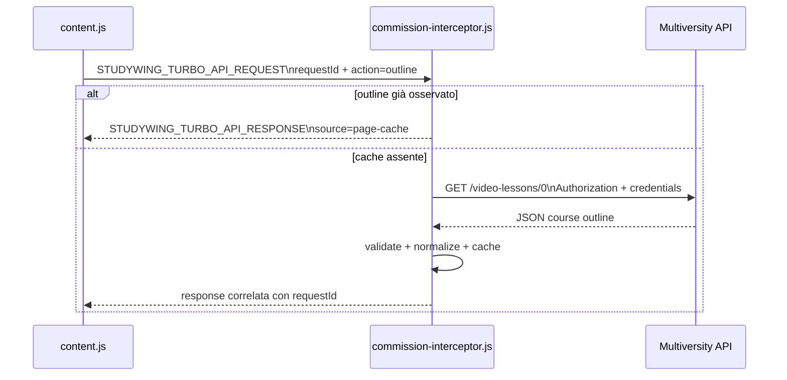
```mermaid
sequenceDiagram
    participant C as content.js
    participant I as commission-interceptor.js
    participant A as Multiversity API

    C->>I: STUDYWING_TURBO_API_REQUEST\nrequestId + action=outline
    alt outline già osservato
        I-->>C: STUDYWING_TURBO_API_RESPONSE\nsource=page-cache
    else cache assente
        I->>A: GET /video-lessons/0\nAuthorization + credentials
        A-->>I: JSON course outline
        I->>I: validate + normalize + cache
        I-->>C: response correlata con requestId
    end
```

Questo diagramma riassume buona parte del capitolo.

---

# Parte XLI — Cosa succede in una richiesta `lesson`

## 89. Il percorso dettagliato

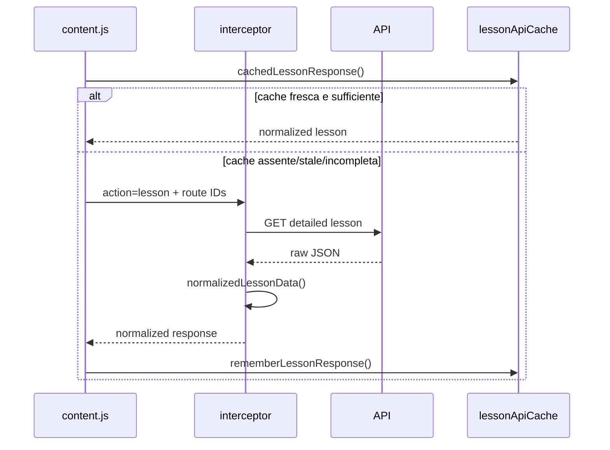
```mermaid
sequenceDiagram
    participant C as content.js
    participant I as interceptor
    participant A as API
    participant M as lessonApiCache

    C->>M: cachedLessonResponse()
    alt cache fresca e sufficiente
        M-->>C: normalized lesson
    else cache assente/stale/incompleta
        C->>I: action=lesson + route IDs
        I->>A: GET detailed lesson
        A-->>I: raw JSON
        I->>I: normalizedLessonData()
        I-->>C: normalized response
        C->>M: rememberLessonResponse()
    end
```

Notiamo che la cache applicativa e quella dell'interceptor hanno ruoli diversi.

---

# Parte XLII — Una analogia backend

## 90. Se PlumePilot fosse un backend

Possiamo immaginare:

```text
content.js
   ≈ domain/service layer

commission-interceptor.js
   ≈ external API client / gateway

normalizeCourseOutline()
normalizedLessonData()
   ≈ DTO mappers

lessonApiCache
   ≈ application cache

window.postMessage + requestId
   ≈ RPC transport
```

L'analogia non è perfetta, ma è molto utile per leggere il codice con concetti che probabilmente hai già incontrato lato backend.

---

# Parte XLIII — Cosa rifaremmo in una codebase più grande?

## 91. Estrarre un vero client API

Se il progetto crescesse molto, potremmo immaginare:

```text
api/
├── platform-client.js
├── course-api.js
├── exams-api.js
├── normalizers.js
├── validators.js
└── errors.js
```

con un'interfaccia tipo:

```js
platformApi.getCourseOutline(courseCode)
platformApi.getLesson(route)
platformApi.completeActivity(activity)
platformApi.getTestSource(test)
```

---

## 92. Perché non era necessario farlo subito

Un'astrazione ha un costo.

Quando il progetto aveva pochi endpoint, concentrare la logica nell'interceptor era una scelta pratica.

Solo quando:

```text
numero di endpoint
+ numero di piattaforme
+ numero di call site
+ complessità errori
```

crescono abbastanza, un modulo più formale diventa chiaramente vantaggioso.

Questo è un buon esempio di **evolutionary architecture**.

---

# Parte XLIV — Errori possibili di un reverse engineering ingenuo

## 93. Copiare una singola request e considerarla il contratto definitivo

Una request osservata una volta può dipendere da:

```text
stato corrente
feature flag
piattaforma
versione frontend
ordine di navigazione
cache
```

Serve più di un esempio.

---

## 94. Assumere che un campo sia sempre presente

Da qui controlli come:

```js
Array.isArray(...)
Number.isInteger(...)
typeof value === "string"
```

Sono noiosi soltanto finché una response non cambia.

---

## 95. Salvare il payload grezzo ovunque

Questo lega tutto il progetto al formato esterno.

Meglio:

```text
raw payload
   ↓
one normalization boundary
   ↓
small internal model
```

---

## 96. Trasportare il token tra troppi componenti

Se il token serve soltanto al client API, deve idealmente restare lì.

---

## 97. Eliminare il fallback troppo presto

Una API inferita può cambiare.

Una UI può cambiare.

Le due debolezze sono diverse.

La strategia ibrida è spesso più robusta di una fede assoluta in una sola sorgente.

---

# Parte XLV — Esercizio guidato: leggere una chiamata come un investigatore

## 98. Immagina questo payload

Supponiamo di osservare:

```json
{
  "code": 200,
  "data": [
    {
      "display_order": 3,
      "folder_id": 2,
      "lp_id": 481,
      "id": 912,
      "title": "Limiti",
      "percentage": 80
    }
  ]
}
```

Prima di guardare la soluzione, prova a classificare i campi.

Domande:

1. Quali sembrano label?
2. Quali sembrano identificatori?
3. Quali potrebbero essere locali a una cartella?
4. Quale useresti per mostrare qualcosa all'utente?
5. Quale useresti per costruire una route?
6. Quale useresti per scegliere dove cercare un'attività incompleta?

---

## 99. Una possibile lettura

```text
display_order → ordine visuale / locale, da verificare
folder_id     → scope/sezione
lp_id         → identificatore tecnico utile alla route
id            → altro identificatore tecnico/paragraph
percentage    → indice di progresso
```

La parola chiave è sempre:

```text
da verificare
```

Reverse engineering serio significa mantenere separate:

```text
osservazione
ipotesi
conferma
```

---

# Parte XLVI — Esercizio: progettare il boundary

## 100. Quale dei due contratti preferisci?

### A

```js
const token = await getToken();
const response = await fetch(url, {
  headers: { Authorization: token }
});
```

in ogni feature.

### B

```js
const lesson = await api.request("lesson", route);
```

con token confinato nel client API.

Per PlumePilot, B è molto più coerente con:

- separation of concerns;
- minimizzazione delle credenziali;
- testabilità;
- possibilità di cambiare l'implementazione interna.

---

# Parte XLVII — Concetti da portarsi dietro

## 101. API adapter

Componente che traduce un'API esterna in un'interfaccia interna più stabile.

## 102. Boundary normalization

Validazione e trasformazione dei dati nel punto in cui entrano nel sistema.

## 103. Bearer token

Credenziale inviata in un header `Authorization: Bearer ...` per autorizzare una richiesta secondo il modello definito dal server.

## 104. Credential minimization

Principio di limitare il numero di componenti e la durata durante cui una credenziale è accessibile.

## 105. Passive caching

Riutilizzo di dati osservati durante richieste che l'applicazione host avrebbe comunque effettuato.

## 106. TTL

Time to live: durata oltre la quale un dato cached viene considerato non abbastanza fresco per determinati usi.

## 107. Semantic retry

Retry eseguito non soltanto per errori di rete, ma perché la risposta ottenuta non contiene ancora i dati necessari.

## 108. Pacing

Distribuzione temporale di una sequenza di richieste valide per evitare burst inutili.

## 109. Graceful degradation

Capacità del sistema di usare un percorso alternativo quando quello preferito non è disponibile.

## 110. Reconciliation

Processo di allineamento tra due rappresentazioni differenti dello stesso dominio.

## 111. Anti-corruption layer

Layer che impedisce al modello di un sistema esterno di propagarsi direttamente nel modello interno dell'applicazione.

## 112. Asymmetric error cost

Situazione in cui due tipi di errore hanno conseguenze diverse e quindi l'algoritmo deve essere prudente soprattutto verso quello più costoso.

## 113. Bounded cache

Cache con un limite esplicito alla quantità di dati che può trattenere.

## 114. Monotonic state

Stato che, secondo le regole del dominio, può avanzare ma non dovrebbe regredire. Il progresso completato è trattato in molti punti di PlumePilot in questo modo.

## 115. Defensive integration

Approccio a un sistema esterno che assume possibili risposte incomplete, cambi di schema e fallimenti, usando validazione, error taxonomy e fallback.

---

# Parte XLVIII — Approfondimenti

## 116. Fetch API

### MDN — Fetch API

https://developer.mozilla.org/en-US/docs/Web/API/Fetch_API

Da studiare soprattutto:

- `Request`;
- `Response`;
- Promise;
- differenza tra errori di rete e status HTTP non-2xx.

---

## 117. Response clone

### MDN — `Response.clone()`

https://developer.mozilla.org/en-US/docs/Web/API/Response/clone

È direttamente collegato al modo in cui `commission-interceptor.js` osserva il JSON senza consumare la response originale della pagina.

---

## 118. Headers

### MDN — `Headers`

https://developer.mozilla.org/en-US/docs/Web/API/Headers

### MDN — `Authorization`

https://developer.mozilla.org/en-US/docs/Web/HTTP/Reference/Headers/Authorization

Studia la differenza tra:

```text
header HTTP
schema Bearer
contenuto reale del token
```

Sono tre livelli concettuali distinti.

---

## 119. AbortController

### MDN — `AbortController`

https://developer.mozilla.org/en-US/docs/Web/API/AbortController

È la base del timeout/cancellation path delle request PlumePilot.

---

## 120. XMLHttpRequest

### MDN — `XMLHttpRequest`

https://developer.mozilla.org/en-US/docs/Web/API/XMLHttpRequest

### MDN — `setRequestHeader()`

https://developer.mozilla.org/en-US/docs/Web/API/XMLHttpRequest/setRequestHeader

Serve a capire perché PlumePilot deve intercettare `open()`, `setRequestHeader()` e `send()` in fasi differenti.

---

## 121. Execution worlds

### Chrome for Developers — `ExecutionWorld`

https://developer.chrome.com/docs/extensions/reference/api/scripting#type-ExecutionWorld

Rileggi la distinzione tra `MAIN` e `ISOLATED` pensando non più al DOM, ma a questo problema:

```text
quale `window.fetch` sto realmente modificando?
```

---

# Parte XLIX — Cosa abbiamo imparato davvero

Il cuore di questo capitolo non è l'elenco degli endpoint.

Gli endpoint possono cambiare.

La parte trasferibile ad altri progetti è il metodo.

Abbiamo visto che una web app può essere letta su più livelli:

```text
UI
DOM
frontend runtime
HTTP requests
API responses
backend state
```

Abbiamo visto che PlumePilot:

```text
osserva il runtime nel MAIN world
        ↓
riconosce soltanto le API origin attese
        ↓
riusa temporaneamente l'autenticazione già presente
        ↓
conserva la credenziale nel componente che ne ha bisogno
        ↓
normalizza i payload esterni
        ↓
espone operazioni interne tramite messaggi
        ↓
usa cache e retry
        ↓riconcilia API e DOM
        ↓
ricade sul percorso visuale quando necessario
```

La lezione più importante può essere riassunta così:

> **Reverse engineering utile non significa conoscere più endpoint possibile. Significa costruire il modello minimo necessario per comprendere il comportamento del sistema, verificare le proprie ipotesi e isolare le dipendenze fragili.**

E c'è una seconda lezione altrettanto importante:

> **Una fonte può essere molto utile senza essere la verità assoluta.**

La master call ne è l'esempio perfetto: è abbastanza informativa da ridurre enormemente lo spazio di ricerca, ma non così infallibile da permetterci di eliminare verifiche e fallback.

---

## Nel prossimo capitolo

Abbiamo ormai incontrato continuamente:

```text
Promise
await
setTimeout
retry
AbortController
listener
requestId
callback
MutationObserver
```

Nel Capitolo 05 fermeremo il tempo e studieremo **che cosa sta realmente facendo JavaScript mentre tutte queste operazioni sembrano accadere insieme**.

# Asincronia JavaScript — eventi, Promise, timeout e race condition

Seguiremo casi reali di PlumePilot per capire:

- call stack;
- task e microtask;
- Promise;
- `async` / `await`;
- callback WebExtension;
- timer;
- timeout applicativi;
- cancellazione;
- operazioni concorrenti;
- race condition;
- serializzazione;
- perché `await` non blocca il browser;
- e perché molti bug "casuali" non sono casuali affatto.

Dopo questo capitolo, una parte molto grande dell'architettura di PlumePilot diventerà molto più leggibile.

---

# 05 — Asincronia JavaScript

## Eventi, Promise, timeout e race condition

Nei capitoli precedenti abbiamo incontrato continuamente istruzioni come:

```js
await requestLessonWithRetry(...);
setTimeout(runCommissionCheck, delay);
chrome.runtime.sendMessage(...);
window.postMessage(...);
new MutationObserver(...);
```

A prima vista sembrano soltanto modi diversi di dire:

> "fai questa cosa più tardi".

Ma sotto questa frase apparentemente semplice si nasconde uno dei modelli mentali più importanti di JavaScript.

PlumePilot è un buon caso di studio perché l'asincronia non viene usata soltanto per rendere l'interfaccia più fluida. Determina direttamente la correttezza del programma.

Un export deve poter essere annullato mentre aspetta.

Due comandi non devono acquisire contemporaneamente la stessa operazione globale.

Un video può terminare mentre la sidebar si aggiorna.

Una risposta API può arrivare dopo che il contesto che l'ha richiesta non è più valido.

Una scheda può essere nascosta durante un'attesa.

Un messaggio deve ricevere una risposta anche se l'handler la produrrà soltanto dopo diversi `await`.

Per capire questi problemi dobbiamo rispondere a una domanda fondamentale:

> **Se JavaScript esegue una sola porzione di codice alla volta, come fanno tutte queste cose a sembrare contemporanee?**

---

# Parte I — Il primo equivoco: "JavaScript è single-threaded, quindi non esistono race condition"

## 1. Una frase vera che può diventare fuorviante

Nel normale JavaScript eseguito sul main thread del browser, una funzione non viene interrotta a metà per eseguire arbitrariamente un'altra funzione JavaScript nello stesso agent.

Il modello è detto **run-to-completion**.

Se stiamo eseguendo:

```js
counter++;
console.log(counter);
```

un altro callback JavaScript non si inserisce magicamente tra le due istruzioni.

Questo è rassicurante.

Ma non significa:

```text
una funzione async esegue dall'inizio alla fine senza interferenze
```

Perché una funzione `async` può volontariamente restituire il controllo all'event loop quando incontra un `await`.

Per esempio:

```js
async function updateSomething() {
  const value = await readState();
  await writeState(value + 1);
}
```

Dal punto di vista logico vediamo:

```text
leggi
incrementa
scrivi
```

ma dal punto di vista temporale accade qualcosa di più simile a:

```text
Task A: legge 10
        ↓ await
        controllo restituito al runtime

Task B: legge 10
        ↓ await

Task A: scrive 11
Task B: scrive 11
```

Il risultato finale è `11`, anche se due operazioni volevano incrementare il valore.

Abbiamo appena costruito una race condition senza usare due thread JavaScript in parallelo.

Questa distinzione sarà centrale in tutto il capitolo.

---

## 2. Concurrency e parallelism non sono sinonimi

Conviene separare subito due termini.

### Concorrenza

Più operazioni possono essere **in corso nello stesso intervallo temporale**, alternando momenti di esecuzione e attesa.

### Parallelismo

Più operazioni vengono realmente eseguite **nello stesso istante** da unità di esecuzione differenti.

Il main thread JavaScript del browser ci offre normalmente molta concorrenza senza richiedere che due callback JavaScript vengano eseguiti contemporaneamente sullo stesso thread.

Per esempio:

```text
JavaScript avvia fetch A
JavaScript avvia fetch B
browser attende entrambe le reti
utente clicca un pulsante
JavaScript gestisce il click
risposta B arriva
JavaScript gestisce B
risposta A arriva
JavaScript gestisce A
```

A livello applicativo A e B sono state concorrenti.

Il loro codice di completamento, invece, viene eseguito secondo il modello dell'event loop.

> **Da backend developer**
>
> È utile pensare alla differenza tra molte richieste I/O in-flight gestite da un runtime event-driven e molti thread che stanno eseguendo simultaneamente codice CPU. Il comportamento osservabile può sembrare simile, ma il modello di sincronizzazione è diverso.

---

# Parte II — Call stack ed event loop

## 3. Il call stack

Quando JavaScript chiama una funzione, il runtime aggiunge un nuovo frame allo **stack di esecuzione**.

Prendiamo:

```js
function a() {
  b();
}

function b() {
  console.log("ciao");
}

a();
```

Possiamo rappresentarlo così:

```text
main
 ↓
a()
 ↓
b()
 ↓
console.log()
```

Quando `console.log()` termina, il suo frame viene rimosso.

Poi termina `b()`.

Poi `a()`.

Finché lo stack contiene codice sincrono da eseguire, quel codice procede secondo **run-to-completion**.

---

## 4. Ma `fetch()` non può tenere occupato lo stack

Consideriamo:

```js
const response = await fetch(url);
```

Una richiesta HTTP potrebbe durare:

```text
20 ms
200 ms
2 s
15 s
```

Se JavaScript bloccasse il main thread per tutto quel tempo, il browser non potrebbe gestire normalmente:

- click;
- scroll;
- repaint;
- altri eventi;
- altri script.

Il runtime fa invece qualcosa concettualmente simile a:

```text
JavaScript: avvia operazione asincrona
        ↓
piattaforma browser: continua il lavoro esterno
        ↓
JavaScript: libera lo stack
        ↓
... altre cose possono accadere ...
        ↓
operazione completata
        ↓
continuazione programmata
```

Questa è la base del modello event-driven del browser.

---

## 5. L'event loop come arbitro

Una versione semplificata del modello può essere rappresentata così:

```text
        ┌─────────────┐
        │  call stack │
        └──────┬──────┘
               │ termina
               ▼
        ┌─────────────┐
        │ microtasks  │
        └──────┬──────┘
               │ svuota
               ▼
        ┌─────────────┐
        │ rendering   │
        └──────┬──────┘
               ▼
        ┌─────────────┐
        │ next task   │
        └─────────────┘
```

È una semplificazione, ma sufficiente per costruire un modello utile.

Il browser dispone di meccanismi esterni che possono produrre lavoro futuro:

```text
network
setTimeout
click
postMessage
MutationObserver
WebExtension messaging
```

Quando quel lavoro deve tornare nel JavaScript, viene programmato secondo le regole del runtime.

---

# Parte III — Task e microtask

## 6. Non tutto il lavoro asincrono entra nella stessa coda

Una distinzione particolarmente importante è quella tra:

```text
task
microtask
```

In modo semplificato:

- eventi e timer vengono normalmente gestiti attraverso task;
- le continuazioni delle Promise vengono eseguite come microtask;
- `MutationObserver` usa anch'esso il meccanismo delle microtask.

Dopo la fine del task corrente, il runtime esegue le microtask in attesa prima di passare al task successivo.

Questo spiega alcuni ordini di esecuzione che inizialmente possono sembrare strani.

---

## 7. Un esempio minimo

Considera:

```js
console.log("A");

setTimeout(() => console.log("B"), 0);

Promise.resolve().then(() => console.log("C"));

console.log("D");
```

Un modello mentale corretto porta a:

```text
A
D
C
B
```

Perché:

1. `A` è sincrono;
2. `setTimeout` programma lavoro futuro;
3. `.then()` programma una microtask;
4. `D` è ancora sincrono;
5. terminato il task corrente, viene svuotata la microtask queue → `C`;
6. poi potrà essere eseguito il task del timer → `B`.

Non serve memorizzare ogni dettaglio dell'HTML specification per lavorare bene su PlumePilot.

Serve però capire questo principio:

> **"asincrono" non significa "ordine casuale". Esistono regole di scheduling precise.**

---

## 8. `setTimeout(fn, 0)` non significa "adesso"

Un errore molto comune è leggere:

```js
setTimeout(callback, 0);
```

come:

```text
esegui immediatamente callback
```

In realtà significa più correttamente:

```text
non eseguire prima che sia trascorso il delay minimo
poi rendi callback eleggibile per una futura esecuzione
```

Il callback può quindi eseguire più tardi.

In PlumePilot troviamo, per esempio:

```js
setTimeout(() => {
  const selected = currentLesson();
  if (selected) rememberPlaybackLesson(selected);
}, 0);
```

Riferimento: [`content.js` L7080-L7088](https://github.com/PlumePilot/plumepilot/blob/a8007425f81792e7570516dbdf1e7fb2cbda4d53/content.js#L7080-L7088).

Qui il significato non è:

```text
aspetta zero millisecondi
```

ma:

```text
lascia terminare il click corrente
lascia che la pagina aggiorni la propria selezione
poi rileggi il DOM in un task successivo
```

È un uso temporale deliberato.

---

# Parte IV — Promise: rappresentare un risultato futuro

## 9. Una Promise non è il risultato

Una `Promise` rappresenta un valore che può diventare disponibile in futuro.

Può trovarsi in uno di tre stati concettuali:

```text
pending
fulfilled
rejected
```

Per esempio:

```js
const promise = fetch(url);
```

`promise` non contiene ancora la risposta HTTP.

Contiene una rappresentazione dell'operazione che produrrà quella risposta oppure un errore.

---

## 10. Perché PlumePilot crea Promise manualmente

Molte API Web moderne restituiscono già Promise.

Ma diverse API WebExtension usate dal progetto adottano ancora una forma callback-based.

Per esempio:

```js
chrome.storage.local.get(key, callback);
```

Nel background PlumePilot costruisce piccoli wrapper:

```js
const storageGet = (key) =>
  new Promise((resolve, reject) =>
    chrome.storage.local.get(key, (result) =>
      chrome.runtime.lastError
        ? reject(new Error(chrome.runtime.lastError.message))
        : resolve(result[key] || null)
    )
  );
```

Riferimento: [`background.js` L40-L43](https://github.com/PlumePilot/plumepilot/blob/a8007425f81792e7570516dbdf1e7fb2cbda4d53/background.js#L40-L43).

La trasformazione è:

```text
callback API
    ↓
Promise wrapper
    ↓
async / await
```

Questo evita di propagare callback annidate in tutta l'architettura.

> **Concetto generale**
>
> Se un sistema contiene un boundary asincrono legacy, spesso conviene convertirlo in Promise vicino al boundary e usare un solo modello asincrono nel resto del codice.

---

# Parte V — `async` e `await`

## 11. Cosa fa realmente `async`

Una funzione dichiarata:

```js
async function example() {
  return 42;
}
```

restituisce una Promise.

Concettualmente:

```js
example();
```

produce qualcosa equivalente a:

```js
Promise.resolve(42);
```

Se invece la funzione lancia un errore:

```js
async function example() {
  throw new Error("boom");
}
```

la Promise viene rejected.

---

## 12. `await` non blocca il browser

Questa riga:

```js
const operation = await currentOperation();
```

non significa:

```text
ferma tutto JavaScript finché currentOperation non termina
```

Significa concettualmente:

```text
sospendi questa funzione async
restituisci il controllo al runtime
quando la Promise termina, pianifica la continuazione
```

Questa distinzione spiega perché durante un export l'utente può ancora:

- interagire con la pagina;
- chiedere l'annullamento;
- ricevere aggiornamenti;
- cambiare scheda.

---

## 13. `await` divide una funzione in segmenti temporali

Consideriamo:

```js
async function acquire(kind, sourceTabId) {
  return serialized(async () => {
    let existing = await currentOperation();
    // ...
    await storageSet({ [OPERATION_KEY]: operation });
    return { accepted: true, operation };
  });
}
```

Riferimento: [`background.js` L620-L641](https://github.com/PlumePilot/plumepilot/blob/a8007425f81792e7570516dbdf1e7fb2cbda4d53/background.js#L620-L641).

Possiamo immaginarla come segmenti:

```text
segmento A
  ↓ await currentOperation()
--- sospensione ---
segmento B
  ↓ await tabExists(...)
--- sospensione ---
segmento C
  ↓ await storageSet(...)
--- sospensione ---
segmento D
```

Tra due segmenti, altro codice può essere eseguito.

È precisamente qui che nasce la necessità di ragionare sulle invarianti condivise.

---

# Parte VI — La race condition più istruttiva di PlumePilot

## 14. Il problema di `acquire()` senza serializzazione

Immaginiamo temporaneamente che `acquire()` non sia protetta da `serialized()`.

Due contesti inviano quasi nello stesso momento:

```text
A: voglio iniziare export dispense
B: voglio iniziare Turbo Test
```

Entrambi eseguono:

```js
const existing = await currentOperation();
```

Supponiamo che non esista ancora nessuna operazione.

Un'interleaving possibile sarebbe:

```text
A legge: null
             ↓ A sospeso
B legge: null
             ↓ B sospeso
A crea operation-A
B crea operation-B
```

Entrambe le richieste crederebbero legittimamente di aver acquisito la risorsa.

Abbiamo violato la regola di dominio:

```text
una sola operazione PlumePilot globale alla volta
```

---

## 15. Perché il single thread non ci salva

Nessuna istruzione JavaScript è stata interrotta a metà.

Il problema si trova tra due `await`.

Ogni segmento sincrono è stato eseguito completamente.

Ma l'operazione logica:

```text
leggi stato
verifica disponibilità
scrivi nuovo stato
```

non era atomica.

Questa è una race condition applicativa.

> **Da backend developer**
>
> È molto simile a un classico read-modify-write su database privo di transazione o lock. Non importa che ciascuna singola query sia atomica: la sequenza complessiva può comunque essere vulnerabile all'interleaving.

---

# Parte VII — `serialized()`: una coda Promise come lock logico

## 16. Il codice

In `background.js` troviamo:

```js
function serialized(task) {
  const next = operationQueue.then(task, task);
  operationQueue = next.catch(() => {});
  return next;
}
```

Riferimento: [`background.js` L44-L49](https://github.com/PlumePilot/plumepilot/blob/a8007425f81792e7570516dbdf1e7fb2cbda4d53/background.js#L44-L49).

Il progetto mantiene code separate per:

```text
operazioni
builder
commissione
soglia corso
achievement
suoni
```

Questo è molto interessante.

Non esiste un mutex del sistema operativo.

Esiste invece una **catena di Promise**.

---

## 17. Come funziona la catena

Supponiamo:

```text
operationQueue = Promise già risolta
```

Arriva il task A:

```js
const nextA = operationQueue.then(A, A);
operationQueue = nextA.catch(() => {});
```

Poi arriva B prima che A termini:

```js
const nextB = operationQueue.then(B, B);
```

Ma `operationQueue` ora rappresenta la conclusione di A.

Quindi B non parte fino a quando la catena precedente non si è conclusa.

Il flusso diventa:

```text
A
↓
B
↓
C
↓
D
```

anziché:

```text
A ─┐
B ─┼─ interleaving
C ─┘
```

---

## 18. Perché `then(task, task)`?

La forma:

```js
operationQueue.then(task, task)
```

significa:

```text
esegui il task successivo
sia se la coda precedente è fulfilled
sia se è rejected
```

Altrimenti un errore precedente potrebbe "avvelenare" permanentemente la coda.

Poi:

```js
operationQueue = next.catch(() => {});
```

assicura che la Promise usata come coda interna torni in uno stato risolto per i task futuri.

Importante: il chiamante riceve comunque `next`, quindi il suo task può ancora risultare rejected.

La coda assorbe l'errore **per la continuità della serializzazione**, non per nascondere l'errore al chiamante.

---

## 19. Critical section logica

Possiamo ora definire meglio il concetto.

Una **critical section** è una regione in cui accediamo a uno stato condiviso e dobbiamo impedire interleaving incompatibili.

Per PlumePilot:

```text
currentOperation()
      ↓
verifica owner
      ↓
crea / aggiorna / rilascia operation
```

è una critical section logica.

`serialized()` fa sì che le mutazioni relative a quello stato attraversino una corsia unica.

---

# Parte VIII — Lock globale o code per dominio?

## 20. Perché non usare una sola coda per tutto

PlumePilot non usa:

```js
oneGlobalQueue
```

per qualsiasi attività.

Usa, per esempio:

```text
operationQueue
commissionQueue
achievementQueue
soundQueue
```

Questa è una scelta architetturale importante.

Se due operazioni non condividono la stessa invariante, serializzarle artificialmente riduce la concorrenza senza aumentare la correttezza.

Per esempio:

```text
aggiornare un achievement
```

non dovrebbe necessariamente impedire:

```text
riprodurre un suono
```

La domanda corretta non è:

> "Come impedisco qualsiasi concorrenza?"

ma:

> **"Quale stato condiviso deve essere protetto dallo stesso ordine totale?"**

---

# Parte IX — Guard semplici: `busy`

## 21. Non tutte le race richiedono una coda

L'autoplay usa anche una strategia più locale:

```js
if (busy || v !== lastVideo) {
  return;
}

busy = true;

try {
  // avanzamento asincrono
} finally {
  busy = false;
}
```

Riferimento: [`content.js` L6665-L6671](https://github.com/PlumePilot/plumepilot/blob/a8007425f81792e7570516dbdf1e7fb2cbda4d53/content.js#L6665-L6671) e [`content.js` L6812-L6815](https://github.com/PlumePilot/plumepilot/blob/a8007425f81792e7570516dbdf1e7fb2cbda4d53/content.js#L6812-L6815).

`busy` impedisce che due tentativi di `advance()` procedano contemporaneamente nello stesso contesto.

È un piccolo **reentrancy guard**.

---

## 22. Reentrancy

Una funzione è vulnerabile alla reentrancy quando può essere richiamata nuovamente prima che la precedente esecuzione logica sia terminata.

Nel nostro caso diversi segnali potrebbero teoricamente provocare un nuovo tentativo di avanzamento mentre il precedente sta ancora:

```text
aspettando il 100%
riaprendo un capitolo
completando un test
cercando il prossimo video
```

Il flag:

```js
busy = true
```

stabilisce un'invariante locale:

```text
massimo un workflow advance attivo per volta
```

---

## 23. Perché `finally` è fondamentale

Immagina:

```js
busy = true;
await something();
busy = false;
```

Se `something()` lancia un errore oppure una delle numerose condizioni produce un `return` anticipato, rischiamo di non arrivare mai al reset.

Con:

```js
try {
  ...
} finally {
  busy = false;
}
```

il cleanup viene eseguito anche in presenza di:

- `return`;
- `throw`;
- Promise rejected.

Questo pattern compare molte volte nel progetto.

> **Regola pratica**
>
> Quando una funzione acquisisce uno stato temporaneo — lock, flag, timer, controller, lease, risorsa — chiediti subito dove viene garantito il rilascio in ogni exit path.

---

# Parte X — Gli `await` invalidano le nostre assunzioni

## 24. Prima dell'`await` il mondo è così. Dopo potrebbe non esserlo più.

Consideriamo l'autoplay:

```js
let cur = await recoverPlaybackLesson(v);

if (!enabled || v !== lastVideo) return;
```

Perché controllare di nuovo `enabled`?

Non lo avevamo già verificato prima?

Sì.

Ma durante:

```js
await recoverPlaybackLesson(v)
```

l'utente potrebbe aver disattivato l'autoplay.

Oppure il player potrebbe essere cambiato.

Quindi una condizione vera prima dell'`await` non è automaticamente ancora vera dopo.

---

## 25. Questo pattern compare continuamente

Dopo aver aspettato il completamento della lezione, PlumePilot verifica di nuovo:

```js
if (
  !enabled ||
  v !== lastVideo ||
  video() !== v ||
  !stableCur ||
  playbackLessonRow(completedLesson) !== stableCur
) {
  return;
}
```

Riferimento: [`content.js` L6694-L6699](https://github.com/PlumePilot/plumepilot/blob/a8007425f81792e7570516dbdf1e7fb2cbda4d53/content.js#L6694-L6699).

Questa non è paranoia.

È una conseguenza diretta dell'asincronia.

Ogni `await` è un potenziale punto in cui:

```text
utente cambia impostazioni
DOM cambia
pagina cambia route
operazione viene annullata
un altro workflow modifica lo stato
```

---

## 26. Il pattern "check → await → re-check"

Uno schema molto generale è:

```text
controlla precondizione
        ↓
await lavoro asincrono
        ↓
ricontrolla l'invariante
        ↓
continua soltanto se è ancora valida
```

In codice:

```js
if (!enabled) return;

await slowOperation();

if (!enabled) return;
```

È uno dei pattern più importanti da ricordare quando lavori con UI e stato mutabile.

---
# Parte XI — Aspettare una condizione, non semplicemente del tempo

## 27. `sleep()`

PlumePilot definisce:

```js
const sleep = (ms) => new Promise((r) => setTimeout(r, ms));
```

Questo trasforma un timer in una Promise e permette:

```js
await sleep(250);
```

Ma un `sleep()` puro risponde soltanto alla domanda:

```text
è passato abbastanza tempo?
```

Non risponde a:

```text
la pagina è pronta?
```

---

## 28. `waitFor()`

Per questo il progetto usa:

```js
async function waitFor(fn, timeout = WAIT_MS) {
  let start = Date.now();

  while (Date.now() - start < timeout) {
    const x = fn();
    if (x) return x;
    await sleep(100);
  }

  return null;
}
```

La versione reale gestisce anche schede nascoste e una seconda finestra di attesa.

Riferimento: [`content.js` L1577-L1609](https://github.com/PlumePilot/plumepilot/blob/a8007425f81792e7570516dbdf1e7fb2cbda4d53/content.js#L1577-L1609).

Qui il tempo non determina il successo.

Il tempo determina soltanto una deadline.

Il successo dipende da una **readiness condition**.

---

## 29. Polling asincrono

`waitFor()` è una forma di polling:

```text
controlla
  ↓ no
aspetta 100 ms
  ↓
controlla
  ↓ no
aspetta
  ↓
...
  ↓ sì
ritorna
```

È importante notare che:

```js
await sleep(100)
```

non blocca il thread per 100 ms.

Durante quei 100 ms il browser può fare altro.

---

# Parte XII — Timer: delay minimo, non appuntamento preciso

## 30. Il monitor della commissione

In `bridge.js` troviamo:

```js
function scheduleCommissionCheck(delayMs = 0) {
  clearTimeout(commissionCheckTimer);
  commissionCheckTimer = null;
  if (!commissionCheckEnabled || !pageIsVisible()) return;
  commissionCheckTimer = setTimeout(
    runCommissionCheck,
    Math.max(0, Number(delayMs) || 0),
  );
}
```

Riferimento: [`bridge.js` L112-L117](https://github.com/PlumePilot/plumepilot/blob/a8007425f81792e7570516dbdf1e7fb2cbda4d53/bridge.js#L112-L117).

Questo codice insegna almeno tre cose.

---

## 31. Primo: un timer va spesso sostituito, non accumulato

Prima di crearne uno nuovo:

```js
clearTimeout(commissionCheckTimer);
```

Così il sistema mantiene concettualmente:

```text
al massimo un check futuro pianificato
```

Senza questa precauzione, eventi diversi potrebbero accumulare timer duplicati.

---

## 32. Secondo: il tempo non è l'unica precondizione

Il timer viene creato soltanto se:

```js
commissionCheckEnabled && pageIsVisible()
```

Lo scheduling temporale viene quindi subordinato allo stato corrente.

---

## 33. Terzo: `delayMs` non è un orario garantito

`setTimeout(fn, 1000)` non promette:

```text
fn partirà esattamente fra 1000 ms
```

Promette, semplificando:

```text
fn non sarà resa eseguibile prima del delay previsto
```

Se il main thread è occupato, se la scheda è throttled o se esistono altri task, il callback può arrivare dopo.

Questo è uno dei motivi per cui PlumePilot usa spesso timestamp reali come:

```js
Date.now()
```

anziché assumere che ogni timer abbia scandito il tempo perfettamente.

---

# Parte XIII — Schede nascoste e tempo del browser

## 34. Un browser non è un cronometro ideale

I browser possono ridurre la frequenza dei timer delle schede in background.

Per un'estensione che lavora dentro una pagina host questo è importante.

PlumePilot tiene conto della visibility durante diverse attese.

La funzione `waitFor()` conserva:

```text
hiddenEpochAtStart
startedHidden
```

poi, se il timeout è maturato mentre la pagina era nascosta, può attendere il ritorno alla visibilità prima di concedere un secondo tentativo.

Questo evita di interpretare:

```text
la scheda non ha avuto opportunità di aggiornarsi
```

come:

```text
la piattaforma è definitivamente rotta
```

---

# Parte XIV — Un timeout applicativo non è un `sleep`

## 35. `turboApiRequest()`

Nel Capitolo 04 abbiamo visto la mini-RPC tra `content.js` e `commission-interceptor.js`.

Ora guardiamola dal punto di vista temporale:

```js
function turboApiRequest(action, payload = {}) {
  return new Promise((resolve) => {
    const requestId = `studywing-${Date.now()}-${++turboApiRequestSequence}`;

    const timeout = setTimeout(() => {
      pendingTurboApiRequests.delete(requestId);
      resolve({ ok: false, error: "RESPONSE_TIMEOUT" });
    }, TURBO_API_RESPONSE_TIMEOUT_MS);

    pendingTurboApiRequests.set(requestId, { resolve, timeout });

    window.postMessage({
      type: TURBO_API_REQUEST,
      requestId,
      action,
      ...payload,
    }, "*");
  });
}
```

Riferimento: [`content.js` L4904-L4923](https://github.com/PlumePilot/plumepilot/blob/a8007425f81792e7570516dbdf1e7fb2cbda4d53/content.js#L4904-L4923).

Il timeout qui non dice:

```text
aspetta 17 secondi prima di procedere
```

Dice:

```text
questa Promise non può restare pending indefinitamente
```

È una **deadline applicativa**.

---

## 36. Perché serve una deadline

Immaginiamo che il MAIN world non risponda più perché:

- la pagina cambia;
- il listener sparisce;
- la navigazione interrompe il workflow;
- si verifica un errore inatteso;
- la risposta viene persa.

Senza timeout:

```text
pendingTurboApiRequests
```

potrebbe conservare per sempre:

```text
requestId → resolve
```

E il chiamante rimarrebbe sospeso per sempre su:

```js
await turboApiRequest(...)
```

La deadline trasforma un fallimento silenzioso in un risultato esplicito:

```js
{ ok: false, error: "RESPONSE_TIMEOUT" }
```

---

# Parte XV — Correlation ID e concorrenza

## 37. Perché serve `requestId`

Più richieste possono essere in-flight:

```text
request A → lesson 1
request B → lesson 2
request C → outline
```

Le risposte possono arrivare in ordine diverso:

```text
B
A
C
```

Non possiamo quindi usare semplicemente:

```text
"la prossima risposta appartiene all'ultima richiesta"
```

Serve correlazione esplicita.

Il `Map`:

```js
pendingTurboApiRequests
```

funge da registro:

```text
requestId-A → resolver-A
requestId-B → resolver-B
requestId-C → resolver-C
```

Quando arriva una risposta, il sistema risolve esattamente la Promise corrispondente.

---

## 38. Async request multiplexing

Possiamo descrivere questo pattern come un piccolo multiplexer RPC:

```text
                ┌─ request A ─────────┐
content.js ─────┼─ request B ─────────┼──► MAIN world
                └─ request C ─────────┘

                ┌─ response B ◄───────┐
content.js ◄────┼─ response A ◄───────┼── MAIN world
                └─ response C ◄───────┘
```

Il tempo di completamento non deve coincidere con l'ordine di invio.

Il `requestId` separa **ordine temporale** e **identità logica**.

---

# Parte XVI — Cancellare davvero un'operazione

## 39. Una Promise non si cancella magicamente

Se abbiamo:

```js
const p = fetch(url);
```

non possiamo semplicemente "cancellare la Promise" come concetto generale.

Una Promise rappresenta il risultato.

Per interrompere davvero il lavoro dobbiamo cancellare, quando possibile, **l'operazione sottostante**.

Per `fetch()`, il browser offre `AbortController`.

---

## 40. `AbortController` nelle API PlumePilot

In `commission-interceptor.js`:

```js
const controller = new AbortController();
const timeout = setTimeout(() => controller.abort(), API_TIMEOUT_MS);

try {
  const response = await originalFetch.call(window, url, {
    ...options,
    signal: controller.signal,
  });
  // ...
} finally {
  clearTimeout(timeout);
  turboControllers.delete(message.requestId);
}
```

Riferimento: [`commission-interceptor.js` L500-L529](https://github.com/PlumePilot/plumepilot/blob/a8007425f81792e7570516dbdf1e7fb2cbda4d53/commission-interceptor.js#L500-L529).

Il controller collega due mondi:

```text
nostra intenzione: annulla
       ↓
AbortSignal
       ↓
operazione fetch
```

---

## 41. Un timeout costruito sopra la cancellazione

Notiamo una cosa elegante:

```js
setTimeout(() => controller.abort(), API_TIMEOUT_MS)
```

Il timeout non produce direttamente il fallimento.

Produce invece un segnale di abort verso l'operazione reale.

Il flusso è:

```text
request parte
   ↓
timer parte
   ↓
request termina prima?
   ├─ sì → clearTimeout
   └─ no → abort()
            ↓
         fetch termina con AbortError
```

Questo evita di avere una request reale che continua silenziosamente dopo che il chiamante l'ha già considerata fallita.

---

# Parte XVII — Cancellazione collettiva

## 42. `turboControllers`

Ogni request attiva viene associata al proprio controller:

```js
turboControllers.set(message.requestId, controller);
```

Quando arriva:

```text
STUDYWING_TURBO_API_CANCEL
```

l'interceptor esegue:

```js
for (const controller of turboControllers.values()) {
  controller.abort();
}

turboControllers.clear();
```

Riferimento: [`commission-interceptor.js` L792-L795](https://github.com/PlumePilot/plumepilot/blob/a8007425f81792e7570516dbdf1e7fb2cbda4d53/commission-interceptor.js#L792-L795).

Il `Map` non serve quindi soltanto a tracciare richieste.

È anche un registry delle operazioni cancellabili in-flight.

---

# Parte XVIII — Cancellazione cooperativa

## 43. Non tutto supporta `AbortSignal`

Molte operazioni di PlumePilot non sono una singola `fetch()`.

Un export può essere:

```text
apri sezione
aspetta rendering
leggi capitolo
richiedi API
aspetta pacing
apri capitolo successivo
...
```

Non esiste necessariamente un'unica API nativa che possiamo abortire.

Qui entra la **cancellazione cooperativa**.

---

## 44. `ensureExportNotCancelled()`

PlumePilot controlla periodicamente:

```js
function ensureExportNotCancelled(operationId) {
  if (
    exportCancelRequested &&
    operationId &&
    operationId === activeExportOperationId
  ) {
    throw exportAbortError();
  }
}
```

Riferimento: [`content.js` L1611-L1625](https://github.com/PlumePilot/plumepilot/blob/a8007425f81792e7570516dbdf1e7fb2cbda4d53/content.js#L1611-L1625).

Il workflow accetta quindi implicitamente un contratto:

```text
tra un passo e l'altro controllerò se devo fermarmi
```

---

## 45. Anche il `sleep` diventa cancellabile

Un semplice:

```js
await sleep(3000);
```

non reagirebbe alla cancellazione fino al termine dei tre secondi.

Per questo esiste:

```js
async function exportSleep(ms, operationId) {
  const end = Date.now() + ms;

  while (Date.now() < end) {
    ensureExportNotCancelled(operationId);
    await sleep(Math.min(100, end - Date.now()));
  }

  ensureExportNotCancelled(operationId);
}
```

Riferimento: [`content.js` L1627-L1634](https://github.com/PlumePilot/plumepilot/blob/a8007425f81792e7570516dbdf1e7fb2cbda4d53/content.js#L1627-L1634).

Il delay lungo viene spezzato in piccole finestre di cooperazione.

---

## 46. Responsiveness della cancellazione

Questa struttura stabilisce una proprietà misurabile:

```text
latenza massima teorica di reazione durante quel sleep ≈ 100 ms
```

Non è un dettaglio cosmetico.

È parte dell'UX.

Un pulsante "Annulla" che reagisce dopo 10 secondi sembra rotto anche se tecnicamente funziona.

---

# Parte XIX — `AbortController` nel builder EPUB

## 47. Un altro tipo di cancellazione

Nel builder:

```js
buildController = format === "epub"
  ? new AbortController()
  : null;
```

Il signal viene passato a:

```js
buildCourseEpub(..., {
  signal: buildController.signal,
});
```

E il pulsante esegue:

```js
buildController.abort();
```

Riferimento: [`materials-builder.js` L134-L175](https://github.com/PlumePilot/plumepilot/blob/a8007425f81792e7570516dbdf1e7fb2cbda4d53/materials-builder.js#L134-L175) e [`materials-builder.js` L179-L185](https://github.com/PlumePilot/plumepilot/blob/a8007425f81792e7570516dbdf1e7fb2cbda4d53/materials-builder.js#L179-L185).

Qui il signal non cancella una `fetch` specifica.

Diventa un protocollo generico di cancellazione tra builder UI e motore EPUB.

---

# Parte XX — `try/catch/finally` nei workflow asincroni

## 48. Il builder come esempio completo

Il cuore del builder segue:

```text
acquire
  ↓
try
  build
  download
catch
  mostra errore / annullamento
finally
  release
  pulisci controller
  ripristina UI
```

Questa è una struttura particolarmente robusta.

Il `finally` contiene ciò che deve succedere indipendentemente dall'esito.

---

## 49. Failure path e cancellation path non sono identici

Il builder distingue:

```js
const cancelled = error?.name === "AbortError";
```

Poi presenta messaggi diversi.

Questo riflette una distinzione semantica importante:

```text
failure     = qualcosa non ha funzionato come previsto
cancellation = l'utente ha chiesto intenzionalmente di fermarsi
```

Entrambi possono usare il meccanismo delle eccezioni per interrompere il flusso, ma non sono lo stesso evento di dominio.

---

# Parte XXI — Error propagation con Promise

## 50. `throw` dentro una funzione async

In una funzione `async`:

```js
throw new Error("x");
```

produce una Promise rejected.

Quindi:

```js
await functionThatFails();
```

fa emergere l'errore nel punto dell'`await`, dove può essere gestito con:

```js
try {
  await ...;
} catch (error) {
  ...
}
```

Questo permette di scrivere workflow asincroni con una struttura simile al codice sincrono.

---

## 51. `action.then(sendResponse).catch(...)`

Il dispatcher del background termina con:

```js
action
  .then(sendResponse)
  .catch((error) => {
    console.error(...);
    sendResponse({ accepted: false, reason: error.message });
  });

return true;
```

Riferimento: [`background.js` L918-L945](https://github.com/PlumePilot/plumepilot/blob/a8007425f81792e7570516dbdf1e7fb2cbda4d53/background.js#L918-L945).

Qui il background trasforma:

```text
Promise fulfilled → protocol response success
Promise rejected  → protocol response error
```

Il boundary di messaging diventa quindi anche un **error boundary**.

---

# Parte XXII — Perché `return true` è ancora asincronia

## 52. Il listener potrebbe terminare prima della risposta

Il listener WebExtension viene chiamato sincronicamente quando arriva il messaggio.

Ma l'azione scelta può richiedere:

```text
storage
network
messaggi a tab
creazione builder
```

Quindi `sendResponse()` verrà chiamato in futuro.

Il `return true` comunica al runtime:

```text
non chiudere ancora il canale di risposta
risponderò asincronamente
```

Abbiamo già incontrato il comportamento nel Capitolo 02.

Ora possiamo collocarlo nel modello dell'event loop:

```text
listener task
   ↓
avvia Promise
   ↓
return true
   ↓
listener termina
   ↓
... runtime continua ...
   ↓
Promise settle
   ↓
.then(sendResponse)
```

---

# Parte XXIII — Fire-and-forget controllato

## 53. Non tutto deve essere `await`-ato

In `content.js` troviamo:

```js
void collectCourseMaterials(format, operationId).finally(() => {
  log("Export collection request finished.", { operationId, format });
});
```

Il chiamante del messaggio risponde subito:

```text
richiesta accettata
```

senza aspettare che l'intero export termini.

Questo è appropriato perché l'operazione lunga possiede un proprio protocollo di stato.

---

## 54. Command accepted ≠ operation completed

È una distinzione fondamentale nei sistemi asincroni.

Possiamo avere:

```text
POST /job
→ 202 Accepted
```

oppure, nel nostro caso:

```text
PEGASO_COLLECT_COURSE_MATERIALS
→ accepted: true
```

Il significato è:

```text
il workflow è partito
```

non:

```text
il file è pronto
```

Lo stato successivo viene comunicato tramite altri eventi e messaggi.

Questo modello assomiglia molto a job queue e background processing lato server.

---

# Parte XXIV — Fire-and-forget non significa ignorare gli errori

## 55. Il rischio di `void somePromise()`

Se facessimo soltanto:

```js
void doSomethingAsync();
```

una rejection non gestita potrebbe diventare un errore difficile da correlare.

Quando scegliamo volontariamente il fire-and-forget dovremmo comunque definire:

```text
chi osserva il fallimento?
chi pulisce lo stato?
chi notifica l'utente?
```

Nel workflow export, la funzione stessa pubblica status/failure event e contiene cleanup.

Quindi l'assenza di `await` nel chiamante non equivale all'assenza di ownership.

---

# Parte XXV — `Promise.allSettled()`

## 56. Quando vogliamo tutti i risultati, anche quelli falliti

Per cancellare la memoria commissione in tutte le tab:

```js
const results = await Promise.allSettled(
  tabs
    .filter((tab) => Number.isInteger(tab?.id))
    .map((tab) =>
      sendTabMessage(tab.id, {
        type: "PEGASO_CLEAR_COMMISSION_MEMORY",
      })
    ),
);
```

Riferimento: [`background.js` L684-L698](https://github.com/PlumePilot/plumepilot/blob/a8007425f81792e7570516dbdf1e7fb2cbda4d53/background.js#L684-L698).

Perché `allSettled()` e non `Promise.all()`?

---

## 57. `Promise.all()` è fail-fast

Concettualmente:

```js
await Promise.all([A, B, C]);
```

se B viene rejected, la Promise aggregata viene rejected.

Questo è utile quando:

```text
tutte le operazioni sono necessarie al risultato complessivo
```

Ma qui le tab sono indipendenti.

Una tab potrebbe essere appena stata chiusa.

Vogliamo comunque contattare le altre.

---

## 58. `Promise.allSettled()` conserva il risultato di tutti

Il risultato contiene elementi del tipo:

```js
{ status: "fulfilled", value: ... }
```

oppure:

```js
{ status: "rejected", reason: ... }
```

Il background può quindi calcolare:

```js
results.filter(
  (result) =>
    result.status === "fulfilled" &&
    result.value?.accepted
).length;
```

Il modello semantico è:

```text
best effort verso molte destinazioni indipendenti
```

---

# Parte XXVI — Parallelizzare o serializzare?

## 59. Due strumenti opposti, entrambi corretti

Abbiamo visto:

```text
serialized()       → forza ordine
Promise.allSettled → permette concorrenza
```

Non sono contraddittori.

Risolvono problemi diversi.

### Serializzare quando

- le operazioni condividono stato mutabile;
- l'ordine è semanticamente importante;
- un read-modify-write deve essere protetto;
- due workflow non possono convivere.

### Concorrere quando

- le operazioni sono indipendenti;
- l'ordine non importa;
- vogliamo ridurre la latenza totale;
- ogni risultato può essere gestito separatamente.

La capacità importante non è "usare Promise".

È scegliere **quale relazione temporale è corretta per il dominio**.

---

# Parte XXVII — Backpressure e pacing

## 60. Potremmo lanciare cento request insieme. Ma dovremmo?

Nel Capitolo 04 abbiamo incontrato:

```js
await exportSleep(API_MATERIAL_PACING_MS, operationId);
```

tra richieste successive.

Questa scelta riduce volontariamente la concorrenza.

Perché?

Perché massimizzare il parallelismo non significa automaticamente massimizzare l'affidabilità.

Un burst di richieste può:

- aumentare carico;
- rendere più difficile la cancellazione;
- produrre risposte temporaneamente incomplete;
- consumare più memoria;
- complicare il progresso osservabile.

Il pacing è una forma semplice di **backpressure applicativa**.

---

# Parte XXVIII — `finally` e cleanup temporale

## 61. Timer e controller devono avere una vita definita

In `executeTurboApiRequest()`:

```js
finally {
  clearTimeout(timeout);
  turboControllers.delete(message.requestId);
}
```
Questo garantisce che, indipendentemente da:

```text
success
HTTP error
JSON error
abort
exception
```

non rimangano:

```text
timer inutili
controller stale
entry in-flight obsolete
```

Possiamo leggere `finally` come:

> **ripristina le invarianti temporanee del workflow**.

---

# Parte XXIX — Resource lifetime

## 62. Ogni operazione asincrona possiede risorse

Non pensiamo soltanto a memoria o file.

Un workflow asincrono può possedere:

```text
timer
listener
AbortController
Map entry
operationId
flag busy
lease
builder tab
storage job
```

Queste risorse hanno un lifetime.

La domanda architetturale è:

```text
chi le crea?
chi ne è owner?
quando vengono distrutte?
che succede se il workflow fallisce a metà?
```

Questa prospettiva è molto utile quando un bug sembra essere "uno stato rimasto appeso".

---

# Parte XXX — Lost wakeup e startup ordering

## 63. Un evento può arrivare prima che qualcuno lo ascolti

Nel Capitolo 02 abbiamo visto il problema:

```text
bridge pubblica stato autoplay
        ↓
content.js non ha ancora installato listener
        ↓
evento perso
```

Questo non è un problema di sintassi.

È un problema temporale.

La soluzione usata da PlumePilot è:

```js
window.postMessage({
  type: "PEGASO_AUTONEXT_STATE_REQUEST",
}, "*");
```

subito dopo aver installato il listener.

Riferimento: [`content.js` L557-L559](https://github.com/PlumePilot/plumepilot/blob/a8007425f81792e7570516dbdf1e7fb2cbda4d53/content.js#L557-L559).

Il pattern è:

```text
subscribe
   ↓
request snapshot
   ↓
receive future events
```

Una soluzione classica al problema del subscriber che arriva tardi.

---

# Parte XXXI — Race tra DOM e workflow

## 64. Il DOM può cambiare durante un `await`

Il capitolo precedente ci ha mostrato gli stale DOM references.

Ora possiamo descriverne la causa temporale.

PlumePilot conserva:

```js
const completedLesson = playbackContext;
```

poi esegue:

```js
const completed = await waitForLessonCompletion(cur, v);
```

Durante quell'attesa:

```text
sidebar aggiornata
accordion chiuso
row sostituita
```

Per questo, dopo l'`await`, il codice non continua semplicemente a usare `cur`.

Risolva nuovamente:

```js
const stableCur = await recoverPlaybackLesson(v);
```

L'asincronia spiega quindi il perché del pattern **resolve late** studiato nel Capitolo 03.

---

# Parte XXXII — Condition variable "artigianale"

## 65. `waitFor()` come sincronizzazione con un sistema esterno

Nei sistemi concorrenti classici esistono primitive come:

```text
condition variable
semaphore
future
channel
```

Nel browser, quando sincronizziamo PlumePilot con una UI esterna che non espone un evento perfetto, `waitFor()` svolge un ruolo concettualmente simile:

```text
non continuare finché questa condizione osservabile non diventa vera
```

Naturalmente è implementato via polling, non è una vera condition variable del runtime.

Ma il modello mentale è utile.

---

# Parte XXXIII — Evitare gli sleep magici

## 66. Due tipi di attesa

Possiamo distinguere:

### Attesa semantica

```js
await waitFor(() => chapterIsOpen());
```

Dice:

```text
continua quando la condizione è vera
```

### Attesa temporale deliberata

```js
await sleep(LESSON_CLOSE_DELAY_MS);
```

Dice:

```text
anche se il segnale visibile è arrivato, concedi alla piattaforma una finestra per completare il cleanup della sessione
```

Entrambe sono legittime.

La differenza è sapere **perché** stiamo aspettando.

---

## 67. Il delay dopo il 100%

In `waitForLessonCompletion()`:

```js
await sleep(LESSON_CLOSE_DELAY_MS);
```

arriva dopo che la sidebar ha registrato il 100%.

Il commento spiega:

```text
la sidebar può raggiungere 100%
prima che la piattaforma abbia realmente rilasciato la sessione/player
```

Riferimento: [`content.js` L1380-L1388](https://github.com/PlumePilot/plumepilot/blob/a8007425f81792e7570516dbdf1e7fb2cbda4d53/content.js#L1380-L1388).

Questo è un buon esempio di **eventual consistency temporale** tra due sottosistemi della stessa piattaforma.

---

# Parte XXXIV — Scheduler, dominio e UX

## 68. Il codice asincrono è anche design dell'esperienza

Quando scegliamo:

```text
retry dopo 350 ms
poll ogni 100 ms
pacing 150 ms
commissione ogni 10 minuti
cancellazione controllata ogni 100 ms
```

non stiamo soltanto scegliendo numeri tecnici.

Stiamo definendo:

- responsività;
- traffico;
- carico;
- percezione dell'utente;
- tolleranza ai ritardi della piattaforma.

I tempi fanno parte del comportamento del prodotto.

---

# Parte XXXV — Race condition ≠ bug casuale

## 69. Perché le race sembrano casuali

Una race condition dipende dall'interleaving.

Per esempio:

```text
rete veloce → funziona
rete lenta → fallisce
DevTools aperti → timing diverso
scheda visibile → funziona
scheda background → fallisce
```

Questo può produrre la sensazione:

> "il bug capita ogni tanto senza motivo".

Il motivo invece esiste.

È soltanto temporale.

---

## 70. Come riconoscere una possibile race

Domande utili:

```text
questa funzione contiene await?
legge stato prima dell'await e lo usa dopo?
qualcun altro può modificare quello stato?
una callback può arrivare due volte?
può partire la stessa operazione da due UI diverse?
un timer precedente è ancora attivo?
il DOM può essere stato ricostruito?
```

Queste domande sono spesso più utili di aggiungere log casuali.

---

# Parte XXXVI — Race prevention strategies in PlumePilot

## 71. Non esiste una sola soluzione

Nel progetto incontriamo strategie differenti:

```text
serialized queue      → ordine su stato condiviso
busy flag             → anti-reentrancy locale
operationId           → correlazione e ownership
requestId             → risposta alla richiesta corretta
dedup sets            → ignora messaggi duplicati
AbortController       → cancella lavoro in-flight
re-check after await  → valida nuovamente le precondizioni
fresh DOM resolution  → evita riferimenti obsoleti
timeout               → evita pending infinito
lease                 → ownership temporanea cross-context
```

Il valore didattico è proprio questo:

> **"race condition" è una categoria di problema; la soluzione dipende dal tipo di stato condiviso e dal protocollo.**

---

# Parte XXXVII — Serializzazione e idempotenza non sono la stessa cosa

## 72. Due concetti spesso confusi

Serializzare significa:

```text
A poi B poi C
```

Idempotenza significa:

```text
eseguire due volte X non produce effetti aggiuntivi indesiderati
```

Una coda non rende automaticamente un'operazione idempotente.

E un'operazione idempotente può comunque richiedere serializzazione se modifica stato condiviso con altre operazioni differenti.

PlumePilot usa entrambi i concetti.

---

# Parte XXXVIII — `Promise` come state machine

## 73. Una Promise è già una piccola macchina a stati

Possiamo modellarla come:

```text
           ┌────────── fulfilled
pending ───┤
           └────────── rejected
```

Una volta settled, non torna pending.

Questa proprietà è importante perché rende il risultato immutabile dal punto di vista della Promise.

Il workflow esterno può avere molti più stati:

```text
collecting
stopping
building
completed
failed
```

ma ogni singola Promise rappresenta una transizione futura con un solo esito finale.

Questo anticipa il Capitolo 07 sulle state machine.

---

# Parte XXXIX — Un errore può essere valore o rejection

## 74. Due stili nel progetto

Alcune funzioni comunicano errori tramite rejection:

```js
throw new Error(...);
```

Altre restituiscono valori:

```js
{ ok: false, error: "RESPONSE_TIMEOUT" }
```

Perché?

Dipende dal livello del protocollo.

Per una mini-RPC può essere utile avere un envelope uniforme:

```text
ok/data/error
```

Per un workflow interno può essere più naturale propagare eccezioni fino a un `catch` centrale.

L'importante è che il boundary abbia un contratto coerente.

---

# Parte XL — Timeouts, retry e cancellation sono concetti diversi

## 75. Timeout

Dice:

```text
oltre questa deadline non aspetterò più
```

## 76. Retry

Dice:

```text
proverò nuovamente l'operazione
```

## 77. Cancellation

Dice:

```text
non desidero più che il workflow continui
```

## 78. Pacing

Dice:

```text
l'operazione è valida, ma non voglio iniziare la successiva troppo presto
```

Questi concetti usano tutti il tempo, ma risolvono problemi differenti.

Confonderli porta facilmente a codice difficile da ragionare.

---

# Parte XLI — Il builder e il doppio click

## 79. `building` come guard UI

In `materials-builder.js`:

```js
async function build(format) {
  if (building || !job) return;
  setBusy(true);
  // ...
}
```

Riferimento: [`materials-builder.js` L134-L136](https://github.com/PlumePilot/plumepilot/blob/a8007425f81792e7570516dbdf1e7fb2cbda4d53/materials-builder.js#L134-L136).

Questo protegge il workflow da:

```text
doppio click
click PDF + EPUB quasi simultanei
```

Ma notiamo che il progetto dispone anche di una protezione più globale tramite `acquire(format)`.

Quindi abbiamo difesa a più livelli:

```text
UI guard
   ↓
operation manager globale
```

---

# Parte XLII — Defense in depth contro la concorrenza

## 80. Perché due guard non sono necessariamente ridondanti

La UI guard migliora immediatamente l'esperienza locale.

L'operation manager protegge invece l'invariante globale anche se il comando arriva da:

```text
popup
floating menu
builder
altra tab
```

Sono due scope differenti.

Questa è **defense in depth** applicata alla concorrenza.

---

# Parte XLIII — Cosa succede se una tab scompare?

## 81. L'asincronia crea ownership che può diventare orfana

Un'operazione può durare abbastanza da sopravvivere alla tab che l'ha iniziata.

Per questo il background controlla:

```js
if (await tabExists(ownerTabId)) {
  return ...;
}

await removeOperation(operation);
```

Riferimento: [`background.js` L604-L618](https://github.com/PlumePilot/plumepilot/blob/a8007425f81792e7570516dbdf1e7fb2cbda4d53/background.js#L604-L618).

Questo è un problema di **liveness**:

```text
un lock/operation record non deve restare occupato per sempre
se il suo owner non esiste più
```

---

# Parte XLIV — Safety e liveness

## 82. Due proprietà utili per ragionare

### Safety

Qualcosa di sbagliato non deve accadere.

Esempio:

```text
non devono partire due export globali simultanei
```

### Liveness

Qualcosa di buono deve prima o poi poter accadere.

Esempio:

```text
se una tab owner viene chiusa, l'operation lock non deve restare per sempre
```

Le code e i lock migliorano la safety.

Il cleanup degli owner orfani protegge la liveness.

Questi termini vengono spesso usati nei sistemi concorrenti e distribuiti e sono sorprendentemente utili anche dentro una browser extension.

---

# Parte XLV — Errori temporali tipici

## 83. Stale read

```text
leggo stato
await
uso quello stato come se fosse ancora attuale
```

## 84. Double start

```text
due trigger avviano lo stesso workflow
```

## 85. Lost response

```text
request parte
listener/context sparisce
Promise resta pending
```

## 86. Duplicate timer

```text
nuovo timer creato senza cancellare quello precedente
```

## 87. Orphan lock

```text
owner scompare
stato globale resta occupato
```

## 88. Late response

```text
risposta arriva correttamente
ma appartiene a uno stato dell'app ormai superato
```

Queste categorie sono ottimi nomi da usare anche durante il debugging.

---

# Parte XLVI — Come debuggare l'asincronia

## 89. Logga identità, non soltanto messaggi

Un log:

```text
request completed
```

è poco utile.

Meglio:

```text
requestId
operationId
courseCode
sourceTabId
phase
timestamp
```

Perché ci permettono di ricostruire l'interleaving.

---

## 90. Costruire una timeline

Quando un bug è temporale, conviene trasformare i log in una timeline:

```text
12:00:00.000 A acquire requested
12:00:00.010 B acquire requested
12:00:00.020 A entered queue
12:00:00.050 A wrote operation
12:00:00.051 B entered queue
12:00:00.060 B saw existing operation
```

La timeline rende visibile ciò che il codice sorgente, letto staticamente, nasconde.

---

## 91. Ritardare artificialmente

Per testare una race può essere utile, in ambiente di sviluppo, inserire temporaneamente:

```js
await sleep(500);
```

nel punto vulnerabile.

Non come fix.

Come strumento diagnostico.

Se il bug diventa riproducibile quando allarghiamo una finestra temporale, abbiamo una forte indicazione che il problema dipenda dall'interleaving.

---

# Parte XLVII — Cosa rifaremmo con JavaScript moderno?

## 92. API Promise-native

Alcune API WebExtension moderne supportano direttamente Promise in determinati browser/versioni.

Dove la compatibilità lo consente, potremmo ridurre wrapper callback manuali.

Ma il wrapper attuale offre anche un vantaggio:

```text
normalizza comportamento cross-browser in un solo punto
```

Quindi "più moderno" non significa automaticamente "migliore per questo progetto".

---

## 93. Un helper di serializzazione esplicito

Le funzioni:

```js
serialized
serializedBuilder
serializedCommission
serializedAchievement
...
```

sono brevi ma ripetitive.

In una futura architettura potremmo modellare:

```js
function createSerialQueue() {
  let tail = Promise.resolve();

  return function run(task) {
    const next = tail.then(task, task);
    tail = next.catch(() => {});
    return next;
  };
}
```

poi:

```js
const serializeOperation = createSerialQueue();
const serializeCommission = createSerialQueue();
```

Il concetto non cambierebbe.

Cambierebbe soltanto la sua espressione.

---

## 94. Cancellation signal più uniforme

Attualmente PlumePilot usa sia:

```text
AbortController
```

sia:

```text
flag + ensureExportNotCancelled()
```

Una possibile evoluzione architetturale sarebbe portare più workflow verso un contratto uniforme basato su `AbortSignal`, mantenendo eventualmente adapter per le operazioni che richiedono controllo cooperativo.

Per esempio:

```js
function throwIfAborted(signal) {
  signal?.throwIfAborted();
}
```

in punti strategici.

Non è necessariamente urgente, ma renderebbe più uniforme il concetto di cancellazione.

---

# Parte XLVIII — Un modello mentale compatto

## 95. Quando incontri codice async, fai cinque domande

### 1. Cosa è in-flight?

```text
fetch?
timer?
workflow DOM?
message request?
```

### 2. Chi possiede l'operazione?

```text
tab?
background?
builder?
operationId?
```

### 3. Cosa può cambiare durante ogni `await`?

```text
DOM
impostazioni
route
owner
cache
```

### 4. Come termina?

```text
success
failure
timeout
cancel
owner disappeared
```

### 5. Chi esegue il cleanup?

```text
finally?
release()?
clearTimeout()?
delete Map entry?
```

Se sai rispondere a queste cinque domande, gran parte del codice asincrono diventa molto meno misterioso.

---

# Parte XLIX — Caso studio completo: avvio export

## 96. La timeline

Riprendiamo il workflow delle dispense, questa volta guardandolo soltanto come sistema asincrono.

### T0 — click

```text
utente clicca "Genera dispense"
```

`popup.js` avvia:

```js
runtimeMessage({ type: "PEGASO_START_EXPORT", ... })
```

### T1 — background

Il dispatcher crea la Promise `startExport()` e mantiene aperto il canale con `return true`.

### T2 — critical section

`acquire()` entra nella coda `serialized`.

Controlla e scrive lo stato globale senza interleaving con altri acquire/update/release.

### T3 — messaggio alla tab

Il background attende:

```js
await sendTabMessage(...)
```

### T4 — bridge

Il bridge risponde immediatamente:

```text
accepted: true
```

ma inoltra un evento al MAIN world.

### T5 — content

La raccolta parte fire-and-forget.

Il messaggio iniziale può quindi concludersi senza aspettare tutto il lavoro.

### T6 — raccolta lunga

Il workflow esegue sequenze di:

```text
await API
await readiness
await pacing
check cancellation
```

### T7 — status events

Durante l'operazione vengono pubblicati aggiornamenti.

### T8 — collected

Il bridge riceve il payload e chiede al background di aprire il builder.

### T9 — builder queue

L'apertura è protetta da `serializedBuilder()` per evitare builder duplicati.

### T10 — nuova tab

Il builder legge il job dallo storage e libera l'operation di raccolta.

### T11 — build

L'utente può scegliere PDF o EPUB.

Il builder acquisisce una nuova operation di tipo build.

### T12 — eventuale cancel

L'EPUB possiede `AbortController`.

### T13 — finally

Qualunque sia l'esito:

```text
release operation
reset controller
reset UI busy state
```

Questo singolo flusso contiene quasi tutti i concetti del capitolo.

---

# Parte L — Diagramma sequenziale

## 97. Export visto come timeline asincrona

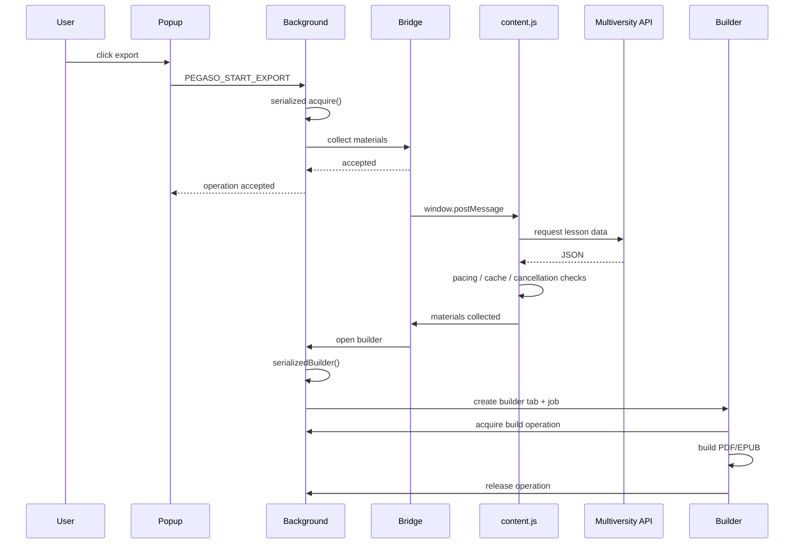
```mermaid
sequenceDiagram
    participant U as User
    participant P as Popup
    participant B as Background
    participant Br as Bridge
    participant C as content.js
    participant API as Multiversity API
    participant Bu as Builder

    U->>P: click export
    P->>B: PEGASO_START_EXPORT
    B->>B: serialized acquire()
    B->>Br: collect materials
    Br-->>B: accepted
    B-->>P: operation accepted
    Br->>C: window.postMessage
    C->>API: request lesson data
    API-->>C: JSON
    C->>C: pacing / cache / cancellation checks
    C->>Br: materials collected
    Br->>B: open builder
    B->>B: serializedBuilder()
    B->>Bu: create builder tab + job
    Bu->>B: acquire build operation
    Bu->>Bu: build PDF/EPUB
    Bu->>B: release operation
```

Osserva una cosa importante:

```text
la risposta al click iniziale arriva molto prima della fine dell'export
```

Questa è progettazione asincrona del protocollo, non soltanto sintassi JavaScript.

---

# Parte LI — Esercizi mentali

## 98. Esercizio 1 — Dove sta la race?

Immagina:

```js
async function acquire() {
  const operation = await currentOperation();
  if (operation) return false;
  await storageSet(newOperation);
  return true;
}
```

Due chiamanti la eseguono quasi contemporaneamente.

Domande:

1. quale valore possono leggere entrambi?
2. quale invariante viene violata?
3. una variabile `busy` locale in ciascun chiamante risolverebbe il problema?
4. perché serve un punto di serializzazione condiviso?

---

## 99. Esercizio 2 — Dopo l'`await`

Considera:

```js
if (!enabled) return;
const row = currentLesson();await waitForSomething();
clickRow(nextLesson(row));
```

Elenca almeno tre cose che potrebbero essere diventate false durante l'`await`.

Una possibile risposta:

```text
enabled può essere diventato false
row può essere detached
la route può essere cambiata
```

Come riscriveresti il flusso?

---

## 100. Esercizio 3 — `Promise.all` o `allSettled`?

Devi inviare un messaggio a dieci tab aperte.

Vuoi pulire la cache su tutte quelle raggiungibili.

Se una tab fallisce, vuoi comunque continuare con le altre.

Quale combinatore Promise rappresenta meglio il dominio?

Perché?

---

## 101. Esercizio 4 — Timeout senza abort

Immagina:

```js
const result = await Promise.race([
  fetch(url),
  timeoutPromise(5000),
]);
```

Se vince il timeout, che cosa succede necessariamente alla `fetch`?

Risposta importante:

```text
non è detto che venga cancellata
```

Come useresti `AbortController` per collegare la deadline al lavoro reale?

---

## 102. Esercizio 5 — Timer duplicati

Una funzione viene chiamata cinque volte:

```js
function schedule() {
  timer = setTimeout(run, 1000);
}
```

Quante esecuzioni di `run()` potrebbero essere pianificate?

Come cambia se aggiungiamo:

```js
clearTimeout(timer);
```

prima del nuovo `setTimeout`?

---

# Parte LII — Concetti da portarsi dietro

## 103. Event loop

Meccanismo che coordina l'esecuzione dei task asincroni nel runtime JavaScript.

## 104. Run-to-completion

Una porzione sincrona di JavaScript termina prima che un altro job JavaScript venga eseguito nello stesso agent.

## 105. Call stack

Stack dei contesti di esecuzione attualmente attivi.

## 106. Task

Unità di lavoro programmata dall'event loop, per esempio un evento o un timer.

## 107. Microtask

Lavoro ad alta priorità rispetto al task successivo, usato tra l'altro dalle continuazioni Promise.

## 108. Promise

Rappresentazione di un risultato futuro fulfilled oppure rejected.

## 109. `async` / `await`

Sintassi che permette di descrivere workflow Promise-based in forma sequenziale senza bloccare il browser durante le attese.

## 110. Concurrency

Più operazioni possono essere in-flight nello stesso intervallo temporale.

## 111. Parallelism

Più operazioni vengono realmente eseguite simultaneamente.

## 112. Race condition

Il risultato dipende da un interleaving temporale non adeguatamente controllato.

## 113. Critical section

Regione logica in cui un accesso a stato condiviso deve rispettare una mutua esclusione o un ordine controllato.

## 114. Serialization

Forzare operazioni concorrenti a essere eseguite in sequenza.

## 115. Reentrancy guard

Meccanismo che impedisce a un workflow di essere riavviato mentre una sua esecuzione precedente è ancora attiva.

## 116. Cooperative cancellation

Protocollo in cui il workflow controlla periodicamente un segnale o flag di cancellazione e termina volontariamente.

## 117. AbortController

API standard che produce un `AbortSignal` per cancellare operazioni compatibili.

## 118. Timeout

Deadline oltre la quale un'attesa non viene più considerata accettabile.

## 119. Pacing

Ritardo deliberato tra operazioni valide per regolare il ritmo del carico.

## 120. Liveness

Proprietà secondo cui un sistema non deve restare bloccato indefinitamente e deve poter continuare a fare progresso.

## 121. Safety

Proprietà secondo cui stati o transizioni proibite non devono verificarsi.

## 122. Backpressure

Meccanismo con cui un produttore di lavoro viene rallentato per non saturare il consumatore o una risorsa esterna.

---

# Parte LIII — Approfondimenti

## 123. JavaScript execution model

### MDN — JavaScript execution model

https://developer.mozilla.org/en-US/docs/Web/JavaScript/Reference/Execution_model

Da studiare soprattutto:

- agent;
- job queue;
- event loop;
- run-to-completion.

---

## 124. Task e microtask

### MDN — Using microtasks in JavaScript

https://developer.mozilla.org/en-US/docs/Web/API/HTML_DOM_API/Microtask_guide

### MDN — In depth: Microtasks and the JavaScript runtime environment

https://developer.mozilla.org/en-US/docs/Web/API/HTML_DOM_API/Microtask_guide/In_depth

Queste pagine chiariscono il rapporto tra:

```text
task queue
microtask queue
Promise
MutationObserver
rendering
```

---

## 125. Promise

### MDN — Using promises

https://developer.mozilla.org/en-US/docs/Web/JavaScript/Guide/Using_promises

Interessante anche per il pattern:

```text
callback API → Promise wrapper
```

usato nel background di PlumePilot.

---

## 126. Async functions

### MDN — async function

https://developer.mozilla.org/en-US/docs/Web/JavaScript/Reference/Statements/async_function

### MDN — await

https://developer.mozilla.org/en-US/docs/Web/JavaScript/Reference/Operators/await

Concentrati sul fatto che `await` sospende la funzione async, non l'intero thread del browser.

---

## 127. Timers

### MDN — `setTimeout()`

https://developer.mozilla.org/en-US/docs/Web/API/Window/setTimeout

Da ricordare:

> il delay è una soglia minima di scheduling, non un appuntamento temporale perfetto.

---

## 128. Cancellation

### MDN — `AbortController`

https://developer.mozilla.org/en-US/docs/Web/API/AbortController

### MDN — `AbortSignal`

https://developer.mozilla.org/en-US/docs/Web/API/AbortSignal

Rileggi queste API pensando sia alle request HTTP sia alla cancellazione del builder EPUB.

---

## 129. Promise combinators

### MDN — `Promise.all()`

https://developer.mozilla.org/en-US/docs/Web/JavaScript/Reference/Global_Objects/Promise/all

### MDN — `Promise.allSettled()`

https://developer.mozilla.org/en-US/docs/Web/JavaScript/Reference/Global_Objects/Promise/allSettled

Confronta esplicitamente:

```text
fail-fast
vs
raccogli tutti gli esiti
```

---

# Parte LIV — Cosa abbiamo imparato davvero

Il punto centrale di questo capitolo non è che JavaScript possieda `Promise` e `async/await`.

È capire che un programma asincrono è un programma in cui il **tempo modifica la validità delle nostre assunzioni**.

Abbiamo visto che:

```text
il codice sincrono è run-to-completion
        ↓
ma un workflow async è diviso da await
        ↓
tra due segmenti lo stato può cambiare
        ↓
quindi dobbiamo proteggere invarianti
```

PlumePilot utilizza diversi strumenti a seconda del problema:

```text
Promise wrappers      → uniformano callback API
serialized queues     → proteggono read-modify-write condivisi
busy flags            → evitano reentrancy locale
requestId             → correlano operazioni concorrenti
timeout               → evitano attese infinite
AbortController       → interrompe il lavoro sottostante
cooperative cancel    → interrompe workflow composti
finally               → ripristina invarianti e risorse
allSettled             → raccoglie best-effort indipendenti
re-check after await  → valida nuovamente il mondo corrente
```

La lezione più importante può essere riassunta così:

> **Il fatto che JavaScript esegua un callback alla volta non rende automaticamente atomici i workflow asincroni. Ogni `await` è un punto in cui il mondo può cambiare.**

E una seconda lezione segue direttamente:

> **La correttezza asincrona non consiste nell'eliminare la concorrenza, ma nel decidere dove permetterla, dove ordinarla e come riconoscere quando un risultato arrivato tardi non è più valido.**

---

## Nel prossimo capitolo

Ora sappiamo **quando** le cose possono cambiare.

Nel Capitolo 06 studieremo **dove** vive quello stato:

# Stato, cache e storage — Dove vive la verità

Seguiremo:

- variabili in memoria;
- `chrome.storage.local`;
- cache temporanee;
- stato per corso;
- stato per tab;
- operation state;
- TTL;
- invalidazione;
- migrazione;
- source of truth;
- snapshot;
- stato derivato;
- e il problema probabilmente più famoso dell'informatica dopo il naming: **cache invalidation**.

Dopo i Capitoli 05 e 06 avremo il vocabolario necessario per affrontare l'autoplay come una vera state machine.

---

# 06 — Stato, cache e storage

## Dove vive la verità

Nei capitoli precedenti abbiamo parlato di DOM, API, messaggi e asincronia.

A questo punto possiamo porci una domanda apparentemente semplice:

> **Quando PlumePilot dice di conoscere qualcosa, dove sta conservando quell'informazione?**

La risposta non è unica.

Una preferenza dell'utente come il tema può vivere per mesi.

Il risultato di una richiesta API può essere utile per cinque minuti.

Un `operationId` deve sopravvivere al popup che si chiude, ma non può restare valido per sempre.

Un flag di recovery deve sopravvivere a un reload della pagina, ma sarebbe pericoloso conservarlo per giorni.

Un Bearer token deve esistere abbastanza a lungo da effettuare una richiesta, ma non deve essere scritto su disco.

Il progresso del corso, infine, non appartiene davvero a PlumePilot: la fonte autorevole rimane la piattaforma Multiversity.

Per questo il problema non è semplicemente:

```text
salvare dati
```

ma:

```text
scegliere quale dato salvare
        +
dove salvarlo
        +
per quanto tempo
        +
chi può modificarlo
        +
quando smettere di fidarsene
```

Questo capitolo serve a costruire un modello mentale preciso di queste decisioni.

---

# Parte I — Non tutto ciò che chiamiamo “stato” è la stessa cosa

## 1. Una tassonomia utile

Nel codice di PlumePilot possiamo distinguere almeno sei categorie diverse.

| Categoria | Esempio | Lifetime tipico | Deve sopravvivere a reload? |
|---|---|---:|---:|
| Stato effimero | `busy`, `pendingTurboApiRequests` | vita dello script | no |
| Cache in memoria | `lessonApiCache` | vita della pagina | no |
| Recovery per tab | `sessionStorage` | sessione della tab | sì |
| Preferenze persistenti | `themePreference`, `enabled` | giorni/mesi | sì |
| Stato operativo persistente | `pegasoActiveOperation` | minuti/ore | sì |
| Stato esterno autorevole | corso, esami, percentuali server | deciso dalla piattaforma | n/a |

Queste categorie possono contenere dati apparentemente simili, ma hanno responsabilità completamente diverse.

Il primo principio del capitolo è quindi:

> **Prima di scegliere uno storage, dobbiamo scegliere la semantica dello stato.**

Non il contrario.

---

## 2. Lifetime come requisito architetturale

Pensiamo a quattro informazioni:

```text
A. Il popup è in modalità Gaming.
B. È in corso un export.
C. Una risposta API di una lezione è stata letta 30 secondi fa.
D. Stiamo facendo un recovery dopo un reload provocato da un conflitto di sessione.
```

Se chiudiamo il popup:

```text
A deve sopravvivere
B deve sopravvivere
C non dipende dal popup
D non dipende dal popup
```

Se ricarichiamo la pagina del corso:

```text
A deve sopravvivere
B deve essere riconciliato
C può tranquillamente essere perso
D deve sopravvivere almeno abbastanza da completare il recovery
```

Se chiudiamo e riapriamo il browser:

```text
A deve sopravvivere
B probabilmente no, ma deve poter essere riconosciuto come stale/orfano
C no
D no
```

Già da questo piccolo esercizio vediamo perché un'unica variabile globale o un unico database sarebbero una soluzione concettualmente povera.

---

# Parte II — Stato volatile: variabili e `Map`

## 3. Lo stato più economico è quello che possiamo perdere

All'inizio di `content.js` troviamo varie strutture in memoria:

```js
const pendingTurboApiRequests = new Map();
const lessonApiCache = new Map();
const courseProgressChapters = new Map();
const pendingLessonVerificationAttempts = new Map();
const materialLinkCache = new Map();
const materialOutlineCache = new Map();
const testSourceCache = new Map();
```

`content.js` — circa righe 131–137 nello snapshot studiato.

Queste `Map` non sono database.

Non sono storage persistente.

Sono semplicemente oggetti JavaScript appartenenti all'istanza corrente dello script.

Se la pagina viene ricaricata, scompaiono.

E questa non è necessariamente una debolezza.

Per molti dati è precisamente il comportamento desiderato.

---

## 4. Cache ricostruibile vs stato indispensabile

Prendiamo:

```js
const lessonApiCache = new Map();
```

Se la perdiamo, cosa succede?

PlumePilot dovrà magari ripetere qualche richiesta API.

È inefficiente, ma non corrompe il comportamento.

Possiamo quindi classificare questa informazione come:

```text
ottimizzazione ricostruibile
```

Diverso sarebbe perdere una preferenza dell'utente come:

```text
autoplayStopAt70Enabled = true
```

Se l'utente ha scelto quella preferenza, perderla al reload sarebbe un bug.

La distinzione è importante:

> **Una cache serve a evitare lavoro. Lo stato persistente serve a preservare significato.**

---

## 5. Una regola pratica: se perdi questo dato, cosa accade?

Quando progettiamo uno stato possiamo chiederci:

```text
Se questo valore sparisce adesso...
```

### Caso A — il programma può ricalcolarlo

Probabilmente è cache o stato derivato.

### Caso B — l'utente perde una scelta

Probabilmente deve essere persistente.

### Caso C — il programma può eseguire due volte un'azione pericolosa

Probabilmente è stato operativo o di coordinamento.

### Caso D — serve soltanto per attraversare un reload controllato

Potrebbe essere stato di sessione.

Questa domanda ci accompagnerà per tutto il capitolo.

---

# Parte III — `chrome.storage.local`: memoria condivisa dell'estensione

## 6. Perché un'estensione non usa semplicemente `localStorage`

PlumePilot dichiara nel `manifest.json`:

```json
"permissions": [
  "storage"
]
```

Questa permission permette di utilizzare l'API WebExtensions:

```js
chrome.storage.local
```

La documentazione Chrome descrive `storage.local` come uno storage specifico dell'estensione, accessibile dai suoi diversi contesti e persistente oltre la normale vita di popup e service worker.

Questa proprietà è cruciale.

Il popup è temporaneo.

Il background Manifest V3 su Chromium usa un service worker che è deliberatamente effimero.

Una variabile globale come:

```js
let operation = ...;
```

non sarebbe quindi una base affidabile per stato che deve sopravvivere al lifecycle del worker.

`chrome.storage.local`, invece, vive fuori da quel singolo contesto JavaScript.

---

## 7. Lo storage come punto comune tra contesti diversi

Ricordiamo l'architettura studiata nei Capitoli 1 e 2:

```text
popup
background
bridge
floating menu
builder
```

Sono contesti differenti.

Non possono condividere direttamente una variabile JavaScript.

Ma possono leggere lo stesso storage dell'estensione.

Questo rende possibile qualcosa del genere:

```text
popup
  │ scrive enabled=false
  ▼
chrome.storage.local
  ▲
  │ storage.onChanged
bridge
  │
  ▼
MAIN world
```

Lo storage non è quindi soltanto “un posto dove salvare impostazioni”.

In alcuni punti di PlumePilot è anche un **mezzo di sincronizzazione dello stato**.

---

## 8. Cold start del popup

Quando apriamo il popup, `popup.js` legge un set molto ampio di valori:

```js
chrome.storage.local.get(
  {
    enabled: true,
    stopAtTests: false,
    autoCompleteTests: false,
    autoplaySkipCompletedVideos: false,
    autoplayChapterLimitEnabled: false,
    autoplayChapterLimits: {},
    autoplayChapterLimitSessions: {},
    autoplayChapterLimitStatuses: {},
    courseProgressOverlayEnabled: false,
    autoplayStopAt70Enabled: false,
    playbackErrorRecovery: "automatic",
    visualStyle: "standard",
    themePreference: "system",
    menuSize: "medium",
    floatingMenuEnabled: true,
    commissionCheckEnabled: false,
    commissionExams: [],
    pegasoActiveOperation: null,
    ...
  },
  (result) => {
    ...
  }
);
```

`popup.js` — circa righe 1308–1374.

È un pattern importante:

```text
apertura UI
   ↓
lettura snapshot persistente
   ↓
render iniziale
```

Il popup non assume che una sua vecchia istanza sia ancora viva.

Ogni apertura parte da uno snapshot corrente.

Questo è esattamente ciò che vogliamo per un componente con lifecycle breve.

---

## 9. Snapshot iniziale + aggiornamenti incrementali

Subito dopo, il popup registra:

```js
chrome.storage.onChanged.addListener((changes, area) => {
  if (area !== "local") return;

  if (changes.pegasoActiveOperation) {
    renderOperation(changes.pegasoActiveOperation.newValue || null);
  }

  if (changes.enabled) {
    ...
  }

  ...
});
```

`popup.js` — da circa riga 1410.

Questo ci riporta a un pattern già incontrato nel Capitolo 2:

```text
snapshot + events
```

Solo che qui gli eventi non arrivano via `window.postMessage`.

Arrivano dall'API storage.

Il modello diventa:

```text
1. leggi lo stato corrente
2. renderizza
3. ascolta le modifiche successive
```

È molto più robusto che affidarsi soltanto agli eventi.

Se il popup nasce dopo una modifica, lo snapshot iniziale recupera comunque la situazione corrente.

---

# Parte IV — Stored intent vs effective runtime state

## 10. La preferenza salvata non è sempre lo stato effettivo

Uno dei dettagli più interessanti di `bridge.js` si trova nella funzione `readAndSendState()`.

Lo storage contiene:

```js
stopAtTests
autoCompleteTests
```

Ma il runtime applica questa regola:

```js
const autoEnabled = result.autoCompleteTests === true;

const stopEnabled =
  result.stopAtTests !== false && !autoEnabled;
```

Il commento nel codice è esplicito:

```js
// Keep the user's stop-at-tests preference in storage, but make it
// inactive at runtime while automatic test completion is enabled.
```

Qui emerge una distinzione architetturale molto utile.

### Stored intent

Ciò che l'utente ha scelto.

```text
stopAtTests = true
```

### Effective state

Ciò che il sistema deve applicare in questo momento.

```text
autoCompleteTests = true
→ stopAtTests effettivo = false
```

Se modificassimo direttamente la preferenza persistente ogni volta che cambia un'altra opzione, perderemmo l'intenzione originale dell'utente.

Invece PlumePilot conserva entrambe le informazioni e calcola una configurazione effettiva.

Questo pattern è comune anche nei sistemi backend:

```text
configurazione dichiarata
        ↓
policy / vincoli
        ↓
configurazione effettiva
```

---

# Parte V — Scope: uno stato per chi?

## 11. “Il limite della sessione” non è un valore globale

PlumePilot supporta più piattaforme e più corsi.

Un valore come:

```text
limite autoplay = 5 capitoli
```

potrebbe significare:

```text
5 per qualunque corso
```

oppure:

```text
5 per uno specifico corso
```

Nel progetto si è scelto il secondo modello per diversi stati.

Il popup costruisce chiavi come:

```js
function courseStorageKey(courseCode, platformId = "pegaso") {
  ...
  return `${platformId}:${course}`;
}
```

Per esempio:

```text
pegaso:ABC123
mercatorum:ABC123
utsr:ABC123
```

Questo evita collisioni tra corsi che potrebbero avere lo stesso codice su piattaforme diverse.

---

## 12. Scope is part of identity

Questa scelta introduce un principio generale:

> **L'identità di uno stato include il suo scope.**

Non basta sapere:

```text
courseCode = ABC123
```

Se quel codice non è globalmente unico.

Serve:

```text
(platformId, courseCode)
```

Lo stesso principio compare nei database con chiavi composite:

```sql
PRIMARY KEY (tenant_id, user_id)
```

oppure nei sistemi distribuiti:

```text
region / account / resource
```

La stringa:

```text
pegaso:ABC123
```

è una serializzazione semplice di una chiave composta.

---

## 13. Una piccola migrazione reale

In `popup.js` troviamo anche compatibilità con il vecchio formato:

```js
function courseScopedValue(map, courseCode, platformId = "pegaso") {
  const key = courseStorageKey(courseCode, platformId);
  if (Object.prototype.hasOwnProperty.call(map, key)) return map[key];
  return platformId === "pegaso" ? map[courseCode] : undefined;
}
```

Quindi il sistema prova prima:

```text
pegaso:ABC123
```

ma per Pegaso riconosce anche il vecchio:

```text
ABC123
```

Durante una scrittura:

```js
if (platformId === "pegaso") delete next[courseCode];
```

il vecchio formato viene progressivamente eliminato.

Questa è una forma di **lazy migration**.

Non serve una procedura separata che riscriva tutti i dati in anticipo.

La migrazione avviene quando quello stato viene nuovamente utilizzato.

---

# Parte VI — Service worker effimero, stato durevole

## 14. Il problema del background Manifest V3

Nel `manifest.json` Chromium usa:

```json
"background": {
  "service_worker": "background.js"
}
```

Un extension service worker non deve essere trattato come un processo server sempre attivo.

Chrome lo considera intenzionalmente effimero: può essere avviato quando serve e terminato quando non ha più lavoro da svolgere.

Questo cambia completamente il modo in cui dobbiamo pensare alle variabili globali del background.

In `background.js` abbiamo:

```js
let operationQueue = Promise.resolve();
let builderQueue = Promise.resolve();
let commissionQueue = Promise.resolve();
...
```

Queste code servono a serializzare operazioni concorrenti **mentre quella istanza del background è viva**.

Non devono essere considerate persistenza.

Se il worker viene ricreato, le code ripartono vuote.

Per questo il dato importante non vive soltanto lì.

---

## 15. `pegasoActiveOperation`: stato operativo persistente

Il background definisce:

```js
const OPERATION_KEY = "pegasoActiveOperation";
const MAX_OPERATION_AGE_MS = 2 * 60 * 60 * 1000;
```

Quando viene acquisita un'operazione:

```js
const operation = {
  id: crypto.randomUUID(),
  kind,
  phase: batch ? "running" : "collecting",
  message,
  startedAt: Date.now(),
  sourceTabId,
};

await storageSet({ [OPERATION_KEY]: operation });
```

Questa struttura non è una semplice preferenza.

È un **record di coordinamento**.

Descrive:

```text
chi possiede il lavoro
cosa sta facendo
in quale fase si trova
quando è iniziato
come identificarlo
```

---

## 16. Perché non basta `let activeOperation`

Immaginiamo di usare:

```js
let activeOperation = null;
```

Scenario:

```text
1. parte export EPUB
2. activeOperation viene valorizzato
3. il service worker viene sospeso/ricreato
4. activeOperation torna null
5. l'utente avvia una seconda operazione
```

Ora avremmo due workflow incompatibili.

Persistendo il record in `storage.local`, invece, una nuova istanza del background può ricostruire il contesto.

Questo è un esempio molto vicino a un concetto backend classico:

```text
process memory ≠ durable state
```

Un server può riavviarsi.

Un container può essere sostituito.

Un worker può morire.

Se uno stato è importante per la correttezza, deve vivere in un luogo con lifetime adeguato.

---

## 17. Persistenza non significa immortalità

Se salviamo un'operazione in modo persistente, nasce subito un nuovo problema:

> cosa succede se l'operazione non termina correttamente?

Potremmo ritrovarci per sempre con:

```text
pegasoActiveOperation = "export in corso"
```

anche se non esiste più nulla che lo stia eseguendo.

PlumePilot applica più meccanismi di reconciliation.

Il primo è temporale:

```js
async function currentOperation() {
  const operation = await storageGet(OPERATION_KEY);

  if (
    operation &&
    Date.now() - operation.startedAt > MAX_OPERATION_AGE_MS
  ) {
    await storageRemove(OPERATION_KEY);
    return null;
  }

  return operation;
}
```

Un'operazione più vecchia di due ore viene considerata stale.

---

## 18. Reconciliation con il proprietario reale

Il secondo controllo riguarda la tab proprietaria.

```js
function operationOwnerTabId(operation) {
  if (operation.phase === "building" && Number.isInteger(operation.builderTabId)) {
    return operation.builderTabId;
  }

  return operation.sourceTabId;
}
```

Poi:

```js
if (await tabExists(ownerTabId)) {
  return { accepted: true, released: false, operation };
}

await removeOperation(operation);
```

Quindi l'operazione persistita non viene accettata ciecamente.

Viene riconciliata con il mondo reale.

Il modello è:

```text
record persistente
      ↓
verifica owner
      ↓
owner esiste? ── sì ──► stato valido
      │
      no
      ▼
rimuovi stato orfano
```

Questo ci porta a un principio importante:

> **Uno stato persistente può diventare stale anche se è perfettamente integro dal punto di vista sintattico.**

---

# Parte VII — Lease: stato con scadenza incorporata

## 19. Il controllo commissione non usa soltanto un booleano

Per evitare che più tab effettuino contemporaneamente lo stesso controllo commissione, PlumePilot usa una struttura chiamata **lease**.

Nel background:

```js
const COMMISSION_CHECK_INTERVAL_MS = 10 * 60 * 1000;
const COMMISSION_LEASE_MS = 45 * 1000;
```

Una lease contiene:

```js
const lease = {
  id: crypto.randomUUID(),
  platformId: normalized,
  sourceTabId,
  startedAt: now,
  expiresAt: now + COMMISSION_LEASE_MS,
};
```

Viene poi salvata in:

```js
commissionCheckLeases
```

con scope per piattaforma.

---

## 20. Lock vs lease

Un lock concettualmente dice:

```text
questa risorsa è occupata
```

Una lease dice:

```text
questa risorsa è occupata fino a T
```

La differenza è enorme in presenza di crash o tab chiuse.

Se la tab proprietaria scompare senza rilasciare il lock:

```text
lock puro → potrebbe rimanere bloccato per sempre
lease → prima o poi scade
```

PlumePilot verifica esplicitamente:

```js
if (
  !Number.isFinite(Number(lease.expiresAt)) ||
  Number(lease.expiresAt) <= Date.now() ||
  Number(lease.expiresAt) - Date.now() > COMMISSION_LEASE_MS * 2
) {
  ... elimina lease ...
}
```

È interessante anche il terzo controllo.

Una scadenza assurda troppo lontana nel futuro viene trattata come invalida.

Questo è **defensive state validation**.

---

## 21. Il dato temporale fa parte dello stato

Quando un oggetto contiene:

```text
createdAt
startedAt
expiresAt
fetchedAt
lastAttemptAt
```

non sta memorizzando soltanto “quando è successo qualcosa”.

Sta permettendo al programma di decidere:

```text
posso ancora fidarmi di questo dato?
```

Il tempo diventa quindi parte della semantica dello stato.

---

# Parte VIII — `sessionStorage`: sopravvivere al reload, non al mondo intero

## 22. Un problema molto specifico richiede uno storage molto specifico

Nel Capitolo 3 abbiamo visto i recovery dopo errori di playback.

Alcuni di questi recovery provocano intenzionalmente un reload della pagina.

Se conservassimo il contesto soltanto in una variabile:

```js
let recovery = ...;
```

il reload lo cancellerebbe.

Se lo mettessimo in `chrome.storage.local`, invece, sarebbe troppo persistente e troppo globale.

PlumePilot usa quindi `sessionStorage`.

Esempio:

```js
sessionStorage.setItem(
  SESSION_CONFLICT_RECOVERY_KEY,
  JSON.stringify({
    attempts: 1,
    createdAt: Date.now(),
    ...
  }),
);
```

`sessionStorage` è associato alla page session della tab e sopravvive ai reload della stessa tab, ma viene eliminato quando quella sessione termina.

È quasi esattamente il lifetime desiderato da questo recovery.

---

## 23. Il recovery state non viene comunque accettato ciecamente

Quando viene letto:

```js
const state = JSON.parse(raw);
const age = Date.now() - Number(state?.createdAt || 0);
```

PlumePilot controlla:

```js
if (
  state?.attempts !== 1 ||
  !Number.isFinite(age) ||
  age < 0 ||
  age > SESSION_CONFLICT_RECOVERY_MAX_AGE_MS
) {
  sessionStorage.removeItem(SESSION_CONFLICT_RECOVERY_KEY);
  return null;
}
```

Notiamo tre protezioni:

```text
numero tentativi
validità timestamp
età massima
```

Quindi anche uno storage con lifetime già limitato ha un suo TTL logico.

---

## 24. Perché non `chrome.storage.session`?

Le WebExtensions moderne espongono anche:

```text
storage.session
```

che conserva dati in memoria durante la sessione dell'estensione.

Ma la semantica non è la stessa di `window.sessionStorage`.

Nel nostro caso il recovery deve essere:

```text
legato alla specifica tab/origin
+ sopravvivere al reload
+ morire naturalmente con quella page session
```

`sessionStorage` del documento fornisce direttamente questo scope.

`storage.session` sarebbe invece stato dell'estensione con un lifetime e uno scope differenti.

Non esiste uno storage “migliore” in assoluto.

Esiste quello coerente con il dominio.

---

# Parte IX — Cache: non chiedere due volte ciò che sappiamo già

## 25. `lessonApiCache`

Una delle cache centrali è:

```js
const lessonApiCache = new Map();
```

La chiave è:

```js
function lessonApiCacheKey(courseCode, lessonNumber) {
  return `${courseCode}:${Number(lessonNumber)}`;}
```

Quando arriva una risposta valida, PlumePilot conserva dati normalizzati e:

```js
fetchedAt: Date.now()
```

Il TTL base è:

```js
const API_LESSON_CACHE_FRESH_MS = 5 * 60 * 1000;
```

Cinque minuti.

Ma qui la storia diventa più interessante.

---

## 26. Non tutti i campi diventano stale allo stesso modo

In `cachedLessonResponse()` troviamo:

```js
const fresh =
  Date.now() - Number(entry.fetchedAt || 0) <= API_LESSON_CACHE_FRESH_MS;
```

Poi:

```js
if (!allowStaleMutableData) {
  if (requiredData === "data" && !fresh) return null;
  if (requiredData === "playback" && !fresh) return null;

  if (
    requiredData === "test" &&
    !fresh &&
    entry.test?.completed !== true
  ) return null;

  if (
    requiredData === "objective" &&
    !fresh &&
    entry.objective?.completed !== true
  ) return null;
}
```

Questo è un esempio eccellente di **cache policy semantica**.

Non stiamo dicendo semplicemente:

```text
più vecchio di 5 minuti → butta tutto
```

Stiamo dicendo:

```text
se il dato è mutabile e incompleto → serve freschezza
se rappresenta un completamento già confermato → può restare utile
```

---

## 27. Stato monotono e cache

Ricordiamo il concetto di **monotonic state** introdotto nel Capitolo 4.

Se un test risulta completato:

```text
0% → 100%
```

nel modello del dominio non ci aspettiamo normalmente:

```text
100% → 0%
```

perché qualche minuto è passato.

Per questo PlumePilot può riutilizzare più aggressivamente alcuni risultati completati.

Il codice applica persino:

```js
const percentage = Math.max(
  Number(activity.percentage) || 0,
  sameActivity ? Number(previousActivity.percentage) || 0 : 0,
);
```

E per i progress item:

```js
{ ...item, percentage: Math.max(old.percentage, item.percentage) }
```

Quindi una risposta apparentemente più vecchia o regressiva non cancella automaticamente progresso già osservato.

---

# Parte IX-A — Anatomia di una cache: strutture dati e algoritmi

Questa sezione entra un livello più in basso.

Finora abbiamo detto che `lessonApiCache` è una cache in memoria con TTL e regole semantiche. Ora chiediamoci:

> **Perché è stata costruita proprio con una `Map`? Come sono progettate chiave e valore? Come avviene un lookup? Quando una entry viene aggiornata, riusata o scartata?**

Questo è il punto in cui una scelta apparentemente piccola:

```js
const lessonApiCache = new Map();
```

si trasforma in un esercizio completo di strutture dati.

---

## 25.1 Il modello astratto: una tabella chiave → valore

Una cache come `lessonApiCache` può essere vista prima di tutto come una funzione parziale:

```text
key → cached value
```

Nel nostro caso:

```text
"CODICE_CORSO:1" → dati normalizzati della lezione 1
"CODICE_CORSO:2" → dati normalizzati della lezione 2
"CODICE_CORSO:3" → dati normalizzati della lezione 3
```

La struttura concreta è una `Map`:

```js
const lessonApiCache = new Map();
```

Per ogni modulo PlumePilot costruisce la chiave con:

```js
function lessonApiCacheKey(courseCode, lessonNumber) {
  return `${courseCode}:${Number(lessonNumber)}`;
}
```

Quindi possiamo descrivere il tipo concettuale come:

```text
Map<string, LessonCacheEntry>
```

Non esiste TypeScript nel progetto attuale, ma immaginare il tipo è utile:

```ts
Map<string, LessonCacheEntry>
```

Dove `LessonCacheEntry` contiene informazioni come:

```text
objective
videos
test
material
progressItems
routeKey
fetchedAt
```

Il primo insegnamento è semplice ma importante:

> **Una cache non è soltanto un contenitore. È una struttura dati accompagnata da una funzione di identità e da una politica di validità.**

---

## 25.2 Perché una `Map` è una buona scelta qui

Una `Map` JavaScript è una collezione di coppie chiave-valore.

Per PlumePilot offre esattamente le operazioni necessarie:

```js
lessonApiCache.get(key);
lessonApiCache.set(key, value);
lessonApiCache.delete(key);
lessonApiCache.has(key);
lessonApiCache.size;
```

Il pattern dominante della cache è:

```text
costruisci chiave
      ↓
lookup
      ↓
entry presente?
 ┌────┴────┐
 sì        no
 │          │
valuta      richiedi API
freschezza       │
 │               ↓
usa/refresh   cache.set(...)
```

Dal punto di vista algoritmico ciò che ci interessa è che il lookup per chiave non richieda una scansione lineare di tutte le lezioni.

La specifica ECMAScript non obbliga i motori a implementare `Map` come una particolare hash table. Richiede però prestazioni medie sub-lineari rispetto al numero di elementi. In pratica, possiamo ragionare su `Map` come una struttura progettata per lookup efficienti per chiave, senza promettere un particolare algoritmo interno del motore JavaScript.

Questo dettaglio è importante perché evita una semplificazione frequente:

```text
Map === hash table O(1)
```

Non è una garanzia del linguaggio.

La formulazione più corretta è:

```text
Map → keyed collection con lookup medio efficiente
```

---

## 25.3 Perché non un `Array`

Immaginiamo una versione ingenua:

```js
const lessonCache = [];

lessonCache.push({
  courseCode,
  lessonNumber,
  data,
});
```

Per recuperare una lezione dovremmo fare qualcosa come:

```js
lessonCache.find(
  (entry) =>
    entry.courseCode === courseCode &&
    entry.lessonNumber === lessonNumber,
);
```

Il problema concettuale è che stiamo usando una struttura sequenziale per un problema di lookup per identità.

Con `n` entry:

```text
Array.find() → nel caso generale deve ispezionare più elementi
Map.get()    → operazione nativamente espressa come lookup per chiave
```

Potremmo usare `lessonNumber` direttamente come indice:

```js
lessonCache[lessonNumber] = data;
```

ma appena introduciamo più corsi otteniamo un problema:

```text
Corso A, lezione 3
Corso B, lezione 3
```

Entrambi vorrebbero occupare:

```js
lessonCache[3]
```

Potremmo creare array annidati per corso, ma a quel punto staremmo reinventando una mappa gerarchica.

Inoltre i numeri di lezione sono identità di dominio, non necessariamente indici densi adatti a una struttura sequenziale.

La regola generale è:

> **Se la domanda principale è “dammi il valore associato a questa identità”, una keyed collection è spesso più naturale di una sequenza.**

---

## 25.4 Perché non un normale `Object`

Potremmo scrivere:

```js
const lessonApiCache = {};
lessonApiCache[key] = value;
```

Funzionerebbe.

Per chiavi stringa, un `Object` può assolutamente essere usato come dizionario.

Perché preferire `Map`?

### Semantica più esplicita

```js
const cache = new Map();
```

comunica immediatamente:

```text
questa struttura è una collezione dinamica key/value
```

mentre:

```js
const cache = {};
```

può rappresentare sia un record con proprietà note sia un dizionario dinamico.

### API specifica

Con `Map` abbiamo:

```js
cache.get(key)
cache.set(key, value)
cache.delete(key)
cache.has(key)
cache.size
```

Non dobbiamo confondere lookup con accesso a proprietà dell'oggetto.

### Nessuna collisione con proprietà ereditate

Un normale oggetto possiede una catena di prototipi.

È possibile mitigare il problema con:

```js
Object.create(null)
```

ma a quel punto `Map` esprime già meglio l'intenzione.

### Iterazione naturale

Una `Map` è direttamente iterabile come coppie `[key, value]`.

Questo non è essenziale per `lessonApiCache`, ma rende più naturale aggiungere in futuro diagnostica, metriche o eviction.

Detto questo, non dobbiamo trasformare la scelta in dogma:

```text
Object → ottimo per record con shape conosciuta
Map    → ottima per collezione dinamica indicizzata da chiavi
```

Infatti PlumePilot usa spesso `Object` nello storage persistente quando il dato è destinato alla serializzazione tramite `chrome.storage`.

---

## 25.5 Perché non una `WeakMap`

`WeakMap` può sembrare attraente perché permette al garbage collector di eliminare entry quando la chiave-oggetto non è più raggiungibile.

Ma nel nostro caso la chiave è:

```text
"courseCode:lessonNumber"
```

cioè una stringa.

Le chiavi di una `WeakMap` devono invece essere oggetti o simboli non registrati.

Potremmo teoricamente usare un oggetto:

```js
const key = { courseCode, lessonNumber };
weakMap.set(key, value);
```

ma avremmo un problema ancora più fondamentale:

```js
weakMap.get({ courseCode, lessonNumber });
```

non recupererebbe la stessa entry, perché il nuovo oggetto ha un'identità differente.

Dovremmo conservare da qualche parte l'oggetto-key originale, annullando buona parte del vantaggio.

Inoltre una `WeakMap` non è enumerabile: non possiamo ottenere tutte le chiavi o conoscerne la dimensione.

La sua semantica ideale è piuttosto:

```text
metadati associati alla vita di un oggetto
```

Per esempio:

```js
WeakMap<HTMLElement, Metadata>
```

sarebbe sensato per dati che devono esistere soltanto finché esiste un particolare nodo DOM.

Non è invece il problema di `lessonApiCache`, che usa identità logiche ricostruibili.

---

## 25.6 La chiave composta è parte della struttura dati

La cache non usa:

```js
lessonNumber
```

come unica identità.

Usa:

```js
`${courseCode}:${Number(lessonNumber)}`
```

Perché?

Consideriamo:

```text
Corso ABC → lezione 1
Corso XYZ → lezione 1
```

Se la chiave fosse soltanto:

```text
1
```

avremmo una collisione logica.

Con la chiave composta:

```text
ABC:1
XYZ:1
```

le due entità rimangono separate.

Questa è una forma semplice di **composite key**.

Interessante anche questo dettaglio:

```js
Number(lessonNumber)
```

normalizza rappresentazioni differenti.

Per esempio:

```text
"03" → 3
3    → 3
```

entrambe producono:

```text
COURSE:3
```

E il formato del `courseCode` in PlumePilot viene validato con caratteri alfanumerici, `_` e `-`: il carattere `:` usato come separatore non appartiene quindi al formato ammesso del codice corso. Questo rende la serializzazione della chiave più semplice e non ambigua nel dominio attuale.

Il punto generale è:

> **Progettare la chiave significa progettare l'identità della cache.**

Una struttura dati perfetta con una key sbagliata produce comunque risultati sbagliati molto velocemente.

---

## 25.7 La chiave primaria non basta sempre: `routeKey`

Una lezione viene indicizzata principalmente tramite:

```text
courseCode + lessonNumber
```

ma il codice conserva anche:

```js
routeKey
```

calcolato usando identità come `lpId` e `paragraphId`.

Perché mantenere una seconda identità?

Perché la chiave primaria è utile per il lookup, ma non sempre è sufficiente a dimostrare che il payload appena ricevuto rappresenti esattamente la stessa route interna.

Possiamo pensarlo così:

```text
cache key
    ↓
come trovo velocemente la entry?

routeKey
    ↓
sono sicuro che il nuovo dato appartenga alla stessa entità logica?
```

Questo separa due responsabilità:

```text
indexing
vs
identity validation
```

Ed è un pattern importante anche nei database:

```text
primary lookup key
+ ulteriori vincoli di consistenza
```

---

## 25.8 Anatomia del valore: non salviamo il JSON grezzo

`lessonApiCache` non conserva semplicemente:

```js
cache.set(key, responseBody);
```

Costruisce invece un modello normalizzato.

Semplificando:

```js
{
  dataAvailable: true,
  objective,
  videos,
  playbackDataComplete,
  test,
  progressItems,
  progressDataComplete,
  routeKey,
  material,
  fetchedAt,
}
```

Questo significa che la cache è anche un piccolo **read model** interno.

Il JSON della piattaforma può avere molti dettagli irrilevanti.

PlumePilot conserva soltanto ciò che serve alle proprie operazioni.

I vantaggi sono:

```text
meno accoppiamento allo schema esterno
+ lookup più semplice
+ policy di aggiornamento centralizzata
+ dati già normalizzati
```

Questa scelta si collega all'anti-corruption layer del Capitolo 4.

La cache non è quindi:

```text
copia della risposta HTTP
```

ma:

```text
proiezione del dominio PlumePilot derivata dalla risposta HTTP
```

---

## 25.9 Un cache lookup completo

Ora seguiamo il percorso reale di una richiesta.

`requestLessonWithRetry()` prova prima:

```js
const cachedResponse = forceFresh
  ? null
  : cachedLessonResponse(
      courseCode,
      lessonNumber,
      requiredData,
      allowStaleMutableCache,
    );

if (cachedResponse) return cachedResponse;
```

Possiamo trasformarlo in pseudocodice:

```text
key = makeKey(course, lesson)
entry = cache.get(key)

if entry non esiste:
    MISS

if entry esiste:
    controlla che contenga requiredData
    controlla freshness/policy

    se utilizzabile:
        HIT
    altrimenti:
        STALE MISS
```

Quindi un lookup ha almeno tre esiti concettuali:

```text
HIT
MISS
STALE / SEMANTIC MISS
```

L'ultimo è particolarmente importante.

L'entry **esiste**, ma non soddisfa il requisito della richiesta corrente.

Esempio:

```text
la cache contiene il material URL
ma ora chiediamo playback data completi
```

oppure:

```text
la cache contiene un test pending di 10 minuti fa
ma abbiamo bisogno dello stato corrente
```

Per questo:

> **Cache presence e cache usability sono due domande differenti.**

---

## 25.10 Cache hit non significa “salta ogni controllo”

Una cache superficiale potrebbe fare:

```js
const cached = cache.get(key);
if (cached) return cached;
```

PlumePilot deve invece verificare:

```text
entry presente?
       ↓
contiene il tipo di dato richiesto?
       ↓
è abbastanza fresca?
       ↓
il dato può essere considerato monotono?
       ↓
l'identità è coerente?
```

Questo ci porta a una distinzione molto utile:

```text
physical hit
```

la chiave è presente nella struttura dati.

```text
semantic hit
```

la entry è anche abbastanza valida e completa per rispondere alla domanda attuale.

La cache di PlumePilot ragiona soprattutto in termini del secondo tipo.

---

## 25.11 Scrittura: merge invece di sostituzione cieca

Quando arriva una nuova risposta non facciamo necessariamente:

```js
cache.set(key, newestResponse);
```

prima viene letto:

```js
const storedPrevious = lessonApiCache.get(key) || {};
```

Poi il nuovo stato viene costruito tenendo conto del precedente.

Per esempio:

```js
percentage: Math.max(
  Number(item.percentage) || 0,
  Number(previousItem?.percentage) || 0,
)
```

Quindi la funzione di aggiornamento assomiglia più a:

```text
newCacheValue = merge(previous, response)
```

che a:

```text
newCacheValue = response
```

In termini astratti:

```text
Cₙ₊₁ = merge(Cₙ, Rₙ₊₁)
```

Dove:

```text
C = stato cache
R = nuova osservazione remota
```

La qualità di una cache dipende quindi non soltanto dalla struttura dati ma anche dalla sua **merge function**.

---

## 25.12 Stato monotono: perché `Math.max()` è una decisione di dominio

Consideriamo:

```text
cache precedente → 100%
nuova risposta   → 80%
```

Una sostituzione cieca darebbe:

```text
100% → 80%
```

Il codice invece conserva:

```text
max(100, 80) = 100
```

Non è una proprietà generica delle cache.

È una proprietà del dominio:

```text
una stessa attività confermata completata
non dovrebbe diventare improvvisamente incompleta
perché una risposta temporaneamente stale dice 80%
```

Per questo il codice verifica anche se si tratta della stessa attività.

Il principio è:

> **La policy di merge deve conoscere la semantica del dato.**

Per un prezzo di mercato, `Math.max(old, new)` sarebbe evidentemente sbagliato.

Per un contatore di completamento monotono può essere corretto.

---

## 25.13 Freshness temporale e freshness semantica

L'entry possiede:

```js
fetchedAt: Date.now()
```

Da qui otteniamo:

```js
const fresh =
  Date.now() - Number(entry.fetchedAt || 0) <=
  API_LESSON_CACHE_FRESH_MS;
```

Questa è **temporal freshness**.

Ma PlumePilot applica anche una **semantic freshness**.

Un test pending vecchio può essere pericoloso:

```text
potrebbe essere stato completato nel frattempo
```

Un test già confermato `completed` è invece molto più stabile nel modello del dominio.

Per questo una entry stale può essere:

```text
inutilizzabile per un dato mutabile
ma ancora utile per un fatto monotono già confermato
```

Quindi il TTL non decide tutto da solo.

Possiamo rappresentare la policy così:

```text
                     entry stale?
                    /            \
                  no              sì
                  │                │
                 usa        dato monotono confermato?
                              /            \
                            sì              no
                            │                │
                           usa             refresh
```

---

## 25.14 Perché non persistere `lessonApiCache`

Una domanda naturale è:

> Se la cache ci fa risparmiare richieste, perché perderla a ogni reload?

Perché persisterla cambierebbe radicalmente il problema.

Oggi il suo lifetime è:

```text
pagina corrente
```

Quindi dopo un reload otteniamo automaticamente:

```text
cache vuota
```

che equivale a una invalidazione completa semplice e sicura.

Se la salvassimo in `chrome.storage.local`, dovremmo introdurre almeno:

```text
versione schema
TTL persistente
pulizia periodica
scope per piattaforma/corso
migrazioni
limite dimensionale
gestione di vecchi dati dopo aggiornamenti dell'estensione
```

E, soprattutto, conserveremmo localmente una copia di dati API che oggi non è necessaria oltre la vita della pagina.

Quindi la perdita volontaria della cache è parte della sua progettazione.

---

## 25.15 La cache è bounded oppure no?

`lessonApiCache` è una `Map` senza un limite numerico esplicito:

```js
const lessonApiCache = new Map();
```

Non vediamo qualcosa come:

```js
if (cache.size > 100) evictOldest();
```

Quindi formalmente non è una **bounded cache**.

Perché può essere comunque ragionevole?

Il dominio impone un limite naturale:

```text
numero di lezioni visitate/interrogate
nella pagina corrente
```

E la cache viene distrutta insieme alla pagina.

Questo produce un boundedness **pratico**, non esplicito.

Ma dobbiamo distinguere i due concetti:

```text
bounded by code
vs
bounded by domain/lifetime
```

Se in futuro PlumePilot diventasse una SPA sempre aperta per giorni, attraversando centinaia di corsi senza ricaricare il contesto, questa assunzione andrebbe riesaminata.

---

## 25.16 Quando servirebbe una LRU cache

LRU significa:

```text
Least Recently Used
```

L'idea è imporre una capacità massima e, quando è piena, eliminare l'entry usata meno recentemente.

Esempio:

```text
capacità = 3

A, B, C

uso A
ordine recente: B, C, A

aggiungo D

elimino B
cache: C, A, D
```

Una possibile implementazione JavaScript semplice può sfruttare l'ordine di inserimento di `Map`:

```js
function touch(cache, key, value) {
  cache.delete(key);
  cache.set(key, value);
}

function setWithLru(cache, key, value, maxSize) {
  if (cache.has(key)) cache.delete(key);
  cache.set(key, value);

  if (cache.size > maxSize) {
    const oldestKey = cache.keys().next().value;
    cache.delete(oldestKey);
  }
}
```

Attenzione: questo è un esempio didattico, non codice attuale di PlumePilot.

Una LRU avrebbe senso se:
```text
la cache potesse crescere molto
+ le entry avessero costi significativi
+ volessimo mantenere soltanto il working set recente
```

Nel caso attuale introdurrebbe invece:

```text
più codice
più invarianti
più casi da testare
```

senza un problema concreto che lo richieda.

Il principio architetturale è:

> **Non introdurre una politica di eviction soltanto perché esiste: introdurla quando esiste un budget di memoria da rispettare.**

---

## 25.17 TTL e LRU risolvono problemi diversi

È facile confonderli.

### TTL

Risponde a:

```text
quanto a lungo posso fidarmi di questo dato?
```

### LRU

Risponde a:

```text
quali dati tengo quando non posso conservarli tutti?
```

Una cache può avere entrambi:

```text
TTL → validità
LRU → capacità
```

Per esempio:

```text
entry valide 5 minuti
massimo 100 entry
```

Nel PlumePilot attuale `lessonApiCache` ha una policy di freshness temporale, ma non una eviction LRU esplicita.

Sono decisioni indipendenti.

---

## 25.18 E se usassimo IndexedDB?

IndexedDB è un database client-side progettato per quantità significative di dati strutturati, con indici e transazioni.

Potrebbe essere tecnicamente usato per una cache persistente molto più grande.

Ma per `lessonApiCache` sarebbe sproporzionato.

Il problema attuale richiede:

```text
piccolo working set
lookup per chiave
lifetime della pagina
nessuna persistenza richiesta
```

IndexedDB introdurrebbe:

```text
API asincrona
transazioni
schema/versioning
persistenza
cleanup
più complessità di test
```

senza un beneficio proporzionato.

È un ottimo esempio del principio:

> **La struttura dati migliore non è quella con più capacità, ma quella con il minor costo che soddisfa gli invarianti del dominio.**

---

## 25.19 Confronto delle alternative

| Struttura | Lookup per identità | Persistente | Chiavi adatte a `course:lesson` | Enumerabile | Fit per `lessonApiCache` |
|---|---|---:|---:|---:|---:|
| `Map` | nativo | no | sì | sì | **ottimo** |
| `Object` | proprietà | no | sì | sì | buono |
| `Array` | scansione/indice | no | scomodo | sì | debole |
| `WeakMap` | nativo | no | no, richiede object key | no | inadatto |
| `chrome.storage.local` | key/value async | sì | sì | sì | troppo persistente |
| IndexedDB | indicizzato | sì | sì | sì | sovradimensionato |

Questa tabella non significa che `Map` sia universalmente migliore.

Significa che è coerente con questi requisiti:

```text
cache volatile
+ chiave composta ricostruibile
+ lookup frequente
+ numero moderato di entry
+ nessun bisogno di serializzazione
```

---

## 25.20 Le altre cache di PlumePilot non hanno tutte lo stesso schema

Confrontiamole.

### `lessonApiCache`

```text
key:
courseCode:lessonNumber

value:
modello normalizzato della lezione

invalidazione:
TTL + regole semantiche + cambio identità
```

### `materialLinkCache`

```text
key:
courseCode:lessonNumber

value:
URL + status + attempts + source + error

invalidazione:
fallimento reale del download
```

### `materialOutlineCache`

```text
key:
courseCode

value:
sectionSignature + outline

invalidazione:
fingerprint della struttura
```

### `testSourceCache`

```text
key:
course + capitolo + test

value:
sorgente normalizzata del test

uso:
evitare di recuperare nuovamente contenuti già letti
```

### `playbackCourseIndex`

Non è una `Map` generica ma un singolo snapshot in memoria associato a:

```js
playbackCourseIndexCode
```

Quindi implementa concettualmente una cache di capacità uno:

```text
ultimo course index noto
```

Questo è un altro insegnamento importante:

> **“Cache” descrive il ruolo, non obbliga a usare una particolare struttura dati.**

Una cache può essere una `Map`, un singolo valore memoizzato, un oggetto persistito o un record indicizzato.

---

## 25.21 Dalla struttura dati all'algoritmo completo

Possiamo ora descrivere `lessonApiCache` come un algoritmo e non soltanto come una variabile.

### Read path

```text
1. normalizza courseCode + lessonNumber
2. costruisci composite key
3. Map.get(key)
4. verifica dataAvailable
5. verifica requiredData
6. verifica TTL
7. applica semantic freshness
8. restituisci un payload ricostruito
```

### Write path

```text
1. valida la risposta API
2. costruisci key
3. leggi previous entry
4. confronta route identity
5. normalizza objective/test/video/progress
6. merge con stato precedente
7. preserva progresso monotono
8. aggiorna fetchedAt
9. Map.set(key, nextEntry)
10. aggiorna il modello aggregato del corso
```

### Invalidation path

Per `lessonApiCache` non esiste una singola `delete()` centrale equivalente a quella delle dispense.

La validità viene governata soprattutto da:

```text
page lifetime
+ TTL
+ route identity
+ semantic refresh
```

Quindi anche l'assenza di un'esplicita `clear()` frequente è una decisione architetturale.

---

## 25.22 Un modo utile di pensarla: indice + record + policy

Possiamo finalmente ridurre la cache a tre componenti.

### 1. Indice

```text
Map
```

Risponde:

```text
dove trovo la entry?
```

### 2. Record

```text
LessonCacheEntry
```

Risponde:

```text
cosa so di quella lezione?
```

### 3. Policy

```text
TTL
semantic freshness
monotonic merge
identity validation
```

Risponde:

```text
quando posso fidarmi di ciò che ho trovato?
```

Questa separazione è estremamente riutilizzabile.

Quando sentiamo dire:

```text
“aggiungiamo una cache”
```

dovremmo immediatamente chiedere:

```text
Qual è la key?
Qual è il record?
Qual è la policy?
```

Se una delle tre risposte manca, la progettazione della cache non è ancora completa.

---

## 25.23 Esercizio: progettare una cache alternativa

Immaginiamo di voler conservare al massimo 50 lesson entry.

Dobbiamo decidere:

```text
A. quale entry eliminare?
B. il TTL rimane 5 minuti?
C. completamenti confermati stale possono restare?
D. un cache hit deve aggiornare la recency?
E. la eviction deve essere per corso o globale?
F. quando cambiamo corso eliminiamo tutto o manteniamo il working set?
```

Notiamo come una frase semplice:

```text
“mettiamo una LRU”
```

crei subito nuove scelte di dominio.

Questo è il motivo per cui la soluzione attuale, semplice e page-scoped, è ragionevole finché il volume dei dati rimane contenuto.

---

## 25.24 Concetti da portarsi dietro da questa sezione

Una cache ben progettata non è:

```text
Map + TTL
```

ma:

```text
identity
+ data structure
+ value schema
+ lookup policy
+ merge policy
+ invalidation policy
+ lifetime
+ eventuale eviction policy
```

Nel caso di `lessonApiCache`:

```text
identity        → courseCode + lessonNumber (+ routeKey di coerenza)
data structure  → Map
value schema    → lesson read model normalizzato
lookup policy   → requiredData + freshness
merge policy    → conservativa / monotona
invalidation    → TTL + route mismatch + page lifetime
lifetime        → content script/page
persistence     → nessuna
eviction        → nessuna LRU esplicita
```

Ora possiamo leggere:

```js
const lessonApiCache = new Map();
```

non più come una singola riga di JavaScript, ma come la punta visibile di un piccolo progetto di data structures e cache coherence.

---

# Parte X — Cache identity: la chiave è parte dell'algoritmo

## 28. Una cache sbagliata può restituire dati perfettamente validi... per un'altra cosa

Un errore pericoloso non è soltanto:

```text
cache miss
```

Può essere:

```text
cache hit con identità sbagliata
```

`rememberLessonResponse()` calcola quindi anche un `routeKey`:

```js
const routeKey = courseProgressRouteKey(courseCode, routeIdentity);
```

E può rifiutare di sovrascrivere una cache conflittuale:

```js
if (
  preserveConflictingCache &&
  routeKey &&
  storedPrevious.routeKey &&
  storedPrevious.routeKey !== routeKey
) {
  ...
  return;
}
```

La cache key nominale:

```text
courseCode:lessonNumber
```

non è sempre sufficiente per stabilire che due payload rappresentino esattamente la stessa route logica.

Ancora una volta, identity e reconciliation diventano parte del problema.

---

# Parte XI — `materialLinkCache`: cache con invalidazione esplicita

## 29. Salvare un risultato positivo

Le dispense usano una cache separata:

```js
const materialLinkCache = new Map();
```

Quando viene trovato un link valido:

```js
materialLinkCache.set(key, {
  status: "ready",
  url: safeUrl,
  section: entry.identity.sectionText,
  chapterTitle: entry.identity.chapterText,
  order: entry.order,
  lessonNumber: entry.lessonNumber,
  source,
  attempts: (previous?.attempts || 0) + 1,
  lastAttemptAt: Date.now(),
  error: null,
});
```

Qui la cache conserva anche metadata diagnostici:

```text
source
attempts
lastAttemptAt
error
```

Non serve soltanto ad accelerare.

Aiuta a capire la storia del dato.

---

## 30. Negative caching

Quando il recupero fallisce:

```js
materialLinkCache.set(key, {
  status,
  url: null,
  ...,
  attempts: (previous?.attempts || 0) + 1,
  lastAttemptAt: Date.now(),
  error,
});
```

Questo è una forma di **negative cache**.

La cache può ricordare anche:

```text
ho già provato e questo dato non era disponibile
```

Ma il codice protegge un risultato positivo già noto:

```js
if (
  previous?.status === "ready" &&
  validMaterialUrl(previous.url)
) return;
```

Un fallimento successivo non distrugge immediatamente una conoscenza valida precedente.

---

## 31. Invalidazione guidata dal fallimento reale

Nel builder, se il download di un materiale fallisce, vengono raccolte le relative `cacheKeys` e inviate alla pagina sorgente.

Il content script esegue:

```js
materialLinkCache.delete(cacheKey)
```

ma solo se la chiave appartiene al corso corrente.

Questo crea un ciclo molto interessante:

```text
cache dice: URL valido
      ↓
builder prova a usarlo
      ↓
URL fallisce realmente
      ↓
invalida entry
      ↓
prossimo export forza nuova scoperta
```

Questa strategia è diversa da un TTL.

È **event-driven invalidation**.

---

# Parte XII — Cache strutturale: `materialOutlineCache`

## 32. Quando il dato dipende da una struttura esterna

Per la struttura del corso, PlumePilot usa:

```js
const materialOutlineCache = new Map();
```

Ma la cache non viene riutilizzata soltanto perché esiste.

Viene calcolata una firma:

```js
const sectionSignature = initialSections.join("\u001f");
```

Poi:

```js
if (
  cached?.sectionSignature === sectionSignature &&
  cached.outline?.length
) {
  return cached.outline;
}
```

Questo è un piccolo esempio di **cache validation by fingerprint**.

Non abbiamo una versione ufficiale della struttura.

Costruiamo quindi una firma da un input significativo.

Se la firma cambia, la cache viene rigenerata.

---

## 33. TTL, fingerprint, evento: tre modi diversi di invalidare

A questo punto possiamo confrontare tre strategie presenti nello stesso progetto.

### Time based

```text
lessonApiCache
fetchedAt + TTL
```

### Fingerprint based

```text
materialOutlineCache
sectionSignature
```

### Event based

```text
materialLinkCache
builder segnala download fallito
```

Non esiste una sola strategia universale.

Dipende da **come può diventare invalido il dato**.

---

# Parte XIII — Il problema più difficile: cache invalidation

## 34. Perché “There are only two hard things...” è diventata una battuta famosa

La famosa battuta attribuita a Phil Karlton parla di:

```text
cache invalidation
naming things
```

al di là della battuta, il problema è reale.

Una cache è utile proprio perché evita di chiedere nuovamente la verità.

Ma nel momento in cui evitiamo di chiedere la verità, dobbiamo decidere **quanto a lungo possiamo fidarci della copia**.

Questa tensione non può essere eliminata.

Può soltanto essere modellata.

---

## 35. Quattro domande per progettare una cache

Per ogni cache dovremmo sapere:

### 1. Qual è la source of truth?

Per `lessonApiCache`:

```text
API Multiversity
```

### 2. Quanto rapidamente può cambiare?

Un progresso incompleto può cambiare in pochi secondi.

Il titolo di una lezione probabilmente molto meno spesso.

### 3. Quanto costa usare un dato stale?

Per esempio:

```text
mostrare per un attimo 80% invece di 81%
```

è meno grave di:

```text
saltare una lezione incompleta credendola completata
```

### 4. Come scopro che non è più valido?

Possibili risposte:

```text
TTL
version
fingerprint
evento
errore d'uso
refresh esplicito
```

---

# Parte XIV — Stato derivato: il progresso del corso

## 36. Non sempre esiste una sola lettura perfetta

Il progresso del corso in `content.js` è particolarmente istruttivo.

Lo stato contiene:

```js
courseProgressState = {
  courseCode,
  baselinePercent: null,
  domPercent: null,
  sessionDelta: 0,
  exactPercent: null,
  chapterCount: 0,
  expectedKeys: null,
  expectedSignature: null,
};
```

Qui convivono fonti differenti.

### `baselinePercent`

La percentuale osservata nella UI Multiversity.

### `sessionDelta`

Progresso che PlumePilot ha osservato durante la sessione e può aggiungere alla baseline.

### `exactPercent`

Percentuale calcolabile quando sono disponibili dati completi del corso.

Il valore mostrato viene scelto così:

```js
const value = exactAvailable
  ? Number(state.exactPercent)
  : state.baselinePercent + Math.max(0, Number(state.sessionDelta) || 0);
```

Quindi non esiste una semplice variabile:

```text
progress = 64
```

Esiste un piccolo modello di provenienza e fiducia.

---

## 37. Rebase: quando la fonte esterna si aggiorna

Se il DOM Multiversity cambia percentuale:

```js
if (
  domPercent !== null &&
  courseProgressState.domPercent !== null &&
  domPercent !== courseProgressState.domPercent
) {
  courseProgressState.baselinePercent = domPercent;
  courseProgressState.domPercent = domPercent;
  courseProgressState.sessionDelta = 0;
  courseProgressState.exactPercent = null;
}
```

PlumePilot esegue concettualmente un **rebase**.

Prima:

```text
baseline server/UI = 63%
sessionDelta       = +2%
stima               = 65%
```

Poi la UI ufficiale si aggiorna:

```text
DOM = 65%
```

La nuova base diventa:

```text
baseline = 65%
sessionDelta = 0
```

Questo evita di contare due volte lo stesso progresso.

---

## 38. Provenance: sapere da dove arriva il valore

Quando PlumePilot pubblica lo stato del progresso, include:

```js
{
  percent,
  chapterCount,
  knownChapters,
  exact: exactAvailable,
  updatedByStudyWing: exactAvailable || state.sessionDelta >= 1,
  message: ...
}
```

Il dato non è quindi soltanto:

```text
65%
```

Contiene metadata che spiegano quanto sia autorevole.

Questa idea si chiama spesso **data provenance**.

Due valori numericamente identici possono avere affidabilità differente:

```text
65% letto dal DOM
65% stimato localmente
65% calcolato da dati completi API
```

---

# Parte XV — Transient durable storage: passare un job tra contesti

## 39. Il caso `pegasoExportJob:${jobId}`

Quando la raccolta delle dispense termina, il background deve aprire una nuova pagina builder.

Il payload può essere consistente e il builder non esiste ancora.

Il background crea quindi:

```js
const jobId = crypto.randomUUID();
const storageKey = `pegasoExportJob:${jobId}`;
```

salva:

```js
await storageSet({
  [storageKey]: {
    ...message.payload,
    format,
    operationId: operation.id,
    courseTabId: operation.sourceTabId,
  },
});
```

poi apre:

```text
materials-builder.html?job=<jobId>
```

Il builder legge il job:

```js
job = await storageGet(storageKey);
```

poi lo elimina:

```js
await storageRemove(storageKey);
```

---

## 40. Uno storage persistente può contenere dati temporanei

Questo pattern sembra un paradosso:

```text
storage persistente
usato per dati temporanei
```

Ma ha perfettamente senso.

Il requisito non è:

```text
questo dato deve durare per sempre
```

È:

```text
questo dato deve sopravvivere alla creazione asincrona di un altro contesto
```

Possiamo pensare a `storageKey` come una piccola **mailbox durevole**.

Il lifecycle è:

```text
producer scrive job
        ↓
consumer nasce
        ↓
consumer legge job
        ↓
consumer elimina job
```

È molto simile, concettualmente, a una coda di lavoro semplificata.

---

# Parte XVI — Versionare lo stato

## 41. Anche i dati locali hanno uno schema

Il file `commission-state.js` crea snapshot come:

```js
return {
  version: 2,
  state: classifyExam(exam),
  commission: ...,
  result: ...,
  reject_motivation: ...,
  vote: ...,
  status: ...,
};
```

Quella proprietà:

```text
version: 2
```

è importante.

Uno storage locale può vivere più a lungo della versione di codice che l'ha creato.

Quando aggiorniamo l'estensione possiamo quindi incontrare dati scritti da una release precedente.

---

## 42. Lettura compatibile con dati legacy

`normalizeStoredSnapshot()` gestisce più casi:

```js
if (value && typeof value === "object" && value.version === 2) {
  return createSnapshot(value);
}

if (typeof value !== "string") return null;

try {
  const legacy = JSON.parse(value);
  return legacy && typeof legacy === "object"
    ? createSnapshot(legacy)
    : null;
} catch {
  return null;
}
```

Quindi la lettura funziona come un piccolo adapter:

```text
schema v2 ─────┐
               ├──► modello corrente
schema legacy ─┘
```

Questo è **schema migration at read time**.

---

## 43. Postel's law? Sì, ma con prudenza

Potremmo riassumere la strategia come:

```text
accetta più formati legacy in input
produci un solo formato corrente in output
```

È un approccio molto utile nelle migrazioni.

Ma non significa accettare qualunque cosa.

Notiamo infatti che il codice:

- valida tipi;
- normalizza stringhe;
- ricostruisce lo snapshot;
- restituisce `null` per dati irrecuperabili.

La backward compatibility non deve eliminare la validazione.

---

# Parte XVII — Cosa NON salviamo

## 44. La decisione di non persistere è altrettanto importante

Nel Capitolo 4 abbiamo visto:

```jslet bearerToken = null;
```

Il token viene osservato nel MAIN world e mantenuto soltanto in memoria.

Non viene scritto in:

```text
chrome.storage.local
sessionStorage
localStorage
```

Questa scelta è coerente con un principio di sicurezza:

> **Persisti soltanto ciò che ha davvero bisogno di persistenza.**

La documentazione WebExtensions ricorda inoltre che `storage.local` non deve essere trattato come storage cifrato per segreti.

Quindi:

```text
preferenze → storage.local
stato UI → storage.local o memoria, secondo lifetime
Bearer token → memoria soltanto
```

Il fatto che tecnicamente possiamo salvare qualcosa non significa che dovremmo farlo.

---

# Parte XVIII — `storage.onChanged` come bus reattivo

## 45. Quando lo storage diventa anche comunicazione

Nel bridge troviamo:

```js
chrome.storage.onChanged.addListener((changes, area) => {
  if (area !== "local") return;

  if (
    changes.enabled ||
    changes.stopAtTests ||
    changes.autoCompleteTests ||
    ...
  ) {
    readAndSendState(false);
  }
});
```

Quindi una modifica effettuata dal popup produce questo flusso:

```text
popup
  │ storage.local.set
  ▼
storage
  │ onChanged
  ▼
bridge
  │ read current state
  ▼
window.postMessage
  ▼
content.js
```

Questa è una forma semplice di **reactive state propagation**.

---

## 46. Perché il listener rilegge lo snapshot completo

Il bridge potrebbe tentare di applicare direttamente:

```js
changes.enabled.newValue
changes.stopAtTests.newValue
...
```

Invece, per il gruppo di impostazioni correlate, richiama:

```js
readAndSendState(false);
```

Questo ha un vantaggio.

Le impostazioni effettive dipendono da più valori contemporaneamente.

Per esempio:

```text
stopAtTests
autoCompleteTests
```

Rileggere lo snapshot permette di ricalcolare lo stato effettivo da una vista coerente della configurazione corrente.

È una forma di **reconciliation**, non una semplice patch locale.

---

# Parte XIX — Source of truth: una gerarchia, non una variabile

## 47. Dov'è davvero la verità in PlumePilot?

Possiamo finalmente rispondere alla domanda del titolo.

Dipende dal dominio.

### Preferenze utente

Source of truth:

```text
chrome.storage.local
```

### Operazione PlumePilot attiva

Source of truth applicativa:

```text
pegasoActiveOperation in storage.local
```

più reconciliation con le tab realmente esistenti.

### Recovery della pagina

Source of truth temporanea:

```text
sessionStorage della tab
```

### Risposta API recentemente osservata

Source of truth temporanea/ottimizzazione:

```text
Map in memoria
```

ma l'autorità rimane l'API remota.

### Progresso del corso

Autorità finale:

```text
Multiversity
```

PlumePilot mantiene snapshot, stime e cache.

### Token di autenticazione

Autorità:

```text
sessione della piattaforma
```

PlumePilot lo osserva temporaneamente, ma non ne diventa proprietario.

---

## 48. Una mappa completa

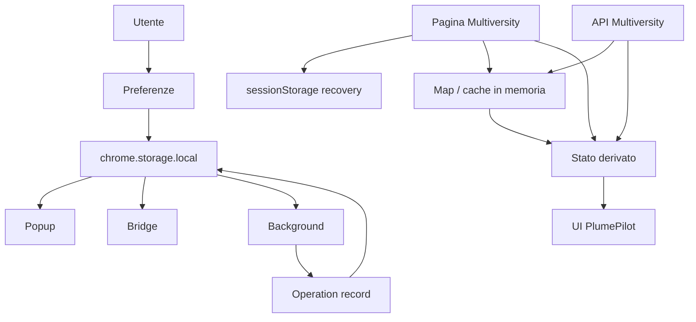
```mermaid
flowchart TD
    U[Utente] --> P[Preferenze]
    P --> SL[chrome.storage.local]

    SL --> POP[Popup]
    SL --> BR[Bridge]
    SL --> BG[Background]

    BG --> OP[Operation record]
    OP --> SL

    PAGE[Pagina Multiversity] --> SS[sessionStorage recovery]
    PAGE --> MEM[Map / cache in memoria]
    API[API Multiversity] --> MEM

    MEM --> DER[Stato derivato]
    PAGE --> DER
    API --> DER

    DER --> UI[UI PlumePilot]
```

Il diagramma evidenzia una cosa importante:

```text
stato persistente
cache
source of truth
stato derivato
```

sono livelli diversi.

---

# Parte XX — Failure modes: cosa succede quando scegliamo lo storage sbagliato

## 49. Preferenza salvata soltanto in memoria

Bug:

```text
utente abilita una funzione
chiude popup
preferenza scompare
```

Causa:

```text
lifetime troppo corto
```

---

## 50. Cache API resa persistente senza motivo

Possibile bug:

```text
riapro browser il giorno dopo
cache vecchia viene considerata attuale
salto attività non più coerenti
```

Causa:

```text
lifetime troppo lungo
```

---

## 51. Recovery guard persistente globalmente

Possibile bug:

```text
un errore avvenuto ieri su corso A
influenza oggi corso B
```

Causa:

```text
scope troppo ampio
```

---

## 52. Stato operativo soltanto nel service worker

Possibile bug:

```text
worker ricreato
perde lock logico
seconda operazione parte
```

Causa:

```text
persistenza insufficiente
```

---

## 53. Token scritto nello storage persistente

Problema:

```text
credential lifetime inutilmente esteso
superficie di esposizione maggiore
```

Causa:

```text
persistenza eccessiva per un dato sensibile
```

---

# Parte XXI — Un modello mentale: la piramide dello stato

## 54. Dal più volatile al più autorevole

Possiamo rappresentare PlumePilot così:

```text
               SERVER / PIATTAFORMA
            source of truth esterna
                    ▲
                    │ reconcile
             stato persistente
          chrome.storage.local
                    ▲
                    │ hydrate / events
              stato di sessione
              sessionStorage
                    ▲
                    │ derive
              cache in memoria
                 Map / vars
                    ▲
                    │ render
                   UI
```

Attenzione: la piramide non significa che il livello superiore sia sempre “migliore”.

Significa che ogni livello ha un diverso contratto.

---

## 55. Stato autorevole vs stato comodo

Il dato più comodo da leggere è spesso quello più vicino alla UI.

Per esempio:

```text
DOM: 80%
```

È facilissimo da ottenere.

Ma potrebbe essere meno autorevole o meno completo di una API.

Al contrario:

```text
API dettagliata di tutti i capitoli
```

può essere più autorevole ma più costosa da ottenere.

Una buona architettura non sceglie sempre la fonte “più forte”.

Sceglie una combinazione coerente tra:

```text
costo
freschezza
affidabilità
rischio dell'errore
```

---

# Parte XXII — Da backend developer: analogie utili

## 56. `chrome.storage.local` come piccolo durable store

Non è PostgreSQL.

Ma per il modello mentale possiamo pensarlo come:

```text
key/value durable store dell'applicazione
```

con:

```text
read
write
remove
change notifications
```

---

## 57. `Map` come process cache

```js
const lessonApiCache = new Map();
```

è simile a una cache locale dentro una singola istanza del processo.

Se l'istanza muore, la cache muore.

Questo è perfettamente normale.

---

## 58. `sessionStorage` come state scoped to a client session

È più vicino a un contesto temporaneo legato alla singola sessione client che a uno storage applicativo globale.

Nel nostro caso è ideale per dire:

```text
questa tab ha già tentato questo recovery una volta
```

---

## 59. Lease come distributed lock semplificato

`commissionCheckLeases` ricorda un lock distribuito con expiration:

```text
owner
lease id
expiresAt
```

Naturalmente tutto avviene localmente nel browser, ma il pattern concettuale è lo stesso.

---

## 60. `pegasoExportJob:*` come work queue / mailbox

Il producer scrive un payload.

Il consumer nasce più tardi e lo consuma.

Non abbiamo una vera message queue, ma la responsabilità architetturale è simile.

---

# Parte XXIII — Come avremmo potuto strutturarlo diversamente

## 61. Uno State Store centrale

Una possibile evoluzione architetturale sarebbe un modulo unico:

```js
StateStore.getPreferences()
StateStore.updatePreferences(...)
StateStore.getOperation()
StateStore.claimOperation(...)
StateStore.getCourseState(...)
```

Vantaggi:

```text
schema centralizzato
migrazioni più chiare
meno accessi storage sparsi
validazione uniforme
```

Svantaggi:

```text
maggiore astrazione
più codice infrastrutturale
rischio di centralizzare domini che hanno lifecycle diversi
```

Per un'estensione cresciuta incrementalmente come PlumePilot, l'architettura attuale è comprensibile: i pattern sono nati quando sono diventati necessari.

---

## 62. Cache generica con TTL?

Potremmo immaginare:

```js
new Cache({ ttl: 300_000, maxEntries: 100 })
```

Ma perderemmo facilmente la semantica specifica:

```text
un test completato può essere riusato oltre il TTL
una material URL può essere invalidata da un download failure
un outline dipende da una section signature
```

Una cache generica aiuta solo se non nasconde le regole del dominio.

---

## 63. `storage.session` per alcuni dati?

Potrebbe essere interessante per stato globale che:

```text
deve sopravvivere alle ricreazioni del service worker
ma non deve essere scritto su disco tra sessioni browser
```

Per esempio alcuni dati di coordinamento potrebbero teoricamente essere candidati.

Ma dovremmo valutare:

- compatibilità browser target;
- differenze di accessibilità tra contesti;
- necessità di sopravvivere a browser restart;
- semantica per-tab vs globale.

Ancora una volta, il criterio deve essere il lifecycle richiesto, non la novità dell'API.

---

# Parte XXIV — Checklist pratica per progettare nuovo stato

## 64. Le domande da farsi

Quando aggiungiamo una nuova feature possiamo seguire questa sequenza.

### Identità

```text
A cosa appartiene questo dato?
utente?
corso?
piattaforma?
tab?
operation?
```

### Autorità

```text
Chi è la source of truth?
noi?
DOM?
API?
utente?
```

### Lifetime

```text
deve sopravvivere a:
- callback?
- reload?
- chiusura popup?
- service worker restart?
- browser restart?
```

### Freschezza

```text
quando diventa stale?
```

### Invalidazione

```text
TTL?
evento?
fingerprint?
errore?
manual refresh?
```

### Sicurezza

```text
è sensibile?
deve davvero essere persistito?
```

### Migrazione

```text
cosa succede quando lo schema cambia nella prossima versione?
```

Se sappiamo rispondere a tutte queste domande, la scelta tecnica dello storage diventa molto più semplice.

---

# Parte XXV — Esercizi mentali

## 65. Dove metteresti questi dati?

### A. Tema chiaro/scuro

Probabile risposta:

```text
chrome.storage.local
```

Perché è una preferenza persistente dell'utente.

### B. Promise resolver in attesa di una risposta `requestId`

```text
Map in memoria
```

Non avrebbe senso serializzarlo.

### C. “Ho già tentato un reload di recovery in questa tab”

```text
sessionStorage
```

### D. Bearer token corrente

```text
memoria soltanto
```

### E. Link PDF di una dispensa appena scoperto

```text
cache in memoria
```

con eventuale invalidazione se il builder scopre che non funziona.

### F. Export globale attualmente attivo

```text
storage persistente + owner + TTL + reconciliation
```

---

## 66. Perché non salvare tutto?

Prova a immaginare PlumePilot che salva ogni risposta API in `chrome.storage.local`.

Quali problemi comparirebbero?

Possibili risposte:

```text
stale data
schema migration
quota
I/O inutile
privacy
cleanup
più fonti di verità concorrenti
```

Persistenza ha un costo architetturale.

---

## 67. Perché non tenere tutto in RAM?

Problemi opposti:

```text
popup chiuso → stato perso
worker terminato → coordinamento perso
reload → recovery perso
impossibile sincronizzare contesti indipendenti
```

Anche volatilità ha un costo.

---

# Parte XXVI — Concetti da portarsi dietro

## 68. Stato non significa storage

Lo stato è un'informazione con una semantica.

Lo storage è soltanto il mezzo con cui decidiamo di conservarla.

---

## 69. Lifetime matching

La durata dello storage dovrebbe corrispondere alla durata necessaria del dato.

```text
memoria < page session < extension storage < server state
```

Persistenza maggiore non significa automaticamente progettazione migliore.

---

## 70. Source of truth

È il sistema che possiede l'autorità finale su un dato.

Una cache non diventa source of truth solo perché è più facile da leggere.

---

## 71. Cache invalidation

Una cache deve avere una strategia esplicita per smettere di essere creduta.

In PlumePilot abbiamo visto:

```text
TTL
fingerprint
event-driven invalidation
monotonic knowledge
```

---

## 72. Reconciliation

Uno stato persistito può essere confrontato con il mondo reale e corretto.

Esempi:

```text
operation owner ancora esistente?
DOM ufficiale ha aggiornato la percentuale?
route identity coincide ancora?
```

---

## 73. Lease

Ownership temporanea con una scadenza esplicita.

È più robusta di un lock eterno quando l'owner può sparire.

---

## 74. Durable handoff

Uso di uno storage durevole per passare temporaneamente un payload tra producer e consumer con lifecycle indipendenti.

`pegasoExportJob:*` è un esempio concreto.

---

## 75. Stored intent vs effective state

La preferenza persistita può rappresentare l'intenzione dell'utente, mentre il runtime ne deriva una configurazione compatibile con i vincoli correnti.

---

## 76. Data provenance

Sapere non soltanto il valore, ma anche da dove proviene e quanto è affidabile.

Per il progresso:

```text
DOM baseline
session delta
API exact
```

---

## 77. Schema migration

Anche il local storage è un database in miniatura.

Se il formato cambia, serve una strategia per leggere o migrare i dati creati dalle versioni precedenti.

---

# Parte XXVII — Collegamento con il prossimo capitolo

A questo punto abbiamo gli ingredienti principali:

```text
Cap. 2 → messaggi
Cap. 3 → DOM dinamico
Cap. 4 → API e source of truth
Cap. 5 → asincronia e race condition
Cap. 6 → stato, lifetime, cache e persistenza
```

Possiamo finalmente affrontare l'autoplay non più come una lunga sequenza di `if`.

Possiamo leggerlo come un sistema che attraversa stati:

```text
IDLE
  ↓
PLAYING
  ↓
WAITING_COMPLETION
  ↓
TEST_BOUNDARY
  ↓
ADVANCING
  ↓
RECOVERY
  ↓
STOPPED
```

con eventi come:

```text
video ended
progress reached 100%
setting changed
API response arrived
chapter limit reached
70% threshold reached
session conflict detected
```

Il prossimo capitolo sarà quindi:

**07 — Autoplay come state machine**

Ed è qui che molti dettagli che finora sembravano indipendenti inizieranno a diventare un unico modello architetturale.

---

# Approfondimenti

## WebExtensions storage

- Chrome for Developers — `chrome.storage`  
  https://developer.chrome.com/docs/extensions/reference/api/storage

- MDN — `storage` WebExtensions API  
  https://developer.mozilla.org/en-US/docs/Mozilla/Add-ons/WebExtensions/API/storage

- MDN — `storage.local`  
  https://developer.mozilla.org/en-US/docs/Mozilla/Add-ons/WebExtensions/API/storage/local

- MDN — `storage.onChanged`  
  https://developer.mozilla.org/en-US/docs/Mozilla/Add-ons/WebExtensions/API/storage/onChanged

## Lifecycle e Manifest V3

- Chrome for Developers — Manifest V3 migration checklist  
  https://developer.chrome.com/docs/extensions/develop/migrate/checklist

- Chrome for Developers — Known issues / service worker lifecycle notes  
  https://developer.chrome.com/docs/extensions/develop/migrate/known-issues

## Web Storage

- MDN — `Window.sessionStorage`  
  https://developer.mozilla.org/en-US/docs/Web/API/Window/sessionStorage

- MDN — Using the Web Storage API  
  https://developer.mozilla.org/en-US/docs/Web/API/Web_Storage_API/Using_the_Web_Storage_API

## Strutture dati e cache

- MDN — `Map`  
  https://developer.mozilla.org/en-US/docs/Web/JavaScript/Reference/Global_Objects/Map

- MDN — Keyed collections  
  https://developer.mozilla.org/en-US/docs/Web/JavaScript/Guide/Keyed_collections

- MDN — `WeakMap`  
  https://developer.mozilla.org/en-US/docs/Web/JavaScript/Reference/Global_Objects/WeakMap

- MDN — JavaScript memory management  
  https://developer.mozilla.org/en-US/docs/Web/JavaScript/Guide/Memory_management

- MDN — IndexedDB API  
  https://developer.mozilla.org/en-US/docs/Web/API/IndexedDB_API

## Codice PlumePilot studiato

Snapshot:

```text
a8007425f81792e7570516dbdf1e7fb2cbda4d53
```

File principali:

```text
background.js
bridge.js
content.js
popup.js
commission-state.js
materials-builder.js
```

---

# 07 — Autoplay come state machine

## Dal flusso di funzioni al comportamento del sistema

Finora abbiamo studiato quasi tutti gli ingredienti che rendono possibile l'autoplay di PlumePilot:

- il DOM dinamico della piattaforma;
- i diversi contesti JavaScript dell'estensione;
- il messaging;
- le API Multiversity;
- Promise, timer e race condition;
- cache e stato persistente.

Ora possiamo cambiare prospettiva.

Invece di chiederci:

> **Quale funzione viene chiamata dopo quale funzione?**

possiamo chiederci:

> **In quale stato si trova l'autoplay, quale evento è appena accaduto e quali transizioni sono ammesse da qui?**

È una differenza importante.

Un programma sufficientemente semplice può essere letto come una sequenza:

```text
A → B → C → D
```

L'autoplay di PlumePilot non funziona così.

Durante lo stesso video possono cambiare:

- la preferenza `enabled`;
- il comportamento ai test;
- il limite della sessione;
- la soglia del 70%;
- il DOM della sidebar;
- la lezione selezionata;
- la pagina visibile;
- lo stato registrato dal server;
- un recovery;
- un'altra operazione PlumePilot.

Perciò il comportamento reale assomiglia molto di più a un grafo:

```text
                ┌──────────────┐
                │    PAUSED    │
                └──────┬───────┘
                       │ resume
                       ▼
                ┌──────────────┐
                │   WATCHING   │
                └──────┬───────┘
                       │ video ended
                       ▼
              ┌──────────────────┐
              │ VERIFY COMPLETION│
              └────────┬─────────┘
                       │
           ┌───────────┼───────────────┐
           │           │               │
           ▼           ▼               ▼
     NEXT VIDEO   TEST BOUNDARY   END OF CHAPTER
                       │               │
                       │               ├─ threshold → STOP
                       │               ├─ limit → STOP
                       │               └─ next chapter
                       ▼
               STOP / COMPLETE
```

Questo è il terreno naturale delle **state machine**.

---

## 1. Che cos'è una state machine?

Una state machine descrive il comportamento di un sistema attraverso alcuni elementi fondamentali:

- **stati**;
- **eventi**;
- **transizioni**;
- **guardie**;
- **azioni**.

La forma minima è:

```text
STATO A --evento--> STATO B
```

Per esempio:

```text
WATCHING --VIDEO_ENDED--> VERIFYING_COMPLETION
```

Ma spesso una transizione è valida soltanto se una condizione è vera:

```text
WATCHING --VIDEO_ENDED [enabled]--> VERIFYING_COMPLETION
```

La condizione tra parentesi è una **guardia**.

Una guardia non descrive *cosa fare*: descrive **se una transizione è ammessa**.

Possiamo quindi separare tre domande:

```text
Dove siamo?       → stato
Cosa è successo?  → evento
Possiamo farlo?   → guardia
```

Solo dopo arriva:

```text
Cosa facciamo?    → azione / effetto
```

Questa separazione è molto utile quando le condizioni crescono.

---

## 2. PlumePilot non usa una libreria FSM — ma il comportamento esiste lo stesso

Nel codice attuale non troviamo qualcosa come:

```js
const autoplayMachine = createMachine(...);
```

Non esiste una singola variabile:

```js
let autoplayState = "watching";
```

Lo stato è invece distribuito tra molte variabili.

In `content.js` troviamo, fra le altre:

```js
let playbackContext = null;
let busy = false;
let enabled = true;
let stopAtTests = false;
let autoCompleteTests = false;
let autoplaySkipCompletedVideos = false;
let autoplayStopAt70Enabled = false;
let autoplayStopAt70Bypassed = false;
let stoppedAtTestContext = null;
```

A queste si aggiungono:

- `smartResumeRunning`;
- `chapterLimitEnabled`;
- `chapterLimitSession`;
- `lastVideo`;
- i recovery in `sessionStorage`;
- `collectingCourseMaterials`;
- lo stato delle operazioni batch;
- il timer di avanzamento;
- l'identità della lezione corrente.

Quello che abbiamo è quindi un **vettore di stato**.

Possiamo immaginarlo così:

```text
autoplay = {
    enabled,
    busy,
    modeAtTests,
    currentLesson,
    currentVideo,
    stoppedAtTestContext,
    chapterLimit,
    threshold70,
    recovery,
    competingOperation,
    discoveryRunning,
    ...
}
```

La macchina a stati è quindi già presente **semanticamente**, anche se non è dichiarata formalmente.

Questo accade molto spesso nei software reali.

---

## 3. Stato esplicito e stato implicito

Supponiamo di avere questo codice:

```js
if (!enabled) return;
if (busy) return;
if (collectingCourseMaterials) return;
if (courseBatchRunning()) return;
```

Possiamo leggerlo come quattro `if` indipendenti.

Oppure possiamo leggerlo come:

> La transizione verso `ADVANCING` è permessa soltanto quando l'autoplay è attivo, non è già impegnato e nessuna operazione incompatibile possiede il corso.

Questa seconda lettura ci porta verso la modellazione a stati.

In altre parole:

```text
if statements
```

possono essere la rappresentazione concreta di:

```text
guards su una transizione
```

La differenza è soprattutto mentale e architetturale.

---

## 4. Gli eventi reali dell'autoplay

Prima di definire gli stati, cerchiamo gli eventi.

Nel codice reale abbiamo eventi molto chiari.

### Video avviato

`attach(v)` registra:

```js
v.addEventListener("play", () => {
    const row = currentLesson();
    if (row) rememberPlaybackLesson(row, v);
    ...
});
```

Concettualmente:

```text
VIDEO_PLAYED
```

---

### Video terminato

Sempre in `attach(v)`:

```js
v.addEventListener("ended", () => {
    void captureEndedVideoProgress(v);

    if (!enabled || smartResumeRunning) {
        return;
    }

    if (lastVideo === v) return;
    lastVideo = v;

    clearTimeout(timer);
    timer = setTimeout(() => {
        if (enabled) {
            advance(v);
        }
    }, DELAY_MS);
});
```

Questo evento è chiarissimo:

```text
VIDEO_ENDED
```

Ma già qui vediamo diverse guardie:

```text
[enabled]
[!smartResumeRunning]
[lastVideo !== v]
```

E una transizione ritardata:

```text
VIDEO_ENDED
    ↓
WAITING_ADVANCE_DELAY
    ↓ after DELAY_MS
ADVANCING
```

---

### Impostazioni cambiate

Il bridge invia `PEGASO_AUTONEXT_STATE`.

`content.js` aggiorna:

```js
enabled = event.data.enabled !== false;
autoCompleteTests = event.data.autoCompleteTests === true;
autoplaySkipCompletedVideos = event.data.autoplaySkipCompletedVideos === true;
chapterLimitEnabled = event.data.autoplayChapterLimitEnabled === true;
autoplayStopAt70Enabled = event.data.autoplayStopAt70Enabled === true;
```

Questo può essere visto come:

```text
SETTINGS_CHANGED
```

Lo stesso evento può causare transizioni diverse in base allo stato corrente.

Per esempio:

```text
PAUSED --SETTINGS_CHANGED(enabled=true)--> WATCHING
```

oppure:

```text
STOPPED_AT_TEST --SETTINGS_CHANGED(stopAtTests=false)--> RESUMING
```

Questo secondo caso esiste davvero nel codice.

---

## 5. Un evento non implica sempre una transizione

Questa è una delle idee più importanti delle state machine.

Se arriva:

```text
VIDEO_ENDED
```

non significa automaticamente:

```text
vai al video successivo
```

Il sistema deve prima chiedersi:

```text
Autoplay è attivo?
Sto già avanzando?
Quel video è ancora quello corrente?
La piattaforma ha registrato il completamento?
Il DOM rappresenta ancora la stessa lezione?
C'è un test?
Devo fermarmi al test?
Devo completarlo automaticamente?
Ho raggiunto il 70%?
Ho raggiunto il limite sessione?
Esiste un'altra operazione incompatibile?
```

Quindi l'evento è solo un **trigger**.

La transizione è una decisione.

---

## 6. Ricostruiamo la macchina principale

Una modellazione concettuale utile dell'autoplay potrebbe essere:

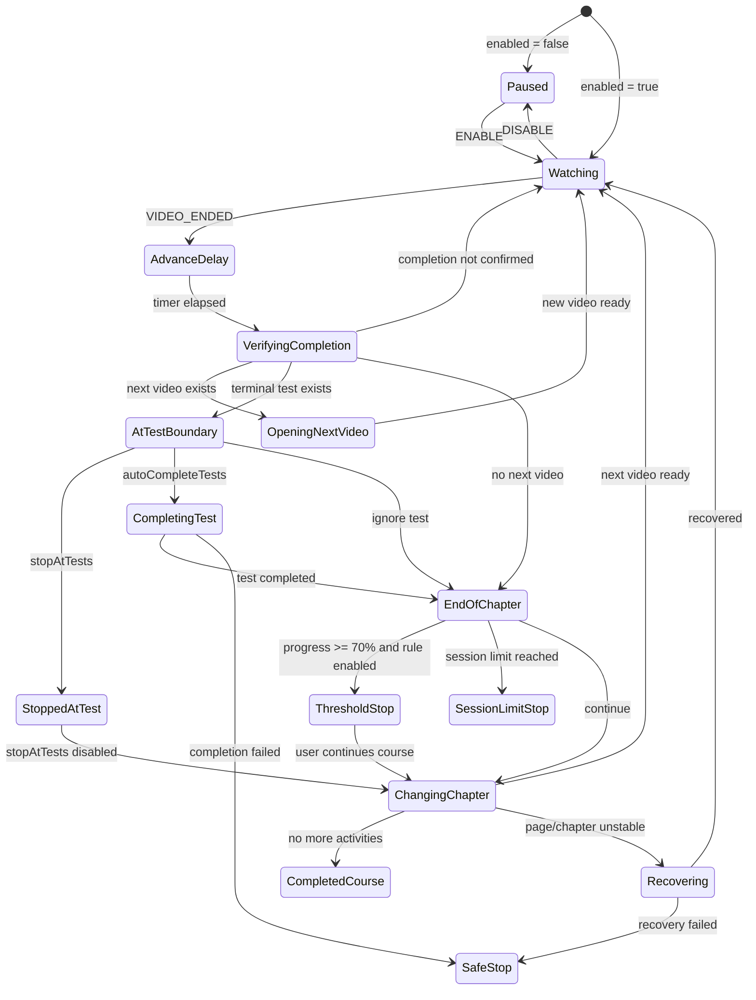
```mermaid
stateDiagram-v2
    [*] --> Paused: enabled = false
    [*] --> Watching: enabled = true

    Paused --> Watching: ENABLE
    Watching --> Paused: DISABLE

    Watching --> AdvanceDelay: VIDEO_ENDED
    AdvanceDelay --> VerifyingCompletion: timer elapsed

    VerifyingCompletion --> Watching: completion not confirmed
    VerifyingCompletion --> OpeningNextVideo: next video exists
    VerifyingCompletion --> AtTestBoundary: terminal test exists
    VerifyingCompletion --> EndOfChapter: no next video

    OpeningNextVideo --> Watching: new video ready

    AtTestBoundary --> StoppedAtTest: stopAtTests
    AtTestBoundary --> CompletingTest: autoCompleteTests
    AtTestBoundary --> EndOfChapter: ignore test

    CompletingTest --> EndOfChapter: test completed
    CompletingTest --> SafeStop: completion failed

    EndOfChapter --> ThresholdStop: progress >= 70% and rule enabled
    EndOfChapter --> SessionLimitStop: session limit reached
    EndOfChapter --> ChangingChapter: continue

    ChangingChapter --> Watching: next video ready
    ChangingChapter --> CompletedCourse: no more activities
    ChangingChapter --> Recovering: page/chapter unstable

    Recovering --> Watching: recovered
    Recovering --> SafeStop: recovery failed

    StoppedAtTest --> ChangingChapter: stopAtTests disabled
    ThresholdStop --> ChangingChapter: user continues course
```

Non è una trascrizione uno-a-uno del codice.

È un **modello del comportamento**.

Questa distinzione è importante: una state machine serve a descrivere le regole essenziali del sistema, non necessariamente ogni variabile locale.

---

## 7. `advance(v)` è quasi un transition dispatcher

La funzione centrale è:

```js
async function advance(v) {
```

All'inizio troviamo diverse guardie:

```js
if (collectingCourseMaterials) {
    return;
}

if (courseBatchRunning()) {
    return;
}

if (!enabled) {
    return;
}

if (busy || v !== lastVideo) {
    return;
}
```

Poi:

```js
busy = true;
```

e il workflow entra in una regione critica.

Possiamo tradurre questa parte in linguaggio state-machine:

```text
EVENT: ADVANCE_REQUESTED

GUARDS:
- autoplay enabled
- no material collection
- no batch operation
- not already advancing
- requested video is still authoritative

TRANSITION:
WATCHING / DELAYED → VERIFYING_CURRENT_LESSON
```

Il codice successivo decide poi quale ramo prendere.

---

## 8. `busy` non è la state machine

Potrebbe essere tentante pensare:

```text
busy = false → idle
busy = true  → advancing
```

Ma sarebbe una semplificazione eccessiva.

`busy` è una **reentrancy guard**.

Serve a impedire che due avanzamenti entrino contemporaneamente nella stessa sequenza.

Non ci dice però *perché* l'autoplay è fermo o cosa sta facendo.

Con `busy === false` potremmo essere:

- in pausa;
- in attesa di un video;
- fermi a un test;
- fermi al 70%;
- fermi per limite sessione;
- in recovery;
- alla fine del corso.

Quindi:

> **Un flag può rappresentare una proprietà dello stato senza rappresentare lo stato intero.**

Questo è uno dei motivi per cui i sistemi con molti boolean possono diventare difficili da leggere.

---

## 9. Il problema dell'esplosione combinatoria dei boolean

Immaginiamo tre flag:

```text
enabled
busy
stopAtTests
```

Formalmente esistono:

```text
2³ = 8 combinazioni
```

Con dieci boolean:

```text
2¹⁰ = 1024 combinazioni
```

Ovviamente molte combinazioni non sono realmente valide.

Per esempio, concettualmente potrebbe non avere senso essere contemporaneamente:

```text
PAUSED
+
ADVANCING
```

Una state machine esplicita aiuta perché rende molte combinazioni **impossibili per costruzione**.

Invece di:

```js
enabled = false;
busy = true;
stoppedAtTestContext = ...;
```

potremmo avere uno stato unico:

```text
paused
```

con un contesto separato.

Questa distinzione tra **finite state** e **extended state/context** è fondamentale.

---

## 10. Stato finito e contesto

Una macchina non deve trasformare ogni dato in uno stato.

Per esempio:

```text
watching chapter 5 lesson 2
watching chapter 5 lesson 3
watching chapter 5 lesson 4
```

non richiede tre stati differenti.

Possiamo avere:

```text
state = WATCHING
```

con:

```text
context = {
    courseCode,
    chapterIdentity,
    lessonIdentity,
    videoElement
}
```

Nel codice PlumePilot questo ruolo è svolto in parte da `playbackContext`:

```js
playbackContext = {
    videoElement,
    courseCode: courseCodeFromUrl(),
    lessonNumber: lessonNumberFromUrl(),
    identity,
    name: lessonName(row),
    index,
};
```

Questo è molto vicino al concetto di **extended state**.

Lo stato descrive *la modalità*.

Il contesto contiene *i dati necessari a quella modalità*.

---

## 11. `playbackContext` rende stabile l'identità attraverso le transizioni

Nel Capitolo 03 abbiamo già visto che un nodo DOM può diventare obsoleto.

Qui possiamo reinterpretare lo stesso meccanismo come parte della macchina.

Durante `advance(v)`:

```js
let cur = await recoverPlaybackLesson(v);
```

Poi viene conservato:

```js
const completedLesson = playbackContext;
```

Dopo l'attesa:

```js
const completed = await waitForLessonCompletion(cur, v);
```

il mondo viene verificato nuovamente:

```js
const stableCur = await recoverPlaybackLesson(v);

if (
    !enabled ||
    v !== lastVideo ||
    video() !== v ||
    !stableCur ||
    playbackLessonRow(completedLesson) !== stableCur
) {
    return;
}
```

Possiamo leggerlo così:

```text
VERIFYING_COMPLETION
      │
      │ await platform state
      ▼
REVALIDATE CONTEXT
      │
      ├─ context unchanged → continue transition
      └─ context changed   → cancel transition
```

È un pattern estremamente importante.

La macchina non presume che, dopo un'attesa asincrona, si trovi ancora nello stesso mondo.

---

## 12. Le guardie sono disseminate nel codice

Prendiamo alcuni esempi.

### Guardia: autoplay attivo

```js
if (!enabled) return;
```

---

### Guardia: evento non duplicato

```js
if (lastVideo === v) return;
```

---

### Guardia: nessuna transizione già in corso

```js
if (busy) return;
```

---

### Guardia: stesso video ancora corrente

```js
if (v !== lastVideo) return;
```

---

### Guardia: nessuna operazione incompatibile

```js
if (collectingCourseMaterials || courseBatchRunning()) return;
```

---

### Guardia: stop ai test

```js
if (test && stopAtTests) {
```

---

### Guardia: completamento automatico

```js
else if (test && autoCompleteTests) {
```

---

### Guardia: soglia raggiunta

```js
if (thresholdReached) {
```

---

### Guardia: limite sessione raggiunto

```js
if (sessionLimitReached) {
```

Visti insieme, questi `if` non sono soltanto controllo di flusso.

Sono il **transition table implicito** dell'autoplay.

---

## 13. Una transition table esplicita

Possiamo rappresentare parte del comportamento in una tabella.

| Stato | Evento | Guardia | Nuovo stato / azione |
|---|---|---|---|
| `WATCHING` | `VIDEO_ENDED` | `enabled && !smartResumeRunning` | `ADVANCE_DELAY` |
| `ADVANCE_DELAY` | `TIMER` | `enabled` | `VERIFYING_COMPLETION` |
| `VERIFYING_COMPLETION` | `COMPLETED` | next video exists | `OPENING_NEXT_VIDEO` |
| `VERIFYING_COMPLETION` | `COMPLETED` | terminal test + stop | `STOPPED_AT_TEST` |
| `VERIFYING_COMPLETION` | `COMPLETED` | terminal test + auto-complete | `COMPLETING_TEST` |
| `COMPLETING_TEST` | `SUCCESS` | — | `END_OF_CHAPTER` |
| `COMPLETING_TEST` | `FAILURE` | — | `SAFE_STOP` |
| `END_OF_CHAPTER` | `CONTINUE` | threshold reached | `THRESHOLD_STOP` |
| `END_OF_CHAPTER` | `CONTINUE` | session limit reached | `SESSION_LIMIT_STOP` |
| `END_OF_CHAPTER` | `CONTINUE` | otherwise | `CHANGING_CHAPTER` |
| `STOPPED_AT_TEST` | `SETTINGS_CHANGED` | `!stopAtTests` | `RESUMING` |
| qualunque stato attivo | `DISABLE` | — | `PAUSED` |

Una tabella del genere è utile per due motivi.

Primo: rende visibili casi dimenticati.

Secondo: può diventare quasi direttamente una matrice di test.

---

## 14. Gli eventi duplicati: `lastVideo` come deduplicazione

Il listener `ended` contiene:

```js
if (lastVideo === v) return;
lastVideo = v;
```

Perché?

Perché nei sistemi event-driven è pericoloso assumere che un evento semanticamente importante arrivi esattamente una volta.

Il browser e la piattaforma possono:

- riutilizzare il player;
- ricostruire parti del DOM;
- cambiare sorgente;
- causare listener o stati intermedi inattesi.

PlumePilot trasforma quindi:

```text
VIDEO_ENDED(video X)
VIDEO_ENDED(video X)
```

in un solo avanzamento logico.

Possiamo vedere `lastVideo` come una piccola forma di:

```text
event deduplication
```

oppure, in termini di state machine:

```text
ignora eventi che non producono una transizione valida dallo stato corrente
```

---

## 15. `play` corregge lo stato per il riuso del player

C'è però una complicazione.

La piattaforma può riutilizzare lo stesso elemento `<video>` per un nuovo contenuto.

Per questo il listener `play` contiene:

```js
if (
    lastVideo === v &&
    !v.ended &&
    (!Number.isFinite(v.duration) || v.currentTime < v.duration - 0.5)
) {
    lastVideo = null;
}
```

Altrimenti avremmo questo errore logico:

```text
video element A finisce
lastVideo = A

piattaforma riusa element A per il video successivo

nuovo ended su A
↓
"è già lastVideo"
↓
evento ignorato per errore
```

Quindi lo stato deve rappresentare **l'identità semantica**, non soltanto l'identità dell'oggetto JavaScript.

È lo stesso principio visto con il DOM, applicato ora agli eventi.

---

## 16. Delayed transitions: i timer non sono semplici pause

Dopo `ended`, PlumePilot non chiama immediatamente `advance(v)`.

Usa:

```js
timer = setTimeout(() => {
    if (enabled) {
        advance(v);
    }
}, DELAY_MS);
```

Nella modellazione a stati possiamo rappresentarlo come:

```text
VIDEO_ENDED
   ↓
WAITING_AFTER_END
   ↓ after DELAY_MS
VERIFYING_COMPLETION
```

Questo è un esempio di **delayed transition**.

Il tempo fa parte del comportamento.

La differenza rispetto a un semplice `sleep()` è concettuale:

> non stiamo solo aspettando; stiamo dicendo che il sistema resta in uno stato per un intervallo, durante il quale altri eventi possono invalidare la transizione.

Infatti allo scadere del timer viene ricontrollato:

```js
if (enabled)
```

Il timer non congela il mondo.

---

## 17. Il completamento della lezione è uno stato di attesa, non una proprietà istantanea

`waitForLessonCompletion()` mostra molto bene questa idea.

Quando il video termina, la piattaforma può non aver ancora aggiornato la sidebar.

Quindi non possiamo fare:

```text
video ended → completed
```

Il modello corretto è:

```text
VIDEO ENDED
    ↓
AWAITING PLATFORM CONFIRMATION
    ↓
100% registered
```

oppure:

```text
VIDEO ENDED
    ↓
AWAITING PLATFORM CONFIRMATION
    ↓ timeout
real video end confirmed
    ↓
continue with safeguard
```

oppure:

```text
VIDEO ENDED
    ↓
platform validation failure
    ↓
SAFE STOP / RECOVERY
```

Questo è molto più fedele al dominio.

---

## 18. State machine e sistema esterno

Una state machine applicativa non controlla tutto il mondo.

PlumePilot controlla il proprio stato, ma non controlla:

- quando Multiversity aggiorna il progresso;
- quando il DOM viene ricostruito;
- quando una sessione video viene rilasciata;
- quando una richiesta API torna;
- quando un utente cambia manualmente lezione.

Questi fattori arrivano alla macchina come **eventi esterni**.

Possiamo rappresentare la relazione così:

```text
             ┌────────────────────┐
             │    Multiversity    │
             └──────┬─────────────┘
                    │
       DOM / API / video events
                    │
                    ▼
          ┌──────────────────┐
          │ Autoplay machine │
          └────────┬─────────┘
                   │          click / API / status
                   │
                   ▼
             Multiversity
```

La macchina è quindi **reattiva**.

Non esegue un copione predeterminato: reagisce al mondo.

---

## 19. I test sono un vero branch di stato

Arriviamo a uno dei punti più importanti.

Alla fine di un capitolo, PlumePilot controlla:

```js
const test = getEndOfLessonTest(chapter);
```

Da qui il comportamento può divergere.

### Caso 1 — Fermati ai test

```js
if (test && stopAtTests) {
    ...
    stoppedAtTestContext = {
        identity: chapterIdentity(chapter),
        oldVideo: v,
    };
    return;
}
```

Questo corrisponde molto bene a uno stato esplicito:

```text
STOPPED_AT_TEST
```

Notiamo che viene salvato anche il contesto necessario a riprendere.

---

### Caso 2 — Test già completo

```js
else if (test && isEndOfLessonTestCompleted(test)) {
    // skip
}
```

La macchina non entra in un nuovo stato duraturo: attraversa semplicemente la guardia.

---

### Caso 3 — Completa automaticamente

```js
else if (test && autoCompleteTests) {
    const testCompleted = await completeAutomaticEndOfLessonTest(...);

    if (!testCompleted) {
        return;
    }
}
```

Concettualmente:

```text
AT_TEST_BOUNDARY
      ↓
COMPLETING_TEST
      ↓ success
END_OF_CHAPTER
```

oppure:

```text
COMPLETING_TEST
      ↓ failure
SAFE_STOP
```

---

### Caso 4 — Ignora e continua

Se c'è un test ma nessuna delle guardie precedenti blocca la transizione:

```text
AT_TEST_BOUNDARY → END_OF_CHAPTER
```

Quattro comportamenti differenti partono dallo stesso evento logico.

È esattamente il tipo di situazione in cui una state machine diventa utile.

---

## 20. Stored intent ed effective state

Nel Capitolo 06 abbiamo introdotto questa distinzione.

Qui la vediamo in azione.

Nel bridge, la preferenza viene letta da storage.

Poi viene derivato lo stato effettivo.

In `content.js`:

```js
stopAtTests =
    event.data.stopAtTests !== false &&
    !autoCompleteTests &&
    !chapterLimitEnabled;
```

Quindi una preferenza salvata può essere vera, ma la guardia runtime può risultare falsa perché un'altra modalità ha priorità.

Questo evita combinazioni contraddittorie.

State-machine thinking ci suggerisce di non pensare a:

```text
stopAtTests = checkbox
```

ma a:

```text
storedIntent.stopAtTests
       +
runtime constraints
       ↓
effectiveMode
```

Questo è un modo molto più robusto di modellare configurazioni interdipendenti.

---

## 21. Fermarsi a un test crea uno stato persistente nel comportamento

`stoppedAtTestContext` è particolarmente interessante.

Quando l'autoplay si ferma, non basta sapere:

```text
"sono fermo"
```

Serve sapere **da dove riprendere**.

Per questo viene conservato:

```js
{
    identity,
    oldVideo
}
```

Quando l'utente disattiva `stopAtTests`, il cambio impostazioni contiene:

```js
if (wasStoppingAtTests && !stopAtTests) {
    const context = stoppedAtTestContext;
    stoppedAtTestContext = null;

    if (context) {
        resumeAfterTestBoundary(context);
    } else {
        resumeIfVideoAlreadyEnded();
    }
}
```

In linguaggio state-machine:

```text
STATE: STOPPED_AT_TEST
EVENT: STOP_AT_TESTS_DISABLED
ACTION: consume saved context
TRANSITION: RESUMING_AFTER_TEST
```

È uno degli esempi più puliti del capitolo.

---

## 22. State history: sapere da dove proveniamo

`stoppedAtTestContext` ci mostra anche un concetto più generale.

Talvolta lo stato corrente non basta.

Per riprendere correttamente serve una parte della **history**.

Non ci interessa tutta la cronologia del corso.

Ci interessa soltanto:

```text
ultimo punto sicuro da cui continuare
```

È una forma molto semplice di state history.

La stessa idea appare nei recovery:

```text
currentIdentity
path
attempts
createdAt
```

Il software conserva il minimo contesto necessario a ricostruire una transizione interrotta.

---

## 23. Soglia del 70% e limite sessione sono stati terminali relativi

Dopo aver terminato un capitolo:

```js
const sessionLimitReached = chapterLimitReached(...);
const thresholdReached = autoplayThresholdReached();
```

Poi:

```js
if (thresholdReached) {
    ...
    return;
}

if (sessionLimitReached) {
    ...
    return;
}
```

Dal punto di vista della singola sessione autoplay, sono stati terminali:

```text
THRESHOLD_STOP
SESSION_LIMIT_STOP
```

Ma non sono terminali per l'intera applicazione.

L'utente può riprendere.

Per questo è utile parlare di:

```text
terminal state del workflow corrente
```

non necessariamente:

```text
fine definitiva dell'applicazione
```

---

## 24. Due condizioni terminali possono verificarsi insieme

Il codice gestisce anche:

```js
if (thresholdReached || sessionLimitReached) {
    // sound event
}
```

E il messaggio distingue il caso combinato:

```js
thresholdReached
    ? sessionLimitReached
        ? "Soglia del 70% e limite della sessione raggiunti."
        : ...
```

Questo ci ricorda che il sistema possiede anche **stato ortogonale**.

Due proprietà possono diventare vere contemporaneamente:

```text
thresholdReached = true
sessionLimitReached = true
```

Una FSM completamente piatta dovrebbe creare una combinazione dedicata.

Uno **statechart** più ricco può invece modellare regioni o condizioni parallele.

Questo è uno dei punti in cui il termine *state machine* comincia a diventare più ampio della semplice FSM scolastica.

---

## 25. FSM e statechart

Una finite state machine semplice assume spesso un solo stato discreto attivo:

```text
A oppure B oppure C
```

Nei software reali abbiamo frequentemente proprietà indipendenti:

```text
playback = watching
threshold = armed
sessionLimit = active
recovery = none
```

Appiattire tutto produce molti stati:

```text
WATCHING_THRESHOLD_ARMED_LIMIT_ACTIVE
WATCHING_THRESHOLD_BYPASSED_LIMIT_ACTIVE
WATCHING_THRESHOLD_ARMED_LIMIT_DISABLED
...
```

Uno **statechart** permette concetti più ricchi:

- stati gerarchici;
- sottostati;
- regioni parallele;
- history;
- guardie;
- transizioni ritardate.

Non è necessario introdurre una libreria per beneficiare di questi concetti.

La modellazione da sola può già migliorare il ragionamento.

---

## 26. Recovery come submachine

I recovery di PlumePilot sono un ottimo candidato per essere pensati come una macchina separata.

Per esempio il session-conflict recovery può essere semplificato così:

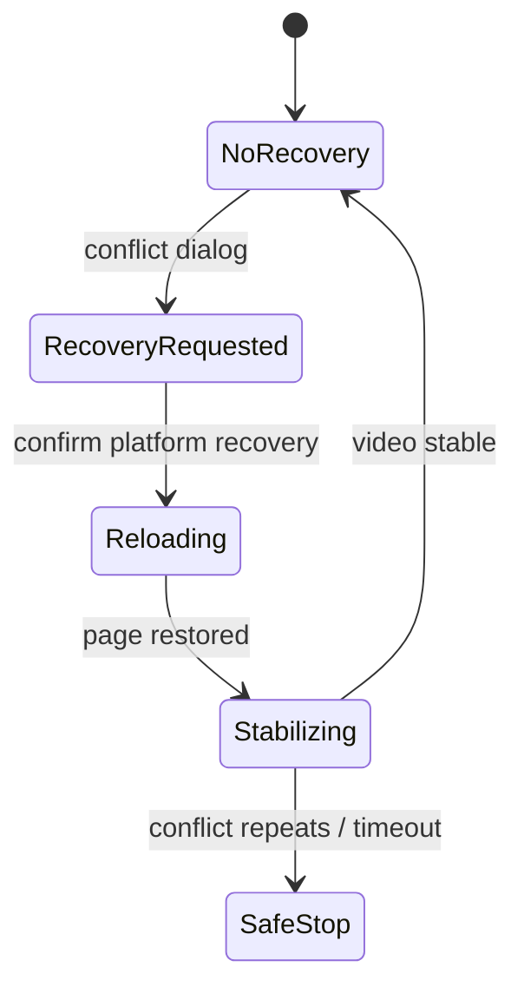
```mermaid
stateDiagram-v2
    [*] --> NoRecovery
    NoRecovery --> RecoveryRequested: conflict dialog
    RecoveryRequested --> Reloading: confirm platform recovery
    Reloading --> Stabilizing: page restored
    Stabilizing --> NoRecovery: video stable
    Stabilizing --> SafeStop: conflict repeats / timeout
```

Questa macchina può interagire con l'autoplay principale:

```text
AUTOPLAY.ACTIVE
      │
      ├─ recovery = none      → transizioni normali
      └─ recovery != none     → niente first-incomplete / avanzamenti pericolosi
```

E infatti `startFirstIncompleteDiscovery()` controlla:

```js
if (
    readChapterRecovery()?.currentIdentity ||
    readSessionConflictRecovery() ||
    readWatchValidationRecovery()
) {
    return;
}
```

State-machine thinking rende evidente il significato:

> **la discovery non è una transizione ammessa mentre la recovery submachine non è nello stato `NONE`.**

---

## 27. Operazioni concorrenti come ownership del sistema

L'autoplay verifica anche:

```js
if (collectingCourseMaterials) return;
if (courseBatchRunning()) return;
```

Nel Capitolo 05 abbiamo visto la concorrenza.

Qui possiamo modellarla così:

```text
COURSE CONTROL OWNER

AUTOPLAY
EXPORT
TURBO TEST
OBJECTIVES
```

Alcune attività sono incompatibili perché manipolano o interrogano la stessa struttura di corso.

Quindi:

```text
AUTOPLAY transition
    guard: courseOwner == AUTOPLAY || courseOwner == NONE
```

Il progetto non implementa letteralmente questo enum, ma il concetto è utile per capire perché certi controlli esistono.

---

## 28. `nextChapter()` è una transizione composta

Alla fine del capitolo:

```js
await nextChapter(v, cur);
```

Non significa semplicemente:

```text
chapter++
```

Può richiedere:

- identificazione stabile del capitolo corrente;
- API discovery;
- scelta fra ordine sequenziale e skip dei completati;
- apertura di una nuova sezione;
- verifica di test intermedi;
- fallback visuale;
- recovery del DOM;
- attesa del nuovo video.

Quindi `CHANGING_CHAPTER` è in realtà un **compound state**.

Possiamo immaginarlo così:

```text
CHANGING_CHAPTER
├── FIND_TARGET
├── OPEN_SECTION
├── OPEN_CHAPTER
├── WAIT_RENDER
├── SELECT_ACTIVITY
└── WAIT_VIDEO
```

Questa gerarchia ci evita di trasformare la macchina principale in un diagramma illeggibile.

---

## 29. La prima attività incompleta è una macchina separata

`startFirstIncompleteDiscovery()` condivide molti strumenti con l'autoplay, ma ha un obiettivo differente.

Non sta semplicemente continuando da una lezione conclusa.

Sta cercando:

```text
il primo target valido secondo una politica di discovery
```

Per questo conviene pensarlo come una submachine:

```text
IDLE
 ↓ start
BUILD_OUTLINE
 ↓
READ_MASTER
 ↓
SCAN_CANDIDATES
 ├─ target → OPEN_TARGET
 ├─ uncertain → VISUAL_VERIFY
 ├─ cancelled → CANCELLED
 └─ none → COMPLETE
```

Nel Capitolo 08 la studieremo nel dettaglio.

Per ora è sufficiente notare che:

> **due feature possono condividere API e funzioni senza essere lo stesso workflow.**

Questo è un principio architetturale importante.

---

## 30. Fail closed come transizione di sicurezza

Nel codice della discovery troviamo casi come:

```js
if (!lesson.ok) {
    setResumeDiscoveryStatus(
        "Test corrente non verificabile. Avanzamento fermato per sicurezza.",
        "fallback",
    );
    return true;
}
```

Il principio è:

```text
incertezza su una condizione che potrebbe richiedere stop
        ↓
non avanzare
```

Questo è un comportamento **fail closed**.

Per l'autoplay è preferibile un falso stop a un falso skip quando l'utente ha esplicitamente chiesto di fermarsi ai test.

In termini di state machine:

```text
VERIFY_TEST
   ├─ confirmed absent → continue
   ├─ confirmed present → STOPPED_AT_TEST
   └─ unknown          → SAFE_STOP
```

Lo stato `UNKNOWN` non viene trattato come `FALSE`.

---

## 31. Una macchina rende esplicita la politica sull'incertezza

Questo è un vantaggio notevole.

Senza modello, potremmo avere:

```js
if (!test) continue;
```

Ma `!test` può significare:

```text
nessun test esiste
```

oppure:

```text
non siamo riusciti a verificarlo
```

Sono semanticamente differenti.

Una buona macchina può distinguere:

```text
ABSENT
PRESENT
UNKNOWN
```

e scegliere transizioni diverse.

Questa idea ricorrerà fortemente nel Capitolo 08.

---

## 32. L'autoplay non è una state machine puramente deterministica rispetto al browser

Una state machine è spesso descritta come:

```text
nextState = transition(currentState, event)
```

Ma PlumePilot interagisce con side effect reali:

- `click()`;
- `fetch()`;
- `setTimeout()`;
- storage;
- DOM;
- notifiche;
- suoni.

Per questo è utile separare idealmente:

```text
TRANSITION LOGIC
```

da:

```text
EFFECTS
```

Per esempio:

```text
STATE = END_OF_CHAPTER
EVENT = CONTINUE
GUARD = thresholdReached

NEXT STATE = THRESHOLD_STOP
ACTION = show notification + publish status + play sound
```

Il cambio di stato è una decisione.

Il suono è un effetto.

Questa separazione rende i test più semplici.

---

## 33. Come potrebbe apparire un refactor puramente illustrativo

**Questo non è codice presente in PlumePilot e non è una proposta di modifica necessaria.**

Serve soltanto a visualizzare il modello.

Potremmo immaginare:

```js
function transition(state, event, context) {
    if (event.type === "DISABLE") {
        return { state: "paused", context };
    }

    if (state === "watching" && event.type === "VIDEO_ENDED") {
        if (context.discoveryRunning) return { state, context };
        return { state: "advanceDelay", context };
    }

    if (state === "atTestBoundary") {
        if (context.stopAtTests) {
            return { state: "stoppedAtTest", context };
        }

        if (context.autoCompleteTests) {
            return { state: "completingTest", context };
        }

        return { state: "endOfChapter", context };
    }

    return { state, context };
}
```

Poi gli effetti potrebbero essere eseguiti separatamente.

Il vantaggio sarebbe poter testare:

```js
transition(
    "atTestBoundary",
    { type: "DECIDE" },
    { stopAtTests: true, autoCompleteTests: false }
)
```

senza aprire un browser, una pagina Multiversity o un vero video.

---

## 34. Perché non rifattorizzare automaticamente tutto così?

Perché una state machine esplicita ha anche un costo.

Potrebbe richiedere:

- introdurre un nuovo livello di astrazione;
- migrare molto codice stabile;
- rappresentare side effect complessi;
- gestire integrazioni DOM che restano imperative;
- aumentare la curva di apprendimento;
- rischiare regressioni in un sistema ormai maturo.

Perciò la conclusione non è:

> "PlumePilot dovrebbe essere riscritto con XState."

La conclusione è:

> **Il modello a stati è uno strumento per capire e progettare il comportamento, indipendentemente dalla sintassi usata per implementarlo.**

Questa distinzione è fondamentale.

---

## 35. Da backend developer: pensa a un workflow orchestrator

Se vieni dal backend, puoi confrontare l'autoplay con un workflow applicativo.

Per esempio un ordine e-commerce può essere:

```text
CREATED
→ PAID
→ PREPARING
→ SHIPPED
→ DELIVERED
```

con deviazioni:

```text
PAYMENT_FAILED
CANCELLED
REFUNDED
```

L'autoplay ha lo stesso tipo di problema:

```text
WATCHING
→ VIDEO_ENDED
→ VERIFYING
→ NEXT_ACTIVITY
```

con deviazioni:

```text
STOPPED_AT_TEST
RECOVERING
THRESHOLD_STOP
SESSION_LIMIT_STOP
SAFE_STOP
```

La differenza è che il dominio è una pagina web dinamica invece di un database di ordini.

Ma il problema logico è molto simile.

---

## 36. Guardie e invariant

Una **guardia** decide se una singola transizione può avvenire.

Un **invariant** descrive invece una proprietà che dovrebbe restare vera in tutti gli stati rilevanti.

Per l'autoplay possiamo formulare alcuni invariant utili.

### Invariant 1

```text
Se enabled == false, PlumePilot non deve selezionare automaticamente una nuova attività.
```

---

### Invariant 2

```text
Non devono esistere due avanzamenti automatici concorrenti.
```

`busy` contribuisce a garantirlo.

---

### Invariant 3

```text
Se stopAtTests è effettivamente attivo e un test non è verificabile,
PlumePilot non deve oltrepassare silenziosamente il confine.
```

---

### Invariant 4

```text
Dopo un await, il target deve essere ancora coerente con il contesto che ha iniziato la transizione.
```

---

### Invariant 5

```text
Un recovery non deve generare un loop infinito di reload.
```

Questi invariant sono molto utili anche nei test di regressione.

---

## 37. Dalle state machine ai test

Una macchina ben descritta suggerisce direttamente i casi da verificare.

### Test A — Autoplay in pausa

```text
GIVEN  state = PAUSED
WHEN   VIDEO_ENDED
THEN   nessuna navigazione automatica
```

---

### Test B — Evento ended duplicato

```text
GIVEN  lo stesso video ha già generato la transizione
WHEN   arriva un altro ended sullo stesso target logico
THEN   niente secondo advance
```

---

### Test C — Stop ai test

```text
GIVEN  stopAtTests = true
AND    il capitolo termina con un test
WHEN   l'ultimo video viene completato
THEN   state = STOPPED_AT_TEST
AND    il capitolo successivo non viene aperto
```

---

### Test D — Cambio impostazione mentre siamo fermi

```text
GIVEN  state = STOPPED_AT_TEST
WHEN   stopAtTests diventa false
THEN   riprendi dal contesto salvato
```

Questo è esattamente il tipo di regressione risolto in passato.

---

### Test E — Auto-completamento fallisce

```text
GIVEN  autoCompleteTests = true
WHEN   il test non può essere completato in modo verificato
THEN   SAFE_STOP
```

---

### Test F — Soglia e limite insieme

```text
GIVEN  threshold70 reached
AND    chapter session limit reached
WHEN   il capitolo termina
THEN   niente nextChapter
AND    stato terminale coerente
AND    messaggio combinato corretto
```

---

### Test G — Stato cambia durante await

```text
GIVEN  advance() sta aspettando completion
WHEN   l'utente cambia lezione o il DOM viene ricostruito
THEN   la vecchia transizione viene annullata
```

Questa è una delle regressioni più importanti che abbiamo studiato.

---

## 38. Il changelog racconta l'evoluzione della macchina

Letto con questa lente, il changelog di PlumePilot diventa quasi una storia di transizioni mancanti.

### v1.6.0

Arriva il ramo:

```text
AT_TEST_BOUNDARY → COMPLETING_TEST
```

con una regola importante:

```text
se non posso verificare il completamento → stop
```

---

### v2.9.x

Il test boundary diventa più formale:

```text
current test present / absent / unknown
```

con comportamento fail-closed.

---

### v2.10.1

Viene corretta una transizione che mancava:

```text
STOPPED_AT_TEST
    --disable stopAtTests-->
RESUME
```

---

### v2.11.5

Compare una vera submachine di recovery per il conflitto di sessione.

---

### v2.14.x

La discovery della prima attività incompleta diventa un workflow autonomo con cancellazione e fallback.

---

### v2.19.0

Compare:

```text
END_OF_CHAPTER → SESSION_LIMIT_STOP
```

---

### v2.35.1

Vengono migliorate le transizioni relative ad accordion chiusi, handoff dagli Obiettivi e routing fra capitoli.

Vista così, una regressione non è semplicemente:

```text
"funzione X rotta"
```

ma spesso:

```text
"mancava o era sbagliata una transizione fra due stati reali del sistema"
```

---

## 39. Le regressioni come transizioni non modellate

Questo è un principio molto potente.

Prendiamo alcuni bug incontrati nello sviluppo.

### Accordion chiuso durante il completamento

Il vecchio modello implicito assumeva:

```text
WAITING_COMPLETION → stesso DOM ancora disponibile
```

Ma il mondo reale permetteva:

```text
WAITING_COMPLETION → SIDEBAR_CHANGED
```
La transizione non era stata sufficientemente modellata.

La correzione ha introdotto re-resolution e revalidation.

---

### Disabilitare “Fermati ai test” dopo lo stop

Il sistema aveva:

```text
WATCHING → STOPPED_AT_TEST
```

ma la transizione inversa non era affidabile.

La correzione ha introdotto esplicitamente il resume context.

---

### Player riutilizzato

Il modello ingenuo diceva:

```text
videoElement == lastVideo → evento duplicato
```

Il modello reale richiedeva:

```text
stesso elemento DOM != necessariamente stesso video logico
```

Di nuovo: identità e transizione.

---

## 40. Diagramma più completo dell'autoplay

Possiamo ora rappresentare una versione più ricca.

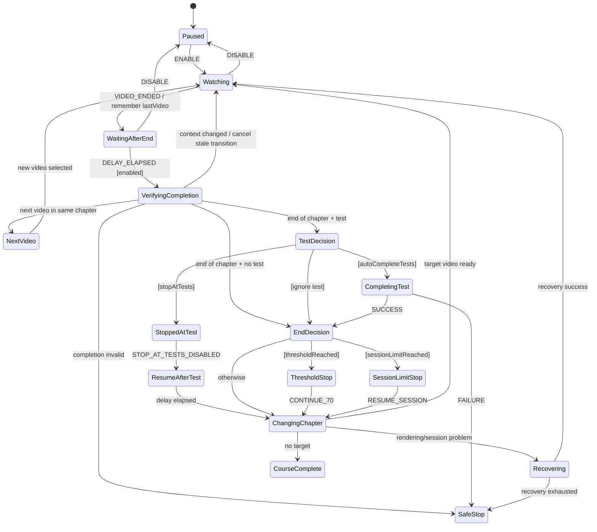
```mermaid
stateDiagram-v2
    [*] --> Paused

    Paused --> Watching: ENABLE
    Watching --> Paused: DISABLE

    Watching --> WaitingAfterEnd: VIDEO_ENDED / remember lastVideo
    WaitingAfterEnd --> Paused: DISABLE
    WaitingAfterEnd --> VerifyingCompletion: DELAY_ELAPSED [enabled]

    VerifyingCompletion --> SafeStop: completion invalid
    VerifyingCompletion --> Watching: context changed / cancel stale transition
    VerifyingCompletion --> NextVideo: next video in same chapter
    VerifyingCompletion --> TestDecision: end of chapter + test
    VerifyingCompletion --> EndDecision: end of chapter + no test

    NextVideo --> Watching: new video selected

    TestDecision --> StoppedAtTest: [stopAtTests]
    TestDecision --> CompletingTest: [autoCompleteTests]
    TestDecision --> EndDecision: [ignore test]

    CompletingTest --> EndDecision: SUCCESS
    CompletingTest --> SafeStop: FAILURE

    StoppedAtTest --> ResumeAfterTest: STOP_AT_TESTS_DISABLED
    ResumeAfterTest --> ChangingChapter: delay elapsed

    EndDecision --> ThresholdStop: [thresholdReached]
    EndDecision --> SessionLimitStop: [sessionLimitReached]
    EndDecision --> ChangingChapter: otherwise

    ChangingChapter --> Watching: target video ready
    ChangingChapter --> Recovering: rendering/session problem
    ChangingChapter --> CourseComplete: no target

    Recovering --> Watching: recovery success
    Recovering --> SafeStop: recovery exhausted

    ThresholdStop --> ChangingChapter: CONTINUE_70
    SessionLimitStop --> ChangingChapter: RESUME_SESSION
```

Il diagramma non sostituisce il codice.

Fa emergere le sue regole.

---

## 41. Quali stati non conviene modellare esplicitamente?

Non tutto merita uno stato.

Per esempio:

```text
percent = 42
percent = 43
percent = 44
```

non sono tre stati della macchina.

Sono dati nel contesto.

Allo stesso modo:

```text
chapterLimit = 5
```

è un parametro.

Diventa rilevante come stato soltanto quando la condizione cambia semanticamente:

```text
limit not reached
→
limit reached
```

Una buona regola è:

> **Modella come stato ciò che cambia il comportamento ammesso del sistema.**

---

## 42. Un esercizio: classificare alcune variabili

Proviamo con variabili reali.

### `enabled`

Influenza direttamente le transizioni possibili.

Può essere visto come stato/modalità globale.

---

### `busy`

È una guardia di reentrancy.

Non descrive da sola una modalità di dominio completa.

---

### `playbackContext`

È contesto/extended state.

---

### `stopAtTests`

È una policy che modifica le transizioni al test boundary.

---

### `stoppedAtTestContext`

È history/context associato allo stato `STOPPED_AT_TEST`.

---

### `chapterLimitSession.completed`

È un contatore nel contesto.

Quando supera una soglia produce una transizione verso `SESSION_LIMIT_STOP`.

---

### `lastVideo`

È memoria di deduplicazione/event identity.

---

### recovery in `sessionStorage`

È stato di una submachine che deve sopravvivere al reload.

Questo tipo di classificazione aiuta moltissimo a capire codice complesso.

---

## 43. Possiamo avere più macchine contemporaneamente

Una delle idee più utili da portarsi dietro è che un'applicazione non deve avere **una gigantesca state machine**.

PlumePilot si presta meglio a una composizione concettuale:

```text
AutoplayMachine
├── PlaybackMachine
├── TestBoundaryMachine
├── ChapterNavigationMachine
├── RecoveryMachine
└── FirstIncompleteMachine

OperationCoordinator
├── Export
├── Turbo
└── Objectives
```

Le macchine comunicano attraverso eventi o condizioni condivise.

Questa decomposizione è molto simile alla separazione in servizi nel backend: ogni componente possiede un pezzo di comportamento coerente.

---

## 44. Quando una state machine esplicita vale davvero la pena?

È particolarmente utile quando il sistema presenta:

- molti boolean interdipendenti;
- transizioni che dipendono dallo stato precedente;
- retry e recovery;
- operazioni cancellabili;
- eventi asincroni;
- stati impossibili che devono essere evitati;
- bug del tipo “succede solo se prima fai A, poi B, poi C”; 
- una matrice di test difficile da enumerare.

L'autoplay di PlumePilot soddisfa diversi di questi criteri.

Questo non implica che un refactor sia obbligatorio oggi.

Implica che **pensare in termini di state machine è molto adatto al problema**.

---

## 45. XState come possibile strumento di studio

Nel mondo JavaScript esistono librerie come **XState** che permettono di dichiarare formalmente stati, eventi, guardie e azioni.

Un esempio didattico molto semplice potrebbe essere:

```js
const machine = createMachine({
    initial: "paused",
    states: {
        paused: {
            on: { ENABLE: "watching" },
        },
        watching: {
            on: {
                DISABLE: "paused",
                VIDEO_ENDED: "verifyingCompletion",
            },
        },
        verifyingCompletion: {},
    },
});
```

Non serve adottare XState in PlumePilot per studiarlo.

Può però essere utile come laboratorio visuale per imparare i concetti.

La documentazione Stately/XState distingue esplicitamente:

- states;
- events;
- transitions;
- guards;
- actions;
- context.

Sono gli stessi concetti che stiamo applicando manualmente al nostro progetto.

---

## 46. Modellare prima, implementare dopo

Uno dei vantaggi principali di una state machine è poter discutere il comportamento senza parlare immediatamente di DOM o API.

Per esempio:

```text
QUESTION

Cosa deve succedere se:
- il video è terminato;
- il test è presente;
- stopAtTests è true;
- autoCompleteTests è false;
- nel frattempo l'utente mette in pausa l'autoplay?
```

Prima definiamo la regola:

```text
DISABLE ha priorità → PAUSED
```

Poi decidiamo come implementarla.

Questo separa:

```text
policy
```

da:

```text
mechanism
```

Una distinzione classica e molto utile nel software engineering.

---

## 47. State machine e logging

Anche i log diventano più utili se pensati come transizioni.

Oggi PlumePilot registra messaggi come:

```text
Video ended; advancing.
Lesson registered as 100%.
End-of-lesson test boundary reached.
End of chapter reached.
Autoplay session limit reached.
```

Quasi tutti possono essere reinterpretati come:

```text
WATCHING → VERIFYING
VERIFYING → TEST_BOUNDARY
TEST_BOUNDARY → STOPPED
END_OF_CHAPTER → SESSION_LIMIT_STOP
```

Un logging strutturato ideale potrebbe perfino registrare:

```js
{
    from: "verifyingCompletion",
    event: "LESSON_COMPLETED",
    to: "testBoundary",
    courseCode,
    chapterKey
}
```

Ancora una volta: non è necessario modificarlo oggi.

Ma è un buon esempio di come la modellazione migliori anche l'osservabilità.

---

## 48. State machine e debug delle regressioni

Supponiamo che un utente dica:

> "Se disattivo Fermati ai test dopo che PlumePilot si è fermato, non riparte."

Un debug puramente procedurale potrebbe richiedere di seguire molte funzioni.

Con il modello a stati chiediamo subito:

```text
Qual è lo stato iniziale?
STOPPED_AT_TEST

Qual è l'evento?
STOP_AT_TESTS_DISABLED

Quale transizione ci aspettiamo?
STOPPED_AT_TEST → RESUMING

La transizione viene emessa?
La guardia la blocca?
Il context necessario esiste ancora?
L'effetto di resume fallisce?
```

Abbiamo ristretto enormemente lo spazio del problema.

---

## 49. State machine e test coverage

Il coverage tradizionale può dirci:

```text
questa riga è stata eseguita
```

Ma per un workflow spesso vogliamo sapere:

```text
questa transizione è stata verificata
```

Per esempio, potremmo avere copertura di tutte le righe di:

```js
if (wasStoppingAtTests && !stopAtTests) { ... }
```

senza aver mai testato la sequenza completa:

```text
video ends
→ test boundary
→ stop
→ popup setting changes
→ context restored
→ next chapter opens
```

La **transition coverage** è un modo più adatto di pensare a questi workflow.

---

## 50. Uno schema mentale da riusare

Quando incontri una feature complessa, prova a scrivere cinque cose.

### 1. Stati

```text
Quali modalità cambiano davvero il comportamento?
```

### 2. Eventi

```text
Cosa può succedere dall'esterno o dall'interno?
```

### 3. Guardie

```text
Quali condizioni devono essere vere perché la transizione avvenga?
```

### 4. Azioni

```text
Quali side effect vengono eseguiti?
```

### 5. Context

```text
Quali dati dobbiamo conservare senza trasformarli in stati separati?
```

Applicato a PlumePilot:

```text
STATE   = STOPPED_AT_TEST
EVENT   = SETTINGS_CHANGED
GUARD   = stopAtTests became false
ACTION  = schedule resume
CONTEXT = chapter identity + previous video
```

Questa singola riga descrive parecchio codice.

---

## 51. Concetti da portarsi dietro

### Finite State Machine

Modello di comportamento composto da un insieme finito di stati e transizioni fra essi.

### State

Modalità corrente che determina quali eventi e comportamenti sono validi.

### Event

Qualcosa che è accaduto e che può provocare una transizione.

### Transition

Passaggio da uno stato a un altro.

### Guard

Condizione che abilita o impedisce una transizione.

### Action / Effect

Operazione eseguita come conseguenza di una transizione: click, fetch, storage, notifica, ecc.

### Extended state / Context

Dati associati alla macchina che non devono diventare ciascuno uno stato discreto.

### Delayed transition

Transizione abilitata dopo un intervallo temporale, purché il contesto sia ancora valido.

### State history

Informazione sufficiente a ricordare da dove o come riprendere un workflow.

### State explosion

Crescita combinatoria del numero di stati quando molte proprietà indipendenti vengono appiattite in una singola FSM.

### Hierarchical state

Stato composto da sottostati, utile per nascondere dettagli di un workflow complesso.

### Orthogonal state

Aspetti indipendenti dello stato che possono essere attivi contemporaneamente.

### Fail closed

In caso di incertezza, scegliere la transizione più conservativa invece di procedere assumendo condizioni favorevoli.

### Invariant

Proprietà che deve restare vera attraverso tutte le transizioni ammesse.

### Transition coverage

Verifica non soltanto delle righe di codice, ma delle combinazioni stato-evento-transizione significative.

---

## 52. Approfondimenti

Per una descrizione formale delle state machine e dei loro elementi, l'Object Management Group tratta le state machine come grafi di stati e transizioni attivate da eventi, con guardie e attività associate.

Per un'introduzione più pratica nel mondo JavaScript, la documentazione Stately/XState è utile perché separa chiaramente stati, eventi, transizioni, guardie, azioni e context, e permette anche di visualizzare una macchina.

Risorse consigliate:

- Stately — What are state machines and statecharts?  
  https://stately.ai/docs/state-machines-and-statecharts

- Stately — States and transitions  
  https://stately.ai/docs/editor-states-and-transitions

- Stately — Guards  
  https://stately.ai/docs/guards

- Stately — XState documentation  
  https://stately.ai/docs

- Object Management Group — UML / State Machines  
  https://www.omg.org/spec/UML/

Non serve imparare subito la sintassi di XState. Il valore principale, per questo libro, è imparare a **vedere il comportamento come un sistema di stati e transizioni**.

---

## 53. Esercizi mentali

### Esercizio 1

Prova a classificare queste variabili come **state**, **guard**, **context** o **effect-related state**:

```text
enabled
busy
lastVideo
playbackContext
chapterLimitSession.completed
stoppedAtTestContext
```

Non esiste necessariamente una sola risposta perfetta: conta motivare la scelta.

---

### Esercizio 2

Disegna la sola submachine dei test:

```text
NO_TEST
TEST_PRESENT
STOPPED_AT_TEST
COMPLETING_TEST
TEST_COMPLETED
TEST_FAILURE
```

Poi chiediti quali stati siano davvero necessari e quali siano invece eventi o condizioni.

---

### Esercizio 3

Considera questa sequenza:

```text
1. il video termina;
2. parte il delay;
3. l'utente mette in pausa PlumePilot;
4. scade il timer.
```

Quale guardia impedisce l'avanzamento?

Perché è importante ricontrollarla *alla fine* del timer e non soltanto quando il timer viene creato?

---

### Esercizio 4

Immagina di rimuovere `busy`.

Costruisci una timeline in cui due chiamate `advance(v)` entrano quasi contemporaneamente.

Quali transizioni duplicate potrebbero verificarsi?

---

### Esercizio 5

Prendi una regressione reale di PlumePilot e descrivila soltanto con:

```text
stato iniziale
→ evento
→ transizione attesa
→ transizione osservata
```

È un esercizio molto efficace per imparare a fare debugging a livello di comportamento.

---

## 54. Riepilogo del capitolo

L'autoplay di PlumePilot può essere letto come una lunga sequenza di funzioni, ma questa lettura nasconde la struttura fondamentale.

Il comportamento reale è governato da:

```text
stati
+
eventi
+
guardie
+
transizioni
+
context
+
side effect
```

Il codice attuale rappresenta questa macchina in modo **implicito** attraverso variabili, `if`, timer, callback, recovery e funzioni asincrone.

Ricostruirla esplicitamente ci permette di capire meglio:

- perché esistono certe guardie;
- perché alcuni flag non rappresentano uno stato completo;
- perché i test sono un branch di workflow;
- perché il resume richiede history/context;
- perché i recovery sono submachine;
- perché gli `await` richiedono revalidation;
- perché molte regressioni possono essere viste come transizioni mancanti o errate;
- come trasformare il comportamento in una matrice di test.

La lezione più importante può essere riassunta così:

> **Quando molti `if` dipendono da ciò che è successo prima, da ciò che sta succedendo ora e da quali eventi sono ammessi dopo, probabilmente stai già implementando una state machine — anche se non l'hai chiamata così.**

E una seconda lezione:

> **Una buona modellazione a stati non serve a rendere il codice più “accademico”: serve a rendere esplicite le transizioni che il sistema può e non può compiere.**

---

## Nel prossimo capitolo

Nel Capitolo 08 prenderemo una delle submachine più interessanti emerse qui:

# Trovare la prima attività incompleta — Euristiche, master call e fallback

Seguiremo l'evoluzione reale dell'algoritmo:

```text
DOM scan
  ↓
cache
  ↓
ricerca globale
  ↓
master call
  ↓
capitoli <100%
  ↓
verifica dettagliata
  ↓
fallback visuale
```

e affronteremo un problema molto più generale di PlumePilot:

> **Come si prende una decisione affidabile quando nessuna singola fonte è perfettamente autorevole, completa e aggiornata nello stesso momento?**

---

# 08 — Trovare la prima attività incompleta

## Euristiche, indici, verifiche e fallback

Una delle funzioni apparentemente più semplici di PlumePilot pone in realtà un problema algoritmico interessante:

> **Dato un corso composto da molti capitoli e molte attività, come troviamo la prima attività realmente incompleta senza aprire e controllare tutto?**

La risposta ingenua è facile:

```text
apri capitolo 1
controlla tutte le attività
se è tutto completo → capitolo 2
controlla tutte le attività
...
```

Funziona.

Ma può essere molto costoso.

Ogni capitolo può richiedere:

- apertura dell'accordion;
- attesa del rendering;
- lettura del DOM;
- eventuale richiesta API;
- sincronizzazione con una UI che può cambiare;
- recovery se il contenuto non viene renderizzato.

In un corso lungo, la domanda quindi non è soltanto:

> **Qual è il primo elemento con progresso < 100%?**

È piuttosto:

> **Qual è il modo più economico per individuare il primo candidato corretto, sapendo che le nostre fonti possono essere incomplete, stale o ambigue?**

Questo capitolo è uno studio di algoritmi applicati.

Non parleremo di quicksort o alberi bilanciati in astratto. Vedremo invece concetti come:

- spazio di ricerca;
- indice;
- euristica;
- candidate ordering;
- verifica;
- completezza;
- false positive e false negative;
- short-circuit;
- fallback;
- progressive refinement;
- costo computazionale vs costo I/O;
- correttezza sotto informazione incompleta.

---

## 1. Il problema come ricerca ordinata

Supponiamo che un corso contenga `N` moduli.

Ogni modulo contiene attività ordinate:

```text
Obiettivi
Video 1
Video 2
...
Test finale
```

Vogliamo trovare la prima attività incompleta secondo **l'ordine del corso**.

Formalmente, possiamo immaginare una sequenza:

```text
A1, A2, A3, ..., Am
```

con una funzione:

```text
complete(Ai) ∈ {true, false, unknown}
```

Il risultato che cerchiamo è:

```text
min i tale che complete(Ai) = false
```

Il problema è che conoscere `complete(Ai)` non è gratis.

Per alcune attività possiamo avere un'indicazione aggregata economica.

Per altre dobbiamo interrogare un endpoint dettagliato.

Per altre ancora dobbiamo aprire il capitolo e osservare il DOM.

Quindi abbiamo un secondo problema:

> **In quale ordine conviene spendere il costo delle verifiche?**

---

## 2. Una ricerca lineare è corretta, ma non necessariamente efficiente

La soluzione più semplice è una scansione lineare.

Pseudo-codice:

```js
for (const chapter of course) {
  open(chapter);
  for (const activity of chapter.activities) {
    if (!isComplete(activity)) return activity;
  }
}
```

Dal punto di vista algoritmico classico, la complessità è:

```text
O(N)
```

se consideriamo ogni capitolo come una unità.

Ma questa notazione nasconde la parte realmente costosa.

Nel browser:

```text
1 iterazione
```

non significa necessariamente:

```text
1 operazione CPU economica
```

Può significare:

```text
click DOM
→ rendering asincrono
→ attesa
→ richiesta di rete
→ parsing JSON
→ altra attesa
```

Per PlumePilot è quindi più utile distinguere:

```text
costo CPU
costo DOM
costo rete
costo di sincronizzazione
```

Una scansione `O(N)` che esegue `N` chiamate HTTP può essere molto più lenta di una scansione `O(N)` che legge un singolo array già disponibile in memoria.

Questa distinzione tornerà spesso nel libro:

> **La Big-O descrive la crescita; non descrive da sola il costo reale delle operazioni.**

---

# Parte I — Dal DOM a un indice

## 3. La prima idea: guardare ciò che è visibile

Una versione iniziale del problema può essere risolta direttamente dal DOM.

Nel codice attuale esiste ancora una funzione che rappresenta bene questa idea:

```js
function firstVideoInChapter(identity, incompleteOnly = false) {
  const chapter = findChapter(identity);

  if (!chapter) return null;

  return (
    chapterRows(chapter).find((row) => {
      const name = lessonName(row).toLowerCase();

      if (!name || name === "obiettivi") return false;

      const progress = getProgress(row);

      return !incompleteOnly || progress < 100;
    }) || null
  );
}
```

_File: `content.js`, area ~1417._

La funzione usa `Array.find()`.

Questa scelta è significativa.

Non vogliamo tutti i video incompleti.

Vogliamo il **primo**.

Perciò:

```text
filter()
```

sarebbe concettualmente:

```text
controlla tutto → costruisci un nuovo array → prendi il primo
```

mentre:

```text
find()
```

fa short-circuit appena trova il primo match.

Schema:

```text
video 1 → 100% → continua
video 2 → 100% → continua
video 3 → 42%  → STOP
video 4 → non serve leggerlo
```

È una piccola ottimizzazione, ma esprime anche meglio l'intento dell'algoritmo.

---

## 4. Il problema del DOM: per cercare devi prima renderizzare

La ricerca DOM ha però un limite strutturale.

Per leggere le righe di un capitolo, quel capitolo deve spesso essere disponibile/renderizzato.

Quindi una ricerca globale diventa:

```text
capitolo 1
  ↓
apri
  ↓
render
  ↓
verifica
  ↓
capitolo 2
  ↓
apri
  ↓
render
  ↓
verifica
...
```

Se la prima attività incompleta è al capitolo 30, potremmo aver interagito inutilmente con 29 capitoli.

Questo fu esattamente uno dei tipi di regressione osservati nello sviluppo: la funzione poteva arrivare correttamente al target, ma aprendo capitoli intermedi che avrebbero dovuto essere saltati.

La correttezza del risultato non basta.

Conta anche il percorso usato per raggiungerlo.

---

# Parte II — Separare indice e record

## 5. Il concetto più importante: indice ≠ dato dettagliato

Un database raramente legge tutte le righe di una tabella per rispondere a ogni query.

Usa indici.

Possiamo applicare lo stesso modello mentale.

Immaginiamo due livelli:

```text
COURSE INDEX
--------------------------------
Modulo 1    100%
Modulo 2    100%
Modulo 3     80%
Modulo 4    100%
Modulo 5     20%

DETAIL
--------------------------------
Modulo 3
  Obiettivi 100%
  Video A   100%
  Video B    42%
  Test        0%
```

Il primo livello non ci dice necessariamente *quale* attività è incompleta.

Ma può dirci:

> **Dove conviene guardare per prima.**

È esattamente il ruolo assunto dal course/master index di PlumePilot.

---

## 6. `getPlaybackCourseIndex()`

Il codice normalizza l'indice in entry del tipo:

```js
{
  displayOrder,
  percentage,
  masterOrder,
  folderId,
  id,
  lpId,
  title
}
```

Una parte importante è:

```js
const entries = response.data.entries
  .map((entry) => {
    const displayOrder = Number(entry?.displayOrder);
    const percentage = Number(entry?.percentage);

    if (!Number.isInteger(displayOrder) || displayOrder < 1) {
      return null;
    }

    return {
      displayOrder,
      percentage: Number.isFinite(percentage) ? percentage : 0,
      ...
    };
  })
  .filter(Boolean)
  .sort((first, second) => first.displayOrder - second.displayOrder);
```

_File: `content.js`, area ~5760–5822._

L'indice produce quindi una struttura ordinata e relativamente economica da consultare.

Per esempio:

```text
[
  { displayOrder: 1, percentage: 100 },
  { displayOrder: 2, percentage: 100 },
  { displayOrder: 3, percentage: 82  },
  { displayOrder: 4, percentage: 100 },
  { displayOrder: 5, percentage: 35  }
]
```

A questo punto una domanda naturale è:

> Perché non prendere semplicemente il primo `<100%` e fermarsi?

Per un periodo l'algoritmo si è avvicinato molto a questo modello.

Poi l'esperienza reale ha mostrato che sarebbe stato troppo forte come assunzione.

---

## 7. Euristica, indice e source of truth non sono sinonimi

Supponiamo che l'indice dica:

```text
Modulo 1 → 100%
Modulo 2 → 100%
Modulo 3 → 80%
```

È ragionevole controllare prima il modulo 3.

Ma da questo non segue logicamente che:

```text
Modulo 1 e 2 sono impossibili da considerare ancora
```

Perché il dato aggregato potrebbe essere:

- leggermente stale;
- aggiornato con tempi diversi rispetto ai detail endpoint;
- incapace di rappresentare qualche particolare stato dell'attività;
- temporaneamente incoerente con la UI.

Il modello corretto è quindi:

```text
percentage < 100
        ↓
forte candidato
        ≠
prova definitiva
```

Questo porta a una distinzione fondamentale.

### Source of truth

Fonte che consideriamo autorevole per una certa decisione.

### Index

Struttura che ci permette di trovare rapidamente dove cercare.

### Heuristic

Segnale che migliora l'ordine della ricerca senza garantirne da solo il risultato.

Nel design attuale, la percentuale master agisce soprattutto come **indice/euristica di prioritizzazione**.

---

# Parte III — Candidate ordering

## 8. La parte elegante dell'algoritmo attuale

Nel codice corrente troviamo:

```js
let discoveryOrder = outline
  .map((_entry, index) => index)
  .filter((index) =>
    index >= firstIndex &&
    !(options.verifiedCompleteChapters || []).some((identity) =>
      sameChapterIdentity(outline[index].identity, identity)
    )
  );
```

Poi:

```js
const suspectedIncomplete = (index) => {
  const route = routeByLessonNumber.get(outline[index].lessonNumber);
  return !route || Number(route.percentage) < 100;
};

 discoveryOrder = [
  ...discoveryOrder.filter(suspectedIncomplete),
  ...discoveryOrder.filter((index) => !suspectedIncomplete(index)),
];
```

_File: `content.js`, area ~5894–5911._

Questa operazione merita di essere letta con calma.

Partiamo da:

```text
[1, 2, 3, 4, 5, 6]
```

Supponiamo:

```text
1 → 100%
2 → 100%
3 → 80%
4 → 100%
5 → 40%
6 → 100%
```

Il nuovo ordine diventa:

```text
[3, 5, 1, 2, 4, 6]
```

Non abbiamo eliminato i capitoli al 100%.

Li abbiamo spostati nella **seconda passata**.

Questo è concettualmente simile a una **stable partition**:

```text
prima i candidati sospetti
poi gli altri
```

mantenendo però l'ordine originale all'interno dei due gruppi.

Quindi:

```text
80% prima di 40%?
```

No.

La percentuale non diventa un ranking numerico.

Il criterio è soltanto:

```text
sospetto incompleto?
```

poi viene mantenuto l'ordine del corso.

Questo è essenziale, perché cerchiamo la **prima attività incompleta in ordine didattico**, non quella con percentuale più bassa.

---

## 9. Perché non ordinare per percentuale?

Potrebbe sembrare naturale fare:

```js
chapters.sort((a, b) => a.percentage - b.percentage);
```

Ma sarebbe sbagliato.

Esempio:

```text
Modulo 3 → 80%
Modulo 5 → 20%
```

La prima attività incompleta può essere nel modulo 3.

Se ordinassimo per percentuale visiteremmo prima il modulo 5, violando la semantica della funzione.

Il requisito non è:

> Trova il capitolo meno completo.

È:

> Trova la prima attività incompleta secondo l'ordine del corso.

Quindi l'indice serve a ridurre il lavoro, **non a cambiare l'ordinamento semantico del dominio**.

---

## 10. Due passate, non una scorciatoia irreversibile

Il codice dice esplicitamente:

```js
// Prefer the master's unfinished candidates, keeping course order within
// each pass. A second pass verifies 100% summaries if no candidate matches.
```

Questa frase descrive l'evoluzione architetturale dell'algoritmo.

Prima:

```text
100% master → skip definitivo
```

può essere molto veloce.

Ma se il master è stale può produrre un **false negative**:

```text
attività realmente incompleta
ma classificata come completa
→ mai controllata
```

La soluzione attuale è:

```text
PASS 1
candidati <100% o senza mapping

se nessun target valido
        ↓
PASS 2
entry aggregate al 100%
```

Quindi l'indice riduce il **tempo medio** senza sacrificare la completezza nel caso peggiore.

---

# Parte IV — Progressive refinement

## 11. Dall'informazione economica a quella costosa

Possiamo rappresentare la ricerca come una piramide.

```text
            DOM visuale
         costo più elevato
              ▲
              │
        lesson detail API
              ▲
              │
       course/master index
              ▲
              │
       cache / stato locale
       costo più economico
```

L'algoritmo cerca di salire nella piramide soltanto quando necessario.

Questo pattern può essere chiamato **progressive refinement**:

1. usa una rappresentazione grossolana ed economica;
2. restringi i candidati;
3. chiedi dati più dettagliati;
4. usa la verifica visuale solo per l'incertezza residua.

È molto simile a ciò che succede in molti sistemi reali:

```text
indice DB → row lookup
cache → database
metadata → file completo
search index → document retrieval
bounding box → collision detection precisa
```

---

## 12. La detail call

Per ogni candidato, PlumePilot può chiedere dati dettagliati:

```js
const lesson = await requestLessonWithRetry(
  courseCode,
  entry.lessonNumber,
  "playback",
  null,
  null,
  lessonLpId,
  false,
  indexedChapter?.id || entry.lessonNumber,
  true,
);
```

Poi esamina:

```text
Obiettivi
video
progressItems
test
```

Il target può essere:

```js
const unfinishedItem =
  !options.forwardVideoSearch && objectivePending
    ? { ...objective, contentType: "intro" }
    : playbackItems.find(
        (item) =>
          item.contentType === "video" &&
          Number(item.percentage) < 100
      );
```

Questa è una seconda ricerca lineare, ma su un insieme molto più piccolo: le attività del singolo modulo.

La struttura generale diventa:

```text
course index
   ↓
chapter candidate
   ↓
lesson detail
   ↓
activity candidate
```

---

## 13. Il risultato non è solo `found/not found`

Una funzione ingenua potrebbe restituire:

```js
return activity || null;
```

L'algoritmo reale deve rappresentare più stati.

Per esempio:

```text
target
end
cancelled
fallback
```

E un `target` può contenere metadati come:

```js
{
  status: "target",
  entry,
  unfinishedItem,
  testTarget,
  visualVerification,
  verifiedActivities,
  lessonLpId,
  lessonParagraphId
}
```

Perché?

Perché:

```text
abbiamo trovato il capitolo
```

non implica necessariamente:

```text
sappiamo esattamente quale riga DOM cliccare
```

Il risultato dell'algoritmo trasporta quindi anche **il grado di conoscenza** disponibile.

---

# Parte V — Unknown è uno stato reale

## 14. Tre valori, non due

In molti punti del progetto è utile pensare al progresso come:

```text
complete
incomplete
unknown
```

non semplicemente:

```text
true / false
```

Questa distinzione appare chiaramente in:

```js
if (percentage === null || !Number.isFinite(percentage)) {
  return { contentType: "unknown", title };
}
```

_File: `content.js`, `visibleIncompleteActivity()`._

Se una percentuale manca, non dobbiamo trasformarla automaticamente in:

```text
0%
```

perché:

```text
non so
```

non significa:

```text
so che è incompleto
```

Questa è una lezione molto generale.

### Errore comune

```js
const percentage = value || 0;
```

Se `value` non è disponibile, stiamo convertendo l'assenza di informazione in una informazione precisa.

L'algoritmo attuale evita proprio questo in molti passaggi critici.

---

## 15. False positive e false negative

Due categorie di errore aiutano a ragionare sulla ricerca.

### False positive

L'algoritmo dice:

```text
questa attività è incompleta
```

ma in realtà è completa.

Effetto possibile:

```text
apertura inutile
```

### False negative

L'algoritmo dice:

```text
questa attività/capitolo può essere saltato
```

ma contiene qualcosa di incompleto.

Effetto possibile:

```text
la funzione restituisce un target successivo
oppure “tutto completo” erroneamente
```

Per `Trova prima attività incompleta`, il false negative è normalmente più grave.

Per questo la strategia attuale preferisce:

```text
incertezza
→ verifica in più
```

piuttosto che:

```text
incertezza
→ skip definitivo
```

---

# Parte VI — Quando l'API non basta

## 16. Il fallback visuale non è un fallimento dell'algoritmo

Se una lesson response rimane incompleta dopo i retry, PlumePilot non ricomincia necessariamente da capo.

Nel codice:

```js
if (!lesson.ok) {
  return {
    status: "target",
    entry,
    unfinishedItem: null,
    visualVerification: true,
  };
}
```

_File: `content.js`, area ~5979–5995._

Questo è molto importante.

L'algoritmo ha già imparato qualcosa:

```text
questo è il primo candidato che non posso escludere in sicurezza
```

Quindi non fa:

```text
API fallita
→ cancella tutta la ricerca
→ riparti dal capitolo 1
```

Fa:

```text
API incerta sul modulo 12
→ apri esattamente modulo 12
→ verifica visualmente
```

Questo è un **targeted fallback**.

---

## 17. Confronto: fallback globale vs fallback locale

### Fallback globale

```text
errore modulo 12
   ↓
riparti da modulo 1
   ↓
ricontrolla 1...11
```

Costo alto e lavoro duplicato.

### Fallback locale

```text
errore modulo 12
   ↓
apri modulo 12
   ↓
verifica
```

Il secondo approccio preserva il lavoro già svolto.

È lo stesso principio usato in sistemi distribuiti e pipeline robuste:

> **Quando una fase fallisce, conserva quanto più possibile dell'informazione già verificata.**

---

## 18. `verifiedCompleteChapters`

Se la verifica visuale apre un candidato e scopre che in realtà è completo, non dobbiamo ricominciare da capo.

Nel codice:

```js
verifiedCompleteChapters: [
  ...(options.verifiedCompleteChapters || []),
  nextIdentity,
]
```

Poi la costruzione del `discoveryOrder` li esclude:

```js
!(options.verifiedCompleteChapters || []).some((identity) =>
  sameChapterIdentity(outline[index].identity, identity)
)
```

Questo è un piccolo esempio di **memoization negativa nel workflow**:

```text
questo capitolo è già stato verificato completo
→ non spendere nuovamente il costo
```

Non è una cache globale persistente.

È memoria locale della singola ricerca.

---

# Parte VII — Apertura e verifica

## 19. Trovare il capitolo non basta

Una volta trovato un candidato:

```js
nextIdentity = apiDiscovery.entry.identity;
```

PlumePilot deve ancora trasformarlo in un'azione sulla pagina.

Il percorso è:

```textcandidate identity
   ↓
openChapter()
   ↓
wait rendering
   ↓
reacquire chapter
   ↓
select exact activity
```

Perché il DOM può cambiare tra un passo e l'altro.

Il codice infatti aspetta:

```js
let chapterReady = await waitFor(() => {
  const fresh = findChapter(nextIdentity);
  if (!fresh) return null;

  const rows = chapterRows(fresh);
  return rows.length > 0 ? fresh : null;
});
```

Questa parte collega direttamente il Capitolo 8 al Capitolo 3.

L'algoritmo di ricerca può essere perfetto, ma l'esecuzione finale deve comunque sincronizzarsi con una UI dinamica.

---

## 20. API evidence vs DOM evidence

Durante il bookmark search il codice sceglie fra due strategie.

Se l'API ha identificato precisamente l'attività:

```js
const activity = apiUnfinishedItem || ...;
```

Se invece serve verifica visuale:

```js
visibleIncompleteActivity(nextIdentity, apiVerifiedActivities)
```

Questo produce una cosa interessante:

```text
API
  ↓
fornisce evidenza
  ↓
DOM
  ↓
conferma / completa l'informazione
```

Il DOM non sostituisce necessariamente l'API.

E l'API non sostituisce necessariamente il DOM.

Le due fonti vengono combinate.

---

## 21. Non sovrascrivere evidenza forte con evidenza debole

Il commento nel codice è particolarmente istruttivo:

```js
// Missing sidebar percentages are unknown, not 0%. A verified API
// target must not be replaced by a completed Obiettivi row in the DOM.
```

Questo introduce un principio molto generale:

> **Quando combini fonti multiple, devi definire una gerarchia di affidabilità.**

Esempio:

```text
API verificata: Video B = 42%
DOM incompleto: percentuale mancante
```

Non dobbiamo trasformare la seconda informazione in:

```text
DOM dice 0%, quindi scegli altro
```

né permettere a un elemento visuale ambiguo di cancellare un target già verificato.

Possiamo chiamarlo:

**evidence precedence**.

---

# Parte VIII — Il test è un tipo di target diverso

## 22. Non tutte le attività hanno la stessa semantica

Il capitolo può contenere:

```text
Obiettivi
video
Test
```

La ricerca deve rispettare le preferenze dell'utente.

Per il bookmark corrente, il test pending può diventare direttamente un target:

```js
const testNeedsAttention =
  Boolean(test) &&
  (options.bookmarkSearch
    ? pendingTest
    : ...);
```

Poi:

```js
if (activity?.contentType === "test") {
  const test = getEndOfLessonTest(chapterReady);
  ...
  test.scrollIntoView(...);
  return true;
}
```

Quindi il risultato non è sempre:

```text
clicca un video
```

Può essere:

```text
porta l'utente al test
```

Questo è un esempio di ricerca su elementi **eterogenei**.

La funzione cerca una proprietà comune:

```text
richiede attenzione
```

ma l'azione finale dipende dal tipo.

---

# Parte IX — Concorrenza e cancellazione

## 23. Una ricerca lunga deve poter diventare obsoleta

All'avvio:

```js
smartResumeRunning = true;
const generation = ++smartResumeGeneration;
```

Poi viene definita:

```js
const isCancelled = () =>
  generation !== smartResumeGeneration ||
  courseCode !== courseCodeFromUrl() ||
  !enabled ||
  busy;
```

_File: `content.js`, `startFirstIncompleteDiscovery()`._

Questo è un **generation token**.

Supponiamo:

```text
Ricerca A parte
   ↓
await API
   ↓
l'utente cambia stato
   ↓
parte Ricerca B
```

Quando A riprende, non deve più essere autorizzata a modificare la pagina.

Confronta:

```text
generation di A
```

con:

```text
generation corrente
```

Se differiscono:

```text
A è stale
→ stop
```

Questo è molto simile a un optimistic concurrency token.

---

## 24. Perché non basta `smartResumeRunning`

Un booleano dice:

```text
c'è una ricerca in corso?
```

Ma non identifica **quale** ricerca.

Il generation counter aggiunge identità temporale:

```text
run 17
run 18
run 19
```

Così una callback della run 17 non può accidentalmente diventare valida durante la run 19.

Schema:

```text
boolean lock
→ evita duplicati simultanei

generation token
→ invalida continuazioni asincrone vecchie
```

Sono due problemi diversi.

---

# Parte X — L'evoluzione reale dell'algoritmo

## 25. Versione 2.14.4 — ricerca sequenziale intelligente

Il changelog mostra una prima forma di smart resume:

```text
outline cached
→ skip capitoli/video completi
→ considera Obiettivi
→ trova primo video <100%
```

Era già migliore di una navigazione completamente cieca.

Ma dipendeva ancora molto dalla sequenza di controlli dettagliati e dalla UI.

---

## 26. Versione 2.14.7 — course-index-assisted discovery

Arriva il course completion index.

L'idea:

```text
indice aggregato
→ evita detail request per moduli sicuramente poco interessanti
```

Il changelog descrive:

- riuso dell'indice caricato dalla pagina;
- skip dei moduli riportati al 100%;
- verifica dei candidati sotto 100%;
- fallback visuale per candidati non verificabili.

Qui nasce chiaramente il modello:

```text
index → candidate → detail/fallback
```

---

## 27. Versione 2.15.0 — da impostazione persistente a comando one-shot

La funzione cambia semantica di prodotto.

Prima:

```text
Inizia dalla prima attività incompleta
```

era una preferenza persistente.

Poi diventa:

```text
Trova prima attività incompleta
```

un'azione esplicita.

Questo cambia anche il modello algoritmico.

Non è più:

```text
policy automatica ad ogni startup
```

ma:

```text
query dell'utente
→ cerca dall'inizio
→ porta esattamente al risultato
```

È quasi un bookmark intelligente.

---

## 28. Versione 2.15.3 — master-index-first

Per ridurre ancora il lavoro, il master index viene promosso a strumento principale per individuare il candidato.

Concettualmente:

```text
find first percentage < 100
→ map to visible chapter
→ open exact target
```

Molto efficiente.

Ma l'esperienza successiva porta a una correzione importante.

---

## 29. Versione 2.35.1 — indice come priorità, non dogma

La versione corrente fa qualcosa di più prudente:

```text
1. forza refresh del master
2. costruisce outline
3. crea discovery order
4. mette prima i <100%
5. verifica i candidati
6. se necessario controlla anche i 100%
7. usa detail API
8. usa targeted visual fallback quando serve
```

Questa è probabilmente la forma più interessante dal punto di vista didattico.

L'ottimizzazione non è stata rimossa.

È stata resa **reversibile**.

Se l'euristica funziona:

```text
molto veloce
```

Se l'euristica sbaglia:

```text
seconda passata
→ correttezza preservata
```

---

# Parte XI — Analisi dei costi

## 30. Modello ingenuo

Con `N` capitoli:

```text
N aperture DOM
N attese rendering
potenzialmente N detail request
```

Possiamo rappresentare il costo come:

```text
T_naive ≈ N × (DOM + render + network)
```

---

## 31. Modello index-assisted

Supponiamo:

```text
N = 40 capitoli
K = 3 candidati <100%
```

Il master index costa circa una sola acquisizione.

Poi:

```text
1 master request
+ fino a K detail verification
+ 1 apertura DOM target
```

Nel caso favorevole:

```text
T ≈ index + K × detail + 1 × DOM
```

Il guadagno può essere enorme anche se, formalmente, costruire e filtrare gli array rimane `O(N)`.

Perché abbiamo ridotto le operazioni costose.

---

## 32. Worst case

Nel caso peggiore:

- il master è stale;
- tutti i candidati `<100%` risultano completi;
- la ricerca passa anche sui moduli riportati al 100%;
- alcune detail call richiedono retry;
- una risposta resta incompleta;
- serve verifica visuale.

Allora il costo può tornare vicino a una scansione completa.

Ma questa è una proprietà desiderabile.

L'algoritmo ottimizza:

```text
common case
```

senza eliminare:

```text
correctness path
```

---

# Parte XII — Algoritmo in pseudocodice

## 33. Versione semplificata della strategia attuale

```js
async function findFirstIncomplete(course) {
  const outline = await getOutline(course);
  const master = await getFreshMasterIndex(course);

  const candidates = partitionStable(
    outline,
    chapter => masterPercentage(chapter) < 100 || !isMapped(chapter)
  );

  const verifiedComplete = new Set();

  for (const chapter of candidates) {
    if (verifiedComplete.has(chapter.id)) continue;

    const detail = await getLessonDetail(chapter);

    if (!detail.isReliable) {
      const visual = await verifyVisually(chapter);

      if (visual.target) return visual.target;

      verifiedComplete.add(chapter.id);
      continue;
    }

    const target = firstIncompleteActivity(detail);

    if (target) return target;
  }

  return null;
}
```

Non è il codice reale, ma cattura l'architettura.

---

# Parte XIII — Un problema di information retrieval

## 34. Precision e recall come modello mentale

Senza trasformare PlumePilot in un sistema di machine learning, possiamo prendere in prestito due concetti dall'information retrieval.

### Precision

Fra i candidati che decidiamo di controllare, quanti sono davvero incompleti?

### Recall

Fra tutti i capitoli realmente incompleti, quanti riusciamo a non perdere?

Un indice aggressivo potrebbe avere:

```text
alta precision
basso costo
ma recall imperfetto
```

La seconda passata sui 100% aumenta la recall.

In altre parole:

```text
master pass
→ velocità

verification pass
→ affidabilità
```

È un compromesso comune in sistemi di ricerca.

---

# Parte XIV — Cosa ci insegna questo algoritmo

## 35. Un indice serve a ridurre lo spazio di ricerca

Non deve necessariamente contenere tutta la verità.

Il suo compito può essere semplicemente:

```text
40 capitoli
   ↓
3 candidati da controllare subito
```

---

## 36. L'ordine del dominio viene prima dell'ordine dell'euristica

Non cerchiamo:

```text
la percentuale più bassa
```

ma:

```text
la prima attività incompleta
```

Quindi la prioritizzazione deve rispettare l'ordine didattico.

---

## 37. Unknown deve restare unknown

Uno dei bug più pericolosi nei sistemi reali nasce da trasformazioni come:

```text
missing → false
missing → 0
missing → completed
```

Se non sappiamo qualcosa, spesso la rappresentazione più corretta è proprio:

```text
unknown
```

---

## 38. Le ottimizzazioni migliori sono reversibili

Una buona ottimizzazione dice:

```text
provo prima il percorso economico
```

non:

```text
elimino per sempre il percorso costoso
```

Nel nostro caso:

```text
master <100%
→ first pass

master 100%
→ second pass se serve
```

è più robusto di:

```text
master 100%
→ mai più controllare
```

---

## 39. Preserva il lavoro già fatto

Quando il modulo 12 non è verificabile:

```text
non ripartire dal modulo 1
```

Apri il 12.

Quando il 12 risulta completo:

```text
memorizzalo nella ricerca corrente
```

Continua dal 13.

Questo riduce lavoro duplicato e rende il fallback locale.

---

## 40. Separare discovery da execution

La ricerca risponde:

```text
dove devo andare?
```

L'interazione DOM risponde:

```text
come ci arrivo?
```

Sono problemi diversi.

Nel codice sono ancora intrecciati in alcuni punti, ma concettualmente possiamo dividerli:

```text
Discovery Engine
  ↓
Target
  ↓
Navigation / DOM Adapter
```

Questa separazione sarebbe una delle possibili evoluzioni architetturali future.

---

# Parte XV — Come potremmo modellarlo oggi

## 41. Un `DiscoveryCandidate`

Potremmo immaginare un tipo esplicito:

```ts
type DiscoveryCandidate = {
  chapter: ChapterIdentity;
  lessonNumber: number;
  masterPercentage: number | null;
  confidence: "indexed" | "detailed" | "visual";
  activity?: ActivityIdentity;
  needsVisualVerification: boolean;
};
```

Questo renderebbe più esplicita la provenienza del dato.

---

## 42. Un result type invece di flag sparsi

Per esempio:

```ts
type DiscoveryResult =
  | { type: "target"; candidate: DiscoveryCandidate }
  | { type: "end" }
  | { type: "cancelled" }
  | { type: "unavailable"; reason: string };
```

Nel JavaScript attuale qualcosa di simile esiste già implicitamente tramite:

```text
status: target
status: end
status: cancelled
status: fallback
```

La lezione non è “riscriviamolo in TypeScript”.

È:

> **Quando un algoritmo può terminare in modi semanticamente diversi, rappresentare esplicitamente quei risultati riduce ambiguità.**

---

# Parte XVI — Testare l'algoritmo

## 43. Non basta il caso felice

Una suite utile dovrebbe coprire almeno:

| Scenario | Master | Detail | DOM | Risultato atteso |
|---|---|---|---|---|
| primo modulo incompleto | `<100` | valido | — | target modulo 1 |
| primi 4 completi | `100,100,100,100,<100` | valido | — | target modulo 5 |
| master stale | tutti `100` | modulo 3 incompleto | — | target modulo 3 nella seconda passata |
| mapping mancante | entry senza route | — | valido | verifica visuale mirata |
| detail incompleto | `<100` | errore/retry esauriti | valido | verifica visuale target |
| candidato falso | `<100` | completo | completo | continua senza rescansione |
| percentuale DOM assente | `<100` | parziale | unknown | non inventare 0% |
| ricerca cancellata | qualsiasi | await in corso | — | nessuna navigazione |
| cambio corso | qualsiasi | await in corso | — | run precedente invalidata |
| test pending | `<100` | test pending | valido | evidenzia test |

Questa tabella è più utile di molti test basati soltanto sulla coverage di riga.

---

# Da backend developer

L'analogia più utile è una query che usa un indice.

Immagina una tabella enorme:

```sql
SELECT *
FROM activities
WHERE completed = false
ORDER BY course_order
LIMIT 1;
```

Se non esiste un indice adatto, il database può dover eseguire una scansione ampia.

PlumePilot affronta una situazione simile, ma con dati distribuiti fra:

```text
master endpoint
lesson endpoint
cache locale
DOM
```

Il course index funziona come un **coarse index**.

Il detail endpoint assomiglia al fetch della row completa.

Il DOM è simile a un sistema legacy che dobbiamo interrogare come fallback quando i dati strutturati non sono sufficienti.

L'analogia non è perfetta: non abbiamo un query planner vero e proprio, né snapshot transactionally consistent.

Ma il principio è molto vicino:

> **Usa prima la rappresentazione più economica capace di restringere la ricerca; accedi ai dati costosi solo per i candidati.**

---

# Concetti da portarsi dietro

## 1. Index e source of truth sono concetti diversi

Un indice può essere utilissimo anche se non è perfettamente autorevole.

## 2. Ottimizzare l'ordine è diverso dall'eliminare candidati

```text
prima controlla <100%
```

è più sicuro di:

```text
non controllare mai 100%
```

## 3. Il costo importante spesso è I/O, non CPU

Ridurre aperture DOM e chiamate HTTP può valere molto più di una micro-ottimizzazione su un loop JavaScript.

## 4. Unknown non equivale a false

L'assenza di informazione deve restare rappresentabile.

## 5. I fallback migliori sono locali

Se fallisce il modulo 12, verifica il 12. Non ricominciare dal modulo 1.

## 6. Conserva l'evidenza verificata

`verifiedCompleteChapters` evita di ripetere lavoro già concluso.

## 7. Le operazioni asincrone devono poter diventare stale

Generation token e cancellation guard proteggono dalla continuazione di ricerche obsolete.

## 8. Discovery ed execution sono responsabilità concettualmente diverse

```text
scopri target
→ naviga al target
```

è un modello più pulito di un'unica funzione che deve contemporaneamente decidere e manipolare la UI.

---

# Esercizi

## Esercizio 1 — Stable partition

Dato:

```js
const chapters = [
  { id: 1, percentage: 100 },
  { id: 2, percentage: 75 },
  { id: 3, percentage: 100 },
  { id: 4, percentage: 20 },
];
```

Costruisci senza ordinare numericamente:

```text
[2, 4, 1, 3]
```

mantenendo l'ordine relativo dei due gruppi.

---

## Esercizio 2 — Perché `sort()` può essere semanticamente sbagliato?

Spiega perché:

```js
chapters.sort((a, b) => a.percentage - b.percentage);
```

non risolve correttamente “prima attività incompleta”.

---

## Esercizio 3 — Ternary knowledge

Modella il progresso come:

```ts
"complete" | "incomplete" | "unknown"
```

invece di un booleano.

Quali branch dell'algoritmo diventano più chiari?

---

## Esercizio 4 — Worst case

Immagina 50 capitoli e un master index che riporta erroneamente tutto al 100%.

Quante detail verification può dover eseguire l'algoritmo per preservare la correttezza?

Perché questa degradazione è accettabile?

---

## Esercizio 5 — Query planner

Disegna tre piani:

```text
DOM-first
API-detail-first
master-index-first
```

Per ognuno annota:

- numero di chiamate;
- numero di aperture DOM;
- affidabilità;
- comportamento con dati stale.

---

# Approfondimenti

Per i concetti JavaScript usati direttamente nel codice:

- MDN — `Array.prototype.find()`  
  https://developer.mozilla.org/en-US/docs/Web/JavaScript/Reference/Global_Objects/Array/find

- MDN — `Array.prototype.filter()`  
  https://developer.mozilla.org/en-US/docs/Web/JavaScript/Reference/Global_Objects/Array/filter

- MDN — `Map`  
  https://developer.mozilla.org/en-US/docs/Web/JavaScript/Reference/Global_Objects/Map

Per il modello mentale di indice/query planning è utile studiare anche i concetti dei database relazionali, mantenendo però chiaro che PlumePilot non sta implementando un DBMS.

---

# Nel prossimo capitolo

Ora sappiamo come PlumePilot decide **quali dati recuperare e in quale ordine**.

Nel Capitolo 09 cambieremo completamente tipo di problema:

# Generare PDF, HTML ed EPUB nel browser

Studieremo una pipeline che parte da URL e strutture del corso e arriva a file binari scaricabili:

```text
raccolta
  ↓
normalizzazione
  ↓
fetch degli asset
  ↓
parsing
  ↓
trasformazione
  ↓
layout / reflow
  ↓
serializzazione
  ↓
Blob / download
```

e affronteremo una domanda che diventa molto concreta quando il browser deve elaborare decine o centinaia di megabyte:

> **Cosa significa usare il browser non come semplice interfaccia, ma come vero runtime di document generation?**

---

# 09 — Generare PDF, HTML ed EPUB nel browser

## Pipeline, dati binari, trasformazione e memoria

PlumePilot non si limita a leggere la pagina e automatizzare alcuni passaggi. A un certo punto prende dati raccolti dalla piattaforma e li trasforma in **nuovi documenti** che devono essere validi, scaricabili e utilizzabili anche fuori dal browser.

È un cambio di ruolo importante.

Fino ai capitoli precedenti abbiamo visto soprattutto sistemi del tipo:

```text
pagina / API
    ↓
PlumePilot
    ↓
decisione / navigazione / stato
```

Con la generazione dei documenti compare invece una pipeline diversa:

```text
pagina / API
    ↓
raccolta dati e URL
    ↓
normalizzazione
    ↓
trasformazione
    ↓
serializzazione
    ↓
file binario o testuale
    ↓
download locale
```

Questa pipeline esiste in tre forme principali:

```text
Dispense → PDF
Dispense → EPUB
Test      → PDF / HTML offline
```

La cosa interessante è che i tre output risolvono problemi diversi.

- Il **PDF** cerca soprattutto di preservare fedelmente il documento originale.
- L'**HTML offline** trasforma dati strutturati in una piccola applicazione autonoma.
- L'**EPUB** prova a reinterpretare un documento pensato per pagine fisse come un libro digitale adattabile allo schermo.

Il terzo problema è di gran lunga il più difficile.

---

# Parte I — Separare raccolta e generazione

## 1. Due fasi che non devono essere confuse

Quando l'utente chiede di creare le dispense del corso, PlumePilot non genera immediatamente il file.

Prima deve ottenere una rappresentazione del materiale:

```text
corso
  ↓
sezioni
  ↓
capitoli
  ↓
URL delle dispense
  ↓
material[]
```

Solo dopo può partire la fase di costruzione del documento.

Questa separazione è architetturalmente importante.

Possiamo descriverla così:

```text
COLLECTION                         BUILD

Multiversity                      builder page
    ↓                                 ↓
content.js                        pdf-core.js
    ↓                             epub-core.mjs
material descriptors                  ↓
    ↓                             bytes finali
background.js                         ↓
    ↓                              download
builder job
```

Il collector conosce:

- il corso;
- le sezioni;
- l'ordine dei capitoli;
- gli URL delle dispense;
- eventuali errori di raccolta.

Il builder invece dovrebbe preoccuparsi soprattutto di:

- scaricare le risorse;
- trasformarle;
- impaginarle;
- serializzarle;
- produrre il file finale.

### Da backend developer

È simile alla separazione:

```text
query / data acquisition
        ↓
DTO normalizzato
        ↓
report generator
```

Il generatore non dovrebbe avere bisogno di conoscere il DOM della pagina LMS.

---

## 2. Il builder come processo separato

Nel Capitolo 2 avevamo visto che il background salva il payload del job in `chrome.storage.local` e apre una nuova pagina builder passando soltanto un piccolo `jobId` nella URL.

Concettualmente:

```text
background
   │
   ├── storage["pegasoExportJob:abc123"] = payload grande
   │
   └── apre materials-builder.html?job=abc123
                              │
                              ↓
                       builder legge job
```

Questa scelta risolve diversi problemi insieme.

Evita URL enormi.

Evita di serializzare grandi strutture dentro messaggi ripetuti.

Permette al builder di avere una pagina propria con:

- barra di progresso;
- pulsanti PDF / EPUB;
- cancellazione;
- messaggi d'errore;
- lifetime indipendente dal popup.

Il popup può quindi essere chiuso senza distruggere necessariamente il processo di generazione.

---

# Parte II — I mattoni binari del browser

## 3. `ArrayBuffer`, `Uint8Array`, `Blob`

Quando lavoriamo normalmente con JavaScript manipoliamo soprattutto oggetti e stringhe.

Un PDF o un EPUB, però, è una sequenza di byte.

Per questo nel codice compaiono spesso tre concetti:

```text
ArrayBuffer
Uint8Array
Blob
```

Per esempio in `pdf-core.js`:

```js
const bytes = new Uint8Array(await response.arrayBuffer());
```

Possiamo visualizzare il percorso così:

```text
HTTP response
     ↓
ArrayBuffer
     ↓
Uint8Array
     ↓
libreria PDF / EPUB
```

### `ArrayBuffer`

È un blocco di memoria binaria grezza.

Non espone direttamente il concetto di “carattere”, “numero” o “pixel”.

È soltanto memoria.

### `Uint8Array`

È una **view tipizzata** su byte unsigned da 8 bit.

Ogni elemento rappresenta un valore:

```text
0 … 255
```

Questo è particolarmente naturale per file binari, perché il byte è proprio l'unità che vogliamo manipolare.

### `Blob`

`Blob` rappresenta invece un oggetto binario immutabile che il browser può trattare come un file-like object.

Alla fine del processo PlumePilot può fare:

```js
new Blob([bytes], { type: "application/pdf" })
```

oppure:

```js
new Blob([bytes], { type: "application/epub+zip" })
```

Il MIME type comunica al browser che tipo di risorsa stiamo producendo.

---

## 4. Da memoria a download: Object URL

Un `Blob` è un oggetto JavaScript.

Un link `<a>` vuole invece una URL.

Il ponte è:

```js
URL.createObjectURL(blob)
```

Nel builder delle dispense:

```js
function download(bytes, filename, mime) {
  const url = URL.createObjectURL(new Blob([bytes], { type: mime }));
  const anchor = document.createElement("a");
  anchor.href = url;
  anchor.download = filename;
  document.body.appendChild(anchor);
  anchor.click();
  anchor.remove();
  setTimeout(() => URL.revokeObjectURL(url), 5000);
}
```

Il browser crea una URL opaca simile a:

```text
blob:chrome-extension://.../uuid
```

che punta al dato mantenuto dal browser.

Il flusso diventa:

```text
Uint8Array
    ↓
Blob
    ↓
Object URL
    ↓
<a download>
    ↓
file sul computer
```

### Perché `revokeObjectURL()`?

Finché una object URL rimane attiva, il browser deve mantenere accessibile il `Blob` sottostante.

Quindi dopo il download PlumePilot esegue:

```js
URL.revokeObjectURL(url)
```

non immediatamente, ma dopo un piccolo intervallo, così il browser ha tempo di avviare il download.

Questo è un piccolo esempio di gestione del lifetime delle risorse.

---

# Parte III — Generare il PDF delle dispense

## 5. PDF: non convertire, ma comporre

La generazione del PDF completo è concettualmente molto più semplice dell'EPUB.

Le dispense originali sono già PDF.

Quindi non serve reinterpretarne il contenuto.

PlumePilot può fare:

```text
PDF capitolo 1 ─┐
PDF capitolo 2 ─┼──→ PDFDocument finale
PDF capitolo 3 ─┘
```

La funzione principale è:

```js
async function buildCoursePdf(
  courseTitle,
  materials,
  onProgress = () => {},
  fetchImpl = globalThis.fetch,
)
```

in `pdf-core.js`.

La prima operazione è creare il documento destinazione:

```js
const document = await PDFDocument.create();
```

Poi per ogni dispensa:

```js
const response = await fetchImpl(material.url);
const bytes = new Uint8Array(await response.arrayBuffer());
const source = await PDFDocument.load(bytes, {
  ignoreEncryption: true,
  updateMetadata: false,
});
```

Abbiamo quindi due documenti:

```text
source       → PDF della singola dispensa

document     → PDF aggregato che stiamo costruendo
```

---

## 6. Copiare le pagine

Il nucleo della composizione è:

```js
const sourceIndices = source.getPageIndices();
const copiedPages = await document.copyPages(source, sourceIndices);
```

Poi:

```js
for (const copiedPage of copiedPages) {
  const addedPage = document.addPage(copiedPage);
  firstPage ||= addedPage;
}
```

L'algoritmo è quindi quasi letterale:

```text
per ogni PDF:
    scarica
    apri
    copia tutte le pagine
    aggiungile in ordine
```

Questa strategia ha un enorme vantaggio:

> **non stiamo ricostruendo il layout del PDF.**

Formule, grafici, font, tabelle e impaginazione rimangono quelli del documento originale.

Il problema di fedeltà è quindi relativamente piccolo.

---

## 7. Aggiungere struttura a un documento già esistente

PlumePilot non si limita a concatenare pagine.

Durante la copia mantiene:

```js
included.push({
  chapter: material.chapter,
  chapterTitle: material.chapterTitle,
  section: material.section,
  firstPage,
  pageCount: copiedPages.length,
});
```

Il dato interessante è `firstPage`.

Conoscendo la prima pagina di ogni capitolo, possiamo costruire:

- indice interattivo;
- link interni;
- bookmarks / outline del PDF.

Alla fine:

```js
addInteractiveIndex(document, courseTitle, included, regular, bold);
addBookmarks(document, included);
```

Quindi la pipeline è:

```text
PDF originali
     ↓
merge pagine
     ↓
mappa capitolo → prima pagina
     ↓
indice + bookmarks
     ↓
serializzazione
```

---

## 8. Serializzare il PDF

Finché stiamo lavorando con `PDFDocument`, abbiamo un modello JavaScript del documento.

Per ottenere il file vero:

```js
const bytes = await document.save({
  addDefaultPage: false,
  useObjectStreams: true,
});
```

Ora abbiamo:

```text
PDFDocument
    ↓ save()
Uint8Array
```

Il resto è il download via `Blob` visto prima.

---

## 9. Partial success

Una scelta importante è che un singolo PDF difettoso non distrugga necessariamente l'intero export.

Il loop usa:

```js
try {
  ...
  included.push(...);
} catch (error) {
  failures.push(...);
}
```

Alla fine falliamo completamente soltanto se:

```js
if (!included.length) {
  throw new Error(
    "Non è stato possibile scaricare e unire nessuna dispensa.",
  );
}
```

Questo introduce una distinzione molto utile:

```text
failure totale
vs
partial success
```

Se 24 dispense su 25 sono utilizzabili, può essere molto più utile produrre il documento con 24 capitoli e mostrare chiaramente l'errore sul venticinquesimo.

### Da backend developer

È simile a un batch job che accumula:

```text
successes[]
failures[]
```

invece di applicare automaticamente una transazione all-or-nothing a un lavoro dove il risultato parziale ha valore.

---

# Parte IV — Generare il PDF dei test

## 10. Quando non abbiamo PDF da unire

Per i test di autovalutazione la situazione è diversa.

Le domande arrivano come dati strutturati:

```text
chapter
questions[]
    question
    answers[]
    correctPosition
    images[]
```

Non esiste quindi un PDF sorgente da concatenare.

Dobbiamo costruire l'impaginazione.

`test-builder.js` crea un nuovo documento:

```js
const documentPdf = await PDFLib.PDFDocument.create();
```

carica font Unicode locali e poi disegna manualmente:

- titoli;
- domande;
- risposte;
- immagini;
- soluzioni;
- link interni;
- bookmarks;
- numeri di pagina.

Questa è una pipeline più vicina a un **report renderer**.

---

## 11. Text layout: il problema invisibile

Scrivere testo in un PDF non significa semplicemente:

```js
drawText(longString)
```

Bisogna sapere dove termina la riga.

Il builder usa una funzione `wrap()` che misura il testo con il font:

```js
font.widthOfTextAtSize(candidate, size)
```

Concettualmente:

```text
parola successiva
      ↓
la riga supera width?
   ┌───────┴───────┐
  no              sì
   ↓                ↓
aggiungi         chiudi riga
                 nuova riga
```

Anche questo è un algoritmo.

Una UI HTML delega il wrapping al browser.

Un PDF generato programmaticamente spesso richiede di prendere noi stessi decisioni di impaginazione.

---

## 12. Immagini: cache e validazione binaria

Le domande possono contenere immagini.

`test-builder.js` usa:

```js
const imageCache = new Map();
```

La funzione:

```js
loadImageAsset(image)
```

memorizza direttamente la **Promise del download**:

```js
if (imageCache.has(url)) return imageCache.get(url);

const request = (async () => {
  ...
})();

imageCache.set(url, request);
return request;
```

Questo pattern è interessante.

Non stiamo memorizzando solo il risultato.

Stiamo deduplicando anche richieste contemporanee.

Se due domande chiedono la stessa immagine mentre il primo download è ancora in corso:

```text
request A ──────┐
                ├── stessa Promise
request B ──────┘
```

Non partono due `fetch`.

### Validare il contenuto, non soltanto l'estensione

Il builder controlla anche i byte iniziali:

```js
const jpeg =
  bytes[0] === 0xff &&
  bytes[1] === 0xd8 &&
  bytes[2] === 0xff;
```

per JPEG e una signature analoga per PNG.

Quindi non si fida semplicemente di:

```text
image.jpg
```

o del MIME dichiarato dal server.

Questo è un esempio di **content sniffing controllato**.

Il file viene anche limitato a 8 MiB.

La validazione aiuta sia l'affidabilità sia il controllo della memoria.

---

# Parte V — HTML: trasformare i dati in una piccola applicazione

## 13. Il quiz HTML non è un documento statico

Il file HTML generato da PlumePilot contiene:

- markup;
- CSS;
- JavaScript;
- dati dei test;
- immagini;
- stato degli appunti;
- editor;
- filtri;
- logica di verifica.

È quindi più corretto pensarlo come:

> **una web app self-contained distribuita in un singolo file.**

La funzione è:

```js
async function interactiveHtml()
```

---

## 14. Rendere offline le immagini

Se il file HTML contenesse:

```html

```

non sarebbe realmente offline.

Il builder scarica quindi ogni immagine e la trasforma in un Data URL:

```text
https://.../image.png
      ↓ fetch
Uint8Array
      ↓ base64
data:image/png;base64,...
```

Il risultato entra direttamente nel payload del file.

Questo elimina una dipendenza esterna.

### Trade-off

Base64 rende l'HTML autonomo, ma aumenta la dimensione testuale dei dati binari.

In prima approssimazione, codificare 3 byte binari richiede 4 caratteri Base64:

```text
3 byte → 4 caratteri
```

quindi il payload cresce tipicamente di circa un terzo, prima di considerare altri dettagli.

È un classico compromesso:

```text
self-contained
     ↑
     │
size │
     ↓
```

---

## 15. Serializzare dati dentro JavaScript

Il builder costruisce:

```js
const payload = JSON.stringify({
  courseTitle: job.courseTitle,
  annotatedFilename: ...,
  tests,
})
```

poi applica escaping aggiuntivo:

```js
.replace(/</g, "\\u003c")
.replace(/\u2028/g, "\\u2028")
.replace(/\u2029/g, "\\u2029");
```

Perché?

Perché quel JSON verrà inserito dentro un `<script>`.

Dati validi come JSON possono acquisire un significato diverso quando vengono incorporati direttamente in HTML/JavaScript.

È un tema generale:

> **la serializzazione corretta dipende dal contesto nel quale il dato verrà inserito.**

Non esiste un unico escaping universale.

---

## 16. Separare runtime e dati

Il runtime del quiz non viene duplicato manualmente nel builder.

Viene letto da:

```js
const runtimeResponse = await fetch("offline-quiz-runtime.js");
const runtimeSource = await runtimeResponse.text();
```

poi incorporato nel file finale:

```text
HTML template
   +
CSS
   +
DATA JSON
   +
offline-quiz-runtime.js
   ↓
quiz-interattivo.html
```

Questa separazione è molto sana.

Durante lo sviluppo possiamo trattare:

```text
runtime
```

e:

```text
generator
```

come responsabilità diverse.

Soltanto nell'artefatto finale vengono fuse.

---

# Parte VI — EPUB: non un PDF con un'estensione diversa

## 17. Cos'è realmente un EPUB?

Un EPUB è un contenitore ZIP con una struttura e dei contratti precisi.

In forma molto semplificata:

```text
book.epub
│
├── mimetype
│
├── META-INF/
│   └── container.xml
│
└── OEBPS/
    ├── package.opf
    ├── nav.xhtml
    ├── toc.ncx
    ├── styles/
    │   └── book.css
    ├── text/
    │   ├── title.xhtml
    │   ├── chapter-001.xhtml
    │   └── ...
    ├── images/
    │   └── ...
    └── fonts/
        └── ...
```

Questa struttura appare direttamente in `epub-core.mjs`.

Il builder crea:

```js
const zip = new globalThis.JSZip();
```

Poi:

```js
zip.file("mimetype", "application/epub+zip", {
  compression: "STORE",
});
```

La specifica EPUB richiede proprio che il file `mimetype` identifichi il container e non venga compresso.

---

## 18. `container.xml`: trovare il package document

PlumePilot aggiunge:

```text
META-INF/container.xml
```

che punta a:

```text
OEBPS/package.opf
```

Il reading system può così scoprire dove si trova la descrizione principale della pubblicazione.

Possiamo pensarlo come:

```text
EPUB root
   ↓
container.xml
   ↓
package.opf
```

---

## 19. Manifest e spine

Il `package.opf` contiene due concetti molto importanti.

### Manifest

Dice quali risorse appartengono al libro:

```text
chapter XHTML
images
CSS
font
navigation document
```

Nel codice vengono costruite entry simili a:

```xml
<item
  id="chapter-1"
  href="text/chapter-001.xhtml"
  media-type="application/xhtml+xml"
/>
```

### Spine

Definisce invece l'ordine principale di lettura:

```xml
<itemref idref="title"/>
<itemref idref="nav"/>
<itemref idref="chapter-1"/>
<itemref idref="chapter-2"/>
```

Quindi:

```text
manifest = cosa esiste
spine    = in quale ordine si legge
```

È una distinzione molto simile a quella tra:

```text
records
vs
ordered workflow
```

---

## 20. Navigation document e indice

PlumePilot genera anche:

```text
OEBPS/nav.xhtml
```

con l'indice delle sezioni e dei capitoli.

Inoltre mantiene un `toc.ncx`, utile soprattutto per compatibilità con reading system più vecchi.

Ogni capitolo riceve anche:

```html
<a href="../nav.xhtml#toc">Torna all'indice</a>
```

Quindi i link interni non sono un dettaglio decorativo: fanno parte della navigabilità del libro.

---

# Parte VII — Il vero problema: PDF → EPUB

## 21. Fixed layout contro reflow

Qui arriviamo alla difficoltà centrale.

Un PDF descrive principalmente **come una pagina deve apparire**.

Un EPUB reflowable descrive principalmente **contenuto strutturato che il reading system può riimpaginare**.

Sono modelli quasi opposti.

### PDF

```text
pagina 595 × 842

scrivi testo a x=84 y=320
traccia linea da A a B
metti immagine in questo rettangolo```

### EPUB reflowable

```html
<h1>Titolo</h1>
<p>Paragrafo...</p>
<ul>...</ul>
```

Il reader decide:

- dimensione del font;
- larghezza della riga;
- margini;
- paginazione;
- orientamento.

Questo rende l'EPUB molto più comodo su Kindle/e-reader, ma richiede di **ricostruire la semantica** da un formato che potrebbe averla persa.

---

## 22. Estrarre testo non significa ricostruire il documento

PDF.js può fornirci una lista di text items.

Ma una lista come:

```text
"La"
"funzione"
"f(x)"
"è"
"continua"
```

non dice automaticamente:

- quali elementi appartengono allo stesso paragrafo;
- se esistono due colonne;
- se qualcosa è una formula;
- se una linea è il tratto di una frazione;
- se un'immagine è parte essenziale della spiegazione;
- se una tabella ha perso la relazione riga/colonna.

Quindi la conversione non è:

```text
PDF text → HTML
```

ma più correttamente:

```text
operatori PDF
+ text items
+ coordinate
+ immagini
+ vettori
        ↓
classificazione
        ↓
strategia di preservazione
```

---

# Parte VIII — La classificazione delle pagine

## 23. Tre strategie, non una

Il convertitore EPUB di PlumePilot può scegliere tra tre modalità concettuali:

```text
TEXT
VISUAL
REGIONAL / HYBRID
```

Il codice registra infatti:

```js
const record = {
  chapterIndex,
  pageNumber,
  mode: regional?.html
    ? "regional"
    : visual
      ? "visual"
      : "text",
  ...
};
```

### Text

Quando la pagina sembra abbastanza semplice e affidabile:

```text
PDF text items
      ↓
ricostruzione blocchi
      ↓
XHTML reflowable
```

Vantaggi:

- testo selezionabile;
- font adattabile;
- file piccolo;
- accessibilità migliore;
- esperienza naturale da ebook.

### Visual

Quando il contenuto è troppo complesso:

```text
PDF page
   ↓
canvas
   ↓
PNG / JPEG
   ↓

```

Vantaggio:

- massima fedeltà visiva.

Svantaggi:

- testo non realmente reflowable;
- file più grande;
- zoom/leggibilità dipendono dall'immagine;
- accessibilità peggiore.

### Regional

È il compromesso più interessante.

La pagina può essere suddivisa in regioni:

```text
┌─────────────────────────┐
│ testo reflowable        │
│                         │
├─────────────────────────┤
│ formula / diagramma     │ ← immagine
├─────────────────────────┤
│ testo reflowable        │
└─────────────────────────┘
```

In questo modo non dobbiamo scegliere tra:

```text
tutto testo
```

e:

```text
tutta immagine
```

---

## 24. `pageNeedsVisual()` come classificatore

Prima di convertire una pagina, PlumePilot esegue:

```js
const classification = await pageNeedsVisual(page, content);
```

La funzione considera indizi come:

- immagini significative;
- vettori;
- testo ruotato;
- colonne parallele;
- tabelle;
- pattern sospetti;
- formule;
- testo non ricostruibile in modo sicuro.

Questa è una forma di **classification heuristic**.

Non stiamo cercando di dimostrare matematicamente che la pagina sia convertibile.

Stiamo decidendo quale strategia minimizza il rischio di perdita informativa.

---

## 25. Verifica dopo la conversione

Anche se il classificatore iniziale decide “text”, PlumePilot non si fida completamente.

Dopo:

```js
converted = textPageToHtml(...);
```

controlla:

```js
visual = textConversionLooksIncomplete(converted);
```

Quindi abbiamo:

```text
pre-check
   ↓
conversione
   ↓
post-check
```

È lo stesso pattern di progressive refinement già incontrato nel Capitolo 8.

Una previsione iniziale può essere economica.

Il risultato concreto viene poi verificato.

---

## 26. Formule: perché sono difficili

Una formula PDF può essere rappresentata in molti modi:

```text
caratteri Unicode
font matematici speciali
singoli glyph
linee vettoriali
immagini
combinazioni dei precedenti
```

La formula visiva:

```text
 a + b
───────
   c
```

potrebbe non esistere nel PDF come stringa semantica equivalente.

La linea della frazione potrebbe essere semplicemente un'operazione vettoriale.

Per questo il codice cerca anche casi come:

```js
hasSimpleFractionRule(...)
```

oppure caratteri matematici non supportati.

Quando il rischio è alto, preservare una regione come immagine può essere più corretto che produrre testo formalmente selezionabile ma semanticamente sbagliato.

Questo introduce una regola importante:

> **La selezionabilità non vale più della correttezza del contenuto.**

---

# Parte IX — Canvas come rasterizer

## 27. Dal PDF ai pixel

Quando è necessario preservare visivamente una pagina, PDF.js la renderizza in un `<canvas>`.

Il flusso è:

```text
PDF page
    ↓
PDF.js render task
    ↓
CanvasRenderingContext2D
    ↓
pixel RGBA
```

Il codice usa:

```js
const task = page.render({
  canvasContext: context,
  viewport,
  intent: "print",
});
```

Il canvas è quindi una superficie temporanea di rendering.

---

## 28. Da canvas a immagine

Dopo il rendering dobbiamo trasformare i pixel in un formato inseribile nell'EPUB.

`encodeCanvas()` sceglie PNG o JPEG e chiama:

```js
canvas.toBlob(...)
```

poi:

```js
new Uint8Array(await blob.arrayBuffer())
```

Abbiamo quindi:

```text
canvas pixels
     ↓
toBlob()
     ↓
PNG/JPEG Blob
     ↓
ArrayBuffer
     ↓
Uint8Array
     ↓
asset EPUB
```

---

## 29. PNG o JPEG?

Non esiste un formato migliore in assoluto.

Per materiale simile a una fotografia, JPEG può offrire una compressione molto più efficiente.

Per:

- testo rasterizzato;
- diagrammi;
- linee nette;
- grafica con pochi colori;

PNG può preservare meglio i dettagli.

`chooseCanvasFormat()` campiona il contenuto per decidere quale strategia usare.

È un altro esempio di decisione adattiva basata sui dati.

---

# Parte X — La memoria come vincolo architetturale

## 30. Perché un EPUB può consumare molta RAM

La dimensione finale del file non coincide con la memoria necessaria a costruirlo.

Supponiamo una pagina rasterizzata a:

```text
2000 × 2800 pixel
```

Un canvas RGBA non compresso richiede approssimativamente:

```text
2000 × 2800 × 4 byte
= 22.400.000 byte
≈ 21,4 MiB
```

anche se il PNG finale potrebbe occupare soltanto pochi megabyte.

Durante la conversione possono esistere contemporaneamente:

```text
PDF bytes
PDF.js structures
text items
operator list
canvas RGBA
encoded image bytes
JSZip entries
final ZIP buffer
```

Quindi:

> **file finale da 80 MB non significa picco di RAM da 80 MB.**

Il working set può essere molto più grande.

---

## 31. Peak memory, non solo total allocation

Per un'app nel browser la domanda importante non è soltanto:

> Quanti byte allochiamo in totale?

ma:

> Quanti byte rimangono vivi contemporaneamente nel momento peggiore?

Questa è la **peak memory**.

Possiamo immaginare due algoritmi.

### Strategia A

```text
carica 100 pagine
renderizza 100 canvas
mantieni tutto
crea ZIP
```

Picco enorme.

### Strategia B

```text
carica capitolo
  pagina 1 → converti → rilascia
  pagina 2 → converti → rilascia
  ...
ripulisci PDF
capitolo successivo
```

Il lavoro totale può essere simile, ma il numero di oggetti vivi nello stesso momento è molto più piccolo.

PlumePilot cerca di seguire la seconda filosofia.

---

## 32. `page.cleanup()`

Alla fine di ogni pagina troviamo:

```js
finally {
  page.cleanup();
}
```

È importante che sia in `finally`.

Anche se la conversione fallisce, vogliamo chiedere a PDF.js di liberare le risorse associate alla pagina.

```text
success ─┐
         ├──→ cleanup
error ───┘
```

Questo è esattamente il concetto di resource lifetime visto nel Capitolo 5.

---

## 33. Ridurre il canvas a `1 × 1`

In più punti il codice termina con:

```js
canvas.width = 1;
canvas.height = 1;
```

Perché?

Un canvas può mantenere un backing buffer molto grande.

Ridimensionarlo forza il browser a sostituire quella superficie con una quasi vuota.

Concettualmente:

```text
canvas 2000 × 2800
      ↓
non serve più
      ↓
canvas 1 × 1
```

Non è una chiamata diretta al garbage collector.

JavaScript non ci permette di dire:

```js
free(canvasMemory);
```

Ma possiamo eliminare i riferimenti e ridurre le risorse native che l'oggetto trattiene.

---

## 34. Distruggere il PDF.js document

Alla fine di `convertMaterial()`:

```js
if (pdf) {
  await pdf.destroy().catch(() => {});
} else if (loadingTask) {
  await loadingTask.destroy().catch(() => {});
}
```

Questo è essenziale perché PDF.js può mantenere:

- cache;
- worker state;
- font;
- operator data;
- pagine;
- stream.

Il lifetime ideale è quindi:

```text
convertMaterial(chapter)
    ↓
PDFDocumentProxy vivo
    ↓
converti tutte le pagine
    ↓
destroy()
    ↓
capitolo successivo
```

---

## 35. Yield al browser

Dopo ogni pagina:

```js
await yieldToBrowser(signal);
```

Questo non riduce necessariamente la quantità totale di lavoro.

Serve però a evitare una lunga sequenza completamente monopolizzante sul main thread.

Permette al browser di:

- aggiornare la UI;
- processare eventi;
- reagire alla cancellazione;
- rendere più fluida la progress bar.

Questa è una forma di **cooperative scheduling**.

---

# Parte XI — Deduplicare gli asset

## 36. Lo stesso contenuto può apparire più volte

Una conversione visuale può produrre immagini identiche in più punti.

Se salviamo sempre tutto:

```text
image A → 1 MB
image A → 1 MB
image A → 1 MB
```

avremo 3 MB anche se il contenuto è identico.

`epub-assets.mjs` introduce un registro:

```js
const byHash = new Map();
```

---

## 37. Content-addressable deduplication

Per ogni immagine viene calcolato:

```js
const digest = new Uint8Array(
  await crypto.subtle.digest("SHA-256", image.bytes)
);
```

poi una chiave:

```js
const key = `${image.mediaType}:${extension}:${hash}`;
```

Quindi:

```text
bytes immagine
     ↓ SHA-256
hash
     ↓
Map lookup
  ┌──┴───┐
 hit    miss
  │       │
reuse   zip.file()
```

Questa è una forma di **content-addressable storage** in miniatura.

L'identità non dipende dal nome originale del file.

Dipende dal contenuto.

---

## 38. Perché non conservare due copie dei byte?

Il commento in `epub-assets.mjs` è molto istruttivo:

```js
// Export-scoped: hold only metadata here. JSZip owns unique encoded buffers.
```

La `Map` conserva quindi principalmente metadata:

```js
{
  name,
  mediaType,
  size,
}
```

I byte unici vengono passati a JSZip.

Dopo la registrazione, `epub-core.mjs` fa anche:

```js
image.bytes = null;
```

per le immagini già affidate al registry.

Questo è un punto importante:

> **Deduplicare il file finale è utile; evitare duplicazioni nel working set è ancora più importante per la RAM.**

---

# Parte XII — Packaging e compressione

## 39. JSZip come in-memory build system

Man mano che convertiamo i capitoli, aggiungiamo risorse:

```js
zip.file(...)
```

Possiamo pensare `JSZip` come un piccolo filesystem virtuale:

```text
zip
├── mimetype
├── META-INF/container.xml
└── OEBPS/...
```

Alla fine quel filesystem virtuale viene serializzato:

```js
const bytes = await zip.generateAsync({
  type: "uint8array",
  compression: "DEFLATE",
  compressionOptions: { level: 6 },
});
```

Il risultato è un singolo `Uint8Array`.

---

## 40. La fase più difficile da cancellare

Subito prima della compressione PlumePilot invia:

```js
cancellable: false
```

per disabilitare il pulsante di cancellazione.

Perché?

Fino a quel punto il codice controlla regolarmente:

```js
throwIfAborted(signal);
```

oppure usa operazioni cancellabili.

Durante `JSZip.generateAsync()` invece non abbiamo lo stesso livello di controllo sul lavoro interno già avviato.

Quindi il contratto UI diventa onesto:

```text
conversione → cancellabile
compressione finale → finalizzazione, attendere
```

Un'interfaccia corretta non dovrebbe mostrare una capacità di cancellazione che il sottosistema non può realmente garantire.

---

# Parte XIII — Cancellation end-to-end

## 41. `AbortController` nel builder

Quando l'utente crea un EPUB:

```js
buildController = new AbortController();
```

Il signal viene passato a:

```js
buildCourseEpub(..., {
  signal: buildController.signal,
});
```

Il pulsante Annulla esegue:

```js
buildController.abort();
```

Il signal quindi attraversa l'intera pipeline.

---

## 42. Cancellare un download

`fetchPdfWithRetry()` crea un controller locale per ogni tentativo:

```js
const controller = new AbortController();
```

e collega l'abort esterno:

```js
const cancel = () => controller.abort();
signal?.addEventListener("abort", cancel, { once: true });
```

Questo permette di combinare due cause di cancellazione:

```text
utente preme Annulla
        │
        ├────────────┐
        │            ↓
        │         fetch abort
        │
        └────→ pipeline abort

oppure

timeout download
        ↓
controller locale abort
```

L'abort dell'utente e il timeout non sono la stessa cosa, anche se entrambi possono interrompere `fetch`.

---

## 43. Cancellare PDF.js

Anche il rendering deve reagire.

`renderPage()` registra:

```js
const cancel = () => task.cancel();
signal?.addEventListener("abort", cancel, { once: true });
```

In `convertMaterial()` viene inoltre distrutto il documento attivo.

Quindi la cancellazione non è solo:

```text
set cancelled = true
```

ma si propaga verso risorse effettivamente costose.

Questa è una **cancellation pipeline**.

---

# Parte XIV — Retry e resilienza

## 44. Retry selettivo

Il download PDF usa:

```js
const PDF_DOWNLOAD_RETRY_DELAYS_MS = [1000, 2500];
```

Ma non tutti gli errori vengono ritentati.

Il codice distingue errori client:

```js
status >= 400 && status < 500
```

tranne casi transitori come:

```text
408 Request Timeout
429 Too Many Requests
```

Per un 404, riprovare due secondi dopo probabilmente non serve.

Per timeout, rete instabile o 429 può invece avere senso.

Questa è la stessa idea del Capitolo 4:

> **retry non significa ripetere indiscriminatamente.**

---

## 45. Invalidare i link falliti

Se la generazione scopre che una URL di dispensa salvata in cache non funziona, il builder rimanda l'informazione alla pagina del corso:

```js
PEGASO_INVALIDATE_MATERIAL_CACHE
```

con i `cacheKeys` falliti.

Questo crea un loop di feedback interessante:

```text
collector
   ↓
cache URL
   ↓
builder prova URL
   ↓
fallisce
   ↓
invalidate cache
```

Il consumer della cache contribuisce quindi a correggere la cache stessa.

---

# Parte XV — Il problema dei riferimenti e dell'ownership

## 46. Garbage collection non significa gestione automatica perfetta

JavaScript ha garbage collection.

Ma questo non significa:

> “Possiamo ignorare completamente la memoria.”

Il garbage collector può eliminare un oggetto soltanto quando non è più raggiungibile.

Se conserviamo riferimenti dentro:

- `Map`;
- array;
- closure;
- JSZip;
- event listener;
- object URL;

quell'oggetto può rimanere vivo.

Inoltre alcune API browser gestiscono risorse native la cui vita non coincide perfettamente con il semplice oggetto JavaScript.

Per questo PlumePilot usa azioni esplicite come:

```text
page.cleanup()
pdf.destroy()
canvas.width = 1
image.bytes = null
URL.revokeObjectURL()
removeEventListener()
```

Il principio generale è:

> **La garbage collection gestisce la memoria irraggiungibile; l'architettura deve evitare di trattenere inutilmente ciò che non serve più.**

---

## 47. Ownership

Una domanda utilissima nella programmazione con dati grandi è:

> Chi possiede questi byte adesso?

Per esempio nella deduplicazione immagini:

```text
renderRegionalPage
      ↓
image.bytes
      ↓
assetRegistry.register()
      ↓
JSZip possiede l'unica copia necessaria
      ↓
image.bytes = null
```

Pensare in termini di ownership aiuta anche in JavaScript, nonostante non abbia un borrow checker come Rust.

---

# Parte XVI — Tre pipeline a confronto

## 48. PDF, HTML, EPUB

| Caratteristica | PDF dispense | HTML quiz | EPUB dispense |
|---|---|---|---|
| Input principale | PDF originali | JSON strutturato | PDF originali |
| Trasformazione | copia pagine | rendering web | interpretazione PDF |
| Fedeltà visuale | molto alta | nativa HTML | adattiva |
| Reflow | no | sì | sì / ibrido |
| Interattività | limitata | alta | dipende dal reader |
| Offline | sì | sì | sì |
| Complessità conversione | relativamente bassa | media | alta |
| Pressione memoria | media | bassa/media | alta |
| Asset binari | PDF | immagini inline | immagini/font nel ZIP |

La stessa parola “export” nasconde quindi tre architetture differenti.

---

## 49. Lossless vs lossy transformation

Il PDF aggregato è vicino a una trasformazione **lossless** dal punto di vista del contenuto visivo:

```text
PDF → copia pagine → PDF
```

L'EPUB è inevitabilmente più vicino a una trasformazione potenzialmente **lossy**:

```text
PDF visual layout
      ↓ interpretazione
semantic XHTML
```

Per questo il sistema usa fallback visuali.

In pratica cerca di ottimizzare due obiettivi in tensione:

```text
reflowability
     ↑
     │
     │ trade-off
     │
     ↓
fidelity
```

La modalità regionale cerca un punto intermedio.

---
# Parte XVII — Pipeline come grafo di trasformazione

## 50. Pensare in termini di stage

Una rappresentazione utile dell'EPUB è:

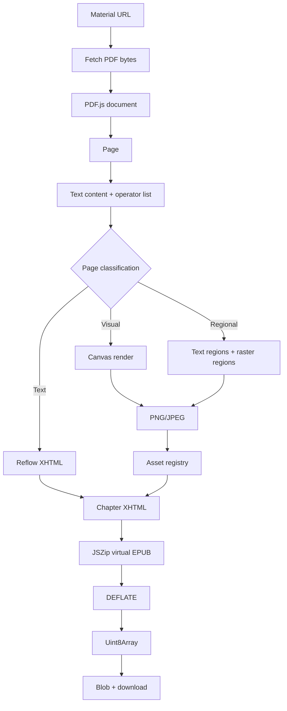
```mermaid
flowchart TD
    A[Material URL] --> B[Fetch PDF bytes]
    B --> C[PDF.js document]
    C --> D[Page]
    D --> E[Text content + operator list]
    E --> F{Page classification}
    F -->|Text| G[Reflow XHTML]
    F -->|Visual| H[Canvas render]
    F -->|Regional| I[Text regions + raster regions]
    H --> J[PNG/JPEG]
    I --> J
    G --> K[Chapter XHTML]
    J --> L[Asset registry]
    L --> K
    K --> M[JSZip virtual EPUB]
    M --> N[DEFLATE]
    N --> O[Uint8Array]
    O --> P[Blob + download]
```

Questo assomiglia più a un compiler pipeline che a una normale funzione UI.

Ogni stage:

- accetta una rappresentazione;
- produce una rappresentazione differente;
- può fallire;
- può avere costi di memoria differenti.

---

## 51. Intermediate Representation

Nel mondo dei compilatori si parla spesso di **IR — Intermediate Representation**.

Anche qui possiamo riconoscere qualcosa di simile.

Per esempio:

```text
PDF operators
      ↓
classification
      ↓
converted.html + images[]
      ↓
EPUB chapter XHTML + assets
```

`converted` funziona di fatto come una rappresentazione intermedia indipendente dal PDF originale e non ancora completamente impacchettata nell'EPUB.

Questo suggerisce una lezione architetturale:

> **Quando una trasformazione complessa cresce, rendere esplicite le rappresentazioni intermedie aiuta testabilità e separazione delle responsabilità.**

---

# Parte XVIII — Osservabilità e diagnostica

## 52. Progress non è solo UX

Il builder riceve callback del tipo:

```js
onProgress({
  completed,
  total,
  percent,
  message,
  details,
});
```

A prima vista sembra una semplice barra di progresso.

Ma rende visibili anche gli stage della pipeline:

```text
download
conversione
pagina X di Y
compressione
```

Questo migliora il debugging.

Se l'utente segnala:

> “Si blocca sempre alla pagina 42 della dispensa 7”

abbiamo un'informazione molto più utile di:

```text
Creazione in corso...
```

---

## 53. Diagnostics strutturati

`epub-core.mjs` accetta anche un oggetto `diagnostics`.

Può registrarvi informazioni come:

```text
mode della pagina
reason della classificazione
imageCount
imageBytes
mathFontBytes
epubBytes
elapsedMs
```

Questo è un buon esempio di **instrumentation separata dal comportamento principale**.

La conversione non deve cambiare risultato perché stiamo raccogliendo diagnostica.

---

# Parte XIX — Cosa potrebbe evolvere in futuro?

## 54. Streaming

L'implementazione attuale costruisce l'EPUB in memoria attraverso JSZip e alla fine produce un unico `Uint8Array`.

Per documenti molto grandi una possibile evoluzione sarebbe una pipeline più streaming-oriented:

```text
input chapter
    ↓
convert
    ↓
append archive
    ↓
rilascia intermedi
```

con un writer capace di non mantenere l'intero archivio in memoria.

Ma questa evoluzione comporterebbe maggiore complessità e dipenderebbe dalle API/librerie disponibili nel browser.

Non è automaticamente una scelta migliore per i casi normali.

---

## 55. Worker dedicati

Alcune trasformazioni costose potrebbero teoricamente essere spostate fuori dal main thread.

Per esempio:

```text
builder UI
    ↓ message
Web Worker
    ↓
conversion / encode
```

Ma non tutto è trasferibile facilmente:

- DOM e canvas tradizionale appartengono al main thread;
- librerie terze possono avere vincoli propri;
- trasferire grandi buffer ha costi e richiede progettazione;
- debugging e cross-browser diventano più complessi.

Quindi “mettiamolo in un worker” non è una soluzione gratuita.

---

## 56. Backpressure

Se una pipeline produce dati più velocemente di quanto lo stage successivo riesca a consumarli, può accumulare memoria.

Questo problema si chiama **backpressure**.

Esempio teorico sbagliato:

```text
renderizza 200 pagine velocemente
        ↓
images[] cresce
        ↓
ZIP le processa più lentamente
```

Una pipeline sequenziale per pagina/capitolo riduce naturalmente questo rischio.

È uno dei motivi per cui la concorrenza massima non è sempre la strategia più veloce o sicura.

---

# Parte XX — Error model

## 57. Gli errori non sono tutti uguali

Nella generazione documenti incontriamo almeno queste categorie:

```text
network error
HTTP error
invalid PDF
empty PDF
unsupported image
conversion uncertainty
render failure
timeout
user cancellation
archive failure
```

Questi errori richiedono comportamenti diversi.

### Retry

Per problemi potenzialmente temporanei.

### Fallback

Per contenuti che non possiamo convertire semanticamente ma possiamo preservare visualmente.

### Skip + report

Per un singolo capitolo non utilizzabile quando il resto dell'export ha ancora valore.

### Abort totale

Quando:

- l'utente annulla;
- nessun capitolo può essere prodotto;
- l'integrità dell'artefatto finale non è garantibile.

Questa tassonomia evita un gigantesco:

```js
catch (error) {
  alert("Errore");
}
```

che perderebbe informazioni fondamentali.

---

# Parte XXI — Da backend developer

## 58. Document generation come ETL

Una buona analogia backend è una pipeline ETL:

```text
Extract
  ↓
Transform
  ↓
Load
```

Per PlumePilot:

```text
Extract
→ URL / API / PDF bytes

Transform
→ pages / XHTML / images / metadata

Load
→ PDFDocument o ZIP EPUB
```

Ma c'è una differenza significativa.

In un server backend possiamo spesso contare su:

- molta più RAM;
- filesystem temporaneo;
- processi separati;
- code di job;
- streaming più flessibile.

Nel browser il runtime è più limitato e condivide risorse con la UI dell'utente.

Per questo la gestione del working set diventa una parte visibile dell'architettura.

---

# Parte XXII — Testabilità

## 59. Le pure functions sono preziose

`epub-core.mjs` esporta una serie di helper sotto:

```js
export const __testing = {
  cleanExtractedText,
  chapterLabelFor,
  estimateBodySize,
  ...
  pageNeedsVisual,
  textConversionLooksIncomplete,
  textPageToHtml,
  ...
};
```

Questo permette di testare separatamente decisioni come:

```text
questa pagina deve diventare visuale?
questa sequenza di text items forma colonne?
questo testo è sospetto?
```

senza dover generare ogni volta un EPUB completo.

È un pattern molto utile:

```text
I/O esterno
   ↓
funzioni pure / quasi pure
   ↓
I/O finale
```

Più logica riusciamo a spostare nella parte centrale testabile, più semplice diventa ragionare sul sistema.

---

## 60. Golden files

Per document generation, un'altra strategia utile è usare **golden files**.

Per esempio:

```text
input fixture PDF
      ↓
conversione
      ↓
output atteso
```

Si può confrontare:

- struttura ZIP;
- manifest;
- numero di capitoli;
- modalità di ogni pagina;
- presenza di immagini;
- link;
- testo estratto;
- dimensioni entro range ragionevoli.

Non sempre conviene confrontare byte-per-byte il file finale, perché UUID, timestamp o compressione possono cambiare.

Spesso è più robusto confrontare la **semantica dell'artefatto**.

---

# Parte XXIII — Esercizi mentali

## 61. Esercizio 1 — Calcolare il working set

Immagina tre canvas da:

```text
1800 × 2400
```

con buffer RGBA.

Quanto spazio occupano contemporaneamente?

Formula:

```text
width × height × 4 × canvasCount
```

Il punto non è soltanto ottenere il numero.

Chiediti poi:

> Possiamo evitare che i tre canvas siano vivi nello stesso momento?

---

## 62. Esercizio 2 — HTML offline

Immagina un quiz con 100 immagini da 500 KiB.

Se le inseriamo tutte come Base64:

- quanto può crescere approssimativamente il payload?
- conviene ancora un unico HTML?
- quando avrebbe più senso un ZIP con file separati?

Non esiste una soglia universale.

È una decisione di prodotto oltre che tecnica.

---

## 63. Esercizio 3 — Fidelity policy

Considera tre pagine:

```text
A. solo paragrafi
B. testo + formula complessa
C. slide quasi interamente grafica
```

Quale strategia sceglieresti?

Probabilmente:

```text
A → text
B → regional
C → visual
```

Ora chiediti:

> Quali segnali osservabili useresti per prendere automaticamente questa decisione?

È esattamente il problema affrontato da `pageNeedsVisual()`.

---

## 64. Esercizio 4 — Partial success

Un corso ha 30 dispense.

La numero 17 restituisce HTTP 404.

Quale comportamento preferisci?

```text
A. fallire tutto
B. creare 29 capitoli e segnalare il 17
C. ritentare per sempre
D. sostituire il capitolo con una pagina vuota senza avvisare
```

Per il dominio di PlumePilot, B è generalmente il comportamento più utile.

Ma non sarebbe necessariamente vero per, ad esempio, una firma digitale o un database transaction log.

---

# Parte XXIV — Concetti da portarsi dietro

## 65. Le lezioni principali

### 1. Un export è una pipeline

Non è una singola funzione che “crea un file”.

```text
raccolta → normalizzazione → trasformazione → packaging → download
```

### 2. La rappresentazione dei dati cambia lungo la pipeline

```text
URL
→ Response
→ ArrayBuffer
→ Uint8Array
→ PDF model / canvas / XHTML
→ archive
→ Blob
```

### 3. PDF ed EPUB risolvono problemi differenti

PDF privilegia la geometria.

EPUB reflowable privilegia struttura e adattabilità.

Convertire tra i due richiede interpretazione.

### 4. Il fallback visuale protegge la correttezza

Quando la conversione semantica diventa incerta, un'immagine può essere più fedele di testo ricostruito male.

### 5. La memoria dipende dagli oggetti vivi contemporaneamente

La dimensione finale del file è soltanto una parte del problema.

### 6. Cleanup e ownership contano anche in JavaScript

Garbage collection non elimina la necessità di gestire lifetime, listener, object URL, canvas e risorse di librerie native/wasm/worker.

### 7. Deduplicazione per contenuto può ridurre sia file che working set

Un hash può identificare asset realmente uguali indipendentemente dal nome.

### 8. Cancellation deve attraversare la pipeline

Un pulsante Annulla è utile soltanto se gli stage costosi ricevono e rispettano il segnale.

### 9. Partial success è una decisione di dominio

Non tutti i batch devono essere atomici.

### 10. Le trasformazioni complesse beneficiano di representation boundaries

Più il sistema cresce, più conviene esplicitare gli stage e le strutture intermedie.

---

# Parte XXV — Glossario del capitolo

Termini importanti introdotti o approfonditi:

- `ArrayBuffer`
- `Uint8Array`
- `Blob`
- Object URL
- MIME type
- serialization
- rasterization
- reflow
- fixed layout
- lossless / lossy transformation
- intermediate representation
- content-addressable storage
- deduplication
- working set
- peak memory
- ownership
- backpressure
- cooperative scheduling
- partial success
- golden file

---

# Parte XXVI — Approfondimenti

## Standard e API Web

- MDN — File API  
  https://developer.mozilla.org/en-US/docs/Web/API/File_API

- MDN — Blob URLs  
  https://developer.mozilla.org/en-US/docs/Web/URI/Reference/Schemes/blob

- MDN — `URL.revokeObjectURL()`  
  https://developer.mozilla.org/en-US/docs/Web/API/URL/revokeObjectURL_static

- MDN — `Uint8Array`  
  https://developer.mozilla.org/en-US/docs/Web/JavaScript/Reference/Global_Objects/Uint8Array

- MDN — `HTMLCanvasElement.toBlob()`  
  https://developer.mozilla.org/en-US/docs/Web/API/HTMLCanvasElement/toBlob

- MDN — `AbortController`  
  https://developer.mozilla.org/en-US/docs/Web/API/AbortController

## EPUB

- W3C — EPUB 3.3  
  https://www.w3.org/TR/epub-33/

- W3C — EPUB 3 Overview  
  https://www.w3.org/TR/epub-overview-33/

## Librerie usate nel progetto

- PDF.js  
  https://mozilla.github.io/pdf.js/

- pdf-lib  
  https://pdf-lib.js.org/

- JSZip  
  https://stuk.github.io/jszip/

---

# Verso il Capitolo 10

Il quiz HTML ci ha mostrato qualcosa di nuovo.

Non stiamo più soltanto generando un file.

Stiamo generando una **applicazione modificabile dall'utente**.

Dentro quella piccola applicazione PlumePilot deve gestire:

- cursore;
- selezione del testo;
- formattazione;
- liste;
- checklist;
- callout;
- colori;
- stato delle domande;
- salvataggio degli appunti.

Questo ci porta direttamente al prossimo problema:

> **Come si costruisce un piccolo rich-text editor usando il DOM del browser senza affidarsi a un framework o a un editor già pronto?**

È il tema del **Capitolo 10 — Selection, Range, liste e callout**.

---

# 10 — Un piccolo rich-text editor

## `contenteditable`, Selection, Range, liste e callout

Nel Capitolo 9 abbiamo visto che il quiz HTML generato da PlumePilot non è semplicemente un documento: è una piccola applicazione offline.

Con la versione 2.35.0 quell'applicazione ha acquistato una caratteristica ancora più interessante: due campi di appunti per ogni domanda — **Spiegazione** e **Osservazioni** — non sono più semplici caselle di testo, ma piccoli editor rich-text.

L'utente può usare:

- grassetto;
- corsivo;
- sottolineato;
- barrato;
- apice e pedice;
- liste puntate e numerate;
- checklist;
- evidenziazioni colorate;
- callout;
- testo nascosto per il ripasso;
- simboli matematici;
- undo e redo;
- scorciatoie da tastiera;
- stato personale della domanda.

A prima vista potrebbe sembrare un problema di formattazione:

```text
se l'utente preme B
    ↓
rendi il testo grassetto
```

In realtà un editor rich-text deve continuamente rispondere a domande molto più difficili:

```text
Dov'è il cursore?
Che cosa è selezionato?
La selezione appartiene ancora all'editor?
Il click sulla toolbar ha distrutto la selezione?
Siamo dentro una lista?
Siamo dentro una checklist?
Siamo dentro un callout?
Il testo evidenziato ha già un altro colore?
Cosa deve succedere premendo Invio?
Dove deve continuare la digitazione dopo ESC?
Come salviamo HTML senza salvare markup arbitrario?
Come ricostruiamo l'editor dopo un rerender?
```

Questo capitolo usa `offline-quiz-runtime.js` come caso di studio per capire una cosa fondamentale:

> **Un rich-text editor non modifica una stringa. Modifica contemporaneamente un albero DOM, una selezione, uno stato di editing e una rappresentazione persistibile.**

---

# Parte I — Da `textarea` a `contenteditable`

## 1. Perché un `textarea` non basta

Un normale `<textarea>` conserva essenzialmente una stringa:

```text
"Questa è la mia spiegazione"
```

Possiamo conoscere facilmente:

```js
textarea.value
textarea.selectionStart
textarea.selectionEnd
```

Ma il testo non contiene struttura HTML.

Non possiamo rappresentare naturalmente:

```html
<strong>questa parte</strong>
<ul>
  <li>punto uno</li>
  <li>punto due</li>
</ul>
```

senza inventare un formato nostro o mostrare direttamente markup all'utente.

Con `contenteditable`, invece, un normale elemento DOM diventa modificabile:

```js
const editor = document.createElement("div");
editor.contentEditable = "true";
```

PlumePilot crea due editor per domanda in `offline-quiz-runtime.js`:

```js
const editor = document.createElement("div");
editor.className = "note-editor";
editor.contentEditable = "true";
editor.setAttribute("role", "textbox");
editor.setAttribute("aria-label", labelText);
editor.setAttribute("aria-multiline", "true");
```

Riferimento:

```text
offline-quiz-runtime.js:470–490
```

La differenza concettuale è enorme.

Nel `textarea` lo stato principale è:

```text
stringa
```

Nel `contenteditable` lo stato visibile diventa un **albero**:

```text
editor
├── testo
├── <strong>
│      └── testo
├── <span class="highlight">
│      └── testo
├── <ul class="checklist">
│      ├── <li>
│      └── <li>
└── <div class="callout">
       └── testo
```

Questo introduce subito il concetto di **document model**.

---

## 2. `contenteditable` non è un editor completo

Scrivere:

```html
<div contenteditable="true"></div>
```

non significa aver costruito un editor.

Significa soltanto aver delegato al browser alcune operazioni di editing:

- inserimento testo;
- cancellazione;
- movimento del caret;
- selezione;
- composizione da tastiera;
- una parte della gestione di paragrafi e liste;
- integrazione con il sistema di input del browser.

Il browser decide anche molti dettagli del DOM generato.

Una pressione di `Enter`, per esempio, non è semanticamente equivalente a:

```js
editor.innerHTML += "<br>";
```

Il risultato dipende dal contesto in cui si trova il caret:

```text
paragrafo
lista
list item
callout
nodo inline
editor vuoto
```

Quindi una lezione importante è:

> **`contenteditable` fornisce un editing host, non un modello dati di alto livello.**

PlumePilot deve costruire sopra quel comportamento il proprio protocollo editoriale.

---

# Parte II — Selection e Range

## 3. Il cursore è una selezione collassata

Quando diciamo:

> “il cursore si trova dopo questa parola”

il browser lo rappresenta attraverso la Selection API.

PlumePilot legge la selezione con:

```js
const selection = window.getSelection();
```

Una `Selection` descrive ciò che l'utente ha selezionato nel documento.

Può essere:

```text
selezione non collassata

"questa [parte del testo] è importante"
```

oppure:

```text
selezione collassata

"questa parte| del testo"
              ↑
             caret
```

Il cursore, quindi, non è un concetto completamente separato.

È essenzialmente una selezione il cui inizio e fine coincidono.

---

## 4. Che cos'è un `Range`

La `Selection` contiene uno o più `Range`.

Nel caso ordinario che interessa il nostro editor possiamo immaginare un range come:

```text
startContainer
startOffset
endContainer
endOffset
```

Per esempio:

```html
<p>La risposta è importante.</p>
```

se selezioniamo:

```text
risposta
```

il range descrive due coordinate dentro l'albero DOM.

Non contiene necessariamente una semplice coppia di indici della stringa.

Questo è cruciale perché una selezione può attraversare nodi differenti:

```html
<p>
  La <strong>risposta</strong> è <em>molto importante</em>.
</p>
```

Un editor rich-text deve quindi ragionare in termini di **posizioni nell'albero**, non soltanto caratteri.

---

## 5. Perché PlumePilot salva `selectedRange`

Nel runtime troviamo:

```js
let activeField = null;
let selectedRange = null;
```

poi:

```js
const rememberSelection = () => {
  const selection = window.getSelection();
  if (
    activeField &&
    selection.rangeCount &&
    activeField.contains(selection.anchorNode) &&
    activeField.contains(selection.focusNode)
  ) {
    selectedRange = selection.getRangeAt(0).cloneRange();
  }
};
```

Riferimento:

```text
offline-quiz-runtime.js:246–252
```

Perché copiare il range?

Immaginiamo questa sequenza:

```text
1. seleziono "risposta corretta"
2. la Selection appartiene all'editor
3. clicco il pulsante "Giallo"
4. il pulsante riceve l'interazione
5. il browser può spostare focus / selection
6. quando il click handler parte, la vecchia selezione potrebbe non essere più disponibile
```

Se l'editor si affidasse soltanto a:

```js
window.getSelection()
```

nel momento del click, potrebbe non sapere più quale testo formattare.

Per questo memorizza:

```js
selection.getRangeAt(0).cloneRange()
```

Il range clonato diventa uno **snapshot della posizione editoriale**.

---

## 6. Perché i pulsanti intercettano `mousedown`

La funzione che crea la toolbar contiene:

```js
item.addEventListener("mousedown", (event) => event.preventDefault());
```

Riferimento:

```text
offline-quiz-runtime.js:391–409
```

Questo dettaglio sembra minuscolo, ma è molto importante.

Il comportamento predefinito del click su un button può spostare il focus sul controllo.

PlumePilot vuole invece che la sequenza sia più vicina a:

```text
selection nell'editor
       ↓
click toolbar
       ↓
non perdere il contesto editoriale
       ↓
applica trasformazione alla selection precedente
```

Quindi usa due difese complementari:

```text
preventDefault sul mousedown
+
selectedRange clonato
```

Questo è un esempio di **defensive UI programming**.

Non ci affidiamo a un unico comportamento implicito del browser quando la correttezza dell'operazione dipende dalla selezione.

---

## 7. Ripristinare una selezione

Prima di eseguire un comando, `runCommand()` fa:

```js
editor.focus();

if (selectedRange && editor.contains(selectedRange.commonAncestorContainer)) {
  const selection = window.getSelection();
  selection.removeAllRanges();
  selection.addRange(selectedRange);
}
```

poi:

```js
document.execCommand(command, false, value);
```

Riferimento:

```text
offline-quiz-runtime.js:253–263
```

La sequenza è quindi:

```text
saved Range
    ↓
focus editor
    ↓
remove current ranges
    ↓
restore saved Range
    ↓
execute edit
```

Questa è quasi una piccola transazione editoriale.

---

# Parte III — Comandi nativi e trasformazioni custom

## 8. La strategia ibrida di PlumePilot

Il runtime usa due famiglie di operazioni.

### Operazioni delegate al browser

```text
bold
italic
underline
strikeThrough
insertUnorderedList
insertOrderedList
superscript
subscript
undo
redo
removeFormat
insertText
```

tramite:

```js
document.execCommand(...)
```

### Operazioni implementate direttamente sul DOM

```text
highlight colorati
study mask
checklist semantics
callout
uscita controllata dai callout
normalizzazione delle liste
sanitizzazione
```

Questa divisione è molto istruttiva.

PlumePilot non prova a ricostruire da zero l'intero motore di editing del browser, ma non si limita neppure ai comandi nativi.

---

## 9. `execCommand()` e il debito tecnologico consapevole

`document.execCommand()` è oggi un'API **deprecata** e non fa parte di una specifica Web moderna stabile.

È importante non nasconderlo.

Perché usarla comunque?

Per un editor piccolo e offline offre ancora alcuni vantaggi pratici:

- delega al browser operazioni complesse come bold/list/undo;
- interagisce con il normale editing `contenteditable`;
- soprattutto, molte sue modifiche partecipano alla **undo history** nativa del browser.

Questo ultimo punto è difficile da replicare perfettamente con semplici manipolazioni DOM.

Quindi la decisione non va letta come:

```text
execCommand è l'API moderna corretta
```

ma come:

```text
feature scope piccolo
+ compatibilità verificata sui browser target
+ valore dell'undo nativo
+ costo di un editor custom completo molto maggiore
------------------------------------------------
uso pragmatico di una API legacy
```

### Un'importante distinzione

**Legacy** non significa automaticamente **bug**.

Ma significa che dobbiamo conoscere il rischio:

- comportamento non perfettamente uniforme;
- futuro incerto;
- necessità di test cross-browser;
- interazione non sempre prevedibile con eventi `input` / `beforeinput`;
- possibile divergenza tra editing nativo e trasformazioni DOM custom.

### Da backend developer

È simile a usare una libreria legacy stabile in un servizio circoscritto.

La domanda corretta non è:

> “È vecchia?”

ma:

> “Qual è il costo di sostituirla, quali garanzie ci serve ottenere e dove isoliamo la dipendenza?”

In PlumePilot la dipendenza è relativamente concentrata dentro il runtime del quiz.

---

# Parte IV — Range come strumento di trasformazione

## 10. Evidenziare non significa soltanto cambiare CSS

Per gli highlight PlumePilot non usa `execCommand()`.

Costruisce invece un wrapper semantico:

```html
<span class="highlight" data-color="yellow">
  testo
</span>
```

La funzione principale è:

```js
wrapSelection(editor, className, key, value)
```

Riferimento:

```text
offline-quiz-runtime.js:343–390
```

Prima controlla che esista una selezione utile:

```js
if (
  !selectedRange ||
  selectedRange.collapsed ||
  !editor.contains(selectedRange.commonAncestorContainer)
) return;
```

Quindi una selezione vuota non viene interpretata arbitrariamente.

---

## 11. Una guardia strutturale: non attraversare blocchi incompatibili

Il codice contiene:

```js
if (
  range.startContainer.parentElement?.closest("div,li,p") !==
  range.endContainer.parentElement?.closest("div,li,p")
) return;
```

In altre parole, PlumePilot rifiuta di applicare il wrapper custom se la selezione attraversa blocchi differenti.

Perché?

Perché trasformare:

```html
<p>prima metà...</p>
<ul>
  <li>...seconda metà</li>
</ul>
```

in un singolo `<span>` sarebbe strutturalmente problematico.

Questa è una **structural guard**:

```text
selezione semplice dentro un blocco
        ↓
operazione consentita

selezione attraverso blocchi incompatibili
        ↓
fail safely
```

È lo stesso principio di prudenza visto nell'autoplay e nel reverse engineering:

> se non possiamo preservare con sicurezza la struttura, non inventiamo una trasformazione.

---

## 12. `extractContents()` + `insertNode()`

La trasformazione principale usa:

```js
const contents = range.extractContents();
wrapper.appendChild(contents);
range.insertNode(wrapper);
```

Mentalmente:

```text
DOM prima

<p>
  abc [def ghi] lmn
</p>
```

`extractContents()` estrae la parte selezionata in un `DocumentFragment`:

```text
DocumentFragment
└── "def ghi"
```

Poi:

```js
wrapper.appendChild(contents);
```

produce:

```html
<span class="highlight" data-color="yellow">
  def ghi
</span>
```

Infine:

```js
range.insertNode(wrapper);
```

reinserisce il nuovo nodo nella posizione corretta.

Risultato:

```html
<p>
  abc
  <span class="highlight" data-color="yellow">def ghi</span>
  lmn
</p>
```

Questo è un esempio reale di manipolazione strutturale del DOM tramite `Range`.

---

## 13. Cambiare colore a un highlight esistente

Supponiamo di avere:

```html
<span class="highlight" data-color="yellow">
  concetto importante
</span>
```

e di selezionare esattamente tutto il testo per renderlo blu.

PlumePilot riconosce il caso:

```js
if (
  startHighlight &&
  startHighlight === endHighlight &&
  editor.contains(startHighlight) &&
  range.toString() === startHighlight.textContent
) {
  startHighlight.dataset.color = value;
  ...
}
```

Non crea quindi:

```html
<span class="highlight" data-color="yellow">
  <span class="highlight" data-color="blue">
    concetto importante
  </span>
</span>
```

ma modifica direttamente il nodo esistente.

Questo evita **markup nesting inutile**.

---

## 14. Cambiare colore solo a una parte

Caso più difficile:

```text
[giallo: abc DEF ghi]
```

selezioniamo solo:

```text
DEF
```

per renderlo blu.

Il risultato desiderato è:

```text
[giallo: abc ]
[blu: DEF]
[giallo:  ghi]
```

non:

```text
[giallo:
   abc
   [blu: DEF]
   ghi
]
```

Per questo il codice controlla se il nuovo wrapper è finito dentro un vecchio highlight:

```js
const oldParent = wrapper.parentElement;

if (className === "highlight" && oldParent?.classList.contains("highlight")) {
  const before = oldParent.cloneNode(false);
  const after = oldParent.cloneNode(false);
  ...
}
```

poi ricostruisce tre segmenti:

```text
before
wrapper nuovo
after
```

Questo è uno dei primi punti in cui vediamo chiaramente che un rich-text editor è un problema di **tree rewriting**.

---

# Parte V — Stato di formattazione e caret

## 15. Formato attivo vs testo già formattato

Uno dei problemi più insidiosi di un editor è distinguere:

```text
formato del testo già esistente
```

da:

```text
formato che verrà applicato al testo che digiteremo dopo
```

Immaginiamo:

```text
H₂O|
```

Se il caret è ancora dentro `<sub>`, il prossimo carattere potrebbe continuare a essere inserito come pedice.

Analogamente:

```text
[highlight giallo: importante|]
```

il browser potrebbe continuare la digitazione dentro lo `<span class="highlight">`.

Per l'utente però spesso l'intenzione è:

> “Ho finito quella formattazione, ora voglio continuare normalmente.”

Da qui nasce la scorciatoia `Escape`.

---

## 16. ESC come comando di uscita dallo stato editoriale

Il key handler contiene:

```js
if (event.key === "Escape") {
```

Riferimento:

```text
offline-quiz-runtime.js:511–545
```

Prima, se esiste ancora una selezione estesa:

```js
if (!range.collapsed) selection.collapseToEnd();
```

Quindi il testo rimane formattato, ma il caret viene spostato alla fine.

Poi controlla i comandi inline:

```js
for (const command of [
  "bold",
  "italic",
  "underline",
  "strikeThrough",
  "superscript",
  "subscript",
]) {
  if (document.queryCommandState(command)) {
    document.execCommand(command, false, null);
  }
}
```

Concettualmente:

```text
BOLD ON      → BOLD OFF
SUPERSCRIPT  → NORMAL
SUBSCRIPT    → NORMAL
```

ESC diventa quindi una piccola operazione di **state reset**.

---

## 17. Uscire da un highlight è più difficile

Per l'highlight non esiste un semplice comando equivalente.

Il caret potrebbe trovarsi fisicamente dentro:

```html
<span class="highlight" data-color="yellow">...</span>
```

Per continuare fuori dal colore bisogna cambiare la struttura del DOM.

PlumePilot:

1. identifica l'highlight corrente;
2. costruisce un range dal caret alla fine dell'highlight;
3. estrae il suffisso;
4. se esiste testo successivo, lo conserva in un clone dell'highlight;
5. posiziona il caret **dopo** il primo highlight.

La parte centrale è:

```js
const suffix = caret.cloneRange();
suffix.setEnd(highlight, highlight.childNodes.length);
const rest = suffix.extractContents();
```

poi:

```js
const position = document.createRange();
position.setStart(
  parent,
  Array.prototype.indexOf.call(parent.childNodes, highlight) + 1,
);
position.collapse(true);
```

Quindi ESC non significa semplicemente:

```text
set color = null
```

Significa:

```text
modifica albero
+
ricostruzione selection
+
nuova posizione caret
```

---

# Parte VI — Liste e checklist

## 18. Una checklist non è una lista completamente diversa

PlumePilot modella la checklist come una normale lista non ordinata:

```html
<ul class="checklist">
  <li>Ripassare definizione</li>
  <li class="checked">Rivedere esempio</li>
</ul>
```

Il CSS trasforma visivamente gli elementi:

```css
.note-editor .checklist {
  list-style: none;
}

.note-editor .checklist > li::before {
  content: "☐";
}

.note-editor .checklist > li.checked::before {
  content: "☑";
}
```

Questa scelta riusa la semantica strutturale di `<ul>/<li>` e aggiunge soltanto stato applicativo.

Possiamo descriverla così:

```text
struttura HTML standard
        +
classe semantica PlumePilot
        +
stato per singolo item
```

---

## 19. Il bug lista puntata → checklist → lista puntata

Uno dei bug reali incontrati durante lo sviluppo era questo:

```text
1. creo una checklist
2. esco dalla checklist
3. seleziono "lista puntata"
4. il browser continua / ricrea una riga con semantica checklist
```

La lista numerata non mostrava lo stesso comportamento.

Questo è un ottimo esempio della difficoltà di `contenteditable`:

> **il browser possiede un proprio modello implicito della lista corrente.**

Non basta assumere che, dopo un comando, il DOM corrisponda esattamente al modello mentale dell'applicazione.

La soluzione attuale introduce:

```js
function splitChecklist(editor) {
```

Riferimento:

```text
offline-quiz-runtime.js:270–288
```

La funzione individua:

```textcaret
 ↓
<li corrente>
 ↓
<ul class="checklist">
```

poi separa l'item corrente dalla checklist.

---

## 20. Anatomia di `splitChecklist()`

Partiamo da:

```text
CHECKLIST
├── A
├── B   ← current item
└── C
```

Il codice crea:

```js
const normal = document.createElement("ul");
const remainder = list.cloneNode(false);
```

Quindi sposta i sibling successivi in `remainder`:

```text
original checklist
├── A
└── B

remainder checklist
└── C
```

Poi rimuove lo stato checked dall'item corrente:

```js
item.classList.remove("checked");
```

lo sposta nella lista normale:

```js
normal.appendChild(item);
```

ottenendo:

```text
CHECKLIST
└── A

NORMAL UL
└── B

CHECKLIST
└── C
```

Questa trasformazione preserva sia ciò che viene prima sia ciò che viene dopo.

Non converte indiscriminatamente tutta la checklist.

---

## 21. Normalizzare dopo il comando

Il pulsante lista puntata fa:

```js
if (
  command === "insertUnorderedList" &&
  currentNode(target)?.closest("ul.checklist")
) {
  splitChecklist(target);
  return;
}

runCommand(target, command);

if (command === "insertUnorderedList") {
  splitChecklist(target);
}
```

Questo doppio controllo è interessante.

PlumePilot verifica:

```text
prima del comando
+
dopo il comando
```

perché il browser stesso può aver trasformato il DOM.

È un altro esempio del pattern già visto nel libro:

```text
check
↓
operation
↓
re-check / normalize
```

Lo stesso principio che usavamo dopo un `await` ricompare qui dopo un'operazione di editing nativa.

---

## 22. Perché il doppio Invio è diverso

Quando l'utente preme Invio dentro una lista, gran parte del comportamento è ancora gestita dal motore `contenteditable` del browser.

Il classico doppio Invio su un item vuoto può causare l'uscita dalla lista.

PlumePilot non reimplementa l'intero algoritmo nativo di editing delle liste.

Interviene invece sui punti in cui la semantica custom `checklist` può sopravvivere o propagarsi in modo indesiderato.

Questo è un compromesso intenzionale:

```text
browser
→ gestione generale lista/caret/Enter

PlumePilot
→ semantica checklist
→ normalizzazione
→ checked state
```

Ricostruire completamente il comportamento di una lista sarebbe un progetto editoriale molto più grande.

---

## 23. Il click sulla casella senza un vero `<input>`

La checklist non usa un checkbox HTML reale.

Il quadrato è generato con CSS.

Per rilevare il click PlumePilot controlla:

```js
const item = event.target.closest(".checklist > li");

if (
  item &&
  editor.contains(item) &&
  event.clientX < item.getBoundingClientRect().left
) {
  item.classList.toggle("checked");
}
```

Riferimento:

```text
offline-quiz-runtime.js:560–570
```

La zona alla sinistra del contenuto del `<li>` viene quindi interpretata come click sul marker.

È una forma molto semplice di **hit testing**.

---

# Parte VII — Callout come blocchi semantici

## 24. Un callout non è solo un colore

Un callout viene modellato come:

```html
<div class="callout" data-kind="important">
  ...
</div>
```

I tipi ammessi sono:

```text
important
attention
review
```

Quindi la struttura porta un significato esplicito.

Il CSS decide l'aspetto.

Questa separazione è utile:

```text
semantica → data-kind
presentazione → CSS
```

---

## 25. Il bug: callout non annullabile

Durante lo sviluppo è emerso un problema interessante.

Se non veniva selezionato testo, l'applicazione poteva interpretare arbitrariamente il blocco precedente come target del callout.

Ma una selezione vuota può significare semplicemente:

> “voglio iniziare un nuovo callout da qui.”

La versione attuale esplicita questa semantica.

La funzione `applyCallout()` distingue tre casi.

---

## 26. Caso A — Siamo già in un callout

```js
const existing = node?.closest(".callout");
```

Se il callout corrente ha lo stesso tipo:

```js
if (existing.dataset.kind === kind) {
  existing.classList.remove("callout");
  delete existing.dataset.kind;
}
```

quindi:

```text
Callout Important
       ↓ click Important
Normal block
```

Lo stesso controllo diventa un **toggle**.

Se invece scegliamo un tipo differente:

```js
else existing.dataset.kind = kind;
```

quindi:

```text
Important
   ↓
Attention
```

senza creare un nuovo wrapper.

---

## 27. Caso B — Selection collassata

Se:

```js
selection.isCollapsed
```

PlumePilot **non** trasforma arbitrariamente il blocco precedente.

Crea un nuovo callout:

```js
const callout = document.createElement("div");
callout.className = "callout";
callout.dataset.kind = kind;
callout.appendChild(document.createElement("br"));
```

poi lo inserisce dopo il blocco corrente oppure in fondo all'editor.

Infine crea un nuovo Range e porta lì il caret.

Questa parte corregge direttamente il problema di UX emerso durante lo sviluppo.

---

## 28. Caso C — Testo selezionato

Con una selezione reale, PlumePilot chiede al browser di trasformare il blocco:

```js
document.execCommand("formatBlock", false, "div");
```

poi applica:

```js
block.className = "callout";
block.dataset.kind = kind;
```

La selezione utente rappresenta quindi una chiara intenzione:

```text
questo blocco
    ↓
diventa un callout
```

---

# Parte VIII — Come si esce da un callout?

## 29. Enter non significa sempre la stessa cosa

Nel key handler troviamo un comportamento speciale per `Enter`:

```js
if (
  event.key === "Enter" &&
  !event.shiftKey &&
  !event.ctrlKey &&
  !event.metaKey
) {
```

Poi il codice cerca il callout corrente:

```js
const block = currentNode(editor)?.closest(".callout");
```

ma non esce sempre.

Controlla se dal caret alla fine del callout rimane testo:

```js
const remaining = selection.getRangeAt(0).cloneRange();
remaining.setEnd(block, block.childNodes.length);

if (!remaining.toString().trim()) {
```

Quindi la regola è:

```text
Enter nel mezzo del callout
→ normale editing interno

Enter alla fine del callout
→ esci dal callout
```

Questo rende l'intenzione prevedibile.

---

## 30. `insertNormalBlock()`

Per uscire dal callout viene creato:

```js
const paragraph = document.createElement("div");
paragraph.appendChild(document.createElement("br"));
block.after(paragraph);
```

poi il caret viene posizionato dentro il nuovo blocco:

```js
const range = document.createRange();
range.selectNodeContents(paragraph);
range.collapse(true);
selection.removeAllRanges();
selection.addRange(range);
```

Ancora una volta:

> cambiare il DOM senza riposizionare la Selection produrrebbe un editor rotto.

DOM e caret devono essere aggiornati come un'unica operazione logica.

---

# Parte IX — Input, shortcut e paste

## 31. La toolbar non è l'unico ingresso

Un editor deve gestire almeno:

```text
mouse
keyboard
paste
browser editing engine
programmatic commands
```

PlumePilot implementa scorciatoie:

```text
Ctrl/Cmd + B → bold
Ctrl/Cmd + I → italic
Ctrl/Cmd + U → underline
Ctrl/Cmd + G → strike-through
Ctrl/Cmd + E → superscript
Ctrl/Cmd + D → subscript
ESC          → exit formatting
```

Il codice normalizza:

```js
const key = event.key.toLowerCase();
```

poi mappa:

```js
const command = {
  b: "bold",
  i: "italic",
  u: "underline",
  g: "strikeThrough",
  e: "superscript",
  d: "subscript",
}[key];
```

Riferimento:

```text
offline-quiz-runtime.js:546–555
```

---

## 32. Perché non usare Shift

Il runtime scarta esplicitamente:

```js
if (event.shiftKey) return;
```

È una scelta di riduzione dei conflitti.

Una scorciatoia editoriale apparentemente comoda può interferire con:

- maiuscole;
- selezioni;
- shortcut native;
- layout di tastiera differenti;
- combinazioni già usate dal browser.

Un piccolo editor dovrebbe avere un set di shortcut limitato e prevedibile.

---

## 33. Paste come testo semplice

Il paste handler fa:

```js
editor.addEventListener("paste", (event) => {
  event.preventDefault();
  document.execCommand(
    "insertText",
    false,
    event.clipboardData.getData("text/plain"),
  );
});
```

Perché impedire l'HTML del clipboard?

Se incollassimo direttamente rich HTML potremmo ricevere:

```html
<span style="font-family: ...">
<div class="qualcosa">
<a href="...">

```

oppure markup molto più complesso prodotto da Word, Google Docs o un'altra pagina web.

PlumePilot decide:

```text
paste esterno
    ↓
text/plain
    ↓
struttura controllata dal nostro editor
```

È sia una semplificazione architetturale sia una misura difensiva.

---

# Parte X — Sanitizzazione: l'HTML salvato non è automaticamente affidabile

## 34. Perché sanitizzare il proprio editor?

Potremmo pensare:

> “L'HTML lo abbiamo creato noi, quindi possiamo salvarlo così com'è.”

Ma il contenuto può attraversare più percorsi:

```text
browser editing engine
custom DOM operations
file annotato precedente
paste
markup legacy
future versions
```

Inoltre il file HTML annotato viene ricaricato in un contesto eseguibile.

Per questo PlumePilot usa una funzione esplicita:

```js
cleanHtml(source)
```

Riferimento:

```text
offline-quiz-runtime.js:27–60
```

---

## 35. Allowlist, non blacklist

La funzione definisce:

```js
const allowed = new Set([
  "B",
  "STRONG",
  "I",
  "EM",
  "U",
  "S",
  "UL",
  "OL",
  "LI",
  "SUP",
  "SUB",
  "BR",
  "DIV",
  "P",
  "SPAN",
]);
```

Quindi la domanda non è:

> “Questo tag è pericoloso?”

ma:

> “Questo tag fa parte del nostro formato editoriale?”

È la differenza tra:

```text
blacklist
→ prova a conoscere tutto ciò che non vogliamo
```

versus:

```text
allowlist
→ accetta soltanto ciò che sappiamo interpretare
```

Per un piccolo formato controllato, la seconda strategia è molto più semplice da ragionare.

---

## 36. Anche gli attributi vengono ricostruiti

PlumePilot non copia genericamente gli attributi del nodo.

Per uno `SPAN` riconosce soltanto:

```text
.study-mask
.highlight + data-color ammesso
```

per un `DIV`:

```text
.callout + data-kind ammesso
```

per un `UL`:

```text
.checklist
```

per un `LI`:

```text
.checked
```

Quindi un nodo del tipo:

```html
<span onclick="..." style="..." data-random="...">
```

non viene copiato con quegli attributi.

Il sanitizer ricostruisce un nuovo DOM conosciuto.

---

## 37. Sanitizzazione conservativa

Il codice commenta:

```js
// Unknown markup is discarded along with its content.
```

Se un nodo non è ammesso, viene restituito un `DocumentFragment` vuoto.

Questa scelta è molto conservativa.

Un sanitizer differente potrebbe decidere di:

```text
rimuovere il tag
ma mantenere i figli testuali
```

PlumePilot preferisce invece non reinterpretare markup che non riconosce.

È un trade-off:

```text
massima conservazione del contenuto
          vs
massima prevedibilità del formato
```

Per un editor di appunti con vocabolario HTML ristretto, la seconda scelta è ragionevole.

---

# Parte XI — Stato live e stato persistibile

## 38. Il DOM dell'editor non è l'unico stato

All'inizio del runtime troviamo:

```js
const notes = new Map(...);
```

Ogni domanda possiede una chiave stabile:

```js
noteKey:
  `test:${...}:question:${questionIndex + 1}`
```

Il modello persistito contiene campi come:

```text
explanationHtml
observationsHtml
status
```

Quindi possiamo distinguere:

```text
LIVE EDITOR STATE
DOM contenteditable
Selection
Range
activeField

        ↓ input

PERSISTABLE NOTE STATE
Map<noteKey, note>
```

Questa separazione è fondamentale.

---

## 39. `input` come commit verso il modello

Ogni editor registra:

```js
editor.addEventListener("input", () => {
  details.dataset.hasNotes = String(
    saveNote(question, field + "Html", cleanHtml(editor.innerHTML)),
  );
});
```

Quindi:

```text
DOM mutation dell'editor
        ↓
input event
        ↓
editor.innerHTML
        ↓
cleanHtml()
        ↓
saveNote()
        ↓
notes Map
```

La `Map` diventa la rappresentazione persistibile del contenuto.

Il DOM dell'editor può essere distrutto e ricreato durante un `render()`.

---

## 40. Rerender e ricostruzione

Il quiz può essere rerenderizzato quando:

- cambia capitolo;
- cambia filtro;
- cambia ordine delle domande;
- viene resettata una vista.

Il container viene sostituito:

```js
container.replaceChildren();
```

poi ogni editor viene ricreato.

Il contenuto salvato viene reinserito con:

```js
if (saved[field + "Html"]) {
  editor.innerHTML = cleanHtml(saved[field + "Html"]);
} else {
  editor.textContent = saved[field] || "";
}
```

Quindi:

```text
DOM corrente
≠
source of truth permanente degli appunti
```

La `notes Map` è più vicina al modello dati; il DOM è una vista editabile di quel modello.

### Da backend developer

È simile a:

```text
View Model / DOM
      ↓
change event
      ↓
application state
      ↓
re-render
```

anche se qui non stiamo usando React/Vue o un framework reattivo.

---

# Parte XII — Salvare un HTML annotato

## 41. Il file stesso diventa contenitore dello stato

Il quiz offline non usa un database esterno.

Quando l'utente sceglie:

```text
Scarica HTML con appunti
```

PlumePilot clona il documento:

```js
const clone = document.documentElement.cloneNode(true);
```

poi serializza la `Map`:

```js
Object.fromEntries(notes)
```

la codifica e la inserisce in:

```html
<script id="notes-data" type="application/octet-stream">...</script>
```

Infine salva l'intero HTML.

Riferimento:

```text
offline-quiz-runtime.js:689–705
```

Quindi il file contiene contemporaneamente:

```text
UI
runtime JavaScript
dati dei quiz
immagini offline
appunti
stati di revisione
```

È una piccola **self-contained application snapshot**.

---

## 42. Perché codificare gli appunti

Il runtime usa `TextEncoder`, `TextDecoder`, `btoa()` e `atob()` per trasformare il JSON in una rappresentazione testuale sicura da inserire nel nodo dati.

Concettualmente:

```text
Map
 ↓ Object.fromEntries
Object
 ↓ JSON.stringify
JSON UTF-8
 ↓ Base64
payload testuale
```

Al caricamento avviene il percorso inverso.

Questo non è cifratura.

È soltanto **encoding**.

L'obiettivo è poter incorporare il payload nel file senza mescolare direttamente il suo contenuto con markup o script eseguibile.

---

# Parte XIII — Stato della domanda ≠ formattazione dell'appunto

## 43. Due modelli separati

Ogni domanda può anche avere:

```text
🟢 Verificata
🟡 Da rivedere
🔴 Da verificare
```

Questo stato non viene rappresentato come colore dentro l'editor.

Vive in:

```js
note.status
```

Il runtime può quindi filtrare le domande senza interpretare il loro HTML.

Questa è una buona separazione semantica:

```text
contenuto dell'appunto
→ HTML controllato

workflow di studio
→ status enum
```

Se avessimo codificato lo stato soltanto attraverso colori o classi visuali nel testo, la logica di filtro sarebbe molto più fragile.

---

# Parte XIV — Un editor come state machine

## 44. Il Capitolo 7 ritorna

Anche questo piccolo editor può essere visto come una macchina a stati.

Non necessariamente una FSM esplicita, ma un insieme di stati combinati:

```text
activeField
selection collapsed / expanded
current formatting
current block type
current list type
callout kind
highlight ancestry
focus state
```

Gli eventi includono:

```text
FOCUS
KEYDOWN
INPUT
MOUSEUP
MOUSEDOWN TOOLBAR
CLICK TOOLBAR
PASTE
CLICK CHECKLIST
```

Le guardie includono:

```text
selection appartiene all'editor?
selection è collapsed?
range attraversa più blocchi?
siamo dentro una checklist?
siamo dentro un callout?
caret è alla fine del callout?
```

E le azioni:

```text
execCommand
extractContents
insertNode
split list
create block
move caret
saveNote
sanitize
```

Quindi possiamo riscrivere mentalmente:

```text
EDITOR_IDLE
   ↓ focus
EDITOR_ACTIVE
   ├── select text
   │      ↓
   │   RANGE_SELECTED
   │      ↓ toolbar
   │   FORMAT_SELECTION
   │
   ├── caret in callout + Enter at end
   │      ↓
   │   EXIT_CALLOUT
   │
   ├── caret in highlight + Escape
   │      ↓
   │   SPLIT_HIGHLIGHT
   │
   └── input
          ↓
       SANITIZE_AND_SAVE
```

Il concetto di state machine, quindi, non era specifico dell'autoplay.
È un modo generale di ragionare sui sistemi interattivi.

---

# Parte XV — Il bug come violazione di un'invariante

## 45. Invarianti utili dell'editor

Possiamo formulare alcune proprietà che dovrebbero sempre essere vere.

### Invariante 1

Un comando della toolbar deve modificare soltanto l'editor attivo.

```text
selectedRange ∈ activeField
```

### Invariante 2

Il markup salvato deve appartenere al vocabolario consentito.

```text
saved HTML ⊆ allowed editor schema
```

### Invariante 3

Una lista puntata normale non deve ereditare semanticamente `.checklist` solo perché l'utente proveniva da una checklist.

### Invariante 4

Una selezione vuota su “Callout” non deve trasformare arbitrariamente un blocco precedente.

### Invariante 5

Dopo ESC, la digitazione successiva non deve ereditare involontariamente una formattazione che l'utente ha deciso di terminare.

### Invariante 6

Dopo ogni trasformazione strutturale, il caret deve trovarsi in una posizione valida e prevedibile.

Visti in questo modo, i bug diventano più semplici da classificare.

Non sono soltanto:

```text
"lista che si comporta male"
```

ma:

```text
violazione dell'invariante di separazione tra list type
```

---

# Parte XVI — Undo/redo e transazioni editoriali

## 46. Perché undo è difficile

Un utente si aspetta che:

```text
scrivo
→ formatto
→ inserisco lista
→ modifico colore
→ Ctrl+Z
```

ripercorra operazioni coerenti.

Con `execCommand()`, il browser mantiene parte della propria undo history.

Ma quando manipoliamo direttamente il DOM con:

```js
extractContents()
insertNode()
replaceWith()
appendChild()
```

l'integrazione con quella history non è necessariamente equivalente in tutti i browser.

Questo è uno dei principali problemi degli editor ibridi.

Possiamo immaginare due motori:

```text
Browser editing history
        +
Custom DOM mutations
```

che non sempre condividono la stessa idea di “transazione”.

---

## 47. Come sarebbe un editor più formale

Un editor più grande potrebbe introdurre un proprio transaction model:

```text
before state
    ↓
operation
    ↓
normalized document state
    ↓
transaction record
    ↓
after state
```

per esempio:

```js
{
  type: "SET_HIGHLIGHT",
  range: ...,
  color: "yellow"
}
```

oppure un modello documentale indipendente dal DOM.

Il DOM diventerebbe una proiezione:

```text
Document Model
     ↓
DOM render
```

invece di essere contemporaneamente:

```text
modello + vista + editing engine
```

È la direzione seguita dai rich-text editor professionali.

Ma avrebbe un costo progettuale enormemente superiore rispetto alle esigenze di PlumePilot.

---

# Parte XVII — `beforeinput` come possibile evoluzione

## 48. Osservare l'intenzione prima della mutazione

Le piattaforme Web moderne espongono anche l'evento:

```text
beforeinput
```

che viene emesso prima che molte modifiche dell'utente vengano applicate all'editing host.

In un editor più strutturato può essere utile per intercettare intenzioni del tipo:

```text
insertText
insertParagraph
formatBold
historyUndo
...
```

prima della mutazione.

Un'ipotetica evoluzione potrebbe usare:

```text
beforeinput
+ Selection / Range
+ DOM normalization
+ transaction layer
```

riducendo progressivamente la dipendenza da `execCommand()`.

Ma questo non significa che la migrazione sia una semplice sostituzione uno-a-uno.

`execCommand("bold")` concentra dietro una singola chiamata molti dettagli di editing che dovremmo poi gestire noi.

---

# Parte XVIII — Editor minimale vs framework editoriale

## 49. Quando smettere di costruirlo a mano

Per il nostro caso il runtime gestisce:

```text
due piccoli campi per domanda
insieme limitato di formati
file offline
nessun collaborative editing
nessun documento lungo multiutente
nessun plugin ecosystem
```

Quindi un editor minimale custom è difendibile.

Se però aggiungessimo:

```text
tabelle editabili
link complessi
immagini drag-and-drop
nested callout
indentazione arbitraria
history robusta cross-browser
collaboration
commenti multiutente
schema documentale versionato
```

il costo crescerebbe rapidamente.

A quel punto avrebbe senso valutare un vero editor framework con document model e transaction system.

La lezione non è:

> “non usare librerie.”

È:

> **scegli il livello di infrastruttura proporzionato alla complessità semantica dell'editor.**

---

# Parte XIX — Testare un rich-text editor

## 50. Testare soltanto il risultato visivo non basta

Due DOM possono apparire identici ma comportarsi diversamente al prossimo input.

Per esempio:

```html
<span class="highlight">abc|</span>
```

visivamente può sembrare uguale a:

```html
<span class="highlight">abc</span>|
```

ma il prossimo carattere:

```text
x
```

nel primo caso può entrare nell'highlight.

Nel secondo no.

Quindi dobbiamo testare:

```text
DOM
+
Selection
+
prossima azione dell'utente
```

---

## 51. Una matrice di test utile

### Formattazione inline

```text
selezione singolo nodo
selezione con bold già presente
selection collapsed
ESC dopo bold
ESC dopo superscript
ESC dopo subscript
```

### Highlight

```text
plain → yellow
yellow → blue su tutto il wrapper
yellow → blue su sottoselezione
ESC nel mezzo
ESC alla fine
selezione cross-block → nessuna trasformazione
```

### Checklist

```text
nuova checklist
check / uncheck item
checklist → bullet
checklist → numbered
uscita da lista → nuova bullet
split con item precedenti
split con item successivi
split con entrambi
```

### Callout

```text
selection → callout
caret collapsed → nuovo callout
same kind → remove
kind A → kind B
Enter nel mezzo
Enter alla fine
```

### Persistenza

```text
scrivi → cambia capitolo → torna
scrivi → filtra → ritorna
scarica annotato → riapri
markup legacy → cleanHtml
paste rich text → plain text
```

### Cross-browser

```text
Chrome
Edge
Firefox
```

In particolare per i comandi legacy non possiamo assumere equivalenza perfetta tra browser.

---

# Parte XX — Property-based thinking

## 52. Testare proprietà, non soltanto esempi

Molte regole dell'editor si prestano a test di proprietà.

Per esempio:

```text
Dopo cleanHtml():
nessun tag fuori dall'allowlist deve esistere.
```

Oppure:

```text
Dopo wrapSelection():
il testo visibile totale deve essere invariato.
```

Oppure:

```text
Dopo cambiare colore a una sottoselezione:
nessun highlight identico deve essere annidato inutilmente.
```

Oppure:

```text
Dopo splitChecklist():
l'ordine testuale degli item deve essere invariato.
```

Queste proprietà sono spesso più potenti di un singolo test basato su coordinate DOM esatte.

---

# Parte XXI — Schema del formato degli appunti

## 53. L'HTML è anche un formato dati

Il sanitizer ci permette di dedurre uno schema implicito.

Possiamo rappresentarlo così:

```text
NoteDocument
├── inline
│   ├── B / STRONG
│   ├── I / EM
│   ├── U
│   ├── S
│   ├── SUP
│   ├── SUB
│   └── SPAN
│       ├── highlight[data-color]
│       └── study-mask
│
├── block
│   ├── DIV
│   │   └── callout[data-kind]
│   └── P
│
└── list
    ├── UL
    │   └── checklist?
    ├── OL
    └── LI
        └── checked?
```

Quindi, anche se non esiste un file JSON Schema, abbiamo già un **document schema**.

Questo è utile per eventuali migrazioni future.

---

## 54. Versionare il formato?

Al momento la struttura è semplice e il sanitizer supporta anche valori legacy testuali:

```js
if (saved[field + "Html"]) ...
else editor.textContent = saved[field] || "";
```

È una piccola forma di backward compatibility.

Se il formato crescesse molto, potrebbe essere utile introdurre:

```js
{
  version: 2,
  explanationHtml: "...",
  observationsHtml: "...",
  status: "review"
}
```

esattamente come abbiamo già visto per gli snapshot della commissione.

Ancora una volta, lo stesso problema architetturale ricompare in domini differenti:

```text
stato persistito
→ schema
→ evoluzione
→ migrazione
```

---

# Parte XXII — Una possibile architettura futura

## 55. Separare DOM adapter e document model

Se dovessimo far crescere molto l'editor, potremmo separare:

```text
┌───────────────────────┐
│     Note Model        │
│ blocks / marks / list │
└───────────┬───────────┘
            │ render
            ▼
┌───────────────────────┐
│      DOM Adapter      │
└───────────┬───────────┘
            │
            ▼
      contenteditable
            ▲
            │ input intent
┌───────────┴───────────┐
│  Selection Adapter    │
│  beforeinput / Range  │
└───────────────────────┘
```

Le operazioni diventerebbero comandi espliciti:

```text
TOGGLE_BOLD
SET_HIGHLIGHT(yellow)
TOGGLE_CHECKLIST
SET_CALLOUT(attention)
EXIT_FORMATTING
```

Il vantaggio sarebbe maggiore prevedibilità.

Lo svantaggio sarebbe costruire e mantenere un vero motore editoriale.

Per PlumePilot attuale probabilmente non ne vale la pena.

---

# Parte XXIII — Da backend developer

## 56. Selection come cursor applicativo

Possiamo fare un'analogia con database e stream.

Un `Range` è simile a un cursore che identifica una porzione della struttura corrente.

Ma attenzione: il DOM può cambiare.

Quindi il range non è un identificatore business stabile.

È più vicino a:

```text
cursor / pointer dentro una struttura mutabile
```

che a:

```text
primary key
```

Questa distinzione spiega perché PlumePilot verifica sempre che il range appartenga ancora all'editor corretto.

---

## 57. `cleanHtml()` come boundary validation

Nel Capitolo 2 abbiamo visto che `bridge.js` normalizza i messaggi che attraversano un boundary.

Qui accade la stessa cosa con HTML:

```text
DOM arbitrario dell'editing engine
        ↓
cleanHtml()
        ↓
formato PlumePilot ammesso
```

`cleanHtml()` è quindi un **anti-corruption layer** tra:

```text
browser editing DOM
```

e:

```text
persisted note format
```

---

## 58. `input` come event sourcing? Non proprio

Potrebbe essere tentante dire:

```text
ogni input event = evento persistito
```

ma non è ciò che accade.

PlumePilot salva lo **snapshot corrente** dell'HTML sanitizzato.

Non conserva una sequenza come:

```text
INSERT_TEXT
TOGGLE_BOLD
ADD_CALLOUT
...
```

Quindi il modello è:

```text
state snapshot
```

non:

```text
event sourcing
```

Questa distinzione è importante.

---

# Parte XXIV — Cosa ci insegnano i bug reali

## 59. Bug: checklist che ritorna

Lezione:

> il browser editing engine mantiene struttura e contesto propri; dopo un comando bisogna verificare il DOM risultante, non assumere che corrisponda all'intenzione.

Pattern:

```text
command
↓
inspect
↓
normalize
```

---

## 60. Bug: callout che prende il blocco sbagliato

Lezione:

> una selection collassata è informazione, non assenza di informazione.

Può significare:

```text
insertion point
```

non:

```text
usa arbitrariamente il blocco precedente
```

La UI deve interpretare correttamente lo stato epistemico della Selection.

---

## 61. Bug: formattazione che continua

Lezione:

> il formato non appartiene soltanto al testo passato; può appartenere anche alla posizione corrente del caret.

Per questo ESC deve agire sullo **stato futuro della digitazione**.

---

## 62. Bug potenziale: toolbar che perde selection

Lezione:

> focus e selection sono parte dello stato applicativo.

Un innocuo click UI può distruggere il contesto necessario a un'altra operazione.

Da qui:

```text
rememberSelection()
+
preventDefault(mousedown)
+
restore range
```

---

# Parte XXV — Concetti da portarsi dietro

## 63. Primo principio: editor = albero + selection

Non basta pensare:

```text
testo + stile
```

Dobbiamo pensare:

```text
DOM tree
+
Selection / Range
+
editing engine
+
application semantics
```

---

## 64. Secondo principio: una trasformazione deve preservare invarianti

Ogni comando deve chiedersi:

```text
Il testo rimane lo stesso?
La struttura rimane valida?
Il caret rimane valido?
Il comando modifica soltanto l'editor corretto?
Il markup rimane nel nostro schema?
```

---

## 65. Terzo principio: custom semantics richiedono normalizzazione

La checklist non è conosciuta dal browser.

Il browser conosce:

```text
UL
LI
```

PlumePilot aggiunge:

```text
checklist
checked
```

Quando questi due modelli interagiscono, serve un layer di normalizzazione.

---

## 66. Quarto principio: il DOM live non è la persistenza

Gli editor vengono distrutti e ricreati.

Gli appunti sopravvivono perché esiste un modello separato:

```text
notes Map
```

Il DOM è quindi una rappresentazione modificabile, non il deposito definitivo dello stato.

---

## 67. Quinto principio: sanitizzare anche quando controlliamo la UI

Il contenuto HTML attraversa browser, file salvati e versioni differenti.

Persistire soltanto un sottoinsieme riconosciuto rende il sistema più prevedibile.

---

## 68. Sesto principio: legacy API richiede isolamento e test

Usare `execCommand()` può essere pragmatico in uno scope ristretto.

Ma dobbiamo sapere:

```text
API deprecated
+
comportamento browser-specific
+
necessità di regression test
```

Il debito tecnologico è molto meno pericoloso quando è **consapevole e confinato**.

---

# Parte XXVI — Esercizi

## 69. Esercizio 1 — Disegna il Range

Dato:

```html
<p>La <strong>risposta corretta</strong> è B.</p>
```

immagina di selezionare:

```text
corretta
```

Prova a descrivere:

```text
startContainer
startOffset
endContainer
endOffset
```

Poi chiediti cosa cambierebbe selezionando:

```text
risposta corretta è
```

attraversando il confine tra `<strong>` e testo normale.

---

## 70. Esercizio 2 — Simula `splitChecklist()`

Parti da:

```text
☑ A
☐ B ← caret
☐ C
☐ D
```

Disegna il DOM prima e dopo il passaggio a lista puntata.

Verifica che l'ordine:

```text
A B C D
```

rimanga invariato.

---

## 71. Esercizio 3 — Highlight parziale

Parti da:

```html
<span class="highlight" data-color="yellow">
  abc def ghi
</span>
```

Seleziona `def` e applica blu.

Scrivi il DOM desiderato senza nesting inutile.

---

## 72. Esercizio 4 — Invariante del sanitizer

Aggiungi mentalmente:

```html
<a href="https://example.com" onclick="alert(1)">test</a>
```

agli appunti.

Che cosa dovrebbe produrre `cleanHtml()` attuale?

È la politica che sceglieresti per un editor più generico?

Perché?

---

## 73. Esercizio 5 — Eliminare `execCommand()`

Scegli un solo comando:

```text
bold
```

Prova a progettare una versione basata esclusivamente su:

```text
Selection
Range
DOM
beforeinput
```

Poi considera questi casi:

```text
selection già parzialmente bold
selection attraversa due nodi
caret collapsed
undo
redo
paste
nested marks
```

L'esercizio serve soprattutto a capire perché un editor completo è complesso.

---

# Parte XXVII — Approfondimenti

## 74. Documentazione primaria consigliata

### `contenteditable`

HTML Standard:

https://html.spec.whatwg.org/multipage/interaction.html#contenteditable

MDN:

https://developer.mozilla.org/en-US/docs/Web/HTML/Global_attributes/contenteditable

### Selection API

MDN:

https://developer.mozilla.org/en-US/docs/Web/API/Selection

W3C Selection API:

https://www.w3.org/TR/selection-api/

### Range

MDN:

https://developer.mozilla.org/en-US/docs/Web/API/Range

### `beforeinput`

MDN:

https://developer.mozilla.org/en-US/docs/Web/API/Element/beforeinput_event

Input Events specification:

https://www.w3.org/TR/input-events-2/

### `execCommand()`

MDN:

https://developer.mozilla.org/en-US/docs/Web/API/Document/execCommand

Da leggere notando esplicitamente lo stato **Deprecated** dell'API.

---

# Conclusione

Il piccolo editor degli appunti di PlumePilot ci porta sorprendentemente vicino a problemi tipici dei grandi rich-text editor.

Siamo partiti da:

```text
"vorrei mettere il grassetto negli appunti"
```

ma abbiamo incontrato:

```text
contenteditable
Selection
Range
caret
focus
DOM tree rewriting
liste
normalizzazione
state machine
sanitizzazione
schema dati
persistenza
undo history
cross-browser behavior
```

La lezione più importante è probabilmente questa:

> **Modificare testo ricco significa mantenere coerenti contenuto, struttura e posizione editoriale nello stesso momento.**

PlumePilot risolve il problema con un editor deliberatamente piccolo e ibrido:

```text
browser editing engine
+
execCommand per operazioni semplici
+
Range/DOM per semantica custom
+
cleanHtml come boundary
+
Map come stato persistibile
```

Non è l'architettura che useremmo necessariamente per costruire Google Docs.

È però una soluzione proporzionata al problema reale e, proprio per questo, un eccellente caso di studio.

Nel prossimo capitolo torneremo alla UI dell'estensione nel suo complesso:

**11 — UI senza framework: popup, menu fluttuante e sincronizzazione.**

Qui vedremo come PlumePilot costruisce interfacce relativamente ricche con DOM, CSS e JavaScript vanilla, come condivide stato tra popup e floating menu e dove la futura revisione UI/UX ci darà l'occasione di separare meglio modello, rendering e layout.

---

# 11 — UI senza framework

## Popup, menu fluttuante e sincronizzazione

> **Snapshot di riferimento del capitolo**  
> Da questo capitolo il libro passa dal `main` 2.35.1 usato nei Capitoli 1–10 al candidato **2.35.2**, branch `feat/ui-ux-2.35.2`, commit `4d32a8c2a6cd291e4fe389bdf10fdbaf1856a8c2`.  
> Il manifest del branch mostra ancora `2.35.1`: è intenzionale, perché il bump di versione viene lasciato alla fase finale di release.

Nei capitoli precedenti abbiamo parlato soprattutto del motore di PlumePilot:

- messaging;
- DOM dinamico;
- API;
- asincronia;
- cache;
- autoplay;
- export;
- editor HTML.

Ora arriviamo alla parte che l'utente vede direttamente.

PlumePilot possiede due interfacce principali:

```text
popup della toolbar
        +
menu fluttuante nella pagina LMS
```

Per molto tempo queste due superfici sono cresciute in parallelo.

È una dinamica comune nei progetti reali.

Una funzione nasce nel popup.

Poi viene richiesta anche nel menu fluttuante.

Poi una preferenza appare in entrambi.

Poi un pulsante cambia nome in uno ma non nell'altro.

Poi le dimensioni dei font divergono.

Poi le categorie non corrispondono più.

Alla fine l'utente non vede due viste dello stesso prodotto.

Vede due prodotti simili che deve imparare separatamente.

La 2.35.2 nasce esattamente da questo problema.

Il refactor non introduce React, Vue, Svelte o un'altra libreria UI.

Introduce invece qualcosa di più interessante dal punto di vista didattico:

> **una piccola architettura di presentazione costruita con DOM, CSS, storage e funzioni JavaScript pure.**

Il risultato ci permette di studiare molti concetti normalmente nascosti dietro un framework:

- source of truth;
- derived state;
- rendering;
- sincronizzazione reattiva;
- view model;
- progressive disclosure;
- focus management;
- accessibilità;
- Shadow DOM;
- design token;
- personalizzazione persistente;
- invarianti di UI;
- separation of concerns.

E soprattutto possiamo rispondere a una domanda molto utile:

> **Cosa fa davvero un framework UI per noi, quando decidiamo di non usarne uno?**

---

# Parte I — Due interfacce, uno stesso prodotto

## 1. Il problema non è duplicare HTML

È facile pensare che il problema della vecchia UI fosse semplicemente:

```text
abbiamo scritto due volte gli stessi pulsanti
```

Ma la duplicazione visiva è solo il sintomo.

Il problema architetturale è più profondo.

Popup e floating menu rappresentano lo stesso **stato di dominio**:

```text
autoplay enabled?
stop ai test?
completamento automatico?
limite capitoli?
stop al 70%?
operazione lunga attiva?
menu layout personalizzato?
tema?
stile Gaming?
```

ma lo rappresentano dentro due runtime diversi.

### Popup

Il popup è una normale pagina dell'estensione:

```text
popup.html
popup.css
popup.js
```

nasce quando l'utente apre l'icona della toolbar e può essere distrutto appena il popup si chiude.

### Floating menu

Il menu fluttuante vive invece dentro la pagina LMS:

```text
floating-menu.js
        ↓
content script ISOLATED
        ↓
crea host DOM
        ↓
closed ShadowRoot
        ↓
menu dentro la pagina
```

È quindi più persistente e deve convivere con:

- CSS della piattaforma;
- layout della pagina;
- navigazione LMS;
- MutationObserver;
- visibilità della scheda;
- viewport;
- drag del launcher.

Non sono lo stesso contesto.

Per questo il refactor **non tenta di avere un unico DOM condiviso**.

Questa distinzione è fondamentale.

---

## 2. Condividere il modello, non necessariamente il componente

La soluzione adottata introduce:

```text
menu-ux.js
menu-ux.css
```

`menu-ux.js` contiene funzioni condivise come:

```js
PlumePilotMenuUx = {
  autoplayPresentation,
  bindCourseNavigation,
  bindExpansionScroll,
  ensureGamingFont,
  applyActionLayout,
  bindLayoutEditor,
};
```

Riferimento:

```text
menu-ux.js:269–270
```

Ma il commento più importante è quasi all'inizio del file:

```js
// Presentation only: both menus keep their existing storage and operation owners.
```

Riferimento:

```text
menu-ux.js:24
```

Questa riga definisce l'architettura.

Il modulo condiviso **non diventa proprietario dello stato applicativo**.

Non gestisce:

```text
chrome.storage.local
operazioni in background
messaggi runtime
commissione
progresso corso
autoplay engine
```

Gestisce invece come certi dati vengono **presentati**.

Possiamo rappresentarlo così:

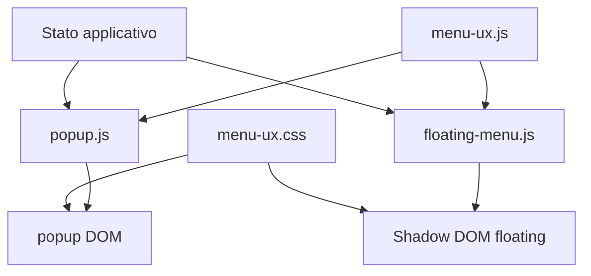
```mermaid
graph TD
    S[Stato applicativo] --> P[popup.js]
    S --> F[floating-menu.js]
    U[menu-ux.js] --> P
    U --> F
    C[menu-ux.css] --> PH[popup DOM]
    C --> SH[Shadow DOM floating]
    P --> PH
    F --> SH
```

Questa è una forma leggera di **presentation layer**.

---

# Parte II — Stato, view model e rendering

## 3. Il browser non ci obbliga a usare un framework

Quando usiamo React, potremmo scrivere qualcosa come:

```text
state
 ↓
component(state)
 ↓
virtual DOM
 ↓
DOM
```

In PlumePilot il flusso è più esplicito:

```text
storage / runtime / page state
             ↓
          controller
             ↓
      renderSomething()
             ↓
       proprietà DOM
```

Per esempio nel floating menu:

```js
function renderSettings() {
  ...
  ui.autoplaySkipCompletedVideos.checked =
    settings.autoplaySkipCompletedVideos === true;
  ...
}
```

Riferimento:

```text
floating-menu.js:1079+
```

Mentre il popup esegue una lettura iniziale da storage:

```js
chrome.storage.local.get(
  {
    enabled: true,
    stopAtTests: false,
    autoCompleteTests: false,
    ...
  },
  (result) => {
    checkbox.checked = result.enabled;
    ...
  },
);
```

Riferimento:

```text
popup.js:1267–1334
```

Non esiste un reconciler automatico.

Siamo noi a decidere:

```text
quale cambiamento richiede quale render
```

---

## 4. Stato persistente e stato di presentazione non sono la stessa cosa

Un errore comune sarebbe memorizzare direttamente una stringa tipo:

```text
"Solo video da completare · Test ignorati · Stop al 70%"
```

Ma quella stringa non è lo stato.

È una **proiezione** dello stato.

La sorgente reale può essere:

```js
{
  autoplaySkipCompletedVideos: true,
  stopAtTests: true,
  autoCompleteTests: false,
  autoplayChapterLimitEnabled: true,
  autoplayStopAt70Enabled: true,
}
```

Da questo otteniamo una rappresentazione leggibile.

La 2.35.2 formalizza questa idea con:

```js
function autoplayPresentation({
  skipCompleted = false,
  testBehavior = "ignore",
  limitEnabled = false,
  limit = 1,
  stopAt70 = false,
  thresholdBypassed = false,
} = {}) {
  ...
}
```

Riferimento:

```text
menu-ux.js:25–42
```

La funzione restituisce:

```js
{
  summary,
  testOverride,
  stopHint,
}
```

Questa struttura è un piccolo **view model**.

---

## 5. Derived state

Consideriamo questa regola:

```js
const effectiveTestBehavior =
  limitEnabled && testBehavior === "stop"
    ? "ignore"
    : testBehavior;
```

Riferimento:

```text
menu-ux.js:27
```

L'utente può avere salvato:

```text
Fermati ai test
```

ma contemporaneamente può essere attivo il limite capitoli.

Nel motore effettivo la policy diventa temporaneamente:

```text
ignora il test
```

La UI deve quindi distinguere:

```text
saved state
     vs
effective state
```

Il modulo produce infatti anche:

```js
testOverride:
  limitEnabled && testBehavior === "stop"
    ? "Con il limite capitoli attivo, l’autoplay ignora i test ..."
    : ""
```

La lezione generale è:

> **Una UI corretta non mostra soltanto ciò che è memorizzato. Deve mostrare ciò che il sistema farà davvero.**

---

## 6. Una funzione pura come boundary di presentazione

`autoplayPresentation()` è interessante perché non tocca il DOM.

Non legge storage.

Non manda messaggi.

Non modifica variabili globali.

Prende un input:

```js
{
  skipCompleted,
  testBehavior,
  limitEnabled,
  limit,
  stopAt70,
  thresholdBypassed,
}
```

restituisce un output.

Questo la rende facilmente testabile.

Nel test:

```js
assert.equal(
  autoplayPresentation().summary,
  "Tutti i video · Test ignorati",
);
```

Riferimento:

```text
tests/menu-ux.mjs:7–18
```

È una piccola dimostrazione del valore delle **pure functions** nella UI.

---

# Parte III — Sincronizzazione senza state manager

## 7. Due controller, una sorgente persistente

Popup e floating menu possono essere aperti nello stesso momento.

Se l'utente modifica nel popup:

```text
Tema → Scuro
```

il floating menu dovrebbe aggiornarsi.

Se modifica nel floating menu:

```text
Salta videolezioni completate → ON
```

il popup dovrebbe rifletterlo.

La soluzione non è:

```text
popup.sendMessage(floating)
floating.sendMessage(popup)
```

per ogni singola preferenza.

La sorgente condivisa è:

```text
chrome.storage.local
```

I controller scrivono:

```js
chrome.storage.local.set({ [key]: value });
```

poi reagiscono a:

```js
chrome.storage.onChanged.addListener(...)
```

---

## 8. Il popup come subscriber

Il popup ascolta:

```js
chrome.storage.onChanged.addListener((changes, area) => {
  if (area !== "local") return;
  ...
});
```

Riferimento:

```text
popup.js:1370–1488
```

E aggiorna soltanto le parti interessate.

Per esempio:

```js
if (changes.visualStyle)
  renderVisualStyle(changes.visualStyle.newValue);

if (changes.menuSize)
  renderMenuSize(changes.menuSize.newValue);

if (changes.floatingMenuLayout)
  renderFloatingMenuLayout(changes.floatingMenuLayout.newValue);
```

Questo è molto vicino a un sistema **reactive**:

```text
state mutation
     ↓
storage event
     ↓
selective render
```

---

## 9. Il floating menu come subscriber

La stessa idea appare nel menu fluttuante:

```js
chrome.storage.onChanged.addListener((changes, area) => {
  if (area !== "local") return;

  for (const key of Object.keys(defaults)) {
    if (changes[key])
      settings[key] = changes[key].newValue ?? defaults[key];
  }

  ...
});
```

Riferimento:

```text
floating-menu.js:4588–4664
```

Poi sceglie cosa aggiornare:

```text
visualStyle      → applyVisualStyle()
themePreference  → applyTheme()
menuSize         → applyMenuSize()
floating layout  → applyFloatingMenuLayout()
autoplay state   → renderSettings()
active operation → renderOperation()
commission data  → renderCommissionExams()
```

È una forma manuale di dependency graph.

---

## 10. Perché non chiamare sempre `renderEverything()`?

Potremmo teoricamente fare:

```js
chrome.storage.onChanged.addListener(() => {
  renderEverything();
});
```

Sarebbe più semplice.

Ma avrebbe costi e rischi:

- ricostruzione inutile del DOM;
- perdita del focus;
- reset degli elementi `<details>`;
- scroll che salta;
- animazioni riavviate;
- controlli temporanei sovrascritti;
- lavoro inutile ad ogni singola preferenza.

Il codice sceglie quindi un **rendering incrementale manuale**.

Questa è una delle cose che i framework cercano di rendere più ergonomiche.

---

# Parte IV — Navigation state

## 11. Il redesign non usa soltanto tab

La 2.35.2 organizza le destinazioni principali in:

```text
Corso
Esami
Traguardi       ← Gaming
Preferenze
```

Dentro `Corso`, però, le impostazioni autoplay non sono più una lunga regione sempre visibile.

Vengono aperte come una vista di dettaglio:

```text
Corso
  ↓
Impostazioni autoplay
  ↓
← Corso
```

Questo è **progressive disclosure**.

Mostriamo inizialmente le azioni frequenti e spostiamo la configurazione più complessa in una seconda vista.

---

## 12. `bindCourseNavigation()`

La logica condivisa è:

```js
function bindCourseNavigation(root, scrollElement, onChange = () => {}) {
  const home = root.querySelector("[data-ux-home]");
  const detail = root.querySelector("[data-ux-detail]");
  const opener = root.querySelector("[data-ux-open]");
  const back = root.querySelector("[data-ux-back]");
  ...
}
```

Riferimento:

```text
menu-ux.js:44–79
```

Quando si apre il dettaglio:

```js
homeScroll = scrollElement?.scrollTop || 0;
home.hidden = true;
detail.hidden = false;
opener.setAttribute("aria-expanded", "true");
scrollElement.scrollTop = 0;
detail.querySelector("[data-ux-detail-title]").focus({ preventScroll: true });
```

Il codice non cambia soltanto `hidden`.

Gestisce anche:

```text
scroll position
aria-expanded
keyboard focus
```

---

## 13. Perché salvare `homeScroll`?

Immaginiamo:

```text
Corso
  ↓ scroll
Esporta dispense
Completamento corso
Autoplay
  ↓ apri settings
```

Poi premiamo:

```text
← Corso
```

Se la UI tornasse sempre in cima, il sistema tecnicamente funzionerebbe.

Ma l'utente perderebbe il proprio **contesto spaziale**.

Il codice salva:

```js
let homeScroll = 0;
```

poi al ritorno:

```js
scrollElement.scrollTop = homeScroll;
```

Questa è una forma di **navigation state**.

---

## 14. Focus restoration

Alla chiusura della vista di dettaglio:

```js
opener.focus({ preventScroll: true });
```

Perché?

Per un utente mouse-only potrebbe sembrare irrilevante.

Per una persona che usa la tastiera è fondamentale.

Senza focus restoration:

```text
utente apre settings
       ↓
preme Escape
       ↓
DOM cambia
       ↓
focus scompare / finisce nel body
       ↓
la navigazione riparte da un punto imprevedibile
```

Con restoration:

```text
Escape
  ↓
chiudi detail
  ↓
focus torna a “Impostazioni autoplay”
```

È una piccola state machine della navigazione.

---

## 15. Escape come transizione

La funzione condivisa ascolta:

```js
if (event.key === "Escape" && close()) {
  event.preventDefault();
  event.stopPropagation();
}
```

Riferimento:

```text
menu-ux.js:72–77
```

Possiamo leggere il comportamento come:

```text
COURSE_HOME
   ↓ click settings
AUTOPLAY_DETAIL
   ↓ Escape / Back
COURSE_HOME
```

Il Capitolo 7 sulle state machine torna qui in forma molto più piccola.

---

# Parte V — Tabs e accessibilità

## 16. Una tablist è un widget, non un gruppo di pulsanti qualunque

Nel popup troviamo:

```html
<nav class="popup-tabs" role="tablist">
  <button role="tab" aria-selected="true" ...>Corso</button>
  <button role="tab" aria-selected="false" ...>Esami</button>
  ...
</nav>
```

Riferimento:

```text
popup.html:34–39
```

Il codice mantiene:

```text
aria-selected
hidden sul panel
tabIndex 0 / -1
```

Questa tecnica viene chiamata spesso **roving tabindex**.

Solo il tab attivo entra nella sequenza normale di Tab.

Gli altri possono essere raggiunti con le frecce.

---

## 17. ArrowLeft, ArrowRight, Home, End

Il popup implementa:

```js
if (!["ArrowLeft", "ArrowRight", "Home", "End"].includes(event.key))
  return;
```

poi calcola il nuovo tab.

Riferimento:

```text
popup.js:627–649
```

La logica corrisponde al pattern WAI-ARIA per una tablist orizzontale:

```text
←      tab precedente
→      tab successivo
Home   primo tab
End    ultimo tab
```

Qui l'accessibilità non è soltanto aggiungere:

```html
role="tab"
```

È implementare il **comportamento previsto da quel ruolo**.

---

## 18. ARIA non sostituisce il comportamento

Questa è una regola generale importante:

> **ARIA descrive una UI; non implementa automaticamente la UI.**

Scrivere:

```html
role="tab"
```

non fa comparire:

```text
arrow navigation
focus management
panel switching
aria-selected updates
```

Tutto questo resta responsabilità del codice.

---

# Parte VI — Il problema dello scroll nei pannelli espandibili

## 19. Il bug apparentemente banale

Durante il redesign abbiamo incontrato un problema molto concreto:

```text
apro un help / details
        ↓
il contenuto compare sotto
        ↓
parte del testo finisce fuori dall'area visibile
```

La soluzione ingenua sarebbe:

```js
panel.scrollIntoView();
```

Ma popup e floating menu hanno geometrie differenti.

Nel popup:

```text
viewport del documento
+
header sticky
```

Nel floating menu:

```text
pannello scrollabile dentro Shadow DOM
+
pagina LMS sottostante che NON deve muoversi
```

Quindi serve una logica condivisa ma parametrica.

---

## 20. `bindExpansionScroll()`

La funzione riceve:

```js
(root, scrollElement, onLayout)
```

Riferimento:

```text
menu-ux.js:81–135
```

Calcola il viewport effettivo:

```js
const isDocument = scrollElement === document.scrollingElement;
const viewport = isDocument
  ? { top: 0, bottom: window.innerHeight }
  : scrollElement.getBoundingClientRect();
```

Nel popup considera anche l'header sticky:

```js
const header = isDocument
  ? root.querySelector(".popup-sticky-header")
  : null;
```

Questo è un buon esempio di **geometry-aware UI**.

---

## 21. Non tutto ciò che si apre deve scorrere

Il listener lavora in capture:

```js
root.addEventListener("click", ..., true);
```

per osservare l'intenzione dell'utente **prima** del comportamento nativo di `<details>`.
Ma il codice distingue:

```text
apertura manuale → sì, reveal
ripristino programmatico → no
chiusura → no
```

Il commento lo esplicita:

```js
// Only user-triggered openings scroll; restoration and closing do not.
```

Riferimento:

```text
menu-ux.js:106–107
```

Questo evita un anti-pattern molto fastidioso:

```text
render stato salvato
      ↓
pagina scrolla da sola
```

---

## 22. Animazioni e timing

Se il pannello ha un'animazione, misurare immediatamente la geometria può dare un risultato intermedio.

Il codice usa:

```js
requestAnimationFrame(...)
```

poi:

```js
Promise.allSettled(
  animations.map(animation => animation.finished)
)
```

poi ancora:

```js
requestAnimationFrame(...)
```

Riferimento:

```text
menu-ux.js:124–132
```

Sequenza concettuale:

```text
click
 ↓
DOM cambia
 ↓
next frame
 ↓
attendi animazioni finite
 ↓
next frame
 ↓
misura geometria finale
 ↓
scroll
```

È un'altra applicazione dei concetti del Capitolo 5.

---

## 23. `prefers-reduced-motion`

Lo scroll usa:

```js
behavior:
  window.matchMedia("(prefers-reduced-motion: reduce)").matches
    ? "auto"
    : "smooth"
```

Riferimento:

```text
menu-ux.js:103–104
```

Questa decisione è importante:

```text
animazione estetica
        ≠
funzione necessaria
```

La funzione di reveal deve rimanere disponibile anche senza motion.

---

# Parte VII — Personalizzazione come schema dati

## 24. Il layout dei pulsanti è uno stato persistente

La personalizzazione dei pulsanti usa ancora la chiave storica:

```js
const STORAGE_KEY = "floatingMenuLayout";
```

Riferimento:

```text
floating-menu-layout.js:4
```

Il nome è ormai un piccolo reperto storico.

In 2.35.2 il valore governa **entrambi** i menu.

Non viene rinominato per evitare una migrazione inutile.

Questa è una decisione di compatibilità.

---

## 25. Schema

La struttura è:

```js
{
  version: 1,
  items: [
    { id: "complete-tests", visible: true },
    { id: "complete-objectives", visible: true },
    { id: "test-collection", visible: true },
    { id: "study-materials", visible: true },
  ],
}
```

Riferimento:

```text
floating-menu-layout.js:4–15
```

L'ordine nell'array rappresenta l'ordine UI.

Il booleano rappresenta la visibilità.

---

## 26. Perché gli ID sono più importanti delle label

L'utente vede:

```text
Completa tutti i test
```

ma lo schema salva:

```text
complete-tests
```

Non:

```text
"Completa tutti i test"
```

Perché la label può cambiare.

L'identità logica dovrebbe essere stabile.

È lo stesso principio visto nel DOM:

```text
identity != presentation text
```

---

## 27. `normalizeLayout()` come schema migration leggera

La funzione non si limita ad accettare il valore salvato.

Prima costruisce:

```js
const savedById = new Map();
```

poi elimina:

- entry invalide;
- ID sconosciuti;
- duplicati.

Infine aggiunge eventuali nuove definizioni mancanti.

Riferimento:

```text
floating-menu-layout.js:17–37
```

Questo significa che se in una versione futura aggiungessimo:

```js
{ id: "new-action", ... }
```

un utente con un vecchio layout non perderebbe tutto.

La nuova entry verrebbe appesa.

Questa è una piccola forma di **schema normalization**.

---

## 28. Ordine globale vs gruppi semantici

La vecchia personalizzazione poteva essere interpretata come un ordine molto libero.

La nuova UI introduce gruppi fissi:

```text
Materiali per lo studio
  - Crea raccolta test
  - Esporta dispense

Completamento del corso
  - Completa tutti i test
  - Completa tutti gli Obiettivi
```

Il codice di editing usa:

```js
const groupFor = id =>
  ["complete-tests", "complete-objectives"].includes(id)
    ? "completion"
    : "materials";
```

Riferimento:

```text
menu-ux.js:162
```

Il drag è permesso soltanto dentro lo stesso gruppo.

Questa scelta riduce la libertà assoluta ma aumenta la coerenza semantica.

---

## 29. Constraints come parte del design

Un editor di layout non deve necessariamente permettere ogni permutazione possibile.

Possiamo pensarlo come:

```text
user preference
      ∩
design invariants
```

PlumePilot permette:

```text
ordine dentro il gruppo
visibilità
```

ma mantiene:

```text
gruppi semantici
architettura Corso / Esami / Preferenze
```

Questa è una forma di **constrained customization**.

---

# Parte VIII — Invarianti di UI

## 30. Un'operazione attiva non può diventare invisibile

Supponiamo che l'utente abbia nascosto:

```text
Esporta dispense
```

Poi una raccolta dispense risulti ancora attiva.

Se rispettassimo ciecamente la preferenza:

```text
azione nascosta
      ↓
nessun pulsante per annullare
```

La UI diventerebbe incoerente con lo stato operativo.

La 2.35.2 introduce l'invariante:

> **un'azione che possiede un'operazione attiva deve essere visibile anche se l'utente l'aveva nascosta.**

---

## 31. `applyActionLayout()`

Il codice determina:

```js
const activeItem = operationItems[operation?.kind];
```

poi:

```js
node.hidden = !item.visible && item.id !== activeItem;
```

Riferimento:

```text
menu-ux.js:137–155
```

Questa riga contiene una regola di dominio UI:

```text
hidden preference
      AND
not current operation
      ↓
hide
```

ma:

```text
current operation
      ↓
force visible
```

---

## 32. Il cancellation path è parte della safety

In molti software si pensa alla UI di cancellazione come comfort.

Qui è più serio.

Le operazioni possono essere:

```text
raccolta test
raccolta dispense
batch Obiettivi
Turbo Test
```

Nascondere l'unico controllo che permette di interromperle sarebbe una violazione della proprietà:

```text
running operation → cancellation remains reachable
```

Questa è una **UI invariant**.

---

## 33. Espandere automaticamente il gruppo attivo

Se l'operazione è:

```text
turbo
```

o:

```text
objectives
```

il gruppo:

```text
Completamento del corso
```

viene aperto:

```js
if (
  group.dataset.menuGroup === "completion" &&
  ["turbo", "objectives"].includes(operation?.kind)
)
  section.open = true;
```

Riferimento:

```text
menu-ux.js:151–154
```

Non basta rendere il bottone non-hidden.

Deve essere anche **raggiungibile nella gerarchia visuale**.

---

# Parte IX — Focus dentro un editor di layout

## 34. Rerender e focus

`bindLayoutEditor()` ricostruisce la lista con:

```js
list.replaceChildren(...rows);
```

Riferimento:

```text
menu-ux.js:208
```

Quando sostituiamo nodi DOM, il nodo focalizzato viene distrutto.

Se non facessimo altro:

```text
click ↓
rerender
 ↓
focus perso
```

Il codice salva prima:

```js
const focused = list.getRootNode().activeElement;
const focusedId = ...;
const focusedDirection = ...;
```

poi dopo il rendering cerca il nuovo controllo equivalente e fa:

```js
focus({ preventScroll: true });
```

Riferimento:

```text
menu-ux.js:163–214
```

---

## 35. Identity-based focus recovery

Questa tecnica assomiglia molto ai recovery del DOM del Capitolo 3.

Non conserviamo il vecchio nodo.

Conserviamo una identità logica:

```text
item id
+
control direction
```

Poi cerchiamo un nodo nuovo equivalente.

Pattern:

```text
remember identity
      ↓
DOM replacement
      ↓
re-resolve identity
      ↓
restore focus
```

È lo stesso principio usato da PlumePilot per recuperare una lezione dopo un rerender.

---

# Parte X — Popup e floating menu non hanno lo stesso DOM

## 36. Convergenza semantica

Nel popup troviamo:

```html
<section class="autoplay-section ux-group">
  <h2 class="ux-heading">Autoplay</h2>
  ...
  <button data-ux-open>Impostazioni autoplay</button>
</section>
```

Nel floating menu il markup è generato da una stringa template in `floating-menu.js`.

I due alberi non sono identici byte-per-byte.

Ma condividono attributi semantici:

```text
data-ux-home
data-ux-detail
data-ux-open
data-ux-back
data-menu-group
data-menu-section
data-menu-item
```

Questi attributi funzionano come un piccolo **DOM protocol**.

---

## 37. Data attributes come interfaccia tra markup e behavior

Invece di legare il comportamento a:

```css
.popup-course-autoplay-weird-wrapper > div:nth-child(2)
```

la funzione condivisa cerca:

```js
root.querySelector("[data-ux-home]")
```

Questo rende l'intenzione esplicita.

Un `data-*` può quindi funzionare come:

```text
behavioral contract
```

tra:

```text
HTML
CSS
JavaScript
```

---

## 38. Perché non estrarre tutto in una funzione `renderMenu()`?

Sarebbe possibile costruire una funzione che generi lo stesso markup per entrambi.

Ma avremmo nuovi problemi.

Il popup possiede:

```text
pagina extension dedicata
header sticky
What's New dialog
specifici ID globali
```

Il floating menu possiede:

```text
Shadow DOM
launcher
positioning
LMS visibility
commission integration in-page
gaming sprites dinamici
```

Un componente totalmente condiviso rischierebbe di diventare:

```text
renderMenu({
  popup: true,
  floating: false,
  hasLauncher: ...,
  stickyHeader: ...,
  shadowMode: ...,
  ...
})
```

cioè una funzione con troppe modalità.

Il refactor sceglie una via intermedia:

```text
shared semantics
shared presentation helpers
shared CSS
shared layout schema

ma

surface-specific controllers
surface-specific markup where useful
```

---

# Parte XI — Shadow DOM come boundary

## 39. Perché il menu fluttuante usa Shadow DOM

Il menu viene inserito nella pagina LMS.

Se usassimo DOM normale:

```text
CSS PlumePilot
      ↕
CSS Multiversity
```

potrebbero esserci collisioni.

Per esempio:

```css
.button { ... }
```

oppure stili globali su:

```text
button
input
label
h2
```

Il menu crea invece:

```js
const shadow = host.attachShadow({ mode: "closed" });
```

Riferimento:

```text
floating-menu.js:1922–1931
```

---

## 40. Closed ShadowRoot

Con:

```js
mode: "closed"
```

codice esterno non può fare normalmente:

```js
host.shadowRoot.querySelector(...)
```

perché:

```js
host.shadowRoot === null
```

La funzione che crea il root conserva però direttamente:

```js
const shadow = host.attachShadow(...);
```

quindi il controller può continuare a usarlo.

---

## 41. Encapsulation non significa sicurezza

È importante non attribuire al Shadow DOM proprietà che non ha.

Shadow DOM è soprattutto:

```text
DOM/style encapsulation
```

Non è:

```text
security sandbox
```

Un closed shadow root rende gli internals meno accessibili tramite la normale property `shadowRoot`, ma non deve essere usato come boundary di sicurezza per segreti.

---

## 42. Lo shared CSS deve entrare in entrambi i mondi

Nel popup basta:

```html
<link rel="stylesheet" href="menu-ux.css">
```

Riferimento:

```text
popup.html:14–16
```

Nel floating menu invece quel CSS deve essere caricato **dentro lo ShadowRoot**.

Il template contiene:

```html
<link rel="stylesheet" href="__PP_MENU_UX_CSS__">
```

poi il placeholder viene sostituito con:

```js
chrome.runtime.getURL("menu-ux.css")
```

Riferimento:

```text
floating-menu.js:3648
floating-menu.js:3886–3888
```

Per questo `menu-ux.css` compare anche in:

```json
web_accessible_resources
```

Riferimento:

```text
manifest.json:56–88
```

Qui un dettaglio CSS porta fino al manifest dell'estensione.

---

# Parte XII — Design token senza design system framework

## 43. CSS custom properties come contratto

`menu-ux.css` definisce variabili come:

```css
--ux-font
--ux-copy-size
--ux-action-size
--ux-surface
--ux-muted
--ux-accent
```

Riferimento:

```text
menu-ux.css:1+
```

Queste proprietà sono **design token**.

Invece di scrivere in ogni selettore:

```css
font-size: 12px;
```

si usa un ruolo:

```text
copy size
action size
heading size
```

Questo rende più facile applicare coerentemente:

```text
Small
Medium
Large
```

su entrambe le superfici.

---

## 44. Role-based typography

Una delle regressioni che abbiamo corretto prima della 2.35.2 riguardava proprio font incoerenti.

Per esempio:

```text
“Limite sessione autoplay”
“Capitoli”
```

nel floating menu non rispettavano la scala degli altri controlli.

Il refactor non risolve il problema assegnando manualmente un font-size a due label.

Definisce famiglie di ruoli:

```css
:is(
  .ux-setting-title,
  .toggle-row > span,
  .chapter-limit-row,
  .test-choice-list label,
  ...
) {
  font-size: var(--ux-copy-size);
}
```

Riferimento:

```text
menu-ux.css:80–95
```

Questo è molto più robusto.

---

## 45. Design token vs componente

Un design system non richiede necessariamente React.

Può iniziare da:

```text
color tokens
spacing rules
typography roles
interaction rules
focus states
```

La 2.35.2 introduce una piccola forma di design system condiviso senza costruire una libreria di componenti completa.

---

# Parte XIII — Font e Shadow DOM

## 46. Un bug che sembra estetico ma è architetturale

Lo stile Gaming usa:

```text
Pixelify Sans
```

Nel popup il caricamento del font è relativamente diretto.

Nel menu Shadow DOM, Chromium può non registrare come ci aspettiamo una dichiarazione `@font-face` isolata nel root.

Il refactor aggiunge:

```js
function ensureGamingFont(document, url) {
  ...
}
```

Riferimento:

```text
menu-ux.js:4–22
```

---

## 47. CSS Font Loading API

Il codice fa:

```js
fetch(url)
  .then(response => response.arrayBuffer())
  .then(bytes =>
    new document.defaultView.FontFace(
      "Pixelify Sans",
      bytes,
      { style: "normal", weight: "400 700" },
    ).load()
  )
  .then(font => {
    document.fonts.add(font);
  });
```

Quindi il font viene registrato nel `FontFaceSet` del documento.

È un esempio interessante di fallback da:

```text
CSS declarativo
```

a:

```text
resource loading imperativo
```

quando il boundary del runtime lo richiede.

---

## 48. Perché `WeakMap`?

All'inizio troviamo:

```js
const gamingFonts = new WeakMap();
```

La chiave è il `document`.

Il valore è la Promise di caricamento.

Questo evita:

```text
stesso document
  ↓
font caricato molte volte
```

e non obbliga la cache a trattenere permanentemente un documento che non esiste più.

Modello:

```text
Document A → Promise FontFace
Document B → Promise FontFace
```

Quando un `Document` non è più raggiungibile, una `WeakMap` non lo mantiene vivo soltanto a causa della chiave.

Questo è un uso molto più appropriato di `WeakMap` rispetto alla cache API del Capitolo 6.

---

# Parte XIV — Stato delle operazioni e UI

## 49. L'operation state attraversa tutte le superfici
Nel Capitolo 6 abbiamo visto:

```text
pegasoActiveOperation
```

Ora vediamo come viene proiettato nella UI.

Nel floating menu:

```js
const operation = settings.pegasoActiveOperation;
const busy = Boolean(operation);
```

Riferimento:

```text
floating-menu.js:1233–1246
```

Poi ogni azione decide:

```text
label
disabled/running state
cancellation wording
```

Per esempio Turbo Test:

```text
nessuna operazione
→ Completa tutti i test

running
→ Interrompi i test automatici

stopping
→ Interruzione dei test…
```

---

## 50. Render come funzione dello stato operativo

Il pulsante non possiede l'operazione.

Il pulsante rappresenta l'operazione.

Questa distinzione è enorme.

Anti-pattern:

```text
click button
 ↓
button remembers locally “I am running”
```

Pattern migliore:

```text
operation owner changes durable/shared state
            ↓
UI reads operation state
            ↓
render button
```

È ancora la regola:

> **UI state should not become an accidental second source of truth.**

---

## 51. Operation banner come shortcut contestuale

Il popup possiede:

```html
<button id="activeOperationBanner" ... hidden></button>
```

Riferimento:

```text
popup.html:42
```

Quando viene cliccato:

```js
selectPopupTab(operationTabId(activeOperation), true);
...
button.scrollIntoView({ block: "nearest" });
button.focus();
```

Riferimento:

```text
popup.js:652–660
```

Il banner non è soltanto una notifica.

È una **deep link interna** verso il controllo rilevante.

---

# Parte XV — Progressive disclosure e information architecture

## 52. Ridurre l'overwhelm senza nascondere capacità

Il feedback che ha portato alla 2.35.2 era semplice:

```text
Corso contiene troppe cose
```

Una risposta superficiale sarebbe:

```text
rimuoviamo funzioni
```

Ma il problema non era la quantità di capacità.

Era la **gerarchia**.

Il redesign organizza:

```text
Corso
├── Progresso del corso
├── Trova prima attività incompleta
├── Autoplay
├── Materiali per lo studio
└── Completamento del corso

Esami

Traguardi

Preferenze
├── Interfaccia
└── Comportamento
```

Questa è **information architecture**.

---

## 53. Frequenza e profondità

Le azioni frequenti restano immediate:

```text
Trova prima attività incompleta
Esporta dispense
Crea raccolta test
```

Le opzioni più complesse diventano progressive:

```text
Impostazioni autoplay → detail view
Visualizzazione e avvisi → details
Completamento del corso → details
Preferenze → macro sections
```

Una possibile euristica è:

```text
frequente + azione diretta → superficie
raro + configurazione      → profondità
```

---

## 54. “Nascondere” non significa “rendere irraggiungibile”

Progressive disclosure funziona solo se:

```text
la destinazione è nominata chiaramente
+
lo stato attuale è riassunto
+
il ritorno è prevedibile
```

Per questo Autoplay mostra:

```text
Tutti i video · Test ignorati · Stop al 70%
```

prima ancora di entrare nelle impostazioni.

La summary riduce il costo informativo della profondità.

---

# Parte XVI — Duplicazione buona e duplicazione cattiva

## 55. DRY non significa “una sola riga di codice”

Vediamo ancora molti pezzi duplicati fra:

```text
popup.js
floating-menu.js
```

Per esempio entrambi possiedono:

```text
render preferences
render operation
render progress
commission rendering
```

Potremmo dire:

```text
violazione DRY
```

Ma sarebbe troppo semplice.

---

## 56. Duplication of knowledge

La duplicazione più pericolosa non è avere due funzioni con sintassi simile.

È avere due copie della **stessa regola di dominio** che possono divergere.

La 2.35.2 estrae soprattutto le regole che avevano bisogno di coincidere:

```text
effective autoplay summary
navigation behavior
expansion scroll
layout normalization/applicazione
layout editor
shared typography
```

Questo riduce la **duplication of knowledge**.

---

## 57. Surface-specific duplication può essere accettabile

Il popup e il floating menu hanno lifecycle diversi.

Avere due controller può quindi essere più chiaro che costruire un'astrazione gigantesca.

Regola utile:

```text
condividi ciò che deve evolvere insieme
separa ciò che ha motivi diversi per cambiare
```

Questa è una formulazione pratica del principio di separation of concerns.

---

# Parte XVII — Il costo del vanilla DOM

## 58. Senza framework vediamo ogni dettaglio

Il vantaggio didattico è enorme.

Dobbiamo gestire direttamente:

- `hidden`;
- `aria-selected`;
- `aria-expanded`;
- `tabIndex`;
- `focus()`;
- `scrollTop`;
- `getBoundingClientRect()`;
- event listener;
- storage subscription;
- rerender selettivo;
- ordering DOM;
- drag & drop;
- media query;
- Shadow DOM.

Un framework non elimina questi concetti.

Li incapsula.

---

## 59. Il rischio principale: state drift

Senza una singola funzione dichiarativa del tipo:

```js
UI = render(state)
```

è più facile dimenticare un aggiornamento.

Esempio:

```text
storage cambia
  ↓
aggiorno checkbox
  ↓
dimentico summary
```

oppure:

```text
operation termina
  ↓
abilito pulsante
  ↓
dimentico di riapplicare layout
```

Per questo funzioni aggregate come:

```text
renderSettings()
renderOperation()
renderFloatingMenuLayout()
```

sono importanti.

---

## 60. Render functions come mini-componenti

Anche senza JSX possiamo pensare:

```text
renderOperation(state)
renderPreferences(state)
renderCourseProgress(state)
```

come componenti procedurali.

La differenza è che invece di restituire DOM:

```js
return <OperationBanner ... />
```

mutano nodi già esistenti.

---

# Parte XVIII — CSS specificity e vecchio codice

## 61. Un refactor UI deve convivere col passato

`menu-ux.css` non nasce in un progetto vuoto.

Popup e floating menu possiedono già molti stili storici.

Aggiungere una nuova regola come:

```css
.ux-heading {
  font-size: var(--ux-action-size);
}
```

non garantisce che vinca.

Potrebbero esistere selettori più specifici come:

```css
html[data-menu-size="small"] .some-old-control { ... }
```

---

## 62. Specificity come problema di migrazione

Il file contiene infatti il commento:

```css
Root specificity keeps old size-specific rules from overriding the shared scale.
```

Riferimento:

```text
menu-ux.css:65+
```

Questo ci ricorda che il CSS possiede anch'esso una forma di **legacy compatibility**.

Un design system nuovo deve entrare in una cascade già esistente.

---

# Parte XIX — Responsive constraints reali

## 63. Il caso “Preferenze”

Nel floating menu a quattro tab:

```text
Corso | Esami | Traguardi | Preferenze
```

la parola `Preferenze` rischiava di avere troppo poco spazio.

La soluzione non è stata semplicemente:

```text
allarga tutto il menu
```

perché il floating panel ha un vincolo di dimensione.

Il CSS usa:

```css
:host .menu-tabs[data-count="4"] {
  grid-template-columns: repeat(4, auto);
}
```

Riferimento:

```text
menu-ux.css:58
```

Le colonne seguono quindi meglio la lunghezza delle label.

Questo è un esempio piccolo ma utile di **constraint-based layout thinking**.

---

## 64. Responsiveness non significa soltanto media query

Possiamo avere responsiveness rispetto a:

```text
viewport
font size
numero tab
lunghezza label
visual style
user-selected menu size
```

La 2.35.2 usa attributi come:

```text
data-menu-size
data-visual-style
```

come input del layout.

---

# Parte XX — Testing della UI condivisa

## 65. Le pure functions sono il livello più facile

`autoplayPresentation()` viene testata direttamente in Node.

Questo verifica:

```text
saved state
  ↓
effective summary
```

senza browser.

È veloce e deterministico.

---

## 66. Structural tests

`tests/menu-ux.mjs` legge anche:

```text
popup.html
floating-menu.js
manifest.json
```

per controllare invarianti strutturali.

Per esempio verifica che:

```text
Trova prima attività incompleta
```

sia prima della detail view autoplay.

Riferimento:

```text
tests/menu-ux.mjs:22–46
```

È un test intermedio:

```text
non unit puro
non browser E2E completo
```

---

## 67. Browser fixture

La documentazione del redesign descrive anche:

```text
scripts/check-menu-ux-browser.mjs
```

che esegue i controller reali in Chromium con storage simulato.

Vengono verificati fra gli altri:

- navigazione condivisa;
- Back/Escape;
- focus;
- sync bidirezionale;
- summary degli override;
- cancellation access;
- checkbox/radio accents;
- typography;
- Gaming font;
- disclosure scrolling;
- spacing Esami;
- clipping/runtime exceptions.

Riferimento:

```text
docs/features/menu-ux-2.35.2.md:48–53
```

---

## 68. Perché non basta uno screenshot

Uno screenshot può dimostrare:

```text
layout apparentemente corretto
```

ma non dimostra:

```text
Escape restore focus
storage sync
operation cancellation reachability
keyboard navigation
reduced motion
layout persistence
```

La UI ha comportamento, non soltanto pixel.

---

# Parte XXI — UI architecture come data flow

## 69. Il flusso completo di una preferenza

Prendiamo:

```text
Salta videolezioni completate
```

### 1. Utente cambia checkbox

```text
floating menu
```

### 2. Controller scrive

```js
chrome.storage.local.set(...)
```

### 3. Storage diventa source of truth condivisa

```text
chrome.storage.local
```

### 4. `storage.onChanged`

riceve la mutazione negli altri contesti.

### 5. Controller aggiorna modello locale

```text
settings.autoplaySkipCompletedVideos
```

### 6. Render

```text
checkbox
summary autoplay
```

### 7. Bridge/content ricevono la configurazione

Il motore autoplay userà il nuovo comportamento.

Quindi la UI è soltanto un punto del data flow.

---

## 70. Diagramma

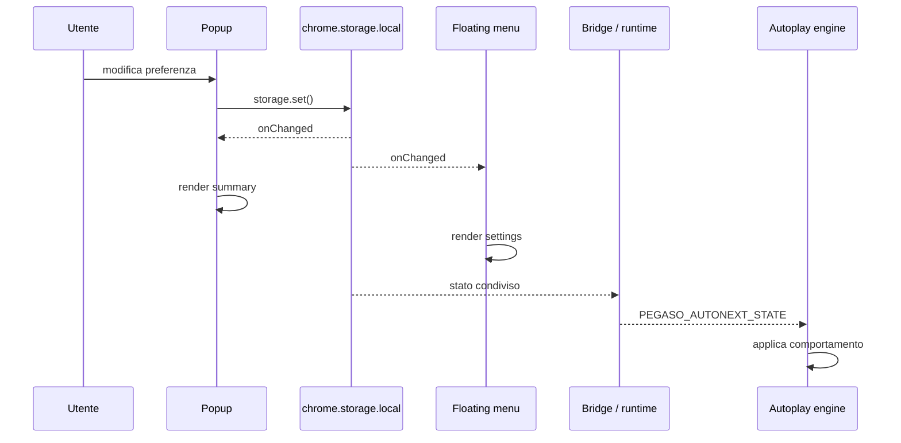
```mermaid
sequenceDiagram
    participant U as Utente
    participant P as Popup
    participant S as chrome.storage.local
    participant F as Floating menu
    participant B as Bridge / runtime
    participant A as Autoplay engine

    U->>P: modifica preferenza
    P->>S: storage.set()
    S-->>P: onChanged
    S-->>F: onChanged
    P->>P: render summary
    F->>F: render settings
    S-->>B: stato condiviso
    B-->>A: PEGASO_AUTONEXT_STATE
    A->>A: applica comportamento
```

Il diagramma rende evidente una cosa:

> **Popup e floating menu non devono sincronizzarsi direttamente fra loro.**

Si sincronizzano attraverso lo stato condiviso.

---

# Parte XXII — UI come proiezione, non database

## 71. Il DOM non è la source of truth

Supponiamo di leggere:

```js
checkbox.checked
```

Quello descrive ciò che il popup sta mostrando adesso.

Non è necessariamente lo stato più autorevole del sistema.

Il popup potrebbe essere appena nato.

Il floating menu potrebbe avere appena scritto storage.

Un'altra operazione potrebbe aver modificato una policy.

La sorgente è altrove.

Questo ricollega il Capitolo 11 al Capitolo 3:

> **il DOM è una rappresentazione dello stato, non necessariamente lo stato stesso.**

---

## 72. UI local state

Esistono però stati che hanno senso soltanto nella UI:

```text
tab selezionato
scroll corrente
help aperto
vista detail autoplay
focus corrente
```

Non serve persistere tutto in `chrome.storage.local`.

Qui torna la lezione del Capitolo 6:

```text
lifetime dello storage
≈
lifetime del dato
```

Una posizione di focus non deve sopravvivere al browser restart.

---

# Parte XXIII — Backend analogy

## 73. Due frontend dello stesso backend

Per chi viene dal backend, popup e floating menu possono essere pensati come due client:

```text
Client A: popup
Client B: floating menu
```

entrambi consumano:

```text
shared state / runtime services
```

È simile ad avere:

```text
web dashboard
+
mobile app
```

che usano la stessa API.

Non pretenderemmo che abbiano lo stesso markup.

Pretenderemmo invece che concordino su:

```text
business rules
identità
schema
stati effettivi
```

---

## 74. `menu-ux.js` come shared application/presentation service

Il modulo condiviso svolge un ruolo simile a:

```text
shared formatter
shared DTO projection
shared policy presenter
```

Per esempio:

```text
Domain/preferences
       ↓
autoplayPresentation()
       ↓
UI ViewModel
```

Non possiede il database.

Non possiede il motore autoplay.

Produce una rappresentazione coerente.

---

# Parte XXIV — Cosa avrebbe fatto un framework?

## 75. React/Vue avrebbero risolto tutto?

No.

Avrebbero semplificato alcuni aspetti:

- rendering dichiarativo;
- component reuse;
- state propagation;
- conditional rendering;
- lifecycle;
- DOM diff.

Ma avremmo comunque dovuto progettare:

- source of truth;
- schema storage;
- effective vs saved state;
- operation invariants;
- information architecture;
- accessibility;
- focus restoration;
- Shadow DOM strategy;
- synchronization fra extension contexts.

Il framework non decide queste cose per noi.

---

## 76. Quando avrebbe senso introdurlo?

Se l'interfaccia crescesse molto, potremmo iniziare a vedere segnali come:

```text
molte render functions intrecciate
molti nodi creati manualmente
dipendenze DOM difficili da seguire
state drift frequente
componenti davvero riutilizzabili
test DOM sempre più complessi
```

A quel punto un framework potrebbe ridurre il costo di manutenzione.

Ma avrebbe anche costi:

- bundle;
- build pipeline;
- review store;
- compatibilità extension;
- nuova astrazione da conoscere;
- migrazione del codice esistente.

Per un'estensione di questa dimensione, la scelta vanilla resta ragionevole.

---

# Parte XXV — Una possibile evoluzione senza framework

## 77. Prima di React: un ViewModel esplicito

Una evoluzione futura potrebbe essere:

```js
function deriveMenuViewModel(state, courseContext) {
  return {
    autoplay: {
      enabled: ...,
      summary: ...,
      canFindIncomplete: ...,
    },
    operations: ...,
    progress: ...,
    preferences: ...,
  };
}
```

Poi:

```text
popup renderer
floating renderer
```

consumerebbero lo stesso ViewModel.

Questo ridurrebbe ulteriormente la duplicazione di knowledge senza imporre lo stesso DOM.

---

## 78. Adapter per superficie

Potremmo immaginare:

```text
MenuViewModel
     ├── PopupAdapter
     └── FloatingAdapter
```

Il modello direbbe:

```text
cosa mostrare
```

Gli adapter deciderebbero:

```text
come rappresentarlo nel loro DOM
```

È lo stesso schema visto nel Capitolo 3 con i DOM adapter multipiattaforma.

---

# Parte XXVI — Bug reali come lezioni UI

## 79. Checkbox con colori differenti

Problema:

```text
controlli semanticamente equivalenti
ma accent color diverso
```

La correzione non dovrebbe essere:

```text
aggiungi CSS a quel checkbox
```

ma:

```text
definisci la regola per checkbox/radio condivisi
```

Il nuovo CSS usa selettori comuni basati su `data-menu-size` e tipi input.

Riferimento:

```text
menu-ux.css:69+
```

Lezione:

> **Quando più bug hanno la stessa causa visiva, cercare il ruolo condiviso invece del singolo elemento.**

---

## 80. Spazio prima di “Cancella dati degli esami”

Il feedback era semplicissimo:

```text
testo troppo vicino al pulsante
```

La correzione è:

```css
[data-action="clear-commission-data"] {
  margin-top: 12px;
}
```

Riferimento:

```text
menu-ux.css:99
```

Non ogni problema UI richiede un'astrazione enorme.

La capacità importante è distinguere:

```text
inconsistenza sistemica
vs
regola locale legittima
```

---

## 81. “Preferenze” troppo stretto

Qui il problema era sistemico:

```text
4 tab
+
label di lunghezze diverse
+
pannello con larghezza limitata
```

La soluzione riguarda il layout della tablist, non la singola parola.

---

## 82. Apertura automatica e scroll
Questo bug apparteneva al comportamento, non al CSS.

Un `<details>` poteva aprirsi correttamente e comunque offrire una UX sbagliata perché il nuovo contenuto risultava fuori viewport.

È un buon esempio di distinzione:

```text
DOM correctness
      ≠
interaction correctness
```

---

# Parte XXVII — Invarianti del redesign

## 83. Invarianti utili

Possiamo sintetizzare il redesign con alcune proprietà.

### I1 — stessa information architecture

```text
popup destinations ≈ floating destinations
```

### I2 — stessa rappresentazione delle policy autoplay

```text
autoplayPresentation(state)
```

### I3 — stessa personalizzazione delle action

```text
floatingMenuLayout
```

### I4 — operazione attiva sempre controllabile

```text
running action → visible cancellation path
```

### I5 — UI diversa non deve creare domain state diverso

```text
surface ≠ source of truth
```

### I6 — focus deve rimanere prevedibile

```text
open detail → focus title
close detail → focus opener
```

### I7 — la pagina LMS non deve essere disturbata dal menu

```text
floating internal scroll ≠ page scroll
```

---

# Parte XXVIII — Una lettura architetturale

## 84. Prima del refactor

Possiamo semplificare così:

```text
Popup controller ── regole UI A

Floating controller ── regole UI B
```

Con il tempo:

```text
A ≈ B
```

ma non necessariamente:

```text
A == B
```

---

## 85. Dopo il refactor

```text
                    ┌─────────────────────┐
                    │ shared presentation │
                    │ menu-ux.js / .css   │
                    └──────────┬──────────┘
                               │
                 ┌─────────────┴─────────────┐
                 │                           │
          ┌──────▼──────┐             ┌──────▼───────┐
          │  popup.js   │             │floating-menu │
          │ popup.html  │             │    .js       │
          └──────┬──────┘             └──────┬───────┘
                 │                           │
                 └─────────────┬─────────────┘
                               │
                    ┌──────────▼──────────┐
                    │ chrome.storage +    │
                    │ runtime/domain state│
                    └─────────────────────┘
```

La parte condivisa non è diventata il centro del sistema.

È diventata un **layer sottile**.

Questo limita il coupling.

---

# Parte XXIX — Trade-off

## 86. Vantaggi della soluzione attuale

- nessuna nuova dipendenza runtime;
- bundle semplice;
- facile audit per store;
- codice condiviso solo dove serve;
- controller esistenti preservati;
- schema storage invariato;
- playback logic non toccata;
- CSS comune per le incoerenze reali;
- testabile con funzioni pure e browser fixture.

---

## 87. Costi

- markup ancora duplicato in parte;
- molti query selector;
- rendering manuale;
- rischio di state drift;
- CSS legacy ancora presente;
- alcune funzioni di controller sono molto grandi;
- accessibility behavior richiede codice esplicito;
- nuove feature UI devono essere integrate in due superfici.

---

## 88. Perché il refactor non ha toccato l'autoplay engine

La documentazione della 2.35.2 dichiara esplicitamente che non introduce modifiche a:

```text
playback algorithm
persistent schema version
permissions
```

Riferimento:

```text
docs/features/menu-ux-2.35.2.md:38
```

Questa è una scelta di **scope control**.

Un refactor UI già ampio diventa più sicuro se non cambia contemporaneamente il motore sottostante.

---

# Parte XXX — Scope control come tecnica di engineering

## 89. Refactor orizzontale

La 2.35.2 tocca molte superfici:

```text
popup
floating menu
CSS
layout persistence
focus
scroll
browser tests
```

ma cerca di non cambiare il dominio.

Possiamo chiamarlo un refactor **orizzontale**:

```text
stesso comportamento
nuova presentazione coerente
```

---

## 90. Perché è importante per il debugging

Se dopo il refactor:

```text
Autoplay salta una lezione
```

possiamo chiedere:

```text
è cambiato il motore?
```

Se la risposta è no, restringiamo lo spazio di indagine a:

```text
configurazione trasmessa
rendering preferenza
storage sync
```

Separare scope riduce l'incertezza diagnostica.

---

# Parte XXXI — Cosa impariamo sui framework

## 91. I framework risolvono soprattutto coordination cost

Guardando questo codice possiamo vedere che gran parte del lavoro non è:

```text
creare un button
```

ma coordinare:

```text
state
DOM
focus
storage
lifecycle
rendering
interaction
```

Un framework fornisce convenzioni per ridurre questo coordination cost.

---

## 92. Vanilla non significa “senza architettura”

Una UI vanilla può essere molto strutturata se possiede:

```text
state ownership chiaro
pure projections
render boundaries
stable identities
shared tokens
behavior contracts
invariants
```

Il problema non è usare o non usare React.

Il problema è sapere **dove vive ogni responsabilità**.

---

# Parte XXXII — Concetti da portarsi dietro

## 93. Presentation layer

Layer che trasforma lo stato applicativo in una forma adatta alla visualizzazione senza diventare proprietario del dominio.

---

## 94. Derived state

Informazione calcolata da altro stato.

Esempio:

```text
summary autoplay
```

non viene salvata: viene derivata.

---

## 95. View model

Struttura preparata per la UI.

Esempio:

```js
{
  summary,
  testOverride,
  stopHint,
}
```

---

## 96. Progressive disclosure

Strategia che mostra immediatamente le operazioni più importanti e sposta configurazioni o dettagli dietro interazioni esplicite.

---

## 97. Roving tabindex

Pattern in cui un solo elemento di un gruppo possiede `tabIndex=0`, mentre gli altri usano `-1` e vengono navigati con tasti direzionali.

---

## 98. Focus restoration

Ripristino intenzionale del focus sul controllo che ha aperto una vista, un dialog o un dettaglio dopo la chiusura.

---

## 99. UI invariant

Proprietà che deve restare vera indipendentemente dalle preferenze o dal percorso di interazione.

Esempio:

```text
operazione attiva → controllo di cancellazione raggiungibile
```

---

## 100. Design token

Valore semantico condiviso per aspetti visuali come colore, dimensione, spaziatura o tipografia.

---

## 101. DOM protocol

Convenzione di attributi e struttura usata da più componenti per collegare markup e comportamento.

In questo capitolo:

```text
data-ux-*
data-menu-*
```

---

## 102. Reactive synchronization

Pattern in cui un cambiamento a una sorgente condivisa genera notifiche che provocano aggiornamenti mirati nelle viste interessate.

---

## 103. Constrained customization

Personalizzazione consentita entro invarianti definite dal prodotto.

Esempio:

```text
riordino dentro un gruppo
ma non distruggo la gerarchia semantica
```

---

# Parte XXXIII — Esercizi

## 104. Esercizio — Source of truth

Immagina che il popup mantenga:

```js
let enabled = checkbox.checked;
```

ma non ascolti `chrome.storage.onChanged`.

Il floating menu cambia `enabled`.

Domande:

1. quale UI diventa stale?
2. quale stato è autorevole?
3. come correggeresti il problema?

---

## 105. Esercizio — Derived state

Dato:

```js
{
  testBehavior: "stop",
  limitEnabled: true,
  stopAt70: true,
  thresholdBypassed: false,
}
```

Calcola:

```text
effective test behavior
summary
warning/override
```

prima di guardare `autoplayPresentation()`.

---

## 106. Esercizio — Focus

Considera un layout editor che fa:

```js
list.replaceChildren(...newRows);
```

senza ricordare il focus.

Descrivi cosa può succedere dopo aver premuto:

```text
Sposta giù
```

usando soltanto la tastiera.

---

## 107. Esercizio — Invariante

L'utente nasconde:

```text
Completa tutti i test
```

ma Turbo Test è già attivo.

Progetta due possibili comportamenti e spiega quale preserva meglio la controllabilità dell'operazione.

---

## 108. Esercizio — Shadow DOM

Spiega perché:

```text
menu-ux.css
```

può essere incluso direttamente dal popup ma deve essere reso accessibile al floating menu tramite una URL dell'estensione.

---

## 109. Esercizio — Framework

Riscrivi mentalmente:

```text
renderSettings()
```

come componente React/Vue.

Poi elenca quali problemi del capitolo **non** verrebbero risolti automaticamente dal framework.

---

# Parte XXXIV — Letture consigliate

## 110. Shadow DOM

MDN:

```text
https://developer.mozilla.org/en-US/docs/Web/API/Element/attachShadow
```

```text
https://developer.mozilla.org/en-US/docs/Web/API/ShadowRoot/mode
```

---

## 111. ARIA Tabs Pattern

W3C WAI-ARIA Authoring Practices:

```text
https://www.w3.org/WAI/ARIA/apg/patterns/tabs/
```

L'esempio manuale mostra in particolare:

```text
ArrowLeft
ArrowRight
Home
End
```

come navigazione della tablist.

---

## 112. CSS Font Loading API

MDN:

```text
https://developer.mozilla.org/en-US/docs/Web/API/FontFace
```

```text
https://developer.mozilla.org/en-US/docs/Web/API/Document/fonts
```

---

## 113. Storage events delle extension

Chrome Extensions:

```text
https://developer.chrome.com/docs/extensions/reference/api/storage
```

In particolare:

```text
chrome.storage.onChanged
```

che è alla base della sincronizzazione fra le due superfici.

---

# Parte XXXV — Riepilogo

La 2.35.2 ci mostra che un refactor UI non è soltanto:

```text
nuovi colori
nuove card
spaziature migliori
```

È soprattutto riallineare:

```text
information architecture
state representation
navigation
focus
persistence
invariants
style roles
cross-surface behavior
```

Il risultato può essere riassunto così:

```text
shared state
     ↓
controllers separati
     ↓
shared presentation rules
     ↓
two coordinated surfaces
```

La scelta più importante non è stata “usare vanilla JS”.

È stata:

> **condividere la conoscenza che deve essere coerente, lasciando separate le responsabilità che appartengono davvero a runtime diversi.**

Questo principio è molto più generale di PlumePilot.

Vale per:

```text
web + mobile
admin + user UI
CLI + GUI
popup + embedded panel
server renderer + client renderer
```

Nel prossimo capitolo entreremo in un'altra area dove l'architettura diventa concreta:

## Verso il Capitolo 12 — Performance e memoria

Vedremo:

```text
DOM scan
API pacing
cache
canvas
PDF.js
Blob
worker
batch operations
MutationObserver
memory pressure
```

non come una lista di micro-ottimizzazioni, ma come un problema di **budget delle risorse**.

---

# 12 — Performance e memoria

## Quando il browser diventa il nostro runtime

> **Snapshot di riferimento del capitolo**  
> Questo capitolo usa il candidato **2.35.2**, branch `feat/ui-ux-2.35.2`, commit `4d32a8c2a6cd291e4fe389bdf10fdbaf1856a8c2`.  
> Il manifest conserva ancora `2.35.1` perché il bump appartiene alla preparazione finale della release.

Nei capitoli precedenti abbiamo incontrato quasi tutti i problemi che, prima o poi, diventano problemi di performance:

- scansioni del DOM;
- richieste di rete;
- polling;
- cache;
- retry;
- export PDF;
- rendering con PDF.js;
- canvas;
- immagini;
- ZIP;
- `MutationObserver`;
- operazioni batch;
- UI che deve rimanere utilizzabile mentre il lavoro continua.

Finché li osserviamo separatamente sembrano dettagli locali.

Quando li mettiamo insieme emerge invece un fatto importante:

> **Una browser extension non gira “dentro JavaScript”. Gira dentro un browser che deve contemporaneamente eseguire JavaScript, gestire DOM e layout, disegnare, ricevere input, fare rete, decodificare immagini, mantenere cache e coordinare più context.**

Per questo dire semplicemente:

```text
"questa funzione è lenta"
```

è quasi sempre una diagnosi troppo povera.

Potrebbe essere:

```text
CPU-bound
I/O-bound
memory-bound
main-thread-bound
DOM-bound
network-bound
```

oppure una combinazione delle precedenti.

Il nostro obiettivo in questo capitolo non sarà quindi collezionare micro-ottimizzazioni.

Costruiremo invece un metodo per rispondere a quattro domande:

1. **Dove viene speso il tempo?**
2. **Quali risorse rimangono vive e per quanto?**
3. **Quanto lavoro facciamo inutilmente?**
4. **La UI rimane responsiva mentre il lavoro utile continua?**

---

# Parte I — Performance non significa una sola cosa

## 1. Quattro budget diversi

Per PlumePilot è utile separare almeno quattro budget.

### Budget CPU

Quanto lavoro computazionale deve svolgere il processo:

```text
parsing
ordinamenti
classificazione pagine
hash SHA-256
pixel analysis
costruzione DOM
compressione ZIP
```

### Budget I/O

Quanto attendiamo risorse esterne:

```text
fetch API
PDF remoti
asset immagini
storage browser
messaggi fra context
```

### Budget memoria

Quanti dati sono vivi contemporaneamente:

```text
PDF bytes
PDF.js document
canvas
pixel buffer
immagini codificate
cache
stringhe HTML
JSZip
output finale
```

### Budget responsiveness

Per quanto tempo il main thread rimane indisponibile per:

```text
input utente
paint
layout
scroll
animazioni
aggiornamenti UI
```

Questi budget sono collegati, ma non equivalenti.

Una modifica può fare questo:

```text
più parallelismo
   ↓
meno wall time
   ↓
più richieste contemporanee
   ↓
più buffer vivi
   ↓
picco RAM maggiore
```

Oppure:

```text
cache più aggressiva
   ↓
meno rete
   ↓
meno scansioni
   ↓
più memoria trattenuta
```

Il concetto centrale del capitolo è quindi:

> **Ottimizzare significa scegliere quale risorsa stiamo cercando di risparmiare.**

---

## 2. Wall time, CPU time e perceived latency

Supponiamo che un export duri 20 secondi.

Non sappiamo ancora quasi nulla.

Potrebbe contenere:

```text
2 s CPU
18 s rete
```

oppure:

```text
18 s CPU
2 s rete
```

Dal punto di vista dell'utente il wall time è simile.

Dal punto di vista architetturale sono due sistemi completamente diversi.

E c'è un terzo tempo:

**perceived latency**.

Un'operazione di 20 secondi che aggiorna progressivamente:

```text
Download dispensa 3/12
Conversione pagina 8/24
Compressione 64%
```

può sembrare più controllabile di un'operazione da 12 secondi che congela completamente l'interfaccia.

Quindi:

```text
performance != solo durata totale
```

ma anche:

```text
responsiveness
feedback
cancellabilità
progressività
```

---

# Parte II — Misurare prima di ottimizzare

## 3. `performance.now()` e clock monotono

Nel convertitore EPUB troviamo:

```js
const startedAt = performance.now();
```

Riferimento:

```text
epub-core.mjs:1842
```

E alla fine:

```js
diagnostics.elapsedMs = performance.now() - startedAt;
```

Riferimento:

```text
epub-core.mjs:2119–2121
```

Per una misurazione di durata questo è preferibile a:

```js
Date.now()
```

perché `performance.now()` usa un riferimento monotono pensato per misurare intervalli.

Questo ci permette di introdurre una regola semplice:

```text
Date.now()
→ quando ci interessa il tempo civile / timestamp

performance.now()
→ quando ci interessa quanto è durata un'operazione
```

---

## 4. Misurare il sistema giusto

Nel repository esistono benchmark EPUB.

Ma uno dei commenti più importanti è questo:

```js
// Supplementary renderer benchmark. These timings are NOT browser measurements.
```

Riferimento:

```text
scripts/benchmark-epub-node.mjs:1
```

E il benchmark Chromium specifica:

```js
scope:
  "Chromium converter over HTTP; not an installed-extension integration or process-memory test"
```

Riferimento:

```text
scripts/benchmark-epub-regions.mjs:95–101
```

Questo è software engineering molto più importante del singolo numero prodotto dal benchmark.

Un benchmark deve dichiarare **cosa misura e cosa non misura**.

Altrimenti potremmo concludere:

```text
"il benchmark Node usa 120 MB"
```

quindi:

```text
"l'estensione nel browser usa 120 MB"
```

ma non sarebbe una conclusione valida.

Node, Chromium, PDF.js worker, canvas implementation e extension runtime possono avere ownership e accounting della memoria differenti.

---

## 5. Benchmark vs profiling

Sono attività correlate ma diverse.

### Benchmark

Risponde a domande come:

```text
Quanto dura questa conversione?
Quanti byte produce?
Quante immagini vengono deduplicate?
La variante A è più veloce della B?
```

### Profiling

Risponde invece:

```text
Dove viene speso il tempo?
Quale funzione alloca?
Quale oggetto trattiene memoria?
Quale task blocca il main thread?
```

Un benchmark può dirci:

```text
versione nuova: 14.2 s
versione vecchia: 19.6 s
```

ma non necessariamente **perché**.

Un profiler ci aiuta a costruire quel perché.

---

## 6. Metriche utili per PlumePilot

Per un workflow di PlumePilot le metriche utili possono essere:

```text
elapsedMs
numero richieste API
numero retry
numero fallback visuali
pagine text/regional/visual
input image bytes
unique image bytes
EPUB bytes
numero cache hit/miss
numero capitoli aperti nel DOM
numero canvas creati
peak working set
```

Non tutte devono finire nel prodotto.

Molte possono vivere solo nei benchmark o in modalità diagnostica.

Il punto è un altro:

> **Una performance regression è molto più facile da individuare quando abbiamo una metrica legata al comportamento che vogliamo proteggere.**

---

# Parte III — Big-O non basta

## 7. Due algoritmi `O(N)` possono avere costi radicalmente diversi

Nel Capitolo 8 abbiamo visto la ricerca della prima attività incompleta.

Una scansione completa dei capitoli è, concettualmente:

```text
O(N)
```

Anche questa strategia è `O(N)`:

```text
leggi master index
ordina candidati
ispeziona i moduli necessari
```

Eppure possono avere prestazioni molto differenti.

Perché?

Perché l'unità di costo non è sempre:

```text
una iterazione JavaScript
```

Può essere:

```text
aprire accordion
attendere rendering LMS
fare una request HTTP
attendere una detail call
eseguire querySelectorAll
far cambiare route alla SPA
```

Quindi per sistemi I/O-heavy una formula più realistica è:

```text
Costo ≈
  operazioni economiche × costo economico
+ operazioni costose × costo costoso
```

Se riduciamo le detail call da 50 a 5, possiamo ottenere un enorme guadagno pur restando formalmente in `O(N)`.

---

## 8. Ottimizzare lo spazio di ricerca

La funzione:

```js
findNextPlaybackTargetViaApi(...)
```

costruisce `discoveryOrder`.

Quando è disponibile il course index, prima colloca i capitoli sospetti:

```js
const suspectedIncomplete = (index) => {
  const route = routeByLessonNumber.get(outline[index].lessonNumber);
  return !route || Number(route.percentage) < 100;
};

discoveryOrder = [
  ...discoveryOrder.filter(suspectedIncomplete),
  ...discoveryOrder.filter((index) => !suspectedIncomplete(index)),
];
```

Riferimento:

```text
content.js:5896–5911
```

La complessità asintotica non diventa magica.

Ma cambia il numero atteso di operazioni costose eseguite prima di trovare il target.

Questo è un esempio di:

**cost-based optimization**.

Non stiamo semplicemente contando elementi.

Stiamo cercando di ordinare le operazioni per ridurre il costo medio.

---

## 9. Saltare lavoro già provato

Nel percorso non-bookmark troviamo anche:

```js
if (
  !options.bookmarkSearch &&
  !options.forwardVideoSearch &&
  indexedChapter &&
  Number(indexedChapter.percentage) >= 100
) {
  continue;
}
```

Riferimento:

```text
content.js:5947–5953
```

Il master index qui non deve raccontarci ogni dettaglio.

Deve rispondere a una domanda più economica:

```text
vale la pena fare la richiesta dettagliata?
```

Questa è la funzione classica di un indice.

---

# Parte IV — DOM: il costo nascosto

## 10. `querySelectorAll()` non è gratis

In `content.js` incontriamo molte query.

Per esempio:

```js
document.querySelectorAll("video").forEach(attach);
```

oppure ricerche più ampie su:

```text
span
div
heading
button
row
```

Il costo di una query DOM dipende da:

- dimensione del sottoalbero;
- complessità del selettore;
- frequenza;
- quantità di lavoro fatto sui risultati;
- eventuale interazione con layout/style.

Una query occasionale può essere irrilevante.

La stessa query ripetuta ad ogni mutazione di un grande subtree può diventare una hot path.

---

## 11. Il `MutationObserver` globale di autoplay

Il codice attuale usa:

```js
new MutationObserver(scan).observe(document.documentElement, {
  childList: true,
  subtree: true,
});
```

Riferimento:

```text
content.js:7076–7079
```

Ogni volta che viene invocato `scan()`:

```js
document.querySelectorAll("video").forEach(attach);
const activeRow = currentLesson();
...
```

Riferimento:

```text
content.js:7066–7074
```

È una soluzione robusta perché non dipende dal framework interno della piattaforma.

Ma ha un potenziale costo:

```text
molte mutazioni DOM
      ↓
molti callback observer
      ↓
nuove scansioni
```

Questo non significa automaticamente che sia un problema misurabile.

Significa che è un **candidate hotspot**.

La regola è:

> **Prima profilare, poi restringere l'observer se esiste un beneficio reale.**

---

## 12. Observer come invalidation signal

Il pattern più efficiente concettualmente non è:

```text
MutationObserver = il dato
```

ma:

```text
MutationObserver = qualcosa potrebbe essere cambiato
```

Quindi:

```text
mutation
  ↓
invalidate / schedule
  ↓
fresh query
```

Questo modello era già emerso nel Capitolo 3.

Dal punto di vista delle performance permette anche strategie come:

```text
debounce
coalescing
narrow observer root
specific mutation filtering
```

se un profiler dimostrasse che servono.

---

## 13. Coalescing

Supponiamo che il framework LMS produca 30 mutazioni durante un singolo aggiornamento visuale.

Non sempre vogliamo eseguire 30 volte:

```js
scan();
```

Possiamo invece trasformare:

```text
mutation
mutation
mutation
mutation
```

in:

```text
schedule scan once
```

Questa tecnica si chiama spesso **coalescing**.

PlumePilot la applica in vari punti attraverso funzioni `schedule...()` e timer, anche se non ogni observer usa necessariamente lo stesso meccanismo.

---

## 14. Layout read

Operazioni come:

```js
element.getBoundingClientRect()
```

sono molto diverse da leggere una semplice proprietà JavaScript.

In PlumePilot vengono usate per capire:

- quale video è visibile;
- se un elemento occupa spazio renderizzato;
- la posizione del launcher;
- la geometria del menu;
- il comportamento dello scroll.

Il problema non è chiamare `getBoundingClientRect()`.

Il problema nasce soprattutto quando alterniamo ripetutamente:

```text
DOM write
layout read
DOM write
layout read
```

perché il browser potrebbe dover aggiornare layout più volte.

Il principio generale è:

> **Quando possibile, raggruppare reads e writes invece di interlevarle senza necessità.**

---

# Parte V — Rete: più veloce non significa più parallelo

## 15. Il falso istinto: `Promise.all()` ovunque

Se dobbiamo processare 40 capitoli, potremmo pensare:

```js
await Promise.all(chapters.map(loadChapter));
```

Sembra la soluzione più veloce.

Ma può creare contemporaneamente:

```text
40 richieste
40 response buffer
40 parse
40 cache write
40 possibili retry
```

Il wall time può diminuire.

Il carico complessivo può aumentare drasticamente.

Inoltre stiamo interagendo con un servizio terzo che non controlliamo.

PlumePilot usa spesso una strategia più conservativa.

---

## 16. Pacing come backpressure

Fra le costanti troviamo:

```js
const API_MATERIAL_PACING_MS = 150;
const TURBO_API_PACING_MS = 350;
```

Riferimento:

```text
content.js:60–61
```

Durante la raccolta materiali:

```js
if (index + 1 < outline.length) {
  await exportSleep(API_MATERIAL_PACING_MS, operationId);
}
```

Riferimento:

```text
content.js:3172–3175
```

Questo è un esempio di **backpressure applicativa**.

La pipeline dice:

```text
posso chiedere il prossimo elemento
```

ma sceglie deliberatamente di non saturare il producer.

---

## 17. Perché il pacing può migliorare il sistema anche se lo rallenta

Sembra un paradosso.

Inserire 150 ms:

```text
rende la singola sequenza più lenta
```

ma può:

```text
ridurre burst di richieste
ridurre retry
ridurre errori transitori
ridurre concorrenza sui buffer
ridurre carico sulla piattaforma
rendere cancellazione e progress più prevedibili
```

La performance di un sistema non è soltanto:

```text
velocità massima in condizioni ideali
```

ma anche:

```text
stabilità sotto carico e condizioni imperfette
```

---

## 18. Retry non è throughput

PlumePilot separa:

```js
const COURSE_INDEX_RETRY_DELAYS_MS = [350, 750];
const API_LESSON_RETRY_DELAYS_MS = [750, 1500];
```

Riferimento:

```text
content.js:62–63
```

Un retry serve a recuperare un fallimento.

Il pacing serve a regolare il ritmo normale.

Sono due meccanismi diversi.

Confonderli produce algoritmi strani:

```text
"aspettiamo perché potrebbe fallire"
```

invece di:

```text
pacing → comportamento normale
retry → recupero eccezionale
```

---

## 19. Request deduplication

Nel builder quiz esiste:

```js
const imageCache = new Map();
```

Riferimento:

```text
test-builder.js:16
```

Quando viene richiesta un'immagine:

```js
if (imageCache.has(url)) return imageCache.get(url);
```

poi viene salvata **la Promise della richiesta**, non soltanto il risultato finale.

Questo dettaglio è importante.

Se due consumer richiedono simultaneamente la stessa URL:

```text
consumer A ─┐
            ├→ stessa Promise → una fetch
consumer B ─┘
```

anziché:

```text
consumer A → fetch
consumer B → fetch
```

Questa è **in-flight deduplication**.

---

## 20. Cache hit come eliminazione di lavoro

Nelle pipeline API il log esplicita casi come:

```text
reused from memory cache
```

Il beneficio di una cache non è soltanto diminuire latenza.

Può eliminare:

```text
HTTP
parse JSON
normalizzazione
DOM fallback
attese
retry
```

Per questo una cache ben progettata può migliorare più budget contemporaneamente.

Ma, come abbiamo visto nel Capitolo 6, sposta il costo verso la memoria.

---

# Parte VI — Bounded memory

## 21. Una cache senza limite è una promessa di crescita

Nel MAIN-world interceptor troviamo:

```js
const pageLessonSnapshots = new Map();
```

La cache viene limitata:

```js
if (pageLessonSnapshots.size > 50) {
  pageLessonSnapshots.delete(pageLessonSnapshots.keys().next().value);
}
```

Riferimento:

```text
commission-interceptor.js:414–415
```

Questa è una proprietà fondamentale:

**bounded growth**.

Senza limite, se la pagina continua a visitare identità nuove:

```text
1 entry
10 entries
100 entries
1000 entries
...
```

il processo non ha nessuna ragione applicativa per liberarle.

---

## 22. FIFO-ish, non LRU

Come visto nel Capitolo 6, una `Map` conserva l'ordine di inserimento.

Cancellare:

```js
map.keys().next().value
```

rimuove l'entry inserita prima fra quelle ancora presenti.

Quindi questo schema è più vicino a:

```text
FIFO eviction
```

che a:

```text
LRU eviction
```

perché una semplice lettura non sposta automaticamente la chiave in fondo.

Questo può essere perfettamente adeguato.

Una LRU vera costerebbe maggiore complessità.

---

## 23. Boundedness come invariante

Una struttura dati può essere veloce per entry e comunque pericolosa se cresce senza limite.

Per esempio:

```textlookup O(1)-ish
```

non ci dice nulla su:

```text
numero massimo di entry
```

La domanda di performance corretta è quindi doppia:

```text
quanto costa una operazione?
quanto può crescere la struttura?
```

---

# Parte VII — EPUB: il vero laboratorio di memoria

## 24. Working set

Nel Capitolo 9 abbiamo visto le rappresentazioni intermedie dell'EPUB.

Ora le guardiamo dal punto di vista della memoria.

Durante la conversione possono coesistere:

```text
PDF Uint8Array
PDF.js document
pagina PDF.js
textContent
operator list
canvas sorgente
ImageData temporaneo
canvas di regione
immagine compressa
XHTML
JSZip entries
EPUB finale Uint8Array
```

L'insieme di dati necessari **in questo momento** è il:

**working set**.

Il problema reale non è soltanto quanti byte avremo alla fine.

È quanti byte dobbiamo mantenere vivi contemporaneamente.

---

## 25. Peak memory

Definiamo:

```text
peak memory = massimo working set raggiunto durante l'operazione
```

Due algoritmi possono produrre lo stesso EPUB da 40 MB ma avere:

```text
Algoritmo A → picco 150 MB
Algoritmo B → picco 600 MB
```

Il file finale non ci permette di dedurlo.

Questo è il motivo per cui una riduzione della dimensione dell'EPUB **non dimostra** automaticamente una riduzione della RAM.

Il changelog 2.35.1 è infatti prudente:

```text
File-size gains depend on the document and do not establish RAM savings.
```

Riferimento:

```text
CHANGELOG.md:9
```

---

## 26. Canvas: pixel non compressi

Una immagine PNG da 800 KB può derivare da un canvas che, durante il rendering, rappresenta milioni di pixel non compressi.

Per un buffer RGBA 8-bit il modello mentale è:

```text
bytes ≈ width × height × 4
```

PlumePilot limita il rendering visuale con:

```js
const VISUAL_MAX_PIXELS = 5000000;
const VISUAL_MAX_DIMENSION = 8192;
```

Riferimento:

```text
epub-core.mjs:22–23
```

Cinque milioni di pixel RGBA corrispondono già a circa:

```text
20,000,000 bytes
≈ 19.1 MiB
```

solo per una rappresentazione pixel equivalente.

E non stiamo ancora contando:

- PDF.js;
- canvas aggiuntivi;
- `ImageData` temporanei;
- immagine codificata;
- oggetti JavaScript.

---

## 27. Limitare la scala prima di allocare

La funzione:

```js
function visualRenderScale(viewport, renderWidth = VISUAL_RENDER_WIDTH) {
  return Math.min(
    renderWidth / viewport.width,
    Math.sqrt(VISUAL_MAX_PIXELS / (viewport.width * viewport.height)),
    VISUAL_MAX_DIMENSION / Math.max(viewport.width, viewport.height),
  );
}
```

Riferimento:

```text
epub-core.mjs:1101–1107
```

è una misura di performance molto più importante di quanto sembri.

Non dice:

```text
crea il canvas grande e poi riducilo
```

Dice:

```text
calcola prima un upper bound
        ↓
alloca direttamente entro il budget
```

È una forma di **admission control** sulle allocazioni.

---

## 28. `getImageData()` crea altro lavoro e altri dati

Nella conversione regionale:

```js
const pixels = context.getImageData(
  0,
  band.start,
  canvas.width,
  band.end - band.start,
).data;
```

Riferimento:

```text
epub-core.mjs:1453–1461
```

`getImageData()` restituisce dati pixel per la regione richiesta.

Quindi una strategia che analizza pixel non ha solo costo CPU.

Ha anche costo di memoria e copying/representation.

Per questo il codice lavora per **band**, non necessariamente sempre sull'intera pagina in un unico `ImageData` aggiuntivo.

---

## 29. Cache locale per `rowInk`

Durante la classificazione regionale troviamo:

```js
const rowInkCache = new Int32Array(canvas.height).fill(-1);
const cachedRowInk = (y) => {
  if (rowInkCache[y] < 0)
    rowInkCache[y] = rowInk(context, y, 0, canvas.width);
  return rowInkCache[y];
};
```

Riferimento:

```text
epub-core.mjs:1388–1392
```

È una piccola memoization molto mirata.

Calcolare l'ink di una riga richiede leggere pixel.

La pipeline può chiedere più volte la stessa riga durante:

```text
inkBands
refinement
cut search
```

Quindi spendiamo:

```text
O(height) interi
```

per evitare lavoro pixel ripetuto.

È un ottimo esempio di trade-off:

```text
un po' più memoria
→ molta meno CPU potenziale
```

---

# Parte VIII — Lifetime e release esplicito

## 30. JavaScript ha garbage collection, ma noi controlliamo la reachability

Una frase comune è:

```text
"JavaScript ha il garbage collector, quindi non devo liberare memoria"
```

È sbagliata.

Il GC decide quando liberare oggetti **non più raggiungibili**.

Il programmatore decide, direttamente o indirettamente, quali riferimenti restano raggiungibili.

Se manteniamo:

```js
cache.set(key, hugeBuffer);
```

quel buffer resta raggiungibile.

Se un event listener chiude sopra un grande oggetto, può mantenerlo raggiungibile.

Se un array cresce indefinitamente, gli elementi restano raggiungibili.

Quindi il problema non è chiamare manualmente `free()`.

È progettare correttamente:

```text
ownership
lifetime
reachability
```

---

## 31. Ridurre un canvas a `1×1`

Dopo il rendering PlumePilot esegue pattern come:

```js
finally {
  canvas.width = 1;
  canvas.height = 1;
}
```

Riferimenti:

```text
epub-core.mjs:1132–1135
epub-core.mjs:1194–1203
epub-core.mjs:1546–1563
```

Questo non è l'equivalente JavaScript di `free()`.

È però una maniera esplicita per dire:

```text
non abbiamo più bisogno della grande backing surface
```

ridimensionando il canvas a una superficie minima.

La lezione architetturale è:

> **Quando una risorsa browser ha un lifetime chiaramente terminato, renderlo evidente nel codice può ridurre la retention accidentale.**

---

## 32. `page.cleanup()`

Ogni pagina PDF.js viene gestita così:

```js
const page = await pdf.getPage(pageNumber);
try {
  ...
} finally {
  page.cleanup();
}
```

Riferimento:

```text
epub-core.mjs:1684–1762
```

Questa è una delle ragioni per cui il `finally` non serve soltanto agli errori.

Serve alla **resource lifetime correctness**.

Qualunque percorso avvenga:

```text
successo
fallback
errore
cancellazione
```

il cleanup deve avere una via di esecuzione.

---

## 33. `pdf.destroy()`

Alla fine della dispensa:

```js
if (destroyPromise) {
  await destroyPromise;
} else if (pdf) {
  await pdf.destroy().catch(() => {});
} else if (loadingTask) {
  await loadingTask.destroy().catch(() => {});
}
```

Riferimento:

```text
epub-core.mjs:1775–1783
```

Il codice gestisce anche il caso di cancellazione durante il caricamento.

Quindi non abbiamo soltanto:

```text
lifetime normale
```

ma anche:

```text
lifetime interrotto
```

Un sistema cancellabile deve liberare risorse anche lungo i percorsi che non arrivano alla fine naturale.

---

## 34. Rimuovere listener temporanei

Per collegare l'AbortSignal al render PDF.js:

```js
signal?.addEventListener("abort", cancel, { once: true });
```

ma nel `finally`:

```js
signal?.removeEventListener("abort", cancel);
```

Riferimento:

```text
epub-core.mjs:1082–1096
```

Stesso principio in `yieldToBrowser()` e download/retry.

Un listener non è necessariamente costoso.

Un listener dimenticato può però:

```text
mantenere closure
mantenere riferimenti
accumulare callback
creare comportamento duplicato
```

---

# Parte IX — Conversione sequenziale e picco RAM

## 35. Una dispensa alla volta

`buildCourseEpub()` itera:

```js
for (let index = 0; index < materials.length; index++) {
  ...
  const converted = await convertMaterial(...);
  ...
}
```

Riferimento:

```text
epub-core.mjs:1891–1962
```

Questa scelta controlla la concorrenza.

Un'alternativa sarebbe:

```js
await Promise.all(materials.map(convertMaterial));
```

ma significherebbe poter avere contemporaneamente:

```text
PDF #1 + canvas
PDF #2 + canvas
PDF #3 + canvas
...
```

La versione sequenziale sacrifica throughput teorico per contenere il working set.

---

## 36. Streaming ideale vs builder in-memory

JSZip accumula il pacchetto logico e alla fine:

```js
const bytes = await zip.generateAsync({
  type: "uint8array",
  compression: "DEFLATE",
  compressionOptions: { level: 6 },
}, ...);
```

Riferimento:

```text
epub-core.mjs:2098–2117
```

Durante questa fase abbiamo potenzialmente:

```text
asset registrati in JSZip
+
strutture ZIP
+
output Uint8Array in costruzione
```

Una pipeline completamente streaming potrebbe ridurre alcuni picchi.

Ma introdurrebbe:

- maggiore complessità;
- compatibilità diversa;
- gestione più complessa degli errori;
- necessità di conoscere manifest e asset finali al momento giusto.

Quindi la domanda corretta non è:

```text
"perché non streammare tutto?"
```

ma:

```text
"il picco attuale giustifica il costo di una architettura streaming?"
```

---

# Parte X — Deduplicazione: risparmiare file e working set

## 37. Content-addressable deduplication

In `epub-assets.mjs`:

```js
const byHash = new Map();
```

Ogni immagine viene digestata:

```js
const digest = new Uint8Array(
  await crypto.subtle.digest("SHA-256", image.bytes)
);
```

poi identificata con:

```js
const key = `${image.mediaType}:${extension}:${hash}`;
```

Riferimento:

```text
epub-assets.mjs:1–20
```

Se il contenuto è già presente:

```text
riuso metadata
non aggiungo una seconda copia al ZIP
```

---

## 38. Hashing costa CPU per risparmiare memoria e output

La deduplicazione non è gratis.

Per ogni asset:

```text
leggi bytes
calcola SHA-256
lookup Map
```

Quindi:

```text
più CPU
```

in cambio di:

```text
meno asset duplicati
meno ZIP bytes
meno storage interno
```

È di nuovo un trade-off multi-budget.

---

## 39. Ownership: JSZip diventa il proprietario

Dopo la registrazione:

```js
const asset = await assetRegistry.register(image);
...
image.bytes = null;
```

Riferimento:

```text
epub-core.mjs:1914–1920
```

Il commento nel codice è molto esplicito:

```js
// Release duplicate buffers; JSZip retains only the canonical bytes.
```

Qui avviene un **ownership transfer concettuale**:

```text
converted.images
      ↓ register
asset registry / JSZip
      ↓
converted image buffer non serve più
```

Impostare `image.bytes = null` rende quella transizione visibile nel codice.

---

## 40. Non duplicare ownership

Il problema che vogliamo evitare è:

```text
JSZip → buffer A
images[] → stesso buffer A
included[] → stesso/altro riferimento
aliases → metadata
```

Anche se alcuni riferimenti puntano allo stesso oggetto e non duplicano fisicamente i byte, strutture ridondanti rendono più difficile capire quando un buffer può diventare unreachable.

La regola è:

> **Ogni grande buffer dovrebbe avere un owner chiaramente identificabile.**

---

# Parte XI — JPEG o PNG? Performance come scelta di rappresentazione

## 41. Non tutte le immagini vogliono lo stesso codec

PlumePilot analizza un sample `64×64`:

```js
sample.width = 64;
sample.height = 64;
context.drawImage(canvas, 0, 0, sample.width, sample.height);
```

poi decide:

```js
return photographic
  ? { extension: "jpg", mediaType: "image/jpeg", quality: 0.9 }
  : { extension: "png", mediaType: "image/png", quality: undefined };
```

Riferimento:

```text
epub-core.mjs:1036–1050
```

È una decisione di performance basata sulla **rappresentazione**.

JPEG può comprimere meglio contenuto fotografico.

PNG preserva bene grafica, testo e bordi netti.

---

## 42. Ottimizzare prima di codificare

Notiamo l'ordine:

```text
canvas grande
   ↓
downsample 64×64
   ↓
classificazione economica
   ↓
codec
   ↓
encode
```

Non viene provato prima PNG, poi JPEG, poi scelto il più piccolo.

Quella strategia richiederebbe due encoding completi.

La soluzione attuale usa una **cheap heuristic before expensive operation**.

Pattern generale:

```text
cheap classifier
      ↓
choose expensive path
```

Lo stesso schema appare nella ricerca attività e nel routing API.

---

# Parte XII — Text first: evitare il raster quando possibile

## 43. L'ottimizzazione più potente è non fare lavoro

Per una pagina semplice PlumePilot tenta:

```js
converted = textPageToHtml(...);
```

solo se la classificazione non richiede visual rendering.

Riferimento:

```text
epub-core.mjs:1684–1717
```

Se il testo è sufficientemente affidabile:

```text
niente canvas ad alta risoluzione
niente raster intera pagina
niente immagine codificata
EPUB più reflowable
```

Questa è contemporaneamente un'ottimizzazione di:

```text
CPU
memoria
file size
accessibilità del testo
adattabilità e-reader
```

---

## 44. Fast path e slow path

Possiamo leggere il convertitore come:

```text
FAST PATH
PDF text → XHTML

SLOW PATH
PDF → render canvas → analisi → immagine/regione
```

L'obiettivo di un fast path non è eliminare il slow path.

È usare il slow path **solo quando serve**.

---

## 45. Progressive refinement

La pipeline usa una sequenza di crescente costo:

```text
estrai testo
   ↓
classifica
   ↓
conversione testuale
   ↓
controllo incompletezza
   ↓
regional analysis
   ↓
full visual fallback
```

Questo è lo stesso principio algoritmico incontrato nella ricerca attività:

> **partire dall'evidenza più economica e aumentare il costo solo quando l'incertezza lo richiede.**

---

# Parte XIII — Cooperative scheduling

## 46. Il problema del long task

JavaScript nel main thread ha semantica run-to-completion.

Se una funzione esegue per troppo tempo senza cedere:

```text
input resta in coda
paint resta in coda
scroll può diventare scattoso
progress UI non aggiorna
```

Anche se l'algoritmo termina correttamente, l'esperienza può essere pessima.

---

## 47. `yieldToBrowser()`

L'EPUB converter implementa:

```js
const browserYieldChannel = new MessageChannel();
const browserYieldQueue = [];
browserYieldChannel.port1.onmessage = () =>
  browserYieldQueue.shift()?.();
```

poi:

```js
function yieldToBrowser(signal) {
  ...
  browserYieldQueue.push(resume);
  browserYieldChannel.port2.postMessage(null);
}
```

Riferimento:

```text
epub-core.mjs:137–167
```

Il compito non è diventato parallelo.

È stato spezzato in più task cooperativi.

---

## 48. Yielding non riduce necessariamente il lavoro totale

Supponiamo:

```text
100 ms lavoro continuo
```

contro:

```text
20 ms lavoro
yield
20 ms lavoro
yield
...
```

Il secondo percorso potrebbe perfino durare leggermente di più.

Ma consente al browser di intercalare altro lavoro.

Quindi:

```text
throughput leggermente peggiore
responsiveness molto migliore
```

può essere il trade-off corretto.

---

## 49. Dove PlumePilot cede il controllo

Durante la conversione troviamo `await yieldToBrowser(signal)`:

- dopo blocchi visuali;
- durante la pianificazione regionale;
- dopo regioni;
- dopo pagine.

Riferimenti:

```text
epub-core.mjs:1198
epub-core.mjs:1487
epub-core.mjs:1551
epub-core.mjs:1764
```

Questi sono **cooperative scheduling points**.

---

## 50. Perché `MessageChannel`?

`MessageChannel` permette di accodare un messaggio che verrà elaborato in un task successivo.

Il punto non è comunicare con un altro frame.

Qui viene usato come primitiva di scheduling:

```text
current task
   ↓ postMessage
return to browser/event loop
   ↓
message task
   ↓
resume Promise
```

È un uso interessante di una API nata per channel messaging.

---

## 51. `requestIdleCallback()` sarebbe migliore?

Non automaticamente.

`requestIdleCallback()` è pensato per lavoro a bassa priorità durante periodi idle, ma non è Baseline su tutti i browser e un callback senza timeout può essere ritardato significativamente.

Per un export richiesto esplicitamente dall'utente vogliamo:

```text
cedere il thread
```

senza dire:

```text
esegui solo quando il browser ritiene di essere idle
```

Quindi il modello `MessageChannel` è ragionevole per questo caso.

---

# Parte XIV — Cancellation è anche performance

## 52. Un lavoro non più desiderato è lavoro sprecato

Quando l'utente preme:

```text
Annulla creazione EPUB
```

la cancellazione non è soltanto UX.

Serve anche a fermare:

```text
fetch
retry
PDF render
pixel analysis
compressione futura
allocazioni future
```

Quindi:

> **Cancellation è una forma di resource management.**

---

## 53. Abort dentro il render

`renderPage()` collega il signal a PDF.js:

```js
const task = page.render(...);
const cancel = () => task.cancel();
signal?.addEventListener("abort", cancel, { once: true });
```

Riferimento:

```text
epub-core.mjs:1074–1096
```

Se la cancellazione restasse soltanto nel pulsante UI, il lavoro pesante continuerebbe.

La cancellazione deve attraversare l'intera pipeline.

---

## 54. Cancellation latency

Una cancellazione perfetta non è soltanto:
```text
alla fine controllo signal.aborted
```

Dobbiamo anche chiederci:

```text
quanto tempo passa tra il click e il prossimo cancellation point?
```

Questa è la **cancellation latency**.

Più il lavoro è suddiviso in unità ragionevoli:

```text
pagina
regione
retry
sleep breve
```

più rapidamente possiamo interromperlo.

---

# Parte XV — Output size e RAM non sono la stessa metrica

## 55. Il caso che inganna facilmente

Immaginiamo due EPUB:

```text
A = 40 MB
B = 20 MB
```

Non possiamo concludere:

```text
B usa metà RAM
```

Perché B potrebbe essere stato prodotto con:

```text
più canvas intermedi
più hash
più buffer temporanei
compressione più aggressiva
```

La dimensione finale misura l'artefatto.

La peak memory misura il processo.

---

## 56. Compressione: spazio vs CPU

JSZip usa:

```js
compression: "DEFLATE",
compressionOptions: { level: 6 }
```

Riferimento:

```text
epub-core.mjs:2098–2103
```

Una compressione più aggressiva potrebbe ridurre file size ma aumentare CPU.

Una compressione minore potrebbe aumentare output ma terminare prima.

Ancora una volta:

```text
"più piccolo" != "più performante"
```

---

# Parte XVI — Parallelismo selettivo

## 57. Dove `Promise.all()` ha senso

Nel test builder vengono caricati in parallelo i font:

```js
const [regularBytes, boldBytes] = await Promise.all([...]);
```

Riferimento:

```text
test-builder.js:197
```

Questi sono pochi asset noti e indipendenti.

Qui il fan-out è piccolo e controllato.

---

## 58. Dove può aumentare il working set

La creazione dell'HTML offline usa nested `Promise.all()` per:

```text
test
  → questions
      → question images
      → answers
          → answer images
```

Riferimento:

```text
test-builder.js:326–347
```

Questo rende il codice semplice e può accelerare la preparazione.

Ma per un quiz enorme può aumentare il numero di immagini caricate contemporaneamente.

La `imageCache` evita download duplicati, ma non impone un concurrency limit globale.

Quindi questa è una possibile area futura da misurare prima di introdurre una queue.

---

## 59. Concurrency limit come compromesso

Una futura strategia potrebbe usare:

```text
N worker logici
```

per esempio:

```text
massimo 4 immagini in flight
```

ottenendo:

```text
più veloce del seriale
meno memoria del Promise.all illimitato
```

È lo stesso concetto di connection pool o worker pool lato backend.

---

# Parte XVII — Stringhe, Base64 e duplicazione

## 60. HTML offline self-contained

Il quiz HTML incorpora immagini come Data URL.

Per ogni immagine:

```text
binary bytes
   ↓
Base64 string
   ↓
HTML string finale
```

Questa scelta è ottima per:

```text
un solo file
uso offline
nessuna cartella asset
```

ma ha un costo di rappresentazione.

Base64 aumenta la quantità di testo rispetto ai byte binari originali e durante la generazione possono coesistere:

```text
bytes originali
Data URL
payload JSON
HTML finale
Blob finale
```

---

## 61. Self-contained è un requisito, non una micro-ottimizzazione

Potremmo produrre:

```text
index.html
images/...
runtime.js
```

riducendo alcune duplicazioni di stringhe.

Ma perderemmo il requisito UX:

```text
scarica un file e aprilo ovunque
```

Questa è una lezione importante:

> **Una architettura va valutata rispetto ai requisiti del prodotto, non soltanto alla metrica più facile da ottimizzare.**

---

# Parte XVIII — Object URLs e lifetime

## 62. Blob URL

Nel builder materiali:

```js
const url = URL.createObjectURL(
  new Blob([bytes], { type: mime })
);
```

poi:

```js
setTimeout(() => URL.revokeObjectURL(url), 5000);
```

Riferimento:

```text
materials-builder.js:75–84
```

Una Blob URL mantiene accessibile la risorsa associata.

Quindi anche il download ha un lifetime da gestire.

---

## 63. Perché non revocarla immediatamente?

Perché il browser deve avere il tempo di consumare il link di download.

Quindi usiamo:

```text
create
click
remove anchor
revoke later
```

Il timer non è una misura perfetta universale.

È un compromesso pragmatico fra:

```text
non invalidare il download troppo presto
```

e:

```text
non mantenere la Blob URL indefinitamente
```

---

# Parte XIX — Memory leak vs high memory usage

## 64. Non sono sinonimi

Un export può raggiungere 300 MB e poi tornare a 80 MB.

Questo è **high peak memory**.

Un altro può partire da 80 MB e, dopo ogni export, stabilizzarsi a:

```text
100
125
155
190
...
```

Questo suggerisce **retention/leak**.

Sono problemi differenti.

---

## 65. Leak = memoria che rimane raggiungibile senza motivo

Cause tipiche:

```text
Map senza eviction
listener mai rimossi
DOM detachato ancora referenziato
closure
worker non terminati
array cumulativi
cache globali
```

PlumePilot contiene esempi di difese contro alcuni di questi rischi:

- cache bounded;
- listener temporanei rimossi;
- PDF.js destroy;
- canvas ridotti;
- cache memory-only che muore col context;
- operation cleanup.

---

## 66. Tre snapshot come metodo mentale

Per investigare retention è utile confrontare:

```text
A — prima dell'operazione
B — dopo l'operazione
C — dopo cleanup / ritorno allo stato iniziale
```

Se B cresce, è normale.

La domanda è:

```text
C torna vicino ad A?
```

Non necessariamente byte-per-byte, perché GC, JIT e cache del browser possono variare.

Ma il trend è più informativo del singolo numero.

---

# Parte XX — GC rende la memoria rumorosa

## 67. Non misurare un singolo punto

Il garbage collector decide autonomamente quando eseguire collection.

Quindi:

```text
misura 1 → 180 MB
misura 2 → 220 MB
```

non significa automaticamente che abbiamo perso 40 MB.

Potrebbe esserci memoria reclaimable che il runtime non ha ancora raccolto.

Per questo conviene guardare:

```text
trend
ripetizioni
heap snapshots
retained objects
```

non solo un contatore live.

---

## 68. `performance.memory` non è una verità universale

Esiste una proprietà storica `performance.memory`, ma è non standard e deprecata.

Una API più moderna è:

```js
performance.measureUserAgentSpecificMemory()
```

ma ha disponibilità limitata e requisiti di sicurezza/cross-origin isolation.

Quindi nel nostro contesto non la tratteremmo come metrica portabile di produzione.

DevTools rimane fondamentale per l'analisi concreta.

---

# Parte XXI — Cache e pressure

## 69. Cache utile vs cache eterna

Ogni cache dovrebbe poter rispondere a:

```text
chi la possiede?
quando nasce?
quanto può crescere?
quando scade?
come viene invalidata?
quanto è costosa una entry?
```

Per `lessonApiCache` abbiamo TTL semantico.

Per `pageLessonSnapshots` abbiamo un cap numerico.

Per alcune cache del content script il lifecycle della pagina stessa costituisce un limite naturale.

Questi sono tre metodi differenti per controllare crescita e staleness.

---

## 70. TTL controlla staleness, non size

Ricordiamo:

```js
const API_LESSON_CACHE_FRESH_MS = 5 * 60 * 1000;
```

Riferimento:

```text
content.js:64
```

Un TTL dice:

```text
questa entry è ancora fresca?
```

Non necessariamente:

```text
rimuovi fisicamente ogni entry dopo 5 minuti
```

Quindi TTL e memory bound sono concetti distinti.

---

# Parte XXII — Il costo delle strutture intermedie

## 71. `Array.from`, spread e copie

Nel codice web moderno scriviamo spesso:

```js
[...document.querySelectorAll(...)]
```

oppure:

```js
[...arrayA, ...arrayB]
```

Queste operazioni sono comode e leggibili.

Ma creano nuove strutture.

Nella maggior parte del codice PlumePilot sono trascurabili.

In una hot path con decine di migliaia di elementi potrebbero diventare rilevanti.

La regola non è:

```text
mai usare spread
```

ma:

> **Non sacrificare leggibilità per micro-allocazioni finché il profiler non dimostra che sono il collo di bottiglia.**

---

## 72. Ottimizzazione prematura

È facile trasformare:

```js
array.filter(...).map(...)
```

in un loop manuale complesso per risparmiare una allocazione.

Se il 95% del tempo è speso in:

```text
fetch
PDF render
canvas encode
```

abbiamo ottimizzato la parte sbagliata.

Questo è il significato pratico di **premature optimization**.

---

# Parte XXIII — Performance e correttezza

## 73. Una ottimizzazione che cambia semantica è un bug

La storia della ricerca della prima attività incompleta lo mostra bene.

Saltare tutti i capitoli master `100%` sarebbe più veloce.

Ma se il master è stale può introdurre false negative.

Quindi la versione attuale fa una seconda passata.

Risultato:

```text
leggermente più lavoro nel worst case
```

ma:

```text
correttezza maggiore
```

Non possiamo valutare performance senza includere il costo degli errori.

---

## 74. Ottimizzazione conservativa

Una buona ottimizzazione in sistemi incerti spesso ha questa forma:

```text
fast path quando l'evidenza è forte
fallback corretto quando l'evidenza è debole
```

Esempi PlumePilot:

```text
master index → detail call → visual fallback
text EPUB → regional → full visual
cache fresh → API → DOM fallback
```

Questo pattern produce **graceful performance degradation**.

---

# Parte XXIV — Responsiveness come requisito funzionale

## 75. Progress update non è cosmetica

Durante l'EPUB vengono inviati update con:

```text
dispensa
pagina
percentuale
compressione
```

Il progress non riduce CPU.

Ma rende osservabile un'operazione lunga.

Una UI che mostra:

```text
64%
```

permette all'utente di distinguere:

```text
sta lavorando
```

da:

```text
si è bloccato
```

Questa informazione modifica l'esperienza del sistema.

---

## 76. Cancellable vs non cancellable phases

Quando parte la compressione ZIP:

```js
cancellable: false
```

Riferimento:

```text
epub-core.mjs:2089–2116
```

La UI comunica:

```text
Finalizzazione in corso…
```

Riferimento:

```text
materials-builder.js:69–72
```

Questo è un ottimo esempio di **truthful UI**.

Non dobbiamo mostrare un controllo di cancellazione se il livello sottostante non può più garantire una cancellazione sicura.

---

# Parte XXV — Il costo della visual fidelity

## 77. Qualità e performance sono in tensione

Una pagina con formula complessa può essere convertita in:

```text
text
```

più velocemente e con meno memoria.

Ma se perdiamo simboli matematici, l'output è sbagliato.

Rasterizzarla integralmente preserva fedeltà ma costa:

```text
CPU
RAM
file size
reflowability
```

La conversione regionale tenta un punto intermedio.

---

## 78. Budget di qualità

Possiamo pensare che ogni pagina abbia più obiettivi:

```text
fidelity
selectable text
reflow
memory
CPU
file size
```

Non esiste sempre una soluzione dominante.

Quindi la funzione di classificazione è un **policy engine** che sceglie un compromesso.

---

## 79. Regional preservation come optimization under constraints

La modalità regionale tenta:

```text
prosa affidabile → XHTML
formula/diagramma → raster
```

Questo può evitare di trasformare l'intera pagina in immagine.

Ma richiede più analisi:

- operator list;
- bounding box;
- row ink;
- region planning;
- pixel coverage.

Quindi ridurre file size o aumentare reflow può costare più CPU durante la conversione.

---

# Parte XXVI — Resource budget per pagina

## 80. Una possibile formalizzazione

Possiamo modellare la conversione di una pagina con:

```text
P = pagina

CPU(P)
MEM(P)
OUTPUT(P)
FIDELITY(P)
```

La strategia sceglie una modalità:

```text
text
regional
visual
```

con obiettivo:

```text
minimizzare CPU + MEM + OUTPUT
soggetto a FIDELITY >= soglia accettabile
```

Naturalmente PlumePilot non risolve matematicamente questa funzione.

Ma il modello ci aiuta a capire cosa sta facendo l'euristica.

---

# Parte XXVII — Main thread vs worker

## 81. PDF.js worker non elimina tutto il lavoro dal main thread

PDF.js usa un worker configurato con:

```js
pdfjsLib.GlobalWorkerOptions.workerSrc = ...
```

Riferimento:

```text
epub-core.mjs:8–11
```

Questo sposta parte dell'elaborazione.

Ma il browser deve comunque gestire nel context della pagina:

```text
canvas
DOM
encoding callback
JSZip orchestration
progress UI
```

Quindi:

```text
"usa un worker"
```

non equivale a:

```text
"il main thread non può più bloccarsi"
```

---

## 82. Cosa potremmo spostare in un worker in futuro?

Possibili candidati concettuali:

```text
hashing
alcune trasformazioni pure
ZIP
analisi dati non DOM
```

Ma non tutto può essere spostato facilmente.

Canvas/OffscreenCanvas, compatibilità extension, PDF.js integration e trasferimento di grandi buffer introducono altri trade-off.

---

## 83. Transfer vs copy

Se un giorno spostassimo grandi `ArrayBuffer` fra worker, dovremmo considerare:

```text
structured clone
```

contro:

```text
transferable ownership
```

Copiare un buffer da 50 MB può creare un picco diverso dal trasferirne l'ownership.

È un tema naturale per una futura evoluzione del converter, ma non è necessario introdurlo senza misurazioni che lo giustifichino.

---

# Parte XXVIII — Background extension e performance

## 84. Il background non è un processo eterno

In Manifest V3 il service worker Chromium è effimero.

Questo ha una conseguenza utile:

```text
non possiamo trattare le variabili globali background come una cache eterna
```

Dal punto di vista memory, la sospensione può liberare lo stato in-memory.

Dal punto di vista performance, una riattivazione ha un costo di startup.

Ancora una volta:

```text
lifetime breve
```

è contemporaneamente un vantaggio e un vincolo.

---

# Parte XXIX — Cross-context performance

## 85. Messaging ha un costo, ma non è il primo sospetto

PlumePilot passa dati fra:

```text
popup
background
content script
MAIN world
builder page
```

Ogni boundary implica:

```text
serializzazione / structured clone
scheduling
callback / Promise
```

Ma ottimizzare il messaging prima di misurare potrebbe essere inutile se i payload sono piccoli e il costo dominante è PDF rendering.

La regola resta:

```text
profile the dominant cost
```

---

## 86. Payload grandi meritano attenzione diversa

Un messaggio con:

```js
{ type: "START" }
```

non è equivalente a trasferire megabyte di dati strutturati.

PlumePilot tende a lasciare i grandi artefatti nel context che li costruisce e usa messaging soprattutto per:

```text
comandi
status
operation metadata
```

Questo riduce la necessità di spostare grandi buffer fra context.

---

# Parte XXX — Data locality

## 87. Tenere il dato vicino a chi lo usa

La cache `lessonApiCache` vive nel content side che esegue la discovery.

I `turboControllers` vivono nel MAIN interceptor che possiede le fetch abortable.

Gli asset EPUB vivono nel builder EPUB.

Questo è **data locality**.

Un dato non viene centralizzato soltanto perché potrebbe essere condiviso.

Meno trasferimenti possono significare:

```text
meno serializzazione
meno coupling
lifetime più semplice
```

---

# Parte XXXI — UI performance

## 88. Render selettivo

Nel Capitolo 11 abbiamo visto che `chrome.storage.onChanged` controlla quale parte della UI aggiornare.

Per esempio il floating menu non ricostruisce indiscriminatamente tutto ad ogni change.

Decide:

```text
visualStyle → applyVisualStyle
menuSize → applyMenuSize
layout → applyFloatingMenuLayout
autoplay keys → renderSettings
operation → renderOperation
```

Riferimento:

```text
floating-menu.js:4588–4664
```

Questa è una forma manuale di **dependency tracking**.

---

## 89. Perché non renderizzare tutto sempre?

Per UI piccole potrebbe essere perfettamente accettabile.

Ma rendering selettivo evita:

```text
DOM churn
focus reset
scroll reset
layout extra
animazioni riavviate
```

Quindi il beneficio non è soltanto CPU.

È anche stabilità dell'interazione.

---

# Parte XXXII — CSS e layout

## 90. CSS condiviso riduce divergence, non necessariamente runtime cost

`menu-ux.css` nasce soprattutto per coerenza.

Non è corretto dire automaticamente:

```text
meno CSS duplicato = UI più veloce
```

Il browser deve comunque applicare stili ai nodi rilevanti.

Il vero beneficio principale è:

```text
una sola regola semantica
meno drift
meno patch contraddittorie
```

La performance di sviluppo conta quanto quella del runtime.

---

# Parte XXXIII — Developer performance
## 91. Performance del team

Esiste anche un'altra performance:

```text
tempo necessario per cambiare il software senza romperlo
```

Una architettura con:

```text
invarianti chiare
test mirati
moduli condivisi
cache con ownership esplicita
```

può essere leggermente più verbosa ma ridurre drasticamente il tempo di debugging.

Questo non appare in Chrome DevTools.

Ma è un costo reale del sistema.

---

# Parte XXXIV — Logging e performance

## 92. Debug log disattivabile

`epub-core.mjs` definisce:

```js
const STUDYWING_DEBUG = false;
const debugLog = (...values) => {
  if (STUDYWING_DEBUG) console.info(...values);
};
```

Riferimento:

```text
epub-core.mjs:5–7
```

Log dettagliati possono essere preziosi durante diagnosi.

In hot path possono anche:

```text
creare stringhe
serializzare oggetti
intasare DevTools
alterare timing
```

Quindi è corretto distinguere diagnostica da comportamento normale.

---

# Parte XXXV — Errori di benchmarking

## 93. Benchmark con DevTools aperto

DevTools può cambiare il comportamento osservato:

- logging;
- profiler;
- source maps;
- heap snapshots;
- instrumentation.

Non significa che non vada usato.

Significa che dobbiamo dichiarare il setup e ripetere le prove.

---

## 94. Warm cache vs cold cache

Una seconda esecuzione può beneficiare di:

```text
HTTP cache
font cache
JIT
asset già scaricati
cache applicativa
```

Quindi benchmark utili dovrebbero distinguere almeno:

```text
cold-ish run
warm run
```

quando questo è rilevante.

---

## 95. Fixture troppo piccola

Un PDF di 3 pagine può non mostrare un problema che appare a 300 pagine.

Un corso con 5 moduli può non mostrare la crescita di una cache che emerge a 200.

Le fixture devono coprire anche la **scala** del problema.

---

# Parte XXXVI — Un piano di profiling per l'EPUB

## 96. Prima domanda: wall time

Misurare:

```text
start → EPUB bytes ready
```

con `performance.now()`.

Ripetere più volte.

Separare:

```text
baseline text/visual
regional preservation
```

---

## 97. Seconda domanda: dove passa il tempo?

Con Performance panel cercare:

```text
PDF render
getImageData
canvas encoding
SHA-256
JSZip compression
long tasks
```

Non partire dal presupposto che il collo di bottiglia sia quello più intuitivo.

---

## 98. Terza domanda: memory trend

Eseguire:

```text
snapshot A
export
snapshot B
cleanup / chiusura builder
snapshot C
```

Ripetere export se necessario.

Cercare crescita cumulativa.

---

## 99. Quarta domanda: retained objects

Se la memoria non torna:

```text
chi mantiene il riferimento?
```

Candidati:

```text
Map
array
closure
listener
DOM
JSZip
PDF.js
canvas
```

Il retained size è spesso più informativo del solo shallow size.

---

# Parte XXXVII — Un piano di profiling per autoplay

## 100. Misurare observer callback

Registrare una sessione lunga e verificare:

```text
quante volte scan() viene invocato?
quanto dura?
quali mutazioni lo generano?
```

Se il costo è irrilevante, non cambiare l'architettura.

---

## 101. Misurare DOM scan vs API discovery

Per uno stesso corso:

```text
numero capitoli
numero detail call
numero accordion aperti
tempo fino al target
```

Il dato più importante potrebbe non essere il tempo JS.

Potrebbe essere il numero di transizioni LMS evitate.

---

# Parte XXXVIII — Un piano di profiling per quiz HTML

## 102. Grande collezione immagini

Costruire una fixture con:

```text
molti test
molte domande
immagini ripetute
immagini uniche
```

Misurare:

```text
peak requests in flight
peak memory
tempo totale
dimensione HTML
```

Poi confrontare:

```text
Promise.all illimitato
concurrency limit 4
concurrency limit 8
```

Solo dopo possiamo decidere se la complessità aggiuntiva vale la pena.

---

# Parte XXXIX — Back-end developer analogy

## 103. Browser come piccolo application server con UI

Per chi viene dal backend, possiamo mappare:

```text
Map cache              ≈ in-process cache
chrome.storage.local   ≈ durable local store
pacing                  ≈ rate limiting/backpressure
Promise pool            ≈ connection/worker pool
MutationObserver        ≈ invalidation event source
MessageChannel yield    ≈ cooperative scheduler handoff
canvas buffer           ≈ large in-memory working buffer
builder                 ≈ batch worker
```

Ma l'analogia ha un limite fondamentale.

Nel browser il main thread deve anche:

```text
disegnare
ricevere input
aggiornare DOM
animare
```

Quindi bloccare CPU ha un costo UX immediatamente visibile.

---

# Parte XL — Performance invariants

## 104. Invarianti utili

Possiamo formulare alcune proprietà che vorremmo mantenere.

### EPUB

```text
Una sola dispensa PDF pesante viene convertita alla volta.
```

```text
Ogni pagina PDF viene cleanup dopo l'uso.
```

```text
I canvas temporanei vengono ridotti dopo l'encoding.
```

```text
Gli asset identici vengono conservati una sola volta nel registry.
```

### API

```text
Le richieste batch sono paced.
```

```text
La cache evita richieste equivalenti quando il dato è ancora utilizzabile.
```

### UI

```text
Le operazioni lunghe espongono progress/status.
```

```text
La cancellazione ferma davvero il lavoro sottostante quando dichiarata disponibile.
```

Queste proprietà sono testabili.

---

# Parte XLI — Performance regression tests

## 105. Non tutto deve essere un benchmark temporale

I test più stabili spesso verificano proprietà strutturali:

```text
canvas finale ridotto a 1×1 dopo cancellazione
asset duplicato registrato una volta
cache bounded a 50
cancellation non produce file incompleto
una sola conversione attiva
```

Sono meno rumorosi di un assertion come:

```text
"deve finire in meno di 1.7 secondi"
```

che dipende dall'hardware.

---

## 106. Il benchmark Node già verifica cleanup

`scripts/benchmark-epub-node.mjs` contiene un test che controlla che i canvas osservati dopo cancellazione abbiano dimensione minima:

```text
width <= 1
height <= 1
```

Riferimento:

```text
scripts/benchmark-epub-node.mjs:151–176
```

Questa è una **resource invariant test**.

Non ci dice quanti MB usa il browser.

Ci dice che un'importante via di cleanup è stata eseguita.

---

# Parte XLII — Ottimizzazione futura: cosa farei prima

## 107. Prima: misurare il `MutationObserver`

Il global observer è una possibile fonte di lavoro ripetuto.

Prima di riscriverlo:

```text
profiling reale su lezioni lunghe
```

Se emerge come hotspot:

```text
schedule/coalesce scan
oppure restringere root
```

---

## 108. Seconda: misurare nested `Promise.all` del quiz

Solo corsi ricchi di immagini possono dirci se serve un concurrency pool.

Una queue introduce stato e failure handling in più.

Non va aggiunta soltanto perché “sembra più robusta”.

---

## 109. Terza: misurare JSZip peak

Se l'EPUB resta memory-heavy anche dopo cleanup pagina per pagina, la fase di packaging può diventare il prossimo candidato.

A quel punto potremmo valutare:

```text
streaming ZIP
worker
alternative library
```

ma con fixture rappresentative.

---

## 110. Quarta: osservabilità standardizzata

Potremmo introdurre un piccolo diagnostics object comune:

```js
{
  elapsedMs,
  networkRequests,
  cacheHits,
  cacheMisses,
  pagesText,
  pagesRegional,
  pagesVisual,
  inputBytes,
  outputBytes,
  uniqueAssetBytes
}
```

solo nei benchmark/dev mode.

Questo renderebbe più facile confrontare release diverse senza spargere log ad hoc.

---

# Parte XLIII — Cosa non ottimizzerei oggi

## 111. Non riscriverei le `Map` con oggetti

Non esiste evidenza che `Map` sia il collo di bottiglia.

Ridurre chiarezza semantica per una micro-ottimizzazione ipotetica sarebbe controproducente.

---

## 112. Non eliminerei tutti gli `await sleep()`

Alcuni rappresentano:

```text
pacing
settling della UI host
retry delay
cancellation-friendly wait
```

Non sono semplicemente “tempo perso”.

Vanno classificati prima di rimuoverli.

---

## 113. Non parallelizzerei tutti i capitoli EPUB

Il rischio di picco RAM è evidente dal tipo di working set coinvolto.

Senza benchmark che dimostri un beneficio sicuro, il seriale è una scelta conservativa sensata.

---

## 114. Non userei una API memory non portabile nel prodotto

`measureUserAgentSpecificMemory()` è interessante per diagnostica, ma la compatibilità è limitata e richiede condizioni specifiche.

Non è necessario introdurre una dipendenza runtime per risolvere un problema che possiamo studiare con benchmark e DevTools.

---

# Parte XLIV — Una checklist pratica

## 115. Quando qualcosa “sembra lento”

Prima chiedere:

```text
1. È CPU, rete, DOM o memoria?
2. Quanto dura realmente?
3. È lento o semplicemente lungo?
4. La UI rimane responsiva?
5. Il costo cresce con N?
6. Qual è N nel caso reale?
7. Stiamo ripetendo lavoro?
8. Possiamo evitare il lavoro invece di velocizzarlo?
9. Il parallelismo alzerebbe il working set?
10. Il risultato ottimizzato resta corretto?
```

Queste domande valgono molto più di partire direttamente da:

```text
"mettiamo una cache"
```

oppure:

```text
"facciamo Promise.all"
```

---

# Parte XLV — Una mappa completa di PlumePilot

## 116. Tecnica → budget

| Tecnica | CPU | Rete | Memoria | Responsiveness |
|---|---:|---:|---:|---:|
| Course master index | ↓ | ↓ | leggero ↑ | ↑ |
| `lessonApiCache` | ↓ | ↓ | ↑ | ↑ |
| Pacing | ≈ | burst ↓ | picco ↓/≈ | ↑ |
| Promise.all | wall time ↓ | concurrency ↑ | picco ↑ | dipende |
| Conversione EPUB seriale | wall time ↑ | ≈ | picco ↓ | prevedibile |
| Text fast path | ↓ | ≈ | ↓ | ↑ |
| Regional rendering | ↑ | ≈ | dipende | mitigata da yield |
| Canvas cap | ↓/≈ | ≈ | ↓ | ↑ |
| Asset dedup SHA-256 | ↑ | ≈ | ↓ | dipende |
| `yieldToBrowser()` | overhead ↑ | ≈ | ≈ | ↑↑ |
| Bounded cache | ≈ | possibile ↑ su eviction | ↓ | ≈ |
| Cancellation | lavoro totale ↓ | richieste ↓ | ↓ | ↑ |

La tabella non contiene leggi universali.

È un modo per ricordare che ogni scelta ha più assi.

---

# Parte XLVI — Concetti da portarsi dietro

## 117. Performance è gestione di risorse

Non pensare soltanto a:

```text
operazioni al secondo
```

Pensa a:

```text
CPU
I/O
memoria
main thread
rete
lifetime
```

---

## 118. La migliore ottimizzazione spesso è evitare il lavoro

Esempi:

```text
cache hit
skip capitolo 100%
text fast path
asset dedup
non rasterizzare se non serve
```

---

## 119. Controllare il working set spesso vale più di ridurre l'output

Specialmente in pipeline binarie:

```text
PDF
canvas
immagini
ZIP
```

la memoria massima contemporanea conta più della dimensione finale.

---

## 120. Cedere il thread è diverso da fare meno lavoro

`yieldToBrowser()` non rende necessariamente la conversione più economica.

La rende più cooperativa.

---

## 121. Parallelismo e memoria sono spesso in tensione

Più elementi contemporanei significano spesso:

```text
meno wall time
più working set
```

La concorrenza deve essere un numero scelto, non un riflesso automatico.

---

## 122. Cleanup è parte dell'algoritmo

`finally`, `destroy()`, listener removal e release dei buffer non sono “codice accessorio”.

Sono parte della correttezza temporale e di memoria.

---

## 123. Benchmark dichiarativi

Ogni benchmark dovrebbe dire:

```text
ambiente
fixture
metrica
cosa include
cosa esclude
```

Altrimenti il numero rischia di diventare folklore.

---

# Parte XLVII — Esercizi

## Esercizio 1 — Canvas budget

Supponi un canvas:

```text
2400 × 3000
```

Usando il modello RGBA 8-bit:

1. calcola i byte del pixel buffer;
2. converti approssimativamente in MiB;
3. spiega perché il file JPEG finale potrebbe essere molto più piccolo;
4. elenca almeno tre altre strutture che potrebbero coesistere in memoria.

---

## Esercizio 2 — Serial vs parallel

Hai 8 PDF da convertire.

Ogni conversione richiede circa:

```text
70 MB peak working set
3 secondi CPU/I/O misto
```

Confronta concettualmente:

```text
seriale
Promise.all di 8
pool di 2
pool di 4
```

Quale sceglieresti su un laptop medio e perché?

---

## Esercizio 3 — Observer

Dato:

```js
new MutationObserver(scan).observe(document.documentElement, {
  childList: true,
  subtree: true,
});
```

progetta una versione con coalescing che esegua `scan()` al massimo una volta per task/frame, senza perdere la capacità di rilevare un nuovo `<video>`.

---

## Esercizio 4 — Cache bound

Trasforma mentalmente:

```js
const cache = new Map();
```

in una cache con massimo 100 entry.

Poi spiega la differenza fra:

```text
FIFO
LRU
TTL
```

---

## Esercizio 5 — Measurement plan

Vuoi dimostrare che una nuova versione EPUB usa meno memoria.

Scrivi un protocollo di benchmark che specifichi:

- browser;
- fixture;
- cold/warm run;
- numero di ripetizioni;
- momento degli snapshot;
- metrica di output;
- criterio per dichiarare una regressione.

---

## Esercizio 6 — Quiz HTML

Il nested `Promise.all()` carica troppe immagini contemporaneamente.

Disegna una funzione:

```text
mapWithConcurrency(items, 4, mapper)
```

senza implementarla necessariamente.

Spiega quali stati deve mantenere.

---

## Esercizio 7 — Fast path

Trova tre fast path reali di PlumePilot e per ciascuno identifica:

```text
cheap evidence
expensive path evitato
fallback di correttezza
```

---

## Esercizio 8 — Leak o picco?

Dopo cinque export misuri:

```text
prima: 80 MB
peak: 300 MB
dopo: 92 MB

secondo export peak: 305 MB
dopo: 94 MB
```

È sufficiente per dichiarare un leak?

Spiega perché no e cosa misureresti successivamente.

---

# Parte XLVIII — Approfondimenti

## 124. Performance API

Per misurare intervalli:

```text
https://developer.mozilla.org/en-US/docs/Web/API/Performance/now
```

Per misure nominate:

```text
https://developer.mozilla.org/en-US/docs/Web/API/Performance/measure
```

---

## 125. MutationObserver

Documentazione:

```text
https://developer.mozilla.org/en-US/docs/Web/API/MutationObserver
```

L'observer notifica mutazioni del DOM; il costo applicativo dipende soprattutto da cosa facciamo nel callback e da quanto ampia è l'area osservata.

---

## 126. MessageChannel

```text
https://developer.mozilla.org/en-US/docs/Web/API/MessageChannel
```

Nel converter viene usato come punto di yield cooperativo fra task.

---

## 127. Pixel data

```text
https://developer.mozilla.org/en-US/docs/Web/API/CanvasRenderingContext2D/getImageData
```

`getImageData()` restituisce un `ImageData` con i pixel della regione richiesta.

---

## 128. Memory measurement

```text
https://developer.mozilla.org/en-US/docs/Web/API/Performance/measureUserAgentSpecificMemory
```

È sperimentale / non Baseline e non va trattata come API portabile universale.

Per analisi pratica:

```text
https://developer.chrome.com/docs/devtools/
```

---

# Parte XLIX — Recap

In questo capitolo abbiamo visto che PlumePilot non ha un singolo problema chiamato “performance”.

Ha molti budget interdipendenti.

Abbiamo seguito:

```text
master index
cache
bounded Map
pacing
retry
DOM scan
MutationObserver
PDF.js
canvas
pixel buffer
text fast path
regional rendering
asset dedup
SHA-256
JSZip
yieldToBrowser
AbortController
cleanup
```

Il filo comune è questo:

> **La performance migliore nasce quando il software fa meno lavoro inutile, mantiene vivi meno dati contemporaneamente e restituisce periodicamente il controllo al runtime, senza sacrificare la correttezza.**

E soprattutto abbiamo imparato a non confondere:

```text
file più piccolo
```

con:

```text
meno RAM
```

oppure:

```text
più Promise parallele
```

con:

```text
sistema più veloce
```

oppure:

```text
stessa Big-O
```

con:

```text
stesso costo reale
```

Il browser è il nostro runtime.

Ottimizzare significa rispettarne i vincoli invece di fingere che sia soltanto una VM JavaScript.

---

# Prossimo capitolo

## 13 — Chrome, Edge e Firefox

Nel prossimo capitolo cambieremo nuovamente livello.

Finora abbiamo spesso parlato di:

```text
"il browser"
```

come se fosse uno solo.

PlumePilot deve invece convivere con:

```text
Chrome / Chromium
Edge / Chromium
Firefox
```

che condividono gran parte delle WebExtensions API ma differiscono in:

- manifest e packaging;
- service worker/background scripts;
- API disponibili;
- review policies;
- CSP e static analysis;
- gestione di vendor bundle;
- Firefox-specific minimum versions;
- differenze del runtime.

Useremo anche la storia reale delle submission AMO e dei warning Firefox per distinguere:

```text
compatibilità del codice
compatibilità dell'API
compatibilità dello store
compatibilità del processo di review
```

che sono quattro problemi diversi.

---

# 13 — Chrome, Edge e Firefox

## Una base comune, runtime diversi

> **Snapshot di riferimento del capitolo**  
> Questo capitolo usa il candidato release **2.35.2**, branch `feat/ui-ux-2.35.2`, commit  
> `f6fcb4c29c83ba9150df0be31da04fc91dffb634`.  
> A differenza dei Capitoli 11–12, questo snapshot include anche la preparazione di **manifest, Novità e materiale AMO 2.35.2**, perché proprio il packaging cross-browser è parte dell'argomento.

Nei capitoli precedenti abbiamo spesso scritto:

```text
il browser
```

come se Chrome, Edge e Firefox fossero tre finestre diverse sullo stesso runtime.

Per molte parti di PlumePilot è una semplificazione utile.

Il DOM è DOM.

`fetch()` è `fetch()`.

Una `Map` è una `Map`.

Una Promise continua a rappresentare un'operazione asincrona.

Ma quando costruiamo, distribuiamo e manteniamo una **browser extension reale**, quella semplificazione smette presto di essere sufficiente.

Il progetto deve attraversare almeno cinque livelli di compatibilità:

```text
sintassi JavaScript
        ↓
Web Platform API
        ↓
WebExtension API
        ↓
manifest / runtime model
        ↓
store policy / review pipeline
```

Ed è possibile essere compatibili a quattro livelli su cinque e non poter comunque pubblicare.

È esattamente ciò che è accaduto più volte durante l'evoluzione di PlumePilot.

Una funzione poteva:

```text
funzionare correttamente in Firefox
```

ma il pacchetto poteva comunque contenere un pattern che AMO non considerava sufficientemente reviewable.

Oppure lo stesso codice applicativo poteva funzionare in Chrome ed Edge, mentre il pacchetto Edge aveva bisogno di una struttura di localizzazione diversa.

Oppure un'API poteva esistere in Chromium ma non nel runtime Firefox scelto dal progetto.

Il problema corretto, quindi, non è:

> **“Il nostro JavaScript funziona su tutti i browser?”**

ma:

> **“Possiamo produrre per ogni browser un artefatto corretto, comprensibile, validabile, aggiornabile e conforme senza creare tre codebase indipendenti?”**

Questo capitolo studia come PlumePilot prova a rispondere.

---

# Parte I — Cross-browser non è una proprietà booleana

## 1. “Supporta Firefox” non significa una sola cosa

Immaginiamo questa funzione:

```js
const value = new Map();
```

È supportata nei browser moderni che ci interessano.

Ora immaginiamo invece:

```js
chrome.offscreen.createDocument(...);
```

Qui non stiamo più usando semplicemente JavaScript.

Stiamo usando una **extension API specifica del runtime Chromium**.

Poi prendiamo:

```json
{
  "background": {
    "service_worker": "background.js"
  }
}
```

Qui il problema non è neppure una funzione JavaScript.

È il **modello di background dichiarato dal manifest**.

Infine prendiamo del vendor code contenente:

```js
new Function(...)
```

Potrebbe non essere mai raggiunto da PlumePilot.

Potrebbe persino funzionare tecnicamente.

Ma può diventare un problema di:

```text
static analysis
reviewability
store policy
```

La parola “compatibilità” copre quindi problemi diversi.

---

## 2. Una matrice più utile

Per il nostro caso possiamo usare questa matrice:

| Livello | Domanda |
|---|---|
| Linguaggio | Il motore JS comprende questa sintassi? |
| Web Platform | Il browser offre questa API DOM/Web? |
| WebExtension | L'extension runtime espone questa API? |
| Manifest | Questa dichiarazione è valida per quel browser? |
| Lifecycle | Il background vive e muore nello stesso modo? |
| Packaging | Lo ZIP richiesto ha la stessa struttura? |
| Policy | Il codice è accettabile per lo store? |
| Review | Il revisore può ricostruire e comprendere il pacchetto? |
| UX | La stessa UI si comporta allo stesso modo? |

Questo è già molto più vicino alla realtà.

---

# Parte II — Un source tree, più artefatti

## 3. Il repository non coincide con il pacchetto dello store

Un errore concettuale comune è pensare:

```text
repository
    =
extension installata
```

In PlumePilot non è così.

Il repository contiene:

```text
codice runtime
test
script di build
documentazione
fixture
asset sorgente
strumenti di validazione
metadata per revisori
```

mentre il pacchetto runtime dovrebbe contenere soltanto ciò che serve all'estensione installata.

Perciò la pipeline è:

```text
repository
    ↓
selezione file runtime
    ↓
specializzazione per browser
    ↓
trasformazioni consentite
    ↓
manifest specifico
    ↓
ZIP deterministico
    ↓
validazione
    ↓
store
```

Questa separazione è già software architecture.

---

## 4. Build-time specialization

Il cuore della strategia attuale è in:

```text
scripts/build-release.mjs
```

Il build conosce esplicitamente tre target:

```js
const browsers = ["chrome", "firefox", "edge"];
```

Non abbiamo:

```text
un manifest universale consegnato identico a tutti
```

Abbiamo invece:

```text
source comune
      ↓
manifestFor(baseManifest, browser)
      ↓
Chrome artifact
Firefox artifact
Edge artifact
```

Questa tecnica può essere chiamata **build-time specialization**.

Le differenze note vengono risolte durante la build, non sparse in centinaia di condizioni runtime.

---

## 5. Perché non tre repository?

L'alternativa estrema sarebbe:

```text
plumepilot-chrome
plumepilot-firefox
plumepilot-edge
```

Sembra semplice.

In realtà introduce rapidamente:

```text
fix duplicati
release divergenti
bug risolti in 2 browser su 3
schema storage disallineato
feature drift
test duplicati
```

PlumePilot preferisce:

```text
             codice dominio comune
                    │
          ┌─────────┼─────────┐
          ↓         ↓         ↓
       Chrome    Firefox     Edge
        build      build      build
```

Le differenze sono concentrate ai boundary.

Questo è un principio molto più generale:

> **Mantieni comune il dominio; specializza l'adapter verso la piattaforma.**

---

# Parte III — Manifest V3 non significa lo stesso runtime ovunque

## 6. Il manifest sorgente

Il manifest del repository 2.35.2 contiene ancora una forma che descrive entrambe le possibilità:

```json
"background": {
  "scripts": [
    "achievements.js",
    "commission-state.js",
    "sound-settings.js",
    "whats-new.js",
    "background.js"
  ],
  "service_worker": "background.js"
}
```

Ma questa non è la forma che il release builder lascia necessariamente in ogni pacchetto.

Il build la specializza.

---

## 7. Chrome ed Edge: service worker

Per i target Chromium:

```js
manifest.background = {
  service_worker: "background.js"
};
```

e viene aggiunto:

```js
"offscreen"
```

alle permissions.

Concettualmente:

```text
Chromium MV3
     ↓
extension service worker
     ↓
background senza DOM
```

Questo ha conseguenze che abbiamo già incontrato:

- stato globale non durevole;
- lifecycle effimero;
- necessità di `chrome.storage`;
- listener registrati a startup;
- niente `window`/DOM nel service worker.

Il Capitolo 6 aveva già mostrato perché l'operation state non può vivere soltanto in una variabile del background.

Qui ne vediamo la ragione cross-browser.

---

## 8. Firefox: background scripts

Il pacchetto Firefox viene invece costruito con:

```js
manifest.background = {
  scripts: [
    "achievements.js",
    "sound-settings.js",
    "whats-new.js",
    "background.js"
  ]
};
```

e senza:

```text
background.service_worker
```

Il builder verifica persino l'invariante:

```js
if (manifest.background?.service_worker)
  throw new Error("Firefox: service_worker inatteso.");
```

Non stiamo quindi semplicemente dicendo:

```text
Firefox è un Chromium con qualche API mancante
```

Stiamo accettando che il **background execution environment** sia diverso.

MDN documenta esplicitamente questa differenza: per Manifest V3 Chrome usa `background.service_worker`, mentre Firefox supporta `background.scripts` per questo scenario.

---

## 9. Una scelta interessante: produrre manifest diversi

La documentazione WebExtensions mostra anche una possibile strategia universale:

```json
"background": {
  "scripts": ["background.js"],
  "service_worker": "background.js"
}
```

lasciando al browser la scelta dell'ambiente disponibile.

PlumePilot, tuttavia, produce artefatti separati.

Perché?

Non necessariamente perché l'approccio universale sia sbagliato.

Ma perché noi abbiamo anche:

```text
permission diverse
review constraints diverse
localizzazioni Edge
Firefox source submission
offscreen API Chromium-only
validatori diversi
```

Una volta che il packaging è già browser-specifico, un manifest specializzato diventa più facile da verificare.

---

## 10. Principio: capability non brand

A runtime, quando possibile, è meglio chiedere:

```js
if (chrome.offscreen?.createDocument) {
  ...
}
```

piuttosto che:

```js
if (browserName === "chrome") {
  ...
}
```

La prima domanda è:

> **Questa capability esiste?**

La seconda è:

> **Che etichetta ha il browser?**

La prima tende a essere più robusta.

Questo si chiama spesso **feature detection** o **capability detection**.

Ma non sempre basta.

Se una differenza riguarda il manifest, non possiamo scoprirla dopo che l'estensione è stata caricata.

Perciò:

```text
runtime feature detection
        +
build-time specialization
```

sono strumenti complementari.

---

# Parte IV — Il caso offscreen audio

## 11. Il problema

I service worker non hanno DOM.

Ma la riproduzione audio è naturalmente associata ad API di documento.

Chromium offre:

```text
chrome.offscreen
```

per creare un documento invisibile dell'estensione.

Nel background PlumePilot troviamo:

```js
async function ensureOffscreenAudioDocument() {
  if (!chrome.offscreen?.createDocument) return false;

  if (await chrome.offscreen.hasDocument()) return true;

  if (!offscreenCreation) {
    offscreenCreation = chrome.offscreen.createDocument({
      url: "offscreen-audio.html",
      reasons: ["AUDIO_PLAYBACK"],
      justification:
        "Riproduce gli avvisi sonori locali richiesti dall’utente.",
    }).finally(() => {
      offscreenCreation = null;
    });
  }

  await offscreenCreation;
  return true;
}
```

C'è già un pattern che conosciamo:

```text
Promise in-flight
```

`offscreenCreation` impedisce due creazioni concorrenti dello stesso documento.

---

## 12. Il fallback

La funzione chiamante non assume che offscreen esista.

```js
if (await ensureOffscreenAudioDocument()) {
  return sendRuntimeMessage(...);
}

const tabs = await chrome.tabs.query(...);
...
return sendTabMessage(target.id, ...);
```

Quindi l'architettura reale è:

```text
riproduci suono
      ↓
offscreen disponibile?
  ┌───┴────┐
 sì       no
 │         │
offscreen  content tab
```

Questa è **graceful degradation** applicata a una WebExtension API.

L'obiettivo di dominio:

```text
riprodurre una notifica sonora locale
```

rimane lo stesso.

Cambia l'adapter.

---

## 13. Perché Firefox rimuove proprio quel path

Il build Firefox sostituisce esattamente:

```js
async function ensureOffscreenAudioDocument() {
  ...
}
```

con:

```js
async function ensureOffscreenAudioDocument() {
  return false;
}
```

Il resto della funzione non cambia.

Il risultato è:

```text
Firefox
  ↓
ensureOffscreenAudioDocument()
  ↓ false
fallback tab-based
```

Questa non è una seconda implementazione della feature.

È la stessa feature che seleziona sempre il fallback già esistente.

Questo riduce molto il rischio di divergenza.

---

# Parte V — Manifest, permessi e data declarations

## 14. Least privilege può essere browser-specifico

Per Chromium PlumePilot richiede:

```json
["storage", "offscreen"]
```

Per Firefox:

```json
["storage"]
```

Perché dichiarare `"offscreen"` in Firefox se non viene usato?

Non avrebbe valore.

Aggiungere permessi “per uniformità” è l'opposto del least privilege.

Il validator controlla quindi l'insieme esatto:

```js
const expectedPermissions =
  browser === "firefox"
    ? ["storage"]
    : ["storage", "offscreen"];
```

Non verifica soltanto:

```text
che i permessi necessari ci siano
```

ma anche:

```text
che non ne compaiano di inattesi
```

È una differenza sottile ma importante.

---

## 15. Firefox ID

Nel manifest Firefox viene aggiunto:

```json
"browser_specific_settings": {
  "gecko": {
    "id": "plumepilot@fabiofloris"
  }
}
```

L'ID non è un dettaglio cosmetico.

È parte dell'identità dell'add-on.

Se cambia, dal punto di vista del browser possiamo ottenere un'altra estensione invece di un aggiornamento della precedente.

Il changelog del progetto conserva proprio questa lezione storica.

---

## 16. Data collection declarations

Nel target Firefox troviamo inoltre:

```json
"data_collection_permissions": {
  "required": [
    "authenticationInfo",
    "websiteContent",
    "websiteActivity"
  ]
}
```

Questo non significa automaticamente:

```text
PlumePilot invia questi dati allo sviluppatore
```

Il significato della dichiarazione va letto secondo il modello Firefox e le interazioni dell'estensione con i dati dei siti.

Il punto architetturale che ci interessa è un altro:

> **Lo stesso comportamento applicativo può richiedere metadata di distribuzione differenti per browser.**

Dal 2025 Mozilla richiede queste dichiarazioni per nuove estensioni in determinati flussi AMO; il progetto include quindi questa informazione nel manifest Firefox.

---

## 17. Versioni minime

Il pacchetto Firefox dichiara:

```json
"strict_min_version": "140.0"
```

e per Android:

```json
"strict_min_version": "142.0"
```

La versione minima è una forma di contratto.

Stiamo dicendo:

```text
sotto questa versione
non promettiamo che l'ambiente richiesto esista
```

Questo può essere migliore di riempire il codice di fallback per runtime che non intendiamo più supportare.

---

# Parte VI — Chrome ed Edge: stesso motore, prodotto non identico

## 18. “Edge è Chromium” è vero ma incompleto

Dal punto di vista del runtime extension moderno, Chrome ed Edge condividono moltissimo.

Ma lo store non è il motore JavaScript.

Nel build Edge PlumePilot modifica:

```js
manifest.name = "__MSG_extensionName__";
manifest.description = "__MSG_extensionDescription__";
manifest.default_locale = "it";
manifest.action.default_title = "__MSG_extensionName__";
```

e aggiunge:

```text
_locales/en/messages.json
_locales/it/messages.json
```

Quindi:

```text
stesso runtime family
≠
stesso artefatto store
```

---

## 19. Runtime compatibility vs distribution compatibility

Questa distinzione merita un nome.

### Runtime compatibility

Il codice funziona nel browser.

### Distribution compatibility

L'artefatto soddisfa:

```text
manifest
metadata
locale
store validator
policy
```

Un'estensione può avere runtime compatibility ma non distribution compatibility.

Questa è stata una delle lezioni più pratiche del progetto.

---

# Parte VII — Reviewability è una proprietà tecnica

## 20. Il problema dei vendor bundle

PlumePilot usa librerie importanti:

```text
PDF.js
pdf-lib
fontkit
JSZip
```

Nell'ecosistema web è normalissimo distribuire bundle minimizzati.

Per una browser extension pubblicata negli store, però, il contesto cambia.

Il reviewer deve poter capire:

```text
che codice stiamo eseguendo
da dove proviene
come è stato trasformato
se il pacchetto corrisponde al source
```

La reviewability entra così nell'architettura.

---

## 21. Chrome: leggibilità, non “beauty”

Le policy del Chrome Web Store vietano l'offuscamento finalizzato a nascondere la funzionalità.

Permettono tecniche tipiche di minificazione.

Ma dal punto di vista pratico del progetto abbiamo comunque incontrato detector e review automatiche sensibili alla forma del codice.

Il changelog registra in 2.32.10:

```text
- sostituzione dei bundle legacy minificati PDF.js
- distribuzione standard leggibile
- rimozione di compatibility code che attivava un detector di obfuscation
```

Il punto da portarsi dietro non è:

```text
"minification = vietata"
```

che sarebbe falso.

È:

> **Il costo di un bundle poco leggibile non è soltanto umano: entra anche nelle pipeline automatiche di review.**

---

## 22. Firefox: source submission come parte del prodotto

Mozilla formalizza ulteriormente questo requisito.

Se il codice runtime deriva da:

```text
minifier
bundler
transpiler
template generator
custom preprocessing
```

il reviewer può aver bisogno di:

```text
source leggibile
+
istruzioni di build
+
toolchain riproducibile
```

Per PlumePilot questo ha portato a:

```text
plumepilot-v2.35.2-source.zip
```

oltre ai tre ZIP runtime.

La release non è quindi:

```text
3 file
```

ma:

```text
Chrome runtime
Firefox runtime
Edge runtime
source submission
checksums
```

---

# Parte VIII — Il build Firefox review-safe

## 23. Trasformare vendor code: operazione delicata

Il builder Firefox applica trasformazioni a una lista chiusa:

```js
[
  "background.js",
  "vendor/jszip.js",
  "vendor/fontkit.umd.js",
  "vendor/pdf-lib.js",
  "vendor/pdf.mjs",
  "vendor/pdf.worker.mjs"
]
```

Tutto il resto:

```js
return bytes;
```

Questo è importante.

Non stiamo facendo:

```text
regex globale sull'intero repository
```

Stiamo applicando patch note soltanto dove necessario.

---

## 24. `replaceExactly()`

La funzione fondamentale è:

```js
function replaceExactly(source, search, replacement, label) {
  const first = source.indexOf(search);

  if (
    first < 0 ||
    source.indexOf(search, first + search.length) >= 0
  ) {
    throw new Error(
      `Firefox review-safe: pattern inatteso (${label}).`
    );
  }

  return (
    source.slice(0, first) +
    replacement +
    source.slice(first + search.length)
  );
}
```

Questa funzione contiene un principio molto forte.

La patch viene applicata soltanto se il pattern:

```text
esiste
e
esiste una volta sola
```

Altrimenti:

```text
FAIL BUILD
```

---

## 25. Fail-closed transformation

Possiamo chiamarlo:

**fail-closed transformation**.

Una trasformazione fragile non deve “fare del suo meglio”.

Deve dire:

```text
il vendor file è cambiato
non so più dimostrare che questa patch sia quella corretta
interrompo la release
```

È l'opposto di:

```js
source.replace(regex, replacement);
```

e continuare comunque.

---

## 26. Perché è importante

Immaginiamo un upgrade di PDF.js.
La stringa attesa:

```js
new Function(...)
```

potrebbe:

- essere sparita;
- comparire due volte;
- essere stata riscritta;
- avere semantica diversa.

Se il build applicasse silenziosamente una sostituzione parziale potremmo generare un pacchetto:

```text
sintatticamente valido
ma semanticamente inatteso
```

`replaceExactly()` trasforma una dipendenza implicita in un'invariante verificata.

---

# Parte IX — Il caso JSZip

## 27. Codice inutilizzato può essere comunque rilevante

La distribuzione JSZip leggibile contiene una compatibilità legacy che permette callback stringa e quindi usa:

```js
new Function(...)
```

PlumePilot passa funzioni reali.

Quella branch non serve al nostro uso.

Ma static analysis non ragiona necessariamente così.

Può vedere:

```text
Function constructor presente
```

e segnalarlo.

---

## 28. Ridurre capability, non nasconderla

Il pacchetto Firefox sostituisce il fallback con:

```js
if (typeof callback !== "function") {
  throw new TypeError(
    "setImmediate callback must be a function"
  );
}
```

Questa trasformazione non tenta di:

```text
camuffare new Function
```

Elimina una capability che PlumePilot non usa.

È una differenza essenziale.

---

# Parte X — Il caso fontkit

## 29. Legacy compatibility e superfici inutili

fontkit include fallback storici che possono costruire o esporre executable code.

Il builder Firefox li sostituisce con versioni che:

```text
mantengono il comportamento necessario
ma rimuovono il path eval-like non utilizzato
```

Di nuovo il principio è:

```text
capability realmente necessaria?
      │
  no  │
      ↓
rimuovila dal runtime target
```

Più capability significa:

```text
più superficie
più review complexity
più possibili path da comprendere
```

---

# Parte XI — Il caso PDF.js

## 30. Un dependency tree è anche un compatibility tree

PDF.js è particolarmente interessante perché contiene più strategie di fallback.

Per esempio può verificare se la compilazione dinamica è possibile:

```js
function isEvalSupported() {
  try {
    new Function("");
    return true;
  } catch {
    return false;
  }
}
```

Nel Firefox artifact PlumePilot lo trasforma in:

```js
function isEvalSupported() {
  return false;
}
```

Non perché Firefox “non supporti JavaScript”.

Ma perché, nel nostro deployment target, vogliamo forzare il path interprete.

---

## 31. Interpreter vs compiler

PDF.js può avere un percorso concettuale:

```text
PostScript function
       ↓
compilazione dinamica possibile?
  ┌────┴────┐
 sì        no
 │          │
Function   interpreter
```

Nel target Firefox PlumePilot sceglie:

```text
sempre interpreter
```

Questo è un esempio di **capability reduction by build**.

---

## 32. Dynamic import fallback

Alcuni fallback PDF.js tentano anche dynamic import di risorse calcolate.

Se quella risorsa non è inclusa nel nostro pacchetto e quel percorso non serve al nostro uso, mantenerlo significa conservare:

```text
codice non utile
+
pattern difficile da revisionare
```

Il build Firefox lo disattiva esplicitamente.

È importante però distinguere:

```text
dynamic import statico
```

da:

```text
dynamic import calcolato
```

e soprattutto distinguere:

```text
API usata dal nostro prodotto
```

da:

```text
fallback generico incluso dalla libreria
```

---

# Parte XII — Perché non patchare i file sorgente vendor?

## 33. Chrome ed Edge mantengono upstream

Il progetto conserva i vendor file leggibili corrispondenti alle distribuzioni ufficiali.

Chrome ed Edge ricevono:

```text
copie upstream
```

Il target Firefox riceve:

```text
copie derivate deterministicamente
```

durante la build.

Questo mantiene chiaro il lineage:

```text
official vendor source
        ↓
pinned local file
        ↓
Firefox deterministic patch
        ↓
runtime artifact
```

Se modificassimo direttamente il file vendor nel repository perderemmo questa distinzione.

---

## 34. Provenance

Qui entra un concetto importante:

**supply-chain provenance**.

Per una dipendenza vogliamo poter rispondere:

```text
qual è la versione?
da quale artefatto upstream viene?
qual è il checksum?
quali modifiche abbiamo applicato?
perché?
```

`THIRD_PARTY_NOTICES.md` e i checksum del validator trasformano queste domande in dati verificabili.

---

# Parte XIII — Checksum come invarianti

## 35. Non fidarti del nome del file

Un file chiamato:

```text
vendor/jszip.js
```

non dimostra che sia JSZip 3.10.1.

Un nome è metadata umano.

Un SHA-256 è un'identità molto più forte del contenuto.

Il validator contiene mappe di checksum attesi per:

```text
PDF.js
pdf-lib
fontkit
JSZip
```

e verifica i bytes inclusi.

---

## 36. Pinned dependency

Questa strategia crea una forma di:

**checksum pinning**.

Il progetto non dice soltanto:

```text
usa PDF.js 5.x
```

ma:

```text
mi aspetto esattamente questi bytes sorgente
```

Questo rende più evidente una modifica accidentale.

---

## 37. Ma attenzione

Un checksum non dice:

```text
questo codice è sicuro
```

Dice:

```text
questo codice è esattamente quello che avevamo deciso di usare
```

È un'invariante di integrità/provenance, non una proof of correctness.

---

# Parte XIV — Il validator come executable specification

## 38. Non controlliamo manualmente gli ZIP

Dopo il build:

```text
scripts/validate-release.mjs
```

riapre gli artefatti e controlla ciò che è stato effettivamente prodotto.

Questo dettaglio è importantissimo.

Non valida soltanto:

```text
il source tree
```

Valida:

```text
il prodotto finale
```

---

## 39. Esempi di invarianti

Il validator controlla:

```text
versione manifest
description length
permissions esatti
background model
Gecko ID
min Firefox version
data declarations
Edge locales
file referenziati dal manifest
assenza di script remoti
assenza di dynamic code first-party
licenze
vendor checksums
Novità corrette
source submission
SHA256SUMS
```

In altre parole:

```text
release contract
      ↓
codice eseguibile
```

---

## 40. Test del packaging

Questo è un concetto che spesso manca nei progetti piccoli.

Abbiamo:

```text
unit/integration test dell'app
```

ma anche:

```text
test dell'artefatto
```

Una feature può funzionare perfettamente nel checkout Git e fallire nello ZIP perché:

```text
file escluso
manifest sbagliato
locale mancante
asset non copiato
transformation incompleta
```

Perciò:

> **L'artefatto di release è una cosa da testare.**

---

# Parte XV — Static analysis come avversario costruttivo

## 41. Scan review-safe

Per Firefox il validator legge ogni file:

```text
.js
.mjs
.html
```

e cerca pattern come:

```text
eval(
Function(
dynamic import calcolato
chrome.offscreen
dynamic innerHTML template
```

Questo non equivale a una dimostrazione semantica.

È **static analysis euristica**.

---

## 42. False positive possibili

Una regex può trovare:

```text
pattern sospetto
```

anche se il path:

```text
non è mai raggiunto
```

o se l'uso sarebbe innocuo.

Questo può sembrare frustrante.

Ma per un ecosistema di estensioni il reviewer non può eseguire mentalmente ogni possibile control flow di ogni bundle vendor.

Perciò parte del lavoro di engineering è rendere il prodotto:

```text
facilmente comprensibile anche staticamente
```

---

## 43. Leggibilità come security property

Questo porta a una conclusione interessante:

> **La leggibilità del codice è anche una proprietà operativa di sicurezza e governance.**

Non soltanto:

```text
“il maintainer capisce meglio il file”
```

ma:

```text
reviewer può verificare
scanner può classificare
provenance può essere confrontata
future diff sono comprensibili
```

---

# Parte XVI — Unknown/minified heuristic

## 44. Mimare il reviewer localmente

Il validator contiene persino una piccola euristica:

```js
function couldBeMinifiedCode(source) {
  ...
}
```

che guarda aspetti come:

```text
indentazione
linee enormi
sourceMappingURL
```

Non è “l'algoritmo AMO”.

È un guardrail locale.

Il principio è:

```text
se sappiamo quali classi di problema
ci hanno già bloccato,
automatizziamo un controllo prima della submission
```

---

## 45. Postmortem → test

Questo pattern tornerà fortissimo nel Capitolo 14.

```text
rejection / bug
      ↓
root cause
      ↓
invariant
      ↓
automated check
```

È una delle trasformazioni più preziose nella maturazione di un progetto.

---

# Parte XVII — Source submission riproducibile

## 46. Il reviewer deve poter rifare il build

`AMO_SOURCE_README.md` documenta:

```text
Ubuntu 24.04
Node 24.x
npm non richiesto
rete non richiesta
```

e il comando:

```bash
node scripts/build-release.mjs
```

Questo riduce il numero di dipendenze implicite.

---

## 47. Build offline

Il fatto che il release build non richieda rete è molto utile.

Evita che la riproduzione dipenda da:

```text
registry momentaneamente diverso
package cancellato
latest version cambiata
servizio esterno
```

Le dipendenze necessarie sono già incluse.

Possiamo descrivere questo come un build **quasi hermetic**.

Non è un sistema hermetic formalmente perfetto:

```text
dipende ancora da Node e dal sistema operativo
```

ma riduce molto gli input esterni.

---

## 48. Reproducible vs deterministic

Due termini vicini ma distinti.

### Deterministic build

Con gli stessi input e ambiente controllato:

```text
stesso output
```

### Reproducible build

Un'altra persona può ricostruire e verificare lo stesso artefatto a partire dal source dichiarato.

PlumePilot prova a favorire entrambe.

---

## 49. Fixed ZIP timestamp

Nel builder:

```js
const fixedZipDate =
  new Date("2026-01-01T00:00:00.000Z");
```

Ogni file nello ZIP riceve quella data.

Perché?

Se usassimo:

```text
timestamp corrente
```

due build logicamente identici produrrebbero bytes diversi.

---

## 50. Stable ordering

`collectFiles()` termina con:

```js
return files.sort();
```

Anche l'ordine delle entry ZIP diventa quindi deterministico.

Gli altri parametri includono:

```text
DEFLATE level 9
platform UNIX
```

Ridurre variabili non funzionali rende più facile confrontare build differenti.

---

## 51. SHA256SUMS

Il builder genera poi:

```text
SHA256SUMS.txt
```

contenente il checksum di:

```text
Chrome ZIP
Firefox ZIP
Edge ZIP
source ZIP
```

Il validator lo ricostruisce e confronta.

La chain diventa:

```text
source
  ↓
build
  ↓
artifact
  ↓
SHA-256
  ↓
review notes / verification
```

---

# Parte XVIII — Source package e runtime package hanno scopi diversi

## 52. Runtime package

Deve essere:

```text
minimo
eseguibile
senza test
senza documentazione inutile
senza artefatti di sviluppo
```

Il builder esclude:

```text
docs/
scripts/
tests/
release/
.git/
README
CHANGELOG
...
```

---

## 53. Source submission

Deve invece contenere ciò che permette di:

```text
comprendere
ricostruire
verificare
```

Perciò conserva:

```text
script build
test
README AMO
vendor metadata
licenze
sorgenti
```

ed esclude per esempio:

```text
.git
release artifact già costruiti
documentazione pubblica non necessaria
```

Uno stesso progetto produce due package con obiettivi quasi opposti:

```text
runtime → minimo
source → spiegabile
```

---

# Parte XIX — First-party e third-party code

## 54. Non sono la stessa responsabilità

Per il codice scritto da noi possiamo:

```text
riscrivere
rifattorizzare
eliminare pattern
```

Per una libreria third-party è preferibile mantenere chiaro il rapporto con upstream.

Da qui la strategia:

```text
source vendor leggibile e pinned
+
trasformazioni target-specific documentate
```

---

## 55. Perché evitare modifiche casuali ai vendor

Una patch manuale non documentata in:

```text
vendor/pdf.mjs
```

crea immediatamente domande:

```text
è ancora PDF.js ufficiale?
cosa è cambiato?
perché?
posso aggiornarlo?
il reviewer può verificarlo?
```

La build transformation rende la derivazione esplicita.

---

# Parte XX — `innerHTML` e review surface

## 56. Codice first-party dinamico

Una delle revisioni storiche ha rimosso pattern come:

```js
element.innerHTML = `
  ...
  ${dynamicValue}
  ...
`;
```

in punti sensibili, sostituendoli con:

```text
template statico
+
hydration tramite DOM nodes/attributes
```

Non perché ogni `innerHTML` dinamico sia automaticamente male.

Ma perché:

```text
dynamic markup
+
extension context
+
review scanner
```

aumenta la superficie da analizzare.

---

## 57. Security e review spesso convergono

Ridurre:

```text
dynamic code
dynamic HTML
remote script
unknown vendor
```

aiuta sia:

```text
security posture
```

sia:

```text
reviewability
```

Questo è un caso in cui compliance e buona progettazione possono spingere nella stessa direzione.

---

# Parte XXI — Remote code

## 58. Runtime self-contained

Il validator controlla che i file first-party non contengano:

```html
<script src="https://...">
```

Il principio per MV3 è importante:

```text
codice eseguibile dell'estensione
deve essere comprensibile dal pacchetto
```

PlumePilot può fare fetch di:

```text
dati
PDF
immagini autorizzate
API della piattaforma
```

ma non scarica JavaScript da eseguire per cambiare la propria logica.

---

## 59. Code vs data boundary

Questo ci riporta a un concetto di sicurezza classico.

```text
data remoto
≠
codice remoto
```

Un PDF recuperato da CloudFront è input.

Un file JS recuperato e `eval()`-uato sarebbe comportamento.

La distinzione è fondamentale.

---

# Parte XXII — Differenze UI reali fra browser

## 60. Non tutte le incompatibilità sono API

Il changelog contiene casi apparentemente banali:

```text
Chromium scrollbar gutter
Firefox popup shrink
Gaming frame clipping
right padding
```

Questi sono bug cross-browser reali.

Non dipendono da:

```text
chrome.tabs
browser.storage
manifest
```

Dipendono da:

```text
layout engine
popup viewport
scrollbar behavior
timing
rendering
```

---

## 61. Un esempio: gutter

Una UI perfetta in Firefox può risultare:

```text
spostata
compressa
clippata
```

in Chromium perché lo spazio riservato alla scrollbar è diverso.

Il fix storico non è stato:

```text
aumenta padding ovunque
```

ma:

```text
compensazione solo dove il comportamento esiste
```

Ancora una volta:

```text
shared default
+
targeted divergence
```

---

# Parte XXIII — Timing cross-browser
## 62. Chromium recovery race

La storia di PlumePilot contiene anche una regressione in cui Chromium aveva bisogno di una settling window diversa durante il recovery del capitolo.

Il changelog descrive:

```text
Chromium-only settling window
```

senza cambiare le normali transizioni Firefox.

Questo è interessante perché ci ricorda:

> **Il DOM finale può essere uguale, ma il timing con cui ci arriva può differire.**

---

## 63. Feature detection non risolve il timing

Non possiamo scrivere:

```js
if ("domTimingBug" in window)
```

Alcune differenze emergono soltanto dal comportamento.

In questi casi abbiamo bisogno di:

```text
osservazione
telemetria locale/log
reproduction test
guard specifico
```

Quindi il cross-browser engineering non è sempre elegante.

A volte nasce da empirica evidence.

---

# Parte XXIV — API namespace: `chrome` vs `browser`

## 64. Un equivoco comune

Spesso si dice:

```text
Chrome usa chrome.*
Firefox usa browser.*
```

ma la realtà è più sfumata.

Firefox implementa molte WebExtension API anche attraverso compatibilità con il namespace `chrome`.

PlumePilot usa ampiamente:

```js
chrome.storage
chrome.runtime
chrome.tabs
```

anche per Firefox.

Il problema non è quindi il nome del namespace in sé.

È:

```text
quale API
quale firma
quale lifecycle
quale supporto
```

---

## 65. Callback vs Promise

Alcuni ecosistemi WebExtension hanno storicamente differito anche nel supporto Promise/callback.

PlumePilot spesso costruisce wrapper espliciti:

```js
new Promise((resolve) => {
  chrome.runtime.sendMessage(message, resolve);
});
```

Questo crea un'interfaccia Promise interna controllata dal progetto.

È una piccola **compatibility abstraction**.

---

# Parte XXV — Evitare browser detection fragile

## 66. User agent sniffing

Una soluzione rapida sarebbe:

```js
if (navigator.userAgent.includes("Firefox")) ...
```

Quasi sempre va evitata se possiamo usare:

```text
capability
manifest specialization
feature test
```

Perché un brand string non descrive precisamente la capability che ci interessa.

---

## 67. Quando una browser branch può essere legittima

Non dobbiamo però trasformare la regola in dogma.

Se abbiamo un bug riproducibile:

```text
solo Chromium
```

e nessuna capability testabile lo identifica, una branch target-specific può essere il compromesso più corretto.

La domanda è:

```text
stiamo modellando una capability
o
stiamo codificando un workaround empirico?
```

Se è il secondo, documentiamolo chiaramente.

---

# Parte XXVI — Packaging come anti-corruption layer

## 68. Il build protegge il dominio dalle differenze dello store

Possiamo leggere `build-release.mjs` come un **anti-corruption layer**.

Il source tree dice:

```text
questo è PlumePilot
```

Il builder traduce verso:

```text
Chrome expectations
Firefox expectations
Edge expectations
```

senza far penetrare ovunque quelle differenze.

---

## 69. Backend analogy

Da backend developer possiamo pensarlo così:

```text
domain model
    ↓
adapter PostgreSQL
adapter Redis
adapter external REST API
```

Qui abbiamo:

```text
extension core
    ↓
Chrome packaging adapter
Firefox packaging adapter
Edge packaging adapter
```

Non sono identici, ma il principio è molto simile.

---

# Parte XXVII — Release matrix

## 70. Una feature non è “done” quando funziona su Chrome

Per una release reale la matrice è più simile a:

| Area | Chrome | Edge | Firefox |
|---|---:|---:|---:|
| Runtime feature | ✓ | ✓ | ✓ |
| Manifest | ✓ | ✓ | ✓ |
| Background | SW | SW | scripts |
| Audio path | offscreen | offscreen | tab fallback |
| Locale package | base | `_locales` | base |
| Review-safe transforms | no | no | sì |
| Source archive | no | no | sì |
| Store validation | CWS | Edge | AMO |

“Done” significa attraversare la matrice necessaria.

---

# Parte XXVIII — Tests devono includere il build

## 71. Testare source non basta

Consideriamo:

```js
menu-ux.js
```

Può passare tutti i test Node.

Ma se manca da:

```text
web_accessible_resources
```

il floating menu potrebbe non caricare lo stylesheet condiviso.

Oppure il source può essere corretto ma il manifest Firefox può contenere `offscreen`.

Questi sono bug di packaging.

---

## 72. Tre livelli di test

Una pipeline matura distingue:

```text
1. source tests
2. browser/runtime tests
3. artifact tests
```

### Source tests

```text
funzioni
algoritmi
normalizzazione
```

### Runtime tests

```text
browser fixture
DOM
messaging
UI
```

### Artifact tests

```text
ZIP
manifest
file presence
checksum
store-specific rules
```

PlumePilot possiede esempi di tutti e tre.

---

# Parte XXIX — Warnings non sono errors

## 73. Una lezione AMO importante

`web-ext lint` può produrre:

```text
errors
warnings
```

Un error può bloccare.

Un warning richiede valutazione.

Il file AMO del progetto dice esplicitamente:

```text
a zero-warning result is not required for AMO approval
```

Questo evita un errore di processo:

```text
warning presente
      ↓
panic
      ↓
patch non necessaria
      ↓
nuovo rischio
```

---

## 74. Severity classification

Anche qui serve una tassonomia.

```text
syntax/load error
security/policy error
unsupported API
review warning
informational warning
```

Non dobbiamo trattarli come equivalenti.

Il Capitolo 14 riprenderà questo modello nel debugging.

---

# Parte XXX — Store review come distributed system umano

## 75. Il reviewer non ha il nostro contesto

Noi sappiamo:

```text
perché c'è una patch
quale account usare
quale corso aprire
quale path vendor è inutilizzato
```

Il reviewer no.

Perciò dobbiamo trasferire contesto attraverso:

```text
Notes for Reviewers
demo credentials
AMO_SOURCE_README
third-party notices
reproduction commands
```

Questo è quasi un problema di protocol design.

---

## 76. Reviewer instructions come API contract

Una buona procedura dice:

```text
input
passi
risultato atteso
```

Esattamente come una API specification.

Una procedura vaga:

```text
“provate l'estensione”
```

ha alta ambiguità.

Una procedura:

```text
apri DEMO
vai al corso X
clicca PlumePilot
esegui Y
verifica Z
```

riduce il numero di interpretazioni possibili.

---

# Parte XXXI — Il costo della divergenza

## 77. Ogni `if browser` è debito potenziale

Immaginiamo:

```js
if (firefox) pathA();
else if (edge) pathB();
else pathC();
```

ripetuto in 50 file.

Ogni nuova feature moltiplicherebbe:

```text
casi da ragionare
casi da testare
casi da mantenere
```

Per questo conviene concentrare la divergenza.

---

## 78. Divergence budget

Possiamo introdurre un concetto utile:

**divergence budget**.

Ogni differenza browser-specifica ha un costo futuro.

La aggiungiamo soltanto se risolve una differenza reale.

Il design ideale è:

```text
core comune molto grande
+
adapter specifici molto piccoli
```

non:

```text
tre implementazioni quasi uguali
```

---

# Parte XXXII — Compatibility layer

## 79. Che cosa merita un wrapper?

Un wrapper è utile quando nasconde una differenza stabile.

Per esempio:

```text
playNotificationSound
```

nasconde:

```text
offscreen
vs
content-tab fallback
```

Il caller non deve sapere quale adapter verrà usato.

---

## 80. Quando il wrapper diventa dannoso

Un abstraction layer può diventare peggiore del problema se prova a uniformare:

```text
API profondamente diverse
semantiche diverse
lifecycle diversi
```

e finisce con un'API interna piena di eccezioni.

La regola:

> **Astrarre la capacità comune, non fingere che gli ambienti siano identici.**

---

# Parte XXXIII — Polyfill, fallback e specialization

## 81. Tre strumenti diversi

### Polyfill

Implementiamo un'API mancante con semantica compatibile.

### Fallback

Se una capability manca, usiamo un'altra strategia per raggiungere lo stesso obiettivo.

### Build specialization

Generiamo un artefatto diverso prima del runtime.

PlumePilot usa soprattutto:

```text
fallback
+
build specialization
```

---

## 82. Esempio audio

```text
offscreen
```

non viene polyfilled in Firefox.

Facciamo:

```text
fallback al content tab
```

---

## 83. Esempio background

Non polyfilliamo:

```text
service worker Firefox
```

Produciamo:

```text
background.scripts
```

nel manifest target.

Questa è specialization.

---

# Parte XXXIV — Cross-browser e storage compatibility

## 84. Schema comune

Una delle scelte più preziose è mantenere:

```text
storage keys
schema
operation model
course state
```

comuni fra browser.

Il changelog sottolinea più volte che cambi di packaging non alterano:

```text
runtime storage keys
```

Questo preserva il modello mentale e riduce branch applicative.

---

## 85. Identità update

Ma lo storage di un'estensione è collegato anche all'identità dell'add-on.

Cambiare Firefox ID prima della pubblicazione definitiva ha avuto conseguenze sui dati locali delle build precedenti.

Quindi:

```text
schema compatibile
```

non basta se cambia:

```text
identity container
```

È analogo a un database schema corretto ma collegato a un database diverso.

---

# Parte XXXV — Version metadata come source of truth

## 86. Un bug storico istruttivo

Una versione precedente tentava di leggere:

```js
chrome.runtime.getManifest()
```

da un contesto in cui l'extension API non era disponibile.

Il fix ha spostato la lettura nel bridge, dove l'API esiste, e ha passato la versione attraverso il protocollo già presente.

Questo unisce:

```text
context isolation
cross-browser
source of truth
```

---

## 87. Non duplicare la versione

La versione dovrebbe venire da:

```text
manifest
```

e poi propagarsi.

Non da:

```js
const VERSION = "2.35.2";
```

copiato in cinque file.

Ogni duplicazione crea rischio di drift.

---

# Parte XXXVI — Firefox Android come esempio di capability boundary

## 88. Dichiarare non significa distribuire

Il manifest può contenere:

```text
gecko_android.strict_min_version
```

mentre la release AMO può essere intenzionalmente desktop-only.

Dobbiamo distinguere:

```text
metadata di compatibilità
```

da:

```text
canale distributivo scelto
```

Sono due decisioni diverse.

---

# Parte XXXVII — Browser support come prodotto

## 89. Supportare un browser ha un costo

Dire:

```text
supportiamo Firefox
```

significa assumersi:

```text
build
test
review
bug report
update path
documentazione
store metadata
regression matrix
```

Supporto non è una checkbox tecnica.

È una promessa di manutenzione.

---

## 90. Perché limitarne il numero può essere sano

Ogni browser aggiunto aumenta:

```text
compatibility surface
release surface
support surface
```

Per un progetto piccolo, supportare tre browser bene può essere meglio che supportarne sei superficialmente.

---

# Parte XXXVIII — Una pipeline mentale per nuove feature

## 91. Domanda 1: è Web Platform o Extension API?

Se aggiungiamo una feature:

```text
Clipboard?
Notifications?
Downloads?
Side panel?
Offscreen?
```

prima chiediamo:

```text
è una normale Web API
o una WebExtension API?
```

Le extension API hanno maggiore probabilità di divergere.

---

## 92. Domanda 2: capability support

Cerchiamo documentazione primaria e costruiamo una matrice:

```text
Chrome
Edge
Firefox
minimum versions
permission
manifest key
```

Non implementiamo basandoci sul ricordo.

---

## 93. Domanda 3: stesso obiettivo, stessa API?

Forse Firefox raggiunge lo stesso obiettivo con un adapter diverso.

Se sì:

```text
domain capability
      ↓
adapter A / adapter B
```

---

## 94. Domanda 4: differenza build-time o runtime?

Se la differenza è:

```text
manifest
permission
locale
vendor transform
```

preferiamo build-time.

Se è:

```text
feature opzionale presente/non presente
```

può essere runtime feature detection.

---

## 95. Domanda 5: cosa deve validare l'artefatto?

Ogni nuova differenza dovrebbe produrre almeno un'invariante.

Esempio:

```text
Firefox non deve contenere offscreen permission
```

diventa:

```js
if (manifest.permissions?.includes("offscreen")) {
  throw ...
}
```

---

# Parte XXXIX — Un anti-pattern: fix manuale nello ZIP

## 96. “Apro lo ZIP e cambio manifest.json”

È possibile.

Ed è una pessima release practice.

Perché il file finale non corrisponde più a:

```text
source
build script
checksum atteso
```

e il prossimo rilascio dimenticherà la correzione.

---

## 97. Fix source, not artifact

La regola corretta è:

```text
problema nel pacchetto
      ↓
correggi builder/source
      ↓
rigenera
      ↓
valida
```

L'artefatto deve essere output, non editor.

---

# Parte XL — Determinismo e debugging

## 98. Perché una build deterministica aiuta anche noi

Non serve soltanto al reviewer.

Se:

```text
stesso commit
stesso builder
```

produce bytes diversi ogni volta, diventa difficile capire:

```text
il cambiamento è funzionale?
è metadata ZIP?
è ordine file?
è timestamp?
```

Riducendo il rumore, il diff diventa più informativo.

---

# Parte XLI — Artifact identity

## 99. Commit SHA vs artifact SHA

Abbiamo due identità diverse.

### Commit SHA

Identifica:

```text
stato del repository Git
```

### ZIP SHA-256

Identifica:

```text
artefatto binario distribuito
```

Un commit può produrre più artefatti:

```text
chrome.zip
firefox.zip
edge.zip
source.zip
```

quindi:

```text
commit identity
≠
artifact identity
```

Entrambe sono utili.

---

# Parte XLII — Release provenance graph

## 100. Possiamo disegnarla

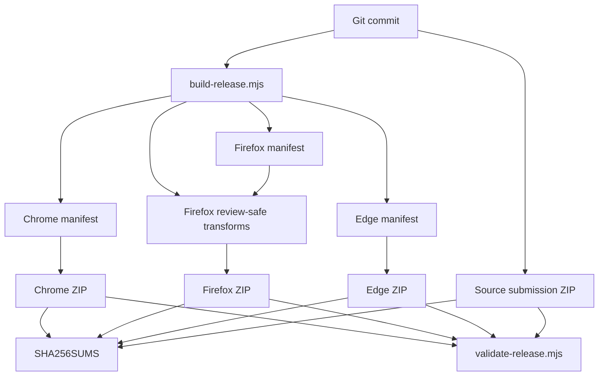
```mermaid
flowchart TD
    A[Git commit] --> B[build-release.mjs]
    B --> C[Chrome manifest]
    B --> D[Firefox manifest]
    B --> E[Edge manifest]

    B --> F[Firefox review-safe transforms]

    C --> G[Chrome ZIP]
    D --> F
    F --> H[Firefox ZIP]
    E --> I[Edge ZIP]

    A --> J[Source submission ZIP]

    G --> K[SHA256SUMS]
    H --> K
    I --> K
    J --> K

    G --> L[validate-release.mjs]
    H --> L
    I --> L
    J --> L
```

Questa è già una **software supply chain** in miniatura.

---

# Parte XLIII — Invarianti cross-browser

## 101. Cosa deve restare uguale

Le differenze non devono cancellare le invarianti comuni.

Per esempio:

```text
stesse feature core
stessi host supportati
stesso storage schema
stessa privacy model
stessi export semantics
stessi message contracts
```

---

## 102. Cosa può cambiare

```text
background environment
offscreen audio path
manifest metadata
locale packaging
vendor review transforms
store notes
```

Una buona architettura rende chiaro quale categoria contiene ogni differenza.

---

# Parte XLIV — Semantic parity

## 103. Binary equality non serve

Chrome e Firefox ZIP non devono essere uguali.
Devono avere:

**semantic parity**.

Cioè:

```text
dato lo stesso scenario utente
otteniamo lo stesso comportamento osservabile
```

entro le differenze deliberate del browser.

---

## 104. Esempio audio

Implementazione:

```text
Chrome → offscreen document
Firefox → content tab
```

Semantic parity:

```text
utente sente la notifica richiesta
```

Questo è il livello giusto su cui confrontare i target.

---

# Parte XLV — Cross-browser regression test

## 105. Cosa testare per feature

Per una feature condivisa:

```text
happy path
fallback path
browser-specific adapter
storage result
cleanup
error result
```

Non basta:

```text
“cliccato in Chrome, funziona”
```

---

# Parte XLVI — Review regressions

## 106. Anche il build può regredire

Immaginiamo un aggiornamento JSZip che reintroduce:

```text
un pattern Function(...)
```

in un punto nuovo.

I test funzionali possono essere tutti verdi.

Ma la submission Firefox può fallire.

Perciò il validator deve vivere nella normale release pipeline, non come script usato soltanto una volta dopo una rejection.

---

# Parte XLVII — Store policy come external contract

## 107. Le policy possono cambiare

Questo è simile a integrare una API esterna.

Noi non controlliamo:

```text
Chrome Web Store policy
AMO review policy
manifest requirements
data declaration requirements
```

Quindi dobbiamo trattarli come un **external contract**.

---

## 108. Conseguenza

Non hardcodiamo per sempre nella nostra testa:

```text
“Firefox richiede X”
```

Prima di una release importante verifichiamo la documentazione corrente.

Le policy sono più dinamiche del codice vendor pinned.

---

# Parte XLVIII — Policy-driven architecture?

## 109. Un rischio

Se inseguiamo ogni warning con una patch locale possiamo deformare il progetto attorno allo store.

La soluzione non è ignorare le policy.

È cercare convergenza con proprietà sane:

```text
no remote executable code
readable source
reproducible build
least privilege
documented dependencies
bounded dynamic behavior
```

Sono utili anche fuori dal processo di review.

---

# Parte XLIX — Che cosa non fare

## 110. Non creare fork permanenti per browser

Evitiamo:

```text
background-firefox.js
background-chrome.js
background-edge.js
```

se differiscono per cinque righe.

Meglio:

```text
shared implementation
+
small adapter
```

---

## 111. Non usare try/catch come compatibility detection universale

Questo:

```js
try {
  chrome.someApi.doThing();
} catch {
  ...
}
```

può essere appropriato in alcuni casi.

Ma non sostituisce:

```text
feature test
manifest awareness
documented support matrix
```

soprattutto se l'errore avviene asincronamente.

---

## 112. Non assumere Chromium = Chrome Store

Edge può condividere il motore ma avere:

```text
metadati
dashboard
market
listing requirements
localization expectations
review process
```

differenti.

---

## 113. Non trattare i warning come rumore

Un warning può essere:

```text
innocuo
futuro breaking change
security smell
false positive
```

Va classificato.

Ignorarlo automaticamente è sbagliato quanto correggerlo automaticamente.

---

## 114. Non modificare vendor senza provenance

Ogni modifica dovrebbe rispondere:

```text
file upstream?
versione?
checksum?
patch?
motivazione?
test?
```

Se non sappiamo rispondere, stiamo aumentando il rischio supply-chain.

---

# Parte L — Un modello architetturale

## 115. Core + adapters + release compiler

Possiamo leggere PlumePilot così:

```text
            DOM / API / domain logic
                     │
          ┌──────────┴──────────┐
          │                     │
 extension runtime adapters   UI adapters
          │
          ↓
      source tree
          │
          ↓
  release "compiler"
          │
   ┌──────┼──────┐
   ↓      ↓      ↓
Chrome Firefox  Edge
```

Uso volutamente la parola **compiler** in senso architetturale.

`build-release.mjs` prende:

```text
source representation
```

e produce:

```text
target representations
```

con regole specifiche del target.

---

# Parte LI — Perché “compiler” è un buon modello mentale

## 116. Front-end

Il source tree.

## 117. Intermediate representation

La lista dei file runtime + manifest base + metadata.

## 118. Target lowering

```text
manifestFor(browser)
Firefox vendor transforms
Edge locale injection
```

## 119. Code generation

ZIP.

## 120. Verification

`validate-release.mjs`.

Questa analogia ci aiuta a separare:

```text
semantica del programma
```

da:

```text
forma richiesta dal target
```

---

# Parte LII — Build invariants come type system della release

## 121. Un'altra analogia

Un type system impedisce alcune classi di programma invalido prima dell'esecuzione.

Il release validator prova a impedire classi di artefatto invalido prima della submission.

Esempio:

```text
Firefox + offscreen permission
```

viene reso un errore di build.

Possiamo quasi leggerlo come:

```text
type FirefoxManifest = {
  background: BackgroundScripts;
  permissions: ["storage"];
  ...
}
```

mentre:

```text
type ChromiumManifest = {
  background: ServiceWorker;
  permissions: ["storage", "offscreen"];
}
```

---

# Parte LIII — Invariants > tribal knowledge

## 122. Conoscenza umana fragile

“Ricordati che per Edge servono le due locale.”

È tribal knowledge.

---

## 123. Conoscenza executable

```js
if (
  JSON.stringify(packagedLocales) !==
  JSON.stringify(["en", "it"])
) {
  throw ...
}
```

È un'invariante eseguibile.

Il secondo approccio scala meglio.

---

# Parte LIV — Compatibilità e graceful degradation

## 124. Non tutte le feature devono essere identiche internamente

Una feature può degradare:

```text
stesso risultato
path diverso
```

oppure, se impossibile:

```text
capability non disponibile
UI lo comunica chiaramente
```

Il problema è il failure silenzioso.

---

# Parte LV — Support matrix documentata

## 125. Un file futuro utile

Per un progetto in crescita avrebbe senso avere una matrice esplicita del tipo:

```text
docs/compatibility.md
```

con:

| Capability | Chrome | Edge | Firefox | Adapter |
|---|---|---|---|---|
| background | service worker | service worker | scripts | build |
| sound | offscreen | offscreen | content tab | runtime |
| storage | local | local | local | shared |
| popup | yes | yes | yes | shared |
| MAIN world | yes | yes | yes* | validated target |
| source review | CWS | Edge | AMO source ZIP | build |

Non perché la tabella sostituisca i test.

Perché rende visibili le promesse.

---

# Parte LVI — Quando aggiungere un compatibility module

## 126. Oggi

Molte differenze sono ancora ben localizzate.

Quindi un enorme:

```text
compat.js
```

potrebbe essere prematuro.

---

## 127. Domani

Se aumentassero:

```text
Safari
Firefox Android reale
browser enterprise
API opzionali
```

potrebbe diventare utile un oggetto capability:

```js
const capabilities = {
  offscreenAudio: ...,
  backgroundWorker: ...,
  ...
};
```

Ma soltanto se riduce realmente branching e duplicazione.

---

# Parte LVII — Debug cross-browser

## 128. Prima domanda: stesso input?

Quando un bug esiste solo in Firefox dobbiamo prima verificare:

```text
stesso account?
stesso corso?
stessa storage state?
stesso manifest?
stessa versione?
```

Altrimenti possiamo attribuire al browser una differenza causata dai dati.

---

## 129. Seconda domanda: stesso artifact class?

Non confrontiamo:

```text
Chrome unpacked source
```

con:

```text
Firefox store ZIP trasformato
```

senza ricordare che non sono lo stesso artifact.

Per riprodurre un problema store-specifico dobbiamo provare il build target reale.

---

## 130. Terza domanda: runtime o package?

Se il browser rifiuta di caricare:

```text
manifest problem
```

Se carica ma la feature fallisce:

```text
runtime problem
```

Se funziona localmente ma store rifiuta:

```text
policy/review problem
```

Questa classificazione restringe molto il search space.

---

# Parte LVIII — Error taxonomy cross-browser

## 131. Possiamo formalizzarla

```text
Syntax incompatibility
API unavailable
Manifest invalid
Lifecycle mismatch
Behavioral timing divergence
Layout divergence
Packaging omission
Policy violation
Reviewer ambiguity
Vendor provenance failure
```

Dare un nome al problema aiuta a non applicare il fix sbagliato.

---

# Parte LIX — Un caso concreto completo: sound notification

## 132. Requirement

```text
riproduci suono locale
```

## 133. Domain API

```text
playNotificationSound(sound, volume, sourceTabId)
```

## 134. Chrome/Edge

```text
offscreen permission
service worker
offscreen document
runtime message
```

## 135. Firefox

```text
background scripts
no offscreen permission
build patch → ensureOffscreenAudioDocument() = false
content-tab fallback
```

## 136. Shared semantics

```text
sound
volume
duplicate suppression
achievement
```

## 137. Artifact validation

Firefox ZIP non deve contenere:

```text
chrome.offscreen
```

Questo è un ottimo esempio end-to-end:

```text
requirement
→ adapter
→ build target
→ validator
```

---

# Parte LX — Un secondo caso: Edge localization

## 138. Requirement

```text
store/runtime metadata localizzati
```

## 139. Edge lowering

```text
manifest strings → __MSG_...__
default_locale → it
_locales/en
_locales/it
```

## 140. Validator

Controlla:

```text
set esatto delle locale
chiavi richieste
nessuna locale Edge negli altri target
```

Ancora:

```text
requirement
→ build
→ artifact invariant
```

---

# Parte LXI — Un terzo caso: readable vendor

## 141. Requirement

```text
reviewable dependency code
```

## 142. Repository

Readable official distributions.

## 143. Firefox target

Deterministic review-safe patches.

## 144. Source package

Original readable files + build instructions.

## 145. Validator

Checksums + pattern scans.

Abbiamo una vera catena di evidenza.

---

# Parte LXII — Cosa significa “cross-browser by architecture”

## 146. Non è scrivere codice generico a tutti i costi

È sapere:

```text
quali parti appartengono al dominio
quali al browser
quali allo store
quali al build
```

e tenere i boundary chiari.

---

## 147. Una frase da ricordare

> **Le differenze inevitabili devono essere locali; le semantiche condivise devono restare globali.**

---

# Parte LXIII — Da backend developer

## 148. Browser come deployment target

È simile a distribuire lo stesso servizio su:

```text
AWS
GCP
on-prem
```

Il dominio non dovrebbe cambiare.

Cambiano:

```text
IAM
runtime
secrets integration
load balancer
deployment manifest
```

---

## 149. Store come control plane

Chrome Web Store, Edge Add-ons e AMO assomigliano in parte a control plane diversi.

Non eseguono il nostro dominio.

Controllano:

```text
come viene impacchettato
come viene dichiarato
come viene revisionato
come viene distribuito
```

---

## 150. Build script come deployment adapter

`build-release.mjs` è quindi paragonabile a:

```text
Terraform module
Docker build target
Kubernetes overlay
```

nel senso che trasforma lo stesso prodotto logico per un environment differente.

L'analogia non è perfetta, ma è utile.

---

# Parte LXIV — Alternative architetturali

## 151. Un manifest universale

Potremmo tentare:

```text
un unico ZIP
```

per più browser.

### Vantaggio

meno artefatti.

### Svantaggi nel nostro caso

```text
offscreen permission
background differences
Edge locales
Firefox transforms
review source
```

rendono il vantaggio piccolo.

---

## 152. WebExtension polyfill

Potremmo adottare una libreria che uniformi:

```text
browser.*
chrome.*
Promise/callback
```

Potrebbe essere utile se il numero di API divergenti aumentasse.

Oggi però non risolverebbe:

```text
manifest
offscreen
AMO review
Edge packaging
```

quindi sarebbe solo una parte della soluzione.

---

## 153. Bundler multi-target

Potremmo usare:

```text
Vite/Rollup/Webpack + target build
```

Avremmo più possibilità di compile-time flags.

Ma introdurremmo:

```text
bundling
source maps
source submission complexity
toolchain dependency
```

Per PlumePilot, che oggi ha source first-party leggibile senza bundle, la semplicità della build Node custom ha vantaggi reali.

---

## 154. Conditional compilation

Una tecnica possibile:

```js
if (__FIREFOX__) ...
```

sostituita dal bundler.

Può funzionare.

Ma tende a spargere conoscenza del target nel codice dominio.

Meglio usarla solo se la differenza non può essere confinata nel packaging/adapter.

---

# Parte LXV — Il costo dei browser-specific artifact

## 155. Più output da mantenere

Tre target significano:

```text
3 manifest
3 ZIP
3 checks
3 store drafts
```

più source AMO.

---

## 156. Il vantaggio

Ogni artifact può essere:

```text
minimo
esplicito
validabile
least privilege
```

La complessità viene spostata nel build, dove può essere automatizzata.

---

# Parte LXVI — Release as code

## 157. Il build script è production code

Se `build-release.mjs` ha un bug, possiamo distribuire un'estensione sbagliata pur avendo:

```text
100% test applicativi verdi
```

Quindi il release tooling merita:

```text
review
test
versioning
invariants
```

come il runtime.

---

# Parte LXVII — Sicurezza supply-chain

## 158. Alcuni threat model

Un dependency artifact potrebbe:

```text
cambiare accidentalmente
essere sostituito
essere patchato localmente
provenire da fonte sbagliata
```

Checksum e provenance riducono questi rischi.

---

## 159. Build dependency

Il builder usa la copia locale leggibile di JSZip.

Quindi persino lo strumento che crea gli ZIP è:

```text
pinned nel repository
```

anziché scaricato all'ultimo momento.

È una scelta piccola ma coerente con la riproducibilità.

---

# Parte LXVIII — Policy vs security

## 160. Non confonderle

Una policy può vietare qualcosa che tecnicamente sarebbe sicuro nel nostro caso.

Una pratica può essere consentita dalla policy ma comunque rischiosa.

Quindi:

```text
policy compliant
≠
security proof
```

e:

```text
technically safe
≠
store acceptable
```

Entrambe le dimensioni contano.

---

# Parte LXIX — Dati e privacy cross-store

## 161. La stessa privacy deve essere descritta in linguaggi diversi

Gli store presentano moduli e categorie differenti.

Il progetto deve mappare:

```text
comportamento reale
```

verso:

```text
Chrome disclosure
Edge disclosure
Firefox data_collection_permissions
privacy policy
review notes
```

---

## 162. Source of truth ideale

La fonte non dovrebbe essere il form di uno store.
Dovrebbe essere:

```text
data-flow reale dell'estensione
```

da cui deriviamo le dichiarazioni.

Altrimenti i dashboard possono divergere dal codice.

---

# Parte LXX — Aggiornamenti e backward compatibility

## 163. Una release cross-browser è anche un upgrade

Dobbiamo pensare:

```text
fresh install
update da versione precedente
storage esistente
permissions
ID
Novità
```

Non basta che il nuovo ZIP si installi da zero.

---

## 164. Firefox cumulative Novità

Il progetto ha persino dovuto gestire in passato una situazione in cui Firefox saltava una release intermedia.

Per questo:

```text
whats-new-firefox.js
```

può differire dalla sequenza Chrome/Edge.

Questo è un caso interessante di:

**release history as input**.

La UI di aggiornamento dipende dal percorso distributivo del target.

---

# Parte LXXI — Ora 2.35.2 riallinea le Novità

Nello snapshot del capitolo:

```text
Chrome
Edge
Firefox
```

presentano tutti le sei card 2.35.2.

Il builder continua però a mantenere:

```text
whats-new.js
scripts/whats-new-firefox.js
```

come sorgenti separate.

Perché la necessità potrebbe tornare.

Questa è una forma di flessibilità controllata.

---

# Parte LXXII — Don't over-unify

## 166. Stesso contenuto oggi ≠ stesso lifecycle per sempre

Potremmo dire:

```text
ora i file sono uguali, eliminiamone uno
```

Ma se Firefox ha una cronologia release differente, il costo della piccola duplicazione può essere inferiore al costo di reintrodurre branching complesso nel builder.

Questo è un trade-off.

---

# Parte LXXIII — Quando una differenza deve sparire

## 167. Compatibility code ha una scadenza

Ogni workaround dovrebbe avere una domanda associata:

```text
questa differenza esiste ancora nelle versioni minime supportate?
```

Se la risposta diventa no:

```text
rimuoviamo il workaround
```

Altrimenti il compatibility layer cresce per accumulo geologico.

---

# Parte LXXIV — Minimum version come leva di semplificazione

## 168. Aumentare minimum version può ridurre codice

Se una API diventa universalmente disponibile sopra una certa versione:

```text
supportare browser più vecchi
```

ha un costo.

La decisione è prodotto + engineering:

```text
quanti utenti perdiamo?
quanto codice eliminiamo?
quali bug evitiamo?
```

---

# Parte LXXV — Fonti primarie prima delle tabelle casuali

## 169. Compatibilità cambia

Quando dobbiamo sapere se una API è supportata:

preferiamo:

```text
MDN
Chrome for Developers
Firefox Extension Workshop
specifica ufficiale
```

e verifichiamo la data.

Non affidiamoci a un vecchio post Stack Overflow come contratto.

---

# Parte LXXVI — Metodo operativo per una feature nuova

## 170. Checklist

Quando una futura feature introduce una nuova API browser:

1. Definisci il requisito di dominio.
2. Cerca la documentazione ufficiale per ogni target.
3. Costruisci la capability matrix.
4. Decidi runtime detection vs build specialization.
5. Mantieni il core comune.
6. Introduci adapter piccoli.
7. Aggiungi artifact invariants.
8. Testa almeno un failure path.
9. Aggiorna review documentation se necessario.
10. Verifica le policy correnti prima della submission.

---

# Parte LXXVII — Esercizio 1

Abbiamo questa esigenza:

```text
copiatura automatica negli appunti
```

e un'API disponibile solo in alcuni contesti.

Domande:

1. È Web API o extension API?
2. Puoi usare capability detection?
3. Serve un permission?
4. Cosa deve succedere se manca?
5. La differenza è runtime o manifest?
6. Come testeresti l'artefatto?

---

# Parte LXXVIII — Esercizio 2

Supponi che Edge richieda una terza locale:

```text
fr
```

Dove faresti la modifica?

Soluzione desiderabile:

```text
edgeLocales
+
messages file
+
validator
```

non:

```text
modifica manuale allo ZIP dopo il build
```

---

# Parte LXXIX — Esercizio 3

Un upgrade PDF.js modifica il pattern usato da:

```text
replaceExactly()
```

e la build Firefox fallisce.

È un bug del builder?

Non necessariamente.

Il fallimento è intenzionale.

Prima dobbiamo:

```text
ispezionare upstream
capire la nuova semantica
decidere se la patch serve ancora
aggiornare transform + validator
```

---

# Parte LXXX — Esercizio 4

Il pacchetto Firefox funziona localmente ma AMO segnala:

```text
unknown minified code
```

Costruisci una diagnosi per livelli:

```text
runtime?
manifest?
artifact?
vendor provenance?
policy?
source submission?
```

---

# Parte LXXXI — Esercizio 5

Chrome e Firefox mostrano lo stesso popup, ma solo Chrome taglia il bordo destro.

Perché sarebbe sbagliato iniziare da:

```js
if (isChrome) width -= 8;
```

senza prima misurare:

```text
scrollbar
viewport
box sizing
overflow
```

?

---

# Parte LXXXII — Esercizio 6

Perché questa condizione:

```js
if (chrome.offscreen?.createDocument)
```

è migliore di:

```js
if (!isFirefox)
```

ma non può sostituire la specializzazione del manifest?

---

# Parte LXXXIII — Concetti da portarsi dietro

## 171. Compatibility è multidimensionale

```text
language
API
manifest
lifecycle
package
policy
review
UX
```

---

## 172. Core comune, boundary specifici

Non duplicare il dominio per adattarti al browser.

---

## 173. Feature detection quando possibile

Chiedi alla capability, non al brand.

---

## 174. Build specialization quando necessario

Manifest e packaging sono ottimi candidati per differenze compile/build-time.

---

## 175. Artifact tests

Testa ciò che distribuirai, non soltanto ciò che hai nel repository.

---

## 176. Fail closed

Se una patch target-specific non può più essere applicata con certezza:

```text
interrompi la build
```

---

## 177. Reviewability è engineering

Readable source, provenance e riproducibilità non sono burocrazia separata dal software.

---

## 178. Semantic parity > implementation parity

Browser diversi possono usare adapter differenti e mantenere lo stesso comportamento utente.

---

## 179. Determinismo riduce rumore

Timestamp, ordering e checksum controllati rendono più facile verificare gli artifact.

---

## 180. Store policy è un external contract

Va riletta periodicamente e non memorizzata una volta per sempre.

---

# Parte LXXXIV — Una tabella finale

| Problema | Chrome | Edge | Firefox | Strategia PlumePilot |
|---|---|---|---|---|
| background | service worker | service worker | scripts | build specialization |
| audio senza DOM | offscreen | offscreen | tab fallback | capability + fallback |
| permission offscreen | sì | sì | no | target manifest |
| add-on ID Gecko | no | no | sì | target manifest |
| data declarations Gecko | no | no | sì | target manifest |
| locale store runtime | base | `_locales` | base | package injection |
| readable vendor | sì | sì | sì | pinned readable upstream |
| review-safe vendor transforms | no | no | sì | deterministic build patch |
| source submission | no | no | sì | dedicated source ZIP |
| checksum artifact | sì | sì | sì | SHA256SUMS |
| UI timing/layout workaround | quando serve | quando serve | quando serve | localized behavioral fix |

---

# Parte LXXXV — Ulteriori letture

## 181. Background model

MDN:

https://developer.mozilla.org/en-US/docs/Mozilla/Add-ons/WebExtensions/manifest.json/background

Chrome Manifest V3 migration:

https://developer.chrome.com/docs/extensions/develop/migrate/checklist

---

## 182. Offscreen API

Chrome for Developers:

https://developer.chrome.com/docs/extensions/reference/api/offscreen

---

## 183. Firefox browser-specific settings

MDN:

https://developer.mozilla.org/en-US/docs/Mozilla/Add-ons/WebExtensions/manifest.json/browser_specific_settings

---

## 184. AMO policies e source submission

Firefox Extension Workshop:

https://extensionworkshop.com/documentation/publish/add-on-policies/

https://extensionworkshop.com/documentation/publish/source-code-submission/

https://extensionworkshop.com/documentation/publish/third-party-library-usage/

---

## 185. Chrome Web Store code readability

Chrome for Developers:

https://developer.chrome.com/docs/webstore/program-policies/code-readability

---

# Parte LXXXVI — Recap

PlumePilot parte da un'unica codebase.

Ma il prodotto distribuito non è un unico artefatto.

La pipeline produce:

```text
Chrome ZIP
Firefox ZIP
Edge ZIP
AMO source ZIP
SHA256SUMS
```

perché i target condividono molto ma non tutto.

Le differenze principali vengono confinate in:

```text
manifest generation
permissions
background model
offscreen fallback
Edge locales
Firefox review-safe transforms
release validation
```

mentre il dominio rimane il più possibile comune.

La lezione più importante non è:

```text
come supportare Firefox
```

o:

```text
come pubblicare su Edge
```

È una lezione di architettura più generale:

> **Quando una piattaforma esterna impone differenze inevitabili, concentriamole in adapter e build boundary verificabili invece di lasciarle contaminare il dominio.**

E soprattutto:

> **Il software che consegniamo non è il repository. È l'artefatto prodotto dalla nostra supply chain.**

---

# Prossimo capitolo

## 14 — Debug, test e regressioni

Adesso abbiamo tutti gli ingredienti per studiare uno degli aspetti più istruttivi di PlumePilot.

Non:

```text
come scrivere test in astratto
```

ma:

```text
come un bug reale diventa conoscenza permanente
```

Vedremo casi come:

```text
accordion chiusi
autoplay regressions
chapter routing
first-incomplete
Firefox review
EPUB fidelity
UI synchronization
hidden tabs
duplicate operations
```

e costruiremo il percorso:

```text
symptom
  ↓
reproduction
  ↓
hypothesis
  ↓
instrumentation
  ↓
root cause
  ↓
regression test
  ↓
invariant
```

Il vero obiettivo sarà capire quando un bug smette di essere semplicemente “corretto” e diventa invece **una nuova proprietà formalizzata del sistema**.

---

# 14 — Debug, test e regressioni

## Trasformare un bug in conoscenza permanente

> **Snapshot di riferimento del capitolo**  
> Questo capitolo usa il candidato **PlumePilot 2.35.2**, branch `feat/ui-ux-2.35.2`, commit  
> `f6fcb4c29c83ba9150df0be31da04fc91dffb634`.

Un bug corretto oggi può tornare domani.

Un bug corretto e trasformato in:

```text
riproduzione
+ test
+ invariante
```

diventa invece conoscenza permanente del progetto.

Questa è una delle differenze più importanti fra:

```text
"far funzionare il codice"
```

e:

```text
"costruire un sistema che continua a funzionare mentre cambia"
```

PlumePilot è un buon laboratorio perché molte delle sue feature più robuste sono nate da regressioni reali:

```text
accordion chiusi
player riutilizzato
master index stale
display_order ripetuti
tab nascosto
builder duplicato
collisioni fra piattaforme
layout popup differenti
vendor code rifiutato dagli store
```

Ogni caso ci obbliga a fare una domanda più precisa di:

> **“Dov'è il bug?”**

La domanda utile è:

> **“Quale assunzione del nostro modello era falsa?”**

E, subito dopo:

> **“Come facciamo a impedire che la stessa assunzione torni inosservata?”**

---

# Parte I — Il ciclo completo del debugging

## 1. Dal sintomo all'invariante

Il ciclo ideale è:

```text
sintomo
  ↓
riproduzione
  ↓
osservazione
  ↓
ipotesi
  ↓
esperimento
  ↓
root cause
  ↓
fix minimo
  ↓
regression test
  ↓
invariante
```

Molti processi si fermano a:

```text
fix minimo
```

ed è lì che nasce il debito.

---

## 2. Sintomo ≠ root cause

Consideriamo:

```text
"l'autoplay si ferma quando chiudo l'accordion"
```

Una possibile reazione superficiale:

```text
riapri l'accordion
```

Ma il problema profondo era:

```text
l'autoplay aveva implicitamente legato
l'identità logica della lezione
alla presenza corrente della sua riga DOM
```

Quindi la root cause non era:

```text
accordion chiuso
```

ma:

```text
DOM temporaneo usato come identità durevole
```

Il fix architetturale diventa:

```text
remember logical identity
        ↓
await
        ↓
re-resolve fresh DOM row
        ↓
validate
```

Il regression test deve proteggere **questa proprietà**, non soltanto un click specifico.

---

# Parte II — Un bug è una confutazione del modello

## 3. Debugging come metodo scientifico

Possiamo descriverlo così:

```text
modello mentale
   ↓ predice
comportamento atteso
   ↓ confronta
comportamento reale
```

Se divergono:

```text
il modello è incompleto
o
l'implementazione viola il modello
```

Il debugger serve a capire quale delle due.

---

## 4. Esempio: master index

Modello iniziale:

```text
master percentage == 100
        ↓
capitolo completo
```

Esperienza reale:

```text
master == 100
ma
attività ancora incompleta
```

Nuovo modello:

```text
master percentage
      =
euristica / indice

detail response
      =
evidenza più forte

visual fallback
      =
ultima verifica locale
```

Il bug ha raffinato l'architettura.

---

# Parte III — Prima regola: riproduci

## 5. “Ogni tanto succede” non basta

Un bug difficilmente riproducibile produce fix fragili.

Una buona riproduzione definisce:

```text
precondizioni
azioni
timing
stato iniziale
risultato atteso
risultato reale
```

Esempio:

```text
dato:
- capitolo 1 corrente
- ultimo video completo
- primi capitoli successivi completi
- capitolo 5 con video incompleto
- "Salta videolezioni completate" attivo

quando:
- termina il video corrente

allora:
- apri direttamente il target nel capitolo 5

non:
- aprire visivamente capitoli 2, 3 e 4
```

Questa descrizione è già quasi un test.

---

## 6. Riduci il caso

Se il bug appare in un corso di:

```text
80 capitoli
300 video
40 test
```

cerchiamo il minimo modello che conserva la failure:

```text
chapter 1 complete
chapter 2 complete
chapter 3 incomplete
```

Un **minimal reproducer** riduce il search space del debugging.

---

# Parte IV — Separare le dimensioni del problema

## 7. Una matrice di riproduzione

Per una browser extension, le variabili possono essere:

```text
browser
platform
pagina
tab visibility
storage preesistente
autoplay settings
operation running
DOM open/closed
network response
course identity
```

Cambiarne molte insieme confonde la diagnosi.

---

## 8. Metodo one-factor-at-a-time

Se il bug appare solo in Chrome:

prima proviamo:

```text
stesso corso
stesso account
stesse preferenze
stessa versione
stessa attività
```

e cambiamo solo il browser.

Se appare solo in background:

manteniamo il resto uguale e cambiamo:

```text
visible ↔ hidden
```

L'obiettivo è trovare la variabile causale.

---

# Parte V — Debugging di una extension significa scegliere il contesto giusto

## 9. PlumePilot non è un solo programma

Abbiamo almeno:

```text
popup
background
bridge
MAIN-world content
ISOLATED-world content
floating menu
builder pages
generated offline HTML
```

Un `console.log()` nel contesto sbagliato può dirci:

```text
niente
```

anche quando il codice funziona.

---

## 10. Prima domanda: dove dovrebbe essere eseguita questa riga?

Se stiamo debuggando:

```text
chrome.storage.onChanged
```

non ha senso guardare soltanto la console MAIN-world della pagina.

Se stiamo debuggando:

```text
DOM LMS
```

non basta la console del service worker.

Il primo passo è sempre identificare:

```text
execution context
```

---

# Parte VI — MAIN world vs isolated world

## 11. Stesso documento, global diversi

Due script possono vedere lo stesso DOM ma non lo stesso:

```text
window variables
monkey patch
function identity
```

Questo è essenziale quando debugghiamo:

```text
fetch interception
window.postMessage
bridge
```

---

## 12. Failure tipica

Supponiamo:

```text
commission-interceptor.js
```

pubblichi un evento MAIN-world.

Il bridge isolated non lo inoltra.

La domanda non è:

```text
"l'API ha risposto?"
```

ma:

```text
1. request partita?
2. interceptor l'ha vista?
3. postMessage partito?
4. bridge ha ricevuto?
5. runtime message partito?
6. background ha persistito?
```

Stiamo seguendo una **pipeline**.

---

# Parte VII — Debug per boundary

## 13. Instrumentation points

Per un flusso:

```text
A → B → C → D
```

loggare soltanto in D è debole.

Meglio osservare i boundary:

```text
A emitted request X
B received request X
B emitted response X
C forwarded X
D stored X
```

Qui diventano utili:

```text
requestId
operationId
sourceTabId
courseCode
lessonNumber
```

---

## 14. Correlation ID

Il Capitolo 2 aveva già incontrato:

```js
requestId
```

nel mini-RPC.

Nel debugging il suo valore è enorme.

Senza correlation:

```text
response arrivata
```

Con correlation:

```text
response per request studywing-...-17
```

Possiamo distinguere operazioni concorrenti.

---

# Parte VIII — Log utili vs rumore

## 15. Un buon log risponde a una domanda

Log debole:

```text
here
test
step 2
```

Log utile:

```text
Course index: module 5 is 100%; skipping detailed API call
```

contiene:

```text
decisione
identità
motivazione
```

---

## 16. Log invariants, non dettagli casuali

Se il problema è routing:

```text
course
lesson number
lp_id
paragraph id
master order
```

sono utili.

Il colore CSS del bottone no.

L'instrumentation deve seguire l'ipotesi.

---

# Parte IX — Hypothesis-driven debugging

## 17. Evitare modifiche a tentativi

Workflow debole:

```text
cambia timeout
riprova
cambia selector
riprova
aggiungi sleep
riprova
```

Workflow migliore:

```text
ipotesi:
la riga DOM viene sostituita durante waitForLessonCompletion

predizione:
l'oggetto row precedente non sarà più === alla riga nuova

esperimento:
salva identity, attesa, query fresca

risultato:
nuova row con stessa identità logica
```

Ora il fix ha una ragione.

---

# Parte X — Test architecture di PlumePilot

## 18. Non c'è un solo tipo di test

Nel repository troviamo test come:

```text
autoplay-collapsed-followups.mjs
first-incomplete-activities.mjs
test-hidden-tab-recovery.mjs
menu-ux.mjs
test-html-notes.mjs
multiversity-storage-isolation.mjs
epub-regions.mjs
release-candidate-*.mjs
```

Non fanno tutti la stessa cosa.

---

## 19. Classificazione

Possiamo dividerli in:

```text
behavioral unit-ish tests
source invariant tests
contract tests
fixture/golden tests
browser integration checks
artifact/release validation
benchmarks
manual smoke tests
```

Questa tassonomia è più utile della parola generica:

```text
test
```

---

# Parte XI — `node:assert/strict`

## 20. Il test runner minimo

Molti test PlumePilot partono con:

```js
import assert from "node:assert/strict";
```

e usano direttamente:

```js
assert.equal(...)
assert.deepEqual(...)
assert.match(...)
assert.ok(...)
```

Non c'è bisogno di Jest per ogni problema.

Node documenta `node:assert` come modulo stabile per verificare invarianti.

---

## 21. Perché `strict`

Con:

```text
strict equality
deep strict equality
```

evitiamo coercizioni sorprendenti.

In un test di identity:

```js
1
```

e:

```js
"1"
```

non devono essere equivalenti per accidente.

---

# Parte XII — `node:vm` come piccolo laboratorio

## 22. Pattern molto usato

Molti test fanno:

```js
const source = readFileSync(
  new URL("../content.js", import.meta.url),
  "utf8"
);

const context = vm.createContext({
  enabled: true,
  ...
});

vm.runInContext(
  extract("async function ...", "function ..."),
  context
);
```

Questo è un pattern particolare.

---

## 23. Cosa otteniamo

Possiamo eseguire una porzione del codice production fornendo global controllati:

```text
fake DOM
fake timers
fake API
fake storage
fake current chapter
fake video
```

quindi:

```text
production function
      ↓
controlled universe
```

---

## 24. Dependency injection senza framework

Normalmente potremmo scrivere:

```js
function advance({
  currentLesson,
  recoverPlaybackLesson,
  sleep,
  ...
}) { ... }
```

e passare esplicitamente le dipendenze.

Il codice attuale usa molte dipendenze di modulo/global.

`vm.createContext()` permette al test di iniettarle comunque.

È una forma pragmatica di:

**dependency injection at test time**.

---

# Parte XIII — Ma `vm` non è una sandbox di sicurezza

## 25. Distinzione importante

Node documenta esplicitamente che:

```text
node:vm
```

permette di eseguire codice in V8 contexts separati, ma:

```text
non è un security mechanism
```

In PlumePilot non stiamo eseguendo codice ostile.

Stiamo costruendo ambienti di test controllati.

---

# Parte XIV — Il vantaggio dei fake piccoli

## 26. Closed accordion test

In:

```text
tests/autoplay-collapsed-followups.mjs
```

abbiamo:

```js
currentLesson: () => null
```

per simulare:

```text
entrambi gli accordion chiusi
```

mentre:

```js
recoverPlaybackLesson:
  async () =>
    ++recoveries === 1
      ? firstRow
      : restoredRow
```

simula una riga DOM ricostruita.

---

## 27. Il test non simula React

Non serve implementare l'intera piattaforma.

Ci interessa una proprietà:

```text
dopo l'await la row vecchia non è più affidabile
```

Il fake simula esattamente quel fatto.

Questo è un buon test double.

---

# Parte XV — Regression test 1: accordion chiuso

## 28. Il requisito

Il test afferma:

```js
assert.equal(
  nextRowReceived,
  restoredRow,
  "advance must use the re-rendered lesson row"
);
```

Questa frase è quasi una specifica.

Non dice:

```text
chiama funzione X
```

Dice:

```text
usa la riga ricostruita
```

---

## 29. Negative case

Subito dopo:

```js
assert.equal(
  nextRowReceived,
  null,
  "a different active lesson must not be advanced"
);
```

Un regression test forte include spesso:

```text
positive path
+
negative guard
```

Perché il fix:

```text
riapri sempre e continua
```

avrebbe potuto sovrascrivere una scelta manuale dell'utente.

---

# Parte XVI — Test di una race senza aspettare il tempo reale

## 30. Timer controllato

Nel test:

```js
setTimeout: (fn) => {
  pendingTimer = fn;
  return 1;
}
```

Non aspettiamo davvero.

Conserviamo il callback.

Poi:

```js
await pendingTimer();
```

Questo ci permette di decidere precisamente:

```text
cosa cambia prima che il timer scatti
```

---

## 31. Deterministic race test

Per esempio:

```text
schedule resume
      ↓
utente avvia di nuovo il video
      ↓
esegui timer
      ↓
non deve avanzare
```

Una race temporale diventa un test deterministico.

---

# Parte XVII — Regression test 2: player riutilizzato

## 32. Stesso `<video>`, contenuto diverso

La piattaforma può riutilizzare lo stesso elemento video.

Il test crea:

```js
const reused = {
  ended: true,
  duration: 60,
  currentTime: 60,
  addEventListener(...)
};
```

poi simula:

```text
ended
play
ended
```

sullo stesso oggetto.

---

## 33. Invariante

```text
ogni video reale terminato
deve poter generare un nuovo advance
```

senza assumere:

```text
nuovo elemento DOM
```

Il regression test protegge esattamente questa semantica.

---

# Parte XVIII — Regression test 3: hidden tab

## 34. Il bug

Un tab nascosto può subire:

```text
timer clamping
rendering sospeso
DOM non aggiornato
```

Un wait può scadere.

Se interpretiamo il timeout come:

```text
pagina rotta
```

potremmo fare reload inutili.

---
## 35. Fake clock

`test-hidden-tab-recovery.mjs` definisce:

```js
let now = 0;

Date: {
  now: () => now
}
```

e:

```js
sleep = async (ms) => {
  now += ms;
  ...
};
```

Nessun secondo reale deve passare.

Il tempo è parte dell'input del test.

---

## 36. Visibility transition

Il test parte:

```text
hidden
```

poi a `now >= 350`:

```text
visible
```

ed emette:

```text
visibilitychange
```

La proprietà verificata:

```js
assert.equal(
  result.rendered,
  true,
  "DOM waits must resume after the tab is visible"
);
```

---

## 37. Secondo invariante

```js
assert.equal(
  reloads,
  0,
  "chapter recovery must not reload a hidden page"
);
```

Questa è una safety property:

```text
hidden page
→ no destructive recovery
```

---

# Parte XIX — Testing safety e liveness

## 38. Safety

“Non deve succedere qualcosa di sbagliato.”

Esempio:

```text
non reloadare hidden tab
non avanzare una lezione diversa
non rispondere automaticamente a un test nel bookmark
```

---

## 39. Liveness

“Prima o poi deve succedere qualcosa di corretto.”

Esempio:

```text
quando il tab torna visibile
il wait deve poter proseguire
```

Un sistema può essere safe ma bloccato.

Oppure live ma pericoloso.

Servono entrambi.

---

# Parte XX — Regression test 4: first incomplete

## 40. Una suite quasi algoritmica

`first-incomplete-activities.mjs` costruisce:

```text
outline
master index
detail response
visible activity
fallback state
```

e combina casi.

Questo non è soltanto un test UI.

È un test dell'algoritmo di discovery.

---

## 41. Property: earliest incomplete

Per:

```text
chapter 2 pending
```

il test pretende:

```js
assert.equal(
  result.entry.lessonNumber,
  2
);
```

e inoltre:

```js
assert.deepEqual(
  requested.map(args => args[1]),
  [1, 2]
);
```

Quindi verifica:

```text
correttezza del risultato
+
costo/ordine della ricerca
```

---

# Parte XXI — Performance può essere parte della specifica

## 42. Un test interessante

Con master:

```text
chapter 4 = 80%
others = 100%
```

il test richiede:

```js
requested === [4]
```

Non basta trovare capitolo 4.

Deve usare l'indice per:

```text
non interrogare inutilmente 1,2,3
```

Questo è un **performance invariant**.

---

## 43. Ma senza sacrificare correctness

Se chapter 4 si rivela completo ma chapter 1 è in realtà incompleto:

```js
requested === [4, 1]
```

La suite protegge quindi contemporaneamente:

```text
fast path
+
fallback completeness
```

---

# Parte XXII — Positive + adversarial examples

## 44. Testare soltanto il caso ideale è debole

La suite include:

```text
master all 100%
master stale
ambiguous identity
API failed
missing test metadata
unknown objective percentage
current visible activity
navigation during discovery
```

Questi sono **adversarial cases**.

Non nel senso security.

Nel senso:

```text
input che mette in crisi le nostre assunzioni
```

---

# Parte XXIII — Ternary state nei test

## 45. Known complete / known incomplete / unknown

Un pattern importante:

```text
percentage = 100
percentage = 0
percentageKnown = false
```

Il test verifica che:

```text
unknown
```

non venga interpretato arbitrariamente come:

```text
complete
```

o:

```text
incomplete
```

Questo protegge il modello introdotto nel Capitolo 8.

---

# Parte XXIV — Regression test 5: repeated `display_order`

## 46. Il problema di identity

`playback-master-routing.mjs` costruisce:

```text
Section A:
  1 Alpha
  2 Beta

Section B:
  1 Gamma
  2 Delta
```

Quindi:

```text
display_order
```

si ripete.

---

## 47. Testare l'ambiguità

La suite verifica:

```js
assert.equal(
  playbackCourseRouteMap(ambiguous, outline).size,
  0
);
```

Se non abbiamo abbastanza evidenza:

```text
non mappiamo
```

anziché:

```text
indovinare
```

È un test di **fail-closed identity matching**.

---

# Parte XXV — Test della non-azione

## 48. I test migliori spesso verificano che qualcosa NON avvenga

Esempi reali:

```text
non saltare video durante replay
non aprire capitoli intermedi
non submit test dal bookmark
non reloadare hidden tab
non usare route ambigua
non nascondere cancel control
```

Questi casi proteggono side effect pericolosi.

---

# Parte XXVI — Test dei contract di storage

## 49. Multiversity isolation

Con il supporto a più università nasce il rischio:

```text
exam_id 7 Pegaso
exam_id 7 Mercatorum
```

Se usiamo soltanto:

```text
7
```

come identity:

```text
collisione
```

---

## 50. Il test costruisce la collisione apposta

`multiversity-storage-isolation.mjs` salva simultaneamente:

```text
pegaso: exam_id 7
mercatorum: exam_id 7
```

e poi pretende entrambe.

Questo è un **collision test**.

---

## 51. Concurrency inclusa

Il test usa:

```js
await Promise.all([
  storePegaso(),
  storeMercatorum()
]);
```

Quindi non verifica soltanto l'identità.

Verifica anche che la serializzazione delle write non perda uno dei due update concorrenti.

---

# Parte XXVII — Test di backward compatibility

## 52. Legacy key

La stessa suite verifica che:

```text
SAME
```

senza platform prefix venga ancora interpretato come legacy Pegaso.

Ma non come Mercatorum.

Questo è un test di migration semantics.

---

## 53. Perché è importante

Una migrazione non deve soltanto:

```text
leggere nuovo formato
```

Deve definire:

```text
cosa significa il vecchio formato
```

Il test lo rende esplicito.

---

# Parte XXVIII — Source invariant tests

## 54. Non tutti i test eseguono davvero la feature

`ui-mode-invariants.mjs` contiene assertion come:

```js
assert.match(
  popupHtmlSource,
  /id="chapterLimitValue" .../
);
```

oppure:

```js
assert.ok(
  contentSource.indexOf("if (thresholdReached)") <
  contentSource.indexOf("if (sessionLimitReached)")
);
```

Questi sono test sul sorgente.

---

## 55. Cosa proteggono bene

Sono ottimi per invarianti strutturali semplici:

```text
asset incluso nel manifest
ordine di due guardie
elemento presente
default dichiarato
file caricato prima di un altro
CSS rule esistente
```

Costano pochissimo.

---

# Parte XXIX — Cosa proteggono male

## 56. Source match ≠ comportamento

Questo test:

```js
assert.match(
  source,
  /someFunction/
);
```

dimostra:

```text
la stringa esiste
```

non:

```text
la funzione funziona
```

Perciò i source tests devono integrare, non sostituire, i behavioral tests.

---

# Parte XXX — Structural tests come architecture tests

## 57. Un uso molto valido

In `menu-ux.mjs` troviamo:

```js
assert.ok(
  scripts.indexOf("menu-ux.js") <
  scripts.indexOf("floating-menu.js")
);
```

Qui l'ordine di caricamento è un contratto architetturale.

Il test sul manifest è perfettamente appropriato.

---

## 58. Architecture test

Possiamo chiamare questa categoria:

**architecture tests**.

Verificano cose come:

```text
dipendenza A prima di B
layer X non importa Y
manifest contiene asset
shared module presente in entrambe le UI
```

Non cercano di simulare l'utente.

Proteggono la forma del sistema.

---

# Parte XXXI — Test del generated output

## 59. HTML quiz

`test-html-notes.mjs` fa una cosa interessante.

Esegue:

```text
test-builder.js
```

con:

```text
fake document
fake storage
fake job
```

poi clicca logicamente:

```text
downloadHtml
```

e cattura il `Blob`.

---

## 60. Verifica il prodotto generato

Il test apre il testo del Blob e controlla:

```text
note key
toolbar
review filters
theme
Unicode
signature
sanitization calls
```

Questo è più forte di testare soltanto:

```text
funzione generateHtml()
```

perché osserva l'artefatto finale.

---

## 61. E verifica persino che lo script sia parsabile

La suite estrae:

```html
<script> ... </script>
```

e fa:

```js
new Function(script);
```

Qui l'obiettivo non è eseguire codice remoto.

È usare il parser JS locale come syntax check del documento generato.

---

# Parte XXXII — Test del browser reale

## 62. Node non può riprodurre tutto

Un fake DOM non ci dirà realmente:

```text
font caricato?
focus visibile?
scroll corretto?
Shadow DOM layout?
checkbox accent?
clipping?
animation?
```

Per questo la 2.35.2 include:

```text
scripts/check-menu-ux-browser.mjs
```

che esegue popup e floating controller in Chromium con uno store extension mock condiviso.

---

## 63. Browser integration layer

Questo livello verifica casi come:

```text
Back / Escape
focus restoration
settings sync
layout sync
hidden active operation
font loading
disclosure scrolling
runtime exceptions
```

Sono proprietà difficili da validare con sole regex.

---

# Parte XXXIII — E2E e internal state

## 64. Cosa suggerisce anche Chrome

La documentazione Chrome sui test end-to-end consiglia, quando possibile, di basare gli integration test su ciò che è visibile all'utente invece di legarsi troppo allo stato interno.

Perché?

Se testiamo:

```text
implementation detail
```

ogni refactor rompe la suite anche se il comportamento utente è identico.

---

## 65. Contract-oriented E2E

Meglio verificare:

```text
clic → risultato visibile
setting → UI sincronizzata
operazione → cancel disponibile
```

piuttosto che:

```text
variabile interna foo === 3
```

salvo quando quella variabile rappresenta un contract importante.

---

# Parte XXXIV — Testare service worker termination

## 66. Il debugger può mentire senza volerlo

Chrome documenta un dettaglio molto importante:

```text
aprire DevTools sul service worker
può mantenerlo attivo
```

Quindi un bug di lifecycle può sparire mentre lo stiamo osservando.

È un classico **observer effect** nel debugging.

---

## 67. Conseguenza

Una feature che dipende accidentalmente da:

```text
global memory del service worker
```

può sembrare stabile durante il debug.

Poi fallire in produzione quando il worker viene terminato.

---

## 68. Test esplicito

Chrome documenta anche come terminare il service worker durante un test Puppeteer e verificare che l'estensione continui a rispondere.

Per PlumePilot sarebbe un futuro test molto utile per:

```text
operation recovery
sound state
builder ownership
commission leases
```

---

# Parte XXXV — Flaky test

## 69. Cos'è

Un test flaky:

```text
stesso codice
stesso input
→ a volte passa
→ a volte fallisce
```

È particolarmente pericoloso nei sistemi asincroni.

---

## 70. Cause comuni nel nostro dominio

```text
sleep reale
network reale
DOM timing
animation
service worker lifetime
focus
background tab throttling
ordine eventi
```

---

# Parte XXXVI — Come PlumePilot evita parte della flakiness

## 71. Fake time

Come visto:

```text
Date.now controllato
sleep simulato
timer callback catturato
```

---

## 72. Fake API

Le detail request diventano funzioni deterministiche:

```js
requestLessonWithRetry: async (...) => ({
  ok: true,
  data: ...
});
```

---

## 73. Fake DOM minimo

Costruiamo solo:

```text
row
video
chapter
document visibility
```

necessari all'invariante.

Questa è una forma di **hermetic-ish testing**.

---

# Parte XXXVII — Ma non eliminare tutta la realtà

## 74. Un rischio opposto

Se tutti i test usano fake perfetti:

```text
produzione può fallire
perché il browser vero è diverso
```

Quindi servono livelli complementari:

```text
fast deterministic tests
+
real browser checks
+
manual exploratory smoke
```

---

# Parte XXXVIII — Test pyramid? Non esattamente

## 75. Modello classico

```text
       E2E
     integration
       unit
```

molti unit test, pochi E2E.

---

## 76. Per una extension integrata in un LMS

Abbiamo tante boundary esterne:

```text
browser
DOM host
API host
storage
manifest
store
```

Una forma più realistica è:

```text
pure/VM behavioral tests   ← molti
architecture/contracts     ← molti
browser fixture tests      ← alcuni
artifact validation        ← sempre
live platform smoke        ← pochi ma indispensabili
```

Non è una piramide perfetta.

---

# Parte XXXIX — Test matrix

## 77. Ogni bug dovrebbe suggerire assi

Per autoplay:

```text
completed / incomplete
skip on / off
test policy
accordion open / closed
same / next section
master accurate / stale
visible / hidden
```

Non possiamo testare il prodotto cartesiano completo.

---

## 78. Pairwise thinking

Cerchiamo combinazioni che coprano interazioni importanti.

Esempio:

```text
skip enabled
+
next chapter complete
+
target chapter incomplete
```

ha scoperto una regressione reale.

---

# Parte XL — State transition coverage

## 79. Dal Capitolo 7

Per una state machine non ci interessa soltanto:

```text
line coverage
```

ma:

```text
transition coverage
```

Esempio:

```text
WATCHING → VERIFYING → NEXT_VIDEO
WATCHING → VERIFYING → TEST_STOP
WATCHING → VERIFYING → NEXT_CHAPTER
WATCHING → VERIFYING → THRESHOLD_STOP
```

---

## 80. Guard coverage

Ogni guard critica dovrebbe avere:

```text
true case
false case
```

Per esempio:

```text
busy = false
busy = true
```

oppure:

```text
v === lastVideo
v !== lastVideo
```

---

# Parte XLI — Code coverage non è behavioral coverage

## 81. 100% line coverage può mentire

Una funzione può essere eseguita interamente senza testare:

```text
ordine eventiidentity collision
stale state
race
negative side effect
```

Quindi la domanda migliore è:

> **Quale proprietà del sistema abbiamo dimostrato?**

---

# Parte XLII — Test names come documentazione

## 82. Messaggi delle assertion

Esempio reale:

```text
"master 100% is not evidence
that every activity is complete"
```

Questo non è soltanto utile quando fallisce.

È documentazione dell'architettura.

---

## 83. Un buon regression test racconta la storia

Preferiamo:

```text
hidden DOM timeout must not trigger reload
```

a:

```text
test case 7
```

Fra sei mesi, il primo spiega perché il codice “strano” esiste.

---

# Parte XLIII — Bug archaeology

## 84. Changelog + test + source

Per comprendere un workaround possiamo triangolare:

```text
CHANGELOG
test
production code
```

Il changelog racconta:

```text
perché
```

Il test:

```text
cosa non deve regredire
```

Il source:

```text
come lo implementiamo
```

Questa è una tecnica potente nei progetti longevi.

---

# Parte XLIV — Git bisect come strumento concettuale

## 85. Quando sappiamo che prima funzionava

Se:

```text
v2.34 funziona
v2.35 fallisce
```

Git ci permette di restringere il range.

`git bisect` automatizza la ricerca binaria fra commit good/bad.

Anche senza usarlo letteralmente, il modello è:

```text
history search space
      ↓ dimezza
candidate range
```

---

## 86. Un test automatizzato rende bisect molto più potente

Se abbiamo un comando:

```bash
node tests/foo.mjs
```

possiamo usarlo come oracle:

```text
good / bad
```

e trovare il commit che introduce la regressione.

---

# Parte XLV — Root cause vs contributing factors

## 87. Un bug può avere più cause

Esempio hidden-tab:

```text
timer clamping
+
DOM non aggiornato
+
timeout interpretato come failure
+
reload recovery aggressivo
```

Qual è la root cause?

Spesso è più utile dire:

```text
root design flaw:
timeout was treated as proof of page failure

contributing factors:
hidden tab scheduling + rendering
```

---

# Parte XLVI — Five Whys, ma tecnici

## 88. Esempio

**Perché autoplay ha aperto il capitolo sbagliato?**

Perché route map ha associato `display_order = 1`.

**Perché era ambiguo?**

Perché `display_order` ricomincia in ogni folder.

**Perché lo trattavamo come globale?**

Perché avevamo dedotto identity da un campo presentazionale.

**Perché non avevamo un secondo controllo?**

Perché il primo supportava un solo layout.

**Quale invariante manca?**

```text
non usare una label locale come identity globale
```

Ora il test può proteggerla.

---

# Parte XLVII — Instrumentation temporanea vs permanente

## 89. Debug log temporaneo

Possiamo aggiungere:

```js
console.log(allDOMNodes)
```

per una sessione.

Poi rimuoverlo.

---

## 90. Diagnostic permanente

Può valere la pena mantenere:

```text
operationId
lessonNumber
fallback reason
retry count
```

perché descrive eventi di dominio utili anche in futuro.

---

# Parte XLVIII — Privacy del debugging

## 91. Non loggare per default dati sensibili

Una extension opera su:

```text
contenuto universitario
sessioni autenticate
esami
```

Un log deve evitare:

```text
token
credential
raw private payload non necessario
```

La diagnostica deve essere:

```text
minima
sanitizzata
locale
```

---

# Parte XLIX — Error messages come strumenti diagnostici

## 92. "Failed" non basta

Confronta:

```text
Request failed
```

con:

```text
API resume discovery could not read module 5;
opening that module directly for visual verification
```

Il secondo comunica:

```text
dove
cosa
fallback scelto
```

---

# Parte L — User-visible errors e developer diagnostics

## 93. Due audience

L'utente ha bisogno di:

```text
"Impossibile leggere questo capitolo.
Provo la verifica visuale."
```

Il developer può aver bisogno di:

```text
lesson 5
error LESSON_DATA_INCOMPLETE
lpId 104
paragraphId 204
```

Non serve mostrare tutto all'utente.

---

# Parte LI — Test del fallback

## 94. Un fallback non è decorativo

Se scriviamo:

```text
API fails → DOM fallback
```

dobbiamo testare:

```text
API fails davvero
fallback selezionato
fallback produce risultato
```

Altrimenti il fallback può marcire inosservato.

---

# Parte LII — First-incomplete: failure injection

## 95. Il test usa:

```js
if (args[1] === failedChapter) {
  return {
    ok: false,
    error: "LESSON_DATA_INCOMPLETE"
  };
}
```

Questa è **failure injection**.

Non aspettiamo che l'API reale fallisca casualmente.

Costruiamo il failure state.

---

## 96. Risultato atteso

```js
assert.equal(
  failed.result.visualVerification,
  true
);
```

Il test non pretende:

```text
nessun errore
```

Pretende:

```text
errore gestito correttamente
```

Questa è resilienza testata.

---

# Parte LIII — Testare cancellation

## 97. Cancellazione è un comportamento

Una Promise abortita non è semplicemente una Promise fallita.

I test dovrebbero distinguere:

```text
failure
cancel
timeout
```

Il Capitolo 5 aveva già separato queste semantiche.

---

## 98. Cancellation latency

Per operazioni lunghe è utile testare:

```text
quanto spesso controlliamo abort signal?
```

Per questo l'EPUB inserisce:

```text
throwIfAborted()
yieldToBrowser()
```

in vari punti.

Un futuro test potrebbe imporre abort durante:

```text
render
encode
regional analysis
ZIP preparation
```

e verificare cleanup.

---

# Parte LIV — Benchmark ≠ test

## 99. Una distinzione importante

Un test risponde:

```text
è corretto?
```

Un benchmark:

```text
quanto costa?
```

---

## 100. Esempio EPUB

Gli script:

```text
benchmark-epub-node.mjs
benchmark-epub-regions.mjs
```

raccolgono:

```text
elapsedMs
asset counts
EPUB bytes
diagnostics
```

Non dovremmo trasformare un singolo timing in:

```text
assert elapsed < 1200ms
```

su qualsiasi macchina.

Sarebbe flaky.

---

# Parte LV — Performance regression testing

## 101. Cosa possiamo rendere stabile

Meglio testare invarianti come:

```text
chapter 5 è l'unica detail call necessaria
cache bounded <= 50
canvas viene rilasciato
no duplicate image asset
```

Questi sono proxy più deterministici del wall-clock.

---

## 102. Timing benchmark separato

Poi misuriamo:

```text
baseline
new implementation
```

sullo stesso ambiente.

Test e benchmark si completano.

---

# Parte LVI — Golden / fixture testing

## 103. EPUB

Una fixture può rappresentare:

```text
tabella
formula
slide visuale
testo normale
mixed page
```

e diventare input stabile.

---

## 104. Golden output

Possiamo confrontare:

```text
struttura XHTML
numero asset
manifest
region bounds
testo estratto
```

senza necessariamente pretendere bytes identici per ogni libreria/browser.

---

# Parte LVII — Snapshot testing: utile ma pericoloso

## 105. Snapshot enorme

Salvare:

```text
intero popup HTML
```

e confrontarlo byte per byte può produrre diff enormi per modifiche irrilevanti.

---

## 106. Preferire semantic snapshots

Meglio estrarre:

```text
tab labels
action order
ARIA states
visible groups
```

e confrontare una rappresentazione semantica.

---

# Parte LVIII — UI regression

## 107. Il problema dei pixel

Bug come:

```text
Preferenze troppo stretta
checkbox accent incoerente
spazio insufficiente
```

non sempre emergono da DOM assertions.

---

## 108. Tre livelli

```text
CSS invariant
browser DOM/layout check
visual screenshot review
```

Per alcune regressioni serve davvero il terzo.

---

# Parte LIX — Screenshot test

## 109. Quando serve

Utile per:

```text
layout
clipping
spacing
theme
font
sprite
```

Meno utile per:

```text
algoritmo autoplay
storage migration
API retry
```

---

## 110. Stabilità

Visual regression richiede controllare:

```text
browser version
font
viewport
DPI
animation
OS rendering
```

altrimenti avremo rumore.

---

# Parte LX — Accessibility regression

## 111. Focus è stato

Nel Capitolo 11 abbiamo visto:

```text
Back
Escape
tab navigation
roving tabindex
```

Un refactor visuale può rompere accessibilità senza cambiare la UI apparente.

---

## 112. Testare focus

Proprietà utili:

```text
open detail → title focused
Escape → opener focused
tab switch → exactly one tabindex=0
hidden panel → not focusable
```

Questi sono behavior tests, non screenshot.

---

# Parte LXI — Test dell'ordine

## 113. Molti bug sono ordering bugs

Esempi:

```text
stop 70% prima del session limit
master incomplete candidates prima dei 100%
current chapter check prima del master refresh
storage write serialized
menu dependency caricata prima del controller
```

---

## 114. L'ordine è parte del contract

Se l'ordine cambia:

```text
stesse funzioni
stessi dati
```

possono produrre comportamento diverso.

Perciò è legittimo testarlo.

---

# Parte LXII — Concurrency testing

## 115. Non servono thread

Un test JS può creare concurrency logica con:

```js
Promise.all([...])
```

e controllare:

```text
read-modify-write
serialization
deduplication
```

---

## 116. Rendere la race più probabile

Nel test storage:

```js
storageGetMany: async (...) => {
  await new Promise(resolve => setTimeout(resolve, 2));
  ...
}
```

Il piccolo delay espone una possibile interleaving.

Poi la queue deve impedire lost update.

---

# Parte LXIII — Race testing più rigoroso

## 117. Barrier controllate

Un pattern futuro migliore:

```text
Promise barrier A
Promise barrier B
```

per decidere esattamente:

```text
task 1 legge
task 2 legge
task 1 scrive
task 2 scrive
```

Questo evita affidarsi a 2ms reali.

---

# Parte LXIV — Determinismo dei test

## 118. Ogni fonte di nondeterminismo va identificata

```text
clock
random
network
browser scheduling
storage state
DOM order
locale
timezone
```

---

## 119. Controllare ciò che conta

Non significa mockare tutto.

Significa sapere quali input devono essere fissi per rendere significativo il risultato.

---

# Parte LXV — Randomness e IDs

## 120. `crypto.randomUUID()`

In produzione è ottimo per:

```text
operationId
jobId
```

In un test che confronta output potremmo iniettare un UUID deterministico.

Non vogliamo snapshot che cambiano a ogni run per motivi irrilevanti.

---

# Parte LXVI — Locale e timezone

## 121. Date test

Se testiamo:

```text
Intl.DateTimeFormat("it-IT")
```

dobbiamo sapere se:

```text
timezone locale
```

influenza il risultato.

Un test robusto controlla o evita dipendenze non necessarie.

---

# Parte LXVII — Test isolation

## 122. Un test non deve dipendere dal precedente

Se test A lascia:

```text
storage.enabled = false
```

e test B assume true:

```text
order-dependent suite
```

è un smell.

---

## 123. Fresh state

Ogni test dovrebbe costruire:

```text
context
stored
document
maps
```

da zero, salvo test espliciti di upgrade/migration.

---

# Parte LXVIII — Regression test vicino al fix

## 124. Quando aggiungerlo

Idealmente:

```text
riproduci failure con test rosso
      ↓
applica fix
      ↓
verde
```

Questo è il classico:

**red → green → refactor**.

---

## 125. Nei bug difficili

A volte dobbiamo prima esplorare manualmente.

Ma prima di considerare chiuso il bug, proviamo comunque a catturare la property in un test.

---

# Parte LXIX — Non ogni bug merita un test enorme

## 126. Proporzionalità

Un typo statico:

```text
"Capitoli" font errato
```

può essere protetto da una semplice CSS invariant.

Non serve avviare tre browser.

---

## 127. Scegli il livello più basso che prova la proprietà

Regola molto utile:

> **Testa al livello più basso che può dimostrare correttamente il comportamento.**

Questo riduce:

```text
tempo
flakiness
complessità
```

---

# Parte LXX — Ma non più basso

## 128. Errore opposto

Se la property è:

```text
focus torna realmente al bottone dopo Escape
```

una regex su:

```text
.focus()
```

non basta.

Serve un ambiente DOM/browser che esegua il comportamento.

---

# Parte LXXI — Testing seams

## 129. Cos'è un seam

Un **test seam** è un punto in cui possiamo sostituire una dipendenza.

Esempi:

```text
fetchImpl
clock
storage wrapper
DOM adapter
API adapter
```

Più chiari sono i seam, più facile è testare.

---

## 130. PlumePilot oggi

Molti seam sono impliciti e vengono costruiti con:

```text
vm globals
```

Funziona, ma segnala anche una possibile evoluzione architetturale.

---

# Parte LXXII — Il limite dell'estrazione testuale

## 131. Pattern attuale

```js
source.slice(
  source.indexOf("async function X"),
  source.indexOf("function Y")
)
```

È estremamente pratico.

Ma dipende dalla struttura testuale.

---

## 132. Refactor innocuo può rompere il test

Se spostiamo:

```text
helper Y
```

prima di X, il comportamento production può essere identico ma il test non trova più il boundary.

Questo è **test brittleness**.

---

# Parte LXXIII — Test brittleness

## 133. Definizione

Un test è brittle se fallisce facilmente per modifiche che non cambiano la property che vuole proteggere.

Esempi:
```text
exact DOM string
exact source ordering non semantico
private variable name
whitespace
```

---

## 134. Non è tutto male

A volte vogliamo intenzionalmente proteggere:

```text
source order
```

come nel caso delle guardie.

La domanda è:

```text
questa forma è davvero parte del contract?
```

---

# Parte LXXIV — Evoluzione futura: moduli testabili

## 135. Estrarre pure helpers

In futuro potremmo spostare:

```text
courseIndexRouteMap
autoplayPresentation
normalizeLayout
candidate ordering
identity matching
```

in moduli con export espliciti.

---

## 136. Vantaggio

Test:

```js
import {
  courseIndexRouteMap
} from "../playback-discovery.mjs";
```

anziché:

```text
slice content.js
create VM
inject globals
```

---

## 137. Ma attenzione al refactor massivo

`content.js` opera in un ambiente particolare e alcune funzioni dipendono fortemente dal DOM host.

Estrarre tutto per “testabilità” può creare abstraction artificiale.

Meglio estrarre:

```text
logica pura / quasi pura
```

non necessariamente ogni funzione.

---

# Parte LXXV — Contract tests

## 138. Boundary esterni

PlumePilot dipende da contratti non controllati:

```text
Multiversity API
DOM shape
Chrome API
Firefox manifest
store policy
```

---

## 139. Contract test

Un contract test verifica:

```text
la forma che ci aspettiamo
```

per esempio:

```text
outline entry contains display_order
lesson response maps lp_id/id
manifest references existing files
```

---

## 140. Contract drift

Quando il provider cambia:

```text
field
DOM nesting
route
```

il test dovrebbe fallire vicino al boundary, non produrre un bug lontano.

---

# Parte LXXVI — Defensive parsing tests

## 141. Test input malformed

Per normalizzatori:

```text
null
missing field
string instead of number
oversized text
duplicate identity
```

sono input importanti.

---

## 142. Obiettivo

Non necessariamente:

```text
accetta tutto
```

ma:

```text
fail predictable
```

---

# Parte LXXVII — Release artifact testing

## 143. Dal Capitolo 13

`validate-release.mjs` verifica lo ZIP finale.

Questo è debugging preventivo.

---

## 144. Failure esempio

Source:

```text
corretto
```

Build:

```text
menu-ux.css dimenticato
```

Runtime source tests:

```text
verdi
```

Artifact validator:

```text
rosso
```

Ogni layer cattura classi di bug diverse.

---

# Parte LXXVIII — Smoke test manuale

## 145. Automatizzare tutto non è realistico

Prima di store submission abbiamo ancora valore in:

```text
install package reale
login demo
open course
popup
floating menu
export
quiz
commission page
```

---

## 146. Ma smoke test deve essere una checklist

Non:

```text
"faccio un giro"
```

Meglio:

```text
1. install
2. course loads
3. popup state matches
4. floating state matches
5. first incomplete
6. PDF/HTML export
7. EPUB builder opens
8. operation cancel
9. preferences persist
10. no console fatal errors
```

La ripetibilità conta anche nel manual testing.

---

# Parte LXXIX — Exploratory testing

## 147. Checklist e exploration non sono opposti

La checklist verifica invarianti conosciuti.

L'exploratory testing cerca:

```text
problemi che non sappiamo ancora nominare
```

Entrambi servono.

---

# Parte LXXX — Dogfooding

## 148. Usare davvero il prodotto

Molte regressioni di PlumePilot sono emerse perché il prodotto veniva usato su:

```text
corsi reali
layout reali
sequenze reali
```

Questo produce input molto più ricchi dei fixture.

---

## 149. Ma il dogfooding non sostituisce il test

Quando troviamo il bug:

```text
esperienza reale
      ↓
minimal reproducer
      ↓
automated regression
```

Altrimenti rimane conoscenza nella memoria del maintainer.

---

# Parte LXXXI — Bug report di qualità

## 150. Informazioni utili

Un report efficace contiene:

```text
versione PlumePilot
browser/versione
piattaforma
pagina/corso
precondizioni
passi
expected
actual
riproducibilità
console error rilevanti
```

---

## 151. Screenshot/video

Sono molto utili per:

```text
layout
timing
focus
navigation
```

meno per:

```text
API identity
storage race
```

Il formato del report deve adattarsi al bug.

---

# Parte LXXXII — Regression severity

## 152. Non tutte le regressioni hanno stesso rischio

Possiamo classificare:

```text
data corruption
wrong side effect
navigation error
operation lock
export failure
UI inaccessible
visual polish
store rejection
```

Questo aiuta a prioritizzare.

---

# Parte LXXXIII — Bug che richiedono fail-closed

## 153. Identity ambiguity

Se non sappiamo quale capitolo corrisponde:

```text
non saltare
```

---

## 154. Test completion ambiguity

Se non sappiamo se un test è completo:

```text
non dichiarare tutto completato
```

---

## 155. Review transform ambiguity

Se `replaceExactly()` non trova esattamente il pattern:

```text
non produrre Firefox ZIP
```

Questi sono tutti la stessa filosofia:

**incertezza + side effect rischioso → stop / fallback sicuro**.

---

# Parte LXXXIV — Bug che richiedono retry

## 156. Non tutto deve fail-closed immediatamente

Una rete transitoria:

```text
retry
```

Un DOM che non ha ancora renderizzato:

```text
wait
```

Una identity ambigua:

```text
non indovinare
```

Il debugging serve anche a classificare l'errore correttamente.

---

# Parte LXXXV — Error taxonomy → recovery policy

## 157. Tabella mentale

| Failure | Recovery |
|---|---|
| rete temporanea | retry/backoff |
| API incomplete | visual fallback |
| DOM not ready | wait/re-observe |
| identity ambiguous | stop/fallback |
| hidden tab timeout | defer |
| stale cache | refresh |
| user cancel | abort/cleanup |
| artifact invariant | fail build |
| store warning | classify/document |

La stessa parola:

```text
errore
```

non basta.

---

# Parte LXXXVI — Debugging async con timeline

## 158. Scrivere gli eventi

Quando una race è difficile:

```text
T0 video ended
T1 advance starts
T2 wait begins
T3 accordion closes
T4 DOM re-render
T5 wait resolves
T6 stale row used
```

La timeline spesso rende evidente il bug prima del debugger.

---

## 159. Sequence diagram

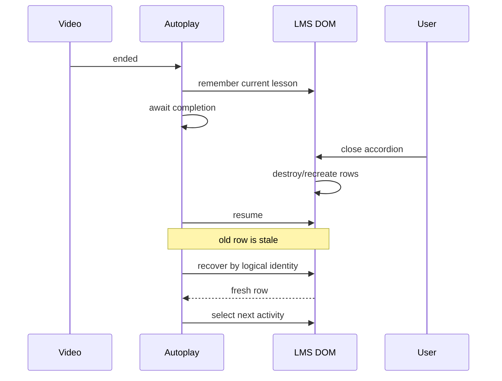
```mermaid
sequenceDiagram
    participant V as Video
    participant A as Autoplay
    participant DOM as LMS DOM
    participant U as User

    V->>A: ended
    A->>DOM: remember current lesson
    A->>A: await completion

    U->>DOM: close accordion
    DOM->>DOM: destroy/recreate rows

    A->>DOM: resume
    Note over A,DOM: old row is stale

    A->>DOM: recover by logical identity
    DOM-->>A: fresh row
    A->>DOM: select next activity
```

Questo diagramma è anche una specifica temporale.

---

# Parte LXXXVII — Debugging storage race con timeline

## 160. Lost update

```text
Task A read {pegaso}
Task B read {pegaso}
Task A write {pegaso, mercatorum}
Task B write {pegaso, utsr}
```

Risultato:

```text
mercatorum perso
```

La queue serializzata cambia la timeline:

```text
A read
A write
B read updated state
B write
```

---

# Parte LXXXVIII — Test delle timeline

## 161. Controlla i punti di sospensione

Ogni:

```js
await
```

è un potenziale punto di interleaving.

Nel test chiediamo:

```text
cosa può cambiare qui?
```

Poi costruiamo il cambio.

---

# Parte LXXXIX — Regression budget

## 162. Ogni feature aumenta lo spazio di stato

Aggiungiamo:

```text
skip videos
test policy
70% stop
chapter limit
bookmark
```

Le combinazioni crescono velocemente.

---

## 163. Test suite come compressione della conoscenza

Non possiamo enumerare tutti gli stati.

Scegliamo casi che rappresentano proprietà:

```text
order preserved
priority respected
manual selection wins
unknown doesn't become complete
active operation remains cancellable
```

Un buon test copre una classe di bug, non una singola sequenza.

---

# Parte XC — Property-based thinking senza library

## 164. Esempio candidate ordering

Property:

```text
all suspected incomplete chapters
must preserve relative course order
```

Possiamo testare:

```text
[100,80,80,100]
→ request [2,3]
```

---

## 165. Futuro: property-based testing

Una library potrebbe generare automaticamente:

```text
percentages
orders
duplicate labels
missing IDs
```

e verificare invarianti.

Sarebbe interessante per:

```text
route mapping
layout normalization
storage migrations
```

---

# Parte XCI — Fuzzing leggero

## 166. Input combinatori

Per normalizzatori possiamo generare:

```text
null
undefined
NaN
-1
huge
duplicate
unknown string
empty array
```

e verificare:

```text
no crash
bounded output
valid schema
```

---

# Parte XCII — Mutation testing

## 167. Domanda più severa

Un test passa.

Ma fallirebbe se rompessimo volontariamente il codice?

Mutation testing prova modifiche come:

```text
< → <=
true → false
remove guard
swap order
```

Se la suite rimane verde:

```text
test insufficiente
```

---

## 168. Dove sarebbe utile

Particolarmente in:

```text
threshold precedence
candidate ordering
identity validation
layout normalization
```

Non è indispensabile oggi, ma è un buon passo futuro.

---

# Parte XCIII — Test smell: assertion troppo generica

## 169. Debole

```js
assert.ok(result);
```

---

## 170. Forte

```js
assert.equal(result.status, "target");
assert.equal(result.entry.lessonNumber, 4);
assert.deepEqual(requested, [4]);
```

Più la failure message ci dice:

```text
quale proprietà è rotta
```

più rapido sarà il debug.

---

# Parte XCIV — Test smell: sleeps nei test

## 171. Debole

```js
await new Promise(r => setTimeout(r, 3000));
```

---

## 172. Migliore

```text
wait for condition
fake timer
explicit promise barrier
event listener
```

Il test diventa più veloce e meno flaky.

---

# Parte XCV — Test smell: mock troppo intelligente

## 173. Se il fake reimplementa production

Supponiamo di creare:

```text
FakeMultiversityEngine
```

con 1000 righe che replica l'LMS.

Ora abbiamo due sistemi da mantenere.

---

## 174. Minimal doubles

Preferiamo fake che modellano:

```text
solo il comportamento rilevante
```

come:

```js
currentLesson: () => null
```

per un accordion chiuso.

---

# Parte XCVI — Test smell: coupling ai dettagli

## 175. Esempio

Testare:

```text
funzione privata chiamata esattamente 2 volte
```

può essere fragile.

Meglio, se possibile:

```text
API requests effettuate = [4,1]
```

perché quello è un effetto osservabile rilevante.

---

# Parte XCVII — Test smell: nessun negative case

## 176. Fix per una regressione può introdurne un'altra

Closed accordion fix:

```text
riapri correttamente
```

ma deve anche garantire:

```text
non sovrascrivere manual selection
```

Perciò il test ha entrambi.

---

# Parte XCVIII — Test smell: exact implementation order non necessario

## 177. Se due implementazioni sono equivalenti

Non blocchiamo un futuro refactor imponendo:

```text
helper A fisicamente prima di helper B
```

a meno che l'ordine di caricamento/esecuzione sia davvero parte del contract.

---

# Parte XCIX — CI come memoria automatica

## 178. Idealmente

Ogni PR esegue:

```text
Node regression suites
browser UX check
release validator quando rilevante
```

e impedisce il merge se rompe un'invariante.

---

## 179. Oggi

Anche se il progetto non usa ancora una pipeline CI completa per tutto, la struttura dei test è già abbastanza vicina a diventarlo.

Il passo architetturale successivo sarebbe:

```text
un singolo comando
→ tutta la suite fast
→ browser checks opzionali/CI
→ release validation
```

---

# Parte C — Test command come public developer interface

## 180. Perché serve

Se esistono 29 file:

```text
node tests/foo.mjs
node tests/bar.mjs
...
```

il maintainer deve ricordare la lista.

Meglio:

```bash
npm test
```

o:

```bash
node scripts/test-all.mjs
```

anche se non vogliamo introdurre npm dependencies.

---

## 181. Test runner semplice

Può:

```text
enumerare tests/*.mjs
escludere benchmark
eseguire in ordine stabile
fermare/fallire
riassumere
```

Questo riduce errori umani.

---

# Parte CI — Test categories nel comando

## 182. Futuro

```text
test:unit
test:browser
test:release
test:all
```

La categoria comunica costo e requisiti.

---

# Parte CII — Browser matrix automatizzata

## 183. Playwright

Playwright permette di eseguire progetti configurati su:

```text
Chromium
Firefox
WebKit
Chrome
Edge
```

Ma per una WebExtension non basta dire:

```text
page.goto()
```

Dobbiamo caricare realmente l'estensione e i suoi contesti.

---

## 184. Non confondere Playwright Firefox con AMO Firefox extension runtime

Un test web in:

```text
Playwright Firefox
```

non dimostra automaticamente che:

```text
manifest Firefox package
background scripts
AMO transforms
```

funzionino.

Serve testare il package target appropriato.

---

# Parte CIII — Test del package reale

## 185. Ideal future flow

```text
build release artifact
      ↓
launch browser
      ↓
load target artifact
      ↓
run smoke E2E
```

Questo avvicina il test a ciò che l'utente installa.

---

# Parte CIV — Store validation non è E2E

## 186. `web-ext lint`

Può verificare classi di problemi del pacchetto.

Non verifica:

```textautoplay corretto
export corretto
UI corretta
```

---

## 187. Complementarità

```text
lint → package/static rules
tests → behavior
manual → real platform
review → external policy
```

Nessuno sostituisce gli altri.

---

# Parte CV — Debugging store rejection

## 188. Sintomo

```text
AMO rejects
```

Non modifichiamo subito il codice.

Prima classifichiamo:

```text
first-party source?
vendor?
manifest?
source package?
policy?
false positive?
```

---

## 189. Reproduction locale

Se il reviewer segnala:

```text
Function constructor
```

creiamo scanner locale che cerca:

```text
Function(
```

nel package **generato**, non solo nel repository.

Da qui è nato il review-safe validator.

---

# Parte CVI — Rejection → invariant

## 190. La trasformazione migliore

```text
store rejection
       ↓
rule understood
       ↓
build change
       ↓
validator
```

Così la stessa rejection non dipende più dalla memoria.

---

# Parte CVII — Test delle release notes

## 191. Anche metadata può regredire

`release-candidate-2.34.0.mjs` controlla:

```text
manifest version
changelog
release notes
AMO README
popup Novità
platform-neutral copy
```

Questo può sembrare “non software”.

Ma un package con:

```text
manifest 2.35.2
AMO README 2.35.1
```

è un release bug reale.

---

# Parte CVIII — Docs-as-code tests

## 192. Quando la documentazione è input operativo

Se un reviewer userà:

```text
AMO_SOURCE_README
```

quel file è parte della delivery.

Vale la pena testarne:

```text
versione
filename
commands
```

---

# Parte CIX — Debugging CSS

## 193. Prima di patchare

Per un clipping:

```text
getBoundingClientRect
computedStyle
scrollWidth/clientWidth
viewport
scrollbar gutter
```

ci dicono più di:

```text
aggiungi 8px
```

---

## 194. CSS invariant + browser measurement

Source test:

```text
overflow hidden presente
```

Browser check:

```text
panel rect dentro viewport
```

Sono due livelli diversi.

---

# Parte CX — Reduced motion

## 195. Un input da testare

Le animazioni devono considerare:

```text
prefers-reduced-motion
```

Un test browser può emulare la preference.

Non è soltanto estetica:

```text
timing di focus/scroll
```

può cambiare.

---

# Parte CXI — Debugging generated files

## 196. PDF/EPUB/HTML hanno un confine differente

Non basta guardare la UI builder.

Dobbiamo ispezionare:

```text
bytes finali
metadata
manifest EPUB
XHTML
links
fonts
images
```

---

## 197. Structured diagnostics

L'EPUB builder accetta:

```js
diagnostics
```

e produce:

```text
pages
assets
mathFontBytes
epubBytes
elapsedMs
```

Questa è instrumentation progettata per test/benchmark.

---

# Parte CXII — Temporary diagnostics object

## 198. Pattern utile

Invece di stampare ogni cosa:

```js
diagnostics.pages.push(record);
```

poi il caller decide:

```text
log
assert
write JSON
ignore
```

Questo separa osservabilità da output.

---

# Parte CXIII — Testability come qualità architetturale

## 199. Codice difficile da testare segnala spesso coupling

Se per testare:

```text
candidate ordering
```

dobbiamo simulare:

```text
intero browser
```

probabilmente logica e side effect sono troppo intrecciati.

---

## 200. Ma non assolutizziamo

Alcune feature sono intrinsecamente browser-integrated.

Il valore sta nel separare:

```text
decision
```

da:

```text
effect
```

quando possibile.

---

# Parte CXIV — Functional core, imperative shell

## 201. Modello utile

```text
input
  ↓
pure decision logic
  ↓
command / target
  ↓
imperative browser effect
```

Per esempio:

```text
master + outline
  ↓
route mapping
  ↓
lesson target
  ↓
openChapter/clickRow
```

Il core è facile da testare.

La shell richiede browser/fake DOM.

---

# Parte CXV — Applicazione futura a PlumePilot

## 202. Discovery engine

Potremmo estrarre:

```text
candidate ordering
identity matching
result classification
```

dal DOM adapter.

---

## 203. UI

`autoplayPresentation()` è già un esempio riuscito:

```text
settings
→ presentation model
```

facilmente testabile.

---

# Parte CXVI — Observability contract

## 204. Alcune informazioni diagnostiche meritano stabilità

Per esempio:

```text
operation.kind
operation.phase
operation.id
```

sono già un piccolo modello osservabile.

UI, background e test possono usarlo.

---

## 205. Evitare log parsing come API

Non dobbiamo far dipendere test da:

```text
stringa esatta di console.log
```

se possiamo esporre una struttura.

I log cambiano spesso.

---

# Parte CXVII — Assert invariants vicino al boundary

## 206. Runtime assert?

In produzione non vogliamo lanciare assert ovunque.

Ma possiamo normalizzare:

```js
if (!validIdentity(...)) return fallback;
```

e testare quella guardia.

---

## 207. Build-time assert

Nel tooling, invece, fallire forte è spesso corretto:

```text
missing file
unexpected manifest
vendor checksum changed
```

Il release builder deve essere severo.

---

# Parte CXVIII — Regression triage

## 208. Quando arriva un nuovo bug

Prima annotiamo:

```text
severity
scope
last known good
first known bad
browser/platform
repro rate
side effect risk
```

---

## 209. Poi scegliamo strategia

```text
high-risk wrong action
→ fail closed first

performance regression
→ benchmark/profiler

layout regression
→ browser measurement/screenshot

race
→ timeline + controlled scheduler

API drift
→ raw response + boundary normalizer
```

---

# Parte CXIX — Una checklist di debug per PlumePilot

## 210. Step 1 — Identità

Quali:

```text
platform
course
section
chapter
lesson
operation
tab
```

sono coinvolti?

---

## 211. Step 2 — Context

Dove gira:

```text
popup
background
MAIN
isolated
builder
```

?

---

## 212. Step 3 — Source of truth

Il dato arriva da:

```text
DOM
API
cache
storage
master index
```

?

---

## 213. Step 4 — Lifetime

Può essere diventato stale durante:

```text
await
reload
tab hide
service worker restart
```

?

---

## 214. Step 5 — Side effect

Qual è il danno se sbagliamo?

```text
click
navigation
test submission
reload
storage write
download
```

---

## 215. Step 6 — Fallback

Esiste un path più sicuro?

---

## 216. Step 7 — Regression test

Qual è il minimo ambiente che riproduce la property?

---

# Parte CXX — Dal bug al test: closed accordion

## 217. Sintomo

Autoplay si ferma.

## 218. Root cause

Stale DOM identity.

## 219. Fix

`recoverPlaybackLesson()`.

## 220. Test

DOM row cambia durante await.

## 221. Invariante

```text
logical lesson identity survives DOM reconstruction
```

---

# Parte CXXI — Dal bug al test: skip completed

## 222. Sintomo

Per arrivare al capitolo 5 vengono aperti 2,3,4.

## 223. Root cause

Search path usa DOM traversal invece di master-guided target.

## 224. Fix

Forward API discovery.

## 225. Test

```text
requests == [5]
```

## 226. Invariante

```text
completed intermediate chapters need not be opened
```

---

# Parte CXXII — Dal bug al test: master 100 stale

## 227. Sintomo

“Tutto completo” falso.

## 228. Root cause

Index trattato come authority.

## 229. Fix

Two-pass + details.

## 230. Test

```text
all master 100
but chapter 5 video incomplete
→ still find 5
```

## 231. Invariante

```text
master 100 alone cannot prove all activities complete
```

---

# Parte CXXIII — Dal bug al test: hidden tab

## 232. Sintomo

Recovery reload loop.

## 233. Root cause

Timeout while hidden interpreted as page failure.

## 234. Fix

Visibility-aware wait/recovery.

## 235. Test

Fake clock + visibilitychange.

## 236. Invariante

```text
hidden timeout cannot trigger destructive recovery
```

---

# Parte CXXIV — Dal bug al test: platform collision

## 237. Sintomo potenziale

Dati Pegaso/Mercatorum con same ID si sovrascrivono.

## 238. Root cause

Identity domain non include platform.

## 239. Fix

Composite scoped keys.

## 240. Test

Concurrent same-ID writes.

## 241. Invariante

```text
platform is part of persistent identity
```

---

# Parte CXXV — Dal bug al test: Firefox review

## 242. Sintomo

Store rejection.

## 243. Root cause

Review-sensitive constructs nei runtime vendor/artifact.

## 244. Fix

Readable upstream + deterministic transforms.

## 245. Test

Package scanner + checksums.

## 246. Invariante

```text
Firefox artifact contains no rejected constructs
```

---

# Parte CXXVI — Dal bug al test: UI 2.35.2

## 247. Sintomi

```text
checkbox accent
spacing
font mismatch
long tab labels
auto-scroll
```

## 248. Root cause

Presentation rules replicate across two surfaces.

## 249. Fix

Shared UX/CSS primitives.

## 250. Test

Source invariants + Chromium controller fixture.

## 251. Invariante

```text
same semantic role → same presentation scale/behavior
```

---

# Parte CXXVII — Cosa rifaremmo meglio nei test attuali

## 252. Primo: meno source slicing nel lungo periodo

È stato molto efficace per crescere velocemente.

Ma un progetto più modulare potrebbe esporre direttamente la logica testabile.

---

## 253. Secondo: runner unico

Riduce il rischio di dimenticare una suite.

---

## 254. Terzo: più browser E2E target-specific

Specialmente:

```text
service worker termination
popup/floating sync
Firefox package smoke
Edge package smoke
```

---

## 255. Quarto: contract fixtures delle API

Dati sanitizzati/versionati possono proteggere i normalizzatori da drift.

---

## 256. Quinto: visual regression selettiva

Soltanto per componenti dove pixel/layout sono realmente parte del contract.

---

# Parte CXXVIII — Cosa NON rifaremmo

## 257. Non sostituiremmo tutti i test con E2E

Sarebbero:

```text
lenti
flaky
difficili da diagnosticare
```

---

## 258. Non sostituiremmo tutto con unit test puri

Perderemmo:

```text
manifest
DOM
Shadow DOM
focus
browser lifecycle
artifact
```

---

## 259. Non misureremmo qualità con coverage %

La qualità sta nelle property protette.

---

# Parte CXXIX — Test strategy futura

## 260. Possibile struttura

```text
tests/unit/
tests/contracts/
tests/regressions/
tests/browser/
tests/fixtures/
scripts/validate-release.mjs
scripts/benchmark-*.mjs
```

Il nome della cartella comunica lo scopo.

---

# Parte CXXX — Fast suite

## 261. Target

Deve essere abbastanza veloce da essere eseguita:

```text
prima di ogni merge
```

Contiene:

```text
Node behavioral
normalization
source invariants
fixture logic
```

---

# Parte CXXXI — Browser suite

## 262. Target

```text
UI
extension contexts
focus
storage synchronization
service worker lifecycle
```

Può essere più costosa.

---

# Parte CXXXII — Release suite

## 263. Target

```text
browser-specific ZIP
manifest
vendor
licenses
source archive
checksums
```

Obbligatoria prima degli store.

---

# Parte CXXXIII — Manual live suite

## 264. Target

Pochi flussi ad alto valore:

```text
real Multiversity
real authentication
real course DOM/API
real export
```

Perché non possiamo controllare completamente la piattaforma esterna con fixture.

---

# Parte CXXXIV — Debugging come riduzione dello spazio di ricerca

## 265. Tutto il capitolo può essere riassunto così

Un bug parte da:

```text
milioni di possibili cause
```

Ogni osservazione elimina ipotesi.

```text
solo Firefox?
→ elimina dominio comune

solo hidden tab?
→ timing/visibility

solo master 100?
→ source hierarchy

solo after await?
→ stale state/race
```

Debugging è search-space reduction.

---

# Parte CXXXV — Test come riduzione futura

## 266. Un regression test fa l'opposto nel tempo

Quando una modifica futura rompe:

```text
closed accordion invariant
```

la suite ci porta immediatamente vicino alla causa.

Riduce il search space **prima ancora che l'utente segnali il bug**.

---

# Parte CXXXVI — Un test è una memoria eseguibile

## 267. Commento

```js
// Don't break closed accordions
```

può essere ignorato.

---

## 268. Test

```js
assert.equal(nextRowReceived, restoredRow);
```

non può essere ignorato durante una suite verde richiesta.

Questa è la potenza di una executable specification.

---

# Parte CXXXVII — Test e refactoring

## 269. Una buona suite cambia il rischio

Senza test:

```text
refactor = paura
```

Con test comportamentali:

```text
refactor = ipotesi verificabile
```

Non elimina il rischio.
Lo rende osservabile più rapidamente.

---

# Parte CXXXVIII — Quando il test fallisce dopo un refactor

## 270. Tre possibilità

```text
1. comportamento realmente rotto
2. test troppo accoppiato all'implementazione
3. requisito intenzionalmente cambiato
```

Non facciamo automaticamente:

```text
update snapshot / change expected
```

Prima classifichiamo.

---

# Parte CXXXIX — Requirement change

## 271. Esempio autoplay

Se decidiamo che:

```text
normal autoplay deve saltare i completati
```

cambiamo volutamente il comportamento.

Il vecchio test:

```text
replay all by default
```

deve fallire.

Poi aggiorniamo:

```text
spec
test
code
docs
```

insieme.

---

# Parte CXL — Tests as change detector, not truth oracle

## 272. Il test codifica una decisione passata

Può essere sbagliato o superato.

La suite non sostituisce il ragionamento.

Ci dice:

```text
hai cambiato una proprietà che prima consideravamo importante
```

Poi decidiamo se era intenzionale.

---

# Parte CXLI — Debugger vs logging vs tests

## 273. Debugger

Ottimo per:

```text
stato istantaneo
stack
scope
breakpoint
```

---

## 274. Logging

Ottimo per:

```text
timeline
eventi distribuiti
produzione locale
```

---

## 275. Test

Ottimo per:

```text
riprodurre
automatizzare
proteggere
```

Nessuno sostituisce gli altri.

---

# Parte CXLII — Browser DevTools lifecycle trap

## 276. Ricordare

Se apriamo DevTools sul service worker:

```text
possiamo modificarne il lifecycle
```

Quindi per bug di termination:

```text
test without attached inspector
```

è essenziale.

---

# Parte CXLIII — Un approccio pratico per bug asincroni

## 277. Scrivi tre colonne

```text
before await
during await
after await
```

Poi elenca ciò che può cambiare:

```text
DOM
enabled
current video
operation
course
tab visibility
storage
```

Questa tecnica trova molte race.

---

# Parte CXLIV — Un approccio pratico per bug di cache

## 278. Scrivi

```text
key
entry
fetchedAt
authority
invalidation
```

Poi chiedi:

```text
stessa identity?
entry fresh?
dato monotono?
cache può mentire?
fallback?
```

---

# Parte CXLV — Un approccio pratico per bug DOM

## 279. Scrivi

```text
logical identity
selector
when queried
node can be replaced?
visibility?
container open?
```

---

# Parte CXLVI — Un approccio pratico per bug API

## 280. Salva una response sanitizzata

Confronta:

```text
assumed schema
actual schema
normalizer output
```

Non debugghiamo direttamente dalla UI se il problema nasce al boundary.

---

# Parte CXLVII — Un approccio pratico per bug release

## 281. Ispeziona l'artefatto

Non il repository.

```text
unzip
manifest
file list
checksum
static scan
```

Il bug può essere stato introdotto dal build.

---

# Parte CXLVIII — Esercizio 1

Un utente segnala:

```text
dopo aver aperto il popup,
autoplay mostra "attivo"
ma il floating menu mostra "in pausa"
```

Costruisci:

```text
hypotheses
instrumentation points
minimal test
```

Quale ruolo ha:

```text
chrome.storage.onChanged
```

?

---

# Parte CXLIX — Esercizio 2

Il bookmark trova capitolo 8 invece del 3.

Master:

```text
3 = 100
8 = 70
```

Detail:

```text
3 contiene un test pending
```

Quale test regressivo scriveresti?

---

# Parte CL — Esercizio 3

Firefox funziona quando DevTools è aperto ma a volte smette di rispondere dopo minuti.

Perché:

```text
lifecycle
```

deve entrare subito nelle ipotesi?

---

# Parte CLI — Esercizio 4

Un test fa:

```js
await sleep(2000);
assert.equal(...)
```

ed è flaky.

Progetta una versione deterministica con:

```text
fake clock
condition
event
o promise barrier
```

---

# Parte CLII — Esercizio 5

Un refactor sposta una funzione in `content.js`.

Dieci test falliscono con:

```text
Missing function boundary
```

ma il browser funziona.

È una regression production o una test-architecture regression?

Come la risolveresti senza disabilitare i test?

---

# Parte CLIII — Esercizio 6

Una nuova release PDF.js cambia checksum.

Il validator fallisce.

Quali passi fai prima di aggiornare il checksum atteso?

---

# Parte CLIV — Esercizio 7

Abbiamo:

```text
button visible
```

ma non raggiungibile con tastiera.

Quale livello di test scegli?

```text
regex source
VM
browser fixture
screenshot
```

e perché?

---

# Parte CLV — Esercizio 8

Il test suite passa ma Edge Store package manca di un locale.

Che tipo di test mancava?

---

# Parte CLVI — Concetti da portarsi dietro

## 282. Regression test

Un test nato per impedire il ritorno di un bug già osservato.

---

## 283. Root cause

La causa strutturale che rende possibile il sintomo.

---

## 284. Minimal reproducer

Il caso più piccolo che conserva la failure.

---

## 285. Test double

Una sostituzione controllata di una dipendenza:

```text
stub
fake
mock
spy
```

---

## 286. Failure injection

Creare intenzionalmente:

```text
timeout
API error
missing data
abort
```

per testare recovery.

---

## 287. Architecture test

Test che protegge la struttura/relazioni del sistema.

---

## 288. Artifact test

Test eseguito sul prodotto costruito, non sul source tree.

---

## 289. Flaky test

Test non deterministico a parità apparente di input.

---

## 290. Hermetic test

Test con dipendenze esterne fortemente controllate.

---

## 291. Golden test

Confronto con un output di riferimento noto.

---

## 292. Transition coverage

Copertura delle transizioni significative di una state machine.

---

## 293. Behavioral coverage

Insieme delle proprietà del comportamento effettivamente protette.

---

## 294. Test seam

Boundary dove una dipendenza può essere sostituita in modo controllato.

---

## 295. Failure oracle

Regola che decide:

```text
pass / fail
```

per un esperimento o test.

---

## 296. Observer effect

L'atto di osservare modifica il comportamento del sistema.

Il service worker mantenuto vivo da DevTools è un ottimo esempio.

---

## 297. Executable specification

Requirement espresso come codice che fallisce quando viene violato.

---

# Parte CLVII — Ulteriori letture

## 298. Node assert

Node.js:

https://nodejs.org/api/assert.html

---

## 299. Node VM

Node.js:

https://nodejs.org/api/vm.html

Ricorda: `node:vm` non è una sandbox per codice non fidato.

---

## 300. Chrome extension testing

Chrome for Developers:

https://developer.chrome.com/docs/extensions/how-to/test/end-to-end-testing

https://developer.chrome.com/docs/extensions/how-to/test/puppeteer

---

## 301. Service worker termination

Chrome for Developers:

https://developer.chrome.com/docs/extensions/how-to/test/test-serviceworker-termination-with-puppeteer

---

## 302. Playwright

https://playwright.dev/docs/running-tests

https://playwright.dev/docs/test-projects

---

## 303. Firefox tooling

Mozilla:

https://extensionworkshop.com/documentation/develop/getting-started-with-web-ext/

---

# Parte CLVIII — Recap

PlumePilot ci mostra che debugging e testing non sono fasi separate.

Il percorso reale è:

```text
utente incontra comportamento inatteso
             ↓
costruiamo una riproduzione
             ↓
identifichiamo context + identity + timeline
             ↓
formuliamo ipotesi
             ↓
strumentiamo il boundary giusto
             ↓
troviamo la root cause
             ↓
correggiamo
             ↓
creiamo regression test
             ↓
formalizziamo l'invariante
```

I test del progetto usano strategie differenti:

```text
Node + assert
VM contexts
fake clock
fake DOM
failure injection
source invariants
browser fixtures
EPUB fixtures
benchmarks
release artifact validators
manual live smoke
```

Nessuna è sufficiente da sola.

La lezione centrale è:

> **Un bug vale più della sua correzione: ci insegna una proprietà del sistema che prima non conoscevamo.**

Se quella proprietà resta soltanto nella testa del maintainer:

```text
può essere dimenticata
```

Se diventa un test:

```text
entra nella memoria eseguibile del progetto
```

---

# Prossimo capitolo

## 15 — Git, branch, PR e release engineering

Dopo aver visto come una regression diventa un test, possiamo studiare come una modifica attraversa il progetto senza distruggere ciò che già funziona:

```text
issue / idea
   ↓
branch
   ↓
commit
   ↓
test
   ↓
pull request
   ↓
review
   ↓
merge strategy
   ↓
version bump
   ↓
artifact
   ↓
store submission
   ↓
tag / release
```

Useremo casi reali di PlumePilot:

```text
integration branch
stacked PR
squash merge
release branch
2.35.1 → 2.35.2
branch riallineato senza cambiare il tree
browser packages
store review
tagging
```

e vedremo perché **Git history, release history e deployed artifact history sono tre cose correlate ma non identiche**.

---

# 15 — Git, branch, PR, build e release engineering

## Il software oltre il codice

> **Snapshot di riferimento del capitolo**  
> Questo capitolo usa il candidato **PlumePilot 2.35.2**, branch `feat/ui-ux-2.35.2`, commit  
> `f6fcb4c29c83ba9150df0be31da04fc91dffb634`.  
> Per ricostruire la storia Git useremo anche release e pull request precedenti, in particolare `v2.35.1` e le PR #26, #31, #34, #39, #40, #41 e #42.

Un progetto software non vive soltanto nei file che vediamo nell'editor.

Esiste contemporaneamente come:

```text
working tree
commit
branch
pull request
tag
release
ZIP
store submission
versione installata dall'utente
```

Queste cose sono collegate.

Ma **non sono la stessa cosa**.

Durante lo sviluppo di PlumePilot abbiamo incontrato un caso che rende questa distinzione particolarmente concreta.

Il branch candidato alla 2.35.2 aveva un commit:

```text
170b21ec...
```

con questo tree:

```text
992149b6...
```

Poi abbiamo ricostruito il branch sopra il vero commit di release 2.35.1 ottenendo:

```text
4d32a8c2...
```

con:

```text
lo stesso tree:
992149b6...
```

ma con parent diverso.

Quindi:

```text
contenuto dei file identico
history diversa
commit SHA diverso
```

È difficile trovare un esempio più chiaro del fatto che:

> **Un commit Git non identifica soltanto “i file”. Identifica uno stato dei file inserito in una storia precisa.**

Da qui partiremo per studiare Git non come insieme di comandi da memorizzare, ma come **modello dati e sistema di release engineering**.

---

# Parte I — Git non è una cartella con versioni

## 1. Il modello mentale sbagliato

Molti iniziano pensando:

```text
Git =
cartella
+ copie precedenti dei file
```

Questo modello funziona finché usiamo soltanto:

```bash
git add
git commit
git push
```

Poi arrivano:

```text
branch
merge
rebase
squash
revert
cherry-pick
tag
```

e tutto sembra arbitrario.

Il problema non sono i comandi.

È il modello.

---

## 2. Gli oggetti fondamentali

Semplificando, Git ragiona con oggetti come:

```text
blob
tree
commit
tag
```

### Blob

Contenuto di un file.

### Tree

Struttura di directory che collega:

```text
path → blob/tree
```

### Commit

Contiene almeno:

```text
tree
parent(s)
author/committer
message
```

### Tag

Può puntare a un commit o ad altro oggetto Git.

Per il nostro ragionamento, il punto più importante è:

```text
commit
  =
tree
+ parent
+ metadata
```

---

# Parte II — Tree: lo stato dei file

## 3. Tree SHA

Un tree Git identifica lo stato della gerarchia di file.

Nel nostro caso:

```text
170b21ec...
```

e:

```text
4d32a8c2...
```

hanno entrambi:

```text
tree 992149b68db9a5a388196ebc20679aaef59352fa
```

Quindi il checkout risultante è lo stesso.

---

## 4. Ma i commit non sono uguali

Il vecchio commit aveva due parent:

```text
2a97f9d8...
1db590c8...
```

Il nuovo commit ha:

```text
parent a8007425...
```

Questa differenza cambia:

```text
ancestry
merge-base
PR comparison
ahead/behind
future merge behavior
commit SHA
```

pur lasciando identici i file.

---

# Parte III — Commit identity

## 5. Perché cambia lo SHA?

L'identità del commit dipende dal contenuto dell'oggetto commit.

Se cambiano:

```text
parent
message
author metadata
tree
```

cambia l'hash.

Per questo:

```text
stesso tree
≠
stesso commit
```

---

## 6. Conseguenza pratica

Due branch possono produrre:

```text
esattamente lo stesso software
```

ma Git può considerarli:

```text
divergenti
```

perché il percorso storico per arrivarci è diverso.

Questo è esattamente ciò che ci è successo con la 2.35.2.

---

# Parte IV — Branch: un riferimento mobile

## 7. Un branch non contiene commit

Concettualmente un branch è soprattutto:

```text
un ref
```

che punta a un commit.

Per esempio:

```text
main
  ↓
a8007425
```

e:

```text
feat/ui-ux-2.35.2
  ↓
f6fcb4c2
```

Quando committiamo sul feature branch:

```text
il ref si sposta
```

---

## 8. Visualizzazione

```text
A --- B --- C   main
           \
            D --- E   feature
```

`main` punta a C.

`feature` punta a E.

I commit precedenti non “appartengono” rigidamente a un branch.

Sono raggiungibili tramite la storia.

---

# Parte V — HEAD

## 9. Dove siamo?

`HEAD` indica normalmente:

```text
il branch attualmente checkout
```

che a sua volta punta al commit corrente.

```text
HEAD
 ↓
feature
 ↓
E
```

In detached HEAD:

```text
HEAD
 ↓
E
```

senza branch intermedio.

---

# Parte VI — Working tree, index, commit

## 10. Tre stati diversi

Quando modifichiamo un file:

```text
working tree
```

Quando facciamo:

```bash
git add
```

la versione preparata entra nell':

```text
index / staging area
```

Quando facciamo:

```bash
git commit
```

creiamo un nuovo commit.

---

## 11. Pipeline

```text
file modificato
      ↓ git add
index
      ↓ git commit
commit
```

Questa separazione permette commit selettivi.

---

# Parte VII — Branch per feature

## 12. Perché non lavorare sempre su `main`?

Perché vogliamo poter avere:

```text
main stabile
+
lavoro incompleto isolato
```

Esempio PlumePilot:

```text
fix/autoplay-collapsed-followups
feature/epub-regional-preservation
feat/ui-ux-2.35.2
```

Ogni nome racconta:

```text
intent
```

---

## 13. Il branch come hypothesis container

Un feature branch dice:

```text
“questa sequenza di modifiche
potrebbe diventare parte del prodotto”
```

Non dice ancora:

```text
“questa è una release”
```

---

# Parte VIII — Pull request

## 14. PR non è Git puro

Una pull request è una feature della piattaforma GitHub costruita sopra Git.

Contiene:

```text
base branch
head branch
diff
discussion
review
checks
merge action
```

---

## 15. PR come proposta di transizione

Possiamo leggerla così:

```text
base state
   ↓
proposed changes
   ↓
candidate state
```

La PR #41 dice essenzialmente:

```text
main
   +
UI/UX 2.35.2
   =
candidate 2.35.2
```

---

# Parte IX — Base e head

## 16. Terminologia

In una PR:

```text
base = dove vogliamo arrivare
head = branch che propone modifiche
```

Per #41:

```text
base: main
head: feat/ui-ux-2.35.2
```

---

## 17. Cambiare base cambia il significato della diff

Una stessa head confrontata con:

```text
main
```

o con:

```text
integration branch
```

può mostrare diff completamente diversi.

Per questo le stacked PR devono avere base scelta con attenzione.

---

# Parte X — Stacked PR

## 18. Il caso PR #40

La PR #40:

```text
Improve EPUB math preservation...
```

non era basata direttamente su `main`.

Era:

```text
base:
fix/autoplay-collapsed-followups

head:
feature/epub-regional-preservation
```

Quindi era **stacked** sopra il lavoro autoplay.

---

## 19. Diagramma

```text
main
  \
   A --- B --- C       autoplay branch
              \
               D --- E EPUB branch
```

PR #39:

```text
A+B+C → main
```

PR #40:

```text
D+E → autoplay branch
```

---

## 20. Perché usare stacked PR?

Quando una feature dipende da lavoro non ancora in `main`.

Vantaggi:

```text
diff più piccola
review più focalizzata
dipendenza esplicita
```

---

## 21. Svantaggio

La storia futura diventa più delicata se il branch base viene:

```text
squashed
rebased
riscritto
```

Ed è proprio ciò che ci interessa.

---

# Parte XI — Merge commit

## 22. Merge tradizionale

Supponiamo:

```text
A --- B --- C main
       \
        D --- E feature
```

Un merge può creare:

```text
A --- B --- C ------- M
       \             /
        D -------- E
```

`M` ha:

```text
due parent
```

---

## 23. Cosa preserva

Il merge commit conserva:

```text
commit D
commit E
struttura del branch
punto di integrazione
```

---

# Parte XII — Squash merge

## 24. Idea

Con squash:

```text
D + E + F
```

vengono trasformati in un nuovo singolo commit:

```text
S
```

applicato alla base.

```text
A --- B --- C --- S
```

Il branch originale continua ad avere:

```text
D --- E --- F
```

ma `main` non li contiene come ancestor.

---

## 25. Il caso reale 2.35.1

La PR #39 conteneva:

```text
20 commit
```

Il commit finale su `main`:

```text
a8007425f81792e7570516dbdf1e7fb2cbda4d53
```

ha:

```text
un solo parent
```

ed è diventato il commit della release 2.35.1.

Questo è coerente con uno squash merge.

---

# Parte XIII — Perché squash è attraente

## 26. Main leggibile

Invece di vedere:

```text
fix typo
fix tests
retry
actually fix retry
rename
oops
```

vediamo:

```text
Release 2.35.1:
ordered autoplay and improved EPUB exports
```

La storia di `main` racconta unità logiche più grandi.

---

## 27. PR come unità atomica

Squash interpreta:

```text
una PR
=
una modifica concettuale
```

Questo è molto utile se i commit interni sono iterativi.

---

# Parte XIV — Il costo nascosto dello squash

## 28. Downstream branch

Immaginiamo che 2.35.2 sia stata costruita sopra:

```text
D-E-F
```

della PR 2.35.1.

Dopo squash, `main` contiene:

```text
S
```

che ha gli stessi effetti, ma non gli stessi commit.

Git vede:

```text
D/E/F non sono ancestor di main
```

anche se il loro contenuto è già lì.

---

## 29. Conseguenza

Una compare può dire:

```text
feature branch:
molti commit avanti
alcuni commit indietro
```

e un merge può produrre conflitti.

Non perché il codice sia necessariamente incompatibile.

Perché la genealogia non è più allineata.

---

# Parte XV — Il caso 2.35.2

## 30. Prima del riallineamento

Il candidate branch aveva incorporato la linea originale 2.35.1.

Il commit:

```text
170b21ec139c0f703a4f08809a9e51e479fc413c
```

aveva due parent:

```text
2a97f9d8...
1db590c8...
```

e tree:

```text
992149b6...
```

---

## 31. `main`

La release 2.35.1 era invece:

```text
a8007425...
```

con tree:

```text
b3573ed8...
```

e una history squash.

---

## 32. Il branch appariva divergente

Prima del fix:

```text
feat/ui-ux-2.35.2
24 commit avanti
3 commit indietro
```

rispetto a `main`.

Ma parte di quella divergenza era history noise.

---

# Parte XVI — Un tentativo naturale: merge `main` nel branch

## 33. Strategia standard

Normalmente:

```bash
git checkout feature
git merge main
```

è un'ottima soluzione.

Preserva history e aggiorna il branch.

---

## 34. Perché qui era brutto

Git doveva riconciliare:

```text
squash commit S
```

con:

```text
commit originali D/E/F
```

che rappresentavano gran parte dello stesso cambiamento.

Il PR di sync risultava:

```text
non mergeable
```

---

# Parte XVII — Non forzare un merge che non capiamo

## 35. Principio

Un conflitto non è una richiesta di:

```text
“scegli ours o theirs a caso”
```

È Git che dice:

```text
non posso dedurre automaticamente
l'intento umano
```

Prima dobbiamo capire:

```text
quali contenuti vogliamo preservare
```

---

# Parte XVIII — Content-first reconciliation

## 36. La domanda corretta

Non:

```text
come faccio a convincere Git a mergiare?
```

ma:

```text
qual è il tree finale desiderato?
```

Nel nostro caso:

```text
main 2.35.1 definitivo
+
soli file UI/UX 2.35.2
```

---

## 37. Abbiamo ricostruito il tree

Partendo dal tree di:

```text
a8007425
```

abbiamo sostituito soltanto i file della UI/UX candidate.

Risultato:

```text
tree 992149b6...
```

---

## 38. La sorpresa utile

Era **esattamente lo stesso tree SHA** del vecchio branch.

Quindi:

```text
contenuto candidate corretto
history candidate problematica
```

Questo ci ha dato una prova molto forte.

---

# Parte XIX — Reparenting concettuale

## 39. Nuovo commit

Abbiamo creato:

```text
4d32a8c2...
```

con:

```text
tree:
992149b6...

parent:
a8007425...
```
---

## 40. Risultato

Il candidate UI/UX è diventato:

```text
main 2.35.1
      ↓
4d32a8c2 UI/UX
```

senza cambiare il tree del candidato.

---

# Parte XX — Perché non chiamarlo semplicemente rebase?

## 41. Semanticamente è simile

L'obiettivo è quello di un rebase:

```text
riporre il lavoro sopra una nuova base
```

---

## 42. Tecnicamente

Nel nostro intervento abbiamo costruito direttamente un commit:

```text
tree noto
+
parent noto
```

anziché replayare automaticamente ogni commit.

È più simile a un:

```text
content-preserving reparenting
```

o a una commit reconstruction.

---

## 43. Quando è appropriato?

Solo quando possiamo dimostrare quale tree vogliamo ottenere.

Non è una tecnica da usare alla cieca.

Il fatto che:

```text
old tree == new tree
```

è stato il nostro controllo di sicurezza principale.

---

# Parte XXI — Force update del branch

## 44. Per riallineare il ref

Abbiamo poi spostato:

```text
feat/ui-ux-2.35.2
```

dal vecchio commit al nuovo.

Questo riscrive la history del branch.

---

## 45. Rischio

Se altri developer hanno il branch checkout:

```text
force push
```

può sorprenderli.

Per questo la history rewriting è molto più sicura su:

```text
branch privato/personale
candidate controllato
```

che su:

```text
main pubblico
branch condiviso da molte persone
```

---

## 46. Expected SHA

Quando possibile usiamo un controllo tipo compare-and-swap:

```text
aggiorna il ref
solo se punta ancora al commit che mi aspetto
```

Se nel frattempo qualcuno ha pushato:

```text
fallisci
```

anziché sovrascrivere lavoro nuovo.

È l'equivalente Git di optimistic concurrency.

---

# Parte XXII — Rebase

## 47. Modello

```text
A --- B --- C main
       \
        D --- E feature
```

Dopo:

```bash
git rebase main
```

otteniamo:

```text
A --- B --- C --- D' --- E'
```

---

## 48. Perché D' ed E' sono nuovi commit?

Perché hanno:

```text
parent diversi
```

quindi hash diversi.

Il contenuto delle patch può essere uguale.

La history no.

---

## 49. Quando usarlo

Molto utile per:

```text
feature branch privati
pulire history prima della PR
riallineare una branch non condivisa
```

---

## 50. Quando essere cauti

Se altre persone dipendono dai vecchi hash:

```text
history rewrite
```

crea coordinamento extra.

---

# Parte XXIII — Rebase non è “più corretto” del merge

## 51. Sono modelli diversi

Merge dice:

```text
queste due storie sono esistite
e qui si sono integrate
```

Rebase dice:

```text
riscriviamo la storia della feature
come se fosse partita dalla nuova base
```

Entrambi possono essere appropriati.

---

# Parte XXIV — Squash vs rebase

## 52. Squash

Cambia granularità:

```text
N commit
→ 1 commit
```

---

## 53. Rebase

Cambia ancestry:

```text
parent vecchio
→ parent nuovo
```

mantenendo normalmente più commit.

---

## 54. Squash + downstream branch

È proprio la combinazione che può generare:

```text
content already integrated
but ancestry not shared
```

---

# Parte XXV — Cherry-pick

## 55. Modello

`git cherry-pick X` prende:

```text
la patch introdotta da X
```

e crea:

```text
un nuovo commit
```

sul branch corrente.

---

## 56. È una copia logica, non lo stesso commit

```text
X
```

e:

```text
X'
```

possono introdurre lo stesso diff ma avere hash diversi.

Di nuovo:

```text
same change
≠
same ancestry
```

---

## 57. Quando utile

Per:

```text
hotfix selettivo
portare un singolo fix su release branch
```

---

# Parte XXVI — Revert

## 58. Non cancella la storia

`git revert` crea un nuovo commit che applica l'inverso di un cambiamento precedente.

```text
A --- B --- C
          ↓ revert B
A --- B --- C --- R
```

B resta nella storia.

R ne annulla l'effetto.

---

# Parte XXVII — Il caso 2.34.0

## 59. Una storia reale più complicata

Durante il lavoro verso 2.34.0:

```text
integration/post-2.33.2
```

venne integrato prematuramente in `main`.

La PR #31 era esplicitamente:

```text
restore main to 2.33.2
after accidental integration merge
```

---

## 60. Perché non riscrivere `main`?

Una possibilità tecnica sarebbe stata:

```text
force reset main
```

Ma su una branch pubblica è spesso meglio lasciare una storia esplicita:

```text
merge accidentale
      ↓
commit di ripristino
```

così gli eventi restano auditabili.

---

# Parte XXVIII — History auditability

## 61. Una storia non perfetta può essere migliore di una falsa storia

Un `main` con:

```text
accidental merge
restore commit
```

racconta ciò che è successo.

Un force reset può far sembrare:

```text
che non sia mai accaduto
```

pur avendo magari già triggerato:

```text
CI
clone
store work
collaborator pull
```

---

# Parte XXIX — Il costo dei revert su branch di integrazione

## 62. PR #30 e #32

Nel branch di integrazione ci fu anche:

```text
revert branding
```

seguito da:

```text
restore branding after mistaken revert
```

Questo mostra un'altra proprietà:

```text
revert
```

non è magia.

È una nuova modifica che può a sua volta dover essere corretta.

---

# Parte XXX — Integration branch

## 63. Perché esiste

Prima di 2.34.0:

```text
integration/post-2.33.2
```

serviva a comporre:

```text
supporto Multiversity
branding
EPUB fixes
quiz navigation
release docs
```

prima che tutto entrasse in `main`.

---

## 64. Modello

```text
feature A ─┐
feature B ─┼→ integration → main
feature C ─┘
```

---

## 65. Vantaggio

Possiamo testare:

```text
l'insieme
```

senza destabilizzare `main`.

---

## 66. Svantaggio

Se l'integration branch vive troppo a lungo:

```text
drift
merge complexity
hidden dependencies
```

aumentano.

---

# Parte XXXI — Trunk-based vs integration-heavy

## 67. Due estremi

### Trunk-based

Branch molto brevi, integrazione frequente su `main`.

### Integration branch

Feature accumulate prima della release.

---

## 68. PlumePilot usa un modello ibrido

Per release grandi:

```text
integration
```

Per fix/release più circoscritte:

```text
feature/candidate branch
→ PR → main
```

Non serve aderire dogmaticamente a una scuola.

Serve minimizzare:

```text
rischio + coordinamento
```

---

# Parte XXXII — `main` come promessa

## 69. Che cosa significa main?

Idealmente:

```text
stato integrato
che potremmo ragionevolmente trasformare in release
```

Non necessariamente:

```text
versione già pubblicata
```

---

## 70. Nel nostro progetto

Il release flow spesso è:

```text
candidate branch
      ↓
test
      ↓
version/release prep
      ↓
merge main
      ↓
tag
```

Quindi `main` cambia poco prima del tag.

---

# Parte XXXIII — Release candidate

## 71. Un candidate branch

`feat/ui-ux-2.35.2` è diventato di fatto:

```text
feature branch
→ integration candidate
→ release candidate
```

nel tempo.

Questo può succedere nei progetti piccoli.

---

## 72. Ma il nome rimane storico

Il nome del branch:

```text
feat/ui-ux-2.35.2
```

non cambia automaticamente quando il suo ruolo diventa:

```text
release candidate
```

Il nome è un'indicazione umana, non una garanzia semantica.

---

# Parte XXXIV — Draft PR

## 73. Perché #41 resta Draft

Draft comunica:

```text
non considerare ancora questo lavoro pronto per merge
```

pur permettendo:

```text
diff
review
checks
discussion
```

---

## 74. È una state machine sociale

```text
branch exists
   ↓
draft PR
   ↓
ready for review
   ↓
approved
   ↓
merged
```

Git conserva codice.

GitHub coordina il processo umano.

---

# Parte XXXV — Commit piccoli vs commit di release

## 75. Durante sviluppo

Commit piccoli sono utili:

```text
fix checkbox color
fix spacing
add menu helper
add tests
```

per capire il lavoro.

---

## 76. Su main

Potremmo voler vedere:

```text
Prepare 2.35.2 shared menu UX
```

come unità logica unica.

Da qui l'attrazione dello squash.

---

# Parte XXXVI — Come decidere merge strategy

## 77. Merge commit

Preferibile quando:

```text
branch history è significativa
stacked branches dipendono dagli hash
vogliamo preservare topology
```

---

## 78. Squash

Preferibile quando:

```text
PR è l'unità logica
commit intermedi sono rumorosi
vogliamo main lineare
```

---

## 79. Rebase-and-merge

Preferibile quando:

```text
commit sono già puliti
vogliamo linear history
ma preservare granularità
```

---

## 80. Nessuna scelta è gratis

Ogni strategia ottimizza una cosa:

```text
leggibilità
provenance
topology
bisectability
downstream branch compatibility
```

---

# Parte XXXVII — Bisectability

## 81. Squash trade-off

Se una PR contiene 20 commit, dopo squash:

```text
git bisect su main
```

può dirci:

```text
la regression è nella PR #39
```

ma non quale dei 20 step interni.

---

## 82. Però

Se i 20 commit interni erano:

```text
tentativi intermedi non validi
```

preservarli su main potrebbe peggiorare la bisectability.

Il commit ideale è:

```text
piccolo
coerente
buildable
testable
```

ma nella pratica non sempre lo sviluppo procede così.

---

# Parte XXXVIII — Tag

## 83. Cos'è

Un tag dà un nome stabile a un punto della storia.

Per esempio:

```text
v2.35.1
      ↓
a8007425...
```

---

## 84. Perché è diverso da `main`

`main` si muove.

Il tag dovrebbe rimanere fermo.

```text
main:
a800 → future commits

v2.35.1:
sempre a800
```

---

# Parte XXXIX — Release GitHub

## 85. Tag vs release

Una GitHub Release aggiunge sopra il tag:

```text
titolo
release notes
asset
pagina pubblica
```

Il tag è un concetto Git.

La Release è un concetto della piattaforma.

---

## 86. Esempio reale

L'ultima release pubblicata al momento di questo capitolo è:

```text
v2.35.1
```

con titolo:

```text
PlumePilot 2.35.1 — Autoplay in ordine ed EPUB migliorati
```

Il tag punta esattamente a:

```text
a8007425...
```

---

# Parte XL — Version string vs tag

## 87. Devono essere coerenti

Possiamo avere:

```text
manifest.version = 2.35.2
```

prima che esista:

```text
tag v2.35.2
```

Questo è normale durante release prep.

---

## 88. Ma al rilascio

Vogliamo idealmente:

```text
manifest 2.35.2
tag v2.35.2
release title 2.35.2
ZIP names 2.35.2
AMO README 2.35.2
Novità 2.35.2
store submission 2.35.2
```

---

# Parte XLI — Version drift

## 89. Errore classico

```text
manifest 2.35.2
source README 2.35.1
ZIP plumepilot-v2.35.2
Novità 2.35.1
```

Il runtime può funzionare.

Ma la release è incoerente.

---

## 90. Per questo testiamo metadata

`validate-release.mjs` verifica anche:

```text
versione
Novità
source README
archive names
```

Release engineering è parte del software.

---

# Parte XLII — Semantic Versioning

## 91. Schema

PlumePilot usa versioni:

```text
MAJOR.MINOR.PATCH
```

come:

```text
2.35.2
```

---

## 92. Il significato pratico

Nel progetto:

```text
2.35.0
```

introduce un set sostanziale di feature.

```text
2.35.1
2.35.2
```

sono release incrementali/fix/miglioramenti all'interno della stessa linea.

---

## 93. SemVer non decide il prodotto

Semantic Versioning dà una grammatica utile.

Ma la scelta:

```text
minor o patch?
```

dipende da:

```text
compatibilità
promessa agli utenti
granularità del prodotto
store behavior
```

Per una browser extension consumer non abbiamo una public API classica come una library.

---

# Parte XLIII — Release version come user-facing identity

## 94. Per un'estensione

La versione compare in:

```text
manifest
store
browser extension manager
review notes
generated document metadata
Novità
support reports
```

Quindi è anche uno strumento diagnostico.

---

# Parte XLIV — Preparare store drafts prima del merge

## 95. Processo pratico

Possiamo preparare:

```text
testi
screenshot
review notes
draft listing
```
prima che il candidate sia già su `main`.

Questo riduce il tempo finale.

---

## 96. Ma attenzione

Lo store draft non deve diventare una seconda source of truth.

Se il candidate cambia:

```text
versione
feature
permission
privacy
```

dobbiamo riallineare la bozza.

---

# Parte XLV — Tre clock di release

## 97. Git clock

Quando il codice entra in `main`.

---

## 98. GitHub Release clock

Quando creiamo tag/release.

---

## 99. Store clock

Quando:

```text
submit
review
approve
publish
```

---

## 100. Non coincidono

Possiamo avere:

```text
v2.35.2 su GitHub
ma
Chrome ancora 2.35.1
```

oppure browser diversi su versioni differenti.

La release state è distribuita.

---

# Parte XLVI — Release state machine

## 101. Modello

```text
development
   ↓
candidate
   ↓
packaged
   ↓
submitted
   ↓
in review
   ↓
approved
   ↓
published
```

per ciascuno store.

---

## 102. Con tre browser

```text
Chrome:  published
Edge:    in review
Firefox: submitted
```

è uno stato perfettamente possibile.

---

# Parte XLVII — Perché “release” è ambigua

## 103. Quando diciamo:

```text
“è uscita la 2.35.2”
```

potremmo intendere:

```text
tag creato
GitHub release creata
store submitted
store approved
utenti possono installarla
```

Sono eventi diversi.

---

# Parte XLVIII — Naming preciso

## 104. Meglio dire

```text
candidate
merged
tagged
submitted
approved
published
```

anziché un generico:

```text
released
```

quando lo stato conta.

---

# Parte XLIX — Build artifact

## 105. Il commit non è ciò che installa l'utente

L'utente installa:

```text
ZIP trasformato / package store
```

prodotto da:

```text
build-release.mjs
```

---

## 106. Quindi la catena è

```text
commit
  ↓
build
  ↓
artifact
  ↓
store
  ↓
installed extension
```

Ogni freccia può introdurre un problema.

---

# Parte L — Artifact identity

## 107. Commit SHA

Identifica:

```text
source/history state
```

---

## 108. ZIP SHA-256

Identifica:

```text
bytes esatti distribuiti
```

---

## 109. Version

Identifica:

```text
release logica per utenti/store
```

Sono tre identity diverse.

---

# Parte LI — Provenance chain

## 110. Idealmente possiamo rispondere

```text
da quale commit
è stato generato
questo ZIP
con quale builder
e quale checksum?
```

Questa è release provenance.

---

# Parte LII — Deterministic build

## 111. Dal Capitolo 13

PlumePilot usa:

```text
fixed ZIP timestamp
stable file ordering
fixed compression
local dependencies
```

per ridurre la variabilità dell'output.

---

## 112. Perché conta qui

Se tagghiamo:

```text
v2.35.2
```

dovremmo poter rigenerare il package associato senza “indovinare” quali passaggi manuali erano stati fatti.

---

# Parte LIII — Release build deve partire da tree pulito

## 113. Working tree sporco

Se compiliamo da:

```text
commit X
+
modifiche locali non committate
```

l'artefatto non corrisponde davvero a X.

---

## 114. Regola

Prima di una release:

```bash
git status
```

deve essere compreso.

Idealmente:

```text
nothing to commit, working tree clean
```

---

# Parte LIV — Tag after build o build after tag?

## 115. Due workflow

### Workflow A

```text
merge
tag
checkout tag
build
```

### Workflow B

```text
candidate build
validate
merge exact tree
tag exact commit
rebuild/verify
```

---

## 116. Cosa conta

Non il rituale.

La proprietà:

```text
artifact pubblicato
deve essere riconducibile univocamente
al commit taggato
```

---

# Parte LV — Candidate artifact

## 117. Possiamo buildare prima del merge

È spesso utile per:

```text
smoke test
store validation
web-ext lint
```

---

## 118. Ma dopo il merge

Se il commit finale cambia:

```text
anche solo metadata
```

dobbiamo assicurare che il package pubblicato venga dal commit finale, non da un vecchio candidate.

---

# Parte LVI — Checksums

## 119. `SHA256SUMS.txt`

La release build genera un hash per:

```text
Chrome ZIP
Firefox ZIP
Edge ZIP
source ZIP
```

---

## 120. Questo permette

```text
candidate checksum
vs
final checksum
```

Se cambiano quando non dovrebbero:

```text
investigare
```

---

# Parte LVII — Release notes come product interface

## 121. Changelog tecnico

Può descrivere:

```text
master routing
cache invalidation
Firefox transform
```

---

## 122. Store copy

Deve descrivere:

```text
valore per l'utente
```

---

## 123. Reviewer notes

Devono descrivere:

```text
come verificare la feature
```

Sono tre audience diverse.

---

# Parte LVIII — Una sola modifica, tre descrizioni

## 124. Esempio first incomplete

### Changelog

```text
master-guided two-pass discovery
```

### Store

```text
ricerca più affidabile della prima attività incompleta
```

### Reviewer

```text
open demo course,
click Trova prima attività incompleta,
verify navigation
```

---

# Parte LIX — Release docs non sono duplicazione inutile

## 125. Sono projection

Partiamo da:

```text
stesso cambiamento reale
```

e lo proiettiamo in:

```text
developer language
user language
reviewer procedure
```

---

# Parte LX — Store review come async dependency

## 126. Una volta inviato

Il tempo di pubblicazione dipende da un sistema esterno.

Questo influenza la strategia di release.

---

## 127. Esempio Firefox

A volte Firefox può rimanere:

```text
una versione indietro
```

e la release successiva deve considerare:

```text
upgrade path diverso
Novità cumulative
review notes diverse
```

---

# Parte LXI — Branching e release cadence

## 128. Release frequenti

Riducendo la dimensione del delta:

```text
review più semplice
regression surface minore
rollback mentale più facile
```

---

## 129. Release troppo frequenti

Possono aumentare:

```text
store overhead
review fatigue
version noise
```

---

## 130. Il compromesso PlumePilot

Negli ultimi cicli:

```text
2.35.0
2.35.1
2.35.2
```

le release hanno separato blocchi logici abbastanza chiari.

---

# Parte LXII — Hotfix

## 131. Se main è già avanti

Supponiamo:

```text
main = 2.36 development
store = 2.35.2
critical bug in 2.35.2
```

Non possiamo necessariamente prendere tutto `main`.

---

## 132. Release branch

Potremmo creare:

```text
release/2.35
```

dal tag 2.35.2:

```bash
git switch -c release/2.35 v2.35.2
```

applicare il fix e pubblicare:

```text
2.35.3
```

---

## 133. Poi forward-port

Il fix deve anche entrare nella linea futura.

Possiamo:

```text
merge
cherry-pick
reimplement
```

a seconda della situazione.

---

# Parte LXIII — Main-first vs release-first fix

## 134. Main-first

Fix su main, poi backport.

Buono se:

```text
main è compatibile
```

---

## 135. Release-first

Fix sul branch stabile, poi forward-port.

Buono se:

```text
main è molto diverso
```

---

# Parte LXIV — Store rollback non è Git reset

## 136. Se una release è problematica

Non basta:

```text
git reset --hard v2.35.1
```

Gli utenti hanno già:

```text
2.35.2
```

e gli store richiedono versioni crescenti.

---

## 137. Roll-forward

Spesso dobbiamo pubblicare:

```text
2.35.3
```

che ripristina comportamento precedente.

È un **roll-forward**, non un vero rollback binario.

---

# Parte LXV — Version monotonicity

## 138. Store updater

Gli update ragionano su:

```text
versione nuova > versione installata
```

Quindi non possiamo generalmente “pubblicare di nuovo” 2.35.1 come se 2.35.2 non fosse esistita.

---

# Parte LXVI — Revert code, increment version

## 139. Pattern

```text
bad change in 2.35.2
      ↓
revert logic
      ↓
version 2.35.3
```

History e user version restano monotone.

---

# Parte LXVII — Commit message

## 140. Perché conta

Un commit message diventa:

```text
git log
PR context
bisect clue
release archaeology
```

---

## 141. Buono

```text
Fix autoplay recovery after collapsed accordion
```

---

## 142. Debole

```text
fix
```

Il secondo trasferisce zero conoscenza.

---

# Parte LXVIII — Release commit message

## 143. `a8007425`

Il messaggio:

```text
Release 2.35.1:
ordered autoplay and improved EPUB exports
```

è appropriato per uno squash/release commit.

Rappresenta l'unità logica entrata in main.

---

# Parte LXIX — PR title

## 144. Il titolo deve sopravvivere

Un titolo utile fra sei mesi:

```text
Prepare 2.35.1:
ordered autoplay, incomplete discovery
and improved EPUB exports
```

è migliore di:

```text
update
```

---

# Parte LXX — Branch name

## 145. Nome come metadata

```text
fix/
feature/
integration/
feat/
docs/
release/
```

aiuta a capire l'intento.

Non deve essere perfetto.

Deve essere utile.

---

# Parte LXXI — Delete branch after merge

## 146. Perché

Branch vecchi aumentano:

```text
ambiguità
accidental base selection
UI clutter
```

---

## 147. Ma i commit non spariscono subito

Eliminare il ref non cancella la storia già raggiungibile da:

```text
main
tag
PR refs
```

---

# Parte LXXII — Long-lived open PR

## 148. Nel repository esistono PR storiche ancora aperte

Questo può accadere quando:

```text
lavoro è stato incorporato attraverso altre integration PR
```

ma la PR originale non viene chiusa.

---

## 149. Costo

La dashboard può suggerire:

```text
work still pending
```

quando semanticamente è già shipping.

Una buona hygiene dovrebbe chiudere/annotare PR obsolete.

---

# Parte LXXIII — PR state ≠ feature state

## 150. Una feature può essere pubblicata

anche se la PR originaria:

```text
è ancora open
```

perché il codice può essere entrato via:

```text
integration branch
squash
cherry-pick
```

Di nuovo:

```text
GitHub workflow state
≠
code state
```

---

# Parte LXXIV — Merge conflict

## 151. Cosa significa davvero

Git trova due linee di storia che modificano una stessa regione e non sa quale risultato vogliamo.

Non significa automaticamente:

```text
il codice è incompatibile
```

---

## 152. Semantic conflict

Può esistere anche senza conflict marker.

Esempio:

```text
branch A cambia default a true
branch B assume ancora false
```

Git può mergiare perfettamente.

Il software no.

---

# Parte LXXV — Textual vs semantic merge

## 153. Git risolve testo/struttura

I test devono risolvere:

```text
semantica
```

Per questo:

```text
merge successful
```

non significa:

```text
integration correct
```

---

# Parte LXXVI — Smoke test dopo merge

## 154. Sempre utile quando branch importanti convergono

Specialmente per:

```text
UI
autoplay
storage
release metadata
```

---

# Parte LXXVII — Re-run tests on merged result

## 155. Feature branch tests verdi

non dimostrano che:

```text
feature + latest main
```

sia verde.

Il target reale è il merge result.

---

# Parte LXXVIII — Synthetic merge result

## 156. GitHub PR

Può costruire internamente un merge candidate per valutare:

```text
mergeability
checks
```

Per questo una PR può avere uno SHA di merge virtuale diverso dall'head SHA.

---

# Parte LXXIX — Head SHA vs merge SHA

## 157. Head

Identifica:

```text
ultimo commit del branch PR
```

---

## 158. Merge candidate

Identifica:

```text
come apparirebbe integrato
```

Questi concetti vanno distinti quando leggiamo CI o API GitHub.

---

# Parte LXXX — Tree equality come strumento diagnostico

## 159. Caso 2.35.2

Il confronto:

```text
old tree == rebuilt tree
```

ci ha permesso di dire:

```text
nessun byte del candidate UI/UX è cambiato
```
pur cambiando la history.

---

## 160. È più forte di `git diff` vuoto?

Sono concetti correlati.

Se due commit puntano allo stesso tree:

```text
lo snapshot completo è identico
```

Non stiamo soltanto osservando:

```text
nessuna patch mostrata nel confronto scelto
```

---

# Parte LXXXI — Tree SHA come content identity

## 161. Utile per

```text
prove di equivalenza
history repair
release auditing
```

---

## 162. Ma non sostituisce il commit

Perché perdiamo:

```text
chi
quando
perché
parent
```

---

# Parte LXXXII — Git graph come struttura dati

## 163. Commit graph

È un DAG:

**Directed Acyclic Graph**.

Ogni commit punta ai parent.

Il tempo logico va:

```text
commit nuovo
→ parent vecchio
```

Non possiamo creare cicli.

---

## 164. Merge commit

Ha più parent.

Per questo il graph si riunisce.

---

# Parte LXXXIII — Backend analogy

## 165. Commit come immutable record

Da backend developer possiamo pensare a un commit come un record immutabile:

```text
id = hash(content + links + metadata)
```

---

## 166. Branch come mutable pointer

Simile a:

```text
alias "production-current"
→ immutable revision
```

---

## 167. Tag come immutable-ish release alias

Idealmente:

```text
v2.35.1
→ revision specifica
```

e non viene spostato.

---

# Parte LXXXIV — Event sourcing analogy

## 168. Git ricorda eventi?

L'analogia con event sourcing è utile ma imperfetta.

Git conserva una storia di snapshot collegati, non un log di domain events.

Ma entrambi valorizzano:

```text
immutabilità
history
derived current state
```

---

# Parte LXXXV — Squash come history compaction

## 169. Analogia

Squash assomiglia a una forma di compaction:

```text
molte micro-transizioni
→ una transizione logica
```

Ma perdiamo dettaglio storico sulla mainline.

---

# Parte LXXXVI — Rebase come history rewrite

## 170. Analogia

Cambiamo:

```text
causal parent
```

delle modifiche.

Non stiamo mutando i vecchi commit.

Creiamo commit nuovi.

I vecchi possono rimanere raggiungibili altrove.

---

# Parte LXXXVII — Immutabilità Git

## 171. “Riscrivere un commit” è una scorciatoia linguistica

In realtà:

```text
non modifichiamo commit X
creiamo X'
e spostiamo un ref
```

Questo è importante.

---

# Parte LXXXVIII — Force push

## 172. Cosa fa davvero

Non cambia gli oggetti.

Sposta il branch ref su una history differente.

---

## 173. Perché è pericoloso

Un collaboratore può avere:

```text
local ref → old history
remote ref → new history
```

e dover riconciliare consapevolmente.

---

# Parte LXXXIX — Protected main

## 174. Una regola sana

Su branch pubbliche/importanti:

```text
no casual force push
```

e preferibilmente:

```text
PR
checks
review
```

---

# Parte XC — Code review

## 175. Review non è soltanto trovare bug

Serve a trasferire conoscenza:

```text
perché questa scelta?
quale invariant?
quale fallback?
quale migration?
```

---

## 176. Una buona PR facilita review

Con:

```text
scope chiaro
description
test plan
screenshots quando UI
risk areas
```

---

# Parte XCI — PR troppo grande

## 177. Costo cognitivo

Una PR con:

```text
5000 linee non correlate
```

è difficile da verificare.

Gli errori si nascondono.

---

## 178. Ma non dividere artificialmente

Cinque PR fortemente dipendenti possono essere peggio di una PR coerente.

La divisione deve seguire:

```text
unità concettuali
```

---

# Parte XCII — Commit dependency vs feature dependency

## 179. Stacked PR esplicita

Se B dipende da A:

```text
base B = branch A
```

il graph lo dichiara.

---

## 180. Alternativa

Aspettare che A entri in main.

Più semplice.

Ma rallenta parallelismo.

---

# Parte XCIII — Release checklist

## 181. Una release PlumePilot può essere pensata così

```text
[ ] feature scope frozen
[ ] branch synced with main
[ ] regression tests
[ ] browser smoke
[ ] version bump
[ ] changelog
[ ] Novità
[ ] reviewer docs
[ ] browser packages
[ ] validation
[ ] checksums
[ ] merge main
[ ] tag
[ ] GitHub Release
[ ] store submissions
```

---

# Parte XCIV — Freeze

## 182. Perché congelare lo scope

A release prep iniziata, aggiungere:

```text
“già che ci siamo”
```

aumenta il rischio.

---

## 183. Fix vs feature

Durante freeze accettiamo preferibilmente:

```text
release blocker
regression fix
metadata fix
```

non nuove funzionalità non necessarie.

---

# Parte XCV — Release candidate immutable-ish

## 184. Ogni modifica invalida evidenza precedente

Se cambiamo il candidate dopo:

```text
smoke test
web-ext lint
checksum
```

quell'evidenza non descrive più esattamente l'artefatto finale.

---

## 185. Quindi

Ogni commit successivo può richiedere:

```text
rebuild
revalidation
resmoke
```

proporzionalmente al rischio.

---

# Parte XCVI — Store draft workflow

## 186. Cosa possiamo anticipare

```text
descrizione
screenshot
review steps
release notes
```

---

## 187. Cosa deve aspettare artifact finale

```text
upload package
hash dichiarato
final version-specific source ZIP
```

se dipende dai bytes finali.

---

# Parte XCVII — Tag title e release notes

## 188. Devono aiutare l'utente futuro

Non scriviamo soltanto:

```text
v2.35.1
```

ma un titolo descrittivo.

Il repository diventa così anche una timeline del prodotto.

---

# Parte XCVIII — Release notes non sono changelog completo

## 189. Devono selezionare

Un utente vuole sapere:

```text
cosa cambia per me?
```

non leggere ogni refactor.

---

# Parte XCIX — Changelog cumulativo

## 190. Il changelog conserva dettagli

È utile per:

```text
debug archaeology
reviewer
maintainer
future book
```

Proprio questo libro ne ha beneficiato.

---

# Parte C — GitHub Release come checkpoint narrativo

## 191. Code checkpoint

Tag:

```text
commit esatto
```

---

## 192. Narrative checkpoint

Release page:

```text
cosa rappresenta quella versione
```

Insieme raccontano:

```text
what + why
```

---

# Parte CI — Release branch cleanup

## 193. Dopo pubblicazione

Possiamo:

```text
delete feature branch
close obsolete PR
aggiornare roadmap
aprire next candidate
```

Riduce ambiguità.

---

# Parte CII — Store-specific state tracking

## 194. Possibile tabella

```text
Version | Chrome | Edge | Firefox
2.35.1  | live   | live | live
2.35.2  | draft  | draft| draft
```

Il repository tag da solo non basta per sapere cosa vede ogni utente.

---

# Parte CIII — Deploy metadata

## 195. In un progetto più grande

Potremmo automatizzare un file:

```text
release-status.json
```

o GitHub environment/deployment metadata.

Per un progetto piccolo può essere eccessivo.

---

# Parte CIV — Release automation

## 196. Cosa vale la pena automatizzare

Tutto ciò che è:

```text
deterministico
ripetitivo
facile da dimenticare
```

---

## 197. PlumePilot già automatizza

```text
browser manifests
ZIP
Firefox transforms
Edge locales
source archive
checksums
validation
```

---

# Parte CV — Cosa resta umano

## 198. Decisioni

```text
scope
release timing
store copy
risk acceptance
manual UX judgment
merge strategy
```

Automatizzare una decisione ambigua non la rende corretta.

---

# Parte CVI — Release as pipeline

## 199. Possiamo disegnarla

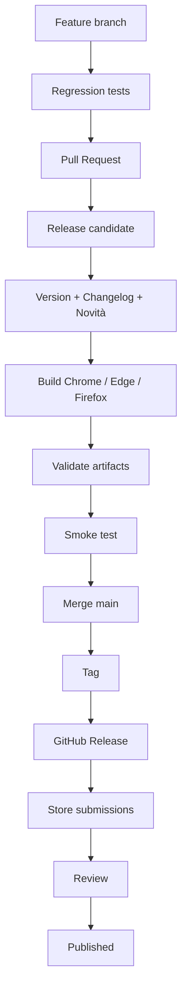
```mermaid
flowchart TD
    A[Feature branch] --> B[Regression tests]
    B --> C[Pull Request]
    C --> D[Release candidate]
    D --> E[Version + Changelog + Novità]
    E --> F[Build Chrome / Edge / Firefox]
    F --> G[Validate artifacts]
    G --> H[Smoke test]
    H --> I[Merge main]
    I --> J[Tag]
    J --> K[GitHub Release]
    K --> L[Store submissions]
    L --> M[Review]
    M --> N[Published]
```

---

# Parte CVII — Ma la pipeline reale può essere parallela

## 200. Preparativi store

Possono iniziare mentre:

```text
candidate ancora draft
```

---

## 201. Quindi

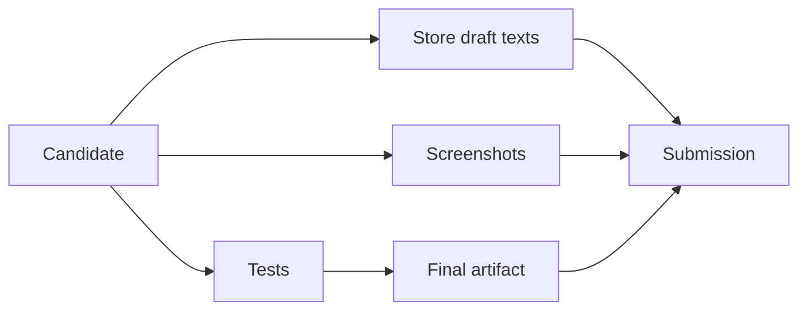
```mermaid
flowchart LR
    A[Candidate] --> B[Tests]
    A --> C[Store draft texts]
    A --> D[Screenshots]
    B --> E[Final artifact]
    C --> F[Submission]
    D --> F
    E --> F
```

Parallelizziamo attività senza confondere source of truth.

---

# Parte CVIII — Failure modes release

## 202. Wrong base branch

PR mostra commit non desiderati.

---

## 203. Stale branch

Feature non contiene ultimi fix di main.

---

## 204. Squash ancestry mismatch

Codice già incluso appare ancora nuovo.

---

## 205. Metadata drift

Versioni/testi non allineati.

---

## 206. Dirty build

Artefatto contiene modifiche non committate.

---

## 207. Manual ZIP edit

Artifact non riproducibile.

---

## 208. Tag wrong commit

Release label punta a source sbagliato.

---

## 209. Store upload wrong artifact

Chrome ZIP inviato al target sbagliato o build precedente.

---

# Parte CIX — Protezioni

## 210. Against wrong base

```text
PR review
compare graph
```

---

## 211. Against stale branch

```text
sync/rebase
tests on final result
```

---

## 212. Against metadata drift

```text
release-candidate tests
validate-release
```

---

## 213. Against wrong artifact

```text
naming
checksums
empty release dir
```

---

# Parte CX — Empty output directory

## 214. Perché il builder rifiuta vecchi ZIP?

Se la directory contiene già:

```text
plumepilot-v2.35.1-firefox.zip
```

potremmo confonderlo con output corrente.

Il builder quindi fallisce se trova artefatti precedenti.

---

## 215. È una protezione contro state leakage

Il build deve partire da:

```text
output state noto
```

non da un mix di run precedenti.

---

# Parte CXI — Build idempotence

## 216. Idealmente

A parità di:

```text
source
environment compatibile
```

due build producono:

```text
stessi bytes
```

---

## 217. Perché aiuta release debugging

Se checksum differisce:

```text
qualche input è cambiato
```

Il problema diventa investigabile.

---

# Parte CXII — Branch sync prima della release

## 218. Domanda

Meglio:

```text
merge main into candidate
```

o:

```text
rebase candidate onto main
```

?

---

## 219. Dipende

Se la branch è condivisa:

```text
merge
```

preserva history.

Se è privata e vogliamo lineare:

```text
rebase
```

può essere più pulito.

Se squash downstream crea history anomala:

```text
content-aware reconstruction
```

può essere più sicura, ma richiede competenza maggiore.

---

# Parte CXIII — Il tree come arbitro del contenuto

## 220. Quando history è confusa

Possiamo tornare alla domanda fondamentale:

```text
quale snapshot vogliamo?
```

e confrontare:

```text
tree
diff
tests
```

---

## 221. Poi ricostruiamo una history sensata

La storia deve descrivere correttamente il contenuto.

Non dobbiamo sacrificare il contenuto per “far contento Git”.

---

# Parte CXIV — Git è un tool di collaborazione, non un giudice semantico

## 222. Git sa

```text
byte
path
parent
```

---

## 223. Git non sa

```text
“questo commit squash equivale
a quei 20 commit originali”
```

semanticamente.

Quella conoscenza è umana.

---

# Parte CXV — Merge strategies come protocollo di team

## 224. La cosa importante è coerenza

Se decidiamo:

```text
tutte le feature PR vengono squashed
```

allora downstream stacked branch devono essere gestite sapendo questo.

---

## 225. Possibile regola

Prima di squashare una base con branch dipendenti:

```text
merge dependent branch first
o
prevedi rebase/reparent dopo squash
```

---

# Parte CXVI — Stacked branch discipline

## 226. Possibile workflow

```text
A → PR A
B based on A → PR B

quando A merge/squash:
rebase B onto main
force-with-lease B
update PR B base main
```

---

## 227. `--force-with-lease`

Da command line è preferibile a un force cieco:

```bash
git push --force-with-lease
```

perché controlla che il remote ref non sia cambiato inaspettatamente.

Concettualmente è lo stesso principio dell'expected SHA usato nel nostro riallineamento.

---

# Parte CXVII — `merge-base`

## 228. Concetto

Git usa il common ancestor per capire:

```text
cosa è cambiato da entrambe le parti
```

Se squash/rebase cambiano ancestry:

```text
merge-base cambia
```

e il diff può sembrare molto più grande del contenuto semanticamente nuovo.

---

# Parte CXVIII — `git log --graph`

## 229. Strumento didattico fondamentale

```bash
git log --graph --oneline --decorate --all
```

rende visibile:

```text
branch
merge
tag
divergenza
```

Spesso spiega un problema meglio di dieci comandi casuali.

---

# Parte CXIX — `git diff`

## 230. Domanda

```text
cosa cambia nei file?
```

---

## 231. `git log`

Domanda diversa:

```text
quali commit/history differiscono?
```

---

## 232. Non confonderle

Possiamo avere:
```text
diff vuoto
log diverso
```

come nel caso di tree identico/history diversa.

---

# Parte CXX — `git status`

## 233. Domanda

```text
cosa non è ancora registrato?
```

È uno dei comandi più importanti prima di:

```text
switch
merge
build
release
```

---

# Parte CXXI — `git show`

## 234. Domanda

```text
che cosa rappresenta questo commit?
```

Mostra:

```text
metadata
parents
patch
```

---

# Parte CXXII — `git cat-file`

## 235. Livello più basso

Per studiare Git realmente:

```bash
git cat-file -p <commit>
```

possiamo vedere:

```text
tree
parent
author
committer
message
```

---

## 236. Questo rende concreto il modello

Non è più:

```text
“credo che un commit abbia un parent”
```

Lo vediamo nell'oggetto.

---

# Parte CXXIII — GitHub compare

## 237. `ahead` / `behind`

Sono misure sul commit graph.

Non sulla somiglianza semantica dei file.

---

## 238. Importantissimo

```text
24 ahead / 3 behind
```

non significa:

```text
24 feature nuove e 3 fix mancanti
```

Può riflettere:

```text
squash/rebase/history divergence
```

---

# Parte CXXIV — Perché prima guardiamo il graph

## 239. Se vediamo numeri strani

Controlliamo:

```text
merge-base
commit list
tree/diff
```

prima di concludere:

```text
branch obsolete
```

---

# Parte CXXV — Release tag immutability

## 240. Non spostare un tag pubblicato con leggerezza

Se:

```text
v2.35.1
```

è già pubblico, altri possono averlo:

```text
clonato
archiviato
referenziato
```

Spostarlo rompe provenance.

---

## 241. Se il release commit era sbagliato

Meglio:

```text
v2.35.2 / patch successiva
```

o un nuovo tag corretto secondo policy del progetto.

---

# Parte CXXVI — Immutable artifacts

## 242. Idealmente

Un file con checksum pubblicato:

```text
non viene sostituito silenziosamente
```

---

## 243. Nuovo artifact

Se cambia un byte:

```text
nuovo checksum
e, se distribuito, nuova versione
```

---

# Parte CXXVII — Git tag e store artifact

## 244. Un tag non contiene ZIP store-specifici

Può essere la source anchor.

Gli ZIP sono derivati.

---

## 245. Per questo checksum è utile

Collega:

```text
tag/source
```

a:

```text
artifact exact bytes
```

---

# Parte CXXVIII — Release reproducibility test

## 246. Una verifica forte

```text
checkout v2.35.2
run build
compare SHA256SUMS
```

Se coincide:

```text
provenance molto più credibile
```

---

# Parte CXXIX — Review note hash

## 247. Nel caso AMO

Possiamo fornire al reviewer:

```text
expected SHA-256
```

così può verificare che il build riprodotto corrisponda all'upload.

---

# Parte CXXX — GitHub branch protection

## 248. In un progetto più grande

Potremmo imporre:

```text
PR required
checks required
no force push
review required
```

su `main`.

---

## 249. Trade-off

Più guardrail:

```text
meno errori accidentali
```

ma anche:

```text
più processo
```

Per un progetto piccolo scegliamo il livello che riduce davvero rischio.

---

# Parte CXXXI — Human error è parte del threat model

## 250. L'integration merge accidentale lo dimostra

Non serviva un bug Git.

Bastava:

```text
clic/merge nel momento sbagliato
```

---

## 251. Guardrail

Possibili:

```text
branch protection
draft PR
required checks
release checklist
naming
```

Software engineering include progettare contro i nostri stessi errori.

---

# Parte CXXXII — Revert rapido vs panico

## 252. Quando succede un merge sbagliato

Prima:

```text
identifica stato desiderato
```

Poi:

```text
restore via commit/revert
```

Non iniziare con:

```text
force push casuale
```

---

# Parte CXXXIII — Incident response Git

## 253. Checklist

```text
1. stop further merges
2. capture current SHAs
3. identify last good state
4. inspect who pulled/published
5. choose revert vs history rewrite
6. restore tests
7. document
```

---

# Parte CXXXIV — Release branch as transaction

## 254. Possiamo pensare il candidate come una transaction lunga

Accumula:

```text
code
metadata
tests
artifacts
```

prima del commit finale in main.

---

## 255. Ma non è ACID

Durante giorni:

```text
main cambia
store requirements cambiano
branch cambia
```

quindi dobbiamo riconciliare.

L'analogia è utile solo fino a un certo punto.

---

# Parte CXXXV — Commit atomicity

## 256. Un buon commit dovrebbe rappresentare un cambiamento coerente

Idealmente:

```text
code
+
test
+
docs necessari
```

insieme.

---

## 257. Perché

Un checkout di quel commit dovrebbe avere senso.

Questo migliora:

```text
bisect
review
revert
```

---

# Parte CXXXVI — Don't commit generated release ZIPs

## 258. In genere

Gli artifact di release non devono stare nel source history se sono:

```text
derivabili
pesanti
binari
```

Meglio GitHub Release/store.

---

## 259. Source vs artifact separation

Il repository conserva:

```text
recipe
ingredients
tests
```

la release conserva:

```text
output
```

---

# Parte CXXXVII — Build scripts versionati

## 260. Ma la recipe deve essere nel commit

`build-release.mjs` deve essere versionato insieme al source.

Così il tag contiene:

```text
codice
+
metodo per costruire il package
```

---

# Parte CXXXVIII — Store metadata versionato?

## 261. Alcuni testi sì

Release notes/reviewer docs utili possono stare nel repo.

---

## 262. Altri dashboard fields

Possono vivere solo nello store.

Il rischio è drift.

Per questo conviene almeno mantenere:

```text
bozza canonica
```

nel progetto quando il costo è basso.

---

# Parte CXXXIX — Release engineering come reproducible decision-making

## 263. Obiettivo

Non basta poter ricostruire i bytes.

Vogliamo poter ricostruire:

```text
perché questa versione?
quali feature?
quali test?
quali target?
```

---

# Parte CXL — Changelog come causal context

## 264. Il changelog conserva “why”

Git diff mostra:

```text
cosa
```

Release note/changelog spiegano:

```text
perché
```

Per questo hanno valore durante bug archaeology.

---

# Parte CXLI — Issue → branch → PR

## 265. Ideal flow

```text
problem
  ↓
issue / note
  ↓
branch
  ↓
commits
  ↓
tests
  ↓
PR
```

---

## 266. Ma PlumePilot spesso nasce da feedback diretto

Non ogni modifica ha una issue formale.

Questo è normale in un progetto piccolo.

L'importante è che:

```text
reasoning critico
```

finisca almeno in:

```text
PR
commit
test
changelog
```

---

# Parte CXLII — Traceability

## 267. Vogliamo poter seguire

```text
user bug
→ PR
→ commit
→ test
→ release
```

---

## 268. Questo aiuta

```text
support
debug
regression
audit
book writing
```

---

# Parte CXLIII — Merge queue?

## 269. In team grandi

Una merge queue può garantire che ogni PR venga testata contro:

```text
latest main + preceding queued changes
```

riducendo stale-green PR.

---

## 270. Per PlumePilot oggi

Sarebbe probabilmente eccessivo.

Ma il principio:

```text
test final integration result
```

resta valido.

---

# Parte CXLIV — Release freeze e branch sync

## 271. Prima di pacchettizzare

Controlliamo:

```text
candidate contains latest required main
```

---

## 272. Non necessariamente latest everything

Se `main` contiene già lavoro per una versione futura non destinato alla release:

```text
non dobbiamo inglobarlo automaticamente
```

Da qui l'utilità di release branch in progetti con sviluppo parallelo.

---

# Parte CXLV — Current PlumePilot state

## 273. Al momento di questo capitolo

```text
main
→ v2.35.1 baseline

feat/ui-ux-2.35.2
→ 2 commit sopra main

#41
→ open, draft, mergeable
```

Il secondo commit:

```text
f6fcb4c2...
```

prepara:

```text
version 2.35.2
Novità
AMO/release metadata
```

---

## 274. Questo è un vero release candidate

Non soltanto:

```text
feature UI
```

ma:

```text
UI
+
version
+
release packaging metadata
```

---

# Parte CXLVI — Quando mergeare

## 275. Dopo

```text
smoke test
artifact validation
release blockers resolved
```

---

## 276. Non per forza dopo store approval

Gli store hanno bisogno del package.

Quindi il codice può essere taggato/merged prima che l'approvazione avvenga.

---

# Parte CXLVII — Tagging sequence suggerita

## 277. Per la 2.35.2

Una sequenza pulita è:

```text
1. final candidate tests
2. build candidate package
3. validate
4. merge #41 → main
5. confirm main tree
6. build/verify final from main
7. create v2.35.2 tag
8. GitHub Release
9. upload/submit stores
```

---

## 278. Variante

Se store draft richiede upload anticipato:

```text
candidate package upload
```

può essere fatto, ma dopo merge conviene verificare che:

```text
final tree/artifact
```

sia quello già caricato.

---

# Parte CXLVIII — Tree equality può aiutare anche qui

## 279. Se merge squash produce nuovo commit

Potremmo confrontare:

```text
candidate tree
main merged tree
```

Se sono uguali:

```text
content invariant preserved
```

Poi rigeneriamo comunque gli artifact se release metadata/build input lo richiede.

---

# Parte CXLIX — Squash della #41?

## 280. Se scegliamo squash

Avremo:

```text
main
  ↓
single 2.35.2 commit
```

e i due commit del candidate non diventeranno ancestor diretti.

---

## 281. Implicazione

Qualsiasi future branch basata su:

```text
4d32 / f6fc
```

dovrà essere riallineata dopo squash.

La lezione della 2.35.1 va applicata subito.

---

# Parte CL — Regola operativa futura

## 282. Prima di squashare un candidate

Chiedi:

```text
esistono branch future stacked sopra?
```

Se sì:

```text
annota/rebase subito dopo merge
```

---

# Parte CLI — Release branch per la prossima versione

## 283. Strategia semplice

Dopo 2.35.2:

```text
main
  ↓
new feature branches
```

evitando di costruire 2.35.3 sopra la vecchia candidate prima del merge, se non necessario.

---

# Parte CLII — Git history come design artifact

## 284. Una storia buona racconta

```text
feature boundaries
release boundaries
fixes
reverts
```

---

## 285. Una storia perfettamente lineare non è sempre più vera

Eliminare ogni merge può nascondere relazioni reali.

Preservare ogni micro-commit può creare rumore.

È un design trade-off.

---

# Parte CLIII — Commit graph e cognitive load

## 286. Mainline semplice

Riduce:

```text
tempo per capire “cosa è uscito quando”
```

---

## 287. Feature history ricca

Può rimanere:

```text
nella PR
```

anche se main riceve squash.

GitHub conserva discussione e commit della PR.

---

# Parte CLIV — PR come archival context

## 288. Anche dopo merge

La PR conserva:

```text
description
review
comments
screenshots
commit list
```

Quindi squash non cancella tutta la storia umana.

---

# Parte CLV — Release provenance graph

## 289. Disegno completo

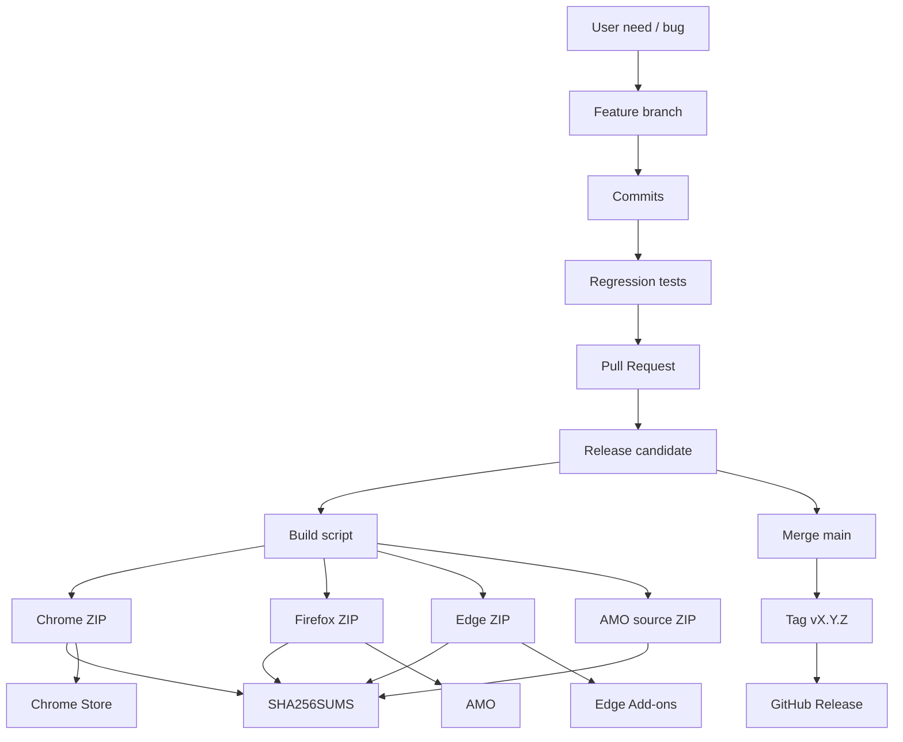
```mermaid
flowchart TD
    A[User need / bug] --> B[Feature branch]
    B --> C[Commits]
    C --> D[Regression tests]
    D --> E[Pull Request]
    E --> F[Release candidate]
    F --> G[Build script]
    G --> H[Chrome ZIP]
    G --> I[Firefox ZIP]
    G --> J[Edge ZIP]
    G --> K[AMO source ZIP]
    H --> L[SHA256SUMS]
    I --> L
    J --> L
    K --> L
    F --> M[Merge main]
    M --> N[Tag vX.Y.Z]
    N --> O[GitHub Release]
    H --> P[Chrome Store]
    I --> Q[AMO]
    J --> R[Edge Add-ons]
```

---

# Parte CLVI — Three histories

## 290. Git history

```text
commit graph
```

---

## 291. Release history

```text
v2.34.0
v2.35.0
v2.35.1
v2.35.2
```

---

## 292. Deployment history

```text
quale versione è diventata live
su quale store
e quando
```

---

## 293. Non sono identiche

Questa distinzione è essenziale quando rispondiamo:

```text
“quale codice sta usando questo utente?”
```

---

# Parte CLVII — Diagnosi da support ticket

## 294. Chiedi

```text
browser
installed version
store channel
```

Non basta:

```text
“ho preso l'ultima”
```

perché i tre store possono essere in stati differenti.

---
# Parte CLVIII — Source commit da versione

## 295. Tag

Se la versione è pubblicata correttamente:

```text
2.35.1
→ tag v2.35.1
→ commit a800...
```

Questo restringe immediatamente il codice da analizzare.

---

# Parte CLIX — Release metadata nel runtime

## 296. `chrome.runtime.getManifest().version`

Permette di mostrare/loggare:

```text
versione installata
```

nel contesto dove l'API è disponibile.

---

## 297. Dal Capitolo 13

Non va chiamata da un contesto page-world dove:

```text
chrome.runtime
```

non esiste.

Anche release identity attraversa i boundary.

---

# Parte CLX — Release engineering e rollback mentale

## 298. Una release piccola è più facile da capire

Se 2.35.2 contiene principalmente:

```text
UI/UX alignment
```

e compare un autoplay bug:

```text
sospettiamo meno direttamente il core autoplay
```

anche se non possiamo escludere effetti indiretti.

---

## 299. Scope disciplinato migliora il debug

Release boundaries sono anche:

```text
causal boundaries
```

imperfette ma utili.

---

# Parte CLXI — Trunk stability

## 300. Main non deve essere “mai rotto” in senso assoluto

È un obiettivo, non una legge fisica.

La domanda pratica:

```text
quanto rapidamente rileviamo
e ripristiniamo?
```

---

## 301. Tests + small PR + branch protection

riducono il Mean Time To Detect.

---

# Parte CLXII — Release validation as gate

## 302. Una gate è una condizione necessaria

```text
tests green
artifact validator green
```

prima del merge/tag.

---

## 303. Ma gate non sostituisce judgment

Una UI può essere:

```text
formalmente valida
ma confusa
```

Da qui lo smoke/manual review.

---

# Parte CLXIII — Definition of Done

## 304. Per una feature normale

```text
code
test
docs/changelog se necessario
```

---

## 305. Per una release

```text
candidate
validation
artifact
metadata
tag
store submission
```

La Definition of Done è diversa.

---

# Parte CLXIV — Automation candidates

## 306. Futuro possibile

GitHub Actions potrebbe:

```text
run tests on PR
build artifacts on tag
validate release
upload GitHub Release assets
```

---

## 307. Ma store submission automatica?

Possibile in alcuni ecosistemi, ma introduce:

```text
credentials
API policy
approval flow
risk
```

Per un progetto piccolo il manual upload può restare ragionevole.

---

# Parte CLXV — CI/CD terminology

## 308. CI

Continuous Integration:

```text
integra e verifica spesso
```

---

## 309. CD

Può significare:

```text
Continuous Delivery
```

o:

```text
Continuous Deployment
```

---

## 310. Per gli store

La review esterna rende il continuous deployment meno diretto.

Possiamo automatizzare:

```text
delivery candidate
```

ma la pubblicazione può richiedere review.

---

# Parte CLXVI — Release engineering come sistema socio-tecnico

## 311. Non è solo tooling

Include:

```text
Git
tests
build
store
reviewer
maintainer
utente
```

---

## 312. Il processo deve ridurre errori fra attori

Per esempio:

```text
reviewer note chiara
```

è una feature del processo tanto quanto:

```text
validator
```

---

# Parte CLXVII — Backend analogy: deployment pipeline

## 313. Un backend

```text
commit
→ CI
→ Docker image
→ registry
→ deploy
```

---

## 314. PlumePilot

```text
commit
→ build
→ browser ZIP
→ store
→ review
→ client update
```

---

## 315. Artifact immutability

Docker digest e ZIP SHA-256 svolgono ruoli concettualmente simili:

```text
identificare bytes esatti
```

---

# Parte CLXVIII — Backend analogy: database migration

## 316. Release non è solo code deploy

Se cambia storage schema:

```text
utenti hanno dati precedenti
```

come un database già popolato.

Il release deve supportare:

```text
upgrade path
```

---

## 317. Per questo migrations entrano nei test

Dal Capitolo 6:

```text
legacy Pegaso key
→ scoped platform key
```

è parte della release compatibility.

---

# Parte CLXIX — Forward compatibility

## 318. Se una release salva nuovo schema

Una versione precedente reinstallata manualmente potrebbe:

```text
non capirlo
```

Non sempre supportiamo downgrade.

Ma dobbiamo essere consapevoli.

---

# Parte CLXX — Release notes come schema migration communication

## 319. Se cambiasse qualcosa di visibile

Potremmo spiegare:

```text
preferenza resettata
setting migrata
permission nuova
```

---

# Parte CLXXI — Permission changes

## 320. Sono release-sensitive

Una nuova permission può:

```text
cambiare review
mostrare prompt
richiedere disclosure
```

Quindi non è una modifica come un CSS tweak.

---

# Parte CLXXII — Release risk classification

## 321. Low risk

```text
copy
spacing
docs
```

---

## 322. Medium

```text
UI logic
storage default
```

---

## 323. High

```text
permissions
background lifecycle
autoplay navigation
test automation
export pipeline
migration
```

---

## 324. Il test plan dovrebbe riflettere il rischio

Non tutte le release richiedono la stessa intensità.

---

# Parte CLXXIII — PR description come risk map

## 325. Una buona description include

```text
what
why
scope
tests
known limits
risk
```

---

# Parte CLXXIV — Release branch diff review

## 326. Prima del merge

Guardiamo:

```text
candidate vs main
```

non soltanto i singoli commit.

---

## 327. Perché

Potremmo avere:

```text
commit apparentemente corretti
ma file generato/stale rimasto nel tree
```

Lo snapshot finale conta.

---

# Parte CLXXV — File list review

## 328. Un segnale potente

Per una release UI:

```text
content.js modificato?
background.js modificato?
```

Se non ce lo aspettiamo:

```text
investigare
```

---

# Parte CLXXVI — Scope invariant

## 329. Possiamo testare persino questo

Una release candidate potrebbe avere una allowlist di file attesi.

Non sempre conviene.

Ma per hotfix molto stretto è utile.

---

# Parte CLXXVII — The accidental file problem

## 330. Esempio

```text
debug.txt
screenshot.png
local config
```

entra nel package.

Artifact validator e file allowlist possono impedirlo.

---

# Parte CLXXVIII — `.gitignore` non basta

## 331. `.gitignore`

impedisce molti file non tracciati.

---

## 332. Builder exclusions

impediscono file tracciati ma non runtime:

```text
tests
docs
scripts
```

Sono due boundary diversi.

---

# Parte CLXXIX — Release directory

## 333. È output

Non dovrebbe diventare input involontario del prossimo build.

Da qui:

```text
excluded release/
empty output guard
```

---

# Parte CLXXX — Source archive

## 334. Paradosso apparente

Il runtime ZIP esclude:

```text
scripts/tests
```

Il source AMO li include.

Perché hanno scopi diversi.

Release engineering costruisce più view dello stesso repository.

---

# Parte CLXXXI — Git sparse concerns

## 335. Repository state

È superset.

---

## 336. Runtime artifact

È subset + transforms.

---

## 337. Source submission

È subset differente.

Il build è una projection.

---

# Parte CLXXXII — Version bump timing

## 338. Troppo presto

Se aumentiamo versione all'inizio dello sviluppo:

```text
molti commit intermedi sembrano già release
```

---

## 339. Troppo tardi

Se la cambiamo dopo aver creato package/testi:

```text
drift
```

---

## 340. Pratica corrente

Nel candidate finale, vicino alla release prep.

È ragionevole.

---

# Parte CLXXXIII — Version as configuration

## 341. Una sola source of truth

Idealmente:

```text
manifest.version
```

alimenta:

```text
build filenames
validator expectations
runtime display
```

---

## 342. Evitare duplicazione

Quando dobbiamo duplicarla in:

```text
README reviewer
```

aggiungiamo validator.

---

# Parte CLXXXIV — Release commit vs version bump commit

## 343. Possibili strategie

### Uno stesso commit

```text
feature + release metadata
```

### Commit separato

```text
feature complete
↓
prepare version/release notes
```

---

## 344. Nel candidate 2.35.2

Abbiamo due commit chiari:

```text
4d32a8c2
Rebase UI/UX candidate onto released 2.35.1

f6fcb4c2
Prepare 2.35.2 version and shared menu release notes
```

Questa separazione rende evidente il confine:

```text
content alignment
vs
release prep
```

---

# Parte CLXXXV — Squash finale dei due?

## 345. Dipende dall'obiettivo di main

Se vogliamo:

```text
un solo release commit
```

squash è coerente.

---

## 346. Se vogliamo preservare la distinzione

rebase/merge potrebbe mantenere due commit.

La scelta va fatta prima di costruire future branch sopra questi hash.

---

# Parte CLXXXVI — Release decision record

## 347. Un futuro miglioramento

Per release non banali potremmo salvare:

```text
docs/releases/2.35.2.md
```

con:

```text
scope
test plan
known limitations
store state
```

Alcune release precedenti già hanno documenti simili.

---

# Parte CLXXXVII — Perché aiuta

Fra mesi:

```text
perché Firefox package era diverso?
```

troviamo la risposta vicino alla release.

---

# Parte CLXXXVIII — GitHub API come inspection tool

## 348. Durante questo libro abbiamo letto

```text
PR base/head
merge SHA
branch SHA
commit parents
tree SHA
```

direttamente.

Questo è utile quando la UI GitHub semplifica troppo la storia.

---

# Parte CLXXXIX — Low-level inspection

## 349. Quando serve

```text
weird ahead/behind
unexpected mergeability
tag mismatch
history rewrite
```

---

## 350. Ma normalmente

Git CLI:

```text
log
show
diff
merge-base
status
```

è sufficiente.

---

# Parte CXC — A mental decision tree

## 351. “Devo aggiornare il feature branch”

Chiedi:

```text
è condiviso?
```

### No

```text
rebase possibile
```

### Sì

```text
merge main spesso più sicuro
```

---

## 352. “La base è stata squashed”

Chiedi:

```text
il branch downstream contiene i vecchi commit?
```

Se sì:

```text
rebase/content-aware cleanup
```

prima di un merge cieco.

---

## 353. “Main contiene un merge accidentale”

Chiedi:

```text
è già pubblico/condiviso?
```

Se sì:

```text
preferisci revert/restore commit
```

a history rewrite, salvo casi controllati.

---

# Parte CXCI — Error recovery table

| Problema | Strumento principale |
|---|---|
| branch solo stale | merge/rebase |
| commit singolo da portare | cherry-pick |
| modifica da annullare pubblicamente | revert |
| history privata rumorosa | interactive rebase |
| squash ancestry mismatch | rebase/reparent/content reconstruction |
| wrong public main commit | revert/restore commit |
| wrong release artifact | rebuild + new version if published |
| wrong tag non pubblico | recreate carefully |
| wrong tag già pubblico | prefer new corrective release |

---

# Parte CXCII — Esercizio 1

Hai:

```text
main:
A-B-S

feature:
A-B-D-E-F-G
```

dove:

```text
S = squash di D-E-F
G = nuova feature
```

Perché una merge può risultare rumorosa?

Disegna due possibili strategie per ottenere:

```text
A-B-S-G'
```

---

# Parte CXCIII — Esercizio 2

Due commit hanno:

```text
tree identico
parent diverso
```

Quali proprietà sono uguali?

Quali sono diverse?

---

# Parte CXCIV — Esercizio 3

La PR contiene 15 commit:

```text
5 feature
4 fix dei fix
3 typo
3 test
```

Quando preferiresti:

```text
squash
```

e quando no?

---

# Parte CXCV — Esercizio 4

Hai già pubblicato:

```text
v2.35.2
```

ma scopri un bug grave.

Perché spostare il tag a un commit corretto non risolve il problema degli utenti già aggiornati?

---

# Parte CXCVI — Esercizio 5

Store Chrome mostra:

```text
2.35.1
```

GitHub Latest:

```text
2.35.2
```

Firefox:

```text
2.35.0
```

Quale versione sta usando “un utente PlumePilot”?

Risposta:

```text
dipende dal browser e dal canale
```

La domanda era incompleta.

---

# Parte CXCVII — Esercizio 6

Il build genera un Firefox ZIP con checksum diverso dallo stesso commit di ieri.

Elenca input possibili da investigare:

```text
Node version
builder change?
working tree dirty?
timestamp?
file ordering?
vendor file?
environment?
```

---

# Parte CXCVIII — Esercizio 7

Una feature branch è condivisa da tre persone.

Vuoi riallinearla con main.

Perché:

```bashgit rebase main
git push --force
```

richiede molta più cautela di un merge?

---

# Parte CXCIX — Esercizio 8

Una PR è mergeable e tutti i file si applicano senza conflitti.

Quali semantic conflict potrebbero comunque esistere?

---

# Parte CC — Concetti da portarsi dietro

## 354. Blob

Oggetto Git che contiene bytes di file.

---

## 355. Tree

Snapshot strutturale di file e directory.

---

## 356. Commit

Oggetto immutabile che collega:

```text
tree + parent(s) + metadata
```

---

## 357. Ref

Puntatore mobile a un oggetto Git, come un branch.

---

## 358. HEAD

Riferimento alla posizione corrente del checkout.

---

## 359. Merge commit

Commit con più parent che integra storie.

---

## 360. Squash merge

Integrazione che comprime più commit in un nuovo commit singolo.

---

## 361. Rebase

Ricostruzione di commit sopra una nuova base, creando nuovi hash.

---

## 362. Cherry-pick

Applicazione della modifica di un commit in un altro punto della storia tramite un nuovo commit.

---

## 363. Revert

Nuovo commit che annulla semanticamente un cambiamento precedente senza cancellarlo dalla history.

---

## 364. Merge base

Ancestor comune usato per confrontare e integrare due linee di storia.

---

## 365. Tree equality

Due commit puntano allo stesso snapshot completo dei file anche se history e metadata differiscono.

---

## 366. Artifact

Output costruito e distribuibile derivato dal repository.

---

## 367. Release provenance

Catena che collega:

```text
source commit
→ build process
→ artifact
→ checksum
→ distribuzione
```

---

## 368. Release candidate

Stato considerato potenzialmente pubblicabile dopo le validazioni finali.

---

## 369. Build deterministico

Processo che, a parità di input rilevanti, produce lo stesso output.

---

## 370. Deployment history

Sequenza delle versioni realmente pubblicate nei diversi canali, distinta dal commit graph.

---

## 371. Roll-forward

Correzione di una release problematica tramite una nuova versione superiore anziché ripubblicare una versione precedente.

---

## 372. Divergence

Differenza di ancestry fra branch, misurata in commit ahead/behind e non necessariamente equivalente a differenza semantica del codice.

---

## 373. Stacked PR

Pull request costruita sopra un altro branch/PR non ancora integrato nel target finale.

---

## 374. Force-with-lease

Aggiornamento forzato di un branch che fallisce se il remote ref è cambiato rispetto a ciò che ci aspettiamo.

---

# Parte CCI — Ulteriori letture

## 375. Git object model

Git Book:

https://git-scm.com/book/en/v2/Git-Internals-Git-Objects

https://git-scm.com/book/en/v2/Git-Internals-Git-References

---

## 376. Branch e merge

Git Book:

https://git-scm.com/book/en/v2/Git-Branching-Basic-Branching-and-Merging

https://git-scm.com/book/en/v2/Git-Branching-Rebasing

---

## 377. GitHub pull requests

GitHub Docs:

https://docs.github.com/en/pull-requests

https://docs.github.com/en/pull-requests/collaborating-with-pull-requests/incorporating-changes-from-a-pull-request/about-pull-request-merges

---

## 378. Squash merge

GitHub Docs:

https://docs.github.com/en/repositories/configuring-branches-and-merges-in-your-repository/configuring-pull-request-merges/configuring-commit-squashing-for-pull-requests

---

## 379. Tags e releases

GitHub Docs:

https://docs.github.com/en/repositories/releasing-projects-on-github/about-releases

Git:

https://git-scm.com/book/en/v2/Git-Basics-Tagging

---

## 380. Semantic Versioning

https://semver.org/

---

# Parte CCII — Recap

PlumePilot ci ha mostrato un caso concreto in cui:

```text
same tree
≠
same commit
```

e questo singolo fatto apre quasi tutto il capitolo.

Git tiene insieme:

```text
snapshot
causal history
branch pointers
release anchors
```

mentre GitHub aggiunge:

```text
pull request
review
draft state
release pages
```

e il release system aggiunge ancora:

```text
browser build
checksums
store submission
approval
publication
```

La pipeline completa è quindi:

```text
idea
 ↓
branch
 ↓
commit
 ↓
test
 ↓
PR
 ↓
candidate
 ↓
build
 ↓
artifact
 ↓
merge
 ↓
tag
 ↓
GitHub Release
 ↓
store
 ↓
utente
```

Le lezioni principali sono:

> **Il branch è un puntatore, non un contenitore magico.**

> **Il commit identifica uno snapshot dentro una storia, non soltanto i file.**

> **Squash semplifica `main`, ma cambia ancestry e quindi va considerato quando esistono branch stacked.**

> **Un merge senza conflict non dimostra la correttezza semantica.**

> **Il repository non è il prodotto distribuito: il prodotto è l'artefatto costruito e verificato.**

> **Tag, GitHub Release e pubblicazione store sono tre eventi distinti.**

E soprattutto:

> **Release engineering significa rendere riproducibile non soltanto il codice, ma il percorso con cui quel codice diventa software nelle mani degli utenti.**

---

# Prossimo capitolo

## 16 — Lezioni architetturali

Abbiamo ormai studiato:

```text
contexts
messaging
DOM
API
async
storage
cache
state machine
search algorithms
document generation
editor
UI
performance
cross-browser
testing
Git/release engineering
```

Il Capitolo 16 farà un passo indietro.

Non introdurrà una nuova feature.

Cercherà invece di rispondere:

```text
quali pattern sono emersi spontaneamente
in tutto PlumePilot?
```

Parleremo di:

```text
boundaries
identity
source of truth
anti-corruption layers
progressive refinement
fail-closed behavior
functional core / imperative shell
state machines
idempotence
graceful degradation
ownership
lifetime
observability
artifact thinking
```

e proveremo a ricostruire **l'architettura che PlumePilot possiede oggi, anche quando non è stata progettata esplicitamente fin dall'inizio**.

---

# 16 — Lezioni architetturali

## L’architettura che emerge dal progetto reale

> **Snapshot di riferimento del capitolo**  
> Questo capitolo usa come baseline il candidato **PlumePilot 2.35.2**, branch `feat/ui-ux-2.35.2`, commit `f6fcb4c29c83ba9150df0be31da04fc91dffb634`, ma sintetizza anche decisioni e regressioni osservate nei capitoli precedenti.

Fin qui abbiamo studiato PlumePilot per parti.

Abbiamo aperto il cofano e guardato:

```text
manifest
content script
MAIN world
bridge
background
popup
floating menu
cache
storage
API
DOM
state machine
PDF
EPUB
HTML editor
build
store package
```

Nel farlo abbiamo seguito feature concrete.

Questo capitolo cambia prospettiva.

Non ci chiederemo più:

> Come funziona autoplay?

oppure:

> Come viene costruito un EPUB?

Ci chiederemo invece:

> **Quali principi architetturali continuano a riapparire in parti del progetto apparentemente diverse?**

Quando una stessa idea compare in:

```text
autoplay
export
commissioni
UI
cross-browser
release tooling
```

non siamo più davanti a un dettaglio locale.

Stiamo osservando l’architettura del sistema.

E la cosa interessante è che gran parte di questa architettura non è nata da un diagramma iniziale.

È **emersa** progressivamente da:

```text
bug reali
vincoli del browser
comportamento del sito host
feedback utenti
store review
performance problems
```

Questo è uno dei motivi per cui un progetto reale è tanto istruttivo.

---

# Parte I — L’architettura non è l’elenco dei file

## 1. Struttura fisica e struttura logica

Se chiedessimo:

```text
“qual è l’architettura di PlumePilot?”
```

una risposta superficiale potrebbe essere:

```text
popup.js
background.js
content.js
bridge.js
floating-menu.js
...
```

Ma questo descrive soltanto la struttura fisica del repository.

L’architettura logica è più simile a:

```text
                    host platform
                  DOM + API + session
                         │
             ┌───────────┴───────────┐
             │                       │
          MAIN world             isolated world
             │                       │
             └──────── messaging ────┘
                         │
                    background
                  coordination layer
                         │
        ┌────────────────┼────────────────┐
        │                │                │
      popup         floating menu      builders
        │                │                │
        └────── shared persisted state ───┘
```

I file sono implementazione.

Le relazioni fra responsabilità sono architettura.

---

# Parte II — Primo principio: ogni boundary deve essere esplicito

## 2. Che cos’è un boundary?

Un boundary è un punto in cui cambiano una o più proprietà fondamentali:

```text
ownership
trust
lifetime
API disponibili
formato dati
source of truth
failure model
```

In PlumePilot ne incontriamo moltissimi.

Per esempio:

```text
page world ↔ extension world
popup ↔ background
background ↔ storage
DOM ↔ API
raw platform response ↔ normalized model
source tree ↔ browser artifact
```

---

## 3. Perché i boundary sono importanti

Molti bug non nascono dentro una funzione.

Nascono quando attraversiamo un boundary con un’assunzione sbagliata.

Esempi:

```text
“questo oggetto DOM resterà valido dopo await”
“questa percentuale master è la verità”
“questa API esiste in tutti i browser”
“questo evento arriverà sicuramente al popup”
“questo ZIP rappresenta esattamente il repository”
```

Sono tutte assunzioni di boundary.

---

## 4. Boundary come luogo di traduzione

Un buon boundary non trasporta soltanto dati.

Li **traduce**.

Per esempio:

```text
raw Multiversity response
        ↓
normalizeCourseOutline()
        ↓
PlumePilot course entries
```

Oppure:

```text
browser-specific runtime
        ↓
build-release.mjs
        ↓
PlumePilot target artifact
```

La traduzione protegge il resto del sistema dalle stranezze esterne.

---

# Parte III — Anti-corruption layer

## 5. Un concetto che compare più volte

In Domain-Driven Design si usa spesso il termine **anti-corruption layer** per indicare un layer che impedisce al modello esterno di contaminare direttamente quello interno.

In PlumePilot vediamo forme leggere di questo pattern.

---

## 6. API normalization

La piattaforma può usare:

```text
lp_id
paragraph id
display_order
folder id
percentage
```

Il resto di PlumePilot preferisce concetti come:

```text
lessonNumber
identity
playbackItems
test
objective
```

Quindi:

```text
external schema
      ↓
normalizer
      ↓
internal model
```

---

## 7. DOM adapter

Pegaso, Mercatorum e San Raffaele possono avere differenze nel DOM.

Invece di spargere:

```js
if (pegaso) ...
if (mercatorum) ...
```

ovunque, funzioni come `sections()` cercano di produrre una rappresentazione comune.

---

## 8. Browser packaging adapter

Lo stesso principio ricompare nel Capitolo 13:

```text
common source
     ↓
release adapter
     ↓
Chrome / Edge / Firefox artifacts
```

Tre problemi diversi.

Stesso pattern.

---

# Parte IV — Secondo principio: identity prima del DOM

## 9. Il DOM non è identità

Una delle lezioni più profonde del progetto è nata dall’autoplay.

Un nodo DOM può:

```text
sparire
essere ricreato
cambiare parent
venire nascosto
essere sostituito durante un await
```

Quindi non può essere l’identità logica di una lezione.

---

## 10. Node identity vs domain identity

```text
DOM node
   =
rappresentazione momentanea
```

mentre:

```text
course + section + chapter + lesson
   =
identità logica
```

Questo porta al pattern:

```text
resolve DOM
   ↓
extract logical identity
   ↓
await
   ↓
resolve DOM again
   ↓
validate identity
```

---

## 11. Identity composite

Quando un singolo campo non basta:

```text
display_order = 1
```

perché si ripete in più sezioni, usiamo un’identità composta:

```text
sectionText + chapterText
```

oppure, quando disponibili:

```text
lpId + paragraphId
```

---

## 12. Regola generale

> **Usa come identity ciò che rimane stabile durante il lifetime del processo che devi completare.**

Non ciò che è semplicemente comodo da leggere in quel momento.

---

# Parte V — Identity domain

## 13. Una identity vive dentro un dominio

`exam_id = 7` non è necessariamente globale.

Potremmo avere:

```text
Pegaso exam 7
Mercatorum exam 7
```

Quindi la vera identity è:

```text
platform + exam_id
```

---

## 14. Storage scoped keys

Lo stesso vale per i corsi:

```text
COURSE123
```

può essere ambiguo fra piattaforme.

La chiave persistente diventa:

```text
pegaso:COURSE123
mercatorum:COURSE123
```

---

## 15. Le collisioni sono segnali architetturali

Quando due entità collidono, la domanda non è soltanto:

```text
“come aggiungo un prefisso?”
```

ma:

> **Quale parte del dominio mancava nella nostra definizione di identità?**

---

# Parte VI — Terzo principio: source of truth esplicita

## 16. Non tutti i dati hanno la stessa autorità

PlumePilot vede spesso la stessa informazione da fonti diverse:

```text
DOM
master API
lesson detail API
cache
storage
session state
```

Il problema non è soltanto scegliere una fonte.

È definire una **gerarchia di evidenze**.

---

## 17. Master call

La master call è molto utile per:

```text
routing
candidate ordering
coarse progress
```

ma non sempre prova che:

```text
tutte le attività siano realmente complete
```

Quindi è un buon:

```text
index
```

non necessariamente la source of truth finale.

---

## 18. Detail API

Una lesson detail response fornisce evidenza più precisa su:

```text
Obiettivi
video
test
```

ma può essere incompleta o fallire.

---

## 19. DOM

Il DOM può essere:

```text
stale
non renderizzato
accordion chiuso
```

ma può anche diventare l’unico fallback visuale disponibile.

---

## 20. Quindi la verità è spesso stratificata

```text
coarse signal
      ↓
more precise signal
      ↓
visual fallback
      ↓
fail safe
```

---

# Parte VII — Evidence precedence

## 21. Un sistema robusto decide quale evidenza vince

Esempio:

```text
DOM dice Obiettivi 0%
API fresca dice Obiettivi 100%
```

Se il DOM è noto stale, non deve sovrascrivere l’API fresca.

---

## 22. Precedence rule

In forma generale:

```text
fresh authoritative evidence
      >
stale cache
      >
heuristic hint
```

con eccezioni esplicite quando il provider stesso è noto imperfetto.

---

# Parte VIII — Quarto principio: unknown è uno stato reale

## 23. Booleani troppo poveri

Molti problemi iniziano con:

```text
complete = true / false
```

ma la realtà è:

```text
complete
incomplete
unknown
```

---

## 24. Missing percentage

Se la UI non mostra la percentuale:

```text
undefined
```

non significa:

```text
0%
```

né:

```text
100%
```

Significa:

```text
non sappiamo
```

---

## 25. Ternary knowledge

Questo pattern appare in:

```text
activity progress
API result
material link
commission state
cache freshness
```

---

## 26. Valore architetturale

Quando modelliamo esplicitamente `unknown`, possiamo decidere:

```text
retry
fallback
visual verification
stop
```

invece di inventare un valore.

---

# Parte IX — Quinto principio: fail closed sui side effect rischiosi

## 27. Incertezza + side effect

Se non sappiamo quale capitolo sia quello giusto, non dovremmo:

```text
cliccarne uno a caso
```

Se non sappiamo se un test è incompleto, non dovremmo:

```text
rispondere automaticamente
```

---

## 28. Pattern

```text
certainty sufficient?
   ├── yes → side effect
   └── no  → fallback / stop
```

---

## 29. Esempi reali

### Routing ambiguo

```text
no verified route
→ no skip
```

### Firefox vendor transform

```text
pattern inatteso
→ fail build
```

### Bookmark test

```text
pending test
→ localizza
→ non risolvere
```

---

## 30. Correttezza > aggressività

Molti sistemi sembrano “smart” perché prendono sempre una decisione.

Un sistema robusto sa anche dire:

```text
non ho abbastanza informazioni
```

---

# Parte X — Sesto principio: progressive refinement

## 31. Non partire dalla fonte più costosa

Per trovare una attività incompleta potremmo interrogare tutto.

Ma sarebbe costoso.

Quindi:

```text
cheap coarse evidence
      ↓
selected candidate
      ↓
expensive precise verification
      ↓
fallback only if needed
```

---

## 32. È lo stesso pattern dell’EPUB

```text
text extraction
      ↓ insufficient
regional preservation
      ↓ insufficient
full visual raster
```

---

## 33. E anche della cache

```text
fresh cache
   ↓ miss/stale
API
   ↓ failure
DOM fallback
```

---

## 34. Fast path / slow path

Possiamo astrarre:

```text
fast path
  │
  ├── sufficient evidence → done
  │
  └── uncertainty → slow path
```

Questo pattern tiene insieme performance e correttezza.

---

# Parte XI — Cost-sensitive architecture

## 35. Non tutte le letture costano uguale

```text
Map lookup
DOM query
network request
PDF parse
canvas raster
```

sono operazioni molto diverse.

---

## 36. Il decision engine dovrebbe conoscere il costo

Non necessariamente con numeri espliciti.

Ma con un ordine ragionato:

```text
cheap
→ medium
→ expensive
```

---

## 37. Query planner analogy

Il first-incomplete engine assomiglia a un query planner:

```text
index says likely row
      ↓
fetch detail
      ↓
verify exact predicate
```

---

# Parte XII — Settimo principio: lifetime coerente con il dato

## 38. Ogni stato ha una durata naturale

Abbiamo visto quattro livelli:

```text
in-memory
sessionStorage
chrome.storage.local
server/platform
```

---

## 39. In-memory

Adatto a:

```text
pending request
cache veloce
current operation helper
AbortController
```

quando la perdita al reload è accettabile o recuperabile.

---

## 40. `sessionStorage`

Adatto a:

```text
recovery di navigazione
reload attempt
short-lived continuity
```

---

## 41. `chrome.storage.local`

Adatto a:

```text
preferenze
operation recovery
achievement state
commission snapshots
```

---

## 42. Server

Rimane authoritative per:

```text
progress ufficiale
exam state
course structure
```

---

## 43. Regola

> **La persistenza deve essere abbastanza lunga per il dato, ma non più lunga del necessario.**

Persistenza eccessiva crea:

```text
stale state
migration cost
privacy surface
```

---

# Parte XIII — Ownership

## 44. Chi possiede lo stato?

Una delle domande più utili è:

```text
chi può modificarlo?
```

---

## 45. Operation state

Il background coordina operazioni globali.

Quindi è un owner naturale di:

```text
active operation
builder ownership
lease
```

---

## 46. UI state

Popup e floating menu leggono e riflettono:

```text
preferenze
operation
presentation model
```

ma non dovrebbero inventare due verità indipendenti.

---

## 47. Ownership riduce race

Se due componenti possono scrivere lo stesso dato senza protocollo:

```text
lost update
```

è quasi inevitabile.

---

# Parte XIV — Single writer, multiple readers

## 48. Pattern utile

Dove possibile:

```text
un coordinator scrive
più UI leggono
```

---

## 49. Commission storage

Le write serializzate dal background sono un esempio.

---

## 50. Non sempre possibile

Preferenze utente possono essere modificate da:

```text
popup
floating menu
```

Qui serve:

```text
storage normalization
onChanged synchronization
```

---

# Parte XV — Ottavo principio: messaging come protocollo

## 51. Non sono “funzioni remote”

Quando scriviamo:

```js
chrome.runtime.sendMessage(...)
```

non stiamo chiamando una funzione normale.

Stiamo attraversando:

```text
process/context boundary
```

---

## 52. Un messaggio ha bisogno di contratto

```text
type
payload
response
error semantics
correlation
lifetime
```

---

## 53. Accepted ≠ completed

Un messaggio può dire:
```text
accepted: true
```

ma il lavoro essere ancora:

```text
running
```

Questo è lo stesso concetto di HTTP 202.

---

# Parte XVI — Message protocol versioning

## 54. Oggi

I message type sono stringhe:

```text
PEGASO_START_EXPORT
PEGASO_GET_OPERATION
...
```

---

## 55. Domani

Se il protocollo cresce potrebbe essere utile:

```text
schema condiviso
version
request/response types
```

---

## 56. Ma non astrarre prima del bisogno

Un framework interno di messaging può diventare più complesso del problema.

Il pattern giusto è:

```text
formalizzare quando il numero di contratti lo giustifica
```

---

# Parte XVII — Nono principio: asincronia = validità temporale

## 57. `await` divide il mondo

Prima di:

```js
await something();
```

abbiamo una fotografia.

Dopo:

```text
DOM può cambiare
utente può navigare
setting può cambiare
video può cambiare
operation può essere cancellata
```

---

## 58. Revalidation pattern

```text
read
remember identity
await
re-read
validate
act
```

---

## 59. Compare-before-side-effect

Prima di cliccare:

```text
sono ancora nello stesso corso?
è ancora lo stesso player?
autoplay è ancora enabled?
la lesson identity coincide?
```

---

# Parte XVIII — Optimistic concurrency thinking

## 60. Backend analogy

È simile a:

```text
read version 12
compute
before write verify still version 12
```

---

## 61. Nel browser

La “version” può essere:

```text
course code
generation token
current video identity
DOM identity
```

---

# Parte XIX — Generation token

## 62. First-incomplete discovery

Usa:

```text
smartResumeGeneration
```

per riconoscere una ricerca superata.

---

## 63. Pattern

```text
start operation → generation N
new operation   → generation N+1
old continuation wakes up
if generation != N → cancel
```

---

## 64. È una cancellation strategy leggera

Non ferma fisicamente ogni Promise.

Ma impedisce che una continuation vecchia produca side effect.

---

# Parte XX — Decimo principio: side effect separati dalle decisioni

## 65. Functional core / imperative shell

Una delle direzioni più promettenti del progetto è separare:

```text
what should happen?
```

da:

```text
perform browser effect
```

---

## 66. Già presente in alcuni punti

`autoplayPresentation()`:

```text
settings
   ↓
presentation model
```

senza toccare il DOM.

---

## 67. Route mapping

```text
master + outline
      ↓
route map
```

è quasi logica pura.

---

## 68. Shell

Poi:

```text
openSection
openChapter
clickRow
scrollIntoView
```

sono side effect browser.

---

## 69. Perché conviene

Decision logic pura è:

```text
più testabile
più riusabile
più comprensibile
```

Side effect restano concentrati.

---

# Parte XXI — Undicesimo principio: state machine prima della cascata di if

## 70. Quando il comportamento dipende dalla storia

Autoplay non è:

```text
if video ended → click next
```

È:

```text
state + event + guard + context + transition
```

---

## 71. Sintomo di state machine implicita

Se vediamo molte variabili come:

```text
enabled
busy
stopAtTests
autoCompleteTests
stoppedAtTestContext
thresholdBypassed
```

abbiamo già una macchina a stati, anche se non l’abbiamo chiamata così.

---

## 72. Esplicitarla mentalmente riduce bug

Possiamo chiedere:

```text
quali transizioni esistono?
quali sono proibite?
quale state entra dopo cancel?
```

---

# Parte XXII — State vector

## 73. Uno stato può essere distribuito

Non serve un unico enum.

Il vero state può essere il vettore:

```text
(enabled,
 busy,
 stopAtTests,
 autoCompleteTests,
 thresholdBypassed,
 currentContext)
```

---

## 74. Rischio: state explosion

Se ogni flag è indipendente:

```text
2^N combinations
```

molte possono essere invalide.

---

## 75. Future improvement

Potremmo derivare più valori da uno stato più compatto o usare reducer/statechart per aree che continuano a crescere.

---

# Parte XXIII — Dodicesimo principio: idempotence e deduplication

## 76. Eventi duplicati sono normali

In sistemi distribuiti e browser extension:

```text
message retry
double click
reconnect
reload
same event observed twice
```

succedono.

---

## 77. Dedup non è idempotence

### Deduplication

```text
riconosci duplicato
→ non ripetere
```

### Idempotence

```text
ripetere l’operazione
→ stesso risultato finale
```

---

## 78. Operation id

Un `operationId` permette di capire se:

```text
builder request
```

appartiene a un lavoro già in corso.

---

## 79. Sound event memory

Gli eventi sonori vengono ricordati per evitare doppia riproduzione/achievement.

---

# Parte XXIV — At-least-once thinking

## 80. Messaging reale

Anche se l’API sembra semplice, conviene progettare come se alcuni eventi potessero essere:

```text
ripetuti
ritardati
persi durante lifecycle
```

---

## 81. Snapshot + event

Per questo la UI non dovrebbe dipendere soltanto da:

```text
un evento “operation started”
```

ma poter chiedere:

```text
qual è lo stato corrente?
```

---

# Parte XXV — Tredicesimo principio: snapshot + event

## 82. Event-only è fragile

Se il popup si apre dopo l’evento:

```text
non lo ha visto
```

---

## 83. Snapshot-only è lento

Polling continuo:

```text
spreca lavoro
```

---

## 84. Insieme

```text
initial snapshot
      +
subsequent events
```

è un pattern molto più robusto.

---

# Parte XXVI — Eventual consistency nella UI

## 85. Popup e floating menu

Possono aggiornarsi in istanti leggermente diversi.

L’obiettivo non è:

```text
same microsecond
```

ma:

```text
convergere allo stesso state
```

---

## 86. Storage onChanged

Funge da canale reattivo di convergenza.

---

# Parte XXVII — Quattordicesimo principio: cache come acceleratore, non verità

## 87. Cache semantics

Una cache risponde:

```text
ho una copia utile?
```

non:

```text
questa è la realtà assoluta?
```

---

## 88. Cache entry completa

Una entry robusta contiene più del valore:

```text
value
identity
fetchedAt
completeness
source
error/attempt metadata
```

---

## 89. Freshness semantica

Un dato può essere riutilizzato se:

```text
completed = true
```

anche se vecchio, quando completion è monotona.

Mentre un dato:

```text
progress = 40%
```

può diventare stale molto rapidamente.

---

# Parte XXVIII — Monotonic knowledge

## 90. Alcune informazioni possono solo avanzare

Per una activity:

```text
completed false → true
```

non dovrebbe tornare normalmente false.

---

## 91. Cache merge

Possiamo conservare:

```text
max percentage
completed OR previousCompleted
```

quando identity è la stessa.

---

## 92. Ma identity prima di monotonicity

Se la route è cambiata:

```text
non possiamo unire due activity diverse
```

anche se i campi sembrano compatibili.

---

# Parte XXIX — Quindicesimo principio: bounded growth

## 93. Cache senza limite = memory leak logico

Anche se il GC funziona perfettamente.

---

## 94. `pageLessonSnapshots`

Ha limite:

```text
50 entries
```

---

## 95. Sound memory

Conserva soltanto una finestra bounded/TTL.

---

## 96. Regola

Ogni struttura long-lived dovrebbe rispondere:

```text
come viene rimossa una entry?
```

Se non abbiamo risposta, abbiamo un rischio.

---

# Parte XXX — Sedicesimo principio: cancellation end-to-end

## 97. Cancel button non basta

Perché cancellazione reale richiede:

```text
UI intent
      ↓
message
      ↓
operation state
      ↓
AbortController / generation
      ↓
loops observe cancellation
      ↓
cleanup
```

---

## 98. Cooperative cancellation

JavaScript non interrompe magicamente una funzione arbitraria.

Il lavoro deve controllare periodicamente:

```text
signal.aborted?
```

---

## 99. Cancellation latency

Se controlliamo abort solo ogni 30 secondi:

```text
cancellazione formalmente supportata
ma UX pessima
```

---

# Parte XXXI — Cleanup ownership

## 100. Chi alloca deve sapere chi libera

Per:

```text
AbortController
canvas
PDF page
Blob URL
message listener
pending request Map entry
```

serve ownership chiara.

---

## 101. Resource lifecycle

```text
allocate
use
transfer ownership?
release
```

---

# Parte XXXII — Diciassettesimo principio: working set prima del file size

## 102. Document generation

Un EPUB finale da:

```text
40 MB
```

può richiedere molto più RAM durante la build.

---

## 103. Working set

```text
PDF bytes
PDF.js structures
canvas RGBA
PNG bytes
ZIP entries
final buffer
```

possono coesistere.

---

## 104. Architettura memory-aware

Quindi:

```text
process sequentially
cleanup page
null large buffers
dedupe assets
bound canvas resolution
```

sono decisioni architetturali.

---

# Parte XXXIII — Diciottesimo principio: backpressure

## 105. Più concurrency non è sempre meglio

```text
Promise.all(100 PDFs)
```

può ridurre wall time ma esplodere:

```text
network pressure
memory
CPU
```

---

## 106. Pacing

Delay fra request è una forma semplice di backpressure.

---

## 107. Future improvement

Un concurrency limiter esplicito potrebbe controllare:

```text
N in-flight tasks
```

meglio di delay statici in alcune pipeline.

---

# Parte XXXIV — Diciannovesimo principio: graceful degradation

## 108. Feature robusta non significa “sempre stesso path”

Esempio audio:

```text
Chromium → offscreen
Firefox → content tab
```

stessa semantica, adapter diverso.

---

## 109. EPUB

```text
text
regional
visual
```

sono livelli di degradazione controllata.

---

## 110. Material export

```text
API link
DOM link
visual path
```

---

## 111. Graceful degradation non è silent failure

L’utente deve ricevere:

```text
risultato alternativo
oppure errore comprensibile
```

non un output corrotto silenzioso.

---

# Parte XXXV — Ventesimo principio: preserve semantics, vary mechanism

## 112. Cross-browser

Chrome ed Edge:

```text
offscreen audio
```

Firefox:

```text
tab audio
```

Semantica:

```text
play requested notification
```

---

## 113. UI

Popup e floating menu hanno DOM/lifecycle diversi.

Ma condividono:

```text
presentation rules
settings semantics
operation semantics
```

---

## 114. Questo è semantic parity

Non cerchiamo:

```text
implementation identity
```

ma:

```text
observable contract identity
```

---

# Parte XXXVI — Ventunesimo principio: shared rules, separate controllers

## 115. Il redesign 2.35.2

Non ha trasformato popup e floating menu in un unico mega-component.

---

## 116. Perché

Hanno:

```text
different DOM roots
different lifecycle
different navigation constraints
different embedding
```

---

## 117. Cosa condividiamo

```text
menu-ux.js
menu-ux.css
layout model
presentation logic
```

---

## 118. Regola generale

> **Condividi la semantica stabile, non forzare l’unificazione delle superfici che hanno lifecycle differenti.**

---

# Parte XXXVII — Ventiduesimo principio: presentation model

## 119. Non renderizzare direttamente state grezzo

Possiamo avere:

```text
saved setting
+ override
+ operation state
+ course-specific bypass
```

---

## 120. Presentation function

```text
raw state
   ↓
derive effective state
   ↓
derive labels/hints
   ↓
render
```

---

## 121. Vantaggio

Popup e floating menu possono usare la stessa interpretazione.

---

# Parte XXXVIII — Derived state

## 122. Non tutto va salvato

Se possiamo calcolare:

```text
effectiveStopAtTests
```

da:

```text
saved test behavior
chapter limit
auto complete
```

non serve necessariamente persistirlo separatamente.

---

## 123. Duplicate state = drift

Se salviamo sia:

```text
raw settings
```

sia:

```text
derived effective state
```

possono divergere.

---

# Parte XXXIX — Ventitreesimo principio: invariant-oriented design

## 124. Un’invariante è una frase forte

Esempi:

```text
una operation attiva deve restare cancellabile
una identity ambigua non autorizza navigation
un hidden tab non provoca destructive reload
platform è parte della persistent identity
```

---

## 125. Invariante > patch

Patch:

```text
aggiungi 200ms
```

Invariante:

```text
non avanzare finché la nuova lesson non è verificata
```

La seconda sopravvive meglio ai refactor.

---

## 126. Test come executable invariant

Il Capitolo 14 ha mostrato il passaggio:
```text
bug
→ invariant
→ test
```

Questa è una delle principali forme di maturazione architetturale.

---

# Parte XL — Ventiquattresimo principio: artifact thinking

## 127. Il repository non è il prodotto

Per una extension:

```text
source tree
      ↓
build
      ↓
Chrome ZIP
Firefox ZIP
Edge ZIP
```

---

## 128. Il build è parte dell’architettura

Manifest specialization, vendor transformation, locales e checksums cambiano ciò che viene distribuito.

---

## 129. Testare il tree non basta

Serve anche:

```text
artifact validation
```

---

# Parte XLI — Venticinquesimo principio: release pipeline come compiler

## 130. Front-end

```text
common source
```

## 131. Lowering

```text
manifestFor(browser)
Firefox transforms
Edge locales
```

## 132. Code generation

```text
ZIP
```

## 133. Verification

```text
validate-release.mjs
```

Questo modello mentale rende la release pipeline molto più comprensibile.

---

# Parte XLII — Ventiseiesimo principio: fail early ai boundary deterministici

## 134. Runtime user flow

Spesso vogliamo fallback.

---

## 135. Build pipeline

Se una precondizione deterministica è violata:

```text
manifest sbagliato
checksum vendor cambiato
pattern transform ambiguo
```

meglio:

```text
fail immediately
```

---

## 136. Differenza

```text
runtime uncertainty
→ degrade/recover

build invariant violation
→ stop
```

---

# Parte XLIII — Ventisettesimo principio: osservabilità vicino alle decisioni

## 137. Loggare tutto non aiuta

Un buon diagnostic log dovrebbe spiegare:

```text
quale decisione
su quale identity
con quale evidence
```

---

## 138. Esempio

```text
master says chapter 5 <100%
→ detailed verification 5
```

è molto più utile di:

```text
step 12
```

---

## 139. Structured diagnostics

Per EPUB:

```text
pages
assets
bytes
mode
elapsed
```

possono essere raccolti come struttura, non solo stampati.

---

# Parte XLIV — Ventottesimo principio: privacy-aware observability

## 140. Una extension autenticata vede dati sensibili

Quindi non possiamo trattare logging come in un toy project.

---

## 141. Diagnostic minimum

Preferiamo:

```text
course code
operation id
state name
error class
```

non:

```text
token
password
raw private payload
```

---

# Parte XLV — Ventinovesimo principio: external systems are contracts, not dependencies we control

## 142. Multiversity

Può cambiare:

```text
DOM
API
route
response timing
```

---

## 143. Browsers

Possono cambiare:

```text
extension lifecycle
API support
manifest rules
```

---

## 144. Stores

Possono cambiare:

```text
policy
review scanner
metadata requirements
```

---

## 145. Conseguenza

Ogni integrazione esterna dovrebbe avere:

```text
boundary
normalization
validation
fallback/test
```

---

# Parte XLVI — Contract drift as normal condition

## 146. Non chiedere “cambierà?”

Chiedi:

```text
“come ce ne accorgeremo quando cambierà?”
```

---

## 147. Risposte

```text
contract tests
artifact validator
source assertions
live smoke test
clear error classification
```

---

# Parte XLVII — Trentesimo principio: localizzare la complessità

## 148. La complessità non può sempre essere eliminata

PlumePilot deve affrontare:

```text
multiple worlds
multiple browsers
multiple universities
asynchronous DOM
store policies
```

---

## 149. Possiamo però confinarla

```text
browser difference → build adapter
platform difference → DOM/API adapter
UI difference → controller
state persistence → storage helper
```

---

## 150. Il contrario

Quando la stessa eccezione appare in 10 file:

```text
complessità diffusa
```

è molto più difficile da mantenere.

---

# Parte XLVIII — Architecture as compression

## 151. Un buon pattern comprime molte eccezioni

Senza pattern:

```text
bug A → patch A
bug B → patch B
bug C → patch C
```

---

## 152. Con un principio

```text
DOM can be stale after await
```

spiega e previene un’intera classe di bug.

---

## 153. Questa è architettura

Una piccola quantità di concetti che permette di ragionare su molti casi.

---

# Parte XLIX — I pattern più ricorrenti di PlumePilot

## 154. Possiamo sintetizzarli

```text
1. Boundary espliciti
2. Identity logica stabile
3. Source hierarchy
4. Unknown come stato
5. Fail closed sui side effect rischiosi
6. Progressive refinement
7. Lifetime coerente
8. Ownership chiara
9. Messaging come protocollo
10. Revalidation dopo await
11. State machines
12. Dedup/idempotence
13. Snapshot + event
14. Cache non authoritative
15. Bounded growth
16. Cooperative cancellation
17. Working-set awareness
18. Backpressure
19. Graceful degradation
20. Semantic parity
21. Shared semantics / separate adapters
22. Derived presentation state
23. Executable invariants
24. Artifact thinking
25. Contract drift preparedness
```

---

# Parte L — Questi pattern non sono indipendenti

## 155. Esempio first incomplete

```text
master index
→ source hierarchy

course/chapter identity
→ stable identity

API detail
→ progressive refinement

unknown percentage
→ ternary knowledge

ambiguous route
→ fail closed

generation token
→ async revalidation/cancel
```

Una sola feature usa quasi metà dei pattern.

---

## 156. Esempio export EPUB

```text
PDF.js input
→ external boundary

page mode choice
→ progressive refinement

asset hash map
→ identity/dedup

canvas cleanup
→ ownership/lifetime

yieldToBrowser
→ cooperative scheduling

AbortSignal
→ cancellation

ZIP
→ artifact thinking
```

---

# Parte LI — Esempio UI 2.35.2

## 157. Popup + floating

```text
shared presentation rules
→ semantic parity

separate controllers
→ lifecycle-aware adapters

storage onChanged
→ snapshot + event

autoplayPresentation
→ derived state / functional core

active operation invariant
→ safety property
```

---

# Parte LII — Esempio cross-browser

## 158. Chrome / Firefox

```text
domain: play sound
→ shared semantics

offscreen/tab
→ compatibility adapter

manifest specialization
→ release compiler

replaceExactly
→ fail closed

checksums
→ artifact identity
```

---

# Parte LIII — Una possibile architettura concettuale futura

## 159. Se dovessimo ridisegnare le cartelle per riflettere i concetti

Potremmo immaginare:

```text
src/
├── domain/
│   ├── playback/
│   ├── discovery/
│   ├── operations/
│   └── achievements/
├── platform/
│   ├── multiversity-api/
│   ├── multiversity-dom/
│   └── browser-extension/
├── ui/
│   ├── shared/
│   ├── popup/
│   └── floating/
├── export/
│   ├── pdf/
│   ├── epub/
│   └── quiz/
└── infrastructure/
    ├── storage/
    ├── messaging/
    └── diagnostics/
```

Non è una proposta da applicare subito.

È una mappa concettuale.

---

# Parte LIV — Perché non rifattorizzare immediatamente tutto così

## 160. Architecture astronauts

C’è un rischio opposto:

```text
vedere pattern
→ creare 40 layer
→ rallentare ogni feature
```

---

## 161. L’architettura deve pagare il proprio costo

Un modulo nuovo ha costo:

```text
naming
imports
ownership
navigation
API interna
```

---

## 162. Regola

> **Astrarre quando una relazione è stabile e ripetuta, non quando possiamo immaginare che forse un giorno lo sarà.**

---

# Parte LV — Accidental complexity vs essential complexity

## 163. Essential complexity

PlumePilot deve realmente gestire:

```text
host esterno
async DOM
browser extension contexts
cross-browser
```

Non possiamo eliminarli.

---

## 164. Accidental complexity

Possiamo invece ridurre:

```text
duplicazione UI
state duplicato
browser conditions sparse
magic sleeps
ambiguous identity
manual packaging
```

---

## 165. Architettura buona

Riduce accidental complexity senza fingere che essential complexity non esista.

---

# Parte LVI — Coupling

## 166. Che cosa significa “accoppiato” qui?

Due componenti sono accoppiati se una modifica in uno richiede di conoscere dettagli dell’altro.

---

## 167. Tight coupling al DOM host

Se una funzione dipende da:

```text
esatto nesting
classi visuali
accordion aperto
```

è fortemente accoppiata al sito.

---

## 168. Adapter riduce coupling

```text
content logic
→ sections()/chapterRows()
→ host DOM
```

---

# Parte LVII — Cohesion

## 169. Un modulo coeso cambia per una ragione

Esempio ideale:

```text
sound-settings.js
```

raccoglie normalizzazione e definizione delle preferenze audio.

---

## 170. `content.js`

È invece un file molto grande con molte responsabilità.

Questo non significa automaticamente:

```text
bad code
```

ma segnala che il prossimo stadio di maturità potrebbe essere una decomposizione per coesione.

---

# Parte LVIII — File size as architectural signal

## 171. Non è una metrica assoluta

Un file lungo può essere leggibile.

---

## 172. Ma quando contiene

```text
API access
DOM parsing
autoplay
export
cache
discovery
recovery
```

molti test devono estrarre porzioni con `source.slice()`.

Questo indica che responsabilità logiche già distinguibili potrebbero diventare moduli.

---

# Parte LIX — Testability come pressione architetturale

## 173. I test ci mostrano dove sono i seam naturali

Quando per testare una funzione dobbiamo iniettare 25 global:

```text
coupling high
```

---

## 174. Quando una funzione è pura

```text
input → output
```

il test è banale.

---

## 175. Non ottimizzare solo per i test

Ma usare la difficoltà di test come segnale di design.

---

# Parte LX — Stability boundaries

## 176. Cosa cambia spesso?

```text
DOM host
store policy
browser API detail
```

---

## 177. Cosa cambia meno?

```text
“trova prima attività incompleta” semantics
operation lifecycle
user preferences meaning
export intent
```

---

## 178. Architettura orientata alla volatilità

Le parti più instabili dovrebbero stare dietro boundary più chiari.

---

# Parte LXI — Stable dependencies principle, in piccolo

## 179. Il domain logic non dovrebbe dipendere dalla volatilità inutile

Meglio:

```text
discovery algorithm
→ normalized course model
```

che:

```text
discovery algorithm
→ querySelector con classi LMS
```

---

# Parte LXII — Error handling come parte dell’architettura

## 180. Errori non sono eccezioni marginali

In un integration product:

```text
API timeout
missing DOM
stale cache
unsupported API
```

sono normali stati operativi.

---

## 181. Error taxonomy

Il progetto migliora quando distingue:

```text
retryable
fallback-able
cancelled
ambiguous
fatal
build invariant
```

---

## 182. Recovery policy deriva dalla categoria

Non da un generico:

```js
catch { return null; }
```

---

# Parte LXIII — Null semantics

## 183. `null` può voler dire troppe cose

```text
not found
not ready
unknown
error
not applicable
```

---

## 184. Quando diventa ambiguo

Meglio usare risultati strutturati:

```js
{ status: "target", ... }
{ status: "end" }
{ status: "cancelled" }
{ status: "fallback" }
```

---

## 185. Result type informale

JavaScript non impone union types, ma possiamo comunque modellare stati espliciti.

---

# Parte LXIV — Structured result > magic boolean

## 186. `true/false` è spesso troppo povero

Per una operation:

```text
accepted
rejected
cancelled
duplicate
not owner
```

sono stati diversi.

---

## 187. Un result object comunica semantica

```js
{
  accepted: false,
  reason: "duplicate"
}
```

è molto più utile.

---

# Parte LXV — Temporal coupling

## 188. Alcune funzioni funzionano solo se chiamate in ordine

```text
load state
→ apply state
→ attach listeners
```

oppure:

```text
menu-ux.js
→ floating-menu.js
```

---

## 189. Se l’ordine è necessario, formalizzalo

Con:

```text
manifest order
test
API init function
```

non lasciarlo implicito.

---

# Parte LXVI — Hidden dependencies

## 190. Global variables

Sono comode.

Ma possono rendere implicite dipendenze come:

```text
function A requires variable busy
function B requires playbackContext
```

---

## 191. Future direction

Raggruppare state per subsystem:

```js
playbackState
exportState
commissionState
```

può rendere ownership e test più chiari.

---

# Parte LXVII — Module boundary by change reason

## 192. Una tecnica pratica

Quando due funzioni cambiano sempre insieme:

```text
probabile stessa responsabilità
```

Quando una parte del file cambia per motivi completamente diversi:

```text
candidate module boundary
```

---

# Parte LXVIII — Architecture from git history

## 193. La history racconta coupling

Se ogni fix autoplay modifica anche:

```text
EPUB code
```

sarebbe un segnale preoccupante.

---

## 194. Se le PR toccano aree abbastanza separate

abbiamo una misura qualitativa di modularità.

---

# Parte LXIX — Architecture from bugs

## 195. I bug sono mappe delle assunzioni nascoste

```text
accordion bug
→ DOM identity assumption

hidden tab bug
→ time assumption

master 100 bug
→ authority assumption

store rejection
→ artifact/source equivalence assumption
```

---

## 196. Pattern

> **Ogni regressione importante ci dice quale dimensione architetturale non avevamo modellato esplicitamente.**

---

# Parte LXX — Architecture from performance problems

## 197. Performance rivela ownership e cost model

Quando EPUB consuma troppa memoria, scopriamo che:

```text
ownership dei buffer
lifetime dei canvas
parallelism
```

non erano dettagli.

---

# Parte LXXI — Architecture from store review

## 198. Reviewability ha creato boundary migliori

```text
readable vendor
source submission
build transform
validator
```
sono nati da un vincolo esterno.

Ma migliorano anche:

```text
provenance
maintainability
reproducibility
```

---

# Parte LXXII — Constraints can improve design

## 199. Vincoli non sono sempre nemici

Manifest V3, AMO e browser differences hanno costretto il progetto a esplicitare:

```text
lifetime
packaging
permissions
adapter
```

---

# Parte LXXIII — Architecture is trade-offs

## 200. Non esiste una scelta senza costo

Cache:

```text
+ performance
- memory/staleness
```

Squash merge:

```text
+ clean main
- ancestry compatibility
```

Shared UI:

```text
+ consistency
- abstraction complexity
```

---

## 201. Una buona decisione esplicita cosa ottimizza

Non pretende:

```text
“questa è la soluzione migliore in assoluto”
```

---

# Parte LXXIV — Reversible vs irreversible decisions

## 202. Alcune decisioni sono facili da cambiare

```text
spacing
label
helper name
```

---

## 203. Altre molto meno

```text
storage schema
extension ID
permissions
public URL
message protocol usato ovunque
```

---

## 204. Spendere più design sulle decisioni costose da invertire

È una regola pratica molto utile.

---

# Parte LXXV — Local optimization vs system optimization

## 205. Esempio

```text
parallelizzare tutto
```

ottimizza wall time locale.

Ma può peggiorare:

```text
memory
browser responsiveness
server pressure
```

---

## 206. Architettura guarda al sistema

Non soltanto alla funzione più veloce.

---

# Parte LXXVI — User intent come invariante superiore

## 207. Autoplay vs manual choice

Se l’utente seleziona manualmente un’altra lezione:

```text
manual intent wins
```

rispetto a una continuation vecchia dell’autoplay.

---

## 208. Bookmark vs auto-test

“Trova prima attività incompleta” serve a localizzare.

Non deve trasformarsi in:

```text
risolvi automaticamente test
```

anche se auto-test è attivo altrove.

---

## 209. Principle

> **Quando automatizziamo, l’intento esplicito più recente dell’utente ha priorità sulle automazioni già pianificate.**

---

# Parte LXXVII — Human-in-the-loop architecture

## 210. PlumePilot non è un sistema autonomo

È un assistant layer sopra una piattaforma che l’utente continua a controllare.

---

## 211. Quindi

```text
automation should assist
not seize control
```

Questo influenza:

```text
cancel
manual navigation
stop rules
notifications
fallback UI
```

---

# Parte LXXVIII — Safety boundaries per automation

## 212. Più side effect = più verifica

Leggere progress:

```text
low risk
```

Cliccare una lezione:

```text
medium risk
```

Inviare risposte a un test:

```text
higher semantic risk
```

---

## 213. L’architettura dovrebbe aumentare la soglia di certezza con il rischio

```text
risk ↑
→ evidence requirement ↑
```

---

# Parte LXXIX — Progressive trust

## 214. Possiamo formulare

```text
read-only action
→ heuristic may be enough

navigation
→ verify identity

submission
→ require authoritative context
```

---

# Parte LXXX — Model-first debugging

## 215. Dopo 15 capitoli

Il debugging più efficace non parte da:

```text
quale riga è sbagliata?
```

ma:

```text
quale modello architetturale è stato violato?
```

---

## 216. Esempio

Se un bug appare dopo `await`:

prima ipotesi:

```text
stale state / temporal validity
```

non:

```text
aggiungiamo un delay
```

---

# Parte LXXXI — Design vocabulary riduce il tempo di ragionamento

## 217. Dire

```text
“questo è un identity problem”
```

è più utile di:

```text
“quel capitolo non funziona”
```

---

## 218. Vocabolario comune

```text
boundary
source of truth
identity
lifetime
ownership
state machine
fallback
invariant
adapter
artifact
```

comprime conversazioni lunghe.

---

# Parte LXXXII — Architecture decision records

## 219. Futuro possibile

Per decisioni importanti potremmo usare piccoli ADR:

```text
docs/adr/001-course-identity.md
002-firefox-build-specialization.md
003-operation-ownership.md
```

---

## 220. Struttura ADR

```text
Context
Decision
Alternatives
Consequences
```

---

## 221. Perché utile

Questo libro già sta svolgendo in parte quella funzione.

Ma ADR più piccoli vicino al repository renderebbero le decisioni operative più facili da trovare.

---

# Parte LXXXIII — Architecture documentation should explain constraints

## 222. Diagramma senza “why” è fragile

```text
popup → background
```

non spiega perché.

---

## 223. Documentazione utile

```text
popup è ephemeral
background coordina operation globali
storage persiste across lifecycle
```

Ora il diagramma diventa una decisione.

---

# Parte LXXXIV — Current architecture map

## 224. Una mappa sintetica

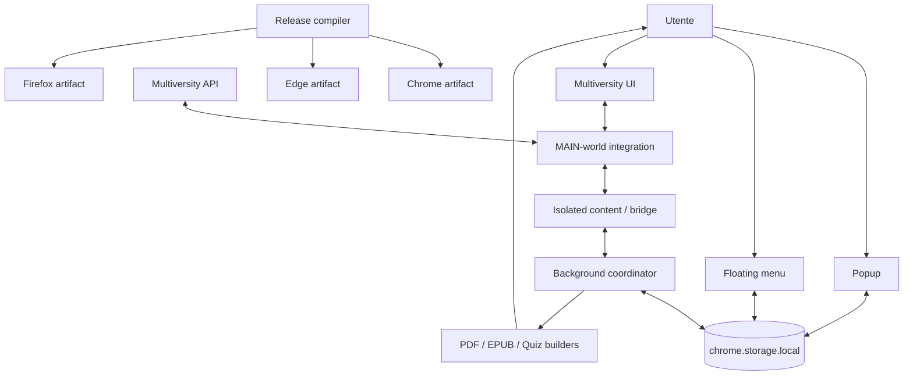
```mermaid
flowchart TB
    USER[Utente]
    LMS[Multiversity UI]
    API[Multiversity API]

    MAIN[MAIN-world integration]
    ISO[Isolated content / bridge]
    BG[Background coordinator]
    STORE[(chrome.storage.local)]
    POP[Popup]
    FLOAT[Floating menu]
    BUILDERS[PDF / EPUB / Quiz builders]
    RELEASE[Release compiler]

    USER --> POP
    USER --> FLOAT
    USER --> LMS

    LMS <--> MAIN
    API <--> MAIN
    MAIN <--> ISO
    ISO <--> BG

    BG <--> STORE
    POP <--> STORE
    FLOAT <--> STORE

    BG --> BUILDERS
    BUILDERS --> USER

    RELEASE --> CHROME[Chrome artifact]
    RELEASE --> EDGE[Edge artifact]
    RELEASE --> FIREFOX[Firefox artifact]
```

---

# Parte LXXXV — Data flow map

## 225. Progress / discovery

```text
API/DOM
  ↓
normalization
  ↓
cache/index
  ↓
discovery decision
  ↓
verified target
  ↓
DOM effect
```

---

## 226. Operation

```text
UI intent
  ↓
background coordinator
  ↓
persisted operation
  ↓
builder/source tab
  ↓
status events
  ↓
UI convergence
```

---

## 227. Release

```text
source commit
  ↓
target specialization
  ↓
artifact validation
  ↓
checksum
  ↓
store
```

---

# Parte LXXXVI — Control flow vs data flow

## 228. Distinzione utile

### Data flow

```text
where information moves
```

### Control flow

```text
who decides what happens next
```

---

## 229. In PlumePilot

Il background spesso coordina control flow di operazioni.

Il MAIN/content layer coordina playback navigation.

Storage distribuisce data state.

---

# Parte LXXXVII — Control plane vs data plane

## 230. Analogia

Possiamo leggere:

```text
background / settings / operation state
```

come una forma di **control plane**.

---

## 231. Data plane

```text
actual DOM navigation
PDF bytes
EPUB assets
API payloads
```

---

## 232. Non è una separazione perfetta

Ma aiuta a capire perché il background non deve fare DOM work.

---

# Parte LXXXVIII — Architecture pressure points

## 233. Le aree che oggi mostrano più pressione

```text
content.js size
implicit global state
source-slicing tests
message types sparsi
multiple caches
manual release coordination
```

---

## 234. Questo non significa rifattorizzare tutto ora

Significa sapere dove il prossimo aumento di complessità potrebbe costare di più.

---

# Parte LXXXIX — Evolutionary architecture

## 235. Il progetto non ha bisogno di “big rewrite” per migliorare

Possiamo evolvere con piccoli passi:

```text
extract pure helper
add result type
introduce adapter
centralize message constants
add test runner
```

---

## 236. Ogni passo deve preservare comportamento

Regression suite prima.

Refactor poi.

---

# Parte XC — Fitness functions

## 237. Concetto utile

Una **architecture fitness function** verifica automaticamente una proprietà architetturale.

---

## 238. Esempi già presenti

```text
Firefox package has no offscreen
menu-ux loads before floating menu
cache remains bounded
active operation controls stay reachable
```

---

## 239. Futuro

Potremmo aggiungere fitness function per:

```text
no direct DOM selectors outside adapter
no new unbounded Map
all runtime message types declared centrally
```

solo se il beneficio supera il costo.

---

# Parte XCI — Architecture by tests

## 240. Una parte dell’architettura è codificata nei test

Non solo nei diagrammi.

Il test:

```text
master 100% is not proof
```

è una regola architetturale sulla gerarchia delle fonti.

---

# Parte XCII — Architecture by build

## 241. `build-release.mjs`

codifica:

```text
browser boundary
permission boundary
review boundary
```

---

# Parte XCIII — Architecture by storage schema

## 242. Le chiavi persistenti raccontano il domain model

```text
platform:course
operation id
commission lease
achievement state
```

---

# Parte XCIV — Architecture by naming

## 243. Nomi come `operation`, `lease`, `target`, `identity`, `snapshot`

non sono cosmetici.

Rendono espliciti modelli.

---

# Parte XCV — Lease

## 244. Commission check

Una lease dice:

```text
questo tab possiede temporaneamente il diritto di fare il check
```

con:

```text
expiresAt
```

---

## 245. Perché non boolean lock

Se il tab muore:

```text
boolean true
```

potrebbe restare bloccato.

Una lease scade.

---

## 246. Distributed systems pattern in miniatura

Browser extension + multiple tabs hanno già abbastanza concorrenza da rendere utile questo pattern.

---

# Parte XCVI — Recovery-oriented design

## 247. Supporre che qualcosa possa interrompersi

```text
tab hidden
page reload
service worker termination
network failure
```

---

## 248. Recovery state

Il progetto conserva abbastanza informazione per:

```text
riprendere
oppure fermarsi in modo sicuro
```

---

# Parte XCVII — Recovery vs persistence

## 249. Non tutto deve riprendere esattamente

A volte è meglio:

```text
abort current attempt
let user retry
```

piuttosto che costruire un distributed transaction manager eccessivo.

---

# Parte XCVIII — Simplicity budget

## 250. Ogni recovery mechanism ha costo

```text
state
migration
timeout
cleanup
edge cases
```

---

## 251. Scegliere il livello di resilienza proporzionato al valore

Export lungo:

```text
più recovery/cancel support
```

Piccola UI transition:

```text
può bastare retry locale
```

---

# Parte XCIX — Architecture and product constraints

## 252. PlumePilot è local-first

Non ha un backend developer-operated per gestire queste feature.

---

## 253. Conseguenze

```text
state locale
privacy surface ridotta
no remote job coordinator
browser memory limits
```

---

## 254. Se introducessimo un backend

Cambierebbe radicalmente:

```text
identity
auth
privacy
failure model
sync
cost
```

Quindi non è una semplice “feature tecnica”.

---

# Parte C — Local-first as architecture

## 255. Benefici

```text
privacy
zero server maintenance
offline generated artifacts
low operational cost
```

---

## 256. Costi

```text
browser resource limits
no cross-device sync
no central telemetry
harder long-running jobs
```

---

# Parte CI — Architecture and privacy

## 257. Local processing non è soltanto marketing

Influenza:

```text
PDF generation location
EPUB generation location
notes persistence
logging
permissions
```

---

# Parte CII — Security boundary

## 258. Host authenticated session

PlumePilot opera nella sessione dell’utente.

Questo significa che deve trattare:

```text
token
page content
exam data
```

come dati sensibili.

---

## 259. Memory-only token

Il bearer token intercettato resta in memoria invece di essere persistito.

È una scelta di lifetime + security.

---

# Parte CIII — Security architecture from least privilege

## 260. Permissions

Richiedere soltanto ciò che serve riduce:

```text
attack surface
review complexity
user concern
```

---

## 261. Browser-specific permission

Firefox non riceve `offscreen` se non la usa.

Questo è least privilege applicato al target.

---

# Parte CIV — Architecture and maintainability

## 262. Maintainability non significa pochi file

Significa:

```text
predictable change impact
clear boundaries
recoverable bugs
observable state
```

---

## 263. Un file grande può essere mantenibile se il modello è chiaro

Ma oltre una certa pressione, boundaries fisici aiutano a preservare il modello.

---

# Parte CV — Architecture maturity model per PlumePilot

## 264. Fase 1 — Feature-first

```text
make it work
```

---

## 265. Fase 2 — Regression-driven robustness

```text
fix real bugs
add recovery
```

---

## 266. Fase 3 — Pattern recognition

```text
identity
source hierarchy
state machine
cache semantics
```

---

## 267. Fase 4 — Explicit architecture

```text
extract modules
formalize protocols
fitness functions
```

PlumePilot oggi si trova fra fase 3 e fase 4 in diverse aree.

---

# Parte CVI — Non tutte le aree maturano insieme

## 268. Release tooling

È molto esplicito:

```text
build
validate
checksums
browser specialization
```

---

## 269. Playback

Ha molti pattern robusti ma ancora concentrati in un file grande.

---

## 270. UI

La 2.35.2 ha iniziato a estrarre presentation logic condivisa.

---

# Parte CVII — Architecture scorecard

## 271. Possiamo valutare ogni subsystem con domande

```text
Who owns state?
What is identity?
What is source of truth?
What is the failure model?
What can be retried?
What is persisted?
What is bounded?
How is it cancelled?
How is it tested?
Which boundary can drift?
```

---

# Parte CVIII — Applicazione: autoplay

## 272. Owner

MAIN/content playback layer.

## 273. Identity

Course + chapter + lesson context.

## 274. Source hierarchy

Player/DOM + API + cached progress.

## 275. Failure model
DOM rerender, hidden tab, stale row, test boundary.

## 276. Cancellation

Enabled/busy/generation/manual selection.

## 277. Tests

Collapsed accordion, course order, skip API, hidden tab.

---

# Parte CIX — Applicazione: export

## 278. Owner

Background operation + builder page.

## 279. Identity

operationId + jobId.

## 280. Source

Course/material API/DOM.

## 281. Failure

missing asset, PDF parse, abort, memory.

## 282. Persistence

job handoff in local storage.

## 283. Cleanup

remove job, destroy PDF, revoke Blob URL.

---

# Parte CX — Applicazione: commission monitor

## 284. Owner

Background/store coordination.

## 285. Identity

platform + exam id.

## 286. Concurrency

lease + serialized write.

## 287. Persistence

local snapshots.

## 288. Failure

stale snapshot, duplicate check, tab closure.

---

# Parte CXI — Applicazione: UI

## 289. Owner

Storage + local controller.

## 290. Derived state

`autoplayPresentation()`.

## 291. Synchronization

storage events + runtime operation query.

## 292. Invariants

active operation remains visible/cancellable.

---

# Parte CXII — Applicazione: release

## 293. Owner

Build tooling.

## 294. Identity

commit SHA + artifact SHA + version.

## 295. Boundary

browser/store.

## 296. Failure

manifest mismatch, vendor drift, review-sensitive code.

## 297. Policy

fail build for deterministic violations.

---

# Parte CXIII — Architecture review checklist

## 298. Quando aggiungiamo una feature nuova

Prima di scrivere troppo codice, chiediamo:

```text
1. Qual è l’identità delle entità?
2. Qual è la source of truth?
3. Quale dato è soltanto hint/cache?
4. Qual è il lifetime dello state?
5. Chi lo possiede?
6. Dove sono i boundary esterni?
7. Quali side effect sono rischiosi?
8. Cosa facciamo con unknown?
9. Qual è il fallback?
10. Come cancelliamo?
11. Come limitiamo crescita/memoria?
12. Come testiamo l’invariante?
```

---

# Parte CXIV — Esercizio 1

Vogliamo aggiungere:

```text
“Riprendi automaticamente l’ultima attività aperta ieri”
```

Definisci:

```text
identity
storage lifetime
source of truth
staleness
manual override
```

Quali rischi crea una lesson identity basata soltanto sul testo?

---

# Parte CXV — Esercizio 2

Vogliamo introdurre una cache persistente delle lesson API.

Domande:

```text
TTL?
monotonic fields?
platform scoping?
course version?
invalidation?
privacy?
size bound?
```

Quando `chrome.storage.local` diventerebbe peggiore della Map attuale?

---

# Parte CXVI — Esercizio 3

Una nuova API browser permette una feature migliore soltanto su Chrome.

Progetta:

```text
domain capability
Chrome adapter
Firefox fallback
manifest specialization
artifact test
```

senza introdurre `if (chrome)` in dieci file.

---

# Parte CXVII — Esercizio 4

Il DOM host aggiunge una nuova university con struttura diversa.

Quali parti dovrebbero cambiare idealmente?

```text
DOM adapter
platform config
maybe API normalizer
```

Quali invece non dovrebbero cambiare?

```text
discovery semantics
operation model
export pipeline
```

---

# Parte CXVIII — Esercizio 5

Una feature richiede un side effect irreversibile.

Costruisci una policy:

```text
what evidence level is required?
what ambiguity blocks execution?
what confirmation is needed?
what result is persisted?
```

---

# Parte CXIX — Esercizio 6

Trovi una nuova Map globale.

Quali domande fai?

```text
cache or registry?
key identity?
who deletes entries?
bound?
lifetime?
can service worker die?
```

---

# Parte CXX — Esercizio 7

Una funzione fa:

```js
const row = currentLesson();
await fetchSomething();
click(row);
```

Individua il problema architetturale e riscrivilo come pattern, non come patch.

---

# Parte CXXI — Esercizio 8

Un result ritorna:

```js
false
```

per:

```text
cancelled
not found
ambiguous
network error
```

Progetta un result type più utile.

---

# Parte CXXII — Concetti da portarsi dietro

## 299. Boundary

Punto in cui cambiano ownership, trust, lifetime, API disponibili o modello dati.

## 300. Anti-corruption layer

Layer che traduce un modello esterno nel modello interno impedendo che dettagli del provider si diffondano nel dominio.

## 301. Stable identity

Identità che rimane valida durante il lifetime dell’operazione anche se la rappresentazione visuale o tecnica cambia.

## 302. Evidence hierarchy

Ordine esplicito di autorità fra fonti diverse dello stesso dato.

## 303. Ternary knowledge

Modello in cui un fatto può essere true, false oppure unknown.

## 304. Progressive refinement

Strategia che parte da evidenza economica e aumenta il costo solo quando serve maggiore precisione.

## 305. Ownership

Responsabilità di creare, modificare e rilasciare uno state o una risorsa.

## 306. Temporal validity

Validità di un dato rispetto al tempo e ai punti di sospensione asincroni.

## 307. Revalidation

Rilettura/verifica dello state dopo un `await` prima di eseguire un side effect.

## 308. Generation token

Numero/versione usato per invalidare continuazioni asincrone appartenenti a una precedente operazione.

## 309. Semantic parity

Stesso comportamento osservabile ottenuto con meccanismi interni differenti.

## 310. Derived state

State calcolabile deterministicamente da altre fonti e quindi spesso non necessario da persistere separatamente.

## 311. Bounded growth

Proprietà per cui una struttura long-lived ha regole esplicite di limite, scadenza o eviction.

## 312. Cooperative cancellation

Cancellazione in cui il lavoro controlla periodicamente uno stato/AbortSignal e termina volontariamente.

## 313. Cost model

Modello qualitativo o quantitativo del costo di operazioni alternative usato per scegliere fast e slow path.

## 314. Architecture fitness function

Test o validator che verifica automaticamente una proprietà architetturale nel tempo.

## 315. Volatility boundary

Boundary progettato per isolare parti che cambiano spesso da parti semanticamente più stabili.

## 316. Human-in-the-loop automation

Automazione progettata per assistere l’utente mantenendo priorità all’intento manuale esplicito.

---

# Parte CXXIII — Recap

Dopo quindici capitoli possiamo descrivere PlumePilot senza nominare una singola feature specifica.

È un sistema che:

```text
integra un host esterno instabile
attraversa più execution context
mantiene stato con lifetime differenti
coordina operazioni asincrone
usa fonti di dati con autorità differenti
protegge side effect con identity e revalidation
produce artefatti locali complessi
si adatta a più browser e store
```

La sua architettura reale non è un pattern unico.

È un insieme di idee ricorrenti:

```text
boundary
identity
source of truth
unknown
progressive refinement
fail closed
ownership
lifetime
state machines
idempotence
snapshot + event
cache semantics
bounded growth
cancellation
backpressure
semantic parity
artifact thinking
executable invariants
```

La lezione più importante è forse questa:

> **L’architettura emerge dalle assunzioni che decidiamo di rendere esplicite.**

Finché un’assunzione rimane nascosta:

```text
“il DOM resterà lì”
“100% significa davvero completo”
“il background resterà vivo”
“il browser si comporterà uguale”
```

prima o poi diventa un bug.

Quando invece la trasformiamo in:

```text
identity
protocol
state
invariant
adapter
test
```

entra nella struttura del sistema.

Ed è proprio questo il passaggio da:

```text
codice che funziona oggi
```

a:

```text
software che sappiamo far evolvere domani
```

---

# Prossimo capitolo

## 17 — Cosa rifaremmo diversamente oggi?

Il capitolo finale sarà volutamente critico.

Non cercheremo errori da giudicare con il senno di poi.

Ci chiederemo invece:

```text
se iniziassimo PlumePilot oggi,
con tutto ciò che abbiamo imparato,
quali decisioni prenderemmo diversamente?
```

Parleremo di:

```text
modularizzazione di content.js
API interne tipizzate
message contracts
state management
DOM adapters
cache boundaries
worker/off-main-thread opportunities
test architecture
release automation
architecture documentation
```

ma anche di ciò che **non** rifaremmo:

alcune soluzioni imperfette sono state perfettamente ragionevoli per arrivare fin qui.

Il punto non sarà progettare un “PlumePilot ideale”.

Sarà capire come distinguere:

```text
technical debt reale
```

da:

```text
semplice complessità inevitabile di un prodotto vero
```

---

# 17 — Cosa rifaremmo diversamente oggi?

## Una retrospettiva senza senno di poi

> **Snapshot di riferimento del capitolo**  
> Questo capitolo chiude il libro sul candidato **PlumePilot 2.35.2**, branch `feat/ui-ux-2.35.2`, commit  
> `f6fcb4c29c83ba9150df0be31da04fc91dffb634`.

Arrivati alla fine di un progetto reale è molto facile guardare indietro e dire:

```text
questo file è troppo grande
questa API interna è troppo implicita
qui sarebbe servito un modulo
lì avremmo dovuto usare un framework
```

Il problema è che questa valutazione conosce già il futuro.

Quando PlumePilot era più piccolo non sapevamo ancora che avrebbe avuto:

```text
tre università
Chrome + Edge + Firefox
popup + floating menu
PDF + HTML + EPUB
editor rich-text offline
autoplay con più policy
commission monitor
achievement e Gaming UI
release build specifiche per browser
```

Un'architettura ottima per un progetto di tre file può essere una pessima architettura per un progetto di cinquanta feature.

Ma vale anche il contrario:

> **Progettare fin dal primo giorno come se il progetto fosse già enorme può essere un'altra forma di errore.**

Questo capitolo non vuole quindi rispondere:

```text
“qual era l'architettura perfetta?”
```

Vuole rispondere a una domanda più utile:

> **Ora che conosciamo davvero la forma del problema, quali decisioni prenderemmo diversamente se dovessimo continuare a far crescere PlumePilot?**

---

# Parte I — Prima distinzione: debito non significa errore

## 1. Quattro categorie diverse

Quando riguardiamo una decisione passata possiamo classificarla come:

```text
errore
trade-off
scaling debt
decisione ancora corretta
```

Sono categorie molto diverse.

---

## 2. Errore

Una decisione era sbagliata già rispetto alle informazioni disponibili.

Esempio ipotetico:

```text
salvare un bearer token persistente senza necessità
```

Sarebbe difficile giustificarlo anche in una versione piccola.

---

## 3. Trade-off

Abbiamo scelto consapevolmente semplicità in cambio di un limite.

Esempio:

```text
vanilla JavaScript
senza bundler
```

ha ridotto toolchain, build complexity e review surface.

Non è un errore solo perché il progetto è poi cresciuto.

---

## 4. Scaling debt

Una decisione semplice era corretta quando il sistema era piccolo, ma oggi costa più di quanto faccia risparmiare.

Esempio:

```text
molta logica concentrata in content.js
```

All'inizio:

```text
un file
facile da caricare
nessun module graph
```

Oggi:

```text
più domini
più stato
più test che estraggono source slice
più rischio di coupling
```

Questa è una categoria particolarmente importante.

---

## 5. Decisione ancora corretta

Una scelta può sembrare “semplice” ma continuare a essere appropriata.

Per esempio:

```text
nessun backend proprietario necessario
```

PlumePilot opera localmente sulle piattaforme a cui l'utente è già autenticato.

Aggiungere un server solo perché “le app serie hanno un backend” aumenterebbe:

```text
privacy surface
operational cost
security obligations
failure modes
```

senza un beneficio automatico.

---

# Parte II — Evitare la riscrittura totale

## 6. La tentazione

Dopo sedici capitoli potremmo disegnare una nuova struttura elegantissima e concludere:

```text
riscriviamo tutto
```

È una tentazione pericolosa.

---

## 7. Cosa perderemmo

Il codice attuale contiene conoscenza accumulata attraverso:

```text
bug reali
layout reali
race reali
store rejection reali
fallback reali
```

Molti dettagli apparentemente strani esistono perché una condizione del mondo reale li ha resi necessari.

Una rewrite tende a ricordare:

```text
feature visibili
```

e dimenticare:

```text
edge case invisibili
```

---

## 8. Strangler approach

Una strategia più sana è:

```text
sistema esistente
      ↓
identifica boundary
      ↓
introduci modulo nuovo
      ↓
sposta responsabilità gradualmente
      ↓
rimuovi vecchio path quando non serve più
```

È simile al pattern spesso chiamato **Strangler Fig**.

Non sostituiamo tutto in una volta.

Facciamo crescere una struttura migliore attorno alle parti che hanno davvero bisogno di cambiare.

---

# Parte III — La prima cosa che cambieremmo: i confini di `content.js`

## 9. Il problema

`content.js` oggi contiene responsabilità molto diverse:

```text
DOM discovery
autoplay
API coordination
cache
material collection
first-incomplete discovery
progress tracking
recovery
```

Non è necessariamente un “God object” classico, perché molte funzioni sono ben delimitate.

Ma il file è diventato un **convergence point**.

---

## 10. Cosa faremmo oggi

Non divideremmo semplicemente il file in:

```text
content1.js
content2.js
content3.js
```

La separazione deve seguire responsabilità.

Una possibile struttura:

```text
playback/
  identity.mjs
  discovery.mjs
  autoplay-policy.mjs
  recovery.mjs

platform/
  dom-adapter.mjs
  api-adapter.mjs

cache/
  lesson-cache.mjs
  material-cache.mjs

content.js
  orchestration + browser effects
```

---

## 11. Regola

Estrarre prima ciò che ha:

```text
input chiari
output chiari
pochi side effect
```

Non partire dalle funzioni più grandi.

Partire dalle funzioni con boundary migliori.

---

# Parte IV — Functional core / imperative shell

## 12. Cosa significa

Possiamo organizzare parte del sistema così:

```text
raw state
   ↓
pure/quasi-pure decision
   ↓
command
   ↓
browser effect
```

---

## 13. Esempio first incomplete

Oggi molte fasi sono già concettualmente separabili.

Potremmo avere:

```js
const plan = chooseDiscoveryPlan({
  outline,
  masterIndex,
  verifiedComplete,
  mode,
});
```

che produce:

```js
{
  candidates: [...],
  requiresFreshData: true,
  fallbackPolicy: "visual"
}
```

Poi la shell esegue:

```text
API request
DOM open
click
```

---

## 14. Vantaggio

Possiamo testare:

```text
master stale
candidate order
ambiguous identity
```

senza caricare metà `content.js` in `node:vm`.

---

# Parte V — Ma non renderemmo tutto puro

## 15. Una browser extension vive di side effect

Dobbiamo:

```text
cliccare
osservare DOM
mandare messaggi
aprire tab
scrivere storage
creare Blob
```

Provare a nascondere tutto dietro un'astrazione puramente funzionale produrrebbe probabilmente codice più difficile da leggere.

---

## 16. Obiettivo realistico

```text
decision logic → pura quando conviene
browser interaction → esplicita
```

Non:

```text
zero side effects
```

---

# Parte VI — Seconda cosa: un vero Platform Adapter

## 17. Il problema

Nel tempo abbiamo introdotto:

```text
Pegaso
Mercatorum
UTSR / San Raffaele
```

Molto codice è comune.

Alcune differenze sono:

```text
DOM shape
platform ID
storage scoping
copy
URL patterns
```

---

## 18. Oggi formalizzeremmo prima l'adapter

Per esempio:

```js
const platform = {
  id,
  courseCodeFromUrl(),
  sections(),
  chapters(section),
  currentLesson(),
  commissionLabel(...),
};
```

Non necessariamente una classe.

Potrebbe essere un semplice oggetto di funzioni.

---

## 19. Perché

Il core dovrebbe chiedere:

```text
“qual è il capitolo corrente?”
```

non:

```text
“se siamo Pegaso cerca div.border-t,
se siamo Mercatorum usa questo fallback...”
```

---

# Parte VII — Anti-corruption layer più esplicito

## 20. Oggi esiste già implicitamente

Abbiamo normalizzatori per:

```text
master API
lesson API
commission data
DOM identities
```

Questa è già una forma di anti-corruption layer.

---

## 21. Cosa cambieremmo

Raggrupperemmo i contratti esterni in moduli dedicati:

```text
external/multiversity-api.mjs
external/course-dom.mjs
external/browser-runtime.mjs
```

Il resto del sistema consumerebbe strutture normalizzate.

---

# Parte VIII — Terza cosa: protocolli di messaging espliciti

## 22. Oggi

I messaggi hanno shape come:

```js
{
  type: "PEGASO_START_EXPORT",
  ...
}
```

Il Capitolo 2 ha mostrato che, di fatto, questi messaggi sono API interne.

---

## 23. Oggi li tratteremmo davvero come API

Una struttura possibile:

```text
protocol/
  messages.mjs
  validators.mjs
  version.mjs
```

con costanti:

```js
export const MessageType = Object.freeze({
  START_EXPORT: "PEGASO_START_EXPORT",
  CANCEL_EXPORT: "PEGASO_CANCEL_EXPORT",
  ...
});
```

---

## 24. Schema

Per messaggi critici potremmo validare:

```text
type
required fields
ID format
payload bounds
```

al boundary.

---

## 25. Perché non necessariamente JSON Schema

Potrebbe essere utile.

Ma per un protocollo interno piccolo può bastare:

```js
function parseStartExportMessage(value) {
  ...
}
```

L'obiettivo è rendere il contract esplicito, non aggiungere tecnologia per principio.

---

# Parte IX — Protocol versioning?

## 26. Non serve sempre

Content script e background vengono aggiornati normalmente insieme.

Quindi non abbiamo un distributed system con server vecchi e client nuovi per mesi.

---

## 27. Ma lifecycle diversi esistono

Durante un update possono convivere temporaneamente:

```text
page vecchia
extension runtime nuovo
```

oppure una pagina può restare aperta mentre l'estensione si aggiorna.

Per messaggi critici, un semplice:

```text
protocolVersion
```

potrebbe rendere failure più chiari in futuro.

---

# Parte X — Quarta cosa: state machine più esplicita per autoplay

## 28. Il Capitolo 7

Abbiamo visto che autoplay è già una state machine.

Ma lo stato è distribuito fra:

```text
booleans
context
stored settings
recovery markers
DOM state
```

---

## 29. Oggi introdurremmo un reducer/state transition layer

Non necessariamente XState.

Potrebbe bastare:

```js
function transition(state, event) {
  switch (state.phase) {
    ...
  }
}
```

---

## 30. State shape possibile

```js
{
  phase: "watching",
  playback: {...},
  policy: {...},
  pendingBoundary: null,
  generation: 12,
}
```

---

## 31. Eventi

```text
VIDEO_PLAY
VIDEO_ENDED
COMPLETION_CONFIRMED
TEST_FOUND
USER_NAVIGATED
POLICY_CHANGED
CANCEL
TAB_HIDDEN
```

---

## 32. Vantaggio

La precedenza fra:

```text
70%
chapter limit
test stop
auto-complete
manual selection
```

sarebbe leggibile in un unico luogo.

---

# Parte XI — Non centralizzeremmo tutto lo stato

## 33. Un Redux globale sarebbe eccessivo

PlumePilot ha contesti separati.

Un unico store globale “magico” richiederebbe comunque:

```text
messaging
serialization
lifecycle handling
```

---

## 34. Stato locale resta valido

Un buon principio è:

```text
state vicino al suo owner
```

con:

```text
protocollo esplicito quando attraversa un boundary
```

---

# Parte XII — Quinta cosa: storage repository e schema versionato

## 35. Oggi

Abbiamo wrapper:

```text
storageGet
storageSet
storageRemove
```

ma molte chiavi vengono ancora conosciute da moduli differenti.

---

## 36. Evoluzione

Potremmo avere:

```text
storage/
  preferences-repository.mjs
  operation-repository.mjs
  commission-repository.mjs
  course-state-repository.mjs
  migrations.mjs
```

---

## 37. Il caller chiederebbe

```js
await courseState.get(courseIdentity);
```

anziché conoscere direttamente:

```text
chiave
legacy key
platform prefix
migration fallback
```

---

# Parte XIII — Schema versioning

## 38. Per strutture persistenti complesse

È utile salvare:

```js
{
  version: 3,
  ...
}
```

come già facciamo in alcuni snapshot.

---

## 39. Migration pipeline

```text
v1
 ↓ migrate
v2
 ↓ migrate
v3
```

La normalizzazione legacy non resta sparsa indefinitamente nel codice di lettura.

---

# Parte XIV — Sesta cosa: cache policy comune

## 40. Oggi

Abbiamo più `Map` con policy differenti:

```text
lessonApiCache
materialLinkCache
pageLessonSnapshots
pending requests
```

La differenza è spesso giustificata.

Ma alcune regole ricorrono.

---

## 41. Policy esplicita

Per ogni cache documenteremmo:

```text
key
entry schema
freshness
max size
invalidation
monotonic fields
negative caching
owner
```

---

## 42. Non una GenericCache<T> universale

Una cache di lesson detail e una pending request registry hanno semantiche diverse.

Creare una mega-classe generica rischia di nascondere proprio ciò che ci interessa.

---

## 43. Riutilizzare primitive, non semantiche

Potremmo condividere helper per:

```text
bounded insertion
TTL check
in-flight coalescing
```

mantenendo policy di dominio separate.

---

# Parte XV — In-flight request coalescing

## 44. Miglioramento concreto

Se due caller chiedono contemporaneamente:

```text
same course + lesson detail
```

potremmo avere:

```text
Map<cacheKey, Promise<Response>>
```

---

## 45. Flow

```text
first caller
   ↓ miss
create request
store Promise

second caller
   ↓ hit in-flight
reuse Promise
```

Poi:

```text
finally → remove in-flight
```

---

## 46. Beneficio

Evita cache stampede senza trasformare ogni fetch in serializzazione globale.

---

# Parte XVI — Settima cosa: Discovery Engine separato

## 47. First incomplete e skip-completed condividono concetti

Entrambi ragionano su:

```text
course order
master hints
lesson details
identity
completion evidence
```

ma con policy differenti.

---

## 48. Oggi introdurremmo un engine

```text
DiscoveryEngine
```

che restituisce target logici.

---

## 49. Mode

```text
bookmark-first-incomplete
forward-incomplete-video
sequential-next
```

---

## 50. Output

```js
{
  status: "target",
  chapterIdentity,
  activityIdentity,
  evidence,
  requiresVisualVerification
}
```

---

## 51. DOM adapter dopo

Solo dopo aver scelto logicamente il target:

```text
open section
open chapter
resolve row
click
```

Questo ridurrebbe il coupling fra:

```text
search algorithm
UI navigation
```

---

# Parte XVII — Ottava cosa: una Intermediate Representation per gli export

## 52. PDF, EPUB e HTML sono pipeline diverse

Ma condividono alcuni input:

```text
course title
section/chapter order
assets
questions
metadata
```

---

## 53. IR esplicita

Potremmo normalizzare prima in:

```js
{
  course,
  sections: [
    {
      title,
      chapters: [...]
    }
  ],
  assets: [...]
}
```

Poi renderer distinti:

```text
IR → PDF
IR → EPUB
IR → HTML
```

---
## 54. Non sempre una IR unica

I test export e le dispense hanno domini diversi.

Quindi potremmo avere:

```text
CourseMaterialIR
QuizIR
```

anziché un oggetto universale enorme.

---

# Parte XVIII — Nona cosa: worker per CPU-heavy export?

## 55. Potenziale miglioramento

Alcune fasi EPUB/PDF consumano:

```text
CPU
canvas
compression
hash
```

Spostare parte del lavoro in un Worker potrebbe ridurre il main-thread blocking.

---

## 56. Ma non è automaticamente più veloce

Worker introduce:

```text
message passing
structured clone / transfer
worker lifecycle
library compatibility
memory duplication se trasferiamo male
```

---

## 57. Prima misurare

Dal Capitolo 12:

```text
profiling first
```

Se il problema reale è:

```text
peak memory
```

un Worker potrebbe persino peggiorarlo se duplica buffer.

---

## 58. Transferable

Se usassimo Worker, dovremmo progettare ownership esplicita di:

```text
ArrayBuffer
```

tramite transferable quando appropriato.

---

# Parte XIX — Decima cosa: rich-text editor con command model più moderno

## 59. Oggi

L'editor usa pragmaticamente:

```text
execCommand
DOM manipulation
Selection
Range
```

Funziona e conserva bene alcune undo semantics.

---

## 60. Debito futuro

`execCommand()` è deprecato.

Se l'editor continuasse a crescere, investiremmo in un command model esplicito.

---

## 61. Command

```text
ToggleBold
ApplyHighlight
InsertChecklist
WrapCallout
ExitBlock
ClearFormat
```

Ogni command definisce:

```text
precondition
DOM transform
selection restoration
undo semantics
```

---

## 62. Input Events

Studieremmo più a fondo:

```text
beforeinput
inputType
Selection API
```

per ridurre dipendenza da comandi legacy.

---

# Parte XX — Ma non costruiremmo Google Docs

## 63. Scope

L'editor serve per:

```text
appunti di studio offline
```

Non per collaborazione realtime, track changes o layout editoriale complesso.

---

## 64. Quindi

Non adotteremmo automaticamente:

```text
ProseMirror
Slate
Lexical
```

solo perché sono potenti.

Il costo deve essere giustificato dallo scope.

---

# Parte XXI — Undicesima cosa: shared UI primitives più formali

## 65. La 2.35.2 ha già iniziato

`menu-ux.js` e `menu-ux.css` condividono:

```text
presentation model
style roles
layout rules
```

---

## 66. Passo successivo

Potremmo formalizzare primitive come:

```text
Disclosure
SettingsGroup
ActionRow
StatusBanner
OperationControl
TabController
```

---

## 67. Ma senza framework obbligatorio

Vanilla DOM factory:

```js
function createSettingsGroup({...}) {
  ...
}
```

può essere sufficiente.

---

# Parte XXII — React?

## 68. La domanda inevitabile

Con UI più grande potremmo chiedere:

```text
“non sarebbe meglio React?”
```

La risposta corretta non è sì o no in assoluto.

---

## 69. Cosa risolverebbe

Potrebbe aiutare con:

```text
component composition
render derivato dallo state
shared UI primitives
conditional rendering
```

---

## 70. Cosa introdurrebbe

```text
bundler
runtime/library weight
build transforms
source maps
review complexity
migration cost
```

oltre a non risolvere automaticamente:

```text
extension messaging
DOM host integration
API reverse engineering
browser packaging
```

---

## 71. Decisione oggi

Per la scala attuale, probabilmente **non riscriveremmo la UI in React**.

Estrarremmo prima:

```text
view models
DOM helpers
shared controllers
```

Se poi la UI diventasse molto più complessa, rivaluteremmo con dati reali.

---

# Parte XXIII — TypeScript?

## 72. Qui la risposta è più favorevole, ma graduale

Molti bug potenziali riguardano shape:

```text
message
API response
cache entry
operation
layout config
```

Type information avrebbe valore.

---

## 73. Ma una migrazione totale non è necessaria

Potremmo partire da:

```text
JSDoc
// @ts-check
```

su moduli nuovi.

---

## 74. Esempio

```js
/**
 * @typedef {Object} PlaybackTarget
 * @property {"target"|"end"|"fallback"} status
 * @property {ChapterIdentity=} chapter
 */
```

L'editor/TypeScript language service può trovare molte inconsistenze senza cambiare runtime.

---

# Parte XXIV — Type checking ai boundary

## 75. Priorità

Prima tipizzeremmo:

```text
message protocol
normalized API models
storage records
operation state
```

perché sono boundary dove una shape errata ha effetto ampio.

---

## 76. Non tipizzare CSS class string per sport

Il valore di un type system è maggiore dove:

```text
il dominio è strutturato
```

non dove aggiunge solo annotazioni meccaniche.

---

# Parte XXV — Dodicesima cosa: test runner unico

## 77. Dal Capitolo 14

Oggi i test sono molti file `.mjs` indipendenti.

Funziona.

Ma è facile dimenticarne uno.

---

## 78. Introduzione semplice

```text
scripts/test-all.mjs
```

che:

```text
enumera suite
esegue in ordine stabile
riassume fallimenti
```

---

## 79. Categorie

```text
test:fast
test:browser
test:release
```

anche senza aggiungere dipendenze npm.

---

# Parte XXVI — Tredicesima cosa: CI

## 80. Oggi avrebbe ROI positivo

PlumePilot ha ormai abbastanza invarianti da giustificare una CI minima.

Per ogni PR:

```text
Node regression suite
static/source invariants
basic release consistency
```

---

## 81. Browser check

Potrebbe girare:

```text
su PR UI
nightly
pre-release
```

se il costo è maggiore.

---

## 82. Release job

Su tag/candidate:

```text
build 3 target
validate
publish checksums/artifacts
```

potrebbe essere automatizzato.

---

# Parte XXVII — Ma non automatizzeremmo la decisione di pubblicare

## 83. Store release

Per un progetto piccolo, un gate umano prima di:

```text
submit/publish
```

resta utile.

Specialmente quando cambiano:

```text
permissions
review notes
screenshots
UX
```

---

# Parte XXVIII — Quattordicesima cosa: browser E2E target-specific

## 84. Priorità future

Aggiungeremmo alcuni E2E ad alto valore:

```text
popup ↔ storage sync
floating ↔ storage sync
service worker restart
operation recovery
builder handoff
Firefox target package load
```

---

## 85. Pochi, non centinaia

Gli E2E sono costosi.

Devono proteggere boundary che i test Node non possono rappresentare bene.

---

# Parte XXIX — Quindicesima cosa: fixture API versionate

## 86. Oggi molte suite costruiscono dati sintetici

È ottimo per property test.

Ma potremmo anche mantenere alcune response reali **sanitizzate**:

```text
master
lesson detail
commission
```

---

## 87. Beneficio

Quando aggiorniamo normalizzatori possiamo verificare:

```text
shape reale storica
```

oltre a input sintetici.

---

# Parte XXX — Privacy prima di fixture

## 88. Mai committare raw payload privati

Le fixture devono rimuovere:

```text
token
utente
email
ID sensibili
contenuti non necessari
```

---

# Parte XXXI — Sedicesima cosa: structured diagnostics

## 89. Oggi

Abbiamo log e alcuni `diagnostics` object.

---

## 90. Potremmo standardizzare

```js
{
  event: "playback.discovery.target",
  courseCode,
  lessonNumber,
  source: "master+detail",
  elapsedMs,
}
```

---

## 91. Non telemetria remota

Structured diagnostics può restare:

```text
locale
opt-in/debug-only
```

Non serve creare un analytics backend.

---

## 92. Beneficio

Più facile:

```text
filtrare
confrontare timeline
scrivere test
```

rispetto a stringhe libere.

---

# Parte XXXII — Diciassettesima cosa: operation model più generale

## 93. Background operations

Oggi esiste già un modello:

```text
kind
phase
operationId
sourceTabId
builderTabId
```

È uno dei nuclei architetturali migliori del progetto.

---

## 94. Lo formalizzeremmo

Come un piccolo state machine/repository:

```text
idle
acquired
collecting
building
completed
cancelled
failed
```

---

## 95. Unificare senza appiattire

PDF materials, EPUB e tests possono condividere:

```text
ownership
cancellation
lifecycle
```

ma non per forza la stessa pipeline di contenuto.

---

# Parte XXXIII — Diciottesima cosa: cancellation come capability comune

## 96. Oggi è presente in molte pipeline

Ma introdurremmo un helper coerente:

```js
function createOperationContext({ signal, operationId, report }) {
  ...
}
```

---

## 97. Ogni stage riceve

```text
signal
progress reporter
identity
```

senza rileggere global state se non necessario.

---

# Parte XXXIV — Diciannovesima cosa: timeout/deadline abstraction

## 98. Oggi abbiamo molti timeout specifici

Questo è corretto.

Ma alcune operazioni ripetono:

```text
start time
loop
sleep
abort
hidden-tab compensation
```

---

## 99. Potremmo estrarre primitive

```text
waitUntil
withDeadline
retryWithBackoff
```

con policy passata dal caller.

---

## 100. Evitare `sleep()` generico come soluzione universale

L'helper non deve incoraggiare:

```text
attendi 2s e spera
```

Deve favorire:

```text
attendi condizione entro deadline
```

---

# Parte XXXV — Ventesima cosa: architecture decision records

## 101. Perché oggi servirebbero

Molte decisioni non sono ovvie dal codice:

```text
perché no backend?
perché Firefox vendor transform?
perché normal autoplay non salta completati?
perché master è solo hint?
perché popup e floating restano controller separati?
```

---

## 102. ADR piccolo

Un file:

```text
docs/adr/0007-master-index-is-a-hint.md
```

potrebbe contenere:

```text
context
decision
consequences
alternatives
```

---

## 103. Non documentare ogni `if`

ADR va usato per decisioni:

```text
costose da cambiare
non ovvie
cross-cutting
```

---

# Parte XXXVI — Ventunesima cosa: una mappa architetturale mantenuta

## 104. Questo libro è molto più grande del necessario per il repo

Non useremmo il libro stesso come unica architettura documentation operativa.

---

## 105. Un documento breve

```text
ARCHITECTURE.md
```

con:

```text
contexts
message flows
state ownership
external boundaries
release build
```

sarebbe sufficiente per orientarsi.

---

# Parte XXXVII — Cosa NON cambieremmo: local-first

## 106. Nessun backend PlumePilot

È ancora una scelta forte.

I dati necessari restano principalmente:

```text
nel browser
nella piattaforma universitaria
nei file generati localmente
```

---

## 107. Benefici

```text
privacy
zero account PlumePilot
zero server uptime
zero database migration
zero central data retention
```

---

## 108. Quando rivalutare

Solo se una feature richiedesse davvero:

```text
sync cross-device
collaboration
server-side processing
```

con valore sufficiente a giustificare il costo.

---

# Parte XXXVIII — Cosa NON cambieremmo: usare l'API dell'host quando serve

## 109. DOM-only sarebbe più fragile

La combinazione:

```text
API evidence
+
DOM interaction
```

è una delle architetture più importanti del progetto.

---

## 110. Continueremmo a trattare l'API come external contract fragile

Quindi:

```text
normalizer
fallback
validation
```

restano necessari.

---

# Parte XXXIX — Cosa NON cambieremmo: master come indice

## 111. La soluzione 2.35.1 è concettualmente solida

```text
cheap coarse signal
→ narrow search
→ detailed verification
```

È un pattern generale efficiente.

---

## 112. Non torneremmo a global scan

La refactor futura dovrebbe preservare questa semantica anche se cambia il codice.

---

# Parte XL — Cosa NON cambieremmo: fail-closed sulle azioni rischiose

## 113. Se identity è ambigua

```text
non saltare
```

---

## 114. Se build transform non corrisponde

```text
non produrre artifact
```

---

## 115. Se completion non è provata

```text
non dichiarare tutto completo
```

Questo principio deve sopravvivere a qualsiasi refactor.

---

# Parte XLI — Cosa NON cambieremmo: user control

## 116. Autoplay non deve diventare autopilota incontrollabile

Preferenze come:

```text
stop test
skip completed
70%
chapter limit
```

rendono l'automazione una policy scelta dall'utente.

---

## 117. Manual action wins

Una selezione manuale dell'utente deve continuare ad avere precedenza su timer/recovery automatici.

È una regola UX e di concurrency insieme.

---

# Parte XLII — Cosa NON cambieremmo: nessun raw `video.play()`

## 118. La piattaforma deve rimanere owner del player

PlumePilot orchestra la navigazione.

Non cerca di sostituire il playback engine dell'LMS.

---

## 119. Boundary corretto

```text
PlumePilot → seleziona attività
LMS → gestisce playback/sessione
```

Questo limita il coupling.

---

# Parte XLIII — Cosa NON cambieremmo: browser-specific build

## 120. Un unico ZIP “universale” non è automaticamente migliore

Oggi sappiamo che:

```text
Firefox manifest
Edge locales
Chromium offscreen
AMO review transforms
```

sono differenze reali.

---

## 121. Continueremmo a specializzare in build

Possibilmente con test/CI migliori.

---

# Parte XLIV — Cosa NON cambieremmo: readable vendor + deterministic transforms

## 122. È un investimento che ha valore

Non solo per gli store.

Anche per:

```text
provenance
debug
supply-chain awareness
```

---

# Parte XLV — Cosa NON cambieremmo: niente remote executable code

## 123. L'estensione può recuperare dati

Ma la sua logica deve rimanere:

```text
nel package
```

Questo semplifica:

```text
security
review
reproducibility
```

---

# Parte XLVI — Cosa NON cambieremmo: vanilla prima di framework

## 124. La lezione non è “vanilla sempre”

È:
> **Usa la complessità minima che risolve il problema corrente.**

---

## 125. All'inizio

Vanilla JavaScript era una scelta eccellente.

Oggi il progetto può introdurre più struttura senza dover cambiare paradigma completamente.

---

# Parte XLVII — Cosa NON cambieremmo: test nati dai bug

## 126. La suite è imperfetta

Ma contiene conoscenza preziosa.

Un refactor deve:

```text
migliorare la test architecture
```

senza perdere:

```text
regression knowledge
```

---

# Parte XLVIII — Refactor priority matrix

## 127. Non tutto insieme

Classifichiamo per:

```text
beneficio
rischio
costo
```

---

## 128. Priorità alta, rischio basso/medio

```text
test runner unico
CI fast suite
ARCHITECTURE.md
ADR per decisioni principali
JSDoc/@ts-check sui nuovi boundary
message type constants/validators
estrazione di pure helpers
```

---

## 129. Priorità alta, rischio medio

```text
Discovery Engine
Platform/DOM Adapter
storage repositories
explicit autoplay state transitions
operation state model
```

---

## 130. Priorità media

```text
export IR
worker experimentation
structured diagnostics
fixture API sanitizzate
browser E2E più ampi
```

---

## 131. Priorità condizionale

```text
full TypeScript migration
framework UI
bundler generale
backend
```

Solo se nuove esigenze lo giustificano.

---

# Parte XLIX — Una roadmap incrementale

## 132. Fase A — Proteggere prima di spostare

Prima di un refactor grande:

```text
run all regression tests
aggiungi test mancanti sul boundary
```

---

## 133. Fase B — Estrarre logica pura

Per esempio:

```text
identity
candidate ordering
presentation model
storage key normalization
```

---

## 134. Fase C — Definire adapter

```text
platform DOM
API
storage
browser runtime
```

---

## 135. Fase D — Ridurre `content.js`

Lasciandogli principalmente:

```text
orchestration
event listeners
side effects
```

---

## 136. Fase E — Browser E2E

Dopo aver creato boundary più stabili.

---

# Parte L — Target architecture possibile

## 137. Una mappa

```mermaid
flowchart TD
    UI[Popup / Floating UI] --> VM[Presentation Models]
    UI --> MSG[Message Protocol]

    MSG --> BG[Background Coordinator]
    MSG --> CS[Content Orchestrator]

    CS --> FSM[Autoplay State Machine]
    CS --> DISC[Discovery Engine]
    CS --> DOM[Platform DOM Adapter]
    CS --> API[Multiversity API Adapter]

    DISC --> CACHE[Cache Policies]
    DISC --> API

    BG --> REPO[Storage Repositories]
    CS --> REPO

    BG --> JOB[Operation Manager]
    JOB --> EXPORT[Export Builders]

    EXPORT --> IR[Document IR]
    IR --> PDF[PDF Renderer]
    IR --> EPUB[EPUB Renderer]
    IR --> HTML[HTML Renderer]

    BUILD[Release Compiler] --> CH[Chrome Artifact]
    BUILD --> FF[Firefox Artifact]
    BUILD --> ED[Edge Artifact]
```

---

# Parte LI — Cosa guadagniamo

## 138. Più località

Un bug di route mapping vive in:

```text
Discovery Engine / identity
```

non in un file da migliaia di righe.

---

## 139. Più testabilità

Possiamo importare moduli direttamente.

---

## 140. Più ownership

Ogni stato ha un owner più evidente.

---

## 141. Più sostituibilità

Se Mercatorum cambia DOM:

```text
adapter
```

non discovery core.

---

# Parte LII — Cosa perdiamo

## 142. Più file

La navigazione del codebase diventa più complessa.

---

## 143. Import graph

Dobbiamo gestire ordine/caricamento/module support.

---

## 144. Più astrazioni

Un nuovo contributor può dover capire:

```text
adapter
repository
state machine
```

prima di cambiare una riga.

---

## 145. Quindi

La modularità non è gratis.

La adottiamo perché oggi la complessità del dominio la giustifica.

---

# Parte LIII — Evitare architecture astronautics

## 146. Segnale di pericolo

Se introduciamo:

```text
IPlaybackDiscoveryProviderFactory
AbstractCourseRepositoryAdapter
```

per chiamare una funzione che ha due implementazioni, potremmo essere andati troppo oltre.

---

## 147. Preferire forme JavaScript semplici

```text
function
plain object
Map
module export
```

finché bastano.

---

# Parte LIV — La migliore astrazione spesso arriva dopo due casi

## 148. Uno solo

Non sappiamo ancora cosa è accidentale e cosa è comune.

---

## 149. Due/tre casi

Possiamo vedere il pattern.

La 2.35.2 `menu-ux` è nata dopo che popup e floating menu avevano davvero mostrato drift.

È un buon esempio di astrazione introdotta al momento giusto.

---

# Parte LV — Rule of three, non dogma

## 150. Aspettare sempre tre duplicazioni può essere tardi

Se il rischio è alto:

```text
security
storage corruption
message protocol
```

può valere la pena astrarre prima.

---

# Parte LVI — TypeScript vs runtime validation

## 151. TypeScript non valida dati esterni a runtime

Anche con:

```ts
interface LessonResponse { ... }
```

l'API può restituire:

```text
qualunque JSON
```

---

## 152. Servono entrambi

```text
static type
+
runtime normalizer
```

Il primo protegge il nostro codice.

Il secondo protegge il boundary esterno.

---

# Parte LVII — Framework vs architecture

## 153. Un framework non crea boundary automaticamente

Possiamo avere:

```text
React spaghetti
```

come:

```text
vanilla spaghetti
```

---

## 154. Prima domanda

Non:

```text
“quale framework?”
```

ma:

```text
“quali responsabilità e state ownership?”
```

---

# Parte LVIII — Backend developer lesson

## 155. Molti concetti erano già familiari, con altri nomi

```text
browser message → internal RPC
chrome.storage → local persistence
DOM adapter → external integration adapter
master API → index
content script → edge worker/client agent
release ZIP → deployment artifact
```

---

## 156. La differenza principale

Nel browser:

```text
lifetime
DOM volatility
user interaction
render timing
```

sono molto più centrali.

---

# Parte LIX — Cosa questo progetto insegna sul frontend

## 157. Frontend non è solo rendering

PlumePilot mostra:

```text
state consistency
async orchestration
protocol design
resource management
recovery
```

esattamente come backend systems.

---

## 158. In più

Dobbiamo convivere con:

```text
focus
selection
layout
user timing
visibility
DOM lifecycle
```

che aggiungono nuove dimensioni.

---

# Parte LX — Cosa questo progetto insegna sul backend

## 159. Il client può essere un distributed system in miniatura

Abbiamo:

```text
più contexts
messaggi
persistenza
retry
timeout
leases
idempotence
```

senza un server nostro.

---

# Parte LXI — Cosa questo progetto insegna sulle estensioni

## 160. L'host non è nostro

Questo cambia tutto.

Non controlliamo:

```text
DOM
API
release LMS
timing
session
```

---

## 161. Quindi robustezza = adattamento

Un'estensione sana assume che il boundary esterno possa cambiare.

---

# Parte LXII — Cosa questo progetto insegna sul reverse engineering

## 162. Osservare prima di imitare

Capire:

```text
request
response
identity
session
```

prima di scrivere automazione.

---

## 163. Non usare una API privata come se fosse nostra

Normalizzare, verificare, fallback.

---

# Parte LXIII — Cosa questo progetto insegna sulle performance

## 164. Big-O non basta

Nel browser il costo reale include:

```text
network
render
canvas
GC
main-thread responsiveness
```

---

## 165. Ottimizzare il lavoro evitato

Spesso il miglior guadagno è:

```text
non aprire capitolo
non rifare fetch
non rasterizzare pagina
non duplicare asset
```

---

# Parte LXIV — Cosa questo progetto insegna sui test

## 166. Il bug migliore è quello che diventa property

```text
closed accordion
→ logical identity survives DOM reconstruction
```

Questo è molto più prezioso del fix locale.

---

# Parte LXV — Cosa questo progetto insegna su Git

## 167. Contenuto e storia sono assi diversi

Il caso 2.35.2:

```text
same tree
new parent
new commit
```

lo dimostra in modo quasi didatticamente perfetto.

---

# Parte LXVI — Cosa questo progetto insegna sulle release

## 168. Il prodotto non è il repository

È:

```text
artifact
+
store metadata
+
review
+
update path
```

---

# Parte LXVII — La domanda più importante per ogni nuova feature

## 169. Prima del codice

Chiediamo:

```text
chi possiede lo stato?
qual è l'identità stabile?
qual è la source of truth?
quali boundary attraversiamo?
cosa succede se fallisce?
come cancelliamo?
come testiamo?
```

---

## 170. Se non sappiamo rispondere

Non significa che dobbiamo bloccare lo sviluppo.

Ma sappiamo dove probabilmente nascerà il prossimo debito.

---

# Parte LXVIII — Architecture fitness questions

## 171. Per ogni subsystem

Possiamo usare una scorecard:

| Domanda | Risposta desiderata |
|---|---|
| Owner dello stato? | Uno chiaro |
| Identity? | Stabile e composita quando serve |
| Authority? | Esplicita |
| Lifetime? | Coerente con storage |
| Unknown? | Rappresentabile |
| Side effect? | Protetto da guard/revalidation |
| Cancellation? | Definita |
| Failure? | Classificata |
| Fallback? | Sicuro |
| Test? | Property verificabile |
| Boundary? | Normalizzato |
| Observability? | Sufficiente |

---

# Parte LXIX — Se ripartissimo domani: bootstrap iniziale

## 172. Repository

Fin dal primo giorno prepareremmo:

```text
src/
tests/
scripts/
docs/
```

ma senza creare decine di directory vuote.

---

## 173. Context modules

```text
background/
content/
popup/
shared/
```

prima divisione naturale.

---

## 174. Messaging

Un file shared per tipi/validator.

---

## 175. Storage

Wrapper + chiavi/schema in un punto.

---

## 176. Test

Un runner dal primo regression bug, non necessariamente dal primo commit.

---

## 177. Build

Browser-specific appena il secondo browser rende reale la differenza.

---

# Parte LXX — Cosa NON prepareremmo dal giorno uno

## 178. Non creeremmo subito

```text
microfrontend
state management framework
plugin architecture interna
dependency injection container
ORM per chrome.storage
generic event bus
```

senza un problema concreto.

---

# Parte LXXI — Architecture is discovered

## 179. Una parte dell'architettura viene progettata

```text
messaging
storage boundary
release build
```

---

## 180. Una parte viene scoperta

Solo dopo aver incontrato:

```text
closed accordion
stale master
multi-platform identity
store review
```

abbiamo capito alcune proprietà fondamentali.

---

## 181. Questo non è fallimento

È normale nei sistemi che integrano ambienti esterni non controllati.

La qualità sta nella velocità con cui trasformiamo esperienza in struttura.

---

# Parte LXXII — Il vero technical debt

## 182. Non è “codice brutto”

Technical debt è costo futuro creato da una scelta corrente.

Può essere consapevole o accidentale.

---

## 183. Esempio consapevole

```text
source slicing nei test
```

ha permesso di aggiungere regression test rapidamente.

Oggi sappiamo che alcuni moduli meritano export espliciti.

Quella scelta ha generato valore prima di generare costo.

---

# Parte LXXIII — Debt interest

## 184. Come sappiamo che è ora di pagarlo?

Quando vediamo ripetutamente:

```text
stesso bug class
stesso workaround
stessa difficoltà test
stessa modifica in più superfici
```

L'interesse è diventato visibile.

---

# Parte LXXIV — UI 2.35.2 come debt payment

## 185. Popup e floating menu avevano drift

Abbiamo introdotto:

```text
menu-ux.js
menu-ux.css
```

non perché duplicazione sia sempre male.

Perché il costo delle divergenze era diventato reale.

---

# Parte LXXV — Master-guided discovery come debt payment

## 186. Il global scan funzionava

Ma costava:

```text
DOM transitions
latenza
fragilità
```

Quando la scala del corso ha reso il costo visibile, abbiamo introdotto l'indice.

---

# Parte LXXVI — Firefox build come debt payment

## 187. All'inizio un package quasi comune era sufficiente

Poi le differenze di review/runtime sono diventate concrete.

La build specifica è arrivata quando esisteva un problema reale da risolvere.

---

# Parte LXXVII — Overengineering debt

## 188. Anche troppa architettura crea debito

Ogni abstraction:

```text
va imparata
testata
mantenuta
migrata
```

---

## 189. Una abstraction sbagliata può essere più costosa della duplicazione

Per questo:

```text
preferire duplication over wrong abstraction
```

può essere una buona scelta temporanea.

---

# Parte LXXVIII — Decision reversal cost

## 190. Prima di scegliere una tecnologia

Chiediamo:

```text
quanto costa cambiarla più avanti?
```

---

## 191. Decisione facilmente reversibile

```text
helper locale
CSS token
```

Possiamo sperimentare.

---

## 192. Decisione difficile

```text
backend centralizzato
framework UI completo
storage schema irreversibile
remote account system
```

Richiede più evidenza.

---

# Parte LXXIX — One-way vs two-way doors

## 193. Modello utile

### Two-way door

Facile tornare indietro.

### One-way-ish door

Costo alto per invertire.

---

## 194. PlumePilot

Prima di una one-way-ish decision chiediamo più dati.

Questo aiuta a evitare architettura prematura.

---

# Parte LXXX — Se dovessimo scegliere tre refactor soltanto

## 195. Primo

**Discovery Engine + Platform Adapter**.

Perché riduce coupling nella parte più delicata:

```text
API + DOM + identity + autoplay
```

---

## 196. Secondo

**Message contracts + operation/state models espliciti**.

Perché i contesti sono l'architettura fondamentale dell'estensione.

---

## 197. Terzo

**Test runner + CI + moduli importabili**.

Perché rende più sicuri tutti i refactor successivi.

---

# Parte LXXXI — Se dovessimo scegliere una cosa da NON fare

## 198. Rewrite completa

Non la farei.

---

## 199. Perché

PlumePilot oggi ha:

```text
feature funzionanti
store approval history
regression knowledge
multi-platform support
```

Una rewrite rimetterebbe tutto contemporaneamente in stato non provato.

---

# Parte LXXXII — Esercizio 1

Hai una funzione di 400 righe.

Quando è meglio:

```text
split meccanico
```

e quando:

```text
estrazione per responsibility
```

?

---

# Parte LXXXIII — Esercizio 2
Disegna un `PlaybackTarget` normalizzato che possa rappresentare:

```text
video
obiettivo
test
unknown visual fallback
```

senza esporre direttamente un DOM node.

---

# Parte LXXXIV — Esercizio 3

Quali campi metteresti in un `OperationState` comune a:

```text
PDF
EPUB
quiz export
```

?

Quali invece lasceresti specifici del job?

---

# Parte LXXXV — Esercizio 4

Immagina di migrare `content.js` a moduli.

Quale funzione estrarresti per prima?

Scegline una con:

```text
input/output chiari
pochi global
alta copertura test
```

---

# Parte LXXXVI — Esercizio 5

Vale la pena introdurre React se:

```text
popup ha 5 tab
floating menu simile
ma gran parte della complessità è messaging/DOM host?
```

Scrivi pro/contro prima di rispondere.

---

# Parte LXXXVII — Esercizio 6

Una API host cambia field name.

Dove dovrebbe rompersi idealmente?

```text
UI
business logic
normalizer boundary
```

Perché?

---

# Parte LXXXVIII — Esercizio 7

Hai tre cache con TTL diversi.

Conviene una classe generica `Cache`?

Elenca quali semantiche devono essere realmente condivise prima di astrarre.

---

# Parte LXXXIX — Esercizio 8

Vuoi spostare EPUB conversion in Worker.

Quali metriche raccogli prima?

```text
main-thread blocking
peak memory
transfer bytes
wall time
cancellation latency
```

---

# Parte XC — Concetti finali da portarsi dietro

## 200. Hindsight bias

Valutare una decisione passata usando informazioni disponibili solo successivamente.

---

## 201. Scaling debt

Scelta inizialmente adeguata che diventa costosa quando il sistema cresce.

---

## 202. Strangler refactor

Sostituzione incrementale di parti del sistema anziché rewrite totale.

---

## 203. Functional core / imperative shell

Decision logic con pochi side effect circondata da un layer che interagisce con il mondo esterno.

---

## 204. Platform adapter

Modulo che traduce differenze della piattaforma in un'interfaccia interna stabile.

---

## 205. Repository pattern

Boundary che centralizza accesso e schema della persistenza.

---

## 206. Intermediate Representation

Modello intermedio normalizzato usato fra acquisizione dati e renderer/trasformazioni.

---

## 207. In-flight coalescing

Riutilizzo della stessa Promise/request per richieste concorrenti equivalenti.

---

## 208. Structured diagnostics

Eventi diagnostici rappresentati come dati strutturati invece di sole stringhe libere.

---

## 209. ADR

Architecture Decision Record: breve documento che conserva contesto, decisione e conseguenze di una scelta architetturale.

---

## 210. Decision reversal cost

Costo necessario per invertire una decisione tecnica dopo che il sistema vi ha costruito sopra.

---

## 211. Wrong abstraction

Astrazione introdotta prima di comprendere correttamente ciò che è realmente comune.

---

# Parte XCI — Ulteriori letture

## 212. Architecture Decision Records

AWS Prescriptive Guidance:

https://docs.aws.amazon.com/prescriptive-guidance/latest/architectural-decision-records/adr-process.html

---

## 213. Strangler Fig Application

Martin Fowler:

https://martinfowler.com/bliki/StranglerFigApplication.html

---

## 214. Type checking per JavaScript

TypeScript Handbook:

https://www.typescriptlang.org/docs/handbook/type-checking-javascript-files.html

---

## 215. Input Events

W3C:

https://www.w3.org/TR/input-events-2/

---

# Parte XCII — La risposta finale

Se oggi iniziassimo PlumePilot sapendo tutto quello che sappiamo ora, costruiremmo una struttura più modulare.

Probabilmente avremmo prima:

```text
message contracts
platform adapter
storage repositories
discovery engine
explicit state transitions
```

E avremmo test importabili più facilmente.

Ma questa non è la parte più importante della risposta.

La parte importante è capire **perché non avevamo quella struttura all'inizio**.

Non conoscevamo ancora abbastanza bene il problema.

---

# Parte XCIII — Il progetto reale come processo di apprendimento

PlumePilot non è passato da:

```text
cattiva architettura
→ buona architettura
```

in un solo momento.

È passato attraverso una sequenza più realistica:

```text
problema concreto
   ↓
soluzione semplice
   ↓
uso reale
   ↓
caso limite
   ↓
nuova informazione
   ↓
refactor
   ↓
nuova invariante
```

Poi il ciclo ricomincia.

---

# Parte XCIV — Questa è forse la lezione più importante del libro

## 216. L'architettura non è il diagramma iniziale

È l'insieme di decisioni che permette al sistema di continuare a cambiare senza perdere le proprietà importanti.

---

## 217. Quindi una buona architettura non elimina il cambiamento

Lo rende:

```text
locale
comprensibile
verificabile
reversibile quando possibile
```

---

# Parte XCV — Tornando all'inizio

Nel Capitolo 0 avevamo posto una domanda:

> **Dove vive la verità?**

Dopo tutto il percorso possiamo dare una risposta più matura.

La verità non vive sempre in un unico posto.

Abbiamo:

```text
server authority
API snapshots
DOM observations
cache
storage
user intent
operation state
```

La qualità dell'architettura dipende dalla capacità di sapere:

```text
quale fonte usare
per quale decisione
con quale lifetime
con quale livello di fiducia
```

---

# Parte XCVI — Un secondo filo conduttore

Avevamo anche imparato che una browser extension non è un singolo programma.

Ora possiamo dirlo meglio:

```text
PlumePilot
=
insieme di bounded contexts locali
coordinati da protocolli
attorno a una piattaforma esterna non controllata
```

Non è una definizione formale.

Ma descrive bene il sistema.

---

# Parte XCVII — Un terzo filo conduttore: identity

Molti dei bug più difficili sono stati bug di identità:

```text
DOM node ≠ lesson
label ≠ global identity
exam_id ≠ cross-platform identity
branch history ≠ tree content
version ≠ artifact bytes
```

Una volta separata l'identità dalla rappresentazione temporanea, molti problemi diventano più semplici.

---

# Parte XCVIII — Un quarto filo conduttore: tempo

Altri bug erano bug temporali:

```text
await
render delay
hidden tab
service worker lifetime
retry
release review
```

Il tempo è parte dello stato.

Non un dettaglio esterno.

---

# Parte XCIX — Un quinto filo conduttore: boundary

Le parti più fragili sono quasi sempre ai confini:

```text
page ↔ extension
DOM ↔ logical model
API ↔ normalized model
storage ↔ state
source ↔ artifact
artifact ↔ store
```

E le architetture più riuscite del progetto rendono questi confini più espliciti.

---

# Parte C — Chiusura

Abbiamo iniziato questo libro con una browser extension che poteva sembrare semplicemente:

```text
JavaScript sopra una piattaforma universitaria
```

Abbiamo finito per incontrare:

```text
process isolation
RPC
state machines
cache algorithms
optimistic revalidation
anti-corruption layers
resource ownership
binary pipelines
rich-text editing
cross-browser compilers
artifact provenance
regression engineering
Git DAG
release state machines
```

Non perché volessimo rendere il progetto complicato.

Perché un problema reale, seguito abbastanza a lungo, porta naturalmente a concetti profondi.

---

# Parte CI — Se c'è una sola cosa da ricordare

> **Non serve progettare fin dall'inizio l'architettura finale. Serve costruire il sistema in modo che ogni nuova informazione possa diventare una decisione più esplicita, un boundary più chiaro o un'invariante verificabile.**

È questo che trasforma uno script utile in software mantenibile.

Ed è questo, più di qualsiasi libreria o pattern specifico, che vale la pena portarsi dietro da PlumePilot nel prossimo progetto.

---

# Fine

**Inside PlumePilot — Anatomia di una browser extension reale**

JavaScript, WebExtensions, DOM, API, asincronia e software engineering attraverso un progetto reale.

---

# Glossario — Inside PlumePilot

Questo glossario crescerà insieme ai capitoli. Le definizioni sono volutamente orientate al modo in cui i concetti compaiono nel progetto.

## Adapter
Componente che traduce tra due interfacce o ambienti differenti. `bridge.js` svolge in parte questo ruolo tra il runtime WebExtension e il `MAIN` world della pagina.

## Background script / service worker
Codice dell'estensione che gestisce eventi e responsabilità non legate alla vita di una singola pagina o UI. In Manifest V3 Chromium usa un extension service worker; Firefox adotta un modello WebExtensions compatibile ma con differenze di configurazione.

## Boundary
Confine tra componenti che non condividono direttamente runtime, privilegi o stato. Attraversare un boundary richiede spesso un contratto: messaggio, API, evento o serializzazione.

## Content script
Script di un'estensione eseguito in associazione a una pagina web. Può lavorare sul DOM e, a seconda dell'execution world, dispone di isolamento e capacità differenti.

## Execution context / execution world
Ambiente JavaScript in cui gira il codice. Determina scope globale, API disponibili, isolamento e relazione con la pagina host.

## Graceful degradation
Strategia con cui il software continua a offrire una funzione utile quando la capability o il percorso preferito non è disponibile, usando un fallback meno efficiente o meno ricco invece di fallire completamente.

## Idempotenza
Proprietà di un'operazione che può essere ripetuta senza produrre effetti aggiuntivi indesiderati oltre al risultato previsto.

## ISOLATED world
Execution world tipico dei content script: condivide il DOM con la pagina ma mantiene separato lo scope JavaScript e permette l'accesso alle API previste per il content script.

## Lease
Concessione temporanea di ownership su una risorsa, identificata da owner e scadenza. A differenza di un lock indefinito, può recuperare dalla scomparsa dell’owner; PlumePilot la usa, per esempio, per evitare controlli commissione concorrenti.

## MAIN world
Execution world condiviso con il JavaScript della pagina host. Utile quando bisogna osservare o interagire con il runtime della pagina, ma privo dell'isolamento del content script.

## Message passing
Comunicazione tra componenti tramite messaggi invece di chiamate di funzione nello stesso scope. PlumePilot usa sia il messaging WebExtension sia `window.postMessage`.

## Race condition
Condizione in cui il risultato dipende dall'ordine temporale di operazioni concorrenti. Il bug può apparire o scomparire in base al timing.

## Source of truth
Sistema o rappresentazione che possiede l’autorità finale su un dato. Cache, snapshot, indici e UI possono copiarlo o derivarlo senza diventare automaticamente autorevoli.

## State machine
Modello in cui un sistema può trovarsi in un insieme definito di stati e passare da uno all'altro attraverso eventi o transizioni. L'autoplay sarà studiato anche con questo modello mentale.

## Command
Messaggio che esprime l'intenzione di far eseguire un'azione a un altro componente. `PEGASO_START_EXPORT` è un esempio.

## Correlation ID
Identificatore usato per collegare richieste, aggiornamenti ed eventi appartenenti allo stesso workflow. In PlumePilot `operationId` svolge questo ruolo durante gli export.

## Deduplicazione
Strategia con cui un componente riconosce una richiesta o un evento già processato e ne evita la ripetizione degli effetti.

## Dispatcher
Componente che riceve messaggi e li instrada verso handler diversi in base a un discriminante, per esempio `message.type`.

## Event
Fatto o segnale già avvenuto che il sistema può elaborare e che può provocare una transizione, per esempio il completamento di una raccolta o l’aggiornamento del progresso.

## Eventual consistency
Modello in cui componenti diversi possono possedere temporaneamente snapshot differenti dello stato, convergendo attraverso aggiornamenti successivi.

## Fire-and-forget
Invio di un messaggio senza attendere una risposta applicativa prima di proseguire.

## Handshake
Scambio iniziale con cui due componenti verificano o sincronizzano il proprio stato. In PlumePilot `content.js` richiede esplicitamente lo stato autoplay dopo aver registrato il listener, evitando di dipendere da un evento di startup eventualmente già perso.

## Protocollo
Insieme di messaggi, payload, regole e aspettative che permette a componenti separati di comunicare in modo comprensibile e coerente.

## Query
Messaggio il cui scopo principale è ottenere informazioni, anziché chiedere un cambiamento di stato.

## Request/response
Pattern in cui un mittente invia una richiesta e attende una risposta correlata prima di considerare conclusa quella interazione.

## Snapshot
Rappresentazione dello stato conosciuto in un determinato momento. Può essere usata per inizializzare un nuovo subscriber prima di ricevere aggiornamenti incrementali.

## DOM adapter
Layer che traduce il markup e i comportamenti di una pagina host in operazioni e concetti più stabili per il dominio dell'estensione, per esempio `getChapters()` o `openChapter(identity)`.

## DOM snapshot
Fotografia dello stato del DOM in un preciso momento. Le collezioni restituite da `querySelectorAll()` sono statiche: future mutazioni della pagina non ne aggiornano automaticamente la membership.

## Event delegation
Tecnica che gestisce gli eventi su un antenato stabile e usa il target dell'evento per capire quale elemento dinamico è stato coinvolto. È utile quando i figli vengono creati e distrutti frequentemente.

## Hierarchy of evidence
Ordine di affidabilità tra più fonti che descrivono lo stesso stato. PlumePilot può usare, per esempio, un valore API esatto con priorità rispetto a una baseline DOM o a un'euristica.

## Logical identity
Identità di un'entità del dominio indipendente dal particolare oggetto DOM che la rappresenta in un dato momento.

## MutationObserver
API Web che notifica mutazioni dell'albero DOM. In PlumePilot viene usata come segnale che elementi rilevanti, come il player video, potrebbero essere comparsi o cambiati.

## Polling
Verifica ripetuta di una condizione a intervalli finché la condizione viene soddisfatta o scade una deadline. `waitFor()` usa questo modello.

## Precondition recovery
Strategia con cui il software prova a ripristinare una condizione necessaria prima di continuare, per esempio riaprire un capitolo chiuso prima di cercarne le attività.

## Readiness condition
Condizione osservabile che indica che un componente o uno stato è effettivamente pronto, preferibile quando possibile a un'attesa temporale arbitraria.

## Resolve late
Strategia che conserva un'identità stabile e risolve il riferimento concreto il più vicino possibile al momento dell'uso, riducendo il rischio di usare riferimenti diventati obsoleti.

## Selector contract
Dipendenza implicita dalla struttura, dagli attributi o dalle classi CSS della pagina host usati per individuare elementi significativi.

## Stale DOM reference
Riferimento a un nodo ottenuto in passato che è stato rimosso, sostituito o non rappresenta più lo stato corrente dell'interfaccia.

## API adapter
Componente che traduce un'API esterna in un'interfaccia interna più stabile, nascondendo dettagli come URL, autenticazione, parsing e formato grezzo delle risposte.

## Anti-corruption layer
Layer che protegge il modello interno dell'applicazione dalle strutture e convenzioni di un sistema esterno, traducendole in concetti propri del dominio locale.

## Asymmetric error cost
Situazione in cui tipi diversi di errore hanno conseguenze differenti. Un algoritmo può quindi preferire l'incertezza a un falso positivo particolarmente costoso.

## Bearer token
Credenziale trasportata tipicamente nell'header HTTP `Authorization: Bearer ...`. Il server decide quali privilegi associare a quella credenziale.

## Boundary normalization
Validazione e trasformazione dei dati nel punto in cui attraversano il confine tra un sistema esterno e il modello interno dell'applicazione.

## Bounded cache
Cache con un limite esplicito al numero o alla dimensione degli elementi conservati, così da impedire crescita indefinita della memoria.

## Cache hit
Lookup in cui una chiave è presente e la relativa entry è utilizzabile per la richiesta corrente. Nel libro distinguiamo il semplice hit fisico da un **semantic hit**, in cui freshness, completezza e identità rendono davvero riutilizzabile il dato.

## Cache miss
Lookup in cui la cache non contiene una entry utilizzabile. Un miss può avvenire anche quando la chiave esiste ma l'entry è stale, incompleta o semanticamente incompatibile.

## Composite key
Chiave costruita combinando più componenti dell'identità. `courseCode:lessonNumber` impedisce che la lezione `3` di corsi diversi collida nella stessa entry.

## Eviction
Rimozione intenzionale di entry da una cache, spesso per rispettare un limite di capacità. È distinta dall'invalidazione: una entry può essere ancora valida ma venire rimossa perché la cache è piena.

## LRU cache
Cache con politica **Least Recently Used**: quando viene superata la capacità, viene rimossa l'entry utilizzata meno recentemente. Risolve un problema di capacità, non di freschezza.

## Read model
Rappresentazione dei dati costruita per rispondere bene alle letture richieste dall'applicazione. `lessonApiCache` conserva un modello normalizzato utile a PlumePilot invece del JSON API grezzo.

## Semantic freshness
Validità di un dato determinata anche dal suo significato, non soltanto dall'età. Un test pending stale può richiedere refresh mentre un completamento monotono già confermato può restare riutilizzabile.

## Credential minimization
Principio secondo cui una credenziale dovrebbe essere accessibile al minor numero possibile di componenti e per il minor tempo ragionevolmente necessario.

## Defensive integration
Approccio a un sistema esterno che assume possibili cambi di schema, dati incompleti ed errori, usando validazione, fallback e una classificazione esplicita dei fallimenti.

## Monotonic state
Stato che secondo le regole del dominio può avanzare ma non dovrebbe regredire. In PlumePilot il progresso già completato viene spesso trattato come monotono.

## Passive caching
Riutilizzo di dati osservati durante richieste che l'applicazione host avrebbe comunque effettuato, evitando quando possibile richieste duplicate.

## Pacing
Distribuzione temporale intenzionale di una sequenza di richieste per evitare burst eccessivi pur non trattandosi di retry.

## Reconciliation
Processo di allineamento tra due rappresentazioni diverse dello stesso dominio, per esempio una struttura visuale del corso e l'indice restituito da una API.

## Semantic retry
Retry effettuato perché una risposta tecnicamente riuscita non contiene ancora dati sufficienti per continuare l'operazione.

## TTL
Time to live: intervallo oltre il quale un dato in cache viene considerato troppo vecchio per determinati usi.

## Event loop
Meccanismo del runtime che coordina task, microtask, eventi e completamenti asincroni, decidendo quando il JavaScript può riprendere l’esecuzione.

## Run-to-completion
Proprietà per cui un job JavaScript sincrono termina prima che un altro job venga eseguito nello stesso agent. Non rende però atomico un workflow separato da `await`.

## Call stack
Stack dei contesti di esecuzione JavaScript attualmente attivi. Quando torna vuoto, il runtime può proseguire con microtask e lavoro successivo dell’event loop.

## Task
Unità di lavoro programmata dall’event loop, per esempio un evento utente o il callback di un timer.

## Microtask
Unità di lavoro eseguita dopo il task corrente e prima del task successivo; le continuazioni delle Promise e `MutationObserver` dipendono da questo meccanismo.

## Promise
Oggetto che rappresenta un risultato futuro e può passare da pending a fulfilled oppure rejected.

## Concurrency
Situazione in cui più operazioni sono in-flight nello stesso intervallo temporale, anche se il loro codice JavaScript non viene eseguito simultaneamente.

## Parallelism
Esecuzione realmente simultanea di più operazioni da parte di unità di esecuzione differenti.

## Critical section
Regione logica che accede a stato condiviso e deve essere protetta da interleaving incompatibili.

## Operation serialization
Strategia che forza operazioni concorrenti a essere eseguite in sequenza. In PlumePilot alcune critical section sono protette tramite code di Promise per evitare read-modify-write concorrenti.

## Reentrancy
Possibilità che un workflow venga richiamato nuovamente prima che una sua esecuzione precedente sia terminata. Flag come `busy` possono agire da reentrancy guard locale.

## Cooperative cancellation
Cancellazione in cui il workflow controlla periodicamente un flag o un segnale e termina volontariamente in punti sicuri.

## AbortController
API Web che produce un `AbortSignal` per comunicare la cancellazione a operazioni compatibili, come `fetch()` e il builder EPUB.

## Timeout
Deadline applicativa oltre la quale un’attesa non viene più considerata accettabile. Non è sinonimo di delay, retry o cancellazione.

## Backpressure
Meccanismo con cui il produttore di lavoro viene rallentato o limitato quando uno stage o una risorsa esterna non riesce a consumarlo abbastanza rapidamente. Pacing, pipeline sequenziali e bounded concurrency sono forme possibili.

## Safety
Proprietà secondo cui stati o transizioni proibite non devono verificarsi, per esempio due operazioni globali incompatibili attive contemporaneamente.

## Liveness
Proprietà secondo cui il sistema deve continuare a poter fare progresso e non restare bloccato indefinitamente, per esempio liberando operazioni il cui owner non esiste più.

## Ephemeral state
Stato legato alla vita di una specifica istanza JavaScript e che può essere ricostruito senza perdita semantica quando quella istanza termina.

## Durable state
Stato conservato in un supporto con lifetime più lungo del processo o contesto che lo usa, così da poter essere recuperato dopo reload o ricreazioni del runtime.

## Lifetime matching
Principio secondo cui la durata del meccanismo di storage dovrebbe corrispondere alla durata realmente richiesta dal dato, evitando sia perdita prematura sia persistenza eccessiva.

## Stored intent
Configurazione persistita che rappresenta la scelta dell'utente, anche quando il runtime deve temporaneamente derivarne uno stato effettivo diverso per rispettare altri vincoli.

## Effective state
Stato realmente applicato dal runtime dopo aver combinato preferenze, vincoli e contesto corrente.

## Orphan state
Stato persistente che fa riferimento a un owner o workflow non più esistente e deve quindi essere riconciliato o rimosso.

## Negative caching
Memorizzazione temporanea anche di un risultato negativo o fallito, per evitare tentativi ridondanti o conservare informazione diagnostica.

## Cache fingerprint
Firma derivata da input significativi e usata per stabilire se una cache strutturale è ancora compatibile con lo stato corrente.

## Event-driven invalidation
Strategia di invalidazione in cui una cache viene rimossa in risposta a un evento concreto che dimostra che il dato non è più valido, invece che per sola scadenza temporale.

## Data provenance
Informazione sulla provenienza di un valore e sul grado di autorità o completezza della fonte che lo ha prodotto.

## Rebase (stato/cache)
Riallineamento di uno stato derivato a una nuova baseline autorevole, azzerando o ricalcolando i delta locali per evitare doppio conteggio.

## Durable handoff
Passaggio di un payload tra producer e consumer con lifecycle indipendenti tramite uno storage sufficientemente durevole da sopravvivere alla creazione del consumer.

## Lazy migration
Migrazione di dati persistenti eseguita progressivamente quando un valore viene letto o riscritto, invece che tramite una conversione globale preventiva.

## Schema migration
Processo con cui dati persistiti in una versione precedente vengono letti, normalizzati o trasformati nel formato previsto dalla versione corrente del software.

## Finite State Machine (FSM)
Modello di comportamento composto da un insieme finito di stati e da transizioni fra essi, normalmente attivate da eventi.

## State
Modalità corrente di un sistema che determina quali eventi e comportamenti sono validi in quel momento.

## Transition
Passaggio da uno stato a un altro in risposta a un evento e, quando presenti, alle relative guardie.

## Guard
Condizione che deve risultare vera perché una transizione sia abilitata.

## Action / Effect
Side effect eseguito in relazione a una transizione, per esempio un click, una richiesta HTTP, una scrittura su storage o una notifica.

## Extended state / Context
Dati associati a una state machine che influenzano il comportamento senza dover diventare ciascuno uno stato finito separato.

## Delayed transition
Transizione che può avvenire dopo un intervallo temporale, a condizione che al momento dell'esecuzione le guardie e il contesto siano ancora validi.

## State history
Informazione conservata sullo stato o contesto precedente per poter riprendere correttamente un workflow interrotto.

## State explosion
Crescita combinatoria del numero di stati quando molte proprietà indipendenti vengono appiattite in un'unica macchina a stati finiti.

## Hierarchical state
Stato che contiene sottostati e consente di rappresentare workflow complessi senza appiattire ogni dettaglio allo stesso livello.

## Orthogonal state
Aspetti indipendenti dello stato che possono essere attivi contemporaneamente e che, in uno statechart, possono essere modellati come regioni parallele.

## Fail closed
Strategia conservativa in cui un sistema, davanti a un'incertezza rilevante, blocca o limita la transizione invece di procedere assumendo una condizione favorevole.

## Invariant
Proprietà che deve rimanere vera attraverso tutti gli stati e le transizioni rilevanti del sistema.

## Transition coverage
Copertura delle transizioni significative di una state machine — incluse guardie e percorsi negativi — distinta dalla semplice esecuzione delle righe che implementano quegli stati.

## Search space
Insieme dei candidati che un algoritmo deve potenzialmente esaminare per trovare una soluzione. Ridurre lo spazio di ricerca può diminuire drasticamente il numero di operazioni costose anche quando la complessità asintotica rimane lineare.

## Heuristic
Regola o segnale usato per guidare una ricerca verso candidati promettenti senza garantire, da solo, la correttezza definitiva del risultato.

## Index
Struttura o rappresentazione compatta usata per localizzare più rapidamente dati o candidati senza dover leggere ogni record completo. Un indice non coincide necessariamente con la source of truth.

## Candidate ordering
Strategia con cui un algoritmo decide in quale ordine verificare i possibili risultati. Può migliorare il costo medio senza modificare l'insieme dei candidati che rimangono verificabili.

## Stable partition
Partizionamento di una sequenza in gruppi che preserva l'ordine relativo originale degli elementi dentro ciascun gruppo. Nel bookmark di PlumePilot i capitoli sospetti `<100%` vengono anticipati senza riordinarli per percentuale.

## Short-circuit
Interruzione anticipata di una ricerca o valutazione appena il risultato necessario è stato determinato, evitando lavoro successivo inutile.

## Progressive refinement
Strategia che parte da informazioni economiche e grossolane, restringe progressivamente i candidati e usa fonti o verifiche più costose solo quando servono.

## Targeted fallback
Fallback applicato direttamente al candidato incerto che ha richiesto verifica, preservando il lavoro già svolto invece di ricominciare l'intero workflow.

## False positive
Caso in cui un algoritmo classifica un elemento come appartenente alla categoria cercata quando in realtà non vi appartiene.

## False negative
Caso in cui un algoritmo esclude un elemento che in realtà appartiene alla categoria cercata. Nella ricerca della prima attività incompleta può portare a saltare un'attività realmente pendente.

## Ternary knowledge
Modello in cui una proprietà può assumere tre stati epistemici, per esempio `complete`, `incomplete` e `unknown`, evitando di convertire l'assenza di informazione in un falso valore certo.

## Evidence precedence
Regola che stabilisce quale fonte debba prevalere quando più evidenze sullo stesso dato hanno affidabilità, completezza o freshness differenti.

## Generation token
Contatore o versione associata a un’operazione asincrona. Una continuation vecchia si auto-annulla quando il token corrente non coincide più con quello con cui era partita.

## Precision / Recall
Coppia di concetti dell'information retrieval usabile come modello mentale: la precision indica quanto spesso i candidati selezionati sono rilevanti; la recall quanto bene la ricerca riesce a non perdere risultati realmente rilevanti.

## ArrayBuffer
Blocco di memoria binaria grezza usato dalle API Web come contenitore di byte. Non attribuisce da solo un significato ai dati; view tipizzate come `Uint8Array` permettono di interpretarli.

## Uint8Array
Typed array JavaScript in cui ogni elemento rappresenta un intero unsigned da 8 bit. È una rappresentazione naturale per file binari, immagini compresse, PDF ed archivi.

## Blob (Web API)
Oggetto Web API che rappresenta dati binari immutabili file-like. Può essere associato a un MIME type e trasformato in una Object URL per download o visualizzazione locale.

## Object URL
URL opaca creata con `URL.createObjectURL()` che mantiene accessibile un `Blob` o altro oggetto compatibile. Deve essere revocata quando non serve più per evitare di trattenere inutilmente la risorsa sottostante.

## MIME type
Identificatore del tipo di contenuto, ad esempio `application/pdf`, `text/html` o `application/epub+zip`, usato per comunicare come una risorsa debba essere interpretata.

## Data serialization
Trasformazione di una struttura in una rappresentazione trasferibile o persistibile, per esempio un oggetto JavaScript in JSON o un modello PDF/EPUB in una sequenza finale di byte.

## Rasterization
Trasformazione di una rappresentazione vettoriale o descrittiva in una griglia di pixel. In PlumePilot PDF.js rasterizza pagine o regioni PDF su canvas quando la preservazione visuale è più sicura del reflow.

## Reflow
Capacità del contenuto di riadattarsi dinamicamente a dimensioni dello schermo, font e preferenze del reader. È tipica dell'EPUB reflowable e contrasta con il layout a coordinate fisse di un PDF.

## Fixed layout
Rappresentazione in cui geometria e posizione degli elementi sono sostanzialmente prestabilite, come avviene normalmente nelle pagine PDF.

## Lossless / lossy transformation
Una trasformazione lossless conserva l'informazione rilevante senza perdita; una trasformazione lossy accetta una possibile perdita o reinterpretazione. Il merge PDF è vicino al primo caso, mentre PDF→EPUB richiede inevitabilmente scelte interpretative.

## Intermediate Representation (IR)
Rappresentazione intermedia tra input e output finali di una pipeline. Rendere esplicita una IR può separare parsing, trasformazione e serializzazione e migliorare testabilità e manutenzione.

## Content-addressable storage
Strategia in cui l'identità di un asset deriva dal suo contenuto, spesso tramite hash crittografico. Nell'EPUB di PlumePilot immagini identiche possono essere riconosciute tramite SHA-256 e riutilizzate.

## Working set
Insieme delle risorse che devono rimanere vive contemporaneamente durante un'elaborazione. Il suo volume influenza la pressione sulla memoria più direttamente della sola dimensione dell'output finale.

## Peak memory
Massimo consumo di memoria raggiunto durante l'esecuzione di una pipeline. Può essere molto superiore alla dimensione finale del file prodotto.

## Ownership
Modello mentale che identifica quale componente è responsabile di mantenere una risorsa e quando può rilasciarla. È utile anche in JavaScript per buffer, canvas, URL temporanee, listener e asset binari.

## Cooperative scheduling
Tecnica in cui un task lungo cede periodicamente il controllo all'event loop per permettere al browser di aggiornare UI, processare eventi o reagire alla cancellazione.

## Partial success
Esito in cui un batch produce comunque un artefatto utile pur registrando fallimenti su una parte degli elementi, invece di applicare sempre una semantica all-or-nothing.

## Golden file
Artefatto di riferimento usato nei test per confrontare l'output di una pipeline di generazione documenti. Spesso conviene verificarne struttura e semantica invece dei byte esatti.

## Editing host
Elemento modificabile, tipicamente tramite `contenteditable`, che il browser tratta come radice di una regione di editing. Gestisce input e caret ma non fornisce da solo un document model di alto livello.

## Selection
Rappresentazione della selezione corrente dell'utente nel documento. Può contenere un intervallo di contenuto oppure essere collassata in un singolo punto, che corrisponde al caret.

## Range
Intervallo strutturale del DOM definito da un punto iniziale e uno finale, ciascuno composto da container e offset. Può essere clonato, estratto, collassato o usato per inserire nuovi nodi.

## Caret
Indicatore della posizione di inserimento del testo. Nelle Selection API può essere modellato come una selezione collassata il cui inizio e fine coincidono.

## Collapsed selection
Selection o Range senza estensione testuale, in cui punto iniziale e finale coincidono. Non significa assenza di informazione: identifica una precisa posizione di inserimento.

## DocumentFragment
Contenitore DOM leggero che può contenere nodi senza essere direttamente parte del documento visualizzato. `Range.extractContents()` restituisce un `DocumentFragment` con il contenuto estratto.

## Tree rewriting
Trasformazione strutturale di un albero, per esempio dividere un wrapper evidenziato in tre segmenti o spostare un item fuori da una checklist mantenendo l'ordine dei nodi.

## DOM normalization
Passo successivo a un'operazione di editing che riporta il DOM in una forma coerente con le invarianti dell'applicazione, correggendo strutture valide per il browser ma semanticamente indesiderate.

## Structural guard
Condizione che blocca una trasformazione quando la struttura coinvolta non può essere modificata in modo sicuro, per esempio una selezione che attraversa blocchi incompatibili.

## Rich-text mark
Annotazione inline applicata a una porzione di testo, come grassetto, corsivo, evidenziazione, apice o una maschera di studio.

## Rich-text block
Elemento strutturale a livello di blocco, come paragrafo, elemento di lista o callout, la cui semantica riguarda una regione più ampia del testo inline.

## Sanitization allowlist
Strategia di sanitizzazione che ricostruisce il contenuto accettando soltanto tag, attributi e valori esplicitamente previsti dal formato, invece di tentare di enumerare tutto ciò che deve essere rifiutato.

## Undo history
Cronologia delle operazioni editoriali che consente di annullare e ripristinare modifiche. Le API native del browser e le manipolazioni DOM custom possono interagire con questa cronologia in modi differenti.

## Transaction model
Rappresentazione esplicita di una modifica come operazione atomica sul document model, con stato precedente, trasformazione e stato risultante. È tipica degli editor rich-text più strutturati.

## Document model
Rappresentazione logica indipendente dalla UI di un documento ricco, composta da blocchi, testo, mark e attributi. In un editor avanzato il DOM può diventare una proiezione di questo modello invece di coincidere con esso.

## Editing normalization loop
Pattern `inspect → mutate → inspect/normalize` usato quando il browser può produrre una struttura DOM valida ma non conforme alla semantica dell'applicazione dopo un comando di editing.

## Presentation layer
Layer che trasforma stato e regole applicative in una rappresentazione adatta alla UI senza diventare proprietario del dominio. In PlumePilot `menu-ux.js` condivide regole di presentazione lasciando storage e operation ownership ai controller delle singole superfici.

## Derived state
Informazione calcolata a partire da altro stato invece di essere persistita autonomamente. La summary autoplay è derivata da skip video, comportamento test, limite capitoli e soglia del 70%.

## View model
Struttura di dati già preparata per una vista. Riduce la quantità di regole che il renderer deve ricostruire e può diventare un boundary fra dominio e presentazione.

## Progressive disclosure
Strategia di interaction design che mantiene immediatamente visibili attività frequenti e sposta configurazioni o dettagli secondari dietro una navigazione o un'espansione esplicita.

## Roving tabindex
Pattern di focus management in cui un solo elemento di un gruppo possiede `tabIndex=0` mentre gli altri usano `-1`; la navigazione interna viene gestita con tasti direzionali. È comune nelle tablist accessibili.

## Focus restoration
Ripristino intenzionale del focus sull'elemento che ha aperto una vista, un dialog o un pannello dopo la chiusura. Mantiene prevedibile la navigazione da tastiera.

## UI invariant
Proprietà che l'interfaccia deve mantenere vera attraverso tutti i render e le preferenze. Esempio: un'operazione attiva deve lasciare raggiungibile il relativo controllo di cancellazione.

## Design token
Valore semantico condiviso per colore, dimensione, spaziatura, tipografia o altri aspetti visivi. Le custom properties `--ux-*` permettono alla stessa scala di ruolo di valere nel popup e nel menu fluttuante.

## DOM protocol
Convenzione stabile di attributi, ruoli o struttura DOM che collega markup e comportamento fra più renderer. Gli attributi `data-ux-*` e `data-menu-*` della 2.35.2 costituiscono un piccolo protocollo interno.

## Reactive synchronization
Pattern in cui la modifica di una sorgente condivisa produce notifiche che fanno aggiornare le viste interessate. In PlumePilot `chrome.storage.onChanged` sincronizza popup e floating menu senza messaging diretto fra le due UI.

## Constrained customization
Personalizzazione consentita entro invarianti stabilite dal prodotto. Nel layout dei pulsanti l'utente controlla ordine e visibilità dentro gruppi semantici, ma non elimina la gerarchia di task né il percorso di cancellazione di un'operazione attiva.

## Shadow DOM
Sottoalbero DOM incapsulato collegato a un host. Isola soprattutto struttura e styling dal documento circostante; non è un security sandbox. Il menu fluttuante di PlumePilot usa un `ShadowRoot` chiuso.

## Hot path
Percorso di esecuzione invocato molto frequentemente o responsabile di una parte significativa del costo totale. Una hot path va identificata con misurazioni, non soltanto per intuizione.

## Fast path
Percorso ottimizzato per il caso comune o facilmente riconoscibile, che evita elaborazioni più costose. Nel converter EPUB il reflow testuale è un fast path rispetto al rendering visuale.

## Slow path
Percorso più costoso attivato quando il fast path non può garantire correttezza o qualità sufficiente. Può includere fallback visuali, retry o verifiche più profonde.

## Coalescing
Tecnica che raggruppa più segnali ravvicinati in una sola elaborazione. È utile quando molte mutazioni DOM possono essere trattate con un singolo scan successivo.

## In-flight deduplication
Riutilizzo della stessa operazione asincrona già in corso per più consumer equivalenti. Salvare una Promise in cache permette a richieste simultanee della stessa risorsa di condividere una sola fetch.

## Bounded growth
Proprietà di una struttura dati il cui numero di entry o volume massimo è limitato esplicitamente o dal lifecycle del context. Evita crescita indefinita anche quando ogni singola entry è piccola.

## Admission control
Decisione presa prima di avviare o allocare un'operazione costosa per rispettare un budget. `visualRenderScale()` limita dimensione e pixel del canvas prima della rasterizzazione.

## Data locality
Principio per cui dati e cache vengono mantenuti vicino al componente che li usa e ne controlla il lifecycle, riducendo trasferimenti e ownership ambigua fra context.

## Cancellation latency
Intervallo fra la richiesta di cancellazione e il momento in cui il lavoro effettivamente si interrompe. Dipende dalla frequenza dei cancellation point e dalla cancellabilità delle operazioni sottostanti.

## Cost-based optimization
Ottimizzazione che ordina o seleziona operazioni considerando il loro costo reale, non soltanto il numero di iterazioni. Dare priorità ai capitoli sospetti può ridurre detail call e transizioni DOM pur mantenendo complessità asintotica lineare.

## Resource invariant
Proprietà verificabile che deve restare vera rispetto al lifecycle delle risorse, per esempio che un canvas temporaneo venga ridotto dopo l'encoding o che una cache non superi un limite stabilito.

## Working-set control
Strategia che limita quante risorse pesanti restano vive contemporaneamente. La conversione EPUB sequenziale usa meno concorrenza per contenere il picco di memoria.

## Perceived latency
Percezione soggettiva della durata di un'operazione, influenzata non solo dal wall time ma anche da progress, responsiveness, feedback e possibilità di cancellazione.

## Runtime compatibility
Compatibilità del comportamento eseguibile con il motore e le API disponibili in un browser. È distinta dalla possibilità di impacchettare e pubblicare lo stesso codice in uno store.

## Distribution compatibility
Compatibilità dell'artefatto con manifest, metadata, localizzazioni, regole di packaging e requisiti dello store target.

## Manifest compatibility
Compatibilità delle dichiarazioni del `manifest.json` con il modello di estensione del browser target, per esempio `background.service_worker` in Chromium o `background.scripts` nel target Firefox di PlumePilot.

## Policy compatibility
Compatibilità con le policy di review e distribuzione di uno store. Un programma può essere runtime-compatible ma non policy-compatible.

## Build-time specialization
Generazione di artefatti differenti a partire dallo stesso source tree risolvendo durante la build differenze note di manifest, permission, locale o runtime adapter.

## Capability detection
Verifica della presenza di una specifica capacità, per esempio `chrome.offscreen?.createDocument`, invece di inferirla dal nome o user agent del browser.

## Compatibility adapter
Componente che traduce una capacità di dominio verso l'API o il meccanismo disponibile in uno specifico ambiente, mantenendo il caller indipendente dalla piattaforma.

## Semantic parity
Equivalenza del comportamento osservabile fra target diversi anche quando l'implementazione interna non è identica. Chrome può usare un offscreen document e Firefox un content tab mantenendo la stessa semantica della notifica sonora.

## Divergence budget
Costo di manutenzione associato alle differenze browser-specifiche. Ogni branch o artefatto specializzato aumenta la matrice di casi da comprendere, testare e rilasciare.

## Deterministic build
Build che, dati gli stessi input e un ambiente controllato, produce lo stesso output. Timestamp ZIP fissi e ordinamento stabile dei file riducono fonti di non determinismo.

## Reproducible build
Build che un soggetto indipendente può ricostruire a partire dal source dichiarato e confrontare con l'artefatto distribuito.

## Fail-closed transformation
Trasformazione di build che si interrompe quando le precondizioni attese non sono soddisfatte, invece di applicare una patch parziale o ambigua. `replaceExactly()` richiede che il frammento upstream compaia una sola volta.

## Source submission
Archivio di sorgenti leggibili, dipendenze e istruzioni di build fornito a un reviewer per ricostruire e verificare un artefatto runtime generato.

## Artifact test
Test eseguito sull'artefatto finale di distribuzione, per verificare manifest, file inclusi, checksum, permission e invarianti di packaging che i test del source tree non possono coprire.

## Supply-chain provenance
Informazioni che permettono di ricostruire origine, versione, checksum e trasformazioni di una dipendenza o di un artefatto di release.

## Checksum pinning
Associazione di un file atteso a un digest crittografico noto, usata per rilevare modifiche accidentali o non previste ai bytes di una dipendenza.

## Artifact identity
Identità dei byte esatti di un output distribuibile, tipicamente espressa tramite checksum. È distinta dall’identità del commit sorgente e dalla versione logica del prodotto; uno stesso commit può generare artifact browser-specifici differenti.

## Release matrix
Matrice che esplicita quali feature, manifest, adapter, package e verifiche devono essere validi per ogni target supportato.

## Polyfill
Implementazione sostitutiva di un'API mancante che prova a riprodurne la stessa interfaccia e semantica. È diverso da un fallback, che raggiunge l'obiettivo tramite una strategia alternativa.

## Fallback adapter
Percorso alternativo usato quando la capability preferita non è disponibile, mantenendo per quanto possibile la stessa semantica di dominio.

## Release compiler
Modello mentale in cui il sistema di build trasforma un source tree comune in rappresentazioni target-specifiche, analogamente a un compiler che effettua lowering e code generation per target differenti.

## Executable invariant
Regola di progetto codificata in un validator o test invece di rimanere conoscenza informale. Esempio: il pacchetto Firefox non deve contenere la permission `offscreen`.

## Regression test
Test introdotto per impedire il ritorno di un bug già osservato. Idealmente codifica la proprietà violata, non soltanto la sequenza accidentale che ha prodotto il sintomo.

## Root cause
Causa strutturale che rende possibile un comportamento errato. È distinta dal sintomo visibile e dai fattori che ne aumentano la probabilità.

## Minimal reproducer
Caso più piccolo che conserva la failure osservata. Riduce lo spazio di ricerca durante il debugging e rende più facile costruire un test deterministico.

## Test double
Sostituzione controllata di una dipendenza reale durante un test. Stub, fake, mock e spy sono forme diverse di test double.

## Failure injection
Introduzione intenzionale di errori, timeout, dati mancanti o cancellazioni per verificare i percorsi di recovery e fallback.

## Architecture test
Test che protegge invarianti strutturali del sistema, come ordine di caricamento, dipendenze fra moduli, presenza di risorse nel manifest o precedenza fra guardie.

## Flaky test
Test che, a parità apparente di codice e input, può passare o fallire in esecuzioni diverse. Spesso deriva da timer reali, scheduling, rete, animazioni o stato condiviso non controllato.

## Hermetic test
Test che controlla fortemente le proprie dipendenze esterne e riduce rete, clock, storage e altri input non deterministici.

## Golden test
Test che confronta un risultato con un output di riferimento noto. È utile per documenti generati e fixture, purché il golden rappresenti proprietà significative e non rumore accidentale.

## Behavioral coverage
Insieme delle proprietà osservabili realmente protette dalla suite. Una percentuale elevata di line coverage non implica necessariamente buona behavioral coverage.

## Test seam
Boundary in cui una dipendenza può essere sostituita in modo controllato durante il test, per esempio clock, fetch, storage o DOM adapter.

## Failure oracle
Regola che decide se un esperimento o un test deve essere considerato riuscito o fallito. Un buon oracle verifica la proprietà rilevante, non un dettaglio incidentale.

## Observer effect
Alterazione del comportamento del sistema causata dallo strumento usato per osservarlo. Un esempio nelle extension è DevTools che può mantenere attivo un service worker e nascondere bug di lifecycle.

## Executable specification
Requisito espresso come test o validator eseguibile. Quando la proprietà viene violata, la specifica fallisce automaticamente.

## Test brittleness
Fragilità di un test che fallisce per cambiamenti non semantici o dettagli d'implementazione non pertinenti alla proprietà che dovrebbe proteggere.

## Contract drift
Cambiamento di un boundary esterno — API, DOM, manifest o policy — che rende obsolete le assunzioni del consumer. I contract test cercano di rilevarlo vicino alla sorgente.

## Safety property
Proprietà che afferma che un evento sbagliato non deve accadere, per esempio non ricaricare una pagina nascosta o non avanzare una lezione diversa da quella selezionata.

## Liveness property
Proprietà che afferma che il sistema deve prima o poi riuscire a progredire, per esempio riprendere una wait quando il tab torna visibile.

## Functional core, imperative shell
Pattern che separa decisioni quanto più pure possibile dagli effetti browser/DOM/storage. Il core è più semplice da testare; la shell concentra gli effetti imperativi.

## Git blob
Oggetto Git che conserva il contenuto binario di un file senza il suo pathname. Il collegamento tra nome del file e blob è rappresentato dal tree.

## Git tree
Oggetto Git che descrive uno snapshot strutturale di directory, nomi e riferimenti a blob o altri tree. Due commit possono puntare allo stesso tree pur appartenendo a storie differenti.

## Git commit
Oggetto immutabile che collega un tree a uno o più parent e contiene metadata come autore, committer e messaggio. Cambiare parent produce un commit differente anche a parità di tree.

## Git ref
Puntatore nominato e mobile a un oggetto Git. Un branch è normalmente un ref che avanza verso nuovi commit.

## HEAD
Riferimento che rappresenta la posizione corrente del checkout Git. Normalmente punta a un branch; in detached HEAD punta direttamente a un commit.

## Merge commit
Commit con più parent che registra l'integrazione di linee di storia differenti senza comprimere i commit dei branch coinvolti.

## Squash merge
Strategia di integrazione che combina gli effetti di più commit di una pull request in un nuovo singolo commit sulla base. Semplifica la mainline ma modifica l'ancestry rispetto ai commit originali.

## Git rebase
Ricostruzione di una serie di commit sopra una nuova base. Poiché cambiano i parent, vengono creati nuovi commit con nuovi hash anche quando le patch sono semanticamente equivalenti.

## Cherry-pick
Operazione Git che applica la modifica introdotta da un commit in un altro punto della storia, creando un nuovo commit.

## Revert
Nuovo commit che annulla gli effetti di un cambiamento precedente senza rimuovere quel cambiamento dalla storia pubblica.

## Merge base
Ancestor comune usato da Git come riferimento per confrontare e integrare due linee di storia. Squash e rebase possono cambiarlo anche quando parte del contenuto è semanticamente già condivisa.

## Tree equality
Condizione in cui due commit puntano allo stesso Git tree e quindi rappresentano lo stesso snapshot completo dei file, pur potendo avere parent, messaggi e identità di commit differenti.

## Stacked PR
Pull request costruita sopra il branch di un'altra pull request non ancora integrata nel target finale. Riduce la dimensione delle diff ma richiede disciplina quando la PR di base viene squashed o rebased.

## Force-with-lease
Aggiornamento forzato di un branch remoto che viene accettato solo se il ref remoto corrisponde ancora allo stato atteso dal client. Riduce il rischio di sovrascrivere lavoro concorrente rispetto a un force push cieco.

## Release candidate
Stato del software considerato potenzialmente pubblicabile e sottoposto alle verifiche finali di test, packaging e compatibilità prima del rilascio.

## Release provenance
Catena verificabile che collega source commit, processo di build, artefatto prodotto, checksum e canale di distribuzione.

## Deployment history
Sequenza delle versioni effettivamente distribuite nei diversi canali o store. Può divergere dalla Git history e dalla sequenza delle GitHub Release.

## Roll-forward
Strategia di correzione in cui una release problematica viene riparata pubblicando una nuova versione superiore, spesso reintroducendo comportamento precedente, invece di tentare di far regredire il sistema di aggiornamento a una versione già superata.

## Evidence hierarchy
Ordine esplicito di autorità fra più fonti che descrivono lo stesso fatto. Permette di decidere quale segnale può confermare, smentire o soltanto suggerire uno stato.

## Temporal validity
Validità di uno state rispetto al tempo. Un dato corretto prima di un `await` può non esserlo più quando la continuation riprende.

## Revalidation
Rilettura o verifica dello state dopo un punto asincrono e prima di un side effect, per evitare di agire su informazioni diventate stale.

## Volatility boundary
Boundary progettato per confinare componenti che cambiano frequentemente, come DOM host o API esterne, proteggendo le parti semanticamente più stabili del sistema.

## Architecture fitness function
Test o validator che verifica automaticamente nel tempo una proprietà architetturale, per esempio che una cache resti bounded o che un artifact Firefox non contenga capability vietate.

## Human-in-the-loop automation
Automazione che assiste l'utente senza sottrargli il controllo: un'intenzione manuale esplicita più recente prevale sulle continuation automatiche già pianificate.

## Scaling debt
Scelta inizialmente adeguata che diventa costosa quando il sistema cresce e cambiano scala, numero di feature o frequenza delle modifiche. Non implica che la decisione originale fosse un errore.

## Strangler refactor
Strategia di modernizzazione incrementale in cui nuove parti sostituiscono gradualmente responsabilità del sistema esistente, evitando una riscrittura totale e un singolo cut-over ad alto rischio.

## Platform adapter
Boundary che traduce differenze di una piattaforma esterna — DOM, URL, API o capability — in un’interfaccia interna più stabile usata dal core.

## Repository pattern
Boundary che centralizza accesso, chiavi, normalizzazione e migrazione della persistenza, evitando che i caller conoscano direttamente i dettagli dello storage.

## In-flight coalescing
Riutilizzo della stessa Promise o richiesta già in corso per più caller che chiedono contemporaneamente la stessa risorsa, evitando lavoro duplicato e cache stampede.

## Structured diagnostics
Diagnostica rappresentata come eventi o record con campi espliciti — identity, fase, durata, motivo del fallback — invece di sole stringhe di log libere.

## Decision reversal cost
Costo tecnico e operativo necessario per invertire una scelta dopo che altre parti del sistema, dati o workflow vi hanno costruito sopra.

## Wrong abstraction
Astrazione introdotta prima di comprendere correttamente ciò che è davvero comune fra i casi; può aumentare coupling e complessità più della duplicazione che cercava di eliminare.

---

# Fonti e riferimenti

Questa pagina raccoglie fonti primarie o particolarmente autorevoli usate come approfondimento nel libro.

## Browser extensions / WebExtensions

- MDN — Anatomy of an extension  
  https://developer.mozilla.org/en-US/docs/Mozilla/Add-ons/WebExtensions/Anatomy_of_a_WebExtension

- MDN — Content scripts  
  https://developer.mozilla.org/en-US/docs/Mozilla/Add-ons/WebExtensions/Content_scripts

- MDN — `content_scripts` manifest key  
  https://developer.mozilla.org/en-US/docs/Mozilla/Add-ons/WebExtensions/manifest.json/content_scripts

- MDN — `background` manifest key  
  https://developer.mozilla.org/en-US/docs/Mozilla/Add-ons/WebExtensions/manifest.json/background

- Chrome for Developers — Extensions documentation  
  https://developer.chrome.com/docs/extensions/

- Chrome for Developers — `chrome.scripting`  
  https://developer.chrome.com/docs/extensions/reference/api/scripting

- Chrome for Developers — Manifest V3 overview  
  https://developer.chrome.com/docs/extensions/develop/migrate/what-is-mv3

## Progetto studiato

- PlumePilot repository  
  https://github.com/PlumePilot/plumepilot

- Snapshot iniziale del libro  
  https://github.com/PlumePilot/plumepilot/commit/a8007425f81792e7570516dbdf1e7fb2cbda4d53

Le fonti verranno ampliate capitolo per capitolo (DOM, Fetch/API, storage, EPUB, performance, Git e release engineering).

## Messaging e comunicazione tra contesti

- Chrome for Developers — Message passing  
  https://developer.chrome.com/docs/extensions/develop/concepts/messaging

- Chrome for Developers — Tabs API (`tabs.sendMessage`)  
  https://developer.chrome.com/docs/extensions/reference/api/tabs

- MDN — `runtime.sendMessage()`  
  https://developer.mozilla.org/en-US/docs/Mozilla/Add-ons/WebExtensions/API/runtime/sendMessage

- MDN — `runtime.onMessage`  
  https://developer.mozilla.org/en-US/docs/Mozilla/Add-ons/WebExtensions/API/runtime/onMessage

- MDN — `Window.postMessage()`  
  https://developer.mozilla.org/en-US/docs/Web/API/Window/postMessage

- Chrome for Developers — `ExecutionWorld`  
  https://developer.chrome.com/docs/extensions/reference/api/scripting#type-ExecutionWorld


## DOM e pagine dinamiche

- MDN — `Document.querySelector()`  
  https://developer.mozilla.org/en-US/docs/Web/API/Document/querySelector

- MDN — `Document.querySelectorAll()`  
  https://developer.mozilla.org/en-US/docs/Web/API/Document/querySelectorAll

- MDN — Selection and traversal on the DOM tree  
  https://developer.mozilla.org/en-US/docs/Web/API/Document_Object_Model/Selection_and_traversal_on_the_DOM_tree

- MDN — `Element.closest()`  
  https://developer.mozilla.org/en-US/docs/Web/API/Element/closest

- MDN — `MutationObserver`  
  https://developer.mozilla.org/en-US/docs/Web/API/MutationObserver

- MDN — `Element.getBoundingClientRect()`  
  https://developer.mozilla.org/en-US/docs/Web/API/Element/getBoundingClientRect

- MDN — Microtask guide / event loop  
  https://developer.mozilla.org/en-US/docs/Web/API/HTML_DOM_API/Microtask_guide


## API, HTTP e reverse engineering del client

- MDN — Fetch API  
  https://developer.mozilla.org/en-US/docs/Web/API/Fetch_API

- MDN — `Response.clone()`  
  https://developer.mozilla.org/en-US/docs/Web/API/Response/clone

- MDN — `Headers`  
  https://developer.mozilla.org/en-US/docs/Web/API/Headers

- MDN — `Authorization` HTTP header  
  https://developer.mozilla.org/en-US/docs/Web/HTTP/Reference/Headers/Authorization

- MDN — `AbortController`  
  https://developer.mozilla.org/en-US/docs/Web/API/AbortController

- MDN — `XMLHttpRequest`  
  https://developer.mozilla.org/en-US/docs/Web/API/XMLHttpRequest

- MDN — `XMLHttpRequest.setRequestHeader()`  
  https://developer.mozilla.org/en-US/docs/Web/API/XMLHttpRequest/setRequestHeader

- Chrome for Developers — `ExecutionWorld`  
  https://developer.chrome.com/docs/extensions/reference/api/scripting#type-ExecutionWorld


## Asincronia JavaScript ed event loop

- MDN — JavaScript execution model  
  https://developer.mozilla.org/en-US/docs/Web/JavaScript/Reference/Execution_model

- MDN — Using microtasks in JavaScript  
  https://developer.mozilla.org/en-US/docs/Web/API/HTML_DOM_API/Microtask_guide

- MDN — In depth: Microtasks and the JavaScript runtime environment  
  https://developer.mozilla.org/en-US/docs/Web/API/HTML_DOM_API/Microtask_guide/In_depth

- MDN — Using promises  
  https://developer.mozilla.org/en-US/docs/Web/JavaScript/Guide/Using_promises

- MDN — `async function`  
  https://developer.mozilla.org/en-US/docs/Web/JavaScript/Reference/Statements/async_function

- MDN — `await`  
  https://developer.mozilla.org/en-US/docs/Web/JavaScript/Reference/Operators/await

- MDN — `setTimeout()`  
  https://developer.mozilla.org/en-US/docs/Web/API/Window/setTimeout

- MDN — `AbortController`  
  https://developer.mozilla.org/en-US/docs/Web/API/AbortController

- MDN — `AbortSignal`  
  https://developer.mozilla.org/en-US/docs/Web/API/AbortSignal

- MDN — `Promise.all()`  
  https://developer.mozilla.org/en-US/docs/Web/JavaScript/Reference/Global_Objects/Promise/all

- MDN — `Promise.allSettled()`  
  https://developer.mozilla.org/en-US/docs/Web/JavaScript/Reference/Global_Objects/Promise/allSettled


## Stato, cache e storage

- Chrome for Developers — `chrome.storage`  
  https://developer.chrome.com/docs/extensions/reference/api/storage

- Chrome for Developers — Manifest V3 migration checklist  
  https://developer.chrome.com/docs/extensions/develop/migrate/checklist

- Chrome for Developers — Manifest V3 known issues / service worker lifecycle  
  https://developer.chrome.com/docs/extensions/develop/migrate/known-issues

- MDN — WebExtensions `storage` API  
  https://developer.mozilla.org/en-US/docs/Mozilla/Add-ons/WebExtensions/API/storage

- MDN — `storage.local`  
  https://developer.mozilla.org/en-US/docs/Mozilla/Add-ons/WebExtensions/API/storage/local

- MDN — `storage.onChanged`  
  https://developer.mozilla.org/en-US/docs/Mozilla/Add-ons/WebExtensions/API/storage/onChanged

- MDN — `Window.sessionStorage`  
  https://developer.mozilla.org/en-US/docs/Web/API/Window/sessionStorage

- MDN — Using the Web Storage API  
  https://developer.mozilla.org/en-US/docs/Web/API/Web_Storage_API/Using_the_Web_Storage_API


### Strutture dati e cache

- MDN — `Map`
  https://developer.mozilla.org/en-US/docs/Web/JavaScript/Reference/Global_Objects/Map

- MDN — Keyed collections
  https://developer.mozilla.org/en-US/docs/Web/JavaScript/Guide/Keyed_collections

- MDN — `WeakMap`
  https://developer.mozilla.org/en-US/docs/Web/JavaScript/Reference/Global_Objects/WeakMap

- MDN — JavaScript memory management
  https://developer.mozilla.org/en-US/docs/Web/JavaScript/Guide/Memory_management

- MDN — IndexedDB API
  https://developer.mozilla.org/en-US/docs/Web/API/IndexedDB_API


## State machine e statechart

- Stately — What are state machines and statecharts?  
  https://stately.ai/docs/state-machines-and-statecharts

- Stately — States and transitions  
  https://stately.ai/docs/editor-states-and-transitions

- Stately — Events and transitions  
  https://stately.ai/docs/transitions

- Stately — Guards  
  https://stately.ai/docs/guards

- Stately — XState documentation  
  https://stately.ai/docs

- Object Management Group — UML specification  
  https://www.omg.org/spec/UML/

- Object Management Group — Precise Semantics of UML State Machines  
  https://www.omg.org/spec/PSSM/1.0


## Ricerca della prima attività incompleta

- MDN — `Array.prototype.find()`  
  https://developer.mozilla.org/en-US/docs/Web/JavaScript/Reference/Global_Objects/Array/find

- MDN — `Array.prototype.filter()`  
  https://developer.mozilla.org/en-US/docs/Web/JavaScript/Reference/Global_Objects/Array/filter

- MDN — `Map`  
  https://developer.mozilla.org/en-US/docs/Web/JavaScript/Reference/Global_Objects/Map

- PostgreSQL Documentation — Indexes  
  https://www.postgresql.org/docs/current/indexes.html

- PostgreSQL Documentation — Using `EXPLAIN`  
  https://www.postgresql.org/docs/current/using-explain.html

## Generazione PDF, HTML ed EPUB

- MDN — File API  
  https://developer.mozilla.org/en-US/docs/Web/API/File_API

- MDN — Blob URLs  
  https://developer.mozilla.org/en-US/docs/Web/URI/Reference/Schemes/blob

- MDN — `URL.revokeObjectURL()`  
  https://developer.mozilla.org/en-US/docs/Web/API/URL/revokeObjectURL_static

- MDN — `Uint8Array`  
  https://developer.mozilla.org/en-US/docs/Web/JavaScript/Reference/Global_Objects/Uint8Array

- MDN — `HTMLCanvasElement.toBlob()`  
  https://developer.mozilla.org/en-US/docs/Web/API/HTMLCanvasElement/toBlob

- MDN — `AbortController`  
  https://developer.mozilla.org/en-US/docs/Web/API/AbortController

- W3C — EPUB 3.3  
  https://www.w3.org/TR/epub-33/

- W3C — EPUB 3 Overview  
  https://www.w3.org/TR/epub-overview-33/

- Mozilla — PDF.js  
  https://mozilla.github.io/pdf.js/

- pdf-lib documentation  
  https://pdf-lib.js.org/

- JSZip documentation  
  https://stuk.github.io/jszip/


## Rich-text editing nel browser

- WHATWG HTML Standard — `contenteditable` e editing hosts  
  https://html.spec.whatwg.org/multipage/interaction.html#contenteditable

- MDN — `contenteditable`  
  https://developer.mozilla.org/en-US/docs/Web/HTML/Global_attributes/contenteditable

- W3C — Selection API  
  https://www.w3.org/TR/selection-api/

- MDN — Selection API  
  https://developer.mozilla.org/en-US/docs/Web/API/Selection

- MDN — `Range`  
  https://developer.mozilla.org/en-US/docs/Web/API/Range

- MDN — `Range.extractContents()`  
  https://developer.mozilla.org/en-US/docs/Web/API/Range/extractContents

- MDN — `Range.insertNode()`  
  https://developer.mozilla.org/en-US/docs/Web/API/Range/insertNode

- MDN — `beforeinput`  
  https://developer.mozilla.org/en-US/docs/Web/API/Element/beforeinput_event

- W3C — Input Events Level 2  
  https://www.w3.org/TR/input-events-2/

- MDN — `Document.execCommand()` (deprecated)  
  https://developer.mozilla.org/en-US/docs/Web/API/Document/execCommand

## UI, Shadow DOM e sincronizzazione

- MDN — `Element.attachShadow()`  
  https://developer.mozilla.org/en-US/docs/Web/API/Element/attachShadow

- MDN — `ShadowRoot.mode`  
  https://developer.mozilla.org/en-US/docs/Web/API/ShadowRoot/mode

- W3C WAI-ARIA Authoring Practices — Tabs Pattern  
  https://www.w3.org/WAI/ARIA/apg/patterns/tabs/

- W3C WAI-ARIA Authoring Practices — Tabs with Manual Activation  
  https://www.w3.org/WAI/ARIA/apg/patterns/tabs/examples/tabs-manual/

- Chrome for Developers — `chrome.storage` e `storage.onChanged`  
  https://developer.chrome.com/docs/extensions/reference/api/storage

- MDN — CSS Font Loading API  
  https://developer.mozilla.org/en-US/docs/Web/API/CSS_Font_Loading_API

- MDN — `FontFace`  
  https://developer.mozilla.org/en-US/docs/Web/API/FontFace

- MDN — `Document.fonts`  
  https://developer.mozilla.org/en-US/docs/Web/API/Document/fonts

## Performance, memoria e scheduling

- MDN — `Performance.now()`  
  https://developer.mozilla.org/en-US/docs/Web/API/Performance/now

- MDN — `Performance.measure()`  
  https://developer.mozilla.org/en-US/docs/Web/API/Performance/measure

- MDN — `MutationObserver`  
  https://developer.mozilla.org/en-US/docs/Web/API/MutationObserver

- MDN — `MutationObserver.observe()`  
  https://developer.mozilla.org/en-US/docs/Web/API/MutationObserver/observe

- MDN — `MessageChannel`  
  https://developer.mozilla.org/en-US/docs/Web/API/MessageChannel

- MDN — `CanvasRenderingContext2D.getImageData()`  
  https://developer.mozilla.org/en-US/docs/Web/API/CanvasRenderingContext2D/getImageData

- MDN — `Performance.measureUserAgentSpecificMemory()`  
  https://developer.mozilla.org/en-US/docs/Web/API/Performance/measureUserAgentSpecificMemory

- MDN — `performance.memory` (non standard e deprecata)  
  https://developer.mozilla.org/en-US/docs/Web/API/Performance/memory

- MDN — `requestIdleCallback()`  
  https://developer.mozilla.org/en-US/docs/Web/API/Window/requestIdleCallback

- Chrome for Developers — DevTools  
  https://developer.chrome.com/docs/devtools/


## Cross-browser WebExtensions, packaging e store review

- MDN — `background` in `manifest.json` e differenze Chrome/Firefox  
  https://developer.mozilla.org/en-US/docs/Mozilla/Add-ons/WebExtensions/manifest.json/background

- Chrome for Developers — Manifest V3 migration checklist  
  https://developer.chrome.com/docs/extensions/develop/migrate/checklist

- Chrome for Developers — Offscreen API  
  https://developer.chrome.com/docs/extensions/reference/api/offscreen

- MDN — `browser_specific_settings`  
  https://developer.mozilla.org/en-US/docs/Mozilla/Add-ons/WebExtensions/manifest.json/browser_specific_settings

- MDN — Your first WebExtension  
  https://developer.mozilla.org/en-US/docs/Mozilla/Add-ons/WebExtensions/Your_first_WebExtension

- Firefox Extension Workshop — Add-on Policies  
  https://extensionworkshop.com/documentation/publish/add-on-policies/

- Firefox Extension Workshop — Source code submission  
  https://extensionworkshop.com/documentation/publish/source-code-submission/

- Firefox Extension Workshop — Third Party Library Usage  
  https://extensionworkshop.com/documentation/publish/third-party-library-usage/

- Firefox Extension Workshop — Submitting an add-on  
  https://extensionworkshop.com/documentation/publish/submitting-an-add-on/

- Firefox Extension Workshop — `web-ext` command reference  
  https://extensionworkshop.com/documentation/develop/web-ext-command-reference/

- Chrome Web Store — Program Policies  
  https://developer.chrome.com/docs/webstore/program-policies/policies

- Chrome Web Store — Code Readability Requirements  
  https://developer.chrome.com/docs/webstore/program-policies/code-readability


## Debug, test e regressioni

- Node.js — `node:assert`
  https://nodejs.org/api/assert.html

- Node.js — `node:vm`
  https://nodejs.org/api/vm.html

- Chrome for Developers — End-to-end testing for Chrome Extensions
  https://developer.chrome.com/docs/extensions/how-to/test/end-to-end-testing

- Chrome for Developers — Test Chrome Extensions with Puppeteer
  https://developer.chrome.com/docs/extensions/how-to/test/puppeteer

- Chrome for Developers — Test service worker termination with Puppeteer
  https://developer.chrome.com/docs/extensions/how-to/test/test-serviceworker-termination-with-puppeteer

- Chrome for Developers — Extension service workers
  https://developer.chrome.com/docs/extensions/develop/concepts/service-workers

- Playwright — Running and debugging tests
  https://playwright.dev/docs/running-tests

- Playwright — Projects / multi-browser configuration
  https://playwright.dev/docs/test-projects

- Firefox Extension Workshop — Getting started with `web-ext`
  https://extensionworkshop.com/documentation/develop/getting-started-with-web-ext/


## Git, pull request e release engineering

- Pro Git — Git Objects  
  https://git-scm.com/book/en/v2/Git-Internals-Git-Objects

- Pro Git — Git References  
  https://git-scm.com/book/en/v2/Git-Internals-Git-References

- Pro Git — Basic Branching and Merging  
  https://git-scm.com/book/en/v2/Git-Branching-Basic-Branching-and-Merging

- Pro Git — Rebasing  
  https://git-scm.com/book/en/v2/Git-Branching-Rebasing

- Pro Git — Tagging  
  https://git-scm.com/book/en/v2/Git-Basics-Tagging

- GitHub Docs — Pull requests  
  https://docs.github.com/en/pull-requests

- GitHub Docs — About pull request merges  
  https://docs.github.com/en/pull-requests/collaborating-with-pull-requests/incorporating-changes-from-a-pull-request/about-pull-request-merges

- GitHub Docs — Configuring commit squashing for pull requests  
  https://docs.github.com/en/repositories/configuring-branches-and-merges-in-your-repository/configuring-pull-request-merges/configuring-commit-squashing-for-pull-requests

- GitHub Docs — About releases  
  https://docs.github.com/en/repositories/releasing-projects-on-github/about-releases

- Semantic Versioning 2.0.0  
  https://semver.org/


## Lezioni architetturali

- Microsoft Azure Architecture Center — Anti-corruption Layer pattern  
  https://learn.microsoft.com/en-us/azure/architecture/patterns/anti-corruption-layer

- AWS Prescriptive Guidance — Architectural Decision Records  
  https://docs.aws.amazon.com/prescriptive-guidance/latest/architectural-decision-records/adr-process.html

- MDN — AbortController  
  https://developer.mozilla.org/en-US/docs/Web/API/AbortController

- MDN — Web Storage API  
  https://developer.mozilla.org/en-US/docs/Web/API/Web_Storage_API

## Retrospettiva e refactoring incrementale

- Martin Fowler — Strangler Fig
  https://martinfowler.com/bliki/StranglerFigApplication.html

- TypeScript Handbook — Type Checking JavaScript Files
  https://www.typescriptlang.org/docs/handbook/type-checking-javascript-files.html
