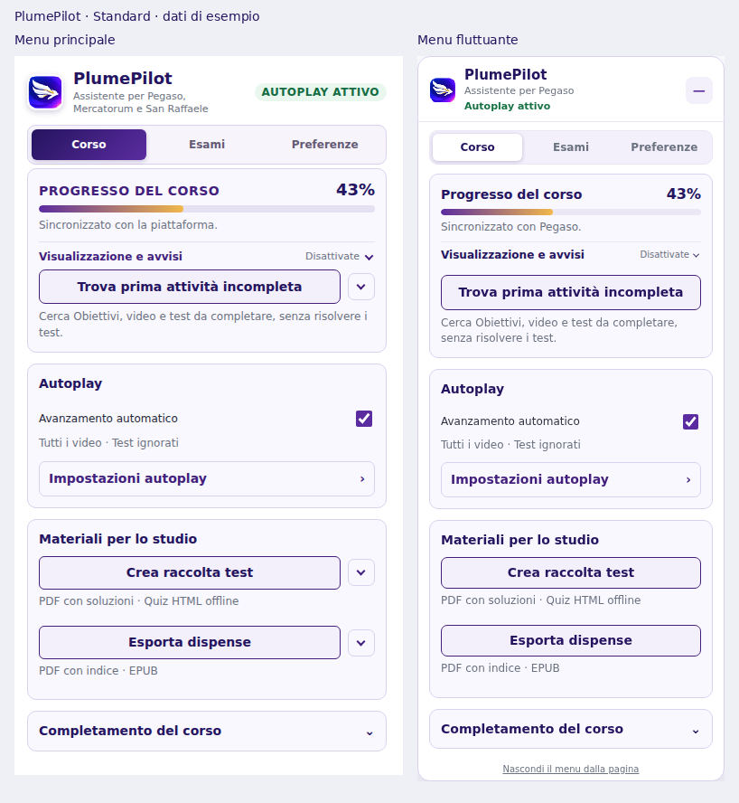
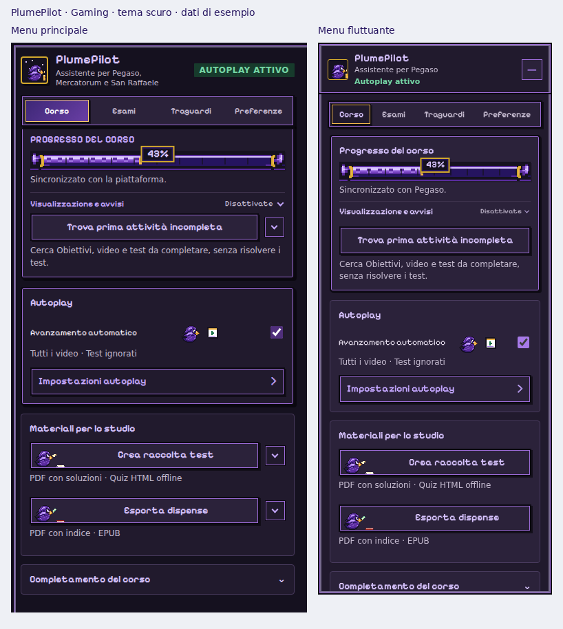

# Shared menu UX — candidate for 2.35.2

When people switch between the toolbar popup and the floating menu, they now find the same destinations and course task groups. Frequent actions stay visible; playback configuration has a focused detail view.

## Baseline and release boundary

Work starts at `5829e87240b99e4e9703f153f6da898494de6c57` on `fix/autoplay-collapsed-followups` (the 2.35.1 candidate in PR #39). It lives separately on `feat/ui-ux-2.35.2`.

The manifest and Novità intentionally remain the 2.35.1 baseline while this UX candidate is reviewed. This branch is not a 2.35.1 store submission and does not replace the prepared store kit. Retarget the stacked draft PR to main after PR #39 lands; prepare the 2.35.2 version, Novità and store packages only after reviewing this interface.

## Organization

Both surfaces use **Corso / Esami / Preferenze**, with **Traguardi** in Gaming mode.

| Corso group | Visible content | Secondary content |
| --- | --- | --- |
| Progresso del corso | Percentage, bar, first-incomplete command and availability explanation | Visualizzazione e avvisi: overlay position and 70% notification |
| Autoplay | Master switch, effective settings summary and relevant resume buttons | Impostazioni autoplay: Video, Test and Arresto |
| Materiali per lo studio | Test collection and material export with format descriptions | Existing detailed help |
| Completamento del corso | Explicit expandable group label | Batch test and Obiettivi completion |

Autoplay settings open inside the Corso destination with a **← Corso** button. Back and Escape restore focus to the opener. Switching tabs returns Corso to its task view. The 70% stop is grouped with autoplay rather than progress display. Chapter count controls appear only while the limit is enabled. Configuration remains available while autoplay is paused; it never implicitly starts playback.

The header reports **Autoplay attivo / Autoplay in pausa**. It is a status label; the master switch is the single enable/pause control. The first-incomplete action still requires autoplay to be enabled, as in the 2.35.1 runtime, and explains that requirement visibly. This change does not modify incomplete-discovery or playback semantics.

## Effective state and running operations

The shared `menu-ux.js` presentation model describes the effective test policy. If the chapter limit temporarily overrides “Fermati”, the summary says tests are ignored and the settings view explains that the saved choice is retained. The summary also reflects the per-course 70% bypass and describes precedence when both stopping rules are enabled.

Operation banners remain available above tab content. Selecting one returns to Corso and focuses the relevant action. Running batch operations expand Completamento del corso. A hidden action is temporarily revealed while it owns an operation, so personalization cannot hide its cancellation control. Operation acquisition/cancellation and course-scoped data remain owned by the existing controllers.

Esami uses the existing commission classifications and storage. The floating menu adds the same local-data deletion action already available in the popup, with the same confirmation and cross-tab memory-clear command. Existing exam-notification acknowledgement behavior is preserved.

## Saved personalization

The existing `floatingMenuLayout` key, version and action identities are reused. **Preferenze → Interfaccia → Pulsanti dei menu** is available in both menus. Order within each task group and visibility are now shared between them. Previously saved hidden actions are consequently hidden in the popup too; users can restore them from either menu. Existing ordering is retained within each group; cross-group interleaving is replaced by the fixed task hierarchy. Reset remains available even if every action is hidden. Keyboard movement, drag and drop within a group, and focus restoration use one shared editor.

No API permission, host permission, remote code, playback algorithm or persistent-schema version is added. `menu-ux.css` is a local shared stylesheet exposed only to the existing supported page matches.

## Review refinements

Checkboxes and radios use one theme accent, including chapter limits, sound notifications and personalization. Equivalent action buttons, course titles and settings labels share the same small/medium/large type scale in both menus. The first-incomplete button uses the existing action styling and Gaming pixel frame. The floating menu explicitly loads the packaged Gaming font so Chromium uses the actual font rather than a fallback. The exam-data deletion button has 12px of separation from the preceding explanation. In the floating menu’s four-tab Gaming layout, column widths follow label lengths so Traguardi and Preferenze have more breathing room without widening the panel or shrinking the font.

Opening a disclosure or help panel reveals its content in the menu scroll area after layout and any opening animation finish. Short panels are fully revealed; long sections show their beginning while keeping the opener visible. Keyboard opening works too. Scrolling respects reduced motion, retains focus, and never moves the underlying LMS page from the floating menu. Closing or restoring a saved/programmatic state does not trigger this behavior.

## Validation

- All 29 Node suites pass, including playback/incomplete discovery, export, notification, platform/storage, existing menu invariants and the new effective-summary cases.
- Syntax and whitespace checks pass.
- Internal Chrome/Edge/Firefox and source builds pass repository package and checksum validation. These builds retain the baseline version for development; they are not the prepared store kit.
- `scripts/check-menu-ux-browser.mjs` executes the actual popup and floating controllers in Chromium with a shared mocked extension store. It checks common navigation, Back/Escape and focus, paused configuration, test-policy overrides, bidirectional settings/layout synchronization, hidden-action cancellation access, matching checkbox/radio accents and role-based typography, actual Gaming font loading, nested keyboard disclosure and animated help scrolling, exam-button spacing, and absence of clipping/runtime exceptions.
- The browser matrix covers Standard/Gaming × Small/Medium/Large × Light/Dark in both menus and course fixtures for all three platforms. Fixtures are synthetic: these checks are not signed-in LMS tests or installation/upgrade tests in Chrome, Edge or Firefox.
- Screenshots below show rendered fixture UI, not real student/course data.

To reproduce the browser checks, install Playwright and a compatible Chromium executable outside the extension runtime, then run:

```bash
node scripts/check-menu-ux-browser.mjs \
  --playwright=/absolute/path/to/playwright/index.mjs \
  --browser=/absolute/path/to/chromium \
  --output-dir=/tmp/plumepilot-menu-ux-preview
```

## Review previews





Before release, verify live course actions and cancellation, restored preferences after an actual upgrade, platform home/exam-page availability, keyboard and screen-reader navigation, narrow browser windows and the final Novità in Chrome, Edge and Firefox.
