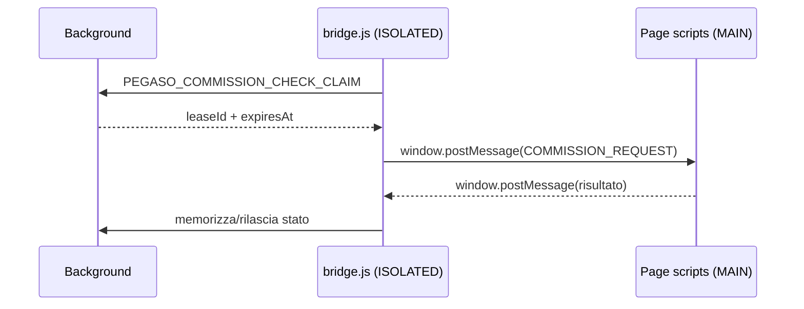
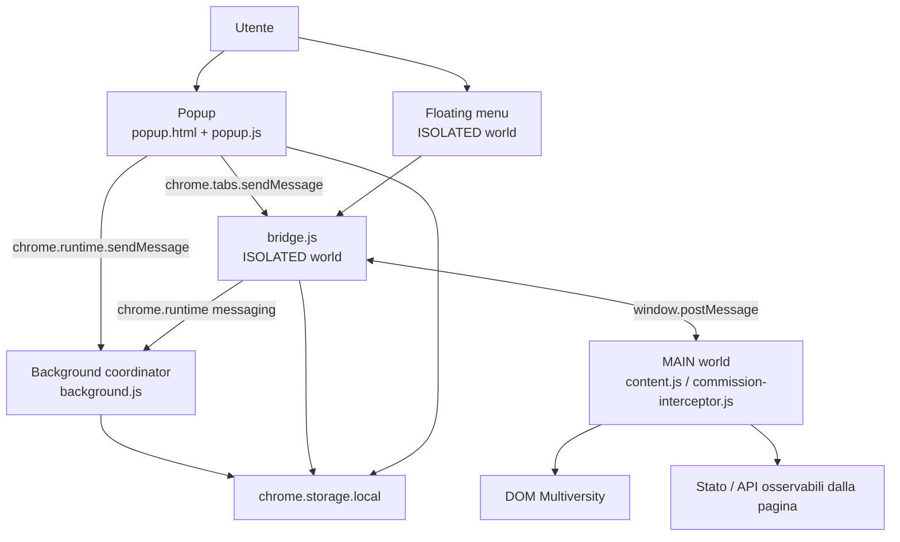

# 01 — Anatomia di PlumePilot

## Cosa succede quando l'estensione prende vita?

Una browser extension non parte da `main()`.

Non esiste necessariamente un unico punto di ingresso. Il browser legge invece un file speciale, `manifest.json`, e da lì scopre **quali componenti deve creare, dove devono vivere e quando devono essere eseguiti**.

Nel nostro snapshot di riferimento, il manifest inizia così:

```json
{
  "manifest_version": 3,
  "name": "PlumePilot – Assistente per Multiversity",
  "version": "2.35.1"
}
```

`manifest_version: 3` ci dice che stiamo usando il modello moderno delle extension Chromium e delle WebExtensions compatibili.

Ma le righe realmente interessanti arrivano poco dopo.

---

## 1. Il manifest come mappa del sistema

Nel `manifest.json` di PlumePilot troviamo quattro famiglie importanti:

```text
manifest.json
├── action
│   └── popup.html
│
├── background
│   └── background.js (+ script di supporto)
│
├── content_scripts
│   ├── MAIN world
│   └── ISOLATED world
│
└── web_accessible_resources
    └── asset utilizzabili dalle pagine supportate
```

Questa è già una prima lezione architetturale:

> Il browser crea confini prima ancora che il nostro codice inizi a girare.

Non possiamo comprendere PlumePilot guardando soltanto le funzioni. Dobbiamo capire **in quale runtime** gira ogni funzione.

---

## 2. Il popup: una pagina dell'estensione

Il manifest dichiara:

```json
"action": {
  "default_title": "PlumePilot – Assistente per Multiversity",
  "default_popup": "popup.html"
}
```

Quando premiamo l'icona di PlumePilot, il browser apre `popup.html`, che carica la logica del popup.

È importante capire cosa *non* è il popup.

Non è un elemento HTML inserito nella pagina Multiversity.

È una pagina appartenente all'estensione, con un proprio documento, un proprio ciclo di vita e accesso alle API permesse all'estensione.

Quando il popup viene aperto, `popup.js` ricostruisce buona parte dello stato visibile leggendo `chrome.storage.local`:

```js
chrome.storage.local.get(
  {
    enabled: true,
    stopAtTests: false,
    autoplaySkipCompletedVideos: false,
    themePreference: "system",
    menuSize: "medium",
    floatingMenuEnabled: true,
    commissionCheckEnabled: false,
    // ...
  },
  (result) => {
    // aggiorna la UI
  },
);
```

File reale: `popup.js`, circa righe 1308–1375 nello snapshot di riferimento.

### Perché ricostruire lo stato?

Perché il popup è **effimero**.

L'utente può aprirlo, chiuderlo e riaprirlo. Non è una buona idea trattare le variabili JavaScript del popup come memoria persistente dell'estensione.

Da backend developer puoi pensare al popup più come a una view che viene ricostruita partendo dallo stato persistente che come a un processo centrale sempre vivo.

Questa scelta anticipa un concetto che approfondiremo nel capitolo sullo storage:

> La lifetime di una UI non coincide necessariamente con la lifetime dello stato dell'applicazione.

---

## 3. Il background: il coordinatore che non vede il DOM

Nel manifest troviamo:

```json
"background": {
  "scripts": [
    "achievements.js",
    "commission-state.js",
    "sound-settings.js",
    "whats-new.js",
    "background.js"
  ],
  "service_worker": "background.js"
}
```

Questa configurazione serve alla base multipiattaforma.

Nel modello Manifest V3 di Chrome, `background.js` viene usato come **extension service worker**. Firefox supporta la forma `scripts` per il background. La stessa base sorgente può quindi essere trasformata dal processo di build nel pacchetto più adatto al browser.

Il ruolo concettuale del background è più importante del dettaglio di packaging:

> Il background coordina attività che appartengono all'estensione nel suo insieme, non a una singola pagina visualizzata.

Per esempio, alla fine di `background.js` troviamo un vero dispatcher di messaggi:

```js
chrome.runtime.onMessage.addListener((message, sender, sendResponse) => {
  let action = null;

  if (message?.type === "PEGASO_GET_OPERATION")
    action = reconcileOperationOwner();
  else if (message?.type === "PEGASO_START_EXPORT")
    action = startExport({ ...message, sourceTabId });
  else if (message?.type === "PEGASO_CANCEL_EXPORT")
    action = cancelExport(message);
  else if (message?.type === "PEGASO_COMMISSION_CHECK_CLAIM")
    action = claimCommissionCheck(sourceTabId, message.platformId);

  // ...

  action.then(sendResponse).catch(/* ... */);
  return true;
});
```

File reale: `background.js`, circa righe 918–945.

Questa forma assomiglia molto a un router o controller backend:

```text
message.type
    ↓
dispatcher
    ↓
handler
    ↓
risposta asincrona
```

Non è HTTP, ma il modello mentale è sorprendentemente simile.

### Ma allora perché il background non fa tutto?

Perché non vive nel DOM della pagina.

Se deve sapere quali lezioni sono renderizzate, leggere un bottone della pagina o osservare uno stato JavaScript del sito, ha bisogno di codice che viva nella scheda.

Ed entrano in scena i content script.

---

## 4. Content script: JavaScript dentro una pagina, ma non necessariamente *della* pagina

Il manifest di PlumePilot registra diversi gruppi di `content_scripts`.

Uno di essi carica:

```json
{
  "js": ["commission-interceptor.js"],
  "run_at": "document_start",
  "all_frames": false,
  "world": "MAIN"
}
```

Un altro carica:

```json
{
  "js": [
    "commission-state.js",
    "sound-settings.js",
    "bridge.js"
  ],
  "run_at": "document_start",
  "all_frames": false
}
```

Qui `world` non è specificato, quindi il content script usa normalmente il mondo **ISOLATED**.

Questa differenza è fondamentale.

---

## 5. MAIN world e ISOLATED world

Immagina la pagina Multiversity come una stanza con lo stesso tavolo — il DOM — ma due serie separate di variabili JavaScript.

```text
                 stesso DOM
                    │
        ┌───────────┴───────────┐
        │                       │
   MAIN world              ISOLATED world
        │                       │
 codice pagina            content script
 + content.js             bridge.js
 + interceptor            floating-menu.js
        │                       │
        └──── window.postMessage ────┘
```

### MAIN world

Il codice gira nello stesso ambiente JavaScript della pagina.

Questo è utile quando PlumePilot deve osservare o interagire con comportamenti che appartengono direttamente all'applicazione web.

Ma c'è un prezzo: quel codice non gode automaticamente dell'isolamento e delle API privilegiate tipiche del content script.

### ISOLATED world

Il codice condivide il documento e quindi può lavorare sul DOM, ma il proprio scope JavaScript è separato da quello della pagina.

In compenso è il posto adatto per usare API dell'estensione come `chrome.storage` e `chrome.runtime`.

Questa riga di commento dentro `content.js` racconta l'architettura quasi meglio del manifest:

```js
// Receives the enabled/paused state from bridge.js, which runs in the
// extension's isolated world and therefore has access to chrome.storage.
```

File reale: `content.js`, circa righe 248–249.

Subito dopo `content.js` ascolta messaggi provenienti dallo stesso `window`:

```js
window.addEventListener("message", (event) => {
  if (event.source !== window) return;
  if (!event.data) return;

  // interpreta i messaggi del bridge
});
```

Abbiamo quindi un pattern deliberato:

```text
ISOLATED world
bridge.js
    │
    │ window.postMessage(...)
    ▼
MAIN world
content.js / interceptor
```

E viceversa.

---

## 6. Perché serve `bridge.js`?

Il nome non è metaforico. È davvero un ponte.

Prendiamo il controllo della commissione.

`bridge.js` può parlare con il background:

```js
chrome.runtime.sendMessage({
  type: "PEGASO_COMMISSION_CHECK_CLAIM",
  platformId: PLATFORM_ID,
}, (response) => {
  // ...
});
```

Ma quando deve chiedere al codice che vive nel `MAIN` world di effettuare un'operazione legata alla pagina, usa:

```js
window.postMessage({
  type: COMMISSION_REQUEST,
  requestId: leaseId,
  expiresAt,
}, "*");
```

Possiamo rappresentare il flusso così:



Questo è **message passing tra boundary**.

Se tutti i componenti vivessero nello stesso scope, potremmo chiamare una funzione direttamente:

```js
requestCommissionData();
```

Ma qui i runtime sono separati. Il messaggio diventa il contratto.

---

## 7. Popup → scheda: un altro tipo di messaggio

Il popup deve anche interrogare direttamente la scheda attiva.

In `popup.js` troviamo:

```js
chrome.tabs.sendMessage(
  tabId,
  { type: "PEGASO_COURSE_PROGRESS_STATUS_REQUEST" },
  { frameId: 0 },
  (response) => {
    if (chrome.runtime.lastError || !response?.status) return;
    renderCourseProgress(response.status);
  },
);
```

Qui non stiamo usando `window.postMessage`.

Perché?

Perché mittente e destinatario non sono due world JavaScript della stessa pagina: il mittente è una **extension page** (`popup`) e il destinatario è un content script nella tab.

Quindi abbiamo già almeno due bus di comunicazione differenti:

```text
chrome.runtime / chrome.tabs messaging
    → tra componenti dell'estensione

window.postMessage
    → tra world JavaScript nella stessa pagina
```

Questa distinzione sarà il cuore del Capitolo 2.

---

## 8. Un diagramma più completo

A questo punto possiamo costruire una prima mappa utile dell'architettura.



Non è ancora la mappa completa di tutte le feature, ma è sufficiente per rispondere alla domanda iniziale:

> Perché non possiamo mettere tutto in un singolo file?

Perché le responsabilità richiedono **privilegi, lifetime e ambienti di esecuzione differenti**.

---

## 9. `run_at`: anche *quando* conta

I content script non sono caricati tutti nello stesso momento.

PlumePilot usa sia:

```json
"run_at": "document_start"
```

sia:

```json
"run_at": "document_idle"
```

`document_start` è utile quando dobbiamo essere presenti molto presto nel ciclo di vita della pagina. `document_idle` è adatto quando possiamo aspettare che il documento sia sostanzialmente pronto.

Per esempio, `commission-interceptor.js` viene caricato nel `MAIN` world a `document_start`.

Questo suggerisce una regola generale:

> Se devi osservare un comportamento della pagina che potrebbe avvenire molto presto, arrivare dopo significa potenzialmente perdere l'evento.

Al contrario, una UI che dipende da elementi già presenti nella pagina può spesso aspettare `document_idle`.

Quindi il manifest non specifica soltanto **dove** eseguire il codice. Specifica anche **quando** inserirlo nella vita del documento.

---

## 10. `all_frames`: una pagina non è sempre un solo documento

Alcuni gruppi di script usano:

```json
"all_frames": true
```

Questo ricorda che una tab può contenere iframe e quindi più documenti.

È facile dire “lo script gira nella pagina”, ma tecnicamente la domanda più corretta è:

> In quale frame del tab gira?

Nel popup, quando PlumePilot invia alcune richieste alla tab, specifica esplicitamente:

```js
{ frameId: 0 }
```

cioè il frame principale.

È un dettaglio apparentemente piccolo, ma previene ambiguità quando la stessa estensione può essere caricata in più frame.

---

## 11. `web_accessible_resources`: asset dell'estensione visibili alla pagina

Il manifest espone anche alcune risorse, per esempio immagini della modalità Gaming, font e audio.

Non tutto ciò che è contenuto nel pacchetto di un'estensione deve essere automaticamente raggiungibile da una pagina web.

`web_accessible_resources` dichiara esplicitamente quali file possono essere richiesti dai contesti corrispondenti ai pattern indicati.

Questo è un altro esempio del principio del **least privilege**:

> esponi ciò che serve, non l'intero pacchetto.

Lo stesso principio tornerà quando parleremo di `permissions` e `host_permissions`.

---

## 12. Permessi: ciò che PlumePilot può fare non è implicito

Nello snapshot corrente il manifest dichiara:

```json
"permissions": ["storage"]
```

oltre a `host_permissions` per host necessari alla gestione di materiali e risorse.

Le extension API sono capability esplicite. Questo è diverso da una normale pagina web, dove il codice parte già all'interno del modello di sicurezza dell'origine del sito.

Quando progetteremo mentalmente una feature, una buona domanda sarà sempre:

> In quale contesto dovrebbe vivere questa funzione e qual è il minimo privilegio necessario?

Questa domanda spesso determina l'architettura prima ancora del codice.

---

## 13. Un caso concreto: il popup vuole mostrare il progresso

Seguiamo finalmente un piccolo percorso end-to-end.

### Passo 1 — l'utente apre il popup

Il browser crea `popup.html` e viene eseguito `popup.js`.

### Passo 2 — il popup ricostruisce preferenze persistenti

```text
popup.js
    ↓
chrome.storage.local.get(...)
    ↓
render della UI
```

### Passo 3 — individua la tab attiva

Nel codice troviamo:

```js
chrome.tabs.query({ active: true, currentWindow: true }, ...)
```

### Passo 4 — chiede lo stato del corso

```text
popup
  │
  │ PEGASO_COURSE_PROGRESS_STATUS_REQUEST
  ▼
content script della tab
```

tramite `chrome.tabs.sendMessage`.

### Passo 5 — riceve lo stato e renderizza

```js
renderCourseProgress(response.status);
```

### Passo 6 — resta in ascolto

Il popup registra anche:

```js
chrome.runtime.onMessage.addListener(...)
```

per aggiornarsi quando riceve nuovi stati mentre è aperto.

Quindi il popup non “possiede” il progresso. Lo **visualizza**.

Questo è un ottimo esempio di separazione tra stato e presentazione.

---

## 14. Da backend developer: tre analogie

### `chrome.runtime.onMessage` come router interno

Puoi pensare ai `message.type` come a endpoint logici:

```text
PEGASO_START_EXPORT
PEGASO_CANCEL_EXPORT
PEGASO_GET_OPERATION
...
```

Non sono URL, ma identificano comandi e richieste.

### Il background come application service

Coordina operazioni, storage e ownership senza conoscere il dettaglio visuale del DOM.

### Il bridge come adapter

Converte comunicazione e capacità tra due ambienti incompatibili:

```text
Extension APIs ⇄ bridge ⇄ Page runtime
```

In architettura software chiameremmo spesso un componente simile **adapter** o **gateway**.

---

## 15. Una nota architetturale importante: file grande ≠ automaticamente cattiva architettura

Lo snapshot corrente contiene file molto grandi, tra cui `content.js`, `floating-menu.js` e `popup.js`.

È facile guardare soltanto la dimensione e concludere che il sistema sia monolitico.

Ma esistono due livelli diversi:

1. **modularità fisica** — come dividiamo il codice in file;
2. **modularità runtime** — quali responsabilità vivono in processi/contesti distinti.

PlumePilot ha margine per una maggiore modularità fisica, tema che affronteremo nell'ultimo capitolo. Ma possiede già confini runtime reali imposti e sfruttati dall'architettura WebExtensions.

È importante non confondere le due cose.

---

## 16. Cosa abbiamo imparato dal solo `manifest.json`

Senza ancora studiare autoplay, API o EPUB, sappiamo già che PlumePilot:

- usa Manifest V3;
- ha una UI popup separata dalla pagina;
- possiede un background coordinator;
- esegue codice sia nel `MAIN` sia nell'`ISOLATED` world;
- usa timing diversi (`document_start` / `document_idle`);
- considera esplicitamente frame diversi;
- espone soltanto determinate risorse alla pagina;
- richiede capability attraverso permessi dichiarati;
- deve usare messaging per attraversare i boundary.

Il manifest è quindi molto più di “metadata per lo store”.

È una **mappa dichiarativa dell'architettura runtime**.

---

## Concetti da portarsi dietro

### Execution context

L'ambiente in cui gira un pezzo di codice: quali globali vede, quali API può usare e quale lifetime possiede.

### MAIN world

Il contesto JavaScript condiviso con la pagina web.

### ISOLATED world

Contesto separato usato dai content script, che condivide il DOM ma non lo stesso scope JavaScript della pagina.

### Extension page

Una pagina HTML appartenente all'estensione, come il popup.

### Background / service worker

Componente dedicato alla gestione di eventi e operazioni che non appartengono a una singola pagina.

### Message passing

Comunicazione tra componenti separati attraverso messaggi serializzabili.

### Adapter / bridge

Componente che traduce tra interfacce o ambienti differenti.

### Least privilege

Concedere ed esporre soltanto le capacità necessarie.

---

## Piccolo esercizio mentale

Prima di leggere il prossimo capitolo, prova a classificare queste operazioni:

1. salvare la preferenza `themePreference`;
2. leggere un valore JavaScript appartenente alla pagina Multiversity;
3. mostrare il valore nel popup;
4. coordinare un export che deve sopravvivere alla chiusura del popup;
5. aggiornare un elemento del DOM del corso.

Per ciascuna chiediti:

```text
Dove dovrebbe vivere?
Popup?
Background?
MAIN world?
ISOLATED world?
```

Non tutte hanno una sola risposta possibile. Il punto è iniziare a ragionare in termini di **confini e responsabilità**.

---

## Approfondimenti

Fonti primarie consigliate:

- MDN — Anatomy of an extension: https://developer.mozilla.org/en-US/docs/Mozilla/Add-ons/WebExtensions/Anatomy_of_a_WebExtension
- MDN — Content scripts: https://developer.mozilla.org/en-US/docs/Mozilla/Add-ons/WebExtensions/Content_scripts
- MDN — `content_scripts` manifest key: https://developer.mozilla.org/en-US/docs/Mozilla/Add-ons/WebExtensions/manifest.json/content_scripts
- MDN — `background` manifest key: https://developer.mozilla.org/en-US/docs/Mozilla/Add-ons/WebExtensions/manifest.json/background
- Chrome for Developers — `chrome.scripting` e execution worlds: https://developer.chrome.com/docs/extensions/reference/api/scripting
- Chrome for Developers — Manifest V3 overview: https://developer.chrome.com/docs/extensions/develop/migrate/what-is-mv3

Quando leggi documentazione sulle extension, fai attenzione a due assi distinti:

```text
Manifest V2 vs Manifest V3
Chrome vs Firefox/WebExtensions
```

Un esempio trovato online può essere corretto in un browser e non rappresentare esattamente il runtime dell'altro.

---

## Nel prossimo capitolo

Ora sappiamo **chi** sono i componenti.

La domanda successiva è:

> Come fanno a parlarsi senza trasformare l'estensione in una rete di messaggi impossibile da seguire?

Seguiremo un messaggio reale dalla UI al background, dalla tab al bridge e dal bridge al `MAIN` world. Vedremo callback, Promise, `sendResponse`, lifetime asincrona dei listener, `window.postMessage` e i primi veri problemi di concorrenza.

---

[← 00 — Introduzione](00-introduzione.md) · [Indice](index.md) · [02 — Contesti e messaging →](02-contesti-messaging.md)
