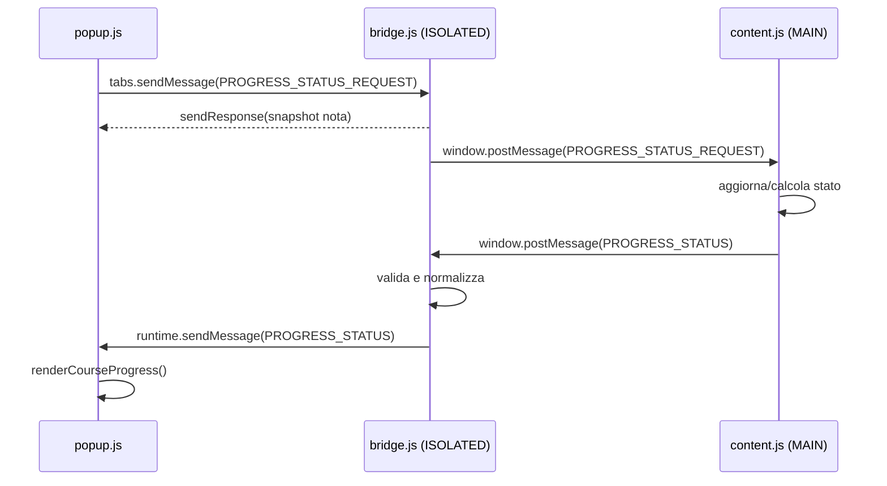
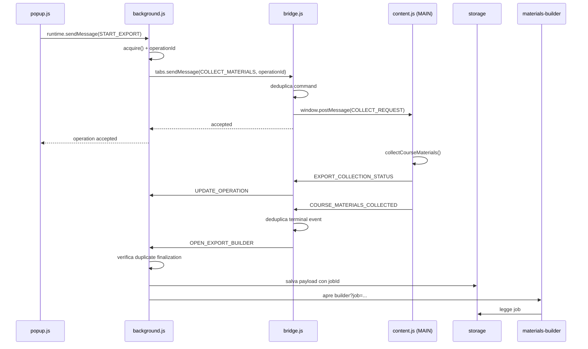

# 02 — Contesti e messaging

## Far parlare mondi separati

Nel capitolo precedente abbiamo visto che PlumePilot non vive in un unico ambiente JavaScript.

Il popup, il background, i content script nel mondo isolato, gli script nel `MAIN` world e le pagine builder sono componenti distinti. Possono appartenere alla stessa estensione, ma **non condividono automaticamente memoria, scope globale o ciclo di vita**.

Questo cambia radicalmente il modo in cui dobbiamo ragionare sul programma.

In una normale funzione possiamo fare questo:

```js
const result = calculateSomething(input);
```

Il chiamante conosce direttamente la funzione, le passa un valore e riceve il risultato.

Tra due contesti dell'estensione, invece, spesso la situazione assomiglia di più a questa:

```text
componente A
    │
    │  { type: "DO_SOMETHING", ... }
    ▼
confine
    │
    ▼
componente B
    │
    │  { accepted: true, ... }
    ▼
componente A
```

Il componente A non chiama direttamente una funzione privata di B. Invia invece **un messaggio che descrive ciò che vuole ottenere**.

Questa è la base del *message passing*.

Ed è uno dei concetti più importanti per comprendere PlumePilot.

---

## 1. Da chiamate di funzione a contratti

Quando due pezzi di codice vivono nello stesso scope, il contratto può essere semplicemente la firma di una funzione:

```js
startExport(format, tabId);
```

Quando attraversiamo un boundary, il contratto diventa invece un oggetto serializzabile:

```js
{
  type: "PEGASO_START_EXPORT",
  format: "materials",
  sourceTabId: tabId,
  requestSource: "toolbar-popup"
}
```

Questo oggetto non contiene comportamento. Contiene **dati che descrivono una richiesta**.

Il campo più importante è spesso `type`.

Puoi pensarlo come a una route:

```text
POST /exports/start
```

nel backend, oppure come a un nome di evento:

```text
PEGASO_START_EXPORT
```

nel sistema di messaging.

Il destinatario guarda quel valore e decide quale handler eseguire.

In `background.js` accade esattamente questo:

```js
chrome.runtime.onMessage.addListener((message, sender, sendResponse) => {
  let action = null;

  if (message?.type === "PEGASO_GET_OPERATION")
    action = reconcileOperationOwner();
  else if (message?.type === "PEGASO_START_EXPORT")
    action = startExport({ ...message, sourceTabId });
  else if (message?.type === "PEGASO_CANCEL_EXPORT")
    action = cancelExport(message);

  // ...
});
```

Riferimento reale: [`background.js`, dispatcher dei messaggi](https://github.com/PlumePilot/plumepilot/blob/a8007425f81792e7570516dbdf1e7fb2cbda4d53/background.js#L918-L945).

Il background si comporta quindi come un piccolo **dispatcher**:

```text
message.type
     │
     ├── PEGASO_START_EXPORT ─────► startExport()
     ├── PEGASO_CANCEL_EXPORT ────► cancelExport()
     ├── PEGASO_GET_OPERATION ────► reconcileOperationOwner()
     └── ...
```

### Concetto da portarsi dietro

Quando attraversiamo un boundary non stiamo soltanto "chiamando una funzione in un altro posto".

Stiamo definendo un **protocollo**.

Anche se il protocollo è interno all'applicazione.

---

## 2. I tre canali principali di PlumePilot

PlumePilot usa soprattutto tre meccanismi di comunicazione:

```text
1. chrome.runtime.sendMessage()
2. chrome.tabs.sendMessage()
3. window.postMessage()
```

Sembrano simili, ma risolvono problemi differenti.

### `chrome.runtime.sendMessage()`

Invia un messaggio ad altri contesti dell'estensione, tipicamente al background.

Esempio dal popup:

```js
chrome.runtime.sendMessage(message, (response) => {
  // usa la risposta
});
```

È appropriato quando la destinazione appartiene al **runtime dell'estensione**, non quando vogliamo indirizzare direttamente un content script in una specifica scheda.

### `chrome.tabs.sendMessage()`

Invia un messaggio ai content script presenti in una scheda precisa.

PlumePilot lo usa, per esempio, per comunicare con il corso aperto dall'utente:

```js
chrome.tabs.sendMessage(
  tabId,
  { type: "PEGASO_COURSE_PROGRESS_STATUS_REQUEST" },
  { frameId: 0 },
  callback,
);
```

Qui compare già una seconda informazione importante: **la destinazione non è soltanto l'estensione, ma una specifica tab e persino uno specifico frame**.

### `window.postMessage()`

È invece una API Web standard, non specifica delle estensioni.

In PlumePilot viene usata soprattutto per attraversare il confine tra:

```text
ISOLATED world  ◄────►  MAIN world
```

perché entrambi i mondi osservano lo stesso `window`, pur non condividendo lo stesso scope JavaScript.

Per esempio `bridge.js` può fare:

```js
window.postMessage(
  { type: "PEGASO_COURSE_PROGRESS_STATUS_REQUEST" },
  "*",
);
```

mentre `content.js` ascolta:

```js
window.addEventListener("message", (event) => {
  if (event.source !== window) return;
  if (!event.data) return;

  if (event.data.type === "PEGASO_COURSE_PROGRESS_STATUS_REQUEST") {
    // ...
  }
});
```

La stessa pagina diventa quindi una specie di **bus locale di messaggi**.

---

## 3. Una mappa mentale dei canali

Prima di seguire un caso reale, fissiamo una regola pratica.

```text
                         ESTENSIONE

 popup / builder                       background
      │                                    ▲
      │ chrome.runtime.sendMessage         │
      └────────────────────────────────────┘

 background / popup
      │
      │ chrome.tabs.sendMessage(tabId)
      ▼
 bridge.js / content script isolato
      │
      │ window.postMessage
      ▼
 content.js / MAIN world
      │
      ▼
 pagina Multiversity
```

Naturalmente la comunicazione può anche risalire nella direzione opposta.

Il punto fondamentale è questo:

> **Il tipo di messaggio dipende dal boundary che dobbiamo attraversare.**

Questa è una domanda utile ogni volta che leggi PlumePilot:

> "Da quale contesto sto partendo, e quale contesto devo raggiungere?"

Spesso è sufficiente per capire perché sia stata usata una API invece di un'altra.

---

# Parte I — Un flusso semplice

## 4. Caso reale: il popup chiede il progresso del corso

Cominciamo da una richiesta relativamente semplice.

Quando il popup viene aperto, vuole mostrare il progresso del corso corrente.

In `popup.js` troviamo:

```js
chrome.tabs.sendMessage(
  tabId,
  { type: "PEGASO_COURSE_PROGRESS_STATUS_REQUEST" },
  { frameId: 0 },
  (response) => {
    if (chrome.runtime.lastError || !response?.status) return;
    renderCourseProgress(response.status);
  },
);
```

Riferimento: [`popup.js` L1392–L1399](https://github.com/PlumePilot/plumepilot/blob/a8007425f81792e7570516dbdf1e7fb2cbda4d53/popup.js#L1392-L1399).

Il popup conosce l'ID della tab attiva e manda quindi un messaggio al content script della pagina.

### Primo passaggio

```text
popup.js
   │
   │ chrome.tabs.sendMessage(tabId, ...)
   ▼
bridge.js
```

Perché arriva a `bridge.js`?

Perché `bridge.js` è registrato come content script nel mondo isolato e ascolta `chrome.runtime.onMessage`.

Il suo handler contiene:

```js
if (message?.type === "PEGASO_COURSE_PROGRESS_STATUS_REQUEST") {
  window.postMessage(
    { type: "PEGASO_COURSE_PROGRESS_STATUS_REQUEST" },
    "*",
  );

  sendResponse({
    accepted: true,
    status: courseProgressStatus,
  });

  return;
}
```

Riferimento: [`bridge.js` L368–L371](https://github.com/PlumePilot/plumepilot/blob/a8007425f81792e7570516dbdf1e7fb2cbda4d53/bridge.js#L368-L371).

Qui accadono **due cose diverse**.

Il bridge:

1. restituisce immediatamente al popup l'ultimo stato che conosce;
2. chiede contemporaneamente al `MAIN` world di aggiornare lo stato.

Questa distinzione è molto interessante.

---

## 5. Risposta immediata e aggiornamento successivo

Potremmo immaginare una soluzione ingenua:

```text
popup
  ↓
calcola da zero il progresso
  ↓
attendi
  ↓
rispondi
```

PlumePilot adotta invece un modello più reattivo:

```text
popup
  │
  ├──► riceve subito l'ultimo snapshot noto
  │
  └──► provoca un refresh nel MAIN world
                    │
                    ▼
             nuovo stato calcolato
                    │
                    ▼
             aggiornamento push
```

Il `courseProgressStatus` custodito dal bridge è quindi una **snapshot cache**.

Può essere abbastanza recente da mostrare subito qualcosa, mentre il sistema aggiorna lo stato reale in parallelo.

Il popup non deve rimanere bloccato aspettando che ogni calcolo sia terminato.

### Questo introduce un concetto: eventual consistency

Per un breve intervallo due componenti possono non possedere esattamente la stessa informazione.

Poi gli eventi li riallineano.

Non significa necessariamente che il sistema sia "sbagliato".

Significa che la consistenza non è ottenuta tramite memoria condivisa e sincrona, ma tramite **propagazione dello stato**.

Questo modello è comunissimo nei sistemi distribuiti, nelle UI reattive e nelle applicazioni event-driven.

PlumePilot ce ne offre una versione molto piccola e osservabile.

---

## 6. Attraversiamo il confine ISOLATED → MAIN

Il bridge ha fatto:

```js
window.postMessage(
  { type: "PEGASO_COURSE_PROGRESS_STATUS_REQUEST" },
  "*",
);
```

`content.js`, che gira nel `MAIN` world, riceve il messaggio:

```js
if (event.data.type === "PEGASO_COURSE_PROGRESS_STATUS_REQUEST") {
  scheduleCourseProgressInitialization(0);
  publishCourseProgressStatus();
  return;
}
```

Riferimento: [`content.js` L423–L426](https://github.com/PlumePilot/plumepilot/blob/a8007425f81792e7570516dbdf1e7fb2cbda4d53/content.js#L423-L426).

A questo punto siamo passati da:

```text
WebExtension API world
```

al codice che vive insieme alla pagina.

Il `MAIN` world calcola il proprio stato e lo pubblica nuovamente:

```js
window.postMessage({
  type: "PEGASO_COURSE_PROGRESS_STATUS",
  status: {
    courseCode: state.courseCode,
    available: percent !== null && state.chapterCount > 0,
    percent,
    chapterCount: state.chapterCount,
    knownChapters: courseProgressChapters.size,
    exact: exactAvailable,
    // ...
  },
}, "*");
```

Riferimento: [`content.js` L4478–L4500](https://github.com/PlumePilot/plumepilot/blob/a8007425f81792e7570516dbdf1e7fb2cbda4d53/content.js#L4478-L4500).

Questa volta la direzione è opposta:

```text
MAIN world
   │
   │ window.postMessage
   ▼
bridge.js
```

---

## 7. Il bridge come adapter

Il bridge riceve il nuovo stato e non lo inoltra ciecamente.

Prima lo normalizza:

```js
courseProgressStatus = courseCode ? {
  platformId: PLATFORM_ID,
  courseCode,
  available: source.available === true && Number.isFinite(percent),
  percent: Number.isFinite(percent)
    ? Math.max(0, Math.min(100, Math.floor(percent)))
    : null,
  chapterCount: Math.max(0, Math.floor(Number(source.chapterCount) || 0)),
  knownChapters: Math.max(0, Math.floor(Number(source.knownChapters) || 0)),
  exact: source.exact === true,
  updatedByStudyWing: source.updatedByStudyWing === true,
  message: safeText(source.message, 160) || "",
} : null;
```

Poi lo rimanda nel runtime dell'estensione:

```js
chrome.runtime.sendMessage({
  type: "PEGASO_COURSE_PROGRESS_STATUS",
  status: courseProgressStatus,
});
```

Riferimento: [`bridge.js` L513–L534](https://github.com/PlumePilot/plumepilot/blob/a8007425f81792e7570516dbdf1e7fb2cbda4d53/bridge.js#L513-L534).

Questo ci mostra perché il nome **bridge** è appropriato.

Non è soltanto un cavo.

È anche un **adapter**.

```text
MAIN world payload
       │
       ▼
validazione / normalizzazione
       │
       ▼
extension runtime payload
```

Notiamo alcune difese:

```js
Number.isFinite(percent)
Math.max(...)
Math.min(...)
safeText(...)
```

Il bridge decide quale forma dei dati è accettabile prima di portarli nell'altro contesto.

### Concetto generale

Ogni boundary è un buon posto in cui:

- validare;
- normalizzare;
- ridurre i dati;
- rifiutare input non valido;
- tradurre da un modello a un altro.

È lo stesso motivo per cui in un backend potresti avere DTO, serializer o adapter tra layer.

---

## 8. Il popup riceve l'aggiornamento push

`popup.js` non si limita alla risposta iniziale.

Ascolta anche aggiornamenti successivi:

```js
chrome.runtime.onMessage.addListener((message, sender) => {
  if (
    message?.type === "PEGASO_COURSE_PROGRESS_STATUS" &&
    sender?.tab?.id === activeCourseTabId
  ) {
    renderCourseProgress(message.status || null);
  }
});
```

Riferimento: [`popup.js` L1402–L1409](https://github.com/PlumePilot/plumepilot/blob/a8007425f81792e7570516dbdf1e7fb2cbda4d53/popup.js#L1402-L1409).

Qui compare un'altra difesa importante:

```js
sender?.tab?.id === activeCourseTabId
```

Il popup potrebbe ricevere eventi provenienti da più tab.

Non vuole mostrare nel corso A il progresso ricevuto dalla tab B.

Quindi non basta chiedersi:

> "Che tipo di messaggio è?"

Bisogna anche chiedersi:

> "Chi lo ha inviato?"

---

## 9. Il flusso completo del progresso

Possiamo finalmente rappresentarlo per intero:



Questo è un pattern molto più ricco di una semplice richiesta sincrona.

Contiene:

- richiesta;
- risposta immediata;
- refresh asincrono;
- evento di aggiornamento;
- cache locale;
- controllo del mittente.

Ed è ancora uno dei flussi relativamente semplici di PlumePilot.

---

# Parte II — Request/response asincrona

## 10. `sendResponse()` e il problema del tempo

Consideriamo ora il listener nel background:

```js
chrome.runtime.onMessage.addListener((message, sender, sendResponse) => {
  let action = null;

  // ... selezione dell'azione ...

  action
    .then(sendResponse)
    .catch((error) => {
      sendResponse({ accepted: false, reason: error.message });
    });

  return true;
});
```

Perché quel `return true`?

Per capirlo dobbiamo distinguere due casi.

### Risposta sincrona

```js
chrome.runtime.onMessage.addListener((message, sender, sendResponse) => {
  sendResponse({ accepted: true });
});
```

La risposta viene inviata prima che il listener termini.

### Risposta asincrona

```js
chrome.runtime.onMessage.addListener((message, sender, sendResponse) => {
  doSomethingAsync().then((result) => {
    sendResponse(result);
  });

  return true;
});
```

Il listener termina **prima** che la Promise completi.

`return true` segnala al runtime che il canale di risposta deve restare disponibile perché `sendResponse()` verrà chiamato successivamente.

Questo dettaglio è facile da ignorare e può generare bug apparentemente inspiegabili:

```text
messaggio inviato
    ↓
handler avviato
    ↓
operazione async partita
    ↓
handler termina
    ↓
canale chiuso      ← se non viene mantenuto
    ↓
Promise completa
    ↓
sendResponse(...)  ← troppo tardi
```

Con `return true`:

```text
handler termina
    ↓
canale mantenuto
    ↓
Promise completa
    ↓
sendResponse(...)
```

La documentazione WebExtensions descrive esplicitamente questo pattern.

### Collegamento con il backend

È vagamente simile alla differenza tra:

```text
return response;
```

e un handler che deve aspettare una query o un servizio asincrono prima di poter completare la risposta.

La differenza è che qui il meccanismo di risposta è gestito dal runtime dell'estensione.

---

## 11. Perché PlumePilot trasforma i callback in Promise

Nel popup troviamo:

```js
function runtimeMessage(message) {
  return new Promise((resolve) =>
    chrome.runtime.sendMessage(message, (response) =>
      resolve(
        chrome.runtime.lastError
          ? { accepted: false, reason: chrome.runtime.lastError.message }
          : response,
      ),
    ),
  );
}
```

Riferimento: [`popup.js` L1296–L1306](https://github.com/PlumePilot/plumepilot/blob/a8007425f81792e7570516dbdf1e7fb2cbda4d53/popup.js#L1296-L1306).

Il chiamante può quindi scrivere:

```js
const response = await runtimeMessage({
  type: "PEGASO_START_EXPORT",
  // ...
});
```

invece di annidare callback.

Questa funzione svolge due lavori:

1. converte un'API callback-style in una Promise;
2. converte `chrome.runtime.lastError` in un normale valore applicativo.

Il secondo punto è importante.

Invece di obbligare ogni chiamante a ricordare:

```js
if (chrome.runtime.lastError) {
  // ...
}
```

l'errore viene trasformato in una risposta coerente:

```js
{
  accepted: false,
  reason: "..."
}
```

### Un piccolo adapter asincrono

Possiamo pensare a `runtimeMessage()` come a:

```text
API del browser
(callback + runtime.lastError)
          │
          ▼
runtimeMessage()
          │
          ▼
API interna PlumePilot
(Promise + accepted/reason)
```

Ancora una volta compare lo stesso principio:

> I boundary sono posti naturali in cui tradurre un'interfaccia in un'altra.

---

# Parte III — Un workflow lungo

## 12. Caso reale: esportare le dispense

Il flusso del progresso era corto.

L'export delle dispense è molto più interessante perché l'operazione:

- parte dal popup;
- viene coordinata dal background;
- viene eseguita sulla pagina del corso;
- attraversa i due execution world;
- invia aggiornamenti intermedi;
- termina aprendo una nuova pagina builder;
- continua a vivere anche se il popup viene chiuso.

Questa ultima proprietà è essenziale.

Se l'operazione appartenesse al popup, chiudere il popup potrebbe distruggere lo stato del processo.

Invece il popup è soltanto **uno dei client del workflow**.

---

## 13. Step 1 — Il popup invia un comando

Quando l'utente avvia la raccolta delle dispense:

```js
const response = await runtimeMessage({
  type: "PEGASO_START_EXPORT",
  format: "materials",
  sourceTabId: tabId,
  requestSource: "toolbar-popup",
});
```

Riferimento: [`popup.js` L2112–L2133](https://github.com/PlumePilot/plumepilot/blob/a8007425f81792e7570516dbdf1e7fb2cbda4d53/popup.js#L2112-L2133).

Questo messaggio è semanticamente un **command**.

Sta dicendo:

> "Per favore, prova ad avviare questa operazione."

Non sta semplicemente annunciando che qualcosa è successo.

Questa distinzione sarà utile per leggere meglio i nomi dei messaggi.

### Command

Esprime un'intenzione:

```text
START_EXPORT
CANCEL_EXPORT
FIND_FIRST_INCOMPLETE
```

### Event

Descrive qualcosa che è già avvenuto:

```text
COURSE_PROGRESS_STATUS
COURSE_MATERIALS_COLLECTED
EXPORT_COLLECTION_FAILED
```

Il codice non applica formalmente una convenzione CQRS o event sourcing, ma la distinzione concettuale è già presente.

---

## 14. Step 2 — Il background acquisisce l'operazione

Il dispatcher del background instrada il comando verso:

```js
startExport(...)
```

All'interno troviamo:

```js
const result = await acquire(format, message.sourceTabId);
if (!result.accepted) return result;
```

Riferimento: [`background.js` L700–L719](https://github.com/PlumePilot/plumepilot/blob/a8007425f81792e7570516dbdf1e7fb2cbda4d53/background.js#L700-L719).

Il background non ordina immediatamente alla pagina di raccogliere materiale.

Prima **acquisisce il diritto di eseguire l'operazione**.

Questo impedisce che workflow incompatibili partano contemporaneamente.

Ne parleremo molto meglio nei capitoli su stato, concorrenza e race condition; per ora basta notare che il background è il punto centrale adatto a decidere:

```text
"C'è già qualcosa in esecuzione?"
```

Una singola tab non avrebbe necessariamente una visione globale sufficiente.

---

## 15. Step 3 — Nasce un `operationId`

Dopo l'acquisizione, l'operazione possiede un identificatore:

```js
result.operation.id
```

Il background lo invia alla tab:

```js
const response = await sendTabMessage(message.sourceTabId, {
  type: "PEGASO_COLLECT_COURSE_MATERIALS",
  format,
  operationId: result.operation.id,
});
```

L'`operationId` è uno dei concetti architetturali più utili dell'intero flusso.

Senza di esso avremmo messaggi del tipo:

```text
"raccolta iniziata"
"25%"
"raccolta completata"
```

Ma a quale raccolta appartengono?

Con l'identificatore possiamo invece avere:

```text
operationId = 9f2...

START      9f2...
STATUS     9f2...
STATUS     9f2...
COMPLETE   9f2...
```

Questo è un **correlation ID**.

Serve a collegare messaggi diversi allo stesso workflow logico.

È un pattern molto comune nei sistemi a messaggi, nelle code, nelle pipeline asincrone e nel tracing distribuito.

---

## 16. Step 4 — Il background indirizza una tab precisa

La funzione helper è:

```js
function sendTabMessage(tabId, message) {
  return new Promise((resolve, reject) =>
    chrome.tabs.sendMessage(
      tabId,
      message,
      { frameId: 0 },
      (response) =>
        chrome.runtime.lastError
          ? reject(new Error(chrome.runtime.lastError.message))
          : resolve(response),
    ),
  );
}
```

Riferimento: [`background.js` L677–L683](https://github.com/PlumePilot/plumepilot/blob/a8007425f81792e7570516dbdf1e7fb2cbda4d53/background.js#L677-L683).

Qui compaiono due coordinate:

```text
tabId
frameId: 0
```

Il messaggio non è un broadcast generico al browser.

È indirizzato al **top frame di una scheda precisa**.

Questa è un'altra somiglianza con i sistemi distribuiti: oltre al contenuto del messaggio serve spesso una forma di addressing.

---

## 17. Step 5 — Il bridge deduplica prima di inoltrare

Il messaggio arriva a `bridge.js`:

```js
if (message?.type === "PEGASO_COLLECT_COURSE_MATERIALS") {
  const operationId = exportOperationId(message.operationId);

  if (!operationId) {
    sendResponse({
      accepted: false,
      reason: "Identificativo operazione mancante.",
    });
    return;
  }

  if (requestedExportOperationIds.has(operationId)) {
    sendResponse({ accepted: true, duplicate: true });
    return;
  }

  rememberExportOperation(requestedExportOperationIds, operationId);

  window.postMessage({
    type: "PEGASO_COLLECT_COURSE_MATERIALS_REQUEST",
    format: message.format,
    operationId,
  }, "*");

  sendResponse({ accepted: true, duplicate: false });
}
```

Riferimento: [`bridge.js` L373–L390](https://github.com/PlumePilot/plumepilot/blob/a8007425f81792e7570516dbdf1e7fb2cbda4d53/bridge.js#L373-L390).

Qui vediamo una misura di robustezza molto concreta:

```js
requestedExportOperationIds.has(operationId)
```

Se per qualche motivo lo stesso comando viene recapitato nuovamente, il bridge evita di avviare una seconda raccolta identica.

Questa tecnica si chiama **deduplicazione**.

È strettamente collegata all'idempotenza.

### Idempotenza perfetta vs deduplicazione

Un'operazione idempotente produce naturalmente lo stesso effetto anche se ripetuta.

Per esempio:

```text
SET theme = dark
SET theme = dark
SET theme = dark```

ha lo stesso risultato di una sola chiamata.

Una raccolta di dispense, invece, è un'operazione costosa e non vogliamo necessariamente eseguirla tre volte.

Quindi PlumePilot usa un'altra strategia:

```text
"Ho già visto questo operationId?"
       │
   sì ─┴─► ignora duplicato
```

Non rende magicamente ogni effetto idempotente, ma avvicina il workflow a un comportamento **at-most-once per quell'identificatore**, entro la memoria e la lifetime del componente che conserva il set.

Questa precisazione è importante: non dobbiamo attribuire al codice garanzie più forti di quelle che possiede realmente.

---

## 18. Step 6 — MAIN world: la raccolta comincia davvero

Il bridge inoltra la richiesta tramite `window.postMessage()`.

`content.js` la riceve:

```js
if (event.data.type === "PEGASO_COLLECT_COURSE_MATERIALS_REQUEST") {
  const operationId = /* normalizzazione */;

  if (!operationId) return;

  if (handledExportOperationIds.has(operationId)) {
    return;
  }

  rememberHandledExportOperation(operationId);

  void collectCourseMaterials(format, operationId).finally(() => {
    // log conclusivo
  });

  return;
}
```

Riferimento: [`content.js` L287–L311](https://github.com/PlumePilot/plumepilot/blob/a8007425f81792e7570516dbdf1e7fb2cbda4d53/content.js#L287-L311).

Notiamo che la deduplicazione compare **anche qui**.

Perché duplicarla in due layer?

Perché i due boundary hanno responsabilità differenti.

Il bridge protegge il passaggio:

```text
extension runtime → MAIN world
```

`content.js` protegge invece il vero side effect:

```text
messaggio MAIN → collectCourseMaterials()
```

È un esempio di **defence in depth** applicata all'affidabilità, non soltanto alla sicurezza.

---

## 19. `void collectCourseMaterials(...)`: perché non viene fatto `await`?

Questa riga è interessante:

```js
void collectCourseMaterials(format, operationId).finally(...);
```

L'handler del messaggio non aspetta che l'intera raccolta termini.

La raccolta può durare molto.

Il messaggio iniziale ha già svolto il suo compito:

> far partire il workflow.

Da quel momento gli aggiornamenti viaggeranno come **eventi separati**.

Questa è una distinzione fondamentale:

```text
request/response breve
        ≠
workflow asincrono lungo
```

Tentare di tenere aperta una singola risposta per tutta la durata della raccolta renderebbe il sistema più fragile e accoppiato.

PlumePilot usa invece:

```text
COMMAND: avvia
EVENT: stato aggiornato
EVENT: stato aggiornato
EVENT: completato
```

Il modello assomiglia a quello che in un backend potresti usare per un job asincrono:

```text
POST /exports
→ 202 Accepted + jobId

GET /jobs/:id
oppure eventi push
```

---

## 20. Step 7 — Gli aggiornamenti risalgono la catena

Durante la raccolta `content.js` pubblica aggiornamenti:

```js
window.postMessage(
  {
    type: "PEGASO_EXPORT_COLLECTION_STATUS",
    operationId,
    message,
  },
  "*",
);
```

Riferimento: [`content.js` L2388–L2401](https://github.com/PlumePilot/plumepilot/blob/a8007425f81792e7570516dbdf1e7fb2cbda4d53/content.js#L2388-L2401).

Il bridge li riceve e li converte in messaggi per il background:

```js
chrome.runtime.sendMessage({
  type: "PEGASO_UPDATE_OPERATION",
  operationId,
  patch: { message: event.data.message },
});
```

Riferimento: [`bridge.js` L584–L588](https://github.com/PlumePilot/plumepilot/blob/a8007425f81792e7570516dbdf1e7fb2cbda4d53/bridge.js#L584-L588).

Il background aggiorna quindi lo stato centrale dell'operazione.

Possiamo leggere il flusso come:

```text
content.js
   │
   │ EVENT status
   ▼
bridge.js
   │
   │ command/update
   ▼
background
   │
   ▼
stato operazione
```

Il popup può essere chiuso.

La raccolta continua comunque.

Quando il popup verrà riaperto, potrà ricostruire la UI a partire dallo stato dell'operazione.

Questo è un risultato architetturale importante:

> **La UI non possiede il job. Osserva il job.**

---

## 21. Step 8 — La raccolta termina con un evento

Quando i dati sono pronti, il `MAIN` world pubblica un evento del tipo:

```text
PEGASO_COURSE_MATERIALS_COLLECTED
```

Il bridge controlla nuovamente l'`operationId` e utilizza un secondo set di deduplicazione:

```js
if (terminalExportOperationIds.has(operationId)) {
  return;
}

rememberExportOperation(
  terminalExportOperationIds,
  operationId,
);
```

Poi invia al background:

```js
chrome.runtime.sendMessage({
  type: "PEGASO_OPEN_EXPORT_BUILDER",
  format: event.data.format,
  operationId,
  payload: event.data.payload,
});
```

Riferimento: [`bridge.js` L550–L570](https://github.com/PlumePilot/plumepilot/blob/a8007425f81792e7570516dbdf1e7fb2cbda4d53/bridge.js#L550-L570).

Perché un secondo concetto di "già visto"?

Perché un evento terminale è diverso dal comando iniziale.

Vogliamo evitare, ad esempio, che due notifiche di completamento aprano due builder.

Quindi il workflow possiede almeno due momenti da proteggere:

```text
START      → non partire due volte
COMPLETE   → non finalizzare due volte
```

---

## 22. Step 9 — Il background apre il builder una volta sola

Anche il background effettua una propria verifica:

```js
if (
  operation.phase === "building" ||
  operation.jobKey ||
  Number.isInteger(operation.builderTabId)
) {
  return {
    accepted: true,
    duplicate: true,
    operation,
  };
}
```

Riferimento: [`background.js` L784–L850](https://github.com/PlumePilot/plumepilot/blob/a8007425f81792e7570516dbdf1e7fb2cbda4d53/background.js#L784-L850).

Poi genera un nuovo identificatore:

```js
const jobId = crypto.randomUUID();
```

salva il payload nello storage:

```js
const storageKey = `pegasoExportJob:${jobId}`;

await storageSet({
  [storageKey]: {
    ...message.payload,
    format,
    operationId: operation.id,
    courseTabId: operation.sourceTabId,
  },
});
```

ed apre una nuova pagina dell'estensione:

```js
chrome.tabs.create({
  url: chrome.runtime.getURL(`${builderPage}?job=${jobId}`),
});
```

Questa parte è molto elegante dal punto di vista dei boundary.

Il payload potenzialmente grande non viene infilato nell'URL.

L'URL contiene soltanto un riferimento:

```text
?job=<jobId>
```

La pagina builder recupererà il contenuto dallo storage.

Questo assomiglia al pattern:

```text
identificatore piccolo → lookup di stato grande
```

che incontriamo continuamente lato backend.

---

## 23. Il workflow completo dell'export

Mettiamo tutto insieme.



Guardandolo così, è evidente che non stiamo più parlando di "uno script che clicca dei bottoni".

Stiamo osservando un piccolo sistema event-driven.

---

# Parte IV — Affidabilità del protocollo

## 24. `accepted` non significa `completed`

Molte risposte di PlumePilot hanno questa forma:

```js
{
  accepted: true
}
```

È importante interpretarla correttamente.

Per esempio, quando il bridge risponde:

```js
sendResponse({ accepted: true, duplicate: false });
```

non sta dicendo:

> "Le dispense sono pronte."

Sta dicendo:

> "Ho accettato la richiesta e il workflow può proseguire."

Questa distinzione è cruciale nei sistemi asincroni.

```text
accepted ≠ completed
```

Un backend potrebbe esprimerla tramite HTTP `202 Accepted`.

PlumePilot la esprime tramite il proprio protocollo applicativo.

---

## 25. Tre classi di messaggi

Per studiare il progetto può essere utile classificare mentalmente i messaggi in tre gruppi.

### A. Query

Chiedono informazioni.

```text
PEGASO_GET_OPERATION
PEGASO_COURSE_PROGRESS_STATUS_REQUEST
PEGASO_CHAPTER_LIMIT_STATUS_REQUEST
```

### B. Command

Chiedono di fare qualcosa.

```text
PEGASO_START_EXPORT
PEGASO_CANCEL_EXPORT
PEGASO_FIND_FIRST_INCOMPLETE_COMMAND
```

### C. Event

Comunicano qualcosa che è successo.

```text
PEGASO_COURSE_PROGRESS_STATUS
PEGASO_COURSE_MATERIALS_COLLECTED
PEGASO_EXPORT_COLLECTION_FAILED
```

Il codice non impone formalmente questa tassonomia, ma usarla durante la lettura aiuta moltissimo.

Quando incontri un nuovo `message.type`, chiediti:

```text
È una query?
È un command?
È un event?
```

Quasi sempre capirai subito chi dovrebbe produrlo e chi dovrebbe consumarlo.

---

## 26. Fire-and-forget e request/response

Non tutti i messaggi richiedono una risposta.

### Request/response

```js
chrome.runtime.sendMessage(message, (response) => {
  // la risposta è importante
});
```

### Fire-and-forget

```js
chrome.runtime.sendMessage({
  type: "PEGASO_UPDATE_OPERATION",
  operationId,
  patch: { message },
});
```

Qui il mittente comunica un aggiornamento ma non ha necessariamente bisogno di bloccare il proprio flusso in attesa di una risposta.

Questo riduce l'accoppiamento, ma cambia il modo in cui dobbiamo gestire gli errori.

Se nessuno attende una conferma, il sistema deve essere progettato in modo che un fallimento non lasci uno stato ambiguo o invisibile.

Non esiste una scelta universalmente migliore.

La domanda corretta è:

> Il mittente ha bisogno di sapere che il destinatario ha completato il lavoro, oppure gli basta aver pubblicato l'informazione?

---

## 27. Errori di trasporto ed errori applicativi

PlumePilot distingue implicitamente due famiglie di errore.

### Errore del canale

Per esempio:

```js
chrome.runtime.lastError
```

Può significare che il destinatario non esiste più, la tab è stata chiusa, il content script non è disponibile, ecc.

### Errore applicativo

Il messaggio è arrivato correttamente, ma l'azione viene rifiutata:

```js
{
  accepted: false,
  reason: "Scheda del corso non disponibile."
}
```

Questa distinzione è molto simile a:

```text
network / transport error
        ≠
HTTP 4xx / domain error
```

in un sistema web.

Entrambi possono impedire l'operazione, ma hanno cause e strategie di recupero differenti.

---

## 28. Perché `runtime.lastError` viene controllato spesso

Considera questo pattern:

```js
chrome.tabs.sendMessage(tabId, message, (response) => {
  if (chrome.runtime.lastError) {
    // gestione errore
    return;
  }

  // usa response
});
```

Le API callback-style di Chrome comunicano diversi errori asincroni tramite `chrome.runtime.lastError`.

Se ignorassimo questo valore potremmo interpretare:

```js
response === undefined
```

come una risposta applicativa valida, quando in realtà il messaggio non è mai arrivato al destinatario.

La wrapper `runtimeMessage()` che abbiamo visto prima serve proprio a trasformare questa peculiarità dell'API browser in un modello più facile da usare nel resto dell'applicazione.

---

## 29. Messaggi serializzabili

Quando passiamo un oggetto attraverso il sistema di messaging non stiamo condividendo lo stesso riferimento JavaScript.

Concettualmente dobbiamo trattare il messaggio come **dati serializzabili**.

Questo significa che è una cattiva idea immaginare di poter inviare direttamente:

```js
{
  callback: () => doSomething(),
  domNode: document.querySelector("video")
}
```

come se il destinatario condividesse lo stesso heap.

Un messaggio dovrebbe contenere dati come:

```js
{
  type: "PEGASO_UPDATE_OPERATION",
  operationId: "...",
  patch: {
    phase: "building",
    message: "Preparazione in corso…"
  }
}
```

Questa limitazione, apparentemente scomoda, ha anche un vantaggio:

> Ci costringe a rendere espliciti i contratti tra componenti.

---

# Parte V — `window.postMessage()` e il trust boundary

## 30. Condividere `window` non significa condividere fiducia

`content.js` e `bridge.js` comunicano con:

```js
window.postMessage(...)
```

Gli handler spesso iniziano con:

```js
if (event.source !== window || !event.data) return;
```

Questo controllo assicura che il messaggio osservato provenga dallo stesso oggetto `window`, non per esempio da un'altra finestra che possiede un riferimento.

Ma è importante non interpretarlo come autenticazione crittografica.

Il codice JavaScript della stessa pagina può usare anch'esso `window.postMessage()`.

Per questo il boundary MAIN/ISOLATED va trattato come un posto in cui:

- non fidarsi ciecamente dei payload;
- limitare i tipi accettati;
- controllare identificatori e tipi;
- evitare di spostare segreti inutilmente;
- normalizzare le informazioni prima di passarle al runtime privilegiato.

PlumePilot lo fa in diversi punti attraverso funzioni come:

```js
safeText(...)
exportOperationId(...)
Number.isFinite(...)
Array.isArray(...)
```

### Lezione generale

Un bridge dovrebbe essere **stretto**.

Meglio:

```text
5 messaggi espliciti e validati
```

che:

```text
"esegui arbitrariamente quello che mi manda l'altro lato"
```

Questo principio vale per browser extension, iframe, worker, plugin system e API backend.

---

## 31. Perché usare `"*"` come `targetOrigin` qui non equivale a "mandare il dato su Internet"

Una riga come:

```js
window.postMessage(message, "*");
```

può sembrare allarmante se la leggiamo senza contesto.

`"*"` significa che il mittente non limita il *target origin* del destinatario del messaggio.

Non significa però che il browser trasmetta automaticamente quel payload a qualunque sito su Internet.

Nel nostro caso il target è lo stesso `window` della pagina.

Resta comunque buona pratica progettare i payload come se il canale fosse osservabile dal codice che vive nella pagina e quindi **non usarlo come contenitore di segreti**.

Quando una applicazione usa `postMessage` tra finestre di origini differenti, la verifica di `origin` diventa ancora più importante.

---

# Parte VI — Concorrenza nascosta nei messaggi

## 32. Due messaggi possono essere corretti e produrre comunque un bug

Supponiamo di avere:

```text
A: START_EXPORT
B: CANCEL_EXPORT
```

Entrambi sono validi.

Ma cosa succede se arrivano quasi contemporaneamente?

Oppure:

```text
A: STATUS 40%
B: COMPLETE
C: STATUS 50%  ← arrivato in ritardo
```

Il problema non è il contenuto di un singolo messaggio.

È **l'ordine temporale**.

Qui nasce la concorrenza.

Ed è uno dei motivi per cui PlumePilot possiede:

- `operationId`;
- fasi dell'operazione;
- set di deduplicazione;
- funzioni serializzate nel background;
- controlli sugli eventi terminali.

Nel capitolo dedicato all'asincronia studieremo meglio le race condition.

Per ora basta una regola:

> In un sistema a messaggi, il tempo e l'ordine diventano parte del problema.

---

## 33. Lo stato terminale è speciale

Guarda questo controllo nel bridge:

```js
if (terminalExportOperationIds.has(operationId)) {
  return;
}
```

Perché separare gli eventi terminali?

Perché una volta che un workflow è terminato, eventi duplicati o tardivi non dovrebbero normalmente riaprirlo.

Possiamo pensare al ciclo di vita così:

```text
idle
  ↓
collecting
  ↓
building
  ↓
completed / released
```

Un messaggio ricevuto fuori fase potrebbe essere valido dal punto di vista sintattico ma **non valido dal punto di vista temporale**.

Questa è già una piccola anticipazione delle state machine.

---

# Parte VII — Startup e sincronizzazione

## 34. Un listener può nascere troppo tardi

C'è una riga in `content.js` particolarmente istruttiva:

```js
// bridge.js may have sent its startup state before this document-idle
// listener existed. Request an explicit synchronization after subscribing.
window.postMessage({ type: "PEGASO_AUTONEXT_STATE_REQUEST" }, "*");
```

Riferimento: [`content.js` L557–L559](https://github.com/PlumePilot/plumepilot/blob/a8007425f81792e7570516dbdf1e7fb2cbda4d53/content.js#L557-L559).

Questa piccola soluzione racconta una classe intera di bug asincroni.

Ricordiamo dal manifest:

```text
bridge.js  → document_start
content.js → document_idle
```

Quindi può verificarsi:

```text
bridge caricato
    ↓
invia stato
    ↓
content.js non ha ancora registrato il listener
    ↓
messaggio perso
```

Un `postMessage` non è automaticamente una coda persistente.

Se nessun listener utile è presente in quel momento, il messaggio non verrà recuperato magicamente più tardi.

La soluzione è semplice e robusta:

```text
1. content.js registra il listener
2. content.js chiede esplicitamente lo stato corrente
3. bridge.js lo ripubblica
```

Questo pattern si chiama spesso **handshake** o **explicit synchronization**.

### Concetto importante

Gli eventi sono ottimi per dire:

> "qualcosa è cambiato"

ma un nuovo subscriber ha spesso bisogno anche di poter chiedere:

> "qual è lo stato adesso?"

Per questo molti sistemi reali combinano:

```text
snapshot + events
```

invece di affidarsi esclusivamente a uno dei due.

È esattamente ciò che abbiamo visto anche nel progresso del corso.

---

## 35. Snapshot + eventi: un pattern ricorrente

Il modello compare più volte:

```text
QUERY
  ↓
stato corrente

EVENT
  ↓
aggiornamenti futuri
```

È una combinazione potente perché risolve due esigenze diverse.

### Snapshot

Serve quando un componente nasce o viene riaperto.

```text
"Dimmi dove siamo adesso."
```

### Eventi

Servono dopo la sincronizzazione iniziale.

```text
"Avvisami quando cambia qualcosa."
```

Da backend developer puoi confrontarlo con:

```text
GET /resource
+
WebSocket / SSE per gli update
```

oppure con:

```text
query iniziale
+
subscription
```

Il meccanismo tecnico è diverso, ma il problema architetturale è lo stesso.

---

# Parte VIII — Come leggere il messaging di PlumePilot

## 36. Metodo pratico di reverse engineering

Quando incontri un `message.type` nel repository, puoi ricostruirne il percorso in quattro passi.

### 1. Trova chi lo produce

Cerca:

```js
{ type: "NOME_MESSAGGIO" }
```

Domanda:

```text
chi lo invia?
```

### 2. Trova chi lo consuma

Cerca:

```js
message?.type === "NOME_MESSAGGIO"
```

o:

```js
event.data.type === "NOME_MESSAGGIO"
```

Domanda:

```text
chi lo riceve?
```

### 3. Identifica il canale

Guarda se il produttore usa:

```text
runtime.sendMessage
 tabs.sendMessage
window.postMessage
```

Questo ti dice **quale boundary viene attraversato**.

### 4. Cerca la risposta o l'evento successivo

Per esempio:

```text
REQUEST → STATUS
START   → UPDATE → COMPLETE
```

A questo punto hai ricostruito il protocollo.

Questo metodo è utile non soltanto per PlumePilot.

È un modo generale per comprendere sistemi event-driven che non conosci.

---

## 37. Una tabella dei boundary principali

| Da | A | Meccanismo tipico | Esempio |
|---|---|---|---|
| Popup | Background | `runtime.sendMessage` | avvio export |
| Builder | Background | `runtime.sendMessage` | update/release operazione |
| Background | Content script | `tabs.sendMessage` | raccogli dispense |
| Popup | Content script | `tabs.sendMessage` | richiedi progresso |
| ISOLATED | MAIN | `window.postMessage` | comando di raccolta |
| MAIN | ISOLATED | `window.postMessage` | stato/completamento |
| Bridge | Popup/extension runtime | `runtime.sendMessage` | progresso aggiornato |

Questa tabella è quasi una **mappa delle dipendenze runtime** di PlumePilot.

---

# Parte IX — Cosa avremmo potuto fare diversamente?

## 38. Un unico bus di messaggi?

Potremmo immaginare di costruire una astrazione unica:

```js
bus.send("START_EXPORT", payload);
```

che nasconda completamente se sotto usa:

```text
runtime.sendMessage
tabs.sendMessage
postMessage
```

### Vantaggio

Il codice chiamante sarebbe più uniforme.

### Svantaggio

Rischieremmo di nascondere informazioni architetturali importanti:

```text
Dove sta andando il messaggio?
Quale boundary attraversa?
Quale runtime lo riceve?
```

Nel caso di PlumePilot, mantenere una certa visibilità del meccanismo sottostante è spesso utile proprio perché i contesti hanno capacità diverse.

Una astrazione migliore potrebbe quindi non essere:

```text
"nascondi ogni differenza"
```

ma:

```text
"centralizza error handling e contratti mantenendo esplicita la destinazione"
```

È una distinzione architetturale importante.

---

## 39. Un registro centralizzato dei message type?

Attualmente molti nomi dei messaggi sono stringhe distribuite nel codice:

```js
"PEGASO_START_EXPORT"
"PEGASO_UPDATE_OPERATION"
"PEGASO_COURSE_PROGRESS_STATUS"
```

Una possibile evoluzione architetturale sarebbe centralizzarli:

```js
const Messages = Object.freeze({
  START_EXPORT: "PEGASO_START_EXPORT",
  UPDATE_OPERATION: "PEGASO_UPDATE_OPERATION",
  COURSE_PROGRESS_STATUS: "PEGASO_COURSE_PROGRESS_STATUS",});
```

oppure, in TypeScript, definire anche i payload associati.

### Cosa guadagneremmo?

- meno typo;
- refactoring più semplice;
- contratti più visibili;
- possibilità di type checking.

### Cosa costerebbe?

- ulteriore infrastruttura;
- necessità di rendere disponibile il modulo in più execution context;
- beneficio limitato per messaggi molto semplici.

Non significa che l'implementazione attuale sia sbagliata.

È il tipo di trade-off che discuteremo nell'ultimo capitolo: **cosa rifaremmo diversamente dopo aver visto crescere il progetto**.

---

## 40. Un protocollo versionato?

In un singolo pacchetto di estensione tutti i componenti vengono normalmente aggiornati insieme.

Per questo PlumePilot non ha bisogno di qualcosa come:

```text
protocolVersion: 3
```

in ogni messaggio.

Ma immagina un sistema in cui mittente e destinatario possano essere aggiornati indipendentemente.

A quel punto il contratto di messaging diventerebbe una vera API da versionare.

Questa osservazione ci aiuta a capire una cosa:

> La complessità necessaria dipende anche dal modo in cui i componenti vengono distribuiti.

PlumePilot può permettersi un protocollo interno relativamente leggero perché i componenti appartengono alla stessa release.

---

# Parte X — Collegamenti con il backend

## 41. Un vocabolario comune

Molti concetti di questo capitolo hanno equivalenti familiari lato server.

| Browser extension | Analogia backend/distribuita |
|---|---|
| `message.type` | route / event name / command name |
| `runtime.onMessage` | dispatcher / controller |
| `sendResponse()` | response handler |
| `operationId` | job ID / correlation ID |
| `accepted: true` | richiesta accettata / `202 Accepted` |
| `runtime.lastError` | transport/runtime failure |
| `accepted: false` | domain/application failure |
| `window.postMessage` | message bus locale / IPC-like boundary |
| `tabs.sendMessage(tabId)` | invio verso una istanza indirizzata |
| snapshot + events | query iniziale + subscription |
| deduplicazione | duplicate suppression / idempotency key |

Le analogie non sono equivalenze perfette.

Un browser non è un cluster distribuito e `postMessage` non è Kafka.

Ma i **problemi logici** sono della stessa famiglia:

- componenti separati;
- messaggi serializzabili;
- delivery asincrona;
- errori parziali;
- ordine temporale;
- correlazione;
- duplicati;
- stato non condiviso.

Per questo studiare bene l'architettura di un'estensione è sorprendentemente utile anche fuori dal browser.

---

# Parte XI — Piccoli esercizi

## 42. Esercizio 1 — Scegli il canale

Immagina di dover implementare queste funzioni.

### A. Il popup vuole chiedere al background se esiste già un export attivo

Quale useresti?

```text
runtime.sendMessage
```

Perché il destinatario è il coordinatore dell'estensione.

### B. Il background vuole dire alla tab 37 di fermare la raccolta

```text
tabs.sendMessage(37, ...)
```

Perché dobbiamo indirizzare un content script specifico.

### C. `content.js` nel MAIN world vuole chiedere al bridge di leggere una preferenza dallo storage

```text
window.postMessage
```

per attraversare MAIN → ISOLATED; sarà poi il bridge a usare le WebExtension API appropriate.

---

## 43. Esercizio 2 — Trova il bug

Considera:

```js
chrome.runtime.onMessage.addListener((message, sender, sendResponse) => {
  fetchSomething().then((result) => {
    sendResponse(result);
  });
});
```

Cosa manca nel modello callback-style usato da PlumePilot?

La risposta:

```js
return true;
```

per mantenere disponibile il canale di risposta asincrono.

---

## 44. Esercizio 3 — Query o command?

Classifica:

```text
PEGASO_GET_OPERATION
```

→ query.

```text
PEGASO_CANCEL_EXPORT
```

→ command.

```text
PEGASO_EXPORT_COLLECTION_FAILED
```

→ event.

Questa classificazione non è richiesta dal browser.

Serve a **noi** per ragionare meglio sul sistema.

---

## 45. Esercizio 4 — Perché serve l'`operationId`?

Immagina due export quasi contemporanei:

```text
Export A
Export B
```

poi ricevi:

```text
"raccolta completata"
```

Senza un correlation ID non sai a quale dei due appartiene.

Con:

```text
operationId: A
```

il problema diventa deterministico.

---

## 46. Esercizio 5 — Evento perso allo startup

Supponiamo:

```text
bridge.js: document_start
content.js: document_idle
```

Il bridge pubblica lo stato una sola volta appena parte.

Perché il `content.js` potrebbe non riceverlo?

Perché il listener potrebbe non essere ancora stato registrato.

Qual è una soluzione?

```text
subscribe → request current snapshot
```

che è proprio ciò che fa `PEGASO_AUTONEXT_STATE_REQUEST`.

---

# Parte XII — Concetti da portarsi dietro

## 47. Message passing

Comunicare attraverso messaggi invece di condividere direttamente funzioni e memoria.

## 48. Protocollo

L'insieme delle forme, dei nomi e delle aspettative che permettono a mittente e destinatario di capirsi.

In PlumePilot il protocollo è composto in gran parte da oggetti con `type` e payload associati.

## 49. Dispatcher

Componente che riceve messaggi e li instrada verso l'handler corretto.

Il blocco `runtime.onMessage` del background ne è un esempio.

## 50. Command

Messaggio che esprime l'intenzione di eseguire un'azione.

## 51. Event

Messaggio che descrive un fatto già avvenuto.

## 52. Query

Messaggio che richiede informazioni senza voler rappresentare un cambiamento di stato come scopo principale.

## 53. Correlation ID

Identificatore che permette di collegare più messaggi allo stesso workflow.

`operationId` è il nostro esempio principale.

## 54. Deduplicazione

Riconoscere e ignorare la ripetizione di una richiesta o di un evento già processato.

## 55. Eventual consistency

Situazione in cui componenti differenti possono avere temporaneamente snapshot non identici, ma convergono tramite aggiornamenti successivi.

## 56. Fire-and-forget

Invio di un messaggio senza aspettare una risposta applicativa prima di continuare.

## 57. Request/response

Interazione in cui il mittente ha bisogno di una risposta correlata alla richiesta.

## 58. Handshake / explicit synchronization

Procedura con cui un componente appena inizializzato chiede esplicitamente lo stato corrente per evitare di dipendere da eventi pubblicati prima che fosse pronto ad ascoltarli.

## 59. Boundary validation

Validazione e normalizzazione dei dati nel punto in cui attraversano un confine tra componenti o trust domain.

---

# Parte XIII — Approfondimenti

## 60. Documentazione primaria consigliata

### Chrome Extensions — Message passing

https://developer.chrome.com/docs/extensions/develop/concepts/messaging

Da leggere per:

- `runtime.sendMessage()`;
- `tabs.sendMessage()`;
- one-time requests;
- connessioni persistenti.

### Chrome Extensions — Tabs API

https://developer.chrome.com/docs/extensions/reference/api/tabs

Utile soprattutto per capire perché `tabs.sendMessage()` possiede un `tabId` e può essere indirizzato a uno specifico frame/document.

### MDN — `runtime.sendMessage()`

https://developer.mozilla.org/en-US/docs/Mozilla/Add-ons/WebExtensions/API/runtime/sendMessage

### MDN — `runtime.onMessage`

https://developer.mozilla.org/en-US/docs/Mozilla/Add-ons/WebExtensions/API/runtime/onMessage

Particolarmente importante per comprendere:

- `sendResponse()`;
- risposta sincrona;
- risposta asincrona;
- `return true`;
- Promise e differenze storiche di compatibilità.

### MDN — `Window.postMessage()`

https://developer.mozilla.org/en-US/docs/Web/API/Window/postMessage

Da leggere insieme alla sezione sulla sicurezza e sul controllo dell'origine quando si comunica tra finestre o origini differenti.

### Chrome — Execution worlds

https://developer.chrome.com/docs/extensions/reference/api/scripting#type-ExecutionWorld

Serve a ricollegare questo capitolo alla distinzione `MAIN` / `ISOLATED` studiata nel Capitolo 1.

---

# 61. Cosa abbiamo imparato davvero

A prima vista questo capitolo parlava di API come:

```text
sendMessage()
postMessage()
onMessage
```

Ma il punto più importante è più generale.

PlumePilot ci mostra che quando un'applicazione viene suddivisa in contesti con lifetime e privilegi differenti, **la comunicazione diventa parte dell'architettura**.

Non possiamo più ragionare soltanto in termini di:

```text
funzione A chiama funzione B
```

Dobbiamo ragionare in termini di:

```text
chi produce il messaggio?
chi lo riceve?
attraverso quale boundary?
la consegna richiede risposta?
la risposta può arrivare più tardi?
come correlare gli aggiornamenti?
cosa accade se il messaggio arriva due volte?
cosa accade se arriva fuori ordine?
cosa accade se il subscriber non esiste ancora?
```

Queste domande ci porteranno naturalmente ai prossimi argomenti.

Nel **Capitolo 3** usciremo dall'infrastruttura dell'estensione e guarderemo il territorio più instabile in cui PlumePilot deve lavorare:

> **il DOM di una applicazione web che non controlliamo.**

Vedremo perché leggere un elemento HTML è facile, mentre costruire automazioni affidabili sopra una UI dinamica è tutta un'altra storia.

---

[← 01 — Anatomia di PlumePilot](01-anatomia-estensione.md) · [Indice](index.md) · [03 — DOM e pagine dinamiche →](03-dom-pagine-dinamiche.md)
