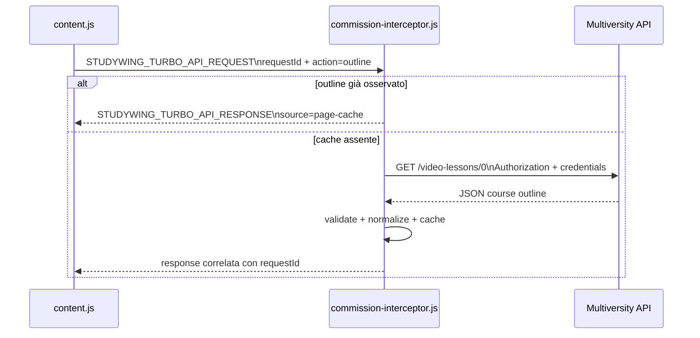
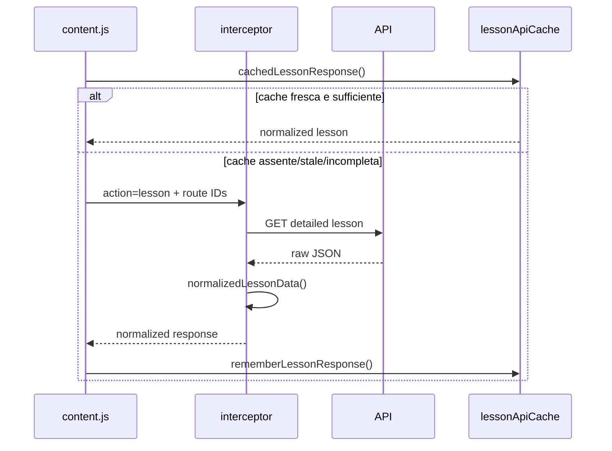

# 04 — API e reverse engineering

## Capire la piattaforma osservandone il traffico

Nei primi capitoli abbiamo guardato PlumePilot dall'esterno verso l'interno.

Abbiamo visto:

```text
popup
  ↓
background
  ↓
bridge
  ↓
content script
  ↓
DOM
```

Ma una web app moderna non vive soltanto nel DOM.

Quello che vediamo nella pagina è spesso il risultato finale di un'altra conversazione:

```text
browser
  ↓ HTTP
backend
  ↓ JSON
browser
  ↓ stato applicativo
DOM
```

Quando la piattaforma mostra un capitolo, una percentuale, una dispensa o un test, quei dati devono essere arrivati da qualche parte.

PlumePilot ha imparato progressivamente a osservare proprio questo livello.

Ed è qui che entra il tema del capitolo:

> **reverse engineering di una web app attraverso il traffico che la web app stessa genera.**

Il termine può sembrare più aggressivo di ciò che accade realmente.

Nel nostro caso non significa:

```text
bypassare autenticazione
forzare endpoint non autorizzati
indovinare credenziali
accedere a contenuti non disponibili all'utente
```

Significa invece:

```text
la pagina è già autenticata
        ↓
la pagina chiama le proprie API
        ↓
PlumePilot osserva forma e semantica delle chiamate
        ↓
riusa, quando opportuno, la stessa sessione già autorizzata
        ↓
normalizza le risposte
        ↓
usa quei dati per funzioni locali dell'estensione
```

Questa distinzione sarà importante per tutto il capitolo.

---

# Parte I — Una web app è anche un client HTTP

## 1. Guardare oltre il DOM

Nel Capitolo 03 abbiamo visto che il DOM è una rappresentazione temporanea dello stato dell'applicazione.

Ora possiamo aggiungere un secondo livello al modello mentale:

```text
backend
   ↓
API response
   ↓
frontend state
   ↓
DOM
```

Quindi, quando leggiamo:

```text
80%
```

dalla sidebar, potremmo stare osservando un valore che il frontend ha:

1. ricevuto da una API;
2. trasformato;
3. memorizzato nello stato interno;
4. infine renderizzato come testo.

Il DOM è quindi spesso **l'ultimo anello della catena**, non il primo.

Questo spiega perché, per alcune operazioni, interrogare i dati più vicino alla sorgente può essere:

- più veloce;
- più completo;
- meno dipendente dalla struttura grafica della pagina;
- più semplice da correlare con identificatori stabili.

Ma non significa automaticamente che una API sia sempre "più vera" del DOM.

Ci torneremo.

---

## 2. API pubblica e API usata dal frontend non sono la stessa cosa

Quando si dice "API" si pensa spesso a qualcosa documentato per sviluppatori esterni:

```text
GET /v1/users
Authorization: Bearer ...
```

con documentazione, versioning e contratti espliciti.

Una web app, però, utilizza quasi sempre anche interfacce HTTP pensate principalmente per **il proprio frontend**.

Il browser deve comunque poter chiedere al backend:

```text
quali sono i moduli del corso?
qual è il progresso?
quali attività contiene una lezione?
dove si trova la dispensa?
quali esami risultano completati?
```

Questi endpoint possono essere perfettamente normali API HTTP anche se non sono pubblicizzati come API per integrazioni di terze parti.

Da un punto di vista architetturale:

```text
Multiversity frontend
        │
        │ HTTP + JSON
        ▼
Multiversity backend
```

PlumePilot si trova già dentro quel client browser e può osservare questa conversazione.

---

# Parte II — Perché `commission-interceptor.js` vive nel MAIN world

## 3. Il problema architetturale

Nel Capitolo 01 abbiamo visto che `commission-interceptor.js` viene caricato con:

```json
"world": "MAIN"
```

Questa scelta diventa molto più chiara adesso.

Se vogliamo osservare:

```js
window.fetch
```

usato dal JavaScript della pagina, dobbiamo trovarci **nello stesso JavaScript world della pagina**.

Un content script isolato vede lo stesso DOM, ma non necessariamente gli stessi oggetti JavaScript modificati dal sito.

PlumePilot sfrutta quindi il MAIN world come punto di osservazione del runtime host.

Riferimento: [`manifest.json`](https://github.com/PlumePilot/plumepilot/blob/a8007425f81792e7570516dbdf1e7fb2cbda4d53/manifest.json).

---

## 4. Le API origin supportate

All'inizio di `commission-interceptor.js` troviamo:

```js
const PLATFORM_API_ORIGINS = Object.freeze([
  ["pegaso", "pegaso.multiversity.click", "https://lms-api.prod.pegaso.multiversity.click"],
  ["mercatorum", "mercatorum.multiversity.click", "https://lms-api.prod.mercatorum.multiversity.click"],
  ["utsr", "utsr.multiversity.click", "https://lms-api.prod.utsr.multiversity.click"],
]);
```

Riferimento: [`commission-interceptor.js` L21-L25](https://github.com/PlumePilot/plumepilot/blob/a8007425f81792e7570516dbdf1e7fb2cbda4d53/commission-interceptor.js#L21-L25).

Questa tabella fa qualcosa di più importante di quanto sembri.

Definisce un **confine esplicito**:

```text
pagina Pegaso      → API Pegaso
pagina Mercatorum  → API Mercatorum
pagina UTSR        → API UTSR
```

L'interceptor non dice:

```text
osserva qualunque Authorization header del browser
```

Dice invece:

```text
interessati soltanto alle richieste dirette all'API della piattaforma corrente
```

Questo principio prende spesso il nome di **least privilege** o, più genericamente, minimizzazione dell'ambito.

---

# Parte III — Osservare `fetch()` senza rompere la pagina

## 5. Conservare l'implementazione originale

PlumePilot salva prima il riferimento originale:

```js
const originalFetch = window.fetch;
```

poi installa un wrapper:

```js
window.fetch = function studyWingFetch(input, init) {
  // osservazione PlumePilot
  const promise = originalFetch.call(this, input, init);
  // osservazione della risposta
  return promise;
};
```

Riferimento: [`commission-interceptor.js` L708-L720](https://github.com/PlumePilot/plumepilot/blob/a8007425f81792e7570516dbdf1e7fb2cbda4d53/commission-interceptor.js#L708-L720).

Questo pattern viene spesso chiamato:

- wrapping;
- instrumentation;
- monkey patching, in senso più informale.

L'idea è:

```text
pagina chiama fetch()
        ↓
wrapper PlumePilot
        ↓
fetch originale
        ↓
network
```

Il wrapper osserva la chiamata senza sostituirne il comportamento applicativo.

---

## 6. Una proprietà fondamentale del wrapper

Il codice ritorna il `Promise` originale:

```js
return promise;
```

Questo è essenziale.

Immaginiamo che il frontend faccia:

```js
const response = await fetch(url);
```

Se il wrapper di PlumePilot cambiasse accidentalmente il tipo di ritorno:

```js
window.fetch = () => undefined;
```

la piattaforma si romperebbe.

Un buon wrapper dovrebbe quindi preservare il **contratto osservabile** della funzione originale.

Idealmente:

```text
stessi argomenti accettati
stesso this appropriato
stesso valore di ritorno
stessi errori della chiamata originale
```

L'instrumentation deve essere il meno invasiva possibile.

---

## 7. `call(this, ...)`

Il wrapper invoca:

```js
originalFetch.call(this, input, init)
```

anziché semplicemente:

```js
originalFetch(input, init)
```

In questo specifico caso `window.fetch` non dipende normalmente da un `this` applicativo complesso, ma preservare il receiver rende il wrapper più fedele alla chiamata originale.

È un'abitudine importante quando si decorano API che non possediamo.

---

# Parte IV — Leggere una risposta senza consumarla

## 8. Il body di una `Response` non è un valore riutilizzabile all'infinito

Una `Response` Fetch contiene uno stream.

Se facessimo semplicemente:

```js
const body = await response.json();
```

nel wrapper, rischieremmo di consumare il body prima che lo faccia la pagina.

Il frontend host potrebbe poi tentare:

```js
await response.json();
```

e trovare il body già usato.

PlumePilot evita questo problema con:

```js
const body = await response.clone().json();
```

Riferimento: [`commission-interceptor.js` L688-L705](https://github.com/PlumePilot/plumepilot/blob/a8007425f81792e7570516dbdf1e7fb2cbda4d53/commission-interceptor.js#L688-L705).

Il clone permette quindi due consumatori concettuali:

```text
Response originale ─────► frontend Multiversity

Response clone ─────────► PlumePilot
```

---

## 9. Un clone non è gratis

`Response.clone()` è utilissimo, ma ha implicazioni di memoria e buffering.

Se una risposta è molto grande e i due consumer avanzano a velocità differenti, il browser può dover mantenere dati bufferizzati.

Per PlumePilot le risposte JSON intercettate in questi flussi sono molto più piccole di un PDF completo, quindi il compromesso è ragionevole.

Ma questa osservazione tornerà nel capitolo sulla performance:

> **una API comoda può nascondere copie e buffer impliciti.**

---

# Parte V — Perché vengono intercettati anche gli XMLHttpRequest

## 10. Non possiamo assumere che una web app usi soltanto `fetch()`

Il frontend host potrebbe usare:

```text
fetch
XMLHttpRequest
una libreria che internamente usa uno dei due
componenti vecchi e nuovi insieme
```

PlumePilot quindi instrumenta anche `XMLHttpRequest`.

Conserva:

```js
const originalOpen = XMLHttpRequest.prototype.open;
const originalSend = XMLHttpRequest.prototype.send;
const originalSetRequestHeader = XMLHttpRequest.prototype.setRequestHeader;
```

Riferimento: [`commission-interceptor.js` L723-L725](https://github.com/PlumePilot/plumepilot/blob/a8007425f81792e7570516dbdf1e7fb2cbda4d53/commission-interceptor.js#L723-L725).

---

## 11. Ricostruire una richiesta XHR

Con XHR l'URL arriva durante:

```js
xhr.open(method, url)
```

mentre l'header può arrivare dopo:

```js
xhr.setRequestHeader("Authorization", value)
```

PlumePilot deve quindi ricordare temporaneamente:

```js
this.__studyWingRequestUrl = url;
```

in `open()`.

Poi, quando vede l'header `authorization`, può correlare:

```text
questo token
   ↓
questa richiesta
   ↓
questa API origin
```

È già un piccolo esempio di **correlation state**.

---

# Parte VI — L'autenticazione già esistente

## 12. Il Bearer token

Le richieste della piattaforma contengono un header di autenticazione.

PlumePilot cerca:

```js
const authorization = new Headers(headers)
  .get("authorization")
  ?.trim();

if (/^Bearer\s+\S+$/i.test(authorization || "")) {
  bearerToken = authorization;
}
```

Riferimento: [`commission-interceptor.js` L73-L83](https://github.com/PlumePilot/plumepilot/blob/a8007425f81792e7570516dbdf1e7fb2cbda4d53/commission-interceptor.js#L73-L83).

Un header del tipo:

```text
Authorization: Bearer <token>
```

significa, in termini generali:

```text
"questa richiesta presenta una credenziale che il server può verificare"
```

Il token non è la password dell'utente.

È una **credenziale di sessione/accesso** già ottenuta dal frontend attraverso il normale processo di autenticazione della piattaforma.

---

## 13. Authentication e authorization

I termini vengono spesso confusi.

Possiamo distinguerli così:

```text
Authentication
"chi sei?"

Authorization
"cosa ti è permesso fare?"
```

In pratica i due meccanismi sono spesso collegati.

Il Bearer token presentato alla API consente al backend di collegare la richiesta alla sessione e ai privilegi dell'utente.

PlumePilot non crea privilegi nuovi.

Riusa le richieste nel contesto dell'utente già autenticato.

---

## 14. Dove vive il token in PlumePilot?

Questa è una decisione architetturale molto importante.

Nel codice:

```js
let bearerToken = null;
```

Il token vive nella closure di `commission-interceptor.js`.

Non viene messo in:

```text
chrome.storage.local
localStorage PlumePilot
payload window.postMessage
log applicativi
server PlumePilot
```

Il resto dell'estensione non riceve:

```js
{ token: "..." }
```

Riceve invece un'interfaccia di capacità:

```js
{
  action: "lesson",
  courseCode,
  lessonNumber,
  ...
}
```

L'interceptor usa internamente la credenziale e restituisce soltanto dati normalizzati.

Questo è un pattern architetturale molto interessante.

---

## 15. Secret containment

Possiamo rappresentarlo così:

```text
content.js
   │
   │ "dammi i dati della lezione 5"
   ▼
commission-interceptor.js
   │
   │ possiede temporaneamente il Bearer token
   ▼
Multiversity API
```

contro una soluzione più rischiosa:

```text
interceptor
   │
   └──► passa il token a content.js
             │
             ├──► bridge
             ├──► background
             ├──► storage
             └──► altri componenti
```

Ridurre il numero di componenti che vedono un segreto riduce anche la superficie in cui quel segreto può essere:

- loggato accidentalmente;
- serializzato;
- persistito;
- inviato nel posto sbagliato.

Possiamo chiamare questo principio **secret containment** o **credential minimization**.

---

# Parte VII — Non intercettare tutto

## 16. Validare l'origin prima di guardare l'Authorization header

La funzione:

```js
function isCurrentPlatformApiUrl(value) {
  try {
    return new URL(String(value), window.location.href).origin === API_ORIGIN;
  } catch {
    return false;
  }
}
```

Riferimento: [`commission-interceptor.js` L52-L58](https://github.com/PlumePilot/plumepilot/blob/a8007425f81792e7570516dbdf1e7fb2cbda4d53/commission-interceptor.js#L52-L58).

viene usata prima di memorizzare l'autorizzazione.

La logica è:

```text
request qualunque
      ↓
è diretta alla API della piattaforma corrente?
      │
   no └──► ignora
      │
   sì ▼
leggi eventualmente Authorization
```

Questa è una difesa semplice ma fondamentale.

---

## 17. Allowlist invece di osservazione generica

La strategia può essere descritta come una **allowlist**:

```text
solo questi host
solo questa API origin
solo alcune route interessanti
```

È preferibile a:

```text
intercetta tutto e poi vediamo
```

perché rende più chiaro:

- lo scopo del codice;
- cosa può essere letto;
- quali dati attraversano il sistema;
- quali assunzioni dobbiamo testare.

---

# Parte VIII — Il primo endpoint fondamentale: l'indice del corso

## 18. Quello che nel progetto chiamiamo "master call"

Uno degli endpoint più importanti è costruito così:

```js
url = `${API_ORIGIN}/student/course/${encodeURIComponent(courseCode)}/video-lessons/0`;
```

Riferimento: [`commission-interceptor.js` L453-L455](https://github.com/PlumePilot/plumepilot/blob/a8007425f81792e7570516dbdf1e7fb2cbda4d53/commission-interceptor.js#L453-L455).

Nel nostro lessico durante lo sviluppo l'abbiamo spesso chiamato **master call**.

Non è necessariamente il nome ufficiale dell'endpoint.

È il nostro nome concettuale per una risposta che descrive l'insieme dei moduli del corso e il loro stato sintetico.

Possiamo pensarla come:

```text
corso
 ├── modulo A   100%
 ├── modulo B   100%
 ├── modulo C    80%
 ├── modulo D     0%
 └── modulo E   100%
```

Questo tipo di vista aggregata è preziosissima.

---

## 19. Da payload grezzo a modello interno

PlumePilot non passa direttamente il JSON del server al resto dell'estensione.

Lo normalizza:

```js
return {
  displayOrder,
  masterOrder,
  folderId,
  id,
  lpId,
  title,
  percentage,
};
```

Riferimento: [`commission-interceptor.js` L99-L120](https://github.com/PlumePilot/plumepilot/blob/a8007425f81792e7570516dbdf1e7fb2cbda4d53/commission-interceptor.js#L99-L120).

Questa fase è molto simile a ciò che in un backend potresti chiamare:

```text
DTO mapping
adapter
anti-corruption layer
normalization layer
```

Il resto di PlumePilot non deve conoscere ogni dettaglio del JSON originale.

---

## 20. Perché normalizzare?

Supponiamo che il backend risponda con:

```json
{
  "display_order": "5",
  "percentage": "80",
  "lp_id": 123
}
```

Il codice di dominio preferisce ricevere:

```js
{
  displayOrder: 5,
  percentage: 80,
  lpId: 123
}
```

con vincoli già verificati.

Questo sposta la complessità al confine:

```text
external schema
      ↓
validation + normalization
      ↓
internal schema
```

È un pattern estremamente riutilizzabile.

---

# Parte IX — Identificatori: il dettaglio che cambia tutto

## 21. `displayOrder` non basta

La risposta master contiene diversi identificatori:

```text
displayOrder
masterOrder
folderId
id
lpId
```

Perché così tanti?

Perché il numero che l'utente vede non è necessariamente un identificatore globale.

Nel Capitolo 03 avevamo già incontrato il problema:

```text
Sezione A
1 - Introduzione
2 - Concetti

Sezione B
1 - Introduzione
2 - Esempi
```

Quindi:

```text
"capitolo 1"
```

non identifica necessariamente una sola entità nel corso.

---

## 22. Il commento più importante di `playbackCourseRouteMap()`

Nel codice troviamo:

```js
// A matching course-wide order is stronger than a display_order, which
// can restart at 1 in each folder. Use it only when every title agrees.
```

Riferimento: [`content.js` L2900-L2914](https://github.com/PlumePilot/plumepilot/blob/a8007425f81792e7570516dbdf1e7fb2cbda4d53/content.js#L2900-L2914).

Questa frase contiene una lezione di modellazione dati importante:

> **un valore che sembra un ID può essere soltanto una label locale.**

Prima di trattare qualcosa come identità dobbiamo capire il suo dominio di unicità.

---

## 23. Identità composta

Per i test il progetto usa:

```js
function testRouteKey(route) {
  return [route.folderId, route.lpId, route.id].join(":");
}
```

Riferimento: [`content.js` L2925-L2928](https://github.com/PlumePilot/plumepilot/blob/a8007425f81792e7570516dbdf1e7fb2cbda4d53/content.js#L2925-L2928).

Questo è un esempio semplice di **composite identity**.

Quando nessun singolo campo è abbastanza affidabile, più campi insieme possono identificare meglio la risorsa.

---

# Parte X — La chiamata di dettaglio

## 24. Dall'indice al contenuto del modulo

La master call ci dice molto, ma non tutto.

Per ottenere il contenuto di una lezione PlumePilot costruisce una route del tipo:

```js
/student/course/{courseCode}/video-lesson/{lpId}/paragraphs/{paragraphId}
```

Riferimento: [`commission-interceptor.js` L456-L466](https://github.com/PlumePilot/plumepilot/blob/a8007425f81792e7570516dbdf1e7fb2cbda4d53/commission-interceptor.js#L456-L466).

La risposta di dettaglio può contenere informazioni sufficienti a ricostruire:

- obiettivo;
- video;
- progresso;
- test finale;
- dispensa.

---

## 25. Normalizzare la lezione

PlumePilot riduce la risposta a:

```js
return {
  dataAvailable,
  objective,
  test,
  material,
  playbackItems,
  playbackDataComplete,
  progressItems,
  progressDataComplete,
};
```

Riferimento: [`commission-interceptor.js` L384-L397](https://github.com/PlumePilot/plumepilot/blob/a8007425f81792e7570516dbdf1e7fb2cbda4d53/commission-interceptor.js#L384-L397).

Questo è un altro esempio di **boundary normalization**.

Il resto dell'applicazione ragiona su concetti PlumePilot, non sul payload grezzo.

---

# Parte XI — Il mini-RPC costruito sopra `postMessage`

## 26. `content.js` non conosce il token

Quando `content.js` vuole dati API usa:

```js
function turboApiRequest(action, payload = {}) {
  return new Promise((resolve) => {
    const requestId = `studywing-${Date.now()}-${++turboApiRequestSequence}`;
    ...
    window.postMessage({
      type: TURBO_API_REQUEST,
      requestId,
      action,
      ...payload,
    }, "*");
  });
}
```

Riferimento: [`content.js` L4904-L4923](https://github.com/PlumePilot/plumepilot/blob/a8007425f81792e7570516dbdf1e7fb2cbda4d53/content.js#L4904-L4923).

Questa funzione trasforma un protocollo a messaggi in qualcosa che il chiamante può usare come una funzione asincrona:

```js
const response = await turboApiRequest("lesson", {
  courseCode,
  lessonNumber,
});
```

Concettualmente è una piccola **RPC locale**.

---

## 27. Request ID

Il `requestId` serve a correlare:

```text
request A ────────────────┐
request B ───────────┐    │
                     │    │
response B ◄─────────┘    │
response A ◄──────────────┘
```

senza assumere che le risposte arrivino nello stesso ordine delle richieste.

Nel Capitolo 02 abbiamo chiamato questo concetto **correlation ID**.

Qui lo vediamo applicato a una vera API bridge.

---

## 28. Pending requests map

`content.js` conserva:

```js
const pendingTurboApiRequests = new Map();
```

Ogni richiesta salva:

```text
requestId → resolve + timeout
```

Quando arriva:

```js
STUDYWING_TURBO_API_RESPONSE
```

il listener cerca il `requestId`, cancella il timeout e risolve la Promise corretta.

Il pattern è identico a molti sistemi RPC reali.

---

## 29. Timeout applicativo

Ogni richiesta ha anche:

```js
setTimeout(() => {
  pendingTurboApiRequests.delete(requestId);
  resolve({ ok: false, error: "RESPONSE_TIMEOUT" });
}, TURBO_API_RESPONSE_TIMEOUT_MS);
```

Quindi il chiamante non resta bloccato per sempre se:

- il messaggio viene perso;
- l'interceptor non risponde;
- una richiesta di rete non termina;
- il contesto viene modificato.

Un protocollo asincrono serio ha bisogno anche di una **failure semantics**.

---

# Parte XII — Il dispatcher API nel MAIN world

## 30. Action invece di endpoint nel chiamante

L'interceptor riceve:

```text
action = outline
action = lesson
action = completeaction = test-source
```

Poi decide internamente:

```js
if (message.action === "outline") { ... }
else if (message.action === "lesson") { ... }
else if (message.action === "complete") { ... }
else if (message.action === "test-source") { ... }
```

Riferimento: [`commission-interceptor.js` L433-L498](https://github.com/PlumePilot/plumepilot/blob/a8007425f81792e7570516dbdf1e7fb2cbda4d53/commission-interceptor.js#L433-L498).

Questo mantiene la conoscenza degli endpoint concentrata in un unico modulo.

`content.js` non deve sapere che la route concreta è:

```text
/student/course/.../video-lesson/.../paragraphs/...
```

Gli basta sapere:

```text
voglio i dati della lezione
```

---

## 31. API adapter

Possiamo quindi vedere `commission-interceptor.js` anche come un **API adapter**.

Espone al resto di PlumePilot un contratto interno:

```text
outline(courseCode)
lesson(courseCode, route)
complete(activity)
testSource(test)
```

mentre nasconde:

```text
URL esatti
Authorization header
credentials
parsing JSON
normalizzazione
AbortController
errori HTTP
```

È separation of concerns applicata a una browser extension.

---

# Parte XIII — `fetch()` e HTTP errori

## 32. Una particolarità importante della Fetch API

`fetch()` non rigetta automaticamente la Promise per un normale errore HTTP come:

```text
404
401
500
```

La Promise può risolversi correttamente con una `Response` il cui:

```js
response.ok === false
```

Per questo PlumePilot ha:

```js
if (!response.ok || Number(body?.code) !== 200) {
  throw new Error(`API_${response.status || "INVALID_RESPONSE"}`);
}
```

Riferimento: [`commission-interceptor.js` L420-L430](https://github.com/PlumePilot/plumepilot/blob/a8007425f81792e7570516dbdf1e7fb2cbda4d53/commission-interceptor.js#L420-L430).

Questo trasforma due livelli di errore:

```text
HTTP status
application body code
```

in una semantica più semplice per il chiamante.

---

## 33. Transport success ≠ application success

È possibile avere:

```text
HTTP 200
```

ma un payload che rappresenta un errore applicativo.

Ed è possibile avere:

```text
HTTP 401
```

con una risposta JSON perfettamente valida dal punto di vista sintattico.

Quindi dobbiamo distinguere:

```text
la rete ha risposto?
la risposta HTTP è positiva?
il JSON è valido?
il codice applicativo è positivo?
i dati necessari sono presenti?
```

Sono cinque domande diverse.

---

# Parte XIV — Risposta valida ma incompleta

## 34. Un caso particolarmente interessante di PlumePilot

Una API può rispondere correttamente senza avere ancora tutti i dati che ci servono.

Per questo esiste:

```js
function hasRequiredLessonData(response, requiredData) {
  if (response.data?.dataAvailable !== true) return false;
  if (requiredData === "material") return Boolean(response.data.material);
  if (requiredData === "test") return Boolean(response.data.test);
  if (requiredData === "objective") return Boolean(response.data.objective);
  if (requiredData === "playback") {
    return response.data.playbackDataComplete === true;
  }
  return true;
}
```

Riferimento: [`content.js` L2414-L2423](https://github.com/PlumePilot/plumepilot/blob/a8007425f81792e7570516dbdf1e7fb2cbda4d53/content.js#L2414-L2423).

Questa distinzione è molto utile:

```text
request failed
```

non è la stessa cosa di:

```text
request succeeded, but data is not ready/complete enough
```

---

## 35. Retry semantico

`requestLessonWithRetry()` non ripete soltanto quando la rete fallisce.

Può riprovare quando:

```text
response.ok = true
```

ma:

```text
dati richiesti non ancora completi
```

Riferimento: [`content.js` L2715-L2777](https://github.com/PlumePilot/plumepilot/blob/a8007425f81792e7570516dbdf1e7fb2cbda4d53/content.js#L2715-L2777).

Questo è un **semantic retry**.

Il sistema non domanda soltanto:

```text
"la chiamata è riuscita?"
```

ma:

```text
"la chiamata mi ha dato abbastanza informazione per continuare?"
```

---

# Parte XV — Retry e pacing

## 36. Non martellare il backend

Nel codice troviamo ritardi come:

```js
const COURSE_INDEX_RETRY_DELAYS_MS = [350, 750];
const API_LESSON_RETRY_DELAYS_MS = [750, 1500];
const API_MATERIAL_PACING_MS = 150;
const TURBO_API_PACING_MS = 350;
```

Riferimento: [`content.js` L60-L65](https://github.com/PlumePilot/plumepilot/blob/a8007425f81792e7570516dbdf1e7fb2cbda4d53/content.js#L60-L65).

Ci sono due concetti differenti:

### Retry delay

Attendere prima di riprovare una richiesta che non ha prodotto dati utilizzabili.

### Pacing

Distanziare richieste valide di una procedura batch.

Non sono la stessa cosa.

---

## 37. Perché non fare `Promise.all()` su tutto il corso?

Teoricamente potremmo immaginare:

```js
await Promise.all(
  lessons.map((lesson) => fetchLesson(lesson))
);
```

Ma una strategia del genere può:

- generare molti picchi simultanei;
- rendere più difficile la cancellazione;
- amplificare errori temporanei;
- aumentare memoria e parsing concorrente;
- comportarsi in modo meno simile al frontend originale.

PlumePilot usa molte operazioni sequenziali proprio perché la massima concorrenza non è automaticamente la massima qualità.

---

# Parte XVI — AbortController

## 38. Timeout di rete esplicito

Nell'interceptor:

```js
const controller = new AbortController();
const timeout = setTimeout(() => controller.abort(), API_TIMEOUT_MS);
```

poi:

```js
fetch(url, {
  signal: controller.signal,
  ...
});
```

Riferimento: [`commission-interceptor.js` L500-L529](https://github.com/PlumePilot/plumepilot/blob/a8007425f81792e7570516dbdf1e7fb2cbda4d53/commission-interceptor.js#L500-L529).

Questo trasforma:

```text
request potenzialmente indefinita
```

in:

```text
request con deadline
```

---

## 39. Cancellazione come parte del protocollo

`content.js` può inoltre inviare:

```text
STUDYWING_TURBO_API_CANCEL
```

L'interceptor reagisce:

```js
for (const controller of turboControllers.values()) {
  controller.abort();
}
```

Riferimento: [`commission-interceptor.js` L792-L795](https://github.com/PlumePilot/plumepilot/blob/a8007425f81792e7570516dbdf1e7fb2cbda4d53/commission-interceptor.js#L792-L795).

Quindi la cancellazione attraversa più livelli:

```text
utente
  ↓
operazione PlumePilot
  ↓
message
  ↓
AbortController
  ↓
fetch interrotta
```

Nel Capitolo 05 vedremo questo tema in modo molto più approfondito.

---

# Parte XVII — La cache della pagina come fonte gratuita

## 40. Prima osservare, poi eventualmente chiedere

Una delle ottimizzazioni più eleganti dell'interceptor è questa:

```js
if (message.action === "outline") {
  const cached = courseOutlines.get(courseCode);
  if (cached?.length) {
    return { entries: cached, source: "page-cache" };
  }
}
```

Riferimento: [`commission-interceptor.js` L437-L442](https://github.com/PlumePilot/plumepilot/blob/a8007425f81792e7570516dbdf1e7fb2cbda4d53/commission-interceptor.js#L437-L442).

Se la pagina ha già fatto la chiamata, PlumePilot può avere già osservato la risposta.

Quindi:

```text
pagina chiama API
      ↓
PlumePilot osserva risposta
      ↓
cache in memoria
      ↓
feature futura chiede gli stessi dati
      ↓
nessuna nuova richiesta necessaria
```

Questa è una forma di **passive caching**.

---

## 41. Intercettazione e richiesta esplicita lavorano insieme

Il sistema ha due modalità:

### Passiva

```text
la pagina fa la request
PlumePilot osserva
```

### Attiva

```text
PlumePilot ha bisogno dei dati
PlumePilot esegue una request esplicita
```

Questo permette una strategia:

```text
reuse if available
otherwise fetch
```

molto comune nei sistemi con cache.

---

# Parte XVIII — Snapshot delle lezioni

## 42. Riutilizzare anche le risposte dettagliate della pagina

Quando l'interceptor vede una route dettagliata:

```text
/student/course/.../video-lesson/.../paragraphs/...
```

crea uno snapshot:

```js
const snapshot = {
  type: PAGE_LESSON_SNAPSHOT,
  courseCode,
  displayOrder,
  lpId,
  paragraphId,
  data: normalizedLessonData(body),
};
```

Riferimento: [`commission-interceptor.js` L399-L417](https://github.com/PlumePilot/plumepilot/blob/a8007425f81792e7570516dbdf1e7fb2cbda4d53/commission-interceptor.js#L399-L417).

La cache viene limitata:

```js
if (pageLessonSnapshots.size > 50) {
  pageLessonSnapshots.delete(pageLessonSnapshots.keys().next().value);
}
```

Quindi non cresce senza limite.

---

## 43. Bounded cache

Una cache senza limite è un memory leak con un nome più elegante.

La semplice regola:

```text
massimo 50 snapshot
```

non è una sofisticata LRU cache, ma impone una proprietà essenziale:

```text
uso memoria superiore prevedibile
```

Il limite è spesso più importante dell'algoritmo di eviction perfetto.

---

# Parte XIX — Cache di `content.js`

## 44. `lessonApiCache`

`content.js` possiede a sua volta:

```js
const lessonApiCache = new Map();
```

con chiave:

```js
`${courseCode}:${lessonNumber}`
```

Riferimento: [`content.js` L2425-L2427](https://github.com/PlumePilot/plumepilot/blob/a8007425f81792e7570516dbdf1e7fb2cbda4d53/content.js#L2425-L2427).

Questa cache non contiene il Bearer token.

Contiene **dati di dominio già normalizzati**.

È una separazione utile:

```text
credential cache  → interceptor only
application cache → content logic
```

---

## 45. TTL

La freschezza è definita da:

```js
const API_LESSON_CACHE_FRESH_MS = 5 * 60 * 1000;
```

Per i dati mutabili la cache è riusata soltanto se abbastanza recente.

Riferimento: [`content.js` L64](https://github.com/PlumePilot/plumepilot/blob/a8007425f81792e7570516dbdf1e7fb2cbda4d53/content.js#L64).

Questa è una strategia **TTL — time to live**.

---

## 46. Non tutti i dati in cache invecchiano allo stesso modo

In `cachedLessonResponse()` troviamo logica diversa per:

```text
data generici
playback
test
objective
```

Per esempio, un test già completato può rimanere utilizzabile anche quando l'entry non è più fresca:

```js
if (requiredData === "test" && !fresh && entry.test?.completed !== true) {
  return null;
}
```

Riferimento: [`content.js` L2560-L2574](https://github.com/PlumePilot/plumepilot/blob/a8007425f81792e7570516dbdf1e7fb2cbda4d53/content.js#L2560-L2574).

Perché?

Perché nel dominio di PlumePilot:

```text
"test completato"
```

è molto più monotono di:

```text
"test ancora incompleto"
```

Il secondo può cambiare presto.

Il primo, normalmente, no.

---

# Parte XX — Monotonic state

## 47. Non far regredire il progresso a causa di una risposta vecchia

Quando aggiorna attività e video, PlumePilot usa spesso:

```js
Math.max(vecchiaPercentuale, nuovaPercentuale)
```

Per esempio:

```js
const percentage = Math.max(
  Number(activity.percentage) || 0,
  sameActivity ? Number(previousActivity.percentage) || 0 : 0,
);
```

Riferimento: [`content.js` L2461-L2484](https://github.com/PlumePilot/plumepilot/blob/a8007425f81792e7570516dbdf1e7fb2cbda4d53/content.js#L2461-L2484).

L'assunzione di dominio è:

```text
il progresso registrato non dovrebbe diminuire
```

Questo permette di proteggersi da risposte temporaneamente stale.

---

## 48. Quando `Math.max()` sarebbe pericoloso?

Se il dominio consentisse realmente regressioni:

```text
saldo conto corrente
scorte magazzino
punteggio che può essere corretto
stato che può essere revocato
```

allora conservare sempre il massimo sarebbe sbagliato.

Una cache può incorporare **regole di dominio**, non soltanto regole tecniche.

È importante saperle riconoscere.

---

# Parte XXI — Dati API e struttura DOM devono incontrarsi

## 49. L'API conosce gli ID; il DOM conosce la struttura visuale

Per alcune operazioni PlumePilot deve correlare:

```text
capitolo visuale
```

con:

```text
entry API
```

Per questo esiste `courseIndexRouteMap()`.

La strategia prova:

1. titolo univoco;
2. numero visuale quando non ambiguo;
3. ordine complessivo quando tutti i titoli confermano la corrispondenza.

Riferimento: [`content.js` L2857-L2923](https://github.com/PlumePilot/plumepilot/blob/a8007425f81792e7570516dbdf1e7fb2cbda4d53/content.js#L2857-L2923).

Questo è un **reconciliation problem**.

Due rappresentazioni dello stesso dominio devono essere allineate.

---

## 50. Non fidarsi di un match ambiguo

Il commento:

```js
// A stale label must never make us skip a genuinely unfinished chapter as "100%".
```

Riferimento: [`content.js` L2913-L2919](https://github.com/PlumePilot/plumepilot/blob/a8007425f81792e7570516dbdf1e7fb2cbda4d53/content.js#L2913-L2919).

rivela una scelta molto importante:

```text
falso positivo: "questo capitolo è completo"
```

è più pericoloso di:

```text
incertezza: "non sono sicuro, verifico meglio"
```

Questo è un esempio di **asymmetric error cost**.

Gli errori non hanno tutti lo stesso costo.

---

# Parte XXII — Master call come indice, non come verità assoluta

## 51. Il progresso sintetico è utilissimo

`getPlaybackCourseIndex()` recupera e normalizza l'indice:

```js
const entries = response.data.entries
  .map(...)
  .filter(Boolean)
  .sort((a, b) => a.displayOrder - b.displayOrder);
```

Riferimento: [`content.js` L5760-L5823](https://github.com/PlumePilot/plumepilot/blob/a8007425f81792e7570516dbdf1e7fb2cbda4d53/content.js#L5760-L5823).

Se vediamo:

```text
A 100%
B 100%
C  80%
D 100%
```

non ha senso aprire subito A e B per cercare qualcosa di incompleto.

Possiamo partire da C.

---

## 52. Ma non è una source of truth perfetta

Durante lo sviluppo abbiamo scoperto che le percentuali aggregate possono non essere sempre sufficienti per decidere con certezza quale attività specifica sia incompleta.

Quindi il modello corretto non è:

```text
master percentage = verità definitiva
```

ma:

```text
master percentage = ottimo indice di ricerca
```

La differenza è enorme.

---

## 53. Index vs source of truth

Un indice risponde:

```text
"dove vale la pena cercare prima?"
```

Una source of truth risponde:

```text
"qual è lo stato definitivo?"
```

Possiamo usare un dato imperfetto in modo corretto se gli assegniamo il ruolo giusto.

Questa idea sarà centrale nel Capitolo 08.

---

# Parte XXIII — API-first, visual fallback

## 54. Un esempio concreto: raccolta delle dispense

La funzione:

```js
collectCourseMaterialsViaApi(...)
```

prova a raccogliere le dispense direttamente dai dati API.

Riferimento: [`content.js` L2995-L3188](https://github.com/PlumePilot/plumepilot/blob/a8007425f81792e7570516dbdf1e7fb2cbda4d53/content.js#L2995-L3188).

Prima recupera:

```text
outline visuale del corso
        +
master course index
        ↓
route map
        ↓
lesson detail API
        ↓
material URL
```

Se il percorso API non è disponibile:

```js
return false;
```

il chiamante può continuare con la raccolta visuale.

---

## 55. Graceful degradation

Questa strategia è un esempio di:

```text
API path disponibile?
   │
 sì│    usa percorso rapido/strutturato
   │
 no▼
usa percorso visuale più lento
```

Il sistema non assume che la via migliore sia sempre disponibile.

Questa proprietà viene spesso chiamata **graceful degradation**.

---

## 56. Perché non rimuovere completamente il fallback DOM?

Perché l'API può fallire in modi che il DOM riesce comunque a superare:

- autenticazione non ancora catturata;
- response incompleta;
- mapping ambiguo;
- route cambiata;
- dati non esposti in quella particolare risposta;
- comportamento differente tra piattaforme/versioni.

Il DOM è più fragile strutturalmente.

L'API è più fragile contrattualmente.

Avere entrambe le strade aumenta la resilienza.

---

# Parte XXIV — Source hierarchy

## 57. Non esiste una sola verità tecnica

Durante il runtime possiamo avere contemporaneamente:

```text
master response
lesson detail response
page-observed snapshot
memory cache
DOM percentage
video player state
```

La domanda diventa:

```text
quale fonte è autorevole per quale decisione?
```

Non esiste una risposta universale.

---

## 58. Esempio: progresso del corso

Possiamo immaginare una gerarchia come:

```text
dati completi API
      ↓
baseline DOM + aggiornamenti noti della sessione
      ↓
indicatore visuale
      ↓
euristica
```

Ma per un'altra funzione la gerarchia può essere diversa.

L'architettura migliore non è:

```text
API sempre prima
```

È:

```text
fonte appropriata al tipo di decisione
```

---

# Parte XXV — La commissione: reuse della stessa autenticazione

## 59. Un endpoint diverso, lo stesso principio

Per lo stato della commissione PlumePilot usa:

```js
const TARGET_PATH = "/student/exam-online/exams-list-done";
```

Riferimento: [`commission-interceptor.js` L11](https://github.com/PlumePilot/plumepilot/blob/a8007425f81792e7570516dbdf1e7fb2cbda4d53/commission-interceptor.js#L11).

Quando serve un controllo, può eseguire:

```js
originalFetch.call(window, `${API_ORIGIN}${TARGET_PATH}`, {
  method: "GET",
  headers: {
    Accept: "application/json",
    Authorization: bearerToken,
  },
  credentials: "include",
  signal: commissionController.signal,
});
```

Riferimento: [`commission-interceptor.js` L640-L671](https://github.com/PlumePilot/plumepilot/blob/a8007425f81792e7570516dbdf1e7fb2cbda4d53/commission-interceptor.js#L640-L671).

---

## 60. `credentials: "include"`

Questo indica alla Fetch API di includere le credenziali gestite dal browser compatibili con quella richiesta, come cookie quando applicabile.

Qui vediamo una cosa importante:

```text
Authorization header
```

e:

```text
browser-managed credentials
```

possono coesistere.

Il backend decide quali informazioni usare.

PlumePilot replica il contesto di una richiesta autenticata che il browser è già autorizzato a eseguire.

---

# Parte XXVI — 401 e 403

## 61. Quando la credenziale non è più valida

Nel flusso commissione:

```js
if (error?.message === "API_401" || error?.message === "API_403") {
  bearerToken = null;
}
```

Riferimento: [`commission-interceptor.js` L662-L665](https://github.com/PlumePilot/plumepilot/blob/a8007425f81792e7570516dbdf1e7fb2cbda4d53/commission-interceptor.js#L662-L665).

A livello HTTP, in modo semplificato:

```text
401 → autenticazione assente/non valida
403 → richiesta riconosciuta ma non autorizzata
```

Le implementazioni reali possono usare questi status con sfumature diverse, ma per PlumePilot entrambi sono segnali ragionevoli per non continuare a fidarsi della credenziale memorizzata.

---

## 62. Non persistere una credenziale scaduta

Il vantaggio della cache solo in memoria è anche questo:

```text
pagina/contesto termina
       ↓
token dimenticato naturalmente
```

La durata del segreto è vicina alla durata del contesto che lo usa.

È spesso una proprietà desiderabile per credenziali temporanee.

---

# Parte XXVII — Il token non attraversa il bridge

## 63. Una scelta che vale la pena evidenziare

Il protocollo tra `content.js` e `commission-interceptor.js` passa:

```text
action
courseCode
lessonNumber
lpId
paragraphId
requestId
```

non:

```text
bearerToken
```

Quindi il boundary può essere visto così:

```text
untrusted-ish message surface
          ↓
validate action + arguments
          ↓
privileged local capability
          ↓
credential use
```

Questo ricorda molto i principi di **capability-based design**.

Il chiamante chiede un'operazione.

Non riceve il segreto necessario a implementarla da solo.

---

# Parte XXVIII — Validazione al confine

## 64. Course code

Prima di costruire URL, PlumePilot valida:

```js
function validCourseCode(value) {
  return typeof value === "string" &&
    /^[A-Za-z0-9_-]{3,80}$/.test(value);
}
```

Riferimento: [`commission-interceptor.js` L86-L88](https://github.com/PlumePilot/plumepilot/blob/a8007425f81792e7570516dbdf1e7fb2cbda4d53/commission-interceptor.js#L86-L88).

---

## 65. ID numerici
Allo stesso modo:

```js
validPositiveInteger(...)
validNonNegativeInteger(...)
```

filtrano gli identificatori.

Non basta che un valore sia arrivato "da PlumePilot".

Ogni boundary di messaggistica va trattato come un punto in cui i dati devono essere verificati.

---

## 66. Limitare le dimensioni

La normalizzazione usa spesso:

```text
slice(0, 1000)
slice(0, 200)
slice(0, 20)
safeString(..., maxLength)
```

Questi limiti hanno due ruoli:

1. difensivo: evitare payload patologici;
2. operativo: impedire che la memoria cresca in modo incontrollato.

È un esempio di **defensive parsing**.

---

# Parte XXIX — Il principio dell'anti-corruption layer

## 67. Proteggere il dominio interno dal modello esterno

Supponiamo che un giorno l'API cambi:

```text
display_order
```

in:

```text
position
```

Se tutto PlumePilot dipendesse direttamente da `display_order`, dovremmo modificare decine di funzioni.

Con un adapter possiamo idealmente cambiare soltanto:

```text
raw API response
      ↓
normalizeCourseOutline()
      ↓
internal displayOrder
```

Il dominio interno resta stabile.

---

## 68. Anti-corruption layer

Nel Domain-Driven Design esiste un concetto chiamato **anti-corruption layer**.

L'idea è impedire che il modello di un sistema esterno "contamini" direttamente il nostro modello interno.

PlumePilot non implementa formalmente DDD, ma la normalizzazione dell'interceptor svolge una funzione molto simile.

---

# Parte XXX — Reverse engineering come processo scientifico

## 69. Come si scopre un endpoint in pratica?

Il processo mentale corretto non è:

```text
prova URL casuali
```

ma qualcosa di molto più metodico:

```text
1. esegui un'azione nella UI
2. osserva Network in DevTools
3. identifica la request correlata
4. guarda method, URL, headers e payload
5. osserva la response
6. ripeti cambiando una sola variabile
7. identifica quali campi restano stabili
8. formula un'ipotesi
9. verifica l'ipotesi
```

Questo è reverse engineering per osservazione.

---

## 70. Esempio mentale

Supponiamo di aprire il modulo 5.

In Network compare:

```text
GET /student/course/ABC/video-lesson/123/paragraphs/456
```

Poi apriamo il modulo 6:

```text
GET /student/course/ABC/video-lesson/789/paragraphs/999
```

Possiamo ipotizzare:

```text
ABC → course code
123/789 → identificatore logico del lesson package
456/999 → identificatore paragraph/route
```

Poi confrontiamo il payload con ciò che appare nella UI.

Solo dopo diversi esempi trasformiamo l'ipotesi in codice.

---

# Parte XXXI — Non confondere correlazione e significato

## 71. Un campo può sembrare ovvio e non esserlo

Se vediamo:

```json
{"id": 5}
```

non sappiamo ancora se è:

```text
ID globale
ID locale alla lezione
ID del paragrafo
ordine di visualizzazione
foreign key
```

Il nome del campo è un indizio, non una prova.

La prova arriva dalla coerenza tra più osservazioni.

---

## 72. Il bug dei numeri che ripartono

La nostra storia con `displayOrder` è un ottimo esempio.

Un numero che sembrava descrivere l'ordine dei capitoli poteva ripartire da `1` in ogni folder.

Quindi:

```text
displayOrder = 1
```

non significava:

```text
primo capitolo globale del corso
```

Questo tipo di scoperta è esattamente ciò che rende utile mantenere più identificatori nel modello normalizzato.

---

# Parte XXXII — L'API come acceleratore dell'autoplay

## 73. Prima: ricerca visuale

Una strategia puramente visuale può richiedere:

```text
apri sezione
apri capitolo
attendi rendering
leggi attività
chiudi/apri altro capitolo
ripeti
```

Se il corso è lungo, il costo cresce.

---

## 74. Dopo: usare l'indice per ridurre lo spazio di ricerca

Con il course index possiamo prima chiedere:

```text
quali moduli sono sicuramente candidati?
```

Per esempio:

```text
1 100%  → salta
2 100%  → salta
3 100%  → salta
4  80%  → verifica qui
```

Questo non elimina la verifica dettagliata.

La rende **mirata**.

---

## 75. Complexity reduction

Non è soltanto "più veloce".

È un cambiamento nell'algoritmo.

Da:

```text
scansiona tutto
```

a:

```text
usa un indice economico
      ↓
seleziona candidati
      ↓
verifica soltanto ciò che serve
```

È lo stesso principio usato da database, motori di ricerca e file system.

---

# Parte XXXIII — La raccolta test

## 76. L'indice master non basta neppure qui

Per raccogliere i test, PlumePilot:

```js
const masterResponse = await turboApiRequest("outline", { courseCode });
const courseIndex = masterResponse.ok ? masterResponse.data?.entries : null;
outline = await recoverCourseTestOutline(..., courseIndex, ...);
```

Riferimento: [`content.js` L3663-L3671](https://github.com/PlumePilot/plumepilot/blob/a8007425f81792e7570516dbdf1e7fb2cbda4d53/content.js#L3663-L3671).

Ancora una volta vediamo:

```text
master data
+
visual structure
+
detail requests
```

invece di un'unica fonte assoluta.

---

# Parte XXXIV — API contract discovery

## 77. Il contratto non è documentato per noi

Quando integriamo una API ufficialmente documentata, possiamo partire da:

```text
OpenAPI schema
SDK
reference docs
```

Qui il contratto viene invece inferito da:

```text
richieste reali
risposte reali
comportamento osservato
```

Questo significa che dobbiamo assumere un rischio maggiore di cambiamento.

---

## 78. Un contratto inferito va trattato come instabile

Da qui alcune scelte sensate:

- validare i payload;
- avere fallback;
- evitare dipendenze inutili da campi non necessari;
- centralizzare endpoint e parsing;
- diagnosticare gli errori senza far crollare tutta l'estensione;
- non dare per scontato che la stessa response sia sempre completa.

Questa è **defensive integration**.

---

# Parte XXXV — GET e POST

## 79. Letture

Per `outline` e `lesson` PlumePilot usa:

```text
GET
```

Concettualmente sta chiedendo una rappresentazione di dati esistenti.

---

## 80. Modifiche

Per operazioni come il completamento di un test introduttivo usa:

```text
POST
```

con un body JSON.

Riferimento: [`commission-interceptor.js` L467-L480](https://github.com/PlumePilot/plumepilot/blob/a8007425f81792e7570516dbdf1e7fb2cbda4d53/commission-interceptor.js#L467-L480).

Il metodo HTTP ci dà una forte indicazione semantica:

```text
GET  → leggere
POST → chiedere al server di processare/modificare qualcosa
```

Non è una legge assoluta per ogni API esistente, ma è il modello standard da cui partire.

---

# Parte XXXVI — Idempotenza e richieste di scrittura

## 81. Perché le write richiedono più cautela

Ripetere accidentalmente:

```text
GET lesson details
```

ha normalmente un costo diverso dal ripetere:

```text
POST complete activity
```

Per le operazioni che modificano stato dobbiamo preoccuparci di più di:

- retry;
- duplicati;
- stato già completato;
- cancellazione durante l'operazione;
- conferma del risultato.

Queste considerazioni torneranno quando parleremo di idempotenza e state machine.

---

# Parte XXXVII — CORS non viene magicamente bypassato

## 82. Essere nel MAIN world non disattiva la sicurezza del browser

Quando PlumePilot usa:

```js
originalFetch.call(window, API_ORIGIN, ...)
```

la richiesta continua a essere soggetta alle regole del browser e del server.

Il MAIN world non è:

```text
modalità senza CORS
```

È semplicemente lo stesso contesto JavaScript della pagina.

Se la piattaforma può già parlare con quell'API, il server ha configurato il proprio modello di accesso di conseguenza.

---

## 83. Perché questo conta

È facile confondere:

```text
"posso chiamare fetch da JavaScript"
```

con:

```text
"posso chiamare qualsiasi server con qualsiasi credenziale"
```

Non è così.

Origin policy, CORS, cookie policy, autenticazione e autorizzazione continuano ad applicarsi.

---

# Parte XXXVIII — Error taxonomy

## 84. Un buon sistema distingue gli errori

Nel codice incontriamo errori come:

```text
AUTH_UNAVAILABLE
INVALID_COURSE_CODE
INVALID_LESSON_NUMBER
INVALID_ACTION
REQUEST_ABORTED
REQUEST_TIMEOUT
LESSON_DATA_INCOMPLETE
API_401
API_403
```

Questi nomi sono utili perché distinguono categorie diverse.

---

## 85. Perché non basta `catch (e) { return false; }`

Se tutto diventasse:

```text
FAILED
```

non sapremmo se dobbiamo:

```text
riprovare
aspettare autenticazione
usare fallback DOM
chiedere all'utente di ricaricare
correggere un bug
```

La qualità del recovery dipende dalla qualità della classificazione dell'errore.

---

# Parte XXXIX — API e privacy by architecture

## 86. Dati locali

La struttura attuale permette di mantenere:

```text
session credential → memoria della pagina
normalized data    → memoria locale dell'estensione
preferences/state  → browser storage dove necessario
```

senza introdurre un backend PlumePilot.

Questo riduce drasticamente la superficie dati del progetto.

---

## 87. Privacy non è soltanto una pagina legale

Una privacy policy può descrivere un comportamento.

Ma la proprietà più forte è quando il comportamento deriva dall'architettura stessa.

Per esempio:

```text
non esiste server PlumePilot
```

significa che molti flussi di esfiltrazione semplicemente non hanno una destinazione progettata.

E:

```text
il token non viene scritto nello storage
```

riduce la sua persistenza per costruzione.

Questo è un buon esempio di **privacy by design**.

---

# Parte XL — Cosa succede davvero in una richiesta `outline`

## 88. Seguiamola dall'inizio alla fine

Quando `content.js` vuole il course index:

```js
response = await turboApiRequest("outline", { courseCode });
```

succede questo:



Questo diagramma riassume buona parte del capitolo.

---

# Parte XLI — Cosa succede in una richiesta `lesson`

## 89. Il percorso dettagliato



Notiamo che la cache applicativa e quella dell'interceptor hanno ruoli diversi.

---

# Parte XLII — Una analogia backend

## 90. Se PlumePilot fosse un backend

Possiamo immaginare:

```text
content.js
   ≈ domain/service layer

commission-interceptor.js
   ≈ external API client / gateway

normalizeCourseOutline()
normalizedLessonData()
   ≈ DTO mappers

lessonApiCache
   ≈ application cache

window.postMessage + requestId
   ≈ RPC transport
```

L'analogia non è perfetta, ma è molto utile per leggere il codice con concetti che probabilmente hai già incontrato lato backend.

---

# Parte XLIII — Cosa rifaremmo in una codebase più grande?

## 91. Estrarre un vero client API

Se il progetto crescesse molto, potremmo immaginare:

```text
api/
├── platform-client.js
├── course-api.js
├── exams-api.js
├── normalizers.js
├── validators.js
└── errors.js
```

con un'interfaccia tipo:

```js
platformApi.getCourseOutline(courseCode)
platformApi.getLesson(route)
platformApi.completeActivity(activity)
platformApi.getTestSource(test)
```

---

## 92. Perché non era necessario farlo subito

Un'astrazione ha un costo.

Quando il progetto aveva pochi endpoint, concentrare la logica nell'interceptor era una scelta pratica.

Solo quando:

```text
numero di endpoint
+ numero di piattaforme
+ numero di call site
+ complessità errori
```

crescono abbastanza, un modulo più formale diventa chiaramente vantaggioso.

Questo è un buon esempio di **evolutionary architecture**.

---

# Parte XLIV — Errori possibili di un reverse engineering ingenuo

## 93. Copiare una singola request e considerarla il contratto definitivo

Una request osservata una volta può dipendere da:

```text
stato corrente
feature flag
piattaforma
versione frontend
ordine di navigazione
cache
```

Serve più di un esempio.

---

## 94. Assumere che un campo sia sempre presente

Da qui controlli come:

```js
Array.isArray(...)
Number.isInteger(...)
typeof value === "string"
```

Sono noiosi soltanto finché una response non cambia.

---

## 95. Salvare il payload grezzo ovunque

Questo lega tutto il progetto al formato esterno.

Meglio:

```text
raw payload
   ↓
one normalization boundary
   ↓
small internal model
```

---

## 96. Trasportare il token tra troppi componenti

Se il token serve soltanto al client API, deve idealmente restare lì.

---

## 97. Eliminare il fallback troppo presto

Una API inferita può cambiare.

Una UI può cambiare.

Le due debolezze sono diverse.

La strategia ibrida è spesso più robusta di una fede assoluta in una sola sorgente.

---

# Parte XLV — Esercizio guidato: leggere una chiamata come un investigatore

## 98. Immagina questo payload

Supponiamo di osservare:

```json
{
  "code": 200,
  "data": [
    {
      "display_order": 3,
      "folder_id": 2,
      "lp_id": 481,
      "id": 912,
      "title": "Limiti",
      "percentage": 80
    }
  ]
}
```

Prima di guardare la soluzione, prova a classificare i campi.

Domande:

1. Quali sembrano label?
2. Quali sembrano identificatori?
3. Quali potrebbero essere locali a una cartella?
4. Quale useresti per mostrare qualcosa all'utente?
5. Quale useresti per costruire una route?
6. Quale useresti per scegliere dove cercare un'attività incompleta?

---

## 99. Una possibile lettura

```text
display_order → ordine visuale / locale, da verificare
folder_id     → scope/sezione
lp_id         → identificatore tecnico utile alla route
id            → altro identificatore tecnico/paragraph
percentage    → indice di progresso
```

La parola chiave è sempre:

```text
da verificare
```

Reverse engineering serio significa mantenere separate:

```text
osservazione
ipotesi
conferma
```

---

# Parte XLVI — Esercizio: progettare il boundary

## 100. Quale dei due contratti preferisci?

### A

```js
const token = await getToken();
const response = await fetch(url, {
  headers: { Authorization: token }
});
```

in ogni feature.

### B

```js
const lesson = await api.request("lesson", route);
```

con token confinato nel client API.

Per PlumePilot, B è molto più coerente con:

- separation of concerns;
- minimizzazione delle credenziali;
- testabilità;
- possibilità di cambiare l'implementazione interna.

---

# Parte XLVII — Concetti da portarsi dietro

## 101. API adapter

Componente che traduce un'API esterna in un'interfaccia interna più stabile.

## 102. Boundary normalization

Validazione e trasformazione dei dati nel punto in cui entrano nel sistema.

## 103. Bearer token

Credenziale inviata in un header `Authorization: Bearer ...` per autorizzare una richiesta secondo il modello definito dal server.

## 104. Credential minimization

Principio di limitare il numero di componenti e la durata durante cui una credenziale è accessibile.

## 105. Passive caching

Riutilizzo di dati osservati durante richieste che l'applicazione host avrebbe comunque effettuato.

## 106. TTL

Time to live: durata oltre la quale un dato cached viene considerato non abbastanza fresco per determinati usi.

## 107. Semantic retry

Retry eseguito non soltanto per errori di rete, ma perché la risposta ottenuta non contiene ancora i dati necessari.

## 108. Pacing

Distribuzione temporale di una sequenza di richieste valide per evitare burst inutili.

## 109. Graceful degradation

Capacità del sistema di usare un percorso alternativo quando quello preferito non è disponibile.

## 110. Reconciliation

Processo di allineamento tra due rappresentazioni differenti dello stesso dominio.

## 111. Anti-corruption layer

Layer che impedisce al modello di un sistema esterno di propagarsi direttamente nel modello interno dell'applicazione.

## 112. Asymmetric error cost

Situazione in cui due tipi di errore hanno conseguenze diverse e quindi l'algoritmo deve essere prudente soprattutto verso quello più costoso.

## 113. Bounded cache

Cache con un limite esplicito alla quantità di dati che può trattenere.

## 114. Monotonic state

Stato che, secondo le regole del dominio, può avanzare ma non dovrebbe regredire. Il progresso completato è trattato in molti punti di PlumePilot in questo modo.

## 115. Defensive integration

Approccio a un sistema esterno che assume possibili risposte incomplete, cambi di schema e fallimenti, usando validazione, error taxonomy e fallback.

---

# Parte XLVIII — Approfondimenti

## 116. Fetch API

### MDN — Fetch API

https://developer.mozilla.org/en-US/docs/Web/API/Fetch_API

Da studiare soprattutto:

- `Request`;
- `Response`;
- Promise;
- differenza tra errori di rete e status HTTP non-2xx.

---

## 117. Response clone

### MDN — `Response.clone()`

https://developer.mozilla.org/en-US/docs/Web/API/Response/clone

È direttamente collegato al modo in cui `commission-interceptor.js` osserva il JSON senza consumare la response originale della pagina.

---

## 118. Headers

### MDN — `Headers`

https://developer.mozilla.org/en-US/docs/Web/API/Headers

### MDN — `Authorization`

https://developer.mozilla.org/en-US/docs/Web/HTTP/Reference/Headers/Authorization

Studia la differenza tra:

```text
header HTTP
schema Bearer
contenuto reale del token
```

Sono tre livelli concettuali distinti.

---

## 119. AbortController

### MDN — `AbortController`

https://developer.mozilla.org/en-US/docs/Web/API/AbortController

È la base del timeout/cancellation path delle request PlumePilot.

---

## 120. XMLHttpRequest

### MDN — `XMLHttpRequest`

https://developer.mozilla.org/en-US/docs/Web/API/XMLHttpRequest

### MDN — `setRequestHeader()`

https://developer.mozilla.org/en-US/docs/Web/API/XMLHttpRequest/setRequestHeader

Serve a capire perché PlumePilot deve intercettare `open()`, `setRequestHeader()` e `send()` in fasi differenti.

---

## 121. Execution worlds

### Chrome for Developers — `ExecutionWorld`

https://developer.chrome.com/docs/extensions/reference/api/scripting#type-ExecutionWorld

Rileggi la distinzione tra `MAIN` e `ISOLATED` pensando non più al DOM, ma a questo problema:

```text
quale `window.fetch` sto realmente modificando?
```

---

# Parte XLIX — Cosa abbiamo imparato davvero

Il cuore di questo capitolo non è l'elenco degli endpoint.

Gli endpoint possono cambiare.

La parte trasferibile ad altri progetti è il metodo.

Abbiamo visto che una web app può essere letta su più livelli:

```text
UI
DOM
frontend runtime
HTTP requests
API responses
backend state
```

Abbiamo visto che PlumePilot:

```text
osserva il runtime nel MAIN world
        ↓
riconosce soltanto le API origin attese
        ↓
riusa temporaneamente l'autenticazione già presente
        ↓
conserva la credenziale nel componente che ne ha bisogno
        ↓
normalizza i payload esterni
        ↓
espone operazioni interne tramite messaggi
        ↓
usa cache e retry
        ↓riconcilia API e DOM
        ↓
ricade sul percorso visuale quando necessario
```

La lezione più importante può essere riassunta così:

> **Reverse engineering utile non significa conoscere più endpoint possibile. Significa costruire il modello minimo necessario per comprendere il comportamento del sistema, verificare le proprie ipotesi e isolare le dipendenze fragili.**

E c'è una seconda lezione altrettanto importante:

> **Una fonte può essere molto utile senza essere la verità assoluta.**

La master call ne è l'esempio perfetto: è abbastanza informativa da ridurre enormemente lo spazio di ricerca, ma non così infallibile da permetterci di eliminare verifiche e fallback.

---

## Nel prossimo capitolo

Abbiamo ormai incontrato continuamente:

```text
Promise
await
setTimeout
retry
AbortController
listener
requestId
callback
MutationObserver
```

Nel Capitolo 05 fermeremo il tempo e studieremo **che cosa sta realmente facendo JavaScript mentre tutte queste operazioni sembrano accadere insieme**.

# Asincronia JavaScript — eventi, Promise, timeout e race condition

Seguiremo casi reali di PlumePilot per capire:

- call stack;
- task e microtask;
- Promise;
- `async` / `await`;
- callback WebExtension;
- timer;
- timeout applicativi;
- cancellazione;
- operazioni concorrenti;
- race condition;
- serializzazione;
- perché `await` non blocca il browser;
- e perché molti bug "casuali" non sono casuali affatto.

Dopo questo capitolo, una parte molto grande dell'architettura di PlumePilot diventerà molto più leggibile.

---

[← 03 — DOM e pagine dinamiche](03-dom-pagine-dinamiche.md) · [Indice](index.md) · [05 — Asincronia JavaScript →](05-asincronia-javascript.md)
