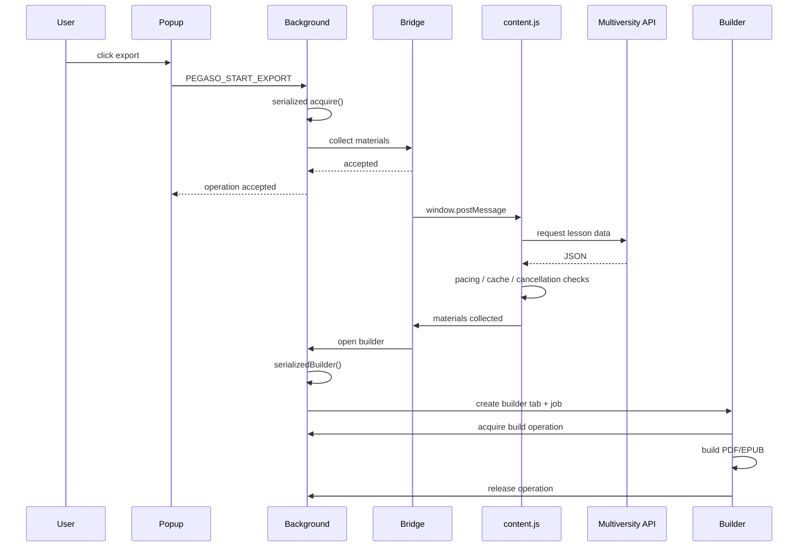

# 05 — Asincronia JavaScript

## Eventi, Promise, timeout e race condition

Nei capitoli precedenti abbiamo incontrato continuamente istruzioni come:

```js
await requestLessonWithRetry(...);
setTimeout(runCommissionCheck, delay);
chrome.runtime.sendMessage(...);
window.postMessage(...);
new MutationObserver(...);
```

A prima vista sembrano soltanto modi diversi di dire:

> "fai questa cosa più tardi".

Ma sotto questa frase apparentemente semplice si nasconde uno dei modelli mentali più importanti di JavaScript.

PlumePilot è un buon caso di studio perché l'asincronia non viene usata soltanto per rendere l'interfaccia più fluida. Determina direttamente la correttezza del programma.

Un export deve poter essere annullato mentre aspetta.

Due comandi non devono acquisire contemporaneamente la stessa operazione globale.

Un video può terminare mentre la sidebar si aggiorna.

Una risposta API può arrivare dopo che il contesto che l'ha richiesta non è più valido.

Una scheda può essere nascosta durante un'attesa.

Un messaggio deve ricevere una risposta anche se l'handler la produrrà soltanto dopo diversi `await`.

Per capire questi problemi dobbiamo rispondere a una domanda fondamentale:

> **Se JavaScript esegue una sola porzione di codice alla volta, come fanno tutte queste cose a sembrare contemporanee?**

---

# Parte I — Il primo equivoco: "JavaScript è single-threaded, quindi non esistono race condition"

## 1. Una frase vera che può diventare fuorviante

Nel normale JavaScript eseguito sul main thread del browser, una funzione non viene interrotta a metà per eseguire arbitrariamente un'altra funzione JavaScript nello stesso agent.

Il modello è detto **run-to-completion**.

Se stiamo eseguendo:

```js
counter++;
console.log(counter);
```

un altro callback JavaScript non si inserisce magicamente tra le due istruzioni.

Questo è rassicurante.

Ma non significa:

```text
una funzione async esegue dall'inizio alla fine senza interferenze
```

Perché una funzione `async` può volontariamente restituire il controllo all'event loop quando incontra un `await`.

Per esempio:

```js
async function updateSomething() {
  const value = await readState();
  await writeState(value + 1);
}
```

Dal punto di vista logico vediamo:

```text
leggi
incrementa
scrivi
```

ma dal punto di vista temporale accade qualcosa di più simile a:

```text
Task A: legge 10
        ↓ await
        controllo restituito al runtime

Task B: legge 10
        ↓ await

Task A: scrive 11
Task B: scrive 11
```

Il risultato finale è `11`, anche se due operazioni volevano incrementare il valore.

Abbiamo appena costruito una race condition senza usare due thread JavaScript in parallelo.

Questa distinzione sarà centrale in tutto il capitolo.

---

## 2. Concurrency e parallelism non sono sinonimi

Conviene separare subito due termini.

### Concorrenza

Più operazioni possono essere **in corso nello stesso intervallo temporale**, alternando momenti di esecuzione e attesa.

### Parallelismo

Più operazioni vengono realmente eseguite **nello stesso istante** da unità di esecuzione differenti.

Il main thread JavaScript del browser ci offre normalmente molta concorrenza senza richiedere che due callback JavaScript vengano eseguiti contemporaneamente sullo stesso thread.

Per esempio:

```text
JavaScript avvia fetch A
JavaScript avvia fetch B
browser attende entrambe le reti
utente clicca un pulsante
JavaScript gestisce il click
risposta B arriva
JavaScript gestisce B
risposta A arriva
JavaScript gestisce A
```

A livello applicativo A e B sono state concorrenti.

Il loro codice di completamento, invece, viene eseguito secondo il modello dell'event loop.

> **Da backend developer**
>
> È utile pensare alla differenza tra molte richieste I/O in-flight gestite da un runtime event-driven e molti thread che stanno eseguendo simultaneamente codice CPU. Il comportamento osservabile può sembrare simile, ma il modello di sincronizzazione è diverso.

---

# Parte II — Call stack ed event loop

## 3. Il call stack

Quando JavaScript chiama una funzione, il runtime aggiunge un nuovo frame allo **stack di esecuzione**.

Prendiamo:

```js
function a() {
  b();
}

function b() {
  console.log("ciao");
}

a();
```

Possiamo rappresentarlo così:

```text
main
 ↓
a()
 ↓
b()
 ↓
console.log()
```

Quando `console.log()` termina, il suo frame viene rimosso.

Poi termina `b()`.

Poi `a()`.

Finché lo stack contiene codice sincrono da eseguire, quel codice procede secondo **run-to-completion**.

---

## 4. Ma `fetch()` non può tenere occupato lo stack

Consideriamo:

```js
const response = await fetch(url);
```

Una richiesta HTTP potrebbe durare:

```text
20 ms
200 ms
2 s
15 s
```

Se JavaScript bloccasse il main thread per tutto quel tempo, il browser non potrebbe gestire normalmente:

- click;
- scroll;
- repaint;
- altri eventi;
- altri script.

Il runtime fa invece qualcosa concettualmente simile a:

```text
JavaScript: avvia operazione asincrona
        ↓
piattaforma browser: continua il lavoro esterno
        ↓
JavaScript: libera lo stack
        ↓
... altre cose possono accadere ...
        ↓
operazione completata
        ↓
continuazione programmata
```

Questa è la base del modello event-driven del browser.

---

## 5. L'event loop come arbitro

Una versione semplificata del modello può essere rappresentata così:

```text
        ┌─────────────┐
        │  call stack │
        └──────┬──────┘
               │ termina
               ▼
        ┌─────────────┐
        │ microtasks  │
        └──────┬──────┘
               │ svuota
               ▼
        ┌─────────────┐
        │ rendering   │
        └──────┬──────┘
               ▼
        ┌─────────────┐
        │ next task   │
        └─────────────┘
```

È una semplificazione, ma sufficiente per costruire un modello utile.

Il browser dispone di meccanismi esterni che possono produrre lavoro futuro:

```text
network
setTimeout
click
postMessage
MutationObserver
WebExtension messaging
```

Quando quel lavoro deve tornare nel JavaScript, viene programmato secondo le regole del runtime.

---

# Parte III — Task e microtask

## 6. Non tutto il lavoro asincrono entra nella stessa coda

Una distinzione particolarmente importante è quella tra:

```text
task
microtask
```

In modo semplificato:

- eventi e timer vengono normalmente gestiti attraverso task;
- le continuazioni delle Promise vengono eseguite come microtask;
- `MutationObserver` usa anch'esso il meccanismo delle microtask.

Dopo la fine del task corrente, il runtime esegue le microtask in attesa prima di passare al task successivo.

Questo spiega alcuni ordini di esecuzione che inizialmente possono sembrare strani.

---

## 7. Un esempio minimo

Considera:

```js
console.log("A");

setTimeout(() => console.log("B"), 0);

Promise.resolve().then(() => console.log("C"));

console.log("D");
```

Un modello mentale corretto porta a:

```text
A
D
C
B
```

Perché:

1. `A` è sincrono;
2. `setTimeout` programma lavoro futuro;
3. `.then()` programma una microtask;
4. `D` è ancora sincrono;
5. terminato il task corrente, viene svuotata la microtask queue → `C`;
6. poi potrà essere eseguito il task del timer → `B`.

Non serve memorizzare ogni dettaglio dell'HTML specification per lavorare bene su PlumePilot.

Serve però capire questo principio:

> **"asincrono" non significa "ordine casuale". Esistono regole di scheduling precise.**

---

## 8. `setTimeout(fn, 0)` non significa "adesso"

Un errore molto comune è leggere:

```js
setTimeout(callback, 0);
```

come:

```text
esegui immediatamente callback
```

In realtà significa più correttamente:

```text
non eseguire prima che sia trascorso il delay minimo
poi rendi callback eleggibile per una futura esecuzione
```

Il callback può quindi eseguire più tardi.

In PlumePilot troviamo, per esempio:

```js
setTimeout(() => {
  const selected = currentLesson();
  if (selected) rememberPlaybackLesson(selected);
}, 0);
```

Riferimento: [`content.js` L7080-L7088](https://github.com/PlumePilot/plumepilot/blob/a8007425f81792e7570516dbdf1e7fb2cbda4d53/content.js#L7080-L7088).

Qui il significato non è:

```text
aspetta zero millisecondi
```

ma:

```text
lascia terminare il click corrente
lascia che la pagina aggiorni la propria selezione
poi rileggi il DOM in un task successivo
```

È un uso temporale deliberato.

---

# Parte IV — Promise: rappresentare un risultato futuro

## 9. Una Promise non è il risultato

Una `Promise` rappresenta un valore che può diventare disponibile in futuro.

Può trovarsi in uno di tre stati concettuali:

```text
pending
fulfilled
rejected
```

Per esempio:

```js
const promise = fetch(url);
```

`promise` non contiene ancora la risposta HTTP.

Contiene una rappresentazione dell'operazione che produrrà quella risposta oppure un errore.

---

## 10. Perché PlumePilot crea Promise manualmente

Molte API Web moderne restituiscono già Promise.

Ma diverse API WebExtension usate dal progetto adottano ancora una forma callback-based.

Per esempio:

```js
chrome.storage.local.get(key, callback);
```

Nel background PlumePilot costruisce piccoli wrapper:

```js
const storageGet = (key) =>
  new Promise((resolve, reject) =>
    chrome.storage.local.get(key, (result) =>
      chrome.runtime.lastError
        ? reject(new Error(chrome.runtime.lastError.message))
        : resolve(result[key] || null)
    )
  );
```

Riferimento: [`background.js` L40-L43](https://github.com/PlumePilot/plumepilot/blob/a8007425f81792e7570516dbdf1e7fb2cbda4d53/background.js#L40-L43).

La trasformazione è:

```text
callback API
    ↓
Promise wrapper
    ↓
async / await
```

Questo evita di propagare callback annidate in tutta l'architettura.

> **Concetto generale**
>
> Se un sistema contiene un boundary asincrono legacy, spesso conviene convertirlo in Promise vicino al boundary e usare un solo modello asincrono nel resto del codice.

---

# Parte V — `async` e `await`

## 11. Cosa fa realmente `async`

Una funzione dichiarata:

```js
async function example() {
  return 42;
}
```

restituisce una Promise.

Concettualmente:

```js
example();
```

produce qualcosa equivalente a:

```js
Promise.resolve(42);
```

Se invece la funzione lancia un errore:

```js
async function example() {
  throw new Error("boom");
}
```

la Promise viene rejected.

---

## 12. `await` non blocca il browser

Questa riga:

```js
const operation = await currentOperation();
```

non significa:

```text
ferma tutto JavaScript finché currentOperation non termina
```

Significa concettualmente:

```text
sospendi questa funzione async
restituisci il controllo al runtime
quando la Promise termina, pianifica la continuazione
```

Questa distinzione spiega perché durante un export l'utente può ancora:

- interagire con la pagina;
- chiedere l'annullamento;
- ricevere aggiornamenti;
- cambiare scheda.

---

## 13. `await` divide una funzione in segmenti temporali

Consideriamo:

```js
async function acquire(kind, sourceTabId) {
  return serialized(async () => {
    let existing = await currentOperation();
    // ...
    await storageSet({ [OPERATION_KEY]: operation });
    return { accepted: true, operation };
  });
}
```

Riferimento: [`background.js` L620-L641](https://github.com/PlumePilot/plumepilot/blob/a8007425f81792e7570516dbdf1e7fb2cbda4d53/background.js#L620-L641).

Possiamo immaginarla come segmenti:

```text
segmento A
  ↓ await currentOperation()
--- sospensione ---
segmento B
  ↓ await tabExists(...)
--- sospensione ---
segmento C
  ↓ await storageSet(...)
--- sospensione ---
segmento D
```

Tra due segmenti, altro codice può essere eseguito.

È precisamente qui che nasce la necessità di ragionare sulle invarianti condivise.

---

# Parte VI — La race condition più istruttiva di PlumePilot

## 14. Il problema di `acquire()` senza serializzazione

Immaginiamo temporaneamente che `acquire()` non sia protetta da `serialized()`.

Due contesti inviano quasi nello stesso momento:

```text
A: voglio iniziare export dispense
B: voglio iniziare Turbo Test
```

Entrambi eseguono:

```js
const existing = await currentOperation();
```

Supponiamo che non esista ancora nessuna operazione.

Un'interleaving possibile sarebbe:

```text
A legge: null
             ↓ A sospeso
B legge: null
             ↓ B sospeso
A crea operation-A
B crea operation-B
```

Entrambe le richieste crederebbero legittimamente di aver acquisito la risorsa.

Abbiamo violato la regola di dominio:

```text
una sola operazione PlumePilot globale alla volta
```

---

## 15. Perché il single thread non ci salva

Nessuna istruzione JavaScript è stata interrotta a metà.

Il problema si trova tra due `await`.

Ogni segmento sincrono è stato eseguito completamente.

Ma l'operazione logica:

```text
leggi stato
verifica disponibilità
scrivi nuovo stato
```

non era atomica.

Questa è una race condition applicativa.

> **Da backend developer**
>
> È molto simile a un classico read-modify-write su database privo di transazione o lock. Non importa che ciascuna singola query sia atomica: la sequenza complessiva può comunque essere vulnerabile all'interleaving.

---

# Parte VII — `serialized()`: una coda Promise come lock logico

## 16. Il codice

In `background.js` troviamo:

```js
function serialized(task) {
  const next = operationQueue.then(task, task);
  operationQueue = next.catch(() => {});
  return next;
}
```

Riferimento: [`background.js` L44-L49](https://github.com/PlumePilot/plumepilot/blob/a8007425f81792e7570516dbdf1e7fb2cbda4d53/background.js#L44-L49).

Il progetto mantiene code separate per:

```text
operazioni
builder
commissione
soglia corso
achievement
suoni
```

Questo è molto interessante.

Non esiste un mutex del sistema operativo.

Esiste invece una **catena di Promise**.

---

## 17. Come funziona la catena

Supponiamo:

```text
operationQueue = Promise già risolta
```

Arriva il task A:

```js
const nextA = operationQueue.then(A, A);
operationQueue = nextA.catch(() => {});
```

Poi arriva B prima che A termini:

```js
const nextB = operationQueue.then(B, B);
```

Ma `operationQueue` ora rappresenta la conclusione di A.

Quindi B non parte fino a quando la catena precedente non si è conclusa.

Il flusso diventa:

```text
A
↓
B
↓
C
↓
D
```

anziché:

```text
A ─┐
B ─┼─ interleaving
C ─┘
```

---

## 18. Perché `then(task, task)`?

La forma:

```js
operationQueue.then(task, task)
```

significa:

```text
esegui il task successivo
sia se la coda precedente è fulfilled
sia se è rejected
```

Altrimenti un errore precedente potrebbe "avvelenare" permanentemente la coda.

Poi:

```js
operationQueue = next.catch(() => {});
```

assicura che la Promise usata come coda interna torni in uno stato risolto per i task futuri.

Importante: il chiamante riceve comunque `next`, quindi il suo task può ancora risultare rejected.

La coda assorbe l'errore **per la continuità della serializzazione**, non per nascondere l'errore al chiamante.

---

## 19. Critical section logica

Possiamo ora definire meglio il concetto.

Una **critical section** è una regione in cui accediamo a uno stato condiviso e dobbiamo impedire interleaving incompatibili.

Per PlumePilot:

```text
currentOperation()
      ↓
verifica owner
      ↓
crea / aggiorna / rilascia operation
```

è una critical section logica.

`serialized()` fa sì che le mutazioni relative a quello stato attraversino una corsia unica.

---

# Parte VIII — Lock globale o code per dominio?

## 20. Perché non usare una sola coda per tutto

PlumePilot non usa:

```js
oneGlobalQueue
```

per qualsiasi attività.

Usa, per esempio:

```text
operationQueue
commissionQueue
achievementQueue
soundQueue
```

Questa è una scelta architetturale importante.

Se due operazioni non condividono la stessa invariante, serializzarle artificialmente riduce la concorrenza senza aumentare la correttezza.

Per esempio:

```text
aggiornare un achievement
```

non dovrebbe necessariamente impedire:

```text
riprodurre un suono
```

La domanda corretta non è:

> "Come impedisco qualsiasi concorrenza?"

ma:

> **"Quale stato condiviso deve essere protetto dallo stesso ordine totale?"**

---

# Parte IX — Guard semplici: `busy`

## 21. Non tutte le race richiedono una coda

L'autoplay usa anche una strategia più locale:

```js
if (busy || v !== lastVideo) {
  return;
}

busy = true;

try {
  // avanzamento asincrono
} finally {
  busy = false;
}
```

Riferimento: [`content.js` L6665-L6671](https://github.com/PlumePilot/plumepilot/blob/a8007425f81792e7570516dbdf1e7fb2cbda4d53/content.js#L6665-L6671) e [`content.js` L6812-L6815](https://github.com/PlumePilot/plumepilot/blob/a8007425f81792e7570516dbdf1e7fb2cbda4d53/content.js#L6812-L6815).

`busy` impedisce che due tentativi di `advance()` procedano contemporaneamente nello stesso contesto.

È un piccolo **reentrancy guard**.

---

## 22. Reentrancy

Una funzione è vulnerabile alla reentrancy quando può essere richiamata nuovamente prima che la precedente esecuzione logica sia terminata.

Nel nostro caso diversi segnali potrebbero teoricamente provocare un nuovo tentativo di avanzamento mentre il precedente sta ancora:

```text
aspettando il 100%
riaprendo un capitolo
completando un test
cercando il prossimo video
```

Il flag:

```js
busy = true
```

stabilisce un'invariante locale:

```text
massimo un workflow advance attivo per volta
```

---

## 23. Perché `finally` è fondamentale

Immagina:

```js
busy = true;
await something();
busy = false;
```

Se `something()` lancia un errore oppure una delle numerose condizioni produce un `return` anticipato, rischiamo di non arrivare mai al reset.

Con:

```js
try {
  ...
} finally {
  busy = false;
}
```

il cleanup viene eseguito anche in presenza di:

- `return`;
- `throw`;
- Promise rejected.

Questo pattern compare molte volte nel progetto.

> **Regola pratica**
>
> Quando una funzione acquisisce uno stato temporaneo — lock, flag, timer, controller, lease, risorsa — chiediti subito dove viene garantito il rilascio in ogni exit path.

---

# Parte X — Gli `await` invalidano le nostre assunzioni

## 24. Prima dell'`await` il mondo è così. Dopo potrebbe non esserlo più.

Consideriamo l'autoplay:

```js
let cur = await recoverPlaybackLesson(v);

if (!enabled || v !== lastVideo) return;
```

Perché controllare di nuovo `enabled`?

Non lo avevamo già verificato prima?

Sì.

Ma durante:

```js
await recoverPlaybackLesson(v)
```

l'utente potrebbe aver disattivato l'autoplay.

Oppure il player potrebbe essere cambiato.

Quindi una condizione vera prima dell'`await` non è automaticamente ancora vera dopo.

---

## 25. Questo pattern compare continuamente

Dopo aver aspettato il completamento della lezione, PlumePilot verifica di nuovo:

```js
if (
  !enabled ||
  v !== lastVideo ||
  video() !== v ||
  !stableCur ||
  playbackLessonRow(completedLesson) !== stableCur
) {
  return;
}
```

Riferimento: [`content.js` L6694-L6699](https://github.com/PlumePilot/plumepilot/blob/a8007425f81792e7570516dbdf1e7fb2cbda4d53/content.js#L6694-L6699).

Questa non è paranoia.

È una conseguenza diretta dell'asincronia.

Ogni `await` è un potenziale punto in cui:

```text
utente cambia impostazioni
DOM cambia
pagina cambia route
operazione viene annullata
un altro workflow modifica lo stato
```

---

## 26. Il pattern "check → await → re-check"

Uno schema molto generale è:

```text
controlla precondizione
        ↓
await lavoro asincrono
        ↓
ricontrolla l'invariante
        ↓
continua soltanto se è ancora valida
```

In codice:

```js
if (!enabled) return;

await slowOperation();

if (!enabled) return;
```

È uno dei pattern più importanti da ricordare quando lavori con UI e stato mutabile.

---
# Parte XI — Aspettare una condizione, non semplicemente del tempo

## 27. `sleep()`

PlumePilot definisce:

```js
const sleep = (ms) => new Promise((r) => setTimeout(r, ms));
```

Questo trasforma un timer in una Promise e permette:

```js
await sleep(250);
```

Ma un `sleep()` puro risponde soltanto alla domanda:

```text
è passato abbastanza tempo?
```

Non risponde a:

```text
la pagina è pronta?
```

---

## 28. `waitFor()`

Per questo il progetto usa:

```js
async function waitFor(fn, timeout = WAIT_MS) {
  let start = Date.now();

  while (Date.now() - start < timeout) {
    const x = fn();
    if (x) return x;
    await sleep(100);
  }

  return null;
}
```

La versione reale gestisce anche schede nascoste e una seconda finestra di attesa.

Riferimento: [`content.js` L1577-L1609](https://github.com/PlumePilot/plumepilot/blob/a8007425f81792e7570516dbdf1e7fb2cbda4d53/content.js#L1577-L1609).

Qui il tempo non determina il successo.

Il tempo determina soltanto una deadline.

Il successo dipende da una **readiness condition**.

---

## 29. Polling asincrono

`waitFor()` è una forma di polling:

```text
controlla
  ↓ no
aspetta 100 ms
  ↓
controlla
  ↓ no
aspetta
  ↓
...
  ↓ sì
ritorna
```

È importante notare che:

```js
await sleep(100)
```

non blocca il thread per 100 ms.

Durante quei 100 ms il browser può fare altro.

---

# Parte XII — Timer: delay minimo, non appuntamento preciso

## 30. Il monitor della commissione

In `bridge.js` troviamo:

```js
function scheduleCommissionCheck(delayMs = 0) {
  clearTimeout(commissionCheckTimer);
  commissionCheckTimer = null;
  if (!commissionCheckEnabled || !pageIsVisible()) return;
  commissionCheckTimer = setTimeout(
    runCommissionCheck,
    Math.max(0, Number(delayMs) || 0),
  );
}
```

Riferimento: [`bridge.js` L112-L117](https://github.com/PlumePilot/plumepilot/blob/a8007425f81792e7570516dbdf1e7fb2cbda4d53/bridge.js#L112-L117).

Questo codice insegna almeno tre cose.

---

## 31. Primo: un timer va spesso sostituito, non accumulato

Prima di crearne uno nuovo:

```js
clearTimeout(commissionCheckTimer);
```

Così il sistema mantiene concettualmente:

```text
al massimo un check futuro pianificato
```

Senza questa precauzione, eventi diversi potrebbero accumulare timer duplicati.

---

## 32. Secondo: il tempo non è l'unica precondizione

Il timer viene creato soltanto se:

```js
commissionCheckEnabled && pageIsVisible()
```

Lo scheduling temporale viene quindi subordinato allo stato corrente.

---

## 33. Terzo: `delayMs` non è un orario garantito

`setTimeout(fn, 1000)` non promette:

```text
fn partirà esattamente fra 1000 ms
```

Promette, semplificando:

```text
fn non sarà resa eseguibile prima del delay previsto
```

Se il main thread è occupato, se la scheda è throttled o se esistono altri task, il callback può arrivare dopo.

Questo è uno dei motivi per cui PlumePilot usa spesso timestamp reali come:

```js
Date.now()
```

anziché assumere che ogni timer abbia scandito il tempo perfettamente.

---

# Parte XIII — Schede nascoste e tempo del browser

## 34. Un browser non è un cronometro ideale

I browser possono ridurre la frequenza dei timer delle schede in background.

Per un'estensione che lavora dentro una pagina host questo è importante.

PlumePilot tiene conto della visibility durante diverse attese.

La funzione `waitFor()` conserva:

```text
hiddenEpochAtStart
startedHidden
```

poi, se il timeout è maturato mentre la pagina era nascosta, può attendere il ritorno alla visibilità prima di concedere un secondo tentativo.

Questo evita di interpretare:

```text
la scheda non ha avuto opportunità di aggiornarsi
```

come:

```text
la piattaforma è definitivamente rotta
```

---

# Parte XIV — Un timeout applicativo non è un `sleep`

## 35. `turboApiRequest()`

Nel Capitolo 04 abbiamo visto la mini-RPC tra `content.js` e `commission-interceptor.js`.

Ora guardiamola dal punto di vista temporale:

```js
function turboApiRequest(action, payload = {}) {
  return new Promise((resolve) => {
    const requestId = `studywing-${Date.now()}-${++turboApiRequestSequence}`;

    const timeout = setTimeout(() => {
      pendingTurboApiRequests.delete(requestId);
      resolve({ ok: false, error: "RESPONSE_TIMEOUT" });
    }, TURBO_API_RESPONSE_TIMEOUT_MS);

    pendingTurboApiRequests.set(requestId, { resolve, timeout });

    window.postMessage({
      type: TURBO_API_REQUEST,
      requestId,
      action,
      ...payload,
    }, "*");
  });
}
```

Riferimento: [`content.js` L4904-L4923](https://github.com/PlumePilot/plumepilot/blob/a8007425f81792e7570516dbdf1e7fb2cbda4d53/content.js#L4904-L4923).

Il timeout qui non dice:

```text
aspetta 17 secondi prima di procedere
```

Dice:

```text
questa Promise non può restare pending indefinitamente
```

È una **deadline applicativa**.

---

## 36. Perché serve una deadline

Immaginiamo che il MAIN world non risponda più perché:

- la pagina cambia;
- il listener sparisce;
- la navigazione interrompe il workflow;
- si verifica un errore inatteso;
- la risposta viene persa.

Senza timeout:

```text
pendingTurboApiRequests
```

potrebbe conservare per sempre:

```text
requestId → resolve
```

E il chiamante rimarrebbe sospeso per sempre su:

```js
await turboApiRequest(...)
```

La deadline trasforma un fallimento silenzioso in un risultato esplicito:

```js
{ ok: false, error: "RESPONSE_TIMEOUT" }
```

---

# Parte XV — Correlation ID e concorrenza

## 37. Perché serve `requestId`

Più richieste possono essere in-flight:

```text
request A → lesson 1
request B → lesson 2
request C → outline
```

Le risposte possono arrivare in ordine diverso:

```text
B
A
C
```

Non possiamo quindi usare semplicemente:

```text
"la prossima risposta appartiene all'ultima richiesta"
```

Serve correlazione esplicita.

Il `Map`:

```js
pendingTurboApiRequests
```

funge da registro:

```text
requestId-A → resolver-A
requestId-B → resolver-B
requestId-C → resolver-C
```

Quando arriva una risposta, il sistema risolve esattamente la Promise corrispondente.

---

## 38. Async request multiplexing

Possiamo descrivere questo pattern come un piccolo multiplexer RPC:

```text
                ┌─ request A ─────────┐
content.js ─────┼─ request B ─────────┼──► MAIN world
                └─ request C ─────────┘

                ┌─ response B ◄───────┐
content.js ◄────┼─ response A ◄───────┼── MAIN world
                └─ response C ◄───────┘
```

Il tempo di completamento non deve coincidere con l'ordine di invio.

Il `requestId` separa **ordine temporale** e **identità logica**.

---

# Parte XVI — Cancellare davvero un'operazione

## 39. Una Promise non si cancella magicamente

Se abbiamo:

```js
const p = fetch(url);
```

non possiamo semplicemente "cancellare la Promise" come concetto generale.

Una Promise rappresenta il risultato.

Per interrompere davvero il lavoro dobbiamo cancellare, quando possibile, **l'operazione sottostante**.

Per `fetch()`, il browser offre `AbortController`.

---

## 40. `AbortController` nelle API PlumePilot

In `commission-interceptor.js`:

```js
const controller = new AbortController();
const timeout = setTimeout(() => controller.abort(), API_TIMEOUT_MS);

try {
  const response = await originalFetch.call(window, url, {
    ...options,
    signal: controller.signal,
  });
  // ...
} finally {
  clearTimeout(timeout);
  turboControllers.delete(message.requestId);
}
```

Riferimento: [`commission-interceptor.js` L500-L529](https://github.com/PlumePilot/plumepilot/blob/a8007425f81792e7570516dbdf1e7fb2cbda4d53/commission-interceptor.js#L500-L529).

Il controller collega due mondi:

```text
nostra intenzione: annulla
       ↓
AbortSignal
       ↓
operazione fetch
```

---

## 41. Un timeout costruito sopra la cancellazione

Notiamo una cosa elegante:

```js
setTimeout(() => controller.abort(), API_TIMEOUT_MS)
```

Il timeout non produce direttamente il fallimento.

Produce invece un segnale di abort verso l'operazione reale.

Il flusso è:

```text
request parte
   ↓
timer parte
   ↓
request termina prima?
   ├─ sì → clearTimeout
   └─ no → abort()
            ↓
         fetch termina con AbortError
```

Questo evita di avere una request reale che continua silenziosamente dopo che il chiamante l'ha già considerata fallita.

---

# Parte XVII — Cancellazione collettiva

## 42. `turboControllers`

Ogni request attiva viene associata al proprio controller:

```js
turboControllers.set(message.requestId, controller);
```

Quando arriva:

```text
STUDYWING_TURBO_API_CANCEL
```

l'interceptor esegue:

```js
for (const controller of turboControllers.values()) {
  controller.abort();
}

turboControllers.clear();
```

Riferimento: [`commission-interceptor.js` L792-L795](https://github.com/PlumePilot/plumepilot/blob/a8007425f81792e7570516dbdf1e7fb2cbda4d53/commission-interceptor.js#L792-L795).

Il `Map` non serve quindi soltanto a tracciare richieste.

È anche un registry delle operazioni cancellabili in-flight.

---

# Parte XVIII — Cancellazione cooperativa

## 43. Non tutto supporta `AbortSignal`

Molte operazioni di PlumePilot non sono una singola `fetch()`.

Un export può essere:

```text
apri sezione
aspetta rendering
leggi capitolo
richiedi API
aspetta pacing
apri capitolo successivo
...
```

Non esiste necessariamente un'unica API nativa che possiamo abortire.

Qui entra la **cancellazione cooperativa**.

---

## 44. `ensureExportNotCancelled()`

PlumePilot controlla periodicamente:

```js
function ensureExportNotCancelled(operationId) {
  if (
    exportCancelRequested &&
    operationId &&
    operationId === activeExportOperationId
  ) {
    throw exportAbortError();
  }
}
```

Riferimento: [`content.js` L1611-L1625](https://github.com/PlumePilot/plumepilot/blob/a8007425f81792e7570516dbdf1e7fb2cbda4d53/content.js#L1611-L1625).

Il workflow accetta quindi implicitamente un contratto:

```text
tra un passo e l'altro controllerò se devo fermarmi
```

---

## 45. Anche il `sleep` diventa cancellabile

Un semplice:

```js
await sleep(3000);
```

non reagirebbe alla cancellazione fino al termine dei tre secondi.

Per questo esiste:

```js
async function exportSleep(ms, operationId) {
  const end = Date.now() + ms;

  while (Date.now() < end) {
    ensureExportNotCancelled(operationId);
    await sleep(Math.min(100, end - Date.now()));
  }

  ensureExportNotCancelled(operationId);
}
```

Riferimento: [`content.js` L1627-L1634](https://github.com/PlumePilot/plumepilot/blob/a8007425f81792e7570516dbdf1e7fb2cbda4d53/content.js#L1627-L1634).

Il delay lungo viene spezzato in piccole finestre di cooperazione.

---

## 46. Responsiveness della cancellazione

Questa struttura stabilisce una proprietà misurabile:

```text
latenza massima teorica di reazione durante quel sleep ≈ 100 ms
```

Non è un dettaglio cosmetico.

È parte dell'UX.

Un pulsante "Annulla" che reagisce dopo 10 secondi sembra rotto anche se tecnicamente funziona.

---

# Parte XIX — `AbortController` nel builder EPUB

## 47. Un altro tipo di cancellazione

Nel builder:

```js
buildController = format === "epub"
  ? new AbortController()
  : null;
```

Il signal viene passato a:

```js
buildCourseEpub(..., {
  signal: buildController.signal,
});
```

E il pulsante esegue:

```js
buildController.abort();
```

Riferimento: [`materials-builder.js` L134-L175](https://github.com/PlumePilot/plumepilot/blob/a8007425f81792e7570516dbdf1e7fb2cbda4d53/materials-builder.js#L134-L175) e [`materials-builder.js` L179-L185](https://github.com/PlumePilot/plumepilot/blob/a8007425f81792e7570516dbdf1e7fb2cbda4d53/materials-builder.js#L179-L185).

Qui il signal non cancella una `fetch` specifica.

Diventa un protocollo generico di cancellazione tra builder UI e motore EPUB.

---

# Parte XX — `try/catch/finally` nei workflow asincroni

## 48. Il builder come esempio completo

Il cuore del builder segue:

```text
acquire
  ↓
try
  build
  download
catch
  mostra errore / annullamento
finally
  release
  pulisci controller
  ripristina UI
```

Questa è una struttura particolarmente robusta.

Il `finally` contiene ciò che deve succedere indipendentemente dall'esito.

---

## 49. Failure path e cancellation path non sono identici

Il builder distingue:

```js
const cancelled = error?.name === "AbortError";
```

Poi presenta messaggi diversi.

Questo riflette una distinzione semantica importante:

```text
failure     = qualcosa non ha funzionato come previsto
cancellation = l'utente ha chiesto intenzionalmente di fermarsi
```

Entrambi possono usare il meccanismo delle eccezioni per interrompere il flusso, ma non sono lo stesso evento di dominio.

---

# Parte XXI — Error propagation con Promise

## 50. `throw` dentro una funzione async

In una funzione `async`:

```js
throw new Error("x");
```

produce una Promise rejected.

Quindi:

```js
await functionThatFails();
```

fa emergere l'errore nel punto dell'`await`, dove può essere gestito con:

```js
try {
  await ...;
} catch (error) {
  ...
}
```

Questo permette di scrivere workflow asincroni con una struttura simile al codice sincrono.

---

## 51. `action.then(sendResponse).catch(...)`

Il dispatcher del background termina con:

```js
action
  .then(sendResponse)
  .catch((error) => {
    console.error(...);
    sendResponse({ accepted: false, reason: error.message });
  });

return true;
```

Riferimento: [`background.js` L918-L945](https://github.com/PlumePilot/plumepilot/blob/a8007425f81792e7570516dbdf1e7fb2cbda4d53/background.js#L918-L945).

Qui il background trasforma:

```text
Promise fulfilled → protocol response success
Promise rejected  → protocol response error
```

Il boundary di messaging diventa quindi anche un **error boundary**.

---

# Parte XXII — Perché `return true` è ancora asincronia

## 52. Il listener potrebbe terminare prima della risposta

Il listener WebExtension viene chiamato sincronicamente quando arriva il messaggio.

Ma l'azione scelta può richiedere:

```text
storage
network
messaggi a tab
creazione builder
```

Quindi `sendResponse()` verrà chiamato in futuro.

Il `return true` comunica al runtime:

```text
non chiudere ancora il canale di risposta
risponderò asincronamente
```

Abbiamo già incontrato il comportamento nel Capitolo 02.

Ora possiamo collocarlo nel modello dell'event loop:

```text
listener task
   ↓
avvia Promise
   ↓
return true
   ↓
listener termina
   ↓
... runtime continua ...
   ↓
Promise settle
   ↓
.then(sendResponse)
```

---

# Parte XXIII — Fire-and-forget controllato

## 53. Non tutto deve essere `await`-ato

In `content.js` troviamo:

```js
void collectCourseMaterials(format, operationId).finally(() => {
  log("Export collection request finished.", { operationId, format });
});
```

Il chiamante del messaggio risponde subito:

```text
richiesta accettata
```

senza aspettare che l'intero export termini.

Questo è appropriato perché l'operazione lunga possiede un proprio protocollo di stato.

---

## 54. Command accepted ≠ operation completed

È una distinzione fondamentale nei sistemi asincroni.

Possiamo avere:

```text
POST /job
→ 202 Accepted
```

oppure, nel nostro caso:

```text
PEGASO_COLLECT_COURSE_MATERIALS
→ accepted: true
```

Il significato è:

```text
il workflow è partito
```

non:

```text
il file è pronto
```

Lo stato successivo viene comunicato tramite altri eventi e messaggi.

Questo modello assomiglia molto a job queue e background processing lato server.

---

# Parte XXIV — Fire-and-forget non significa ignorare gli errori

## 55. Il rischio di `void somePromise()`

Se facessimo soltanto:

```js
void doSomethingAsync();
```

una rejection non gestita potrebbe diventare un errore difficile da correlare.

Quando scegliamo volontariamente il fire-and-forget dovremmo comunque definire:

```text
chi osserva il fallimento?
chi pulisce lo stato?
chi notifica l'utente?
```

Nel workflow export, la funzione stessa pubblica status/failure event e contiene cleanup.

Quindi l'assenza di `await` nel chiamante non equivale all'assenza di ownership.

---

# Parte XXV — `Promise.allSettled()`

## 56. Quando vogliamo tutti i risultati, anche quelli falliti

Per cancellare la memoria commissione in tutte le tab:

```js
const results = await Promise.allSettled(
  tabs
    .filter((tab) => Number.isInteger(tab?.id))
    .map((tab) =>
      sendTabMessage(tab.id, {
        type: "PEGASO_CLEAR_COMMISSION_MEMORY",
      })
    ),
);
```

Riferimento: [`background.js` L684-L698](https://github.com/PlumePilot/plumepilot/blob/a8007425f81792e7570516dbdf1e7fb2cbda4d53/background.js#L684-L698).

Perché `allSettled()` e non `Promise.all()`?

---

## 57. `Promise.all()` è fail-fast

Concettualmente:

```js
await Promise.all([A, B, C]);
```

se B viene rejected, la Promise aggregata viene rejected.

Questo è utile quando:

```text
tutte le operazioni sono necessarie al risultato complessivo
```

Ma qui le tab sono indipendenti.

Una tab potrebbe essere appena stata chiusa.

Vogliamo comunque contattare le altre.

---

## 58. `Promise.allSettled()` conserva il risultato di tutti

Il risultato contiene elementi del tipo:

```js
{ status: "fulfilled", value: ... }
```

oppure:

```js
{ status: "rejected", reason: ... }
```

Il background può quindi calcolare:

```js
results.filter(
  (result) =>
    result.status === "fulfilled" &&
    result.value?.accepted
).length;
```

Il modello semantico è:

```text
best effort verso molte destinazioni indipendenti
```

---

# Parte XXVI — Parallelizzare o serializzare?

## 59. Due strumenti opposti, entrambi corretti

Abbiamo visto:

```text
serialized()       → forza ordine
Promise.allSettled → permette concorrenza
```

Non sono contraddittori.

Risolvono problemi diversi.

### Serializzare quando

- le operazioni condividono stato mutabile;
- l'ordine è semanticamente importante;
- un read-modify-write deve essere protetto;
- due workflow non possono convivere.

### Concorrere quando

- le operazioni sono indipendenti;
- l'ordine non importa;
- vogliamo ridurre la latenza totale;
- ogni risultato può essere gestito separatamente.

La capacità importante non è "usare Promise".

È scegliere **quale relazione temporale è corretta per il dominio**.

---

# Parte XXVII — Backpressure e pacing

## 60. Potremmo lanciare cento request insieme. Ma dovremmo?

Nel Capitolo 04 abbiamo incontrato:

```js
await exportSleep(API_MATERIAL_PACING_MS, operationId);
```

tra richieste successive.

Questa scelta riduce volontariamente la concorrenza.

Perché?

Perché massimizzare il parallelismo non significa automaticamente massimizzare l'affidabilità.

Un burst di richieste può:

- aumentare carico;
- rendere più difficile la cancellazione;
- produrre risposte temporaneamente incomplete;
- consumare più memoria;
- complicare il progresso osservabile.

Il pacing è una forma semplice di **backpressure applicativa**.

---

# Parte XXVIII — `finally` e cleanup temporale

## 61. Timer e controller devono avere una vita definita

In `executeTurboApiRequest()`:

```js
finally {
  clearTimeout(timeout);
  turboControllers.delete(message.requestId);
}
```
Questo garantisce che, indipendentemente da:

```text
success
HTTP error
JSON error
abort
exception
```

non rimangano:

```text
timer inutili
controller stale
entry in-flight obsolete
```

Possiamo leggere `finally` come:

> **ripristina le invarianti temporanee del workflow**.

---

# Parte XXIX — Resource lifetime

## 62. Ogni operazione asincrona possiede risorse

Non pensiamo soltanto a memoria o file.

Un workflow asincrono può possedere:

```text
timer
listener
AbortController
Map entry
operationId
flag busy
lease
builder tab
storage job
```

Queste risorse hanno un lifetime.

La domanda architetturale è:

```text
chi le crea?
chi ne è owner?
quando vengono distrutte?
che succede se il workflow fallisce a metà?
```

Questa prospettiva è molto utile quando un bug sembra essere "uno stato rimasto appeso".

---

# Parte XXX — Lost wakeup e startup ordering

## 63. Un evento può arrivare prima che qualcuno lo ascolti

Nel Capitolo 02 abbiamo visto il problema:

```text
bridge pubblica stato autoplay
        ↓
content.js non ha ancora installato listener
        ↓
evento perso
```

Questo non è un problema di sintassi.

È un problema temporale.

La soluzione usata da PlumePilot è:

```js
window.postMessage({
  type: "PEGASO_AUTONEXT_STATE_REQUEST",
}, "*");
```

subito dopo aver installato il listener.

Riferimento: [`content.js` L557-L559](https://github.com/PlumePilot/plumepilot/blob/a8007425f81792e7570516dbdf1e7fb2cbda4d53/content.js#L557-L559).

Il pattern è:

```text
subscribe
   ↓
request snapshot
   ↓
receive future events
```

Una soluzione classica al problema del subscriber che arriva tardi.

---

# Parte XXXI — Race tra DOM e workflow

## 64. Il DOM può cambiare durante un `await`

Il capitolo precedente ci ha mostrato gli stale DOM references.

Ora possiamo descriverne la causa temporale.

PlumePilot conserva:

```js
const completedLesson = playbackContext;
```

poi esegue:

```js
const completed = await waitForLessonCompletion(cur, v);
```

Durante quell'attesa:

```text
sidebar aggiornata
accordion chiuso
row sostituita
```

Per questo, dopo l'`await`, il codice non continua semplicemente a usare `cur`.

Risolva nuovamente:

```js
const stableCur = await recoverPlaybackLesson(v);
```

L'asincronia spiega quindi il perché del pattern **resolve late** studiato nel Capitolo 03.

---

# Parte XXXII — Condition variable "artigianale"

## 65. `waitFor()` come sincronizzazione con un sistema esterno

Nei sistemi concorrenti classici esistono primitive come:

```text
condition variable
semaphore
future
channel
```

Nel browser, quando sincronizziamo PlumePilot con una UI esterna che non espone un evento perfetto, `waitFor()` svolge un ruolo concettualmente simile:

```text
non continuare finché questa condizione osservabile non diventa vera
```

Naturalmente è implementato via polling, non è una vera condition variable del runtime.

Ma il modello mentale è utile.

---

# Parte XXXIII — Evitare gli sleep magici

## 66. Due tipi di attesa

Possiamo distinguere:

### Attesa semantica

```js
await waitFor(() => chapterIsOpen());
```

Dice:

```text
continua quando la condizione è vera
```

### Attesa temporale deliberata

```js
await sleep(LESSON_CLOSE_DELAY_MS);
```

Dice:

```text
anche se il segnale visibile è arrivato, concedi alla piattaforma una finestra per completare il cleanup della sessione
```

Entrambe sono legittime.

La differenza è sapere **perché** stiamo aspettando.

---

## 67. Il delay dopo il 100%

In `waitForLessonCompletion()`:

```js
await sleep(LESSON_CLOSE_DELAY_MS);
```

arriva dopo che la sidebar ha registrato il 100%.

Il commento spiega:

```text
la sidebar può raggiungere 100%
prima che la piattaforma abbia realmente rilasciato la sessione/player
```

Riferimento: [`content.js` L1380-L1388](https://github.com/PlumePilot/plumepilot/blob/a8007425f81792e7570516dbdf1e7fb2cbda4d53/content.js#L1380-L1388).

Questo è un buon esempio di **eventual consistency temporale** tra due sottosistemi della stessa piattaforma.

---

# Parte XXXIV — Scheduler, dominio e UX

## 68. Il codice asincrono è anche design dell'esperienza

Quando scegliamo:

```text
retry dopo 350 ms
poll ogni 100 ms
pacing 150 ms
commissione ogni 10 minuti
cancellazione controllata ogni 100 ms
```

non stiamo soltanto scegliendo numeri tecnici.

Stiamo definendo:

- responsività;
- traffico;
- carico;
- percezione dell'utente;
- tolleranza ai ritardi della piattaforma.

I tempi fanno parte del comportamento del prodotto.

---

# Parte XXXV — Race condition ≠ bug casuale

## 69. Perché le race sembrano casuali

Una race condition dipende dall'interleaving.

Per esempio:

```text
rete veloce → funziona
rete lenta → fallisce
DevTools aperti → timing diverso
scheda visibile → funziona
scheda background → fallisce
```

Questo può produrre la sensazione:

> "il bug capita ogni tanto senza motivo".

Il motivo invece esiste.

È soltanto temporale.

---

## 70. Come riconoscere una possibile race

Domande utili:

```text
questa funzione contiene await?
legge stato prima dell'await e lo usa dopo?
qualcun altro può modificare quello stato?
una callback può arrivare due volte?
può partire la stessa operazione da due UI diverse?
un timer precedente è ancora attivo?
il DOM può essere stato ricostruito?
```

Queste domande sono spesso più utili di aggiungere log casuali.

---

# Parte XXXVI — Race prevention strategies in PlumePilot

## 71. Non esiste una sola soluzione

Nel progetto incontriamo strategie differenti:

```text
serialized queue      → ordine su stato condiviso
busy flag             → anti-reentrancy locale
operationId           → correlazione e ownership
requestId             → risposta alla richiesta corretta
dedup sets            → ignora messaggi duplicati
AbortController       → cancella lavoro in-flight
re-check after await  → valida nuovamente le precondizioni
fresh DOM resolution  → evita riferimenti obsoleti
timeout               → evita pending infinito
lease                 → ownership temporanea cross-context
```

Il valore didattico è proprio questo:

> **"race condition" è una categoria di problema; la soluzione dipende dal tipo di stato condiviso e dal protocollo.**

---

# Parte XXXVII — Serializzazione e idempotenza non sono la stessa cosa

## 72. Due concetti spesso confusi

Serializzare significa:

```text
A poi B poi C
```

Idempotenza significa:

```text
eseguire due volte X non produce effetti aggiuntivi indesiderati
```

Una coda non rende automaticamente un'operazione idempotente.

E un'operazione idempotente può comunque richiedere serializzazione se modifica stato condiviso con altre operazioni differenti.

PlumePilot usa entrambi i concetti.

---

# Parte XXXVIII — `Promise` come state machine

## 73. Una Promise è già una piccola macchina a stati

Possiamo modellarla come:

```text
           ┌────────── fulfilled
pending ───┤
           └────────── rejected
```

Una volta settled, non torna pending.

Questa proprietà è importante perché rende il risultato immutabile dal punto di vista della Promise.

Il workflow esterno può avere molti più stati:

```text
collecting
stopping
building
completed
failed
```

ma ogni singola Promise rappresenta una transizione futura con un solo esito finale.

Questo anticipa il Capitolo 07 sulle state machine.

---

# Parte XXXIX — Un errore può essere valore o rejection

## 74. Due stili nel progetto

Alcune funzioni comunicano errori tramite rejection:

```js
throw new Error(...);
```

Altre restituiscono valori:

```js
{ ok: false, error: "RESPONSE_TIMEOUT" }
```

Perché?

Dipende dal livello del protocollo.

Per una mini-RPC può essere utile avere un envelope uniforme:

```text
ok/data/error
```

Per un workflow interno può essere più naturale propagare eccezioni fino a un `catch` centrale.

L'importante è che il boundary abbia un contratto coerente.

---

# Parte XL — Timeouts, retry e cancellation sono concetti diversi

## 75. Timeout

Dice:

```text
oltre questa deadline non aspetterò più
```

## 76. Retry

Dice:

```text
proverò nuovamente l'operazione
```

## 77. Cancellation

Dice:

```text
non desidero più che il workflow continui
```

## 78. Pacing

Dice:

```text
l'operazione è valida, ma non voglio iniziare la successiva troppo presto
```

Questi concetti usano tutti il tempo, ma risolvono problemi differenti.

Confonderli porta facilmente a codice difficile da ragionare.

---

# Parte XLI — Il builder e il doppio click

## 79. `building` come guard UI

In `materials-builder.js`:

```js
async function build(format) {
  if (building || !job) return;
  setBusy(true);
  // ...
}
```

Riferimento: [`materials-builder.js` L134-L136](https://github.com/PlumePilot/plumepilot/blob/a8007425f81792e7570516dbdf1e7fb2cbda4d53/materials-builder.js#L134-L136).

Questo protegge il workflow da:

```text
doppio click
click PDF + EPUB quasi simultanei
```

Ma notiamo che il progetto dispone anche di una protezione più globale tramite `acquire(format)`.

Quindi abbiamo difesa a più livelli:

```text
UI guard
   ↓
operation manager globale
```

---

# Parte XLII — Defense in depth contro la concorrenza

## 80. Perché due guard non sono necessariamente ridondanti

La UI guard migliora immediatamente l'esperienza locale.

L'operation manager protegge invece l'invariante globale anche se il comando arriva da:

```text
popup
floating menu
builder
altra tab
```

Sono due scope differenti.

Questa è **defense in depth** applicata alla concorrenza.

---

# Parte XLIII — Cosa succede se una tab scompare?

## 81. L'asincronia crea ownership che può diventare orfana

Un'operazione può durare abbastanza da sopravvivere alla tab che l'ha iniziata.

Per questo il background controlla:

```js
if (await tabExists(ownerTabId)) {
  return ...;
}

await removeOperation(operation);
```

Riferimento: [`background.js` L604-L618](https://github.com/PlumePilot/plumepilot/blob/a8007425f81792e7570516dbdf1e7fb2cbda4d53/background.js#L604-L618).

Questo è un problema di **liveness**:

```text
un lock/operation record non deve restare occupato per sempre
se il suo owner non esiste più
```

---

# Parte XLIV — Safety e liveness

## 82. Due proprietà utili per ragionare

### Safety

Qualcosa di sbagliato non deve accadere.

Esempio:

```text
non devono partire due export globali simultanei
```

### Liveness

Qualcosa di buono deve prima o poi poter accadere.

Esempio:

```text
se una tab owner viene chiusa, l'operation lock non deve restare per sempre
```

Le code e i lock migliorano la safety.

Il cleanup degli owner orfani protegge la liveness.

Questi termini vengono spesso usati nei sistemi concorrenti e distribuiti e sono sorprendentemente utili anche dentro una browser extension.

---

# Parte XLV — Errori temporali tipici

## 83. Stale read

```text
leggo stato
await
uso quello stato come se fosse ancora attuale
```

## 84. Double start

```text
due trigger avviano lo stesso workflow
```

## 85. Lost response

```text
request parte
listener/context sparisce
Promise resta pending
```

## 86. Duplicate timer

```text
nuovo timer creato senza cancellare quello precedente
```

## 87. Orphan lock

```text
owner scompare
stato globale resta occupato
```

## 88. Late response

```text
risposta arriva correttamente
ma appartiene a uno stato dell'app ormai superato
```

Queste categorie sono ottimi nomi da usare anche durante il debugging.

---

# Parte XLVI — Come debuggare l'asincronia

## 89. Logga identità, non soltanto messaggi

Un log:

```text
request completed
```

è poco utile.

Meglio:

```text
requestId
operationId
courseCode
sourceTabId
phase
timestamp
```

Perché ci permettono di ricostruire l'interleaving.

---

## 90. Costruire una timeline

Quando un bug è temporale, conviene trasformare i log in una timeline:

```text
12:00:00.000 A acquire requested
12:00:00.010 B acquire requested
12:00:00.020 A entered queue
12:00:00.050 A wrote operation
12:00:00.051 B entered queue
12:00:00.060 B saw existing operation
```

La timeline rende visibile ciò che il codice sorgente, letto staticamente, nasconde.

---

## 91. Ritardare artificialmente

Per testare una race può essere utile, in ambiente di sviluppo, inserire temporaneamente:

```js
await sleep(500);
```

nel punto vulnerabile.

Non come fix.

Come strumento diagnostico.

Se il bug diventa riproducibile quando allarghiamo una finestra temporale, abbiamo una forte indicazione che il problema dipenda dall'interleaving.

---

# Parte XLVII — Cosa rifaremmo con JavaScript moderno?

## 92. API Promise-native

Alcune API WebExtension moderne supportano direttamente Promise in determinati browser/versioni.

Dove la compatibilità lo consente, potremmo ridurre wrapper callback manuali.

Ma il wrapper attuale offre anche un vantaggio:

```text
normalizza comportamento cross-browser in un solo punto
```

Quindi "più moderno" non significa automaticamente "migliore per questo progetto".

---

## 93. Un helper di serializzazione esplicito

Le funzioni:

```js
serialized
serializedBuilder
serializedCommission
serializedAchievement
...
```

sono brevi ma ripetitive.

In una futura architettura potremmo modellare:

```js
function createSerialQueue() {
  let tail = Promise.resolve();

  return function run(task) {
    const next = tail.then(task, task);
    tail = next.catch(() => {});
    return next;
  };
}
```

poi:

```js
const serializeOperation = createSerialQueue();
const serializeCommission = createSerialQueue();
```

Il concetto non cambierebbe.

Cambierebbe soltanto la sua espressione.

---

## 94. Cancellation signal più uniforme

Attualmente PlumePilot usa sia:

```text
AbortController
```

sia:

```text
flag + ensureExportNotCancelled()
```

Una possibile evoluzione architetturale sarebbe portare più workflow verso un contratto uniforme basato su `AbortSignal`, mantenendo eventualmente adapter per le operazioni che richiedono controllo cooperativo.

Per esempio:

```js
function throwIfAborted(signal) {
  signal?.throwIfAborted();
}
```

in punti strategici.

Non è necessariamente urgente, ma renderebbe più uniforme il concetto di cancellazione.

---

# Parte XLVIII — Un modello mentale compatto

## 95. Quando incontri codice async, fai cinque domande

### 1. Cosa è in-flight?

```text
fetch?
timer?
workflow DOM?
message request?
```

### 2. Chi possiede l'operazione?

```text
tab?
background?
builder?
operationId?
```

### 3. Cosa può cambiare durante ogni `await`?

```text
DOM
impostazioni
route
owner
cache
```

### 4. Come termina?

```text
success
failure
timeout
cancel
owner disappeared
```

### 5. Chi esegue il cleanup?

```text
finally?
release()?
clearTimeout()?
delete Map entry?
```

Se sai rispondere a queste cinque domande, gran parte del codice asincrono diventa molto meno misterioso.

---

# Parte XLIX — Caso studio completo: avvio export

## 96. La timeline

Riprendiamo il workflow delle dispense, questa volta guardandolo soltanto come sistema asincrono.

### T0 — click

```text
utente clicca "Genera dispense"
```

`popup.js` avvia:

```js
runtimeMessage({ type: "PEGASO_START_EXPORT", ... })
```

### T1 — background

Il dispatcher crea la Promise `startExport()` e mantiene aperto il canale con `return true`.

### T2 — critical section

`acquire()` entra nella coda `serialized`.

Controlla e scrive lo stato globale senza interleaving con altri acquire/update/release.

### T3 — messaggio alla tab

Il background attende:

```js
await sendTabMessage(...)
```

### T4 — bridge

Il bridge risponde immediatamente:

```text
accepted: true
```

ma inoltra un evento al MAIN world.

### T5 — content

La raccolta parte fire-and-forget.

Il messaggio iniziale può quindi concludersi senza aspettare tutto il lavoro.

### T6 — raccolta lunga

Il workflow esegue sequenze di:

```text
await API
await readiness
await pacing
check cancellation
```

### T7 — status events

Durante l'operazione vengono pubblicati aggiornamenti.

### T8 — collected

Il bridge riceve il payload e chiede al background di aprire il builder.

### T9 — builder queue

L'apertura è protetta da `serializedBuilder()` per evitare builder duplicati.

### T10 — nuova tab

Il builder legge il job dallo storage e libera l'operation di raccolta.

### T11 — build

L'utente può scegliere PDF o EPUB.

Il builder acquisisce una nuova operation di tipo build.

### T12 — eventuale cancel

L'EPUB possiede `AbortController`.

### T13 — finally

Qualunque sia l'esito:

```text
release operation
reset controller
reset UI busy state
```

Questo singolo flusso contiene quasi tutti i concetti del capitolo.

---

# Parte L — Diagramma sequenziale

## 97. Export visto come timeline asincrona



Osserva una cosa importante:

```text
la risposta al click iniziale arriva molto prima della fine dell'export
```

Questa è progettazione asincrona del protocollo, non soltanto sintassi JavaScript.

---

# Parte LI — Esercizi mentali

## 98. Esercizio 1 — Dove sta la race?

Immagina:

```js
async function acquire() {
  const operation = await currentOperation();
  if (operation) return false;
  await storageSet(newOperation);
  return true;
}
```

Due chiamanti la eseguono quasi contemporaneamente.

Domande:

1. quale valore possono leggere entrambi?
2. quale invariante viene violata?
3. una variabile `busy` locale in ciascun chiamante risolverebbe il problema?
4. perché serve un punto di serializzazione condiviso?

---

## 99. Esercizio 2 — Dopo l'`await`

Considera:

```js
if (!enabled) return;
const row = currentLesson();await waitForSomething();
clickRow(nextLesson(row));
```

Elenca almeno tre cose che potrebbero essere diventate false durante l'`await`.

Una possibile risposta:

```text
enabled può essere diventato false
row può essere detached
la route può essere cambiata
```

Come riscriveresti il flusso?

---

## 100. Esercizio 3 — `Promise.all` o `allSettled`?

Devi inviare un messaggio a dieci tab aperte.

Vuoi pulire la cache su tutte quelle raggiungibili.

Se una tab fallisce, vuoi comunque continuare con le altre.

Quale combinatore Promise rappresenta meglio il dominio?

Perché?

---

## 101. Esercizio 4 — Timeout senza abort

Immagina:

```js
const result = await Promise.race([
  fetch(url),
  timeoutPromise(5000),
]);
```

Se vince il timeout, che cosa succede necessariamente alla `fetch`?

Risposta importante:

```text
non è detto che venga cancellata
```

Come useresti `AbortController` per collegare la deadline al lavoro reale?

---

## 102. Esercizio 5 — Timer duplicati

Una funzione viene chiamata cinque volte:

```js
function schedule() {
  timer = setTimeout(run, 1000);
}
```

Quante esecuzioni di `run()` potrebbero essere pianificate?

Come cambia se aggiungiamo:

```js
clearTimeout(timer);
```

prima del nuovo `setTimeout`?

---

# Parte LII — Concetti da portarsi dietro

## 103. Event loop

Meccanismo che coordina l'esecuzione dei task asincroni nel runtime JavaScript.

## 104. Run-to-completion

Una porzione sincrona di JavaScript termina prima che un altro job JavaScript venga eseguito nello stesso agent.

## 105. Call stack

Stack dei contesti di esecuzione attualmente attivi.

## 106. Task

Unità di lavoro programmata dall'event loop, per esempio un evento o un timer.

## 107. Microtask

Lavoro ad alta priorità rispetto al task successivo, usato tra l'altro dalle continuazioni Promise.

## 108. Promise

Rappresentazione di un risultato futuro fulfilled oppure rejected.

## 109. `async` / `await`

Sintassi che permette di descrivere workflow Promise-based in forma sequenziale senza bloccare il browser durante le attese.

## 110. Concurrency

Più operazioni possono essere in-flight nello stesso intervallo temporale.

## 111. Parallelism

Più operazioni vengono realmente eseguite simultaneamente.

## 112. Race condition

Il risultato dipende da un interleaving temporale non adeguatamente controllato.

## 113. Critical section

Regione logica in cui un accesso a stato condiviso deve rispettare una mutua esclusione o un ordine controllato.

## 114. Serialization

Forzare operazioni concorrenti a essere eseguite in sequenza.

## 115. Reentrancy guard

Meccanismo che impedisce a un workflow di essere riavviato mentre una sua esecuzione precedente è ancora attiva.

## 116. Cooperative cancellation

Protocollo in cui il workflow controlla periodicamente un segnale o flag di cancellazione e termina volontariamente.

## 117. AbortController

API standard che produce un `AbortSignal` per cancellare operazioni compatibili.

## 118. Timeout

Deadline oltre la quale un'attesa non viene più considerata accettabile.

## 119. Pacing

Ritardo deliberato tra operazioni valide per regolare il ritmo del carico.

## 120. Liveness

Proprietà secondo cui un sistema non deve restare bloccato indefinitamente e deve poter continuare a fare progresso.

## 121. Safety

Proprietà secondo cui stati o transizioni proibite non devono verificarsi.

## 122. Backpressure

Meccanismo con cui un produttore di lavoro viene rallentato per non saturare il consumatore o una risorsa esterna.

---

# Parte LIII — Approfondimenti

## 123. JavaScript execution model

### MDN — JavaScript execution model

https://developer.mozilla.org/en-US/docs/Web/JavaScript/Reference/Execution_model

Da studiare soprattutto:

- agent;
- job queue;
- event loop;
- run-to-completion.

---

## 124. Task e microtask

### MDN — Using microtasks in JavaScript

https://developer.mozilla.org/en-US/docs/Web/API/HTML_DOM_API/Microtask_guide

### MDN — In depth: Microtasks and the JavaScript runtime environment

https://developer.mozilla.org/en-US/docs/Web/API/HTML_DOM_API/Microtask_guide/In_depth

Queste pagine chiariscono il rapporto tra:

```text
task queue
microtask queue
Promise
MutationObserver
rendering
```

---

## 125. Promise

### MDN — Using promises

https://developer.mozilla.org/en-US/docs/Web/JavaScript/Guide/Using_promises

Interessante anche per il pattern:

```text
callback API → Promise wrapper
```

usato nel background di PlumePilot.

---

## 126. Async functions

### MDN — async function

https://developer.mozilla.org/en-US/docs/Web/JavaScript/Reference/Statements/async_function

### MDN — await

https://developer.mozilla.org/en-US/docs/Web/JavaScript/Reference/Operators/await

Concentrati sul fatto che `await` sospende la funzione async, non l'intero thread del browser.

---

## 127. Timers

### MDN — `setTimeout()`

https://developer.mozilla.org/en-US/docs/Web/API/Window/setTimeout

Da ricordare:

> il delay è una soglia minima di scheduling, non un appuntamento temporale perfetto.

---

## 128. Cancellation

### MDN — `AbortController`

https://developer.mozilla.org/en-US/docs/Web/API/AbortController

### MDN — `AbortSignal`

https://developer.mozilla.org/en-US/docs/Web/API/AbortSignal

Rileggi queste API pensando sia alle request HTTP sia alla cancellazione del builder EPUB.

---

## 129. Promise combinators

### MDN — `Promise.all()`

https://developer.mozilla.org/en-US/docs/Web/JavaScript/Reference/Global_Objects/Promise/all

### MDN — `Promise.allSettled()`

https://developer.mozilla.org/en-US/docs/Web/JavaScript/Reference/Global_Objects/Promise/allSettled

Confronta esplicitamente:

```text
fail-fast
vs
raccogli tutti gli esiti
```

---

# Parte LIV — Cosa abbiamo imparato davvero

Il punto centrale di questo capitolo non è che JavaScript possieda `Promise` e `async/await`.

È capire che un programma asincrono è un programma in cui il **tempo modifica la validità delle nostre assunzioni**.

Abbiamo visto che:

```text
il codice sincrono è run-to-completion
        ↓
ma un workflow async è diviso da await
        ↓
tra due segmenti lo stato può cambiare
        ↓
quindi dobbiamo proteggere invarianti
```

PlumePilot utilizza diversi strumenti a seconda del problema:

```text
Promise wrappers      → uniformano callback API
serialized queues     → proteggono read-modify-write condivisi
busy flags            → evitano reentrancy locale
requestId             → correlano operazioni concorrenti
timeout               → evitano attese infinite
AbortController       → interrompe il lavoro sottostante
cooperative cancel    → interrompe workflow composti
finally               → ripristina invarianti e risorse
allSettled             → raccoglie best-effort indipendenti
re-check after await  → valida nuovamente il mondo corrente
```

La lezione più importante può essere riassunta così:

> **Il fatto che JavaScript esegua un callback alla volta non rende automaticamente atomici i workflow asincroni. Ogni `await` è un punto in cui il mondo può cambiare.**

E una seconda lezione segue direttamente:

> **La correttezza asincrona non consiste nell'eliminare la concorrenza, ma nel decidere dove permetterla, dove ordinarla e come riconoscere quando un risultato arrivato tardi non è più valido.**

---

## Nel prossimo capitolo

Ora sappiamo **quando** le cose possono cambiare.

Nel Capitolo 06 studieremo **dove** vive quello stato:

# Stato, cache e storage — Dove vive la verità

Seguiremo:

- variabili in memoria;
- `chrome.storage.local`;
- cache temporanee;
- stato per corso;
- stato per tab;
- operation state;
- TTL;
- invalidazione;
- migrazione;
- source of truth;
- snapshot;
- stato derivato;
- e il problema probabilmente più famoso dell'informatica dopo il naming: **cache invalidation**.

Dopo i Capitoli 05 e 06 avremo il vocabolario necessario per affrontare l'autoplay come una vera state machine.

---

[← 04 — API e reverse engineering](04-api-reverse-engineering.md) · [Indice](index.md) · [06 — Stato, cache e storage →](06-stato-cache-storage.md)
