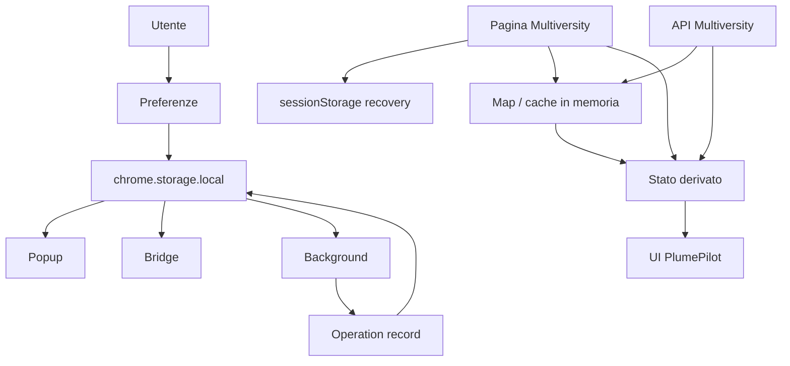

# 06 — Stato, cache e storage

## Dove vive la verità

Nei capitoli precedenti abbiamo parlato di DOM, API, messaggi e asincronia.

A questo punto possiamo porci una domanda apparentemente semplice:

> **Quando PlumePilot dice di conoscere qualcosa, dove sta conservando quell'informazione?**

La risposta non è unica.

Una preferenza dell'utente come il tema può vivere per mesi.

Il risultato di una richiesta API può essere utile per cinque minuti.

Un `operationId` deve sopravvivere al popup che si chiude, ma non può restare valido per sempre.

Un flag di recovery deve sopravvivere a un reload della pagina, ma sarebbe pericoloso conservarlo per giorni.

Un Bearer token deve esistere abbastanza a lungo da effettuare una richiesta, ma non deve essere scritto su disco.

Il progresso del corso, infine, non appartiene davvero a PlumePilot: la fonte autorevole rimane la piattaforma Multiversity.

Per questo il problema non è semplicemente:

```text
salvare dati
```

ma:

```text
scegliere quale dato salvare
        +
dove salvarlo
        +
per quanto tempo
        +
chi può modificarlo
        +
quando smettere di fidarsene
```

Questo capitolo serve a costruire un modello mentale preciso di queste decisioni.

---

# Parte I — Non tutto ciò che chiamiamo “stato” è la stessa cosa

## 1. Una tassonomia utile

Nel codice di PlumePilot possiamo distinguere almeno sei categorie diverse.

| Categoria | Esempio | Lifetime tipico | Deve sopravvivere a reload? |
|---|---|---:|---:|
| Stato effimero | `busy`, `pendingTurboApiRequests` | vita dello script | no |
| Cache in memoria | `lessonApiCache` | vita della pagina | no |
| Recovery per tab | `sessionStorage` | sessione della tab | sì |
| Preferenze persistenti | `themePreference`, `enabled` | giorni/mesi | sì |
| Stato operativo persistente | `pegasoActiveOperation` | minuti/ore | sì |
| Stato esterno autorevole | corso, esami, percentuali server | deciso dalla piattaforma | n/a |

Queste categorie possono contenere dati apparentemente simili, ma hanno responsabilità completamente diverse.

Il primo principio del capitolo è quindi:

> **Prima di scegliere uno storage, dobbiamo scegliere la semantica dello stato.**

Non il contrario.

---

## 2. Lifetime come requisito architetturale

Pensiamo a quattro informazioni:

```text
A. Il popup è in modalità Gaming.
B. È in corso un export.
C. Una risposta API di una lezione è stata letta 30 secondi fa.
D. Stiamo facendo un recovery dopo un reload provocato da un conflitto di sessione.
```

Se chiudiamo il popup:

```text
A deve sopravvivere
B deve sopravvivere
C non dipende dal popup
D non dipende dal popup
```

Se ricarichiamo la pagina del corso:

```text
A deve sopravvivere
B deve essere riconciliato
C può tranquillamente essere perso
D deve sopravvivere almeno abbastanza da completare il recovery
```

Se chiudiamo e riapriamo il browser:

```text
A deve sopravvivere
B probabilmente no, ma deve poter essere riconosciuto come stale/orfano
C no
D no
```

Già da questo piccolo esercizio vediamo perché un'unica variabile globale o un unico database sarebbero una soluzione concettualmente povera.

---

# Parte II — Stato volatile: variabili e `Map`

## 3. Lo stato più economico è quello che possiamo perdere

All'inizio di `content.js` troviamo varie strutture in memoria:

```js
const pendingTurboApiRequests = new Map();
const lessonApiCache = new Map();
const courseProgressChapters = new Map();
const pendingLessonVerificationAttempts = new Map();
const materialLinkCache = new Map();
const materialOutlineCache = new Map();
const testSourceCache = new Map();
```

`content.js` — circa righe 131–137 nello snapshot studiato.

Queste `Map` non sono database.

Non sono storage persistente.

Sono semplicemente oggetti JavaScript appartenenti all'istanza corrente dello script.

Se la pagina viene ricaricata, scompaiono.

E questa non è necessariamente una debolezza.

Per molti dati è precisamente il comportamento desiderato.

---

## 4. Cache ricostruibile vs stato indispensabile

Prendiamo:

```js
const lessonApiCache = new Map();
```

Se la perdiamo, cosa succede?

PlumePilot dovrà magari ripetere qualche richiesta API.

È inefficiente, ma non corrompe il comportamento.

Possiamo quindi classificare questa informazione come:

```text
ottimizzazione ricostruibile
```

Diverso sarebbe perdere una preferenza dell'utente come:

```text
autoplayStopAt70Enabled = true
```

Se l'utente ha scelto quella preferenza, perderla al reload sarebbe un bug.

La distinzione è importante:

> **Una cache serve a evitare lavoro. Lo stato persistente serve a preservare significato.**

---

## 5. Una regola pratica: se perdi questo dato, cosa accade?

Quando progettiamo uno stato possiamo chiederci:

```text
Se questo valore sparisce adesso...
```

### Caso A — il programma può ricalcolarlo

Probabilmente è cache o stato derivato.

### Caso B — l'utente perde una scelta

Probabilmente deve essere persistente.

### Caso C — il programma può eseguire due volte un'azione pericolosa

Probabilmente è stato operativo o di coordinamento.

### Caso D — serve soltanto per attraversare un reload controllato

Potrebbe essere stato di sessione.

Questa domanda ci accompagnerà per tutto il capitolo.

---

# Parte III — `chrome.storage.local`: memoria condivisa dell'estensione

## 6. Perché un'estensione non usa semplicemente `localStorage`

PlumePilot dichiara nel `manifest.json`:

```json
"permissions": [
  "storage"
]
```

Questa permission permette di utilizzare l'API WebExtensions:

```js
chrome.storage.local
```

La documentazione Chrome descrive `storage.local` come uno storage specifico dell'estensione, accessibile dai suoi diversi contesti e persistente oltre la normale vita di popup e service worker.

Questa proprietà è cruciale.

Il popup è temporaneo.

Il background Manifest V3 su Chromium usa un service worker che è deliberatamente effimero.

Una variabile globale come:

```js
let operation = ...;
```

non sarebbe quindi una base affidabile per stato che deve sopravvivere al lifecycle del worker.

`chrome.storage.local`, invece, vive fuori da quel singolo contesto JavaScript.

---

## 7. Lo storage come punto comune tra contesti diversi

Ricordiamo l'architettura studiata nei Capitoli 1 e 2:

```text
popup
background
bridge
floating menu
builder
```

Sono contesti differenti.

Non possono condividere direttamente una variabile JavaScript.

Ma possono leggere lo stesso storage dell'estensione.

Questo rende possibile qualcosa del genere:

```text
popup
  │ scrive enabled=false
  ▼
chrome.storage.local
  ▲
  │ storage.onChanged
bridge
  │
  ▼
MAIN world
```

Lo storage non è quindi soltanto “un posto dove salvare impostazioni”.

In alcuni punti di PlumePilot è anche un **mezzo di sincronizzazione dello stato**.

---

## 8. Cold start del popup

Quando apriamo il popup, `popup.js` legge un set molto ampio di valori:

```js
chrome.storage.local.get(
  {
    enabled: true,
    stopAtTests: false,
    autoCompleteTests: false,
    autoplaySkipCompletedVideos: false,
    autoplayChapterLimitEnabled: false,
    autoplayChapterLimits: {},
    autoplayChapterLimitSessions: {},
    autoplayChapterLimitStatuses: {},
    courseProgressOverlayEnabled: false,
    autoplayStopAt70Enabled: false,
    playbackErrorRecovery: "automatic",
    visualStyle: "standard",
    themePreference: "system",
    menuSize: "medium",
    floatingMenuEnabled: true,
    commissionCheckEnabled: false,
    commissionExams: [],
    pegasoActiveOperation: null,
    ...
  },
  (result) => {
    ...
  }
);
```

`popup.js` — circa righe 1308–1374.

È un pattern importante:

```text
apertura UI
   ↓
lettura snapshot persistente
   ↓
render iniziale
```

Il popup non assume che una sua vecchia istanza sia ancora viva.

Ogni apertura parte da uno snapshot corrente.

Questo è esattamente ciò che vogliamo per un componente con lifecycle breve.

---

## 9. Snapshot iniziale + aggiornamenti incrementali

Subito dopo, il popup registra:

```js
chrome.storage.onChanged.addListener((changes, area) => {
  if (area !== "local") return;

  if (changes.pegasoActiveOperation) {
    renderOperation(changes.pegasoActiveOperation.newValue || null);
  }

  if (changes.enabled) {
    ...
  }

  ...
});
```

`popup.js` — da circa riga 1410.

Questo ci riporta a un pattern già incontrato nel Capitolo 2:

```text
snapshot + events
```

Solo che qui gli eventi non arrivano via `window.postMessage`.

Arrivano dall'API storage.

Il modello diventa:

```text
1. leggi lo stato corrente
2. renderizza
3. ascolta le modifiche successive
```

È molto più robusto che affidarsi soltanto agli eventi.

Se il popup nasce dopo una modifica, lo snapshot iniziale recupera comunque la situazione corrente.

---

# Parte IV — Stored intent vs effective runtime state

## 10. La preferenza salvata non è sempre lo stato effettivo

Uno dei dettagli più interessanti di `bridge.js` si trova nella funzione `readAndSendState()`.

Lo storage contiene:

```js
stopAtTests
autoCompleteTests
```

Ma il runtime applica questa regola:

```js
const autoEnabled = result.autoCompleteTests === true;

const stopEnabled =
  result.stopAtTests !== false && !autoEnabled;
```

Il commento nel codice è esplicito:

```js
// Keep the user's stop-at-tests preference in storage, but make it
// inactive at runtime while automatic test completion is enabled.
```

Qui emerge una distinzione architetturale molto utile.

### Stored intent

Ciò che l'utente ha scelto.

```text
stopAtTests = true
```

### Effective state

Ciò che il sistema deve applicare in questo momento.

```text
autoCompleteTests = true
→ stopAtTests effettivo = false
```

Se modificassimo direttamente la preferenza persistente ogni volta che cambia un'altra opzione, perderemmo l'intenzione originale dell'utente.

Invece PlumePilot conserva entrambe le informazioni e calcola una configurazione effettiva.

Questo pattern è comune anche nei sistemi backend:

```text
configurazione dichiarata
        ↓
policy / vincoli
        ↓
configurazione effettiva
```

---

# Parte V — Scope: uno stato per chi?

## 11. “Il limite della sessione” non è un valore globale

PlumePilot supporta più piattaforme e più corsi.

Un valore come:

```text
limite autoplay = 5 capitoli
```

potrebbe significare:

```text
5 per qualunque corso
```

oppure:

```text
5 per uno specifico corso
```

Nel progetto si è scelto il secondo modello per diversi stati.

Il popup costruisce chiavi come:

```js
function courseStorageKey(courseCode, platformId = "pegaso") {
  ...
  return `${platformId}:${course}`;
}
```

Per esempio:

```text
pegaso:ABC123
mercatorum:ABC123
utsr:ABC123
```

Questo evita collisioni tra corsi che potrebbero avere lo stesso codice su piattaforme diverse.

---

## 12. Scope is part of identity

Questa scelta introduce un principio generale:

> **L'identità di uno stato include il suo scope.**

Non basta sapere:

```text
courseCode = ABC123
```

Se quel codice non è globalmente unico.

Serve:

```text
(platformId, courseCode)
```

Lo stesso principio compare nei database con chiavi composite:

```sql
PRIMARY KEY (tenant_id, user_id)
```

oppure nei sistemi distribuiti:

```text
region / account / resource
```

La stringa:

```text
pegaso:ABC123
```

è una serializzazione semplice di una chiave composta.

---

## 13. Una piccola migrazione reale

In `popup.js` troviamo anche compatibilità con il vecchio formato:

```js
function courseScopedValue(map, courseCode, platformId = "pegaso") {
  const key = courseStorageKey(courseCode, platformId);
  if (Object.prototype.hasOwnProperty.call(map, key)) return map[key];
  return platformId === "pegaso" ? map[courseCode] : undefined;
}
```

Quindi il sistema prova prima:

```text
pegaso:ABC123
```

ma per Pegaso riconosce anche il vecchio:

```text
ABC123
```

Durante una scrittura:

```js
if (platformId === "pegaso") delete next[courseCode];
```

il vecchio formato viene progressivamente eliminato.

Questa è una forma di **lazy migration**.

Non serve una procedura separata che riscriva tutti i dati in anticipo.

La migrazione avviene quando quello stato viene nuovamente utilizzato.

---

# Parte VI — Service worker effimero, stato durevole

## 14. Il problema del background Manifest V3

Nel `manifest.json` Chromium usa:

```json
"background": {
  "service_worker": "background.js"
}
```

Un extension service worker non deve essere trattato come un processo server sempre attivo.

Chrome lo considera intenzionalmente effimero: può essere avviato quando serve e terminato quando non ha più lavoro da svolgere.

Questo cambia completamente il modo in cui dobbiamo pensare alle variabili globali del background.

In `background.js` abbiamo:

```js
let operationQueue = Promise.resolve();
let builderQueue = Promise.resolve();
let commissionQueue = Promise.resolve();
...
```

Queste code servono a serializzare operazioni concorrenti **mentre quella istanza del background è viva**.

Non devono essere considerate persistenza.

Se il worker viene ricreato, le code ripartono vuote.

Per questo il dato importante non vive soltanto lì.

---

## 15. `pegasoActiveOperation`: stato operativo persistente

Il background definisce:

```js
const OPERATION_KEY = "pegasoActiveOperation";
const MAX_OPERATION_AGE_MS = 2 * 60 * 60 * 1000;
```

Quando viene acquisita un'operazione:

```js
const operation = {
  id: crypto.randomUUID(),
  kind,
  phase: batch ? "running" : "collecting",
  message,
  startedAt: Date.now(),
  sourceTabId,
};

await storageSet({ [OPERATION_KEY]: operation });
```

Questa struttura non è una semplice preferenza.

È un **record di coordinamento**.

Descrive:

```text
chi possiede il lavoro
cosa sta facendo
in quale fase si trova
quando è iniziato
come identificarlo
```

---

## 16. Perché non basta `let activeOperation`

Immaginiamo di usare:

```js
let activeOperation = null;
```

Scenario:

```text
1. parte export EPUB
2. activeOperation viene valorizzato
3. il service worker viene sospeso/ricreato
4. activeOperation torna null
5. l'utente avvia una seconda operazione
```

Ora avremmo due workflow incompatibili.

Persistendo il record in `storage.local`, invece, una nuova istanza del background può ricostruire il contesto.

Questo è un esempio molto vicino a un concetto backend classico:

```text
process memory ≠ durable state
```

Un server può riavviarsi.

Un container può essere sostituito.

Un worker può morire.

Se uno stato è importante per la correttezza, deve vivere in un luogo con lifetime adeguato.

---

## 17. Persistenza non significa immortalità

Se salviamo un'operazione in modo persistente, nasce subito un nuovo problema:

> cosa succede se l'operazione non termina correttamente?

Potremmo ritrovarci per sempre con:

```text
pegasoActiveOperation = "export in corso"
```

anche se non esiste più nulla che lo stia eseguendo.

PlumePilot applica più meccanismi di reconciliation.

Il primo è temporale:

```js
async function currentOperation() {
  const operation = await storageGet(OPERATION_KEY);

  if (
    operation &&
    Date.now() - operation.startedAt > MAX_OPERATION_AGE_MS
  ) {
    await storageRemove(OPERATION_KEY);
    return null;
  }

  return operation;
}
```

Un'operazione più vecchia di due ore viene considerata stale.

---

## 18. Reconciliation con il proprietario reale

Il secondo controllo riguarda la tab proprietaria.

```js
function operationOwnerTabId(operation) {
  if (operation.phase === "building" && Number.isInteger(operation.builderTabId)) {
    return operation.builderTabId;
  }

  return operation.sourceTabId;
}
```

Poi:

```js
if (await tabExists(ownerTabId)) {
  return { accepted: true, released: false, operation };
}

await removeOperation(operation);
```

Quindi l'operazione persistita non viene accettata ciecamente.

Viene riconciliata con il mondo reale.

Il modello è:

```text
record persistente
      ↓
verifica owner
      ↓
owner esiste? ── sì ──► stato valido
      │
      no
      ▼
rimuovi stato orfano
```

Questo ci porta a un principio importante:

> **Uno stato persistente può diventare stale anche se è perfettamente integro dal punto di vista sintattico.**

---

# Parte VII — Lease: stato con scadenza incorporata

## 19. Il controllo commissione non usa soltanto un booleano

Per evitare che più tab effettuino contemporaneamente lo stesso controllo commissione, PlumePilot usa una struttura chiamata **lease**.

Nel background:

```js
const COMMISSION_CHECK_INTERVAL_MS = 10 * 60 * 1000;
const COMMISSION_LEASE_MS = 45 * 1000;
```

Una lease contiene:

```js
const lease = {
  id: crypto.randomUUID(),
  platformId: normalized,
  sourceTabId,
  startedAt: now,
  expiresAt: now + COMMISSION_LEASE_MS,
};
```

Viene poi salvata in:

```js
commissionCheckLeases
```

con scope per piattaforma.

---

## 20. Lock vs lease

Un lock concettualmente dice:

```text
questa risorsa è occupata
```

Una lease dice:

```text
questa risorsa è occupata fino a T
```

La differenza è enorme in presenza di crash o tab chiuse.

Se la tab proprietaria scompare senza rilasciare il lock:

```text
lock puro → potrebbe rimanere bloccato per sempre
lease → prima o poi scade
```

PlumePilot verifica esplicitamente:

```js
if (
  !Number.isFinite(Number(lease.expiresAt)) ||
  Number(lease.expiresAt) <= Date.now() ||
  Number(lease.expiresAt) - Date.now() > COMMISSION_LEASE_MS * 2
) {
  ... elimina lease ...
}
```

È interessante anche il terzo controllo.

Una scadenza assurda troppo lontana nel futuro viene trattata come invalida.

Questo è **defensive state validation**.

---

## 21. Il dato temporale fa parte dello stato

Quando un oggetto contiene:

```text
createdAt
startedAt
expiresAt
fetchedAt
lastAttemptAt
```

non sta memorizzando soltanto “quando è successo qualcosa”.

Sta permettendo al programma di decidere:

```text
posso ancora fidarmi di questo dato?
```

Il tempo diventa quindi parte della semantica dello stato.

---

# Parte VIII — `sessionStorage`: sopravvivere al reload, non al mondo intero

## 22. Un problema molto specifico richiede uno storage molto specifico

Nel Capitolo 3 abbiamo visto i recovery dopo errori di playback.

Alcuni di questi recovery provocano intenzionalmente un reload della pagina.

Se conservassimo il contesto soltanto in una variabile:

```js
let recovery = ...;
```

il reload lo cancellerebbe.

Se lo mettessimo in `chrome.storage.local`, invece, sarebbe troppo persistente e troppo globale.

PlumePilot usa quindi `sessionStorage`.

Esempio:

```js
sessionStorage.setItem(
  SESSION_CONFLICT_RECOVERY_KEY,
  JSON.stringify({
    attempts: 1,
    createdAt: Date.now(),
    ...
  }),
);
```

`sessionStorage` è associato alla page session della tab e sopravvive ai reload della stessa tab, ma viene eliminato quando quella sessione termina.

È quasi esattamente il lifetime desiderato da questo recovery.

---

## 23. Il recovery state non viene comunque accettato ciecamente

Quando viene letto:

```js
const state = JSON.parse(raw);
const age = Date.now() - Number(state?.createdAt || 0);
```

PlumePilot controlla:

```js
if (
  state?.attempts !== 1 ||
  !Number.isFinite(age) ||
  age < 0 ||
  age > SESSION_CONFLICT_RECOVERY_MAX_AGE_MS
) {
  sessionStorage.removeItem(SESSION_CONFLICT_RECOVERY_KEY);
  return null;
}
```

Notiamo tre protezioni:

```text
numero tentativi
validità timestamp
età massima
```

Quindi anche uno storage con lifetime già limitato ha un suo TTL logico.

---

## 24. Perché non `chrome.storage.session`?

Le WebExtensions moderne espongono anche:

```text
storage.session
```

che conserva dati in memoria durante la sessione dell'estensione.

Ma la semantica non è la stessa di `window.sessionStorage`.

Nel nostro caso il recovery deve essere:

```text
legato alla specifica tab/origin
+ sopravvivere al reload
+ morire naturalmente con quella page session
```

`sessionStorage` del documento fornisce direttamente questo scope.

`storage.session` sarebbe invece stato dell'estensione con un lifetime e uno scope differenti.

Non esiste uno storage “migliore” in assoluto.

Esiste quello coerente con il dominio.

---

# Parte IX — Cache: non chiedere due volte ciò che sappiamo già

## 25. `lessonApiCache`

Una delle cache centrali è:

```js
const lessonApiCache = new Map();
```

La chiave è:

```js
function lessonApiCacheKey(courseCode, lessonNumber) {
  return `${courseCode}:${Number(lessonNumber)}`;}
```

Quando arriva una risposta valida, PlumePilot conserva dati normalizzati e:

```js
fetchedAt: Date.now()
```

Il TTL base è:

```js
const API_LESSON_CACHE_FRESH_MS = 5 * 60 * 1000;
```

Cinque minuti.

Ma qui la storia diventa più interessante.

---

## 26. Non tutti i campi diventano stale allo stesso modo

In `cachedLessonResponse()` troviamo:

```js
const fresh =
  Date.now() - Number(entry.fetchedAt || 0) <= API_LESSON_CACHE_FRESH_MS;
```

Poi:

```js
if (!allowStaleMutableData) {
  if (requiredData === "data" && !fresh) return null;
  if (requiredData === "playback" && !fresh) return null;

  if (
    requiredData === "test" &&
    !fresh &&
    entry.test?.completed !== true
  ) return null;

  if (
    requiredData === "objective" &&
    !fresh &&
    entry.objective?.completed !== true
  ) return null;
}
```

Questo è un esempio eccellente di **cache policy semantica**.

Non stiamo dicendo semplicemente:

```text
più vecchio di 5 minuti → butta tutto
```

Stiamo dicendo:

```text
se il dato è mutabile e incompleto → serve freschezza
se rappresenta un completamento già confermato → può restare utile
```

---

## 27. Stato monotono e cache

Ricordiamo il concetto di **monotonic state** introdotto nel Capitolo 4.

Se un test risulta completato:

```text
0% → 100%
```

nel modello del dominio non ci aspettiamo normalmente:

```text
100% → 0%
```

perché qualche minuto è passato.

Per questo PlumePilot può riutilizzare più aggressivamente alcuni risultati completati.

Il codice applica persino:

```js
const percentage = Math.max(
  Number(activity.percentage) || 0,
  sameActivity ? Number(previousActivity.percentage) || 0 : 0,
);
```

E per i progress item:

```js
{ ...item, percentage: Math.max(old.percentage, item.percentage) }
```

Quindi una risposta apparentemente più vecchia o regressiva non cancella automaticamente progresso già osservato.

---

# Parte IX-A — Anatomia di una cache: strutture dati e algoritmi

Questa sezione entra un livello più in basso.

Finora abbiamo detto che `lessonApiCache` è una cache in memoria con TTL e regole semantiche. Ora chiediamoci:

> **Perché è stata costruita proprio con una `Map`? Come sono progettate chiave e valore? Come avviene un lookup? Quando una entry viene aggiornata, riusata o scartata?**

Questo è il punto in cui una scelta apparentemente piccola:

```js
const lessonApiCache = new Map();
```

si trasforma in un esercizio completo di strutture dati.

---

## 25.1 Il modello astratto: una tabella chiave → valore

Una cache come `lessonApiCache` può essere vista prima di tutto come una funzione parziale:

```text
key → cached value
```

Nel nostro caso:

```text
"CODICE_CORSO:1" → dati normalizzati della lezione 1
"CODICE_CORSO:2" → dati normalizzati della lezione 2
"CODICE_CORSO:3" → dati normalizzati della lezione 3
```

La struttura concreta è una `Map`:

```js
const lessonApiCache = new Map();
```

Per ogni modulo PlumePilot costruisce la chiave con:

```js
function lessonApiCacheKey(courseCode, lessonNumber) {
  return `${courseCode}:${Number(lessonNumber)}`;
}
```

Quindi possiamo descrivere il tipo concettuale come:

```text
Map<string, LessonCacheEntry>
```

Non esiste TypeScript nel progetto attuale, ma immaginare il tipo è utile:

```ts
Map<string, LessonCacheEntry>
```

Dove `LessonCacheEntry` contiene informazioni come:

```text
objective
videos
test
material
progressItems
routeKey
fetchedAt
```

Il primo insegnamento è semplice ma importante:

> **Una cache non è soltanto un contenitore. È una struttura dati accompagnata da una funzione di identità e da una politica di validità.**

---

## 25.2 Perché una `Map` è una buona scelta qui

Una `Map` JavaScript è una collezione di coppie chiave-valore.

Per PlumePilot offre esattamente le operazioni necessarie:

```js
lessonApiCache.get(key);
lessonApiCache.set(key, value);
lessonApiCache.delete(key);
lessonApiCache.has(key);
lessonApiCache.size;
```

Il pattern dominante della cache è:

```text
costruisci chiave
      ↓
lookup
      ↓
entry presente?
 ┌────┴────┐
 sì        no
 │          │
valuta      richiedi API
freschezza       │
 │               ↓
usa/refresh   cache.set(...)
```

Dal punto di vista algoritmico ciò che ci interessa è che il lookup per chiave non richieda una scansione lineare di tutte le lezioni.

La specifica ECMAScript non obbliga i motori a implementare `Map` come una particolare hash table. Richiede però prestazioni medie sub-lineari rispetto al numero di elementi. In pratica, possiamo ragionare su `Map` come una struttura progettata per lookup efficienti per chiave, senza promettere un particolare algoritmo interno del motore JavaScript.

Questo dettaglio è importante perché evita una semplificazione frequente:

```text
Map === hash table O(1)
```

Non è una garanzia del linguaggio.

La formulazione più corretta è:

```text
Map → keyed collection con lookup medio efficiente
```

---

## 25.3 Perché non un `Array`

Immaginiamo una versione ingenua:

```js
const lessonCache = [];

lessonCache.push({
  courseCode,
  lessonNumber,
  data,
});
```

Per recuperare una lezione dovremmo fare qualcosa come:

```js
lessonCache.find(
  (entry) =>
    entry.courseCode === courseCode &&
    entry.lessonNumber === lessonNumber,
);
```

Il problema concettuale è che stiamo usando una struttura sequenziale per un problema di lookup per identità.

Con `n` entry:

```text
Array.find() → nel caso generale deve ispezionare più elementi
Map.get()    → operazione nativamente espressa come lookup per chiave
```

Potremmo usare `lessonNumber` direttamente come indice:

```js
lessonCache[lessonNumber] = data;
```

ma appena introduciamo più corsi otteniamo un problema:

```text
Corso A, lezione 3
Corso B, lezione 3
```

Entrambi vorrebbero occupare:

```js
lessonCache[3]
```

Potremmo creare array annidati per corso, ma a quel punto staremmo reinventando una mappa gerarchica.

Inoltre i numeri di lezione sono identità di dominio, non necessariamente indici densi adatti a una struttura sequenziale.

La regola generale è:

> **Se la domanda principale è “dammi il valore associato a questa identità”, una keyed collection è spesso più naturale di una sequenza.**

---

## 25.4 Perché non un normale `Object`

Potremmo scrivere:

```js
const lessonApiCache = {};
lessonApiCache[key] = value;
```

Funzionerebbe.

Per chiavi stringa, un `Object` può assolutamente essere usato come dizionario.

Perché preferire `Map`?

### Semantica più esplicita

```js
const cache = new Map();
```

comunica immediatamente:

```text
questa struttura è una collezione dinamica key/value
```

mentre:

```js
const cache = {};
```

può rappresentare sia un record con proprietà note sia un dizionario dinamico.

### API specifica

Con `Map` abbiamo:

```js
cache.get(key)
cache.set(key, value)
cache.delete(key)
cache.has(key)
cache.size
```

Non dobbiamo confondere lookup con accesso a proprietà dell'oggetto.

### Nessuna collisione con proprietà ereditate

Un normale oggetto possiede una catena di prototipi.

È possibile mitigare il problema con:

```js
Object.create(null)
```

ma a quel punto `Map` esprime già meglio l'intenzione.

### Iterazione naturale

Una `Map` è direttamente iterabile come coppie `[key, value]`.

Questo non è essenziale per `lessonApiCache`, ma rende più naturale aggiungere in futuro diagnostica, metriche o eviction.

Detto questo, non dobbiamo trasformare la scelta in dogma:

```text
Object → ottimo per record con shape conosciuta
Map    → ottima per collezione dinamica indicizzata da chiavi
```

Infatti PlumePilot usa spesso `Object` nello storage persistente quando il dato è destinato alla serializzazione tramite `chrome.storage`.

---

## 25.5 Perché non una `WeakMap`

`WeakMap` può sembrare attraente perché permette al garbage collector di eliminare entry quando la chiave-oggetto non è più raggiungibile.

Ma nel nostro caso la chiave è:

```text
"courseCode:lessonNumber"
```

cioè una stringa.

Le chiavi di una `WeakMap` devono invece essere oggetti o simboli non registrati.

Potremmo teoricamente usare un oggetto:

```js
const key = { courseCode, lessonNumber };
weakMap.set(key, value);
```

ma avremmo un problema ancora più fondamentale:

```js
weakMap.get({ courseCode, lessonNumber });
```

non recupererebbe la stessa entry, perché il nuovo oggetto ha un'identità differente.

Dovremmo conservare da qualche parte l'oggetto-key originale, annullando buona parte del vantaggio.

Inoltre una `WeakMap` non è enumerabile: non possiamo ottenere tutte le chiavi o conoscerne la dimensione.

La sua semantica ideale è piuttosto:

```text
metadati associati alla vita di un oggetto
```

Per esempio:

```js
WeakMap<HTMLElement, Metadata>
```

sarebbe sensato per dati che devono esistere soltanto finché esiste un particolare nodo DOM.

Non è invece il problema di `lessonApiCache`, che usa identità logiche ricostruibili.

---

## 25.6 La chiave composta è parte della struttura dati

La cache non usa:

```js
lessonNumber
```

come unica identità.

Usa:

```js
`${courseCode}:${Number(lessonNumber)}`
```

Perché?

Consideriamo:

```text
Corso ABC → lezione 1
Corso XYZ → lezione 1
```

Se la chiave fosse soltanto:

```text
1
```

avremmo una collisione logica.

Con la chiave composta:

```text
ABC:1
XYZ:1
```

le due entità rimangono separate.

Questa è una forma semplice di **composite key**.

Interessante anche questo dettaglio:

```js
Number(lessonNumber)
```

normalizza rappresentazioni differenti.

Per esempio:

```text
"03" → 3
3    → 3
```

entrambe producono:

```text
COURSE:3
```

E il formato del `courseCode` in PlumePilot viene validato con caratteri alfanumerici, `_` e `-`: il carattere `:` usato come separatore non appartiene quindi al formato ammesso del codice corso. Questo rende la serializzazione della chiave più semplice e non ambigua nel dominio attuale.

Il punto generale è:

> **Progettare la chiave significa progettare l'identità della cache.**

Una struttura dati perfetta con una key sbagliata produce comunque risultati sbagliati molto velocemente.

---

## 25.7 La chiave primaria non basta sempre: `routeKey`

Una lezione viene indicizzata principalmente tramite:

```text
courseCode + lessonNumber
```

ma il codice conserva anche:

```js
routeKey
```

calcolato usando identità come `lpId` e `paragraphId`.

Perché mantenere una seconda identità?

Perché la chiave primaria è utile per il lookup, ma non sempre è sufficiente a dimostrare che il payload appena ricevuto rappresenti esattamente la stessa route interna.

Possiamo pensarlo così:

```text
cache key
    ↓
come trovo velocemente la entry?

routeKey
    ↓
sono sicuro che il nuovo dato appartenga alla stessa entità logica?
```

Questo separa due responsabilità:

```text
indexing
vs
identity validation
```

Ed è un pattern importante anche nei database:

```text
primary lookup key
+ ulteriori vincoli di consistenza
```

---

## 25.8 Anatomia del valore: non salviamo il JSON grezzo

`lessonApiCache` non conserva semplicemente:

```js
cache.set(key, responseBody);
```

Costruisce invece un modello normalizzato.

Semplificando:

```js
{
  dataAvailable: true,
  objective,
  videos,
  playbackDataComplete,
  test,
  progressItems,
  progressDataComplete,
  routeKey,
  material,
  fetchedAt,
}
```

Questo significa che la cache è anche un piccolo **read model** interno.

Il JSON della piattaforma può avere molti dettagli irrilevanti.

PlumePilot conserva soltanto ciò che serve alle proprie operazioni.

I vantaggi sono:

```text
meno accoppiamento allo schema esterno
+ lookup più semplice
+ policy di aggiornamento centralizzata
+ dati già normalizzati
```

Questa scelta si collega all'anti-corruption layer del Capitolo 4.

La cache non è quindi:

```text
copia della risposta HTTP
```

ma:

```text
proiezione del dominio PlumePilot derivata dalla risposta HTTP
```

---

## 25.9 Un cache lookup completo

Ora seguiamo il percorso reale di una richiesta.

`requestLessonWithRetry()` prova prima:

```js
const cachedResponse = forceFresh
  ? null
  : cachedLessonResponse(
      courseCode,
      lessonNumber,
      requiredData,
      allowStaleMutableCache,
    );

if (cachedResponse) return cachedResponse;
```

Possiamo trasformarlo in pseudocodice:

```text
key = makeKey(course, lesson)
entry = cache.get(key)

if entry non esiste:
    MISS

if entry esiste:
    controlla che contenga requiredData
    controlla freshness/policy

    se utilizzabile:
        HIT
    altrimenti:
        STALE MISS
```

Quindi un lookup ha almeno tre esiti concettuali:

```text
HIT
MISS
STALE / SEMANTIC MISS
```

L'ultimo è particolarmente importante.

L'entry **esiste**, ma non soddisfa il requisito della richiesta corrente.

Esempio:

```text
la cache contiene il material URL
ma ora chiediamo playback data completi
```

oppure:

```text
la cache contiene un test pending di 10 minuti fa
ma abbiamo bisogno dello stato corrente
```

Per questo:

> **Cache presence e cache usability sono due domande differenti.**

---

## 25.10 Cache hit non significa “salta ogni controllo”

Una cache superficiale potrebbe fare:

```js
const cached = cache.get(key);
if (cached) return cached;
```

PlumePilot deve invece verificare:

```text
entry presente?
       ↓
contiene il tipo di dato richiesto?
       ↓
è abbastanza fresca?
       ↓
il dato può essere considerato monotono?
       ↓
l'identità è coerente?
```

Questo ci porta a una distinzione molto utile:

```text
physical hit
```

la chiave è presente nella struttura dati.

```text
semantic hit
```

la entry è anche abbastanza valida e completa per rispondere alla domanda attuale.

La cache di PlumePilot ragiona soprattutto in termini del secondo tipo.

---

## 25.11 Scrittura: merge invece di sostituzione cieca

Quando arriva una nuova risposta non facciamo necessariamente:

```js
cache.set(key, newestResponse);
```

prima viene letto:

```js
const storedPrevious = lessonApiCache.get(key) || {};
```

Poi il nuovo stato viene costruito tenendo conto del precedente.

Per esempio:

```js
percentage: Math.max(
  Number(item.percentage) || 0,
  Number(previousItem?.percentage) || 0,
)
```

Quindi la funzione di aggiornamento assomiglia più a:

```text
newCacheValue = merge(previous, response)
```

che a:

```text
newCacheValue = response
```

In termini astratti:

```text
Cₙ₊₁ = merge(Cₙ, Rₙ₊₁)
```

Dove:

```text
C = stato cache
R = nuova osservazione remota
```

La qualità di una cache dipende quindi non soltanto dalla struttura dati ma anche dalla sua **merge function**.

---

## 25.12 Stato monotono: perché `Math.max()` è una decisione di dominio

Consideriamo:

```text
cache precedente → 100%
nuova risposta   → 80%
```

Una sostituzione cieca darebbe:

```text
100% → 80%
```

Il codice invece conserva:

```text
max(100, 80) = 100
```

Non è una proprietà generica delle cache.

È una proprietà del dominio:

```text
una stessa attività confermata completata
non dovrebbe diventare improvvisamente incompleta
perché una risposta temporaneamente stale dice 80%
```

Per questo il codice verifica anche se si tratta della stessa attività.

Il principio è:

> **La policy di merge deve conoscere la semantica del dato.**

Per un prezzo di mercato, `Math.max(old, new)` sarebbe evidentemente sbagliato.

Per un contatore di completamento monotono può essere corretto.

---

## 25.13 Freshness temporale e freshness semantica

L'entry possiede:

```js
fetchedAt: Date.now()
```

Da qui otteniamo:

```js
const fresh =
  Date.now() - Number(entry.fetchedAt || 0) <=
  API_LESSON_CACHE_FRESH_MS;
```

Questa è **temporal freshness**.

Ma PlumePilot applica anche una **semantic freshness**.

Un test pending vecchio può essere pericoloso:

```text
potrebbe essere stato completato nel frattempo
```

Un test già confermato `completed` è invece molto più stabile nel modello del dominio.

Per questo una entry stale può essere:

```text
inutilizzabile per un dato mutabile
ma ancora utile per un fatto monotono già confermato
```

Quindi il TTL non decide tutto da solo.

Possiamo rappresentare la policy così:

```text
                     entry stale?
                    /            \
                  no              sì
                  │                │
                 usa        dato monotono confermato?
                              /            \
                            sì              no
                            │                │
                           usa             refresh
```

---

## 25.14 Perché non persistere `lessonApiCache`

Una domanda naturale è:

> Se la cache ci fa risparmiare richieste, perché perderla a ogni reload?

Perché persisterla cambierebbe radicalmente il problema.

Oggi il suo lifetime è:

```text
pagina corrente
```

Quindi dopo un reload otteniamo automaticamente:

```text
cache vuota
```

che equivale a una invalidazione completa semplice e sicura.

Se la salvassimo in `chrome.storage.local`, dovremmo introdurre almeno:

```text
versione schema
TTL persistente
pulizia periodica
scope per piattaforma/corso
migrazioni
limite dimensionale
gestione di vecchi dati dopo aggiornamenti dell'estensione
```

E, soprattutto, conserveremmo localmente una copia di dati API che oggi non è necessaria oltre la vita della pagina.

Quindi la perdita volontaria della cache è parte della sua progettazione.

---

## 25.15 La cache è bounded oppure no?

`lessonApiCache` è una `Map` senza un limite numerico esplicito:

```js
const lessonApiCache = new Map();
```

Non vediamo qualcosa come:

```js
if (cache.size > 100) evictOldest();
```

Quindi formalmente non è una **bounded cache**.

Perché può essere comunque ragionevole?

Il dominio impone un limite naturale:

```text
numero di lezioni visitate/interrogate
nella pagina corrente
```

E la cache viene distrutta insieme alla pagina.

Questo produce un boundedness **pratico**, non esplicito.

Ma dobbiamo distinguere i due concetti:

```text
bounded by code
vs
bounded by domain/lifetime
```

Se in futuro PlumePilot diventasse una SPA sempre aperta per giorni, attraversando centinaia di corsi senza ricaricare il contesto, questa assunzione andrebbe riesaminata.

---

## 25.16 Quando servirebbe una LRU cache

LRU significa:

```text
Least Recently Used
```

L'idea è imporre una capacità massima e, quando è piena, eliminare l'entry usata meno recentemente.

Esempio:

```text
capacità = 3

A, B, C

uso A
ordine recente: B, C, A

aggiungo D

elimino B
cache: C, A, D
```

Una possibile implementazione JavaScript semplice può sfruttare l'ordine di inserimento di `Map`:

```js
function touch(cache, key, value) {
  cache.delete(key);
  cache.set(key, value);
}

function setWithLru(cache, key, value, maxSize) {
  if (cache.has(key)) cache.delete(key);
  cache.set(key, value);

  if (cache.size > maxSize) {
    const oldestKey = cache.keys().next().value;
    cache.delete(oldestKey);
  }
}
```

Attenzione: questo è un esempio didattico, non codice attuale di PlumePilot.

Una LRU avrebbe senso se:
```text
la cache potesse crescere molto
+ le entry avessero costi significativi
+ volessimo mantenere soltanto il working set recente
```

Nel caso attuale introdurrebbe invece:

```text
più codice
più invarianti
più casi da testare
```

senza un problema concreto che lo richieda.

Il principio architetturale è:

> **Non introdurre una politica di eviction soltanto perché esiste: introdurla quando esiste un budget di memoria da rispettare.**

---

## 25.17 TTL e LRU risolvono problemi diversi

È facile confonderli.

### TTL

Risponde a:

```text
quanto a lungo posso fidarmi di questo dato?
```

### LRU

Risponde a:

```text
quali dati tengo quando non posso conservarli tutti?
```

Una cache può avere entrambi:

```text
TTL → validità
LRU → capacità
```

Per esempio:

```text
entry valide 5 minuti
massimo 100 entry
```

Nel PlumePilot attuale `lessonApiCache` ha una policy di freshness temporale, ma non una eviction LRU esplicita.

Sono decisioni indipendenti.

---

## 25.18 E se usassimo IndexedDB?

IndexedDB è un database client-side progettato per quantità significative di dati strutturati, con indici e transazioni.

Potrebbe essere tecnicamente usato per una cache persistente molto più grande.

Ma per `lessonApiCache` sarebbe sproporzionato.

Il problema attuale richiede:

```text
piccolo working set
lookup per chiave
lifetime della pagina
nessuna persistenza richiesta
```

IndexedDB introdurrebbe:

```text
API asincrona
transazioni
schema/versioning
persistenza
cleanup
più complessità di test
```

senza un beneficio proporzionato.

È un ottimo esempio del principio:

> **La struttura dati migliore non è quella con più capacità, ma quella con il minor costo che soddisfa gli invarianti del dominio.**

---

## 25.19 Confronto delle alternative

| Struttura | Lookup per identità | Persistente | Chiavi adatte a `course:lesson` | Enumerabile | Fit per `lessonApiCache` |
|---|---|---:|---:|---:|---:|
| `Map` | nativo | no | sì | sì | **ottimo** |
| `Object` | proprietà | no | sì | sì | buono |
| `Array` | scansione/indice | no | scomodo | sì | debole |
| `WeakMap` | nativo | no | no, richiede object key | no | inadatto |
| `chrome.storage.local` | key/value async | sì | sì | sì | troppo persistente |
| IndexedDB | indicizzato | sì | sì | sì | sovradimensionato |

Questa tabella non significa che `Map` sia universalmente migliore.

Significa che è coerente con questi requisiti:

```text
cache volatile
+ chiave composta ricostruibile
+ lookup frequente
+ numero moderato di entry
+ nessun bisogno di serializzazione
```

---

## 25.20 Le altre cache di PlumePilot non hanno tutte lo stesso schema

Confrontiamole.

### `lessonApiCache`

```text
key:
courseCode:lessonNumber

value:
modello normalizzato della lezione

invalidazione:
TTL + regole semantiche + cambio identità
```

### `materialLinkCache`

```text
key:
courseCode:lessonNumber

value:
URL + status + attempts + source + error

invalidazione:
fallimento reale del download
```

### `materialOutlineCache`

```text
key:
courseCode

value:
sectionSignature + outline

invalidazione:
fingerprint della struttura
```

### `testSourceCache`

```text
key:
course + capitolo + test

value:
sorgente normalizzata del test

uso:
evitare di recuperare nuovamente contenuti già letti
```

### `playbackCourseIndex`

Non è una `Map` generica ma un singolo snapshot in memoria associato a:

```js
playbackCourseIndexCode
```

Quindi implementa concettualmente una cache di capacità uno:

```text
ultimo course index noto
```

Questo è un altro insegnamento importante:

> **“Cache” descrive il ruolo, non obbliga a usare una particolare struttura dati.**

Una cache può essere una `Map`, un singolo valore memoizzato, un oggetto persistito o un record indicizzato.

---

## 25.21 Dalla struttura dati all'algoritmo completo

Possiamo ora descrivere `lessonApiCache` come un algoritmo e non soltanto come una variabile.

### Read path

```text
1. normalizza courseCode + lessonNumber
2. costruisci composite key
3. Map.get(key)
4. verifica dataAvailable
5. verifica requiredData
6. verifica TTL
7. applica semantic freshness
8. restituisci un payload ricostruito
```

### Write path

```text
1. valida la risposta API
2. costruisci key
3. leggi previous entry
4. confronta route identity
5. normalizza objective/test/video/progress
6. merge con stato precedente
7. preserva progresso monotono
8. aggiorna fetchedAt
9. Map.set(key, nextEntry)
10. aggiorna il modello aggregato del corso
```

### Invalidation path

Per `lessonApiCache` non esiste una singola `delete()` centrale equivalente a quella delle dispense.

La validità viene governata soprattutto da:

```text
page lifetime
+ TTL
+ route identity
+ semantic refresh
```

Quindi anche l'assenza di un'esplicita `clear()` frequente è una decisione architetturale.

---

## 25.22 Un modo utile di pensarla: indice + record + policy

Possiamo finalmente ridurre la cache a tre componenti.

### 1. Indice

```text
Map
```

Risponde:

```text
dove trovo la entry?
```

### 2. Record

```text
LessonCacheEntry
```

Risponde:

```text
cosa so di quella lezione?
```

### 3. Policy

```text
TTL
semantic freshness
monotonic merge
identity validation
```

Risponde:

```text
quando posso fidarmi di ciò che ho trovato?
```

Questa separazione è estremamente riutilizzabile.

Quando sentiamo dire:

```text
“aggiungiamo una cache”
```

dovremmo immediatamente chiedere:

```text
Qual è la key?
Qual è il record?
Qual è la policy?
```

Se una delle tre risposte manca, la progettazione della cache non è ancora completa.

---

## 25.23 Esercizio: progettare una cache alternativa

Immaginiamo di voler conservare al massimo 50 lesson entry.

Dobbiamo decidere:

```text
A. quale entry eliminare?
B. il TTL rimane 5 minuti?
C. completamenti confermati stale possono restare?
D. un cache hit deve aggiornare la recency?
E. la eviction deve essere per corso o globale?
F. quando cambiamo corso eliminiamo tutto o manteniamo il working set?
```

Notiamo come una frase semplice:

```text
“mettiamo una LRU”
```

crei subito nuove scelte di dominio.

Questo è il motivo per cui la soluzione attuale, semplice e page-scoped, è ragionevole finché il volume dei dati rimane contenuto.

---

## 25.24 Concetti da portarsi dietro da questa sezione

Una cache ben progettata non è:

```text
Map + TTL
```

ma:

```text
identity
+ data structure
+ value schema
+ lookup policy
+ merge policy
+ invalidation policy
+ lifetime
+ eventuale eviction policy
```

Nel caso di `lessonApiCache`:

```text
identity        → courseCode + lessonNumber (+ routeKey di coerenza)
data structure  → Map
value schema    → lesson read model normalizzato
lookup policy   → requiredData + freshness
merge policy    → conservativa / monotona
invalidation    → TTL + route mismatch + page lifetime
lifetime        → content script/page
persistence     → nessuna
eviction        → nessuna LRU esplicita
```

Ora possiamo leggere:

```js
const lessonApiCache = new Map();
```

non più come una singola riga di JavaScript, ma come la punta visibile di un piccolo progetto di data structures e cache coherence.

---

# Parte X — Cache identity: la chiave è parte dell'algoritmo

## 28. Una cache sbagliata può restituire dati perfettamente validi... per un'altra cosa

Un errore pericoloso non è soltanto:

```text
cache miss
```

Può essere:

```text
cache hit con identità sbagliata
```

`rememberLessonResponse()` calcola quindi anche un `routeKey`:

```js
const routeKey = courseProgressRouteKey(courseCode, routeIdentity);
```

E può rifiutare di sovrascrivere una cache conflittuale:

```js
if (
  preserveConflictingCache &&
  routeKey &&
  storedPrevious.routeKey &&
  storedPrevious.routeKey !== routeKey
) {
  ...
  return;
}
```

La cache key nominale:

```text
courseCode:lessonNumber
```

non è sempre sufficiente per stabilire che due payload rappresentino esattamente la stessa route logica.

Ancora una volta, identity e reconciliation diventano parte del problema.

---

# Parte XI — `materialLinkCache`: cache con invalidazione esplicita

## 29. Salvare un risultato positivo

Le dispense usano una cache separata:

```js
const materialLinkCache = new Map();
```

Quando viene trovato un link valido:

```js
materialLinkCache.set(key, {
  status: "ready",
  url: safeUrl,
  section: entry.identity.sectionText,
  chapterTitle: entry.identity.chapterText,
  order: entry.order,
  lessonNumber: entry.lessonNumber,
  source,
  attempts: (previous?.attempts || 0) + 1,
  lastAttemptAt: Date.now(),
  error: null,
});
```

Qui la cache conserva anche metadata diagnostici:

```text
source
attempts
lastAttemptAt
error
```

Non serve soltanto ad accelerare.

Aiuta a capire la storia del dato.

---

## 30. Negative caching

Quando il recupero fallisce:

```js
materialLinkCache.set(key, {
  status,
  url: null,
  ...,
  attempts: (previous?.attempts || 0) + 1,
  lastAttemptAt: Date.now(),
  error,
});
```

Questo è una forma di **negative cache**.

La cache può ricordare anche:

```text
ho già provato e questo dato non era disponibile
```

Ma il codice protegge un risultato positivo già noto:

```js
if (
  previous?.status === "ready" &&
  validMaterialUrl(previous.url)
) return;
```

Un fallimento successivo non distrugge immediatamente una conoscenza valida precedente.

---

## 31. Invalidazione guidata dal fallimento reale

Nel builder, se il download di un materiale fallisce, vengono raccolte le relative `cacheKeys` e inviate alla pagina sorgente.

Il content script esegue:

```js
materialLinkCache.delete(cacheKey)
```

ma solo se la chiave appartiene al corso corrente.

Questo crea un ciclo molto interessante:

```text
cache dice: URL valido
      ↓
builder prova a usarlo
      ↓
URL fallisce realmente
      ↓
invalida entry
      ↓
prossimo export forza nuova scoperta
```

Questa strategia è diversa da un TTL.

È **event-driven invalidation**.

---

# Parte XII — Cache strutturale: `materialOutlineCache`

## 32. Quando il dato dipende da una struttura esterna

Per la struttura del corso, PlumePilot usa:

```js
const materialOutlineCache = new Map();
```

Ma la cache non viene riutilizzata soltanto perché esiste.

Viene calcolata una firma:

```js
const sectionSignature = initialSections.join("\u001f");
```

Poi:

```js
if (
  cached?.sectionSignature === sectionSignature &&
  cached.outline?.length
) {
  return cached.outline;
}
```

Questo è un piccolo esempio di **cache validation by fingerprint**.

Non abbiamo una versione ufficiale della struttura.

Costruiamo quindi una firma da un input significativo.

Se la firma cambia, la cache viene rigenerata.

---

## 33. TTL, fingerprint, evento: tre modi diversi di invalidare

A questo punto possiamo confrontare tre strategie presenti nello stesso progetto.

### Time based

```text
lessonApiCache
fetchedAt + TTL
```

### Fingerprint based

```text
materialOutlineCache
sectionSignature
```

### Event based

```text
materialLinkCache
builder segnala download fallito
```

Non esiste una sola strategia universale.

Dipende da **come può diventare invalido il dato**.

---

# Parte XIII — Il problema più difficile: cache invalidation

## 34. Perché “There are only two hard things...” è diventata una battuta famosa

La famosa battuta attribuita a Phil Karlton parla di:

```text
cache invalidation
naming things
```

al di là della battuta, il problema è reale.

Una cache è utile proprio perché evita di chiedere nuovamente la verità.

Ma nel momento in cui evitiamo di chiedere la verità, dobbiamo decidere **quanto a lungo possiamo fidarci della copia**.

Questa tensione non può essere eliminata.

Può soltanto essere modellata.

---

## 35. Quattro domande per progettare una cache

Per ogni cache dovremmo sapere:

### 1. Qual è la source of truth?

Per `lessonApiCache`:

```text
API Multiversity
```

### 2. Quanto rapidamente può cambiare?

Un progresso incompleto può cambiare in pochi secondi.

Il titolo di una lezione probabilmente molto meno spesso.

### 3. Quanto costa usare un dato stale?

Per esempio:

```text
mostrare per un attimo 80% invece di 81%
```

è meno grave di:

```text
saltare una lezione incompleta credendola completata
```

### 4. Come scopro che non è più valido?

Possibili risposte:

```text
TTL
version
fingerprint
evento
errore d'uso
refresh esplicito
```

---

# Parte XIV — Stato derivato: il progresso del corso

## 36. Non sempre esiste una sola lettura perfetta

Il progresso del corso in `content.js` è particolarmente istruttivo.

Lo stato contiene:

```js
courseProgressState = {
  courseCode,
  baselinePercent: null,
  domPercent: null,
  sessionDelta: 0,
  exactPercent: null,
  chapterCount: 0,
  expectedKeys: null,
  expectedSignature: null,
};
```

Qui convivono fonti differenti.

### `baselinePercent`

La percentuale osservata nella UI Multiversity.

### `sessionDelta`

Progresso che PlumePilot ha osservato durante la sessione e può aggiungere alla baseline.

### `exactPercent`

Percentuale calcolabile quando sono disponibili dati completi del corso.

Il valore mostrato viene scelto così:

```js
const value = exactAvailable
  ? Number(state.exactPercent)
  : state.baselinePercent + Math.max(0, Number(state.sessionDelta) || 0);
```

Quindi non esiste una semplice variabile:

```text
progress = 64
```

Esiste un piccolo modello di provenienza e fiducia.

---

## 37. Rebase: quando la fonte esterna si aggiorna

Se il DOM Multiversity cambia percentuale:

```js
if (
  domPercent !== null &&
  courseProgressState.domPercent !== null &&
  domPercent !== courseProgressState.domPercent
) {
  courseProgressState.baselinePercent = domPercent;
  courseProgressState.domPercent = domPercent;
  courseProgressState.sessionDelta = 0;
  courseProgressState.exactPercent = null;
}
```

PlumePilot esegue concettualmente un **rebase**.

Prima:

```text
baseline server/UI = 63%
sessionDelta       = +2%
stima               = 65%
```

Poi la UI ufficiale si aggiorna:

```text
DOM = 65%
```

La nuova base diventa:

```text
baseline = 65%
sessionDelta = 0
```

Questo evita di contare due volte lo stesso progresso.

---

## 38. Provenance: sapere da dove arriva il valore

Quando PlumePilot pubblica lo stato del progresso, include:

```js
{
  percent,
  chapterCount,
  knownChapters,
  exact: exactAvailable,
  updatedByStudyWing: exactAvailable || state.sessionDelta >= 1,
  message: ...
}
```

Il dato non è quindi soltanto:

```text
65%
```

Contiene metadata che spiegano quanto sia autorevole.

Questa idea si chiama spesso **data provenance**.

Due valori numericamente identici possono avere affidabilità differente:

```text
65% letto dal DOM
65% stimato localmente
65% calcolato da dati completi API
```

---

# Parte XV — Transient durable storage: passare un job tra contesti

## 39. Il caso `pegasoExportJob:${jobId}`

Quando la raccolta delle dispense termina, il background deve aprire una nuova pagina builder.

Il payload può essere consistente e il builder non esiste ancora.

Il background crea quindi:

```js
const jobId = crypto.randomUUID();
const storageKey = `pegasoExportJob:${jobId}`;
```

salva:

```js
await storageSet({
  [storageKey]: {
    ...message.payload,
    format,
    operationId: operation.id,
    courseTabId: operation.sourceTabId,
  },
});
```

poi apre:

```text
materials-builder.html?job=<jobId>
```

Il builder legge il job:

```js
job = await storageGet(storageKey);
```

poi lo elimina:

```js
await storageRemove(storageKey);
```

---

## 40. Uno storage persistente può contenere dati temporanei

Questo pattern sembra un paradosso:

```text
storage persistente
usato per dati temporanei
```

Ma ha perfettamente senso.

Il requisito non è:

```text
questo dato deve durare per sempre
```

È:

```text
questo dato deve sopravvivere alla creazione asincrona di un altro contesto
```

Possiamo pensare a `storageKey` come una piccola **mailbox durevole**.

Il lifecycle è:

```text
producer scrive job
        ↓
consumer nasce
        ↓
consumer legge job
        ↓
consumer elimina job
```

È molto simile, concettualmente, a una coda di lavoro semplificata.

---

# Parte XVI — Versionare lo stato

## 41. Anche i dati locali hanno uno schema

Il file `commission-state.js` crea snapshot come:

```js
return {
  version: 2,
  state: classifyExam(exam),
  commission: ...,
  result: ...,
  reject_motivation: ...,
  vote: ...,
  status: ...,
};
```

Quella proprietà:

```text
version: 2
```

è importante.

Uno storage locale può vivere più a lungo della versione di codice che l'ha creato.

Quando aggiorniamo l'estensione possiamo quindi incontrare dati scritti da una release precedente.

---

## 42. Lettura compatibile con dati legacy

`normalizeStoredSnapshot()` gestisce più casi:

```js
if (value && typeof value === "object" && value.version === 2) {
  return createSnapshot(value);
}

if (typeof value !== "string") return null;

try {
  const legacy = JSON.parse(value);
  return legacy && typeof legacy === "object"
    ? createSnapshot(legacy)
    : null;
} catch {
  return null;
}
```

Quindi la lettura funziona come un piccolo adapter:

```text
schema v2 ─────┐
               ├──► modello corrente
schema legacy ─┘
```

Questo è **schema migration at read time**.

---

## 43. Postel's law? Sì, ma con prudenza

Potremmo riassumere la strategia come:

```text
accetta più formati legacy in input
produci un solo formato corrente in output
```

È un approccio molto utile nelle migrazioni.

Ma non significa accettare qualunque cosa.

Notiamo infatti che il codice:

- valida tipi;
- normalizza stringhe;
- ricostruisce lo snapshot;
- restituisce `null` per dati irrecuperabili.

La backward compatibility non deve eliminare la validazione.

---

# Parte XVII — Cosa NON salviamo

## 44. La decisione di non persistere è altrettanto importante

Nel Capitolo 4 abbiamo visto:

```jslet bearerToken = null;
```

Il token viene osservato nel MAIN world e mantenuto soltanto in memoria.

Non viene scritto in:

```text
chrome.storage.local
sessionStorage
localStorage
```

Questa scelta è coerente con un principio di sicurezza:

> **Persisti soltanto ciò che ha davvero bisogno di persistenza.**

La documentazione WebExtensions ricorda inoltre che `storage.local` non deve essere trattato come storage cifrato per segreti.

Quindi:

```text
preferenze → storage.local
stato UI → storage.local o memoria, secondo lifetime
Bearer token → memoria soltanto
```

Il fatto che tecnicamente possiamo salvare qualcosa non significa che dovremmo farlo.

---

# Parte XVIII — `storage.onChanged` come bus reattivo

## 45. Quando lo storage diventa anche comunicazione

Nel bridge troviamo:

```js
chrome.storage.onChanged.addListener((changes, area) => {
  if (area !== "local") return;

  if (
    changes.enabled ||
    changes.stopAtTests ||
    changes.autoCompleteTests ||
    ...
  ) {
    readAndSendState(false);
  }
});
```

Quindi una modifica effettuata dal popup produce questo flusso:

```text
popup
  │ storage.local.set
  ▼
storage
  │ onChanged
  ▼
bridge
  │ read current state
  ▼
window.postMessage
  ▼
content.js
```

Questa è una forma semplice di **reactive state propagation**.

---

## 46. Perché il listener rilegge lo snapshot completo

Il bridge potrebbe tentare di applicare direttamente:

```js
changes.enabled.newValue
changes.stopAtTests.newValue
...
```

Invece, per il gruppo di impostazioni correlate, richiama:

```js
readAndSendState(false);
```

Questo ha un vantaggio.

Le impostazioni effettive dipendono da più valori contemporaneamente.

Per esempio:

```text
stopAtTests
autoCompleteTests
```

Rileggere lo snapshot permette di ricalcolare lo stato effettivo da una vista coerente della configurazione corrente.

È una forma di **reconciliation**, non una semplice patch locale.

---

# Parte XIX — Source of truth: una gerarchia, non una variabile

## 47. Dov'è davvero la verità in PlumePilot?

Possiamo finalmente rispondere alla domanda del titolo.

Dipende dal dominio.

### Preferenze utente

Source of truth:

```text
chrome.storage.local
```

### Operazione PlumePilot attiva

Source of truth applicativa:

```text
pegasoActiveOperation in storage.local
```

più reconciliation con le tab realmente esistenti.

### Recovery della pagina

Source of truth temporanea:

```text
sessionStorage della tab
```

### Risposta API recentemente osservata

Source of truth temporanea/ottimizzazione:

```text
Map in memoria
```

ma l'autorità rimane l'API remota.

### Progresso del corso

Autorità finale:

```text
Multiversity
```

PlumePilot mantiene snapshot, stime e cache.

### Token di autenticazione

Autorità:

```text
sessione della piattaforma
```

PlumePilot lo osserva temporaneamente, ma non ne diventa proprietario.

---

## 48. Una mappa completa



Il diagramma evidenzia una cosa importante:

```text
stato persistente
cache
source of truth
stato derivato
```

sono livelli diversi.

---

# Parte XX — Failure modes: cosa succede quando scegliamo lo storage sbagliato

## 49. Preferenza salvata soltanto in memoria

Bug:

```text
utente abilita una funzione
chiude popup
preferenza scompare
```

Causa:

```text
lifetime troppo corto
```

---

## 50. Cache API resa persistente senza motivo

Possibile bug:

```text
riapro browser il giorno dopo
cache vecchia viene considerata attuale
salto attività non più coerenti
```

Causa:

```text
lifetime troppo lungo
```

---

## 51. Recovery guard persistente globalmente

Possibile bug:

```text
un errore avvenuto ieri su corso A
influenza oggi corso B
```

Causa:

```text
scope troppo ampio
```

---

## 52. Stato operativo soltanto nel service worker

Possibile bug:

```text
worker ricreato
perde lock logico
seconda operazione parte
```

Causa:

```text
persistenza insufficiente
```

---

## 53. Token scritto nello storage persistente

Problema:

```text
credential lifetime inutilmente esteso
superficie di esposizione maggiore
```

Causa:

```text
persistenza eccessiva per un dato sensibile
```

---

# Parte XXI — Un modello mentale: la piramide dello stato

## 54. Dal più volatile al più autorevole

Possiamo rappresentare PlumePilot così:

```text
               SERVER / PIATTAFORMA
            source of truth esterna
                    ▲
                    │ reconcile
             stato persistente
          chrome.storage.local
                    ▲
                    │ hydrate / events
              stato di sessione
              sessionStorage
                    ▲
                    │ derive
              cache in memoria
                 Map / vars
                    ▲
                    │ render
                   UI
```

Attenzione: la piramide non significa che il livello superiore sia sempre “migliore”.

Significa che ogni livello ha un diverso contratto.

---

## 55. Stato autorevole vs stato comodo

Il dato più comodo da leggere è spesso quello più vicino alla UI.

Per esempio:

```text
DOM: 80%
```

È facilissimo da ottenere.

Ma potrebbe essere meno autorevole o meno completo di una API.

Al contrario:

```text
API dettagliata di tutti i capitoli
```

può essere più autorevole ma più costosa da ottenere.

Una buona architettura non sceglie sempre la fonte “più forte”.

Sceglie una combinazione coerente tra:

```text
costo
freschezza
affidabilità
rischio dell'errore
```

---

# Parte XXII — Da backend developer: analogie utili

## 56. `chrome.storage.local` come piccolo durable store

Non è PostgreSQL.

Ma per il modello mentale possiamo pensarlo come:

```text
key/value durable store dell'applicazione
```

con:

```text
read
write
remove
change notifications
```

---

## 57. `Map` come process cache

```js
const lessonApiCache = new Map();
```

è simile a una cache locale dentro una singola istanza del processo.

Se l'istanza muore, la cache muore.

Questo è perfettamente normale.

---

## 58. `sessionStorage` come state scoped to a client session

È più vicino a un contesto temporaneo legato alla singola sessione client che a uno storage applicativo globale.

Nel nostro caso è ideale per dire:

```text
questa tab ha già tentato questo recovery una volta
```

---

## 59. Lease come distributed lock semplificato

`commissionCheckLeases` ricorda un lock distribuito con expiration:

```text
owner
lease id
expiresAt
```

Naturalmente tutto avviene localmente nel browser, ma il pattern concettuale è lo stesso.

---

## 60. `pegasoExportJob:*` come work queue / mailbox

Il producer scrive un payload.

Il consumer nasce più tardi e lo consuma.

Non abbiamo una vera message queue, ma la responsabilità architetturale è simile.

---

# Parte XXIII — Come avremmo potuto strutturarlo diversamente

## 61. Uno State Store centrale

Una possibile evoluzione architetturale sarebbe un modulo unico:

```js
StateStore.getPreferences()
StateStore.updatePreferences(...)
StateStore.getOperation()
StateStore.claimOperation(...)
StateStore.getCourseState(...)
```

Vantaggi:

```text
schema centralizzato
migrazioni più chiare
meno accessi storage sparsi
validazione uniforme
```

Svantaggi:

```text
maggiore astrazione
più codice infrastrutturale
rischio di centralizzare domini che hanno lifecycle diversi
```

Per un'estensione cresciuta incrementalmente come PlumePilot, l'architettura attuale è comprensibile: i pattern sono nati quando sono diventati necessari.

---

## 62. Cache generica con TTL?

Potremmo immaginare:

```js
new Cache({ ttl: 300_000, maxEntries: 100 })
```

Ma perderemmo facilmente la semantica specifica:

```text
un test completato può essere riusato oltre il TTL
una material URL può essere invalidata da un download failure
un outline dipende da una section signature
```

Una cache generica aiuta solo se non nasconde le regole del dominio.

---

## 63. `storage.session` per alcuni dati?

Potrebbe essere interessante per stato globale che:

```text
deve sopravvivere alle ricreazioni del service worker
ma non deve essere scritto su disco tra sessioni browser
```

Per esempio alcuni dati di coordinamento potrebbero teoricamente essere candidati.

Ma dovremmo valutare:

- compatibilità browser target;
- differenze di accessibilità tra contesti;
- necessità di sopravvivere a browser restart;
- semantica per-tab vs globale.

Ancora una volta, il criterio deve essere il lifecycle richiesto, non la novità dell'API.

---

# Parte XXIV — Checklist pratica per progettare nuovo stato

## 64. Le domande da farsi

Quando aggiungiamo una nuova feature possiamo seguire questa sequenza.

### Identità

```text
A cosa appartiene questo dato?
utente?
corso?
piattaforma?
tab?
operation?
```

### Autorità

```text
Chi è la source of truth?
noi?
DOM?
API?
utente?
```

### Lifetime

```text
deve sopravvivere a:
- callback?
- reload?
- chiusura popup?
- service worker restart?
- browser restart?
```

### Freschezza

```text
quando diventa stale?
```

### Invalidazione

```text
TTL?
evento?
fingerprint?
errore?
manual refresh?
```

### Sicurezza

```text
è sensibile?
deve davvero essere persistito?
```

### Migrazione

```text
cosa succede quando lo schema cambia nella prossima versione?
```

Se sappiamo rispondere a tutte queste domande, la scelta tecnica dello storage diventa molto più semplice.

---

# Parte XXV — Esercizi mentali

## 65. Dove metteresti questi dati?

### A. Tema chiaro/scuro

Probabile risposta:

```text
chrome.storage.local
```

Perché è una preferenza persistente dell'utente.

### B. Promise resolver in attesa di una risposta `requestId`

```text
Map in memoria
```

Non avrebbe senso serializzarlo.

### C. “Ho già tentato un reload di recovery in questa tab”

```text
sessionStorage
```

### D. Bearer token corrente

```text
memoria soltanto
```

### E. Link PDF di una dispensa appena scoperto

```text
cache in memoria
```

con eventuale invalidazione se il builder scopre che non funziona.

### F. Export globale attualmente attivo

```text
storage persistente + owner + TTL + reconciliation
```

---

## 66. Perché non salvare tutto?

Prova a immaginare PlumePilot che salva ogni risposta API in `chrome.storage.local`.

Quali problemi comparirebbero?

Possibili risposte:

```text
stale data
schema migration
quota
I/O inutile
privacy
cleanup
più fonti di verità concorrenti
```

Persistenza ha un costo architetturale.

---

## 67. Perché non tenere tutto in RAM?

Problemi opposti:

```text
popup chiuso → stato perso
worker terminato → coordinamento perso
reload → recovery perso
impossibile sincronizzare contesti indipendenti
```

Anche volatilità ha un costo.

---

# Parte XXVI — Concetti da portarsi dietro

## 68. Stato non significa storage

Lo stato è un'informazione con una semantica.

Lo storage è soltanto il mezzo con cui decidiamo di conservarla.

---

## 69. Lifetime matching

La durata dello storage dovrebbe corrispondere alla durata necessaria del dato.

```text
memoria < page session < extension storage < server state
```

Persistenza maggiore non significa automaticamente progettazione migliore.

---

## 70. Source of truth

È il sistema che possiede l'autorità finale su un dato.

Una cache non diventa source of truth solo perché è più facile da leggere.

---

## 71. Cache invalidation

Una cache deve avere una strategia esplicita per smettere di essere creduta.

In PlumePilot abbiamo visto:

```text
TTL
fingerprint
event-driven invalidation
monotonic knowledge
```

---

## 72. Reconciliation

Uno stato persistito può essere confrontato con il mondo reale e corretto.

Esempi:

```text
operation owner ancora esistente?
DOM ufficiale ha aggiornato la percentuale?
route identity coincide ancora?
```

---

## 73. Lease

Ownership temporanea con una scadenza esplicita.

È più robusta di un lock eterno quando l'owner può sparire.

---

## 74. Durable handoff

Uso di uno storage durevole per passare temporaneamente un payload tra producer e consumer con lifecycle indipendenti.

`pegasoExportJob:*` è un esempio concreto.

---

## 75. Stored intent vs effective state

La preferenza persistita può rappresentare l'intenzione dell'utente, mentre il runtime ne deriva una configurazione compatibile con i vincoli correnti.

---

## 76. Data provenance

Sapere non soltanto il valore, ma anche da dove proviene e quanto è affidabile.

Per il progresso:

```text
DOM baseline
session delta
API exact
```

---

## 77. Schema migration

Anche il local storage è un database in miniatura.

Se il formato cambia, serve una strategia per leggere o migrare i dati creati dalle versioni precedenti.

---

# Parte XXVII — Collegamento con il prossimo capitolo

A questo punto abbiamo gli ingredienti principali:

```text
Cap. 2 → messaggi
Cap. 3 → DOM dinamico
Cap. 4 → API e source of truth
Cap. 5 → asincronia e race condition
Cap. 6 → stato, lifetime, cache e persistenza
```

Possiamo finalmente affrontare l'autoplay non più come una lunga sequenza di `if`.

Possiamo leggerlo come un sistema che attraversa stati:

```text
IDLE
  ↓
PLAYING
  ↓
WAITING_COMPLETION
  ↓
TEST_BOUNDARY
  ↓
ADVANCING
  ↓
RECOVERY
  ↓
STOPPED
```

con eventi come:

```text
video ended
progress reached 100%
setting changed
API response arrived
chapter limit reached
70% threshold reached
session conflict detected
```

Il prossimo capitolo sarà quindi:

**07 — Autoplay come state machine**

Ed è qui che molti dettagli che finora sembravano indipendenti inizieranno a diventare un unico modello architetturale.

---

# Approfondimenti

## WebExtensions storage

- Chrome for Developers — `chrome.storage`  
  https://developer.chrome.com/docs/extensions/reference/api/storage

- MDN — `storage` WebExtensions API  
  https://developer.mozilla.org/en-US/docs/Mozilla/Add-ons/WebExtensions/API/storage

- MDN — `storage.local`  
  https://developer.mozilla.org/en-US/docs/Mozilla/Add-ons/WebExtensions/API/storage/local

- MDN — `storage.onChanged`  
  https://developer.mozilla.org/en-US/docs/Mozilla/Add-ons/WebExtensions/API/storage/onChanged

## Lifecycle e Manifest V3

- Chrome for Developers — Manifest V3 migration checklist  
  https://developer.chrome.com/docs/extensions/develop/migrate/checklist

- Chrome for Developers — Known issues / service worker lifecycle notes  
  https://developer.chrome.com/docs/extensions/develop/migrate/known-issues

## Web Storage

- MDN — `Window.sessionStorage`  
  https://developer.mozilla.org/en-US/docs/Web/API/Window/sessionStorage

- MDN — Using the Web Storage API  
  https://developer.mozilla.org/en-US/docs/Web/API/Web_Storage_API/Using_the_Web_Storage_API

## Strutture dati e cache

- MDN — `Map`  
  https://developer.mozilla.org/en-US/docs/Web/JavaScript/Reference/Global_Objects/Map

- MDN — Keyed collections  
  https://developer.mozilla.org/en-US/docs/Web/JavaScript/Guide/Keyed_collections

- MDN — `WeakMap`  
  https://developer.mozilla.org/en-US/docs/Web/JavaScript/Reference/Global_Objects/WeakMap

- MDN — JavaScript memory management  
  https://developer.mozilla.org/en-US/docs/Web/JavaScript/Guide/Memory_management

- MDN — IndexedDB API  
  https://developer.mozilla.org/en-US/docs/Web/API/IndexedDB_API

## Codice PlumePilot studiato

Snapshot:

```text
a8007425f81792e7570516dbdf1e7fb2cbda4d53
```

File principali:

```text
background.js
bridge.js
content.js
popup.js
commission-state.js
materials-builder.js
```

---

[← 05 — Asincronia JavaScript](05-asincronia-javascript.md) · [Indice](index.md) · [07 — Autoplay come state machine →](07-autoplay-state-machine.md)
