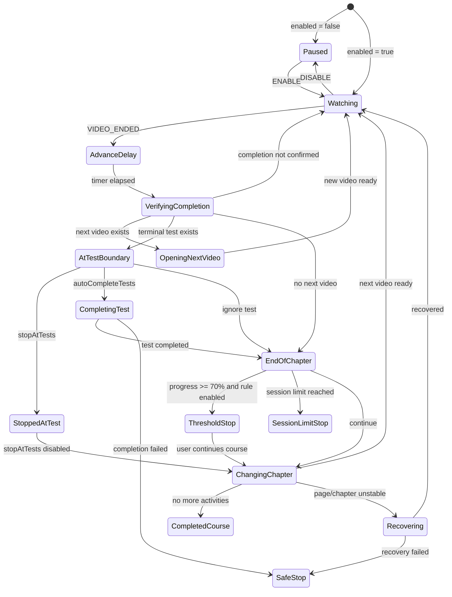
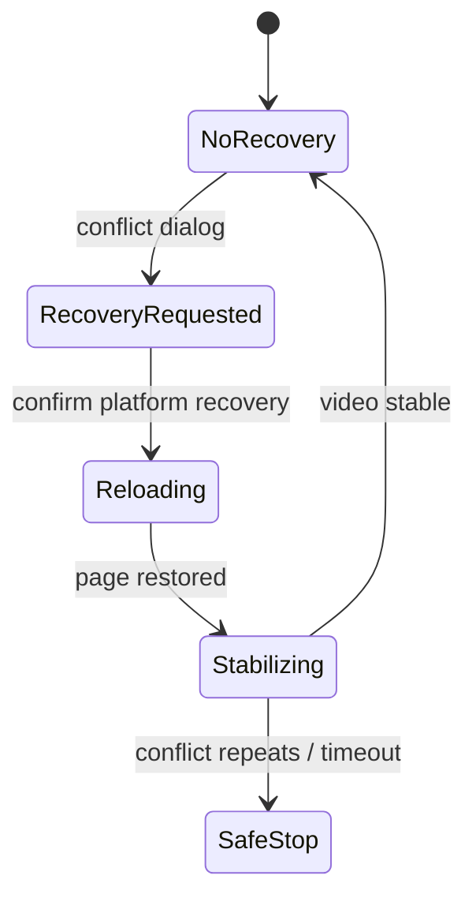
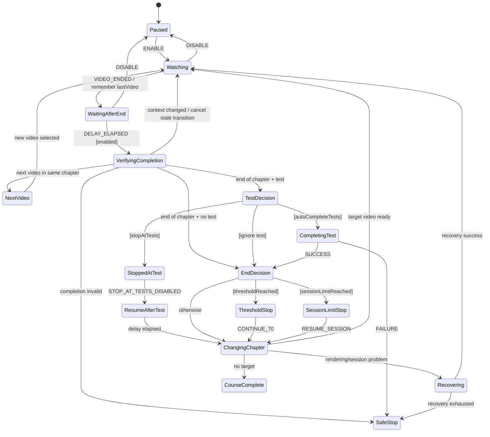

# 07 — Autoplay come state machine

## Dal flusso di funzioni al comportamento del sistema

Finora abbiamo studiato quasi tutti gli ingredienti che rendono possibile l'autoplay di PlumePilot:

- il DOM dinamico della piattaforma;
- i diversi contesti JavaScript dell'estensione;
- il messaging;
- le API Multiversity;
- Promise, timer e race condition;
- cache e stato persistente.

Ora possiamo cambiare prospettiva.

Invece di chiederci:

> **Quale funzione viene chiamata dopo quale funzione?**

possiamo chiederci:

> **In quale stato si trova l'autoplay, quale evento è appena accaduto e quali transizioni sono ammesse da qui?**

È una differenza importante.

Un programma sufficientemente semplice può essere letto come una sequenza:

```text
A → B → C → D
```

L'autoplay di PlumePilot non funziona così.

Durante lo stesso video possono cambiare:

- la preferenza `enabled`;
- il comportamento ai test;
- il limite della sessione;
- la soglia del 70%;
- il DOM della sidebar;
- la lezione selezionata;
- la pagina visibile;
- lo stato registrato dal server;
- un recovery;
- un'altra operazione PlumePilot.

Perciò il comportamento reale assomiglia molto di più a un grafo:

```text
                ┌──────────────┐
                │    PAUSED    │
                └──────┬───────┘
                       │ resume
                       ▼
                ┌──────────────┐
                │   WATCHING   │
                └──────┬───────┘
                       │ video ended
                       ▼
              ┌──────────────────┐
              │ VERIFY COMPLETION│
              └────────┬─────────┘
                       │
           ┌───────────┼───────────────┐
           │           │               │
           ▼           ▼               ▼
     NEXT VIDEO   TEST BOUNDARY   END OF CHAPTER
                       │               │
                       │               ├─ threshold → STOP
                       │               ├─ limit → STOP
                       │               └─ next chapter
                       ▼
               STOP / COMPLETE
```

Questo è il terreno naturale delle **state machine**.

---

## 1. Che cos'è una state machine?

Una state machine descrive il comportamento di un sistema attraverso alcuni elementi fondamentali:

- **stati**;
- **eventi**;
- **transizioni**;
- **guardie**;
- **azioni**.

La forma minima è:

```text
STATO A --evento--> STATO B
```

Per esempio:

```text
WATCHING --VIDEO_ENDED--> VERIFYING_COMPLETION
```

Ma spesso una transizione è valida soltanto se una condizione è vera:

```text
WATCHING --VIDEO_ENDED [enabled]--> VERIFYING_COMPLETION
```

La condizione tra parentesi è una **guardia**.

Una guardia non descrive *cosa fare*: descrive **se una transizione è ammessa**.

Possiamo quindi separare tre domande:

```text
Dove siamo?       → stato
Cosa è successo?  → evento
Possiamo farlo?   → guardia
```

Solo dopo arriva:

```text
Cosa facciamo?    → azione / effetto
```

Questa separazione è molto utile quando le condizioni crescono.

---

## 2. PlumePilot non usa una libreria FSM — ma il comportamento esiste lo stesso

Nel codice attuale non troviamo qualcosa come:

```js
const autoplayMachine = createMachine(...);
```

Non esiste una singola variabile:

```js
let autoplayState = "watching";
```

Lo stato è invece distribuito tra molte variabili.

In `content.js` troviamo, fra le altre:

```js
let playbackContext = null;
let busy = false;
let enabled = true;
let stopAtTests = false;
let autoCompleteTests = false;
let autoplaySkipCompletedVideos = false;
let autoplayStopAt70Enabled = false;
let autoplayStopAt70Bypassed = false;
let stoppedAtTestContext = null;
```

A queste si aggiungono:

- `smartResumeRunning`;
- `chapterLimitEnabled`;
- `chapterLimitSession`;
- `lastVideo`;
- i recovery in `sessionStorage`;
- `collectingCourseMaterials`;
- lo stato delle operazioni batch;
- il timer di avanzamento;
- l'identità della lezione corrente.

Quello che abbiamo è quindi un **vettore di stato**.

Possiamo immaginarlo così:

```text
autoplay = {
    enabled,
    busy,
    modeAtTests,
    currentLesson,
    currentVideo,
    stoppedAtTestContext,
    chapterLimit,
    threshold70,
    recovery,
    competingOperation,
    discoveryRunning,
    ...
}
```

La macchina a stati è quindi già presente **semanticamente**, anche se non è dichiarata formalmente.

Questo accade molto spesso nei software reali.

---

## 3. Stato esplicito e stato implicito

Supponiamo di avere questo codice:

```js
if (!enabled) return;
if (busy) return;
if (collectingCourseMaterials) return;
if (courseBatchRunning()) return;
```

Possiamo leggerlo come quattro `if` indipendenti.

Oppure possiamo leggerlo come:

> La transizione verso `ADVANCING` è permessa soltanto quando l'autoplay è attivo, non è già impegnato e nessuna operazione incompatibile possiede il corso.

Questa seconda lettura ci porta verso la modellazione a stati.

In altre parole:

```text
if statements
```

possono essere la rappresentazione concreta di:

```text
guards su una transizione
```

La differenza è soprattutto mentale e architetturale.

---

## 4. Gli eventi reali dell'autoplay

Prima di definire gli stati, cerchiamo gli eventi.

Nel codice reale abbiamo eventi molto chiari.

### Video avviato

`attach(v)` registra:

```js
v.addEventListener("play", () => {
    const row = currentLesson();
    if (row) rememberPlaybackLesson(row, v);
    ...
});
```

Concettualmente:

```text
VIDEO_PLAYED
```

---

### Video terminato

Sempre in `attach(v)`:

```js
v.addEventListener("ended", () => {
    void captureEndedVideoProgress(v);

    if (!enabled || smartResumeRunning) {
        return;
    }

    if (lastVideo === v) return;
    lastVideo = v;

    clearTimeout(timer);
    timer = setTimeout(() => {
        if (enabled) {
            advance(v);
        }
    }, DELAY_MS);
});
```

Questo evento è chiarissimo:

```text
VIDEO_ENDED
```

Ma già qui vediamo diverse guardie:

```text
[enabled]
[!smartResumeRunning]
[lastVideo !== v]
```

E una transizione ritardata:

```text
VIDEO_ENDED
    ↓
WAITING_ADVANCE_DELAY
    ↓ after DELAY_MS
ADVANCING
```

---

### Impostazioni cambiate

Il bridge invia `PEGASO_AUTONEXT_STATE`.

`content.js` aggiorna:

```js
enabled = event.data.enabled !== false;
autoCompleteTests = event.data.autoCompleteTests === true;
autoplaySkipCompletedVideos = event.data.autoplaySkipCompletedVideos === true;
chapterLimitEnabled = event.data.autoplayChapterLimitEnabled === true;
autoplayStopAt70Enabled = event.data.autoplayStopAt70Enabled === true;
```

Questo può essere visto come:

```text
SETTINGS_CHANGED
```

Lo stesso evento può causare transizioni diverse in base allo stato corrente.

Per esempio:

```text
PAUSED --SETTINGS_CHANGED(enabled=true)--> WATCHING
```

oppure:

```text
STOPPED_AT_TEST --SETTINGS_CHANGED(stopAtTests=false)--> RESUMING
```

Questo secondo caso esiste davvero nel codice.

---

## 5. Un evento non implica sempre una transizione

Questa è una delle idee più importanti delle state machine.

Se arriva:

```text
VIDEO_ENDED
```

non significa automaticamente:

```text
vai al video successivo
```

Il sistema deve prima chiedersi:

```text
Autoplay è attivo?
Sto già avanzando?
Quel video è ancora quello corrente?
La piattaforma ha registrato il completamento?
Il DOM rappresenta ancora la stessa lezione?
C'è un test?
Devo fermarmi al test?
Devo completarlo automaticamente?
Ho raggiunto il 70%?
Ho raggiunto il limite sessione?
Esiste un'altra operazione incompatibile?
```

Quindi l'evento è solo un **trigger**.

La transizione è una decisione.

---

## 6. Ricostruiamo la macchina principale

Una modellazione concettuale utile dell'autoplay potrebbe essere:



Non è una trascrizione uno-a-uno del codice.

È un **modello del comportamento**.

Questa distinzione è importante: una state machine serve a descrivere le regole essenziali del sistema, non necessariamente ogni variabile locale.

---

## 7. `advance(v)` è quasi un transition dispatcher

La funzione centrale è:

```js
async function advance(v) {
```

All'inizio troviamo diverse guardie:

```js
if (collectingCourseMaterials) {
    return;
}

if (courseBatchRunning()) {
    return;
}

if (!enabled) {
    return;
}

if (busy || v !== lastVideo) {
    return;
}
```

Poi:

```js
busy = true;
```

e il workflow entra in una regione critica.

Possiamo tradurre questa parte in linguaggio state-machine:

```text
EVENT: ADVANCE_REQUESTED

GUARDS:
- autoplay enabled
- no material collection
- no batch operation
- not already advancing
- requested video is still authoritative

TRANSITION:
WATCHING / DELAYED → VERIFYING_CURRENT_LESSON
```

Il codice successivo decide poi quale ramo prendere.

---

## 8. `busy` non è la state machine

Potrebbe essere tentante pensare:

```text
busy = false → idle
busy = true  → advancing
```

Ma sarebbe una semplificazione eccessiva.

`busy` è una **reentrancy guard**.

Serve a impedire che due avanzamenti entrino contemporaneamente nella stessa sequenza.

Non ci dice però *perché* l'autoplay è fermo o cosa sta facendo.

Con `busy === false` potremmo essere:

- in pausa;
- in attesa di un video;
- fermi a un test;
- fermi al 70%;
- fermi per limite sessione;
- in recovery;
- alla fine del corso.

Quindi:

> **Un flag può rappresentare una proprietà dello stato senza rappresentare lo stato intero.**

Questo è uno dei motivi per cui i sistemi con molti boolean possono diventare difficili da leggere.

---

## 9. Il problema dell'esplosione combinatoria dei boolean

Immaginiamo tre flag:

```text
enabled
busy
stopAtTests
```

Formalmente esistono:

```text
2³ = 8 combinazioni
```

Con dieci boolean:

```text
2¹⁰ = 1024 combinazioni
```

Ovviamente molte combinazioni non sono realmente valide.

Per esempio, concettualmente potrebbe non avere senso essere contemporaneamente:

```text
PAUSED
+
ADVANCING
```

Una state machine esplicita aiuta perché rende molte combinazioni **impossibili per costruzione**.

Invece di:

```js
enabled = false;
busy = true;
stoppedAtTestContext = ...;
```

potremmo avere uno stato unico:

```text
paused
```

con un contesto separato.

Questa distinzione tra **finite state** e **extended state/context** è fondamentale.

---

## 10. Stato finito e contesto

Una macchina non deve trasformare ogni dato in uno stato.

Per esempio:

```text
watching chapter 5 lesson 2
watching chapter 5 lesson 3
watching chapter 5 lesson 4
```

non richiede tre stati differenti.

Possiamo avere:

```text
state = WATCHING
```

con:

```text
context = {
    courseCode,
    chapterIdentity,
    lessonIdentity,
    videoElement
}
```

Nel codice PlumePilot questo ruolo è svolto in parte da `playbackContext`:

```js
playbackContext = {
    videoElement,
    courseCode: courseCodeFromUrl(),
    lessonNumber: lessonNumberFromUrl(),
    identity,
    name: lessonName(row),
    index,
};
```

Questo è molto vicino al concetto di **extended state**.

Lo stato descrive *la modalità*.

Il contesto contiene *i dati necessari a quella modalità*.

---

## 11. `playbackContext` rende stabile l'identità attraverso le transizioni

Nel Capitolo 03 abbiamo già visto che un nodo DOM può diventare obsoleto.

Qui possiamo reinterpretare lo stesso meccanismo come parte della macchina.

Durante `advance(v)`:

```js
let cur = await recoverPlaybackLesson(v);
```

Poi viene conservato:

```js
const completedLesson = playbackContext;
```

Dopo l'attesa:

```js
const completed = await waitForLessonCompletion(cur, v);
```

il mondo viene verificato nuovamente:

```js
const stableCur = await recoverPlaybackLesson(v);

if (
    !enabled ||
    v !== lastVideo ||
    video() !== v ||
    !stableCur ||
    playbackLessonRow(completedLesson) !== stableCur
) {
    return;
}
```

Possiamo leggerlo così:

```text
VERIFYING_COMPLETION
      │
      │ await platform state
      ▼
REVALIDATE CONTEXT
      │
      ├─ context unchanged → continue transition
      └─ context changed   → cancel transition
```

È un pattern estremamente importante.

La macchina non presume che, dopo un'attesa asincrona, si trovi ancora nello stesso mondo.

---

## 12. Le guardie sono disseminate nel codice

Prendiamo alcuni esempi.

### Guardia: autoplay attivo

```js
if (!enabled) return;
```

---

### Guardia: evento non duplicato

```js
if (lastVideo === v) return;
```

---

### Guardia: nessuna transizione già in corso

```js
if (busy) return;
```

---

### Guardia: stesso video ancora corrente

```js
if (v !== lastVideo) return;
```

---

### Guardia: nessuna operazione incompatibile

```js
if (collectingCourseMaterials || courseBatchRunning()) return;
```

---

### Guardia: stop ai test

```js
if (test && stopAtTests) {
```

---

### Guardia: completamento automatico

```js
else if (test && autoCompleteTests) {
```

---

### Guardia: soglia raggiunta

```js
if (thresholdReached) {
```

---

### Guardia: limite sessione raggiunto

```js
if (sessionLimitReached) {
```

Visti insieme, questi `if` non sono soltanto controllo di flusso.

Sono il **transition table implicito** dell'autoplay.

---

## 13. Una transition table esplicita

Possiamo rappresentare parte del comportamento in una tabella.

| Stato | Evento | Guardia | Nuovo stato / azione |
|---|---|---|---|
| `WATCHING` | `VIDEO_ENDED` | `enabled && !smartResumeRunning` | `ADVANCE_DELAY` |
| `ADVANCE_DELAY` | `TIMER` | `enabled` | `VERIFYING_COMPLETION` |
| `VERIFYING_COMPLETION` | `COMPLETED` | next video exists | `OPENING_NEXT_VIDEO` |
| `VERIFYING_COMPLETION` | `COMPLETED` | terminal test + stop | `STOPPED_AT_TEST` |
| `VERIFYING_COMPLETION` | `COMPLETED` | terminal test + auto-complete | `COMPLETING_TEST` |
| `COMPLETING_TEST` | `SUCCESS` | — | `END_OF_CHAPTER` |
| `COMPLETING_TEST` | `FAILURE` | — | `SAFE_STOP` |
| `END_OF_CHAPTER` | `CONTINUE` | threshold reached | `THRESHOLD_STOP` |
| `END_OF_CHAPTER` | `CONTINUE` | session limit reached | `SESSION_LIMIT_STOP` |
| `END_OF_CHAPTER` | `CONTINUE` | otherwise | `CHANGING_CHAPTER` |
| `STOPPED_AT_TEST` | `SETTINGS_CHANGED` | `!stopAtTests` | `RESUMING` |
| qualunque stato attivo | `DISABLE` | — | `PAUSED` |

Una tabella del genere è utile per due motivi.

Primo: rende visibili casi dimenticati.

Secondo: può diventare quasi direttamente una matrice di test.

---

## 14. Gli eventi duplicati: `lastVideo` come deduplicazione

Il listener `ended` contiene:

```js
if (lastVideo === v) return;
lastVideo = v;
```

Perché?

Perché nei sistemi event-driven è pericoloso assumere che un evento semanticamente importante arrivi esattamente una volta.

Il browser e la piattaforma possono:

- riutilizzare il player;
- ricostruire parti del DOM;
- cambiare sorgente;
- causare listener o stati intermedi inattesi.

PlumePilot trasforma quindi:

```text
VIDEO_ENDED(video X)
VIDEO_ENDED(video X)
```

in un solo avanzamento logico.

Possiamo vedere `lastVideo` come una piccola forma di:

```text
event deduplication
```

oppure, in termini di state machine:

```text
ignora eventi che non producono una transizione valida dallo stato corrente
```

---

## 15. `play` corregge lo stato per il riuso del player

C'è però una complicazione.

La piattaforma può riutilizzare lo stesso elemento `<video>` per un nuovo contenuto.

Per questo il listener `play` contiene:

```js
if (
    lastVideo === v &&
    !v.ended &&
    (!Number.isFinite(v.duration) || v.currentTime < v.duration - 0.5)
) {
    lastVideo = null;
}
```

Altrimenti avremmo questo errore logico:

```text
video element A finisce
lastVideo = A

piattaforma riusa element A per il video successivo

nuovo ended su A
↓
"è già lastVideo"
↓
evento ignorato per errore
```

Quindi lo stato deve rappresentare **l'identità semantica**, non soltanto l'identità dell'oggetto JavaScript.

È lo stesso principio visto con il DOM, applicato ora agli eventi.

---

## 16. Delayed transitions: i timer non sono semplici pause

Dopo `ended`, PlumePilot non chiama immediatamente `advance(v)`.

Usa:

```js
timer = setTimeout(() => {
    if (enabled) {
        advance(v);
    }
}, DELAY_MS);
```

Nella modellazione a stati possiamo rappresentarlo come:

```text
VIDEO_ENDED
   ↓
WAITING_AFTER_END
   ↓ after DELAY_MS
VERIFYING_COMPLETION
```

Questo è un esempio di **delayed transition**.

Il tempo fa parte del comportamento.

La differenza rispetto a un semplice `sleep()` è concettuale:

> non stiamo solo aspettando; stiamo dicendo che il sistema resta in uno stato per un intervallo, durante il quale altri eventi possono invalidare la transizione.

Infatti allo scadere del timer viene ricontrollato:

```js
if (enabled)
```

Il timer non congela il mondo.

---

## 17. Il completamento della lezione è uno stato di attesa, non una proprietà istantanea

`waitForLessonCompletion()` mostra molto bene questa idea.

Quando il video termina, la piattaforma può non aver ancora aggiornato la sidebar.

Quindi non possiamo fare:

```text
video ended → completed
```

Il modello corretto è:

```text
VIDEO ENDED
    ↓
AWAITING PLATFORM CONFIRMATION
    ↓
100% registered
```

oppure:

```text
VIDEO ENDED
    ↓
AWAITING PLATFORM CONFIRMATION
    ↓ timeout
real video end confirmed
    ↓
continue with safeguard
```

oppure:

```text
VIDEO ENDED
    ↓
platform validation failure
    ↓
SAFE STOP / RECOVERY
```

Questo è molto più fedele al dominio.

---

## 18. State machine e sistema esterno

Una state machine applicativa non controlla tutto il mondo.

PlumePilot controlla il proprio stato, ma non controlla:

- quando Multiversity aggiorna il progresso;
- quando il DOM viene ricostruito;
- quando una sessione video viene rilasciata;
- quando una richiesta API torna;
- quando un utente cambia manualmente lezione.

Questi fattori arrivano alla macchina come **eventi esterni**.

Possiamo rappresentare la relazione così:

```text
             ┌────────────────────┐
             │    Multiversity    │
             └──────┬─────────────┘
                    │
       DOM / API / video events
                    │
                    ▼
          ┌──────────────────┐
          │ Autoplay machine │
          └────────┬─────────┘
                   │          click / API / status
                   │
                   ▼
             Multiversity
```

La macchina è quindi **reattiva**.

Non esegue un copione predeterminato: reagisce al mondo.

---

## 19. I test sono un vero branch di stato

Arriviamo a uno dei punti più importanti.

Alla fine di un capitolo, PlumePilot controlla:

```js
const test = getEndOfLessonTest(chapter);
```

Da qui il comportamento può divergere.

### Caso 1 — Fermati ai test

```js
if (test && stopAtTests) {
    ...
    stoppedAtTestContext = {
        identity: chapterIdentity(chapter),
        oldVideo: v,
    };
    return;
}
```

Questo corrisponde molto bene a uno stato esplicito:

```text
STOPPED_AT_TEST
```

Notiamo che viene salvato anche il contesto necessario a riprendere.

---

### Caso 2 — Test già completo

```js
else if (test && isEndOfLessonTestCompleted(test)) {
    // skip
}
```

La macchina non entra in un nuovo stato duraturo: attraversa semplicemente la guardia.

---

### Caso 3 — Completa automaticamente

```js
else if (test && autoCompleteTests) {
    const testCompleted = await completeAutomaticEndOfLessonTest(...);

    if (!testCompleted) {
        return;
    }
}
```

Concettualmente:

```text
AT_TEST_BOUNDARY
      ↓
COMPLETING_TEST
      ↓ success
END_OF_CHAPTER
```

oppure:

```text
COMPLETING_TEST
      ↓ failure
SAFE_STOP
```

---

### Caso 4 — Ignora e continua

Se c'è un test ma nessuna delle guardie precedenti blocca la transizione:

```text
AT_TEST_BOUNDARY → END_OF_CHAPTER
```

Quattro comportamenti differenti partono dallo stesso evento logico.

È esattamente il tipo di situazione in cui una state machine diventa utile.

---

## 20. Stored intent ed effective state

Nel Capitolo 06 abbiamo introdotto questa distinzione.

Qui la vediamo in azione.

Nel bridge, la preferenza viene letta da storage.

Poi viene derivato lo stato effettivo.

In `content.js`:

```js
stopAtTests =
    event.data.stopAtTests !== false &&
    !autoCompleteTests &&
    !chapterLimitEnabled;
```

Quindi una preferenza salvata può essere vera, ma la guardia runtime può risultare falsa perché un'altra modalità ha priorità.

Questo evita combinazioni contraddittorie.

State-machine thinking ci suggerisce di non pensare a:

```text
stopAtTests = checkbox
```

ma a:

```text
storedIntent.stopAtTests
       +
runtime constraints
       ↓
effectiveMode
```

Questo è un modo molto più robusto di modellare configurazioni interdipendenti.

---

## 21. Fermarsi a un test crea uno stato persistente nel comportamento

`stoppedAtTestContext` è particolarmente interessante.

Quando l'autoplay si ferma, non basta sapere:

```text
"sono fermo"
```

Serve sapere **da dove riprendere**.

Per questo viene conservato:

```js
{
    identity,
    oldVideo
}
```

Quando l'utente disattiva `stopAtTests`, il cambio impostazioni contiene:

```js
if (wasStoppingAtTests && !stopAtTests) {
    const context = stoppedAtTestContext;
    stoppedAtTestContext = null;

    if (context) {
        resumeAfterTestBoundary(context);
    } else {
        resumeIfVideoAlreadyEnded();
    }
}
```

In linguaggio state-machine:

```text
STATE: STOPPED_AT_TEST
EVENT: STOP_AT_TESTS_DISABLED
ACTION: consume saved context
TRANSITION: RESUMING_AFTER_TEST
```

È uno degli esempi più puliti del capitolo.

---

## 22. State history: sapere da dove proveniamo

`stoppedAtTestContext` ci mostra anche un concetto più generale.

Talvolta lo stato corrente non basta.

Per riprendere correttamente serve una parte della **history**.

Non ci interessa tutta la cronologia del corso.

Ci interessa soltanto:

```text
ultimo punto sicuro da cui continuare
```

È una forma molto semplice di state history.

La stessa idea appare nei recovery:

```text
currentIdentity
path
attempts
createdAt
```

Il software conserva il minimo contesto necessario a ricostruire una transizione interrotta.

---

## 23. Soglia del 70% e limite sessione sono stati terminali relativi

Dopo aver terminato un capitolo:

```js
const sessionLimitReached = chapterLimitReached(...);
const thresholdReached = autoplayThresholdReached();
```

Poi:

```js
if (thresholdReached) {
    ...
    return;
}

if (sessionLimitReached) {
    ...
    return;
}
```

Dal punto di vista della singola sessione autoplay, sono stati terminali:

```text
THRESHOLD_STOP
SESSION_LIMIT_STOP
```

Ma non sono terminali per l'intera applicazione.

L'utente può riprendere.

Per questo è utile parlare di:

```text
terminal state del workflow corrente
```

non necessariamente:

```text
fine definitiva dell'applicazione
```

---

## 24. Due condizioni terminali possono verificarsi insieme

Il codice gestisce anche:

```js
if (thresholdReached || sessionLimitReached) {
    // sound event
}
```

E il messaggio distingue il caso combinato:

```js
thresholdReached
    ? sessionLimitReached
        ? "Soglia del 70% e limite della sessione raggiunti."
        : ...
```

Questo ci ricorda che il sistema possiede anche **stato ortogonale**.

Due proprietà possono diventare vere contemporaneamente:

```text
thresholdReached = true
sessionLimitReached = true
```

Una FSM completamente piatta dovrebbe creare una combinazione dedicata.

Uno **statechart** più ricco può invece modellare regioni o condizioni parallele.

Questo è uno dei punti in cui il termine *state machine* comincia a diventare più ampio della semplice FSM scolastica.

---

## 25. FSM e statechart

Una finite state machine semplice assume spesso un solo stato discreto attivo:

```text
A oppure B oppure C
```

Nei software reali abbiamo frequentemente proprietà indipendenti:

```text
playback = watching
threshold = armed
sessionLimit = active
recovery = none
```

Appiattire tutto produce molti stati:

```text
WATCHING_THRESHOLD_ARMED_LIMIT_ACTIVE
WATCHING_THRESHOLD_BYPASSED_LIMIT_ACTIVE
WATCHING_THRESHOLD_ARMED_LIMIT_DISABLED
...
```

Uno **statechart** permette concetti più ricchi:

- stati gerarchici;
- sottostati;
- regioni parallele;
- history;
- guardie;
- transizioni ritardate.

Non è necessario introdurre una libreria per beneficiare di questi concetti.

La modellazione da sola può già migliorare il ragionamento.

---

## 26. Recovery come submachine

I recovery di PlumePilot sono un ottimo candidato per essere pensati come una macchina separata.

Per esempio il session-conflict recovery può essere semplificato così:



Questa macchina può interagire con l'autoplay principale:

```text
AUTOPLAY.ACTIVE
      │
      ├─ recovery = none      → transizioni normali
      └─ recovery != none     → niente first-incomplete / avanzamenti pericolosi
```

E infatti `startFirstIncompleteDiscovery()` controlla:

```js
if (
    readChapterRecovery()?.currentIdentity ||
    readSessionConflictRecovery() ||
    readWatchValidationRecovery()
) {
    return;
}
```

State-machine thinking rende evidente il significato:

> **la discovery non è una transizione ammessa mentre la recovery submachine non è nello stato `NONE`.**

---

## 27. Operazioni concorrenti come ownership del sistema

L'autoplay verifica anche:

```js
if (collectingCourseMaterials) return;
if (courseBatchRunning()) return;
```

Nel Capitolo 05 abbiamo visto la concorrenza.

Qui possiamo modellarla così:

```text
COURSE CONTROL OWNER

AUTOPLAY
EXPORT
TURBO TEST
OBJECTIVES
```

Alcune attività sono incompatibili perché manipolano o interrogano la stessa struttura di corso.

Quindi:

```text
AUTOPLAY transition
    guard: courseOwner == AUTOPLAY || courseOwner == NONE
```

Il progetto non implementa letteralmente questo enum, ma il concetto è utile per capire perché certi controlli esistono.

---

## 28. `nextChapter()` è una transizione composta

Alla fine del capitolo:

```js
await nextChapter(v, cur);
```

Non significa semplicemente:

```text
chapter++
```

Può richiedere:

- identificazione stabile del capitolo corrente;
- API discovery;
- scelta fra ordine sequenziale e skip dei completati;
- apertura di una nuova sezione;
- verifica di test intermedi;
- fallback visuale;
- recovery del DOM;
- attesa del nuovo video.

Quindi `CHANGING_CHAPTER` è in realtà un **compound state**.

Possiamo immaginarlo così:

```text
CHANGING_CHAPTER
├── FIND_TARGET
├── OPEN_SECTION
├── OPEN_CHAPTER
├── WAIT_RENDER
├── SELECT_ACTIVITY
└── WAIT_VIDEO
```

Questa gerarchia ci evita di trasformare la macchina principale in un diagramma illeggibile.

---

## 29. La prima attività incompleta è una macchina separata

`startFirstIncompleteDiscovery()` condivide molti strumenti con l'autoplay, ma ha un obiettivo differente.

Non sta semplicemente continuando da una lezione conclusa.

Sta cercando:

```text
il primo target valido secondo una politica di discovery
```

Per questo conviene pensarlo come una submachine:

```text
IDLE
 ↓ start
BUILD_OUTLINE
 ↓
READ_MASTER
 ↓
SCAN_CANDIDATES
 ├─ target → OPEN_TARGET
 ├─ uncertain → VISUAL_VERIFY
 ├─ cancelled → CANCELLED
 └─ none → COMPLETE
```

Nel Capitolo 08 la studieremo nel dettaglio.

Per ora è sufficiente notare che:

> **due feature possono condividere API e funzioni senza essere lo stesso workflow.**

Questo è un principio architetturale importante.

---

## 30. Fail closed come transizione di sicurezza

Nel codice della discovery troviamo casi come:

```js
if (!lesson.ok) {
    setResumeDiscoveryStatus(
        "Test corrente non verificabile. Avanzamento fermato per sicurezza.",
        "fallback",
    );
    return true;
}
```

Il principio è:

```text
incertezza su una condizione che potrebbe richiedere stop
        ↓
non avanzare
```

Questo è un comportamento **fail closed**.

Per l'autoplay è preferibile un falso stop a un falso skip quando l'utente ha esplicitamente chiesto di fermarsi ai test.

In termini di state machine:

```text
VERIFY_TEST
   ├─ confirmed absent → continue
   ├─ confirmed present → STOPPED_AT_TEST
   └─ unknown          → SAFE_STOP
```

Lo stato `UNKNOWN` non viene trattato come `FALSE`.

---

## 31. Una macchina rende esplicita la politica sull'incertezza

Questo è un vantaggio notevole.

Senza modello, potremmo avere:

```js
if (!test) continue;
```

Ma `!test` può significare:

```text
nessun test esiste
```

oppure:

```text
non siamo riusciti a verificarlo
```

Sono semanticamente differenti.

Una buona macchina può distinguere:

```text
ABSENT
PRESENT
UNKNOWN
```

e scegliere transizioni diverse.

Questa idea ricorrerà fortemente nel Capitolo 08.

---

## 32. L'autoplay non è una state machine puramente deterministica rispetto al browser

Una state machine è spesso descritta come:

```text
nextState = transition(currentState, event)
```

Ma PlumePilot interagisce con side effect reali:

- `click()`;
- `fetch()`;
- `setTimeout()`;
- storage;
- DOM;
- notifiche;
- suoni.

Per questo è utile separare idealmente:

```text
TRANSITION LOGIC
```

da:

```text
EFFECTS
```

Per esempio:

```text
STATE = END_OF_CHAPTER
EVENT = CONTINUE
GUARD = thresholdReached

NEXT STATE = THRESHOLD_STOP
ACTION = show notification + publish status + play sound
```

Il cambio di stato è una decisione.

Il suono è un effetto.

Questa separazione rende i test più semplici.

---

## 33. Come potrebbe apparire un refactor puramente illustrativo

**Questo non è codice presente in PlumePilot e non è una proposta di modifica necessaria.**

Serve soltanto a visualizzare il modello.

Potremmo immaginare:

```js
function transition(state, event, context) {
    if (event.type === "DISABLE") {
        return { state: "paused", context };
    }

    if (state === "watching" && event.type === "VIDEO_ENDED") {
        if (context.discoveryRunning) return { state, context };
        return { state: "advanceDelay", context };
    }

    if (state === "atTestBoundary") {
        if (context.stopAtTests) {
            return { state: "stoppedAtTest", context };
        }

        if (context.autoCompleteTests) {
            return { state: "completingTest", context };
        }

        return { state: "endOfChapter", context };
    }

    return { state, context };
}
```

Poi gli effetti potrebbero essere eseguiti separatamente.

Il vantaggio sarebbe poter testare:

```js
transition(
    "atTestBoundary",
    { type: "DECIDE" },
    { stopAtTests: true, autoCompleteTests: false }
)
```

senza aprire un browser, una pagina Multiversity o un vero video.

---

## 34. Perché non rifattorizzare automaticamente tutto così?

Perché una state machine esplicita ha anche un costo.

Potrebbe richiedere:

- introdurre un nuovo livello di astrazione;
- migrare molto codice stabile;
- rappresentare side effect complessi;
- gestire integrazioni DOM che restano imperative;
- aumentare la curva di apprendimento;
- rischiare regressioni in un sistema ormai maturo.

Perciò la conclusione non è:

> "PlumePilot dovrebbe essere riscritto con XState."

La conclusione è:

> **Il modello a stati è uno strumento per capire e progettare il comportamento, indipendentemente dalla sintassi usata per implementarlo.**

Questa distinzione è fondamentale.

---

## 35. Da backend developer: pensa a un workflow orchestrator

Se vieni dal backend, puoi confrontare l'autoplay con un workflow applicativo.

Per esempio un ordine e-commerce può essere:

```text
CREATED
→ PAID
→ PREPARING
→ SHIPPED
→ DELIVERED
```

con deviazioni:

```text
PAYMENT_FAILED
CANCELLED
REFUNDED
```

L'autoplay ha lo stesso tipo di problema:

```text
WATCHING
→ VIDEO_ENDED
→ VERIFYING
→ NEXT_ACTIVITY
```

con deviazioni:

```text
STOPPED_AT_TEST
RECOVERING
THRESHOLD_STOP
SESSION_LIMIT_STOP
SAFE_STOP
```

La differenza è che il dominio è una pagina web dinamica invece di un database di ordini.

Ma il problema logico è molto simile.

---

## 36. Guardie e invariant

Una **guardia** decide se una singola transizione può avvenire.

Un **invariant** descrive invece una proprietà che dovrebbe restare vera in tutti gli stati rilevanti.

Per l'autoplay possiamo formulare alcuni invariant utili.

### Invariant 1

```text
Se enabled == false, PlumePilot non deve selezionare automaticamente una nuova attività.
```

---

### Invariant 2

```text
Non devono esistere due avanzamenti automatici concorrenti.
```

`busy` contribuisce a garantirlo.

---

### Invariant 3

```text
Se stopAtTests è effettivamente attivo e un test non è verificabile,
PlumePilot non deve oltrepassare silenziosamente il confine.
```

---

### Invariant 4

```text
Dopo un await, il target deve essere ancora coerente con il contesto che ha iniziato la transizione.
```

---

### Invariant 5

```text
Un recovery non deve generare un loop infinito di reload.
```

Questi invariant sono molto utili anche nei test di regressione.

---

## 37. Dalle state machine ai test

Una macchina ben descritta suggerisce direttamente i casi da verificare.

### Test A — Autoplay in pausa

```text
GIVEN  state = PAUSED
WHEN   VIDEO_ENDED
THEN   nessuna navigazione automatica
```

---

### Test B — Evento ended duplicato

```text
GIVEN  lo stesso video ha già generato la transizione
WHEN   arriva un altro ended sullo stesso target logico
THEN   niente secondo advance
```

---

### Test C — Stop ai test

```text
GIVEN  stopAtTests = true
AND    il capitolo termina con un test
WHEN   l'ultimo video viene completato
THEN   state = STOPPED_AT_TEST
AND    il capitolo successivo non viene aperto
```

---

### Test D — Cambio impostazione mentre siamo fermi

```text
GIVEN  state = STOPPED_AT_TEST
WHEN   stopAtTests diventa false
THEN   riprendi dal contesto salvato
```

Questo è esattamente il tipo di regressione risolto in passato.

---

### Test E — Auto-completamento fallisce

```text
GIVEN  autoCompleteTests = true
WHEN   il test non può essere completato in modo verificato
THEN   SAFE_STOP
```

---

### Test F — Soglia e limite insieme

```text
GIVEN  threshold70 reached
AND    chapter session limit reached
WHEN   il capitolo termina
THEN   niente nextChapter
AND    stato terminale coerente
AND    messaggio combinato corretto
```

---

### Test G — Stato cambia durante await

```text
GIVEN  advance() sta aspettando completion
WHEN   l'utente cambia lezione o il DOM viene ricostruito
THEN   la vecchia transizione viene annullata
```

Questa è una delle regressioni più importanti che abbiamo studiato.

---

## 38. Il changelog racconta l'evoluzione della macchina

Letto con questa lente, il changelog di PlumePilot diventa quasi una storia di transizioni mancanti.

### v1.6.0

Arriva il ramo:

```text
AT_TEST_BOUNDARY → COMPLETING_TEST
```

con una regola importante:

```text
se non posso verificare il completamento → stop
```

---

### v2.9.x

Il test boundary diventa più formale:

```text
current test present / absent / unknown
```

con comportamento fail-closed.

---

### v2.10.1

Viene corretta una transizione che mancava:

```text
STOPPED_AT_TEST
    --disable stopAtTests-->
RESUME
```

---

### v2.11.5

Compare una vera submachine di recovery per il conflitto di sessione.

---

### v2.14.x

La discovery della prima attività incompleta diventa un workflow autonomo con cancellazione e fallback.

---

### v2.19.0

Compare:

```text
END_OF_CHAPTER → SESSION_LIMIT_STOP
```

---

### v2.35.1

Vengono migliorate le transizioni relative ad accordion chiusi, handoff dagli Obiettivi e routing fra capitoli.

Vista così, una regressione non è semplicemente:

```text
"funzione X rotta"
```

ma spesso:

```text
"mancava o era sbagliata una transizione fra due stati reali del sistema"
```

---

## 39. Le regressioni come transizioni non modellate

Questo è un principio molto potente.

Prendiamo alcuni bug incontrati nello sviluppo.

### Accordion chiuso durante il completamento

Il vecchio modello implicito assumeva:

```text
WAITING_COMPLETION → stesso DOM ancora disponibile
```

Ma il mondo reale permetteva:

```text
WAITING_COMPLETION → SIDEBAR_CHANGED
```
La transizione non era stata sufficientemente modellata.

La correzione ha introdotto re-resolution e revalidation.

---

### Disabilitare “Fermati ai test” dopo lo stop

Il sistema aveva:

```text
WATCHING → STOPPED_AT_TEST
```

ma la transizione inversa non era affidabile.

La correzione ha introdotto esplicitamente il resume context.

---

### Player riutilizzato

Il modello ingenuo diceva:

```text
videoElement == lastVideo → evento duplicato
```

Il modello reale richiedeva:

```text
stesso elemento DOM != necessariamente stesso video logico
```

Di nuovo: identità e transizione.

---

## 40. Diagramma più completo dell'autoplay

Possiamo ora rappresentare una versione più ricca.



Il diagramma non sostituisce il codice.

Fa emergere le sue regole.

---

## 41. Quali stati non conviene modellare esplicitamente?

Non tutto merita uno stato.

Per esempio:

```text
percent = 42
percent = 43
percent = 44
```

non sono tre stati della macchina.

Sono dati nel contesto.

Allo stesso modo:

```text
chapterLimit = 5
```

è un parametro.

Diventa rilevante come stato soltanto quando la condizione cambia semanticamente:

```text
limit not reached
→
limit reached
```

Una buona regola è:

> **Modella come stato ciò che cambia il comportamento ammesso del sistema.**

---

## 42. Un esercizio: classificare alcune variabili

Proviamo con variabili reali.

### `enabled`

Influenza direttamente le transizioni possibili.

Può essere visto come stato/modalità globale.

---

### `busy`

È una guardia di reentrancy.

Non descrive da sola una modalità di dominio completa.

---

### `playbackContext`

È contesto/extended state.

---

### `stopAtTests`

È una policy che modifica le transizioni al test boundary.

---

### `stoppedAtTestContext`

È history/context associato allo stato `STOPPED_AT_TEST`.

---

### `chapterLimitSession.completed`

È un contatore nel contesto.

Quando supera una soglia produce una transizione verso `SESSION_LIMIT_STOP`.

---

### `lastVideo`

È memoria di deduplicazione/event identity.

---

### recovery in `sessionStorage`

È stato di una submachine che deve sopravvivere al reload.

Questo tipo di classificazione aiuta moltissimo a capire codice complesso.

---

## 43. Possiamo avere più macchine contemporaneamente

Una delle idee più utili da portarsi dietro è che un'applicazione non deve avere **una gigantesca state machine**.

PlumePilot si presta meglio a una composizione concettuale:

```text
AutoplayMachine
├── PlaybackMachine
├── TestBoundaryMachine
├── ChapterNavigationMachine
├── RecoveryMachine
└── FirstIncompleteMachine

OperationCoordinator
├── Export
├── Turbo
└── Objectives
```

Le macchine comunicano attraverso eventi o condizioni condivise.

Questa decomposizione è molto simile alla separazione in servizi nel backend: ogni componente possiede un pezzo di comportamento coerente.

---

## 44. Quando una state machine esplicita vale davvero la pena?

È particolarmente utile quando il sistema presenta:

- molti boolean interdipendenti;
- transizioni che dipendono dallo stato precedente;
- retry e recovery;
- operazioni cancellabili;
- eventi asincroni;
- stati impossibili che devono essere evitati;
- bug del tipo “succede solo se prima fai A, poi B, poi C”; 
- una matrice di test difficile da enumerare.

L'autoplay di PlumePilot soddisfa diversi di questi criteri.

Questo non implica che un refactor sia obbligatorio oggi.

Implica che **pensare in termini di state machine è molto adatto al problema**.

---

## 45. XState come possibile strumento di studio

Nel mondo JavaScript esistono librerie come **XState** che permettono di dichiarare formalmente stati, eventi, guardie e azioni.

Un esempio didattico molto semplice potrebbe essere:

```js
const machine = createMachine({
    initial: "paused",
    states: {
        paused: {
            on: { ENABLE: "watching" },
        },
        watching: {
            on: {
                DISABLE: "paused",
                VIDEO_ENDED: "verifyingCompletion",
            },
        },
        verifyingCompletion: {},
    },
});
```

Non serve adottare XState in PlumePilot per studiarlo.

Può però essere utile come laboratorio visuale per imparare i concetti.

La documentazione Stately/XState distingue esplicitamente:

- states;
- events;
- transitions;
- guards;
- actions;
- context.

Sono gli stessi concetti che stiamo applicando manualmente al nostro progetto.

---

## 46. Modellare prima, implementare dopo

Uno dei vantaggi principali di una state machine è poter discutere il comportamento senza parlare immediatamente di DOM o API.

Per esempio:

```text
QUESTION

Cosa deve succedere se:
- il video è terminato;
- il test è presente;
- stopAtTests è true;
- autoCompleteTests è false;
- nel frattempo l'utente mette in pausa l'autoplay?
```

Prima definiamo la regola:

```text
DISABLE ha priorità → PAUSED
```

Poi decidiamo come implementarla.

Questo separa:

```text
policy
```

da:

```text
mechanism
```

Una distinzione classica e molto utile nel software engineering.

---

## 47. State machine e logging

Anche i log diventano più utili se pensati come transizioni.

Oggi PlumePilot registra messaggi come:

```text
Video ended; advancing.
Lesson registered as 100%.
End-of-lesson test boundary reached.
End of chapter reached.
Autoplay session limit reached.
```

Quasi tutti possono essere reinterpretati come:

```text
WATCHING → VERIFYING
VERIFYING → TEST_BOUNDARY
TEST_BOUNDARY → STOPPED
END_OF_CHAPTER → SESSION_LIMIT_STOP
```

Un logging strutturato ideale potrebbe perfino registrare:

```js
{
    from: "verifyingCompletion",
    event: "LESSON_COMPLETED",
    to: "testBoundary",
    courseCode,
    chapterKey
}
```

Ancora una volta: non è necessario modificarlo oggi.

Ma è un buon esempio di come la modellazione migliori anche l'osservabilità.

---

## 48. State machine e debug delle regressioni

Supponiamo che un utente dica:

> "Se disattivo Fermati ai test dopo che PlumePilot si è fermato, non riparte."

Un debug puramente procedurale potrebbe richiedere di seguire molte funzioni.

Con il modello a stati chiediamo subito:

```text
Qual è lo stato iniziale?
STOPPED_AT_TEST

Qual è l'evento?
STOP_AT_TESTS_DISABLED

Quale transizione ci aspettiamo?
STOPPED_AT_TEST → RESUMING

La transizione viene emessa?
La guardia la blocca?
Il context necessario esiste ancora?
L'effetto di resume fallisce?
```

Abbiamo ristretto enormemente lo spazio del problema.

---

## 49. State machine e test coverage

Il coverage tradizionale può dirci:

```text
questa riga è stata eseguita
```

Ma per un workflow spesso vogliamo sapere:

```text
questa transizione è stata verificata
```

Per esempio, potremmo avere copertura di tutte le righe di:

```js
if (wasStoppingAtTests && !stopAtTests) { ... }
```

senza aver mai testato la sequenza completa:

```text
video ends
→ test boundary
→ stop
→ popup setting changes
→ context restored
→ next chapter opens
```

La **transition coverage** è un modo più adatto di pensare a questi workflow.

---

## 50. Uno schema mentale da riusare

Quando incontri una feature complessa, prova a scrivere cinque cose.

### 1. Stati

```text
Quali modalità cambiano davvero il comportamento?
```

### 2. Eventi

```text
Cosa può succedere dall'esterno o dall'interno?
```

### 3. Guardie

```text
Quali condizioni devono essere vere perché la transizione avvenga?
```

### 4. Azioni

```text
Quali side effect vengono eseguiti?
```

### 5. Context

```text
Quali dati dobbiamo conservare senza trasformarli in stati separati?
```

Applicato a PlumePilot:

```text
STATE   = STOPPED_AT_TEST
EVENT   = SETTINGS_CHANGED
GUARD   = stopAtTests became false
ACTION  = schedule resume
CONTEXT = chapter identity + previous video
```

Questa singola riga descrive parecchio codice.

---

## 51. Concetti da portarsi dietro

### Finite State Machine

Modello di comportamento composto da un insieme finito di stati e transizioni fra essi.

### State

Modalità corrente che determina quali eventi e comportamenti sono validi.

### Event

Qualcosa che è accaduto e che può provocare una transizione.

### Transition

Passaggio da uno stato a un altro.

### Guard

Condizione che abilita o impedisce una transizione.

### Action / Effect

Operazione eseguita come conseguenza di una transizione: click, fetch, storage, notifica, ecc.

### Extended state / Context

Dati associati alla macchina che non devono diventare ciascuno uno stato discreto.

### Delayed transition

Transizione abilitata dopo un intervallo temporale, purché il contesto sia ancora valido.

### State history

Informazione sufficiente a ricordare da dove o come riprendere un workflow.

### State explosion

Crescita combinatoria del numero di stati quando molte proprietà indipendenti vengono appiattite in una singola FSM.

### Hierarchical state

Stato composto da sottostati, utile per nascondere dettagli di un workflow complesso.

### Orthogonal state

Aspetti indipendenti dello stato che possono essere attivi contemporaneamente.

### Fail closed

In caso di incertezza, scegliere la transizione più conservativa invece di procedere assumendo condizioni favorevoli.

### Invariant

Proprietà che deve restare vera attraverso tutte le transizioni ammesse.

### Transition coverage

Verifica non soltanto delle righe di codice, ma delle combinazioni stato-evento-transizione significative.

---

## 52. Approfondimenti

Per una descrizione formale delle state machine e dei loro elementi, l'Object Management Group tratta le state machine come grafi di stati e transizioni attivate da eventi, con guardie e attività associate.

Per un'introduzione più pratica nel mondo JavaScript, la documentazione Stately/XState è utile perché separa chiaramente stati, eventi, transizioni, guardie, azioni e context, e permette anche di visualizzare una macchina.

Risorse consigliate:

- Stately — What are state machines and statecharts?  
  https://stately.ai/docs/state-machines-and-statecharts

- Stately — States and transitions  
  https://stately.ai/docs/editor-states-and-transitions

- Stately — Guards  
  https://stately.ai/docs/guards

- Stately — XState documentation  
  https://stately.ai/docs

- Object Management Group — UML / State Machines  
  https://www.omg.org/spec/UML/

Non serve imparare subito la sintassi di XState. Il valore principale, per questo libro, è imparare a **vedere il comportamento come un sistema di stati e transizioni**.

---

## 53. Esercizi mentali

### Esercizio 1

Prova a classificare queste variabili come **state**, **guard**, **context** o **effect-related state**:

```text
enabled
busy
lastVideo
playbackContext
chapterLimitSession.completed
stoppedAtTestContext
```

Non esiste necessariamente una sola risposta perfetta: conta motivare la scelta.

---

### Esercizio 2

Disegna la sola submachine dei test:

```text
NO_TEST
TEST_PRESENT
STOPPED_AT_TEST
COMPLETING_TEST
TEST_COMPLETED
TEST_FAILURE
```

Poi chiediti quali stati siano davvero necessari e quali siano invece eventi o condizioni.

---

### Esercizio 3

Considera questa sequenza:

```text
1. il video termina;
2. parte il delay;
3. l'utente mette in pausa PlumePilot;
4. scade il timer.
```

Quale guardia impedisce l'avanzamento?

Perché è importante ricontrollarla *alla fine* del timer e non soltanto quando il timer viene creato?

---

### Esercizio 4

Immagina di rimuovere `busy`.

Costruisci una timeline in cui due chiamate `advance(v)` entrano quasi contemporaneamente.

Quali transizioni duplicate potrebbero verificarsi?

---

### Esercizio 5

Prendi una regressione reale di PlumePilot e descrivila soltanto con:

```text
stato iniziale
→ evento
→ transizione attesa
→ transizione osservata
```

È un esercizio molto efficace per imparare a fare debugging a livello di comportamento.

---

## 54. Riepilogo del capitolo

L'autoplay di PlumePilot può essere letto come una lunga sequenza di funzioni, ma questa lettura nasconde la struttura fondamentale.

Il comportamento reale è governato da:

```text
stati
+
eventi
+
guardie
+
transizioni
+
context
+
side effect
```

Il codice attuale rappresenta questa macchina in modo **implicito** attraverso variabili, `if`, timer, callback, recovery e funzioni asincrone.

Ricostruirla esplicitamente ci permette di capire meglio:

- perché esistono certe guardie;
- perché alcuni flag non rappresentano uno stato completo;
- perché i test sono un branch di workflow;
- perché il resume richiede history/context;
- perché i recovery sono submachine;
- perché gli `await` richiedono revalidation;
- perché molte regressioni possono essere viste come transizioni mancanti o errate;
- come trasformare il comportamento in una matrice di test.

La lezione più importante può essere riassunta così:

> **Quando molti `if` dipendono da ciò che è successo prima, da ciò che sta succedendo ora e da quali eventi sono ammessi dopo, probabilmente stai già implementando una state machine — anche se non l'hai chiamata così.**

E una seconda lezione:

> **Una buona modellazione a stati non serve a rendere il codice più “accademico”: serve a rendere esplicite le transizioni che il sistema può e non può compiere.**

---

## Nel prossimo capitolo

Nel Capitolo 08 prenderemo una delle submachine più interessanti emerse qui:

# Trovare la prima attività incompleta — Euristiche, master call e fallback

Seguiremo l'evoluzione reale dell'algoritmo:

```text
DOM scan
  ↓
cache
  ↓
ricerca globale
  ↓
master call
  ↓
capitoli <100%
  ↓
verifica dettagliata
  ↓
fallback visuale
```

e affronteremo un problema molto più generale di PlumePilot:

> **Come si prende una decisione affidabile quando nessuna singola fonte è perfettamente autorevole, completa e aggiornata nello stesso momento?**

---

[← 06 — Stato, cache e storage](06-stato-cache-storage.md) · [Indice](index.md) · [08 — Prima attività incompleta →](08-prima-attivita-incompleta.md)
