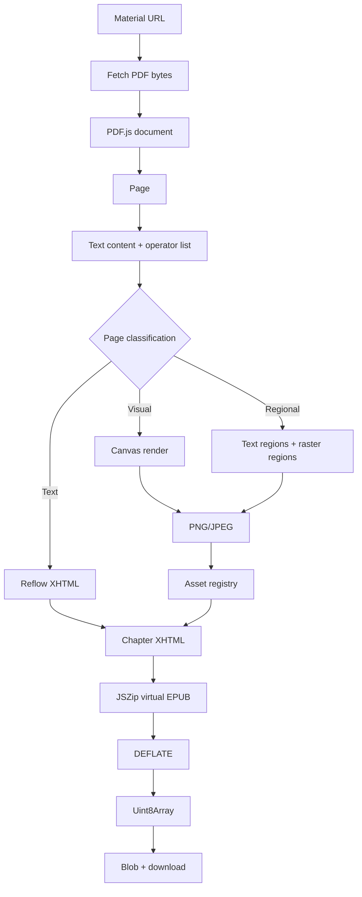

# 09 — Generare PDF, HTML ed EPUB nel browser

## Pipeline, dati binari, trasformazione e memoria

PlumePilot non si limita a leggere la pagina e automatizzare alcuni passaggi. A un certo punto prende dati raccolti dalla piattaforma e li trasforma in **nuovi documenti** che devono essere validi, scaricabili e utilizzabili anche fuori dal browser.

È un cambio di ruolo importante.

Fino ai capitoli precedenti abbiamo visto soprattutto sistemi del tipo:

```text
pagina / API
    ↓
PlumePilot
    ↓
decisione / navigazione / stato
```

Con la generazione dei documenti compare invece una pipeline diversa:

```text
pagina / API
    ↓
raccolta dati e URL
    ↓
normalizzazione
    ↓
trasformazione
    ↓
serializzazione
    ↓
file binario o testuale
    ↓
download locale
```

Questa pipeline esiste in tre forme principali:

```text
Dispense → PDF
Dispense → EPUB
Test      → PDF / HTML offline
```

La cosa interessante è che i tre output risolvono problemi diversi.

- Il **PDF** cerca soprattutto di preservare fedelmente il documento originale.
- L'**HTML offline** trasforma dati strutturati in una piccola applicazione autonoma.
- L'**EPUB** prova a reinterpretare un documento pensato per pagine fisse come un libro digitale adattabile allo schermo.

Il terzo problema è di gran lunga il più difficile.

---

# Parte I — Separare raccolta e generazione

## 1. Due fasi che non devono essere confuse

Quando l'utente chiede di creare le dispense del corso, PlumePilot non genera immediatamente il file.

Prima deve ottenere una rappresentazione del materiale:

```text
corso
  ↓
sezioni
  ↓
capitoli
  ↓
URL delle dispense
  ↓
material[]
```

Solo dopo può partire la fase di costruzione del documento.

Questa separazione è architetturalmente importante.

Possiamo descriverla così:

```text
COLLECTION                         BUILD

Multiversity                      builder page
    ↓                                 ↓
content.js                        pdf-core.js
    ↓                             epub-core.mjs
material descriptors                  ↓
    ↓                             bytes finali
background.js                         ↓
    ↓                              download
builder job
```

Il collector conosce:

- il corso;
- le sezioni;
- l'ordine dei capitoli;
- gli URL delle dispense;
- eventuali errori di raccolta.

Il builder invece dovrebbe preoccuparsi soprattutto di:

- scaricare le risorse;
- trasformarle;
- impaginarle;
- serializzarle;
- produrre il file finale.

### Da backend developer

È simile alla separazione:

```text
query / data acquisition
        ↓
DTO normalizzato
        ↓
report generator
```

Il generatore non dovrebbe avere bisogno di conoscere il DOM della pagina LMS.

---

## 2. Il builder come processo separato

Nel Capitolo 2 avevamo visto che il background salva il payload del job in `chrome.storage.local` e apre una nuova pagina builder passando soltanto un piccolo `jobId` nella URL.

Concettualmente:

```text
background
   │
   ├── storage["pegasoExportJob:abc123"] = payload grande
   │
   └── apre materials-builder.html?job=abc123
                              │
                              ↓
                       builder legge job
```

Questa scelta risolve diversi problemi insieme.

Evita URL enormi.

Evita di serializzare grandi strutture dentro messaggi ripetuti.

Permette al builder di avere una pagina propria con:

- barra di progresso;
- pulsanti PDF / EPUB;
- cancellazione;
- messaggi d'errore;
- lifetime indipendente dal popup.

Il popup può quindi essere chiuso senza distruggere necessariamente il processo di generazione.

---

# Parte II — I mattoni binari del browser

## 3. `ArrayBuffer`, `Uint8Array`, `Blob`

Quando lavoriamo normalmente con JavaScript manipoliamo soprattutto oggetti e stringhe.

Un PDF o un EPUB, però, è una sequenza di byte.

Per questo nel codice compaiono spesso tre concetti:

```text
ArrayBuffer
Uint8Array
Blob
```

Per esempio in `pdf-core.js`:

```js
const bytes = new Uint8Array(await response.arrayBuffer());
```

Possiamo visualizzare il percorso così:

```text
HTTP response
     ↓
ArrayBuffer
     ↓
Uint8Array
     ↓
libreria PDF / EPUB
```

### `ArrayBuffer`

È un blocco di memoria binaria grezza.

Non espone direttamente il concetto di “carattere”, “numero” o “pixel”.

È soltanto memoria.

### `Uint8Array`

È una **view tipizzata** su byte unsigned da 8 bit.

Ogni elemento rappresenta un valore:

```text
0 … 255
```

Questo è particolarmente naturale per file binari, perché il byte è proprio l'unità che vogliamo manipolare.

### `Blob`

`Blob` rappresenta invece un oggetto binario immutabile che il browser può trattare come un file-like object.

Alla fine del processo PlumePilot può fare:

```js
new Blob([bytes], { type: "application/pdf" })
```

oppure:

```js
new Blob([bytes], { type: "application/epub+zip" })
```

Il MIME type comunica al browser che tipo di risorsa stiamo producendo.

---

## 4. Da memoria a download: Object URL

Un `Blob` è un oggetto JavaScript.

Un link `<a>` vuole invece una URL.

Il ponte è:

```js
URL.createObjectURL(blob)
```

Nel builder delle dispense:

```js
function download(bytes, filename, mime) {
  const url = URL.createObjectURL(new Blob([bytes], { type: mime }));
  const anchor = document.createElement("a");
  anchor.href = url;
  anchor.download = filename;
  document.body.appendChild(anchor);
  anchor.click();
  anchor.remove();
  setTimeout(() => URL.revokeObjectURL(url), 5000);
}
```

Il browser crea una URL opaca simile a:

```text
blob:chrome-extension://.../uuid
```

che punta al dato mantenuto dal browser.

Il flusso diventa:

```text
Uint8Array
    ↓
Blob
    ↓
Object URL
    ↓
<a download>
    ↓
file sul computer
```

### Perché `revokeObjectURL()`?

Finché una object URL rimane attiva, il browser deve mantenere accessibile il `Blob` sottostante.

Quindi dopo il download PlumePilot esegue:

```js
URL.revokeObjectURL(url)
```

non immediatamente, ma dopo un piccolo intervallo, così il browser ha tempo di avviare il download.

Questo è un piccolo esempio di gestione del lifetime delle risorse.

---

# Parte III — Generare il PDF delle dispense

## 5. PDF: non convertire, ma comporre

La generazione del PDF completo è concettualmente molto più semplice dell'EPUB.

Le dispense originali sono già PDF.

Quindi non serve reinterpretarne il contenuto.

PlumePilot può fare:

```text
PDF capitolo 1 ─┐
PDF capitolo 2 ─┼──→ PDFDocument finale
PDF capitolo 3 ─┘
```

La funzione principale è:

```js
async function buildCoursePdf(
  courseTitle,
  materials,
  onProgress = () => {},
  fetchImpl = globalThis.fetch,
)
```

in `pdf-core.js`.

La prima operazione è creare il documento destinazione:

```js
const document = await PDFDocument.create();
```

Poi per ogni dispensa:

```js
const response = await fetchImpl(material.url);
const bytes = new Uint8Array(await response.arrayBuffer());
const source = await PDFDocument.load(bytes, {
  ignoreEncryption: true,
  updateMetadata: false,
});
```

Abbiamo quindi due documenti:

```text
source       → PDF della singola dispensa

document     → PDF aggregato che stiamo costruendo
```

---

## 6. Copiare le pagine

Il nucleo della composizione è:

```js
const sourceIndices = source.getPageIndices();
const copiedPages = await document.copyPages(source, sourceIndices);
```

Poi:

```js
for (const copiedPage of copiedPages) {
  const addedPage = document.addPage(copiedPage);
  firstPage ||= addedPage;
}
```

L'algoritmo è quindi quasi letterale:

```text
per ogni PDF:
    scarica
    apri
    copia tutte le pagine
    aggiungile in ordine
```

Questa strategia ha un enorme vantaggio:

> **non stiamo ricostruendo il layout del PDF.**

Formule, grafici, font, tabelle e impaginazione rimangono quelli del documento originale.

Il problema di fedeltà è quindi relativamente piccolo.

---

## 7. Aggiungere struttura a un documento già esistente

PlumePilot non si limita a concatenare pagine.

Durante la copia mantiene:

```js
included.push({
  chapter: material.chapter,
  chapterTitle: material.chapterTitle,
  section: material.section,
  firstPage,
  pageCount: copiedPages.length,
});
```

Il dato interessante è `firstPage`.

Conoscendo la prima pagina di ogni capitolo, possiamo costruire:

- indice interattivo;
- link interni;
- bookmarks / outline del PDF.

Alla fine:

```js
addInteractiveIndex(document, courseTitle, included, regular, bold);
addBookmarks(document, included);
```

Quindi la pipeline è:

```text
PDF originali
     ↓
merge pagine
     ↓
mappa capitolo → prima pagina
     ↓
indice + bookmarks
     ↓
serializzazione
```

---

## 8. Serializzare il PDF

Finché stiamo lavorando con `PDFDocument`, abbiamo un modello JavaScript del documento.

Per ottenere il file vero:

```js
const bytes = await document.save({
  addDefaultPage: false,
  useObjectStreams: true,
});
```

Ora abbiamo:

```text
PDFDocument
    ↓ save()
Uint8Array
```

Il resto è il download via `Blob` visto prima.

---

## 9. Partial success

Una scelta importante è che un singolo PDF difettoso non distrugga necessariamente l'intero export.

Il loop usa:

```js
try {
  ...
  included.push(...);
} catch (error) {
  failures.push(...);
}
```

Alla fine falliamo completamente soltanto se:

```js
if (!included.length) {
  throw new Error(
    "Non è stato possibile scaricare e unire nessuna dispensa.",
  );
}
```

Questo introduce una distinzione molto utile:

```text
failure totale
vs
partial success
```

Se 24 dispense su 25 sono utilizzabili, può essere molto più utile produrre il documento con 24 capitoli e mostrare chiaramente l'errore sul venticinquesimo.

### Da backend developer

È simile a un batch job che accumula:

```text
successes[]
failures[]
```

invece di applicare automaticamente una transazione all-or-nothing a un lavoro dove il risultato parziale ha valore.

---

# Parte IV — Generare il PDF dei test

## 10. Quando non abbiamo PDF da unire

Per i test di autovalutazione la situazione è diversa.

Le domande arrivano come dati strutturati:

```text
chapter
questions[]
    question
    answers[]
    correctPosition
    images[]
```

Non esiste quindi un PDF sorgente da concatenare.

Dobbiamo costruire l'impaginazione.

`test-builder.js` crea un nuovo documento:

```js
const documentPdf = await PDFLib.PDFDocument.create();
```

carica font Unicode locali e poi disegna manualmente:

- titoli;
- domande;
- risposte;
- immagini;
- soluzioni;
- link interni;
- bookmarks;
- numeri di pagina.

Questa è una pipeline più vicina a un **report renderer**.

---

## 11. Text layout: il problema invisibile

Scrivere testo in un PDF non significa semplicemente:

```js
drawText(longString)
```

Bisogna sapere dove termina la riga.

Il builder usa una funzione `wrap()` che misura il testo con il font:

```js
font.widthOfTextAtSize(candidate, size)
```

Concettualmente:

```text
parola successiva
      ↓
la riga supera width?
   ┌───────┴───────┐
  no              sì
   ↓                ↓
aggiungi         chiudi riga
                 nuova riga
```

Anche questo è un algoritmo.

Una UI HTML delega il wrapping al browser.

Un PDF generato programmaticamente spesso richiede di prendere noi stessi decisioni di impaginazione.

---

## 12. Immagini: cache e validazione binaria

Le domande possono contenere immagini.

`test-builder.js` usa:

```js
const imageCache = new Map();
```

La funzione:

```js
loadImageAsset(image)
```

memorizza direttamente la **Promise del download**:

```js
if (imageCache.has(url)) return imageCache.get(url);

const request = (async () => {
  ...
})();

imageCache.set(url, request);
return request;
```

Questo pattern è interessante.

Non stiamo memorizzando solo il risultato.

Stiamo deduplicando anche richieste contemporanee.

Se due domande chiedono la stessa immagine mentre il primo download è ancora in corso:

```text
request A ──────┐
                ├── stessa Promise
request B ──────┘
```

Non partono due `fetch`.

### Validare il contenuto, non soltanto l'estensione

Il builder controlla anche i byte iniziali:

```js
const jpeg =
  bytes[0] === 0xff &&
  bytes[1] === 0xd8 &&
  bytes[2] === 0xff;
```

per JPEG e una signature analoga per PNG.

Quindi non si fida semplicemente di:

```text
image.jpg
```

o del MIME dichiarato dal server.

Questo è un esempio di **content sniffing controllato**.

Il file viene anche limitato a 8 MiB.

La validazione aiuta sia l'affidabilità sia il controllo della memoria.

---

# Parte V — HTML: trasformare i dati in una piccola applicazione

## 13. Il quiz HTML non è un documento statico

Il file HTML generato da PlumePilot contiene:

- markup;
- CSS;
- JavaScript;
- dati dei test;
- immagini;
- stato degli appunti;
- editor;
- filtri;
- logica di verifica.

È quindi più corretto pensarlo come:

> **una web app self-contained distribuita in un singolo file.**

La funzione è:

```js
async function interactiveHtml()
```

---

## 14. Rendere offline le immagini

Se il file HTML contenesse:

```html

```

non sarebbe realmente offline.

Il builder scarica quindi ogni immagine e la trasforma in un Data URL:

```text
https://.../image.png
      ↓ fetch
Uint8Array
      ↓ base64
data:image/png;base64,...
```

Il risultato entra direttamente nel payload del file.

Questo elimina una dipendenza esterna.

### Trade-off

Base64 rende l'HTML autonomo, ma aumenta la dimensione testuale dei dati binari.

In prima approssimazione, codificare 3 byte binari richiede 4 caratteri Base64:

```text
3 byte → 4 caratteri
```

quindi il payload cresce tipicamente di circa un terzo, prima di considerare altri dettagli.

È un classico compromesso:

```text
self-contained
     ↑
     │
size │
     ↓
```

---

## 15. Serializzare dati dentro JavaScript

Il builder costruisce:

```js
const payload = JSON.stringify({
  courseTitle: job.courseTitle,
  annotatedFilename: ...,
  tests,
})
```

poi applica escaping aggiuntivo:

```js
.replace(/</g, "\\u003c")
.replace(/\u2028/g, "\\u2028")
.replace(/\u2029/g, "\\u2029");
```

Perché?

Perché quel JSON verrà inserito dentro un `<script>`.

Dati validi come JSON possono acquisire un significato diverso quando vengono incorporati direttamente in HTML/JavaScript.

È un tema generale:

> **la serializzazione corretta dipende dal contesto nel quale il dato verrà inserito.**

Non esiste un unico escaping universale.

---

## 16. Separare runtime e dati

Il runtime del quiz non viene duplicato manualmente nel builder.

Viene letto da:

```js
const runtimeResponse = await fetch("offline-quiz-runtime.js");
const runtimeSource = await runtimeResponse.text();
```

poi incorporato nel file finale:

```text
HTML template
   +
CSS
   +
DATA JSON
   +
offline-quiz-runtime.js
   ↓
quiz-interattivo.html
```

Questa separazione è molto sana.

Durante lo sviluppo possiamo trattare:

```text
runtime
```

e:

```text
generator
```

come responsabilità diverse.

Soltanto nell'artefatto finale vengono fuse.

---

# Parte VI — EPUB: non un PDF con un'estensione diversa

## 17. Cos'è realmente un EPUB?

Un EPUB è un contenitore ZIP con una struttura e dei contratti precisi.

In forma molto semplificata:

```text
book.epub
│
├── mimetype
│
├── META-INF/
│   └── container.xml
│
└── OEBPS/
    ├── package.opf
    ├── nav.xhtml
    ├── toc.ncx
    ├── styles/
    │   └── book.css
    ├── text/
    │   ├── title.xhtml
    │   ├── chapter-001.xhtml
    │   └── ...
    ├── images/
    │   └── ...
    └── fonts/
        └── ...
```

Questa struttura appare direttamente in `epub-core.mjs`.

Il builder crea:

```js
const zip = new globalThis.JSZip();
```

Poi:

```js
zip.file("mimetype", "application/epub+zip", {
  compression: "STORE",
});
```

La specifica EPUB richiede proprio che il file `mimetype` identifichi il container e non venga compresso.

---

## 18. `container.xml`: trovare il package document

PlumePilot aggiunge:

```text
META-INF/container.xml
```

che punta a:

```text
OEBPS/package.opf
```

Il reading system può così scoprire dove si trova la descrizione principale della pubblicazione.

Possiamo pensarlo come:

```text
EPUB root
   ↓
container.xml
   ↓
package.opf
```

---

## 19. Manifest e spine

Il `package.opf` contiene due concetti molto importanti.

### Manifest

Dice quali risorse appartengono al libro:

```text
chapter XHTML
images
CSS
font
navigation document
```

Nel codice vengono costruite entry simili a:

```xml
<item
  id="chapter-1"
  href="text/chapter-001.xhtml"
  media-type="application/xhtml+xml"
/>
```

### Spine

Definisce invece l'ordine principale di lettura:

```xml
<itemref idref="title"/>
<itemref idref="nav"/>
<itemref idref="chapter-1"/>
<itemref idref="chapter-2"/>
```

Quindi:

```text
manifest = cosa esiste
spine    = in quale ordine si legge
```

È una distinzione molto simile a quella tra:

```text
records
vs
ordered workflow
```

---

## 20. Navigation document e indice

PlumePilot genera anche:

```text
OEBPS/nav.xhtml
```

con l'indice delle sezioni e dei capitoli.

Inoltre mantiene un `toc.ncx`, utile soprattutto per compatibilità con reading system più vecchi.

Ogni capitolo riceve anche:

```html
<a href="../nav.xhtml#toc">Torna all'indice</a>
```

Quindi i link interni non sono un dettaglio decorativo: fanno parte della navigabilità del libro.

---

# Parte VII — Il vero problema: PDF → EPUB

## 21. Fixed layout contro reflow

Qui arriviamo alla difficoltà centrale.

Un PDF descrive principalmente **come una pagina deve apparire**.

Un EPUB reflowable descrive principalmente **contenuto strutturato che il reading system può riimpaginare**.

Sono modelli quasi opposti.

### PDF

```text
pagina 595 × 842

scrivi testo a x=84 y=320
traccia linea da A a B
metti immagine in questo rettangolo```

### EPUB reflowable

```html
<h1>Titolo</h1>
<p>Paragrafo...</p>
<ul>...</ul>
```

Il reader decide:

- dimensione del font;
- larghezza della riga;
- margini;
- paginazione;
- orientamento.

Questo rende l'EPUB molto più comodo su Kindle/e-reader, ma richiede di **ricostruire la semantica** da un formato che potrebbe averla persa.

---

## 22. Estrarre testo non significa ricostruire il documento

PDF.js può fornirci una lista di text items.

Ma una lista come:

```text
"La"
"funzione"
"f(x)"
"è"
"continua"
```

non dice automaticamente:

- quali elementi appartengono allo stesso paragrafo;
- se esistono due colonne;
- se qualcosa è una formula;
- se una linea è il tratto di una frazione;
- se un'immagine è parte essenziale della spiegazione;
- se una tabella ha perso la relazione riga/colonna.

Quindi la conversione non è:

```text
PDF text → HTML
```

ma più correttamente:

```text
operatori PDF
+ text items
+ coordinate
+ immagini
+ vettori
        ↓
classificazione
        ↓
strategia di preservazione
```

---

# Parte VIII — La classificazione delle pagine

## 23. Tre strategie, non una

Il convertitore EPUB di PlumePilot può scegliere tra tre modalità concettuali:

```text
TEXT
VISUAL
REGIONAL / HYBRID
```

Il codice registra infatti:

```js
const record = {
  chapterIndex,
  pageNumber,
  mode: regional?.html
    ? "regional"
    : visual
      ? "visual"
      : "text",
  ...
};
```

### Text

Quando la pagina sembra abbastanza semplice e affidabile:

```text
PDF text items
      ↓
ricostruzione blocchi
      ↓
XHTML reflowable
```

Vantaggi:

- testo selezionabile;
- font adattabile;
- file piccolo;
- accessibilità migliore;
- esperienza naturale da ebook.

### Visual

Quando il contenuto è troppo complesso:

```text
PDF page
   ↓
canvas
   ↓
PNG / JPEG
   ↓

```

Vantaggio:

- massima fedeltà visiva.

Svantaggi:

- testo non realmente reflowable;
- file più grande;
- zoom/leggibilità dipendono dall'immagine;
- accessibilità peggiore.

### Regional

È il compromesso più interessante.

La pagina può essere suddivisa in regioni:

```text
┌─────────────────────────┐
│ testo reflowable        │
│                         │
├─────────────────────────┤
│ formula / diagramma     │ ← immagine
├─────────────────────────┤
│ testo reflowable        │
└─────────────────────────┘
```

In questo modo non dobbiamo scegliere tra:

```text
tutto testo
```

e:

```text
tutta immagine
```

---

## 24. `pageNeedsVisual()` come classificatore

Prima di convertire una pagina, PlumePilot esegue:

```js
const classification = await pageNeedsVisual(page, content);
```

La funzione considera indizi come:

- immagini significative;
- vettori;
- testo ruotato;
- colonne parallele;
- tabelle;
- pattern sospetti;
- formule;
- testo non ricostruibile in modo sicuro.

Questa è una forma di **classification heuristic**.

Non stiamo cercando di dimostrare matematicamente che la pagina sia convertibile.

Stiamo decidendo quale strategia minimizza il rischio di perdita informativa.

---

## 25. Verifica dopo la conversione

Anche se il classificatore iniziale decide “text”, PlumePilot non si fida completamente.

Dopo:

```js
converted = textPageToHtml(...);
```

controlla:

```js
visual = textConversionLooksIncomplete(converted);
```

Quindi abbiamo:

```text
pre-check
   ↓
conversione
   ↓
post-check
```

È lo stesso pattern di progressive refinement già incontrato nel Capitolo 8.

Una previsione iniziale può essere economica.

Il risultato concreto viene poi verificato.

---

## 26. Formule: perché sono difficili

Una formula PDF può essere rappresentata in molti modi:

```text
caratteri Unicode
font matematici speciali
singoli glyph
linee vettoriali
immagini
combinazioni dei precedenti
```

La formula visiva:

```text
 a + b
───────
   c
```

potrebbe non esistere nel PDF come stringa semantica equivalente.

La linea della frazione potrebbe essere semplicemente un'operazione vettoriale.

Per questo il codice cerca anche casi come:

```js
hasSimpleFractionRule(...)
```

oppure caratteri matematici non supportati.

Quando il rischio è alto, preservare una regione come immagine può essere più corretto che produrre testo formalmente selezionabile ma semanticamente sbagliato.

Questo introduce una regola importante:

> **La selezionabilità non vale più della correttezza del contenuto.**

---

# Parte IX — Canvas come rasterizer

## 27. Dal PDF ai pixel

Quando è necessario preservare visivamente una pagina, PDF.js la renderizza in un `<canvas>`.

Il flusso è:

```text
PDF page
    ↓
PDF.js render task
    ↓
CanvasRenderingContext2D
    ↓
pixel RGBA
```

Il codice usa:

```js
const task = page.render({
  canvasContext: context,
  viewport,
  intent: "print",
});
```

Il canvas è quindi una superficie temporanea di rendering.

---

## 28. Da canvas a immagine

Dopo il rendering dobbiamo trasformare i pixel in un formato inseribile nell'EPUB.

`encodeCanvas()` sceglie PNG o JPEG e chiama:

```js
canvas.toBlob(...)
```

poi:

```js
new Uint8Array(await blob.arrayBuffer())
```

Abbiamo quindi:

```text
canvas pixels
     ↓
toBlob()
     ↓
PNG/JPEG Blob
     ↓
ArrayBuffer
     ↓
Uint8Array
     ↓
asset EPUB
```

---

## 29. PNG o JPEG?

Non esiste un formato migliore in assoluto.

Per materiale simile a una fotografia, JPEG può offrire una compressione molto più efficiente.

Per:

- testo rasterizzato;
- diagrammi;
- linee nette;
- grafica con pochi colori;

PNG può preservare meglio i dettagli.

`chooseCanvasFormat()` campiona il contenuto per decidere quale strategia usare.

È un altro esempio di decisione adattiva basata sui dati.

---

# Parte X — La memoria come vincolo architetturale

## 30. Perché un EPUB può consumare molta RAM

La dimensione finale del file non coincide con la memoria necessaria a costruirlo.

Supponiamo una pagina rasterizzata a:

```text
2000 × 2800 pixel
```

Un canvas RGBA non compresso richiede approssimativamente:

```text
2000 × 2800 × 4 byte
= 22.400.000 byte
≈ 21,4 MiB
```

anche se il PNG finale potrebbe occupare soltanto pochi megabyte.

Durante la conversione possono esistere contemporaneamente:

```text
PDF bytes
PDF.js structures
text items
operator list
canvas RGBA
encoded image bytes
JSZip entries
final ZIP buffer
```

Quindi:

> **file finale da 80 MB non significa picco di RAM da 80 MB.**

Il working set può essere molto più grande.

---

## 31. Peak memory, non solo total allocation

Per un'app nel browser la domanda importante non è soltanto:

> Quanti byte allochiamo in totale?

ma:

> Quanti byte rimangono vivi contemporaneamente nel momento peggiore?

Questa è la **peak memory**.

Possiamo immaginare due algoritmi.

### Strategia A

```text
carica 100 pagine
renderizza 100 canvas
mantieni tutto
crea ZIP
```

Picco enorme.

### Strategia B

```text
carica capitolo
  pagina 1 → converti → rilascia
  pagina 2 → converti → rilascia
  ...
ripulisci PDF
capitolo successivo
```

Il lavoro totale può essere simile, ma il numero di oggetti vivi nello stesso momento è molto più piccolo.

PlumePilot cerca di seguire la seconda filosofia.

---

## 32. `page.cleanup()`

Alla fine di ogni pagina troviamo:

```js
finally {
  page.cleanup();
}
```

È importante che sia in `finally`.

Anche se la conversione fallisce, vogliamo chiedere a PDF.js di liberare le risorse associate alla pagina.

```text
success ─┐
         ├──→ cleanup
error ───┘
```

Questo è esattamente il concetto di resource lifetime visto nel Capitolo 5.

---

## 33. Ridurre il canvas a `1 × 1`

In più punti il codice termina con:

```js
canvas.width = 1;
canvas.height = 1;
```

Perché?

Un canvas può mantenere un backing buffer molto grande.

Ridimensionarlo forza il browser a sostituire quella superficie con una quasi vuota.

Concettualmente:

```text
canvas 2000 × 2800
      ↓
non serve più
      ↓
canvas 1 × 1
```

Non è una chiamata diretta al garbage collector.

JavaScript non ci permette di dire:

```js
free(canvasMemory);
```

Ma possiamo eliminare i riferimenti e ridurre le risorse native che l'oggetto trattiene.

---

## 34. Distruggere il PDF.js document

Alla fine di `convertMaterial()`:

```js
if (pdf) {
  await pdf.destroy().catch(() => {});
} else if (loadingTask) {
  await loadingTask.destroy().catch(() => {});
}
```

Questo è essenziale perché PDF.js può mantenere:

- cache;
- worker state;
- font;
- operator data;
- pagine;
- stream.

Il lifetime ideale è quindi:

```text
convertMaterial(chapter)
    ↓
PDFDocumentProxy vivo
    ↓
converti tutte le pagine
    ↓
destroy()
    ↓
capitolo successivo
```

---

## 35. Yield al browser

Dopo ogni pagina:

```js
await yieldToBrowser(signal);
```

Questo non riduce necessariamente la quantità totale di lavoro.

Serve però a evitare una lunga sequenza completamente monopolizzante sul main thread.

Permette al browser di:

- aggiornare la UI;
- processare eventi;
- reagire alla cancellazione;
- rendere più fluida la progress bar.

Questa è una forma di **cooperative scheduling**.

---

# Parte XI — Deduplicare gli asset

## 36. Lo stesso contenuto può apparire più volte

Una conversione visuale può produrre immagini identiche in più punti.

Se salviamo sempre tutto:

```text
image A → 1 MB
image A → 1 MB
image A → 1 MB
```

avremo 3 MB anche se il contenuto è identico.

`epub-assets.mjs` introduce un registro:

```js
const byHash = new Map();
```

---

## 37. Content-addressable deduplication

Per ogni immagine viene calcolato:

```js
const digest = new Uint8Array(
  await crypto.subtle.digest("SHA-256", image.bytes)
);
```

poi una chiave:

```js
const key = `${image.mediaType}:${extension}:${hash}`;
```

Quindi:

```text
bytes immagine
     ↓ SHA-256
hash
     ↓
Map lookup
  ┌──┴───┐
 hit    miss
  │       │
reuse   zip.file()
```

Questa è una forma di **content-addressable storage** in miniatura.

L'identità non dipende dal nome originale del file.

Dipende dal contenuto.

---

## 38. Perché non conservare due copie dei byte?

Il commento in `epub-assets.mjs` è molto istruttivo:

```js
// Export-scoped: hold only metadata here. JSZip owns unique encoded buffers.
```

La `Map` conserva quindi principalmente metadata:

```js
{
  name,
  mediaType,
  size,
}
```

I byte unici vengono passati a JSZip.

Dopo la registrazione, `epub-core.mjs` fa anche:

```js
image.bytes = null;
```

per le immagini già affidate al registry.

Questo è un punto importante:

> **Deduplicare il file finale è utile; evitare duplicazioni nel working set è ancora più importante per la RAM.**

---

# Parte XII — Packaging e compressione

## 39. JSZip come in-memory build system

Man mano che convertiamo i capitoli, aggiungiamo risorse:

```js
zip.file(...)
```

Possiamo pensare `JSZip` come un piccolo filesystem virtuale:

```text
zip
├── mimetype
├── META-INF/container.xml
└── OEBPS/...
```

Alla fine quel filesystem virtuale viene serializzato:

```js
const bytes = await zip.generateAsync({
  type: "uint8array",
  compression: "DEFLATE",
  compressionOptions: { level: 6 },
});
```

Il risultato è un singolo `Uint8Array`.

---

## 40. La fase più difficile da cancellare

Subito prima della compressione PlumePilot invia:

```js
cancellable: false
```

per disabilitare il pulsante di cancellazione.

Perché?

Fino a quel punto il codice controlla regolarmente:

```js
throwIfAborted(signal);
```

oppure usa operazioni cancellabili.

Durante `JSZip.generateAsync()` invece non abbiamo lo stesso livello di controllo sul lavoro interno già avviato.

Quindi il contratto UI diventa onesto:

```text
conversione → cancellabile
compressione finale → finalizzazione, attendere
```

Un'interfaccia corretta non dovrebbe mostrare una capacità di cancellazione che il sottosistema non può realmente garantire.

---

# Parte XIII — Cancellation end-to-end

## 41. `AbortController` nel builder

Quando l'utente crea un EPUB:

```js
buildController = new AbortController();
```

Il signal viene passato a:

```js
buildCourseEpub(..., {
  signal: buildController.signal,
});
```

Il pulsante Annulla esegue:

```js
buildController.abort();
```

Il signal quindi attraversa l'intera pipeline.

---

## 42. Cancellare un download

`fetchPdfWithRetry()` crea un controller locale per ogni tentativo:

```js
const controller = new AbortController();
```

e collega l'abort esterno:

```js
const cancel = () => controller.abort();
signal?.addEventListener("abort", cancel, { once: true });
```

Questo permette di combinare due cause di cancellazione:

```text
utente preme Annulla
        │
        ├────────────┐
        │            ↓
        │         fetch abort
        │
        └────→ pipeline abort

oppure

timeout download
        ↓
controller locale abort
```

L'abort dell'utente e il timeout non sono la stessa cosa, anche se entrambi possono interrompere `fetch`.

---

## 43. Cancellare PDF.js

Anche il rendering deve reagire.

`renderPage()` registra:

```js
const cancel = () => task.cancel();
signal?.addEventListener("abort", cancel, { once: true });
```

In `convertMaterial()` viene inoltre distrutto il documento attivo.

Quindi la cancellazione non è solo:

```text
set cancelled = true
```

ma si propaga verso risorse effettivamente costose.

Questa è una **cancellation pipeline**.

---

# Parte XIV — Retry e resilienza

## 44. Retry selettivo

Il download PDF usa:

```js
const PDF_DOWNLOAD_RETRY_DELAYS_MS = [1000, 2500];
```

Ma non tutti gli errori vengono ritentati.

Il codice distingue errori client:

```js
status >= 400 && status < 500
```

tranne casi transitori come:

```text
408 Request Timeout
429 Too Many Requests
```

Per un 404, riprovare due secondi dopo probabilmente non serve.

Per timeout, rete instabile o 429 può invece avere senso.

Questa è la stessa idea del Capitolo 4:

> **retry non significa ripetere indiscriminatamente.**

---

## 45. Invalidare i link falliti

Se la generazione scopre che una URL di dispensa salvata in cache non funziona, il builder rimanda l'informazione alla pagina del corso:

```js
PEGASO_INVALIDATE_MATERIAL_CACHE
```

con i `cacheKeys` falliti.

Questo crea un loop di feedback interessante:

```text
collector
   ↓
cache URL
   ↓
builder prova URL
   ↓
fallisce
   ↓
invalidate cache
```

Il consumer della cache contribuisce quindi a correggere la cache stessa.

---

# Parte XV — Il problema dei riferimenti e dell'ownership

## 46. Garbage collection non significa gestione automatica perfetta

JavaScript ha garbage collection.

Ma questo non significa:

> “Possiamo ignorare completamente la memoria.”

Il garbage collector può eliminare un oggetto soltanto quando non è più raggiungibile.

Se conserviamo riferimenti dentro:

- `Map`;
- array;
- closure;
- JSZip;
- event listener;
- object URL;

quell'oggetto può rimanere vivo.

Inoltre alcune API browser gestiscono risorse native la cui vita non coincide perfettamente con il semplice oggetto JavaScript.

Per questo PlumePilot usa azioni esplicite come:

```text
page.cleanup()
pdf.destroy()
canvas.width = 1
image.bytes = null
URL.revokeObjectURL()
removeEventListener()
```

Il principio generale è:

> **La garbage collection gestisce la memoria irraggiungibile; l'architettura deve evitare di trattenere inutilmente ciò che non serve più.**

---

## 47. Ownership

Una domanda utilissima nella programmazione con dati grandi è:

> Chi possiede questi byte adesso?

Per esempio nella deduplicazione immagini:

```text
renderRegionalPage
      ↓
image.bytes
      ↓
assetRegistry.register()
      ↓
JSZip possiede l'unica copia necessaria
      ↓
image.bytes = null
```

Pensare in termini di ownership aiuta anche in JavaScript, nonostante non abbia un borrow checker come Rust.

---

# Parte XVI — Tre pipeline a confronto

## 48. PDF, HTML, EPUB

| Caratteristica | PDF dispense | HTML quiz | EPUB dispense |
|---|---|---|---|
| Input principale | PDF originali | JSON strutturato | PDF originali |
| Trasformazione | copia pagine | rendering web | interpretazione PDF |
| Fedeltà visuale | molto alta | nativa HTML | adattiva |
| Reflow | no | sì | sì / ibrido |
| Interattività | limitata | alta | dipende dal reader |
| Offline | sì | sì | sì |
| Complessità conversione | relativamente bassa | media | alta |
| Pressione memoria | media | bassa/media | alta |
| Asset binari | PDF | immagini inline | immagini/font nel ZIP |

La stessa parola “export” nasconde quindi tre architetture differenti.

---

## 49. Lossless vs lossy transformation

Il PDF aggregato è vicino a una trasformazione **lossless** dal punto di vista del contenuto visivo:

```text
PDF → copia pagine → PDF
```

L'EPUB è inevitabilmente più vicino a una trasformazione potenzialmente **lossy**:

```text
PDF visual layout
      ↓ interpretazione
semantic XHTML
```

Per questo il sistema usa fallback visuali.

In pratica cerca di ottimizzare due obiettivi in tensione:

```text
reflowability
     ↑
     │
     │ trade-off
     │
     ↓
fidelity
```

La modalità regionale cerca un punto intermedio.

---
# Parte XVII — Pipeline come grafo di trasformazione

## 50. Pensare in termini di stage

Una rappresentazione utile dell'EPUB è:



Questo assomiglia più a un compiler pipeline che a una normale funzione UI.

Ogni stage:

- accetta una rappresentazione;
- produce una rappresentazione differente;
- può fallire;
- può avere costi di memoria differenti.

---

## 51. Intermediate Representation

Nel mondo dei compilatori si parla spesso di **IR — Intermediate Representation**.

Anche qui possiamo riconoscere qualcosa di simile.

Per esempio:

```text
PDF operators
      ↓
classification
      ↓
converted.html + images[]
      ↓
EPUB chapter XHTML + assets
```

`converted` funziona di fatto come una rappresentazione intermedia indipendente dal PDF originale e non ancora completamente impacchettata nell'EPUB.

Questo suggerisce una lezione architetturale:

> **Quando una trasformazione complessa cresce, rendere esplicite le rappresentazioni intermedie aiuta testabilità e separazione delle responsabilità.**

---

# Parte XVIII — Osservabilità e diagnostica

## 52. Progress non è solo UX

Il builder riceve callback del tipo:

```js
onProgress({
  completed,
  total,
  percent,
  message,
  details,
});
```

A prima vista sembra una semplice barra di progresso.

Ma rende visibili anche gli stage della pipeline:

```text
download
conversione
pagina X di Y
compressione
```

Questo migliora il debugging.

Se l'utente segnala:

> “Si blocca sempre alla pagina 42 della dispensa 7”

abbiamo un'informazione molto più utile di:

```text
Creazione in corso...
```

---

## 53. Diagnostics strutturati

`epub-core.mjs` accetta anche un oggetto `diagnostics`.

Può registrarvi informazioni come:

```text
mode della pagina
reason della classificazione
imageCount
imageBytes
mathFontBytes
epubBytes
elapsedMs
```

Questo è un buon esempio di **instrumentation separata dal comportamento principale**.

La conversione non deve cambiare risultato perché stiamo raccogliendo diagnostica.

---

# Parte XIX — Cosa potrebbe evolvere in futuro?

## 54. Streaming

L'implementazione attuale costruisce l'EPUB in memoria attraverso JSZip e alla fine produce un unico `Uint8Array`.

Per documenti molto grandi una possibile evoluzione sarebbe una pipeline più streaming-oriented:

```text
input chapter
    ↓
convert
    ↓
append archive
    ↓
rilascia intermedi
```

con un writer capace di non mantenere l'intero archivio in memoria.

Ma questa evoluzione comporterebbe maggiore complessità e dipenderebbe dalle API/librerie disponibili nel browser.

Non è automaticamente una scelta migliore per i casi normali.

---

## 55. Worker dedicati

Alcune trasformazioni costose potrebbero teoricamente essere spostate fuori dal main thread.

Per esempio:

```text
builder UI
    ↓ message
Web Worker
    ↓
conversion / encode
```

Ma non tutto è trasferibile facilmente:

- DOM e canvas tradizionale appartengono al main thread;
- librerie terze possono avere vincoli propri;
- trasferire grandi buffer ha costi e richiede progettazione;
- debugging e cross-browser diventano più complessi.

Quindi “mettiamolo in un worker” non è una soluzione gratuita.

---

## 56. Backpressure

Se una pipeline produce dati più velocemente di quanto lo stage successivo riesca a consumarli, può accumulare memoria.

Questo problema si chiama **backpressure**.

Esempio teorico sbagliato:

```text
renderizza 200 pagine velocemente
        ↓
images[] cresce
        ↓
ZIP le processa più lentamente
```

Una pipeline sequenziale per pagina/capitolo riduce naturalmente questo rischio.

È uno dei motivi per cui la concorrenza massima non è sempre la strategia più veloce o sicura.

---

# Parte XX — Error model

## 57. Gli errori non sono tutti uguali

Nella generazione documenti incontriamo almeno queste categorie:

```text
network error
HTTP error
invalid PDF
empty PDF
unsupported image
conversion uncertainty
render failure
timeout
user cancellation
archive failure
```

Questi errori richiedono comportamenti diversi.

### Retry

Per problemi potenzialmente temporanei.

### Fallback

Per contenuti che non possiamo convertire semanticamente ma possiamo preservare visualmente.

### Skip + report

Per un singolo capitolo non utilizzabile quando il resto dell'export ha ancora valore.

### Abort totale

Quando:

- l'utente annulla;
- nessun capitolo può essere prodotto;
- l'integrità dell'artefatto finale non è garantibile.

Questa tassonomia evita un gigantesco:

```js
catch (error) {
  alert("Errore");
}
```

che perderebbe informazioni fondamentali.

---

# Parte XXI — Da backend developer

## 58. Document generation come ETL

Una buona analogia backend è una pipeline ETL:

```text
Extract
  ↓
Transform
  ↓
Load
```

Per PlumePilot:

```text
Extract
→ URL / API / PDF bytes

Transform
→ pages / XHTML / images / metadata

Load
→ PDFDocument o ZIP EPUB
```

Ma c'è una differenza significativa.

In un server backend possiamo spesso contare su:

- molta più RAM;
- filesystem temporaneo;
- processi separati;
- code di job;
- streaming più flessibile.

Nel browser il runtime è più limitato e condivide risorse con la UI dell'utente.

Per questo la gestione del working set diventa una parte visibile dell'architettura.

---

# Parte XXII — Testabilità

## 59. Le pure functions sono preziose

`epub-core.mjs` esporta una serie di helper sotto:

```js
export const __testing = {
  cleanExtractedText,
  chapterLabelFor,
  estimateBodySize,
  ...
  pageNeedsVisual,
  textConversionLooksIncomplete,
  textPageToHtml,
  ...
};
```

Questo permette di testare separatamente decisioni come:

```text
questa pagina deve diventare visuale?
questa sequenza di text items forma colonne?
questo testo è sospetto?
```

senza dover generare ogni volta un EPUB completo.

È un pattern molto utile:

```text
I/O esterno
   ↓
funzioni pure / quasi pure
   ↓
I/O finale
```

Più logica riusciamo a spostare nella parte centrale testabile, più semplice diventa ragionare sul sistema.

---

## 60. Golden files

Per document generation, un'altra strategia utile è usare **golden files**.

Per esempio:

```text
input fixture PDF
      ↓
conversione
      ↓
output atteso
```

Si può confrontare:

- struttura ZIP;
- manifest;
- numero di capitoli;
- modalità di ogni pagina;
- presenza di immagini;
- link;
- testo estratto;
- dimensioni entro range ragionevoli.

Non sempre conviene confrontare byte-per-byte il file finale, perché UUID, timestamp o compressione possono cambiare.

Spesso è più robusto confrontare la **semantica dell'artefatto**.

---

# Parte XXIII — Esercizi mentali

## 61. Esercizio 1 — Calcolare il working set

Immagina tre canvas da:

```text
1800 × 2400
```

con buffer RGBA.

Quanto spazio occupano contemporaneamente?

Formula:

```text
width × height × 4 × canvasCount
```

Il punto non è soltanto ottenere il numero.

Chiediti poi:

> Possiamo evitare che i tre canvas siano vivi nello stesso momento?

---

## 62. Esercizio 2 — HTML offline

Immagina un quiz con 100 immagini da 500 KiB.

Se le inseriamo tutte come Base64:

- quanto può crescere approssimativamente il payload?
- conviene ancora un unico HTML?
- quando avrebbe più senso un ZIP con file separati?

Non esiste una soglia universale.

È una decisione di prodotto oltre che tecnica.

---

## 63. Esercizio 3 — Fidelity policy

Considera tre pagine:

```text
A. solo paragrafi
B. testo + formula complessa
C. slide quasi interamente grafica
```

Quale strategia sceglieresti?

Probabilmente:

```text
A → text
B → regional
C → visual
```

Ora chiediti:

> Quali segnali osservabili useresti per prendere automaticamente questa decisione?

È esattamente il problema affrontato da `pageNeedsVisual()`.

---

## 64. Esercizio 4 — Partial success

Un corso ha 30 dispense.

La numero 17 restituisce HTTP 404.

Quale comportamento preferisci?

```text
A. fallire tutto
B. creare 29 capitoli e segnalare il 17
C. ritentare per sempre
D. sostituire il capitolo con una pagina vuota senza avvisare
```

Per il dominio di PlumePilot, B è generalmente il comportamento più utile.

Ma non sarebbe necessariamente vero per, ad esempio, una firma digitale o un database transaction log.

---

# Parte XXIV — Concetti da portarsi dietro

## 65. Le lezioni principali

### 1. Un export è una pipeline

Non è una singola funzione che “crea un file”.

```text
raccolta → normalizzazione → trasformazione → packaging → download
```

### 2. La rappresentazione dei dati cambia lungo la pipeline

```text
URL
→ Response
→ ArrayBuffer
→ Uint8Array
→ PDF model / canvas / XHTML
→ archive
→ Blob
```

### 3. PDF ed EPUB risolvono problemi differenti

PDF privilegia la geometria.

EPUB reflowable privilegia struttura e adattabilità.

Convertire tra i due richiede interpretazione.

### 4. Il fallback visuale protegge la correttezza

Quando la conversione semantica diventa incerta, un'immagine può essere più fedele di testo ricostruito male.

### 5. La memoria dipende dagli oggetti vivi contemporaneamente

La dimensione finale del file è soltanto una parte del problema.

### 6. Cleanup e ownership contano anche in JavaScript

Garbage collection non elimina la necessità di gestire lifetime, listener, object URL, canvas e risorse di librerie native/wasm/worker.

### 7. Deduplicazione per contenuto può ridurre sia file che working set

Un hash può identificare asset realmente uguali indipendentemente dal nome.

### 8. Cancellation deve attraversare la pipeline

Un pulsante Annulla è utile soltanto se gli stage costosi ricevono e rispettano il segnale.

### 9. Partial success è una decisione di dominio

Non tutti i batch devono essere atomici.

### 10. Le trasformazioni complesse beneficiano di representation boundaries

Più il sistema cresce, più conviene esplicitare gli stage e le strutture intermedie.

---

# Parte XXV — Glossario del capitolo

Termini importanti introdotti o approfonditi:

- `ArrayBuffer`
- `Uint8Array`
- `Blob`
- Object URL
- MIME type
- serialization
- rasterization
- reflow
- fixed layout
- lossless / lossy transformation
- intermediate representation
- content-addressable storage
- deduplication
- working set
- peak memory
- ownership
- backpressure
- cooperative scheduling
- partial success
- golden file

---

# Parte XXVI — Approfondimenti

## Standard e API Web

- MDN — File API  
  https://developer.mozilla.org/en-US/docs/Web/API/File_API

- MDN — Blob URLs  
  https://developer.mozilla.org/en-US/docs/Web/URI/Reference/Schemes/blob

- MDN — `URL.revokeObjectURL()`  
  https://developer.mozilla.org/en-US/docs/Web/API/URL/revokeObjectURL_static

- MDN — `Uint8Array`  
  https://developer.mozilla.org/en-US/docs/Web/JavaScript/Reference/Global_Objects/Uint8Array

- MDN — `HTMLCanvasElement.toBlob()`  
  https://developer.mozilla.org/en-US/docs/Web/API/HTMLCanvasElement/toBlob

- MDN — `AbortController`  
  https://developer.mozilla.org/en-US/docs/Web/API/AbortController

## EPUB

- W3C — EPUB 3.3  
  https://www.w3.org/TR/epub-33/

- W3C — EPUB 3 Overview  
  https://www.w3.org/TR/epub-overview-33/

## Librerie usate nel progetto

- PDF.js  
  https://mozilla.github.io/pdf.js/

- pdf-lib  
  https://pdf-lib.js.org/

- JSZip  
  https://stuk.github.io/jszip/

---

# Verso il Capitolo 10

Il quiz HTML ci ha mostrato qualcosa di nuovo.

Non stiamo più soltanto generando un file.

Stiamo generando una **applicazione modificabile dall'utente**.

Dentro quella piccola applicazione PlumePilot deve gestire:

- cursore;
- selezione del testo;
- formattazione;
- liste;
- checklist;
- callout;
- colori;
- stato delle domande;
- salvataggio degli appunti.

Questo ci porta direttamente al prossimo problema:

> **Come si costruisce un piccolo rich-text editor usando il DOM del browser senza affidarsi a un framework o a un editor già pronto?**

È il tema del **Capitolo 10 — Selection, Range, liste e callout**.

---

[← 08 — Prima attività incompleta](08-prima-attivita-incompleta.md) · [Indice](index.md) · [10 — Rich-text editor →](10-rich-text-editor.md)
