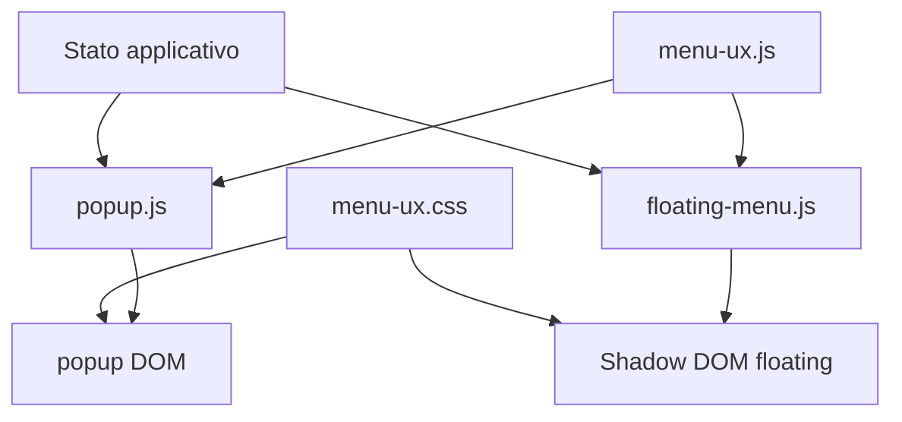
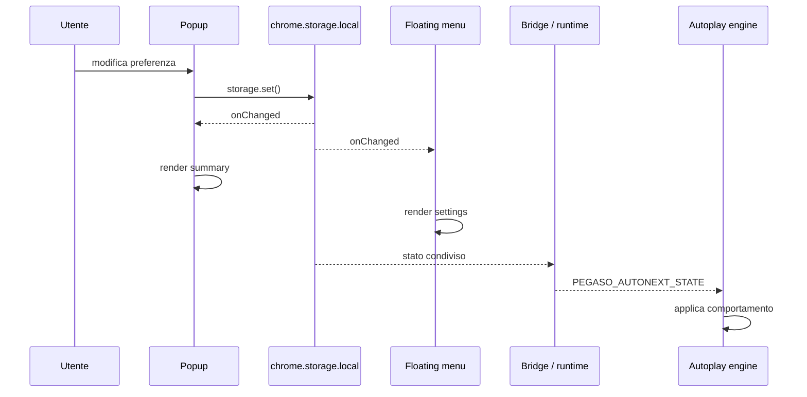

# 11 — UI senza framework

## Popup, menu fluttuante e sincronizzazione

> **Snapshot di riferimento del capitolo**  
> Da questo capitolo il libro passa dal `main` 2.35.1 usato nei Capitoli 1–10 al candidato **2.35.2**, branch `feat/ui-ux-2.35.2`, commit `4d32a8c2a6cd291e4fe389bdf10fdbaf1856a8c2`.  
> Il manifest del branch mostra ancora `2.35.1`: è intenzionale, perché il bump di versione viene lasciato alla fase finale di release.

Nei capitoli precedenti abbiamo parlato soprattutto del motore di PlumePilot:

- messaging;
- DOM dinamico;
- API;
- asincronia;
- cache;
- autoplay;
- export;
- editor HTML.

Ora arriviamo alla parte che l'utente vede direttamente.

PlumePilot possiede due interfacce principali:

```text
popup della toolbar
        +
menu fluttuante nella pagina LMS
```

Per molto tempo queste due superfici sono cresciute in parallelo.

È una dinamica comune nei progetti reali.

Una funzione nasce nel popup.

Poi viene richiesta anche nel menu fluttuante.

Poi una preferenza appare in entrambi.

Poi un pulsante cambia nome in uno ma non nell'altro.

Poi le dimensioni dei font divergono.

Poi le categorie non corrispondono più.

Alla fine l'utente non vede due viste dello stesso prodotto.

Vede due prodotti simili che deve imparare separatamente.

La 2.35.2 nasce esattamente da questo problema.

Il refactor non introduce React, Vue, Svelte o un'altra libreria UI.

Introduce invece qualcosa di più interessante dal punto di vista didattico:

> **una piccola architettura di presentazione costruita con DOM, CSS, storage e funzioni JavaScript pure.**

Il risultato ci permette di studiare molti concetti normalmente nascosti dietro un framework:

- source of truth;
- derived state;
- rendering;
- sincronizzazione reattiva;
- view model;
- progressive disclosure;
- focus management;
- accessibilità;
- Shadow DOM;
- design token;
- personalizzazione persistente;
- invarianti di UI;
- separation of concerns.

E soprattutto possiamo rispondere a una domanda molto utile:

> **Cosa fa davvero un framework UI per noi, quando decidiamo di non usarne uno?**

---

# Parte I — Due interfacce, uno stesso prodotto

## 1. Il problema non è duplicare HTML

È facile pensare che il problema della vecchia UI fosse semplicemente:

```text
abbiamo scritto due volte gli stessi pulsanti
```

Ma la duplicazione visiva è solo il sintomo.

Il problema architetturale è più profondo.

Popup e floating menu rappresentano lo stesso **stato di dominio**:

```text
autoplay enabled?
stop ai test?
completamento automatico?
limite capitoli?
stop al 70%?
operazione lunga attiva?
menu layout personalizzato?
tema?
stile Gaming?
```

ma lo rappresentano dentro due runtime diversi.

### Popup

Il popup è una normale pagina dell'estensione:

```text
popup.html
popup.css
popup.js
```

nasce quando l'utente apre l'icona della toolbar e può essere distrutto appena il popup si chiude.

### Floating menu

Il menu fluttuante vive invece dentro la pagina LMS:

```text
floating-menu.js
        ↓
content script ISOLATED
        ↓
crea host DOM
        ↓
closed ShadowRoot
        ↓
menu dentro la pagina
```

È quindi più persistente e deve convivere con:

- CSS della piattaforma;
- layout della pagina;
- navigazione LMS;
- MutationObserver;
- visibilità della scheda;
- viewport;
- drag del launcher.

Non sono lo stesso contesto.

Per questo il refactor **non tenta di avere un unico DOM condiviso**.

Questa distinzione è fondamentale.

---

## 2. Condividere il modello, non necessariamente il componente

La soluzione adottata introduce:

```text
menu-ux.js
menu-ux.css
```

`menu-ux.js` contiene funzioni condivise come:

```js
PlumePilotMenuUx = {
  autoplayPresentation,
  bindCourseNavigation,
  bindExpansionScroll,
  ensureGamingFont,
  applyActionLayout,
  bindLayoutEditor,
};
```

Riferimento:

```text
menu-ux.js:269–270
```

Ma il commento più importante è quasi all'inizio del file:

```js
// Presentation only: both menus keep their existing storage and operation owners.
```

Riferimento:

```text
menu-ux.js:24
```

Questa riga definisce l'architettura.

Il modulo condiviso **non diventa proprietario dello stato applicativo**.

Non gestisce:

```text
chrome.storage.local
operazioni in background
messaggi runtime
commissione
progresso corso
autoplay engine
```

Gestisce invece come certi dati vengono **presentati**.

Possiamo rappresentarlo così:



Questa è una forma leggera di **presentation layer**.

---

# Parte II — Stato, view model e rendering

## 3. Il browser non ci obbliga a usare un framework

Quando usiamo React, potremmo scrivere qualcosa come:

```text
state
 ↓
component(state)
 ↓
virtual DOM
 ↓
DOM
```

In PlumePilot il flusso è più esplicito:

```text
storage / runtime / page state
             ↓
          controller
             ↓
      renderSomething()
             ↓
       proprietà DOM
```

Per esempio nel floating menu:

```js
function renderSettings() {
  ...
  ui.autoplaySkipCompletedVideos.checked =
    settings.autoplaySkipCompletedVideos === true;
  ...
}
```

Riferimento:

```text
floating-menu.js:1079+
```

Mentre il popup esegue una lettura iniziale da storage:

```js
chrome.storage.local.get(
  {
    enabled: true,
    stopAtTests: false,
    autoCompleteTests: false,
    ...
  },
  (result) => {
    checkbox.checked = result.enabled;
    ...
  },
);
```

Riferimento:

```text
popup.js:1267–1334
```

Non esiste un reconciler automatico.

Siamo noi a decidere:

```text
quale cambiamento richiede quale render
```

---

## 4. Stato persistente e stato di presentazione non sono la stessa cosa

Un errore comune sarebbe memorizzare direttamente una stringa tipo:

```text
"Solo video da completare · Test ignorati · Stop al 70%"
```

Ma quella stringa non è lo stato.

È una **proiezione** dello stato.

La sorgente reale può essere:

```js
{
  autoplaySkipCompletedVideos: true,
  stopAtTests: true,
  autoCompleteTests: false,
  autoplayChapterLimitEnabled: true,
  autoplayStopAt70Enabled: true,
}
```

Da questo otteniamo una rappresentazione leggibile.

La 2.35.2 formalizza questa idea con:

```js
function autoplayPresentation({
  skipCompleted = false,
  testBehavior = "ignore",
  limitEnabled = false,
  limit = 1,
  stopAt70 = false,
  thresholdBypassed = false,
} = {}) {
  ...
}
```

Riferimento:

```text
menu-ux.js:25–42
```

La funzione restituisce:

```js
{
  summary,
  testOverride,
  stopHint,
}
```

Questa struttura è un piccolo **view model**.

---

## 5. Derived state

Consideriamo questa regola:

```js
const effectiveTestBehavior =
  limitEnabled && testBehavior === "stop"
    ? "ignore"
    : testBehavior;
```

Riferimento:

```text
menu-ux.js:27
```

L'utente può avere salvato:

```text
Fermati ai test
```

ma contemporaneamente può essere attivo il limite capitoli.

Nel motore effettivo la policy diventa temporaneamente:

```text
ignora il test
```

La UI deve quindi distinguere:

```text
saved state
     vs
effective state
```

Il modulo produce infatti anche:

```js
testOverride:
  limitEnabled && testBehavior === "stop"
    ? "Con il limite capitoli attivo, l’autoplay ignora i test ..."
    : ""
```

La lezione generale è:

> **Una UI corretta non mostra soltanto ciò che è memorizzato. Deve mostrare ciò che il sistema farà davvero.**

---

## 6. Una funzione pura come boundary di presentazione

`autoplayPresentation()` è interessante perché non tocca il DOM.

Non legge storage.

Non manda messaggi.

Non modifica variabili globali.

Prende un input:

```js
{
  skipCompleted,
  testBehavior,
  limitEnabled,
  limit,
  stopAt70,
  thresholdBypassed,
}
```

restituisce un output.

Questo la rende facilmente testabile.

Nel test:

```js
assert.equal(
  autoplayPresentation().summary,
  "Tutti i video · Test ignorati",
);
```

Riferimento:

```text
tests/menu-ux.mjs:7–18
```

È una piccola dimostrazione del valore delle **pure functions** nella UI.

---

# Parte III — Sincronizzazione senza state manager

## 7. Due controller, una sorgente persistente

Popup e floating menu possono essere aperti nello stesso momento.

Se l'utente modifica nel popup:

```text
Tema → Scuro
```

il floating menu dovrebbe aggiornarsi.

Se modifica nel floating menu:

```text
Salta videolezioni completate → ON
```

il popup dovrebbe rifletterlo.

La soluzione non è:

```text
popup.sendMessage(floating)
floating.sendMessage(popup)
```

per ogni singola preferenza.

La sorgente condivisa è:

```text
chrome.storage.local
```

I controller scrivono:

```js
chrome.storage.local.set({ [key]: value });
```

poi reagiscono a:

```js
chrome.storage.onChanged.addListener(...)
```

---

## 8. Il popup come subscriber

Il popup ascolta:

```js
chrome.storage.onChanged.addListener((changes, area) => {
  if (area !== "local") return;
  ...
});
```

Riferimento:

```text
popup.js:1370–1488
```

E aggiorna soltanto le parti interessate.

Per esempio:

```js
if (changes.visualStyle)
  renderVisualStyle(changes.visualStyle.newValue);

if (changes.menuSize)
  renderMenuSize(changes.menuSize.newValue);

if (changes.floatingMenuLayout)
  renderFloatingMenuLayout(changes.floatingMenuLayout.newValue);
```

Questo è molto vicino a un sistema **reactive**:

```text
state mutation
     ↓
storage event
     ↓
selective render
```

---

## 9. Il floating menu come subscriber

La stessa idea appare nel menu fluttuante:

```js
chrome.storage.onChanged.addListener((changes, area) => {
  if (area !== "local") return;

  for (const key of Object.keys(defaults)) {
    if (changes[key])
      settings[key] = changes[key].newValue ?? defaults[key];
  }

  ...
});
```

Riferimento:

```text
floating-menu.js:4588–4664
```

Poi sceglie cosa aggiornare:

```text
visualStyle      → applyVisualStyle()
themePreference  → applyTheme()
menuSize         → applyMenuSize()
floating layout  → applyFloatingMenuLayout()
autoplay state   → renderSettings()
active operation → renderOperation()
commission data  → renderCommissionExams()
```

È una forma manuale di dependency graph.

---

## 10. Perché non chiamare sempre `renderEverything()`?

Potremmo teoricamente fare:

```js
chrome.storage.onChanged.addListener(() => {
  renderEverything();
});
```

Sarebbe più semplice.

Ma avrebbe costi e rischi:

- ricostruzione inutile del DOM;
- perdita del focus;
- reset degli elementi `<details>`;
- scroll che salta;
- animazioni riavviate;
- controlli temporanei sovrascritti;
- lavoro inutile ad ogni singola preferenza.

Il codice sceglie quindi un **rendering incrementale manuale**.

Questa è una delle cose che i framework cercano di rendere più ergonomiche.

---

# Parte IV — Navigation state

## 11. Il redesign non usa soltanto tab

La 2.35.2 organizza le destinazioni principali in:

```text
Corso
Esami
Traguardi       ← Gaming
Preferenze
```

Dentro `Corso`, però, le impostazioni autoplay non sono più una lunga regione sempre visibile.

Vengono aperte come una vista di dettaglio:

```text
Corso
  ↓
Impostazioni autoplay
  ↓
← Corso
```

Questo è **progressive disclosure**.

Mostriamo inizialmente le azioni frequenti e spostiamo la configurazione più complessa in una seconda vista.

---

## 12. `bindCourseNavigation()`

La logica condivisa è:

```js
function bindCourseNavigation(root, scrollElement, onChange = () => {}) {
  const home = root.querySelector("[data-ux-home]");
  const detail = root.querySelector("[data-ux-detail]");
  const opener = root.querySelector("[data-ux-open]");
  const back = root.querySelector("[data-ux-back]");
  ...
}
```

Riferimento:

```text
menu-ux.js:44–79
```

Quando si apre il dettaglio:

```js
homeScroll = scrollElement?.scrollTop || 0;
home.hidden = true;
detail.hidden = false;
opener.setAttribute("aria-expanded", "true");
scrollElement.scrollTop = 0;
detail.querySelector("[data-ux-detail-title]").focus({ preventScroll: true });
```

Il codice non cambia soltanto `hidden`.

Gestisce anche:

```text
scroll position
aria-expanded
keyboard focus
```

---

## 13. Perché salvare `homeScroll`?

Immaginiamo:

```text
Corso
  ↓ scroll
Esporta dispense
Completamento corso
Autoplay
  ↓ apri settings
```

Poi premiamo:

```text
← Corso
```

Se la UI tornasse sempre in cima, il sistema tecnicamente funzionerebbe.

Ma l'utente perderebbe il proprio **contesto spaziale**.

Il codice salva:

```js
let homeScroll = 0;
```

poi al ritorno:

```js
scrollElement.scrollTop = homeScroll;
```

Questa è una forma di **navigation state**.

---

## 14. Focus restoration

Alla chiusura della vista di dettaglio:

```js
opener.focus({ preventScroll: true });
```

Perché?

Per un utente mouse-only potrebbe sembrare irrilevante.

Per una persona che usa la tastiera è fondamentale.

Senza focus restoration:

```text
utente apre settings
       ↓
preme Escape
       ↓
DOM cambia
       ↓
focus scompare / finisce nel body
       ↓
la navigazione riparte da un punto imprevedibile
```

Con restoration:

```text
Escape
  ↓
chiudi detail
  ↓
focus torna a “Impostazioni autoplay”
```

È una piccola state machine della navigazione.

---

## 15. Escape come transizione

La funzione condivisa ascolta:

```js
if (event.key === "Escape" && close()) {
  event.preventDefault();
  event.stopPropagation();
}
```

Riferimento:

```text
menu-ux.js:72–77
```

Possiamo leggere il comportamento come:

```text
COURSE_HOME
   ↓ click settings
AUTOPLAY_DETAIL
   ↓ Escape / Back
COURSE_HOME
```

Il Capitolo 7 sulle state machine torna qui in forma molto più piccola.

---

# Parte V — Tabs e accessibilità

## 16. Una tablist è un widget, non un gruppo di pulsanti qualunque

Nel popup troviamo:

```html
<nav class="popup-tabs" role="tablist">
  <button role="tab" aria-selected="true" ...>Corso</button>
  <button role="tab" aria-selected="false" ...>Esami</button>
  ...
</nav>
```

Riferimento:

```text
popup.html:34–39
```

Il codice mantiene:

```text
aria-selected
hidden sul panel
tabIndex 0 / -1
```

Questa tecnica viene chiamata spesso **roving tabindex**.

Solo il tab attivo entra nella sequenza normale di Tab.

Gli altri possono essere raggiunti con le frecce.

---

## 17. ArrowLeft, ArrowRight, Home, End

Il popup implementa:

```js
if (!["ArrowLeft", "ArrowRight", "Home", "End"].includes(event.key))
  return;
```

poi calcola il nuovo tab.

Riferimento:

```text
popup.js:627–649
```

La logica corrisponde al pattern WAI-ARIA per una tablist orizzontale:

```text
←      tab precedente
→      tab successivo
Home   primo tab
End    ultimo tab
```

Qui l'accessibilità non è soltanto aggiungere:

```html
role="tab"
```

È implementare il **comportamento previsto da quel ruolo**.

---

## 18. ARIA non sostituisce il comportamento

Questa è una regola generale importante:

> **ARIA descrive una UI; non implementa automaticamente la UI.**

Scrivere:

```html
role="tab"
```

non fa comparire:

```text
arrow navigation
focus management
panel switching
aria-selected updates
```

Tutto questo resta responsabilità del codice.

---

# Parte VI — Il problema dello scroll nei pannelli espandibili

## 19. Il bug apparentemente banale

Durante il redesign abbiamo incontrato un problema molto concreto:

```text
apro un help / details
        ↓
il contenuto compare sotto
        ↓
parte del testo finisce fuori dall'area visibile
```

La soluzione ingenua sarebbe:

```js
panel.scrollIntoView();
```

Ma popup e floating menu hanno geometrie differenti.

Nel popup:

```text
viewport del documento
+
header sticky
```

Nel floating menu:

```text
pannello scrollabile dentro Shadow DOM
+
pagina LMS sottostante che NON deve muoversi
```

Quindi serve una logica condivisa ma parametrica.

---

## 20. `bindExpansionScroll()`

La funzione riceve:

```js
(root, scrollElement, onLayout)
```

Riferimento:

```text
menu-ux.js:81–135
```

Calcola il viewport effettivo:

```js
const isDocument = scrollElement === document.scrollingElement;
const viewport = isDocument
  ? { top: 0, bottom: window.innerHeight }
  : scrollElement.getBoundingClientRect();
```

Nel popup considera anche l'header sticky:

```js
const header = isDocument
  ? root.querySelector(".popup-sticky-header")
  : null;
```

Questo è un buon esempio di **geometry-aware UI**.

---

## 21. Non tutto ciò che si apre deve scorrere

Il listener lavora in capture:

```js
root.addEventListener("click", ..., true);
```

per osservare l'intenzione dell'utente **prima** del comportamento nativo di `<details>`.
Ma il codice distingue:

```text
apertura manuale → sì, reveal
ripristino programmatico → no
chiusura → no
```

Il commento lo esplicita:

```js
// Only user-triggered openings scroll; restoration and closing do not.
```

Riferimento:

```text
menu-ux.js:106–107
```

Questo evita un anti-pattern molto fastidioso:

```text
render stato salvato
      ↓
pagina scrolla da sola
```

---

## 22. Animazioni e timing

Se il pannello ha un'animazione, misurare immediatamente la geometria può dare un risultato intermedio.

Il codice usa:

```js
requestAnimationFrame(...)
```

poi:

```js
Promise.allSettled(
  animations.map(animation => animation.finished)
)
```

poi ancora:

```js
requestAnimationFrame(...)
```

Riferimento:

```text
menu-ux.js:124–132
```

Sequenza concettuale:

```text
click
 ↓
DOM cambia
 ↓
next frame
 ↓
attendi animazioni finite
 ↓
next frame
 ↓
misura geometria finale
 ↓
scroll
```

È un'altra applicazione dei concetti del Capitolo 5.

---

## 23. `prefers-reduced-motion`

Lo scroll usa:

```js
behavior:
  window.matchMedia("(prefers-reduced-motion: reduce)").matches
    ? "auto"
    : "smooth"
```

Riferimento:

```text
menu-ux.js:103–104
```

Questa decisione è importante:

```text
animazione estetica
        ≠
funzione necessaria
```

La funzione di reveal deve rimanere disponibile anche senza motion.

---

# Parte VII — Personalizzazione come schema dati

## 24. Il layout dei pulsanti è uno stato persistente

La personalizzazione dei pulsanti usa ancora la chiave storica:

```js
const STORAGE_KEY = "floatingMenuLayout";
```

Riferimento:

```text
floating-menu-layout.js:4
```

Il nome è ormai un piccolo reperto storico.

In 2.35.2 il valore governa **entrambi** i menu.

Non viene rinominato per evitare una migrazione inutile.

Questa è una decisione di compatibilità.

---

## 25. Schema

La struttura è:

```js
{
  version: 1,
  items: [
    { id: "complete-tests", visible: true },
    { id: "complete-objectives", visible: true },
    { id: "test-collection", visible: true },
    { id: "study-materials", visible: true },
  ],
}
```

Riferimento:

```text
floating-menu-layout.js:4–15
```

L'ordine nell'array rappresenta l'ordine UI.

Il booleano rappresenta la visibilità.

---

## 26. Perché gli ID sono più importanti delle label

L'utente vede:

```text
Completa tutti i test
```

ma lo schema salva:

```text
complete-tests
```

Non:

```text
"Completa tutti i test"
```

Perché la label può cambiare.

L'identità logica dovrebbe essere stabile.

È lo stesso principio visto nel DOM:

```text
identity != presentation text
```

---

## 27. `normalizeLayout()` come schema migration leggera

La funzione non si limita ad accettare il valore salvato.

Prima costruisce:

```js
const savedById = new Map();
```

poi elimina:

- entry invalide;
- ID sconosciuti;
- duplicati.

Infine aggiunge eventuali nuove definizioni mancanti.

Riferimento:

```text
floating-menu-layout.js:17–37
```

Questo significa che se in una versione futura aggiungessimo:

```js
{ id: "new-action", ... }
```

un utente con un vecchio layout non perderebbe tutto.

La nuova entry verrebbe appesa.

Questa è una piccola forma di **schema normalization**.

---

## 28. Ordine globale vs gruppi semantici

La vecchia personalizzazione poteva essere interpretata come un ordine molto libero.

La nuova UI introduce gruppi fissi:

```text
Materiali per lo studio
  - Crea raccolta test
  - Esporta dispense

Completamento del corso
  - Completa tutti i test
  - Completa tutti gli Obiettivi
```

Il codice di editing usa:

```js
const groupFor = id =>
  ["complete-tests", "complete-objectives"].includes(id)
    ? "completion"
    : "materials";
```

Riferimento:

```text
menu-ux.js:162
```

Il drag è permesso soltanto dentro lo stesso gruppo.

Questa scelta riduce la libertà assoluta ma aumenta la coerenza semantica.

---

## 29. Constraints come parte del design

Un editor di layout non deve necessariamente permettere ogni permutazione possibile.

Possiamo pensarlo come:

```text
user preference
      ∩
design invariants
```

PlumePilot permette:

```text
ordine dentro il gruppo
visibilità
```

ma mantiene:

```text
gruppi semantici
architettura Corso / Esami / Preferenze
```

Questa è una forma di **constrained customization**.

---

# Parte VIII — Invarianti di UI

## 30. Un'operazione attiva non può diventare invisibile

Supponiamo che l'utente abbia nascosto:

```text
Esporta dispense
```

Poi una raccolta dispense risulti ancora attiva.

Se rispettassimo ciecamente la preferenza:

```text
azione nascosta
      ↓
nessun pulsante per annullare
```

La UI diventerebbe incoerente con lo stato operativo.

La 2.35.2 introduce l'invariante:

> **un'azione che possiede un'operazione attiva deve essere visibile anche se l'utente l'aveva nascosta.**

---

## 31. `applyActionLayout()`

Il codice determina:

```js
const activeItem = operationItems[operation?.kind];
```

poi:

```js
node.hidden = !item.visible && item.id !== activeItem;
```

Riferimento:

```text
menu-ux.js:137–155
```

Questa riga contiene una regola di dominio UI:

```text
hidden preference
      AND
not current operation
      ↓
hide
```

ma:

```text
current operation
      ↓
force visible
```

---

## 32. Il cancellation path è parte della safety

In molti software si pensa alla UI di cancellazione come comfort.

Qui è più serio.

Le operazioni possono essere:

```text
raccolta test
raccolta dispense
batch Obiettivi
Turbo Test
```

Nascondere l'unico controllo che permette di interromperle sarebbe una violazione della proprietà:

```text
running operation → cancellation remains reachable
```

Questa è una **UI invariant**.

---

## 33. Espandere automaticamente il gruppo attivo

Se l'operazione è:

```text
turbo
```

o:

```text
objectives
```

il gruppo:

```text
Completamento del corso
```

viene aperto:

```js
if (
  group.dataset.menuGroup === "completion" &&
  ["turbo", "objectives"].includes(operation?.kind)
)
  section.open = true;
```

Riferimento:

```text
menu-ux.js:151–154
```

Non basta rendere il bottone non-hidden.

Deve essere anche **raggiungibile nella gerarchia visuale**.

---

# Parte IX — Focus dentro un editor di layout

## 34. Rerender e focus

`bindLayoutEditor()` ricostruisce la lista con:

```js
list.replaceChildren(...rows);
```

Riferimento:

```text
menu-ux.js:208
```

Quando sostituiamo nodi DOM, il nodo focalizzato viene distrutto.

Se non facessimo altro:

```text
click ↓
rerender
 ↓
focus perso
```

Il codice salva prima:

```js
const focused = list.getRootNode().activeElement;
const focusedId = ...;
const focusedDirection = ...;
```

poi dopo il rendering cerca il nuovo controllo equivalente e fa:

```js
focus({ preventScroll: true });
```

Riferimento:

```text
menu-ux.js:163–214
```

---

## 35. Identity-based focus recovery

Questa tecnica assomiglia molto ai recovery del DOM del Capitolo 3.

Non conserviamo il vecchio nodo.

Conserviamo una identità logica:

```text
item id
+
control direction
```

Poi cerchiamo un nodo nuovo equivalente.

Pattern:

```text
remember identity
      ↓
DOM replacement
      ↓
re-resolve identity
      ↓
restore focus
```

È lo stesso principio usato da PlumePilot per recuperare una lezione dopo un rerender.

---

# Parte X — Popup e floating menu non hanno lo stesso DOM

## 36. Convergenza semantica

Nel popup troviamo:

```html
<section class="autoplay-section ux-group">
  <h2 class="ux-heading">Autoplay</h2>
  ...
  <button data-ux-open>Impostazioni autoplay</button>
</section>
```

Nel floating menu il markup è generato da una stringa template in `floating-menu.js`.

I due alberi non sono identici byte-per-byte.

Ma condividono attributi semantici:

```text
data-ux-home
data-ux-detail
data-ux-open
data-ux-back
data-menu-group
data-menu-section
data-menu-item
```

Questi attributi funzionano come un piccolo **DOM protocol**.

---

## 37. Data attributes come interfaccia tra markup e behavior

Invece di legare il comportamento a:

```css
.popup-course-autoplay-weird-wrapper > div:nth-child(2)
```

la funzione condivisa cerca:

```js
root.querySelector("[data-ux-home]")
```

Questo rende l'intenzione esplicita.

Un `data-*` può quindi funzionare come:

```text
behavioral contract
```

tra:

```text
HTML
CSS
JavaScript
```

---

## 38. Perché non estrarre tutto in una funzione `renderMenu()`?

Sarebbe possibile costruire una funzione che generi lo stesso markup per entrambi.

Ma avremmo nuovi problemi.

Il popup possiede:

```text
pagina extension dedicata
header sticky
What's New dialog
specifici ID globali
```

Il floating menu possiede:

```text
Shadow DOM
launcher
positioning
LMS visibility
commission integration in-page
gaming sprites dinamici
```

Un componente totalmente condiviso rischierebbe di diventare:

```text
renderMenu({
  popup: true,
  floating: false,
  hasLauncher: ...,
  stickyHeader: ...,
  shadowMode: ...,
  ...
})
```

cioè una funzione con troppe modalità.

Il refactor sceglie una via intermedia:

```text
shared semantics
shared presentation helpers
shared CSS
shared layout schema

ma

surface-specific controllers
surface-specific markup where useful
```

---

# Parte XI — Shadow DOM come boundary

## 39. Perché il menu fluttuante usa Shadow DOM

Il menu viene inserito nella pagina LMS.

Se usassimo DOM normale:

```text
CSS PlumePilot
      ↕
CSS Multiversity
```

potrebbero esserci collisioni.

Per esempio:

```css
.button { ... }
```

oppure stili globali su:

```text
button
input
label
h2
```

Il menu crea invece:

```js
const shadow = host.attachShadow({ mode: "closed" });
```

Riferimento:

```text
floating-menu.js:1922–1931
```

---

## 40. Closed ShadowRoot

Con:

```js
mode: "closed"
```

codice esterno non può fare normalmente:

```js
host.shadowRoot.querySelector(...)
```

perché:

```js
host.shadowRoot === null
```

La funzione che crea il root conserva però direttamente:

```js
const shadow = host.attachShadow(...);
```

quindi il controller può continuare a usarlo.

---

## 41. Encapsulation non significa sicurezza

È importante non attribuire al Shadow DOM proprietà che non ha.

Shadow DOM è soprattutto:

```text
DOM/style encapsulation
```

Non è:

```text
security sandbox
```

Un closed shadow root rende gli internals meno accessibili tramite la normale property `shadowRoot`, ma non deve essere usato come boundary di sicurezza per segreti.

---

## 42. Lo shared CSS deve entrare in entrambi i mondi

Nel popup basta:

```html
<link rel="stylesheet" href="menu-ux.css">
```

Riferimento:

```text
popup.html:14–16
```

Nel floating menu invece quel CSS deve essere caricato **dentro lo ShadowRoot**.

Il template contiene:

```html
<link rel="stylesheet" href="__PP_MENU_UX_CSS__">
```

poi il placeholder viene sostituito con:

```js
chrome.runtime.getURL("menu-ux.css")
```

Riferimento:

```text
floating-menu.js:3648
floating-menu.js:3886–3888
```

Per questo `menu-ux.css` compare anche in:

```json
web_accessible_resources
```

Riferimento:

```text
manifest.json:56–88
```

Qui un dettaglio CSS porta fino al manifest dell'estensione.

---

# Parte XII — Design token senza design system framework

## 43. CSS custom properties come contratto

`menu-ux.css` definisce variabili come:

```css
--ux-font
--ux-copy-size
--ux-action-size
--ux-surface
--ux-muted
--ux-accent
```

Riferimento:

```text
menu-ux.css:1+
```

Queste proprietà sono **design token**.

Invece di scrivere in ogni selettore:

```css
font-size: 12px;
```

si usa un ruolo:

```text
copy size
action size
heading size
```

Questo rende più facile applicare coerentemente:

```text
Small
Medium
Large
```

su entrambe le superfici.

---

## 44. Role-based typography

Una delle regressioni che abbiamo corretto prima della 2.35.2 riguardava proprio font incoerenti.

Per esempio:

```text
“Limite sessione autoplay”
“Capitoli”
```

nel floating menu non rispettavano la scala degli altri controlli.

Il refactor non risolve il problema assegnando manualmente un font-size a due label.

Definisce famiglie di ruoli:

```css
:is(
  .ux-setting-title,
  .toggle-row > span,
  .chapter-limit-row,
  .test-choice-list label,
  ...
) {
  font-size: var(--ux-copy-size);
}
```

Riferimento:

```text
menu-ux.css:80–95
```

Questo è molto più robusto.

---

## 45. Design token vs componente

Un design system non richiede necessariamente React.

Può iniziare da:

```text
color tokens
spacing rules
typography roles
interaction rules
focus states
```

La 2.35.2 introduce una piccola forma di design system condiviso senza costruire una libreria di componenti completa.

---

# Parte XIII — Font e Shadow DOM

## 46. Un bug che sembra estetico ma è architetturale

Lo stile Gaming usa:

```text
Pixelify Sans
```

Nel popup il caricamento del font è relativamente diretto.

Nel menu Shadow DOM, Chromium può non registrare come ci aspettiamo una dichiarazione `@font-face` isolata nel root.

Il refactor aggiunge:

```js
function ensureGamingFont(document, url) {
  ...
}
```

Riferimento:

```text
menu-ux.js:4–22
```

---

## 47. CSS Font Loading API

Il codice fa:

```js
fetch(url)
  .then(response => response.arrayBuffer())
  .then(bytes =>
    new document.defaultView.FontFace(
      "Pixelify Sans",
      bytes,
      { style: "normal", weight: "400 700" },
    ).load()
  )
  .then(font => {
    document.fonts.add(font);
  });
```

Quindi il font viene registrato nel `FontFaceSet` del documento.

È un esempio interessante di fallback da:

```text
CSS declarativo
```

a:

```text
resource loading imperativo
```

quando il boundary del runtime lo richiede.

---

## 48. Perché `WeakMap`?

All'inizio troviamo:

```js
const gamingFonts = new WeakMap();
```

La chiave è il `document`.

Il valore è la Promise di caricamento.

Questo evita:

```text
stesso document
  ↓
font caricato molte volte
```

e non obbliga la cache a trattenere permanentemente un documento che non esiste più.

Modello:

```text
Document A → Promise FontFace
Document B → Promise FontFace
```

Quando un `Document` non è più raggiungibile, una `WeakMap` non lo mantiene vivo soltanto a causa della chiave.

Questo è un uso molto più appropriato di `WeakMap` rispetto alla cache API del Capitolo 6.

---

# Parte XIV — Stato delle operazioni e UI

## 49. L'operation state attraversa tutte le superfici
Nel Capitolo 6 abbiamo visto:

```text
pegasoActiveOperation
```

Ora vediamo come viene proiettato nella UI.

Nel floating menu:

```js
const operation = settings.pegasoActiveOperation;
const busy = Boolean(operation);
```

Riferimento:

```text
floating-menu.js:1233–1246
```

Poi ogni azione decide:

```text
label
disabled/running state
cancellation wording
```

Per esempio Turbo Test:

```text
nessuna operazione
→ Completa tutti i test

running
→ Interrompi i test automatici

stopping
→ Interruzione dei test…
```

---

## 50. Render come funzione dello stato operativo

Il pulsante non possiede l'operazione.

Il pulsante rappresenta l'operazione.

Questa distinzione è enorme.

Anti-pattern:

```text
click button
 ↓
button remembers locally “I am running”
```

Pattern migliore:

```text
operation owner changes durable/shared state
            ↓
UI reads operation state
            ↓
render button
```

È ancora la regola:

> **UI state should not become an accidental second source of truth.**

---

## 51. Operation banner come shortcut contestuale

Il popup possiede:

```html
<button id="activeOperationBanner" ... hidden></button>
```

Riferimento:

```text
popup.html:42
```

Quando viene cliccato:

```js
selectPopupTab(operationTabId(activeOperation), true);
...
button.scrollIntoView({ block: "nearest" });
button.focus();
```

Riferimento:

```text
popup.js:652–660
```

Il banner non è soltanto una notifica.

È una **deep link interna** verso il controllo rilevante.

---

# Parte XV — Progressive disclosure e information architecture

## 52. Ridurre l'overwhelm senza nascondere capacità

Il feedback che ha portato alla 2.35.2 era semplice:

```text
Corso contiene troppe cose
```

Una risposta superficiale sarebbe:

```text
rimuoviamo funzioni
```

Ma il problema non era la quantità di capacità.

Era la **gerarchia**.

Il redesign organizza:

```text
Corso
├── Progresso del corso
├── Trova prima attività incompleta
├── Autoplay
├── Materiali per lo studio
└── Completamento del corso

Esami

Traguardi

Preferenze
├── Interfaccia
└── Comportamento
```

Questa è **information architecture**.

---

## 53. Frequenza e profondità

Le azioni frequenti restano immediate:

```text
Trova prima attività incompleta
Esporta dispense
Crea raccolta test
```

Le opzioni più complesse diventano progressive:

```text
Impostazioni autoplay → detail view
Visualizzazione e avvisi → details
Completamento del corso → details
Preferenze → macro sections
```

Una possibile euristica è:

```text
frequente + azione diretta → superficie
raro + configurazione      → profondità
```

---

## 54. “Nascondere” non significa “rendere irraggiungibile”

Progressive disclosure funziona solo se:

```text
la destinazione è nominata chiaramente
+
lo stato attuale è riassunto
+
il ritorno è prevedibile
```

Per questo Autoplay mostra:

```text
Tutti i video · Test ignorati · Stop al 70%
```

prima ancora di entrare nelle impostazioni.

La summary riduce il costo informativo della profondità.

---

# Parte XVI — Duplicazione buona e duplicazione cattiva

## 55. DRY non significa “una sola riga di codice”

Vediamo ancora molti pezzi duplicati fra:

```text
popup.js
floating-menu.js
```

Per esempio entrambi possiedono:

```text
render preferences
render operation
render progress
commission rendering
```

Potremmo dire:

```text
violazione DRY
```

Ma sarebbe troppo semplice.

---

## 56. Duplication of knowledge

La duplicazione più pericolosa non è avere due funzioni con sintassi simile.

È avere due copie della **stessa regola di dominio** che possono divergere.

La 2.35.2 estrae soprattutto le regole che avevano bisogno di coincidere:

```text
effective autoplay summary
navigation behavior
expansion scroll
layout normalization/applicazione
layout editor
shared typography
```

Questo riduce la **duplication of knowledge**.

---

## 57. Surface-specific duplication può essere accettabile

Il popup e il floating menu hanno lifecycle diversi.

Avere due controller può quindi essere più chiaro che costruire un'astrazione gigantesca.

Regola utile:

```text
condividi ciò che deve evolvere insieme
separa ciò che ha motivi diversi per cambiare
```

Questa è una formulazione pratica del principio di separation of concerns.

---

# Parte XVII — Il costo del vanilla DOM

## 58. Senza framework vediamo ogni dettaglio

Il vantaggio didattico è enorme.

Dobbiamo gestire direttamente:

- `hidden`;
- `aria-selected`;
- `aria-expanded`;
- `tabIndex`;
- `focus()`;
- `scrollTop`;
- `getBoundingClientRect()`;
- event listener;
- storage subscription;
- rerender selettivo;
- ordering DOM;
- drag & drop;
- media query;
- Shadow DOM.

Un framework non elimina questi concetti.

Li incapsula.

---

## 59. Il rischio principale: state drift

Senza una singola funzione dichiarativa del tipo:

```js
UI = render(state)
```

è più facile dimenticare un aggiornamento.

Esempio:

```text
storage cambia
  ↓
aggiorno checkbox
  ↓
dimentico summary
```

oppure:

```text
operation termina
  ↓
abilito pulsante
  ↓
dimentico di riapplicare layout
```

Per questo funzioni aggregate come:

```text
renderSettings()
renderOperation()
renderFloatingMenuLayout()
```

sono importanti.

---

## 60. Render functions come mini-componenti

Anche senza JSX possiamo pensare:

```text
renderOperation(state)
renderPreferences(state)
renderCourseProgress(state)
```

come componenti procedurali.

La differenza è che invece di restituire DOM:

```js
return <OperationBanner ... />
```

mutano nodi già esistenti.

---

# Parte XVIII — CSS specificity e vecchio codice

## 61. Un refactor UI deve convivere col passato

`menu-ux.css` non nasce in un progetto vuoto.

Popup e floating menu possiedono già molti stili storici.

Aggiungere una nuova regola come:

```css
.ux-heading {
  font-size: var(--ux-action-size);
}
```

non garantisce che vinca.

Potrebbero esistere selettori più specifici come:

```css
html[data-menu-size="small"] .some-old-control { ... }
```

---

## 62. Specificity come problema di migrazione

Il file contiene infatti il commento:

```css
Root specificity keeps old size-specific rules from overriding the shared scale.
```

Riferimento:

```text
menu-ux.css:65+
```

Questo ci ricorda che il CSS possiede anch'esso una forma di **legacy compatibility**.

Un design system nuovo deve entrare in una cascade già esistente.

---

# Parte XIX — Responsive constraints reali

## 63. Il caso “Preferenze”

Nel floating menu a quattro tab:

```text
Corso | Esami | Traguardi | Preferenze
```

la parola `Preferenze` rischiava di avere troppo poco spazio.

La soluzione non è stata semplicemente:

```text
allarga tutto il menu
```

perché il floating panel ha un vincolo di dimensione.

Il CSS usa:

```css
:host .menu-tabs[data-count="4"] {
  grid-template-columns: repeat(4, auto);
}
```

Riferimento:

```text
menu-ux.css:58
```

Le colonne seguono quindi meglio la lunghezza delle label.

Questo è un esempio piccolo ma utile di **constraint-based layout thinking**.

---

## 64. Responsiveness non significa soltanto media query

Possiamo avere responsiveness rispetto a:

```text
viewport
font size
numero tab
lunghezza label
visual style
user-selected menu size
```

La 2.35.2 usa attributi come:

```text
data-menu-size
data-visual-style
```

come input del layout.

---

# Parte XX — Testing della UI condivisa

## 65. Le pure functions sono il livello più facile

`autoplayPresentation()` viene testata direttamente in Node.

Questo verifica:

```text
saved state
  ↓
effective summary
```

senza browser.

È veloce e deterministico.

---

## 66. Structural tests

`tests/menu-ux.mjs` legge anche:

```text
popup.html
floating-menu.js
manifest.json
```

per controllare invarianti strutturali.

Per esempio verifica che:

```text
Trova prima attività incompleta
```

sia prima della detail view autoplay.

Riferimento:

```text
tests/menu-ux.mjs:22–46
```

È un test intermedio:

```text
non unit puro
non browser E2E completo
```

---

## 67. Browser fixture

La documentazione del redesign descrive anche:

```text
scripts/check-menu-ux-browser.mjs
```

che esegue i controller reali in Chromium con storage simulato.

Vengono verificati fra gli altri:

- navigazione condivisa;
- Back/Escape;
- focus;
- sync bidirezionale;
- summary degli override;
- cancellation access;
- checkbox/radio accents;
- typography;
- Gaming font;
- disclosure scrolling;
- spacing Esami;
- clipping/runtime exceptions.

Riferimento:

```text
docs/features/menu-ux-2.35.2.md:48–53
```

---

## 68. Perché non basta uno screenshot

Uno screenshot può dimostrare:

```text
layout apparentemente corretto
```

ma non dimostra:

```text
Escape restore focus
storage sync
operation cancellation reachability
keyboard navigation
reduced motion
layout persistence
```

La UI ha comportamento, non soltanto pixel.

---

# Parte XXI — UI architecture come data flow

## 69. Il flusso completo di una preferenza

Prendiamo:

```text
Salta videolezioni completate
```

### 1. Utente cambia checkbox

```text
floating menu
```

### 2. Controller scrive

```js
chrome.storage.local.set(...)
```

### 3. Storage diventa source of truth condivisa

```text
chrome.storage.local
```

### 4. `storage.onChanged`

riceve la mutazione negli altri contesti.

### 5. Controller aggiorna modello locale

```text
settings.autoplaySkipCompletedVideos
```

### 6. Render

```text
checkbox
summary autoplay
```

### 7. Bridge/content ricevono la configurazione

Il motore autoplay userà il nuovo comportamento.

Quindi la UI è soltanto un punto del data flow.

---

## 70. Diagramma



Il diagramma rende evidente una cosa:

> **Popup e floating menu non devono sincronizzarsi direttamente fra loro.**

Si sincronizzano attraverso lo stato condiviso.

---

# Parte XXII — UI come proiezione, non database

## 71. Il DOM non è la source of truth

Supponiamo di leggere:

```js
checkbox.checked
```

Quello descrive ciò che il popup sta mostrando adesso.

Non è necessariamente lo stato più autorevole del sistema.

Il popup potrebbe essere appena nato.

Il floating menu potrebbe avere appena scritto storage.

Un'altra operazione potrebbe aver modificato una policy.

La sorgente è altrove.

Questo ricollega il Capitolo 11 al Capitolo 3:

> **il DOM è una rappresentazione dello stato, non necessariamente lo stato stesso.**

---

## 72. UI local state

Esistono però stati che hanno senso soltanto nella UI:

```text
tab selezionato
scroll corrente
help aperto
vista detail autoplay
focus corrente
```

Non serve persistere tutto in `chrome.storage.local`.

Qui torna la lezione del Capitolo 6:

```text
lifetime dello storage
≈
lifetime del dato
```

Una posizione di focus non deve sopravvivere al browser restart.

---

# Parte XXIII — Backend analogy

## 73. Due frontend dello stesso backend

Per chi viene dal backend, popup e floating menu possono essere pensati come due client:

```text
Client A: popup
Client B: floating menu
```

entrambi consumano:

```text
shared state / runtime services
```

È simile ad avere:

```text
web dashboard
+
mobile app
```

che usano la stessa API.

Non pretenderemmo che abbiano lo stesso markup.

Pretenderemmo invece che concordino su:

```text
business rules
identità
schema
stati effettivi
```

---

## 74. `menu-ux.js` come shared application/presentation service

Il modulo condiviso svolge un ruolo simile a:

```text
shared formatter
shared DTO projection
shared policy presenter
```

Per esempio:

```text
Domain/preferences
       ↓
autoplayPresentation()
       ↓
UI ViewModel
```

Non possiede il database.

Non possiede il motore autoplay.

Produce una rappresentazione coerente.

---

# Parte XXIV — Cosa avrebbe fatto un framework?

## 75. React/Vue avrebbero risolto tutto?

No.

Avrebbero semplificato alcuni aspetti:

- rendering dichiarativo;
- component reuse;
- state propagation;
- conditional rendering;
- lifecycle;
- DOM diff.

Ma avremmo comunque dovuto progettare:

- source of truth;
- schema storage;
- effective vs saved state;
- operation invariants;
- information architecture;
- accessibility;
- focus restoration;
- Shadow DOM strategy;
- synchronization fra extension contexts.

Il framework non decide queste cose per noi.

---

## 76. Quando avrebbe senso introdurlo?

Se l'interfaccia crescesse molto, potremmo iniziare a vedere segnali come:

```text
molte render functions intrecciate
molti nodi creati manualmente
dipendenze DOM difficili da seguire
state drift frequente
componenti davvero riutilizzabili
test DOM sempre più complessi
```

A quel punto un framework potrebbe ridurre il costo di manutenzione.

Ma avrebbe anche costi:

- bundle;
- build pipeline;
- review store;
- compatibilità extension;
- nuova astrazione da conoscere;
- migrazione del codice esistente.

Per un'estensione di questa dimensione, la scelta vanilla resta ragionevole.

---

# Parte XXV — Una possibile evoluzione senza framework

## 77. Prima di React: un ViewModel esplicito

Una evoluzione futura potrebbe essere:

```js
function deriveMenuViewModel(state, courseContext) {
  return {
    autoplay: {
      enabled: ...,
      summary: ...,
      canFindIncomplete: ...,
    },
    operations: ...,
    progress: ...,
    preferences: ...,
  };
}
```

Poi:

```text
popup renderer
floating renderer
```

consumerebbero lo stesso ViewModel.

Questo ridurrebbe ulteriormente la duplicazione di knowledge senza imporre lo stesso DOM.

---

## 78. Adapter per superficie

Potremmo immaginare:

```text
MenuViewModel
     ├── PopupAdapter
     └── FloatingAdapter
```

Il modello direbbe:

```text
cosa mostrare
```

Gli adapter deciderebbero:

```text
come rappresentarlo nel loro DOM
```

È lo stesso schema visto nel Capitolo 3 con i DOM adapter multipiattaforma.

---

# Parte XXVI — Bug reali come lezioni UI

## 79. Checkbox con colori differenti

Problema:

```text
controlli semanticamente equivalenti
ma accent color diverso
```

La correzione non dovrebbe essere:

```text
aggiungi CSS a quel checkbox
```

ma:

```text
definisci la regola per checkbox/radio condivisi
```

Il nuovo CSS usa selettori comuni basati su `data-menu-size` e tipi input.

Riferimento:

```text
menu-ux.css:69+
```

Lezione:

> **Quando più bug hanno la stessa causa visiva, cercare il ruolo condiviso invece del singolo elemento.**

---

## 80. Spazio prima di “Cancella dati degli esami”

Il feedback era semplicissimo:

```text
testo troppo vicino al pulsante
```

La correzione è:

```css
[data-action="clear-commission-data"] {
  margin-top: 12px;
}
```

Riferimento:

```text
menu-ux.css:99
```

Non ogni problema UI richiede un'astrazione enorme.

La capacità importante è distinguere:

```text
inconsistenza sistemica
vs
regola locale legittima
```

---

## 81. “Preferenze” troppo stretto

Qui il problema era sistemico:

```text
4 tab
+
label di lunghezze diverse
+
pannello con larghezza limitata
```

La soluzione riguarda il layout della tablist, non la singola parola.

---

## 82. Apertura automatica e scroll
Questo bug apparteneva al comportamento, non al CSS.

Un `<details>` poteva aprirsi correttamente e comunque offrire una UX sbagliata perché il nuovo contenuto risultava fuori viewport.

È un buon esempio di distinzione:

```text
DOM correctness
      ≠
interaction correctness
```

---

# Parte XXVII — Invarianti del redesign

## 83. Invarianti utili

Possiamo sintetizzare il redesign con alcune proprietà.

### I1 — stessa information architecture

```text
popup destinations ≈ floating destinations
```

### I2 — stessa rappresentazione delle policy autoplay

```text
autoplayPresentation(state)
```

### I3 — stessa personalizzazione delle action

```text
floatingMenuLayout
```

### I4 — operazione attiva sempre controllabile

```text
running action → visible cancellation path
```

### I5 — UI diversa non deve creare domain state diverso

```text
surface ≠ source of truth
```

### I6 — focus deve rimanere prevedibile

```text
open detail → focus title
close detail → focus opener
```

### I7 — la pagina LMS non deve essere disturbata dal menu

```text
floating internal scroll ≠ page scroll
```

---

# Parte XXVIII — Una lettura architetturale

## 84. Prima del refactor

Possiamo semplificare così:

```text
Popup controller ── regole UI A

Floating controller ── regole UI B
```

Con il tempo:

```text
A ≈ B
```

ma non necessariamente:

```text
A == B
```

---

## 85. Dopo il refactor

```text
                    ┌─────────────────────┐
                    │ shared presentation │
                    │ menu-ux.js / .css   │
                    └──────────┬──────────┘
                               │
                 ┌─────────────┴─────────────┐
                 │                           │
          ┌──────▼──────┐             ┌──────▼───────┐
          │  popup.js   │             │floating-menu │
          │ popup.html  │             │    .js       │
          └──────┬──────┘             └──────┬───────┘
                 │                           │
                 └─────────────┬─────────────┘
                               │
                    ┌──────────▼──────────┐
                    │ chrome.storage +    │
                    │ runtime/domain state│
                    └─────────────────────┘
```

La parte condivisa non è diventata il centro del sistema.

È diventata un **layer sottile**.

Questo limita il coupling.

---

# Parte XXIX — Trade-off

## 86. Vantaggi della soluzione attuale

- nessuna nuova dipendenza runtime;
- bundle semplice;
- facile audit per store;
- codice condiviso solo dove serve;
- controller esistenti preservati;
- schema storage invariato;
- playback logic non toccata;
- CSS comune per le incoerenze reali;
- testabile con funzioni pure e browser fixture.

---

## 87. Costi

- markup ancora duplicato in parte;
- molti query selector;
- rendering manuale;
- rischio di state drift;
- CSS legacy ancora presente;
- alcune funzioni di controller sono molto grandi;
- accessibility behavior richiede codice esplicito;
- nuove feature UI devono essere integrate in due superfici.

---

## 88. Perché il refactor non ha toccato l'autoplay engine

La documentazione della 2.35.2 dichiara esplicitamente che non introduce modifiche a:

```text
playback algorithm
persistent schema version
permissions
```

Riferimento:

```text
docs/features/menu-ux-2.35.2.md:38
```

Questa è una scelta di **scope control**.

Un refactor UI già ampio diventa più sicuro se non cambia contemporaneamente il motore sottostante.

---

# Parte XXX — Scope control come tecnica di engineering

## 89. Refactor orizzontale

La 2.35.2 tocca molte superfici:

```text
popup
floating menu
CSS
layout persistence
focus
scroll
browser tests
```

ma cerca di non cambiare il dominio.

Possiamo chiamarlo un refactor **orizzontale**:

```text
stesso comportamento
nuova presentazione coerente
```

---

## 90. Perché è importante per il debugging

Se dopo il refactor:

```text
Autoplay salta una lezione
```

possiamo chiedere:

```text
è cambiato il motore?
```

Se la risposta è no, restringiamo lo spazio di indagine a:

```text
configurazione trasmessa
rendering preferenza
storage sync
```

Separare scope riduce l'incertezza diagnostica.

---

# Parte XXXI — Cosa impariamo sui framework

## 91. I framework risolvono soprattutto coordination cost

Guardando questo codice possiamo vedere che gran parte del lavoro non è:

```text
creare un button
```

ma coordinare:

```text
state
DOM
focus
storage
lifecycle
rendering
interaction
```

Un framework fornisce convenzioni per ridurre questo coordination cost.

---

## 92. Vanilla non significa “senza architettura”

Una UI vanilla può essere molto strutturata se possiede:

```text
state ownership chiaro
pure projections
render boundaries
stable identities
shared tokens
behavior contracts
invariants
```

Il problema non è usare o non usare React.

Il problema è sapere **dove vive ogni responsabilità**.

---

# Parte XXXII — Concetti da portarsi dietro

## 93. Presentation layer

Layer che trasforma lo stato applicativo in una forma adatta alla visualizzazione senza diventare proprietario del dominio.

---

## 94. Derived state

Informazione calcolata da altro stato.

Esempio:

```text
summary autoplay
```

non viene salvata: viene derivata.

---

## 95. View model

Struttura preparata per la UI.

Esempio:

```js
{
  summary,
  testOverride,
  stopHint,
}
```

---

## 96. Progressive disclosure

Strategia che mostra immediatamente le operazioni più importanti e sposta configurazioni o dettagli dietro interazioni esplicite.

---

## 97. Roving tabindex

Pattern in cui un solo elemento di un gruppo possiede `tabIndex=0`, mentre gli altri usano `-1` e vengono navigati con tasti direzionali.

---

## 98. Focus restoration

Ripristino intenzionale del focus sul controllo che ha aperto una vista, un dialog o un dettaglio dopo la chiusura.

---

## 99. UI invariant

Proprietà che deve restare vera indipendentemente dalle preferenze o dal percorso di interazione.

Esempio:

```text
operazione attiva → controllo di cancellazione raggiungibile
```

---

## 100. Design token

Valore semantico condiviso per aspetti visuali come colore, dimensione, spaziatura o tipografia.

---

## 101. DOM protocol

Convenzione di attributi e struttura usata da più componenti per collegare markup e comportamento.

In questo capitolo:

```text
data-ux-*
data-menu-*
```

---

## 102. Reactive synchronization

Pattern in cui un cambiamento a una sorgente condivisa genera notifiche che provocano aggiornamenti mirati nelle viste interessate.

---

## 103. Constrained customization

Personalizzazione consentita entro invarianti definite dal prodotto.

Esempio:

```text
riordino dentro un gruppo
ma non distruggo la gerarchia semantica
```

---

# Parte XXXIII — Esercizi

## 104. Esercizio — Source of truth

Immagina che il popup mantenga:

```js
let enabled = checkbox.checked;
```

ma non ascolti `chrome.storage.onChanged`.

Il floating menu cambia `enabled`.

Domande:

1. quale UI diventa stale?
2. quale stato è autorevole?
3. come correggeresti il problema?

---

## 105. Esercizio — Derived state

Dato:

```js
{
  testBehavior: "stop",
  limitEnabled: true,
  stopAt70: true,
  thresholdBypassed: false,
}
```

Calcola:

```text
effective test behavior
summary
warning/override
```

prima di guardare `autoplayPresentation()`.

---

## 106. Esercizio — Focus

Considera un layout editor che fa:

```js
list.replaceChildren(...newRows);
```

senza ricordare il focus.

Descrivi cosa può succedere dopo aver premuto:

```text
Sposta giù
```

usando soltanto la tastiera.

---

## 107. Esercizio — Invariante

L'utente nasconde:

```text
Completa tutti i test
```

ma Turbo Test è già attivo.

Progetta due possibili comportamenti e spiega quale preserva meglio la controllabilità dell'operazione.

---

## 108. Esercizio — Shadow DOM

Spiega perché:

```text
menu-ux.css
```

può essere incluso direttamente dal popup ma deve essere reso accessibile al floating menu tramite una URL dell'estensione.

---

## 109. Esercizio — Framework

Riscrivi mentalmente:

```text
renderSettings()
```

come componente React/Vue.

Poi elenca quali problemi del capitolo **non** verrebbero risolti automaticamente dal framework.

---

# Parte XXXIV — Letture consigliate

## 110. Shadow DOM

MDN:

```text
https://developer.mozilla.org/en-US/docs/Web/API/Element/attachShadow
```

```text
https://developer.mozilla.org/en-US/docs/Web/API/ShadowRoot/mode
```

---

## 111. ARIA Tabs Pattern

W3C WAI-ARIA Authoring Practices:

```text
https://www.w3.org/WAI/ARIA/apg/patterns/tabs/
```

L'esempio manuale mostra in particolare:

```text
ArrowLeft
ArrowRight
Home
End
```

come navigazione della tablist.

---

## 112. CSS Font Loading API

MDN:

```text
https://developer.mozilla.org/en-US/docs/Web/API/FontFace
```

```text
https://developer.mozilla.org/en-US/docs/Web/API/Document/fonts
```

---

## 113. Storage events delle extension

Chrome Extensions:

```text
https://developer.chrome.com/docs/extensions/reference/api/storage
```

In particolare:

```text
chrome.storage.onChanged
```

che è alla base della sincronizzazione fra le due superfici.

---

# Parte XXXV — Riepilogo

La 2.35.2 ci mostra che un refactor UI non è soltanto:

```text
nuovi colori
nuove card
spaziature migliori
```

È soprattutto riallineare:

```text
information architecture
state representation
navigation
focus
persistence
invariants
style roles
cross-surface behavior
```

Il risultato può essere riassunto così:

```text
shared state
     ↓
controllers separati
     ↓
shared presentation rules
     ↓
two coordinated surfaces
```

La scelta più importante non è stata “usare vanilla JS”.

È stata:

> **condividere la conoscenza che deve essere coerente, lasciando separate le responsabilità che appartengono davvero a runtime diversi.**

Questo principio è molto più generale di PlumePilot.

Vale per:

```text
web + mobile
admin + user UI
CLI + GUI
popup + embedded panel
server renderer + client renderer
```

Nel prossimo capitolo entreremo in un'altra area dove l'architettura diventa concreta:

## Verso il Capitolo 12 — Performance e memoria

Vedremo:

```text
DOM scan
API pacing
cache
canvas
PDF.js
Blob
worker
batch operations
MutationObserver
memory pressure
```

non come una lista di micro-ottimizzazioni, ma come un problema di **budget delle risorse**.

---

[← 10 — Rich-text editor](10-rich-text-editor.md) · [Indice](index.md) · [12 — Performance e memoria →](12-performance-memoria.md)
