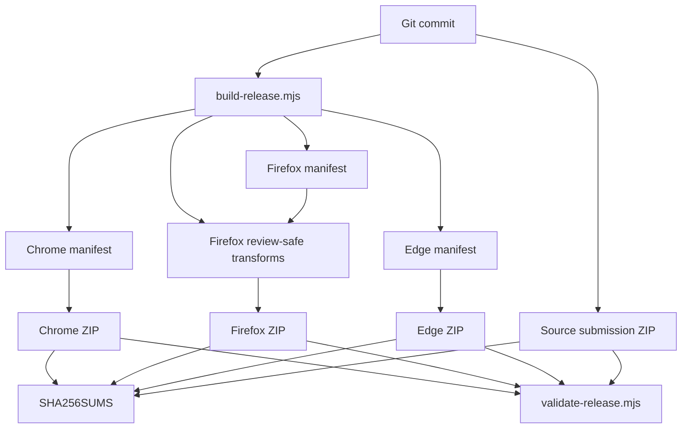

# 13 — Chrome, Edge e Firefox

## Una base comune, runtime diversi

> **Snapshot di riferimento del capitolo**  
> Questo capitolo usa il candidato release **2.35.2**, branch `feat/ui-ux-2.35.2`, commit  
> `f6fcb4c29c83ba9150df0be31da04fc91dffb634`.  
> A differenza dei Capitoli 11–12, questo snapshot include anche la preparazione di **manifest, Novità e materiale AMO 2.35.2**, perché proprio il packaging cross-browser è parte dell'argomento.

Nei capitoli precedenti abbiamo spesso scritto:

```text
il browser
```

come se Chrome, Edge e Firefox fossero tre finestre diverse sullo stesso runtime.

Per molte parti di PlumePilot è una semplificazione utile.

Il DOM è DOM.

`fetch()` è `fetch()`.

Una `Map` è una `Map`.

Una Promise continua a rappresentare un'operazione asincrona.

Ma quando costruiamo, distribuiamo e manteniamo una **browser extension reale**, quella semplificazione smette presto di essere sufficiente.

Il progetto deve attraversare almeno cinque livelli di compatibilità:

```text
sintassi JavaScript
        ↓
Web Platform API
        ↓
WebExtension API
        ↓
manifest / runtime model
        ↓
store policy / review pipeline
```

Ed è possibile essere compatibili a quattro livelli su cinque e non poter comunque pubblicare.

È esattamente ciò che è accaduto più volte durante l'evoluzione di PlumePilot.

Una funzione poteva:

```text
funzionare correttamente in Firefox
```

ma il pacchetto poteva comunque contenere un pattern che AMO non considerava sufficientemente reviewable.

Oppure lo stesso codice applicativo poteva funzionare in Chrome ed Edge, mentre il pacchetto Edge aveva bisogno di una struttura di localizzazione diversa.

Oppure un'API poteva esistere in Chromium ma non nel runtime Firefox scelto dal progetto.

Il problema corretto, quindi, non è:

> **“Il nostro JavaScript funziona su tutti i browser?”**

ma:

> **“Possiamo produrre per ogni browser un artefatto corretto, comprensibile, validabile, aggiornabile e conforme senza creare tre codebase indipendenti?”**

Questo capitolo studia come PlumePilot prova a rispondere.

---

# Parte I — Cross-browser non è una proprietà booleana

## 1. “Supporta Firefox” non significa una sola cosa

Immaginiamo questa funzione:

```js
const value = new Map();
```

È supportata nei browser moderni che ci interessano.

Ora immaginiamo invece:

```js
chrome.offscreen.createDocument(...);
```

Qui non stiamo più usando semplicemente JavaScript.

Stiamo usando una **extension API specifica del runtime Chromium**.

Poi prendiamo:

```json
{
  "background": {
    "service_worker": "background.js"
  }
}
```

Qui il problema non è neppure una funzione JavaScript.

È il **modello di background dichiarato dal manifest**.

Infine prendiamo del vendor code contenente:

```js
new Function(...)
```

Potrebbe non essere mai raggiunto da PlumePilot.

Potrebbe persino funzionare tecnicamente.

Ma può diventare un problema di:

```text
static analysis
reviewability
store policy
```

La parola “compatibilità” copre quindi problemi diversi.

---

## 2. Una matrice più utile

Per il nostro caso possiamo usare questa matrice:

| Livello | Domanda |
|---|---|
| Linguaggio | Il motore JS comprende questa sintassi? |
| Web Platform | Il browser offre questa API DOM/Web? |
| WebExtension | L'extension runtime espone questa API? |
| Manifest | Questa dichiarazione è valida per quel browser? |
| Lifecycle | Il background vive e muore nello stesso modo? |
| Packaging | Lo ZIP richiesto ha la stessa struttura? |
| Policy | Il codice è accettabile per lo store? |
| Review | Il revisore può ricostruire e comprendere il pacchetto? |
| UX | La stessa UI si comporta allo stesso modo? |

Questo è già molto più vicino alla realtà.

---

# Parte II — Un source tree, più artefatti

## 3. Il repository non coincide con il pacchetto dello store

Un errore concettuale comune è pensare:

```text
repository
    =
extension installata
```

In PlumePilot non è così.

Il repository contiene:

```text
codice runtime
test
script di build
documentazione
fixture
asset sorgente
strumenti di validazione
metadata per revisori
```

mentre il pacchetto runtime dovrebbe contenere soltanto ciò che serve all'estensione installata.

Perciò la pipeline è:

```text
repository
    ↓
selezione file runtime
    ↓
specializzazione per browser
    ↓
trasformazioni consentite
    ↓
manifest specifico
    ↓
ZIP deterministico
    ↓
validazione
    ↓
store
```

Questa separazione è già software architecture.

---

## 4. Build-time specialization

Il cuore della strategia attuale è in:

```text
scripts/build-release.mjs
```

Il build conosce esplicitamente tre target:

```js
const browsers = ["chrome", "firefox", "edge"];
```

Non abbiamo:

```text
un manifest universale consegnato identico a tutti
```

Abbiamo invece:

```text
source comune
      ↓
manifestFor(baseManifest, browser)
      ↓
Chrome artifact
Firefox artifact
Edge artifact
```

Questa tecnica può essere chiamata **build-time specialization**.

Le differenze note vengono risolte durante la build, non sparse in centinaia di condizioni runtime.

---

## 5. Perché non tre repository?

L'alternativa estrema sarebbe:

```text
plumepilot-chrome
plumepilot-firefox
plumepilot-edge
```

Sembra semplice.

In realtà introduce rapidamente:

```text
fix duplicati
release divergenti
bug risolti in 2 browser su 3
schema storage disallineato
feature drift
test duplicati
```

PlumePilot preferisce:

```text
             codice dominio comune
                    │
          ┌─────────┼─────────┐
          ↓         ↓         ↓
       Chrome    Firefox     Edge
        build      build      build
```

Le differenze sono concentrate ai boundary.

Questo è un principio molto più generale:

> **Mantieni comune il dominio; specializza l'adapter verso la piattaforma.**

---

# Parte III — Manifest V3 non significa lo stesso runtime ovunque

## 6. Il manifest sorgente

Il manifest del repository 2.35.2 contiene ancora una forma che descrive entrambe le possibilità:

```json
"background": {
  "scripts": [
    "achievements.js",
    "commission-state.js",
    "sound-settings.js",
    "whats-new.js",
    "background.js"
  ],
  "service_worker": "background.js"
}
```

Ma questa non è la forma che il release builder lascia necessariamente in ogni pacchetto.

Il build la specializza.

---

## 7. Chrome ed Edge: service worker

Per i target Chromium:

```js
manifest.background = {
  service_worker: "background.js"
};
```

e viene aggiunto:

```js
"offscreen"
```

alle permissions.

Concettualmente:

```text
Chromium MV3
     ↓
extension service worker
     ↓
background senza DOM
```

Questo ha conseguenze che abbiamo già incontrato:

- stato globale non durevole;
- lifecycle effimero;
- necessità di `chrome.storage`;
- listener registrati a startup;
- niente `window`/DOM nel service worker.

Il Capitolo 6 aveva già mostrato perché l'operation state non può vivere soltanto in una variabile del background.

Qui ne vediamo la ragione cross-browser.

---

## 8. Firefox: background scripts

Il pacchetto Firefox viene invece costruito con:

```js
manifest.background = {
  scripts: [
    "achievements.js",
    "sound-settings.js",
    "whats-new.js",
    "background.js"
  ]
};
```

e senza:

```text
background.service_worker
```

Il builder verifica persino l'invariante:

```js
if (manifest.background?.service_worker)
  throw new Error("Firefox: service_worker inatteso.");
```

Non stiamo quindi semplicemente dicendo:

```text
Firefox è un Chromium con qualche API mancante
```

Stiamo accettando che il **background execution environment** sia diverso.

MDN documenta esplicitamente questa differenza: per Manifest V3 Chrome usa `background.service_worker`, mentre Firefox supporta `background.scripts` per questo scenario.

---

## 9. Una scelta interessante: produrre manifest diversi

La documentazione WebExtensions mostra anche una possibile strategia universale:

```json
"background": {
  "scripts": ["background.js"],
  "service_worker": "background.js"
}
```

lasciando al browser la scelta dell'ambiente disponibile.

PlumePilot, tuttavia, produce artefatti separati.

Perché?

Non necessariamente perché l'approccio universale sia sbagliato.

Ma perché noi abbiamo anche:

```text
permission diverse
review constraints diverse
localizzazioni Edge
Firefox source submission
offscreen API Chromium-only
validatori diversi
```

Una volta che il packaging è già browser-specifico, un manifest specializzato diventa più facile da verificare.

---

## 10. Principio: capability non brand

A runtime, quando possibile, è meglio chiedere:

```js
if (chrome.offscreen?.createDocument) {
  ...
}
```

piuttosto che:

```js
if (browserName === "chrome") {
  ...
}
```

La prima domanda è:

> **Questa capability esiste?**

La seconda è:

> **Che etichetta ha il browser?**

La prima tende a essere più robusta.

Questo si chiama spesso **feature detection** o **capability detection**.

Ma non sempre basta.

Se una differenza riguarda il manifest, non possiamo scoprirla dopo che l'estensione è stata caricata.

Perciò:

```text
runtime feature detection
        +
build-time specialization
```

sono strumenti complementari.

---

# Parte IV — Il caso offscreen audio

## 11. Il problema

I service worker non hanno DOM.

Ma la riproduzione audio è naturalmente associata ad API di documento.

Chromium offre:

```text
chrome.offscreen
```

per creare un documento invisibile dell'estensione.

Nel background PlumePilot troviamo:

```js
async function ensureOffscreenAudioDocument() {
  if (!chrome.offscreen?.createDocument) return false;

  if (await chrome.offscreen.hasDocument()) return true;

  if (!offscreenCreation) {
    offscreenCreation = chrome.offscreen.createDocument({
      url: "offscreen-audio.html",
      reasons: ["AUDIO_PLAYBACK"],
      justification:
        "Riproduce gli avvisi sonori locali richiesti dall’utente.",
    }).finally(() => {
      offscreenCreation = null;
    });
  }

  await offscreenCreation;
  return true;
}
```

C'è già un pattern che conosciamo:

```text
Promise in-flight
```

`offscreenCreation` impedisce due creazioni concorrenti dello stesso documento.

---

## 12. Il fallback

La funzione chiamante non assume che offscreen esista.

```js
if (await ensureOffscreenAudioDocument()) {
  return sendRuntimeMessage(...);
}

const tabs = await chrome.tabs.query(...);
...
return sendTabMessage(target.id, ...);
```

Quindi l'architettura reale è:

```text
riproduci suono
      ↓
offscreen disponibile?
  ┌───┴────┐
 sì       no
 │         │
offscreen  content tab
```

Questa è **graceful degradation** applicata a una WebExtension API.

L'obiettivo di dominio:

```text
riprodurre una notifica sonora locale
```

rimane lo stesso.

Cambia l'adapter.

---

## 13. Perché Firefox rimuove proprio quel path

Il build Firefox sostituisce esattamente:

```js
async function ensureOffscreenAudioDocument() {
  ...
}
```

con:

```js
async function ensureOffscreenAudioDocument() {
  return false;
}
```

Il resto della funzione non cambia.

Il risultato è:

```text
Firefox
  ↓
ensureOffscreenAudioDocument()
  ↓ false
fallback tab-based
```

Questa non è una seconda implementazione della feature.

È la stessa feature che seleziona sempre il fallback già esistente.

Questo riduce molto il rischio di divergenza.

---

# Parte V — Manifest, permessi e data declarations

## 14. Least privilege può essere browser-specifico

Per Chromium PlumePilot richiede:

```json
["storage", "offscreen"]
```

Per Firefox:

```json
["storage"]
```

Perché dichiarare `"offscreen"` in Firefox se non viene usato?

Non avrebbe valore.

Aggiungere permessi “per uniformità” è l'opposto del least privilege.

Il validator controlla quindi l'insieme esatto:

```js
const expectedPermissions =
  browser === "firefox"
    ? ["storage"]
    : ["storage", "offscreen"];
```

Non verifica soltanto:

```text
che i permessi necessari ci siano
```

ma anche:

```text
che non ne compaiano di inattesi
```

È una differenza sottile ma importante.

---

## 15. Firefox ID

Nel manifest Firefox viene aggiunto:

```json
"browser_specific_settings": {
  "gecko": {
    "id": "plumepilot@fabiofloris"
  }
}
```

L'ID non è un dettaglio cosmetico.

È parte dell'identità dell'add-on.

Se cambia, dal punto di vista del browser possiamo ottenere un'altra estensione invece di un aggiornamento della precedente.

Il changelog del progetto conserva proprio questa lezione storica.

---

## 16. Data collection declarations

Nel target Firefox troviamo inoltre:

```json
"data_collection_permissions": {
  "required": [
    "authenticationInfo",
    "websiteContent",
    "websiteActivity"
  ]
}
```

Questo non significa automaticamente:

```text
PlumePilot invia questi dati allo sviluppatore
```

Il significato della dichiarazione va letto secondo il modello Firefox e le interazioni dell'estensione con i dati dei siti.

Il punto architetturale che ci interessa è un altro:

> **Lo stesso comportamento applicativo può richiedere metadata di distribuzione differenti per browser.**

Dal 2025 Mozilla richiede queste dichiarazioni per nuove estensioni in determinati flussi AMO; il progetto include quindi questa informazione nel manifest Firefox.

---

## 17. Versioni minime

Il pacchetto Firefox dichiara:

```json
"strict_min_version": "140.0"
```

e per Android:

```json
"strict_min_version": "142.0"
```

La versione minima è una forma di contratto.

Stiamo dicendo:

```text
sotto questa versione
non promettiamo che l'ambiente richiesto esista
```

Questo può essere migliore di riempire il codice di fallback per runtime che non intendiamo più supportare.

---

# Parte VI — Chrome ed Edge: stesso motore, prodotto non identico

## 18. “Edge è Chromium” è vero ma incompleto

Dal punto di vista del runtime extension moderno, Chrome ed Edge condividono moltissimo.

Ma lo store non è il motore JavaScript.

Nel build Edge PlumePilot modifica:

```js
manifest.name = "__MSG_extensionName__";
manifest.description = "__MSG_extensionDescription__";
manifest.default_locale = "it";
manifest.action.default_title = "__MSG_extensionName__";
```

e aggiunge:

```text
_locales/en/messages.json
_locales/it/messages.json
```

Quindi:

```text
stesso runtime family
≠
stesso artefatto store
```

---

## 19. Runtime compatibility vs distribution compatibility

Questa distinzione merita un nome.

### Runtime compatibility

Il codice funziona nel browser.

### Distribution compatibility

L'artefatto soddisfa:

```text
manifest
metadata
locale
store validator
policy
```

Un'estensione può avere runtime compatibility ma non distribution compatibility.

Questa è stata una delle lezioni più pratiche del progetto.

---

# Parte VII — Reviewability è una proprietà tecnica

## 20. Il problema dei vendor bundle

PlumePilot usa librerie importanti:

```text
PDF.js
pdf-lib
fontkit
JSZip
```

Nell'ecosistema web è normalissimo distribuire bundle minimizzati.

Per una browser extension pubblicata negli store, però, il contesto cambia.

Il reviewer deve poter capire:

```text
che codice stiamo eseguendo
da dove proviene
come è stato trasformato
se il pacchetto corrisponde al source
```

La reviewability entra così nell'architettura.

---

## 21. Chrome: leggibilità, non “beauty”

Le policy del Chrome Web Store vietano l'offuscamento finalizzato a nascondere la funzionalità.

Permettono tecniche tipiche di minificazione.

Ma dal punto di vista pratico del progetto abbiamo comunque incontrato detector e review automatiche sensibili alla forma del codice.

Il changelog registra in 2.32.10:

```text
- sostituzione dei bundle legacy minificati PDF.js
- distribuzione standard leggibile
- rimozione di compatibility code che attivava un detector di obfuscation
```

Il punto da portarsi dietro non è:

```text
"minification = vietata"
```

che sarebbe falso.

È:

> **Il costo di un bundle poco leggibile non è soltanto umano: entra anche nelle pipeline automatiche di review.**

---

## 22. Firefox: source submission come parte del prodotto

Mozilla formalizza ulteriormente questo requisito.

Se il codice runtime deriva da:

```text
minifier
bundler
transpiler
template generator
custom preprocessing
```

il reviewer può aver bisogno di:

```text
source leggibile
+
istruzioni di build
+
toolchain riproducibile
```

Per PlumePilot questo ha portato a:

```text
plumepilot-v2.35.2-source.zip
```

oltre ai tre ZIP runtime.

La release non è quindi:

```text
3 file
```

ma:

```text
Chrome runtime
Firefox runtime
Edge runtime
source submission
checksums
```

---

# Parte VIII — Il build Firefox review-safe

## 23. Trasformare vendor code: operazione delicata

Il builder Firefox applica trasformazioni a una lista chiusa:

```js
[
  "background.js",
  "vendor/jszip.js",
  "vendor/fontkit.umd.js",
  "vendor/pdf-lib.js",
  "vendor/pdf.mjs",
  "vendor/pdf.worker.mjs"
]
```

Tutto il resto:

```js
return bytes;
```

Questo è importante.

Non stiamo facendo:

```text
regex globale sull'intero repository
```

Stiamo applicando patch note soltanto dove necessario.

---

## 24. `replaceExactly()`

La funzione fondamentale è:

```js
function replaceExactly(source, search, replacement, label) {
  const first = source.indexOf(search);

  if (
    first < 0 ||
    source.indexOf(search, first + search.length) >= 0
  ) {
    throw new Error(
      `Firefox review-safe: pattern inatteso (${label}).`
    );
  }

  return (
    source.slice(0, first) +
    replacement +
    source.slice(first + search.length)
  );
}
```

Questa funzione contiene un principio molto forte.

La patch viene applicata soltanto se il pattern:

```text
esiste
e
esiste una volta sola
```

Altrimenti:

```text
FAIL BUILD
```

---

## 25. Fail-closed transformation

Possiamo chiamarlo:

**fail-closed transformation**.

Una trasformazione fragile non deve “fare del suo meglio”.

Deve dire:

```text
il vendor file è cambiato
non so più dimostrare che questa patch sia quella corretta
interrompo la release
```

È l'opposto di:

```js
source.replace(regex, replacement);
```

e continuare comunque.

---

## 26. Perché è importante

Immaginiamo un upgrade di PDF.js.
La stringa attesa:

```js
new Function(...)
```

potrebbe:

- essere sparita;
- comparire due volte;
- essere stata riscritta;
- avere semantica diversa.

Se il build applicasse silenziosamente una sostituzione parziale potremmo generare un pacchetto:

```text
sintatticamente valido
ma semanticamente inatteso
```

`replaceExactly()` trasforma una dipendenza implicita in un'invariante verificata.

---

# Parte IX — Il caso JSZip

## 27. Codice inutilizzato può essere comunque rilevante

La distribuzione JSZip leggibile contiene una compatibilità legacy che permette callback stringa e quindi usa:

```js
new Function(...)
```

PlumePilot passa funzioni reali.

Quella branch non serve al nostro uso.

Ma static analysis non ragiona necessariamente così.

Può vedere:

```text
Function constructor presente
```

e segnalarlo.

---

## 28. Ridurre capability, non nasconderla

Il pacchetto Firefox sostituisce il fallback con:

```js
if (typeof callback !== "function") {
  throw new TypeError(
    "setImmediate callback must be a function"
  );
}
```

Questa trasformazione non tenta di:

```text
camuffare new Function
```

Elimina una capability che PlumePilot non usa.

È una differenza essenziale.

---

# Parte X — Il caso fontkit

## 29. Legacy compatibility e superfici inutili

fontkit include fallback storici che possono costruire o esporre executable code.

Il builder Firefox li sostituisce con versioni che:

```text
mantengono il comportamento necessario
ma rimuovono il path eval-like non utilizzato
```

Di nuovo il principio è:

```text
capability realmente necessaria?
      │
  no  │
      ↓
rimuovila dal runtime target
```

Più capability significa:

```text
più superficie
più review complexity
più possibili path da comprendere
```

---

# Parte XI — Il caso PDF.js

## 30. Un dependency tree è anche un compatibility tree

PDF.js è particolarmente interessante perché contiene più strategie di fallback.

Per esempio può verificare se la compilazione dinamica è possibile:

```js
function isEvalSupported() {
  try {
    new Function("");
    return true;
  } catch {
    return false;
  }
}
```

Nel Firefox artifact PlumePilot lo trasforma in:

```js
function isEvalSupported() {
  return false;
}
```

Non perché Firefox “non supporti JavaScript”.

Ma perché, nel nostro deployment target, vogliamo forzare il path interprete.

---

## 31. Interpreter vs compiler

PDF.js può avere un percorso concettuale:

```text
PostScript function
       ↓
compilazione dinamica possibile?
  ┌────┴────┐
 sì        no
 │          │
Function   interpreter
```

Nel target Firefox PlumePilot sceglie:

```text
sempre interpreter
```

Questo è un esempio di **capability reduction by build**.

---

## 32. Dynamic import fallback

Alcuni fallback PDF.js tentano anche dynamic import di risorse calcolate.

Se quella risorsa non è inclusa nel nostro pacchetto e quel percorso non serve al nostro uso, mantenerlo significa conservare:

```text
codice non utile
+
pattern difficile da revisionare
```

Il build Firefox lo disattiva esplicitamente.

È importante però distinguere:

```text
dynamic import statico
```

da:

```text
dynamic import calcolato
```

e soprattutto distinguere:

```text
API usata dal nostro prodotto
```

da:

```text
fallback generico incluso dalla libreria
```

---

# Parte XII — Perché non patchare i file sorgente vendor?

## 33. Chrome ed Edge mantengono upstream

Il progetto conserva i vendor file leggibili corrispondenti alle distribuzioni ufficiali.

Chrome ed Edge ricevono:

```text
copie upstream
```

Il target Firefox riceve:

```text
copie derivate deterministicamente
```

durante la build.

Questo mantiene chiaro il lineage:

```text
official vendor source
        ↓
pinned local file
        ↓
Firefox deterministic patch
        ↓
runtime artifact
```

Se modificassimo direttamente il file vendor nel repository perderemmo questa distinzione.

---

## 34. Provenance

Qui entra un concetto importante:

**supply-chain provenance**.

Per una dipendenza vogliamo poter rispondere:

```text
qual è la versione?
da quale artefatto upstream viene?
qual è il checksum?
quali modifiche abbiamo applicato?
perché?
```

`THIRD_PARTY_NOTICES.md` e i checksum del validator trasformano queste domande in dati verificabili.

---

# Parte XIII — Checksum come invarianti

## 35. Non fidarti del nome del file

Un file chiamato:

```text
vendor/jszip.js
```

non dimostra che sia JSZip 3.10.1.

Un nome è metadata umano.

Un SHA-256 è un'identità molto più forte del contenuto.

Il validator contiene mappe di checksum attesi per:

```text
PDF.js
pdf-lib
fontkit
JSZip
```

e verifica i bytes inclusi.

---

## 36. Pinned dependency

Questa strategia crea una forma di:

**checksum pinning**.

Il progetto non dice soltanto:

```text
usa PDF.js 5.x
```

ma:

```text
mi aspetto esattamente questi bytes sorgente
```

Questo rende più evidente una modifica accidentale.

---

## 37. Ma attenzione

Un checksum non dice:

```text
questo codice è sicuro
```

Dice:

```text
questo codice è esattamente quello che avevamo deciso di usare
```

È un'invariante di integrità/provenance, non una proof of correctness.

---

# Parte XIV — Il validator come executable specification

## 38. Non controlliamo manualmente gli ZIP

Dopo il build:

```text
scripts/validate-release.mjs
```

riapre gli artefatti e controlla ciò che è stato effettivamente prodotto.

Questo dettaglio è importantissimo.

Non valida soltanto:

```text
il source tree
```

Valida:

```text
il prodotto finale
```

---

## 39. Esempi di invarianti

Il validator controlla:

```text
versione manifest
description length
permissions esatti
background model
Gecko ID
min Firefox version
data declarations
Edge locales
file referenziati dal manifest
assenza di script remoti
assenza di dynamic code first-party
licenze
vendor checksums
Novità corrette
source submission
SHA256SUMS
```

In altre parole:

```text
release contract
      ↓
codice eseguibile
```

---

## 40. Test del packaging

Questo è un concetto che spesso manca nei progetti piccoli.

Abbiamo:

```text
unit/integration test dell'app
```

ma anche:

```text
test dell'artefatto
```

Una feature può funzionare perfettamente nel checkout Git e fallire nello ZIP perché:

```text
file escluso
manifest sbagliato
locale mancante
asset non copiato
transformation incompleta
```

Perciò:

> **L'artefatto di release è una cosa da testare.**

---

# Parte XV — Static analysis come avversario costruttivo

## 41. Scan review-safe

Per Firefox il validator legge ogni file:

```text
.js
.mjs
.html
```

e cerca pattern come:

```text
eval(
Function(
dynamic import calcolato
chrome.offscreen
dynamic innerHTML template
```

Questo non equivale a una dimostrazione semantica.

È **static analysis euristica**.

---

## 42. False positive possibili

Una regex può trovare:

```text
pattern sospetto
```

anche se il path:

```text
non è mai raggiunto
```

o se l'uso sarebbe innocuo.

Questo può sembrare frustrante.

Ma per un ecosistema di estensioni il reviewer non può eseguire mentalmente ogni possibile control flow di ogni bundle vendor.

Perciò parte del lavoro di engineering è rendere il prodotto:

```text
facilmente comprensibile anche staticamente
```

---

## 43. Leggibilità come security property

Questo porta a una conclusione interessante:

> **La leggibilità del codice è anche una proprietà operativa di sicurezza e governance.**

Non soltanto:

```text
“il maintainer capisce meglio il file”
```

ma:

```text
reviewer può verificare
scanner può classificare
provenance può essere confrontata
future diff sono comprensibili
```

---

# Parte XVI — Unknown/minified heuristic

## 44. Mimare il reviewer localmente

Il validator contiene persino una piccola euristica:

```js
function couldBeMinifiedCode(source) {
  ...
}
```

che guarda aspetti come:

```text
indentazione
linee enormi
sourceMappingURL
```

Non è “l'algoritmo AMO”.

È un guardrail locale.

Il principio è:

```text
se sappiamo quali classi di problema
ci hanno già bloccato,
automatizziamo un controllo prima della submission
```

---

## 45. Postmortem → test

Questo pattern tornerà fortissimo nel Capitolo 14.

```text
rejection / bug
      ↓
root cause
      ↓
invariant
      ↓
automated check
```

È una delle trasformazioni più preziose nella maturazione di un progetto.

---

# Parte XVII — Source submission riproducibile

## 46. Il reviewer deve poter rifare il build

`AMO_SOURCE_README.md` documenta:

```text
Ubuntu 24.04
Node 24.x
npm non richiesto
rete non richiesta
```

e il comando:

```bash
node scripts/build-release.mjs
```

Questo riduce il numero di dipendenze implicite.

---

## 47. Build offline

Il fatto che il release build non richieda rete è molto utile.

Evita che la riproduzione dipenda da:

```text
registry momentaneamente diverso
package cancellato
latest version cambiata
servizio esterno
```

Le dipendenze necessarie sono già incluse.

Possiamo descrivere questo come un build **quasi hermetic**.

Non è un sistema hermetic formalmente perfetto:

```text
dipende ancora da Node e dal sistema operativo
```

ma riduce molto gli input esterni.

---

## 48. Reproducible vs deterministic

Due termini vicini ma distinti.

### Deterministic build

Con gli stessi input e ambiente controllato:

```text
stesso output
```

### Reproducible build

Un'altra persona può ricostruire e verificare lo stesso artefatto a partire dal source dichiarato.

PlumePilot prova a favorire entrambe.

---

## 49. Fixed ZIP timestamp

Nel builder:

```js
const fixedZipDate =
  new Date("2026-01-01T00:00:00.000Z");
```

Ogni file nello ZIP riceve quella data.

Perché?

Se usassimo:

```text
timestamp corrente
```

due build logicamente identici produrrebbero bytes diversi.

---

## 50. Stable ordering

`collectFiles()` termina con:

```js
return files.sort();
```

Anche l'ordine delle entry ZIP diventa quindi deterministico.

Gli altri parametri includono:

```text
DEFLATE level 9
platform UNIX
```

Ridurre variabili non funzionali rende più facile confrontare build differenti.

---

## 51. SHA256SUMS

Il builder genera poi:

```text
SHA256SUMS.txt
```

contenente il checksum di:

```text
Chrome ZIP
Firefox ZIP
Edge ZIP
source ZIP
```

Il validator lo ricostruisce e confronta.

La chain diventa:

```text
source
  ↓
build
  ↓
artifact
  ↓
SHA-256
  ↓
review notes / verification
```

---

# Parte XVIII — Source package e runtime package hanno scopi diversi

## 52. Runtime package

Deve essere:

```text
minimo
eseguibile
senza test
senza documentazione inutile
senza artefatti di sviluppo
```

Il builder esclude:

```text
docs/
scripts/
tests/
release/
.git/
README
CHANGELOG
...
```

---

## 53. Source submission

Deve invece contenere ciò che permette di:

```text
comprendere
ricostruire
verificare
```

Perciò conserva:

```text
script build
test
README AMO
vendor metadata
licenze
sorgenti
```

ed esclude per esempio:

```text
.git
release artifact già costruiti
documentazione pubblica non necessaria
```

Uno stesso progetto produce due package con obiettivi quasi opposti:

```text
runtime → minimo
source → spiegabile
```

---

# Parte XIX — First-party e third-party code

## 54. Non sono la stessa responsabilità

Per il codice scritto da noi possiamo:

```text
riscrivere
rifattorizzare
eliminare pattern
```

Per una libreria third-party è preferibile mantenere chiaro il rapporto con upstream.

Da qui la strategia:

```text
source vendor leggibile e pinned
+
trasformazioni target-specific documentate
```

---

## 55. Perché evitare modifiche casuali ai vendor

Una patch manuale non documentata in:

```text
vendor/pdf.mjs
```

crea immediatamente domande:

```text
è ancora PDF.js ufficiale?
cosa è cambiato?
perché?
posso aggiornarlo?
il reviewer può verificarlo?
```

La build transformation rende la derivazione esplicita.

---

# Parte XX — `innerHTML` e review surface

## 56. Codice first-party dinamico

Una delle revisioni storiche ha rimosso pattern come:

```js
element.innerHTML = `
  ...
  ${dynamicValue}
  ...
`;
```

in punti sensibili, sostituendoli con:

```text
template statico
+
hydration tramite DOM nodes/attributes
```

Non perché ogni `innerHTML` dinamico sia automaticamente male.

Ma perché:

```text
dynamic markup
+
extension context
+
review scanner
```

aumenta la superficie da analizzare.

---

## 57. Security e review spesso convergono

Ridurre:

```text
dynamic code
dynamic HTML
remote script
unknown vendor
```

aiuta sia:

```text
security posture
```

sia:

```text
reviewability
```

Questo è un caso in cui compliance e buona progettazione possono spingere nella stessa direzione.

---

# Parte XXI — Remote code

## 58. Runtime self-contained

Il validator controlla che i file first-party non contengano:

```html
<script src="https://...">
```

Il principio per MV3 è importante:

```text
codice eseguibile dell'estensione
deve essere comprensibile dal pacchetto
```

PlumePilot può fare fetch di:

```text
dati
PDF
immagini autorizzate
API della piattaforma
```

ma non scarica JavaScript da eseguire per cambiare la propria logica.

---

## 59. Code vs data boundary

Questo ci riporta a un concetto di sicurezza classico.

```text
data remoto
≠
codice remoto
```

Un PDF recuperato da CloudFront è input.

Un file JS recuperato e `eval()`-uato sarebbe comportamento.

La distinzione è fondamentale.

---

# Parte XXII — Differenze UI reali fra browser

## 60. Non tutte le incompatibilità sono API

Il changelog contiene casi apparentemente banali:

```text
Chromium scrollbar gutter
Firefox popup shrink
Gaming frame clipping
right padding
```

Questi sono bug cross-browser reali.

Non dipendono da:

```text
chrome.tabs
browser.storage
manifest
```

Dipendono da:

```text
layout engine
popup viewport
scrollbar behavior
timing
rendering
```

---

## 61. Un esempio: gutter

Una UI perfetta in Firefox può risultare:

```text
spostata
compressa
clippata
```

in Chromium perché lo spazio riservato alla scrollbar è diverso.

Il fix storico non è stato:

```text
aumenta padding ovunque
```

ma:

```text
compensazione solo dove il comportamento esiste
```

Ancora una volta:

```text
shared default
+
targeted divergence
```

---

# Parte XXIII — Timing cross-browser
## 62. Chromium recovery race

La storia di PlumePilot contiene anche una regressione in cui Chromium aveva bisogno di una settling window diversa durante il recovery del capitolo.

Il changelog descrive:

```text
Chromium-only settling window
```

senza cambiare le normali transizioni Firefox.

Questo è interessante perché ci ricorda:

> **Il DOM finale può essere uguale, ma il timing con cui ci arriva può differire.**

---

## 63. Feature detection non risolve il timing

Non possiamo scrivere:

```js
if ("domTimingBug" in window)
```

Alcune differenze emergono soltanto dal comportamento.

In questi casi abbiamo bisogno di:

```text
osservazione
telemetria locale/log
reproduction test
guard specifico
```

Quindi il cross-browser engineering non è sempre elegante.

A volte nasce da empirica evidence.

---

# Parte XXIV — API namespace: `chrome` vs `browser`

## 64. Un equivoco comune

Spesso si dice:

```text
Chrome usa chrome.*
Firefox usa browser.*
```

ma la realtà è più sfumata.

Firefox implementa molte WebExtension API anche attraverso compatibilità con il namespace `chrome`.

PlumePilot usa ampiamente:

```js
chrome.storage
chrome.runtime
chrome.tabs
```

anche per Firefox.

Il problema non è quindi il nome del namespace in sé.

È:

```text
quale API
quale firma
quale lifecycle
quale supporto
```

---

## 65. Callback vs Promise

Alcuni ecosistemi WebExtension hanno storicamente differito anche nel supporto Promise/callback.

PlumePilot spesso costruisce wrapper espliciti:

```js
new Promise((resolve) => {
  chrome.runtime.sendMessage(message, resolve);
});
```

Questo crea un'interfaccia Promise interna controllata dal progetto.

È una piccola **compatibility abstraction**.

---

# Parte XXV — Evitare browser detection fragile

## 66. User agent sniffing

Una soluzione rapida sarebbe:

```js
if (navigator.userAgent.includes("Firefox")) ...
```

Quasi sempre va evitata se possiamo usare:

```text
capability
manifest specialization
feature test
```

Perché un brand string non descrive precisamente la capability che ci interessa.

---

## 67. Quando una browser branch può essere legittima

Non dobbiamo però trasformare la regola in dogma.

Se abbiamo un bug riproducibile:

```text
solo Chromium
```

e nessuna capability testabile lo identifica, una branch target-specific può essere il compromesso più corretto.

La domanda è:

```text
stiamo modellando una capability
o
stiamo codificando un workaround empirico?
```

Se è il secondo, documentiamolo chiaramente.

---

# Parte XXVI — Packaging come anti-corruption layer

## 68. Il build protegge il dominio dalle differenze dello store

Possiamo leggere `build-release.mjs` come un **anti-corruption layer**.

Il source tree dice:

```text
questo è PlumePilot
```

Il builder traduce verso:

```text
Chrome expectations
Firefox expectations
Edge expectations
```

senza far penetrare ovunque quelle differenze.

---

## 69. Backend analogy

Da backend developer possiamo pensarlo così:

```text
domain model
    ↓
adapter PostgreSQL
adapter Redis
adapter external REST API
```

Qui abbiamo:

```text
extension core
    ↓
Chrome packaging adapter
Firefox packaging adapter
Edge packaging adapter
```

Non sono identici, ma il principio è molto simile.

---

# Parte XXVII — Release matrix

## 70. Una feature non è “done” quando funziona su Chrome

Per una release reale la matrice è più simile a:

| Area | Chrome | Edge | Firefox |
|---|---:|---:|---:|
| Runtime feature | ✓ | ✓ | ✓ |
| Manifest | ✓ | ✓ | ✓ |
| Background | SW | SW | scripts |
| Audio path | offscreen | offscreen | tab fallback |
| Locale package | base | `_locales` | base |
| Review-safe transforms | no | no | sì |
| Source archive | no | no | sì |
| Store validation | CWS | Edge | AMO |

“Done” significa attraversare la matrice necessaria.

---

# Parte XXVIII — Tests devono includere il build

## 71. Testare source non basta

Consideriamo:

```js
menu-ux.js
```

Può passare tutti i test Node.

Ma se manca da:

```text
web_accessible_resources
```

il floating menu potrebbe non caricare lo stylesheet condiviso.

Oppure il source può essere corretto ma il manifest Firefox può contenere `offscreen`.

Questi sono bug di packaging.

---

## 72. Tre livelli di test

Una pipeline matura distingue:

```text
1. source tests
2. browser/runtime tests
3. artifact tests
```

### Source tests

```text
funzioni
algoritmi
normalizzazione
```

### Runtime tests

```text
browser fixture
DOM
messaging
UI
```

### Artifact tests

```text
ZIP
manifest
file presence
checksum
store-specific rules
```

PlumePilot possiede esempi di tutti e tre.

---

# Parte XXIX — Warnings non sono errors

## 73. Una lezione AMO importante

`web-ext lint` può produrre:

```text
errors
warnings
```

Un error può bloccare.

Un warning richiede valutazione.

Il file AMO del progetto dice esplicitamente:

```text
a zero-warning result is not required for AMO approval
```

Questo evita un errore di processo:

```text
warning presente
      ↓
panic
      ↓
patch non necessaria
      ↓
nuovo rischio
```

---

## 74. Severity classification

Anche qui serve una tassonomia.

```text
syntax/load error
security/policy error
unsupported API
review warning
informational warning
```

Non dobbiamo trattarli come equivalenti.

Il Capitolo 14 riprenderà questo modello nel debugging.

---

# Parte XXX — Store review come distributed system umano

## 75. Il reviewer non ha il nostro contesto

Noi sappiamo:

```text
perché c'è una patch
quale account usare
quale corso aprire
quale path vendor è inutilizzato
```

Il reviewer no.

Perciò dobbiamo trasferire contesto attraverso:

```text
Notes for Reviewers
demo credentials
AMO_SOURCE_README
third-party notices
reproduction commands
```

Questo è quasi un problema di protocol design.

---

## 76. Reviewer instructions come API contract

Una buona procedura dice:

```text
input
passi
risultato atteso
```

Esattamente come una API specification.

Una procedura vaga:

```text
“provate l'estensione”
```

ha alta ambiguità.

Una procedura:

```text
apri DEMO
vai al corso X
clicca PlumePilot
esegui Y
verifica Z
```

riduce il numero di interpretazioni possibili.

---

# Parte XXXI — Il costo della divergenza

## 77. Ogni `if browser` è debito potenziale

Immaginiamo:

```js
if (firefox) pathA();
else if (edge) pathB();
else pathC();
```

ripetuto in 50 file.

Ogni nuova feature moltiplicherebbe:

```text
casi da ragionare
casi da testare
casi da mantenere
```

Per questo conviene concentrare la divergenza.

---

## 78. Divergence budget

Possiamo introdurre un concetto utile:

**divergence budget**.

Ogni differenza browser-specifica ha un costo futuro.

La aggiungiamo soltanto se risolve una differenza reale.

Il design ideale è:

```text
core comune molto grande
+
adapter specifici molto piccoli
```

non:

```text
tre implementazioni quasi uguali
```

---

# Parte XXXII — Compatibility layer

## 79. Che cosa merita un wrapper?

Un wrapper è utile quando nasconde una differenza stabile.

Per esempio:

```text
playNotificationSound
```

nasconde:

```text
offscreen
vs
content-tab fallback
```

Il caller non deve sapere quale adapter verrà usato.

---

## 80. Quando il wrapper diventa dannoso

Un abstraction layer può diventare peggiore del problema se prova a uniformare:

```text
API profondamente diverse
semantiche diverse
lifecycle diversi
```

e finisce con un'API interna piena di eccezioni.

La regola:

> **Astrarre la capacità comune, non fingere che gli ambienti siano identici.**

---

# Parte XXXIII — Polyfill, fallback e specialization

## 81. Tre strumenti diversi

### Polyfill

Implementiamo un'API mancante con semantica compatibile.

### Fallback

Se una capability manca, usiamo un'altra strategia per raggiungere lo stesso obiettivo.

### Build specialization

Generiamo un artefatto diverso prima del runtime.

PlumePilot usa soprattutto:

```text
fallback
+
build specialization
```

---

## 82. Esempio audio

```text
offscreen
```

non viene polyfilled in Firefox.

Facciamo:

```text
fallback al content tab
```

---

## 83. Esempio background

Non polyfilliamo:

```text
service worker Firefox
```

Produciamo:

```text
background.scripts
```

nel manifest target.

Questa è specialization.

---

# Parte XXXIV — Cross-browser e storage compatibility

## 84. Schema comune

Una delle scelte più preziose è mantenere:

```text
storage keys
schema
operation model
course state
```

comuni fra browser.

Il changelog sottolinea più volte che cambi di packaging non alterano:

```text
runtime storage keys
```

Questo preserva il modello mentale e riduce branch applicative.

---

## 85. Identità update

Ma lo storage di un'estensione è collegato anche all'identità dell'add-on.

Cambiare Firefox ID prima della pubblicazione definitiva ha avuto conseguenze sui dati locali delle build precedenti.

Quindi:

```text
schema compatibile
```

non basta se cambia:

```text
identity container
```

È analogo a un database schema corretto ma collegato a un database diverso.

---

# Parte XXXV — Version metadata come source of truth

## 86. Un bug storico istruttivo

Una versione precedente tentava di leggere:

```js
chrome.runtime.getManifest()
```

da un contesto in cui l'extension API non era disponibile.

Il fix ha spostato la lettura nel bridge, dove l'API esiste, e ha passato la versione attraverso il protocollo già presente.

Questo unisce:

```text
context isolation
cross-browser
source of truth
```

---

## 87. Non duplicare la versione

La versione dovrebbe venire da:

```text
manifest
```

e poi propagarsi.

Non da:

```js
const VERSION = "2.35.2";
```

copiato in cinque file.

Ogni duplicazione crea rischio di drift.

---

# Parte XXXVI — Firefox Android come esempio di capability boundary

## 88. Dichiarare non significa distribuire

Il manifest può contenere:

```text
gecko_android.strict_min_version
```

mentre la release AMO può essere intenzionalmente desktop-only.

Dobbiamo distinguere:

```text
metadata di compatibilità
```

da:

```text
canale distributivo scelto
```

Sono due decisioni diverse.

---

# Parte XXXVII — Browser support come prodotto

## 89. Supportare un browser ha un costo

Dire:

```text
supportiamo Firefox
```

significa assumersi:

```text
build
test
review
bug report
update path
documentazione
store metadata
regression matrix
```

Supporto non è una checkbox tecnica.

È una promessa di manutenzione.

---

## 90. Perché limitarne il numero può essere sano

Ogni browser aggiunto aumenta:

```text
compatibility surface
release surface
support surface
```

Per un progetto piccolo, supportare tre browser bene può essere meglio che supportarne sei superficialmente.

---

# Parte XXXVIII — Una pipeline mentale per nuove feature

## 91. Domanda 1: è Web Platform o Extension API?

Se aggiungiamo una feature:

```text
Clipboard?
Notifications?
Downloads?
Side panel?
Offscreen?
```

prima chiediamo:

```text
è una normale Web API
o una WebExtension API?
```

Le extension API hanno maggiore probabilità di divergere.

---

## 92. Domanda 2: capability support

Cerchiamo documentazione primaria e costruiamo una matrice:

```text
Chrome
Edge
Firefox
minimum versions
permission
manifest key
```

Non implementiamo basandoci sul ricordo.

---

## 93. Domanda 3: stesso obiettivo, stessa API?

Forse Firefox raggiunge lo stesso obiettivo con un adapter diverso.

Se sì:

```text
domain capability
      ↓
adapter A / adapter B
```

---

## 94. Domanda 4: differenza build-time o runtime?

Se la differenza è:

```text
manifest
permission
locale
vendor transform
```

preferiamo build-time.

Se è:

```text
feature opzionale presente/non presente
```

può essere runtime feature detection.

---

## 95. Domanda 5: cosa deve validare l'artefatto?

Ogni nuova differenza dovrebbe produrre almeno un'invariante.

Esempio:

```text
Firefox non deve contenere offscreen permission
```

diventa:

```js
if (manifest.permissions?.includes("offscreen")) {
  throw ...
}
```

---

# Parte XXXIX — Un anti-pattern: fix manuale nello ZIP

## 96. “Apro lo ZIP e cambio manifest.json”

È possibile.

Ed è una pessima release practice.

Perché il file finale non corrisponde più a:

```text
source
build script
checksum atteso
```

e il prossimo rilascio dimenticherà la correzione.

---

## 97. Fix source, not artifact

La regola corretta è:

```text
problema nel pacchetto
      ↓
correggi builder/source
      ↓
rigenera
      ↓
valida
```

L'artefatto deve essere output, non editor.

---

# Parte XL — Determinismo e debugging

## 98. Perché una build deterministica aiuta anche noi

Non serve soltanto al reviewer.

Se:

```text
stesso commit
stesso builder
```

produce bytes diversi ogni volta, diventa difficile capire:

```text
il cambiamento è funzionale?
è metadata ZIP?
è ordine file?
è timestamp?
```

Riducendo il rumore, il diff diventa più informativo.

---

# Parte XLI — Artifact identity

## 99. Commit SHA vs artifact SHA

Abbiamo due identità diverse.

### Commit SHA

Identifica:

```text
stato del repository Git
```

### ZIP SHA-256

Identifica:

```text
artefatto binario distribuito
```

Un commit può produrre più artefatti:

```text
chrome.zip
firefox.zip
edge.zip
source.zip
```

quindi:

```text
commit identity
≠
artifact identity
```

Entrambe sono utili.

---

# Parte XLII — Release provenance graph

## 100. Possiamo disegnarla



Questa è già una **software supply chain** in miniatura.

---

# Parte XLIII — Invarianti cross-browser

## 101. Cosa deve restare uguale

Le differenze non devono cancellare le invarianti comuni.

Per esempio:

```text
stesse feature core
stessi host supportati
stesso storage schema
stessa privacy model
stessi export semantics
stessi message contracts
```

---

## 102. Cosa può cambiare

```text
background environment
offscreen audio path
manifest metadata
locale packaging
vendor review transforms
store notes
```

Una buona architettura rende chiaro quale categoria contiene ogni differenza.

---

# Parte XLIV — Semantic parity

## 103. Binary equality non serve

Chrome e Firefox ZIP non devono essere uguali.
Devono avere:

**semantic parity**.

Cioè:

```text
dato lo stesso scenario utente
otteniamo lo stesso comportamento osservabile
```

entro le differenze deliberate del browser.

---

## 104. Esempio audio

Implementazione:

```text
Chrome → offscreen document
Firefox → content tab
```

Semantic parity:

```text
utente sente la notifica richiesta
```

Questo è il livello giusto su cui confrontare i target.

---

# Parte XLV — Cross-browser regression test

## 105. Cosa testare per feature

Per una feature condivisa:

```text
happy path
fallback path
browser-specific adapter
storage result
cleanup
error result
```

Non basta:

```text
“cliccato in Chrome, funziona”
```

---

# Parte XLVI — Review regressions

## 106. Anche il build può regredire

Immaginiamo un aggiornamento JSZip che reintroduce:

```text
un pattern Function(...)
```

in un punto nuovo.

I test funzionali possono essere tutti verdi.

Ma la submission Firefox può fallire.

Perciò il validator deve vivere nella normale release pipeline, non come script usato soltanto una volta dopo una rejection.

---

# Parte XLVII — Store policy come external contract

## 107. Le policy possono cambiare

Questo è simile a integrare una API esterna.

Noi non controlliamo:

```text
Chrome Web Store policy
AMO review policy
manifest requirements
data declaration requirements
```

Quindi dobbiamo trattarli come un **external contract**.

---

## 108. Conseguenza

Non hardcodiamo per sempre nella nostra testa:

```text
“Firefox richiede X”
```

Prima di una release importante verifichiamo la documentazione corrente.

Le policy sono più dinamiche del codice vendor pinned.

---

# Parte XLVIII — Policy-driven architecture?

## 109. Un rischio

Se inseguiamo ogni warning con una patch locale possiamo deformare il progetto attorno allo store.

La soluzione non è ignorare le policy.

È cercare convergenza con proprietà sane:

```text
no remote executable code
readable source
reproducible build
least privilege
documented dependencies
bounded dynamic behavior
```

Sono utili anche fuori dal processo di review.

---

# Parte XLIX — Che cosa non fare

## 110. Non creare fork permanenti per browser

Evitiamo:

```text
background-firefox.js
background-chrome.js
background-edge.js
```

se differiscono per cinque righe.

Meglio:

```text
shared implementation
+
small adapter
```

---

## 111. Non usare try/catch come compatibility detection universale

Questo:

```js
try {
  chrome.someApi.doThing();
} catch {
  ...
}
```

può essere appropriato in alcuni casi.

Ma non sostituisce:

```text
feature test
manifest awareness
documented support matrix
```

soprattutto se l'errore avviene asincronamente.

---

## 112. Non assumere Chromium = Chrome Store

Edge può condividere il motore ma avere:

```text
metadati
dashboard
market
listing requirements
localization expectations
review process
```

differenti.

---

## 113. Non trattare i warning come rumore

Un warning può essere:

```text
innocuo
futuro breaking change
security smell
false positive
```

Va classificato.

Ignorarlo automaticamente è sbagliato quanto correggerlo automaticamente.

---

## 114. Non modificare vendor senza provenance

Ogni modifica dovrebbe rispondere:

```text
file upstream?
versione?
checksum?
patch?
motivazione?
test?
```

Se non sappiamo rispondere, stiamo aumentando il rischio supply-chain.

---

# Parte L — Un modello architetturale

## 115. Core + adapters + release compiler

Possiamo leggere PlumePilot così:

```text
            DOM / API / domain logic
                     │
          ┌──────────┴──────────┐
          │                     │
 extension runtime adapters   UI adapters
          │
          ↓
      source tree
          │
          ↓
  release "compiler"
          │
   ┌──────┼──────┐
   ↓      ↓      ↓
Chrome Firefox  Edge
```

Uso volutamente la parola **compiler** in senso architetturale.

`build-release.mjs` prende:

```text
source representation
```

e produce:

```text
target representations
```

con regole specifiche del target.

---

# Parte LI — Perché “compiler” è un buon modello mentale

## 116. Front-end

Il source tree.

## 117. Intermediate representation

La lista dei file runtime + manifest base + metadata.

## 118. Target lowering

```text
manifestFor(browser)
Firefox vendor transforms
Edge locale injection
```

## 119. Code generation

ZIP.

## 120. Verification

`validate-release.mjs`.

Questa analogia ci aiuta a separare:

```text
semantica del programma
```

da:

```text
forma richiesta dal target
```

---

# Parte LII — Build invariants come type system della release

## 121. Un'altra analogia

Un type system impedisce alcune classi di programma invalido prima dell'esecuzione.

Il release validator prova a impedire classi di artefatto invalido prima della submission.

Esempio:

```text
Firefox + offscreen permission
```

viene reso un errore di build.

Possiamo quasi leggerlo come:

```text
type FirefoxManifest = {
  background: BackgroundScripts;
  permissions: ["storage"];
  ...
}
```

mentre:

```text
type ChromiumManifest = {
  background: ServiceWorker;
  permissions: ["storage", "offscreen"];
}
```

---

# Parte LIII — Invariants > tribal knowledge

## 122. Conoscenza umana fragile

“Ricordati che per Edge servono le due locale.”

È tribal knowledge.

---

## 123. Conoscenza executable

```js
if (
  JSON.stringify(packagedLocales) !==
  JSON.stringify(["en", "it"])
) {
  throw ...
}
```

È un'invariante eseguibile.

Il secondo approccio scala meglio.

---

# Parte LIV — Compatibilità e graceful degradation

## 124. Non tutte le feature devono essere identiche internamente

Una feature può degradare:

```text
stesso risultato
path diverso
```

oppure, se impossibile:

```text
capability non disponibile
UI lo comunica chiaramente
```

Il problema è il failure silenzioso.

---

# Parte LV — Support matrix documentata

## 125. Un file futuro utile

Per un progetto in crescita avrebbe senso avere una matrice esplicita del tipo:

```text
docs/compatibility.md
```

con:

| Capability | Chrome | Edge | Firefox | Adapter |
|---|---|---|---|---|
| background | service worker | service worker | scripts | build |
| sound | offscreen | offscreen | content tab | runtime |
| storage | local | local | local | shared |
| popup | yes | yes | yes | shared |
| MAIN world | yes | yes | yes* | validated target |
| source review | CWS | Edge | AMO source ZIP | build |

Non perché la tabella sostituisca i test.

Perché rende visibili le promesse.

---

# Parte LVI — Quando aggiungere un compatibility module

## 126. Oggi

Molte differenze sono ancora ben localizzate.

Quindi un enorme:

```text
compat.js
```

potrebbe essere prematuro.

---

## 127. Domani

Se aumentassero:

```text
Safari
Firefox Android reale
browser enterprise
API opzionali
```

potrebbe diventare utile un oggetto capability:

```js
const capabilities = {
  offscreenAudio: ...,
  backgroundWorker: ...,
  ...
};
```

Ma soltanto se riduce realmente branching e duplicazione.

---

# Parte LVII — Debug cross-browser

## 128. Prima domanda: stesso input?

Quando un bug esiste solo in Firefox dobbiamo prima verificare:

```text
stesso account?
stesso corso?
stessa storage state?
stesso manifest?
stessa versione?
```

Altrimenti possiamo attribuire al browser una differenza causata dai dati.

---

## 129. Seconda domanda: stesso artifact class?

Non confrontiamo:

```text
Chrome unpacked source
```

con:

```text
Firefox store ZIP trasformato
```

senza ricordare che non sono lo stesso artifact.

Per riprodurre un problema store-specifico dobbiamo provare il build target reale.

---

## 130. Terza domanda: runtime o package?

Se il browser rifiuta di caricare:

```text
manifest problem
```

Se carica ma la feature fallisce:

```text
runtime problem
```

Se funziona localmente ma store rifiuta:

```text
policy/review problem
```

Questa classificazione restringe molto il search space.

---

# Parte LVIII — Error taxonomy cross-browser

## 131. Possiamo formalizzarla

```text
Syntax incompatibility
API unavailable
Manifest invalid
Lifecycle mismatch
Behavioral timing divergence
Layout divergence
Packaging omission
Policy violation
Reviewer ambiguity
Vendor provenance failure
```

Dare un nome al problema aiuta a non applicare il fix sbagliato.

---

# Parte LIX — Un caso concreto completo: sound notification

## 132. Requirement

```text
riproduci suono locale
```

## 133. Domain API

```text
playNotificationSound(sound, volume, sourceTabId)
```

## 134. Chrome/Edge

```text
offscreen permission
service worker
offscreen document
runtime message
```

## 135. Firefox

```text
background scripts
no offscreen permission
build patch → ensureOffscreenAudioDocument() = false
content-tab fallback
```

## 136. Shared semantics

```text
sound
volume
duplicate suppression
achievement
```

## 137. Artifact validation

Firefox ZIP non deve contenere:

```text
chrome.offscreen
```

Questo è un ottimo esempio end-to-end:

```text
requirement
→ adapter
→ build target
→ validator
```

---

# Parte LX — Un secondo caso: Edge localization

## 138. Requirement

```text
store/runtime metadata localizzati
```

## 139. Edge lowering

```text
manifest strings → __MSG_...__
default_locale → it
_locales/en
_locales/it
```

## 140. Validator

Controlla:

```text
set esatto delle locale
chiavi richieste
nessuna locale Edge negli altri target
```

Ancora:

```text
requirement
→ build
→ artifact invariant
```

---

# Parte LXI — Un terzo caso: readable vendor

## 141. Requirement

```text
reviewable dependency code
```

## 142. Repository

Readable official distributions.

## 143. Firefox target

Deterministic review-safe patches.

## 144. Source package

Original readable files + build instructions.

## 145. Validator

Checksums + pattern scans.

Abbiamo una vera catena di evidenza.

---

# Parte LXII — Cosa significa “cross-browser by architecture”

## 146. Non è scrivere codice generico a tutti i costi

È sapere:

```text
quali parti appartengono al dominio
quali al browser
quali allo store
quali al build
```

e tenere i boundary chiari.

---

## 147. Una frase da ricordare

> **Le differenze inevitabili devono essere locali; le semantiche condivise devono restare globali.**

---

# Parte LXIII — Da backend developer

## 148. Browser come deployment target

È simile a distribuire lo stesso servizio su:

```text
AWS
GCP
on-prem
```

Il dominio non dovrebbe cambiare.

Cambiano:

```text
IAM
runtime
secrets integration
load balancer
deployment manifest
```

---

## 149. Store come control plane

Chrome Web Store, Edge Add-ons e AMO assomigliano in parte a control plane diversi.

Non eseguono il nostro dominio.

Controllano:

```text
come viene impacchettato
come viene dichiarato
come viene revisionato
come viene distribuito
```

---

## 150. Build script come deployment adapter

`build-release.mjs` è quindi paragonabile a:

```text
Terraform module
Docker build target
Kubernetes overlay
```

nel senso che trasforma lo stesso prodotto logico per un environment differente.

L'analogia non è perfetta, ma è utile.

---

# Parte LXIV — Alternative architetturali

## 151. Un manifest universale

Potremmo tentare:

```text
un unico ZIP
```

per più browser.

### Vantaggio

meno artefatti.

### Svantaggi nel nostro caso

```text
offscreen permission
background differences
Edge locales
Firefox transforms
review source
```

rendono il vantaggio piccolo.

---

## 152. WebExtension polyfill

Potremmo adottare una libreria che uniformi:

```text
browser.*
chrome.*
Promise/callback
```

Potrebbe essere utile se il numero di API divergenti aumentasse.

Oggi però non risolverebbe:

```text
manifest
offscreen
AMO review
Edge packaging
```

quindi sarebbe solo una parte della soluzione.

---

## 153. Bundler multi-target

Potremmo usare:

```text
Vite/Rollup/Webpack + target build
```

Avremmo più possibilità di compile-time flags.

Ma introdurremmo:

```text
bundling
source maps
source submission complexity
toolchain dependency
```

Per PlumePilot, che oggi ha source first-party leggibile senza bundle, la semplicità della build Node custom ha vantaggi reali.

---

## 154. Conditional compilation

Una tecnica possibile:

```js
if (__FIREFOX__) ...
```

sostituita dal bundler.

Può funzionare.

Ma tende a spargere conoscenza del target nel codice dominio.

Meglio usarla solo se la differenza non può essere confinata nel packaging/adapter.

---

# Parte LXV — Il costo dei browser-specific artifact

## 155. Più output da mantenere

Tre target significano:

```text
3 manifest
3 ZIP
3 checks
3 store drafts
```

più source AMO.

---

## 156. Il vantaggio

Ogni artifact può essere:

```text
minimo
esplicito
validabile
least privilege
```

La complessità viene spostata nel build, dove può essere automatizzata.

---

# Parte LXVI — Release as code

## 157. Il build script è production code

Se `build-release.mjs` ha un bug, possiamo distribuire un'estensione sbagliata pur avendo:

```text
100% test applicativi verdi
```

Quindi il release tooling merita:

```text
review
test
versioning
invariants
```

come il runtime.

---

# Parte LXVII — Sicurezza supply-chain

## 158. Alcuni threat model

Un dependency artifact potrebbe:

```text
cambiare accidentalmente
essere sostituito
essere patchato localmente
provenire da fonte sbagliata
```

Checksum e provenance riducono questi rischi.

---

## 159. Build dependency

Il builder usa la copia locale leggibile di JSZip.

Quindi persino lo strumento che crea gli ZIP è:

```text
pinned nel repository
```

anziché scaricato all'ultimo momento.

È una scelta piccola ma coerente con la riproducibilità.

---

# Parte LXVIII — Policy vs security

## 160. Non confonderle

Una policy può vietare qualcosa che tecnicamente sarebbe sicuro nel nostro caso.

Una pratica può essere consentita dalla policy ma comunque rischiosa.

Quindi:

```text
policy compliant
≠
security proof
```

e:

```text
technically safe
≠
store acceptable
```

Entrambe le dimensioni contano.

---

# Parte LXIX — Dati e privacy cross-store

## 161. La stessa privacy deve essere descritta in linguaggi diversi

Gli store presentano moduli e categorie differenti.

Il progetto deve mappare:

```text
comportamento reale
```

verso:

```text
Chrome disclosure
Edge disclosure
Firefox data_collection_permissions
privacy policy
review notes
```

---

## 162. Source of truth ideale

La fonte non dovrebbe essere il form di uno store.
Dovrebbe essere:

```text
data-flow reale dell'estensione
```

da cui deriviamo le dichiarazioni.

Altrimenti i dashboard possono divergere dal codice.

---

# Parte LXX — Aggiornamenti e backward compatibility

## 163. Una release cross-browser è anche un upgrade

Dobbiamo pensare:

```text
fresh install
update da versione precedente
storage esistente
permissions
ID
Novità
```

Non basta che il nuovo ZIP si installi da zero.

---

## 164. Firefox cumulative Novità

Il progetto ha persino dovuto gestire in passato una situazione in cui Firefox saltava una release intermedia.

Per questo:

```text
whats-new-firefox.js
```

può differire dalla sequenza Chrome/Edge.

Questo è un caso interessante di:

**release history as input**.

La UI di aggiornamento dipende dal percorso distributivo del target.

---

# Parte LXXI — Ora 2.35.2 riallinea le Novità

Nello snapshot del capitolo:

```text
Chrome
Edge
Firefox
```

presentano tutti le sei card 2.35.2.

Il builder continua però a mantenere:

```text
whats-new.js
scripts/whats-new-firefox.js
```

come sorgenti separate.

Perché la necessità potrebbe tornare.

Questa è una forma di flessibilità controllata.

---

# Parte LXXII — Don't over-unify

## 166. Stesso contenuto oggi ≠ stesso lifecycle per sempre

Potremmo dire:

```text
ora i file sono uguali, eliminiamone uno
```

Ma se Firefox ha una cronologia release differente, il costo della piccola duplicazione può essere inferiore al costo di reintrodurre branching complesso nel builder.

Questo è un trade-off.

---

# Parte LXXIII — Quando una differenza deve sparire

## 167. Compatibility code ha una scadenza

Ogni workaround dovrebbe avere una domanda associata:

```text
questa differenza esiste ancora nelle versioni minime supportate?
```

Se la risposta diventa no:

```text
rimuoviamo il workaround
```

Altrimenti il compatibility layer cresce per accumulo geologico.

---

# Parte LXXIV — Minimum version come leva di semplificazione

## 168. Aumentare minimum version può ridurre codice

Se una API diventa universalmente disponibile sopra una certa versione:

```text
supportare browser più vecchi
```

ha un costo.

La decisione è prodotto + engineering:

```text
quanti utenti perdiamo?
quanto codice eliminiamo?
quali bug evitiamo?
```

---

# Parte LXXV — Fonti primarie prima delle tabelle casuali

## 169. Compatibilità cambia

Quando dobbiamo sapere se una API è supportata:

preferiamo:

```text
MDN
Chrome for Developers
Firefox Extension Workshop
specifica ufficiale
```

e verifichiamo la data.

Non affidiamoci a un vecchio post Stack Overflow come contratto.

---

# Parte LXXVI — Metodo operativo per una feature nuova

## 170. Checklist

Quando una futura feature introduce una nuova API browser:

1. Definisci il requisito di dominio.
2. Cerca la documentazione ufficiale per ogni target.
3. Costruisci la capability matrix.
4. Decidi runtime detection vs build specialization.
5. Mantieni il core comune.
6. Introduci adapter piccoli.
7. Aggiungi artifact invariants.
8. Testa almeno un failure path.
9. Aggiorna review documentation se necessario.
10. Verifica le policy correnti prima della submission.

---

# Parte LXXVII — Esercizio 1

Abbiamo questa esigenza:

```text
copiatura automatica negli appunti
```

e un'API disponibile solo in alcuni contesti.

Domande:

1. È Web API o extension API?
2. Puoi usare capability detection?
3. Serve un permission?
4. Cosa deve succedere se manca?
5. La differenza è runtime o manifest?
6. Come testeresti l'artefatto?

---

# Parte LXXVIII — Esercizio 2

Supponi che Edge richieda una terza locale:

```text
fr
```

Dove faresti la modifica?

Soluzione desiderabile:

```text
edgeLocales
+
messages file
+
validator
```

non:

```text
modifica manuale allo ZIP dopo il build
```

---

# Parte LXXIX — Esercizio 3

Un upgrade PDF.js modifica il pattern usato da:

```text
replaceExactly()
```

e la build Firefox fallisce.

È un bug del builder?

Non necessariamente.

Il fallimento è intenzionale.

Prima dobbiamo:

```text
ispezionare upstream
capire la nuova semantica
decidere se la patch serve ancora
aggiornare transform + validator
```

---

# Parte LXXX — Esercizio 4

Il pacchetto Firefox funziona localmente ma AMO segnala:

```text
unknown minified code
```

Costruisci una diagnosi per livelli:

```text
runtime?
manifest?
artifact?
vendor provenance?
policy?
source submission?
```

---

# Parte LXXXI — Esercizio 5

Chrome e Firefox mostrano lo stesso popup, ma solo Chrome taglia il bordo destro.

Perché sarebbe sbagliato iniziare da:

```js
if (isChrome) width -= 8;
```

senza prima misurare:

```text
scrollbar
viewport
box sizing
overflow
```

?

---

# Parte LXXXII — Esercizio 6

Perché questa condizione:

```js
if (chrome.offscreen?.createDocument)
```

è migliore di:

```js
if (!isFirefox)
```

ma non può sostituire la specializzazione del manifest?

---

# Parte LXXXIII — Concetti da portarsi dietro

## 171. Compatibility è multidimensionale

```text
language
API
manifest
lifecycle
package
policy
review
UX
```

---

## 172. Core comune, boundary specifici

Non duplicare il dominio per adattarti al browser.

---

## 173. Feature detection quando possibile

Chiedi alla capability, non al brand.

---

## 174. Build specialization quando necessario

Manifest e packaging sono ottimi candidati per differenze compile/build-time.

---

## 175. Artifact tests

Testa ciò che distribuirai, non soltanto ciò che hai nel repository.

---

## 176. Fail closed

Se una patch target-specific non può più essere applicata con certezza:

```text
interrompi la build
```

---

## 177. Reviewability è engineering

Readable source, provenance e riproducibilità non sono burocrazia separata dal software.

---

## 178. Semantic parity > implementation parity

Browser diversi possono usare adapter differenti e mantenere lo stesso comportamento utente.

---

## 179. Determinismo riduce rumore

Timestamp, ordering e checksum controllati rendono più facile verificare gli artifact.

---

## 180. Store policy è un external contract

Va riletta periodicamente e non memorizzata una volta per sempre.

---

# Parte LXXXIV — Una tabella finale

| Problema | Chrome | Edge | Firefox | Strategia PlumePilot |
|---|---|---|---|---|
| background | service worker | service worker | scripts | build specialization |
| audio senza DOM | offscreen | offscreen | tab fallback | capability + fallback |
| permission offscreen | sì | sì | no | target manifest |
| add-on ID Gecko | no | no | sì | target manifest |
| data declarations Gecko | no | no | sì | target manifest |
| locale store runtime | base | `_locales` | base | package injection |
| readable vendor | sì | sì | sì | pinned readable upstream |
| review-safe vendor transforms | no | no | sì | deterministic build patch |
| source submission | no | no | sì | dedicated source ZIP |
| checksum artifact | sì | sì | sì | SHA256SUMS |
| UI timing/layout workaround | quando serve | quando serve | quando serve | localized behavioral fix |

---

# Parte LXXXV — Ulteriori letture

## 181. Background model

MDN:

https://developer.mozilla.org/en-US/docs/Mozilla/Add-ons/WebExtensions/manifest.json/background

Chrome Manifest V3 migration:

https://developer.chrome.com/docs/extensions/develop/migrate/checklist

---

## 182. Offscreen API

Chrome for Developers:

https://developer.chrome.com/docs/extensions/reference/api/offscreen

---

## 183. Firefox browser-specific settings

MDN:

https://developer.mozilla.org/en-US/docs/Mozilla/Add-ons/WebExtensions/manifest.json/browser_specific_settings

---

## 184. AMO policies e source submission

Firefox Extension Workshop:

https://extensionworkshop.com/documentation/publish/add-on-policies/

https://extensionworkshop.com/documentation/publish/source-code-submission/

https://extensionworkshop.com/documentation/publish/third-party-library-usage/

---

## 185. Chrome Web Store code readability

Chrome for Developers:

https://developer.chrome.com/docs/webstore/program-policies/code-readability

---

# Parte LXXXVI — Recap

PlumePilot parte da un'unica codebase.

Ma il prodotto distribuito non è un unico artefatto.

La pipeline produce:

```text
Chrome ZIP
Firefox ZIP
Edge ZIP
AMO source ZIP
SHA256SUMS
```

perché i target condividono molto ma non tutto.

Le differenze principali vengono confinate in:

```text
manifest generation
permissions
background model
offscreen fallback
Edge locales
Firefox review-safe transforms
release validation
```

mentre il dominio rimane il più possibile comune.

La lezione più importante non è:

```text
come supportare Firefox
```

o:

```text
come pubblicare su Edge
```

È una lezione di architettura più generale:

> **Quando una piattaforma esterna impone differenze inevitabili, concentriamole in adapter e build boundary verificabili invece di lasciarle contaminare il dominio.**

E soprattutto:

> **Il software che consegniamo non è il repository. È l'artefatto prodotto dalla nostra supply chain.**

---

# Prossimo capitolo

## 14 — Debug, test e regressioni

Adesso abbiamo tutti gli ingredienti per studiare uno degli aspetti più istruttivi di PlumePilot.

Non:

```text
come scrivere test in astratto
```

ma:

```text
come un bug reale diventa conoscenza permanente
```

Vedremo casi come:

```text
accordion chiusi
autoplay regressions
chapter routing
first-incomplete
Firefox review
EPUB fidelity
UI synchronization
hidden tabs
duplicate operations
```

e costruiremo il percorso:

```text
symptom
  ↓
reproduction
  ↓
hypothesis
  ↓
instrumentation
  ↓
root cause
  ↓
regression test
  ↓
invariant
```

Il vero obiettivo sarà capire quando un bug smette di essere semplicemente “corretto” e diventa invece **una nuova proprietà formalizzata del sistema**.

---

[← 12 — Performance e memoria](12-performance-memoria.md) · [Indice](index.md) · [14 — Debug, test e regressioni →](14-debug-test-regressioni.md)
