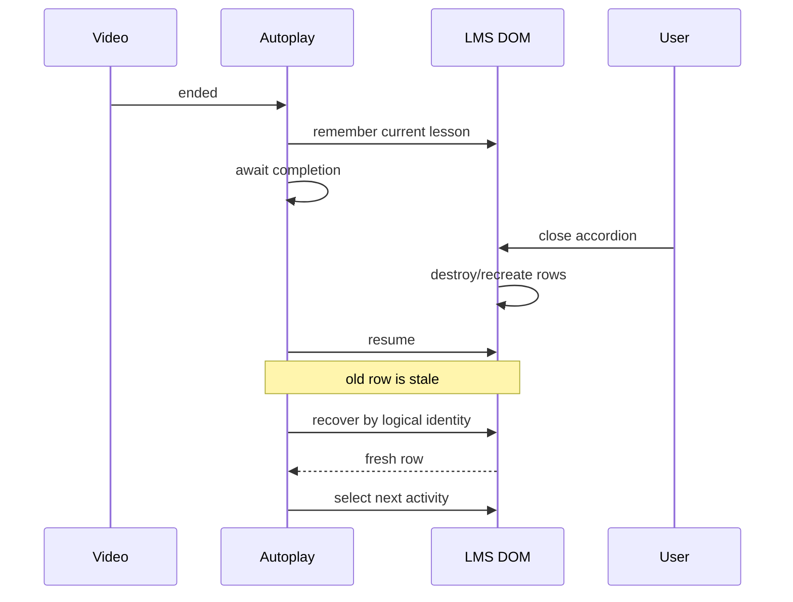

# 14 — Debug, test e regressioni

## Trasformare un bug in conoscenza permanente

> **Snapshot di riferimento del capitolo**  
> Questo capitolo usa il candidato **PlumePilot 2.35.2**, branch `feat/ui-ux-2.35.2`, commit  
> `f6fcb4c29c83ba9150df0be31da04fc91dffb634`.

Un bug corretto oggi può tornare domani.

Un bug corretto e trasformato in:

```text
riproduzione
+ test
+ invariante
```

diventa invece conoscenza permanente del progetto.

Questa è una delle differenze più importanti fra:

```text
"far funzionare il codice"
```

e:

```text
"costruire un sistema che continua a funzionare mentre cambia"
```

PlumePilot è un buon laboratorio perché molte delle sue feature più robuste sono nate da regressioni reali:

```text
accordion chiusi
player riutilizzato
master index stale
display_order ripetuti
tab nascosto
builder duplicato
collisioni fra piattaforme
layout popup differenti
vendor code rifiutato dagli store
```

Ogni caso ci obbliga a fare una domanda più precisa di:

> **“Dov'è il bug?”**

La domanda utile è:

> **“Quale assunzione del nostro modello era falsa?”**

E, subito dopo:

> **“Come facciamo a impedire che la stessa assunzione torni inosservata?”**

---

# Parte I — Il ciclo completo del debugging

## 1. Dal sintomo all'invariante

Il ciclo ideale è:

```text
sintomo
  ↓
riproduzione
  ↓
osservazione
  ↓
ipotesi
  ↓
esperimento
  ↓
root cause
  ↓
fix minimo
  ↓
regression test
  ↓
invariante
```

Molti processi si fermano a:

```text
fix minimo
```

ed è lì che nasce il debito.

---

## 2. Sintomo ≠ root cause

Consideriamo:

```text
"l'autoplay si ferma quando chiudo l'accordion"
```

Una possibile reazione superficiale:

```text
riapri l'accordion
```

Ma il problema profondo era:

```text
l'autoplay aveva implicitamente legato
l'identità logica della lezione
alla presenza corrente della sua riga DOM
```

Quindi la root cause non era:

```text
accordion chiuso
```

ma:

```text
DOM temporaneo usato come identità durevole
```

Il fix architetturale diventa:

```text
remember logical identity
        ↓
await
        ↓
re-resolve fresh DOM row
        ↓
validate
```

Il regression test deve proteggere **questa proprietà**, non soltanto un click specifico.

---

# Parte II — Un bug è una confutazione del modello

## 3. Debugging come metodo scientifico

Possiamo descriverlo così:

```text
modello mentale
   ↓ predice
comportamento atteso
   ↓ confronta
comportamento reale
```

Se divergono:

```text
il modello è incompleto
o
l'implementazione viola il modello
```

Il debugger serve a capire quale delle due.

---

## 4. Esempio: master index

Modello iniziale:

```text
master percentage == 100
        ↓
capitolo completo
```

Esperienza reale:

```text
master == 100
ma
attività ancora incompleta
```

Nuovo modello:

```text
master percentage
      =
euristica / indice

detail response
      =
evidenza più forte

visual fallback
      =
ultima verifica locale
```

Il bug ha raffinato l'architettura.

---

# Parte III — Prima regola: riproduci

## 5. “Ogni tanto succede” non basta

Un bug difficilmente riproducibile produce fix fragili.

Una buona riproduzione definisce:

```text
precondizioni
azioni
timing
stato iniziale
risultato atteso
risultato reale
```

Esempio:

```text
dato:
- capitolo 1 corrente
- ultimo video completo
- primi capitoli successivi completi
- capitolo 5 con video incompleto
- "Salta videolezioni completate" attivo

quando:
- termina il video corrente

allora:
- apri direttamente il target nel capitolo 5

non:
- aprire visivamente capitoli 2, 3 e 4
```

Questa descrizione è già quasi un test.

---

## 6. Riduci il caso

Se il bug appare in un corso di:

```text
80 capitoli
300 video
40 test
```

cerchiamo il minimo modello che conserva la failure:

```text
chapter 1 complete
chapter 2 complete
chapter 3 incomplete
```

Un **minimal reproducer** riduce il search space del debugging.

---

# Parte IV — Separare le dimensioni del problema

## 7. Una matrice di riproduzione

Per una browser extension, le variabili possono essere:

```text
browser
platform
pagina
tab visibility
storage preesistente
autoplay settings
operation running
DOM open/closed
network response
course identity
```

Cambiarne molte insieme confonde la diagnosi.

---

## 8. Metodo one-factor-at-a-time

Se il bug appare solo in Chrome:

prima proviamo:

```text
stesso corso
stesso account
stesse preferenze
stessa versione
stessa attività
```

e cambiamo solo il browser.

Se appare solo in background:

manteniamo il resto uguale e cambiamo:

```text
visible ↔ hidden
```

L'obiettivo è trovare la variabile causale.

---

# Parte V — Debugging di una extension significa scegliere il contesto giusto

## 9. PlumePilot non è un solo programma

Abbiamo almeno:

```text
popup
background
bridge
MAIN-world content
ISOLATED-world content
floating menu
builder pages
generated offline HTML
```

Un `console.log()` nel contesto sbagliato può dirci:

```text
niente
```

anche quando il codice funziona.

---

## 10. Prima domanda: dove dovrebbe essere eseguita questa riga?

Se stiamo debuggando:

```text
chrome.storage.onChanged
```

non ha senso guardare soltanto la console MAIN-world della pagina.

Se stiamo debuggando:

```text
DOM LMS
```

non basta la console del service worker.

Il primo passo è sempre identificare:

```text
execution context
```

---

# Parte VI — MAIN world vs isolated world

## 11. Stesso documento, global diversi

Due script possono vedere lo stesso DOM ma non lo stesso:

```text
window variables
monkey patch
function identity
```

Questo è essenziale quando debugghiamo:

```text
fetch interception
window.postMessage
bridge
```

---

## 12. Failure tipica

Supponiamo:

```text
commission-interceptor.js
```

pubblichi un evento MAIN-world.

Il bridge isolated non lo inoltra.

La domanda non è:

```text
"l'API ha risposto?"
```

ma:

```text
1. request partita?
2. interceptor l'ha vista?
3. postMessage partito?
4. bridge ha ricevuto?
5. runtime message partito?
6. background ha persistito?
```

Stiamo seguendo una **pipeline**.

---

# Parte VII — Debug per boundary

## 13. Instrumentation points

Per un flusso:

```text
A → B → C → D
```

loggare soltanto in D è debole.

Meglio osservare i boundary:

```text
A emitted request X
B received request X
B emitted response X
C forwarded X
D stored X
```

Qui diventano utili:

```text
requestId
operationId
sourceTabId
courseCode
lessonNumber
```

---

## 14. Correlation ID

Il Capitolo 2 aveva già incontrato:

```js
requestId
```

nel mini-RPC.

Nel debugging il suo valore è enorme.

Senza correlation:

```text
response arrivata
```

Con correlation:

```text
response per request studywing-...-17
```

Possiamo distinguere operazioni concorrenti.

---

# Parte VIII — Log utili vs rumore

## 15. Un buon log risponde a una domanda

Log debole:

```text
here
test
step 2
```

Log utile:

```text
Course index: module 5 is 100%; skipping detailed API call
```

contiene:

```text
decisione
identità
motivazione
```

---

## 16. Log invariants, non dettagli casuali

Se il problema è routing:

```text
course
lesson number
lp_id
paragraph id
master order
```

sono utili.

Il colore CSS del bottone no.

L'instrumentation deve seguire l'ipotesi.

---

# Parte IX — Hypothesis-driven debugging

## 17. Evitare modifiche a tentativi

Workflow debole:

```text
cambia timeout
riprova
cambia selector
riprova
aggiungi sleep
riprova
```

Workflow migliore:

```text
ipotesi:
la riga DOM viene sostituita durante waitForLessonCompletion

predizione:
l'oggetto row precedente non sarà più === alla riga nuova

esperimento:
salva identity, attesa, query fresca

risultato:
nuova row con stessa identità logica
```

Ora il fix ha una ragione.

---

# Parte X — Test architecture di PlumePilot

## 18. Non c'è un solo tipo di test

Nel repository troviamo test come:

```text
autoplay-collapsed-followups.mjs
first-incomplete-activities.mjs
test-hidden-tab-recovery.mjs
menu-ux.mjs
test-html-notes.mjs
multiversity-storage-isolation.mjs
epub-regions.mjs
release-candidate-*.mjs
```

Non fanno tutti la stessa cosa.

---

## 19. Classificazione

Possiamo dividerli in:

```text
behavioral unit-ish tests
source invariant tests
contract tests
fixture/golden tests
browser integration checks
artifact/release validation
benchmarks
manual smoke tests
```

Questa tassonomia è più utile della parola generica:

```text
test
```

---

# Parte XI — `node:assert/strict`

## 20. Il test runner minimo

Molti test PlumePilot partono con:

```js
import assert from "node:assert/strict";
```

e usano direttamente:

```js
assert.equal(...)
assert.deepEqual(...)
assert.match(...)
assert.ok(...)
```

Non c'è bisogno di Jest per ogni problema.

Node documenta `node:assert` come modulo stabile per verificare invarianti.

---

## 21. Perché `strict`

Con:

```text
strict equality
deep strict equality
```

evitiamo coercizioni sorprendenti.

In un test di identity:

```js
1
```

e:

```js
"1"
```

non devono essere equivalenti per accidente.

---

# Parte XII — `node:vm` come piccolo laboratorio

## 22. Pattern molto usato

Molti test fanno:

```js
const source = readFileSync(
  new URL("../content.js", import.meta.url),
  "utf8"
);

const context = vm.createContext({
  enabled: true,
  ...
});

vm.runInContext(
  extract("async function ...", "function ..."),
  context
);
```

Questo è un pattern particolare.

---

## 23. Cosa otteniamo

Possiamo eseguire una porzione del codice production fornendo global controllati:

```text
fake DOM
fake timers
fake API
fake storage
fake current chapter
fake video
```

quindi:

```text
production function
      ↓
controlled universe
```

---

## 24. Dependency injection senza framework

Normalmente potremmo scrivere:

```js
function advance({
  currentLesson,
  recoverPlaybackLesson,
  sleep,
  ...
}) { ... }
```

e passare esplicitamente le dipendenze.

Il codice attuale usa molte dipendenze di modulo/global.

`vm.createContext()` permette al test di iniettarle comunque.

È una forma pragmatica di:

**dependency injection at test time**.

---

# Parte XIII — Ma `vm` non è una sandbox di sicurezza

## 25. Distinzione importante

Node documenta esplicitamente che:

```text
node:vm
```

permette di eseguire codice in V8 contexts separati, ma:

```text
non è un security mechanism
```

In PlumePilot non stiamo eseguendo codice ostile.

Stiamo costruendo ambienti di test controllati.

---

# Parte XIV — Il vantaggio dei fake piccoli

## 26. Closed accordion test

In:

```text
tests/autoplay-collapsed-followups.mjs
```

abbiamo:

```js
currentLesson: () => null
```

per simulare:

```text
entrambi gli accordion chiusi
```

mentre:

```js
recoverPlaybackLesson:
  async () =>
    ++recoveries === 1
      ? firstRow
      : restoredRow
```

simula una riga DOM ricostruita.

---

## 27. Il test non simula React

Non serve implementare l'intera piattaforma.

Ci interessa una proprietà:

```text
dopo l'await la row vecchia non è più affidabile
```

Il fake simula esattamente quel fatto.

Questo è un buon test double.

---

# Parte XV — Regression test 1: accordion chiuso

## 28. Il requisito

Il test afferma:

```js
assert.equal(
  nextRowReceived,
  restoredRow,
  "advance must use the re-rendered lesson row"
);
```

Questa frase è quasi una specifica.

Non dice:

```text
chiama funzione X
```

Dice:

```text
usa la riga ricostruita
```

---

## 29. Negative case

Subito dopo:

```js
assert.equal(
  nextRowReceived,
  null,
  "a different active lesson must not be advanced"
);
```

Un regression test forte include spesso:

```text
positive path
+
negative guard
```

Perché il fix:

```text
riapri sempre e continua
```

avrebbe potuto sovrascrivere una scelta manuale dell'utente.

---

# Parte XVI — Test di una race senza aspettare il tempo reale

## 30. Timer controllato

Nel test:

```js
setTimeout: (fn) => {
  pendingTimer = fn;
  return 1;
}
```

Non aspettiamo davvero.

Conserviamo il callback.

Poi:

```js
await pendingTimer();
```

Questo ci permette di decidere precisamente:

```text
cosa cambia prima che il timer scatti
```

---

## 31. Deterministic race test

Per esempio:

```text
schedule resume
      ↓
utente avvia di nuovo il video
      ↓
esegui timer
      ↓
non deve avanzare
```

Una race temporale diventa un test deterministico.

---

# Parte XVII — Regression test 2: player riutilizzato

## 32. Stesso `<video>`, contenuto diverso

La piattaforma può riutilizzare lo stesso elemento video.

Il test crea:

```js
const reused = {
  ended: true,
  duration: 60,
  currentTime: 60,
  addEventListener(...)
};
```

poi simula:

```text
ended
play
ended
```

sullo stesso oggetto.

---

## 33. Invariante

```text
ogni video reale terminato
deve poter generare un nuovo advance
```

senza assumere:

```text
nuovo elemento DOM
```

Il regression test protegge esattamente questa semantica.

---

# Parte XVIII — Regression test 3: hidden tab

## 34. Il bug

Un tab nascosto può subire:

```text
timer clamping
rendering sospeso
DOM non aggiornato
```

Un wait può scadere.

Se interpretiamo il timeout come:

```text
pagina rotta
```

potremmo fare reload inutili.

---
## 35. Fake clock

`test-hidden-tab-recovery.mjs` definisce:

```js
let now = 0;

Date: {
  now: () => now
}
```

e:

```js
sleep = async (ms) => {
  now += ms;
  ...
};
```

Nessun secondo reale deve passare.

Il tempo è parte dell'input del test.

---

## 36. Visibility transition

Il test parte:

```text
hidden
```

poi a `now >= 350`:

```text
visible
```

ed emette:

```text
visibilitychange
```

La proprietà verificata:

```js
assert.equal(
  result.rendered,
  true,
  "DOM waits must resume after the tab is visible"
);
```

---

## 37. Secondo invariante

```js
assert.equal(
  reloads,
  0,
  "chapter recovery must not reload a hidden page"
);
```

Questa è una safety property:

```text
hidden page
→ no destructive recovery
```

---

# Parte XIX — Testing safety e liveness

## 38. Safety

“Non deve succedere qualcosa di sbagliato.”

Esempio:

```text
non reloadare hidden tab
non avanzare una lezione diversa
non rispondere automaticamente a un test nel bookmark
```

---

## 39. Liveness

“Prima o poi deve succedere qualcosa di corretto.”

Esempio:

```text
quando il tab torna visibile
il wait deve poter proseguire
```

Un sistema può essere safe ma bloccato.

Oppure live ma pericoloso.

Servono entrambi.

---

# Parte XX — Regression test 4: first incomplete

## 40. Una suite quasi algoritmica

`first-incomplete-activities.mjs` costruisce:

```text
outline
master index
detail response
visible activity
fallback state
```

e combina casi.

Questo non è soltanto un test UI.

È un test dell'algoritmo di discovery.

---

## 41. Property: earliest incomplete

Per:

```text
chapter 2 pending
```

il test pretende:

```js
assert.equal(
  result.entry.lessonNumber,
  2
);
```

e inoltre:

```js
assert.deepEqual(
  requested.map(args => args[1]),
  [1, 2]
);
```

Quindi verifica:

```text
correttezza del risultato
+
costo/ordine della ricerca
```

---

# Parte XXI — Performance può essere parte della specifica

## 42. Un test interessante

Con master:

```text
chapter 4 = 80%
others = 100%
```

il test richiede:

```js
requested === [4]
```

Non basta trovare capitolo 4.

Deve usare l'indice per:

```text
non interrogare inutilmente 1,2,3
```

Questo è un **performance invariant**.

---

## 43. Ma senza sacrificare correctness

Se chapter 4 si rivela completo ma chapter 1 è in realtà incompleto:

```js
requested === [4, 1]
```

La suite protegge quindi contemporaneamente:

```text
fast path
+
fallback completeness
```

---

# Parte XXII — Positive + adversarial examples

## 44. Testare soltanto il caso ideale è debole

La suite include:

```text
master all 100%
master stale
ambiguous identity
API failed
missing test metadata
unknown objective percentage
current visible activity
navigation during discovery
```

Questi sono **adversarial cases**.

Non nel senso security.

Nel senso:

```text
input che mette in crisi le nostre assunzioni
```

---

# Parte XXIII — Ternary state nei test

## 45. Known complete / known incomplete / unknown

Un pattern importante:

```text
percentage = 100
percentage = 0
percentageKnown = false
```

Il test verifica che:

```text
unknown
```

non venga interpretato arbitrariamente come:

```text
complete
```

o:

```text
incomplete
```

Questo protegge il modello introdotto nel Capitolo 8.

---

# Parte XXIV — Regression test 5: repeated `display_order`

## 46. Il problema di identity

`playback-master-routing.mjs` costruisce:

```text
Section A:
  1 Alpha
  2 Beta

Section B:
  1 Gamma
  2 Delta
```

Quindi:

```text
display_order
```

si ripete.

---

## 47. Testare l'ambiguità

La suite verifica:

```js
assert.equal(
  playbackCourseRouteMap(ambiguous, outline).size,
  0
);
```

Se non abbiamo abbastanza evidenza:

```text
non mappiamo
```

anziché:

```text
indovinare
```

È un test di **fail-closed identity matching**.

---

# Parte XXV — Test della non-azione

## 48. I test migliori spesso verificano che qualcosa NON avvenga

Esempi reali:

```text
non saltare video durante replay
non aprire capitoli intermedi
non submit test dal bookmark
non reloadare hidden tab
non usare route ambigua
non nascondere cancel control
```

Questi casi proteggono side effect pericolosi.

---

# Parte XXVI — Test dei contract di storage

## 49. Multiversity isolation

Con il supporto a più università nasce il rischio:

```text
exam_id 7 Pegaso
exam_id 7 Mercatorum
```

Se usiamo soltanto:

```text
7
```

come identity:

```text
collisione
```

---

## 50. Il test costruisce la collisione apposta

`multiversity-storage-isolation.mjs` salva simultaneamente:

```text
pegaso: exam_id 7
mercatorum: exam_id 7
```

e poi pretende entrambe.

Questo è un **collision test**.

---

## 51. Concurrency inclusa

Il test usa:

```js
await Promise.all([
  storePegaso(),
  storeMercatorum()
]);
```

Quindi non verifica soltanto l'identità.

Verifica anche che la serializzazione delle write non perda uno dei due update concorrenti.

---

# Parte XXVII — Test di backward compatibility

## 52. Legacy key

La stessa suite verifica che:

```text
SAME
```

senza platform prefix venga ancora interpretato come legacy Pegaso.

Ma non come Mercatorum.

Questo è un test di migration semantics.

---

## 53. Perché è importante

Una migrazione non deve soltanto:

```text
leggere nuovo formato
```

Deve definire:

```text
cosa significa il vecchio formato
```

Il test lo rende esplicito.

---

# Parte XXVIII — Source invariant tests

## 54. Non tutti i test eseguono davvero la feature

`ui-mode-invariants.mjs` contiene assertion come:

```js
assert.match(
  popupHtmlSource,
  /id="chapterLimitValue" .../
);
```

oppure:

```js
assert.ok(
  contentSource.indexOf("if (thresholdReached)") <
  contentSource.indexOf("if (sessionLimitReached)")
);
```

Questi sono test sul sorgente.

---

## 55. Cosa proteggono bene

Sono ottimi per invarianti strutturali semplici:

```text
asset incluso nel manifest
ordine di due guardie
elemento presente
default dichiarato
file caricato prima di un altro
CSS rule esistente
```

Costano pochissimo.

---

# Parte XXIX — Cosa proteggono male

## 56. Source match ≠ comportamento

Questo test:

```js
assert.match(
  source,
  /someFunction/
);
```

dimostra:

```text
la stringa esiste
```

non:

```text
la funzione funziona
```

Perciò i source tests devono integrare, non sostituire, i behavioral tests.

---

# Parte XXX — Structural tests come architecture tests

## 57. Un uso molto valido

In `menu-ux.mjs` troviamo:

```js
assert.ok(
  scripts.indexOf("menu-ux.js") <
  scripts.indexOf("floating-menu.js")
);
```

Qui l'ordine di caricamento è un contratto architetturale.

Il test sul manifest è perfettamente appropriato.

---

## 58. Architecture test

Possiamo chiamare questa categoria:

**architecture tests**.

Verificano cose come:

```text
dipendenza A prima di B
layer X non importa Y
manifest contiene asset
shared module presente in entrambe le UI
```

Non cercano di simulare l'utente.

Proteggono la forma del sistema.

---

# Parte XXXI — Test del generated output

## 59. HTML quiz

`test-html-notes.mjs` fa una cosa interessante.

Esegue:

```text
test-builder.js
```

con:

```text
fake document
fake storage
fake job
```

poi clicca logicamente:

```text
downloadHtml
```

e cattura il `Blob`.

---

## 60. Verifica il prodotto generato

Il test apre il testo del Blob e controlla:

```text
note key
toolbar
review filters
theme
Unicode
signature
sanitization calls
```

Questo è più forte di testare soltanto:

```text
funzione generateHtml()
```

perché osserva l'artefatto finale.

---

## 61. E verifica persino che lo script sia parsabile

La suite estrae:

```html
<script> ... </script>
```

e fa:

```js
new Function(script);
```

Qui l'obiettivo non è eseguire codice remoto.

È usare il parser JS locale come syntax check del documento generato.

---

# Parte XXXII — Test del browser reale

## 62. Node non può riprodurre tutto

Un fake DOM non ci dirà realmente:

```text
font caricato?
focus visibile?
scroll corretto?
Shadow DOM layout?
checkbox accent?
clipping?
animation?
```

Per questo la 2.35.2 include:

```text
scripts/check-menu-ux-browser.mjs
```

che esegue popup e floating controller in Chromium con uno store extension mock condiviso.

---

## 63. Browser integration layer

Questo livello verifica casi come:

```text
Back / Escape
focus restoration
settings sync
layout sync
hidden active operation
font loading
disclosure scrolling
runtime exceptions
```

Sono proprietà difficili da validare con sole regex.

---

# Parte XXXIII — E2E e internal state

## 64. Cosa suggerisce anche Chrome

La documentazione Chrome sui test end-to-end consiglia, quando possibile, di basare gli integration test su ciò che è visibile all'utente invece di legarsi troppo allo stato interno.

Perché?

Se testiamo:

```text
implementation detail
```

ogni refactor rompe la suite anche se il comportamento utente è identico.

---

## 65. Contract-oriented E2E

Meglio verificare:

```text
clic → risultato visibile
setting → UI sincronizzata
operazione → cancel disponibile
```

piuttosto che:

```text
variabile interna foo === 3
```

salvo quando quella variabile rappresenta un contract importante.

---

# Parte XXXIV — Testare service worker termination

## 66. Il debugger può mentire senza volerlo

Chrome documenta un dettaglio molto importante:

```text
aprire DevTools sul service worker
può mantenerlo attivo
```

Quindi un bug di lifecycle può sparire mentre lo stiamo osservando.

È un classico **observer effect** nel debugging.

---

## 67. Conseguenza

Una feature che dipende accidentalmente da:

```text
global memory del service worker
```

può sembrare stabile durante il debug.

Poi fallire in produzione quando il worker viene terminato.

---

## 68. Test esplicito

Chrome documenta anche come terminare il service worker durante un test Puppeteer e verificare che l'estensione continui a rispondere.

Per PlumePilot sarebbe un futuro test molto utile per:

```text
operation recovery
sound state
builder ownership
commission leases
```

---

# Parte XXXV — Flaky test

## 69. Cos'è

Un test flaky:

```text
stesso codice
stesso input
→ a volte passa
→ a volte fallisce
```

È particolarmente pericoloso nei sistemi asincroni.

---

## 70. Cause comuni nel nostro dominio

```text
sleep reale
network reale
DOM timing
animation
service worker lifetime
focus
background tab throttling
ordine eventi
```

---

# Parte XXXVI — Come PlumePilot evita parte della flakiness

## 71. Fake time

Come visto:

```text
Date.now controllato
sleep simulato
timer callback catturato
```

---

## 72. Fake API

Le detail request diventano funzioni deterministiche:

```js
requestLessonWithRetry: async (...) => ({
  ok: true,
  data: ...
});
```

---

## 73. Fake DOM minimo

Costruiamo solo:

```text
row
video
chapter
document visibility
```

necessari all'invariante.

Questa è una forma di **hermetic-ish testing**.

---

# Parte XXXVII — Ma non eliminare tutta la realtà

## 74. Un rischio opposto

Se tutti i test usano fake perfetti:

```text
produzione può fallire
perché il browser vero è diverso
```

Quindi servono livelli complementari:

```text
fast deterministic tests
+
real browser checks
+
manual exploratory smoke
```

---

# Parte XXXVIII — Test pyramid? Non esattamente

## 75. Modello classico

```text
       E2E
     integration
       unit
```

molti unit test, pochi E2E.

---

## 76. Per una extension integrata in un LMS

Abbiamo tante boundary esterne:

```text
browser
DOM host
API host
storage
manifest
store
```

Una forma più realistica è:

```text
pure/VM behavioral tests   ← molti
architecture/contracts     ← molti
browser fixture tests      ← alcuni
artifact validation        ← sempre
live platform smoke        ← pochi ma indispensabili
```

Non è una piramide perfetta.

---

# Parte XXXIX — Test matrix

## 77. Ogni bug dovrebbe suggerire assi

Per autoplay:

```text
completed / incomplete
skip on / off
test policy
accordion open / closed
same / next section
master accurate / stale
visible / hidden
```

Non possiamo testare il prodotto cartesiano completo.

---

## 78. Pairwise thinking

Cerchiamo combinazioni che coprano interazioni importanti.

Esempio:

```text
skip enabled
+
next chapter complete
+
target chapter incomplete
```

ha scoperto una regressione reale.

---

# Parte XL — State transition coverage

## 79. Dal Capitolo 7

Per una state machine non ci interessa soltanto:

```text
line coverage
```

ma:

```text
transition coverage
```

Esempio:

```text
WATCHING → VERIFYING → NEXT_VIDEO
WATCHING → VERIFYING → TEST_STOP
WATCHING → VERIFYING → NEXT_CHAPTER
WATCHING → VERIFYING → THRESHOLD_STOP
```

---

## 80. Guard coverage

Ogni guard critica dovrebbe avere:

```text
true case
false case
```

Per esempio:

```text
busy = false
busy = true
```

oppure:

```text
v === lastVideo
v !== lastVideo
```

---

# Parte XLI — Code coverage non è behavioral coverage

## 81. 100% line coverage può mentire

Una funzione può essere eseguita interamente senza testare:

```text
ordine eventiidentity collision
stale state
race
negative side effect
```

Quindi la domanda migliore è:

> **Quale proprietà del sistema abbiamo dimostrato?**

---

# Parte XLII — Test names come documentazione

## 82. Messaggi delle assertion

Esempio reale:

```text
"master 100% is not evidence
that every activity is complete"
```

Questo non è soltanto utile quando fallisce.

È documentazione dell'architettura.

---

## 83. Un buon regression test racconta la storia

Preferiamo:

```text
hidden DOM timeout must not trigger reload
```

a:

```text
test case 7
```

Fra sei mesi, il primo spiega perché il codice “strano” esiste.

---

# Parte XLIII — Bug archaeology

## 84. Changelog + test + source

Per comprendere un workaround possiamo triangolare:

```text
CHANGELOG
test
production code
```

Il changelog racconta:

```text
perché
```

Il test:

```text
cosa non deve regredire
```

Il source:

```text
come lo implementiamo
```

Questa è una tecnica potente nei progetti longevi.

---

# Parte XLIV — Git bisect come strumento concettuale

## 85. Quando sappiamo che prima funzionava

Se:

```text
v2.34 funziona
v2.35 fallisce
```

Git ci permette di restringere il range.

`git bisect` automatizza la ricerca binaria fra commit good/bad.

Anche senza usarlo letteralmente, il modello è:

```text
history search space
      ↓ dimezza
candidate range
```

---

## 86. Un test automatizzato rende bisect molto più potente

Se abbiamo un comando:

```bash
node tests/foo.mjs
```

possiamo usarlo come oracle:

```text
good / bad
```

e trovare il commit che introduce la regressione.

---

# Parte XLV — Root cause vs contributing factors

## 87. Un bug può avere più cause

Esempio hidden-tab:

```text
timer clamping
+
DOM non aggiornato
+
timeout interpretato come failure
+
reload recovery aggressivo
```

Qual è la root cause?

Spesso è più utile dire:

```text
root design flaw:
timeout was treated as proof of page failure

contributing factors:
hidden tab scheduling + rendering
```

---

# Parte XLVI — Five Whys, ma tecnici

## 88. Esempio

**Perché autoplay ha aperto il capitolo sbagliato?**

Perché route map ha associato `display_order = 1`.

**Perché era ambiguo?**

Perché `display_order` ricomincia in ogni folder.

**Perché lo trattavamo come globale?**

Perché avevamo dedotto identity da un campo presentazionale.

**Perché non avevamo un secondo controllo?**

Perché il primo supportava un solo layout.

**Quale invariante manca?**

```text
non usare una label locale come identity globale
```

Ora il test può proteggerla.

---

# Parte XLVII — Instrumentation temporanea vs permanente

## 89. Debug log temporaneo

Possiamo aggiungere:

```js
console.log(allDOMNodes)
```

per una sessione.

Poi rimuoverlo.

---

## 90. Diagnostic permanente

Può valere la pena mantenere:

```text
operationId
lessonNumber
fallback reason
retry count
```

perché descrive eventi di dominio utili anche in futuro.

---

# Parte XLVIII — Privacy del debugging

## 91. Non loggare per default dati sensibili

Una extension opera su:

```text
contenuto universitario
sessioni autenticate
esami
```

Un log deve evitare:

```text
token
credential
raw private payload non necessario
```

La diagnostica deve essere:

```text
minima
sanitizzata
locale
```

---

# Parte XLIX — Error messages come strumenti diagnostici

## 92. "Failed" non basta

Confronta:

```text
Request failed
```

con:

```text
API resume discovery could not read module 5;
opening that module directly for visual verification
```

Il secondo comunica:

```text
dove
cosa
fallback scelto
```

---

# Parte L — User-visible errors e developer diagnostics

## 93. Due audience

L'utente ha bisogno di:

```text
"Impossibile leggere questo capitolo.
Provo la verifica visuale."
```

Il developer può aver bisogno di:

```text
lesson 5
error LESSON_DATA_INCOMPLETE
lpId 104
paragraphId 204
```

Non serve mostrare tutto all'utente.

---

# Parte LI — Test del fallback

## 94. Un fallback non è decorativo

Se scriviamo:

```text
API fails → DOM fallback
```

dobbiamo testare:

```text
API fails davvero
fallback selezionato
fallback produce risultato
```

Altrimenti il fallback può marcire inosservato.

---

# Parte LII — First-incomplete: failure injection

## 95. Il test usa:

```js
if (args[1] === failedChapter) {
  return {
    ok: false,
    error: "LESSON_DATA_INCOMPLETE"
  };
}
```

Questa è **failure injection**.

Non aspettiamo che l'API reale fallisca casualmente.

Costruiamo il failure state.

---

## 96. Risultato atteso

```js
assert.equal(
  failed.result.visualVerification,
  true
);
```

Il test non pretende:

```text
nessun errore
```

Pretende:

```text
errore gestito correttamente
```

Questa è resilienza testata.

---

# Parte LIII — Testare cancellation

## 97. Cancellazione è un comportamento

Una Promise abortita non è semplicemente una Promise fallita.

I test dovrebbero distinguere:

```text
failure
cancel
timeout
```

Il Capitolo 5 aveva già separato queste semantiche.

---

## 98. Cancellation latency

Per operazioni lunghe è utile testare:

```text
quanto spesso controlliamo abort signal?
```

Per questo l'EPUB inserisce:

```text
throwIfAborted()
yieldToBrowser()
```

in vari punti.

Un futuro test potrebbe imporre abort durante:

```text
render
encode
regional analysis
ZIP preparation
```

e verificare cleanup.

---

# Parte LIV — Benchmark ≠ test

## 99. Una distinzione importante

Un test risponde:

```text
è corretto?
```

Un benchmark:

```text
quanto costa?
```

---

## 100. Esempio EPUB

Gli script:

```text
benchmark-epub-node.mjs
benchmark-epub-regions.mjs
```

raccolgono:

```text
elapsedMs
asset counts
EPUB bytes
diagnostics
```

Non dovremmo trasformare un singolo timing in:

```text
assert elapsed < 1200ms
```

su qualsiasi macchina.

Sarebbe flaky.

---

# Parte LV — Performance regression testing

## 101. Cosa possiamo rendere stabile

Meglio testare invarianti come:

```text
chapter 5 è l'unica detail call necessaria
cache bounded <= 50
canvas viene rilasciato
no duplicate image asset
```

Questi sono proxy più deterministici del wall-clock.

---

## 102. Timing benchmark separato

Poi misuriamo:

```text
baseline
new implementation
```

sullo stesso ambiente.

Test e benchmark si completano.

---

# Parte LVI — Golden / fixture testing

## 103. EPUB

Una fixture può rappresentare:

```text
tabella
formula
slide visuale
testo normale
mixed page
```

e diventare input stabile.

---

## 104. Golden output

Possiamo confrontare:

```text
struttura XHTML
numero asset
manifest
region bounds
testo estratto
```

senza necessariamente pretendere bytes identici per ogni libreria/browser.

---

# Parte LVII — Snapshot testing: utile ma pericoloso

## 105. Snapshot enorme

Salvare:

```text
intero popup HTML
```

e confrontarlo byte per byte può produrre diff enormi per modifiche irrilevanti.

---

## 106. Preferire semantic snapshots

Meglio estrarre:

```text
tab labels
action order
ARIA states
visible groups
```

e confrontare una rappresentazione semantica.

---

# Parte LVIII — UI regression

## 107. Il problema dei pixel

Bug come:

```text
Preferenze troppo stretta
checkbox accent incoerente
spazio insufficiente
```

non sempre emergono da DOM assertions.

---

## 108. Tre livelli

```text
CSS invariant
browser DOM/layout check
visual screenshot review
```

Per alcune regressioni serve davvero il terzo.

---

# Parte LIX — Screenshot test

## 109. Quando serve

Utile per:

```text
layout
clipping
spacing
theme
font
sprite
```

Meno utile per:

```text
algoritmo autoplay
storage migration
API retry
```

---

## 110. Stabilità

Visual regression richiede controllare:

```text
browser version
font
viewport
DPI
animation
OS rendering
```

altrimenti avremo rumore.

---

# Parte LX — Accessibility regression

## 111. Focus è stato

Nel Capitolo 11 abbiamo visto:

```text
Back
Escape
tab navigation
roving tabindex
```

Un refactor visuale può rompere accessibilità senza cambiare la UI apparente.

---

## 112. Testare focus

Proprietà utili:

```text
open detail → title focused
Escape → opener focused
tab switch → exactly one tabindex=0
hidden panel → not focusable
```

Questi sono behavior tests, non screenshot.

---

# Parte LXI — Test dell'ordine

## 113. Molti bug sono ordering bugs

Esempi:

```text
stop 70% prima del session limit
master incomplete candidates prima dei 100%
current chapter check prima del master refresh
storage write serialized
menu dependency caricata prima del controller
```

---

## 114. L'ordine è parte del contract

Se l'ordine cambia:

```text
stesse funzioni
stessi dati
```

possono produrre comportamento diverso.

Perciò è legittimo testarlo.

---

# Parte LXII — Concurrency testing

## 115. Non servono thread

Un test JS può creare concurrency logica con:

```js
Promise.all([...])
```

e controllare:

```text
read-modify-write
serialization
deduplication
```

---

## 116. Rendere la race più probabile

Nel test storage:

```js
storageGetMany: async (...) => {
  await new Promise(resolve => setTimeout(resolve, 2));
  ...
}
```

Il piccolo delay espone una possibile interleaving.

Poi la queue deve impedire lost update.

---

# Parte LXIII — Race testing più rigoroso

## 117. Barrier controllate

Un pattern futuro migliore:

```text
Promise barrier A
Promise barrier B
```

per decidere esattamente:

```text
task 1 legge
task 2 legge
task 1 scrive
task 2 scrive
```

Questo evita affidarsi a 2ms reali.

---

# Parte LXIV — Determinismo dei test

## 118. Ogni fonte di nondeterminismo va identificata

```text
clock
random
network
browser scheduling
storage state
DOM order
locale
timezone
```

---

## 119. Controllare ciò che conta

Non significa mockare tutto.

Significa sapere quali input devono essere fissi per rendere significativo il risultato.

---

# Parte LXV — Randomness e IDs

## 120. `crypto.randomUUID()`

In produzione è ottimo per:

```text
operationId
jobId
```

In un test che confronta output potremmo iniettare un UUID deterministico.

Non vogliamo snapshot che cambiano a ogni run per motivi irrilevanti.

---

# Parte LXVI — Locale e timezone

## 121. Date test

Se testiamo:

```text
Intl.DateTimeFormat("it-IT")
```

dobbiamo sapere se:

```text
timezone locale
```

influenza il risultato.

Un test robusto controlla o evita dipendenze non necessarie.

---

# Parte LXVII — Test isolation

## 122. Un test non deve dipendere dal precedente

Se test A lascia:

```text
storage.enabled = false
```

e test B assume true:

```text
order-dependent suite
```

è un smell.

---

## 123. Fresh state

Ogni test dovrebbe costruire:

```text
context
stored
document
maps
```

da zero, salvo test espliciti di upgrade/migration.

---

# Parte LXVIII — Regression test vicino al fix

## 124. Quando aggiungerlo

Idealmente:

```text
riproduci failure con test rosso
      ↓
applica fix
      ↓
verde
```

Questo è il classico:

**red → green → refactor**.

---

## 125. Nei bug difficili

A volte dobbiamo prima esplorare manualmente.

Ma prima di considerare chiuso il bug, proviamo comunque a catturare la property in un test.

---

# Parte LXIX — Non ogni bug merita un test enorme

## 126. Proporzionalità

Un typo statico:

```text
"Capitoli" font errato
```

può essere protetto da una semplice CSS invariant.

Non serve avviare tre browser.

---

## 127. Scegli il livello più basso che prova la proprietà

Regola molto utile:

> **Testa al livello più basso che può dimostrare correttamente il comportamento.**

Questo riduce:

```text
tempo
flakiness
complessità
```

---

# Parte LXX — Ma non più basso

## 128. Errore opposto

Se la property è:

```text
focus torna realmente al bottone dopo Escape
```

una regex su:

```text
.focus()
```

non basta.

Serve un ambiente DOM/browser che esegua il comportamento.

---

# Parte LXXI — Testing seams

## 129. Cos'è un seam

Un **test seam** è un punto in cui possiamo sostituire una dipendenza.

Esempi:

```text
fetchImpl
clock
storage wrapper
DOM adapter
API adapter
```

Più chiari sono i seam, più facile è testare.

---

## 130. PlumePilot oggi

Molti seam sono impliciti e vengono costruiti con:

```text
vm globals
```

Funziona, ma segnala anche una possibile evoluzione architetturale.

---

# Parte LXXII — Il limite dell'estrazione testuale

## 131. Pattern attuale

```js
source.slice(
  source.indexOf("async function X"),
  source.indexOf("function Y")
)
```

È estremamente pratico.

Ma dipende dalla struttura testuale.

---

## 132. Refactor innocuo può rompere il test

Se spostiamo:

```text
helper Y
```

prima di X, il comportamento production può essere identico ma il test non trova più il boundary.

Questo è **test brittleness**.

---

# Parte LXXIII — Test brittleness

## 133. Definizione

Un test è brittle se fallisce facilmente per modifiche che non cambiano la property che vuole proteggere.

Esempi:
```text
exact DOM string
exact source ordering non semantico
private variable name
whitespace
```

---

## 134. Non è tutto male

A volte vogliamo intenzionalmente proteggere:

```text
source order
```

come nel caso delle guardie.

La domanda è:

```text
questa forma è davvero parte del contract?
```

---

# Parte LXXIV — Evoluzione futura: moduli testabili

## 135. Estrarre pure helpers

In futuro potremmo spostare:

```text
courseIndexRouteMap
autoplayPresentation
normalizeLayout
candidate ordering
identity matching
```

in moduli con export espliciti.

---

## 136. Vantaggio

Test:

```js
import {
  courseIndexRouteMap
} from "../playback-discovery.mjs";
```

anziché:

```text
slice content.js
create VM
inject globals
```

---

## 137. Ma attenzione al refactor massivo

`content.js` opera in un ambiente particolare e alcune funzioni dipendono fortemente dal DOM host.

Estrarre tutto per “testabilità” può creare abstraction artificiale.

Meglio estrarre:

```text
logica pura / quasi pura
```

non necessariamente ogni funzione.

---

# Parte LXXV — Contract tests

## 138. Boundary esterni

PlumePilot dipende da contratti non controllati:

```text
Multiversity API
DOM shape
Chrome API
Firefox manifest
store policy
```

---

## 139. Contract test

Un contract test verifica:

```text
la forma che ci aspettiamo
```

per esempio:

```text
outline entry contains display_order
lesson response maps lp_id/id
manifest references existing files
```

---

## 140. Contract drift

Quando il provider cambia:

```text
field
DOM nesting
route
```

il test dovrebbe fallire vicino al boundary, non produrre un bug lontano.

---

# Parte LXXVI — Defensive parsing tests

## 141. Test input malformed

Per normalizzatori:

```text
null
missing field
string instead of number
oversized text
duplicate identity
```

sono input importanti.

---

## 142. Obiettivo

Non necessariamente:

```text
accetta tutto
```

ma:

```text
fail predictable
```

---

# Parte LXXVII — Release artifact testing

## 143. Dal Capitolo 13

`validate-release.mjs` verifica lo ZIP finale.

Questo è debugging preventivo.

---

## 144. Failure esempio

Source:

```text
corretto
```

Build:

```text
menu-ux.css dimenticato
```

Runtime source tests:

```text
verdi
```

Artifact validator:

```text
rosso
```

Ogni layer cattura classi di bug diverse.

---

# Parte LXXVIII — Smoke test manuale

## 145. Automatizzare tutto non è realistico

Prima di store submission abbiamo ancora valore in:

```text
install package reale
login demo
open course
popup
floating menu
export
quiz
commission page
```

---

## 146. Ma smoke test deve essere una checklist

Non:

```text
"faccio un giro"
```

Meglio:

```text
1. install
2. course loads
3. popup state matches
4. floating state matches
5. first incomplete
6. PDF/HTML export
7. EPUB builder opens
8. operation cancel
9. preferences persist
10. no console fatal errors
```

La ripetibilità conta anche nel manual testing.

---

# Parte LXXIX — Exploratory testing

## 147. Checklist e exploration non sono opposti

La checklist verifica invarianti conosciuti.

L'exploratory testing cerca:

```text
problemi che non sappiamo ancora nominare
```

Entrambi servono.

---

# Parte LXXX — Dogfooding

## 148. Usare davvero il prodotto

Molte regressioni di PlumePilot sono emerse perché il prodotto veniva usato su:

```text
corsi reali
layout reali
sequenze reali
```

Questo produce input molto più ricchi dei fixture.

---

## 149. Ma il dogfooding non sostituisce il test

Quando troviamo il bug:

```text
esperienza reale
      ↓
minimal reproducer
      ↓
automated regression
```

Altrimenti rimane conoscenza nella memoria del maintainer.

---

# Parte LXXXI — Bug report di qualità

## 150. Informazioni utili

Un report efficace contiene:

```text
versione PlumePilot
browser/versione
piattaforma
pagina/corso
precondizioni
passi
expected
actual
riproducibilità
console error rilevanti
```

---

## 151. Screenshot/video

Sono molto utili per:

```text
layout
timing
focus
navigation
```

meno per:

```text
API identity
storage race
```

Il formato del report deve adattarsi al bug.

---

# Parte LXXXII — Regression severity

## 152. Non tutte le regressioni hanno stesso rischio

Possiamo classificare:

```text
data corruption
wrong side effect
navigation error
operation lock
export failure
UI inaccessible
visual polish
store rejection
```

Questo aiuta a prioritizzare.

---

# Parte LXXXIII — Bug che richiedono fail-closed

## 153. Identity ambiguity

Se non sappiamo quale capitolo corrisponde:

```text
non saltare
```

---

## 154. Test completion ambiguity

Se non sappiamo se un test è completo:

```text
non dichiarare tutto completato
```

---

## 155. Review transform ambiguity

Se `replaceExactly()` non trova esattamente il pattern:

```text
non produrre Firefox ZIP
```

Questi sono tutti la stessa filosofia:

**incertezza + side effect rischioso → stop / fallback sicuro**.

---

# Parte LXXXIV — Bug che richiedono retry

## 156. Non tutto deve fail-closed immediatamente

Una rete transitoria:

```text
retry
```

Un DOM che non ha ancora renderizzato:

```text
wait
```

Una identity ambigua:

```text
non indovinare
```

Il debugging serve anche a classificare l'errore correttamente.

---

# Parte LXXXV — Error taxonomy → recovery policy

## 157. Tabella mentale

| Failure | Recovery |
|---|---|
| rete temporanea | retry/backoff |
| API incomplete | visual fallback |
| DOM not ready | wait/re-observe |
| identity ambiguous | stop/fallback |
| hidden tab timeout | defer |
| stale cache | refresh |
| user cancel | abort/cleanup |
| artifact invariant | fail build |
| store warning | classify/document |

La stessa parola:

```text
errore
```

non basta.

---

# Parte LXXXVI — Debugging async con timeline

## 158. Scrivere gli eventi

Quando una race è difficile:

```text
T0 video ended
T1 advance starts
T2 wait begins
T3 accordion closes
T4 DOM re-render
T5 wait resolves
T6 stale row used
```

La timeline spesso rende evidente il bug prima del debugger.

---

## 159. Sequence diagram



Questo diagramma è anche una specifica temporale.

---

# Parte LXXXVII — Debugging storage race con timeline

## 160. Lost update

```text
Task A read {pegaso}
Task B read {pegaso}
Task A write {pegaso, mercatorum}
Task B write {pegaso, utsr}
```

Risultato:

```text
mercatorum perso
```

La queue serializzata cambia la timeline:

```text
A read
A write
B read updated state
B write
```

---

# Parte LXXXVIII — Test delle timeline

## 161. Controlla i punti di sospensione

Ogni:

```js
await
```

è un potenziale punto di interleaving.

Nel test chiediamo:

```text
cosa può cambiare qui?
```

Poi costruiamo il cambio.

---

# Parte LXXXIX — Regression budget

## 162. Ogni feature aumenta lo spazio di stato

Aggiungiamo:

```text
skip videos
test policy
70% stop
chapter limit
bookmark
```

Le combinazioni crescono velocemente.

---

## 163. Test suite come compressione della conoscenza

Non possiamo enumerare tutti gli stati.

Scegliamo casi che rappresentano proprietà:

```text
order preserved
priority respected
manual selection wins
unknown doesn't become complete
active operation remains cancellable
```

Un buon test copre una classe di bug, non una singola sequenza.

---

# Parte XC — Property-based thinking senza library

## 164. Esempio candidate ordering

Property:

```text
all suspected incomplete chapters
must preserve relative course order
```

Possiamo testare:

```text
[100,80,80,100]
→ request [2,3]
```

---

## 165. Futuro: property-based testing

Una library potrebbe generare automaticamente:

```text
percentages
orders
duplicate labels
missing IDs
```

e verificare invarianti.

Sarebbe interessante per:

```text
route mapping
layout normalization
storage migrations
```

---

# Parte XCI — Fuzzing leggero

## 166. Input combinatori

Per normalizzatori possiamo generare:

```text
null
undefined
NaN
-1
huge
duplicate
unknown string
empty array
```

e verificare:

```text
no crash
bounded output
valid schema
```

---

# Parte XCII — Mutation testing

## 167. Domanda più severa

Un test passa.

Ma fallirebbe se rompessimo volontariamente il codice?

Mutation testing prova modifiche come:

```text
< → <=
true → false
remove guard
swap order
```

Se la suite rimane verde:

```text
test insufficiente
```

---

## 168. Dove sarebbe utile

Particolarmente in:

```text
threshold precedence
candidate ordering
identity validation
layout normalization
```

Non è indispensabile oggi, ma è un buon passo futuro.

---

# Parte XCIII — Test smell: assertion troppo generica

## 169. Debole

```js
assert.ok(result);
```

---

## 170. Forte

```js
assert.equal(result.status, "target");
assert.equal(result.entry.lessonNumber, 4);
assert.deepEqual(requested, [4]);
```

Più la failure message ci dice:

```text
quale proprietà è rotta
```

più rapido sarà il debug.

---

# Parte XCIV — Test smell: sleeps nei test

## 171. Debole

```js
await new Promise(r => setTimeout(r, 3000));
```

---

## 172. Migliore

```text
wait for condition
fake timer
explicit promise barrier
event listener
```

Il test diventa più veloce e meno flaky.

---

# Parte XCV — Test smell: mock troppo intelligente

## 173. Se il fake reimplementa production

Supponiamo di creare:

```text
FakeMultiversityEngine
```

con 1000 righe che replica l'LMS.

Ora abbiamo due sistemi da mantenere.

---

## 174. Minimal doubles

Preferiamo fake che modellano:

```text
solo il comportamento rilevante
```

come:

```js
currentLesson: () => null
```

per un accordion chiuso.

---

# Parte XCVI — Test smell: coupling ai dettagli

## 175. Esempio

Testare:

```text
funzione privata chiamata esattamente 2 volte
```

può essere fragile.

Meglio, se possibile:

```text
API requests effettuate = [4,1]
```

perché quello è un effetto osservabile rilevante.

---

# Parte XCVII — Test smell: nessun negative case

## 176. Fix per una regressione può introdurne un'altra

Closed accordion fix:

```text
riapri correttamente
```

ma deve anche garantire:

```text
non sovrascrivere manual selection
```

Perciò il test ha entrambi.

---

# Parte XCVIII — Test smell: exact implementation order non necessario

## 177. Se due implementazioni sono equivalenti

Non blocchiamo un futuro refactor imponendo:

```text
helper A fisicamente prima di helper B
```

a meno che l'ordine di caricamento/esecuzione sia davvero parte del contract.

---

# Parte XCIX — CI come memoria automatica

## 178. Idealmente

Ogni PR esegue:

```text
Node regression suites
browser UX check
release validator quando rilevante
```

e impedisce il merge se rompe un'invariante.

---

## 179. Oggi

Anche se il progetto non usa ancora una pipeline CI completa per tutto, la struttura dei test è già abbastanza vicina a diventarlo.

Il passo architetturale successivo sarebbe:

```text
un singolo comando
→ tutta la suite fast
→ browser checks opzionali/CI
→ release validation
```

---

# Parte C — Test command come public developer interface

## 180. Perché serve

Se esistono 29 file:

```text
node tests/foo.mjs
node tests/bar.mjs
...
```

il maintainer deve ricordare la lista.

Meglio:

```bash
npm test
```

o:

```bash
node scripts/test-all.mjs
```

anche se non vogliamo introdurre npm dependencies.

---

## 181. Test runner semplice

Può:

```text
enumerare tests/*.mjs
escludere benchmark
eseguire in ordine stabile
fermare/fallire
riassumere
```

Questo riduce errori umani.

---

# Parte CI — Test categories nel comando

## 182. Futuro

```text
test:unit
test:browser
test:release
test:all
```

La categoria comunica costo e requisiti.

---

# Parte CII — Browser matrix automatizzata

## 183. Playwright

Playwright permette di eseguire progetti configurati su:

```text
Chromium
Firefox
WebKit
Chrome
Edge
```

Ma per una WebExtension non basta dire:

```text
page.goto()
```

Dobbiamo caricare realmente l'estensione e i suoi contesti.

---

## 184. Non confondere Playwright Firefox con AMO Firefox extension runtime

Un test web in:

```text
Playwright Firefox
```

non dimostra automaticamente che:

```text
manifest Firefox package
background scripts
AMO transforms
```

funzionino.

Serve testare il package target appropriato.

---

# Parte CIII — Test del package reale

## 185. Ideal future flow

```text
build release artifact
      ↓
launch browser
      ↓
load target artifact
      ↓
run smoke E2E
```

Questo avvicina il test a ciò che l'utente installa.

---

# Parte CIV — Store validation non è E2E

## 186. `web-ext lint`

Può verificare classi di problemi del pacchetto.

Non verifica:

```textautoplay corretto
export corretto
UI corretta
```

---

## 187. Complementarità

```text
lint → package/static rules
tests → behavior
manual → real platform
review → external policy
```

Nessuno sostituisce gli altri.

---

# Parte CV — Debugging store rejection

## 188. Sintomo

```text
AMO rejects
```

Non modifichiamo subito il codice.

Prima classifichiamo:

```text
first-party source?
vendor?
manifest?
source package?
policy?
false positive?
```

---

## 189. Reproduction locale

Se il reviewer segnala:

```text
Function constructor
```

creiamo scanner locale che cerca:

```text
Function(
```

nel package **generato**, non solo nel repository.

Da qui è nato il review-safe validator.

---

# Parte CVI — Rejection → invariant

## 190. La trasformazione migliore

```text
store rejection
       ↓
rule understood
       ↓
build change
       ↓
validator
```

Così la stessa rejection non dipende più dalla memoria.

---

# Parte CVII — Test delle release notes

## 191. Anche metadata può regredire

`release-candidate-2.34.0.mjs` controlla:

```text
manifest version
changelog
release notes
AMO README
popup Novità
platform-neutral copy
```

Questo può sembrare “non software”.

Ma un package con:

```text
manifest 2.35.2
AMO README 2.35.1
```

è un release bug reale.

---

# Parte CVIII — Docs-as-code tests

## 192. Quando la documentazione è input operativo

Se un reviewer userà:

```text
AMO_SOURCE_README
```

quel file è parte della delivery.

Vale la pena testarne:

```text
versione
filename
commands
```

---

# Parte CIX — Debugging CSS

## 193. Prima di patchare

Per un clipping:

```text
getBoundingClientRect
computedStyle
scrollWidth/clientWidth
viewport
scrollbar gutter
```

ci dicono più di:

```text
aggiungi 8px
```

---

## 194. CSS invariant + browser measurement

Source test:

```text
overflow hidden presente
```

Browser check:

```text
panel rect dentro viewport
```

Sono due livelli diversi.

---

# Parte CX — Reduced motion

## 195. Un input da testare

Le animazioni devono considerare:

```text
prefers-reduced-motion
```

Un test browser può emulare la preference.

Non è soltanto estetica:

```text
timing di focus/scroll
```

può cambiare.

---

# Parte CXI — Debugging generated files

## 196. PDF/EPUB/HTML hanno un confine differente

Non basta guardare la UI builder.

Dobbiamo ispezionare:

```text
bytes finali
metadata
manifest EPUB
XHTML
links
fonts
images
```

---

## 197. Structured diagnostics

L'EPUB builder accetta:

```js
diagnostics
```

e produce:

```text
pages
assets
mathFontBytes
epubBytes
elapsedMs
```

Questa è instrumentation progettata per test/benchmark.

---

# Parte CXII — Temporary diagnostics object

## 198. Pattern utile

Invece di stampare ogni cosa:

```js
diagnostics.pages.push(record);
```

poi il caller decide:

```text
log
assert
write JSON
ignore
```

Questo separa osservabilità da output.

---

# Parte CXIII — Testability come qualità architetturale

## 199. Codice difficile da testare segnala spesso coupling

Se per testare:

```text
candidate ordering
```

dobbiamo simulare:

```text
intero browser
```

probabilmente logica e side effect sono troppo intrecciati.

---

## 200. Ma non assolutizziamo

Alcune feature sono intrinsecamente browser-integrated.

Il valore sta nel separare:

```text
decision
```

da:

```text
effect
```

quando possibile.

---

# Parte CXIV — Functional core, imperative shell

## 201. Modello utile

```text
input
  ↓
pure decision logic
  ↓
command / target
  ↓
imperative browser effect
```

Per esempio:

```text
master + outline
  ↓
route mapping
  ↓
lesson target
  ↓
openChapter/clickRow
```

Il core è facile da testare.

La shell richiede browser/fake DOM.

---

# Parte CXV — Applicazione futura a PlumePilot

## 202. Discovery engine

Potremmo estrarre:

```text
candidate ordering
identity matching
result classification
```

dal DOM adapter.

---

## 203. UI

`autoplayPresentation()` è già un esempio riuscito:

```text
settings
→ presentation model
```

facilmente testabile.

---

# Parte CXVI — Observability contract

## 204. Alcune informazioni diagnostiche meritano stabilità

Per esempio:

```text
operation.kind
operation.phase
operation.id
```

sono già un piccolo modello osservabile.

UI, background e test possono usarlo.

---

## 205. Evitare log parsing come API

Non dobbiamo far dipendere test da:

```text
stringa esatta di console.log
```

se possiamo esporre una struttura.

I log cambiano spesso.

---

# Parte CXVII — Assert invariants vicino al boundary

## 206. Runtime assert?

In produzione non vogliamo lanciare assert ovunque.

Ma possiamo normalizzare:

```js
if (!validIdentity(...)) return fallback;
```

e testare quella guardia.

---

## 207. Build-time assert

Nel tooling, invece, fallire forte è spesso corretto:

```text
missing file
unexpected manifest
vendor checksum changed
```

Il release builder deve essere severo.

---

# Parte CXVIII — Regression triage

## 208. Quando arriva un nuovo bug

Prima annotiamo:

```text
severity
scope
last known good
first known bad
browser/platform
repro rate
side effect risk
```

---

## 209. Poi scegliamo strategia

```text
high-risk wrong action
→ fail closed first

performance regression
→ benchmark/profiler

layout regression
→ browser measurement/screenshot

race
→ timeline + controlled scheduler

API drift
→ raw response + boundary normalizer
```

---

# Parte CXIX — Una checklist di debug per PlumePilot

## 210. Step 1 — Identità

Quali:

```text
platform
course
section
chapter
lesson
operation
tab
```

sono coinvolti?

---

## 211. Step 2 — Context

Dove gira:

```text
popup
background
MAIN
isolated
builder
```

?

---

## 212. Step 3 — Source of truth

Il dato arriva da:

```text
DOM
API
cache
storage
master index
```

?

---

## 213. Step 4 — Lifetime

Può essere diventato stale durante:

```text
await
reload
tab hide
service worker restart
```

?

---

## 214. Step 5 — Side effect

Qual è il danno se sbagliamo?

```text
click
navigation
test submission
reload
storage write
download
```

---

## 215. Step 6 — Fallback

Esiste un path più sicuro?

---

## 216. Step 7 — Regression test

Qual è il minimo ambiente che riproduce la property?

---

# Parte CXX — Dal bug al test: closed accordion

## 217. Sintomo

Autoplay si ferma.

## 218. Root cause

Stale DOM identity.

## 219. Fix

`recoverPlaybackLesson()`.

## 220. Test

DOM row cambia durante await.

## 221. Invariante

```text
logical lesson identity survives DOM reconstruction
```

---

# Parte CXXI — Dal bug al test: skip completed

## 222. Sintomo

Per arrivare al capitolo 5 vengono aperti 2,3,4.

## 223. Root cause

Search path usa DOM traversal invece di master-guided target.

## 224. Fix

Forward API discovery.

## 225. Test

```text
requests == [5]
```

## 226. Invariante

```text
completed intermediate chapters need not be opened
```

---

# Parte CXXII — Dal bug al test: master 100 stale

## 227. Sintomo

“Tutto completo” falso.

## 228. Root cause

Index trattato come authority.

## 229. Fix

Two-pass + details.

## 230. Test

```text
all master 100
but chapter 5 video incomplete
→ still find 5
```

## 231. Invariante

```text
master 100 alone cannot prove all activities complete
```

---

# Parte CXXIII — Dal bug al test: hidden tab

## 232. Sintomo

Recovery reload loop.

## 233. Root cause

Timeout while hidden interpreted as page failure.

## 234. Fix

Visibility-aware wait/recovery.

## 235. Test

Fake clock + visibilitychange.

## 236. Invariante

```text
hidden timeout cannot trigger destructive recovery
```

---

# Parte CXXIV — Dal bug al test: platform collision

## 237. Sintomo potenziale

Dati Pegaso/Mercatorum con same ID si sovrascrivono.

## 238. Root cause

Identity domain non include platform.

## 239. Fix

Composite scoped keys.

## 240. Test

Concurrent same-ID writes.

## 241. Invariante

```text
platform is part of persistent identity
```

---

# Parte CXXV — Dal bug al test: Firefox review

## 242. Sintomo

Store rejection.

## 243. Root cause

Review-sensitive constructs nei runtime vendor/artifact.

## 244. Fix

Readable upstream + deterministic transforms.

## 245. Test

Package scanner + checksums.

## 246. Invariante

```text
Firefox artifact contains no rejected constructs
```

---

# Parte CXXVI — Dal bug al test: UI 2.35.2

## 247. Sintomi

```text
checkbox accent
spacing
font mismatch
long tab labels
auto-scroll
```

## 248. Root cause

Presentation rules replicate across two surfaces.

## 249. Fix

Shared UX/CSS primitives.

## 250. Test

Source invariants + Chromium controller fixture.

## 251. Invariante

```text
same semantic role → same presentation scale/behavior
```

---

# Parte CXXVII — Cosa rifaremmo meglio nei test attuali

## 252. Primo: meno source slicing nel lungo periodo

È stato molto efficace per crescere velocemente.

Ma un progetto più modulare potrebbe esporre direttamente la logica testabile.

---

## 253. Secondo: runner unico

Riduce il rischio di dimenticare una suite.

---

## 254. Terzo: più browser E2E target-specific

Specialmente:

```text
service worker termination
popup/floating sync
Firefox package smoke
Edge package smoke
```

---

## 255. Quarto: contract fixtures delle API

Dati sanitizzati/versionati possono proteggere i normalizzatori da drift.

---

## 256. Quinto: visual regression selettiva

Soltanto per componenti dove pixel/layout sono realmente parte del contract.

---

# Parte CXXVIII — Cosa NON rifaremmo

## 257. Non sostituiremmo tutti i test con E2E

Sarebbero:

```text
lenti
flaky
difficili da diagnosticare
```

---

## 258. Non sostituiremmo tutto con unit test puri

Perderemmo:

```text
manifest
DOM
Shadow DOM
focus
browser lifecycle
artifact
```

---

## 259. Non misureremmo qualità con coverage %

La qualità sta nelle property protette.

---

# Parte CXXIX — Test strategy futura

## 260. Possibile struttura

```text
tests/unit/
tests/contracts/
tests/regressions/
tests/browser/
tests/fixtures/
scripts/validate-release.mjs
scripts/benchmark-*.mjs
```

Il nome della cartella comunica lo scopo.

---

# Parte CXXX — Fast suite

## 261. Target

Deve essere abbastanza veloce da essere eseguita:

```text
prima di ogni merge
```

Contiene:

```text
Node behavioral
normalization
source invariants
fixture logic
```

---

# Parte CXXXI — Browser suite

## 262. Target

```text
UI
extension contexts
focus
storage synchronization
service worker lifecycle
```

Può essere più costosa.

---

# Parte CXXXII — Release suite

## 263. Target

```text
browser-specific ZIP
manifest
vendor
licenses
source archive
checksums
```

Obbligatoria prima degli store.

---

# Parte CXXXIII — Manual live suite

## 264. Target

Pochi flussi ad alto valore:

```text
real Multiversity
real authentication
real course DOM/API
real export
```

Perché non possiamo controllare completamente la piattaforma esterna con fixture.

---

# Parte CXXXIV — Debugging come riduzione dello spazio di ricerca

## 265. Tutto il capitolo può essere riassunto così

Un bug parte da:

```text
milioni di possibili cause
```

Ogni osservazione elimina ipotesi.

```text
solo Firefox?
→ elimina dominio comune

solo hidden tab?
→ timing/visibility

solo master 100?
→ source hierarchy

solo after await?
→ stale state/race
```

Debugging è search-space reduction.

---

# Parte CXXXV — Test come riduzione futura

## 266. Un regression test fa l'opposto nel tempo

Quando una modifica futura rompe:

```text
closed accordion invariant
```

la suite ci porta immediatamente vicino alla causa.

Riduce il search space **prima ancora che l'utente segnali il bug**.

---

# Parte CXXXVI — Un test è una memoria eseguibile

## 267. Commento

```js
// Don't break closed accordions
```

può essere ignorato.

---

## 268. Test

```js
assert.equal(nextRowReceived, restoredRow);
```

non può essere ignorato durante una suite verde richiesta.

Questa è la potenza di una executable specification.

---

# Parte CXXXVII — Test e refactoring

## 269. Una buona suite cambia il rischio

Senza test:

```text
refactor = paura
```

Con test comportamentali:

```text
refactor = ipotesi verificabile
```

Non elimina il rischio.
Lo rende osservabile più rapidamente.

---

# Parte CXXXVIII — Quando il test fallisce dopo un refactor

## 270. Tre possibilità

```text
1. comportamento realmente rotto
2. test troppo accoppiato all'implementazione
3. requisito intenzionalmente cambiato
```

Non facciamo automaticamente:

```text
update snapshot / change expected
```

Prima classifichiamo.

---

# Parte CXXXIX — Requirement change

## 271. Esempio autoplay

Se decidiamo che:

```text
normal autoplay deve saltare i completati
```

cambiamo volutamente il comportamento.

Il vecchio test:

```text
replay all by default
```

deve fallire.

Poi aggiorniamo:

```text
spec
test
code
docs
```

insieme.

---

# Parte CXL — Tests as change detector, not truth oracle

## 272. Il test codifica una decisione passata

Può essere sbagliato o superato.

La suite non sostituisce il ragionamento.

Ci dice:

```text
hai cambiato una proprietà che prima consideravamo importante
```

Poi decidiamo se era intenzionale.

---

# Parte CXLI — Debugger vs logging vs tests

## 273. Debugger

Ottimo per:

```text
stato istantaneo
stack
scope
breakpoint
```

---

## 274. Logging

Ottimo per:

```text
timeline
eventi distribuiti
produzione locale
```

---

## 275. Test

Ottimo per:

```text
riprodurre
automatizzare
proteggere
```

Nessuno sostituisce gli altri.

---

# Parte CXLII — Browser DevTools lifecycle trap

## 276. Ricordare

Se apriamo DevTools sul service worker:

```text
possiamo modificarne il lifecycle
```

Quindi per bug di termination:

```text
test without attached inspector
```

è essenziale.

---

# Parte CXLIII — Un approccio pratico per bug asincroni

## 277. Scrivi tre colonne

```text
before await
during await
after await
```

Poi elenca ciò che può cambiare:

```text
DOM
enabled
current video
operation
course
tab visibility
storage
```

Questa tecnica trova molte race.

---

# Parte CXLIV — Un approccio pratico per bug di cache

## 278. Scrivi

```text
key
entry
fetchedAt
authority
invalidation
```

Poi chiedi:

```text
stessa identity?
entry fresh?
dato monotono?
cache può mentire?
fallback?
```

---

# Parte CXLV — Un approccio pratico per bug DOM

## 279. Scrivi

```text
logical identity
selector
when queried
node can be replaced?
visibility?
container open?
```

---

# Parte CXLVI — Un approccio pratico per bug API

## 280. Salva una response sanitizzata

Confronta:

```text
assumed schema
actual schema
normalizer output
```

Non debugghiamo direttamente dalla UI se il problema nasce al boundary.

---

# Parte CXLVII — Un approccio pratico per bug release

## 281. Ispeziona l'artefatto

Non il repository.

```text
unzip
manifest
file list
checksum
static scan
```

Il bug può essere stato introdotto dal build.

---

# Parte CXLVIII — Esercizio 1

Un utente segnala:

```text
dopo aver aperto il popup,
autoplay mostra "attivo"
ma il floating menu mostra "in pausa"
```

Costruisci:

```text
hypotheses
instrumentation points
minimal test
```

Quale ruolo ha:

```text
chrome.storage.onChanged
```

?

---

# Parte CXLIX — Esercizio 2

Il bookmark trova capitolo 8 invece del 3.

Master:

```text
3 = 100
8 = 70
```

Detail:

```text
3 contiene un test pending
```

Quale test regressivo scriveresti?

---

# Parte CL — Esercizio 3

Firefox funziona quando DevTools è aperto ma a volte smette di rispondere dopo minuti.

Perché:

```text
lifecycle
```

deve entrare subito nelle ipotesi?

---

# Parte CLI — Esercizio 4

Un test fa:

```js
await sleep(2000);
assert.equal(...)
```

ed è flaky.

Progetta una versione deterministica con:

```text
fake clock
condition
event
o promise barrier
```

---

# Parte CLII — Esercizio 5

Un refactor sposta una funzione in `content.js`.

Dieci test falliscono con:

```text
Missing function boundary
```

ma il browser funziona.

È una regression production o una test-architecture regression?

Come la risolveresti senza disabilitare i test?

---

# Parte CLIII — Esercizio 6

Una nuova release PDF.js cambia checksum.

Il validator fallisce.

Quali passi fai prima di aggiornare il checksum atteso?

---

# Parte CLIV — Esercizio 7

Abbiamo:

```text
button visible
```

ma non raggiungibile con tastiera.

Quale livello di test scegli?

```text
regex source
VM
browser fixture
screenshot
```

e perché?

---

# Parte CLV — Esercizio 8

Il test suite passa ma Edge Store package manca di un locale.

Che tipo di test mancava?

---

# Parte CLVI — Concetti da portarsi dietro

## 282. Regression test

Un test nato per impedire il ritorno di un bug già osservato.

---

## 283. Root cause

La causa strutturale che rende possibile il sintomo.

---

## 284. Minimal reproducer

Il caso più piccolo che conserva la failure.

---

## 285. Test double

Una sostituzione controllata di una dipendenza:

```text
stub
fake
mock
spy
```

---

## 286. Failure injection

Creare intenzionalmente:

```text
timeout
API error
missing data
abort
```

per testare recovery.

---

## 287. Architecture test

Test che protegge la struttura/relazioni del sistema.

---

## 288. Artifact test

Test eseguito sul prodotto costruito, non sul source tree.

---

## 289. Flaky test

Test non deterministico a parità apparente di input.

---

## 290. Hermetic test

Test con dipendenze esterne fortemente controllate.

---

## 291. Golden test

Confronto con un output di riferimento noto.

---

## 292. Transition coverage

Copertura delle transizioni significative di una state machine.

---

## 293. Behavioral coverage

Insieme delle proprietà del comportamento effettivamente protette.

---

## 294. Test seam

Boundary dove una dipendenza può essere sostituita in modo controllato.

---

## 295. Failure oracle

Regola che decide:

```text
pass / fail
```

per un esperimento o test.

---

## 296. Observer effect

L'atto di osservare modifica il comportamento del sistema.

Il service worker mantenuto vivo da DevTools è un ottimo esempio.

---

## 297. Executable specification

Requirement espresso come codice che fallisce quando viene violato.

---

# Parte CLVII — Ulteriori letture

## 298. Node assert

Node.js:

https://nodejs.org/api/assert.html

---

## 299. Node VM

Node.js:

https://nodejs.org/api/vm.html

Ricorda: `node:vm` non è una sandbox per codice non fidato.

---

## 300. Chrome extension testing

Chrome for Developers:

https://developer.chrome.com/docs/extensions/how-to/test/end-to-end-testing

https://developer.chrome.com/docs/extensions/how-to/test/puppeteer

---

## 301. Service worker termination

Chrome for Developers:

https://developer.chrome.com/docs/extensions/how-to/test/test-serviceworker-termination-with-puppeteer

---

## 302. Playwright

https://playwright.dev/docs/running-tests

https://playwright.dev/docs/test-projects

---

## 303. Firefox tooling

Mozilla:

https://extensionworkshop.com/documentation/develop/getting-started-with-web-ext/

---

# Parte CLVIII — Recap

PlumePilot ci mostra che debugging e testing non sono fasi separate.

Il percorso reale è:

```text
utente incontra comportamento inatteso
             ↓
costruiamo una riproduzione
             ↓
identifichiamo context + identity + timeline
             ↓
formuliamo ipotesi
             ↓
strumentiamo il boundary giusto
             ↓
troviamo la root cause
             ↓
correggiamo
             ↓
creiamo regression test
             ↓
formalizziamo l'invariante
```

I test del progetto usano strategie differenti:

```text
Node + assert
VM contexts
fake clock
fake DOM
failure injection
source invariants
browser fixtures
EPUB fixtures
benchmarks
release artifact validators
manual live smoke
```

Nessuna è sufficiente da sola.

La lezione centrale è:

> **Un bug vale più della sua correzione: ci insegna una proprietà del sistema che prima non conoscevamo.**

Se quella proprietà resta soltanto nella testa del maintainer:

```text
può essere dimenticata
```

Se diventa un test:

```text
entra nella memoria eseguibile del progetto
```

---

# Prossimo capitolo

## 15 — Git, branch, PR e release engineering

Dopo aver visto come una regression diventa un test, possiamo studiare come una modifica attraversa il progetto senza distruggere ciò che già funziona:

```text
issue / idea
   ↓
branch
   ↓
commit
   ↓
test
   ↓
pull request
   ↓
review
   ↓
merge strategy
   ↓
version bump
   ↓
artifact
   ↓
store submission
   ↓
tag / release
```

Useremo casi reali di PlumePilot:

```text
integration branch
stacked PR
squash merge
release branch
2.35.1 → 2.35.2
branch riallineato senza cambiare il tree
browser packages
store review
tagging
```

e vedremo perché **Git history, release history e deployed artifact history sono tre cose correlate ma non identiche**.

---

[← 13 — Cross-browser](13-cross-browser.md) · [Indice](index.md) · [15 — Git, PR e release engineering →](15-git-pr-release.md)
