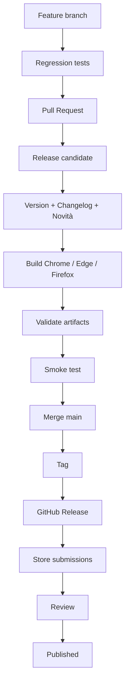
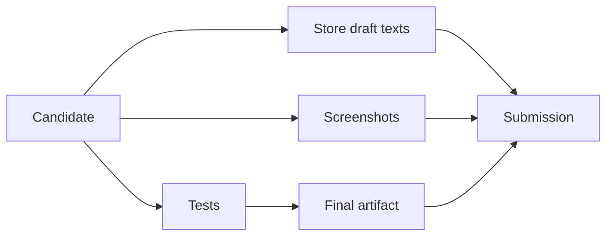
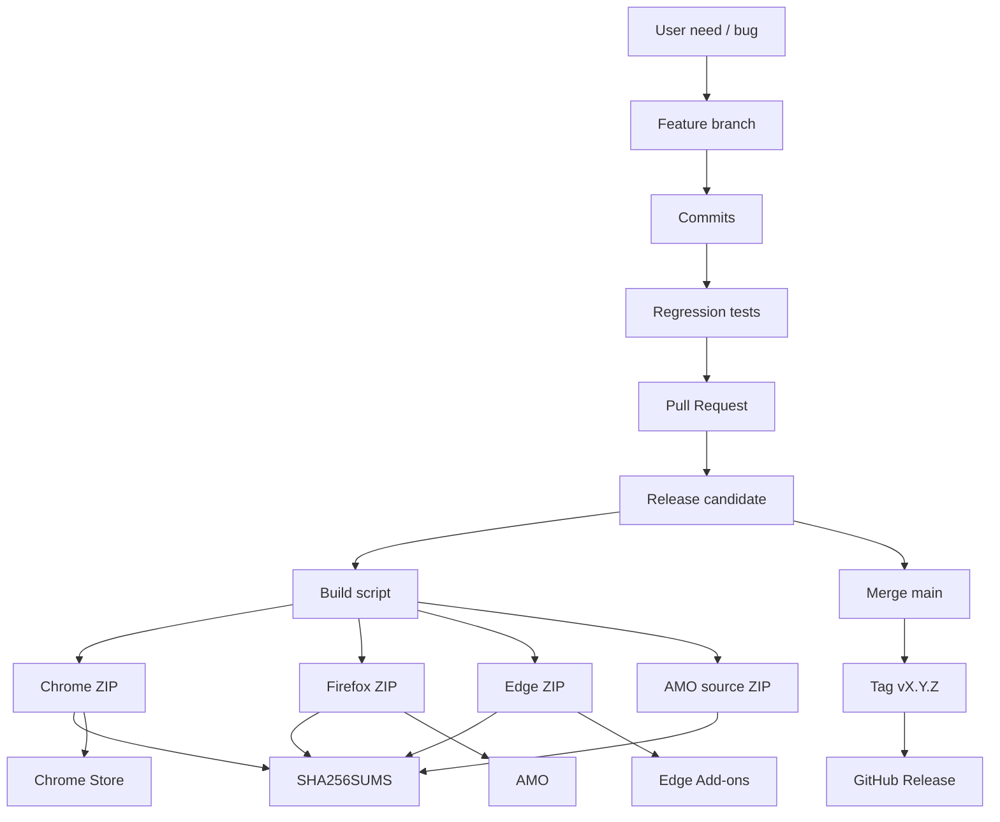

# 15 — Git, branch, PR, build e release engineering

## Il software oltre il codice

> **Snapshot di riferimento del capitolo**  
> Questo capitolo usa il candidato **PlumePilot 2.35.2**, branch `feat/ui-ux-2.35.2`, commit  
> `f6fcb4c29c83ba9150df0be31da04fc91dffb634`.  
> Per ricostruire la storia Git useremo anche release e pull request precedenti, in particolare `v2.35.1` e le PR #26, #31, #34, #39, #40, #41 e #42.

Un progetto software non vive soltanto nei file che vediamo nell'editor.

Esiste contemporaneamente come:

```text
working tree
commit
branch
pull request
tag
release
ZIP
store submission
versione installata dall'utente
```

Queste cose sono collegate.

Ma **non sono la stessa cosa**.

Durante lo sviluppo di PlumePilot abbiamo incontrato un caso che rende questa distinzione particolarmente concreta.

Il branch candidato alla 2.35.2 aveva un commit:

```text
170b21ec...
```

con questo tree:

```text
992149b6...
```

Poi abbiamo ricostruito il branch sopra il vero commit di release 2.35.1 ottenendo:

```text
4d32a8c2...
```

con:

```text
lo stesso tree:
992149b6...
```

ma con parent diverso.

Quindi:

```text
contenuto dei file identico
history diversa
commit SHA diverso
```

È difficile trovare un esempio più chiaro del fatto che:

> **Un commit Git non identifica soltanto “i file”. Identifica uno stato dei file inserito in una storia precisa.**

Da qui partiremo per studiare Git non come insieme di comandi da memorizzare, ma come **modello dati e sistema di release engineering**.

---

# Parte I — Git non è una cartella con versioni

## 1. Il modello mentale sbagliato

Molti iniziano pensando:

```text
Git =
cartella
+ copie precedenti dei file
```

Questo modello funziona finché usiamo soltanto:

```bash
git add
git commit
git push
```

Poi arrivano:

```text
branch
merge
rebase
squash
revert
cherry-pick
tag
```

e tutto sembra arbitrario.

Il problema non sono i comandi.

È il modello.

---

## 2. Gli oggetti fondamentali

Semplificando, Git ragiona con oggetti come:

```text
blob
tree
commit
tag
```

### Blob

Contenuto di un file.

### Tree

Struttura di directory che collega:

```text
path → blob/tree
```

### Commit

Contiene almeno:

```text
tree
parent(s)
author/committer
message
```

### Tag

Può puntare a un commit o ad altro oggetto Git.

Per il nostro ragionamento, il punto più importante è:

```text
commit
  =
tree
+ parent
+ metadata
```

---

# Parte II — Tree: lo stato dei file

## 3. Tree SHA

Un tree Git identifica lo stato della gerarchia di file.

Nel nostro caso:

```text
170b21ec...
```

e:

```text
4d32a8c2...
```

hanno entrambi:

```text
tree 992149b68db9a5a388196ebc20679aaef59352fa
```

Quindi il checkout risultante è lo stesso.

---

## 4. Ma i commit non sono uguali

Il vecchio commit aveva due parent:

```text
2a97f9d8...
1db590c8...
```

Il nuovo commit ha:

```text
parent a8007425...
```

Questa differenza cambia:

```text
ancestry
merge-base
PR comparison
ahead/behind
future merge behavior
commit SHA
```

pur lasciando identici i file.

---

# Parte III — Commit identity

## 5. Perché cambia lo SHA?

L'identità del commit dipende dal contenuto dell'oggetto commit.

Se cambiano:

```text
parent
message
author metadata
tree
```

cambia l'hash.

Per questo:

```text
stesso tree
≠
stesso commit
```

---

## 6. Conseguenza pratica

Due branch possono produrre:

```text
esattamente lo stesso software
```

ma Git può considerarli:

```text
divergenti
```

perché il percorso storico per arrivarci è diverso.

Questo è esattamente ciò che ci è successo con la 2.35.2.

---

# Parte IV — Branch: un riferimento mobile

## 7. Un branch non contiene commit

Concettualmente un branch è soprattutto:

```text
un ref
```

che punta a un commit.

Per esempio:

```text
main
  ↓
a8007425
```

e:

```text
feat/ui-ux-2.35.2
  ↓
f6fcb4c2
```

Quando committiamo sul feature branch:

```text
il ref si sposta
```

---

## 8. Visualizzazione

```text
A --- B --- C   main
           \
            D --- E   feature
```

`main` punta a C.

`feature` punta a E.

I commit precedenti non “appartengono” rigidamente a un branch.

Sono raggiungibili tramite la storia.

---

# Parte V — HEAD

## 9. Dove siamo?

`HEAD` indica normalmente:

```text
il branch attualmente checkout
```

che a sua volta punta al commit corrente.

```text
HEAD
 ↓
feature
 ↓
E
```

In detached HEAD:

```text
HEAD
 ↓
E
```

senza branch intermedio.

---

# Parte VI — Working tree, index, commit

## 10. Tre stati diversi

Quando modifichiamo un file:

```text
working tree
```

Quando facciamo:

```bash
git add
```

la versione preparata entra nell':

```text
index / staging area
```

Quando facciamo:

```bash
git commit
```

creiamo un nuovo commit.

---

## 11. Pipeline

```text
file modificato
      ↓ git add
index
      ↓ git commit
commit
```

Questa separazione permette commit selettivi.

---

# Parte VII — Branch per feature

## 12. Perché non lavorare sempre su `main`?

Perché vogliamo poter avere:

```text
main stabile
+
lavoro incompleto isolato
```

Esempio PlumePilot:

```text
fix/autoplay-collapsed-followups
feature/epub-regional-preservation
feat/ui-ux-2.35.2
```

Ogni nome racconta:

```text
intent
```

---

## 13. Il branch come hypothesis container

Un feature branch dice:

```text
“questa sequenza di modifiche
potrebbe diventare parte del prodotto”
```

Non dice ancora:

```text
“questa è una release”
```

---

# Parte VIII — Pull request

## 14. PR non è Git puro

Una pull request è una feature della piattaforma GitHub costruita sopra Git.

Contiene:

```text
base branch
head branch
diff
discussion
review
checks
merge action
```

---

## 15. PR come proposta di transizione

Possiamo leggerla così:

```text
base state
   ↓
proposed changes
   ↓
candidate state
```

La PR #41 dice essenzialmente:

```text
main
   +
UI/UX 2.35.2
   =
candidate 2.35.2
```

---

# Parte IX — Base e head

## 16. Terminologia

In una PR:

```text
base = dove vogliamo arrivare
head = branch che propone modifiche
```

Per #41:

```text
base: main
head: feat/ui-ux-2.35.2
```

---

## 17. Cambiare base cambia il significato della diff

Una stessa head confrontata con:

```text
main
```

o con:

```text
integration branch
```

può mostrare diff completamente diversi.

Per questo le stacked PR devono avere base scelta con attenzione.

---

# Parte X — Stacked PR

## 18. Il caso PR #40

La PR #40:

```text
Improve EPUB math preservation...
```

non era basata direttamente su `main`.

Era:

```text
base:
fix/autoplay-collapsed-followups

head:
feature/epub-regional-preservation
```

Quindi era **stacked** sopra il lavoro autoplay.

---

## 19. Diagramma

```text
main
  \
   A --- B --- C       autoplay branch
              \
               D --- E EPUB branch
```

PR #39:

```text
A+B+C → main
```

PR #40:

```text
D+E → autoplay branch
```

---

## 20. Perché usare stacked PR?

Quando una feature dipende da lavoro non ancora in `main`.

Vantaggi:

```text
diff più piccola
review più focalizzata
dipendenza esplicita
```

---

## 21. Svantaggio

La storia futura diventa più delicata se il branch base viene:

```text
squashed
rebased
riscritto
```

Ed è proprio ciò che ci interessa.

---

# Parte XI — Merge commit

## 22. Merge tradizionale

Supponiamo:

```text
A --- B --- C main
       \
        D --- E feature
```

Un merge può creare:

```text
A --- B --- C ------- M
       \             /
        D -------- E
```

`M` ha:

```text
due parent
```

---

## 23. Cosa preserva

Il merge commit conserva:

```text
commit D
commit E
struttura del branch
punto di integrazione
```

---

# Parte XII — Squash merge

## 24. Idea

Con squash:

```text
D + E + F
```

vengono trasformati in un nuovo singolo commit:

```text
S
```

applicato alla base.

```text
A --- B --- C --- S
```

Il branch originale continua ad avere:

```text
D --- E --- F
```

ma `main` non li contiene come ancestor.

---

## 25. Il caso reale 2.35.1

La PR #39 conteneva:

```text
20 commit
```

Il commit finale su `main`:

```text
a8007425f81792e7570516dbdf1e7fb2cbda4d53
```

ha:

```text
un solo parent
```

ed è diventato il commit della release 2.35.1.

Questo è coerente con uno squash merge.

---

# Parte XIII — Perché squash è attraente

## 26. Main leggibile

Invece di vedere:

```text
fix typo
fix tests
retry
actually fix retry
rename
oops
```

vediamo:

```text
Release 2.35.1:
ordered autoplay and improved EPUB exports
```

La storia di `main` racconta unità logiche più grandi.

---

## 27. PR come unità atomica

Squash interpreta:

```text
una PR
=
una modifica concettuale
```

Questo è molto utile se i commit interni sono iterativi.

---

# Parte XIV — Il costo nascosto dello squash

## 28. Downstream branch

Immaginiamo che 2.35.2 sia stata costruita sopra:

```text
D-E-F
```

della PR 2.35.1.

Dopo squash, `main` contiene:

```text
S
```

che ha gli stessi effetti, ma non gli stessi commit.

Git vede:

```text
D/E/F non sono ancestor di main
```

anche se il loro contenuto è già lì.

---

## 29. Conseguenza

Una compare può dire:

```text
feature branch:
molti commit avanti
alcuni commit indietro
```

e un merge può produrre conflitti.

Non perché il codice sia necessariamente incompatibile.

Perché la genealogia non è più allineata.

---

# Parte XV — Il caso 2.35.2

## 30. Prima del riallineamento

Il candidate branch aveva incorporato la linea originale 2.35.1.

Il commit:

```text
170b21ec139c0f703a4f08809a9e51e479fc413c
```

aveva due parent:

```text
2a97f9d8...
1db590c8...
```

e tree:

```text
992149b6...
```

---

## 31. `main`

La release 2.35.1 era invece:

```text
a8007425...
```

con tree:

```text
b3573ed8...
```

e una history squash.

---

## 32. Il branch appariva divergente

Prima del fix:

```text
feat/ui-ux-2.35.2
24 commit avanti
3 commit indietro
```

rispetto a `main`.

Ma parte di quella divergenza era history noise.

---

# Parte XVI — Un tentativo naturale: merge `main` nel branch

## 33. Strategia standard

Normalmente:

```bash
git checkout feature
git merge main
```

è un'ottima soluzione.

Preserva history e aggiorna il branch.

---

## 34. Perché qui era brutto

Git doveva riconciliare:

```text
squash commit S
```

con:

```text
commit originali D/E/F
```

che rappresentavano gran parte dello stesso cambiamento.

Il PR di sync risultava:

```text
non mergeable
```

---

# Parte XVII — Non forzare un merge che non capiamo

## 35. Principio

Un conflitto non è una richiesta di:

```text
“scegli ours o theirs a caso”
```

È Git che dice:

```text
non posso dedurre automaticamente
l'intento umano
```

Prima dobbiamo capire:

```text
quali contenuti vogliamo preservare
```

---

# Parte XVIII — Content-first reconciliation

## 36. La domanda corretta

Non:

```text
come faccio a convincere Git a mergiare?
```

ma:

```text
qual è il tree finale desiderato?
```

Nel nostro caso:

```text
main 2.35.1 definitivo
+
soli file UI/UX 2.35.2
```

---

## 37. Abbiamo ricostruito il tree

Partendo dal tree di:

```text
a8007425
```

abbiamo sostituito soltanto i file della UI/UX candidate.

Risultato:

```text
tree 992149b6...
```

---

## 38. La sorpresa utile

Era **esattamente lo stesso tree SHA** del vecchio branch.

Quindi:

```text
contenuto candidate corretto
history candidate problematica
```

Questo ci ha dato una prova molto forte.

---

# Parte XIX — Reparenting concettuale

## 39. Nuovo commit

Abbiamo creato:

```text
4d32a8c2...
```

con:

```text
tree:
992149b6...

parent:
a8007425...
```
---

## 40. Risultato

Il candidate UI/UX è diventato:

```text
main 2.35.1
      ↓
4d32a8c2 UI/UX
```

senza cambiare il tree del candidato.

---

# Parte XX — Perché non chiamarlo semplicemente rebase?

## 41. Semanticamente è simile

L'obiettivo è quello di un rebase:

```text
riporre il lavoro sopra una nuova base
```

---

## 42. Tecnicamente

Nel nostro intervento abbiamo costruito direttamente un commit:

```text
tree noto
+
parent noto
```

anziché replayare automaticamente ogni commit.

È più simile a un:

```text
content-preserving reparenting
```

o a una commit reconstruction.

---

## 43. Quando è appropriato?

Solo quando possiamo dimostrare quale tree vogliamo ottenere.

Non è una tecnica da usare alla cieca.

Il fatto che:

```text
old tree == new tree
```

è stato il nostro controllo di sicurezza principale.

---

# Parte XXI — Force update del branch

## 44. Per riallineare il ref

Abbiamo poi spostato:

```text
feat/ui-ux-2.35.2
```

dal vecchio commit al nuovo.

Questo riscrive la history del branch.

---

## 45. Rischio

Se altri developer hanno il branch checkout:

```text
force push
```

può sorprenderli.

Per questo la history rewriting è molto più sicura su:

```text
branch privato/personale
candidate controllato
```

che su:

```text
main pubblico
branch condiviso da molte persone
```

---

## 46. Expected SHA

Quando possibile usiamo un controllo tipo compare-and-swap:

```text
aggiorna il ref
solo se punta ancora al commit che mi aspetto
```

Se nel frattempo qualcuno ha pushato:

```text
fallisci
```

anziché sovrascrivere lavoro nuovo.

È l'equivalente Git di optimistic concurrency.

---

# Parte XXII — Rebase

## 47. Modello

```text
A --- B --- C main
       \
        D --- E feature
```

Dopo:

```bash
git rebase main
```

otteniamo:

```text
A --- B --- C --- D' --- E'
```

---

## 48. Perché D' ed E' sono nuovi commit?

Perché hanno:

```text
parent diversi
```

quindi hash diversi.

Il contenuto delle patch può essere uguale.

La history no.

---

## 49. Quando usarlo

Molto utile per:

```text
feature branch privati
pulire history prima della PR
riallineare una branch non condivisa
```

---

## 50. Quando essere cauti

Se altre persone dipendono dai vecchi hash:

```text
history rewrite
```

crea coordinamento extra.

---

# Parte XXIII — Rebase non è “più corretto” del merge

## 51. Sono modelli diversi

Merge dice:

```text
queste due storie sono esistite
e qui si sono integrate
```

Rebase dice:

```text
riscriviamo la storia della feature
come se fosse partita dalla nuova base
```

Entrambi possono essere appropriati.

---

# Parte XXIV — Squash vs rebase

## 52. Squash

Cambia granularità:

```text
N commit
→ 1 commit
```

---

## 53. Rebase

Cambia ancestry:

```text
parent vecchio
→ parent nuovo
```

mantenendo normalmente più commit.

---

## 54. Squash + downstream branch

È proprio la combinazione che può generare:

```text
content already integrated
but ancestry not shared
```

---

# Parte XXV — Cherry-pick

## 55. Modello

`git cherry-pick X` prende:

```text
la patch introdotta da X
```

e crea:

```text
un nuovo commit
```

sul branch corrente.

---

## 56. È una copia logica, non lo stesso commit

```text
X
```

e:

```text
X'
```

possono introdurre lo stesso diff ma avere hash diversi.

Di nuovo:

```text
same change
≠
same ancestry
```

---

## 57. Quando utile

Per:

```text
hotfix selettivo
portare un singolo fix su release branch
```

---

# Parte XXVI — Revert

## 58. Non cancella la storia

`git revert` crea un nuovo commit che applica l'inverso di un cambiamento precedente.

```text
A --- B --- C
          ↓ revert B
A --- B --- C --- R
```

B resta nella storia.

R ne annulla l'effetto.

---

# Parte XXVII — Il caso 2.34.0

## 59. Una storia reale più complicata

Durante il lavoro verso 2.34.0:

```text
integration/post-2.33.2
```

venne integrato prematuramente in `main`.

La PR #31 era esplicitamente:

```text
restore main to 2.33.2
after accidental integration merge
```

---

## 60. Perché non riscrivere `main`?

Una possibilità tecnica sarebbe stata:

```text
force reset main
```

Ma su una branch pubblica è spesso meglio lasciare una storia esplicita:

```text
merge accidentale
      ↓
commit di ripristino
```

così gli eventi restano auditabili.

---

# Parte XXVIII — History auditability

## 61. Una storia non perfetta può essere migliore di una falsa storia

Un `main` con:

```text
accidental merge
restore commit
```

racconta ciò che è successo.

Un force reset può far sembrare:

```text
che non sia mai accaduto
```

pur avendo magari già triggerato:

```text
CI
clone
store work
collaborator pull
```

---

# Parte XXIX — Il costo dei revert su branch di integrazione

## 62. PR #30 e #32

Nel branch di integrazione ci fu anche:

```text
revert branding
```

seguito da:

```text
restore branding after mistaken revert
```

Questo mostra un'altra proprietà:

```text
revert
```

non è magia.

È una nuova modifica che può a sua volta dover essere corretta.

---

# Parte XXX — Integration branch

## 63. Perché esiste

Prima di 2.34.0:

```text
integration/post-2.33.2
```

serviva a comporre:

```text
supporto Multiversity
branding
EPUB fixes
quiz navigation
release docs
```

prima che tutto entrasse in `main`.

---

## 64. Modello

```text
feature A ─┐
feature B ─┼→ integration → main
feature C ─┘
```

---

## 65. Vantaggio

Possiamo testare:

```text
l'insieme
```

senza destabilizzare `main`.

---

## 66. Svantaggio

Se l'integration branch vive troppo a lungo:

```text
drift
merge complexity
hidden dependencies
```

aumentano.

---

# Parte XXXI — Trunk-based vs integration-heavy

## 67. Due estremi

### Trunk-based

Branch molto brevi, integrazione frequente su `main`.

### Integration branch

Feature accumulate prima della release.

---

## 68. PlumePilot usa un modello ibrido

Per release grandi:

```text
integration
```

Per fix/release più circoscritte:

```text
feature/candidate branch
→ PR → main
```

Non serve aderire dogmaticamente a una scuola.

Serve minimizzare:

```text
rischio + coordinamento
```

---

# Parte XXXII — `main` come promessa

## 69. Che cosa significa main?

Idealmente:

```text
stato integrato
che potremmo ragionevolmente trasformare in release
```

Non necessariamente:

```text
versione già pubblicata
```

---

## 70. Nel nostro progetto

Il release flow spesso è:

```text
candidate branch
      ↓
test
      ↓
version/release prep
      ↓
merge main
      ↓
tag
```

Quindi `main` cambia poco prima del tag.

---

# Parte XXXIII — Release candidate

## 71. Un candidate branch

`feat/ui-ux-2.35.2` è diventato di fatto:

```text
feature branch
→ integration candidate
→ release candidate
```

nel tempo.

Questo può succedere nei progetti piccoli.

---

## 72. Ma il nome rimane storico

Il nome del branch:

```text
feat/ui-ux-2.35.2
```

non cambia automaticamente quando il suo ruolo diventa:

```text
release candidate
```

Il nome è un'indicazione umana, non una garanzia semantica.

---

# Parte XXXIV — Draft PR

## 73. Perché #41 resta Draft

Draft comunica:

```text
non considerare ancora questo lavoro pronto per merge
```

pur permettendo:

```text
diff
review
checks
discussion
```

---

## 74. È una state machine sociale

```text
branch exists
   ↓
draft PR
   ↓
ready for review
   ↓
approved
   ↓
merged
```

Git conserva codice.

GitHub coordina il processo umano.

---

# Parte XXXV — Commit piccoli vs commit di release

## 75. Durante sviluppo

Commit piccoli sono utili:

```text
fix checkbox color
fix spacing
add menu helper
add tests
```

per capire il lavoro.

---

## 76. Su main

Potremmo voler vedere:

```text
Prepare 2.35.2 shared menu UX
```

come unità logica unica.

Da qui l'attrazione dello squash.

---

# Parte XXXVI — Come decidere merge strategy

## 77. Merge commit

Preferibile quando:

```text
branch history è significativa
stacked branches dipendono dagli hash
vogliamo preservare topology
```

---

## 78. Squash

Preferibile quando:

```text
PR è l'unità logica
commit intermedi sono rumorosi
vogliamo main lineare
```

---

## 79. Rebase-and-merge

Preferibile quando:

```text
commit sono già puliti
vogliamo linear history
ma preservare granularità
```

---

## 80. Nessuna scelta è gratis

Ogni strategia ottimizza una cosa:

```text
leggibilità
provenance
topology
bisectability
downstream branch compatibility
```

---

# Parte XXXVII — Bisectability

## 81. Squash trade-off

Se una PR contiene 20 commit, dopo squash:

```text
git bisect su main
```

può dirci:

```text
la regression è nella PR #39
```

ma non quale dei 20 step interni.

---

## 82. Però

Se i 20 commit interni erano:

```text
tentativi intermedi non validi
```

preservarli su main potrebbe peggiorare la bisectability.

Il commit ideale è:

```text
piccolo
coerente
buildable
testable
```

ma nella pratica non sempre lo sviluppo procede così.

---

# Parte XXXVIII — Tag

## 83. Cos'è

Un tag dà un nome stabile a un punto della storia.

Per esempio:

```text
v2.35.1
      ↓
a8007425...
```

---

## 84. Perché è diverso da `main`

`main` si muove.

Il tag dovrebbe rimanere fermo.

```text
main:
a800 → future commits

v2.35.1:
sempre a800
```

---

# Parte XXXIX — Release GitHub

## 85. Tag vs release

Una GitHub Release aggiunge sopra il tag:

```text
titolo
release notes
asset
pagina pubblica
```

Il tag è un concetto Git.

La Release è un concetto della piattaforma.

---

## 86. Esempio reale

L'ultima release pubblicata al momento di questo capitolo è:

```text
v2.35.1
```

con titolo:

```text
PlumePilot 2.35.1 — Autoplay in ordine ed EPUB migliorati
```

Il tag punta esattamente a:

```text
a8007425...
```

---

# Parte XL — Version string vs tag

## 87. Devono essere coerenti

Possiamo avere:

```text
manifest.version = 2.35.2
```

prima che esista:

```text
tag v2.35.2
```

Questo è normale durante release prep.

---

## 88. Ma al rilascio

Vogliamo idealmente:

```text
manifest 2.35.2
tag v2.35.2
release title 2.35.2
ZIP names 2.35.2
AMO README 2.35.2
Novità 2.35.2
store submission 2.35.2
```

---

# Parte XLI — Version drift

## 89. Errore classico

```text
manifest 2.35.2
source README 2.35.1
ZIP plumepilot-v2.35.2
Novità 2.35.1
```

Il runtime può funzionare.

Ma la release è incoerente.

---

## 90. Per questo testiamo metadata

`validate-release.mjs` verifica anche:

```text
versione
Novità
source README
archive names
```

Release engineering è parte del software.

---

# Parte XLII — Semantic Versioning

## 91. Schema

PlumePilot usa versioni:

```text
MAJOR.MINOR.PATCH
```

come:

```text
2.35.2
```

---

## 92. Il significato pratico

Nel progetto:

```text
2.35.0
```

introduce un set sostanziale di feature.

```text
2.35.1
2.35.2
```

sono release incrementali/fix/miglioramenti all'interno della stessa linea.

---

## 93. SemVer non decide il prodotto

Semantic Versioning dà una grammatica utile.

Ma la scelta:

```text
minor o patch?
```

dipende da:

```text
compatibilità
promessa agli utenti
granularità del prodotto
store behavior
```

Per una browser extension consumer non abbiamo una public API classica come una library.

---

# Parte XLIII — Release version come user-facing identity

## 94. Per un'estensione

La versione compare in:

```text
manifest
store
browser extension manager
review notes
generated document metadata
Novità
support reports
```

Quindi è anche uno strumento diagnostico.

---

# Parte XLIV — Preparare store drafts prima del merge

## 95. Processo pratico

Possiamo preparare:

```text
testi
screenshot
review notes
draft listing
```
prima che il candidate sia già su `main`.

Questo riduce il tempo finale.

---

## 96. Ma attenzione

Lo store draft non deve diventare una seconda source of truth.

Se il candidate cambia:

```text
versione
feature
permission
privacy
```

dobbiamo riallineare la bozza.

---

# Parte XLV — Tre clock di release

## 97. Git clock

Quando il codice entra in `main`.

---

## 98. GitHub Release clock

Quando creiamo tag/release.

---

## 99. Store clock

Quando:

```text
submit
review
approve
publish
```

---

## 100. Non coincidono

Possiamo avere:

```text
v2.35.2 su GitHub
ma
Chrome ancora 2.35.1
```

oppure browser diversi su versioni differenti.

La release state è distribuita.

---

# Parte XLVI — Release state machine

## 101. Modello

```text
development
   ↓
candidate
   ↓
packaged
   ↓
submitted
   ↓
in review
   ↓
approved
   ↓
published
```

per ciascuno store.

---

## 102. Con tre browser

```text
Chrome:  published
Edge:    in review
Firefox: submitted
```

è uno stato perfettamente possibile.

---

# Parte XLVII — Perché “release” è ambigua

## 103. Quando diciamo:

```text
“è uscita la 2.35.2”
```

potremmo intendere:

```text
tag creato
GitHub release creata
store submitted
store approved
utenti possono installarla
```

Sono eventi diversi.

---

# Parte XLVIII — Naming preciso

## 104. Meglio dire

```text
candidate
merged
tagged
submitted
approved
published
```

anziché un generico:

```text
released
```

quando lo stato conta.

---

# Parte XLIX — Build artifact

## 105. Il commit non è ciò che installa l'utente

L'utente installa:

```text
ZIP trasformato / package store
```

prodotto da:

```text
build-release.mjs
```

---

## 106. Quindi la catena è

```text
commit
  ↓
build
  ↓
artifact
  ↓
store
  ↓
installed extension
```

Ogni freccia può introdurre un problema.

---

# Parte L — Artifact identity

## 107. Commit SHA

Identifica:

```text
source/history state
```

---

## 108. ZIP SHA-256

Identifica:

```text
bytes esatti distribuiti
```

---

## 109. Version

Identifica:

```text
release logica per utenti/store
```

Sono tre identity diverse.

---

# Parte LI — Provenance chain

## 110. Idealmente possiamo rispondere

```text
da quale commit
è stato generato
questo ZIP
con quale builder
e quale checksum?
```

Questa è release provenance.

---

# Parte LII — Deterministic build

## 111. Dal Capitolo 13

PlumePilot usa:

```text
fixed ZIP timestamp
stable file ordering
fixed compression
local dependencies
```

per ridurre la variabilità dell'output.

---

## 112. Perché conta qui

Se tagghiamo:

```text
v2.35.2
```

dovremmo poter rigenerare il package associato senza “indovinare” quali passaggi manuali erano stati fatti.

---

# Parte LIII — Release build deve partire da tree pulito

## 113. Working tree sporco

Se compiliamo da:

```text
commit X
+
modifiche locali non committate
```

l'artefatto non corrisponde davvero a X.

---

## 114. Regola

Prima di una release:

```bash
git status
```

deve essere compreso.

Idealmente:

```text
nothing to commit, working tree clean
```

---

# Parte LIV — Tag after build o build after tag?

## 115. Due workflow

### Workflow A

```text
merge
tag
checkout tag
build
```

### Workflow B

```text
candidate build
validate
merge exact tree
tag exact commit
rebuild/verify
```

---

## 116. Cosa conta

Non il rituale.

La proprietà:

```text
artifact pubblicato
deve essere riconducibile univocamente
al commit taggato
```

---

# Parte LV — Candidate artifact

## 117. Possiamo buildare prima del merge

È spesso utile per:

```text
smoke test
store validation
web-ext lint
```

---

## 118. Ma dopo il merge

Se il commit finale cambia:

```text
anche solo metadata
```

dobbiamo assicurare che il package pubblicato venga dal commit finale, non da un vecchio candidate.

---

# Parte LVI — Checksums

## 119. `SHA256SUMS.txt`

La release build genera un hash per:

```text
Chrome ZIP
Firefox ZIP
Edge ZIP
source ZIP
```

---

## 120. Questo permette

```text
candidate checksum
vs
final checksum
```

Se cambiano quando non dovrebbero:

```text
investigare
```

---

# Parte LVII — Release notes come product interface

## 121. Changelog tecnico

Può descrivere:

```text
master routing
cache invalidation
Firefox transform
```

---

## 122. Store copy

Deve descrivere:

```text
valore per l'utente
```

---

## 123. Reviewer notes

Devono descrivere:

```text
come verificare la feature
```

Sono tre audience diverse.

---

# Parte LVIII — Una sola modifica, tre descrizioni

## 124. Esempio first incomplete

### Changelog

```text
master-guided two-pass discovery
```

### Store

```text
ricerca più affidabile della prima attività incompleta
```

### Reviewer

```text
open demo course,
click Trova prima attività incompleta,
verify navigation
```

---

# Parte LIX — Release docs non sono duplicazione inutile

## 125. Sono projection

Partiamo da:

```text
stesso cambiamento reale
```

e lo proiettiamo in:

```text
developer language
user language
reviewer procedure
```

---

# Parte LX — Store review come async dependency

## 126. Una volta inviato

Il tempo di pubblicazione dipende da un sistema esterno.

Questo influenza la strategia di release.

---

## 127. Esempio Firefox

A volte Firefox può rimanere:

```text
una versione indietro
```

e la release successiva deve considerare:

```text
upgrade path diverso
Novità cumulative
review notes diverse
```

---

# Parte LXI — Branching e release cadence

## 128. Release frequenti

Riducendo la dimensione del delta:

```text
review più semplice
regression surface minore
rollback mentale più facile
```

---

## 129. Release troppo frequenti

Possono aumentare:

```text
store overhead
review fatigue
version noise
```

---

## 130. Il compromesso PlumePilot

Negli ultimi cicli:

```text
2.35.0
2.35.1
2.35.2
```

le release hanno separato blocchi logici abbastanza chiari.

---

# Parte LXII — Hotfix

## 131. Se main è già avanti

Supponiamo:

```text
main = 2.36 development
store = 2.35.2
critical bug in 2.35.2
```

Non possiamo necessariamente prendere tutto `main`.

---

## 132. Release branch

Potremmo creare:

```text
release/2.35
```

dal tag 2.35.2:

```bash
git switch -c release/2.35 v2.35.2
```

applicare il fix e pubblicare:

```text
2.35.3
```

---

## 133. Poi forward-port

Il fix deve anche entrare nella linea futura.

Possiamo:

```text
merge
cherry-pick
reimplement
```

a seconda della situazione.

---

# Parte LXIII — Main-first vs release-first fix

## 134. Main-first

Fix su main, poi backport.

Buono se:

```text
main è compatibile
```

---

## 135. Release-first

Fix sul branch stabile, poi forward-port.

Buono se:

```text
main è molto diverso
```

---

# Parte LXIV — Store rollback non è Git reset

## 136. Se una release è problematica

Non basta:

```text
git reset --hard v2.35.1
```

Gli utenti hanno già:

```text
2.35.2
```

e gli store richiedono versioni crescenti.

---

## 137. Roll-forward

Spesso dobbiamo pubblicare:

```text
2.35.3
```

che ripristina comportamento precedente.

È un **roll-forward**, non un vero rollback binario.

---

# Parte LXV — Version monotonicity

## 138. Store updater

Gli update ragionano su:

```text
versione nuova > versione installata
```

Quindi non possiamo generalmente “pubblicare di nuovo” 2.35.1 come se 2.35.2 non fosse esistita.

---

# Parte LXVI — Revert code, increment version

## 139. Pattern

```text
bad change in 2.35.2
      ↓
revert logic
      ↓
version 2.35.3
```

History e user version restano monotone.

---

# Parte LXVII — Commit message

## 140. Perché conta

Un commit message diventa:

```text
git log
PR context
bisect clue
release archaeology
```

---

## 141. Buono

```text
Fix autoplay recovery after collapsed accordion
```

---

## 142. Debole

```text
fix
```

Il secondo trasferisce zero conoscenza.

---

# Parte LXVIII — Release commit message

## 143. `a8007425`

Il messaggio:

```text
Release 2.35.1:
ordered autoplay and improved EPUB exports
```

è appropriato per uno squash/release commit.

Rappresenta l'unità logica entrata in main.

---

# Parte LXIX — PR title

## 144. Il titolo deve sopravvivere

Un titolo utile fra sei mesi:

```text
Prepare 2.35.1:
ordered autoplay, incomplete discovery
and improved EPUB exports
```

è migliore di:

```text
update
```

---

# Parte LXX — Branch name

## 145. Nome come metadata

```text
fix/
feature/
integration/
feat/
docs/
release/
```

aiuta a capire l'intento.

Non deve essere perfetto.

Deve essere utile.

---

# Parte LXXI — Delete branch after merge

## 146. Perché

Branch vecchi aumentano:

```text
ambiguità
accidental base selection
UI clutter
```

---

## 147. Ma i commit non spariscono subito

Eliminare il ref non cancella la storia già raggiungibile da:

```text
main
tag
PR refs
```

---

# Parte LXXII — Long-lived open PR

## 148. Nel repository esistono PR storiche ancora aperte

Questo può accadere quando:

```text
lavoro è stato incorporato attraverso altre integration PR
```

ma la PR originale non viene chiusa.

---

## 149. Costo

La dashboard può suggerire:

```text
work still pending
```

quando semanticamente è già shipping.

Una buona hygiene dovrebbe chiudere/annotare PR obsolete.

---

# Parte LXXIII — PR state ≠ feature state

## 150. Una feature può essere pubblicata

anche se la PR originaria:

```text
è ancora open
```

perché il codice può essere entrato via:

```text
integration branch
squash
cherry-pick
```

Di nuovo:

```text
GitHub workflow state
≠
code state
```

---

# Parte LXXIV — Merge conflict

## 151. Cosa significa davvero

Git trova due linee di storia che modificano una stessa regione e non sa quale risultato vogliamo.

Non significa automaticamente:

```text
il codice è incompatibile
```

---

## 152. Semantic conflict

Può esistere anche senza conflict marker.

Esempio:

```text
branch A cambia default a true
branch B assume ancora false
```

Git può mergiare perfettamente.

Il software no.

---

# Parte LXXV — Textual vs semantic merge

## 153. Git risolve testo/struttura

I test devono risolvere:

```text
semantica
```

Per questo:

```text
merge successful
```

non significa:

```text
integration correct
```

---

# Parte LXXVI — Smoke test dopo merge

## 154. Sempre utile quando branch importanti convergono

Specialmente per:

```text
UI
autoplay
storage
release metadata
```

---

# Parte LXXVII — Re-run tests on merged result

## 155. Feature branch tests verdi

non dimostrano che:

```text
feature + latest main
```

sia verde.

Il target reale è il merge result.

---

# Parte LXXVIII — Synthetic merge result

## 156. GitHub PR

Può costruire internamente un merge candidate per valutare:

```text
mergeability
checks
```

Per questo una PR può avere uno SHA di merge virtuale diverso dall'head SHA.

---

# Parte LXXIX — Head SHA vs merge SHA

## 157. Head

Identifica:

```text
ultimo commit del branch PR
```

---

## 158. Merge candidate

Identifica:

```text
come apparirebbe integrato
```

Questi concetti vanno distinti quando leggiamo CI o API GitHub.

---

# Parte LXXX — Tree equality come strumento diagnostico

## 159. Caso 2.35.2

Il confronto:

```text
old tree == rebuilt tree
```

ci ha permesso di dire:

```text
nessun byte del candidate UI/UX è cambiato
```
pur cambiando la history.

---

## 160. È più forte di `git diff` vuoto?

Sono concetti correlati.

Se due commit puntano allo stesso tree:

```text
lo snapshot completo è identico
```

Non stiamo soltanto osservando:

```text
nessuna patch mostrata nel confronto scelto
```

---

# Parte LXXXI — Tree SHA come content identity

## 161. Utile per

```text
prove di equivalenza
history repair
release auditing
```

---

## 162. Ma non sostituisce il commit

Perché perdiamo:

```text
chi
quando
perché
parent
```

---

# Parte LXXXII — Git graph come struttura dati

## 163. Commit graph

È un DAG:

**Directed Acyclic Graph**.

Ogni commit punta ai parent.

Il tempo logico va:

```text
commit nuovo
→ parent vecchio
```

Non possiamo creare cicli.

---

## 164. Merge commit

Ha più parent.

Per questo il graph si riunisce.

---

# Parte LXXXIII — Backend analogy

## 165. Commit come immutable record

Da backend developer possiamo pensare a un commit come un record immutabile:

```text
id = hash(content + links + metadata)
```

---

## 166. Branch come mutable pointer

Simile a:

```text
alias "production-current"
→ immutable revision
```

---

## 167. Tag come immutable-ish release alias

Idealmente:

```text
v2.35.1
→ revision specifica
```

e non viene spostato.

---

# Parte LXXXIV — Event sourcing analogy

## 168. Git ricorda eventi?

L'analogia con event sourcing è utile ma imperfetta.

Git conserva una storia di snapshot collegati, non un log di domain events.

Ma entrambi valorizzano:

```text
immutabilità
history
derived current state
```

---

# Parte LXXXV — Squash come history compaction

## 169. Analogia

Squash assomiglia a una forma di compaction:

```text
molte micro-transizioni
→ una transizione logica
```

Ma perdiamo dettaglio storico sulla mainline.

---

# Parte LXXXVI — Rebase come history rewrite

## 170. Analogia

Cambiamo:

```text
causal parent
```

delle modifiche.

Non stiamo mutando i vecchi commit.

Creiamo commit nuovi.

I vecchi possono rimanere raggiungibili altrove.

---

# Parte LXXXVII — Immutabilità Git

## 171. “Riscrivere un commit” è una scorciatoia linguistica

In realtà:

```text
non modifichiamo commit X
creiamo X'
e spostiamo un ref
```

Questo è importante.

---

# Parte LXXXVIII — Force push

## 172. Cosa fa davvero

Non cambia gli oggetti.

Sposta il branch ref su una history differente.

---

## 173. Perché è pericoloso

Un collaboratore può avere:

```text
local ref → old history
remote ref → new history
```

e dover riconciliare consapevolmente.

---

# Parte LXXXIX — Protected main

## 174. Una regola sana

Su branch pubbliche/importanti:

```text
no casual force push
```

e preferibilmente:

```text
PR
checks
review
```

---

# Parte XC — Code review

## 175. Review non è soltanto trovare bug

Serve a trasferire conoscenza:

```text
perché questa scelta?
quale invariant?
quale fallback?
quale migration?
```

---

## 176. Una buona PR facilita review

Con:

```text
scope chiaro
description
test plan
screenshots quando UI
risk areas
```

---

# Parte XCI — PR troppo grande

## 177. Costo cognitivo

Una PR con:

```text
5000 linee non correlate
```

è difficile da verificare.

Gli errori si nascondono.

---

## 178. Ma non dividere artificialmente

Cinque PR fortemente dipendenti possono essere peggio di una PR coerente.

La divisione deve seguire:

```text
unità concettuali
```

---

# Parte XCII — Commit dependency vs feature dependency

## 179. Stacked PR esplicita

Se B dipende da A:

```text
base B = branch A
```

il graph lo dichiara.

---

## 180. Alternativa

Aspettare che A entri in main.

Più semplice.

Ma rallenta parallelismo.

---

# Parte XCIII — Release checklist

## 181. Una release PlumePilot può essere pensata così

```text
[ ] feature scope frozen
[ ] branch synced with main
[ ] regression tests
[ ] browser smoke
[ ] version bump
[ ] changelog
[ ] Novità
[ ] reviewer docs
[ ] browser packages
[ ] validation
[ ] checksums
[ ] merge main
[ ] tag
[ ] GitHub Release
[ ] store submissions
```

---

# Parte XCIV — Freeze

## 182. Perché congelare lo scope

A release prep iniziata, aggiungere:

```text
“già che ci siamo”
```

aumenta il rischio.

---

## 183. Fix vs feature

Durante freeze accettiamo preferibilmente:

```text
release blocker
regression fix
metadata fix
```

non nuove funzionalità non necessarie.

---

# Parte XCV — Release candidate immutable-ish

## 184. Ogni modifica invalida evidenza precedente

Se cambiamo il candidate dopo:

```text
smoke test
web-ext lint
checksum
```

quell'evidenza non descrive più esattamente l'artefatto finale.

---

## 185. Quindi

Ogni commit successivo può richiedere:

```text
rebuild
revalidation
resmoke
```

proporzionalmente al rischio.

---

# Parte XCVI — Store draft workflow

## 186. Cosa possiamo anticipare

```text
descrizione
screenshot
review steps
release notes
```

---

## 187. Cosa deve aspettare artifact finale

```text
upload package
hash dichiarato
final version-specific source ZIP
```

se dipende dai bytes finali.

---

# Parte XCVII — Tag title e release notes

## 188. Devono aiutare l'utente futuro

Non scriviamo soltanto:

```text
v2.35.1
```

ma un titolo descrittivo.

Il repository diventa così anche una timeline del prodotto.

---

# Parte XCVIII — Release notes non sono changelog completo

## 189. Devono selezionare

Un utente vuole sapere:

```text
cosa cambia per me?
```

non leggere ogni refactor.

---

# Parte XCIX — Changelog cumulativo

## 190. Il changelog conserva dettagli

È utile per:

```text
debug archaeology
reviewer
maintainer
future book
```

Proprio questo libro ne ha beneficiato.

---

# Parte C — GitHub Release come checkpoint narrativo

## 191. Code checkpoint

Tag:

```text
commit esatto
```

---

## 192. Narrative checkpoint

Release page:

```text
cosa rappresenta quella versione
```

Insieme raccontano:

```text
what + why
```

---

# Parte CI — Release branch cleanup

## 193. Dopo pubblicazione

Possiamo:

```text
delete feature branch
close obsolete PR
aggiornare roadmap
aprire next candidate
```

Riduce ambiguità.

---

# Parte CII — Store-specific state tracking

## 194. Possibile tabella

```text
Version | Chrome | Edge | Firefox
2.35.1  | live   | live | live
2.35.2  | draft  | draft| draft
```

Il repository tag da solo non basta per sapere cosa vede ogni utente.

---

# Parte CIII — Deploy metadata

## 195. In un progetto più grande

Potremmo automatizzare un file:

```text
release-status.json
```

o GitHub environment/deployment metadata.

Per un progetto piccolo può essere eccessivo.

---

# Parte CIV — Release automation

## 196. Cosa vale la pena automatizzare

Tutto ciò che è:

```text
deterministico
ripetitivo
facile da dimenticare
```

---

## 197. PlumePilot già automatizza

```text
browser manifests
ZIP
Firefox transforms
Edge locales
source archive
checksums
validation
```

---

# Parte CV — Cosa resta umano

## 198. Decisioni

```text
scope
release timing
store copy
risk acceptance
manual UX judgment
merge strategy
```

Automatizzare una decisione ambigua non la rende corretta.

---

# Parte CVI — Release as pipeline

## 199. Possiamo disegnarla



---

# Parte CVII — Ma la pipeline reale può essere parallela

## 200. Preparativi store

Possono iniziare mentre:

```text
candidate ancora draft
```

---

## 201. Quindi



Parallelizziamo attività senza confondere source of truth.

---

# Parte CVIII — Failure modes release

## 202. Wrong base branch

PR mostra commit non desiderati.

---

## 203. Stale branch

Feature non contiene ultimi fix di main.

---

## 204. Squash ancestry mismatch

Codice già incluso appare ancora nuovo.

---

## 205. Metadata drift

Versioni/testi non allineati.

---

## 206. Dirty build

Artefatto contiene modifiche non committate.

---

## 207. Manual ZIP edit

Artifact non riproducibile.

---

## 208. Tag wrong commit

Release label punta a source sbagliato.

---

## 209. Store upload wrong artifact

Chrome ZIP inviato al target sbagliato o build precedente.

---

# Parte CIX — Protezioni

## 210. Against wrong base

```text
PR review
compare graph
```

---

## 211. Against stale branch

```text
sync/rebase
tests on final result
```

---

## 212. Against metadata drift

```text
release-candidate tests
validate-release
```

---

## 213. Against wrong artifact

```text
naming
checksums
empty release dir
```

---

# Parte CX — Empty output directory

## 214. Perché il builder rifiuta vecchi ZIP?

Se la directory contiene già:

```text
plumepilot-v2.35.1-firefox.zip
```

potremmo confonderlo con output corrente.

Il builder quindi fallisce se trova artefatti precedenti.

---

## 215. È una protezione contro state leakage

Il build deve partire da:

```text
output state noto
```

non da un mix di run precedenti.

---

# Parte CXI — Build idempotence

## 216. Idealmente

A parità di:

```text
source
environment compatibile
```

due build producono:

```text
stessi bytes
```

---

## 217. Perché aiuta release debugging

Se checksum differisce:

```text
qualche input è cambiato
```

Il problema diventa investigabile.

---

# Parte CXII — Branch sync prima della release

## 218. Domanda

Meglio:

```text
merge main into candidate
```

o:

```text
rebase candidate onto main
```

?

---

## 219. Dipende

Se la branch è condivisa:

```text
merge
```

preserva history.

Se è privata e vogliamo lineare:

```text
rebase
```

può essere più pulito.

Se squash downstream crea history anomala:

```text
content-aware reconstruction
```

può essere più sicura, ma richiede competenza maggiore.

---

# Parte CXIII — Il tree come arbitro del contenuto

## 220. Quando history è confusa

Possiamo tornare alla domanda fondamentale:

```text
quale snapshot vogliamo?
```

e confrontare:

```text
tree
diff
tests
```

---

## 221. Poi ricostruiamo una history sensata

La storia deve descrivere correttamente il contenuto.

Non dobbiamo sacrificare il contenuto per “far contento Git”.

---

# Parte CXIV — Git è un tool di collaborazione, non un giudice semantico

## 222. Git sa

```text
byte
path
parent
```

---

## 223. Git non sa

```text
“questo commit squash equivale
a quei 20 commit originali”
```

semanticamente.

Quella conoscenza è umana.

---

# Parte CXV — Merge strategies come protocollo di team

## 224. La cosa importante è coerenza

Se decidiamo:

```text
tutte le feature PR vengono squashed
```

allora downstream stacked branch devono essere gestite sapendo questo.

---

## 225. Possibile regola

Prima di squashare una base con branch dipendenti:

```text
merge dependent branch first
o
prevedi rebase/reparent dopo squash
```

---

# Parte CXVI — Stacked branch discipline

## 226. Possibile workflow

```text
A → PR A
B based on A → PR B

quando A merge/squash:
rebase B onto main
force-with-lease B
update PR B base main
```

---

## 227. `--force-with-lease`

Da command line è preferibile a un force cieco:

```bash
git push --force-with-lease
```

perché controlla che il remote ref non sia cambiato inaspettatamente.

Concettualmente è lo stesso principio dell'expected SHA usato nel nostro riallineamento.

---

# Parte CXVII — `merge-base`

## 228. Concetto

Git usa il common ancestor per capire:

```text
cosa è cambiato da entrambe le parti
```

Se squash/rebase cambiano ancestry:

```text
merge-base cambia
```

e il diff può sembrare molto più grande del contenuto semanticamente nuovo.

---

# Parte CXVIII — `git log --graph`

## 229. Strumento didattico fondamentale

```bash
git log --graph --oneline --decorate --all
```

rende visibile:

```text
branch
merge
tag
divergenza
```

Spesso spiega un problema meglio di dieci comandi casuali.

---

# Parte CXIX — `git diff`

## 230. Domanda

```text
cosa cambia nei file?
```

---

## 231. `git log`

Domanda diversa:

```text
quali commit/history differiscono?
```

---

## 232. Non confonderle

Possiamo avere:
```text
diff vuoto
log diverso
```

come nel caso di tree identico/history diversa.

---

# Parte CXX — `git status`

## 233. Domanda

```text
cosa non è ancora registrato?
```

È uno dei comandi più importanti prima di:

```text
switch
merge
build
release
```

---

# Parte CXXI — `git show`

## 234. Domanda

```text
che cosa rappresenta questo commit?
```

Mostra:

```text
metadata
parents
patch
```

---

# Parte CXXII — `git cat-file`

## 235. Livello più basso

Per studiare Git realmente:

```bash
git cat-file -p <commit>
```

possiamo vedere:

```text
tree
parent
author
committer
message
```

---

## 236. Questo rende concreto il modello

Non è più:

```text
“credo che un commit abbia un parent”
```

Lo vediamo nell'oggetto.

---

# Parte CXXIII — GitHub compare

## 237. `ahead` / `behind`

Sono misure sul commit graph.

Non sulla somiglianza semantica dei file.

---

## 238. Importantissimo

```text
24 ahead / 3 behind
```

non significa:

```text
24 feature nuove e 3 fix mancanti
```

Può riflettere:

```text
squash/rebase/history divergence
```

---

# Parte CXXIV — Perché prima guardiamo il graph

## 239. Se vediamo numeri strani

Controlliamo:

```text
merge-base
commit list
tree/diff
```

prima di concludere:

```text
branch obsolete
```

---

# Parte CXXV — Release tag immutability

## 240. Non spostare un tag pubblicato con leggerezza

Se:

```text
v2.35.1
```

è già pubblico, altri possono averlo:

```text
clonato
archiviato
referenziato
```

Spostarlo rompe provenance.

---

## 241. Se il release commit era sbagliato

Meglio:

```text
v2.35.2 / patch successiva
```

o un nuovo tag corretto secondo policy del progetto.

---

# Parte CXXVI — Immutable artifacts

## 242. Idealmente

Un file con checksum pubblicato:

```text
non viene sostituito silenziosamente
```

---

## 243. Nuovo artifact

Se cambia un byte:

```text
nuovo checksum
e, se distribuito, nuova versione
```

---

# Parte CXXVII — Git tag e store artifact

## 244. Un tag non contiene ZIP store-specifici

Può essere la source anchor.

Gli ZIP sono derivati.

---

## 245. Per questo checksum è utile

Collega:

```text
tag/source
```

a:

```text
artifact exact bytes
```

---

# Parte CXXVIII — Release reproducibility test

## 246. Una verifica forte

```text
checkout v2.35.2
run build
compare SHA256SUMS
```

Se coincide:

```text
provenance molto più credibile
```

---

# Parte CXXIX — Review note hash

## 247. Nel caso AMO

Possiamo fornire al reviewer:

```text
expected SHA-256
```

così può verificare che il build riprodotto corrisponda all'upload.

---

# Parte CXXX — GitHub branch protection

## 248. In un progetto più grande

Potremmo imporre:

```text
PR required
checks required
no force push
review required
```

su `main`.

---

## 249. Trade-off

Più guardrail:

```text
meno errori accidentali
```

ma anche:

```text
più processo
```

Per un progetto piccolo scegliamo il livello che riduce davvero rischio.

---

# Parte CXXXI — Human error è parte del threat model

## 250. L'integration merge accidentale lo dimostra

Non serviva un bug Git.

Bastava:

```text
clic/merge nel momento sbagliato
```

---

## 251. Guardrail

Possibili:

```text
branch protection
draft PR
required checks
release checklist
naming
```

Software engineering include progettare contro i nostri stessi errori.

---

# Parte CXXXII — Revert rapido vs panico

## 252. Quando succede un merge sbagliato

Prima:

```text
identifica stato desiderato
```

Poi:

```text
restore via commit/revert
```

Non iniziare con:

```text
force push casuale
```

---

# Parte CXXXIII — Incident response Git

## 253. Checklist

```text
1. stop further merges
2. capture current SHAs
3. identify last good state
4. inspect who pulled/published
5. choose revert vs history rewrite
6. restore tests
7. document
```

---

# Parte CXXXIV — Release branch as transaction

## 254. Possiamo pensare il candidate come una transaction lunga

Accumula:

```text
code
metadata
tests
artifacts
```

prima del commit finale in main.

---

## 255. Ma non è ACID

Durante giorni:

```text
main cambia
store requirements cambiano
branch cambia
```

quindi dobbiamo riconciliare.

L'analogia è utile solo fino a un certo punto.

---

# Parte CXXXV — Commit atomicity

## 256. Un buon commit dovrebbe rappresentare un cambiamento coerente

Idealmente:

```text
code
+
test
+
docs necessari
```

insieme.

---

## 257. Perché

Un checkout di quel commit dovrebbe avere senso.

Questo migliora:

```text
bisect
review
revert
```

---

# Parte CXXXVI — Don't commit generated release ZIPs

## 258. In genere

Gli artifact di release non devono stare nel source history se sono:

```text
derivabili
pesanti
binari
```

Meglio GitHub Release/store.

---

## 259. Source vs artifact separation

Il repository conserva:

```text
recipe
ingredients
tests
```

la release conserva:

```text
output
```

---

# Parte CXXXVII — Build scripts versionati

## 260. Ma la recipe deve essere nel commit

`build-release.mjs` deve essere versionato insieme al source.

Così il tag contiene:

```text
codice
+
metodo per costruire il package
```

---

# Parte CXXXVIII — Store metadata versionato?

## 261. Alcuni testi sì

Release notes/reviewer docs utili possono stare nel repo.

---

## 262. Altri dashboard fields

Possono vivere solo nello store.

Il rischio è drift.

Per questo conviene almeno mantenere:

```text
bozza canonica
```

nel progetto quando il costo è basso.

---

# Parte CXXXIX — Release engineering come reproducible decision-making

## 263. Obiettivo

Non basta poter ricostruire i bytes.

Vogliamo poter ricostruire:

```text
perché questa versione?
quali feature?
quali test?
quali target?
```

---

# Parte CXL — Changelog come causal context

## 264. Il changelog conserva “why”

Git diff mostra:

```text
cosa
```

Release note/changelog spiegano:

```text
perché
```

Per questo hanno valore durante bug archaeology.

---

# Parte CXLI — Issue → branch → PR

## 265. Ideal flow

```text
problem
  ↓
issue / note
  ↓
branch
  ↓
commits
  ↓
tests
  ↓
PR
```

---

## 266. Ma PlumePilot spesso nasce da feedback diretto

Non ogni modifica ha una issue formale.

Questo è normale in un progetto piccolo.

L'importante è che:

```text
reasoning critico
```

finisca almeno in:

```text
PR
commit
test
changelog
```

---

# Parte CXLII — Traceability

## 267. Vogliamo poter seguire

```text
user bug
→ PR
→ commit
→ test
→ release
```

---

## 268. Questo aiuta

```text
support
debug
regression
audit
book writing
```

---

# Parte CXLIII — Merge queue?

## 269. In team grandi

Una merge queue può garantire che ogni PR venga testata contro:

```text
latest main + preceding queued changes
```

riducendo stale-green PR.

---

## 270. Per PlumePilot oggi

Sarebbe probabilmente eccessivo.

Ma il principio:

```text
test final integration result
```

resta valido.

---

# Parte CXLIV — Release freeze e branch sync

## 271. Prima di pacchettizzare

Controlliamo:

```text
candidate contains latest required main
```

---

## 272. Non necessariamente latest everything

Se `main` contiene già lavoro per una versione futura non destinato alla release:

```text
non dobbiamo inglobarlo automaticamente
```

Da qui l'utilità di release branch in progetti con sviluppo parallelo.

---

# Parte CXLV — Current PlumePilot state

## 273. Al momento di questo capitolo

```text
main
→ v2.35.1 baseline

feat/ui-ux-2.35.2
→ 2 commit sopra main

#41
→ open, draft, mergeable
```

Il secondo commit:

```text
f6fcb4c2...
```

prepara:

```text
version 2.35.2
Novità
AMO/release metadata
```

---

## 274. Questo è un vero release candidate

Non soltanto:

```text
feature UI
```

ma:

```text
UI
+
version
+
release packaging metadata
```

---

# Parte CXLVI — Quando mergeare

## 275. Dopo

```text
smoke test
artifact validation
release blockers resolved
```

---

## 276. Non per forza dopo store approval

Gli store hanno bisogno del package.

Quindi il codice può essere taggato/merged prima che l'approvazione avvenga.

---

# Parte CXLVII — Tagging sequence suggerita

## 277. Per la 2.35.2

Una sequenza pulita è:

```text
1. final candidate tests
2. build candidate package
3. validate
4. merge #41 → main
5. confirm main tree
6. build/verify final from main
7. create v2.35.2 tag
8. GitHub Release
9. upload/submit stores
```

---

## 278. Variante

Se store draft richiede upload anticipato:

```text
candidate package upload
```

può essere fatto, ma dopo merge conviene verificare che:

```text
final tree/artifact
```

sia quello già caricato.

---

# Parte CXLVIII — Tree equality può aiutare anche qui

## 279. Se merge squash produce nuovo commit

Potremmo confrontare:

```text
candidate tree
main merged tree
```

Se sono uguali:

```text
content invariant preserved
```

Poi rigeneriamo comunque gli artifact se release metadata/build input lo richiede.

---

# Parte CXLIX — Squash della #41?

## 280. Se scegliamo squash

Avremo:

```text
main
  ↓
single 2.35.2 commit
```

e i due commit del candidate non diventeranno ancestor diretti.

---

## 281. Implicazione

Qualsiasi future branch basata su:

```text
4d32 / f6fc
```

dovrà essere riallineata dopo squash.

La lezione della 2.35.1 va applicata subito.

---

# Parte CL — Regola operativa futura

## 282. Prima di squashare un candidate

Chiedi:

```text
esistono branch future stacked sopra?
```

Se sì:

```text
annota/rebase subito dopo merge
```

---

# Parte CLI — Release branch per la prossima versione

## 283. Strategia semplice

Dopo 2.35.2:

```text
main
  ↓
new feature branches
```

evitando di costruire 2.35.3 sopra la vecchia candidate prima del merge, se non necessario.

---

# Parte CLII — Git history come design artifact

## 284. Una storia buona racconta

```text
feature boundaries
release boundaries
fixes
reverts
```

---

## 285. Una storia perfettamente lineare non è sempre più vera

Eliminare ogni merge può nascondere relazioni reali.

Preservare ogni micro-commit può creare rumore.

È un design trade-off.

---

# Parte CLIII — Commit graph e cognitive load

## 286. Mainline semplice

Riduce:

```text
tempo per capire “cosa è uscito quando”
```

---

## 287. Feature history ricca

Può rimanere:

```text
nella PR
```

anche se main riceve squash.

GitHub conserva discussione e commit della PR.

---

# Parte CLIV — PR come archival context

## 288. Anche dopo merge

La PR conserva:

```text
description
review
comments
screenshots
commit list
```

Quindi squash non cancella tutta la storia umana.

---

# Parte CLV — Release provenance graph

## 289. Disegno completo



---

# Parte CLVI — Three histories

## 290. Git history

```text
commit graph
```

---

## 291. Release history

```text
v2.34.0
v2.35.0
v2.35.1
v2.35.2
```

---

## 292. Deployment history

```text
quale versione è diventata live
su quale store
e quando
```

---

## 293. Non sono identiche

Questa distinzione è essenziale quando rispondiamo:

```text
“quale codice sta usando questo utente?”
```

---

# Parte CLVII — Diagnosi da support ticket

## 294. Chiedi

```text
browser
installed version
store channel
```

Non basta:

```text
“ho preso l'ultima”
```

perché i tre store possono essere in stati differenti.

---
# Parte CLVIII — Source commit da versione

## 295. Tag

Se la versione è pubblicata correttamente:

```text
2.35.1
→ tag v2.35.1
→ commit a800...
```

Questo restringe immediatamente il codice da analizzare.

---

# Parte CLIX — Release metadata nel runtime

## 296. `chrome.runtime.getManifest().version`

Permette di mostrare/loggare:

```text
versione installata
```

nel contesto dove l'API è disponibile.

---

## 297. Dal Capitolo 13

Non va chiamata da un contesto page-world dove:

```text
chrome.runtime
```

non esiste.

Anche release identity attraversa i boundary.

---

# Parte CLX — Release engineering e rollback mentale

## 298. Una release piccola è più facile da capire

Se 2.35.2 contiene principalmente:

```text
UI/UX alignment
```

e compare un autoplay bug:

```text
sospettiamo meno direttamente il core autoplay
```

anche se non possiamo escludere effetti indiretti.

---

## 299. Scope disciplinato migliora il debug

Release boundaries sono anche:

```text
causal boundaries
```

imperfette ma utili.

---

# Parte CLXI — Trunk stability

## 300. Main non deve essere “mai rotto” in senso assoluto

È un obiettivo, non una legge fisica.

La domanda pratica:

```text
quanto rapidamente rileviamo
e ripristiniamo?
```

---

## 301. Tests + small PR + branch protection

riducono il Mean Time To Detect.

---

# Parte CLXII — Release validation as gate

## 302. Una gate è una condizione necessaria

```text
tests green
artifact validator green
```

prima del merge/tag.

---

## 303. Ma gate non sostituisce judgment

Una UI può essere:

```text
formalmente valida
ma confusa
```

Da qui lo smoke/manual review.

---

# Parte CLXIII — Definition of Done

## 304. Per una feature normale

```text
code
test
docs/changelog se necessario
```

---

## 305. Per una release

```text
candidate
validation
artifact
metadata
tag
store submission
```

La Definition of Done è diversa.

---

# Parte CLXIV — Automation candidates

## 306. Futuro possibile

GitHub Actions potrebbe:

```text
run tests on PR
build artifacts on tag
validate release
upload GitHub Release assets
```

---

## 307. Ma store submission automatica?

Possibile in alcuni ecosistemi, ma introduce:

```text
credentials
API policy
approval flow
risk
```

Per un progetto piccolo il manual upload può restare ragionevole.

---

# Parte CLXV — CI/CD terminology

## 308. CI

Continuous Integration:

```text
integra e verifica spesso
```

---

## 309. CD

Può significare:

```text
Continuous Delivery
```

o:

```text
Continuous Deployment
```

---

## 310. Per gli store

La review esterna rende il continuous deployment meno diretto.

Possiamo automatizzare:

```text
delivery candidate
```

ma la pubblicazione può richiedere review.

---

# Parte CLXVI — Release engineering come sistema socio-tecnico

## 311. Non è solo tooling

Include:

```text
Git
tests
build
store
reviewer
maintainer
utente
```

---

## 312. Il processo deve ridurre errori fra attori

Per esempio:

```text
reviewer note chiara
```

è una feature del processo tanto quanto:

```text
validator
```

---

# Parte CLXVII — Backend analogy: deployment pipeline

## 313. Un backend

```text
commit
→ CI
→ Docker image
→ registry
→ deploy
```

---

## 314. PlumePilot

```text
commit
→ build
→ browser ZIP
→ store
→ review
→ client update
```

---

## 315. Artifact immutability

Docker digest e ZIP SHA-256 svolgono ruoli concettualmente simili:

```text
identificare bytes esatti
```

---

# Parte CLXVIII — Backend analogy: database migration

## 316. Release non è solo code deploy

Se cambia storage schema:

```text
utenti hanno dati precedenti
```

come un database già popolato.

Il release deve supportare:

```text
upgrade path
```

---

## 317. Per questo migrations entrano nei test

Dal Capitolo 6:

```text
legacy Pegaso key
→ scoped platform key
```

è parte della release compatibility.

---

# Parte CLXIX — Forward compatibility

## 318. Se una release salva nuovo schema

Una versione precedente reinstallata manualmente potrebbe:

```text
non capirlo
```

Non sempre supportiamo downgrade.

Ma dobbiamo essere consapevoli.

---

# Parte CLXX — Release notes come schema migration communication

## 319. Se cambiasse qualcosa di visibile

Potremmo spiegare:

```text
preferenza resettata
setting migrata
permission nuova
```

---

# Parte CLXXI — Permission changes

## 320. Sono release-sensitive

Una nuova permission può:

```text
cambiare review
mostrare prompt
richiedere disclosure
```

Quindi non è una modifica come un CSS tweak.

---

# Parte CLXXII — Release risk classification

## 321. Low risk

```text
copy
spacing
docs
```

---

## 322. Medium

```text
UI logic
storage default
```

---

## 323. High

```text
permissions
background lifecycle
autoplay navigation
test automation
export pipeline
migration
```

---

## 324. Il test plan dovrebbe riflettere il rischio

Non tutte le release richiedono la stessa intensità.

---

# Parte CLXXIII — PR description come risk map

## 325. Una buona description include

```text
what
why
scope
tests
known limits
risk
```

---

# Parte CLXXIV — Release branch diff review

## 326. Prima del merge

Guardiamo:

```text
candidate vs main
```

non soltanto i singoli commit.

---

## 327. Perché

Potremmo avere:

```text
commit apparentemente corretti
ma file generato/stale rimasto nel tree
```

Lo snapshot finale conta.

---

# Parte CLXXV — File list review

## 328. Un segnale potente

Per una release UI:

```text
content.js modificato?
background.js modificato?
```

Se non ce lo aspettiamo:

```text
investigare
```

---

# Parte CLXXVI — Scope invariant

## 329. Possiamo testare persino questo

Una release candidate potrebbe avere una allowlist di file attesi.

Non sempre conviene.

Ma per hotfix molto stretto è utile.

---

# Parte CLXXVII — The accidental file problem

## 330. Esempio

```text
debug.txt
screenshot.png
local config
```

entra nel package.

Artifact validator e file allowlist possono impedirlo.

---

# Parte CLXXVIII — `.gitignore` non basta

## 331. `.gitignore`

impedisce molti file non tracciati.

---

## 332. Builder exclusions

impediscono file tracciati ma non runtime:

```text
tests
docs
scripts
```

Sono due boundary diversi.

---

# Parte CLXXIX — Release directory

## 333. È output

Non dovrebbe diventare input involontario del prossimo build.

Da qui:

```text
excluded release/
empty output guard
```

---

# Parte CLXXX — Source archive

## 334. Paradosso apparente

Il runtime ZIP esclude:

```text
scripts/tests
```

Il source AMO li include.

Perché hanno scopi diversi.

Release engineering costruisce più view dello stesso repository.

---

# Parte CLXXXI — Git sparse concerns

## 335. Repository state

È superset.

---

## 336. Runtime artifact

È subset + transforms.

---

## 337. Source submission

È subset differente.

Il build è una projection.

---

# Parte CLXXXII — Version bump timing

## 338. Troppo presto

Se aumentiamo versione all'inizio dello sviluppo:

```text
molti commit intermedi sembrano già release
```

---

## 339. Troppo tardi

Se la cambiamo dopo aver creato package/testi:

```text
drift
```

---

## 340. Pratica corrente

Nel candidate finale, vicino alla release prep.

È ragionevole.

---

# Parte CLXXXIII — Version as configuration

## 341. Una sola source of truth

Idealmente:

```text
manifest.version
```

alimenta:

```text
build filenames
validator expectations
runtime display
```

---

## 342. Evitare duplicazione

Quando dobbiamo duplicarla in:

```text
README reviewer
```

aggiungiamo validator.

---

# Parte CLXXXIV — Release commit vs version bump commit

## 343. Possibili strategie

### Uno stesso commit

```text
feature + release metadata
```

### Commit separato

```text
feature complete
↓
prepare version/release notes
```

---

## 344. Nel candidate 2.35.2

Abbiamo due commit chiari:

```text
4d32a8c2
Rebase UI/UX candidate onto released 2.35.1

f6fcb4c2
Prepare 2.35.2 version and shared menu release notes
```

Questa separazione rende evidente il confine:

```text
content alignment
vs
release prep
```

---

# Parte CLXXXV — Squash finale dei due?

## 345. Dipende dall'obiettivo di main

Se vogliamo:

```text
un solo release commit
```

squash è coerente.

---

## 346. Se vogliamo preservare la distinzione

rebase/merge potrebbe mantenere due commit.

La scelta va fatta prima di costruire future branch sopra questi hash.

---

# Parte CLXXXVI — Release decision record

## 347. Un futuro miglioramento

Per release non banali potremmo salvare:

```text
docs/releases/2.35.2.md
```

con:

```text
scope
test plan
known limitations
store state
```

Alcune release precedenti già hanno documenti simili.

---

# Parte CLXXXVII — Perché aiuta

Fra mesi:

```text
perché Firefox package era diverso?
```

troviamo la risposta vicino alla release.

---

# Parte CLXXXVIII — GitHub API come inspection tool

## 348. Durante questo libro abbiamo letto

```text
PR base/head
merge SHA
branch SHA
commit parents
tree SHA
```

direttamente.

Questo è utile quando la UI GitHub semplifica troppo la storia.

---

# Parte CLXXXIX — Low-level inspection

## 349. Quando serve

```text
weird ahead/behind
unexpected mergeability
tag mismatch
history rewrite
```

---

## 350. Ma normalmente

Git CLI:

```text
log
show
diff
merge-base
status
```

è sufficiente.

---

# Parte CXC — A mental decision tree

## 351. “Devo aggiornare il feature branch”

Chiedi:

```text
è condiviso?
```

### No

```text
rebase possibile
```

### Sì

```text
merge main spesso più sicuro
```

---

## 352. “La base è stata squashed”

Chiedi:

```text
il branch downstream contiene i vecchi commit?
```

Se sì:

```text
rebase/content-aware cleanup
```

prima di un merge cieco.

---

## 353. “Main contiene un merge accidentale”

Chiedi:

```text
è già pubblico/condiviso?
```

Se sì:

```text
preferisci revert/restore commit
```

a history rewrite, salvo casi controllati.

---

# Parte CXCI — Error recovery table

| Problema | Strumento principale |
|---|---|
| branch solo stale | merge/rebase |
| commit singolo da portare | cherry-pick |
| modifica da annullare pubblicamente | revert |
| history privata rumorosa | interactive rebase |
| squash ancestry mismatch | rebase/reparent/content reconstruction |
| wrong public main commit | revert/restore commit |
| wrong release artifact | rebuild + new version if published |
| wrong tag non pubblico | recreate carefully |
| wrong tag già pubblico | prefer new corrective release |

---

# Parte CXCII — Esercizio 1

Hai:

```text
main:
A-B-S

feature:
A-B-D-E-F-G
```

dove:

```text
S = squash di D-E-F
G = nuova feature
```

Perché una merge può risultare rumorosa?

Disegna due possibili strategie per ottenere:

```text
A-B-S-G'
```

---

# Parte CXCIII — Esercizio 2

Due commit hanno:

```text
tree identico
parent diverso
```

Quali proprietà sono uguali?

Quali sono diverse?

---

# Parte CXCIV — Esercizio 3

La PR contiene 15 commit:

```text
5 feature
4 fix dei fix
3 typo
3 test
```

Quando preferiresti:

```text
squash
```

e quando no?

---

# Parte CXCV — Esercizio 4

Hai già pubblicato:

```text
v2.35.2
```

ma scopri un bug grave.

Perché spostare il tag a un commit corretto non risolve il problema degli utenti già aggiornati?

---

# Parte CXCVI — Esercizio 5

Store Chrome mostra:

```text
2.35.1
```

GitHub Latest:

```text
2.35.2
```

Firefox:

```text
2.35.0
```

Quale versione sta usando “un utente PlumePilot”?

Risposta:

```text
dipende dal browser e dal canale
```

La domanda era incompleta.

---

# Parte CXCVII — Esercizio 6

Il build genera un Firefox ZIP con checksum diverso dallo stesso commit di ieri.

Elenca input possibili da investigare:

```text
Node version
builder change?
working tree dirty?
timestamp?
file ordering?
vendor file?
environment?
```

---

# Parte CXCVIII — Esercizio 7

Una feature branch è condivisa da tre persone.

Vuoi riallinearla con main.

Perché:

```bashgit rebase main
git push --force
```

richiede molta più cautela di un merge?

---

# Parte CXCIX — Esercizio 8

Una PR è mergeable e tutti i file si applicano senza conflitti.

Quali semantic conflict potrebbero comunque esistere?

---

# Parte CC — Concetti da portarsi dietro

## 354. Blob

Oggetto Git che contiene bytes di file.

---

## 355. Tree

Snapshot strutturale di file e directory.

---

## 356. Commit

Oggetto immutabile che collega:

```text
tree + parent(s) + metadata
```

---

## 357. Ref

Puntatore mobile a un oggetto Git, come un branch.

---

## 358. HEAD

Riferimento alla posizione corrente del checkout.

---

## 359. Merge commit

Commit con più parent che integra storie.

---

## 360. Squash merge

Integrazione che comprime più commit in un nuovo commit singolo.

---

## 361. Rebase

Ricostruzione di commit sopra una nuova base, creando nuovi hash.

---

## 362. Cherry-pick

Applicazione della modifica di un commit in un altro punto della storia tramite un nuovo commit.

---

## 363. Revert

Nuovo commit che annulla semanticamente un cambiamento precedente senza cancellarlo dalla history.

---

## 364. Merge base

Ancestor comune usato per confrontare e integrare due linee di storia.

---

## 365. Tree equality

Due commit puntano allo stesso snapshot completo dei file anche se history e metadata differiscono.

---

## 366. Artifact

Output costruito e distribuibile derivato dal repository.

---

## 367. Release provenance

Catena che collega:

```text
source commit
→ build process
→ artifact
→ checksum
→ distribuzione
```

---

## 368. Release candidate

Stato considerato potenzialmente pubblicabile dopo le validazioni finali.

---

## 369. Build deterministico

Processo che, a parità di input rilevanti, produce lo stesso output.

---

## 370. Deployment history

Sequenza delle versioni realmente pubblicate nei diversi canali, distinta dal commit graph.

---

## 371. Roll-forward

Correzione di una release problematica tramite una nuova versione superiore anziché ripubblicare una versione precedente.

---

## 372. Divergence

Differenza di ancestry fra branch, misurata in commit ahead/behind e non necessariamente equivalente a differenza semantica del codice.

---

## 373. Stacked PR

Pull request costruita sopra un altro branch/PR non ancora integrato nel target finale.

---

## 374. Force-with-lease

Aggiornamento forzato di un branch che fallisce se il remote ref è cambiato rispetto a ciò che ci aspettiamo.

---

# Parte CCI — Ulteriori letture

## 375. Git object model

Git Book:

https://git-scm.com/book/en/v2/Git-Internals-Git-Objects

https://git-scm.com/book/en/v2/Git-Internals-Git-References

---

## 376. Branch e merge

Git Book:

https://git-scm.com/book/en/v2/Git-Branching-Basic-Branching-and-Merging

https://git-scm.com/book/en/v2/Git-Branching-Rebasing

---

## 377. GitHub pull requests

GitHub Docs:

https://docs.github.com/en/pull-requests

https://docs.github.com/en/pull-requests/collaborating-with-pull-requests/incorporating-changes-from-a-pull-request/about-pull-request-merges

---

## 378. Squash merge

GitHub Docs:

https://docs.github.com/en/repositories/configuring-branches-and-merges-in-your-repository/configuring-pull-request-merges/configuring-commit-squashing-for-pull-requests

---

## 379. Tags e releases

GitHub Docs:

https://docs.github.com/en/repositories/releasing-projects-on-github/about-releases

Git:

https://git-scm.com/book/en/v2/Git-Basics-Tagging

---

## 380. Semantic Versioning

https://semver.org/

---

# Parte CCII — Recap

PlumePilot ci ha mostrato un caso concreto in cui:

```text
same tree
≠
same commit
```

e questo singolo fatto apre quasi tutto il capitolo.

Git tiene insieme:

```text
snapshot
causal history
branch pointers
release anchors
```

mentre GitHub aggiunge:

```text
pull request
review
draft state
release pages
```

e il release system aggiunge ancora:

```text
browser build
checksums
store submission
approval
publication
```

La pipeline completa è quindi:

```text
idea
 ↓
branch
 ↓
commit
 ↓
test
 ↓
PR
 ↓
candidate
 ↓
build
 ↓
artifact
 ↓
merge
 ↓
tag
 ↓
GitHub Release
 ↓
store
 ↓
utente
```

Le lezioni principali sono:

> **Il branch è un puntatore, non un contenitore magico.**

> **Il commit identifica uno snapshot dentro una storia, non soltanto i file.**

> **Squash semplifica `main`, ma cambia ancestry e quindi va considerato quando esistono branch stacked.**

> **Un merge senza conflict non dimostra la correttezza semantica.**

> **Il repository non è il prodotto distribuito: il prodotto è l'artefatto costruito e verificato.**

> **Tag, GitHub Release e pubblicazione store sono tre eventi distinti.**

E soprattutto:

> **Release engineering significa rendere riproducibile non soltanto il codice, ma il percorso con cui quel codice diventa software nelle mani degli utenti.**

---

# Prossimo capitolo

## 16 — Lezioni architetturali

Abbiamo ormai studiato:

```text
contexts
messaging
DOM
API
async
storage
cache
state machine
search algorithms
document generation
editor
UI
performance
cross-browser
testing
Git/release engineering
```

Il Capitolo 16 farà un passo indietro.

Non introdurrà una nuova feature.

Cercherà invece di rispondere:

```text
quali pattern sono emersi spontaneamente
in tutto PlumePilot?
```

Parleremo di:

```text
boundaries
identity
source of truth
anti-corruption layers
progressive refinement
fail-closed behavior
functional core / imperative shell
state machines
idempotence
graceful degradation
ownership
lifetime
observability
artifact thinking
```

e proveremo a ricostruire **l'architettura che PlumePilot possiede oggi, anche quando non è stata progettata esplicitamente fin dall'inizio**.

---

[← 14 — Debug, test e regressioni](14-debug-test-regressioni.md) · [Indice](index.md) · [16 — Lezioni architetturali →](16-lezioni-architetturali.md)
