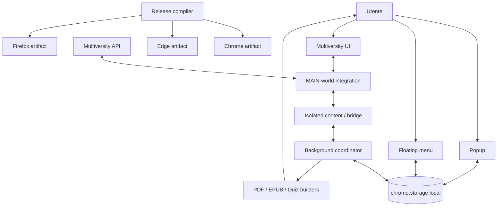

# 16 — Lezioni architetturali

## L’architettura che emerge dal progetto reale

> **Snapshot di riferimento del capitolo**  
> Questo capitolo usa come baseline il candidato **PlumePilot 2.35.2**, branch `feat/ui-ux-2.35.2`, commit `f6fcb4c29c83ba9150df0be31da04fc91dffb634`, ma sintetizza anche decisioni e regressioni osservate nei capitoli precedenti.

Fin qui abbiamo studiato PlumePilot per parti.

Abbiamo aperto il cofano e guardato:

```text
manifest
content script
MAIN world
bridge
background
popup
floating menu
cache
storage
API
DOM
state machine
PDF
EPUB
HTML editor
build
store package
```

Nel farlo abbiamo seguito feature concrete.

Questo capitolo cambia prospettiva.

Non ci chiederemo più:

> Come funziona autoplay?

oppure:

> Come viene costruito un EPUB?

Ci chiederemo invece:

> **Quali principi architetturali continuano a riapparire in parti del progetto apparentemente diverse?**

Quando una stessa idea compare in:

```text
autoplay
export
commissioni
UI
cross-browser
release tooling
```

non siamo più davanti a un dettaglio locale.

Stiamo osservando l’architettura del sistema.

E la cosa interessante è che gran parte di questa architettura non è nata da un diagramma iniziale.

È **emersa** progressivamente da:

```text
bug reali
vincoli del browser
comportamento del sito host
feedback utenti
store review
performance problems
```

Questo è uno dei motivi per cui un progetto reale è tanto istruttivo.

---

# Parte I — L’architettura non è l’elenco dei file

## 1. Struttura fisica e struttura logica

Se chiedessimo:

```text
“qual è l’architettura di PlumePilot?”
```

una risposta superficiale potrebbe essere:

```text
popup.js
background.js
content.js
bridge.js
floating-menu.js
...
```

Ma questo descrive soltanto la struttura fisica del repository.

L’architettura logica è più simile a:

```text
                    host platform
                  DOM + API + session
                         │
             ┌───────────┴───────────┐
             │                       │
          MAIN world             isolated world
             │                       │
             └──────── messaging ────┘
                         │
                    background
                  coordination layer
                         │
        ┌────────────────┼────────────────┐
        │                │                │
      popup         floating menu      builders
        │                │                │
        └────── shared persisted state ───┘
```

I file sono implementazione.

Le relazioni fra responsabilità sono architettura.

---

# Parte II — Primo principio: ogni boundary deve essere esplicito

## 2. Che cos’è un boundary?

Un boundary è un punto in cui cambiano una o più proprietà fondamentali:

```text
ownership
trust
lifetime
API disponibili
formato dati
source of truth
failure model
```

In PlumePilot ne incontriamo moltissimi.

Per esempio:

```text
page world ↔ extension world
popup ↔ background
background ↔ storage
DOM ↔ API
raw platform response ↔ normalized model
source tree ↔ browser artifact
```

---

## 3. Perché i boundary sono importanti

Molti bug non nascono dentro una funzione.

Nascono quando attraversiamo un boundary con un’assunzione sbagliata.

Esempi:

```text
“questo oggetto DOM resterà valido dopo await”
“questa percentuale master è la verità”
“questa API esiste in tutti i browser”
“questo evento arriverà sicuramente al popup”
“questo ZIP rappresenta esattamente il repository”
```

Sono tutte assunzioni di boundary.

---

## 4. Boundary come luogo di traduzione

Un buon boundary non trasporta soltanto dati.

Li **traduce**.

Per esempio:

```text
raw Multiversity response
        ↓
normalizeCourseOutline()
        ↓
PlumePilot course entries
```

Oppure:

```text
browser-specific runtime
        ↓
build-release.mjs
        ↓
PlumePilot target artifact
```

La traduzione protegge il resto del sistema dalle stranezze esterne.

---

# Parte III — Anti-corruption layer

## 5. Un concetto che compare più volte

In Domain-Driven Design si usa spesso il termine **anti-corruption layer** per indicare un layer che impedisce al modello esterno di contaminare direttamente quello interno.

In PlumePilot vediamo forme leggere di questo pattern.

---

## 6. API normalization

La piattaforma può usare:

```text
lp_id
paragraph id
display_order
folder id
percentage
```

Il resto di PlumePilot preferisce concetti come:

```text
lessonNumber
identity
playbackItems
test
objective
```

Quindi:

```text
external schema
      ↓
normalizer
      ↓
internal model
```

---

## 7. DOM adapter

Pegaso, Mercatorum e San Raffaele possono avere differenze nel DOM.

Invece di spargere:

```js
if (pegaso) ...
if (mercatorum) ...
```

ovunque, funzioni come `sections()` cercano di produrre una rappresentazione comune.

---

## 8. Browser packaging adapter

Lo stesso principio ricompare nel Capitolo 13:

```text
common source
     ↓
release adapter
     ↓
Chrome / Edge / Firefox artifacts
```

Tre problemi diversi.

Stesso pattern.

---

# Parte IV — Secondo principio: identity prima del DOM

## 9. Il DOM non è identità

Una delle lezioni più profonde del progetto è nata dall’autoplay.

Un nodo DOM può:

```text
sparire
essere ricreato
cambiare parent
venire nascosto
essere sostituito durante un await
```

Quindi non può essere l’identità logica di una lezione.

---

## 10. Node identity vs domain identity

```text
DOM node
   =
rappresentazione momentanea
```

mentre:

```text
course + section + chapter + lesson
   =
identità logica
```

Questo porta al pattern:

```text
resolve DOM
   ↓
extract logical identity
   ↓
await
   ↓
resolve DOM again
   ↓
validate identity
```

---

## 11. Identity composite

Quando un singolo campo non basta:

```text
display_order = 1
```

perché si ripete in più sezioni, usiamo un’identità composta:

```text
sectionText + chapterText
```

oppure, quando disponibili:

```text
lpId + paragraphId
```

---

## 12. Regola generale

> **Usa come identity ciò che rimane stabile durante il lifetime del processo che devi completare.**

Non ciò che è semplicemente comodo da leggere in quel momento.

---

# Parte V — Identity domain

## 13. Una identity vive dentro un dominio

`exam_id = 7` non è necessariamente globale.

Potremmo avere:

```text
Pegaso exam 7
Mercatorum exam 7
```

Quindi la vera identity è:

```text
platform + exam_id
```

---

## 14. Storage scoped keys

Lo stesso vale per i corsi:

```text
COURSE123
```

può essere ambiguo fra piattaforme.

La chiave persistente diventa:

```text
pegaso:COURSE123
mercatorum:COURSE123
```

---

## 15. Le collisioni sono segnali architetturali

Quando due entità collidono, la domanda non è soltanto:

```text
“come aggiungo un prefisso?”
```

ma:

> **Quale parte del dominio mancava nella nostra definizione di identità?**

---

# Parte VI — Terzo principio: source of truth esplicita

## 16. Non tutti i dati hanno la stessa autorità

PlumePilot vede spesso la stessa informazione da fonti diverse:

```text
DOM
master API
lesson detail API
cache
storage
session state
```

Il problema non è soltanto scegliere una fonte.

È definire una **gerarchia di evidenze**.

---

## 17. Master call

La master call è molto utile per:

```text
routing
candidate ordering
coarse progress
```

ma non sempre prova che:

```text
tutte le attività siano realmente complete
```

Quindi è un buon:

```text
index
```

non necessariamente la source of truth finale.

---

## 18. Detail API

Una lesson detail response fornisce evidenza più precisa su:

```text
Obiettivi
video
test
```

ma può essere incompleta o fallire.

---

## 19. DOM

Il DOM può essere:

```text
stale
non renderizzato
accordion chiuso
```

ma può anche diventare l’unico fallback visuale disponibile.

---

## 20. Quindi la verità è spesso stratificata

```text
coarse signal
      ↓
more precise signal
      ↓
visual fallback
      ↓
fail safe
```

---

# Parte VII — Evidence precedence

## 21. Un sistema robusto decide quale evidenza vince

Esempio:

```text
DOM dice Obiettivi 0%
API fresca dice Obiettivi 100%
```

Se il DOM è noto stale, non deve sovrascrivere l’API fresca.

---

## 22. Precedence rule

In forma generale:

```text
fresh authoritative evidence
      >
stale cache
      >
heuristic hint
```

con eccezioni esplicite quando il provider stesso è noto imperfetto.

---

# Parte VIII — Quarto principio: unknown è uno stato reale

## 23. Booleani troppo poveri

Molti problemi iniziano con:

```text
complete = true / false
```

ma la realtà è:

```text
complete
incomplete
unknown
```

---

## 24. Missing percentage

Se la UI non mostra la percentuale:

```text
undefined
```

non significa:

```text
0%
```

né:

```text
100%
```

Significa:

```text
non sappiamo
```

---

## 25. Ternary knowledge

Questo pattern appare in:

```text
activity progress
API result
material link
commission state
cache freshness
```

---

## 26. Valore architetturale

Quando modelliamo esplicitamente `unknown`, possiamo decidere:

```text
retry
fallback
visual verification
stop
```

invece di inventare un valore.

---

# Parte IX — Quinto principio: fail closed sui side effect rischiosi

## 27. Incertezza + side effect

Se non sappiamo quale capitolo sia quello giusto, non dovremmo:

```text
cliccarne uno a caso
```

Se non sappiamo se un test è incompleto, non dovremmo:

```text
rispondere automaticamente
```

---

## 28. Pattern

```text
certainty sufficient?
   ├── yes → side effect
   └── no  → fallback / stop
```

---

## 29. Esempi reali

### Routing ambiguo

```text
no verified route
→ no skip
```

### Firefox vendor transform

```text
pattern inatteso
→ fail build
```

### Bookmark test

```text
pending test
→ localizza
→ non risolvere
```

---

## 30. Correttezza > aggressività

Molti sistemi sembrano “smart” perché prendono sempre una decisione.

Un sistema robusto sa anche dire:

```text
non ho abbastanza informazioni
```

---

# Parte X — Sesto principio: progressive refinement

## 31. Non partire dalla fonte più costosa

Per trovare una attività incompleta potremmo interrogare tutto.

Ma sarebbe costoso.

Quindi:

```text
cheap coarse evidence
      ↓
selected candidate
      ↓
expensive precise verification
      ↓
fallback only if needed
```

---

## 32. È lo stesso pattern dell’EPUB

```text
text extraction
      ↓ insufficient
regional preservation
      ↓ insufficient
full visual raster
```

---

## 33. E anche della cache

```text
fresh cache
   ↓ miss/stale
API
   ↓ failure
DOM fallback
```

---

## 34. Fast path / slow path

Possiamo astrarre:

```text
fast path
  │
  ├── sufficient evidence → done
  │
  └── uncertainty → slow path
```

Questo pattern tiene insieme performance e correttezza.

---

# Parte XI — Cost-sensitive architecture

## 35. Non tutte le letture costano uguale

```text
Map lookup
DOM query
network request
PDF parse
canvas raster
```

sono operazioni molto diverse.

---

## 36. Il decision engine dovrebbe conoscere il costo

Non necessariamente con numeri espliciti.

Ma con un ordine ragionato:

```text
cheap
→ medium
→ expensive
```

---

## 37. Query planner analogy

Il first-incomplete engine assomiglia a un query planner:

```text
index says likely row
      ↓
fetch detail
      ↓
verify exact predicate
```

---

# Parte XII — Settimo principio: lifetime coerente con il dato

## 38. Ogni stato ha una durata naturale

Abbiamo visto quattro livelli:

```text
in-memory
sessionStorage
chrome.storage.local
server/platform
```

---

## 39. In-memory

Adatto a:

```text
pending request
cache veloce
current operation helper
AbortController
```

quando la perdita al reload è accettabile o recuperabile.

---

## 40. `sessionStorage`

Adatto a:

```text
recovery di navigazione
reload attempt
short-lived continuity
```

---

## 41. `chrome.storage.local`

Adatto a:

```text
preferenze
operation recovery
achievement state
commission snapshots
```

---

## 42. Server

Rimane authoritative per:

```text
progress ufficiale
exam state
course structure
```

---

## 43. Regola

> **La persistenza deve essere abbastanza lunga per il dato, ma non più lunga del necessario.**

Persistenza eccessiva crea:

```text
stale state
migration cost
privacy surface
```

---

# Parte XIII — Ownership

## 44. Chi possiede lo stato?

Una delle domande più utili è:

```text
chi può modificarlo?
```

---

## 45. Operation state

Il background coordina operazioni globali.

Quindi è un owner naturale di:

```text
active operation
builder ownership
lease
```

---

## 46. UI state

Popup e floating menu leggono e riflettono:

```text
preferenze
operation
presentation model
```

ma non dovrebbero inventare due verità indipendenti.

---

## 47. Ownership riduce race

Se due componenti possono scrivere lo stesso dato senza protocollo:

```text
lost update
```

è quasi inevitabile.

---

# Parte XIV — Single writer, multiple readers

## 48. Pattern utile

Dove possibile:

```text
un coordinator scrive
più UI leggono
```

---

## 49. Commission storage

Le write serializzate dal background sono un esempio.

---

## 50. Non sempre possibile

Preferenze utente possono essere modificate da:

```text
popup
floating menu
```

Qui serve:

```text
storage normalization
onChanged synchronization
```

---

# Parte XV — Ottavo principio: messaging come protocollo

## 51. Non sono “funzioni remote”

Quando scriviamo:

```js
chrome.runtime.sendMessage(...)
```

non stiamo chiamando una funzione normale.

Stiamo attraversando:

```text
process/context boundary
```

---

## 52. Un messaggio ha bisogno di contratto

```text
type
payload
response
error semantics
correlation
lifetime
```

---

## 53. Accepted ≠ completed

Un messaggio può dire:
```text
accepted: true
```

ma il lavoro essere ancora:

```text
running
```

Questo è lo stesso concetto di HTTP 202.

---

# Parte XVI — Message protocol versioning

## 54. Oggi

I message type sono stringhe:

```text
PEGASO_START_EXPORT
PEGASO_GET_OPERATION
...
```

---

## 55. Domani

Se il protocollo cresce potrebbe essere utile:

```text
schema condiviso
version
request/response types
```

---

## 56. Ma non astrarre prima del bisogno

Un framework interno di messaging può diventare più complesso del problema.

Il pattern giusto è:

```text
formalizzare quando il numero di contratti lo giustifica
```

---

# Parte XVII — Nono principio: asincronia = validità temporale

## 57. `await` divide il mondo

Prima di:

```js
await something();
```

abbiamo una fotografia.

Dopo:

```text
DOM può cambiare
utente può navigare
setting può cambiare
video può cambiare
operation può essere cancellata
```

---

## 58. Revalidation pattern

```text
read
remember identity
await
re-read
validate
act
```

---

## 59. Compare-before-side-effect

Prima di cliccare:

```text
sono ancora nello stesso corso?
è ancora lo stesso player?
autoplay è ancora enabled?
la lesson identity coincide?
```

---

# Parte XVIII — Optimistic concurrency thinking

## 60. Backend analogy

È simile a:

```text
read version 12
compute
before write verify still version 12
```

---

## 61. Nel browser

La “version” può essere:

```text
course code
generation token
current video identity
DOM identity
```

---

# Parte XIX — Generation token

## 62. First-incomplete discovery

Usa:

```text
smartResumeGeneration
```

per riconoscere una ricerca superata.

---

## 63. Pattern

```text
start operation → generation N
new operation   → generation N+1
old continuation wakes up
if generation != N → cancel
```

---

## 64. È una cancellation strategy leggera

Non ferma fisicamente ogni Promise.

Ma impedisce che una continuation vecchia produca side effect.

---

# Parte XX — Decimo principio: side effect separati dalle decisioni

## 65. Functional core / imperative shell

Una delle direzioni più promettenti del progetto è separare:

```text
what should happen?
```

da:

```text
perform browser effect
```

---

## 66. Già presente in alcuni punti

`autoplayPresentation()`:

```text
settings
   ↓
presentation model
```

senza toccare il DOM.

---

## 67. Route mapping

```text
master + outline
      ↓
route map
```

è quasi logica pura.

---

## 68. Shell

Poi:

```text
openSection
openChapter
clickRow
scrollIntoView
```

sono side effect browser.

---

## 69. Perché conviene

Decision logic pura è:

```text
più testabile
più riusabile
più comprensibile
```

Side effect restano concentrati.

---

# Parte XXI — Undicesimo principio: state machine prima della cascata di if

## 70. Quando il comportamento dipende dalla storia

Autoplay non è:

```text
if video ended → click next
```

È:

```text
state + event + guard + context + transition
```

---

## 71. Sintomo di state machine implicita

Se vediamo molte variabili come:

```text
enabled
busy
stopAtTests
autoCompleteTests
stoppedAtTestContext
thresholdBypassed
```

abbiamo già una macchina a stati, anche se non l’abbiamo chiamata così.

---

## 72. Esplicitarla mentalmente riduce bug

Possiamo chiedere:

```text
quali transizioni esistono?
quali sono proibite?
quale state entra dopo cancel?
```

---

# Parte XXII — State vector

## 73. Uno stato può essere distribuito

Non serve un unico enum.

Il vero state può essere il vettore:

```text
(enabled,
 busy,
 stopAtTests,
 autoCompleteTests,
 thresholdBypassed,
 currentContext)
```

---

## 74. Rischio: state explosion

Se ogni flag è indipendente:

```text
2^N combinations
```

molte possono essere invalide.

---

## 75. Future improvement

Potremmo derivare più valori da uno stato più compatto o usare reducer/statechart per aree che continuano a crescere.

---

# Parte XXIII — Dodicesimo principio: idempotence e deduplication

## 76. Eventi duplicati sono normali

In sistemi distribuiti e browser extension:

```text
message retry
double click
reconnect
reload
same event observed twice
```

succedono.

---

## 77. Dedup non è idempotence

### Deduplication

```text
riconosci duplicato
→ non ripetere
```

### Idempotence

```text
ripetere l’operazione
→ stesso risultato finale
```

---

## 78. Operation id

Un `operationId` permette di capire se:

```text
builder request
```

appartiene a un lavoro già in corso.

---

## 79. Sound event memory

Gli eventi sonori vengono ricordati per evitare doppia riproduzione/achievement.

---

# Parte XXIV — At-least-once thinking

## 80. Messaging reale

Anche se l’API sembra semplice, conviene progettare come se alcuni eventi potessero essere:

```text
ripetuti
ritardati
persi durante lifecycle
```

---

## 81. Snapshot + event

Per questo la UI non dovrebbe dipendere soltanto da:

```text
un evento “operation started”
```

ma poter chiedere:

```text
qual è lo stato corrente?
```

---

# Parte XXV — Tredicesimo principio: snapshot + event

## 82. Event-only è fragile

Se il popup si apre dopo l’evento:

```text
non lo ha visto
```

---

## 83. Snapshot-only è lento

Polling continuo:

```text
spreca lavoro
```

---

## 84. Insieme

```text
initial snapshot
      +
subsequent events
```

è un pattern molto più robusto.

---

# Parte XXVI — Eventual consistency nella UI

## 85. Popup e floating menu

Possono aggiornarsi in istanti leggermente diversi.

L’obiettivo non è:

```text
same microsecond
```

ma:

```text
convergere allo stesso state
```

---

## 86. Storage onChanged

Funge da canale reattivo di convergenza.

---

# Parte XXVII — Quattordicesimo principio: cache come acceleratore, non verità

## 87. Cache semantics

Una cache risponde:

```text
ho una copia utile?
```

non:

```text
questa è la realtà assoluta?
```

---

## 88. Cache entry completa

Una entry robusta contiene più del valore:

```text
value
identity
fetchedAt
completeness
source
error/attempt metadata
```

---

## 89. Freshness semantica

Un dato può essere riutilizzato se:

```text
completed = true
```

anche se vecchio, quando completion è monotona.

Mentre un dato:

```text
progress = 40%
```

può diventare stale molto rapidamente.

---

# Parte XXVIII — Monotonic knowledge

## 90. Alcune informazioni possono solo avanzare

Per una activity:

```text
completed false → true
```

non dovrebbe tornare normalmente false.

---

## 91. Cache merge

Possiamo conservare:

```text
max percentage
completed OR previousCompleted
```

quando identity è la stessa.

---

## 92. Ma identity prima di monotonicity

Se la route è cambiata:

```text
non possiamo unire due activity diverse
```

anche se i campi sembrano compatibili.

---

# Parte XXIX — Quindicesimo principio: bounded growth

## 93. Cache senza limite = memory leak logico

Anche se il GC funziona perfettamente.

---

## 94. `pageLessonSnapshots`

Ha limite:

```text
50 entries
```

---

## 95. Sound memory

Conserva soltanto una finestra bounded/TTL.

---

## 96. Regola

Ogni struttura long-lived dovrebbe rispondere:

```text
come viene rimossa una entry?
```

Se non abbiamo risposta, abbiamo un rischio.

---

# Parte XXX — Sedicesimo principio: cancellation end-to-end

## 97. Cancel button non basta

Perché cancellazione reale richiede:

```text
UI intent
      ↓
message
      ↓
operation state
      ↓
AbortController / generation
      ↓
loops observe cancellation
      ↓
cleanup
```

---

## 98. Cooperative cancellation

JavaScript non interrompe magicamente una funzione arbitraria.

Il lavoro deve controllare periodicamente:

```text
signal.aborted?
```

---

## 99. Cancellation latency

Se controlliamo abort solo ogni 30 secondi:

```text
cancellazione formalmente supportata
ma UX pessima
```

---

# Parte XXXI — Cleanup ownership

## 100. Chi alloca deve sapere chi libera

Per:

```text
AbortController
canvas
PDF page
Blob URL
message listener
pending request Map entry
```

serve ownership chiara.

---

## 101. Resource lifecycle

```text
allocate
use
transfer ownership?
release
```

---

# Parte XXXII — Diciassettesimo principio: working set prima del file size

## 102. Document generation

Un EPUB finale da:

```text
40 MB
```

può richiedere molto più RAM durante la build.

---

## 103. Working set

```text
PDF bytes
PDF.js structures
canvas RGBA
PNG bytes
ZIP entries
final buffer
```

possono coesistere.

---

## 104. Architettura memory-aware

Quindi:

```text
process sequentially
cleanup page
null large buffers
dedupe assets
bound canvas resolution
```

sono decisioni architetturali.

---

# Parte XXXIII — Diciottesimo principio: backpressure

## 105. Più concurrency non è sempre meglio

```text
Promise.all(100 PDFs)
```

può ridurre wall time ma esplodere:

```text
network pressure
memory
CPU
```

---

## 106. Pacing

Delay fra request è una forma semplice di backpressure.

---

## 107. Future improvement

Un concurrency limiter esplicito potrebbe controllare:

```text
N in-flight tasks
```

meglio di delay statici in alcune pipeline.

---

# Parte XXXIV — Diciannovesimo principio: graceful degradation

## 108. Feature robusta non significa “sempre stesso path”

Esempio audio:

```text
Chromium → offscreen
Firefox → content tab
```

stessa semantica, adapter diverso.

---

## 109. EPUB

```text
text
regional
visual
```

sono livelli di degradazione controllata.

---

## 110. Material export

```text
API link
DOM link
visual path
```

---

## 111. Graceful degradation non è silent failure

L’utente deve ricevere:

```text
risultato alternativo
oppure errore comprensibile
```

non un output corrotto silenzioso.

---

# Parte XXXV — Ventesimo principio: preserve semantics, vary mechanism

## 112. Cross-browser

Chrome ed Edge:

```text
offscreen audio
```

Firefox:

```text
tab audio
```

Semantica:

```text
play requested notification
```

---

## 113. UI

Popup e floating menu hanno DOM/lifecycle diversi.

Ma condividono:

```text
presentation rules
settings semantics
operation semantics
```

---

## 114. Questo è semantic parity

Non cerchiamo:

```text
implementation identity
```

ma:

```text
observable contract identity
```

---

# Parte XXXVI — Ventunesimo principio: shared rules, separate controllers

## 115. Il redesign 2.35.2

Non ha trasformato popup e floating menu in un unico mega-component.

---

## 116. Perché

Hanno:

```text
different DOM roots
different lifecycle
different navigation constraints
different embedding
```

---

## 117. Cosa condividiamo

```text
menu-ux.js
menu-ux.css
layout model
presentation logic
```

---

## 118. Regola generale

> **Condividi la semantica stabile, non forzare l’unificazione delle superfici che hanno lifecycle differenti.**

---

# Parte XXXVII — Ventiduesimo principio: presentation model

## 119. Non renderizzare direttamente state grezzo

Possiamo avere:

```text
saved setting
+ override
+ operation state
+ course-specific bypass
```

---

## 120. Presentation function

```text
raw state
   ↓
derive effective state
   ↓
derive labels/hints
   ↓
render
```

---

## 121. Vantaggio

Popup e floating menu possono usare la stessa interpretazione.

---

# Parte XXXVIII — Derived state

## 122. Non tutto va salvato

Se possiamo calcolare:

```text
effectiveStopAtTests
```

da:

```text
saved test behavior
chapter limit
auto complete
```

non serve necessariamente persistirlo separatamente.

---

## 123. Duplicate state = drift

Se salviamo sia:

```text
raw settings
```

sia:

```text
derived effective state
```

possono divergere.

---

# Parte XXXIX — Ventitreesimo principio: invariant-oriented design

## 124. Un’invariante è una frase forte

Esempi:

```text
una operation attiva deve restare cancellabile
una identity ambigua non autorizza navigation
un hidden tab non provoca destructive reload
platform è parte della persistent identity
```

---

## 125. Invariante > patch

Patch:

```text
aggiungi 200ms
```

Invariante:

```text
non avanzare finché la nuova lesson non è verificata
```

La seconda sopravvive meglio ai refactor.

---

## 126. Test come executable invariant

Il Capitolo 14 ha mostrato il passaggio:
```text
bug
→ invariant
→ test
```

Questa è una delle principali forme di maturazione architetturale.

---

# Parte XL — Ventiquattresimo principio: artifact thinking

## 127. Il repository non è il prodotto

Per una extension:

```text
source tree
      ↓
build
      ↓
Chrome ZIP
Firefox ZIP
Edge ZIP
```

---

## 128. Il build è parte dell’architettura

Manifest specialization, vendor transformation, locales e checksums cambiano ciò che viene distribuito.

---

## 129. Testare il tree non basta

Serve anche:

```text
artifact validation
```

---

# Parte XLI — Venticinquesimo principio: release pipeline come compiler

## 130. Front-end

```text
common source
```

## 131. Lowering

```text
manifestFor(browser)
Firefox transforms
Edge locales
```

## 132. Code generation

```text
ZIP
```

## 133. Verification

```text
validate-release.mjs
```

Questo modello mentale rende la release pipeline molto più comprensibile.

---

# Parte XLII — Ventiseiesimo principio: fail early ai boundary deterministici

## 134. Runtime user flow

Spesso vogliamo fallback.

---

## 135. Build pipeline

Se una precondizione deterministica è violata:

```text
manifest sbagliato
checksum vendor cambiato
pattern transform ambiguo
```

meglio:

```text
fail immediately
```

---

## 136. Differenza

```text
runtime uncertainty
→ degrade/recover

build invariant violation
→ stop
```

---

# Parte XLIII — Ventisettesimo principio: osservabilità vicino alle decisioni

## 137. Loggare tutto non aiuta

Un buon diagnostic log dovrebbe spiegare:

```text
quale decisione
su quale identity
con quale evidence
```

---

## 138. Esempio

```text
master says chapter 5 <100%
→ detailed verification 5
```

è molto più utile di:

```text
step 12
```

---

## 139. Structured diagnostics

Per EPUB:

```text
pages
assets
bytes
mode
elapsed
```

possono essere raccolti come struttura, non solo stampati.

---

# Parte XLIV — Ventottesimo principio: privacy-aware observability

## 140. Una extension autenticata vede dati sensibili

Quindi non possiamo trattare logging come in un toy project.

---

## 141. Diagnostic minimum

Preferiamo:

```text
course code
operation id
state name
error class
```

non:

```text
token
password
raw private payload
```

---

# Parte XLV — Ventinovesimo principio: external systems are contracts, not dependencies we control

## 142. Multiversity

Può cambiare:

```text
DOM
API
route
response timing
```

---

## 143. Browsers

Possono cambiare:

```text
extension lifecycle
API support
manifest rules
```

---

## 144. Stores

Possono cambiare:

```text
policy
review scanner
metadata requirements
```

---

## 145. Conseguenza

Ogni integrazione esterna dovrebbe avere:

```text
boundary
normalization
validation
fallback/test
```

---

# Parte XLVI — Contract drift as normal condition

## 146. Non chiedere “cambierà?”

Chiedi:

```text
“come ce ne accorgeremo quando cambierà?”
```

---

## 147. Risposte

```text
contract tests
artifact validator
source assertions
live smoke test
clear error classification
```

---

# Parte XLVII — Trentesimo principio: localizzare la complessità

## 148. La complessità non può sempre essere eliminata

PlumePilot deve affrontare:

```text
multiple worlds
multiple browsers
multiple universities
asynchronous DOM
store policies
```

---

## 149. Possiamo però confinarla

```text
browser difference → build adapter
platform difference → DOM/API adapter
UI difference → controller
state persistence → storage helper
```

---

## 150. Il contrario

Quando la stessa eccezione appare in 10 file:

```text
complessità diffusa
```

è molto più difficile da mantenere.

---

# Parte XLVIII — Architecture as compression

## 151. Un buon pattern comprime molte eccezioni

Senza pattern:

```text
bug A → patch A
bug B → patch B
bug C → patch C
```

---

## 152. Con un principio

```text
DOM can be stale after await
```

spiega e previene un’intera classe di bug.

---

## 153. Questa è architettura

Una piccola quantità di concetti che permette di ragionare su molti casi.

---

# Parte XLIX — I pattern più ricorrenti di PlumePilot

## 154. Possiamo sintetizzarli

```text
1. Boundary espliciti
2. Identity logica stabile
3. Source hierarchy
4. Unknown come stato
5. Fail closed sui side effect rischiosi
6. Progressive refinement
7. Lifetime coerente
8. Ownership chiara
9. Messaging come protocollo
10. Revalidation dopo await
11. State machines
12. Dedup/idempotence
13. Snapshot + event
14. Cache non authoritative
15. Bounded growth
16. Cooperative cancellation
17. Working-set awareness
18. Backpressure
19. Graceful degradation
20. Semantic parity
21. Shared semantics / separate adapters
22. Derived presentation state
23. Executable invariants
24. Artifact thinking
25. Contract drift preparedness
```

---

# Parte L — Questi pattern non sono indipendenti

## 155. Esempio first incomplete

```text
master index
→ source hierarchy

course/chapter identity
→ stable identity

API detail
→ progressive refinement

unknown percentage
→ ternary knowledge

ambiguous route
→ fail closed

generation token
→ async revalidation/cancel
```

Una sola feature usa quasi metà dei pattern.

---

## 156. Esempio export EPUB

```text
PDF.js input
→ external boundary

page mode choice
→ progressive refinement

asset hash map
→ identity/dedup

canvas cleanup
→ ownership/lifetime

yieldToBrowser
→ cooperative scheduling

AbortSignal
→ cancellation

ZIP
→ artifact thinking
```

---

# Parte LI — Esempio UI 2.35.2

## 157. Popup + floating

```text
shared presentation rules
→ semantic parity

separate controllers
→ lifecycle-aware adapters

storage onChanged
→ snapshot + event

autoplayPresentation
→ derived state / functional core

active operation invariant
→ safety property
```

---

# Parte LII — Esempio cross-browser

## 158. Chrome / Firefox

```text
domain: play sound
→ shared semantics

offscreen/tab
→ compatibility adapter

manifest specialization
→ release compiler

replaceExactly
→ fail closed

checksums
→ artifact identity
```

---

# Parte LIII — Una possibile architettura concettuale futura

## 159. Se dovessimo ridisegnare le cartelle per riflettere i concetti

Potremmo immaginare:

```text
src/
├── domain/
│   ├── playback/
│   ├── discovery/
│   ├── operations/
│   └── achievements/
├── platform/
│   ├── multiversity-api/
│   ├── multiversity-dom/
│   └── browser-extension/
├── ui/
│   ├── shared/
│   ├── popup/
│   └── floating/
├── export/
│   ├── pdf/
│   ├── epub/
│   └── quiz/
└── infrastructure/
    ├── storage/
    ├── messaging/
    └── diagnostics/
```

Non è una proposta da applicare subito.

È una mappa concettuale.

---

# Parte LIV — Perché non rifattorizzare immediatamente tutto così

## 160. Architecture astronauts

C’è un rischio opposto:

```text
vedere pattern
→ creare 40 layer
→ rallentare ogni feature
```

---

## 161. L’architettura deve pagare il proprio costo

Un modulo nuovo ha costo:

```text
naming
imports
ownership
navigation
API interna
```

---

## 162. Regola

> **Astrarre quando una relazione è stabile e ripetuta, non quando possiamo immaginare che forse un giorno lo sarà.**

---

# Parte LV — Accidental complexity vs essential complexity

## 163. Essential complexity

PlumePilot deve realmente gestire:

```text
host esterno
async DOM
browser extension contexts
cross-browser
```

Non possiamo eliminarli.

---

## 164. Accidental complexity

Possiamo invece ridurre:

```text
duplicazione UI
state duplicato
browser conditions sparse
magic sleeps
ambiguous identity
manual packaging
```

---

## 165. Architettura buona

Riduce accidental complexity senza fingere che essential complexity non esista.

---

# Parte LVI — Coupling

## 166. Che cosa significa “accoppiato” qui?

Due componenti sono accoppiati se una modifica in uno richiede di conoscere dettagli dell’altro.

---

## 167. Tight coupling al DOM host

Se una funzione dipende da:

```text
esatto nesting
classi visuali
accordion aperto
```

è fortemente accoppiata al sito.

---

## 168. Adapter riduce coupling

```text
content logic
→ sections()/chapterRows()
→ host DOM
```

---

# Parte LVII — Cohesion

## 169. Un modulo coeso cambia per una ragione

Esempio ideale:

```text
sound-settings.js
```

raccoglie normalizzazione e definizione delle preferenze audio.

---

## 170. `content.js`

È invece un file molto grande con molte responsabilità.

Questo non significa automaticamente:

```text
bad code
```

ma segnala che il prossimo stadio di maturità potrebbe essere una decomposizione per coesione.

---

# Parte LVIII — File size as architectural signal

## 171. Non è una metrica assoluta

Un file lungo può essere leggibile.

---

## 172. Ma quando contiene

```text
API access
DOM parsing
autoplay
export
cache
discovery
recovery
```

molti test devono estrarre porzioni con `source.slice()`.

Questo indica che responsabilità logiche già distinguibili potrebbero diventare moduli.

---

# Parte LIX — Testability come pressione architetturale

## 173. I test ci mostrano dove sono i seam naturali

Quando per testare una funzione dobbiamo iniettare 25 global:

```text
coupling high
```

---

## 174. Quando una funzione è pura

```text
input → output
```

il test è banale.

---

## 175. Non ottimizzare solo per i test

Ma usare la difficoltà di test come segnale di design.

---

# Parte LX — Stability boundaries

## 176. Cosa cambia spesso?

```text
DOM host
store policy
browser API detail
```

---

## 177. Cosa cambia meno?

```text
“trova prima attività incompleta” semantics
operation lifecycle
user preferences meaning
export intent
```

---

## 178. Architettura orientata alla volatilità

Le parti più instabili dovrebbero stare dietro boundary più chiari.

---

# Parte LXI — Stable dependencies principle, in piccolo

## 179. Il domain logic non dovrebbe dipendere dalla volatilità inutile

Meglio:

```text
discovery algorithm
→ normalized course model
```

che:

```text
discovery algorithm
→ querySelector con classi LMS
```

---

# Parte LXII — Error handling come parte dell’architettura

## 180. Errori non sono eccezioni marginali

In un integration product:

```text
API timeout
missing DOM
stale cache
unsupported API
```

sono normali stati operativi.

---

## 181. Error taxonomy

Il progetto migliora quando distingue:

```text
retryable
fallback-able
cancelled
ambiguous
fatal
build invariant
```

---

## 182. Recovery policy deriva dalla categoria

Non da un generico:

```js
catch { return null; }
```

---

# Parte LXIII — Null semantics

## 183. `null` può voler dire troppe cose

```text
not found
not ready
unknown
error
not applicable
```

---

## 184. Quando diventa ambiguo

Meglio usare risultati strutturati:

```js
{ status: "target", ... }
{ status: "end" }
{ status: "cancelled" }
{ status: "fallback" }
```

---

## 185. Result type informale

JavaScript non impone union types, ma possiamo comunque modellare stati espliciti.

---

# Parte LXIV — Structured result > magic boolean

## 186. `true/false` è spesso troppo povero

Per una operation:

```text
accepted
rejected
cancelled
duplicate
not owner
```

sono stati diversi.

---

## 187. Un result object comunica semantica

```js
{
  accepted: false,
  reason: "duplicate"
}
```

è molto più utile.

---

# Parte LXV — Temporal coupling

## 188. Alcune funzioni funzionano solo se chiamate in ordine

```text
load state
→ apply state
→ attach listeners
```

oppure:

```text
menu-ux.js
→ floating-menu.js
```

---

## 189. Se l’ordine è necessario, formalizzalo

Con:

```text
manifest order
test
API init function
```

non lasciarlo implicito.

---

# Parte LXVI — Hidden dependencies

## 190. Global variables

Sono comode.

Ma possono rendere implicite dipendenze come:

```text
function A requires variable busy
function B requires playbackContext
```

---

## 191. Future direction

Raggruppare state per subsystem:

```js
playbackState
exportState
commissionState
```

può rendere ownership e test più chiari.

---

# Parte LXVII — Module boundary by change reason

## 192. Una tecnica pratica

Quando due funzioni cambiano sempre insieme:

```text
probabile stessa responsabilità
```

Quando una parte del file cambia per motivi completamente diversi:

```text
candidate module boundary
```

---

# Parte LXVIII — Architecture from git history

## 193. La history racconta coupling

Se ogni fix autoplay modifica anche:

```text
EPUB code
```

sarebbe un segnale preoccupante.

---

## 194. Se le PR toccano aree abbastanza separate

abbiamo una misura qualitativa di modularità.

---

# Parte LXIX — Architecture from bugs

## 195. I bug sono mappe delle assunzioni nascoste

```text
accordion bug
→ DOM identity assumption

hidden tab bug
→ time assumption

master 100 bug
→ authority assumption

store rejection
→ artifact/source equivalence assumption
```

---

## 196. Pattern

> **Ogni regressione importante ci dice quale dimensione architetturale non avevamo modellato esplicitamente.**

---

# Parte LXX — Architecture from performance problems

## 197. Performance rivela ownership e cost model

Quando EPUB consuma troppa memoria, scopriamo che:

```text
ownership dei buffer
lifetime dei canvas
parallelism
```

non erano dettagli.

---

# Parte LXXI — Architecture from store review

## 198. Reviewability ha creato boundary migliori

```text
readable vendor
source submission
build transform
validator
```
sono nati da un vincolo esterno.

Ma migliorano anche:

```text
provenance
maintainability
reproducibility
```

---

# Parte LXXII — Constraints can improve design

## 199. Vincoli non sono sempre nemici

Manifest V3, AMO e browser differences hanno costretto il progetto a esplicitare:

```text
lifetime
packaging
permissions
adapter
```

---

# Parte LXXIII — Architecture is trade-offs

## 200. Non esiste una scelta senza costo

Cache:

```text
+ performance
- memory/staleness
```

Squash merge:

```text
+ clean main
- ancestry compatibility
```

Shared UI:

```text
+ consistency
- abstraction complexity
```

---

## 201. Una buona decisione esplicita cosa ottimizza

Non pretende:

```text
“questa è la soluzione migliore in assoluto”
```

---

# Parte LXXIV — Reversible vs irreversible decisions

## 202. Alcune decisioni sono facili da cambiare

```text
spacing
label
helper name
```

---

## 203. Altre molto meno

```text
storage schema
extension ID
permissions
public URL
message protocol usato ovunque
```

---

## 204. Spendere più design sulle decisioni costose da invertire

È una regola pratica molto utile.

---

# Parte LXXV — Local optimization vs system optimization

## 205. Esempio

```text
parallelizzare tutto
```

ottimizza wall time locale.

Ma può peggiorare:

```text
memory
browser responsiveness
server pressure
```

---

## 206. Architettura guarda al sistema

Non soltanto alla funzione più veloce.

---

# Parte LXXVI — User intent come invariante superiore

## 207. Autoplay vs manual choice

Se l’utente seleziona manualmente un’altra lezione:

```text
manual intent wins
```

rispetto a una continuation vecchia dell’autoplay.

---

## 208. Bookmark vs auto-test

“Trova prima attività incompleta” serve a localizzare.

Non deve trasformarsi in:

```text
risolvi automaticamente test
```

anche se auto-test è attivo altrove.

---

## 209. Principle

> **Quando automatizziamo, l’intento esplicito più recente dell’utente ha priorità sulle automazioni già pianificate.**

---

# Parte LXXVII — Human-in-the-loop architecture

## 210. PlumePilot non è un sistema autonomo

È un assistant layer sopra una piattaforma che l’utente continua a controllare.

---

## 211. Quindi

```text
automation should assist
not seize control
```

Questo influenza:

```text
cancel
manual navigation
stop rules
notifications
fallback UI
```

---

# Parte LXXVIII — Safety boundaries per automation

## 212. Più side effect = più verifica

Leggere progress:

```text
low risk
```

Cliccare una lezione:

```text
medium risk
```

Inviare risposte a un test:

```text
higher semantic risk
```

---

## 213. L’architettura dovrebbe aumentare la soglia di certezza con il rischio

```text
risk ↑
→ evidence requirement ↑
```

---

# Parte LXXIX — Progressive trust

## 214. Possiamo formulare

```text
read-only action
→ heuristic may be enough

navigation
→ verify identity

submission
→ require authoritative context
```

---

# Parte LXXX — Model-first debugging

## 215. Dopo 15 capitoli

Il debugging più efficace non parte da:

```text
quale riga è sbagliata?
```

ma:

```text
quale modello architetturale è stato violato?
```

---

## 216. Esempio

Se un bug appare dopo `await`:

prima ipotesi:

```text
stale state / temporal validity
```

non:

```text
aggiungiamo un delay
```

---

# Parte LXXXI — Design vocabulary riduce il tempo di ragionamento

## 217. Dire

```text
“questo è un identity problem”
```

è più utile di:

```text
“quel capitolo non funziona”
```

---

## 218. Vocabolario comune

```text
boundary
source of truth
identity
lifetime
ownership
state machine
fallback
invariant
adapter
artifact
```

comprime conversazioni lunghe.

---

# Parte LXXXII — Architecture decision records

## 219. Futuro possibile

Per decisioni importanti potremmo usare piccoli ADR:

```text
docs/adr/001-course-identity.md
002-firefox-build-specialization.md
003-operation-ownership.md
```

---

## 220. Struttura ADR

```text
Context
Decision
Alternatives
Consequences
```

---

## 221. Perché utile

Questo libro già sta svolgendo in parte quella funzione.

Ma ADR più piccoli vicino al repository renderebbero le decisioni operative più facili da trovare.

---

# Parte LXXXIII — Architecture documentation should explain constraints

## 222. Diagramma senza “why” è fragile

```text
popup → background
```

non spiega perché.

---

## 223. Documentazione utile

```text
popup è ephemeral
background coordina operation globali
storage persiste across lifecycle
```

Ora il diagramma diventa una decisione.

---

# Parte LXXXIV — Current architecture map

## 224. Una mappa sintetica



---

# Parte LXXXV — Data flow map

## 225. Progress / discovery

```text
API/DOM
  ↓
normalization
  ↓
cache/index
  ↓
discovery decision
  ↓
verified target
  ↓
DOM effect
```

---

## 226. Operation

```text
UI intent
  ↓
background coordinator
  ↓
persisted operation
  ↓
builder/source tab
  ↓
status events
  ↓
UI convergence
```

---

## 227. Release

```text
source commit
  ↓
target specialization
  ↓
artifact validation
  ↓
checksum
  ↓
store
```

---

# Parte LXXXVI — Control flow vs data flow

## 228. Distinzione utile

### Data flow

```text
where information moves
```

### Control flow

```text
who decides what happens next
```

---

## 229. In PlumePilot

Il background spesso coordina control flow di operazioni.

Il MAIN/content layer coordina playback navigation.

Storage distribuisce data state.

---

# Parte LXXXVII — Control plane vs data plane

## 230. Analogia

Possiamo leggere:

```text
background / settings / operation state
```

come una forma di **control plane**.

---

## 231. Data plane

```text
actual DOM navigation
PDF bytes
EPUB assets
API payloads
```

---

## 232. Non è una separazione perfetta

Ma aiuta a capire perché il background non deve fare DOM work.

---

# Parte LXXXVIII — Architecture pressure points

## 233. Le aree che oggi mostrano più pressione

```text
content.js size
implicit global state
source-slicing tests
message types sparsi
multiple caches
manual release coordination
```

---

## 234. Questo non significa rifattorizzare tutto ora

Significa sapere dove il prossimo aumento di complessità potrebbe costare di più.

---

# Parte LXXXIX — Evolutionary architecture

## 235. Il progetto non ha bisogno di “big rewrite” per migliorare

Possiamo evolvere con piccoli passi:

```text
extract pure helper
add result type
introduce adapter
centralize message constants
add test runner
```

---

## 236. Ogni passo deve preservare comportamento

Regression suite prima.

Refactor poi.

---

# Parte XC — Fitness functions

## 237. Concetto utile

Una **architecture fitness function** verifica automaticamente una proprietà architetturale.

---

## 238. Esempi già presenti

```text
Firefox package has no offscreen
menu-ux loads before floating menu
cache remains bounded
active operation controls stay reachable
```

---

## 239. Futuro

Potremmo aggiungere fitness function per:

```text
no direct DOM selectors outside adapter
no new unbounded Map
all runtime message types declared centrally
```

solo se il beneficio supera il costo.

---

# Parte XCI — Architecture by tests

## 240. Una parte dell’architettura è codificata nei test

Non solo nei diagrammi.

Il test:

```text
master 100% is not proof
```

è una regola architetturale sulla gerarchia delle fonti.

---

# Parte XCII — Architecture by build

## 241. `build-release.mjs`

codifica:

```text
browser boundary
permission boundary
review boundary
```

---

# Parte XCIII — Architecture by storage schema

## 242. Le chiavi persistenti raccontano il domain model

```text
platform:course
operation id
commission lease
achievement state
```

---

# Parte XCIV — Architecture by naming

## 243. Nomi come `operation`, `lease`, `target`, `identity`, `snapshot`

non sono cosmetici.

Rendono espliciti modelli.

---

# Parte XCV — Lease

## 244. Commission check

Una lease dice:

```text
questo tab possiede temporaneamente il diritto di fare il check
```

con:

```text
expiresAt
```

---

## 245. Perché non boolean lock

Se il tab muore:

```text
boolean true
```

potrebbe restare bloccato.

Una lease scade.

---

## 246. Distributed systems pattern in miniatura

Browser extension + multiple tabs hanno già abbastanza concorrenza da rendere utile questo pattern.

---

# Parte XCVI — Recovery-oriented design

## 247. Supporre che qualcosa possa interrompersi

```text
tab hidden
page reload
service worker termination
network failure
```

---

## 248. Recovery state

Il progetto conserva abbastanza informazione per:

```text
riprendere
oppure fermarsi in modo sicuro
```

---

# Parte XCVII — Recovery vs persistence

## 249. Non tutto deve riprendere esattamente

A volte è meglio:

```text
abort current attempt
let user retry
```

piuttosto che costruire un distributed transaction manager eccessivo.

---

# Parte XCVIII — Simplicity budget

## 250. Ogni recovery mechanism ha costo

```text
state
migration
timeout
cleanup
edge cases
```

---

## 251. Scegliere il livello di resilienza proporzionato al valore

Export lungo:

```text
più recovery/cancel support
```

Piccola UI transition:

```text
può bastare retry locale
```

---

# Parte XCIX — Architecture and product constraints

## 252. PlumePilot è local-first

Non ha un backend developer-operated per gestire queste feature.

---

## 253. Conseguenze

```text
state locale
privacy surface ridotta
no remote job coordinator
browser memory limits
```

---

## 254. Se introducessimo un backend

Cambierebbe radicalmente:

```text
identity
auth
privacy
failure model
sync
cost
```

Quindi non è una semplice “feature tecnica”.

---

# Parte C — Local-first as architecture

## 255. Benefici

```text
privacy
zero server maintenance
offline generated artifacts
low operational cost
```

---

## 256. Costi

```text
browser resource limits
no cross-device sync
no central telemetry
harder long-running jobs
```

---

# Parte CI — Architecture and privacy

## 257. Local processing non è soltanto marketing

Influenza:

```text
PDF generation location
EPUB generation location
notes persistence
logging
permissions
```

---

# Parte CII — Security boundary

## 258. Host authenticated session

PlumePilot opera nella sessione dell’utente.

Questo significa che deve trattare:

```text
token
page content
exam data
```

come dati sensibili.

---

## 259. Memory-only token

Il bearer token intercettato resta in memoria invece di essere persistito.

È una scelta di lifetime + security.

---

# Parte CIII — Security architecture from least privilege

## 260. Permissions

Richiedere soltanto ciò che serve riduce:

```text
attack surface
review complexity
user concern
```

---

## 261. Browser-specific permission

Firefox non riceve `offscreen` se non la usa.

Questo è least privilege applicato al target.

---

# Parte CIV — Architecture and maintainability

## 262. Maintainability non significa pochi file

Significa:

```text
predictable change impact
clear boundaries
recoverable bugs
observable state
```

---

## 263. Un file grande può essere mantenibile se il modello è chiaro

Ma oltre una certa pressione, boundaries fisici aiutano a preservare il modello.

---

# Parte CV — Architecture maturity model per PlumePilot

## 264. Fase 1 — Feature-first

```text
make it work
```

---

## 265. Fase 2 — Regression-driven robustness

```text
fix real bugs
add recovery
```

---

## 266. Fase 3 — Pattern recognition

```text
identity
source hierarchy
state machine
cache semantics
```

---

## 267. Fase 4 — Explicit architecture

```text
extract modules
formalize protocols
fitness functions
```

PlumePilot oggi si trova fra fase 3 e fase 4 in diverse aree.

---

# Parte CVI — Non tutte le aree maturano insieme

## 268. Release tooling

È molto esplicito:

```text
build
validate
checksums
browser specialization
```

---

## 269. Playback

Ha molti pattern robusti ma ancora concentrati in un file grande.

---

## 270. UI

La 2.35.2 ha iniziato a estrarre presentation logic condivisa.

---

# Parte CVII — Architecture scorecard

## 271. Possiamo valutare ogni subsystem con domande

```text
Who owns state?
What is identity?
What is source of truth?
What is the failure model?
What can be retried?
What is persisted?
What is bounded?
How is it cancelled?
How is it tested?
Which boundary can drift?
```

---

# Parte CVIII — Applicazione: autoplay

## 272. Owner

MAIN/content playback layer.

## 273. Identity

Course + chapter + lesson context.

## 274. Source hierarchy

Player/DOM + API + cached progress.

## 275. Failure model
DOM rerender, hidden tab, stale row, test boundary.

## 276. Cancellation

Enabled/busy/generation/manual selection.

## 277. Tests

Collapsed accordion, course order, skip API, hidden tab.

---

# Parte CIX — Applicazione: export

## 278. Owner

Background operation + builder page.

## 279. Identity

operationId + jobId.

## 280. Source

Course/material API/DOM.

## 281. Failure

missing asset, PDF parse, abort, memory.

## 282. Persistence

job handoff in local storage.

## 283. Cleanup

remove job, destroy PDF, revoke Blob URL.

---

# Parte CX — Applicazione: commission monitor

## 284. Owner

Background/store coordination.

## 285. Identity

platform + exam id.

## 286. Concurrency

lease + serialized write.

## 287. Persistence

local snapshots.

## 288. Failure

stale snapshot, duplicate check, tab closure.

---

# Parte CXI — Applicazione: UI

## 289. Owner

Storage + local controller.

## 290. Derived state

`autoplayPresentation()`.

## 291. Synchronization

storage events + runtime operation query.

## 292. Invariants

active operation remains visible/cancellable.

---

# Parte CXII — Applicazione: release

## 293. Owner

Build tooling.

## 294. Identity

commit SHA + artifact SHA + version.

## 295. Boundary

browser/store.

## 296. Failure

manifest mismatch, vendor drift, review-sensitive code.

## 297. Policy

fail build for deterministic violations.

---

# Parte CXIII — Architecture review checklist

## 298. Quando aggiungiamo una feature nuova

Prima di scrivere troppo codice, chiediamo:

```text
1. Qual è l’identità delle entità?
2. Qual è la source of truth?
3. Quale dato è soltanto hint/cache?
4. Qual è il lifetime dello state?
5. Chi lo possiede?
6. Dove sono i boundary esterni?
7. Quali side effect sono rischiosi?
8. Cosa facciamo con unknown?
9. Qual è il fallback?
10. Come cancelliamo?
11. Come limitiamo crescita/memoria?
12. Come testiamo l’invariante?
```

---

# Parte CXIV — Esercizio 1

Vogliamo aggiungere:

```text
“Riprendi automaticamente l’ultima attività aperta ieri”
```

Definisci:

```text
identity
storage lifetime
source of truth
staleness
manual override
```

Quali rischi crea una lesson identity basata soltanto sul testo?

---

# Parte CXV — Esercizio 2

Vogliamo introdurre una cache persistente delle lesson API.

Domande:

```text
TTL?
monotonic fields?
platform scoping?
course version?
invalidation?
privacy?
size bound?
```

Quando `chrome.storage.local` diventerebbe peggiore della Map attuale?

---

# Parte CXVI — Esercizio 3

Una nuova API browser permette una feature migliore soltanto su Chrome.

Progetta:

```text
domain capability
Chrome adapter
Firefox fallback
manifest specialization
artifact test
```

senza introdurre `if (chrome)` in dieci file.

---

# Parte CXVII — Esercizio 4

Il DOM host aggiunge una nuova university con struttura diversa.

Quali parti dovrebbero cambiare idealmente?

```text
DOM adapter
platform config
maybe API normalizer
```

Quali invece non dovrebbero cambiare?

```text
discovery semantics
operation model
export pipeline
```

---

# Parte CXVIII — Esercizio 5

Una feature richiede un side effect irreversibile.

Costruisci una policy:

```text
what evidence level is required?
what ambiguity blocks execution?
what confirmation is needed?
what result is persisted?
```

---

# Parte CXIX — Esercizio 6

Trovi una nuova Map globale.

Quali domande fai?

```text
cache or registry?
key identity?
who deletes entries?
bound?
lifetime?
can service worker die?
```

---

# Parte CXX — Esercizio 7

Una funzione fa:

```js
const row = currentLesson();
await fetchSomething();
click(row);
```

Individua il problema architetturale e riscrivilo come pattern, non come patch.

---

# Parte CXXI — Esercizio 8

Un result ritorna:

```js
false
```

per:

```text
cancelled
not found
ambiguous
network error
```

Progetta un result type più utile.

---

# Parte CXXII — Concetti da portarsi dietro

## 299. Boundary

Punto in cui cambiano ownership, trust, lifetime, API disponibili o modello dati.

## 300. Anti-corruption layer

Layer che traduce un modello esterno nel modello interno impedendo che dettagli del provider si diffondano nel dominio.

## 301. Stable identity

Identità che rimane valida durante il lifetime dell’operazione anche se la rappresentazione visuale o tecnica cambia.

## 302. Evidence hierarchy

Ordine esplicito di autorità fra fonti diverse dello stesso dato.

## 303. Ternary knowledge

Modello in cui un fatto può essere true, false oppure unknown.

## 304. Progressive refinement

Strategia che parte da evidenza economica e aumenta il costo solo quando serve maggiore precisione.

## 305. Ownership

Responsabilità di creare, modificare e rilasciare uno state o una risorsa.

## 306. Temporal validity

Validità di un dato rispetto al tempo e ai punti di sospensione asincroni.

## 307. Revalidation

Rilettura/verifica dello state dopo un `await` prima di eseguire un side effect.

## 308. Generation token

Numero/versione usato per invalidare continuazioni asincrone appartenenti a una precedente operazione.

## 309. Semantic parity

Stesso comportamento osservabile ottenuto con meccanismi interni differenti.

## 310. Derived state

State calcolabile deterministicamente da altre fonti e quindi spesso non necessario da persistere separatamente.

## 311. Bounded growth

Proprietà per cui una struttura long-lived ha regole esplicite di limite, scadenza o eviction.

## 312. Cooperative cancellation

Cancellazione in cui il lavoro controlla periodicamente uno stato/AbortSignal e termina volontariamente.

## 313. Cost model

Modello qualitativo o quantitativo del costo di operazioni alternative usato per scegliere fast e slow path.

## 314. Architecture fitness function

Test o validator che verifica automaticamente una proprietà architetturale nel tempo.

## 315. Volatility boundary

Boundary progettato per isolare parti che cambiano spesso da parti semanticamente più stabili.

## 316. Human-in-the-loop automation

Automazione progettata per assistere l’utente mantenendo priorità all’intento manuale esplicito.

---

# Parte CXXIII — Recap

Dopo quindici capitoli possiamo descrivere PlumePilot senza nominare una singola feature specifica.

È un sistema che:

```text
integra un host esterno instabile
attraversa più execution context
mantiene stato con lifetime differenti
coordina operazioni asincrone
usa fonti di dati con autorità differenti
protegge side effect con identity e revalidation
produce artefatti locali complessi
si adatta a più browser e store
```

La sua architettura reale non è un pattern unico.

È un insieme di idee ricorrenti:

```text
boundary
identity
source of truth
unknown
progressive refinement
fail closed
ownership
lifetime
state machines
idempotence
snapshot + event
cache semantics
bounded growth
cancellation
backpressure
semantic parity
artifact thinking
executable invariants
```

La lezione più importante è forse questa:

> **L’architettura emerge dalle assunzioni che decidiamo di rendere esplicite.**

Finché un’assunzione rimane nascosta:

```text
“il DOM resterà lì”
“100% significa davvero completo”
“il background resterà vivo”
“il browser si comporterà uguale”
```

prima o poi diventa un bug.

Quando invece la trasformiamo in:

```text
identity
protocol
state
invariant
adapter
test
```

entra nella struttura del sistema.

Ed è proprio questo il passaggio da:

```text
codice che funziona oggi
```

a:

```text
software che sappiamo far evolvere domani
```

---

# Prossimo capitolo

## 17 — Cosa rifaremmo diversamente oggi?

Il capitolo finale sarà volutamente critico.

Non cercheremo errori da giudicare con il senno di poi.

Ci chiederemo invece:

```text
se iniziassimo PlumePilot oggi,
con tutto ciò che abbiamo imparato,
quali decisioni prenderemmo diversamente?
```

Parleremo di:

```text
modularizzazione di content.js
API interne tipizzate
message contracts
state management
DOM adapters
cache boundaries
worker/off-main-thread opportunities
test architecture
release automation
architecture documentation
```

ma anche di ciò che **non** rifaremmo:

alcune soluzioni imperfette sono state perfettamente ragionevoli per arrivare fin qui.

Il punto non sarà progettare un “PlumePilot ideale”.

Sarà capire come distinguere:

```text
technical debt reale
```

da:

```text
semplice complessità inevitabile di un prodotto vero
```

---

[← 15 — Git, PR e release engineering](15-git-pr-release.md) · [Indice](index.md) · [17 — Cosa rifaremmo diversamente oggi? →](17-cosa-rifaremmo-oggi.md)
