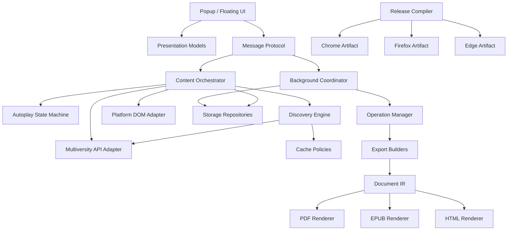

# 17 — Cosa rifaremmo diversamente oggi?

## Una retrospettiva senza senno di poi

> **Snapshot di riferimento del capitolo**  
> Questo capitolo chiude il libro sul candidato **PlumePilot 2.35.2**, branch `feat/ui-ux-2.35.2`, commit  
> `f6fcb4c29c83ba9150df0be31da04fc91dffb634`.

Arrivati alla fine di un progetto reale è molto facile guardare indietro e dire:

```text
questo file è troppo grande
questa API interna è troppo implicita
qui sarebbe servito un modulo
lì avremmo dovuto usare un framework
```

Il problema è che questa valutazione conosce già il futuro.

Quando PlumePilot era più piccolo non sapevamo ancora che avrebbe avuto:

```text
tre università
Chrome + Edge + Firefox
popup + floating menu
PDF + HTML + EPUB
editor rich-text offline
autoplay con più policy
commission monitor
achievement e Gaming UI
release build specifiche per browser
```

Un'architettura ottima per un progetto di tre file può essere una pessima architettura per un progetto di cinquanta feature.

Ma vale anche il contrario:

> **Progettare fin dal primo giorno come se il progetto fosse già enorme può essere un'altra forma di errore.**

Questo capitolo non vuole quindi rispondere:

```text
“qual era l'architettura perfetta?”
```

Vuole rispondere a una domanda più utile:

> **Ora che conosciamo davvero la forma del problema, quali decisioni prenderemmo diversamente se dovessimo continuare a far crescere PlumePilot?**

---

# Parte I — Prima distinzione: debito non significa errore

## 1. Quattro categorie diverse

Quando riguardiamo una decisione passata possiamo classificarla come:

```text
errore
trade-off
scaling debt
decisione ancora corretta
```

Sono categorie molto diverse.

---

## 2. Errore

Una decisione era sbagliata già rispetto alle informazioni disponibili.

Esempio ipotetico:

```text
salvare un bearer token persistente senza necessità
```

Sarebbe difficile giustificarlo anche in una versione piccola.

---

## 3. Trade-off

Abbiamo scelto consapevolmente semplicità in cambio di un limite.

Esempio:

```text
vanilla JavaScript
senza bundler
```

ha ridotto toolchain, build complexity e review surface.

Non è un errore solo perché il progetto è poi cresciuto.

---

## 4. Scaling debt

Una decisione semplice era corretta quando il sistema era piccolo, ma oggi costa più di quanto faccia risparmiare.

Esempio:

```text
molta logica concentrata in content.js
```

All'inizio:

```text
un file
facile da caricare
nessun module graph
```

Oggi:

```text
più domini
più stato
più test che estraggono source slice
più rischio di coupling
```

Questa è una categoria particolarmente importante.

---

## 5. Decisione ancora corretta

Una scelta può sembrare “semplice” ma continuare a essere appropriata.

Per esempio:

```text
nessun backend proprietario necessario
```

PlumePilot opera localmente sulle piattaforme a cui l'utente è già autenticato.

Aggiungere un server solo perché “le app serie hanno un backend” aumenterebbe:

```text
privacy surface
operational cost
security obligations
failure modes
```

senza un beneficio automatico.

---

# Parte II — Evitare la riscrittura totale

## 6. La tentazione

Dopo sedici capitoli potremmo disegnare una nuova struttura elegantissima e concludere:

```text
riscriviamo tutto
```

È una tentazione pericolosa.

---

## 7. Cosa perderemmo

Il codice attuale contiene conoscenza accumulata attraverso:

```text
bug reali
layout reali
race reali
store rejection reali
fallback reali
```

Molti dettagli apparentemente strani esistono perché una condizione del mondo reale li ha resi necessari.

Una rewrite tende a ricordare:

```text
feature visibili
```

e dimenticare:

```text
edge case invisibili
```

---

## 8. Strangler approach

Una strategia più sana è:

```text
sistema esistente
      ↓
identifica boundary
      ↓
introduci modulo nuovo
      ↓
sposta responsabilità gradualmente
      ↓
rimuovi vecchio path quando non serve più
```

È simile al pattern spesso chiamato **Strangler Fig**.

Non sostituiamo tutto in una volta.

Facciamo crescere una struttura migliore attorno alle parti che hanno davvero bisogno di cambiare.

---

# Parte III — La prima cosa che cambieremmo: i confini di `content.js`

## 9. Il problema

`content.js` oggi contiene responsabilità molto diverse:

```text
DOM discovery
autoplay
API coordination
cache
material collection
first-incomplete discovery
progress tracking
recovery
```

Non è necessariamente un “God object” classico, perché molte funzioni sono ben delimitate.

Ma il file è diventato un **convergence point**.

---

## 10. Cosa faremmo oggi

Non divideremmo semplicemente il file in:

```text
content1.js
content2.js
content3.js
```

La separazione deve seguire responsabilità.

Una possibile struttura:

```text
playback/
  identity.mjs
  discovery.mjs
  autoplay-policy.mjs
  recovery.mjs

platform/
  dom-adapter.mjs
  api-adapter.mjs

cache/
  lesson-cache.mjs
  material-cache.mjs

content.js
  orchestration + browser effects
```

---

## 11. Regola

Estrarre prima ciò che ha:

```text
input chiari
output chiari
pochi side effect
```

Non partire dalle funzioni più grandi.

Partire dalle funzioni con boundary migliori.

---

# Parte IV — Functional core / imperative shell

## 12. Cosa significa

Possiamo organizzare parte del sistema così:

```text
raw state
   ↓
pure/quasi-pure decision
   ↓
command
   ↓
browser effect
```

---

## 13. Esempio first incomplete

Oggi molte fasi sono già concettualmente separabili.

Potremmo avere:

```js
const plan = chooseDiscoveryPlan({
  outline,
  masterIndex,
  verifiedComplete,
  mode,
});
```

che produce:

```js
{
  candidates: [...],
  requiresFreshData: true,
  fallbackPolicy: "visual"
}
```

Poi la shell esegue:

```text
API request
DOM open
click
```

---

## 14. Vantaggio

Possiamo testare:

```text
master stale
candidate order
ambiguous identity
```

senza caricare metà `content.js` in `node:vm`.

---

# Parte V — Ma non renderemmo tutto puro

## 15. Una browser extension vive di side effect

Dobbiamo:

```text
cliccare
osservare DOM
mandare messaggi
aprire tab
scrivere storage
creare Blob
```

Provare a nascondere tutto dietro un'astrazione puramente funzionale produrrebbe probabilmente codice più difficile da leggere.

---

## 16. Obiettivo realistico

```text
decision logic → pura quando conviene
browser interaction → esplicita
```

Non:

```text
zero side effects
```

---

# Parte VI — Seconda cosa: un vero Platform Adapter

## 17. Il problema

Nel tempo abbiamo introdotto:

```text
Pegaso
Mercatorum
UTSR / San Raffaele
```

Molto codice è comune.

Alcune differenze sono:

```text
DOM shape
platform ID
storage scoping
copy
URL patterns
```

---

## 18. Oggi formalizzeremmo prima l'adapter

Per esempio:

```js
const platform = {
  id,
  courseCodeFromUrl(),
  sections(),
  chapters(section),
  currentLesson(),
  commissionLabel(...),
};
```

Non necessariamente una classe.

Potrebbe essere un semplice oggetto di funzioni.

---

## 19. Perché

Il core dovrebbe chiedere:

```text
“qual è il capitolo corrente?”
```

non:

```text
“se siamo Pegaso cerca div.border-t,
se siamo Mercatorum usa questo fallback...”
```

---

# Parte VII — Anti-corruption layer più esplicito

## 20. Oggi esiste già implicitamente

Abbiamo normalizzatori per:

```text
master API
lesson API
commission data
DOM identities
```

Questa è già una forma di anti-corruption layer.

---

## 21. Cosa cambieremmo

Raggrupperemmo i contratti esterni in moduli dedicati:

```text
external/multiversity-api.mjs
external/course-dom.mjs
external/browser-runtime.mjs
```

Il resto del sistema consumerebbe strutture normalizzate.

---

# Parte VIII — Terza cosa: protocolli di messaging espliciti

## 22. Oggi

I messaggi hanno shape come:

```js
{
  type: "PEGASO_START_EXPORT",
  ...
}
```

Il Capitolo 2 ha mostrato che, di fatto, questi messaggi sono API interne.

---

## 23. Oggi li tratteremmo davvero come API

Una struttura possibile:

```text
protocol/
  messages.mjs
  validators.mjs
  version.mjs
```

con costanti:

```js
export const MessageType = Object.freeze({
  START_EXPORT: "PEGASO_START_EXPORT",
  CANCEL_EXPORT: "PEGASO_CANCEL_EXPORT",
  ...
});
```

---

## 24. Schema

Per messaggi critici potremmo validare:

```text
type
required fields
ID format
payload bounds
```

al boundary.

---

## 25. Perché non necessariamente JSON Schema

Potrebbe essere utile.

Ma per un protocollo interno piccolo può bastare:

```js
function parseStartExportMessage(value) {
  ...
}
```

L'obiettivo è rendere il contract esplicito, non aggiungere tecnologia per principio.

---

# Parte IX — Protocol versioning?

## 26. Non serve sempre

Content script e background vengono aggiornati normalmente insieme.

Quindi non abbiamo un distributed system con server vecchi e client nuovi per mesi.

---

## 27. Ma lifecycle diversi esistono

Durante un update possono convivere temporaneamente:

```text
page vecchia
extension runtime nuovo
```

oppure una pagina può restare aperta mentre l'estensione si aggiorna.

Per messaggi critici, un semplice:

```text
protocolVersion
```

potrebbe rendere failure più chiari in futuro.

---

# Parte X — Quarta cosa: state machine più esplicita per autoplay

## 28. Il Capitolo 7

Abbiamo visto che autoplay è già una state machine.

Ma lo stato è distribuito fra:

```text
booleans
context
stored settings
recovery markers
DOM state
```

---

## 29. Oggi introdurremmo un reducer/state transition layer

Non necessariamente XState.

Potrebbe bastare:

```js
function transition(state, event) {
  switch (state.phase) {
    ...
  }
}
```

---

## 30. State shape possibile

```js
{
  phase: "watching",
  playback: {...},
  policy: {...},
  pendingBoundary: null,
  generation: 12,
}
```

---

## 31. Eventi

```text
VIDEO_PLAY
VIDEO_ENDED
COMPLETION_CONFIRMED
TEST_FOUND
USER_NAVIGATED
POLICY_CHANGED
CANCEL
TAB_HIDDEN
```

---

## 32. Vantaggio

La precedenza fra:

```text
70%
chapter limit
test stop
auto-complete
manual selection
```

sarebbe leggibile in un unico luogo.

---

# Parte XI — Non centralizzeremmo tutto lo stato

## 33. Un Redux globale sarebbe eccessivo

PlumePilot ha contesti separati.

Un unico store globale “magico” richiederebbe comunque:

```text
messaging
serialization
lifecycle handling
```

---

## 34. Stato locale resta valido

Un buon principio è:

```text
state vicino al suo owner
```

con:

```text
protocollo esplicito quando attraversa un boundary
```

---

# Parte XII — Quinta cosa: storage repository e schema versionato

## 35. Oggi

Abbiamo wrapper:

```text
storageGet
storageSet
storageRemove
```

ma molte chiavi vengono ancora conosciute da moduli differenti.

---

## 36. Evoluzione

Potremmo avere:

```text
storage/
  preferences-repository.mjs
  operation-repository.mjs
  commission-repository.mjs
  course-state-repository.mjs
  migrations.mjs
```

---

## 37. Il caller chiederebbe

```js
await courseState.get(courseIdentity);
```

anziché conoscere direttamente:

```text
chiave
legacy key
platform prefix
migration fallback
```

---

# Parte XIII — Schema versioning

## 38. Per strutture persistenti complesse

È utile salvare:

```js
{
  version: 3,
  ...
}
```

come già facciamo in alcuni snapshot.

---

## 39. Migration pipeline

```text
v1
 ↓ migrate
v2
 ↓ migrate
v3
```

La normalizzazione legacy non resta sparsa indefinitamente nel codice di lettura.

---

# Parte XIV — Sesta cosa: cache policy comune

## 40. Oggi

Abbiamo più `Map` con policy differenti:

```text
lessonApiCache
materialLinkCache
pageLessonSnapshots
pending requests
```

La differenza è spesso giustificata.

Ma alcune regole ricorrono.

---

## 41. Policy esplicita

Per ogni cache documenteremmo:

```text
key
entry schema
freshness
max size
invalidation
monotonic fields
negative caching
owner
```

---

## 42. Non una GenericCache<T> universale

Una cache di lesson detail e una pending request registry hanno semantiche diverse.

Creare una mega-classe generica rischia di nascondere proprio ciò che ci interessa.

---

## 43. Riutilizzare primitive, non semantiche

Potremmo condividere helper per:

```text
bounded insertion
TTL check
in-flight coalescing
```

mantenendo policy di dominio separate.

---

# Parte XV — In-flight request coalescing

## 44. Miglioramento concreto

Se due caller chiedono contemporaneamente:

```text
same course + lesson detail
```

potremmo avere:

```text
Map<cacheKey, Promise<Response>>
```

---

## 45. Flow

```text
first caller
   ↓ miss
create request
store Promise

second caller
   ↓ hit in-flight
reuse Promise
```

Poi:

```text
finally → remove in-flight
```

---

## 46. Beneficio

Evita cache stampede senza trasformare ogni fetch in serializzazione globale.

---

# Parte XVI — Settima cosa: Discovery Engine separato

## 47. First incomplete e skip-completed condividono concetti

Entrambi ragionano su:

```text
course order
master hints
lesson details
identity
completion evidence
```

ma con policy differenti.

---

## 48. Oggi introdurremmo un engine

```text
DiscoveryEngine
```

che restituisce target logici.

---

## 49. Mode

```text
bookmark-first-incomplete
forward-incomplete-video
sequential-next
```

---

## 50. Output

```js
{
  status: "target",
  chapterIdentity,
  activityIdentity,
  evidence,
  requiresVisualVerification
}
```

---

## 51. DOM adapter dopo

Solo dopo aver scelto logicamente il target:

```text
open section
open chapter
resolve row
click
```

Questo ridurrebbe il coupling fra:

```text
search algorithm
UI navigation
```

---

# Parte XVII — Ottava cosa: una Intermediate Representation per gli export

## 52. PDF, EPUB e HTML sono pipeline diverse

Ma condividono alcuni input:

```text
course title
section/chapter order
assets
questions
metadata
```

---

## 53. IR esplicita

Potremmo normalizzare prima in:

```js
{
  course,
  sections: [
    {
      title,
      chapters: [...]
    }
  ],
  assets: [...]
}
```

Poi renderer distinti:

```text
IR → PDF
IR → EPUB
IR → HTML
```

---
## 54. Non sempre una IR unica

I test export e le dispense hanno domini diversi.

Quindi potremmo avere:

```text
CourseMaterialIR
QuizIR
```

anziché un oggetto universale enorme.

---

# Parte XVIII — Nona cosa: worker per CPU-heavy export?

## 55. Potenziale miglioramento

Alcune fasi EPUB/PDF consumano:

```text
CPU
canvas
compression
hash
```

Spostare parte del lavoro in un Worker potrebbe ridurre il main-thread blocking.

---

## 56. Ma non è automaticamente più veloce

Worker introduce:

```text
message passing
structured clone / transfer
worker lifecycle
library compatibility
memory duplication se trasferiamo male
```

---

## 57. Prima misurare

Dal Capitolo 12:

```text
profiling first
```

Se il problema reale è:

```text
peak memory
```

un Worker potrebbe persino peggiorarlo se duplica buffer.

---

## 58. Transferable

Se usassimo Worker, dovremmo progettare ownership esplicita di:

```text
ArrayBuffer
```

tramite transferable quando appropriato.

---

# Parte XIX — Decima cosa: rich-text editor con command model più moderno

## 59. Oggi

L'editor usa pragmaticamente:

```text
execCommand
DOM manipulation
Selection
Range
```

Funziona e conserva bene alcune undo semantics.

---

## 60. Debito futuro

`execCommand()` è deprecato.

Se l'editor continuasse a crescere, investiremmo in un command model esplicito.

---

## 61. Command

```text
ToggleBold
ApplyHighlight
InsertChecklist
WrapCallout
ExitBlock
ClearFormat
```

Ogni command definisce:

```text
precondition
DOM transform
selection restoration
undo semantics
```

---

## 62. Input Events

Studieremmo più a fondo:

```text
beforeinput
inputType
Selection API
```

per ridurre dipendenza da comandi legacy.

---

# Parte XX — Ma non costruiremmo Google Docs

## 63. Scope

L'editor serve per:

```text
appunti di studio offline
```

Non per collaborazione realtime, track changes o layout editoriale complesso.

---

## 64. Quindi

Non adotteremmo automaticamente:

```text
ProseMirror
Slate
Lexical
```

solo perché sono potenti.

Il costo deve essere giustificato dallo scope.

---

# Parte XXI — Undicesima cosa: shared UI primitives più formali

## 65. La 2.35.2 ha già iniziato

`menu-ux.js` e `menu-ux.css` condividono:

```text
presentation model
style roles
layout rules
```

---

## 66. Passo successivo

Potremmo formalizzare primitive come:

```text
Disclosure
SettingsGroup
ActionRow
StatusBanner
OperationControl
TabController
```

---

## 67. Ma senza framework obbligatorio

Vanilla DOM factory:

```js
function createSettingsGroup({...}) {
  ...
}
```

può essere sufficiente.

---

# Parte XXII — React?

## 68. La domanda inevitabile

Con UI più grande potremmo chiedere:

```text
“non sarebbe meglio React?”
```

La risposta corretta non è sì o no in assoluto.

---

## 69. Cosa risolverebbe

Potrebbe aiutare con:

```text
component composition
render derivato dallo state
shared UI primitives
conditional rendering
```

---

## 70. Cosa introdurrebbe

```text
bundler
runtime/library weight
build transforms
source maps
review complexity
migration cost
```

oltre a non risolvere automaticamente:

```text
extension messaging
DOM host integration
API reverse engineering
browser packaging
```

---

## 71. Decisione oggi

Per la scala attuale, probabilmente **non riscriveremmo la UI in React**.

Estrarremmo prima:

```text
view models
DOM helpers
shared controllers
```

Se poi la UI diventasse molto più complessa, rivaluteremmo con dati reali.

---

# Parte XXIII — TypeScript?

## 72. Qui la risposta è più favorevole, ma graduale

Molti bug potenziali riguardano shape:

```text
message
API response
cache entry
operation
layout config
```

Type information avrebbe valore.

---

## 73. Ma una migrazione totale non è necessaria

Potremmo partire da:

```text
JSDoc
// @ts-check
```

su moduli nuovi.

---

## 74. Esempio

```js
/**
 * @typedef {Object} PlaybackTarget
 * @property {"target"|"end"|"fallback"} status
 * @property {ChapterIdentity=} chapter
 */
```

L'editor/TypeScript language service può trovare molte inconsistenze senza cambiare runtime.

---

# Parte XXIV — Type checking ai boundary

## 75. Priorità

Prima tipizzeremmo:

```text
message protocol
normalized API models
storage records
operation state
```

perché sono boundary dove una shape errata ha effetto ampio.

---

## 76. Non tipizzare CSS class string per sport

Il valore di un type system è maggiore dove:

```text
il dominio è strutturato
```

non dove aggiunge solo annotazioni meccaniche.

---

# Parte XXV — Dodicesima cosa: test runner unico

## 77. Dal Capitolo 14

Oggi i test sono molti file `.mjs` indipendenti.

Funziona.

Ma è facile dimenticarne uno.

---

## 78. Introduzione semplice

```text
scripts/test-all.mjs
```

che:

```text
enumera suite
esegue in ordine stabile
riassume fallimenti
```

---

## 79. Categorie

```text
test:fast
test:browser
test:release
```

anche senza aggiungere dipendenze npm.

---

# Parte XXVI — Tredicesima cosa: CI

## 80. Oggi avrebbe ROI positivo

PlumePilot ha ormai abbastanza invarianti da giustificare una CI minima.

Per ogni PR:

```text
Node regression suite
static/source invariants
basic release consistency
```

---

## 81. Browser check

Potrebbe girare:

```text
su PR UI
nightly
pre-release
```

se il costo è maggiore.

---

## 82. Release job

Su tag/candidate:

```text
build 3 target
validate
publish checksums/artifacts
```

potrebbe essere automatizzato.

---

# Parte XXVII — Ma non automatizzeremmo la decisione di pubblicare

## 83. Store release

Per un progetto piccolo, un gate umano prima di:

```text
submit/publish
```

resta utile.

Specialmente quando cambiano:

```text
permissions
review notes
screenshots
UX
```

---

# Parte XXVIII — Quattordicesima cosa: browser E2E target-specific

## 84. Priorità future

Aggiungeremmo alcuni E2E ad alto valore:

```text
popup ↔ storage sync
floating ↔ storage sync
service worker restart
operation recovery
builder handoff
Firefox target package load
```

---

## 85. Pochi, non centinaia

Gli E2E sono costosi.

Devono proteggere boundary che i test Node non possono rappresentare bene.

---

# Parte XXIX — Quindicesima cosa: fixture API versionate

## 86. Oggi molte suite costruiscono dati sintetici

È ottimo per property test.

Ma potremmo anche mantenere alcune response reali **sanitizzate**:

```text
master
lesson detail
commission
```

---

## 87. Beneficio

Quando aggiorniamo normalizzatori possiamo verificare:

```text
shape reale storica
```

oltre a input sintetici.

---

# Parte XXX — Privacy prima di fixture

## 88. Mai committare raw payload privati

Le fixture devono rimuovere:

```text
token
utente
email
ID sensibili
contenuti non necessari
```

---

# Parte XXXI — Sedicesima cosa: structured diagnostics

## 89. Oggi

Abbiamo log e alcuni `diagnostics` object.

---

## 90. Potremmo standardizzare

```js
{
  event: "playback.discovery.target",
  courseCode,
  lessonNumber,
  source: "master+detail",
  elapsedMs,
}
```

---

## 91. Non telemetria remota

Structured diagnostics può restare:

```text
locale
opt-in/debug-only
```

Non serve creare un analytics backend.

---

## 92. Beneficio

Più facile:

```text
filtrare
confrontare timeline
scrivere test
```

rispetto a stringhe libere.

---

# Parte XXXII — Diciassettesima cosa: operation model più generale

## 93. Background operations

Oggi esiste già un modello:

```text
kind
phase
operationId
sourceTabId
builderTabId
```

È uno dei nuclei architetturali migliori del progetto.

---

## 94. Lo formalizzeremmo

Come un piccolo state machine/repository:

```text
idle
acquired
collecting
building
completed
cancelled
failed
```

---

## 95. Unificare senza appiattire

PDF materials, EPUB e tests possono condividere:

```text
ownership
cancellation
lifecycle
```

ma non per forza la stessa pipeline di contenuto.

---

# Parte XXXIII — Diciottesima cosa: cancellation come capability comune

## 96. Oggi è presente in molte pipeline

Ma introdurremmo un helper coerente:

```js
function createOperationContext({ signal, operationId, report }) {
  ...
}
```

---

## 97. Ogni stage riceve

```text
signal
progress reporter
identity
```

senza rileggere global state se non necessario.

---

# Parte XXXIV — Diciannovesima cosa: timeout/deadline abstraction

## 98. Oggi abbiamo molti timeout specifici

Questo è corretto.

Ma alcune operazioni ripetono:

```text
start time
loop
sleep
abort
hidden-tab compensation
```

---

## 99. Potremmo estrarre primitive

```text
waitUntil
withDeadline
retryWithBackoff
```

con policy passata dal caller.

---

## 100. Evitare `sleep()` generico come soluzione universale

L'helper non deve incoraggiare:

```text
attendi 2s e spera
```

Deve favorire:

```text
attendi condizione entro deadline
```

---

# Parte XXXV — Ventesima cosa: architecture decision records

## 101. Perché oggi servirebbero

Molte decisioni non sono ovvie dal codice:

```text
perché no backend?
perché Firefox vendor transform?
perché normal autoplay non salta completati?
perché master è solo hint?
perché popup e floating restano controller separati?
```

---

## 102. ADR piccolo

Un file:

```text
docs/adr/0007-master-index-is-a-hint.md
```

potrebbe contenere:

```text
context
decision
consequences
alternatives
```

---

## 103. Non documentare ogni `if`

ADR va usato per decisioni:

```text
costose da cambiare
non ovvie
cross-cutting
```

---

# Parte XXXVI — Ventunesima cosa: una mappa architetturale mantenuta

## 104. Questo libro è molto più grande del necessario per il repo

Non useremmo il libro stesso come unica architettura documentation operativa.

---

## 105. Un documento breve

```text
ARCHITECTURE.md
```

con:

```text
contexts
message flows
state ownership
external boundaries
release build
```

sarebbe sufficiente per orientarsi.

---

# Parte XXXVII — Cosa NON cambieremmo: local-first

## 106. Nessun backend PlumePilot

È ancora una scelta forte.

I dati necessari restano principalmente:

```text
nel browser
nella piattaforma universitaria
nei file generati localmente
```

---

## 107. Benefici

```text
privacy
zero account PlumePilot
zero server uptime
zero database migration
zero central data retention
```

---

## 108. Quando rivalutare

Solo se una feature richiedesse davvero:

```text
sync cross-device
collaboration
server-side processing
```

con valore sufficiente a giustificare il costo.

---

# Parte XXXVIII — Cosa NON cambieremmo: usare l'API dell'host quando serve

## 109. DOM-only sarebbe più fragile

La combinazione:

```text
API evidence
+
DOM interaction
```

è una delle architetture più importanti del progetto.

---

## 110. Continueremmo a trattare l'API come external contract fragile

Quindi:

```text
normalizer
fallback
validation
```

restano necessari.

---

# Parte XXXIX — Cosa NON cambieremmo: master come indice

## 111. La soluzione 2.35.1 è concettualmente solida

```text
cheap coarse signal
→ narrow search
→ detailed verification
```

È un pattern generale efficiente.

---

## 112. Non torneremmo a global scan

La refactor futura dovrebbe preservare questa semantica anche se cambia il codice.

---

# Parte XL — Cosa NON cambieremmo: fail-closed sulle azioni rischiose

## 113. Se identity è ambigua

```text
non saltare
```

---

## 114. Se build transform non corrisponde

```text
non produrre artifact
```

---

## 115. Se completion non è provata

```text
non dichiarare tutto completo
```

Questo principio deve sopravvivere a qualsiasi refactor.

---

# Parte XLI — Cosa NON cambieremmo: user control

## 116. Autoplay non deve diventare autopilota incontrollabile

Preferenze come:

```text
stop test
skip completed
70%
chapter limit
```

rendono l'automazione una policy scelta dall'utente.

---

## 117. Manual action wins

Una selezione manuale dell'utente deve continuare ad avere precedenza su timer/recovery automatici.

È una regola UX e di concurrency insieme.

---

# Parte XLII — Cosa NON cambieremmo: nessun raw `video.play()`

## 118. La piattaforma deve rimanere owner del player

PlumePilot orchestra la navigazione.

Non cerca di sostituire il playback engine dell'LMS.

---

## 119. Boundary corretto

```text
PlumePilot → seleziona attività
LMS → gestisce playback/sessione
```

Questo limita il coupling.

---

# Parte XLIII — Cosa NON cambieremmo: browser-specific build

## 120. Un unico ZIP “universale” non è automaticamente migliore

Oggi sappiamo che:

```text
Firefox manifest
Edge locales
Chromium offscreen
AMO review transforms
```

sono differenze reali.

---

## 121. Continueremmo a specializzare in build

Possibilmente con test/CI migliori.

---

# Parte XLIV — Cosa NON cambieremmo: readable vendor + deterministic transforms

## 122. È un investimento che ha valore

Non solo per gli store.

Anche per:

```text
provenance
debug
supply-chain awareness
```

---

# Parte XLV — Cosa NON cambieremmo: niente remote executable code

## 123. L'estensione può recuperare dati

Ma la sua logica deve rimanere:

```text
nel package
```

Questo semplifica:

```text
security
review
reproducibility
```

---

# Parte XLVI — Cosa NON cambieremmo: vanilla prima di framework

## 124. La lezione non è “vanilla sempre”

È:
> **Usa la complessità minima che risolve il problema corrente.**

---

## 125. All'inizio

Vanilla JavaScript era una scelta eccellente.

Oggi il progetto può introdurre più struttura senza dover cambiare paradigma completamente.

---

# Parte XLVII — Cosa NON cambieremmo: test nati dai bug

## 126. La suite è imperfetta

Ma contiene conoscenza preziosa.

Un refactor deve:

```text
migliorare la test architecture
```

senza perdere:

```text
regression knowledge
```

---

# Parte XLVIII — Refactor priority matrix

## 127. Non tutto insieme

Classifichiamo per:

```text
beneficio
rischio
costo
```

---

## 128. Priorità alta, rischio basso/medio

```text
test runner unico
CI fast suite
ARCHITECTURE.md
ADR per decisioni principali
JSDoc/@ts-check sui nuovi boundary
message type constants/validators
estrazione di pure helpers
```

---

## 129. Priorità alta, rischio medio

```text
Discovery Engine
Platform/DOM Adapter
storage repositories
explicit autoplay state transitions
operation state model
```

---

## 130. Priorità media

```text
export IR
worker experimentation
structured diagnostics
fixture API sanitizzate
browser E2E più ampi
```

---

## 131. Priorità condizionale

```text
full TypeScript migration
framework UI
bundler generale
backend
```

Solo se nuove esigenze lo giustificano.

---

# Parte XLIX — Una roadmap incrementale

## 132. Fase A — Proteggere prima di spostare

Prima di un refactor grande:

```text
run all regression tests
aggiungi test mancanti sul boundary
```

---

## 133. Fase B — Estrarre logica pura

Per esempio:

```text
identity
candidate ordering
presentation model
storage key normalization
```

---

## 134. Fase C — Definire adapter

```text
platform DOM
API
storage
browser runtime
```

---

## 135. Fase D — Ridurre `content.js`

Lasciandogli principalmente:

```text
orchestration
event listeners
side effects
```

---

## 136. Fase E — Browser E2E

Dopo aver creato boundary più stabili.

---

# Parte L — Target architecture possibile

## 137. Una mappa



---

# Parte LI — Cosa guadagniamo

## 138. Più località

Un bug di route mapping vive in:

```text
Discovery Engine / identity
```

non in un file da migliaia di righe.

---

## 139. Più testabilità

Possiamo importare moduli direttamente.

---

## 140. Più ownership

Ogni stato ha un owner più evidente.

---

## 141. Più sostituibilità

Se Mercatorum cambia DOM:

```text
adapter
```

non discovery core.

---

# Parte LII — Cosa perdiamo

## 142. Più file

La navigazione del codebase diventa più complessa.

---

## 143. Import graph

Dobbiamo gestire ordine/caricamento/module support.

---

## 144. Più astrazioni

Un nuovo contributor può dover capire:

```text
adapter
repository
state machine
```

prima di cambiare una riga.

---

## 145. Quindi

La modularità non è gratis.

La adottiamo perché oggi la complessità del dominio la giustifica.

---

# Parte LIII — Evitare architecture astronautics

## 146. Segnale di pericolo

Se introduciamo:

```text
IPlaybackDiscoveryProviderFactory
AbstractCourseRepositoryAdapter
```

per chiamare una funzione che ha due implementazioni, potremmo essere andati troppo oltre.

---

## 147. Preferire forme JavaScript semplici

```text
function
plain object
Map
module export
```

finché bastano.

---

# Parte LIV — La migliore astrazione spesso arriva dopo due casi

## 148. Uno solo

Non sappiamo ancora cosa è accidentale e cosa è comune.

---

## 149. Due/tre casi

Possiamo vedere il pattern.

La 2.35.2 `menu-ux` è nata dopo che popup e floating menu avevano davvero mostrato drift.

È un buon esempio di astrazione introdotta al momento giusto.

---

# Parte LV — Rule of three, non dogma

## 150. Aspettare sempre tre duplicazioni può essere tardi

Se il rischio è alto:

```text
security
storage corruption
message protocol
```

può valere la pena astrarre prima.

---

# Parte LVI — TypeScript vs runtime validation

## 151. TypeScript non valida dati esterni a runtime

Anche con:

```ts
interface LessonResponse { ... }
```

l'API può restituire:

```text
qualunque JSON
```

---

## 152. Servono entrambi

```text
static type
+
runtime normalizer
```

Il primo protegge il nostro codice.

Il secondo protegge il boundary esterno.

---

# Parte LVII — Framework vs architecture

## 153. Un framework non crea boundary automaticamente

Possiamo avere:

```text
React spaghetti
```

come:

```text
vanilla spaghetti
```

---

## 154. Prima domanda

Non:

```text
“quale framework?”
```

ma:

```text
“quali responsabilità e state ownership?”
```

---

# Parte LVIII — Backend developer lesson

## 155. Molti concetti erano già familiari, con altri nomi

```text
browser message → internal RPC
chrome.storage → local persistence
DOM adapter → external integration adapter
master API → index
content script → edge worker/client agent
release ZIP → deployment artifact
```

---

## 156. La differenza principale

Nel browser:

```text
lifetime
DOM volatility
user interaction
render timing
```

sono molto più centrali.

---

# Parte LIX — Cosa questo progetto insegna sul frontend

## 157. Frontend non è solo rendering

PlumePilot mostra:

```text
state consistency
async orchestration
protocol design
resource management
recovery
```

esattamente come backend systems.

---

## 158. In più

Dobbiamo convivere con:

```text
focus
selection
layout
user timing
visibility
DOM lifecycle
```

che aggiungono nuove dimensioni.

---

# Parte LX — Cosa questo progetto insegna sul backend

## 159. Il client può essere un distributed system in miniatura

Abbiamo:

```text
più contexts
messaggi
persistenza
retry
timeout
leases
idempotence
```

senza un server nostro.

---

# Parte LXI — Cosa questo progetto insegna sulle estensioni

## 160. L'host non è nostro

Questo cambia tutto.

Non controlliamo:

```text
DOM
API
release LMS
timing
session
```

---

## 161. Quindi robustezza = adattamento

Un'estensione sana assume che il boundary esterno possa cambiare.

---

# Parte LXII — Cosa questo progetto insegna sul reverse engineering

## 162. Osservare prima di imitare

Capire:

```text
request
response
identity
session
```

prima di scrivere automazione.

---

## 163. Non usare una API privata come se fosse nostra

Normalizzare, verificare, fallback.

---

# Parte LXIII — Cosa questo progetto insegna sulle performance

## 164. Big-O non basta

Nel browser il costo reale include:

```text
network
render
canvas
GC
main-thread responsiveness
```

---

## 165. Ottimizzare il lavoro evitato

Spesso il miglior guadagno è:

```text
non aprire capitolo
non rifare fetch
non rasterizzare pagina
non duplicare asset
```

---

# Parte LXIV — Cosa questo progetto insegna sui test

## 166. Il bug migliore è quello che diventa property

```text
closed accordion
→ logical identity survives DOM reconstruction
```

Questo è molto più prezioso del fix locale.

---

# Parte LXV — Cosa questo progetto insegna su Git

## 167. Contenuto e storia sono assi diversi

Il caso 2.35.2:

```text
same tree
new parent
new commit
```

lo dimostra in modo quasi didatticamente perfetto.

---

# Parte LXVI — Cosa questo progetto insegna sulle release

## 168. Il prodotto non è il repository

È:

```text
artifact
+
store metadata
+
review
+
update path
```

---

# Parte LXVII — La domanda più importante per ogni nuova feature

## 169. Prima del codice

Chiediamo:

```text
chi possiede lo stato?
qual è l'identità stabile?
qual è la source of truth?
quali boundary attraversiamo?
cosa succede se fallisce?
come cancelliamo?
come testiamo?
```

---

## 170. Se non sappiamo rispondere

Non significa che dobbiamo bloccare lo sviluppo.

Ma sappiamo dove probabilmente nascerà il prossimo debito.

---

# Parte LXVIII — Architecture fitness questions

## 171. Per ogni subsystem

Possiamo usare una scorecard:

| Domanda | Risposta desiderata |
|---|---|
| Owner dello stato? | Uno chiaro |
| Identity? | Stabile e composita quando serve |
| Authority? | Esplicita |
| Lifetime? | Coerente con storage |
| Unknown? | Rappresentabile |
| Side effect? | Protetto da guard/revalidation |
| Cancellation? | Definita |
| Failure? | Classificata |
| Fallback? | Sicuro |
| Test? | Property verificabile |
| Boundary? | Normalizzato |
| Observability? | Sufficiente |

---

# Parte LXIX — Se ripartissimo domani: bootstrap iniziale

## 172. Repository

Fin dal primo giorno prepareremmo:

```text
src/
tests/
scripts/
docs/
```

ma senza creare decine di directory vuote.

---

## 173. Context modules

```text
background/
content/
popup/
shared/
```

prima divisione naturale.

---

## 174. Messaging

Un file shared per tipi/validator.

---

## 175. Storage

Wrapper + chiavi/schema in un punto.

---

## 176. Test

Un runner dal primo regression bug, non necessariamente dal primo commit.

---

## 177. Build

Browser-specific appena il secondo browser rende reale la differenza.

---

# Parte LXX — Cosa NON prepareremmo dal giorno uno

## 178. Non creeremmo subito

```text
microfrontend
state management framework
plugin architecture interna
dependency injection container
ORM per chrome.storage
generic event bus
```

senza un problema concreto.

---

# Parte LXXI — Architecture is discovered

## 179. Una parte dell'architettura viene progettata

```text
messaging
storage boundary
release build
```

---

## 180. Una parte viene scoperta

Solo dopo aver incontrato:

```text
closed accordion
stale master
multi-platform identity
store review
```

abbiamo capito alcune proprietà fondamentali.

---

## 181. Questo non è fallimento

È normale nei sistemi che integrano ambienti esterni non controllati.

La qualità sta nella velocità con cui trasformiamo esperienza in struttura.

---

# Parte LXXII — Il vero technical debt

## 182. Non è “codice brutto”

Technical debt è costo futuro creato da una scelta corrente.

Può essere consapevole o accidentale.

---

## 183. Esempio consapevole

```text
source slicing nei test
```

ha permesso di aggiungere regression test rapidamente.

Oggi sappiamo che alcuni moduli meritano export espliciti.

Quella scelta ha generato valore prima di generare costo.

---

# Parte LXXIII — Debt interest

## 184. Come sappiamo che è ora di pagarlo?

Quando vediamo ripetutamente:

```text
stesso bug class
stesso workaround
stessa difficoltà test
stessa modifica in più superfici
```

L'interesse è diventato visibile.

---

# Parte LXXIV — UI 2.35.2 come debt payment

## 185. Popup e floating menu avevano drift

Abbiamo introdotto:

```text
menu-ux.js
menu-ux.css
```

non perché duplicazione sia sempre male.

Perché il costo delle divergenze era diventato reale.

---

# Parte LXXV — Master-guided discovery come debt payment

## 186. Il global scan funzionava

Ma costava:

```text
DOM transitions
latenza
fragilità
```

Quando la scala del corso ha reso il costo visibile, abbiamo introdotto l'indice.

---

# Parte LXXVI — Firefox build come debt payment

## 187. All'inizio un package quasi comune era sufficiente

Poi le differenze di review/runtime sono diventate concrete.

La build specifica è arrivata quando esisteva un problema reale da risolvere.

---

# Parte LXXVII — Overengineering debt

## 188. Anche troppa architettura crea debito

Ogni abstraction:

```text
va imparata
testata
mantenuta
migrata
```

---

## 189. Una abstraction sbagliata può essere più costosa della duplicazione

Per questo:

```text
preferire duplication over wrong abstraction
```

può essere una buona scelta temporanea.

---

# Parte LXXVIII — Decision reversal cost

## 190. Prima di scegliere una tecnologia

Chiediamo:

```text
quanto costa cambiarla più avanti?
```

---

## 191. Decisione facilmente reversibile

```text
helper locale
CSS token
```

Possiamo sperimentare.

---

## 192. Decisione difficile

```text
backend centralizzato
framework UI completo
storage schema irreversibile
remote account system
```

Richiede più evidenza.

---

# Parte LXXIX — One-way vs two-way doors

## 193. Modello utile

### Two-way door

Facile tornare indietro.

### One-way-ish door

Costo alto per invertire.

---

## 194. PlumePilot

Prima di una one-way-ish decision chiediamo più dati.

Questo aiuta a evitare architettura prematura.

---

# Parte LXXX — Se dovessimo scegliere tre refactor soltanto

## 195. Primo

**Discovery Engine + Platform Adapter**.

Perché riduce coupling nella parte più delicata:

```text
API + DOM + identity + autoplay
```

---

## 196. Secondo

**Message contracts + operation/state models espliciti**.

Perché i contesti sono l'architettura fondamentale dell'estensione.

---

## 197. Terzo

**Test runner + CI + moduli importabili**.

Perché rende più sicuri tutti i refactor successivi.

---

# Parte LXXXI — Se dovessimo scegliere una cosa da NON fare

## 198. Rewrite completa

Non la farei.

---

## 199. Perché

PlumePilot oggi ha:

```text
feature funzionanti
store approval history
regression knowledge
multi-platform support
```

Una rewrite rimetterebbe tutto contemporaneamente in stato non provato.

---

# Parte LXXXII — Esercizio 1

Hai una funzione di 400 righe.

Quando è meglio:

```text
split meccanico
```

e quando:

```text
estrazione per responsibility
```

?

---

# Parte LXXXIII — Esercizio 2
Disegna un `PlaybackTarget` normalizzato che possa rappresentare:

```text
video
obiettivo
test
unknown visual fallback
```

senza esporre direttamente un DOM node.

---

# Parte LXXXIV — Esercizio 3

Quali campi metteresti in un `OperationState` comune a:

```text
PDF
EPUB
quiz export
```

?

Quali invece lasceresti specifici del job?

---

# Parte LXXXV — Esercizio 4

Immagina di migrare `content.js` a moduli.

Quale funzione estrarresti per prima?

Scegline una con:

```text
input/output chiari
pochi global
alta copertura test
```

---

# Parte LXXXVI — Esercizio 5

Vale la pena introdurre React se:

```text
popup ha 5 tab
floating menu simile
ma gran parte della complessità è messaging/DOM host?
```

Scrivi pro/contro prima di rispondere.

---

# Parte LXXXVII — Esercizio 6

Una API host cambia field name.

Dove dovrebbe rompersi idealmente?

```text
UI
business logic
normalizer boundary
```

Perché?

---

# Parte LXXXVIII — Esercizio 7

Hai tre cache con TTL diversi.

Conviene una classe generica `Cache`?

Elenca quali semantiche devono essere realmente condivise prima di astrarre.

---

# Parte LXXXIX — Esercizio 8

Vuoi spostare EPUB conversion in Worker.

Quali metriche raccogli prima?

```text
main-thread blocking
peak memory
transfer bytes
wall time
cancellation latency
```

---

# Parte XC — Concetti finali da portarsi dietro

## 200. Hindsight bias

Valutare una decisione passata usando informazioni disponibili solo successivamente.

---

## 201. Scaling debt

Scelta inizialmente adeguata che diventa costosa quando il sistema cresce.

---

## 202. Strangler refactor

Sostituzione incrementale di parti del sistema anziché rewrite totale.

---

## 203. Functional core / imperative shell

Decision logic con pochi side effect circondata da un layer che interagisce con il mondo esterno.

---

## 204. Platform adapter

Modulo che traduce differenze della piattaforma in un'interfaccia interna stabile.

---

## 205. Repository pattern

Boundary che centralizza accesso e schema della persistenza.

---

## 206. Intermediate Representation

Modello intermedio normalizzato usato fra acquisizione dati e renderer/trasformazioni.

---

## 207. In-flight coalescing

Riutilizzo della stessa Promise/request per richieste concorrenti equivalenti.

---

## 208. Structured diagnostics

Eventi diagnostici rappresentati come dati strutturati invece di sole stringhe libere.

---

## 209. ADR

Architecture Decision Record: breve documento che conserva contesto, decisione e conseguenze di una scelta architetturale.

---

## 210. Decision reversal cost

Costo necessario per invertire una decisione tecnica dopo che il sistema vi ha costruito sopra.

---

## 211. Wrong abstraction

Astrazione introdotta prima di comprendere correttamente ciò che è realmente comune.

---

# Parte XCI — Ulteriori letture

## 212. Architecture Decision Records

AWS Prescriptive Guidance:

https://docs.aws.amazon.com/prescriptive-guidance/latest/architectural-decision-records/adr-process.html

---

## 213. Strangler Fig Application

Martin Fowler:

https://martinfowler.com/bliki/StranglerFigApplication.html

---

## 214. Type checking per JavaScript

TypeScript Handbook:

https://www.typescriptlang.org/docs/handbook/type-checking-javascript-files.html

---

## 215. Input Events

W3C:

https://www.w3.org/TR/input-events-2/

---

# Parte XCII — La risposta finale

Se oggi iniziassimo PlumePilot sapendo tutto quello che sappiamo ora, costruiremmo una struttura più modulare.

Probabilmente avremmo prima:

```text
message contracts
platform adapter
storage repositories
discovery engine
explicit state transitions
```

E avremmo test importabili più facilmente.

Ma questa non è la parte più importante della risposta.

La parte importante è capire **perché non avevamo quella struttura all'inizio**.

Non conoscevamo ancora abbastanza bene il problema.

---

# Parte XCIII — Il progetto reale come processo di apprendimento

PlumePilot non è passato da:

```text
cattiva architettura
→ buona architettura
```

in un solo momento.

È passato attraverso una sequenza più realistica:

```text
problema concreto
   ↓
soluzione semplice
   ↓
uso reale
   ↓
caso limite
   ↓
nuova informazione
   ↓
refactor
   ↓
nuova invariante
```

Poi il ciclo ricomincia.

---

# Parte XCIV — Questa è forse la lezione più importante del libro

## 216. L'architettura non è il diagramma iniziale

È l'insieme di decisioni che permette al sistema di continuare a cambiare senza perdere le proprietà importanti.

---

## 217. Quindi una buona architettura non elimina il cambiamento

Lo rende:

```text
locale
comprensibile
verificabile
reversibile quando possibile
```

---

# Parte XCV — Tornando all'inizio

Nel Capitolo 0 avevamo posto una domanda:

> **Dove vive la verità?**

Dopo tutto il percorso possiamo dare una risposta più matura.

La verità non vive sempre in un unico posto.

Abbiamo:

```text
server authority
API snapshots
DOM observations
cache
storage
user intent
operation state
```

La qualità dell'architettura dipende dalla capacità di sapere:

```text
quale fonte usare
per quale decisione
con quale lifetime
con quale livello di fiducia
```

---

# Parte XCVI — Un secondo filo conduttore

Avevamo anche imparato che una browser extension non è un singolo programma.

Ora possiamo dirlo meglio:

```text
PlumePilot
=
insieme di bounded contexts locali
coordinati da protocolli
attorno a una piattaforma esterna non controllata
```

Non è una definizione formale.

Ma descrive bene il sistema.

---

# Parte XCVII — Un terzo filo conduttore: identity

Molti dei bug più difficili sono stati bug di identità:

```text
DOM node ≠ lesson
label ≠ global identity
exam_id ≠ cross-platform identity
branch history ≠ tree content
version ≠ artifact bytes
```

Una volta separata l'identità dalla rappresentazione temporanea, molti problemi diventano più semplici.

---

# Parte XCVIII — Un quarto filo conduttore: tempo

Altri bug erano bug temporali:

```text
await
render delay
hidden tab
service worker lifetime
retry
release review
```

Il tempo è parte dello stato.

Non un dettaglio esterno.

---

# Parte XCIX — Un quinto filo conduttore: boundary

Le parti più fragili sono quasi sempre ai confini:

```text
page ↔ extension
DOM ↔ logical model
API ↔ normalized model
storage ↔ state
source ↔ artifact
artifact ↔ store
```

E le architetture più riuscite del progetto rendono questi confini più espliciti.

---

# Parte C — Chiusura

Abbiamo iniziato questo libro con una browser extension che poteva sembrare semplicemente:

```text
JavaScript sopra una piattaforma universitaria
```

Abbiamo finito per incontrare:

```text
process isolation
RPC
state machines
cache algorithms
optimistic revalidation
anti-corruption layers
resource ownership
binary pipelines
rich-text editing
cross-browser compilers
artifact provenance
regression engineering
Git DAG
release state machines
```

Non perché volessimo rendere il progetto complicato.

Perché un problema reale, seguito abbastanza a lungo, porta naturalmente a concetti profondi.

---

# Parte CI — Se c'è una sola cosa da ricordare

> **Non serve progettare fin dall'inizio l'architettura finale. Serve costruire il sistema in modo che ogni nuova informazione possa diventare una decisione più esplicita, un boundary più chiaro o un'invariante verificabile.**

È questo che trasforma uno script utile in software mantenibile.

Ed è questo, più di qualsiasi libreria o pattern specifico, che vale la pena portarsi dietro da PlumePilot nel prossimo progetto.

---

# Fine

**Inside PlumePilot — Anatomia di una browser extension reale**

JavaScript, WebExtensions, DOM, API, asincronia e software engineering attraverso un progetto reale.

---

[← 16 — Lezioni architetturali](16-lezioni-architetturali.md) · [Indice](index.md)
